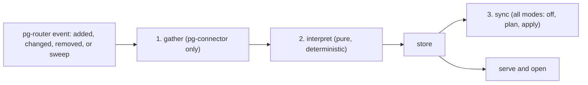

# pg-desk — the pipeline (`run`)

`pg-desk run <type> <id> --change added|changed|removed|sweep` runs the pipeline for one entity;
an absent `--change` means `sweep`.

The full design has three stages — gather, interpret, and sync — run in one process, because the
stages are strictly ordered and pg-router's own core does not sequence handlers (the design's
`pr-pool` naming predates the pg-router rename, bead `pg2-myc6y`). All three ship as of Phase 10
(docket pg2-2j5ac.34) — see [`sync.md`](sync.md) for stage 3's own full behavior.

```mermaid
flowchart LR
    EV["pg-router event: added, changed, removed, or sweep"] --> G["1. gather (pg-connector only)"]
    G --> I["2. interpret (pure, deterministic)"]
    I --> ST["store"]
    ST --> S["3. sync (all modes: off, plan, apply)"]
    ST --> SV["serve and open"]
```

`pg-desk sweep` (bead `pg2-gznpe`, see [`operator-commands.md`](operator-commands.md)) is the
bulk form of this same call: it re-runs this exact pipeline, always with `--change sweep`, once
per entity already in the store, for every entity — the operator's backfill command for a
schema/enrichment change that would otherwise reach an entity only on its own next real event.

An `issue` or `thread` event is designed to additionally re-run stage 2 for the PR it links to, so
that sync never signals from facts older than the last gather of that PR. As of Phase 10, `run
issue` for the beads backend implements this: it resolves the triggering bead to its linked PR
(see [`run-issue.md`](run-issue.md)) and re-runs interpret for it, without a fresh gather and
without re-running sync. `run issue` for Jira and `run thread` are still Phase 13, as is the
cross-reference step that would give either kind of event a linked PR — see
[`gather.md`](gather.md), [`interpret.md`](interpret.md), and [`sync.md`](sync.md).

## Exit codes

`run`'s contract to pg-router is fixed regardless of phase: it MUST exit `0` on success and on a
degraded run (see [`gather.md`](gather.md)), and `1` when the triggering entity itself could not
be fetched, the store could not be written, or the sync stage failed (see [`sync.md`](sync.md)).
A sync failure is recorded as `sync_error` (the diagnostic, kept for the dashboard) AND fails
`run`, so pg-router retries the event with its backoff and counts it in its failure metrics; a
later successful run clears `sync_error` and its retry state. Every failed run of a PR that has a
recorded `sync_error` counts one attempt toward its automatic-retry bound; which failures
`reconcile` retries, how often, and how many times is [`sync.md`](sync.md)'s "Automatic retry".
`run` MUST NEVER exit `9` or return a raw
`pg-connector` exit code.

## Telemetry and logs

`run` emits nothing over OpenTelemetry or Prometheus through Phase 10 (D24); OpenTelemetry export
is a later observability item, alongside pg-router's own metrics sink. `run` MUST log structured
JSON to stderr, which pg-router captures as the triggering scheduler. `--verbose` additionally
prints the three-stage timeline (gather, interpret, sync).

### Failure diagnosis

pg-router records a failed `run` only as "exit status 1", so a failure MUST be attributable from
`run`'s stderr alone. The exit-code contract above is unchanged; the diagnosis is additive:

- The per-entity structured line of a failed run (`"outcome":"error"`) MUST carry `stage` (which
  step failed) and `error_class` (a coarse reason). A successful or degraded run's line MUST NOT
  carry either field.
- When `run` is about to exit non-zero it MUST also write one `{"event":"run_failed", ...}` line
  with `entity_type`, `entity_id`, `change`, `stage`, `error_class` and `error`. It has no
  `outcome` key, so a consumer counting outcomes does not count a failure twice. A failure from a
  path with no stage tag (`run issue` for Jira, `run thread`) is labelled stage `run`.
- Stages are `args`, `config`, `store_open`, `resolve_bead` (the `run` command itself) and
  `gather`, `known_check`, `interpret`, `store`, `record_sync_error`, `sync`, `sync_retry_state`,
  `load_facts`, `validate_change` (the pipeline).
- Classes are `canceled`, `deadline`, `killed` (a `pg-connector` child ended by a signal),
  `store_busy` (the store was locked), `connector` (a `pg-connector` failure code) and `error`
  (anything else). They are diagnostic only: nothing branches on a class, and there is no retry
  keyed on one.

## Out of scope (Phase 9, narrowed by Phase 10)

`run issue` for Jira and `run thread` are Phase 13, as is the cross-reference step that would give
either kind of event a linked PR to re-interpret (`run issue` for the beads backend is
[`run-issue.md`](run-issue.md), not this doc). `repos[]` supports exactly one repository this
phase; multi-repository `run` is out of scope.
