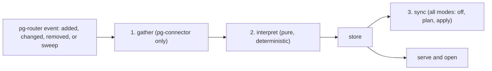

# pg-desk — the pipeline (`run`)

`pg-desk run <type> <id> --change added|changed|removed|sweep` runs the pipeline for one entity;
an absent `--change` means `sweep`.

The full design has three stages — gather, interpret, and sync — run in one process, because the
stages are strictly ordered and pg-router's own core does not sequence handlers (the design's
`pr-pool` naming predates the pg-router rename, bead `pg2-myc6y`). All three ship as of Phase 10
(docket pg2-2j5ac.34) — see [`sync.md`](sync.md) for stage 3's own full behavior.


```mermaid
flowchart LR
    EV["pg-router event: added, changed, removed, or sweep"] --> G["1. gather (pg-connector only)"]
    G --> I["2. interpret (pure, deterministic)"]
    I --> ST["store"]
    ST --> S["3. sync (all modes: off, plan, apply)"]
    ST --> SV["serve and open"]
```

`pg-desk sweep` (bead `pg2-gznpe`, see [`operator-commands.md`](operator-commands.md)) is the
bulk form of this same call: it re-runs this exact pipeline, always with `--change sweep`, once
per entity already in the store, for every entity — the operator's backfill command for a
schema/enrichment change that would otherwise reach an entity only on its own next real event.

An `issue` or `thread` event is designed to additionally re-run stage 2 for the PR it links to, so
that sync never signals from facts older than the last gather of that PR. As of Phase 10, `run
issue` for the beads backend implements this: it resolves the triggering bead to its linked PR
(see [`run-issue.md`](run-issue.md)) and re-runs interpret for it, without a fresh gather and
without re-running sync. `run issue` for Jira and `run thread` are still Phase 13, as is the
cross-reference step that would give either kind of event a linked PR — see
[`gather.md`](gather.md), [`interpret.md`](interpret.md), and [`sync.md`](sync.md).

## Exit codes

`run`'s contract to pg-router is fixed regardless of phase: it MUST exit `0` on success and on a
degraded run (see [`gather.md`](gather.md)), and `1` when the triggering entity itself could not
be fetched, the store could not be written, or the sync stage failed (see [`sync.md`](sync.md)).
A sync failure is recorded as `sync_error` (the diagnostic, kept for the dashboard) AND fails
`run`, so pg-router retries the event with its backoff and counts it in its failure metrics; a
later successful run clears `sync_error` and its retry state. Every failed run of a PR that has a
recorded `sync_error` counts one attempt toward its automatic-retry bound; which failures
`reconcile` retries, how often, and how many times is [`sync.md`](sync.md)'s "Automatic retry".
`run` MUST NEVER exit `9` or return a raw
`pg-connector` exit code.

## Telemetry and logs

`run` emits nothing over OpenTelemetry or Prometheus through Phase 10 (D24); OpenTelemetry export
is a later observability item, alongside pg-router's own metrics sink. `run` MUST log structured
JSON to stderr, which pg-router captures as the triggering scheduler. `--verbose` additionally
prints the three-stage timeline (gather, interpret, sync).

### Anchor-write log (bead `pg2-kwwn2`)

pg-router discards the stderr of a successful command-role run, so the sync stage's per-write
`pg-desk sync: anchor write ... cause=...` lines (bead `pg2-n6d8y`) MUST ALSO be appended to
`$XDG_STATE_HOME/pg-desk/anchor-write.log` (default `~/.local/state/pg-desk/anchor-write.log`,
next to `store.db`), in addition to stderr. The file MUST be created only when a line is written,
and a failure to write it MUST NOT fail or slow the run. It is bounded: a run that finds the file
at or above 4 MiB rotates it to `anchor-write.log.1` (replacing any previous one) first, so at
most two files exist. A day of causes is tallied with, for example,
`grep -h 'anchor write' ~/.local/state/pg-desk/anchor-write.log* | grep -o 'cause=[^ ]*' | sort | uniq -c`.

### Run record (bead `pg2-dpml1`)

pg-router discards the stderr of a successful command-role run and its success events carry no
change field, so the share of sweep runs that found nothing could not be measured. Every `run`
invocation for a `pr` or `issue` entity, successful or failed, MUST therefore append one JSON
record per entity it ran to `$XDG_STATE_HOME/pg-desk/run-record.log` (default
`~/.local/state/pg-desk/run-record.log`, next to `store.db`), in addition to the stderr line of the
same shape. The file follows the anchor-write log's rules: created only when a record is written, a
write failure MUST NOT fail or slow the run, and a run that finds it at or above 8 MiB rotates it to
`run-record.log.1` first. A `run issue` for a ticket with no linked PR writes one `noop` record for
the ticket; a `run issue` for a PR writes one record for that PR. A failure before the pipeline
runs (arguments, config, store open, bead resolution) writes one record with `path` `early`. `run
thread` writes no record of its own.

A record MUST carry:

- `ts`: the run's end time, RFC 3339 UTC.
- `entity_type`, `entity_id`, and, for a PR, `repo` and `pr` (the PR number).
- `change`: `added`, `changed`, `removed` or `sweep`, as passed to `run`.
- `path`: `full` (gather, interpret, store, sync), `interpret_only` (`run issue`, which neither
  gathers nor syncs) or `early`.
- `duration_ms`, `outcome` (`ok`, `degraded`, `noop`, `error`) and, on `error`, `stage`,
  `error_class` and `error`.
- `content_hash_changed`: true when the facts this run gathered differ from the facts already
  stored for the entity, ignoring every `as_of` timestamp (a re-read stamps a new one even when
  nothing changed), or when no row was stored yet. It is false on a run that never gathered
  (`interpret_only`, `early`, a failed gather).
- `anchor_written`: true when the sync stage applied an anchor bead write in this run, with
  `anchor_cause` naming it in the anchor-write log's vocabulary (`created`, `ledger-unrecorded`,
  `conflict-flip`, `pr-content-change`). It stays true on a run whose later sync step failed.

`repo` and `pr` are the join keys to the anchor-write log, whose lines carry the same `repo` and
`pr`. Two measures follow from the record alone. The no-op sweep share is the `change` `sweep`,
`path` `full`, non-`error` records whose `content_hash_changed` is false, over all such records. A
sweep catch (a change the changes feed had not reported) is a `sweep` `full` record with
`content_hash_changed` true for a PR that already had an earlier `full` record: every `full` run
stores the facts it gathered, so a `changed` or `added` run between the PR's previous record and
the sweep would already have absorbed the change and left the sweep seeing none. A bulk `pg-desk
sweep` can re-use a head-unchanged shortcut within one process, which can make
`content_hash_changed` true without a real change; measure on the router-dispatched `run` records.

```bash
# no-op share of sweep runs in the last 24h (GNU date shown; on macOS use date -v-24H)
cat ~/.local/state/pg-desk/run-record.log* | jq -s --arg since "$(date -u -d '24 hours ago' +%FT%TZ)" '
  [.[] | select(.ts >= $since and .change == "sweep" and .path == "full" and .outcome != "error")]
  | {sweeps: length, noop: (map(select(.content_hash_changed | not)) | length)}
  | . + {noop_share: (if .sweeps > 0 then .noop / .sweeps else null end)}'

# sweep catches in the last 24h: sweep runs that saw a change on a PR already seen
cat ~/.local/state/pg-desk/run-record.log* | jq -s --arg since "$(date -u -d '24 hours ago' +%FT%TZ)" '
  [.[] | select(.path == "full" and .outcome != "error" and .pr != null)] | sort_by(.ts) | group_by([.repo, .pr])
  | map(.[1:][] | select(.ts >= $since and .change == "sweep" and .content_hash_changed)) | length'
```

### Failure diagnosis

pg-router records a failed `run` only as "exit status 1", so a failure MUST be attributable from
`run`'s stderr alone. The exit-code contract above is unchanged; the diagnosis is additive:

- The per-entity structured line of a failed run (`"outcome":"error"`) MUST carry `stage` (which
  step failed) and `error_class` (a coarse reason). A successful or degraded run's line MUST NOT
  carry either field.
- When `run` is about to exit non-zero it MUST also write one `{"event":"run_failed", ...}` line
  with `entity_type`, `entity_id`, `change`, `stage`, `error_class` and `error`. It has no
  `outcome` key, so a consumer counting outcomes does not count a failure twice. A failure from a
  path with no stage tag (`run issue` for Jira, `run thread`) is labelled stage `run`.
- Stages are `args`, `config`, `store_open`, `resolve_bead` (the `run` command itself) and
  `gather`, `known_check`, `interpret`, `store`, `record_sync_error`, `sync`, `sync_retry_state`,
  `load_facts`, `validate_change` (the pipeline).
- Classes are `canceled`, `deadline`, `killed` (a `pg-connector` child ended by a signal),
  `store_busy` (the store was locked), `connector` (a `pg-connector` failure code) and `error`
  (anything else). They are diagnostic only: nothing branches on a class, and there is no retry
  keyed on one.

## Out of scope (Phase 9, narrowed by Phase 10)

`run issue` for Jira and `run thread` are Phase 13, as is the cross-reference step that would give
either kind of event a linked PR to re-interpret (`run issue` for the beads backend is
[`run-issue.md`](run-issue.md), not this doc). `repos[]` supports exactly one repository this
phase; multi-repository `run` is out of scope.
