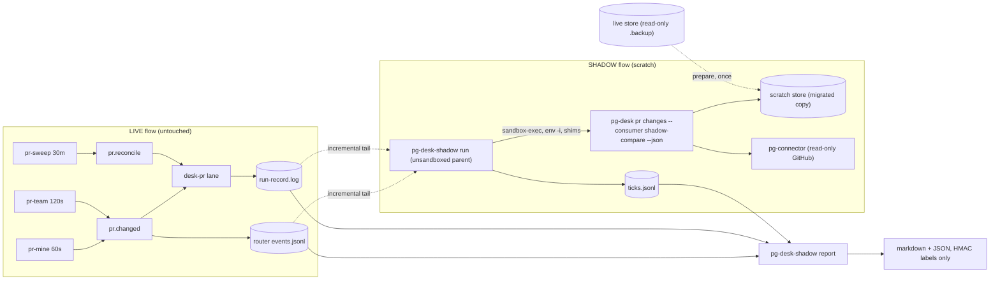

# pg-desk — shadow compare (phase A: detection)

`pg-desk-shadow` runs the new fingerprint change detection (`pg-desk pr changes`, entity change
flow, docket `pg2-x3h8c`, program epic `pg2-2j5ac.52`) IN PARALLEL with the live change flow on a
COPY of the pg-desk store, records what each side flags, and produces a comparison report. It exists
because the cutover (Phase 10, `pg2-2j5ac.52.22`) is the only planned fix for the saturated
`desk-pr` lane (`pg2-xg2k8`) and MUST NOT proceed on an unmeasured detection path. Operator
authorization (2026-10-07): run the new detection beside the live flow, on a copy of the store, with
real read-only GitHub calls at the production 60s cadence.

This document states the intended behavior of the tooling (bead `pg2-nu7h0`). The operator steps are
in [`docs/runbooks/pg-desk-shadow-compare.md`](../../runbooks/pg-desk-shadow-compare.md). The tool
lives in `packages/pg-desk-shadow`, a separate Go module, so a one-off measurement does not ship in
the `pg-desk` binary. It is generic and config-driven: it reads whatever `pg-desk` and `pg-connector`
configuration the operator already has and MUST NOT contain organization identifiers.

**Phase A scope.** Detection only, with the REMOTE re-hydration tier effectively off (see
[Warm-up](#warm-up-seeding-the-scratch-store)). Out of scope: phase B (default tiers, no seeding,
`pg2-dngh6`), the cutover, any change to the live flow, deciders or the old sync, and fixing defects
found (each gets its own bead).

## Definitions

- **LIVE-DETECTED.** A `(PR id, enqueued_at)` pair taken from a live router `pr.changed` dispatch row.
  The live detection time is the ENQUEUE time, never the dispatch time: waits behind the saturated
  lane have been 11 to 45 minutes. The row's `bead` field is a per-change event id,
  `<pr id>@<change hash>`, since per-change event ids landed (older rows and the run record carry the
  bare PR id). Every join between the live side and the shadow side, the seeded set, the queue and the
  run record MUST use the BARE PR id (everything before the first `@`); a join on the raw field never
  matches anything. Two live events are the same event only when their RAW ids and enqueue times are
  equal: two changes of one PR enqueued in the same second are two events.
- **SHADOW-DETECTED.** Every shadow item whose `origin` is `pg-connector` (the list-diff path), of ANY
  kind. A PR first seen surfaces as a bare `reconcile` with origin `pg-connector`. The PR kinds are
  `opened`, `reopened`, `closed`, `merged`, `draft_changed`, `head_changed`, `base_changed`,
  `ci_changed`, `mergeability_changed`, `review_changed`, `feedback_changed`, plus `removed` and
  `reconcile`; the new flow has no `changed` or `added` kind. Items with origin `local-reconcile` or
  `sweep` are reported SEPARATELY and are never SHADOW-DETECTED.
- **Mapping to the live `metadata.change`.** `added` is a first-observation `reconcile` with origin
  `pg-connector`; `changed` is any non-`reconcile`, non-`removed` kind; `removed` is `removed`,
  `closed` or `merged`.
- **SWEEP-CAUGHT.** A live run-record row with `change=sweep` AND `anchor_written=true`. The HEADLINE
  is `anchor_cause` `pr-content-change` plus `conflict-flip` (a mergeability change: a declared
  list-fingerprint blind spot, and exactly what `pg2-xg2k8` asks about). `created` and any other cause
  are reported separately (`created` is probably lane latency).
- **Real change (sweep-origin find).** A sweep-origin shadow item is REAL if and only if any field of
  the entity's semantic projection changed since the previous tick (below). `content_hash` is NOT
  used: a sweep hydration forces a bare `reconcile` and `entity.content_hash` is a sha256 of the whole
  facts JSON, which includes `as_of` and the whole work-beads list.
- **Semantic projection.** Per PR, read from the scratch store with `sqlite3 -readonly` and
  `json_extract` over `entity.facts`: `head_sha`, `pr_show.state`, `updated_at`, `comment_count`,
  `review_count`, `review_decision`, `checks_rollup`, `merge_state_status`, `mergeable`,
  `connections.{threads,comments,reviews}.total`, `draft`, `label_count`. Volatile fields
  (`as_of`, `age_seconds`, `served_from`) are never part of it.

## Scratch environment

`prepare` builds everything the collector runs against; it never writes outside the scratch
directory and never starts a dolt server.

- **Store.** A read-only `sqlite3 -readonly <live> ".backup <scratch>"` of the live store (the backup
  API is a consistent snapshot of a WAL database, and was verified clean against the live store on
  2026-10-07), then `pg-desk migrate --cutover` on the copy (schema 1 to 2). There is no
  `PG_DESK_STORE` variable: the store is `$XDG_STATE_HOME/pg-desk/store.db`.
- **Environment.** Every child runs under `env -i` with an ALLOWLIST: `PATH` (the scratch bin dir,
  then `/usr/bin:/bin`), `HOME` (the real home: the GitHub token lives in the login keychain, which
  macOS resolves through `HOME`; the sandbox, not `HOME`, is what stops writes), `TMPDIR`,
  `XDG_STATE_HOME`, `XDG_RUNTIME_DIR` (scratch: pg-desk consumer locks live in
  `$XDG_RUNTIME_DIR/pg-desk/locks`, else `os.TempDir()/pg-desk/locks`, where the live consumers' locks
  exist), `PG_DESK_CONFIG`, `PG_PR_CONFIG`, `BEADS_DIR` and `PG_CONNECTOR_ISSUE_BEADS_DIR` (both the configured
  beads workspace: the scratch stub in hermetic bd mode, the live one read-only in passthrough mode) and
  `BEADS_DOLT_AUTO_START=0`.
  Nothing else is inherited: the connector honours `PG_CONNECTOR_PR_GITHUB_EVENTS_FILE` and other
  overrides, so an allowlist, not a denylist.
- **pg-desk config.** A copy of the live config with `sync.mode: off`, `ticket_patterns` and the Jira
  section removed, `self_login` and `repos[0].remote` kept, `watch.pr.queries: [mine, team]` and
  `sweep.max_age: 8760h`. `repos[0].beads_dir` MUST name a beads workspace (hydration runs `issue list
--query work-beads` for every PR; without one every hydration degrades,
  `entity_change` returns Degraded, the poll aborts at the third consecutive degraded hydration, and
  nothing is detected). Two bd modes, recorded in the run manifest:
  - **hermetic (the default).** `beads_dir` is a scratch stub workspace and the `bd` shim answers
    every read verb from nothing (`list` returns an empty `{"data":[]}` envelope; the PR classifier
    ignores work beads). This is the default because the machine `bd`, even for read verbs, writes
    telemetry and a circuit-breaker file OUTSIDE the scratch tree (observed 2026-10-07: 717 sandbox
    denials in one tick, from `~/.beads/eventsData` and `/private/tmp/beads-circuit`), so passthrough
    cannot meet the zero-denial rule.
  - **passthrough.** `beads_dir` is the live workspace, used read-only through the machine `bd`. Kept for
    completeness; expect denials, which stop the run.
- **pg-connector config.** A copy of the live `pg-pr` config (a read-only nix-store symlink in the
  live tree; the per-author search split is already live, `pg2-kn9n1`) minus the Jira backend.
- **PATH and shims.** The machine `bd` (the router wrapper's bundled `bd` 1.3.1 failed against the
  shared database in `pg2-x3h8c.12`: "table not found: leases"), `gh` and `bd` logging shims in
  front. The installed `pg-connector-pr-github` and `pg-connector-ci-github-actions` are wrapper
  scripts that PREPEND the nix-store `gh` to `PATH`, which would bypass a `gh` shim; the scratch bin
  dir therefore links their UNWRAPPED binaries (`.<name>-wrapped`) and the same is done for
  `pg-desk`, whose wrapper prepends the real `pg-connector`.
- **Shim policy.** Each shim logs argv with a verdict and REJECTS anything that is not a known read.
  `gh` reads: `api` (a `GET`, or a GraphQL query: a request body containing a `mutation` is a write; a
  `POST`/`PATCH`/`PUT`/`DELETE`, or a field/input body without an explicit `GET` outside GraphQL, is a
  write), `pr view|list|status|checks|diff`, `search`, `repo view`, `run list|view`, `auth token|status`,
  `config get`, `--version`. Named write verbs rejected: `gh api -X POST|PATCH|PUT|DELETE`, `gh pr
create|merge|review|comment|edit|close|reopen|ready|lock|unlock|update-branch`, `gh issue
create|comment|edit|close|reopen|delete|lock|unlock|transfer|pin|unpin`, `gh repo create|delete|edit|fork`,
  `gh release|gist|label|workflow|secret|variable|ruleset|codespace ...` and the rest. `bd` reads:
  `list`, `show`, `ready`, `blocked`, `deps`, `dep list|tree`, `search`, `count`, `where`, `version`;
  rejected: `create`, `update`, `close`, `dep add|remove`, `comment`, `label`, `delete`, `claim`, `init`,
  `import`, `export`, `sql`, `dolt` and every other verb.
- **Sandbox.** The collector's CHILD process tree runs under macOS `sandbox-exec` with
  `(version 1)(allow default)(deny file-write*)(allow file-write* (subpath "<scratch>")
(literal "/dev/null") (literal "/dev/tty") (literal "/dev/dtracehelper") (regex #"^/dev/fd/"))`
  (without the `/dev` entries even `echo > /dev/null` fails; `/dev/dtracehelper` is a tracing device
  the macOS runtime opens for write at process start, which would otherwise drown the real denials). The PARENT collector is unsandboxed, because it must tail the live logs
  and read the live store. The sandbox does NOT block the network or `bd`/dolt writes: GitHub and
  beads write safety comes from the shims and `BEADS_DOLT_AUTO_START=0`. `sandbox-exec` is deprecated,
  so a startup self-test refuses to start if the tool is missing or a probe write outside the scratch
  directory succeeds.
- **Denial detection.** Child stderr is scanned for `Operation not permitted`, and the system log
  (`log show`, readable from a background session) is read for `Sandbox ... deny ... file-write` lines of
  the named tool processes (a denial from an unrelated sandboxed process of the same name could
  false-positive: restart the run). A denial fails the tick, is
  counted, and stops the run (a denial means a tool tried to write somewhere it must not).

## Warm-up: seeding the scratch store

A WARM-UP SIMPLIFICATION, not the treatment bead `pg2-5rb3t` weighs (phase B measures that one).
After `pg-desk migrate --cutover` every `pr` row has NULL `hydrated_at` and NULL `list_fp`, and the
sweep tier ignores `sweep.max_age` for never-hydrated rows (`remoteDueTime` returns the zero time for
an empty `hydrated_at`, and `pickOldest` ranks it first), so raising `max_age` alone does not disable
the remote tier. The live store holds about 335 `pr` rows of which about 80 can appear in the
mine/team listings: seeding only the listed ids would leave about 250 rows hydrating, which is exactly
what `pg2-x3h8c.12` hit (79 seeded, 40 `origin=sweep` hydrations).

1. **Prime.** Per watched query in config order, run `pg-connector pr list --query <q> --fingerprints
--output json` under the scratch environment (`--query` is required; exit 2 is usable). Read the
   `fingerprints` map (id to fingerprint) and `entities[].stale`; skip stale ids; an id listed by both
   queries takes the FIRST query's fingerprint.
2. **Seed** (scratch store only): set `hydrated_at` to now (RFC3339) on ALL active `pr` rows; set
   `list_fp` on every listed non-stale id (without it `diffListed` treats every listed row as changed
   and hydrates it once); set `active=0` on rows absent from both listings (otherwise about 250 closed
   rows produce a permanent stream of local-reconcile items; the watch sets start empty on a fresh
   copy, so they never become removal candidates). Intended side effect: seeding `hydrated_at` on
   version-0 rows makes the first hydration diff against the stored v1 facts instead of emitting a
   bare reconcile.
3. **Assert.** `SELECT count(*) FROM entity WHERE entity_type='pr' AND active=1 AND (hydrated_at IS
NULL OR hydrated_at='')` returns 0, and the first ticks show zero `origin=sweep` hydrations.
   Metrics EXCLUDE ticks until two consecutive ticks show zero hydrations; the warm-up window is
   reported separately.

The report MUST say that the remote tier is effectively off because `hydrated_at` is seeded and
`sweep.max_age` is 8760h, and that the local reconcile tier (`sweep.reconcile_age`, default 30m)
stays ON. `prepare --no-seed` skips steps 1 to 3 (phase B); every row carries a phase tag.

## Collector tick

- **Slots.** Wall-clock aligned 60s slots. Ticks never overlap: the collector is single-threaded, a
  tick that overruns its slot skips the missed slots (logged as an overrun, never caught up), and a
  per-scratch-directory lock refuses a second collector.
- **Bracketing.** A `tick_start` row is written and synced BEFORE `pg-desk` runs and the tick row AFTER
  it ends: the shadow cursor advances on flush, so a crash mid-tick could lose items. `tick_start`
  records the consumer cursor before the call; a start without an end is recovered at resume from the
  scratch `change_log` (rows past the recorded cursor), tagged `recovered`.
- **The call.** `pg-desk pr changes --consumer shadow-compare --json` (the full
  `pg-desk.changes/v1` envelope: `consumer`, `cursor{from,to}`, `sources[{query,status,reason}]`,
  `records[{seq,type,id,title,version,kinds,origin,at}]`; exit 0 clean, 2 partial, 3 total failure,
  the envelope emitted in all three; the cursor advances only after the flush). The collector calls
  `pg-desk` directly, not through `pg-router-source-pg-desk`, because the adapter maps exit 2 to 0,
  coalesces records per entity per poll and drops `at`, `sources` and `cursor`. The adapter is
  exercised once, in the live smoke.
- **Row.** One JSON line per tick: `phase`, `tick_start`, `tick_end`, `duration_ms`, `exit_code`
  (0, 2, 3; 1 for a usage/store error with no envelope), `items[]` (`entity_id`, `kinds`, `seq`,
  `origin`, `at`, plus the projection `fields` that changed for that entity this tick and its
  `updated_at`), `sources`, `hydrations` (the delta of the scratch store's
  `meta` key `change_flow.hydrations.pr`, which counts no-op hydrations that records alone miss),
  `graphql_cost_sum` (summed from the SCRATCH connector log rows in the tick window; a LOWER BOUND:
  a `show` row excludes its `gh pr view` metadata read and older rows lack `graphql_cost`), `builds`
  (`pg-desk`, `pg-connector` version ids), `skipped_budget`, the budget reading that decided the
  tick, and the denial and shim-reject counts.
- **Projection.** After each tick the projection is taken for every PR row and diffed against the
  previous tick's.
- **No titles.** Rows never carry titles, logins or slugs.

## Budget guard

The token is shared with the live flow. Each slot, before any call: read the NEWEST
`graphql_remaining` from the LIVE connector log (`~/.local/state/pg-connector-pr-github/events.jsonl`,
then `events.jsonl.1` after its 5 MB rotation) and the scratch log (fields `graphql_remaining`,
`graphql_reset_at`, `graphql_cost` on list/show/files/commits rows; `start` and `heartbeat` rows lack
them). Group readings by `graphql_reset_at` (mine and team have had different windows), drop readings
whose window has already reset, take the NEWEST reading of each remaining window and the MINIMUM across
windows seen in the last few minutes. When that minimum is below the FLOOR the tick is skipped (a
`skipped_budget` row, so the guard cannot deadlock on an empty scratch log: a reading whose reset has
passed is void, so the next slot after `reset+5s` proceeds). Floor = max(2,000, 1,000 +
`hydration.max_per_poll` x 12 + margin): the connector's own reserve is 1,000 and the shadow must stop
well before the live flow does; 12 points is the rough cost of one hydration. The log that supplied
each reading is recorded in the row.

## Live-side reader

Run INSIDE the collector, because the live logs are not durable. Every tick it incrementally tails
`~/.local/state/pg-router/events.jsonl`, `~/.local/state/pg-router/queue.jsonl` and
`~/.local/state/pg-desk/run-record.log` into scratch copies, tracking inode and offset.

- **Rotation and compaction.** On an inode change the rotated file (`<path>.1`, matched by inode) is
  drained from the saved offset BEFORE switching to the new file; on a size below the offset
  (copy-truncate) or an unmatched inode change (queue compaction) the offset resets to 0 behind a
  marker row and the report de-duplicates identical lines. `queue.jsonl` is compacted at router
  startup and keeps 2,048 archive records (about 8h); `run-record.log` rotates at 8 MiB to `.1`.
- **Idempotence.** The saved state records the source inode and offset AND the size of the scratch
  copy after the append; at resume the copy is truncated to that size first, so a crash between an
  append and a state write repeats the append byte for byte.
- **Normalisation.** Every timestamp is normalised to UTC at read time (`queue.jsonl` carries the
  local offset, e.g. `-04:00`, which changes on 2026-11-01).
- **Row shapes.** `events.jsonl` dispatch rows: `bead` (the per-change event id `<pr id>@<hash>`; the
  bare PR id in rows before per-change ids), `change` (`pr.changed:<id>`, with the same suffix),
  `event_type`, `enqueued_at`, `started_at`, `time`, `duration_ms`, `role`, `kind`; `event_type` and
  `enqueued_at` exist only since about 2026-10-07T11:00Z, earlier rows are unusable, and `enqueued_at`
  is the source of the real enqueue time. `queue.jsonl` rows: `op` (`enqueue|accept|evict|archive|seen`),
  `eventId` (`pr.changed:<id>`, no sequence), `type`, `at`, `expiresAt`, `enqueuedAt`,
  `payload{id,title,type,metadata{change}}`; `evict` rows carry `reason` (for example `reemit`);
  `archive` rows only `{op,eventId,type,at,accepts}`; `pr.reconcile` enqueues have `expiresAt ==
enqueuedAt`, so `queue.jsonl` is useful only as evict/coalescing evidence. Run-record rows: `ts`
  (run END, second resolution: subtract `duration_ms`), `entity_type`, `entity_id`, `repo`, `pr`,
  `path`, `change`, `content_hash_changed`, `anchor_written`, `anchor_cause`, `outcome`,
  `duration_ms`, `degraded`.

## Metrics

Tolerance `T` is the live query's own period plus the slot period plus the measured tick duration
(p90); a live detection and a shadow detection MATCH when they are within `T` of each other.

- **(a) Feed misses.** LIVE-DETECTED events with no SHADOW-DETECTED item within `T`. Each miss gets
  EXACTLY ONE class, in this order: `collector-down` (a gap, restart or unfinished tick overlaps the
  window), `copy-staleness` (the PR is absent from the seeded set or the event falls in the first
  hour after T0: added/removed in the first hour are artefacts), `skipped-budget`, `budget-exhausted`
  or `hydration-failed` (a tick in the window exited 2 with a `hydration_budget` or hydration reason),
  `blind-spot` (the entity's projection changed only in a field the list fingerprint intentionally
  cannot see: `merge_state_status`, CI detail, edited comment bodies, review threads beyond
  `totalCount`; owned by the 6h remote tier and the 30m local tier, spec 10.3 and ADR S35, or a
  local/sweep-origin item caught it), `live-only` (coalescing: a `reemit` evict of the event id,
  an evict without a dispatch, the SAME per-change event enqueued twice, a live router outage; two
  enqueues with different change hashes are two changes, not coalescing), `unexplained`. ONLY
  `unexplained` counts as failure. Events before the end of warm-up are excluded, not classed.

  A miss is "not detected within `T`". The report also states, for every missed event, whether the
  shadow flagged the same PR LATER (the first later shadow item for that PR within a late window,
  default 3 hours: it covers the longest observed sleep gap) and how long after the live enqueue. That
  delay is an UPPER BOUND, not proof the later item is the same change, and it never changes the
  class. From it the report gives two informational COVERAGE figures: matched plus later-detected over
  all in-window events, and the same share over the events not classed `collector-down` (did the
  shadow detect the change whenever it was running). Coverage is not a stop criterion; it is the
  measure to use instead of tick uptime when overrun slots are expected (the runbook's correction 10).

- **(b) Sweep-caught.** The share of SWEEP-CAUGHT rows also SHADOW-DETECTED (or caught by a
  local/sweep-origin item, counted separately), and the rate at which the live sweep catches what the
  live feed missed (a SWEEP-CAUGHT row with no live `pr.changed` within the sweep period plus `T`).
  The report first computes the baseline of each candidate signal; when `content_hash_changed` is
  true on more than 20 percent of sweep rows it states the hash signal is unusable and does not use
  it. This feeds `pg2-xg2k8` (sweep capacity).
- **(c) Shadow-only detections.** SHADOW-DETECTED items with no live `pr.changed` within `T`, with the
  kind and the projection field that triggered each (the noise rate); first-observation reconciles
  are counted apart.
- **(d) Detection delay.** Shadow-first-detect minus live `enqueued_at` per PR (relative; negative
  means the shadow was first), and from the PR's own `updated_at` where the scratch facts carry it;
  plus the late-detection delay of the missed events the shadow flagged later (see (a)).
- **(e) Cost.** Shadow tick duration p50, p90 and max against 60s; hydrations per hour; GraphQL points
  per hour p50 and max-hour (shadow spend, a lower bound); the shared-token remaining at each hour end
  against the 4,000 ceiling (5,000 limit minus the connector's 1,000 reserve).
- **(f) Ticks skipped for budget.** **(g) OPTIONAL** head SHA disagreement between the scratch store
  and the live v1 store `entity.head_sha`, read with `sqlite3 -readonly` at report time.

## Report

`pg-desk-shadow report` is idempotent and re-runnable and writes markdown plus JSON. It opens with a
DATA-QUALITY header: collector uptime (spec definition and raw), gaps by reason, the log windows
available, warm-up exclusions, the BASELINE value of every signal and the tool build ids per day (if
the stuck-hash fix `pg2-7vz6p` lands mid-run the baseline changes). PR ids in anything that leaves the
scratch directory are replaced with an HMAC label (`pr-` plus 8 hex of HMAC-SHA256 under a per-run
random key kept only in the scratch directory); no title, login, repo slug or bead id appears in a
report, a bead comment or a collector error message. `report --combine DIR...` merges the phase-tagged
ticks of several scratch directories (phase B). `report --selftest` runs the whole pipeline on
synthetic logs.

## Stop and kill criteria

COMPLETE when ALL hold: at least 2 weekdays of ticks (a weekday counts with at least 480 completed
ticks), at least 100 LIVE-DETECTED `pr.changed` events, collector uptime at least 95 percent (ticks
completed divided by slots in which the live router was up and the machine awake; `skipped_budget`
ticks count against it), AND the SWEEP-CAUGHT headline count reaches 10 or 7 days have elapsed (then
the observed rate IS the finding). KILL (unattended abort, exit 4): shadow spend above 1,500 points
per hour (default, adjustable in the runbook; reference: list spend 660 per hour at 11 strings, worst
hour 2,505 of 4,000, live non-list spend about 1,713 per hour: `pg2-x3h8c.11`), more than 10
consecutive failed ticks, any sandbox denial, or any shim-rejected write. Gaps from sleep, lid close,
reboot and router applies WILL occur: they are recorded and excluded from misses.

## Invariants

- **INV-SHADOW-1.** The collector MUST refuse to start, and every tick MUST re-verify, that
  `XDG_STATE_HOME`, `XDG_RUNTIME_DIR` and `TMPDIR` are under the scratch directory and not the live
  state, that `PG_DESK_CONFIG` and `PG_PR_CONFIG` equal the scratch copies, and that `BEADS_DIR` and
  `PG_CONNECTOR_ISSUE_BEADS_DIR` equal the configured read-only beads directory.
- **INV-SHADOW-2.** No child process MAY write outside the scratch directory: the child tree runs
  under the sandbox, and a failed start-up probe or any denial stops the run.
- **INV-SHADOW-3.** The `gh` and `bd` shims MUST reject every write verb and every verb not known to
  be a read; the smoke and the run MUST treat a rejected write as a safety failure.
- **INV-SHADOW-4.** No dolt server is started (`BEADS_DOLT_AUTO_START=0`) and no GitHub write is made.
- **INV-SHADOW-5.** Ticks never overlap and each is bracketed by a start row and an end row.
- **INV-SHADOW-6.** A resumed run uses the same scratch directory and the same consumer cursor and its
  appends are idempotent.
- **INV-SHADOW-7.** The budget guard MUST skip a tick below the floor and MUST NOT deadlock when the
  scratch log is empty or the reading's reset window has passed.
- **INV-SHADOW-8.** An identifier that leaves the scratch directory MUST be an HMAC label.
- **INV-SHADOW-9.** Only `unexplained` misses count as failure, and every miss has exactly one class.
- **INV-SHADOW-10.** `content_hash` MUST NOT be used as a change signal.

## Recorded baselines (verified 2026-10-07; the report recomputes them)

- **Run record** (`~/.local/state/pg-desk/run-record.log`), 08:55Z-20:05Z window: `change=sweep` rows
  916 in the filing snapshot, 923 at 20:05Z; `content_hash_changed` true on 879 (96 percent) in the
  filing snapshot and 884 of 923 (95.8 percent) later; the same ~92 PRs flip every sweep. Sweep rows
  that wrote an anchor: 6 (`created` 4, `conflict-flip` 1, `pr-content-change` 1). So
  `content_hash_changed` is NOT a usable "sweep caught something" signal (its own bead is
  `pg2-7vz6p`), and `entity.content_hash` is not a no-op gate either.
- **Store**: 335 `pr` rows (83 open, 220 merged, 32 closed): about 80 can appear in the mine/team
  listings. After `migrate --cutover` all 335 have NULL `hydrated_at` and NULL `list_fp` and are active
  (verified on a scratch copy).
- **Live flow**: `pr.changed` dispatch rows with `enqueued_at` started about 2026-10-07T11:00Z
  (60 rows in the first 9 hours); a `desk-pr` dispatch waited 11 to 45 minutes behind its enqueue.
- **Budget reference** (`pg2-x3h8c.11`): list spend 660 points per hour at 11 search strings
  (`graphql_cost` 1 per string), worst hour 2,505 of 4,000, live non-list spend about 1,713 per hour.

## Observed behavior of the live path (2026-10-07)

- The connector's backend deadline is 25 seconds. The `team` listing (ten search strings) takes 14 to 25
  seconds and fails with `unavailable: deadline exceeded` on roughly half of its live runs, so the
  shadow's `team` source is degraded (exit 2) on a comparable share of ticks and the `team` warm-up
  listing needs retries. Report (a) classes these misses `hydration-failed` (a failed or degraded
  source), never `unexplained`.
- A hydration (`pr show`) takes 15 to 30 seconds, so a tick that hydrates a few entities overruns the 60s
  slot: overrun gaps count AGAINST uptime, and the stop criterion of 95 percent may need an operator
  ruling if steady state is dominated by overruns.

## Realization-gap register

Items the tooling cannot yet assert; the runbook carries the operator-facing list.

- GitHub token access from a `bgrun`-launched (non-interactive) session: verified only at smoke time.
- `log show` access to sandbox denials from a background session: verified only at smoke time.
- The v1 facts stored before the copy and the facts written by the new flow are assumed shape-compatible
  for the first diff of a seeded row; a spurious kind on the first hydration of a seeded row would be
  warm-up noise (reported under shadow-only detections).
- The live cadences (`pr-mine` 60s, `pr-team` 120s, `pr-sweep` 30m) live in the deployment's router
  module outside this repository and are taken from it as configuration of the report.
