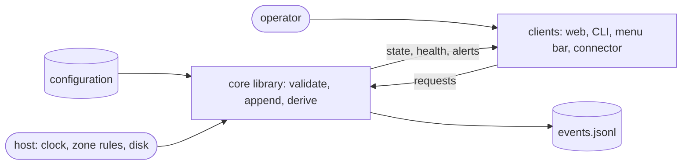

# pg-task-focus — behavior docs

`pg-task-focus` keeps its operator on a written daily routine. It tracks three kinds of recurring
checklist (per day, per week, per sprint) and a set of timed work cycles, and it records everything as
an append-only log from which every view is derived. It lives at `packages/pg-task-focus` in this
repo and is generic: it MUST contain no organization identifiers, and a deployment supplies
configuration only.

This set describes intended behavior only, at product level: actors, stories, journeys and
invariants, with no implementation detail below that floor. It covers the **core library**, the first
of five sub-projects: the event log, the projection and timer math derived from it, time and zones,
configuration, and the validation of every change by replaying the log the change would produce. The
daemon and its HTTP API, the command-line client, the web UI, the connector backend and the menu-bar
plugin each land in a later sub-project and add their own docs to this directory. A behavior change to
the library MUST edit these docs in the same change; the reasons behind the main decisions are in
`docs/adr/0088-pg-task-focus-event-log-and-projection.md`.

## Place in the product

The library has exactly one writer of the log. Every client talks to it through requests and reads
derived state; no client reads the log.

## Actors

- **`ACTOR-OPERATOR`** <!-- uuid: 2db83e39-c5b0-41b9-87eb-cc89b9f715d3 --> — the single person whose routine is tracked. Completes and
  skips tasks, rolls periods, runs cycles, and fixes mistakes. One operator; the product has no notion
  of a second user.
- **`ACTOR-CLIENT`** <!-- uuid: 79cd0aec-c884-4f7f-b020-7e930b830d29 --> — any program that acts for the operator or presents state to
  them: the daemon's API, the command-line client, the web UI, the menu-bar plugin, the connector
  backend, and any client added later (a terminal UI, for example). A client sends requests, reads
  state and alerts, and MAY retry a request.
- **`ACTOR-CONFIGURER`** <!-- uuid: 074a33db-340a-45ea-88ea-ae7d803aab6a --> — whoever deploys the product and writes its
  configuration: the routine's tasks, cycle types, sounds and zones. Usually the operator in another
  role.
- **`ACTOR-HOST`** <!-- uuid: b6402e7b-b4d1-4afb-bf9d-692f80a98e23 --> — the machine environment the product runs in: the clock, the
  zone rules, the file system, the audio session and the process lifecycle (a crash, a power loss, a
  sleeping laptop). It is not under the product's control, and the product's guarantees are stated
  against its failures.

## Glossary

The terms this library owns. Other sub-projects reuse them and MUST NOT redefine them.

| Term             | Meaning                                                                                                                          |
| ---------------- | -------------------------------------------------------------------------------------------------------------------------------- |
| Period           | A day, a week or a sprint, with civil dates (a start, and an end for a week or sprint) and the zone in force when it was created |
| Profile          | A named set of task and cycle definitions (for example "normal" and "on-call"); exactly one is active                            |
| Task definition  | A configuration entry: title, cadence (`daily`, `weekly` or `sprint`) and a due rule                                             |
| Task instance    | A task definition materialized for one period, with a concrete due instant                                                       |
| Cycle            | One timed unit of work of a configured type                                                                                      |
| Segment          | One contiguous running interval of a cycle (start to pause, resume to pause, resume to stop)                                     |
| Focus            | The cycle that is running; at most one                                                                                           |
| Dimmed cycle     | A cycle that is paused and not stopped, shown beside the focus                                                                   |
| Event            | One immutable JSON line in the log                                                                                               |
| Batch            | A group of events written together and closed by a commit marker                                                                 |
| Projection       | The in-memory state derived by replaying the log; never persisted                                                                |
| Candidate replay | Replaying the log with a requested change applied, before anything is written, to prove the result is possible                   |
| Correction       | An event that supersedes or retracts an earlier event; the log is never edited                                                   |
| No-op            | A request whose effect already holds; a success with `changed: false`, no event and no version change                            |
| Running time     | The sum of a cycle's running segments; the clock reminders count                                                                 |
| Torn tail        | An unacknowledged final line or batch at the end of the log after a crash                                                        |
| Sidecar          | The file a recovery copies a torn tail into before trimming the log                                                              |
| Read-only mode   | The store cannot be written until a restart; every client says so                                                                |
| Rollover         | A period change that marks the open tasks of the periods being left as missed or skipped                                         |

## The docs

| Doc                                                  | Covers                                                                                                                        |
| ---------------------------------------------------- | ----------------------------------------------------------------------------------------------------------------------------- |
| [`event-log.md`](event-log.md)                       | The log: events, batches, crash recovery, validation by candidate replay, the expressive error, idempotency, read-only mode   |
| [`corrections.md`](corrections.md)                   | Correcting and retracting events, undo, back-filling a break, ending a cycle at an earlier time                               |
| [`time-and-zones.md`](time-and-zones.md)             | Instants, zone names, nonexistent and repeated civil times, which zone decides what, host zone discovery                      |
| [`configuration.md`](configuration.md)               | The configuration file, its validation, reload, and its relation to history that already exists                               |
| [`periods-and-rollover.md`](periods-and-rollover.md) | Periods, profiles, task states, rollover, backdating, and the refusal of a period change while a cycle is active              |
| [`cycles-and-timer.md`](cycles-and-timer.md)         | Cycle states and the operation table with its no-op cells, interruption and switching, naming, timer math, the overtime sound |

## Interfaces

Every boundary the library exposes is an interface. A counterparty's participation is **essential**
when the product is nonsense without it and **optional** when the product runs untouched without it.

| Interface      | Defined in                                           | Boundary                                                    | Counterparty (kind)        | Participation |
| -------------- | ---------------------------------------------------- | ----------------------------------------------------------- | -------------------------- | ------------- |
| `INTF-LOG`     | [`event-log.md`](event-log.md)                       | The durable log: one event per line, appended               | `ACTOR-HOST` (actor)       | essential     |
| `INTF-REQUEST` | [`event-log.md`](event-log.md)                       | Requests in; results and the closed catalog of refusals out | `ACTOR-CLIENT` (actor)     | essential     |
| `INTF-STATE`   | [`periods-and-rollover.md`](periods-and-rollover.md) | The state a client reads, including the store health        | `ACTOR-CLIENT` (actor)     | essential     |
| `INTF-CONFIG`  | [`configuration.md`](configuration.md)               | The configuration file in; its problems out                 | `ACTOR-CONFIGURER` (actor) | essential     |
| `INTF-HOST`    | [`time-and-zones.md`](time-and-zones.md)             | The clock, zone rules and the machine's zone hints in       | `ACTOR-HOST` (actor)       | essential     |
| `INTF-ALERT`   | [`cycles-and-timer.md`](cycles-and-timer.md)         | The alert due now, and when the next could fall due         | `ACTOR-CLIENT` (actor)     | optional      |

## Invariants

The invariants are numbered by area, in RFC 2119 language, and each cites the operator ruling behind
it where there is one:

- `INV-LOG-1` to `INV-LOG-30` are in [`event-log.md`](event-log.md).
- `INV-CORR-1` to `INV-CORR-19` are in [`corrections.md`](corrections.md).
- `INV-TIME-1` to `INV-TIME-10` are in [`time-and-zones.md`](time-and-zones.md).
- `INV-CONF-1` to `INV-CONF-18` are in [`configuration.md`](configuration.md).
- `INV-PERIOD-1` to `INV-PERIOD-25` are in [`periods-and-rollover.md`](periods-and-rollover.md).
- `INV-CYCLE-1` to `INV-CYCLE-23` are in [`cycles-and-timer.md`](cycles-and-timer.md).

### Operator rulings and where they are stated

| Ruling (operator)                                                                              | Date       | Stated in                                                            |
| ---------------------------------------------------------------------------------------------- | ---------- | -------------------------------------------------------------------- |
| No acknowledge, mute, snooze or repeat cap on the overtime sound                               | 2026-10-07 | `INV-CYCLE-16`, `INV-CONF-8`                                         |
| No carry-over: a task open at rollover is missed or skipped, never carried                     | 2026-10-07 | `INV-PERIOD-11`, `INV-CONF-8`                                        |
| Reminders count running time; pause silences, resume continues the count                       | 2026-10-08 | `INV-CYCLE-17`, `INV-CYCLE-18`, `INV-CYCLE-19`                       |
| Interrupted cycles stay visible and dimmed, with Switch, and can be stopped while dimmed       | 2026-10-08 | `INV-CYCLE-3`, `INV-CYCLE-4`, `INV-CYCLE-5`, `INV-CYCLE-6`           |
| A complete final line that does not parse is a torn tail, recovered to a sidecar               | 2026-10-08 | `INV-LOG-9`, `INV-LOG-10`                                            |
| A period change may be backdated without a lower bound                                         | 2026-10-08 | `INV-PERIOD-13`, `INV-PERIOD-14`                                     |
| `event.retracted` names `target` or `target_batch`; `batch` is membership only                 | 2026-10-08 | `INV-CORR-9`, `INV-CORR-10`, `INV-LOG-7`                             |
| Statuses keep their meaning; a pause, resume, stop or switch already in effect is a no-op      | 2026-10-08 | `INV-LOG-16`, `INV-CYCLE-8`, `INV-CYCLE-9`                           |
| A cycle's type is correctable in the editor; the envelope type never                           | 2026-10-08 | `INV-CORR-4`, `INV-CORR-5`                                           |
| Read-only mode is obvious in every client and cleared only by a restart                        | 2026-10-08 | `INV-LOG-21`, `INV-LOG-22`, `INV-LOG-23`, `INV-LOG-24`, `INV-LOG-25` |
| A zone name is what the Go standard library resolves; `EST` and `MST` are fixed offsets        | 2026-10-08 | `INV-TIME-3`, `INV-TIME-4`, `INV-TIME-5`                             |
| A period change is refused while any cycle is running or paused now                            | 2026-10-08 | `INV-PERIOD-17`, `INV-PERIOD-18`, `INV-PERIOD-19`                    |
| No "last cycle" shortcut: an ambiguous cycle must be named                                     | 2026-10-08 | `INV-CYCLE-11`                                                       |
| A skip or override reason is non-blank                                                         | 2026-10-08 | `INV-LOG-27`, `INV-PERIOD-9`                                         |
| A switch is a pause plus a resume in one batch, at the instant of the request                  | 2026-10-08 | `INV-CYCLE-4`                                                        |
| Errors are expressive: one specific code per condition, no generic code                        | 2026-10-08 | `INV-LOG-13`, `INV-LOG-14`, `INV-LOG-15`                             |
| Minutes and intervals are integers from 1 to 525600; events are bounded; unknown keys rejected | 2026-10-08 | `INV-CONF-11`, `INV-LOG-27`, `INV-CONF-8`                            |
| The recovery sidecar is named `events.jsonl.recovered-<UTC stamp>-<n>`                         | 2026-10-08 | `INV-LOG-10`                                                         |
| Task ids use the prefixes `day`, `week` and `sprint`                                           | 2026-10-08 | `INV-LOG-8`                                                          |

## Scope

**Extent (in)** — the append-only event log and its crash recovery, the single writer, the closed set
of seventeen event types, idempotent requests, validation of every change by candidate replay with one
specific refusal code per condition, read-only mode and its visibility, corrections and retractions
including undo, instants and zones, the configuration and its relation to history, periods, profiles,
task states and rollover, work cycles and their timer math, interruption and switching, and the
overtime alert schedule (what is due and when, not playing it).

**Extent (out)** — the transport that carries requests and the mapping of refusals onto it; the
rendering of any client, including every string a human reads; playing sounds and sending
notifications; the metrics, logs and traces the service exports; the attention feed and the calendar
and notes formats the connector derives; the menu-bar and web layouts; and the loopback and
no-authentication posture of the daemon. Each belongs to a later sub-project and its own docs.

**Floor** — the set speaks in events, batches, requests, instants, zones, periods, tasks, cycles,
segments, alerts and refusal codes. It never names a package, a function, a data structure or a
storage layout below the log's own line format, and it never fixes the way a client lays out or words
anything beyond the strings it quotes.

## Realization gaps

This set's **realization-gap register**: intended behavior that the library alone does not deliver,
one row per gap, each keyed by the element it is against. The intent is settled and the later
sub-project has not caught up. The library's own invariants are realized by the tasks of the same
sub-project that follows this change; the rows below are what persists beyond it.

| Element         | Intended                                                                                                                                       | Where the implementation stands                                                                                                                                                                                   |
| --------------- | ---------------------------------------------------------------------------------------------------------------------------------------------- | ----------------------------------------------------------------------------------------------------------------------------------------------------------------------------------------------------------------- |
| `INV-LOG-22`    | Every client shows the READ-ONLY sentence, a client already open is told at once, and a future terminal UI does the same                       | The library exposes the store health and a change notification; the web UI, the command-line status, the menu-bar plugin and the connector's attention item are built in sub-projects 2 to 5, and none exists yet |
| `INTF-REQUEST`  | The refusal categories and codes map onto the HTTP API's statuses and problem bodies, with the structured details                              | Built in sub-project 2; the library returns the code, category, message and details                                                                                                                               |
| `INV-LOG-27`    | A request body that is not valid UTF-8 is rejected before decoding can replace the bad bytes with a placeholder                                | The library rejects invalid text it is handed; the raw-body check belongs to the daemon in sub-project 2                                                                                                          |
| `INV-CYCLE-16`  | The overtime sound plays and the notification is sent for each alert the library reports                                                       | Built in sub-project 2 (a sound player and a notification sender); the library reports alerts only                                                                                                                |
| `INV-CYCLE-22`  | A playback failure is logged and counted and never touches cycle state                                                                         | Built in sub-project 2 with the sound player                                                                                                                                                                      |
| `INV-CYCLE-21`  | Alerts are observable through metrics                                                                                                          | Built in sub-project 2 with the service's metrics                                                                                                                                                                 |
| `INV-CYCLE-6`   | Every client shows the resume offer persistently as "Resume `<title>`?", with Switch while another cycle runs                                  | The library exposes the offer; the clients are built in sub-projects 2, 3 and 5                                                                                                                                   |
| `INV-PERIOD-16` | Every client shows "New day: roll over", "New week: roll over" and "New sprint: roll over" exactly, and pre-fills the change                   | The library supplies the banner strings and the ended-period fact; the clients are built in sub-projects 2, 3 and 5                                                                                               |
| `INV-PERIOD-8`  | The web UI and the period-roll command carry the preview's version back on confirm                                                             | The clients are built in sub-projects 2 and 3                                                                                                                                                                     |
| `INV-PERIOD-19` | A client blocks confirmation while a cycle blocks the change and offers Stop and End at for each; the period-roll command exits unsuccessfully | The clients are built in sub-projects 2 and 3                                                                                                                                                                     |
| `INV-CORR-16`   | The corrections editor shows the original and corrected views and a before-and-after timeline                                                  | Built in sub-projects 2 and 3                                                                                                                                                                                     |
| `INV-CYCLE-7`   | A cycle paused longer than the configured limit becomes an attention item                                                                      | The attention feed is built in sub-projects 2 and 4; the library exposes the pause time                                                                                                                           |
| `INV-CONF-12`   | A running service reloads its configuration on request and reports a bad reload through its health                                             | Built in sub-project 2; the library parses, validates and rejects                                                                                                                                                 |
| `INV-CONF-13`   | A reload that sees a changed listening port or public URL reports that a restart is needed                                                     | Built in sub-project 2; the library reports which keys need a restart                                                                                                                                             |
| `INV-TIME-10`   | A command-line client defaults the zone from the machine, and a web client from the browser                                                    | The library supplies the host zone discovery; the clients are built in sub-projects 2 and 3                                                                                                                       |
