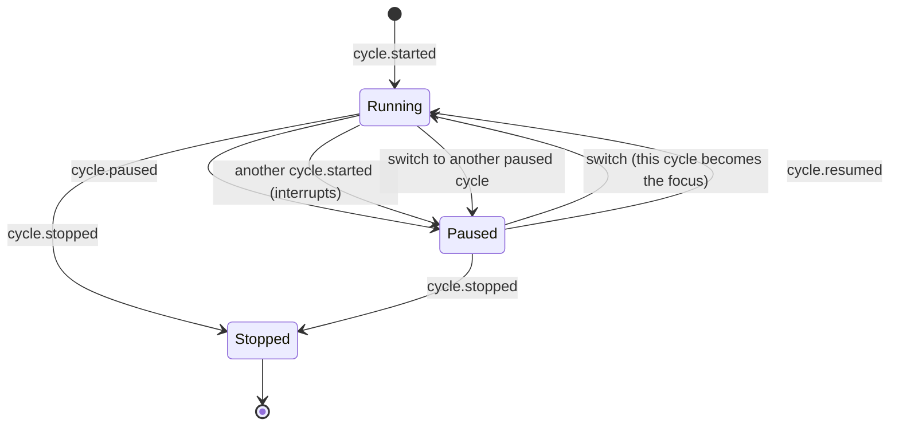

# pg-task-focus — work cycles and the timer

A work cycle is one timed unit of work of a configured type, with a note and free key/value pairs.
One cycle runs at a time; any number of others may be paused beside it. This doc owns the cycle
states and the operations allowed in each, interruption and switching, how elapsed and remaining time
are derived, how a cycle is named, and the overtime sound and its reminders. Fixing a forgotten break
or a forgotten stop is in [`corrections.md`](corrections.md); the log events behind a cycle are in
[`event-log.md`](event-log.md); the configured types, durations and alert sounds are in
[`configuration.md`](configuration.md).

## The states

A command is judged against the cycle's state AT THE REQUEST'S effective instant (the present when
`effective_at` is omitted). At its start instant a cycle is running; at a pause or stop instant it is
no longer; before its start it is in no state (not started), so every operation is then refused by
candidate replay as `cycle_event_before_start` (an annotation reaches that instant only through a
correction), and nothing is a no-op.

| Operation                | Running                   | Paused                                                 | Stopped         |
| ------------------------ | ------------------------- | ------------------------------------------------------ | --------------- |
| `pause`                  | yes                       | no-op                                                  | `cycle_stopped` |
| `resume`                 | no-op                     | yes (`another_cycle_running` while another cycle runs) | `cycle_stopped` |
| `boost`                  | yes                       | yes                                                    | `cycle_stopped` |
| `stop`                   | yes                       | yes                                                    | no-op           |
| `annotate`               | yes                       | yes                                                    | yes             |
| `switch` (to this cycle) | no-op (already the focus) | yes, while another cycle runs                          | `cycle_stopped` |

A **no-op** is a success, not an error: pausing a paused cycle, resuming a running one, stopping a
stopped one, or switching to the cycle that is already the focus, each at the request's effective
instant, appends no event and changes no version. The success says `changed: false`, returns no event
ids, and carries a `note`, one plain sentence saying why nothing changed (for example "Deep work
cycle has been paused since 14:00:00Z (10:00 America/New_York)").

## Stories

- **`STORY-CYCLE-RUN`** <!-- uuid: 0425d754-a5b1-44ef-84b1-4fc62e7e700a --> — As the operator, I want to start a timed cycle of a type,
  pause it, resume it, add time, and stop it, and to see what is left, so I work in measured units.
  _(→ `JOURNEY-CYCLE-OVERTIME`; `INV-CYCLE-8`, `INV-CYCLE-9`, `INV-CYCLE-10`, `INV-CYCLE-12`,
  `INV-CYCLE-13`, `INV-CYCLE-14`, `INV-CYCLE-15`.)_
- **`STORY-CYCLE-INTERRUPT`** <!-- uuid: 443742c9-70c6-4977-abff-911330b6f56b --> — As the operator who is interrupted, I want to start
  the interrupting cycle without losing the first, see both at once with the new one in focus, and
  jump back and forth, so an interruption never makes work disappear.
  _(→ `JOURNEY-CYCLE-INTERRUPT`; `INV-CYCLE-1`, `INV-CYCLE-2`, `INV-CYCLE-3`, `INV-CYCLE-4`,
  `INV-CYCLE-5`, `INV-CYCLE-6`, `INV-CYCLE-7`.)_
- **`STORY-CYCLE-OVERTIME`** <!-- uuid: ffe4a16e-6cdc-4ee6-9390-aab4dc38cfe7 --> — As the operator, I want a short sound when my cycle
  runs out and a short reminder every few minutes of running time until I stop it, with no way to
  silence it short of stopping, so I cannot drift past the end without noticing.
  _(→ `JOURNEY-CYCLE-OVERTIME`; `INV-CYCLE-16`, `INV-CYCLE-17`, `INV-CYCLE-18`, `INV-CYCLE-19`,
  `INV-CYCLE-20`, `INV-CYCLE-21`, `INV-CYCLE-22`.)_
- **`STORY-CYCLE-SAFE`** <!-- uuid: 4525e8ad-c36f-476a-bb60-1ecc45bc3301 --> — As a client or an operator repeating an action, I want a
  repeated pause, resume or stop to be harmless, and a command that is ambiguous to be refused rather
  than guessed, so double-clicks, retries and lost responses cannot damage the timeline.
  _(→ `JOURNEY-CYCLE-REPEAT`; `INV-CYCLE-9`, `INV-CYCLE-10`, `INV-CYCLE-11`.)_
- **`STORY-CYCLE-NOTE`** <!-- uuid: 386ea1df-a4e3-46e8-8ad3-b53c5671bbd5 --> — As the operator, I want to attach a note and key/value
  pairs to a cycle at any time, even after it stopped, and never be prompted for them when I stop, so
  recording detail never gets in the way of working. _(→ `JOURNEY-CYCLE-OVERTIME`; `INV-CYCLE-23`.)_

## Journeys

### `JOURNEY-CYCLE-INTERRUPT` — interrupted, switch, switch back <!-- uuid: 2216836a-dfea-4806-82bd-bee6dd85393f -->

**Primary actor:** `ACTOR-OPERATOR`. **Other actors:** `ACTOR-CLIENT`.
_Requires:_ `INV-CYCLE-1`, `INV-CYCLE-2`, `INV-CYCLE-3`, `INV-CYCLE-4`, `INV-CYCLE-5`, `INV-CYCLE-6`,
`INV-CYCLE-7`. _Includes:_ none.

1. Deep work has run since 09:10. At 09:40 the operator starts a notification cycle. The system
   records one start event that names the deep-work cycle as interrupted at that instant
   (`INV-CYCLE-1`).
2. The notification cycle is the focus. Deep work is still visible, dimmed, with a Switch action
   (`INV-CYCLE-3`).
3. At 09:50 the operator switches to deep work: one batch pauses the notification cycle and resumes
   deep work at the same instant (`INV-CYCLE-4`). At 09:55 the operator switches back.
4. At 09:58 the operator stops the notification cycle. Deep work, which was interrupted by it, is
   offered back as "Resume Deep work cycle?" and the offer stays until it is resumed or stopped
   (`INV-CYCLE-5`, `INV-CYCLE-6`). The product never resumes it on its own.
5. A cycle paused for a long time becomes an item needing attention (`INV-CYCLE-7`).

Extensions:

- 3a. The operator switches from A to B and back to A at the same instant. The second switch would
  leave a zero-length running segment and is refused as `empty_running_segment`; at later instants the
  segments alternate and the elapsed totals stay exact (`INV-CYCLE-4`).
- 3b. No cycle is running at the instant. A switch is refused as `no_running_cycle`: the operator uses
  resume instead (`INV-CYCLE-4`).
- 4a. The operator stops a dimmed cycle: the focus is untouched (`INV-CYCLE-3`).

### `JOURNEY-CYCLE-OVERTIME` — a cycle that outlives its time <!-- uuid: 1767e4bc-0a37-4e32-8c6d-3fcdb474b6e1 -->

**Primary actor:** `ACTOR-OPERATOR`. **Other actors:** `ACTOR-CLIENT`, `ACTOR-HOST`.
_Requires:_ `INV-CYCLE-8`, `INV-CYCLE-9`, `INV-CYCLE-12`, `INV-CYCLE-13`, `INV-CYCLE-14`,
`INV-CYCLE-15`, `INV-CYCLE-16`, `INV-CYCLE-17`, `INV-CYCLE-18`, `INV-CYCLE-19`, `INV-CYCLE-20`,
`INV-CYCLE-21`, `INV-CYCLE-22`, `INV-CYCLE-23`. _Includes:_ none.

1. A 50-minute deep-work cycle starts at 09:00 with a reminder every 10 minutes. At 09:50 its time is
   up: the short expiry sound plays and a notification is sent (`INV-CYCLE-16`).
2. At 10:00 the first reminder plays: ten minutes of running time since the expiry (`INV-CYCLE-17`).
3. At 10:05, half-way through the next interval, the operator pauses for lunch. Nothing plays and
   nothing is sent while the cycle is paused, including at 10:20 (`INV-CYCLE-17`, `INV-CYCLE-18`).
4. The operator resumes at 10:30. The next reminder plays at 10:35, five more running minutes,
   because the count continues where it stopped; the expiry sound is not replayed (`INV-CYCLE-17`).
5. The operator boosts by 25 minutes at 10:36 while still in overtime: the cadence is not moved. Had
   the boost ended overtime, the reminders would stop and entering overtime again would play the
   expiry sound again (`INV-CYCLE-14`, `INV-CYCLE-18`).
6. The cycle ends only when the operator stops it; stopping asks for no note (`INV-CYCLE-15`,
   `INV-CYCLE-23`). The recorded duration is never a guess.

Extensions:

- 2a. The laptop sleeps through several intervals. On wake at most one catch-up alert plays, never a
  burst; if the sleep spanned the expiry itself, the catch-up is the expiry (`INV-CYCLE-19`).
- 4a. The service restarts while the cycle is in overtime. A running cycle inside its first interval of
  overtime plays the expiry; one later in overtime plays one catch-up reminder and then continues on
  the original grid; a paused or dimmed cycle stays silent and resumes on that grid (`INV-CYCLE-19`).
- 5a. A back-filled break removes running time from an overtime cycle. Reminders neither stop nor
  double (`INV-CYCLE-20`).
- 6a. The operator wants to silence the sound without stopping. There is no acknowledge, mute, snooze
  or cap (`INV-CYCLE-16`).
- 6b. The sound cannot be played. The failure is logged and counted and the cycle is unaffected
  (`INV-CYCLE-22`).

### `JOURNEY-CYCLE-REPEAT` — doing the same thing twice <!-- uuid: 242eb60d-f27f-43cd-b9ab-3bd1f9e9ab7e -->

**Primary actor:** `ACTOR-CLIENT`. **Other actors:** `ACTOR-OPERATOR`.
_Requires:_ `INV-CYCLE-9`, `INV-CYCLE-10`, `INV-CYCLE-11`. _Includes:_ none.

1. The operator double-clicks Pause. The first click appends a pause; the second finds the cycle
   already paused at that instant and succeeds with `changed: false` and a note, appending nothing
   (`INV-CYCLE-9`).
2. A client retries a stop with the same `id` after the cycle has stopped; it gets the original
   no-op answer (`INV-CYCLE-9`).
3. The operator runs "stop" with no cycle named while two cycles are paused. It is refused as
   `cycle_ambiguous`, listing both with their ids and titles, and the operator names one
   (`INV-CYCLE-11`).

Extensions:

- 1a. The cycle is stopped and the operator asks to pause it. It is refused as `cycle_stopped`: a
  stopped cycle cannot change (`INV-CYCLE-9`).
- 3a. Exactly one cycle is a candidate. The verb applies to it (`INV-CYCLE-11`).
- 3b. The only cycle has already stopped and "stop" names none: `no_running_cycle`, because nothing is
  left to identify; the same stop naming the cycle is a no-op (`INV-CYCLE-11`).

## The alert interface

### `INTF-ALERT` — what to play, and when <!-- uuid: dd5da9bd-4ebe-4d96-855a-0bf0705e0ce7 -->

**Counterparty:** `ACTOR-CLIENT` (kind: actor; optional participant: the product runs, and records
cycles, with no player attached). **What crosses out:** at most one alert at a time, either an expiry
or a reminder, naming the cycle and the sound to play, and the next instant at which an alert could
fall due; every alert is also a trigger for a notification. **What crosses in:** a request to poll for
an alert, made after every committed change and every configuration reload. **What must hold:**
`INV-CYCLE-16` to `INV-CYCLE-22`. The product only reports an alert; playing it and sending the
notification belong to the client that owns the audio session.

## Invariants

### Interruption, focus and switching

- **`INV-CYCLE-1`** <!-- uuid: 5298eb35-22cb-4857-95ed-8febf2f4d044 --> — Starting a cycle while another runs is not an error. The new
  `cycle.started` event carries `interrupts`, set by the system and never the client, from the cycle
  that is running AT THE NEW EVENT'S `effective_at`; the interrupted cycle is derived to be paused at
  that instant. There is never a state in which the pause is recorded and the start is not. A start
  with no `interrupts` while another cycle runs at that instant is `another_cycle_running`.
- **`INV-CYCLE-2`** <!-- uuid: 08612fda-e02d-4565-90c5-db2fdce0d3e4 --> — An interrupt instant MUST be strictly later than the
  interrupted cycle's most recent start or resume, otherwise the request is `empty_running_segment`; an
  interrupted cycle that is not running at that instant is `interrupted_cycle_not_running`. A running
  segment of no length is never recorded.
- **`INV-CYCLE-3`** <!-- uuid: 4633b760-685f-423c-9306-92b884cd2cd7 --> — Interrupted cycles MUST stay visible. The running cycle is the
  **focus**; every paused cycle that is not stopped is listed beside it, **dimmed**, most recently
  paused first, whether it was interrupted, paused by hand or switched away from. A dimmed cycle MAY be
  stopped, boosted or annotated while dimmed, and doing so leaves the focus untouched. A paused cycle
  accrues no running time, so it never plays a sound. _(Operator ruling,
  2026-10-08: an interrupted cycle stays visible and dimmed beside the new focus, a button on the
  dimmed one toggles it back to the focus and dims the other, the events that track which is paused
  and which runs are emitted, and the dimmed one can also be stopped while dim.)_
- **`INV-CYCLE-4`** <!-- uuid: f07d3e6f-9dc6-4d85-9800-5ba374d48f17 --> — A **switch** makes a dimmed cycle the focus and dims the
  running one. It MUST be one batch: a `cycle.paused` for the cycle running at the request's
  `effective_at` and a `cycle.resumed` for the chosen cycle, both at that instant, then
  `batch.committed`. There is no `cycle.switched` event; a switch is a pause plus a resume. It is
  refused as `no_running_cycle` when no cycle runs at that instant (use resume), `cycle_stopped` when
  the chosen cycle is stopped, `empty_running_segment` when the instant is not strictly after the
  paused cycle's last start or resume, `cycle_segments_overlap` when the instant falls inside a pause
  the chosen cycle already ends later, and `unknown_cycle` for an unknown id (named targets are checked
  before state, so an unknown target while nothing runs is `unknown_cycle`). A switch to the cycle that
  already runs at that instant is a no-op. A switch undone by retracting its batch restores both
  cycles. _(Operator rulings, 2026-10-08: no
  switched event, a switch is a pause and a start of an existing cycle; and the switch pauses the cycle
  running at its own instant.)_
- **`INV-CYCLE-5`** <!-- uuid: fc334a0c-3d8a-47c3-8828-b9b73ccd6051 --> — A switch also records that the chosen cycle displaced the
  paused one (a `cycle.paused` and a `cycle.resumed` of different cycles in one batch), so the paused
  cycle joins the interrupt stack and the resume offer names it once the displacing cycle is stopped. A
  pause and a resume of the SAME cycle in one batch (a back-filled break) is not a switch. A resume or
  stop of a cycle clears that cycle's own displacement link; the stop of the displacing cycle does not;
  a pause made by hand never sets it.
- **`INV-CYCLE-6`** <!-- uuid: ef4fb195-6ea4-4a03-9830-379bb8971716 --> — When the interrupting cycle is stopped, the state MUST expose
  a resume offer naming the most recent interrupted cycle that is still paused, and a client MUST show
  it persistently ("Resume `<title>`?") until the cycle is resumed, switched to or stopped; the offer
  persists while another cycle runs, when its action is Switch (a plain resume would be
  `another_cycle_running`). The product never resumes a cycle on its own.
- **`INV-CYCLE-7`** <!-- uuid: 6442c85e-5ecf-4372-8518-0b881492a8c7 --> — A paused cycle that has been paused longer than
  `stale_pause_minutes` (default 45) MUST become an item needing attention, so an interrupted cycle is
  not forgotten.

### Operations and naming

- **`INV-CYCLE-8`** <!-- uuid: ad83fa75-ce14-4be2-877e-a90fea016cab --> — Each operation MUST be allowed, a no-op or refused exactly as
  the state table above says, judged at the request's effective instant: a start instant counts as
  running, a pause or stop instant does not, and a resume of a paused cycle while another cycle runs
  is `another_cycle_running`, naming the running cycle (a switch is the operation that swaps them).
  A request that is not a no-op is validated by candidate replay and, if impossible, refused with the
  specific code of its condition; a stop earlier than the cycle's existing stop is `cycle_stopped`.
- **`INV-CYCLE-9`** <!-- uuid: f2912876-3695-41de-9493-5ae5c48b722e --> — A `pause`, `resume`, `stop` or `switch` of a cycle that is
  already in that state at the request's effective instant MUST be a no-op success: `changed: false`,
  a one-sentence `note`, no event, no version change and no error; a stopped cycle cannot change
  (`cycle_stopped`), and a cycle that is not started yet is never a no-op. A retry of a no-op with the
  same `id` is answered from the bounded no-op memory of `INV-LOG-18`. _(Operator ruling, 2026-10-08:
  "pausing or running or stopping or starting a cycle which is already in that state is safe to do, no
  error is needed.")_
- **`INV-CYCLE-10`** <!-- uuid: 154f05c4-275e-4c91-ab4b-170e2ca1ecdb --> — A repeated `start` with the same `id` MUST return the
  original result, like any other request, and starting a cycle of a type outside the active profile
  is allowed and flagged `not_in_profile`.
- **`INV-CYCLE-11`** <!-- uuid: 80fb018b-63bc-4e8c-b09b-3688ae8fcc4a --> — A cycle verb that does not name its cycle applies only when
  exactly one candidate exists, and there is no "last cycle" shortcut. For `pause`, `boost` and `stop`
  the candidate is the cycle running at the request's effective instant, else the only cycle that is
  not stopped; for `resume` and `annotate` it is the only cycle that is not stopped. With several
  candidates the request is `cycle_ambiguous`, whose details list each candidate's id and title, and
  the client names the cycle; with none it is `no_running_cycle`. A repeated `stop` that names its
  cycle is a no-op, but a repeated `stop` naming none after the only cycle has stopped is
  `no_running_cycle`. Annotating a stopped cycle therefore always names it. _(Operator ruling,
  2026-10-08: "no last, if more than one, then it must be identified.")_

### Timer math

- **`INV-CYCLE-12`** <!-- uuid: 47a83270-6711-4a78-a994-3fc6efb0676e --> — Timer math MUST be derived, never ticked. `elapsed` is the
  sum of a cycle's running segments (an open segment ends at the read time) and is never negative;
  `remaining` is `planned_minutes` plus the sum of boosts minus `elapsed`. A cycle is in **overtime**
  when it is running and `remaining` is negative. Nothing ticks into the log, so a restart or a
  sleeping laptop cannot corrupt a timer.
- **`INV-CYCLE-13`** <!-- uuid: be960145-90ec-4d3d-a99e-988773614ebc --> — A cycle's planned minutes and title are snapshots taken at
  its start (`INV-LOG-6`), its duration resolves by `INV-CONF-5`, and a paused cycle is never in
  overtime.
- **`INV-CYCLE-14`** <!-- uuid: 18e9efb4-25c9-48a2-a37f-ca78a4e09f39 --> — A boost adds a positive number of minutes (the configured
  buttons, or any value in range). A boost that moves the end past the present ends overtime.
- **`INV-CYCLE-15`** <!-- uuid: 2b84a22a-fea7-4245-97bf-904bc8941f00 --> — Overtime MUST NOT auto-stop a cycle. A cycle ends only when
  the operator stops it, so recorded durations are never a guess. Overtime is shown as a negative
  remaining time.

### The overtime sound

- **`INV-CYCLE-16`** <!-- uuid: 25922fb2-19b8-455f-a4a4-20b72fbcc90f --> — When a running cycle's time is up, the product MUST play one
  short `sound` and send one notification, then a short `reminder_sound` and a notification each time
  the cycle has run a further `repeat_minutes` of running time in overtime, until the operator stops
  the cycle. There is NO acknowledge, mute, snooze or repeat cap. Only overtime notifies: due and
  overdue tasks are conveyed through the state and the attention feed, never by notification.
  _(Operator ruling, 2026-10-07.)_
- **`INV-CYCLE-17`** <!-- uuid: d00925b6-054d-4a37-9787-8d8c7b933a14 --> — Reminders MUST count the cycle's RUNNING time, not
  wall-clock time. A paused cycle accrues no running time, so it plays no sound and sends no
  notification; resuming it continues the count where it stopped (a cycle that had run 3 of 5 minutes
  toward its next reminder plays it after 2 more running minutes), and a pause and resume never replays
  the expiry. _(Operator ruling, 2026-10-08: "there will be sound/notifications every X minutes of
  running time of the cycle ... if the cycle is paused, no notifications or sound. but if it is resumed
  half way through the X minutes, when it gets to X, the notification and sound would occur again.")_
- **`INV-CYCLE-18`** <!-- uuid: 36b2cdff-5791-47de-bc2f-a703896bc892 --> — A boost that leaves the cycle in overtime MUST NOT move the
  next reminder. Reminders end when the cycle is stopped, or when a boost ends overtime; entering
  overtime again plays the expiry `sound` again.
- **`INV-CYCLE-19`** <!-- uuid: c8935e4d-c083-4a23-a623-c05edac3ddc3 --> — After the host wakes from sleep, or after a restart, the
  product MUST play at most one catch-up alert, never a burst for the missed intervals. When a sleep
  spanned the expiry, the catch-up is the expiry. After a restart, where history is not known, a
  running cycle inside its first interval of overtime plays the expiry; a running cycle later in
  overtime plays one catch-up reminder and continues on the original grid (the cadence is not shifted);
  a paused or dimmed cycle stays silent and resumes on that grid.
- **`INV-CYCLE-20`** <!-- uuid: 70e59be1-8d00-44c3-8dbb-667ab4e46cb4 --> — A correction that removes running time from an overtime
  cycle (a back-filled break) MUST NOT silence future reminders or double them: the next reminder
  falls on the original grid of the remaining overtime. A cycle switched away from stays silent, and
  switching back continues its own count.
- **`INV-CYCLE-21`** <!-- uuid: fec4a137-1267-4abd-be26-b9e8e1df7e0d --> — Alerts MUST be derived from the state and MUST NOT be events
  in the log. They are observable through metrics. The alert memory is per process.
- **`INV-CYCLE-22`** <!-- uuid: 6f2ce2ca-8ba0-4da4-ae4c-9131636d2412 --> — Sound playback goes through a replaceable player, so tests
  need no real audio. A playback failure MUST be logged and counted and MUST NOT affect cycle state. A
  stopped cycle never alerts, and no running cycle means no alert.

### The cycle form

- **`INV-CYCLE-23`** <!-- uuid: 6b1e64ea-01b5-4062-898d-8dcd445001bd --> — The cycle form takes a note and key/value pairs. Each save
  appends a `cycle.annotated` event carrying the whole note and list, and the latest event for a cycle
  is its complete note and list; clients send the whole form each time. Repeated keys are allowed and
  keep their order; values are stored as given. Annotation MUST be allowed in every cycle state,
  including after the cycle is stopped. The form is optional: stopping a cycle MUST NOT require or
  prompt for a note, and the form MAY be reopened afterwards by naming the cycle.
