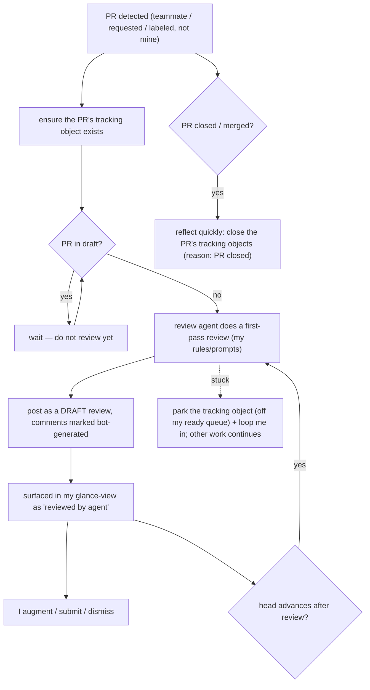

# Truth: Reviewing others' PRs

**Status:** Living source of truth. Everything downstream — specs, designs, plans,
code, and the implementation-reference doc — must conform to this. When the
behavior should change, this doc changes first; the downstream artifacts are then
re-derived and can be thrown away once the code matches again.

## Purpose

How the system helps me stay on top of — and give a first-pass agent review to —
pull requests I do **not** author. The goal: I learn about relevant PRs fast, an
agent drafts a review I can build on, and I spend my own attention only where it
is actually needed.

## Actors

- **Me** — the reviewer. The final authority on anything submitted in my name.
- **Author** — someone other than me who owns the PR.
- **Review agent** — does the first-pass review under rules/prompts I control.
- **The system** — detects PRs, tracks them, runs agents, and surfaces status to
  me. _Which component does which part is the capability map's concern, not this
  doc's._

## What counts as a PR "to review"

The union of: authored by a teammate; **or** I am a requested reviewer; **or** the
PR carries one of my watched labels — **excluding** any PR I authored (those are
their own workflow). Watched labels are mine to configure.

## User stories

- As a reviewer, I want to know a relevant PR exists **as soon as possible**, so I
  can engage early.
- As a reviewer, I want to be told when a PR I've **already engaged with** has
  changed, so I can re-review only when it matters.
- As a reviewer, I want a **glance-view** of each PR so I can triage without
  opening it — see the Example below.
- As a reviewer, I want an agent to do a **first-pass review** of every qualifying
  PR, using rules/prompts I control.
- As a reviewer, I want the agent's review left as a **draft I can augment**, never
  something posted in my name as final.
- As a reviewer, I do **not** want agents reviewing a PR that is still a draft.
- As a reviewer, I want closed/merged PRs to **drop out of my queue quickly**, so
  neither I nor an agent keeps working them.

## Journey



## Invariants (MUST / MUST-NOT)

- A PR I do not own **MUST NOT** be modified in any way. The **only** permitted
  write is posting **draft** review comments.
- An agent's review **MUST** be posted as a **draft** review — never submitted,
  approved, or request-changes.
- The review's content follows the common **review format** (whole-review /
  per-file / per-block comments) — see the _Reviews_ doc; only its handling here
  (draft, and waiting until the PR is out of draft) is specific to this workflow.
- Every agent-authored comment **MUST** visibly indicate it was generated by a
  bot, not by me — because agents post under my account.
- An agent **MUST NOT** review a PR while it is still in draft.
- A re-review **MUST NOT** stack duplicate reviews — at most one pending agent
  draft review per PR at a time.
- A closed or merged PR **MUST** be reflected quickly, and its tracking objects
  closed, so no further work is done on it.
- _(Shared — see the cross-cutting invariants doc)_ **One tracking object per PR**,
  its lifecycle bound to the PR: created on first detection; closed when the PR
  closes (reason: PR closed); reopened if the PR reopens; child tracking objects
  close when the parent closes and reopen when it reopens — so an accidental
  close/reopen doesn't lose the related work.

## Example — the glance-view

Illustrative only (exact columns and wording are open — see Open questions):

```
PRs to review (3)
  #1423  auth: refactor token store       ~180 LoC   3d open   CI ✓   reviews 1   me: — (unseen)        urgency med   → ACT: review
  #1402  billing: retry on 429            ~40 LoC    6d open   CI ✗   reviews 2   me: ✎ agent-draft     urgency low   → wait (CI red)
  #1390  search: rank tweak               ~12 LoC    1d open   CI ✓   reviews 0   me: ✓ approved        urgency high  → ACT: re-review (head advanced since my approval)
```

## Usage scenarios (how I'd actually do & verify it)

- **See what's awaiting my review:** the review queue / glance-view above (today:
  `pg-pr pr list --json` feeds it). Verify: a newly-opened teammate PR appears
  within one sync cycle.
- **Read the agent's first-pass review:** open the PR on GitHub; the agent's notes
  are a pending **draft** review, each comment marked as bot-generated. Verify: the
  review is not visible to the author until I submit it.
- **Confirm a re-review fired:** push a new commit to a PR I'd already reviewed;
  verify it returns to my queue flagged "head advanced."
- **Confirm cleanup:** close/merge the PR; verify it leaves my queue and its
  tracking objects close shortly after.

## Failure conditions

- **Agent can't complete the review** (can't fetch/checkout the head, the PR is
  ambiguous, etc.): the PR's tracking object is **parked** (marked so it does not
  resurface as ready), the situation is recorded on it, I'm looped in, and the
  system continues with other work. **Work is not lost.** _(cross-cutting)_
- **PR closed/merged mid-review:** the in-flight review is abandoned and tracking
  closed; nothing is posted to a dead PR.
- **Usage limit reached:** review work pauses and resumes in the next window.
  _(cross-cutting)_

## Open questions

- **Bot attribution:** what exactly marks a comment as bot-generated when agents
  post under my account (a prefix? a marker line? an example string belongs here
  once decided).
- **Urgency:** how is it derived, and is it computed or inferred? (The glance-view
  depends on it; per the computational-vs-inference principle we'd prefer computed.)
- **"Ready for me to act":** the precise rule (e.g. I approved/commented **and** the
  head advanced since).
- **Glance-view surface:** is it a CLI listing, a dashboard, or both? What are the
  canonical columns?
- **Watched labels:** are they global to me or per-repo?
