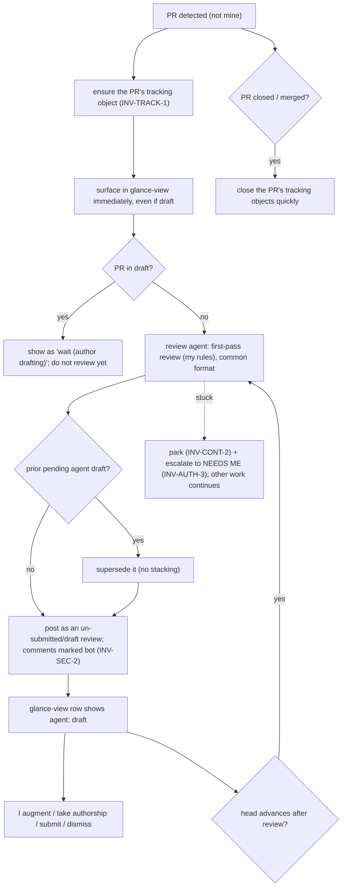

# Reviewing others' PRs

**Status:** Living source of truth (per-project overlay). See the
[glossary](glossary.md) and [invariants](invariants.md) for shared terms and IDs.

## Purpose

How the system helps me stay on top of — and give a first-pass agent review to —
pull requests I do **not** author. I learn about relevant PRs fast, an agent drafts
a review I build on, and I spend my own attention only where it's needed.

## Actors

- **Me** — the reviewer; the final authority on anything submitted in my name.
- **Author** — someone other than me who owns the PR.
- **Review agent** — does the first-pass review under rules/prompts I control,
  producing a review in the common format ([`reviews.md`](reviews.md)).
- **The system** — detects PRs, tracks them, runs agents, surfaces status.

## What counts as a PR "to review"

The union of: authored by a teammate; **or** I'm a requested reviewer; **or** the PR
carries one of my watched labels — **excluding** any PR I authored. Watched labels
are mine to configure.

## User stories

- Know a relevant PR exists **as soon as possible** — including while it's still a
  draft — so I can engage early.
- Be told when a PR I've **already engaged with** has changed, so I re-review only
  when it matters.
- A **glance-view** to triage without opening each PR (see Example).
- An agent **first-pass review** of every qualifying PR, under my rules.
- The agent's review left as a **draft I augment**, never final in my name.
- Closed/merged PRs **drop out** of my queue quickly.

## Journey



## Invariants (this workflow)

- A PR I don't own **MUST NOT** be modified; the only write permitted is
  **un-submitted/draft** review comments (`INV-SEC-2` marks them bot-generated).
  On providers without a draft-review concept, the review is held for me to submit
  rather than posted live.
- An agent **MUST NOT** review a PR while it's still a draft.
- A re-review **MUST** supersede the prior pending agent draft — at most **one**
  pending agent draft review per PR.
- A closed/merged PR **MUST** be reflected quickly and its tracking closed.
- Shared rules that also apply here (by reference): tracking-object lifecycle
  `INV-TRACK-1/2/3`; bot attribution `INV-SEC-2`; untrusted-content isolation
  `INV-SEC-1` (the agent checks out the PR head); escalation delivery `INV-AUTH-3`.

## Example — the glance-view

One actionable surface, filtered to "to review." `ACT` rows sort above `wait` rows;
within `ACT`, by urgency. `me:` is _my_ state; `agent:` is the agent's; `reviews`
counts **human** reviews only (the bot draft shows in `agent:`). Illustrative:

```
as of 12:04  (fresh)
NEEDS ME (1)
  #1402  billing: retry on 429     escalated: CI red 3 days — chase author?   → reply

TO REVIEW (3)
  #1390  search: rank tweak    ~12 LoC  1d  CI ✓  reviews 0  me: approved   agent: —       urgency high  → ACT: re-review (head advanced since approval)
  #1423  auth: token store     ~180 LoC 3d  CI ✓  reviews 1  me: unseen     agent: draft   urgency med   → ACT: review agent draft
  #1455  api: pagination       ~60 LoC  2h  CI –  reviews 0  me: unseen     agent: —       urgency low   → wait (author drafting)
```

## Usage scenarios

- **See what needs me / what's to review:** the glance-view above. Verify a
  newly-opened PR (even a draft) appears within one sync cycle, and its `as of`
  timestamp is fresh (`INV-FRESH-1`).
- **Read/submit the agent's review:** open the PR; the agent's notes are an
  un-submitted draft, each comment marked bot-generated. Submitting = I take
  authorship of every comment, so the expected flow is review/edit each, then
  submit. Verify it isn't visible to the author until I submit.
- **Confirm re-review + no stacking:** push a new commit to a PR I'd reviewed;
  verify it returns flagged "head advanced" and the old pending draft is superseded,
  not doubled.
- **Confirm cleanup:** close/merge the PR; verify it leaves my queue.

## Failure conditions

- **Agent can't complete the review** (can't fetch/checkout head, ambiguous): park
  (`INV-CONT-2`) + escalate to NEEDS ME (`INV-AUTH-3`); continue other work.
- **PR closed/merged mid-review:** abandon the in-flight review; close tracking.
- **Usage limit / non-retryable error:** pause-and-resume / escalate per
  `INV-FAIL-1`.

## Open questions

- **Bot-attribution marker (form/example).** The _requirement_ is decided
  (`INV-SEC-2` / ADR 0023); the exact marker string + an example comment are still
  to pin down (belongs in [`reviews.md`](reviews.md) once chosen).
- **Urgency.** Defined as **computed and explainable** (per `INV-WORK-1`) — e.g.
  from watched-label + age + requested-of-me + CI — and a row can expand to show
  _why_ it's "high." The exact formula is open.
- **"Ready for me to act"** precise rule (e.g. I approved/commented **and** the head
  advanced since).
- **Watched labels:** global to me, or per-repo?
