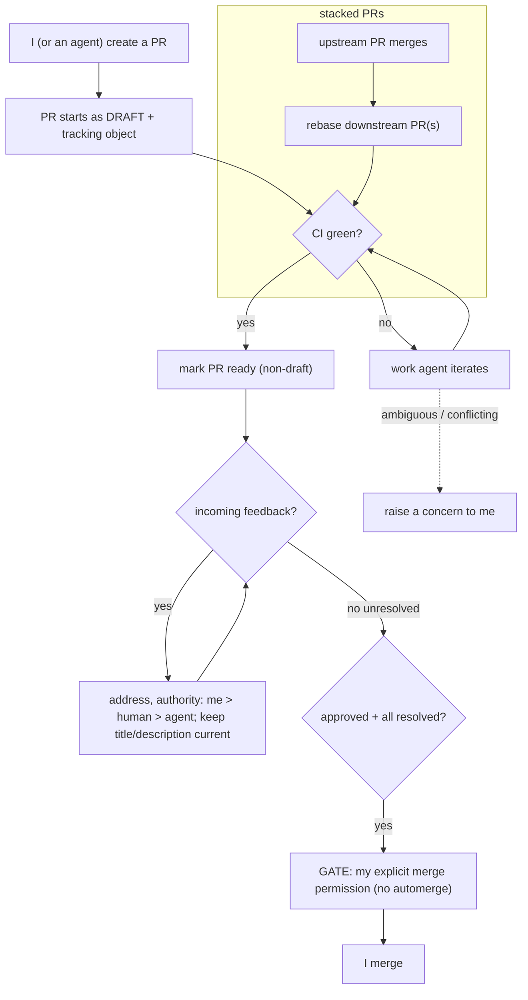

# Truth: Shepherding my PRs to merge

**Status:** Living source of truth. Downstream artifacts conform to this; change
this first.

## Purpose

How the system carries a PR **I authored** from creation to merge with as little
of my involvement as possible — implementing the change, keeping the PR current,
addressing incoming feedback, and stopping at the line only I may cross (the
merge). I step in only when the work genuinely needs a human.

## Actors

- **Me** — author, final authority, and the **only** actor who may merge.
- **Work agent** — makes the changes and addresses feedback.
- **Review agent** — gives my PR a first-pass review too (see "reviewing others'
  PRs" for the review mechanics).
- **The system** — tracks the PR, runs agents, gates work, surfaces state.

## User stories

- As an author, I want the system to work my PR from creation **until it merges**,
  escalating only when it truly needs me.
- As an author, I want my PRs to **start as draft** and become ready automatically
  once CI is green.
- As an author, I want incoming review comments **addressed automatically**,
  respecting the feedback authority hierarchy **me > human > agent**.
- As an author, I want the PR **title and description to always reflect** the
  current state of the PR.
- As an author, I want large changes broken into **stacked PRs**, tracked, with
  downstream PRs rebased as upstream ones merge.
- As an author, I want the agent's first-pass review of my own PR folded into
  feedback processing — and it may run **even while the PR is still a draft**
  (unlike others' PRs, which wait until they're out of draft).
- As an author, I want agents to **raise a concern to me** whenever they're unsure.

## Journey



## Invariants (MUST / MUST-NOT)

- An agent **MUST NOT** merge a PR. Merge requires **my explicit permission**.
- Automerge **MUST NOT** be enabled by default.
- A PR **MUST** start as a draft and **MUST** become non-draft only once CI is green.
- Feedback resolution **MUST** follow the authority hierarchy **me > human > agent**
  (higher authority wins a conflict).
- A PR's title and description **MUST** reflect its current state.
- In a stack, a downstream PR's work **MUST** be gated on the merge of its upstream
  PR(s) — work must not start before it can.
- When unsure, an agent **MUST** escalate to me rather than guess.
- An agent's first-pass review of my PR **MAY** run while the PR is a draft; it
  follows the common **review format** (see the _Reviews_ doc).
- _(shared — see invariants doc)_ one tracking object per PR bound to its
  lifecycle; work is never lost; a stuck PR is parked and the system continues.

## Example — a PR in flight (glance-view row)

```
my PRs (2)
  #1440  search: split ranker (1/3 stack)   DRAFT   CI ✗   feedback 0            → work: fix failing CI
  #1438  search: extract scorer (base)      READY   CI ✓   feedback 2 (1 human)  → resolve feedback, then awaiting my merge OK
```

## Usage scenarios

- **See my PRs in flight:** the my-PRs glance-view (today fed by `pg-pr pr list`).
  Verify a new PR I open appears as DRAFT within one sync cycle.
- **Grant merge permission:** _(open — see below)_. Verify the PR is not merged
  until I do so, and automerge is never enabled.
- **Watch a stack advance:** merge the base PR; verify the next PR rebases and its
  work becomes unblocked.

## Failure conditions

- **Conflicting review notes, ambiguous docs, or an incomplete spec:** the agent
  stops working the PR and escalates to me — it does not guess. _(the exceptions
  to "work it until merged")_
- **Rebase conflict on a stacked PR:** escalate to me.
- **Stuck / usage limit:** park-and-continue / pause-and-resume. _(cross-cutting)_

## Open questions

- Should the agent's first-pass review of **my own** PR be exposed to GitHub, or
  kept internal to feedback processing? _(explicitly undecided)_
- How is "**explicit permission to merge**" granted — a tracker action, a label, a
  PR comment, a reply to a prompt?
- Exact "CI green → mark ready" trigger: all checks, or a required subset?
- Mechanics of applying the me > human > agent hierarchy when comments conflict.
- Who initiates breaking a change into a stack, and when (up front vs. when a PR
  grows too large)?
