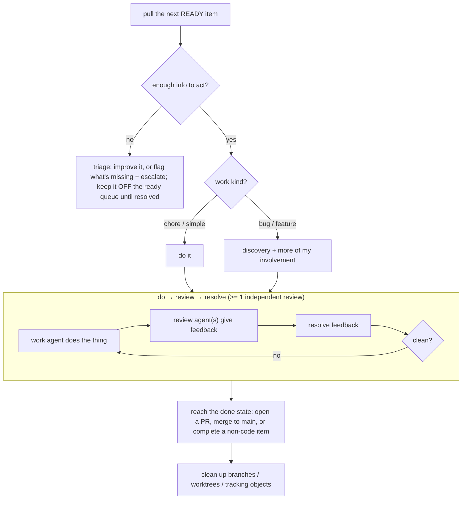

# Truth: Working the backlog

**Status:** Living source of truth. Downstream artifacts conform to this; change
this first.

## Purpose

How the system pulls work from a backlog, makes sure each item is well-formed
enough to act on, routes it through the right workflow for its kind, and produces
the change through a do → review → resolve loop — with me involved only when the
work needs me. Some work ends in code and a merge; some does not. The shape is the
same either way; the difference is only in how the item reaches its done state.

## Actors

- **Me** — set direction, resolve escalations, approve where required.
- **Triage agent** — checks an item is ready; improves or flags what isn't.
- **Work agent** — does the item (code, plan, design, troubleshooting, …).
- **Review agent(s)** — independently review the work and give feedback.
- **The system** — pulls ready work, routes by kind, tracks, integrates, cleans up.

## User stories

- As a user, I want agents to **work through the backlog**, pulling the next ready
  item themselves.
- As a user, I want to drop a **quick one-line item**; if it's simple and
  unambiguous an agent just does it; if it's vague, the system figures out what's
  missing and gets it ready — it doesn't work it blindly.
- As a user, I want **under-specified items improved or escalated**, not guessed
  at; agents do only what they're confident in.
- As a user, I want **different kinds of work to flow through different workflows**
  — a chore may go straight to a PR; a bug or feature needs discovery and more of
  my involvement.
- As a user, I want work **broken into appropriately-sized PRs** (not too large,
  not mixing concerns), including stacked PRs.
- As a user, I want a **do → review → resolve** loop applied across coding,
  planning, design, and troubleshooting — with at least one independent review.
- As a user, I want agents to work across **repos with different integration
  styles** (PR-driven vs. merge-to-main).
- As a user, I want work that doesn't end in code and a merge handled the same
  way — differing only in how it reaches its done state.
- As a user, I want agents to **clean up** after themselves and to **never mark
  external tracker items done** on my behalf.

## Journey



## Invariants (MUST / MUST-NOT)

- An item **MUST** have sufficient information before it is worked; if it doesn't,
  it **MUST** be triaged (improved or escalated), never worked blindly.
- An item that is **not actually ready MUST NOT surface as ready-to-work**. _(the
  quick-capture-vs-ready tension — the readiness signal is an OPEN question)_
- Agents **MUST** do only what they're confident in and **MUST** escalate
  ambiguity to me rather than guess.
- Work **MUST** be split so a PR is not too large and does not mix concerns.
- Every substantive activity (code, plan, design, troubleshoot) **MUST** pass at
  least one **independent** review → resolve pass before it is considered done.
  The review uses the common **review format** — see the _Reviews_ doc.
- Agents **MUST NOT** mark external issue-tracker items (e.g. Jira) as done; they
  **MAY** set in-progress / in-review / release when prompted.
- Completed work **MUST** leave no stray branches, worktrees, or tracking objects.
- _(shared — see invariants doc)_ work is never lost; a stuck item is parked and
  the system continues; usage limits pause-and-resume; a drain runs to empty;
  prefer computation over inference.

## Example — quick capture, then triage

```
$ <capture> "the retry backoff feels wrong on 429s"
  created item ph-8t2  (status: open, label: needs-triage)

triage → "insufficient: no acceptance criteria, no repro. added label
          needs-acceptance-criteria; NOT ready. escalated: is this a bug (wrong
          behavior) or a tuning request?"
```

## Usage scenarios

- **Capture a one-liner:** drop a short description; verify a simple/unambiguous
  one gets worked, while a vague one is held off the ready queue with a reason.
- **Watch routing:** a chore reaches a PR without me; a feature pauses for
  discovery and loops me in.
- **Cross-repo:** the same item in a PR-driven repo opens a PR; in a
  merge-to-main repo it merges to main. Verify the agent picks the right style.

## Failure conditions

- **Ambiguous / under-specified item:** triaged and, if it can't be made ready
  confidently, escalated to me. Not guessed at.
- **Review keeps finding problems:** the do → review → resolve loop repeats; it
  does not integrate until clean.
- **Stuck / usage limit:** park-and-continue / pause-and-resume. _(cross-cutting)_

## Open questions

- **The readiness signal.** A quick capture shows as "ready" but isn't. Labels /
  metadata (e.g. `needs-acceptance-criteria`, `has-open-questions`) could gate it.
  A dedicated **triage role** is the likely owner of this gate — it checks
  readiness, sets/clears the signal, improves what it can, and escalates what it
  can't. Its exact mechanics (which signals, how it decides) remain open, but the
  ownership question ("who adds/removes them") now has a candidate answer.
- **Work-kind taxonomy** (chore / task / bug / feature / …) and the workflow each
  kind flows through.
- **How many review passes** for which situations, and how "what is done when" is
  defined (one reviewer? a panel? which lenses?).
- **Repo integration style:** how does an agent learn a repo is PR-driven vs.
  merge-to-main — config, detection, or declared per repo?
- **Non-code work:** which kinds of work don't end in code + a merge, and how
  their done state differs.
