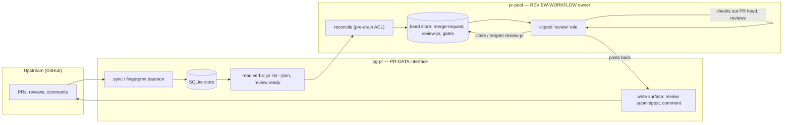
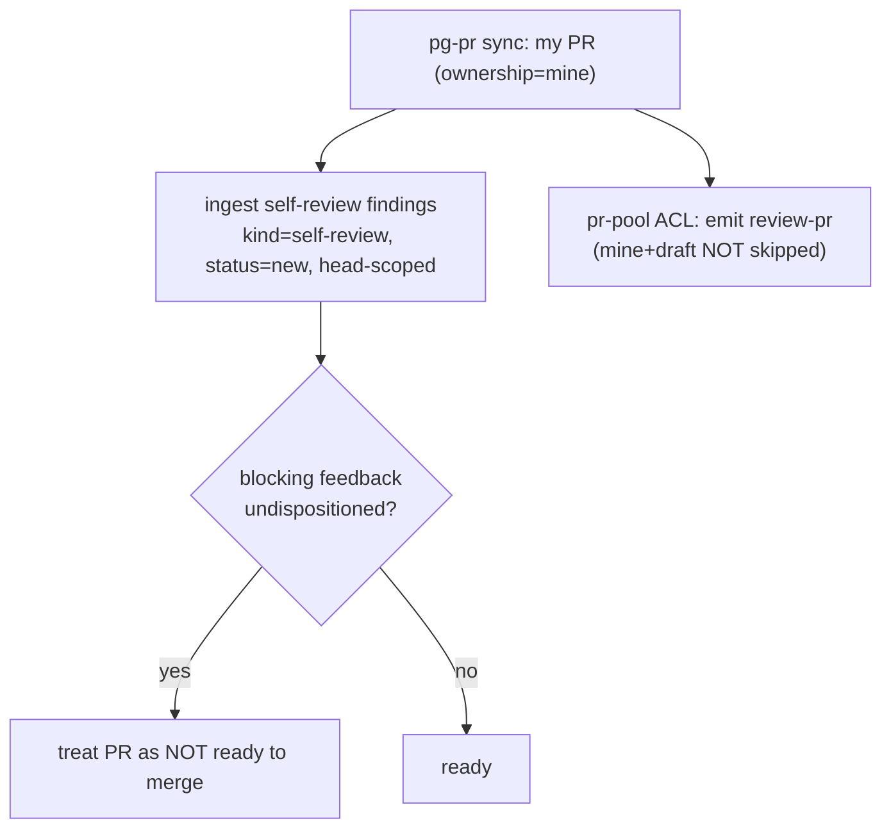
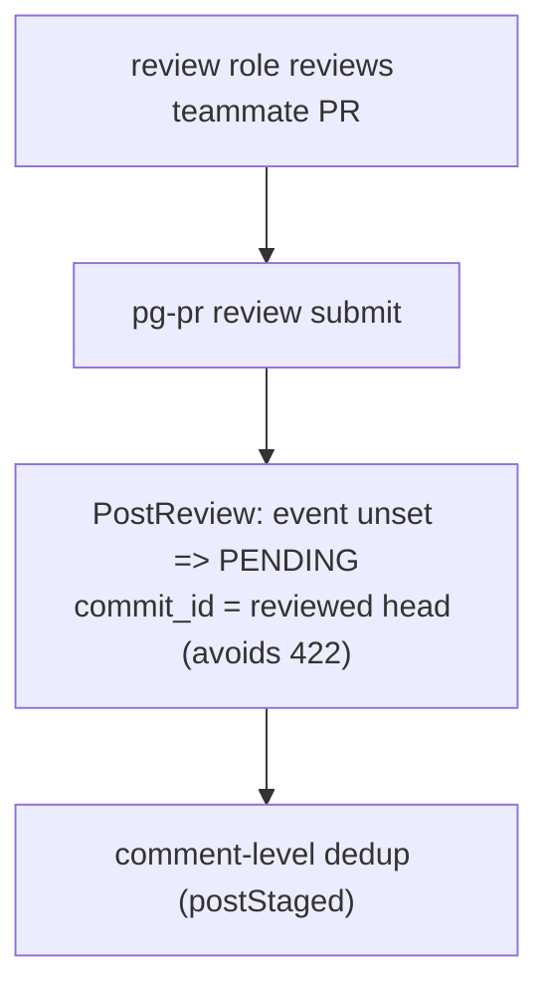
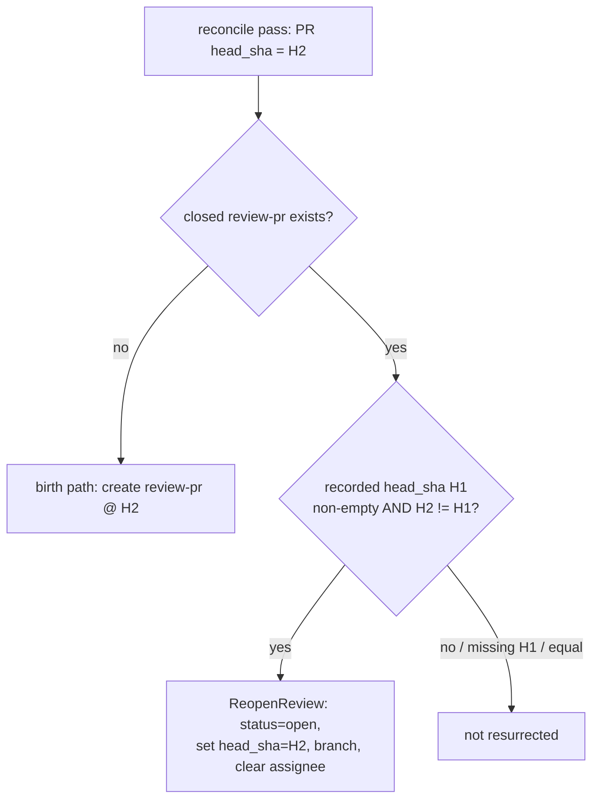

# PR review flow (`pg-pr` ⇄ `pr-pool`)

**Status:** Living — this is the source of truth for review-flow behavior across the
`pg-pr` and `pr-pool` Go modules.
**Verified against:** `main` @ `9ac29c26` (2026-07-09). Re-verify and update the
citations whenever review-flow code changes (see the change policy below).

This doc describes the **post-split** review system: `pg-pr` is the PR-**data**
interface (mirror upstream PR facts into a SQLite store; expose read verbs; push
writes — comment / review / PR-lifecycle), and `pr-pool` **owns the review
workflow** via a ccpool `review` role. It documents the end-to-end user journeys,
each journey's owning component, its acceptance criteria (RFC 2119), the covering
code paths, and its covering tests / coverage goals — so an agent changing the
review flow inherits the intended behavior and can verify correctness.

> Scope note: this repository is a standalone, **public** flake. This doc stays
> deployment-agnostic — it describes mechanisms and code defaults, never a
> specific organization's repos, services, labels, or identities.

---

## 1. Change policy (RFC 2119)

- Any change to review-flow **behavior** (a journey's inputs, outputs, ordering,
  ownership, acceptance criteria, or the bead/metadata contract) **MUST** update
  this doc in the **same** change.
- A change that adds or moves a covering test **SHOULD** update the journey's
  coverage row here.
- The `Verified against` commit at the top **MUST** be advanced when the cited
  `file:line` anchors are re-checked.
- If observed behavior and this doc disagree, that is a defect: the change **MUST**
  either fix the code to match the doc or update the doc to match intended
  behavior — it **MUST NOT** leave the two divergent.

---

## 2. Architecture

### 2.1 The split



- **`pg-pr`** never runs review workflow in the intended end state; it supplies
  facts (`pr list --json`, `review ready`) and accepts write-backs
  (`review submit`, `comment add`).
- **`pr-pool`** projects `review-pr` beads from those facts (the reconcile ACL),
  then a ccpool `review` role drains them: it checks out the untrusted PR head in
  a scratch worktree, runs the review, posts back through `pg-pr`, and closes the
  bead. A re-review cursor reopens the bead when the PR head advances.

### 2.2 As-shipped defaults vs. intended deployment (read this before changing anything)

The code contains **two** review implementations, and which one runs is a
**deployment-config** decision, not a code fact:

| Implementation                                         | What it is                                                                                                                                                          | Gating                                                                                                                                                     |
| ------------------------------------------------------ | ------------------------------------------------------------------------------------------------------------------------------------------------------------------- | ---------------------------------------------------------------------------------------------------------------------------------------------------------- |
| **(A) `pg-pr` in-daemon review**                       | draft-review beads → `reviewHookCycle` → mine/team sinks (self-review feedback + GitHub PENDING with skip-if-present) → `reopenStaleReviews` → 3-strike dead-letter | `review.enabled` — **defaults `true`** (`packages/pg-pr/internal/config/config.go:87-92`)                                                                  |
| **(B) `pr-pool` review workflow** (the intended owner) | reconcile ACL → `review-pr` beads → ccpool `review` role → post back via `pg-pr review submit`                                                                      | the review role ships **enabled by default** in the built-in role set (`packages/pr-pool/internal/roles/builtin.go:83-101`; `Cap = MaxWorker` default `1`) |

**In this repo's built-in defaults, BOTH (A) and (B) are on.** The safe
single-owner resting state depends entirely on an **out-of-repo deployment**
setting `review.enabled=false` (the transition delivered by the epic). This doc
describes **(B) as the target architecture**; it does not claim (A) is off — that
is not true of the code defaults.

- **Hard rule:** exactly **one** review owner **MUST** be active against a given
  shared bead store at a time. Running (A) and (B) concurrently double-writes the
  shared store. The safe-default question is tracked (see §10).
- The transition from (A) to (B) is a **config flip** (`review.enabled=false`),
  not a code deletion. The full code strip of (A) is deferred (see §10).
- Kill-switch mechanics: `review.enabled=false` disables the entire `pg-pr` chain —
  draft-review bead production and the review consumer both
  (`packages/pg-pr/cmd/pg-pr/sync.go:95-118`, `:187-204`;
  `packages/pg-pr/internal/sync/reviewhook.go:103-106`). What stays active
  regardless: PR-data sync, and the read/write CLI surface `(B)` calls.

### 2.3 The review loop (path B)

```mermaid
sequenceDiagram
    participant Op as operator/scheduler
    participant ACL as pr-pool reconcile
    participant PGPR as pg-pr (data)
    participant BD as bead store
    participant Role as ccpool review role
    participant GH as GitHub

    Op->>ACL: pr-pool reconcile (pre-drain)
    ACL->>PGPR: pg-pr pr list --json (network-free, from store)
    PGPR-->>ACL: open PRs {repo, number, ownership, draft, head_sha, branch}
    ACL->>BD: ensure review-pr bead + pg-pr:active-pr gate (idempotent)
    Op->>Role: pr-pool drain
    Role->>BD: claim ready review-pr bead
    Role->>GH: git fetch pull/N/head; checkout head_sha (in scratch worktree)
    Role->>PGPR: pg-pr review submit (post PENDING / self-review feedback)
    PGPR->>GH: PostReview (PENDING, commit_id anchored)
    Role->>BD: close review-pr bead
    ACL->>BD: (next pass) reopen review-pr if head_sha advanced
```

---

## 3. Components & ownership

| Concern                                           | Owner     | Entry point(s)                                                          |
| ------------------------------------------------- | --------- | ----------------------------------------------------------------------- |
| PR data sync / roster detection                   | `pg-pr`   | `packages/pg-pr/internal/sync/detector.go:94-146`                       |
| Read verb `pr list --json`                        | `pg-pr`   | `packages/pg-pr/cmd/pg-pr/pr_list.go:40-108`                            |
| Write surface (`review submit/post`, `comment`)   | `pg-pr`   | `packages/pg-pr/cmd/pg-pr/review.go:84-343`                             |
| GitHub PENDING semantics + 422 anchor             | `pg-pr`   | `packages/pg-pr/pkg/provider/vcs/github/github.go:763-822`              |
| Reconcile (pre-drain ACL)                         | `pr-pool` | `packages/pr-pool/cmd/pr-pool/main.go:30-31` → `reconcile_cmd.go:15-81` |
| `review-pr` bead + gate ensure / re-review cursor | `pr-pool` | `packages/pr-pool/internal/prpoolacl/acl.go:42-163`                     |
| ccpool `review` role                              | `pr-pool` | `packages/pr-pool/internal/roles/builtin.go:83-101`                     |
| Per-bead scratch worktree                         | `pr-pool` | `packages/pr-pool/internal/worktree/worktree.go:31-47`                  |

### 3.1 Bead & metadata contract (reconcile → review role)

| Bead / gate   | Type / title                                  | Sole creator                                                                          | Metadata keys                                                                                                                   |
| ------------- | --------------------------------------------- | ------------------------------------------------------------------------------------- | ------------------------------------------------------------------------------------------------------------------------------- |
| merge-request | `merge-request`                               | **`pg-pr`** (`pr_write.go:343-352`); reconcile only find-or-reuses (`acl.go:104-107`) | `repo`, `pr_number`, `branch`, `base`, `author`, `url`, `draft`                                                                 |
| review-pr     | `task`, title prefix `review-pr: `            | `pr-pool` reconcile (`beads/create.go:15`)                                            | `repo`, `pr_number`, `branch`, `head_sha` (`acl.go:140-145`)                                                                    |
| gate          | `pg-pr:active-pr`, await-id `<repo>#<number>` | `pr-pool` reconcile (`acl.go:20-23`)                                                  | blocks the `review-pr` bead until reconcile confirms the PR is still open; no `bd` auto-resolver — reconcile resolves each pass |

The review role reads `repo` / `pr_number` / `branch` / `head_sha` from the
`review-pr` bead metadata (`builtin.go:35-46`); the worktree is keyed on the bead
ID (`executor/ccpool.go:46`).

---

## 4. Journeys

Each journey lists the **owning component**, **acceptance criteria** (RFC 2119),
**code paths**, and **coverage** (existing tests, plus any coverage goal where a
gap has no test today).

### JR1 — My draft PR review (self-review, block-until-dispositioned)

A PR I authored is reviewed even while it is a GitHub draft; findings are recorded
as **blocking** self-review feedback that must be dispositioned before the PR is
treated as mergeable.



- **Owner:** `pg-pr` (self-review ingest + blocking predicate); `pr-pool` ACL
  selection parity.
- **Acceptance criteria:**
  - A PR authored by the configured self login **MUST** enter the review set even
    while it is a GitHub draft (`ownership=mine` + `draft` **MUST NOT** be skipped).
  - Self-review findings **MUST** be recorded as blocking feedback (kind
    `self-review`) at `status=new`, **head-scoped** (a new head **MUST** yield new
    findings).
  - While blocking feedback is undispositioned the PR **MUST** be treated as
    not-ready-to-merge.
- **Code paths:** `packages/pg-pr/internal/reviewsink/minesink.go:44-139`;
  `packages/pg-pr/internal/store/feedback.go:241-279` (`HasBlockingFeedback`),
  `:281-300` (`SetDisposition`);
  `packages/pg-pr/internal/feedbackclassify/` (head-scoped fingerprint);
  `packages/pr-pool/internal/prpoolacl/acl.go:99-101`.
- **Coverage:** `minesink_test.go` (`TestIngestSelfReview_*`),
  `blocking_feedback_test.go`
  (`TestHasBlockingFeedback_SelfReviewGatesUntilDispositioned`, …),
  `self_review_fingerprint_test.go`, `acl_test.go:347`
  (`TestReconcile_MineDraftReviewed`).
- **Known gap:** the "block" is an **advisory predicate only** — `HasBlockingFeedback`
  is not consulted by any Go merge-decision point (`feedback.go:254-261`);
  enforcement is delegated to the process-feedback **skill** layer. **Coverage
  goal:** if a Go-level merge gate is ever wanted, it needs a new enforcing check
  - test.

### JR2 — Teammate PR review (GitHub PENDING, skip-if-present)

A PR I do not own is reviewed; the review is posted as a GitHub **PENDING** review
through `pg-pr`'s write surface, with inline comments anchored to the reviewed
head so a later head advance does not 422.



- **Owner:** split — PENDING semantics + write surface in `pg-pr`; `pr-pool`
  review role drives it via `pg-pr review submit`.
- **Acceptance criteria:**
  - A review of a PR I do not own **MUST** be posted as a GitHub **PENDING** review
    (event unspecified), via the `pg-pr` write surface.
  - Inline comments **MUST** anchor to the reviewed head SHA (`commit_id`) so a
    head advance does not 422.
  - Re-running the review **SHOULD NOT** create a duplicate PENDING review for the
    same reviewer.
- **Code paths:** `packages/pg-pr/internal/reviewsink/teamsink.go:71-144`
  (`HasPendingReviewByViewer` skip — path A only);
  `packages/pg-pr/pkg/provider/vcs/github/pending.go`;
  `packages/pg-pr/pkg/provider/vcs/github/github.go:763-822` (`PostReview`);
  `packages/pg-pr/cmd/pg-pr/review.go:129-227` (the `review submit` path B uses);
  `packages/pr-pool/internal/roles/builtin.go:44`.
- **Coverage:** `teamsink_test.go`, `pending_test.go`, `review_test.go`
  (`TestReviewSubmit_ForwardsHeadSHAAsCommitID`).
- **Known gaps:**
  - **Skip-if-present is NOT on the `pg-pr review submit` path** the `pr-pool`
    review role uses — `HasPendingReviewByViewer` lives only in the kill-switched
    team sink. On path B, duplicate PENDING reviews are mitigated **only** by
    comment-level dedup. **Coverage goal / fix:** add a viewer-pending skip to the
    submit path (tracked — §10). The `commit_id` 422 anchoring **is** present on
    this path.
  - **Post-back access (resolved for now).** The review role's only completion
    action is `pg-pr review submit`, so under `dontAsk` the pool-wide default
    `AllowedTools` (`config.go:103`) now allow-lists `Bash(pg-pr:*)` — without it
    the post-back was auto-denied (`pg2-vmbn7`, resolved). This is a broad,
    pool-wide, full-`pg-pr` grant chosen deliberately "for now" to exercise the
    flow end-to-end; scoping tool access **per role** (a read-only review vs a
    write-capable worker) is deferred (§10). `gh` stays un-allow-listed — the
    review prompt posts through `pg-pr`, never `gh`.

### JR3 — Requested-reviewer / watch-label surfacing → "PRs to Review"

PRs enter the review set as the union of three buckets and are surfaced
network-free from the store.

- **Owner:** `pg-pr` (sync roster detection + snapshot + `pr list`); `pr-pool`
  consumes the base `pr list --json`.
- **Acceptance criteria:**
  - The review set **MUST** be the union of `team-authored ∪ review-requested-of-me
∪ watch-labeled`, **EXCLUDING** PRs I own, de-duplicated.
  - A PR **MUST NOT** appear in the "PRs to Review" set without a reason
    (team-author / requested / label).
  - `pg-pr pr list --json` (base, no `--reviewers`) **MUST** read from the store
    with **no** network call and **no** store side-effect.
- **Code paths:** `packages/pg-pr/internal/sync/detector.go:94-146`
  (`buildTeamQueries` union; `FingerprintPRs` per bucket; `mergeRosters`);
  `packages/pg-pr/internal/sync/refresh.go:11-15` (`reviewRequestedOfSelf`);
  `packages/pg-pr/internal/config/config.go:127` (`WatchLabels`);
  `packages/pg-pr/internal/snapshot/builder.go:45-128` (reason-tagged; reasonless
  non-mine excluded); `packages/pg-pr/cmd/pg-pr/pr_list.go:40-108`;
  `packages/pr-pool/internal/prpoolacl/acl.go:165-181` (`ReadPRList`).
- **Coverage:** `broaden_test.go`, `reviewrequested_test.go`, `pr_list_test.go`,
  `fingerprint_test.go`, `builder_test.go`.
- **Terminology note:** the **`FingerprintProvider`** decides **which PRs** enter
  the to-review roster in the sync daemon. That is distinct from the reviewer
  roster shown by `pr list --json --reviewers`, which comes from `ListReviews` +
  `classifyRoster` — a separate, best-effort augmentation (one round-trip per PR).

### JR4 — Re-review on head advance (the review cursor)

`pr-pool`'s ACL owns the cursor on the `review-pr` bead: when the PR head advances
past the reviewed SHA, the closed bead is reopened at the new head.



- **Owner:** `pr-pool` ACL (active). `pg-pr`'s `reopenStaleReviews` +
  `reviewed_by_agent_at` still exist but are kill-switched with path A.
- **Acceptance criteria:**
  - A closed `review-pr` bead **MUST** be reopened **only** when the PR `head_sha`
    differs from the bead's recorded `head_sha` and **both** are non-empty.
  - On reopen the bead's `head_sha` and `branch` **MUST** be overwritten and the
    assignee cleared (so a fresh worker reviews the new commit).
  - A closed `review-pr` with no recorded `head_sha` **MUST NOT** be resurrected
    (never review an unknown commit).
- **Code paths:** `packages/pr-pool/internal/prpoolacl/acl.go:112-136`;
  `packages/pr-pool/internal/beads/issue.go:85-102` (`ReopenReview`).
- **Coverage:** `acl_test.go` (`TestReconcile_HeadAdvancedReopensClosedReview`,
  `_HeadUnchangedNotResurrected`, `_LegacyClosedNoHeadSHANotResurrected`,
  `_ClosedReviewNotResurrected`), `reopen_test.go`.
- **Note:** reviewed-state is tracked in **two different stores** — `pg-pr` on the
  SQLite revision (`reviewed_by_agent_at`), `pr-pool` on the bead's `head_sha`
  metadata. They are not synchronized; only the active owner's cursor is
  authoritative.

### JR5 — Reconcile / dead-letter at cutover

A pre-drain reconcile CLI (the anti-corruption layer) idempotently projects beads
from `pg-pr` facts and never strands the following drain.

- **Owner:** `pr-pool` reconcile CLI.
- **Acceptance criteria:**
  - Reconcile **MUST** be idempotent (find-or-reuse; never duplicate a bead).
  - Reconcile **MUST** exit `0` on partial/transient `pg-pr` failures (a
    `pr list` failure is treated as zero PRs) so a following `drain` is never
    stranded on half-created state. (Its own config/self preconditions remain hard
    failures.)
  - Reconcile **MUST NOT** create merge-request beads (`pg-pr` is the sole
    creator); it **MUST** find-or-reuse them.
  - A gate **MUST** be created on the birth path and resolved in a **separate**
    pass, so a crash between create and resolve self-heals.
  - A review that fails **MUST** escalate (add a `human` label) rather than
    silently retry.
  - **Cutover:** exactly one review owner **MUST** be active against a shared bead
    store; `pg-pr`'s review hook **MUST** be disabled (`review.enabled=false`)
    **before** `pr-pool` drains against that store.
- **Code paths:** `packages/pr-pool/cmd/pr-pool/main.go:30-31`,
  `reconcile_cmd.go:15-81` (exit-0-on-partial `:57-81`);
  `packages/pr-pool/internal/prpoolacl/acl.go:42-163`;
  `packages/pr-pool/internal/beads/gate.go:44-97`;
  `packages/pr-pool/internal/roles/builtin.go:97` (`OnFailure=AddHuman`);
  `packages/pr-pool/internal/executor/ccpool.go:114-127`, `:171-182`.
- **Coverage:** `reconcile_acl_test.go`
  (`TestReconcileACL_PgPrUnreachableExitsZero`, `_EmptyExitsZero`),
  `reconcile_cmd_test.go`, `reconcile_test.go` (`TestStrandedSelfCycles_*`),
  `acl_test.go` (`TestReconcile_Idempotent`, `_ExitZeroOnPartial`,
  `_EnsuresReviewChildGateAndResolves`, `_NoMergeRequestSkips`).
- **Known gap:** there is **no classic dead-letter** in the `pr-pool`
  reconcile/review path — reconcile never parks a bead, and a failing review
  escalates via a `human` label. The 3-strike `blocked` + needs-human dead-letter
  exists only in the kill-switched `pg-pr` hook
  (`packages/pg-pr/internal/sync/reviewhook.go:316-342`). Legacy old-schema held
  dead-letter beads are reconciled separately at cutover (deferred — §10).

---

## 5. Review-executor security & isolation (untrusted PR content)

The `review` role runs an **autonomous** agent against an **untrusted** PR head.
These are review-role acceptance criteria; the current posture was audited
2026-07-09 (read-only). Enforcement of the open deltas is tracked separately (§10)
— this section states posture, not a remediation plan.

| Dimension           | Requirement (RFC 2119)                                                                           | Current posture                                                                                                                                                                                                                                                                                                                                                                                                                       |
| ------------------- | ------------------------------------------------------------------------------------------------ | ------------------------------------------------------------------------------------------------------------------------------------------------------------------------------------------------------------------------------------------------------------------------------------------------------------------------------------------------------------------------------------------------------------------------------------- |
| Worktree isolation  | Untrusted PR content **MUST** be checked out in a scratch worktree, never the canonical checkout | **SATISFIED** — per-bead worktree off `repoRoot` HEAD at `$XDG_STATE_HOME/pr-pool/worktrees` (`worktree.go:31-47`; `executor/ccpool.go:42-61`). Caveat: shares the monorepo `.git` + bead store; worktree reused, not torn down.                                                                                                                                                                                                      |
| Permission mode     | The session **MUST** be deny-by-default and **MUST NOT** stall on human prompts                  | **SATISFIED** — `dontAsk` default (`config.go:99`); `--autonomous` denies `AskUserQuestion` (`ccpool hook.go:237-238`).                                                                                                                                                                                                                                                                                                               |
| Allowlist           | The tool allowlist **MUST** be least-privilege for a read-only review of untrusted code          | **PARTIAL** — enforced pool-wide but not per-role; now grants `Bash(pg-pr:*)` so the review post-back works (`pg2-vmbn7` resolved), but that is a broad full-`pg-pr` grant and the list still allows `Edit`/`Write` + code-executing verbs (`go build/test`, `nix flake check`, `prek`) that would execute attacker-controlled code after checkout; per-role least-privilege + the pending human sign-off are deferred (`pg2-f9vcg`). |
| Budget watchdog     | A runaway session **MUST** be bounded                                                            | **SATISFIED** (wall-clock) — finite time budget + hard-stop (`builtin.go:99`; `watchdog.go:123-127`). Token/cost unlimited by default.                                                                                                                                                                                                                                                                                                |
| Credential exposure | The session **MUST NOT** inherit ambient credentials / internal-service reach                    | **MISSING** — the session inherits the full ambient env (`SSH_AUTH_SOCK`, `GH_TOKEN`, cloud creds) with no scrub, on the same OS user (no sandbox/unprivileged execution).                                                                                                                                                                                                                                                            |

The "PARTIAL" allowlist (broad, pool-wide, still grants code-executing verbs on
untrusted content) and the "MISSING" credential deltas are the open isolation
work (§10); scoping tool access per role is tracked as `pg2-f9vcg`. The JR2
post-back is now unblocked — `pg-pr` is allow-listed (`pg2-vmbn7` resolved).

---

## 6. Verification & coverage goals

| Journey | Covering tests (exist)                                                   | Coverage goal (gap)                                                    |
| ------- | ------------------------------------------------------------------------ | ---------------------------------------------------------------------- |
| JR1     | `minesink_test`, `blocking_feedback_test`, `acl_test:347`                | Go-level merge gate (only if enforcement is moved off the skill layer) |
| JR2     | `teamsink_test`, `pending_test`, `review_test`                           | submit-path skip-if-present; review-role allowlist permits `pg-pr`     |
| JR3     | `broaden_test`, `reviewrequested_test`, `pr_list_test`, `builder_test`   | —                                                                      |
| JR4     | `acl_test` (head-advance suite), `reopen_test`                           | —                                                                      |
| JR5     | `reconcile_acl_test`, `reconcile_cmd_test`, `reconcile_test`, `acl_test` | —                                                                      |

**Live end-to-end** verification (one PR I own + one teammate PR through path B,
plus re-review-on-head-advance) against these journeys is **deploy-gated** — it
needs the `pr-pool` review stack running — and is tracked separately (§10). It is
not completable in a worktree.

---

## 7. Related decisions & references (in-repo)

- `docs/adr/0009-pg-pr-bead-schema.md` — bead schema.
- `docs/adr/0012-pg-pr-fingerprint-driven-daemon-sync.md` — the roster-detection
  mechanism behind JR3.
- `docs/adr/0023-agent-pr-comments-visible-bot-attribution.md` — bot attribution
  on posted reviews/comments (JR2).
- `packages/pg-pr/pg-pr.md`, `packages/pr-pool/README.md` — the module docs
  (both cross-reference this doc).
- `docs/superpowers/specs/2026-06-25-pr-pool-event-model-split-role-query-design.md`
  — the role/query coupling that shaped the pre-drain reconcile ACL.
- `docs/superpowers/specs/2026-06-12-ccpool-pool-isolation-design.md`,
  `docs/superpowers/plans/2026-06-23-pr-pool-deny-by-default-allowlist.md` — the
  isolation design behind §5.
- `docs/superpowers/specs/2026-06-11-pr-pool-user-journeys.md` — the **pre-split**
  pr-pool drain mechanics (feedback/worker roles); complementary, not superseded.

---

## 8. Tracking: deferred & discovered work

Behavior described above as a gap or as intended-but-not-yet-safe is tracked in the
issue tracker (bead IDs kept here rather than in the body):

- **Deploy-gated live e2e verification** of path B against these journeys —
  `pg2-ynhr.16`.
- **Review-executor isolation** deltas (credential scrub, unprivileged
  execution) — `pg2-jpfw.9`.
- **Per-role tool access** — the interim grant is a broad, pool-wide
  full-`pg-pr` allowlist; scoping least-privilege per role (read-only review vs
  write-capable worker) + the pending sign-off — `pg2-f9vcg`.
- **Post-back denied by default allowlist** (JR2 functional blocker) — RESOLVED:
  `Bash(pg-pr:*)` added to the default allowlist — `pg2-vmbn7`.
- **Skip-if-present missing on the submit path** (JR2 duplicate-PENDING risk) —
  `pg2-3fo3c`.
- **Both review paths on by default** (double-write hazard; safe-default decision) —
  `pg2-3ho1r`.
- **ADR for the split** (none exists yet) — `pg2-388yn`.
- **Deferred split parity** (full `pg-pr` review strip, multi-repo fan-out, store
  cleanup, scheduler, legacy dead-letter reconcile) — `pg2-ynhr.5`/`.7`/`.8`/`.9`/`.10`.
