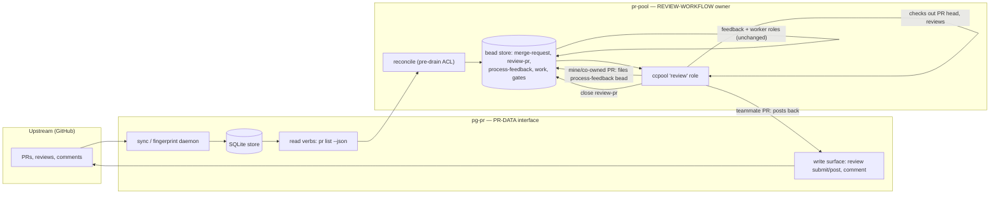
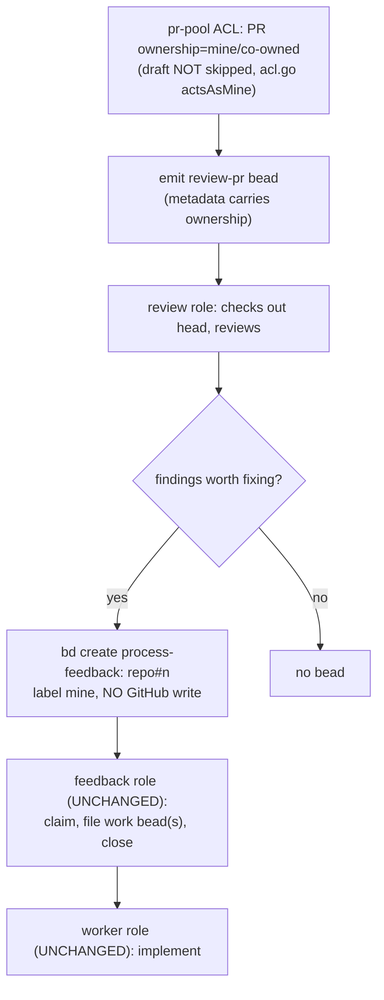
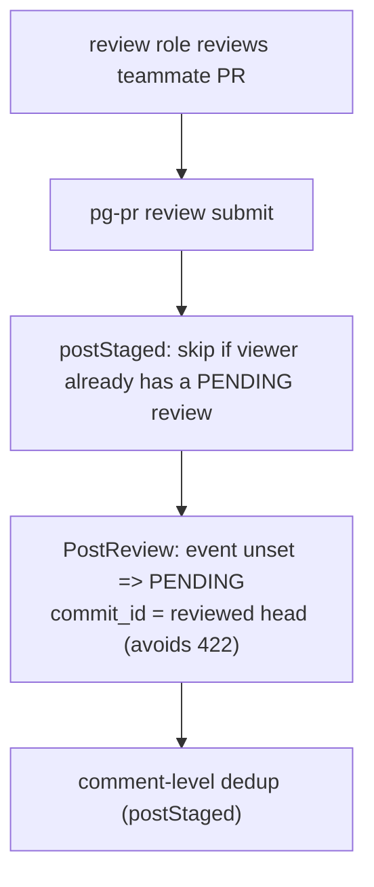
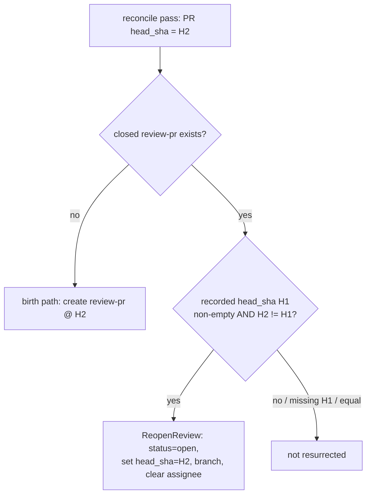
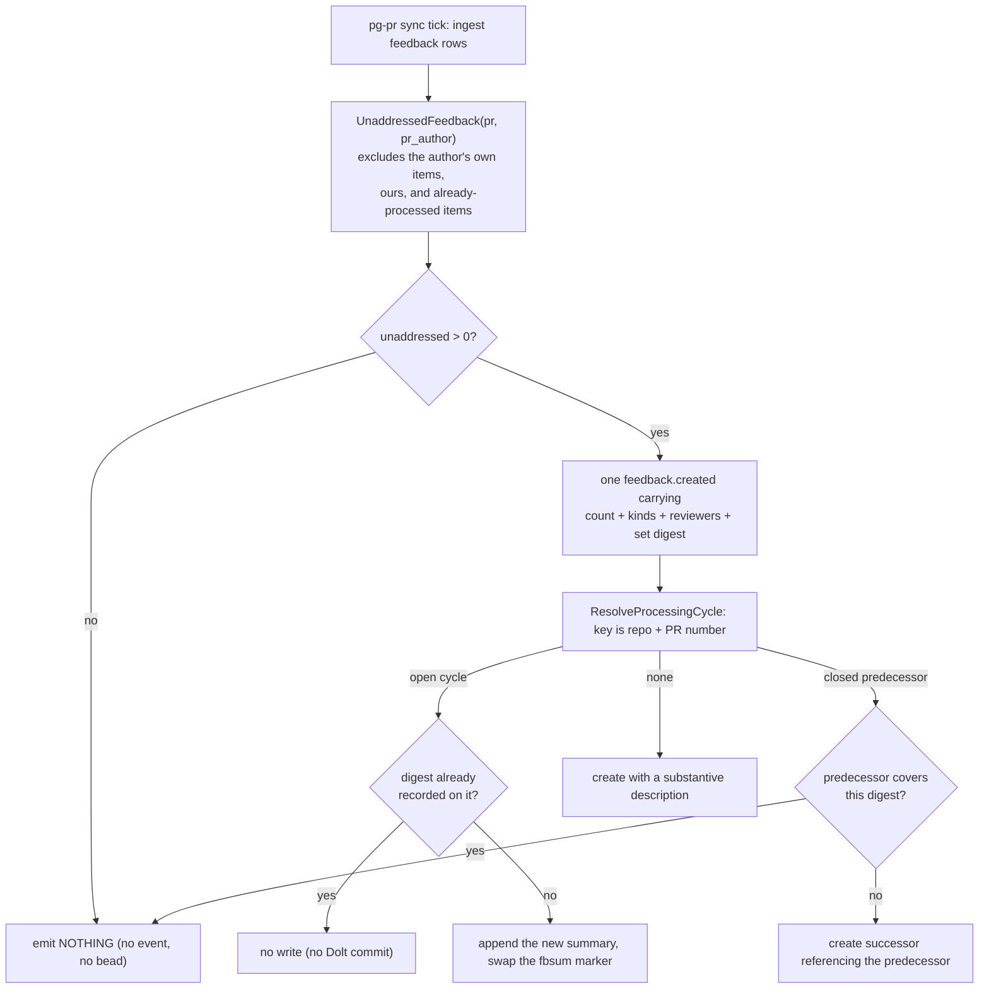

# PR review flow — implementation reference (downstream)

**Status:** **Downstream implementation reference.** pr-pool is a generic orchestrator
([`packages/pr-pool/docs/behavior/`](../packages/pr-pool/docs/behavior/README.md)); the
**review workflow** built on it — reviewing others' PRs, shepherding my own — is a
**deployment** concern, defined in that deployment's own behavior docs, not in this
public repo. This document records **how the `pg-pr` and `pr-pool` code realizes
review-related capabilities today** — journeys mapped to owning components, code paths,
and tests. It is allowed to describe current, tool-specific, and transitional state; it
may lag, and when it and a behavior doc disagree, **the behavior doc wins**.

**Verified against:** `main` @ `9ac29c26` (2026-07-09); §2.2 / JR5 re-verified
2026-07-15 for the `review.enabled` default flip (pg2-3ho1r); §3 / JR2 re-verified
2026-07-29 for multi-line review comments (pg2-3c8mo); all code citations
re-anchored from pinned line ranges to symbol names 2026-07-29 (pg2-p1s8q);
§2.2 gained the explicit `review.enabled` SCOPE + operator-path record
2026-07-29 (pg2-hsap5); JR6 (process-feedback bead identity) added 2026-07-30
for the duplicate/empty-bead fix (pg2-onq1e); JR3's freshness bullets
demoted from authority framing to a cross-link on pg-pr's own behavior-doc
invariants (`INV-ASOF-1`, `INV-ASOF-2`) now that they exist, 2026-08-22
(pg2-e02d5). **Rewritten 2026-08-25 for pg2-ynhr.5**: the legacy `pg-pr`
in-daemon review implementation (`(A)` throughout §2.2/§2.3 below) — draft-review
beads, `reviewHookCycle`, the mine/team sinks, `reopenStaleReviews`,
`stampAgentReviewed`, the credential pre-fetch gate, the attention-bead
projection, and the `review.enabled` kill switch itself — is **fully removed**,
not merely kill-switched off. `pr-pool` is now the SOLE review-workflow
implementation; §2.2's two-implementation framing, and every "kill-switched but
still present" note elsewhere in this doc, describe HISTORY, not current code.
The mine/co-owned (self-review) path is **relocated**, not deleted: it is now
the `pr-pool` review role's own `bd create` of a `process-feedback:` bead
(§2.3, JR1, JR6), which flows through the pre-existing, UNCHANGED
`feedback`/`worker` role chain — it no longer goes through `pg-pr`'s SQLite
feedback table or `HasBlockingFeedback` at all.

**Citation form:** code is cited by **symbol** — a file path plus the
function/type/constant name in parentheses, e.g.
`packages/pg-pr/internal/store/feedback.go` (`HasBlockingFeedback`). Resolve a
citation by grepping the symbol at that path. Pinned line ranges are
deliberately **NOT** used: they drift on every edit to the referenced file and
then point silently at unrelated code.

> Scope note: this repository is a standalone, **public** flake. This doc stays
> deployment-agnostic — mechanisms and code defaults only, never a specific
> organization's repos, services, labels, or identities.

---

## 1. How this doc relates to the behavior docs

- pr-pool's **own** behavior (orchestration: drain, roles, the agent-runner and
  query-source contracts) is defined in
  [`packages/pr-pool/docs/behavior/`](../packages/pr-pool/docs/behavior/README.md).
- The **review workflow** — what a review flow _should_ do — is defined by the
  **deployment** that runs it, in that deployment's own behavior-doc set (kept in its
  own repo). A change to intended review behavior starts **there**; this reference is
  then re-derived to show how the code realizes it.
- This reference **MAY** carry implementation detail the behavior docs deliberately
  exclude: symbol anchors, test names, tool names, and current-vs-transitional
  state.
- If observed code and a behavior doc disagree, that is a defect in the code (or a
  gap to close) — this reference does not override the behavior doc.

---

## 2. Architecture

### 2.1 The split



- **`pg-pr`** runs no review workflow at all; it supplies facts (`pr list
--json`) and accepts write-backs for teammate reviews (`review submit`,
  `comment add`).
- **`pr-pool`** is the **sole** review-workflow implementation. The reconcile
  ACL projects `review-pr` beads from those facts, then a ccpool `review` role
  drains them: it checks out the untrusted PR head in a scratch worktree and
  runs the review. Output routing then splits on the PR's ownership (stamped as
  `review-pr` bead metadata by the ACL, see §3.1): a **teammate** PR posts back
  through `pg-pr`, unchanged from before; a **mine/co-owned** PR (self-review)
  files a `process-feedback:` bead directly — no GitHub write, no `pg-pr`
  involvement at all — which the pre-existing, unchanged `feedback`/`worker`
  role chain then turns into a work item (JR1, JR6). A re-review cursor, now
  carried entirely on the `review-pr` bead's own metadata, reopens the bead
  when the PR head (or its ownership) advances (JR4).

### 2.2 History: the two-implementation transition (pg2-ynhr epic, now complete)

Between 2026-07 and 2026-08-25 the code briefly contained **two** review
implementations while ownership migrated: **(A)** a legacy `pg-pr` in-daemon
review chain (draft-review beads → `reviewHookCycle` → mine/team sinks →
`reopenStaleReviews` → 3-strike dead-letter), gated off by default behind a
`review.enabled` kill switch; and **(B)** the `pr-pool` review workflow
described in §2.1/§2.3, which shipped enabled by default from the start
(pg2-3ho1r). Bead `pg2-ynhr.5` completed the transition on 2026-08-25: **(A) is
now fully removed** — not merely kill-switched off — including the
`review.enabled` config field itself (there is nothing left to switch), and the
mine/co-owned self-review sink it used to own is **relocated** into `pr-pool`'s
review role (§2.3, JR1). This section is kept as a historical record of the
transition's constraints, since the shape of (B) — an independent ACL that
never learns any `pg-pr`-side state — was designed to satisfy them.

- `pr-pool`'s reconcile ACL is an **independent producer** of `review-pr` beads
  (`packages/pr-pool/cmd/pr-pool/reconcile_cmd.go` (`reconcileACL`);
  `packages/pr-pool/internal/prpoolacl/acl.go` (`Reconcile`)) — it was never
  gated on `pg-pr`'s (now-removed) kill switch, and does not learn any `pg-pr`
  configuration state today either. The only seam is the `pg-pr pr list --json`
  CLI (`packages/pg-pr/cmd/pg-pr/pr_list.go` (`prListCmd`) →
  `packages/pr-pool/internal/prpoolacl/acl.go` (`ReadPRList`, `PR`)), which
  carries PR facts only.
- **Operator consequence — stopping review work entirely takes two levers, both
  in `pr-pool`** (there is no `pg-pr`-side switch any more, because there is no
  `pg-pr`-side review code any more): (1) stop invoking `pr-pool reconcile` —
  the ACL runs only inside that verb (`packages/pr-pool/cmd/pr-pool/main.go`
  (`main`)), which takes no flags
  (`packages/pr-pool/cmd/pr-pool/args.go` (`parseReconcileArgs`)) and has no
  config key that disables it; and (2) declare the `review` role with
  `enabled = false` in `<RepoRoot>/.pr-pool/config.toml` so already-emitted
  `review-pr` beads are not drained
  (`packages/pr-pool/internal/config/registry.go` (`buildRole`);
  `packages/pr-pool/internal/roles/builtin.go` (`BuiltinRoleSet`)) — start from
  `pr-pool config --print-defaults`, because a config file's `[[role]]` array
  **replaces** the built-in set rather than overlaying it. This repo schedules
  neither verb; how `reconcile` is triggered is a deployment concern.
- The **teammate-attention** signal (`snapshot.NeedsAttention`, feeding the
  dashboard `needs_attention` bit) is derived purely from `pg-pr`'s own PR
  data — the persisted revision timeline plus the live merge-conflict flag. It
  no longer feeds any BEAD projection at all: the `attention:` bead and its
  producer (`emitAttention` in `internal/sync/prevents.go`,
  `projectAttentionBead` in `internal/beadsbridge/bridge.go`) were removed by
  `pg2-ynhr.5` together with the rest of (A) — the dashboard verdict is the
  only surviving consumer of `NeedsAttention` (FORK2a). Its first-review edge
  previously required a **CLOSED draft-review bead**, which only path (A)
  produced, so that edge was unreachable dead code even before this removal
  ("a teammate PR I have never reviewed" never fired); `pg2-kh1ar` had already
  removed the input and renamed the reason to `unreviewed-by-me`
  (`packages/pg-pr/internal/snapshot/attention.go`). Coverage:
  `TestNeedsAttention_FirstReviewEdgeIsReachable`.

### 2.3 The review loop

```mermaid
sequenceDiagram
    participant Op as operator/scheduler
    participant ACL as pr-pool reconcile
    participant PGPR as pg-pr (data)
    participant BD as bead store
    participant Role as ccpool review role
    participant GH as GitHub

    Op->>ACL: pr-pool reconcile (pre-drain)
    ACL->>PGPR: pg-pr pr list --json (network-free, from store)
    PGPR-->>ACL: open PRs {repo, number, ownership, draft, head_sha, branch, last_synced_at, stale}
    ACL->>ACL: drop rows flagged stale (refuse to act, WARN)
    ACL->>BD: ensure review-pr bead (metadata incl. ownership) + pg-pr:active-pr gate (idempotent)
    Op->>Role: pr-pool drain
    Role->>BD: claim ready review-pr bead
    Role->>GH: git fetch pull/N/head; checkout head_sha (in scratch worktree)
    alt ownership is mine or co-owned
        Role->>BD: bd create process-feedback: repo#n (label mine)
    else ownership is team
        Role->>PGPR: pg-pr review submit (post PENDING)
        PGPR->>GH: PostReview (PENDING, commit_id anchored)
    end
    Role->>BD: close review-pr bead
    ACL->>BD: (next pass) reopen review-pr if head_sha or ownership advanced
    Note over BD: process-feedback bead then flows through the<br/>UNCHANGED feedback role -> work bead -> worker role chain
```

---

## 3. Components & ownership

| Concern                                           | Owner     | Entry point(s)                                                                                                                  |
| ------------------------------------------------- | --------- | ------------------------------------------------------------------------------------------------------------------------------- |
| PR data sync / roster detection                   | `pg-pr`   | `packages/pg-pr/internal/sync/detector.go` (`buildTeamQueries`, `mergeRosters`)                                                 |
| Read verb `pr list --json`                        | `pg-pr`   | `packages/pg-pr/cmd/pg-pr/pr_list.go` (`prListCmd`, `listOpenPRItems`)                                                          |
| Write surface (`review submit/post`, `comment`)   | `pg-pr`   | `packages/pg-pr/cmd/pg-pr/review.go` (`reviewCmd`, `reviewPostCmd`, `reviewSubmitCmd`, `commentAddCmd`)                         |
| Review-input JSON schema (agents → verb)          | `pg-pr`   | `packages/pg-pr/internal/reviewinput/reviewinput.go`                                                                            |
| GitHub PENDING semantics + 422 anchor             | `pg-pr`   | `packages/pg-pr/pkg/provider/vcs/github/github.go` (`PostReview`, `reviewComment`)                                              |
| Reconcile (pre-drain ACL)                         | `pr-pool` | `packages/pr-pool/cmd/pr-pool/main.go` (`main`, its `routeReconcile` arm) → `reconcile_cmd.go` (`runReconcile`, `reconcileACL`) |
| `review-pr` bead + gate ensure / re-review cursor | `pr-pool` | `packages/pr-pool/internal/prpoolacl/acl.go` (`Reconcile`, `ensureReview`)                                                      |
| ccpool `review` role                              | `pr-pool` | `packages/pr-pool/internal/roles/builtin.go` (`BuiltinRoleSet`, its `review` entry)                                             |
| Per-bead scratch worktree                         | `pr-pool` | `packages/pr-pool/internal/worktree/worktree.go` (`Ensure`)                                                                     |

### 3.1 Bead & metadata contract (reconcile → review role)

| Bead / gate   | Type / title                                  | Sole creator                                                                                                                                        | Metadata keys                                                                                                                                                                             |
| ------------- | --------------------------------------------- | --------------------------------------------------------------------------------------------------------------------------------------------------- | ----------------------------------------------------------------------------------------------------------------------------------------------------------------------------------------- |
| merge-request | `merge-request`                               | **`pg-pr`** (`pr_write.go` (`runPRCreate` → `EnsureMergeRequest`)); reconcile only find-or-reuses (`acl.go` (`ensureReview` → `MatchMergeRequest`)) | `repo`, `pr_number`, `branch`, `base`, `author`, `url`, `draft`                                                                                                                           |
| review-pr     | `task`, title prefix `review-pr: `            | `pr-pool` reconcile (`beads/create.go` (`ReviewPRTitlePrefix`, `Create`))                                                                           | `repo`, `pr_number`, `branch`, `head_sha`, `ownership` (`acl.go` (`ensureReview`, its birth path)); `ownership` drives the review role's mine/co-owned-vs-team output routing (§2.3, JR1) |
| gate          | `pg-pr:active-pr`, await-id `<repo>#<number>` | `pr-pool` reconcile (`acl.go` (`activePRGate`))                                                                                                     | blocks the `review-pr` bead until reconcile confirms the PR is still open; no `bd` auto-resolver — reconcile resolves each pass                                                           |

The review role reads `repo` / `pr_number` / `branch` / `head_sha` from the
`review-pr` bead metadata (`builtin.go` (`reviewPromptBody`)); the worktree is
keyed on the bead ID (`executor/ccpool.go` (`run` → `worktree.Ensure`)).

**Review-input schema.** Every producer of a review payload — the
`pg-pr-review-*` agent assets, the `pr-pool` review-role prompt, a human piping
JSON — targets ONE schema, owned by `internal/reviewinput` and rendered verbatim
into `pg-pr review --help` (both prompts deep-link to that help text).
`reviewinput.Decode` is the only adapter from it to `reviewstage.Draft`; it
rejects any key it cannot map instead of dropping it, because
`encoding/json`'s silent unknown-field drop previously blanked every agent
finding (`{Path: "…", Line: 0, Body: ""}`) with no error anywhere. A finding
spanning several lines is expressed as `start_line` + `line` (or a contiguous
`lines` run, whose minimum becomes `start_line` and maximum `line`) and reaches
GitHub as one multi-line review comment; a **non-contiguous** run stays an error,
because GitHub has no representation for a gapped range and both alternatives —
collapsing to the endpoints, truncating to one entry — silently change the
finding (`pg2-3c8mo`). Two gates hold
the schema and its producers together: `reviewinput`'s Go tests plus the
`cmd/pg-pr` golden test, and the `test-pg-pr-review-input-assets` flake check,
which feeds each agent asset's documented example to the built binary (the assets
are markdown outside the Go module's src, so only a repo-level check can see
them drift).

---

## 4. Journeys

Each journey lists the **owning component**, **acceptance criteria** (RFC 2119),
**code paths**, and **coverage** (existing tests, plus any coverage goal where a
gap has no test today).

### JR1 — My draft PR review (self-review, relocated into beads)

A PR I authored (or co-own) is reviewed even while it is a GitHub draft;
findings are recorded as a `process-feedback:` bead — never posted to
GitHub — which the pre-existing `feedback`/`worker` role chain then turns into
ordinary work.



- **Owner:** `pr-pool` end to end — ACL selection (`ensureReview`), the review
  role's mine/co-owned output-routing branch, and the pre-existing
  `feedback`/`worker` role chain it now feeds. `pg-pr` has **no role** in this
  journey any more: it neither ingests self-review findings nor is called by
  the review role for a mine/co-owned PR.
- **Acceptance criteria:**
  - A PR that acts as mine (mine or co-owned; same `actsAsMine` test as
    §2.1's mine/co-owned classification) **MUST** enter the review set even
    while it is a GitHub draft.
  - The review role, for a mine/co-owned `review-pr` bead, **MUST NOT** post
    anything to GitHub and **MUST NOT** call `pg-pr review submit`.
  - If the review produced any findings worth fixing, the review role **MUST**
    file exactly one `process-feedback: <repo>#<pr_number>` bead carrying the
    `mine` label — the exact shape (title prefix + label) the `feedback` role's
    query already selects, so nothing about that role needed to change. If
    nothing was found, it **MUST** create no bead.
  - The review-pr bead **MUST** be closed once the review was produced,
    whether or not a `process-feedback` bead was filed — the review-pr
    obligation is "a review was produced," not "issues exist."
- **Code paths:** `packages/pr-pool/internal/prpoolacl/acl.go` (`actsAsMine`,
  `ensureReview` — stamps `ownership` into the review-pr bead's metadata);
  `packages/pr-pool/internal/roles/builtin.go` (`reviewPromptBody`'s
  mine/co-owned branch; `BuiltinQuerySet`'s `feedback-source` /
  `worker-source` queries, unchanged, are what pick up what this branch
  files).
- **Coverage:** `acl_test.go`
  (`TestReconcile_DraftSelectionMatrix`, `TestReconcile_CoOwnedDraftReviewed`,
  `TestReconcile_EnsuresReviewChildGateAndResolves` — asserts the `ownership`
  metadata stamp); `roles_test.go`
  (`TestReviewPrompt_MineOwnershipFilesProcessFeedbackNotGitHub`,
  `TestReviewPrompt_TeamOwnershipStillPostsToGitHub` — pins the rendered
  prompt's branch by content, the only thing mechanically checkable about a
  prompt an LLM executes); `prpoolacl`'s
  `TestIntegration_MineReviewRelocation_FeedbackToWorkerFlowsEndToEnd`
  (`//go:build integration`) — proves, against a real `bd`, that a bead shaped
  exactly as the mine branch instructs is discovered by the real
  `feedback-source` query, and a work bead shaped as the (unchanged) feedback
  role's own prompt instructs is discovered by the real `worker-source`
  query — the strongest "flows end to end" proof available without literally
  running an LLM (no test in this repo does; role prompts are text handed to
  an agent, never executed here).
- **Note (historical):** before `pg2-ynhr.5`, this journey ran entirely inside
  `pg-pr`: findings were ingested as `kind=self-review` rows in `pg-pr`'s own
  SQLite `feedback` table (head-scoped, gating merges via
  `HasBlockingFeedback` until dispositioned). That machinery
  (`internal/reviewsink/minesink.go`'s `IngestSelfReview`) is deleted; the
  `self-review` feedback **kind** and `HasBlockingFeedback`'s inclusion of it
  are left in place in `packages/pg-pr/internal/store/feedback.go` only as
  historical-data compatibility (a pre-existing undispositioned row from
  before this change must still gate a merge) — no code path can produce a
  new one.

### JR2 — Teammate PR review (GitHub PENDING, skip-if-present)

A PR I do not own is reviewed; the review is posted as a GitHub **PENDING** review
through `pg-pr`'s write surface, with inline comments anchored to the reviewed
head so a later head advance does not 422.



- **Owner:** split — PENDING semantics + write surface in `pg-pr`; `pr-pool`
  review role drives it via `pg-pr review submit`.
- **Acceptance criteria:**
  - A review of a PR I do not own **MUST** be posted as a GitHub **PENDING** review
    (event unspecified), via the `pg-pr` write surface.
  - Inline comments **MUST** anchor to the reviewed head SHA (`commit_id`) so a
    head advance does not 422.
  - A finding covering a contiguous range of lines **MUST** post as ONE multi-line
    review comment (`start_line`..`line`), never truncated to one endpoint; a
    single-line finding **MUST NOT** send `start_line` at all.
  - Re-running the review **SHOULD NOT** create a duplicate PENDING review for the
    same reviewer.
- **Code paths:** `packages/pg-pr/pkg/provider/vcs/github/pending.go`;
  `packages/pg-pr/pkg/provider/vcs/github/github.go` (`PostReview`,
  `reviewComment`);
  `packages/pg-pr/cmd/pg-pr/review.go` (`reviewSubmitCmd` → `postStaged` — the
  `review submit` path B uses; `postStaged` also owns path B's viewer-pending
  skip via `skipExistingPendingReview` / `pendingReviewChecker`);
  `packages/pr-pool/internal/roles/builtin.go` (`reviewPromptBody`).
- **Coverage:** `pending_test.go`, `review_test.go`
  (`TestReviewSubmit_ForwardsHeadSHAAsCommitID`); multi-line spans in
  `github_test.go` (`TestPostReview_MultiLineCommentSendsStartLine`,
  `TestPostReview_DegenerateStartLineIsDropped`) and `review_input_test.go`
  (`TestReviewSubmit_MultiLineFindingPostsAsMultiLineComment`).
- **Known gaps:**
  - **Skip-if-present on the submit path (resolved).** It is **now** on the
    `pg-pr review submit` path the `pr-pool` review role uses:
    `packages/pg-pr/cmd/pg-pr/review.go` (`postStaged` →
    `skipExistingPendingReview`, probing the provider for the optional
    `pendingReviewChecker` capability). The guard sits at the shared choke-point
    both `review post` and `reviewSubmitCmd` funnel through, so a re-run — and a
    `draft`→`post`→re-`draft`→`post` sequence — does not stack a second PENDING
    review; detection failure is **fail-closed**. This gives the team path both
    the viewer-pending skip and comment-level dedup, on top of the `commit_id`
    422 anchoring (`pg2-3fo3c`, resolved).
  - **Post-back access (resolved for now).** The review role's only completion
    action is `pg-pr review submit`, so under `dontAsk` the pool-wide default
    `AllowedTools` (`packages/pr-pool/internal/config/config.go` (`Default` →
    `AllowedTools`)) now allow-lists `Bash(pg-pr:*)` — without it
    the post-back was auto-denied (`pg2-vmbn7`, resolved). This is a broad,
    pool-wide, full-`pg-pr` grant chosen deliberately "for now" to exercise the
    flow end-to-end; scoping tool access **per role** (a read-only review vs a
    write-capable worker) is deferred (§10). `gh` stays un-allow-listed — the
    review prompt posts through `pg-pr`, never `gh`.

### JR3 — Requested-reviewer / watch-label surfacing → "PRs to Review"

PRs enter the review set as the union of three buckets and are surfaced
network-free from the store.

- **Owner:** `pg-pr` (sync roster detection + snapshot + `pr list`); `pr-pool`
  consumes the base `pr list --json`.
- **Behavior-doc contract:** the general freshness obligation this section
  realizes — per-PR freshness on this seam and payload-level freshness on the
  dashboard payload, a missing/unusable as-of time treated fail-closed as
  stale, and pg-pr as the sole computer of that determination — is defined by
  pg-pr's own behavior docs
  ([`packages/pg-pr/docs/behavior/invariants.md`](../packages/pg-pr/docs/behavior/invariants.md)
  — `INV-ASOF-1`, `INV-ASOF-2`). What follows is how the current implementation
  realizes it, illustrative of that contract rather than the authority for it.
- **Acceptance criteria:**
  - The review set **MUST** be the union of `team-authored ∪ review-requested-of-me
∪ watch-labeled`, **EXCLUDING** PRs I own, de-duplicated.
  - A PR **MUST NOT** appear in the "PRs to Review" set without a reason
    (team-author / requested / label).
  - `pg-pr pr list --json` (base, no `--reviewers`) **MUST** read from the store
    with **no** network call and **no** store side-effect.
  - Because that read is network-free, each item carries its own freshness
    (`INV-ASOF-1`): `last_synced_at` (the store's `pull_request.last_synced_at`
    column verbatim, RFC3339 UTC) and `stale` (that as-of time has aged past
    `freshness.BoundSeconds` — two sync intervals, an implementation-level
    tuning recorded in
    [`packages/pg-pr/docs/decisions/freshness.md`](../packages/pg-pr/docs/decisions/freshness.md)
    (`DEC-FRESH-1`) rather than pinned by the behavior doc). A row with no
    usable as-of time is reported `stale`, fail-closed. The human table
    carries the same signal in its `SYNCED` column.
  - The ACL **MUST NOT** act on an item flagged `stale` (`INV-ASOF-1`), and
    computes no staleness policy of its own over these facts (`INV-ASOF-2`):
    it creates no `review-pr` bead for it and **MUST NOT** resolve its
    `pg-pr:active-pr` gate (that gate asserts "pg-pr reports PR open/active",
    which past-bound data cannot support). The refusal is **per PR**, is
    logged (refuse-and-record), and keeps the pass at exit `0`; it self-heals
    on the next pass once pg-pr's sync catches up.
- **Code paths:** `packages/pg-pr/internal/sync/detector.go`
  (`buildTeamQueries` union; `FingerprintPRs` per bucket; `mergeRosters`);
  `packages/pg-pr/internal/sync/refresh.go` (`reviewRequestedOfSelf`);
  `packages/pg-pr/internal/config/config.go` (`RepoConfig.WatchLabels`);
  `packages/pg-pr/internal/snapshot/builder.go` (`matchReasons`, `Build` —
  reason-tagged; reasonless
  non-mine excluded); `packages/pg-pr/cmd/pg-pr/pr_list.go`;
  `packages/pg-pr/internal/freshness/freshness.go` (the one staleness policy,
  shared by this seam and the dashboard payload);
  `packages/pr-pool/internal/prpoolacl/acl.go` (`ReadPRList`, `staleForAction`,
  `actionablePRs`).
- **Coverage:** `broaden_test.go`, `reviewrequested_test.go`, `pr_list_test.go`,
  `fingerprint_test.go`, `builder_test.go`,
  `packages/pg-pr/internal/freshness/freshness_test.go`,
  `packages/pr-pool/internal/prpoolacl/acl_test.go`
  (`TestStaleForAction`, `TestReconcile_StalePRRefusedNoBeadNoGate`,
  `TestReconcile_MissingAsOfRefused`, `TestReconcile_FreshnessGateIsPerPR`,
  `TestReconcile_StaleRowSelfHeals`).
- **Terminology note:** the **`FingerprintProvider`** decides **which PRs** enter
  the to-review roster in the sync daemon. That is distinct from the reviewer
  roster shown by `pr list --json --reviewers`, which comes from `ListReviews` +
  `classifyRoster` — a separate, best-effort augmentation (one round-trip per PR).

### JR4 — Re-review on head advance (the review cursor)

`pr-pool`'s ACL owns the cursor on the `review-pr` bead: when the PR head advances
past the reviewed SHA, the closed bead is reopened at the new head.



- **Owner:** `pr-pool` ACL — the SOLE cursor. `pg-pr`'s equivalents
  (`reopenStaleReviews`, `stampAgentReviewed`, and the
  `pr_revision.reviewed_by_agent_at` SQLite column they wrote) were **removed
  entirely** by `pg2-ynhr.5` (a dropped-column migration, schema v16), not
  merely kill-switched — there is exactly one cursor now, and it lives on the
  `review-pr` bead. The clear-the-assignee half of the invariant below is a
  regression guard from when the legacy implementation's
  `ReopenDraftReview`/`UnclaimDraftReview`/`DeadLetterDraftReview`
  (`packages/pg-pr/pkg/beads/reviewclaim.go`, also removed) set `--status open`
  without clearing the assignee, stranding the bead as `open` + assignee —
  which `bd ready --claim` skips and the next `--claim` rejects ("already
  claimed"), so the PR was never re-reviewed (bd `pg2-jcljm`).
- **Acceptance criteria:**
  - A closed `review-pr` bead **MUST** be reopened when the PR `head_sha`
    differs from the bead's recorded `head_sha` (both non-empty), OR when the
    PR's `ownership` differs from the bead's recorded `ownership` (pg2-ynhr.5:
    the review role's output-routing branch reads `ownership`, so a stale
    value would misroute a PR whose ownership changed between review cycles).
  - On reopen the bead's `head_sha`, `branch`, and `ownership` **MUST** be
    overwritten and the assignee cleared (so a fresh worker re-reviews under
    current facts).
  - A closed `review-pr` with no recorded `head_sha` **MUST NOT** be resurrected
    (never review an unknown commit).
- **Code paths:** `packages/pr-pool/internal/prpoolacl/acl.go` (`ensureReview` —
  its closed-`review-pr` head-advance branch);
  `packages/pr-pool/internal/beads/issue.go` (`ReopenReview`).
- **Coverage:** `acl_test.go` (`TestReconcile_HeadAdvancedReopensClosedReview`,
  `_HeadUnchangedNotResurrected`, `_LegacyClosedNoHeadSHANotResurrected`,
  `_ClosedReviewNotResurrected`, and the `ownership=team` refresh assertion on
  the head-advance test), `reopen_test.go`
  (`TestReopenReview_SetsStatusOpenAndRefreshesMetadata`).

### JR5 — Reconcile / dead-letter at cutover

A pre-drain reconcile CLI (the anti-corruption layer) idempotently projects beads
from `pg-pr` facts and never strands the following drain.

- **Owner:** `pr-pool` reconcile CLI.
- **Acceptance criteria:**
  - Reconcile **MUST** be idempotent (find-or-reuse; never duplicate a bead).
  - Reconcile **MUST** exit `0` on partial/transient `pg-pr` failures (a
    `pr list` failure is treated as zero PRs) so a following `drain` is never
    stranded on half-created state. (Its own config/self preconditions remain hard
    failures.)
  - Reconcile **MUST NOT** create merge-request beads (`pg-pr` is the sole
    creator); it **MUST** find-or-reuse them.
  - A gate **MUST** be created on the birth path and resolved in a **separate**
    pass, so a crash between create and resolve self-heals.
  - A review that fails **MUST** escalate (add a `human` label) rather than
    silently retry.
  - **Cutover (historical, now moot):** during the pg2-ynhr transition,
    exactly one review owner had to be active against a shared bead store, so
    `pg-pr`'s review hook had to be disabled (`review.enabled=false`) before
    `pr-pool` drained against that store. `pg2-ynhr.5` removed the legacy
    `pg-pr` hook and the `review.enabled` field entirely, so there is no
    longer a second owner this criterion could ever apply against.
- **Code paths:** `packages/pr-pool/cmd/pr-pool/main.go` (`main`, its
  `routeReconcile` arm), `reconcile_cmd.go` (`runReconcile`; exit-0-on-partial in
  `reconcileACL`);
  `packages/pr-pool/internal/prpoolacl/acl.go` (`Reconcile`, `ensureReview`);
  `packages/pr-pool/internal/beads/gate.go` (`CreateGate`, `ResolveGate`);
  `packages/pr-pool/internal/roles/builtin.go` (`BuiltinRoleSet`, its `review`
  entry — `OnFailure: AddHuman`);
  `packages/pr-pool/internal/executor/ccpool.go` (`waitFailureResult`,
  `escalateLaunchFailure`).
- **Coverage:** `reconcile_acl_test.go`
  (`TestReconcileACL_PgPrUnreachableExitsZero`, `_EmptyExitsZero`),
  `reconcile_cmd_test.go`, `reconcile_test.go` (`TestStrandedSelfCycles_*`),
  `acl_test.go` (`TestReconcile_Idempotent`, `_ExitZeroOnPartial`,
  `_EnsuresReviewChildGateAndResolves`, `_NoMergeRequestSkips`).
- **Known gap:** there is **no classic dead-letter** in the `pr-pool`
  reconcile/review path — reconcile never parks a bead, and a failing review
  escalates via a `human` label. The legacy `pg-pr` hook's 3-strike `blocked` +
  needs-human dead-letter (`reviewhook.go`'s `handleProductionFailure`,
  `maxReviewFailures`) no longer exists at all (`pg2-ynhr.5` removed the whole
  file). Legacy old-schema held dead-letter beads it left behind are
  reconciled separately, explicitly out of this bead's scope — `pg2-ynhr.7`/
  `.9`/`.10` (deferred — §10).

### JR6 — Process-feedback bead identity (one bead per PR, only when there is work)

The beads `pg-pr sync` projects for a PR are keyed on **(repo, PR number)** and are
produced only when the sync actually surfaced feedback that still needs processing.

**Two producers, one bead shape (pg2-ynhr.5).** A `process-feedback:` bead
comes from either of two independent sources today: (1) `pg-pr`'s own ingest
path — comments, review threads, CI failures — described by this journey, via
the SQLite `feedback` table → `feedback.created` event →
`beadsbridge.ensureProcessFeedbackBead`, entirely UNCHANGED by `pg2-ynhr.5`;
or (2) `pr-pool`'s review role filing one directly via `bd create` for a
mine/co-owned self-review (JR1) — a completely separate path that never
touches `pg-pr`'s store, events, or beadsbridge at all. Both land on the exact
same bead shape (`process-feedback: <repo>#<pr_number>`, `mine` label), which
is why the `feedback`/`worker` role chain downstream needed no changes.



- **Owner:** `pg-pr` for the ingest-sourced producer (ingest summary +
  beadsbridge projection + bd wrappers) — everything below in this journey.
  The self-review-sourced producer is `pr-pool`'s review role, covered by
  JR1, and is not otherwise discussed here.
- **Acceptance criteria:**
  - A process-feedback bead **MUST** be identified by `(repo, pr_number)` — its title
    tail — **NOT** by the merge-request bead that parents it. A re-sync **MUST**
    update the existing OPEN bead for that key and **MUST NOT** create a second one.
  - At most ONE `merge-request` bead **MUST** exist per `(repo, pr_number)`; a
    re-sync **MUST** update the canonical one. When duplicates already exist the
    canonical pick **MUST** be deterministic (open over closed, then most recently
    synced, then lowest id) so updates cannot alternate between them.
  - A process-feedback bead **MUST NOT** be created when the sync surfaced no
    unaddressed feedback. Items authored by the **PR author** — which includes an
    agent reply posted on their behalf, because `pg-pr` posts under the user's own
    login — **MUST NOT** count as feedback needing processing, and neither **MUST**
    marker-detected "ours" items (except `self-review`, which exists to be
    processed).
  - When a CLOSED process-feedback bead already covers the same unaddressed set, a
    successor **MUST NOT** be opened; when the set has changed, the successor's
    description **MUST** reference the closed predecessor.
  - Every bead description **MUST** carry substance — at minimum the count and kinds
    of unaddressed items — so a drain session can triage without a VCS API call. The
    title **MUST NOT** be copied verbatim as the description.
  - The re-sync path **MUST** be diff-before-write: an unchanged feedback set
    **MUST** issue no `bd` write (every write is a Dolt commit, and the daemon
    re-projects every tick).
  - Collapsing beads that are ALREADY duplicated is an operator-scheduled data
    migration. The audit surface **MUST** stay read-only — `pg-pr sync duplicates`
    reports the excess ids and **MUST NOT** grow an apply/fix mode.
  - A duplicate that has been **ADJUDICATED** — resolved against a NAMED canonical
    bead sharing its identity — **MUST NOT** be counted, so a completed reconcile
    moves the total and the total can serve as a "MUST NOT increase" regression
    baseline. The discriminator **MUST** be structural — a `supersedes` dependency
    edge between two beads of the same identity — and **MUST NOT** be a match on the
    close reason. A duplicate that is merely CLOSED is **NOT** adjudicated and
    **MUST** still be counted. The edge **MUST** name another member of the same
    identity; an adjudication pointing outside the group **MUST** be ignored.
- **Code paths:** `packages/pg-pr/internal/store/feedback.go`
  (`UnaddressedFeedback`, `processableFeedbackKinds`,
  `unaddressedFeedbackStatuses`);
  `packages/pg-pr/internal/store/event.go` (`FeedbackSummary`, `FeedbackPayload`);
  `packages/pg-pr/internal/sync/ingest.go` (`emitFeedbackEvent`);
  `packages/pg-pr/internal/beadsbridge/bridge.go` (`ensureProcessFeedbackBead`,
  `fbsumLabelPrefix`, `renderCycleDescription`, `renderCycleNote`);
  `packages/pg-pr/pkg/beads/processingcycle.go` (`ProcessingCycleKey`,
  `ResolveProcessingCycle`, `CreateProcessingCycleInput`,
  `AppendProcessingCycleNote`, `FindDuplicateProcessingCycles`);
  `packages/pg-pr/pkg/beads/mergerequest.go` (`pickCanonicalMergeRequest`,
  `FindDuplicateMergeRequests`);
  `packages/pg-pr/pkg/beads/adjudication.go` (`adjudicationEdgeType`,
  `adjudicatedIdentities`, `dropAdjudicated`);
  `packages/pg-pr/cmd/pg-pr/sync_duplicates.go` (`syncDuplicatesCmd`,
  `duplicatePopulation`, `duplicateExclusion`).
- **Coverage:** `unaddressed_feedback_test.go`
  (`TestUnaddressedFeedbackExcludesPRAuthor`, `_ExcludesOursExceptSelfReview`,
  `_ExcludesProcessedAndInactive`, `_DigestTracksTheSet`);
  `ingest_selffeed_test.go` (`TestIngestEmitsNothingWhenOnlyTheAuthorCommented`,
  `_EmitsOneEventWithSubstanceForRealFeedback`,
  `TestIngestReSyncAfterDispositionEmitsNothing`);
  `process_feedback_dedup_test.go` (`TestProcessFeedbackKeyedOnRepoAndPRNumber`,
  `TestReSyncUpdatesOpenCycleInsteadOfCreatingASecond`,
  `TestReSyncWithUnchangedFeedbackWritesNothing`,
  `TestNoBeadWhenNothingUnaddressed`,
  `TestClosedPredecessorCoveringSameSetIsNotRecreated`,
  `TestClosedPredecessorWithNewFeedbackCreatesReferencingSuccessor`,
  `TestCycleDescriptionCarriesSubstance`);
  `duplicate_test.go` (`TestEnsureMergeRequestUpdatesCanonicalNeverCreatesASecond`,
  `TestCanonicalMergeRequestPickIsDeterministic`,
  `TestResolveProcessingCycleFindsOpenCycleAcrossParents`, `…TitleMatchIsExact`,
  `…ReportsNewestClosedPredecessor`, `TestFindDuplicate*`);
  `adjudication_test.go` (`TestAdjudicatedIdentitiesRequiresBothEndpointsInTheGroup`,
  `TestAdjudicatedIdentitiesIsTransitive`,
  `TestDropAdjudicatedKeepsTheCanonicalNotTheEdgeSource`);
  `sync_duplicates_test.go` (`TestSyncDuplicatesHasNoMutatingFlag`,
  `TestSyncDuplicatesStatesTheAdjudicationExclusion`).
- **Known gap:** the acceptance measurement — open process-feedback count equal to
  the distinct-PR count in a live workspace — can only be confirmed after the fixed
  daemon is deployed and has re-synced. The already-duplicated beads WERE reconciled
  by the operator on 2026-08-14 (201 excess beads closed against named canonicals),
  and their adjudications were back-filled as `supersedes` edges, so the audit now
  reports 0 excess in that workspace and the number is usable as a baseline.
  `pg-pr sync duplicates` remains the read-only measurement; the reconcile itself is
  deliberately not automated.

---

## 5. Review-executor security & isolation (untrusted PR content)

The `review` role runs an **autonomous** agent against an **untrusted** PR head.
These are review-role acceptance criteria; the current posture was audited
2026-07-09 (read-only). Enforcement of the open deltas is tracked separately (§10)
— this section states posture, not a remediation plan.

| Dimension           | Requirement (RFC 2119)                                                                           | Current posture                                                                                                                                                                                                                                                                                                                                                                                                                       |
| ------------------- | ------------------------------------------------------------------------------------------------ | ------------------------------------------------------------------------------------------------------------------------------------------------------------------------------------------------------------------------------------------------------------------------------------------------------------------------------------------------------------------------------------------------------------------------------------- |
| Worktree isolation  | Untrusted PR content **MUST** be checked out in a scratch worktree, never the canonical checkout | **SATISFIED** — per-bead worktree off `repoRoot` HEAD at `$XDG_STATE_HOME/pr-pool/worktrees` (`packages/pr-pool/internal/worktree/worktree.go` (`Ensure`); `executor/ccpool.go` (`run`)). Caveat: shares the monorepo `.git` + bead store; worktree reused, not torn down.                                                                                                                                                            |
| Permission mode     | The session **MUST** be deny-by-default and **MUST NOT** stall on human prompts                  | **SATISFIED** — `dontAsk` default (`packages/pr-pool/internal/config/config.go` (`Default` → `PermissionMode`)); `--autonomous` denies `AskUserQuestion` (`packages/ccpool/cmd/ccpool/hook.go` (`handleAskHook`, `askDenyReason`)).                                                                                                                                                                                                   |
| Allowlist           | The tool allowlist **MUST** be least-privilege for a read-only review of untrusted code          | **PARTIAL** — enforced pool-wide but not per-role; now grants `Bash(pg-pr:*)` so the review post-back works (`pg2-vmbn7` resolved), but that is a broad full-`pg-pr` grant and the list still allows `Edit`/`Write` + code-executing verbs (`go build/test`, `nix flake check`, `prek`) that would execute attacker-controlled code after checkout; per-role least-privilege + the pending human sign-off are deferred (`pg2-f9vcg`). |
| Budget watchdog     | A runaway session **MUST** be bounded                                                            | **SATISFIED** (wall-clock) — finite time budget + hard-stop (`builtin.go` (`BuiltinRoleSet` → `BuiltinParams.WorkerBudget`); `watchdog.go` (`Run`, its `budget.Hard` branch → `terminal`)). Token/cost unlimited by default.                                                                                                                                                                                                          |
| Credential exposure | The session **MUST NOT** inherit ambient credentials / internal-service reach                    | **MISSING** — the session inherits the full ambient env (`SSH_AUTH_SOCK`, `GH_TOKEN`, cloud creds) with no scrub, on the same OS user (no sandbox/unprivileged execution).                                                                                                                                                                                                                                                            |

The "PARTIAL" allowlist (broad, pool-wide, still grants code-executing verbs on
untrusted content) and the "MISSING" credential deltas are the open isolation
work (§10); scoping tool access per role is tracked as `pg2-f9vcg`. The JR2
post-back is now unblocked — `pg-pr` is allow-listed (`pg2-vmbn7` resolved).

---

## 6. Verification & coverage goals

| Journey | Covering tests (exist)                                                                                                                                                                                                                                                                                                                               | Coverage goal (gap)                                                          |
| ------- | ---------------------------------------------------------------------------------------------------------------------------------------------------------------------------------------------------------------------------------------------------------------------------------------------------------------------------------------------------- | ---------------------------------------------------------------------------- |
| JR1     | `acl_test` (`TestReconcile_DraftSelectionMatrix`, `TestReconcile_EnsuresReviewChildGateAndResolves`), `roles_test` (`TestReviewPrompt_MineOwnershipFilesProcessFeedbackNotGitHub`, `TestReviewPrompt_TeamOwnershipStillPostsToGitHub`), `prpoolacl`'s `TestIntegration_MineReviewRelocation_FeedbackToWorkerFlowsEndToEnd` (build-tag `integration`) | — (a real LLM executing the review role's prompt is deploy-gated, see below) |
| JR2     | `pending_test`, `review_test`                                                                                                                                                                                                                                                                                                                        | — (submit-path skip-if-present and the `pg-pr` allowlist both resolved)      |
| JR3     | `broaden_test`, `reviewrequested_test`, `pr_list_test`, `builder_test`                                                                                                                                                                                                                                                                               | —                                                                            |
| JR4     | `acl_test` (head-advance suite, incl. the `ownership` refresh), `reopen_test`                                                                                                                                                                                                                                                                        | —                                                                            |
| JR5     | `reconcile_acl_test`, `reconcile_cmd_test`, `reconcile_test`, `acl_test`                                                                                                                                                                                                                                                                             | —                                                                            |
| JR6     | `unaddressed_feedback_test`, `ingest_selffeed_test`, `process_feedback_dedup_test`, `duplicate_test`, `sync_duplicates_test`                                                                                                                                                                                                                         | Live open-count == distinct-PR-count measurement (deploy-gated)              |

**Live end-to-end** verification (one PR I own + one teammate PR through the
review role, plus re-review-on-head-advance) against these journeys is
**deploy-gated** — it needs the `pr-pool` review stack running with a real LLM
executing the review role's prompt, which no test in this repo does — and is
tracked separately (§10). It is not completable in a worktree.

---

## 7. Related decisions & references (in-repo)

- `docs/adr/0009-pg-pr-bead-schema.md` — bead schema.
- `docs/adr/0012-pg-pr-fingerprint-driven-daemon-sync.md` — the roster-detection
  mechanism behind JR3.
- `docs/adr/0023-agent-pr-comments-visible-bot-attribution.md` — bot attribution
  on posted reviews/comments (JR2).
- `docs/adr/0034-pg-pr-prpool-review-ownership-split.md` — the pg-pr/pr-pool
  review-ownership split (this doc is its living implementation reference).
- `packages/pg-pr/pg-pr.md`, `packages/pr-pool/README.md` — the module docs
  (both cross-reference this doc).
- `docs/superpowers/specs/2026-06-25-pr-pool-event-model-split-role-query-design.md`
  — the role/query coupling that shaped the pre-drain reconcile ACL.
- `docs/superpowers/specs/2026-06-12-ccpool-pool-isolation-design.md`,
  `docs/superpowers/plans/2026-06-23-pr-pool-deny-by-default-allowlist.md` — the
  isolation design behind §5.
- `docs/superpowers/specs/2026-06-11-pr-pool-user-journeys.md` — the **pre-split**
  pr-pool drain mechanics (feedback/worker roles); complementary, not superseded.

---

## 8. Tracking: deferred & discovered work

Behavior described above as a gap or as intended-but-not-yet-safe is tracked in the
issue tracker (bead IDs kept here rather than in the body):

- **Deploy-gated live e2e verification** of the review role against these
  journeys — `pg2-ynhr.16`.
- **Review-executor isolation** deltas (credential scrub, unprivileged
  execution) — `pg2-jpfw.9`.
- **Per-role tool access** — the interim grant is a broad, pool-wide
  full-`pg-pr` allowlist; scoping least-privilege per role (read-only review vs
  write-capable worker) + the pending sign-off — `pg2-f9vcg`.
- **Post-back denied by default allowlist** (JR2 functional blocker) — RESOLVED:
  `Bash(pg-pr:*)` added to the default allowlist — `pg2-vmbn7`.
- **Skip-if-present missing on the submit path** (JR2 duplicate-PENDING risk) —
  RESOLVED: `postStaged` owns a fail-closed viewer-pending skip
  (`skipExistingPendingReview`) at the shared choke-point both `review post` and
  `review submit` funnel through — `pg2-3fo3c`.
- **Both review paths on by default** (double-write hazard; safe-default decision) —
  RESOLVED: `review.enabled` defaulted `false` from pg2-3ho1r onward, and the
  field (along with the rest of the legacy `pg-pr` review chain it gated) was
  removed entirely by `pg2-ynhr.5` — there is no second review owner left to
  double-write.
- **ADR for the split** (none exists yet) — `pg2-388yn`.
- **Full `pg-pr` review strip + mine-relocation** — RESOLVED 2026-08-25:
  `pg2-ynhr.5` removed `reviewhook`/`Spawner`/`prefetch`/`reviewsink`/the
  `reviewstage` result sidecar/the attention-bead projection/
  `reviewed_by_agent_at` (+ its writers)/`SetReviewHook`/`review.enabled`, and
  relocated the mine/co-owned self-review sink into `pr-pool`'s review role
  (JR1). `HasBlockingFeedback`'s "block-until-dispositioned merge loop" named
  in the original bead turned out not to be a Go loop at all — it is (and
  remains) a predicate the bd/skill layer consults, unrelated to any
  daemon-side hook, so nothing there needed to change. The event outbox
  (`store/outbox.go`) turned out to still have several other live consumers
  (merge-request / process-feedback / cascade-close projection all flow
  through it, unchanged) — it was NOT its review-workflow consumer's last
  one — so it was kept as-is rather than removed or repurposed.
- **Deferred split parity remaining** (multi-repo fan-out, store cleanup,
  scheduler, legacy dead-letter reconcile) — `pg2-ynhr.7`/`.8`/`.9`/`.10`.
