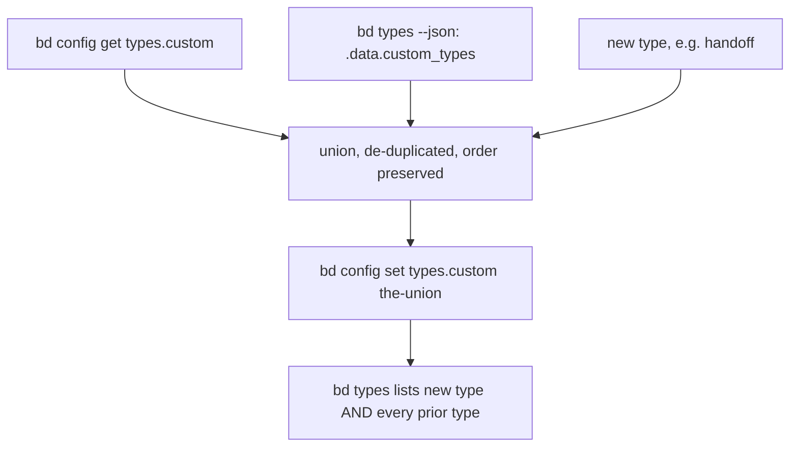

# Runbook: registering a bd custom issue type (read-modify-write)

How to make `bd create -t <type>` / `bd update -t <type>` accept a custom issue
type (for example `handoff`, the session-wrapup pointer type) in a beads
database. Custom types are per-database state, so the step MUST be run once per
tracker (database) that will hold beads of that type.

## Provisioning status: imperative, not declarative

Nothing in the nix repos provisions `types.custom`. The nix-provisioned
`.beads` client config (`metadata.json`, `config.yaml`, `dolt-server.port`)
covers only how a clone reaches the shared server; `types.custom` is a row in
the database's own `config` table (not in `config.yaml`). It persists across a
nix rebuild but is NOT recreated for a fresh database. Registering a type is
therefore a manual, one-time step per database, and anyone who re-creates a
database (or stands up a new tracker) MUST repeat it.

## Why a naive `bd config set types.custom <list>` is unsafe

Verified against bd 1.2.2 (originally; both machine builds are now 1.3.1, and this behavior has
not been re-probed on 1.3.1).

- `bd config set types.custom <list>` REPLACES the whole list. Passing only the
  new type silently unregisters every other custom type (including
  `merge-request`, which pg-pr depends on).
- The type check that `bd create`/`bd list -t` run is NOT driven by the
  `types.custom` config value alone. bd keeps a separate `custom_types` table
  and validates against it; `bd types` lists that table, and the "invalid issue
  type" error prints it. The two can differ: a database MAY hold types in the
  table that its `types.custom` value no longer lists (observed: `convergence`,
  `session`, `spec` in one database, `feedback` in another). bd syncs the table
  from the config value when it is set, and it is not verified that the sync
  keeps table-only rows, so a read-modify-write MUST start from the UNION of
  both so nothing is dropped.
- `bd config get types.custom` prints the bare value, or the literal text
  `types.custom (not set)` (exit 0) when unset. The `(not set)` text MUST NOT be
  treated as a type list.



## Procedure (idempotent; run once per database)

`<tracker-root>` is the directory whose `.beads/metadata.json` names the target
database. Always pass it explicitly with `bd -C` (the working directory
otherwise decides which database is touched). Do NOT start a dolt server for
this; the shared server MUST already be running.

```bash
T=<tracker-root>
NEW=handoff

cfg="$(bd -C "$T" config get types.custom)"
case "$cfg" in *"(not set)"*) cfg="" ;; esac
tbl="$(bd -C "$T" types --json | jq -r '.data.custom_types | join(",")')"

want="$(printf '%s,%s,%s\n' "$cfg" "$tbl" "$NEW" | tr ',' '\n' | awk 'NF && !seen[$0]++' | paste -sd, -)"
echo "current config: $cfg"
echo "current table : $tbl"
echo "will set      : $want"
```

Inspect the three lines; `will set` MUST contain every entry from both
`current` lines plus `handoff`. Then, only if it does:

```bash
bd -C "$T" config set types.custom "$want"
```

Re-running is a no-op in effect: the union is unchanged once `handoff` is
present.

## Verification (observable outcomes)

Run all of these from a fresh `bd` process, against the same `-C "$T"`:

```bash
bd -C "$T" config get types.custom      # includes handoff AND merge-request
bd -C "$T" types                        # Configured custom types lists handoff + every prior type
bd -C "$T" list -t handoff --all -n 0   # succeeds (empty list), no "invalid issue type" error
```

Then prove creation works with a throwaway bead and close it (use a per-session
`--actor`, never the operator's name):

```bash
id="$(bd -C "$T" create "throwaway: handoff type probe" -t handoff --actor "<session-id>" --silent)"
bd -C "$T" close "$id" --reason "type registration probe" --actor "<session-id>"
```

If any prior type is missing from `bd types` after the set, re-run
`bd -C "$T" config set types.custom` with that type appended by hand to the
`will set` value printed before the first set (keep that output).

## Consumers must tolerate an unregistered type

A database that has not had the step run rejects the type with
`invalid issue type "<type>"`. A creator of typed beads SHOULD fall back to
`task` exactly once on that error rather than fail the whole operation, so a
database that has not been migrated yet degrades instead of breaking.

## Which bd build

Both builds of bd on this machine (the machine wrapper and the unwrapped
upstream build used by some dispatched sessions; both are 1.3.1 since the
2026-10-08 upgrade, earlier both were 1.2.2) read the same database state, so one registration covers both. After registering, confirm the
unwrapped build agrees:
`<store-path-of-that-build>/bin/bd -C "$T" types` lists the new type.
