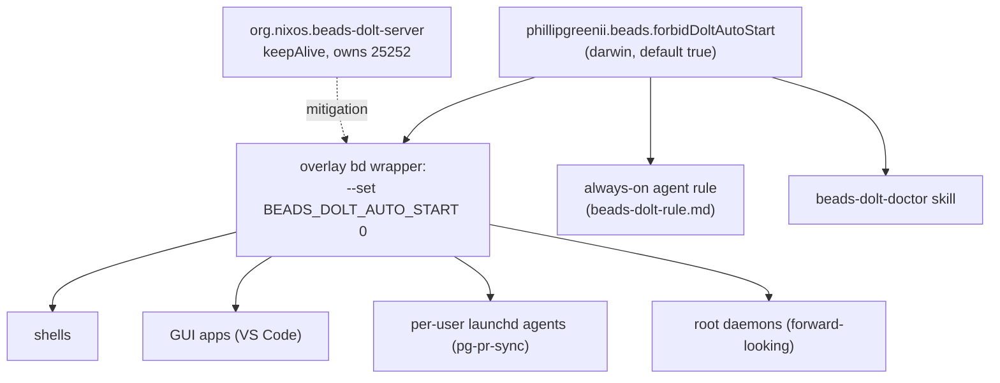

# Runbook: beads/dolt "no rogue auto-start"

Operational reference for the machine-wide guarantee that no context silently
auto-starts a competing `dolt sql-server`. Design:
`docs/superpowers/specs/2026-07-24-beads-dolt-no-autostart-design.md`. Decision:
`docs/adr/0032-beads-dolt-no-autostart.md`. Agent-facing debugging skill:
`beads-dolt-doctor` (in this repo's `claude-marketplace/`).

## The invariant

One dolt server is legitimate: the shared per-user launchd agent
`org.nixos.beads-dolt-server` (`keepAlive=true`), owning `127.0.0.1:25252` and
serving the real data under `~/.local/share/beads-dolt`. The machine-wide `bd`
(the overlay/`package.nix` wrapper) exports `BEADS_DOLT_AUTO_START=0`, so no
context transparently auto-starts a server. This is gated by the single flag
`phillipgreenii.beads.forbidDoltAutoStart` (darwin scope, default `true`).



## Config use-case matrix

How each context gets its `bd` and whether it can auto-start a server.

| Context                    | How it starts          | Sees shell env? | How it gets the default | Real `bd` consumer today?                      |
| -------------------------- | ---------------------- | --------------- | ----------------------- | ---------------------------------------------- |
| User CLI shell             | interactive login      | yes             | overlay `bd` wrapper    | yes                                            |
| GUI app (VS Code)          | launchd `gui/UID`      | no              | overlay `bd` wrapper    | yes (extension — being removed)                |
| Per-user launchd agent     | plist, `gui/UID`       | no              | overlay `bd` wrapper    | yes (`pg-pr-sync`)                             |
| Root/system launchd daemon | plist, `system` domain | no              | overlay `bd` wrapper    | none today (only Caddy proxy); forward-looking |

**Takeaway:** the overlay `bd` **wrapper** is the only mechanism common to every
row; `home.packages` / `home.sessionVariables` miss the launchd/daemon rows.

## Incident log

### 2026-07-24 — `planet57.vscode-beads` rogue server

- **Signature:** two `dolt sql-server` processes on `25252` (one `--config`, one
  config-less rooted at a workspace-local `./.beads/dolt` ≈ 52K empty DB);
  `org.nixos.beads-dolt-server` crash-looping with `LastExitStatus=256` /
  "Port 25252 already in use"; the ephemeral `bd dolt start`'s PPID resolved to
  the VS Code extension host.
- **Root cause:** the `planet57.vscode-beads` VS Code extension polls
  `bd dolt status` every `beads.refreshInterval` (default 3000 ms) and, on
  connect / on any connection error, runs `bd dolt start`, spawning a
  config-less `dolt sql-server -H 127.0.0.1 -P 25252` at the workspace-local
  empty DB.
- **Fix:** remove the VS Code extension (declarative), set
  `BEADS_DOLT_AUTO_START=0` in the overlay `bd`, kill the rogue → the shared
  daemon rebinds `25252`.
- **Note:** an inert `~/.cursor/extensions/planet57.vscode-beads-0.12.0-universal`
  copy exists, but the **Cursor editor is not installed** (`~/.cursor` belongs to
  the Cursor CLI agent, not an editor extension host); it is not an active poller.
  Deleting the stale dir is optional hygiene, not part of the fix.

### Prior (same class) — non-dolt daemon shelling `bd` without the user env

- A PR-sync / maintenance daemon ran on a timer and shelled out to `bd` **without
  the user-level environment**, so its `bd` resolved config differently and
  started a competing server.
- **Class:** a caller starts a competing server because it does **not** inherit
  the machine's intended beads/dolt config. This is why enforcement must reach
  **launchd daemons**, not just interactive shells — hence the overlay wrapper,
  not `home.sessionVariables`.

### 2026-08-28 — `mysql-probe-exporter` write canary is expected, not a rogue signal

- **What's new:** as part of the beads-dolt monitoring Phase 2 work (epic
  `pg2-xtjgf`), `mysql-probe-exporter`'s optional per-target write canary
  (`writeCanary = true`) is now configured against the shared
  `org.nixos.beads-dolt-server` instance. Every poll cycle it ensures its own
  dedicated `observability_probe` database exists, writes/reads a heartbeat
  row, and — once `rotationPeriod` (default `24h`) has elapsed since the
  database was last (re)created — drops, purges, and re-creates it before the
  next write.
- **Expected, benign symptom:** `observability_probe` appearing in
  `SHOW DATABASES` on the shared server, and briefly appearing in
  `.dolt_dropped_databases` immediately after a rotation, is normal
  write-canary activity — **not** a sign of a second/rogue server. It is
  created and dropped by the same probe, never by `bd` or by any repo's own
  database (`pg2`, `zr`, …).
- **How to tell the difference from a real incident:** the write canary only
  ever touches its own `observability_probe` database — it never writes to
  `pg2`, `zr`, or any other configured database. If a rogue-server incident is
  suspected, apply the debugging playbook below; a lone `observability_probe`
  database with no accompanying second `dolt sql-server` process (per step 1)
  and no port contention (per step 2) is the canary, not a rogue.

## Debugging playbook (docs-only)

All steps are read-only until data safety is confirmed. None start a server.

1. **Enumerate dolt processes** — config vs config-less, start times, PPIDs:
   ```bash
   ps -axo pid,ppid,lstart,command | grep '[d]olt sql-server'
   ```
2. **Find the port holder:**
   ```bash
   lsof -nP -iTCP:25252 | grep LISTEN
   ```
3. **Check the shared agent** for PID churn + exit status:
   ```bash
   launchctl list org.nixos.beads-dolt-server
   ```
4. **Read both `dolt-server.log`s** to separate the crash-looping real server
   from the squatting rogue.
5. **Narrow the caller** — enumerate launchd jobs and `pg-launchd` wrappers;
   check Claude hooks and editor/IDE beads extensions; run a fast `ps`
   **spawn-catcher** recording the ephemeral `bd`/`dolt`'s PPID + parent command;
   shut down suspect daemons / editor windows / Claude sessions one at a time.
6. **Confirm data safety BEFORE killing** — compare sizes and issue counts:
   ```bash
   du -sh ~/.local/share/beads-dolt   # shared (large)
   du -sh ./.beads/dolt               # workspace-local (tiny/empty)
   bd stats
   ```
   Only then kill the rogue and let `org.nixos.beads-dolt-server` rebind `25252`.

## Related

- Design: `docs/superpowers/specs/2026-07-24-beads-dolt-no-autostart-design.md`
- ADR: `docs/adr/0032-beads-dolt-no-autostart.md`
- Agent rule: `home/programs/agent-rules/beads-dolt-rule.md` (flag-gated)
- Skill: `claude-marketplace/beads-dolt-doctor/`
