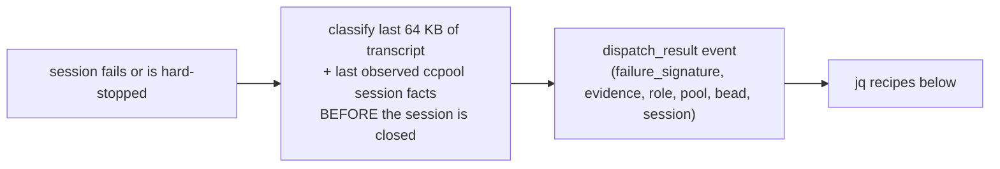

# Runbook: dispatched-session failure signatures (first seen, how often)

Bead: `pg2-8rgnl`. Contract: `INV-CCH-9`'s "Dispatch result" bullet in
`packages/pg-router-ccpool-handler/docs/behavior/invariants.md`.

## What is recorded

When a session dispatched by `pg-router-ccpool-handler` fails, exits without completing its bead,
or is hard-stopped by the budget watchdog, the handler appends one `dispatch_result` record to its
event log, `<stateDir>/events.jsonl` (the state directory is `originProbe.stateDir`, else the
handler's default state directory). Each record carries `time`, `failure_signature`,
`signature_evidence`, `role`, `pool`, `bead`, and `session`. A budget hard stop also carries
`limit`, `used`, and `cap`.

`failure_signature` is one of `git-auth`, `git-network`, `mount-or-path`, `budget`, `index-lock`,
`api-transient`, `api-rate-limit`, `api-auth`, `context-limit`, `session-errored`, `session-idle`,
`session-gone`, or `unknown`. `signature_evidence` is redacted and at most 300 characters. There is
no metric and no separate store: the event log is the record.



## Recipes

Set `LOG` to the event log path. The recipes were verified against the fixture
`packages/pg-router-ccpool-handler/internal/executor/testdata/dispatch-results.jsonl`, which a Go
test (`TestRunbookRecipes`) runs when `jq` is on `PATH`.

First occurrence of signature `git-auth` (change the signature to look at another):

```bash
jq -s 'map(select(.kind=="dispatch_result" and .failure_signature=="git-auth"))
       | min_by(.time) | {time, role, pool, bead}' "$LOG"
```

Counts per day, per signature:

```bash
jq -r 'select(.kind=="dispatch_result") | "\(.time[0:10]) \(.failure_signature)"' "$LOG" \
  | sort | uniq -c
```

Counts per signature, role, and pool:

```bash
jq -r 'select(.kind=="dispatch_result")
       | "\(.failure_signature) \(.role) \(.pool)"' "$LOG" | sort | uniq -c | sort -rn
```

Fixture output for the first recipe is `2026-09-23T14:01:00.000000000Z` / `worker` / `default` /
`zr-1`; the second prints `2 2026-09-23 git-auth`, `1 2026-09-24 budget`, `1 2026-09-24 unknown`.

## Reading the result

- `api-transient`, `api-rate-limit`, `api-auth`, and `context-limit` mean Claude Code wrote that
  API error into the transcript tail (a 5xx or `529 Overloaded`, a dropped socket or idle
  stream; a usage limit or 429; a 401 or `Please run /login`; `Prompt is too long`). Evidence is
  the matching transcript line.
- `session-errored`, `session-idle`, and `session-gone` mean no transcript text explained the
  exit, so the ccpool session facts last observed named it: state `errored` (a StopFailure with
  no recognizable error text), state `idle` (the turn ended and the bead is not complete), or a
  dead pane or a row that left the list. Their evidence, and the evidence of `unknown`, is the
  facts line (`ccpool-session: state=... live=... present=... close_reason=...`) followed by
  `| tail:` and the last three non-empty transcript lines, so it is never empty. ccpool exposes
  no process exit status or signal, so none is recorded.
- An `unknown` signature means the session was still alive and working when the failure was
  recorded (for example, `not complete within MAX_WAIT`), or no session row was ever observed. It
  is not evidence of success or of a specific cause; read its evidence.
- Records written before this change do not exist; "first seen" is the first record in the log,
  not the first failure ever.
- If a metric is wanted later, file a separate bead deciding the wire transport; the handler has
  no OTel emitter.
