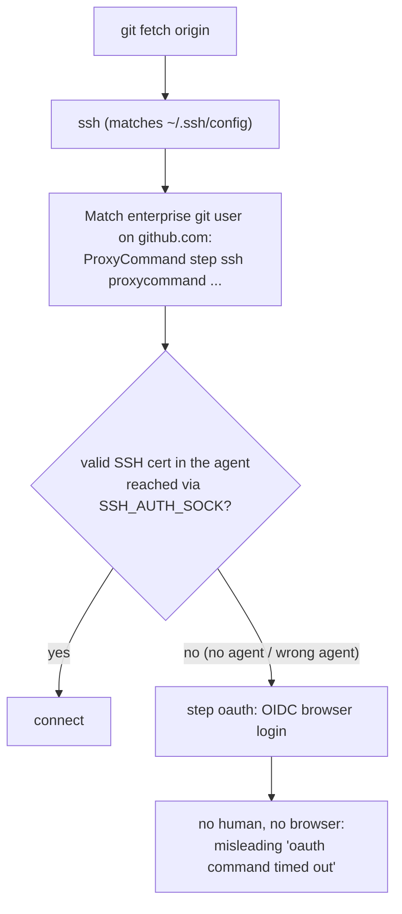

# Runbook: dispatched pg-router/ccpool sessions cannot `git fetch` a step-CA-fronted origin

Bead: `pg2-yoe7e`. Investigation date: 2026-09-29.
Method: OFFLINE / STATIC only (source + nix config + `~/.ssh/config` structure;
no network, no `step`, no credential material read). Every claim below is
labelled **[static]** (read from code/config) or **[unverified]** (needs the
live check listed at the end).

## Symptom

Dispatched sessions (pg-router -> `pg-router-ccpool-handler` -> `ccpool` ->
tmux) fail `git fetch` / `git ls-remote` on
the enterprise SSH remote (a `Match` block on the enterprise git user) with
`oauth command timed out` / `error generating OIDC token: exec "step oauth"
failed`. The operator's interactive shell fetches fine (operator ruling,
2026-09-29). Not a person-blocked login.

## Mechanism [static]

- The enterprise SSH block is
  `ProxyCommand step ssh proxycommand %r %h %p`
  (`phillipg-nix-ziprecruiter/home/programs/ssh/default.nix`). The browser
  fallback is therefore reached whenever `step` cannot find a usable
  certificate, which the operator shell has and the dispatched one apparently
  lacks. The `step`-not-on-PATH variant of this failure was already fixed
  separately (`pg2-en0f`, `pkgs.step-cli` on the per-user profile,
  `phillipg-nix-ziprecruiter/home/ziprecruiter/packages/default.nix`); this
  bead is the residual, different failure: `step` runs but has no cert.

## Environment comparison [static]

| Item                             | Operator interactive shell                                                                                                                                      | Dispatched session (launchd -> pg-router -> handler -> ccpool -> tmux)                                                                                                                                                                                          |
| -------------------------------- | --------------------------------------------------------------------------------------------------------------------------------------------------------------- | --------------------------------------------------------------------------------------------------------------------------------------------------------------------------------------------------------------------------------------------------------------- |
| `SSH_AUTH_SOCK`                  | Points at a per-login agent socket under `~/.ssh/agent/` (observed value of `$SSH_AUTH_SOCK` in the interactive shell; path only, not contents)                 | Not set anywhere in the chain. `launchctl getenv SSH_AUTH_SOCK` returns launchd's own `/var/run/com.apple.launchd.*/Listeners` socket (the Apple system agent), a DIFFERENT agent from the shell's.                                                             |
| How the shell gets its agent     | `programs.keychain` (`--eval` in shell init; `phillipgreenii-nix-personal/home/programs/ssh/default.nix`): the agent + keys exist only after a login-shell init | Never runs shell init. The LaunchAgent script (`darwin/modules/pg-router/default.nix`) exports only `PATH`, `PG_ROUTER_*`, `CCPOOL_POOL`; `EnvironmentVariables` carries only the OTLP emitter env.                                                             |
| Env passthrough in Go code       | n/a                                                                                                                                                             | Not the cause. `pg-router-ccpool-handler/internal/gitenv` deliberately passes everything outside `GIT_*` (incl. `SSH_AUTH_SOCK`, `HOME`, `PATH`, XDG) and allowlists `GIT_SSH*`; `ccpool` `tmux new-session` adds only markers (`CCPOOL_*`); it strips nothing. |
| `HOME` / `~/.step` / `~/.ssh`    | operator's                                                                                                                                                      | Same user, same `HOME` [static: nothing overrides it]; step config is not per-session.                                                                                                                                                                          |
| `ssh` match rule / `step` binary | as above                                                                                                                                                        | Same `~/.ssh/config`; `step` resolvable via profile bin (`pg2-en0f`).                                                                                                                                                                                           |

The ccpool tmux server (`tmux -L <socket>`) is started by whichever process
first creates a session, so panes inherit THAT process's environment
(ADR 0035 describes the same inheritance). Under the daemon that is the
launchd environment, not the shell's.

## Ranked hypotheses

1. **Wrong / absent agent (most likely) [static evidence, unverified live].**
   The dispatched chain reaches launchd's system agent (or none), not the
   keychain-managed agent that holds the operator's step SSH certificate
   (interactive `ssh-add -l` showed an ECDSA-CERT, per the unblock comment on
   the bead). With no cert visible, `step ssh proxycommand` falls back to
   `step oauth`. Settles it: in a dispatched worktree, compare
   `ssh-add -l` output KEY TYPES (not key text) under the session's
   `SSH_AUTH_SOCK` versus the shell's; and print `${SSH_AUTH_SOCK:-unset}`
   from a dispatched session.
2. **Cert absent or expired agent-wide (independent of session).** If the
   operator's cert had lapsed and the shell renewed it at fetch time, a
   dispatched session would fail exactly as observed on 2026-09-23 even with
   the right agent. Settles it: after fixing (1), run the check below with the
   cert freshly expired; renewal in a headless session cannot succeed
   (documented fallback, below).
3. **Cert file location scoped to the shell (`~/.step`, `STEPPATH`).**
   Weakest: nothing in the four repos sets `STEPPATH`, and `HOME` is shared.
   Settles it: `STEPPATH` present in the shell env but not the session's.

## Proposed fix (needs another repo)

Root cause is in deployment wiring, not in this repo's Go code, so nothing
was changed here. Ownership: the launchd unit is generated here
(`darwin/modules/pg-router/default.nix`) but the choice of WHICH agent socket
the daemon uses is machine policy owned by `phillipg-nix-ziprecruiter`
(`machines/phillipg-mbp-02`) and the keychain wiring by
`phillipgreenii-nix-personal`.

Proposed change, in order of preference:

1. In `phillipgreenii-nix-personal` `home/programs/ssh`, give the agent a
   STABLE socket (fixed `SSH_AUTH_SOCK` path, e.g. via a launchd-managed
   `ssh-agent -a <fixed path>` user agent that `programs.keychain` is told to
   reuse), so shells and launchd jobs share one agent and one cert.
2. In `darwin/modules/pg-router/default.nix` (this repo), add a
   `sshAuthSock` daemon option (default `null`) that, when set, emits
   `export SSH_AUTH_SOCK=<path>` into the launch script, and set it from the
   machine config in `phillipg-nix-ziprecruiter`. Implementation here is
   deliberately deferred until the socket path in (1) is decided; adding the
   option first would be untestable dead config.
3. Note the interaction with ADR 0035 and `docs/pr-review-flow.md` (credential
   exposure row): sessions inherit `SSH_AUTH_SOCK` by design today; a future
   env scrub for untrusted-content review sessions MUST keep this variable
   for the fetch step or route fetches through the daemon side.

## Documented fallback (until fixed)

Review sessions that need a ref not yet local MUST NOT fetch from the
dispatched worktree. Fetch it once from the canonical clone in the operator's
interactive shell (`git fetch origin pull/<n>/head`); linked worktrees share
that object store, so the ref resolves locally.

## Post-apply checks (OPERATOR / LIVE ONLY; not run by the investigation)

1. From a dispatched pg-router worktree, non-interactive:
   `GIT_TERMINAL_PROMPT=0 git ls-remote origin HEAD` exits 0 with no browser
   prompt.
2. `echo "${SSH_AUTH_SOCK:-unset}"` in a dispatched session equals the
   interactive shell's value.
3. Re-check dependents blocked on this bead (the review-bead lineage named on the bead).
