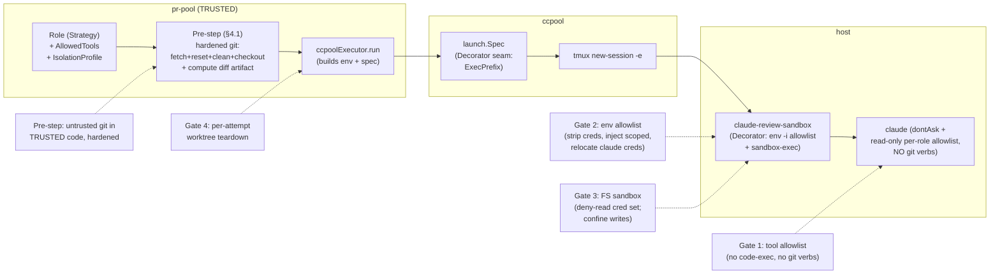

# pr-pool review executor — untrusted-content isolation (design + plan)

> **STATUS: DESIGN — NOT IMPLEMENTED. HUMAN SIGN-OFF REQUIRED BEFORE ANY CODE.**
> This document is the written plan + critique deliverable for a P0 security change.
> It changes no Go or nix source. The isolation posture it specifies is the security
> boundary for autonomous review of **untrusted** PR content, so it MUST be reviewed
> and signed off by a human before implementation begins.

**Bead:** `pg2-jpfw.9` — "pr-pool review executor: verify+enforce sandbox isolation for
untrusted PR content" (P1, security driver; label `pr-pool`).
**Companion ADR:** [`docs/adr/0035-pr-pool-review-untrusted-content-execution-model.md`](../../adr/0035-pr-pool-review-untrusted-content-execution-model.md)
**Date:** 2026-07-15
**Author:** Phillip Green II

> **Revision (2026-07-15) — folds in a blocking adversarial review.** The prior draft was
> found **NOT-SOUND**. Five blocking issues (B1–B5, §1.2) are resolved here; the primary
> structural change is that **fetch/checkout of untrusted content moves OUT of the review
> role into a TRUSTED orchestrator pre-step** (§4.1), letting the review role hold a
> genuinely read-only, RCE-free allowlist with **no git verbs at all** (§4.2). Sections
> materially rewritten: §1.1–1.2, §2.2–2.3, §4 (all), §5, §6, §7.

---

## 1. Problem statement

The pr-pool `review` role runs `claude` autonomously over **untrusted PR HEAD content** —
a teammate's or an external contributor's branch (`roles/builtin.go:35-46`, the
`review` role at `roles/builtin.go:83-101`). Today the role's own prompt instructs the
model to fetch and check out the PR head into a worktree
(`roles/builtin.go:38-39`), then read the diff and post a review back.

Untrusted PR content can execute attacker-controlled code the moment any code-executing
verb runs against the checked-out tree: `_test.go` files (via `go test`), `//go:generate`
directives, `.pre-commit-config.yaml` / `prek` hooks, `Makefile` recipes, `nix` build
scripts, editor/format hooks, etc. Worse, two channels execute code **without any obvious
code-exec verb** and are invisible to Claude Code's native prefix matcher (§1.2, B1/B2).
Today the review-role process:

- **(a)** inherits the full ambient environment of the tmux server owner — `SSH_AUTH_SOCK`,
  `GH_TOKEN`/`GITHUB_TOKEN`, `AWS_*`, and any internal-service tokens — enabling
  credential exfiltration and lateral movement;
- **(b)** is granted **code-executing tool verbs** (`go build/test/vet`, `gofmt`, `go mod`,
  `nix flake check/fmt`, `prek`, `pre-commit`, plus `Edit`/`Write`/`git commit`) via the
  pool-wide allowlist (`config/config.go:109`), even though review is a **read-only** role;
- **(c)** is granted `Bash(git fetch:*)` / `Bash(git checkout:*)` and a blanket `Bash(bd:*)`,
  each of which is an execution or exfiltration channel in its own right (§1.2); and
- **(d)** itself runs the untrusted-content `git fetch`/`git checkout` under the same
  low-privilege review identity, mixing an untrusted operation into the role that is
  supposed to be read-only.

Together these leave the **prompt-injection → RCE → exfiltration** path OPEN for the
review role. This design closes it.

### 1.1 Current posture — verified against source (this worktree)

Each fact below was read from the current source on branch
`pg2-jpfw9-sandbox-isolation`.

| #   | Concern                   | Current state                                                                                                                                                                                                                                                                                                                                | Verdict             |
| --- | ------------------------- | -------------------------------------------------------------------------------------------------------------------------------------------------------------------------------------------------------------------------------------------------------------------------------------------------------------------------------------------- | ------------------- |
| 1   | Worktree isolation        | `worktree.Ensure` (`worktree/worktree.go:31-47`) mints a per-bead worktree `pr-pool/<beadID>` off `repoRoot` HEAD, refuses fallback to the shared checkout. But it is **reused idempotently** (`:34`) and **never torn down**; it also does **not** check out the PR head — the review prompt does (`builtin.go:38-39`).                     | PARTIAL             |
| 2   | Permission mode           | Default `dontAsk` deny-by-default (`config/config.go:99`); `--autonomous` default true (`:98`) structurally denies `AskUserQuestion`. `bypassPermissions` is opt-in only.                                                                                                                                                                    | SATISFIED           |
| 3   | Deny-by-default allowlist | Real + enforced, but **pool-wide, not per-role** — the `Role` struct (`roles/roles.go:17-25`) has **no** `AllowedTools` field. The single default list (`config/config.go:109`) grants `Edit`/`Write`/`git commit` + code-exec verbs, plus `Bash(git fetch:*)`/`Bash(git checkout:*)` (B1) and blanket `Bash(bd:*)` (B2) to the review role. | PARTIAL (the gap)   |
| 4   | Budget watchdog           | Finite wall-clock budget (`config/config.go:113`, 25m < 30m `MaxWait`); watchdog hard-stop unclaims (`executor/ccpool.go:99-134`).                                                                                                                                                                                                           | SATISFIED           |
| 5   | Credential / env exposure | The launch **only ADDS** `BEADS_ACTOR`/`BEADS_DIR`/`WORKSPACE_ROOT` (`executor/ccpool.go:55-62`) via `tmux -e`; the pane inherits the tmux **server's full ambient env**. `scrubEnv` (`beads/runner.go:35-44`) applies ONLY to pr-pool's own `bd` subprocess, never to `claude`. No env allowlist, no OS sandbox, no unprivileged user.      | MISSING (worst gap) |

> **Correction to the 2026-07-09 audit (bead comment).** That audit (against `main` at
> `9ac29c26`) flagged finding 3(d): `pg-pr` absent from the default allowlist, breaking
> the post-back. In the **current** source the default list at `config/config.go:109`
> **does** include `Bash(pg-pr:*)` (and `Bash(bd:*)`), so the post-back functional gap is
> already CLOSED on this branch. Findings 1, 3(a)/(b)/(c), and 5 remain open and are the
> subject of this design.

### 1.2 Blocking findings from the adversarial review (this revision resolves them)

The first draft granted the review role `Bash(git fetch:*)`, `Bash(git checkout:*)`, and
blanket `Bash(bd:*)`, kept the git fetch/checkout **inside** the review role, and treated
Phase 1 (allowlist only) as an acceptable re-enable gate. The review found this NOT-SOUND.
Verbatim summary of the five blocking issues, each resolved in the section named:

- **B1 — `Bash(git fetch:*)` / `Bash(git checkout:*)` are an RCE channel.**
  `git fetch ext::sh -c '<cmd>'` (`protocol.ext.allow` defaults to `user`, so a direct
  command-line fetch is permitted) and `git fetch --upload-pack='<cmd>' file:///…` execute
  arbitrary commands **inside git**, invisible to Claude Code's prefix matcher (which keys
  on the leading tokens `git fetch`). `git checkout` of an untrusted ref can fire
  `post-checkout` hooks and gitattributes-selected filter drivers. **Resolved by §4.1**
  (git moves to a trusted, hardened pre-step) **+ §4.2** (no git verb in the review role).
- **B2 — blanket `Bash(bd:*)` is not read-only.** It admits `bd hooks install`/`hooks run`
  (installs git hooks into the SHARED canonical clone via `core.hooksPath`, firing on the
  operator's next git op = cross-trust-boundary RCE + persistence), `bd sql '<raw>'`
  (arbitrary SQL incl. `DELETE` against the shared Dolt store), `bd mail send`
  (external-command exfil), and `bd federation add-peer`+`sync` (push the DB to an attacker
  remote = exfil). **Verified against the installed `bd` CLI** — all four subcommands exist.
  **Resolved by §4.2** (narrowed to exactly `bd update`/`comment`/`close`/`show`/`children`).
- **B3 — the review role can't function: `git -C <wt>` won't match (correctness blocker).**
  The prompt invokes `git -C {{.WorktreeDir}} fetch/checkout` (`roles/builtin.go:38-39`);
  under `dontAsk` the native matcher sees leading tokens `git -C`, not `git fetch`, so a
  `Bash(git fetch:*)` entry **DENIES** it. It "works" today only under `bypassPermissions`
  — the insecure mode this design replaces. This is a **decision**, not an open question
  (§7 D-1): **git moves to the trusted pre-step**, so the matcher problem disappears.
- **B4 — on-disk credential exfil via a symlink in the PR tree (was unmodeled).** A PR can
  contain `x -> ~/.aws/credentials`, `~/.ssh/id_ed25519`, `~/.config/gh/hosts.yml`, or
  `~/.claude/.credentials.json`; the allowed `Read`/`Grep`/`Glob` follow the symlink and
  `pg-pr review submit` posts the content into the PR (or `bd` writes it to a syncing
  store). The env scrub does **nothing** for on-disk creds, and keeping `HOME`/`~/.claude`
  readable leaves the model OAuth token exposed. **Resolved by §4.3** (relocate claude
  creds via `CLAUDE_CONFIG_DIR` + scratch `HOME`) **+ §4.4** (FS-sandbox deny-read of the
  full on-disk cred set) **+ honest residual accounting (§6).**
- **B5 — Phase 1 alone is an unsafe re-enable gate.** The allowlist alone, without the env
  scrub, still inherits the full ambient env (`SSH_AUTH_SOCK`, `GH_TOKEN`, `AWS_*`), and any
  residual execution path exfiltrates it. **Resolved by §5** (the re-enable gate is
  re-sequenced to a bundle: RCE-free per-role allowlist + trusted pre-step + env scrub +
  FS-sandbox baseline + hooksPath pinning — Phase 1 alone is explicitly NOT a gate).

---

## 2. Threat model

### 2.1 Trust boundary

- **Untrusted:** the PR HEAD tree (files, tests, generators, hook configs, build scripts,
  `.gitattributes`, **symlinks**) and any text the model ingests from it. The PR-head ref
  and the untrusted-content `git fetch`/`git checkout` operations themselves are on the
  untrusted side of the boundary — an untrusted operation, not just untrusted data.
- **Trusted:** pr-pool / ccpool Go code, the orchestrator pre-step (§4.1), the review
  prompt template, the operator host and its credentials, the beads store, the GitHub
  write path.

The single job of this design is to keep the untrusted set from reaching the trusted set's
**authority** (credentials, code execution, network exfil, cross-attempt persistence). A
core structural move (§4.1) is to relocate the one unavoidable untrusted operation
(fetch/checkout of the PR head) into **trusted** code running with **hardened git**, so the
review-role model never performs it.

### 2.2 Attack tree

```mermaid
flowchart TD
    G["GOAL: attacker-controlled PR content<br/>gains host authority / exfiltrates secrets"]

    G --> A1["A. Achieve code execution<br/>on the review host"]
    G --> A2["B. Exfiltrate credentials /<br/>move laterally"]
    G --> A3["C. Persist / poison<br/>across attempts"]

    A1 --> B1["A1. Malicious _test.go<br/>via go test"]
    A1 --> B2["A2. //go:generate<br/>via go generate/build"]
    A1 --> B3["A3. pre-commit / prek hook<br/>via prek/pre-commit"]
    A1 --> B4["A4. nix build script<br/>via nix flake check"]
    A1 --> B5["A5. Makefile / format hook<br/>via gofmt/go mod"]
    A1 --> B6["A6. git textconv / filter<br/>driver via git diff"]
    A1 --> B7["A7. git transport-exec:<br/>git fetch ext::sh -c / --upload-pack=<br/>(invisible to prefix matcher) — B1"]
    A1 --> B8["A8. git checkout fires<br/>post-checkout hook /<br/>gitattributes filter — B1"]
    A1 --> B9["A9. bd hooks install →<br/>hook into SHARED canonical clone,<br/>fires on operator's next git op — B2"]

    A2 --> C1["B1. Read SSH_AUTH_SOCK →<br/>auth as operator to any host"]
    A2 --> C2["B2. Read GH_TOKEN →<br/>push / mutate GitHub as operator"]
    A2 --> C3["B3. Read AWS_*/cloud creds →<br/>cloud lateral movement"]
    A2 --> C4["B4. Read ~/.ssh, ~/.aws, keychain,<br/>gh/gcloud/kube/npm/docker cfg on disk"]
    A2 --> C5["B5. POST secrets to<br/>attacker-controlled host"]
    A2 --> C6["B6. Symlink in PR tree →<br/>Read/Grep/Glob follow → post via<br/>pg-pr / bd — B4"]
    A2 --> C7["B7. bd mail send / bd federation<br/>add-peer+sync → external exfil — B2"]
    A2 --> C8["B8. Read relocated claude<br/>OAuth token / scoped review PAT"]

    A3 --> D1["C1. Leftover untrusted files<br/>re-executed next attempt"]
    A3 --> D2["C2. Write to shared beads store<br/>(BEADS_DIR=repo/.beads)"]
    A3 --> D3["C3. Write outside the<br/>worktree (operator HOME, repo)"]
    A3 --> D4["C4. bd sql DELETE / hooks install →<br/>corrupt / persist in shared store — B2"]

    classDef closed fill:#1b5e20,stroke:#2e7d32,color:#fff;
    classDef open fill:#7f1d1d,stroke:#b71c1c,color:#fff;
    classDef residual fill:#5d4037,stroke:#795548,color:#fff;

    B1:::closed
    B2:::closed
    B3:::closed
    B4:::closed
    B5:::closed
    B6:::closed
    B7:::closed
    B8:::closed
    B9:::closed
    C1:::closed
    C2:::closed
    C3:::closed
    C4:::residual
    C5:::residual
    C6:::residual
    C7:::closed
    C8:::residual
    D1:::closed
    D2:::residual
    D3:::residual
    D4:::closed
```



Legend: **green** = closed by this design (structurally severed); **brown** = residual
after this design (mitigated, not eliminated — see §6); **red** = still open (none remain
open in this cut). The coloring is deliberately honest: C4/C6/C8 stay **residual** — under
an allow-default Seatbelt profile (§4.4) FS deny-read protects only the **enumerated** cred
paths, so an unenumerated on-disk secret, a symlink to one, or the surviving model
credential remains reachable if any read channel exists.

### 2.3 How each layer cuts the tree

- **Trusted orchestrator pre-step (§4.1)** severs A7/A8/A9-adjacent git RCE at the root:
  the one untrusted git operation runs in **trusted** code with `protocol.ext.allow=never`,
  `core.hooksPath=/dev/null`, hard-reset + `git clean -ffdx`, and no attacker-controlled
  flags. The review model never runs `git fetch`/`git checkout`.
- **Per-role minimal allowlist (§4.2)** severs A1–A5 by removing every code-executing verb
  (`go`/`prek`/`nix`/`gofmt`), removes B7/B8 (no `git` verb at all in the review role), and
  removes B2/C7/D4 by narrowing `bd` to exactly five read/own-bead verbs (no
  `sql`/`hooks`/`mail`/`federation`). This is the **primary** cut.
- **Env scrub + scoped credential + claude-cred relocation (§4.3)** severs C1/C2/C3 — the
  process has no ambient `SSH_AUTH_SOCK`/`GH_TOKEN`/`AWS_*` to steal — and removes the
  model OAuth token from the operator's real `HOME` (relocated via `CLAUDE_CONFIG_DIR` +
  scratch `HOME`). C8 (the injected scoped PAT + the surviving model credential) remains
  residual.
- **FS sandbox / Seatbelt (§4.4)** is defense-in-depth: deny-read of the on-disk cred set
  blocks C4/C6 for **enumerated** paths (residual for the rest); confine writes to the
  worktree + `TMPDIR` blocks D3.
- **Per-attempt worktree teardown (§4.5)** severs D1.

---

## 3. Design goals and non-goals

### 3.1 Goals (RFC 2119)

- **G-1** The review-role `claude` process MUST NOT inherit ambient broad credentials
  (`SSH_AUTH_SOCK`, `GH_TOKEN`/`GITHUB_TOKEN`, `AWS_*`, and internal-service tokens).
- **G-2** The review role MUST be denied every code-executing tool verb (build/test/
  generate/format/hook runners), every write verb (`Edit`/`Write`/`git commit`), **and
  every `git` verb** (fetch/checkout/diff/log/status included — git moves to the trusted
  pre-step, §4.1).
- **G-3** Untrusted PR content MUST NOT persist into a subsequent dispatch's execution.
- **G-4** The isolation posture MUST be **per-role** (Strategy), so the write-capable
  worker role keeps the tools it legitimately needs while review is minimal.
- **G-5** The security-sensitive allowlist literal(s) MUST carry a recorded human sign-off.
- **G-6** Every control MUST be **fail-closed**: a misconfiguration, a missing sandbox
  binary, a missing scoped credential, or a failed pre-step MUST refuse to launch the
  review role, never silently launch un-isolated.
- **G-7** The one unavoidable untrusted git operation (fetch + checkout of the PR head)
  MUST be performed by **trusted** code with **hardened git** (`protocol.ext.allow=never`,
  `core.hooksPath=/dev/null`, hard-reset + clean before checkout), NOT by the review model.
- **G-8** On-disk operator secrets MUST NOT be reachable via a symlink in the PR tree: the
  FS sandbox MUST deny reads of the enumerated cred set (§4.4) and the model's own
  credential MUST live outside the operator's real `HOME`.

### 3.2 Non-goals

- Full kernel-enforced containment equivalent to Linux namespaces + seccomp — **not
  achievable on darwin** (§6). This design delivers layered defense-in-depth, not a
  hard container.
- Per-hostname network egress filtering for the review role — **infeasible on darwin**
  and in tension with the role's legitimate need to reach GitHub + the model API (§6.3).
- Isolating the shared beads store or the shared `.git` object store (tracked separately;
  noted as residual risk §6.4).

---

## 4. The layered isolation design

The architecture applies **defense-in-depth** as a **Chain of Responsibility**: a trusted
pre-step, then four independent gates each of which MUST pass before untrusted content is
handed to the model, plus a teardown step after. No single gate is trusted to be
sufficient.



### 4.1 Trusted orchestrator pre-step — check out the PR head with hardened git

**Pattern:** **Template Method** — `ccpoolRun.run` already runs a trusted pre-step
(`worktree.Ensure`, `executor/ccpool.go:46`) BEFORE the claude session is created
(`r.deps.CC.Ensure`, `:63`). This design extends that trusted pre-step so the worktree
handed to the model **already has the PR head checked out** and a review diff artifact
prepared. This is the **primary structural change** and the clean resolution of B1 + B3 +
the checkout-hook vector.

**Why here.** The untrusted `git fetch origin pull/N/head` + `git checkout <sha>` is the one
operation the review inherently needs against untrusted refs. Performed by the **model**
under an allowlist, it is (a) an RCE channel invisible to the prefix matcher (B1) and (b)
un-matchable under `dontAsk` because of the `git -C` leading-token problem (B3). Performed
by **trusted Go** with hardened git, it is neither: the executor already holds the worktree
path and the trusted git runner (`worktree.Git`, which shells `git -C <dir> <args…>`), and
runs before the untrusted model ever starts.

**Policy (RFC 2119).**

- **SEC-PRE-1** The executor MUST fetch + check out the reviewed commit in the trusted
  pre-step, BEFORE creating the review session. The review prompt MUST be updated to state
  the head is **already checked out** and MUST NOT instruct the model to fetch or checkout.
- **SEC-PRE-2** Every git invocation in the pre-step that touches untrusted content MUST be
  hardened with, at minimum, `-c protocol.ext.allow=never`, `-c protocol.file.allow=user`,
  and `-c core.hooksPath=/dev/null`, and MUST NOT pass any attacker-influenced value as a
  git **flag** (only as a positional ref/SHA). Concretely, threaded through
  `worktree.Git.Run(ctx, wt, …)`:

```text
git -C <wt> -c protocol.ext.allow=never -c protocol.file.allow=user \
    -c core.hooksPath=/dev/null fetch --no-tags --no-recurse-submodules \
    origin pull/<pr_number>/head
```

- **SEC-PRE-3** Before checkout the pre-step MUST hard-reset **and** clean the worktree —
  both, not either/or:

```text
git -C <wt> -c core.hooksPath=/dev/null reset --hard
git -C <wt> -c core.hooksPath=/dev/null clean -ffdx
git -C <wt> -c core.hooksPath=/dev/null checkout --detach --force <head_sha>
```

- **SEC-PRE-4** The pre-step MUST produce the review inputs the model needs **without
  granting the model git** — at minimum a diff artifact (`base…head`) and a small context
  JSON (`repo`, `pr_number`, `head_sha`, `base_sha`) written to a per-attempt,
  sandbox-readable directory exported as `PR_POOL_REVIEW_DIR` (§4.3 env allowlist). The
  diff MUST be generated with textconv/external-diff disabled
  (`-c diff.<driver>.textconv=` unset; no `--ext-diff`) so A6 cannot fire even in trusted
  code.
- **SEC-PRE-5** If any pre-step git operation fails (fetch, reset, clean, checkout, diff),
  the executor MUST fail-closed (G-6): it MUST NOT create the review session against a
  wrong or dirty tree; it hands the bead back per the role's `OnDispatchFail`.
- **SEC-PRE-6** The pre-step MAY authenticate the fetch with the single scoped review
  credential (§4.3, SEC-ENV-3) rather than the operator's ambient git auth; this reconciles
  `pg2-k8nx` (broken git SSH auth in the review env) — the review model no longer performs
  any git, so it needs no git auth, and the trusted pre-step uses the scoped PAT over HTTPS.

> **Checkout filter-driver residual.** A malicious `.gitattributes` in the tree can only
> **select** a filter/textconv driver; the **command** is defined in the worktree's
> `.git/config` (trusted). So checkout/`git diff` filter-driver RCE requires a
> pre-existing dangerous driver in trusted config, which the operator does not define.
> `core.hooksPath=/dev/null` additionally neutralizes `post-checkout` and every other hook.
> Residual A6 is therefore low and is not reachable by the model at all (it holds no git
> verb). See §6.6.

### 4.2 Per-role read-only allowlist (no git verbs, narrowed bd)

**Pattern:** **Strategy** — tool authorization becomes a per-role field selected at
dispatch, replacing the single pool-wide list. This directly implements least privilege
and is the **primary** cut of the attack tree (§2.3).

Add an `AllowedTools` field to the `Role`/`CCPoolConfig` model (currently `roles/roles.go`
has none) and thread a per-role value through the executor into `ccpool new
--allowed-tools` (the seam already carries the pool-wide value —
`launch.Spec.AllowedTools`, `ccpool launch/launch.go:57-62,93-95`). When a role sets it,
the role value wins; when empty, fall back to the pool-wide `Config.AllowedTools`
(backward compatible).

**Policy (RFC 2119).**

- **SEC-TOOL-1** The review role MUST be granted ONLY the minimal read-only toolset below.
- **SEC-TOOL-2** The review role MUST NOT be granted any of: `Edit`, `Write`, a blanket
  `Bash`/`Bash(*)`, **any `git` verb** (`Bash(git fetch:*)`, `Bash(git checkout:*)`,
  `Bash(git commit:*)`, `Bash(git add:*)`, `Bash(git push:*)`, `Bash(git diff:*)`,
  `Bash(git log:*)`, `Bash(git status:*)`, `Bash(git rev-parse:*)`, `Bash(git branch:*)`,
  `Bash(git switch:*)`, `Bash(git worktree:*)`), any code-exec verb (`Bash(go build:*)`,
  `Bash(go test:*)`, `Bash(go vet:*)`, `Bash(go mod:*)`, `Bash(gofmt:*)`,
  `Bash(go generate:*)`, `Bash(nix flake check:*)`, `Bash(nix fmt:*)`, `Bash(prek:*)`,
  `Bash(pre-commit:*)`), a blanket `Bash(bd:*)`, nor any of `Bash(bd sql:*)`,
  `Bash(bd hooks:*)`, `Bash(bd mail:*)`, `Bash(bd federation:*)`.
- **SEC-TOOL-3** The `bd` grant MUST be narrowed to exactly the five leading-token verbs the
  review workflow needs — `bd update` (claim/hand-back), `bd comment`, `bd close`,
  `bd show`, `bd children` — expressed as separate matcher entries, NOT blanket `Bash(bd:*)`.
- **SEC-TOOL-4** The worker and feedback roles MAY retain a broader (write-capable)
  allowlist appropriate to their trusted, own-work scope — they are not the untrusted-
  content path.

**Revised review-role minimal allowlist (SECURITY-SENSITIVE — human sign-off, §4.6):**

```text
Read,Glob,Grep,Bash(bd update:*),Bash(bd comment:*),Bash(bd close:*),Bash(bd show:*),Bash(bd children:*),Bash(pg-pr review submit:*)
```

| Entry                                    | Why the review role needs it                                                                | Risk                                                                                                  |
| ---------------------------------------- | ------------------------------------------------------------------------------------------- | ----------------------------------------------------------------------------------------------------- |
| `Read`, `Glob`, `Grep`                   | Read the pre-computed diff artifact (§4.1) and the already-checked-out changed files.       | Follows symlinks (B4/C6) — mitigated by the FS sandbox deny-read (§4.4) + claude-cred relocation.     |
| `Bash(bd update:*)`                      | Claim the review bead (`bd update <id> --claim`) / hand it back (`--status=open`).          | Writes the shared beads store (residual §6.4). Narrowed by leading token — `bd sql/hooks/…` excluded. |
| `Bash(bd comment:*)`                     | Record the one-line result (`bd comment <id>`).                                             | As above.                                                                                             |
| `Bash(bd close:*)`                       | Complete the review (`bd close <id>`).                                                      | As above.                                                                                             |
| `Bash(bd show:*)`, `Bash(bd children:*)` | Read the bead + any child work beads (read-only bd).                                        | None (read-only).                                                                                     |
| `Bash(pg-pr review submit:*)`            | Post the review back (`pg-pr` owns the GitHub write). Narrowed to the `review submit` verb. | Can post attacker-influenced content into a PR (the review body) — inherent to the role; see §6.7.    |

**Deliberately EXCLUDED vs. the prior draft's list:** all `git` verbs (moved to §4.1),
blanket `Bash(bd:*)` (replaced by the five verbs above), and every `Edit`/`Write`/code-exec
verb. The single bright line for audit: **the review role holds zero `git` verbs and zero
code-exec verbs.**

> **Matcher note (deny-by-default is the backstop).** Claude Code's allowlist matcher keys
> on a command's leading tokens and evaluates each sub-command of a chained/compound `Bash`
> invocation; any sub-command whose leading tokens match no entry is auto-DENIED under
> `dontAsk`. So `bd federation sync` (leading tokens `bd federation`), `bd -C <dir> sql …`
> (leading tokens `bd -C`), and `bd update x && bd sql 'DELETE …'` (the `bd sql`
> sub-command) are all denied. The narrowed verbs are the control; deny-by-default is the
> backstop; and because no code-exec or git verb exists at all, there is no primitive to
> spawn an unmatched process in the first place.

> **Rebutted alternative — keep read-only `git diff/log/status/rev-parse`.** Considered and
> rejected as the primary cut. Rationale: (1) it reintroduces the A6 textconv/`--ext-diff`
> residual **into the model's hands**; (2) it re-opens the `git -C` matcher ambiguity (B3)
> for those verbs; (3) once §4.1 provides the diff artifact, the model needs no git at all —
> "zero git verbs" is a strictly brighter, more auditable line than "only read-only git."
> The cost (the model cannot run ad-hoc `git log`/`git blame`) is acceptable for a
> read-only review whose input is a trusted, pre-computed diff.

> **`bd --readonly` belt (optional, defense-in-depth).** The installed `bd` exposes a
> `--readonly` global flag ("block write operations (for worker sandboxes)"). It cannot be
> the review's mode because the review legitimately writes its own bead
> (`update`/`comment`/`close`). It MAY be applied to any future read-only bd surface. Noted,
> not adopted for review.

### 4.3 Credential / env scrub for the claude launch

**Pattern:** default-deny **Allowlist** applied by a **Decorator** wrapping the claude
invocation.

**Why a Decorator, not the existing env map.** pr-pool's `executor/ccpool.go:55-62` only
_adds_ keys to the env map, and `tmux -e` only adds/overrides — neither can _remove_ an
inherited ambient variable. The pane inherits the tmux server's full environment. The only
robust way to reach a default-DENY env is to **replace** the process environment at exec
time: wrap the `claude` argv in a launcher that does `env -i` (clear everything) and
re-exports a fixed allowlist. `ccpool launch/launch.go` is documented as "the single source
of truth for the claude invocation," so the wrapper is introduced there as an **exec
prefix** and driven per-role by pr-pool.

**Policy (RFC 2119).**

- **SEC-ENV-1** The review-role launcher MUST start from an empty environment (`env -i`
  semantics) and re-export ONLY the variables on the allowlist below.
- **SEC-ENV-2** The launcher MUST NOT inherit `SSH_AUTH_SOCK`, `GH_TOKEN`, `GITHUB_TOKEN`,
  `GITHUB_API_TOKEN`, `AWS_ACCESS_KEY_ID`, `AWS_SECRET_ACCESS_KEY`, `AWS_SESSION_TOKEN`,
  `AWS_PROFILE`, `GOOGLE_APPLICATION_CREDENTIALS`, `OP_SERVICE_ACCOUNT_TOKEN`,
  `VAULT_TOKEN`, `NPM_TOKEN`, `GNUPGHOME`, `GPG_AGENT_INFO`, nor any variable matching the
  backstop patterns `*_TOKEN`, `*_SECRET`, `*_KEY`, `*_PASSWORD`, `*_CREDENTIALS`. (With
  `env -i` these are absent by construction; the enumerated denylist is a belt asserted by
  the launcher's tests.)
- **SEC-ENV-3** GitHub access the pipeline needs (the pre-step fetch, §4.1; the post-back
  via `pg-pr review submit`) MUST be provided by a **single narrowly-scoped review
  credential** — a fine-grained PAT limited to `contents:read` + `pull-requests:write` on
  exactly the repos under review — injected by the launcher **from an out-of-band secret
  file** (a nix-darwin secret rendered to a root-readable path; see §7 OQ-3). It MUST NOT be
  read from the ambient env, and it MUST NOT be sourced from the login keychain (the FS
  sandbox denies `~/Library/Keychains`, §4.4). The launcher re-exports it as `GH_TOKEN` for
  `pg-pr`/`git` consumption — a **different** token from the operator's scrubbed ambient one.
- **SEC-ENV-4** If the scoped credential is unavailable, the launcher MUST fail-closed
  (refuse to launch), per G-6.
- **SEC-ENV-5** The review MUST NOT have a path to the operator's real dotfiles. The
  launcher MUST set `CLAUDE_CONFIG_DIR` to an isolated config dir and set `HOME` to a
  **scratch** directory (not the operator's `$HOME`), so `~/.claude/.credentials.json`,
  `~/.ssh`, `~/.aws`, `~/.config/gh`, etc. are simply **absent** from the review's `HOME`.
  The model's own credential lives under the isolated `CLAUDE_CONFIG_DIR`, provisioned
  out-of-band (this is the adopted resolution of the former OQ-2 — see §7 D-3).

**Env allowlist (survives the scrub).**

| Variable                                                                        | Why it survives                                                                                             |
| ------------------------------------------------------------------------------- | ----------------------------------------------------------------------------------------------------------- |
| `PATH`                                                                          | Locate `claude`, `bd`, `pg-pr`. SHOULD be a pinned minimal PATH, not the operator's full PATH.              |
| `HOME`                                                                          | Set to a **scratch** dir (SEC-ENV-5), NOT the operator's real `$HOME`.                                      |
| `CLAUDE_CONFIG_DIR`                                                             | Isolated claude config/auth dir (SEC-ENV-5), so the model credential is not under the operator's `HOME`.    |
| `TERM`, `LANG`, `LC_*`                                                          | tmux pane + the repo's UTF-8 locale requirement.                                                            |
| `TMPDIR`                                                                        | Scratch temp (SHOULD point inside the sandboxed FS).                                                        |
| `USER`, `LOGNAME`                                                               | Benign identity; some tools expect them.                                                                    |
| `SSL_CERT_FILE`, `NIX_SSL_CERT_FILE`                                            | TLS to `api.anthropic.com` + GitHub (nix-darwin sets these).                                                |
| the claude model credential (under `CLAUDE_CONFIG_DIR`, or `ANTHROPIC_API_KEY`) | The one credential the review legitimately needs to talk to the model. Residual (§6.5).                     |
| the scoped GitHub review PAT (re-exported as `GH_TOKEN`)                        | Per SEC-ENV-3 — injected from a file, not inherited. Residual, steal-able (§6.8).                           |
| `BEADS_ACTOR`, `BEADS_DIR`, `WORKSPACE_ROOT`, `PR_POOL_REVIEW_DIR`, `CCPOOL_*`  | Set explicitly by pr-pool/ccpool; carried through. `PR_POOL_REVIEW_DIR` points at the diff artifact (§4.1). |

### 4.4 FS sandbox — Seatbelt on darwin (defense-in-depth)

**Pattern:** **Decorator** (the same launcher) optionally re-execs under an OS sandbox.

macOS has **no** Linux namespaces or seccomp. Realistic darwin mechanisms were evaluated:

| Mechanism                             | What it gives                                                                                                             | Cost / limitation                                                                                                                                                                                            |
| ------------------------------------- | ------------------------------------------------------------------------------------------------------------------------- | ------------------------------------------------------------------------------------------------------------------------------------------------------------------------------------------------------------ |
| **`sandbox-exec` (Seatbelt / SBPL)**  | Per-process FS read/write confinement, process-exec limits, coarse network on/off.                                        | **Deprecated** by Apple but still load-bearing (Nix's darwin build sandbox, Chromium, Bazel). SBPL is undocumented/fragile. Not an unbypassable boundary. This repo already depends on it via nix-darwin.    |
| **Dedicated unprivileged local user** | Structural: the review uid **cannot read** the operator's SSH keys / login keychain / gh config (keychains are per-user). | Requires privileged provisioning (`users.users` + a per-user tmux server); `sudo` is prohibited by policy. **Strongest, but higher cost — deferred (§7 OQ-1).**                                              |
| **Network egress restriction**        | Block exfil POSTs.                                                                                                        | Seatbelt network filtering is **coarse (all-or-port), not per-hostname** — it cannot allow GitHub+Anthropic while denying `attacker.com`. Review needs egress to both (§6.3). **Not a usable control here.** |
| **claude's own OS Bash-tool sandbox** | Recent Claude Code may sandbox its own tool subprocesses.                                                                 | Version-dependent; coverage of transitive children must be verified. **Adopt as an ADDITIONAL layer if present (§7 OQ-4); do NOT rely on it as the sole control.**                                           |

**Recommendation: layered defense, with `sandbox-exec` (Seatbelt) as the OS layer now and
the dedicated user documented as the upgrade path.** The primary boundary is the tool
allowlist (§4.2) + pre-step (§4.1) + cred strip (§4.3) — mechanisms fully in our control
and not darwin-dependent. Seatbelt is defense-in-depth for FS confinement.

**Policy (RFC 2119).**

- **SEC-OS-1** The review-role `claude` process SHOULD be launched under `sandbox-exec`
  with a profile that (a) confines FS **writes** to the per-attempt worktree, `TMPDIR`, and
  `PR_POOL_REVIEW_DIR`; and (b) **denies FS reads** of, at minimum:
  `~/.ssh`, `~/.aws`, `~/.config/gh`, `~/.config/gcloud`, `~/.kube`, `~/.npmrc`,
  `~/.docker/config.json`, `~/.claude/.credentials.json` (the operator's real one),
  `~/Library/Keychains`, and operator `.env` files outside the review worktree. This list
  supersedes the prior draft's incomplete `{~/.ssh, ~/.aws, ~/.config/gh}`.
- **SEC-OS-2** The launcher MUST resolve the `sandbox-exec` binary and profile at launch;
  if the sandbox is requested for a role but unavailable, the launcher MUST fail-closed
  (G-6), never launch un-sandboxed.
- **SEC-OS-3** The design MUST NOT rely on network egress denial for the review role
  (infeasible per §6.3). Exfil-over-network is mitigated only indirectly — by the tool
  allowlist (no code-exec/git verb with which to initiate an arbitrary POST) and by the
  cred strip (the ambient operator creds are gone). It is **NOT** mitigated by any claim
  that "exfiltrated data has no value": the injected scoped PAT, the model OAuth token, and
  any on-disk secret reachable via an unenumerated path retain value (§6.8).
- **SEC-OS-4** The FS deny-read list is **not** a complete boundary under an allow-default
  profile: it protects only the enumerated paths. The design MUST NOT claim Seatbelt blocks
  arbitrary on-disk reads. The structural complement (a dedicated unprivileged user whose
  uid simply cannot read the operator's per-user secrets) SHOULD be documented as the
  phase-4 upgrade (§7 OQ-1).

**Representative Seatbelt profile skeleton (illustrative — MUST be developed + tested
against the claude runtime; see §7 OQ-2).**

```scheme
;; claude-review.sb — representative only; the exact profile must be built and
;; verified so it neither breaks dyld/node/claude nor over-permits. See OQ-2.
(version 1)
(allow default)                       ;; allow-default: we can only SUBTRACT enumerated
                                      ;; paths (SEC-OS-4). A deny-default profile that boots
                                      ;; claude+node is the research task in OQ-2.

;; Deny reads of the operator's secrets on disk (belt for B4; NOT a complete boundary).
(deny file-read*
  (subpath (param "HOME_SSH"))        ;; ~/.ssh
  (subpath (param "HOME_AWS"))        ;; ~/.aws
  (subpath (param "HOME_GH"))         ;; ~/.config/gh
  (subpath (param "HOME_GCLOUD"))     ;; ~/.config/gcloud
  (subpath (param "HOME_KUBE"))       ;; ~/.kube
  (subpath (param "HOME_DOCKER"))     ;; ~/.docker/config.json (dir subpath)
  (literal (param "HOME_NPMRC"))      ;; ~/.npmrc
  (subpath (param "HOME_KEYCHAINS"))  ;; ~/Library/Keychains
  (subpath (param "OP_CLAUDE_CREDS"))) ;; operator's real ~/.claude/.credentials.json dir

;; Confine writes to the worktree + TMPDIR + the review-input dir.
(deny file-write*)
(allow file-write*
  (subpath (param "WORKTREE"))
  (subpath (param "TMPDIR"))
  (subpath (param "REVIEW_DIR")))

;; NOTE: network is deliberately NOT denied — review needs GitHub + api.anthropic.com
;; and Seatbelt cannot allow-by-hostname (§6.3).
```

### 4.5 Per-attempt worktree teardown

**Pattern:** **RAII / deferred cleanup** keyed to the attempt.

Today the worktree path is stable (`<dir>/<beadID>`, `worktree.go:32`) and reused; nothing
removes it (§1.1 finding 1). Untrusted content from attempt N is on disk for attempt N+1.

**Policy (RFC 2119).**

- **SEC-WT-1** Untrusted PR content MUST NOT persist into a subsequent dispatch's
  execution. A dispatch MUST either (a) run in a fresh per-attempt worktree path, or
  (b) **both** hard-reset **and** `git clean -ffdx` the reused worktree **before** the
  pre-step checkout (SEC-PRE-3) — both, not either/or.
- **SEC-WT-2** On successful completion the executor MUST remove the worktree
  (`git worktree remove --force`) and delete the scratch branch `pr-pool/<beadID>`.
- **SEC-WT-3** On failure the worktree MAY be retained for operator inspection **only** if
  it is guaranteed not to be re-executed (SEC-WT-1); leftover files are inert unless a
  code-exec verb runs, which the review allowlist forbids. A reaper TTL SHOULD bound
  retention.

Recommended shape: key the worktree path to the per-attempt stamp already used for
`ExternalID` (`roles/roles.go:46-49`), and remove it in a `defer` in `ccpoolRun.run`
(`executor/ccpool.go:38`), guarded so it removes only worktrees it created this attempt.

### 4.6 Recording the human sign-off

The allowlist literal at `config/config.go:100-102` still reads "HUMAN SIGN-OFF REQUIRED";
the mandated sign-off from plan `2026-06-23-pr-pool-deny-by-default-allowlist.md:392-413`
was never recorded. This design adds a **second** security-sensitive literal (the review-
role allowlist, §4.2). Both require sign-off.

**Policy (RFC 2119).**

- **SEC-SIGN-1** No branch implementing this design MAY merge until a human has signed off
  on BOTH allowlist literals (the pool-wide default `config.go:109` and the new review-role
  list §4.2).
- **SEC-SIGN-2** Sign-off MUST be recorded by (a) setting ADR 0035 `Status: Accepted` with
  the deciding human named, and (b) replacing the `config.go:100` comment with a reference,
  e.g.:

```go
// SECURITY-SENSITIVE allowlist. Signed off: <name>, <YYYY-MM-DD>. See
// docs/adr/0035-pr-pool-review-untrusted-content-execution-model.md and
// docs/superpowers/plans/2026-07-15-pr-pool-untrusted-content-isolation.md.
```

---

## 5. Re-enable gate and phased implementation plan

### 5.1 The re-enable gate (B5 — Phase 1 alone is NOT a gate)

> **INTERIM POSTURE (until the gate below is fully met):** per the bead's security driver
> and `pg2-yb03` (SECURITY-GATED), the autonomous review role MUST NOT run unattended
> against real untrusted PRs.

The prior draft named "Phase 1 (per-role allowlist) alone" as the gate. That is unsafe: the
allowlist without the env scrub still inherits `SSH_AUTH_SOCK`/`GH_TOKEN`/`AWS_*`, and any
residual execution path exfiltrates them. The minimum re-enable gate is therefore a
**bundle** (this is a decision, §7 D-2), ALL of:

- **GATE-a** RCE-free per-role review allowlist — B1/B2/B3 resolved: **no git verb**, `bd`
  narrowed to five verbs, no code-exec/write verb (§4.2).
- **GATE-b** Trusted pre-step performs all untrusted-content git with hardened git
  (`protocol.ext.allow=never`, `core.hooksPath=/dev/null`) + hard-reset + `clean -ffdx`
  before checkout (§4.1).
- **GATE-c** Env scrub (`env -i` + allowlist) + scoped-credential injection from a file +
  claude-cred relocation via `CLAUDE_CONFIG_DIR`/scratch `HOME` (§4.3).
- **GATE-d** FS-sandbox baseline: Seatbelt deny-read of the full on-disk cred set (§4.4,
  SEC-OS-1) and write-confinement to worktree/`TMPDIR`/`PR_POOL_REVIEW_DIR`.

Worktree teardown (§4.5), the dedicated user (§7 OQ-1), and the recorded sign-off
(§4.6, which is a **merge** gate, SEC-SIGN-1) are required for completeness but are not part
of the minimum **re-enable** gate above.

### 5.2 Phases

Each phase is independently landable and independently reduces risk.

#### Phase 1 — trusted pre-step + per-role read-only allowlist (GATE-a + GATE-b; pure pr-pool)

- Add `AllowedTools` to the role model; thread it through `executor/ccpool.go` into
  `ccpool new --allowed-tools` (the seam already carries the pool-wide value).
- Set the review role's minimal list (§4.2) in `roles/builtin.go`'s review role; leave
  worker/feedback on the pool-wide default.
- Move fetch/checkout/diff into the trusted pre-step in `ccpoolRun.run` /
  `worktree` (SEC-PRE-1..6): hardened git, hard-reset + clean, diff artifact, fail-closed.
- Update the review prompt (`reviewPromptBody`, `roles/builtin.go:35-46`) to state the head
  is already checked out, point the model at `PR_POOL_REVIEW_DIR`, and remove the
  fetch/checkout instructions.
- **Tests:** the review role's emitted `--allowed-tools` equals the minimal list and
  contains NONE of the forbidden verbs (SEC-TOOL-2) — including no `git` verb and no blanket
  `bd`; worker role still gets the broad list; empty per-role value falls back to
  `Config.AllowedTools`; the pre-step invokes git with the hardening flags and hard-reset +
  clean before checkout (assert on a recording git fake); a pre-step failure fails-closed.

#### Phase 2 — env scrub + scoped credential + claude-cred relocation (GATE-c; ccpool + pr-pool + nix)

- ccpool: add an exec-prefix / isolation field to `launch.Spec` and a `ccpool new`
  passthrough, so a wrapper argv is prepended to the claude invocation.
- pr-pool: per-role `IsolationProfile` (Strategy) selecting the wrapper for the review role.
- Add the `claude-review-sandbox` launcher (nix `mkBashScript`) implementing SEC-ENV-1..5:
  `env -i` + allowlist re-export + scoped-cred injection from a file + `CLAUDE_CONFIG_DIR`
  - scratch `HOME`.
- **Tests:** argv test (wrapper prepended for review, absent for worker); launcher bats
  test asserting a denied var (`SSH_AUTH_SOCK`, `AWS_SECRET_ACCESS_KEY`, `GH_TOKEN` = the
  operator's) is absent, the allowed set (`PATH`, scratch `HOME`, `CLAUDE_CONFIG_DIR`)
  present, and the injected `GH_TOKEN` equals the scoped PAT (not the operator's);
  fail-closed when the scoped credential file is missing.

#### Phase 3 — FS sandbox / Seatbelt baseline (GATE-d; nix + launcher)

- Extend the launcher to re-exec under `sandbox-exec -f <profile>` for the review role
  (SEC-OS-1/2); develop + test the SBPL profile against a real claude launch (§7 OQ-2).
- **Tests:** the sandboxed launch can read the worktree + the review-input dir but a write
  outside the worktree fails and a read of each sentinel (`~/.ssh/probe`,
  `~/Library/Keychains/probe`, `~/.config/gcloud/probe`, a symlink in the worktree pointing
  at `~/.aws/probe`) fails; fail-closed when `sandbox-exec` is absent.

> **Gate reached after Phase 3** (with Phases 1–2): unattended review MAY be re-enabled per
> §5.1. Phases 4–5 harden and record.

#### Phase 4 — per-attempt worktree teardown (pure pr-pool)

- Implement SEC-WT-1..3 in `worktree` + `executor/ccpool.go`.
- **Tests:** after a dispatch the worktree + scratch branch are removed on success; a
  reused path is hard-reset **and** cleaned before checkout; teardown is best-effort and
  never fails the dispatch outcome.

#### Phase 5 — record sign-off (docs + config comment)

- On human approval: ADR 0035 → `Accepted`; replace the `config.go:100` comment
  (SEC-SIGN-2).

#### (Deferred) dedicated unprivileged user — §7 OQ-1

Documented as the strongest, structural upgrade; needs privileged out-of-band provisioning
(`sudo` prohibited in-agent), so it is deferred, not part of the minimum gate.

### 5.3 Test strategy (cross-cutting)

- **Unit isolation:** per the workspace rules, tests that touch the FS MUST build their
  scenario in a temp dir; the launcher bats tests MUST assert on a child process's env, not
  the test's own.
- **Negative tests are the point:** every SEC-\* policy gets a test that FAILS if the
  control regresses (a forbidden verb — especially any `git` verb or `bd sql`/`hooks` —
  reappearing in the review list; a stripped var reappearing in the child env; a pre-step
  git call missing `protocol.ext.allow=never` or `core.hooksPath=/dev/null`; a symlink
  read escaping the sandbox).
- **Gate:** `prek run --all-files` (or `pre-commit run --all-files`) and `nix flake check`
  MUST pass before any phase is "complete" (repo `CLAUDE.md`).

---

## 6. Residual risk (honest darwin verdict)

### 6.1 `sandbox-exec` is deprecated, allow-default, and not unbypassable

Apple deprecated `sandbox-exec`; SBPL is undocumented and could break on a macOS upgrade. It
is not a guaranteed-unbypassable boundary. Under the **allow-default** profile this design
starts from (a deny-default profile that still boots claude+node is a research task, §7
OQ-2), FS deny-read protects only the **enumerated** cred paths (SEC-OS-1) — an
unenumerated on-disk secret remains readable. **Residual:** a sandbox escape, a profile gap,
or an unenumerated secret path.

### 6.2 Same-uid execution

Without the dedicated-user layer (deferred), the review runs as the operator uid. Any
sandbox escape or not-yet-denied path regains operator authority (minus the scrubbed env).
The env scrub + FS deny + zero-git/zero-code-exec allowlist are the compensating controls;
they are strong but not structural.

### 6.3 Network egress cannot be meaningfully restricted for review

The review role **needs** egress to `github.com` (post-back) and `api.anthropic.com` (the
model). Seatbelt cannot allow-by-hostname (coarse all-or-port only), so network cannot be
denied without breaking the role. `pf`-by-uid IP-CIDR allowlisting is possible only with the
dedicated user and is brittle. **Verdict:** the OS network sandbox is NOT a usable control
here; exfil-over-network is mitigated only indirectly — by removing code-exec/git verbs (no
easy channel to initiate an arbitrary POST) and by the cred strip (ambient operator creds
are gone). This is the most important honest limitation of the darwin design.

### 6.4 Shared beads store and shared `.git` object store

`BEADS_DIR` stays repo-rooted (`executor/ccpool.go:57-60`), so the review session's allowed
`bd update`/`comment`/`close` write the SAME beads DB; worktrees share the monorepo `.git`
object store. Narrowing `bd` (§4.2) removes the `sql`/`hooks`/`federation` corruption/exfil
vectors, but the five allowed verbs still mutate the shared store (a data-integrity vector
for the review's own bead, not RCE). Out of scope here; relates to `pg2-f9vcg`.

### 6.5 claude's own model credential remains

The review must talk to the model, so claude's own auth survives the scrub (now relocated
under `CLAUDE_CONFIG_DIR`, §4.3). Untrusted content could try to abuse the session to burn
quota or exfil via the model's own egress. Mitigated only by scoping/monitoring the auth and
by the budget watchdog. **Residual** — and it is a real, valued secret, so §6.8 applies.

### 6.6 A6 — git textconv / filter drivers

Filter/textconv drivers are **selected** by `.gitattributes` (in the untrusted tree) but the
**command** is defined in the worktree's trusted `.git/config`. A malicious `.gitattributes`
alone cannot set a command. In this design the model holds **no git verb**, and the trusted
pre-step generates the diff with textconv/`--ext-diff` disabled (SEC-PRE-4) and
`core.hooksPath=/dev/null`, so A6 is not reachable by the model and low-likelihood even in
trusted code. **Residual:** an operator who has pre-defined a dangerous driver in `.git/config`.

### 6.7 The review necessarily posts attacker-influenced content

`pg-pr review submit` posts the review body (which reflects attacker content) into the PR.
This is inherent to reviewing. The risk is a review that smuggles data into the PR thread;
combined with the cred strip (nothing sensitive to smuggle from the env) and the FS deny
(enumerated on-disk secrets blocked), the residual is that an **unenumerated** on-disk
secret or the scoped PAT could be echoed into a review. Monitoring the posted reviews is the
compensating control. **Residual.**

### 6.8 The scoped review PAT is steal-able (honesty fix)

The prior draft claimed "exfiltrated data has no value." That is **false** while (a) the
injected scoped review PAT (`contents:read` + `pull-requests:write`) is in the review's env,
(b) the model OAuth token survives under `CLAUDE_CONFIG_DIR`, and (c) an unenumerated on-disk
secret may be reachable. The scoped PAT in particular is readable by the review process's
own env (`printenv`-equivalent), so **if any residual read+egress channel exists it is
exfiltratable**. This design shrinks its blast radius (fine-grained, repo-scoped, sourced
from a file not the keychain) and removes the easy channels (no code-exec/git verb), but does
**not** claim it is worthless. **Residual, acknowledged.**

---

## 7. Decisions and open questions

### 7.1 Decisions made in-design (formerly mis-filed as open questions)

- **D-1 (git leaves the review role — resolves B3).** The `git -C <wt> fetch/checkout` the
  review model performed today is moved to the trusted, hardened pre-step (§4.1). The
  `git -C` matcher ambiguity is therefore moot — the review role holds **no** git verb. This
  is a design decision, not an open question.
- **D-2 (the re-enable gate is a bundle — resolves B5).** The minimum gate is GATE-a..d
  (§5.1), not Phase 1 alone. Reconciled with `pg2-yb03`'s SECURITY-GATED interim posture.
- **D-3 (`CLAUDE_CONFIG_DIR` + scratch `HOME`).** Adopt relocation of claude's config/auth
  (SEC-ENV-5) so `HOME` need not expose the operator's dotfiles; the former "HOME vs
  CLAUDE_CONFIG_DIR" open question is decided in favor of relocation.
- **D-4 (`bd` narrowed to five verbs — resolves B2).** No blanket `Bash(bd:*)`; exactly
  `bd update`/`comment`/`close`/`show`/`children` (§4.2, SEC-TOOL-3). `bd
sql`/`hooks`/`mail`/`federation` are forbidden.

### 7.2 Genuine open questions for the human (require human authority)

- **OQ-1 (dedicated user — adopt now or defer?).** Adopt the dedicated unprivileged macOS
  user now (strongest, structural credential isolation + `pf`-by-uid egress) or defer to a
  later phase? It needs a privileged, out-of-band setup step (policy forbids `sudo`
  in-agent), so it cannot be provisioned autonomously. **Human decision + provisioning.**
- **OQ-2 (Seatbelt profile ownership + tightness).** The SBPL profile (§4.4) is a research
  task — the allow-default baseline is easy but weak (SEC-OS-4); a deny-default profile that
  still boots claude+node is hard. How tight, and who owns building/testing it against the
  installed claude runtime?
- **OQ-3 (scoped review PAT provisioning mechanism).** Confirm HOW the fine-grained PAT
  (`contents:read` + `pull-requests:write` on the reviewed repos) is provisioned and
  rendered to a root-readable secret file for the launcher (prefer a nix-darwin secret;
  reconcile with the keychain-deny in SEC-OS-1). This is an infra/secret-management decision
  a human must make; the design mandates the shape (file, not keychain, not ambient env),
  not the vendor.
- **OQ-4 (claude built-in OS sandbox).** Does the deployed Claude Code version expose an OS
  Bash-tool sandbox, and does its containment cover transitive child processes? If yes,
  adopt it as an ADDITIONAL layer. Verify against the installed version — do not assume.
- **OQ-5 (allowlist sign-off — SEC-SIGN-1).** Approve BOTH the revised review-role minimal
  allowlist literal (§4.2) and the still-unsigned pool-wide default (`config.go:109`)? Any
  addition/removal? No implementing branch merges before this.

---

## 8. Self-review / critique notes

- **Blocking review folded in.** B1 (git transport-exec) and B2 (bd subcommands) are cut by
  moving git to a trusted hardened pre-step and narrowing `bd` to five verbs; both new
  branches are added to the attack tree (A7/A8/A9, B6/C7/D4). B3 and the gate are converted
  from open questions to decisions (D-1, D-2). B4 (symlink cred exfil) is modeled (C6) and
  mitigated by the expanded FS deny-read + claude-cred relocation. B5 (unsafe gate) is
  re-sequenced into the GATE-a..d bundle.
- **Primary vs. secondary controls stated honestly.** The pre-step (§4.1) + tool allowlist
  (§4.2) + cred strip (§4.3) are the load-bearing, in-our-control controls; the OS sandbox
  is defense-in-depth and explicitly **not** a complete boundary under allow-default.
- **Residual honesty fixed.** The false "exfiltrated data has no value" claim is removed
  (§6.8); the attack tree recolors C4/C6/C8 as residual, not closed.
- **Fail-closed everywhere (G-6, SEC-ENV-4, SEC-OS-2, SEC-PRE-5).** A missing sandbox binary,
  a missing scoped credential, or a failed pre-step refuses to launch rather than launching
  un-isolated or reviewing the wrong tree.
- **Cross-package coordination flagged.** Phase 2 touches ccpool (`launch.Spec` seam) as
  well as pr-pool + a nix launcher; called out so it is not discovered mid-implementation.
- **Backward-compatible per-role field.** Empty `AllowedTools` falls back to the pool-wide
  default, so worker/feedback behavior is unchanged.
