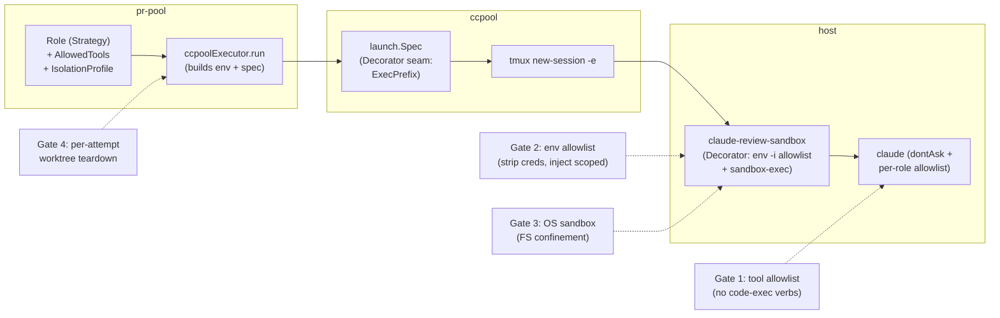

# pr-pool review executor — untrusted-content isolation (design + plan)

> **STATUS: DESIGN — NOT IMPLEMENTED. HUMAN SIGN-OFF REQUIRED BEFORE ANY CODE.**
> This document is the written plan + critique deliverable for a P0 security change.
> It changes no Go or nix source. The isolation posture it specifies is the security
> boundary for autonomous review of **untrusted** PR content, so it MUST be reviewed
> and signed off by a human before implementation begins.

**Bead:** `pg2-jpfw.9` — "pr-pool review executor: verify+enforce sandbox isolation for
untrusted PR content" (P1, security driver; label `pr-pool`).
**Companion ADR:** [`docs/adr/0028-pr-pool-review-untrusted-content-execution-model.md`](../../adr/0028-pr-pool-review-untrusted-content-execution-model.md)
**Date:** 2026-07-15
**Author:** Phillip Green II

---

## 1. Problem statement

The pr-pool `review` role runs `claude` autonomously over **untrusted PR HEAD content** —
a teammate's or an external contributor's branch (`roles/builtin.go:35-46`, the
`review-pr:` role). The role fetches and checks out the PR head into a worktree, then
lets the model read the diff and post a review back.

Untrusted PR content can execute attacker-controlled code the moment any code-executing
verb runs against the checked-out tree: `_test.go` files (via `go test`), `//go:generate`
directives, `.pre-commit-config.yaml` / `prek` hooks, `Makefile` recipes, `nix` build
scripts, editor/format hooks, etc. Today the review-role process:

- **(a)** inherits the full ambient environment of the tmux server owner — `SSH_AUTH_SOCK`,
  `GH_TOKEN`/`GITHUB_TOKEN`, `AWS_*`, and any internal-service tokens — enabling
  credential exfiltration and lateral movement; and
- **(b)** is granted **code-executing tool verbs** (`go build/test/vet`, `gofmt`, `go mod`,
  `nix flake check/fmt`, `prek`, `pre-commit`, plus `Edit`/`Write`/`git commit`) via the
  pool-wide allowlist, even though review is a **read-only** role.

Together these leave the **prompt-injection → RCE → exfiltration** path OPEN for the
review role. This design closes it.

### 1.1 Current posture — verified against source (this worktree)

Each fact below was read from the current source on branch
`pg2-jpfw9-sandbox-isolation`.

| #   | Concern                   | Current state                                                                                                                                                                                                                                                                                                                                                                                                                                                                                            | Verdict             |
| --- | ------------------------- | -------------------------------------------------------------------------------------------------------------------------------------------------------------------------------------------------------------------------------------------------------------------------------------------------------------------------------------------------------------------------------------------------------------------------------------------------------------------------------------------------------- | ------------------- |
| 1   | Worktree isolation        | `worktree.Ensure` (`worktree/worktree.go:31-47`) mints a per-bead worktree `pr-pool/<beadID>` off `repoRoot` HEAD, refuses fallback to the shared checkout. But it is **reused idempotently** (`:34`) and **never torn down** — `teardownAll` (`orchestrator/orchestrator.go:278-292`) closes only ccpool sessions.                                                                                                                                                                                      | PARTIAL             |
| 2   | Permission mode           | Default `dontAsk` deny-by-default (`config/config.go:99`); `--autonomous` default true (`:98`) structurally denies `AskUserQuestion`. `bypassPermissions` is opt-in only.                                                                                                                                                                                                                                                                                                                                | SATISFIED           |
| 3   | Deny-by-default allowlist | Real + enforced, but **pool-wide, not per-role** — the `Role` struct (`roles/roles.go:17-25`) has **no** `AllowedTools` field. The single default list (`config/config.go:109`) grants `Edit`/`Write`/`git commit` + `go build/test/vet`/`gofmt`/`go mod`/`nix flake check`/`prek`/`pre-commit` to the read-only review role.                                                                                                                                                                            | PARTIAL (the gap)   |
| 4   | Budget watchdog           | Finite wall-clock budget (`config/config.go:113`, 25m < 30m `MaxWait`); watchdog hard-stop unclaims (`executor/ccpool.go:99-134`).                                                                                                                                                                                                                                                                                                                                                                       | SATISFIED           |
| 5   | Credential / env exposure | The launch **only ADDS** `BEADS_ACTOR`/`BEADS_DIR`/`WORKSPACE_ROOT` (`executor/ccpool.go:55-62`) + `CCPOOL_*` (`session/session.go:392-407`) via `tmux -e` (`tmux/client.go:49-64`). `tmux -e` only adds/overrides — the pane inherits the tmux **server's full ambient env**. `scrubEnv` (`beads/runner.go:35-44`) applies ONLY to pr-pool's own `bd` subprocess, never to `claude`. No env allowlist, no OS sandbox, no unprivileged user (`ccpool launch/launch.go:70-103` emits no sandbox wrapper). | MISSING (worst gap) |

> **Correction to the 2026-07-09 audit (bead comment).** That audit (against `main` at
> `9ac29c26`) flagged finding 3(d): `pg-pr` absent from the default allowlist, breaking
> the post-back. In the **current** source the default list at `config/config.go:109`
> **does** include `Bash(pg-pr:*)` (and `Bash(bd:*)`), so the post-back functional gap is
> already CLOSED on this branch. Findings 1, 3(a)/(b)/(c), and 5 remain open and are the
> subject of this design.

---

## 2. Threat model

### 2.1 Trust boundary

- **Untrusted:** the PR HEAD tree (files, tests, generators, hook configs, build scripts,
  `.gitattributes`) and any text the model ingests from it.
- **Trusted:** pr-pool / ccpool Go code, the review prompt template, the operator host and
  its credentials, the beads store, the GitHub write path.

The single job of this design is to keep the untrusted set from reaching the trusted set's
**authority** (credentials, code execution, network exfil, cross-attempt persistence).

### 2.2 Attack tree

```mermaid
flowchart TD
    G["GOAL: attacker-controlled PR content<br/>gains host authority / exfiltrates secrets"]

    G --> A1["A. Achieve code execution<br/>on the review host"]
    G --> A2["B. Exfiltrate credentials /<br/>move laterally"]
    G --> A3["C. Persist / poison<br/>across attempts"]

    A1 --> B1["A1. Malicious _test.go<br/>via `go test`"]
    A1 --> B2["A2. //go:generate<br/>via `go generate`/`go build`"]
    A1 --> B3["A3. pre-commit / prek hook<br/>via `prek`/`pre-commit`"]
    A1 --> B4["A4. nix build script<br/>via `nix flake check`"]
    A1 --> B5["A5. Makefile / format hook<br/>via `gofmt`/`go mod`"]
    A1 --> B6["A6. git textconv / filter<br/>driver via `git diff`"]

    A2 --> C1["B1. Read SSH_AUTH_SOCK →<br/>auth as operator to any host"]
    A2 --> C2["B2. Read GH_TOKEN →<br/>push / mutate GitHub as operator"]
    A2 --> C3["B3. Read AWS_*/cloud creds →<br/>cloud lateral movement"]
    A2 --> C4["B4. Read ~/.ssh, ~/.aws,<br/>keychain, gh config on disk"]
    A2 --> C5["B5. POST secrets to<br/>attacker-controlled host"]

    A3 --> D1["C1. Leftover untrusted files<br/>re-executed next attempt"]
    A3 --> D2["C2. Write to shared beads<br/>store (BEADS_DIR=repo/.beads)"]
    A3 --> D3["C3. Write outside the<br/>worktree (operator HOME, repo)"]

    classDef closed fill:#1b5e20,stroke:#2e7d32,color:#fff;
    classDef open fill:#7f1d1d,stroke:#b71c1c,color:#fff;
    classDef residual fill:#5d4037,stroke:#795548,color:#fff;

    B1:::open
    B2:::open
    B3:::open
    B4:::open
    B5:::open
    B6:::residual
    C1:::open
    C2:::open
    C3:::open
    C4:::open
    C5:::residual
    D1:::open
    D2:::residual
    D3:::open
```



Legend: red = open today; brown = residual after this design (mitigated, not eliminated —
see §6). Green would be fully closed.

### 2.3 How each layer cuts the tree

- **Per-role minimal allowlist (§4.3)** severs A1→A2/A3/A4/A5 for the review role by
  removing every code-executing verb — the model has no tool with which to run
  `go test`/`go generate`/`prek`/`nix`/`gofmt`. This is the primary cut.
- **Env scrub + scoped credential (§4.1)** severs B1/B2/B3/B4 — the process has no
  ambient `SSH_AUTH_SOCK`/`GH_TOKEN`/`AWS_*` to steal; only a single narrowly-scoped
  review credential survives.
- **OS containment / Seatbelt (§4.2)** is defense-in-depth against whatever slips past
  (e.g. a tool that shells out, or A6): FS confinement blocks C4 and D3.
- **Per-attempt worktree teardown (§4.4)** severs C1.

---

## 3. Design goals and non-goals

### 3.1 Goals (RFC 2119)

- **G-1** The review-role `claude` process MUST NOT inherit ambient broad credentials
  (`SSH_AUTH_SOCK`, `GH_TOKEN`/`GITHUB_TOKEN`, `AWS_*`, and internal-service tokens).
- **G-2** The review role MUST be denied every code-executing tool verb (build/test/
  generate/format/hook runners) and every write verb (`Edit`/`Write`/`git commit`).
- **G-3** Untrusted PR content MUST NOT persist into a subsequent dispatch's execution.
- **G-4** The isolation posture MUST be **per-role** (Strategy), so the write-capable
  worker role keeps the tools it legitimately needs while review is minimal.
- **G-5** The security-sensitive allowlist literal(s) MUST carry a recorded human sign-off.
- **G-6** Every control MUST be **fail-closed**: a misconfiguration or a missing sandbox
  binary MUST refuse to launch the review role, never silently launch un-isolated.

### 3.2 Non-goals

- Full kernel-enforced containment equivalent to Linux namespaces + seccomp — **not
  achievable on darwin** (§6). This design delivers layered defense-in-depth, not a
  hard container.
- Per-hostname network egress filtering for the review role — **infeasible on darwin**
  and in tension with the role's legitimate need to reach GitHub + the model API (§6.3).
- Isolating the shared beads store or the shared `.git` object store (tracked separately;
  noted as residual risk §6.4).

---

## 4. The layered isolation design

The architecture applies **defense-in-depth** as a **Chain of Responsibility**: four
independent gates, each of which MUST pass before untrusted content executes, plus a
teardown step after. No single gate is trusted to be sufficient.



### 4.1 Scope item 1 — credential / env scrub for the claude launch

**Pattern:** default-deny **Allowlist** applied by a **Decorator** wrapping the claude
invocation.

**Why a Decorator, not the existing env map.** pr-pool's `executor/ccpool.go:55-62` only
_adds_ keys to the env map, and `tmux -e` (`tmux/client.go:49-64`) only adds/overrides —
neither can _remove_ an inherited ambient variable. The pane inherits the tmux server's
full environment. The only robust way to reach a default-DENY env is to **replace** the
process environment at exec time. That means wrapping the `claude` argv in a launcher that
does `env -i` (clear everything) and re-exports a fixed allowlist. `ccpool launch/launch.go`
is documented as "the single source of truth for the claude invocation," so the wrapper
is introduced there as an **exec prefix** and driven per-role by pr-pool.

**Policy (RFC 2119).**

- **SEC-ENV-1** The review-role launcher MUST start from an empty environment (`env -i`
  semantics) and re-export ONLY the variables on the allowlist below.
- **SEC-ENV-2** The launcher MUST NOT export `SSH_AUTH_SOCK`, `GH_TOKEN`, `GITHUB_TOKEN`,
  `GITHUB_API_TOKEN`, `AWS_ACCESS_KEY_ID`, `AWS_SECRET_ACCESS_KEY`, `AWS_SESSION_TOKEN`,
  `AWS_PROFILE`, `GOOGLE_APPLICATION_CREDENTIALS`, `OP_SERVICE_ACCOUNT_TOKEN`,
  `VAULT_TOKEN`, `NPM_TOKEN`, `GNUPGHOME`, `GPG_AGENT_INFO`, nor any variable matching the
  backstop patterns `*_TOKEN`, `*_SECRET`, `*_KEY`, `*_PASSWORD`, `*_CREDENTIALS`.
- **SEC-ENV-3** GitHub access the review legitimately needs (fetch the PR head; post back
  via `pg-pr review submit`) MUST be provided by a **single narrowly-scoped review
  credential** injected by the launcher — a fine-grained PAT limited to `contents:read` +
  `pull-requests:write` on exactly the repos under review — NOT the operator's ambient
  `SSH_AUTH_SOCK`/`GH_TOKEN`. The credential MUST be sourced out-of-band (nix-darwin secret
  / keychain item), never read from the ambient env.
- **SEC-ENV-4** If the scoped credential is unavailable, the launcher MUST fail-closed
  (refuse to launch), per G-6.

**Env allowlist (survives the scrub).**

| Variable                                                                          | Why it survives                                                                                                                            |
| --------------------------------------------------------------------------------- | ------------------------------------------------------------------------------------------------------------------------------------------ |
| `PATH`                                                                            | Locate `claude`, `git`, `bd`, `pg-pr`. SHOULD be a pinned minimal PATH, not the operator's full PATH.                                      |
| `HOME`                                                                            | `claude` reads its own config/auth here. See caveat below — the FS sandbox (§4.2), not the env, protects the sensitive dotdirs under HOME. |
| `TERM`, `LANG`, `LC_*`                                                            | tmux pane + the repo's UTF-8 locale requirement.                                                                                           |
| `TMPDIR`                                                                          | Scratch temp (SHOULD point inside the sandboxed FS).                                                                                       |
| `USER`, `LOGNAME`                                                                 | Benign identity; some tools expect them.                                                                                                   |
| `SSL_CERT_FILE`, `NIX_SSL_CERT_FILE`                                              | TLS to `api.anthropic.com` + GitHub (nix-darwin sets these).                                                                               |
| `CLAUDE_CONFIG_DIR` (recommended)                                                 | Relocate claude's own config/auth to an isolated dir (see caveat).                                                                         |
| claude auth (e.g. `ANTHROPIC_API_KEY` **or** the OAuth under `CLAUDE_CONFIG_DIR`) | The one credential the review legitimately needs to talk to the model. SHOULD be scoped/rate-limited; it is a residual (§6.5).             |
| A single scoped GitHub review PAT (as `GH_TOKEN`)                                 | Per SEC-ENV-3 — injected, not inherited.                                                                                                   |
| `BEADS_ACTOR`, `BEADS_DIR`, `WORKSPACE_ROOT`, `CCPOOL_*`, `PA_MONITOR_NO_NUDGE`   | Set explicitly by pr-pool/ccpool today; carried through.                                                                                   |

> **HOME caveat.** `claude`'s own auth lives under `HOME` (`~/.claude`), but so do the
> operator's `~/.ssh`, `~/.aws`, `~/.config/gh`. Keeping `HOME` in the allowlist is
> necessary for claude to authenticate, so the **env layer alone does not protect the
> sensitive dotdirs** — the FS sandbox (§4.2) is what denies reads of `~/.ssh`/`~/.aws`/
> `~/.config/gh` while allowing `~/.claude`. The cleaner alternative is to set
> `CLAUDE_CONFIG_DIR` + a scratch `HOME` so the review has no path to the operator's real
> dotfiles at all; this is **Open Question OQ-2**.

### 4.2 Scope item 2 — unprivileged / sandboxed OS execution on darwin

**Pattern:** **Decorator** (the same launcher) optionally re-execs under an OS sandbox.

macOS has **no** Linux namespaces or seccomp. Realistic darwin mechanisms were evaluated:

| Mechanism                                      | What it gives                                                                                                                                                  | Cost / limitation                                                                                                                                                                                                                                                                                                                                                                     |
| ---------------------------------------------- | -------------------------------------------------------------------------------------------------------------------------------------------------------------- | ------------------------------------------------------------------------------------------------------------------------------------------------------------------------------------------------------------------------------------------------------------------------------------------------------------------------------------------------------------------------------------- |
| **`sandbox-exec` (Seatbelt / SBPL)**           | Per-process FS read/write confinement, process-exec limits, coarse network on/off.                                                                             | **Deprecated** by Apple (since ~10.10) but still functional and load-bearing (Nix's own darwin build sandbox, Chromium, Bazel use it). SBPL is undocumented/fragile; may break on a macOS upgrade. Not an unbypassable boundary. **This repo already depends on it via nix-darwin's `sandbox`.**                                                                                      |
| **Dedicated unprivileged local user**          | Structural: the review uid **cannot read** the operator's SSH keys / login keychain / gh config; keychains are per-user. Enables `pf`-by-uid egress filtering. | Requires provisioning (`users.users` + a per-user `launchd`/tmux server) and a privileged setup step; `sudo` is prohibited by policy; complicates the ccpool/tmux model (server runs as operator). **Strongest, but higher cost — deferred (OQ-4).**                                                                                                                                  |
| **Network egress restriction**                 | Block exfil POSTs.                                                                                                                                             | Seatbelt network filtering is **coarse (all-or-port), not per-hostname** — it cannot allow GitHub+Anthropic while denying `attacker.com`. Since review _needs_ egress to both, network cannot be denied (§6.3). `pf`-by-uid IP-CIDR allowlisting is possible only with the dedicated-user option and is brittle. **Not a usable control for review.**                                 |
| **claude's own `--permission-mode` / sandbox** | `dontAsk` (already used) is a tool-level gate. Recent Claude Code has an OS **Bash-tool sandbox**.                                                             | `--permission-mode` is not an OS boundary. The built-in Bash sandbox (if present in the installed version) sandboxes only claude's **own tool subprocesses**, is version-dependent, and its coverage of transitive children (a test that forks) must be verified. **Adopt as an ADDITIONAL layer if the installed claude supports it (OQ-5); do NOT rely on it as the sole control.** |

**Recommendation: layered defense, with `sandbox-exec` (Seatbelt) as the OS layer now and
the dedicated user documented as the upgrade path.** The primary boundary is the tool
allowlist (§4.3) + cred strip (§4.1) — mechanisms fully in our control and not darwin-
dependent. Seatbelt is defense-in-depth for FS confinement.

**Policy (RFC 2119).**

- **SEC-OS-1** The review-role `claude` process SHOULD be launched under `sandbox-exec`
  with a profile that (a) allows FS **writes** only inside the per-attempt worktree +
  `TMPDIR`, and (b) denies FS **reads** of `~/.ssh`, `~/.aws`, `~/.config/gh`, and the
  login keychain.
- **SEC-OS-2** The launcher MUST resolve the `sandbox-exec` binary and profile at launch;
  if the sandbox is requested for a role but unavailable, the launcher MUST fail-closed
  (G-6), never launch un-sandboxed.
- **SEC-OS-3** The design MUST NOT rely on network egress denial for the review role
  (infeasible per §6.3); exfil-over-network is mitigated only by the tool allowlist
  (no easy channel to initiate egress) and the cred strip (exfiltrated data has no value).
- **SEC-OS-4** A dedicated unprivileged local user (strongest containment) SHOULD be
  documented as the phase-3 upgrade path (OQ-4) but is out of scope for phases 1-2.

**Representative Seatbelt profile skeleton (illustrative — MUST be developed + tested
against the claude runtime; see OQ-3).**

```scheme
;; claude-review.sb — representative only; the exact profile must be built and
;; verified so it neither breaks dyld/node/claude nor over-permits. See OQ-3.
(version 1)
(allow default)                       ;; baseline: allow, then subtract (a deny-default
                                      ;; profile that boots claude+node is a research task)

;; Deny reads of the operator's secrets on disk (belt for the HOME caveat, §4.1).
(deny file-read*
  (subpath (param "HOME_SSH"))        ;; ~/.ssh
  (subpath (param "HOME_AWS"))        ;; ~/.aws
  (subpath (param "HOME_GH")))        ;; ~/.config/gh

;; Confine writes to the worktree + TMPDIR.
(deny file-write*)
(allow file-write*
  (subpath (param "WORKTREE"))
  (subpath (param "TMPDIR")))

;; NOTE: network is deliberately NOT denied — review needs GitHub + api.anthropic.com
;; and Seatbelt cannot allow-by-hostname (§6.3).
```

### 4.3 Scope item 3 — per-role allowlist

**Pattern:** **Strategy** — tool authorization becomes a per-role field selected at
dispatch, replacing the single pool-wide list. This directly implements least privilege
and is the **primary** cut of the attack tree (§2.3).

Add an `AllowedTools` field to the `Role` model (currently `roles/roles.go:17-25` has
none) and thread a per-role value through the executor into `ccpool new --allowed-tools`.
When a role sets it, the role value wins; when empty, fall back to the pool-wide
`Config.AllowedTools` (backward compatible).

**Policy (RFC 2119).**

- **SEC-TOOL-1** The review role MUST be granted ONLY the minimal read-only toolset below.
- **SEC-TOOL-2** The review role MUST NOT be granted any of: `Edit`, `Write`,
  `Bash(go build:*)`, `Bash(go test:*)`, `Bash(go vet:*)`, `Bash(go mod:*)`,
  `Bash(gofmt:*)`, `Bash(go generate:*)`, `Bash(nix flake check:*)`, `Bash(nix fmt:*)`,
  `Bash(prek:*)`, `Bash(pre-commit:*)`, `Bash(git commit:*)`, `Bash(git add:*)`,
  `Bash(git push:*)`, nor a blanket `Bash` / `Bash(*)`.
- **SEC-TOOL-3** The worker and feedback roles MAY retain a broader (write-capable)
  allowlist appropriate to their trusted, own-work scope — they are not the untrusted-
  content path.

**Proposed review-role minimal allowlist (SECURITY-SENSITIVE — human sign-off, §4.5):**

```text
Read,Glob,Grep,Bash(git fetch:*),Bash(git checkout:*),Bash(git status:*),Bash(git diff:*),Bash(git log:*),Bash(git rev-parse:*),Bash(bd:*),Bash(pg-pr review submit:*)
```

| Entry                                       | Why the review role needs it                                         | Risk                                                                                                                         |
| ------------------------------------------- | -------------------------------------------------------------------- | ---------------------------------------------------------------------------------------------------------------------------- |
| `Read`, `Glob`, `Grep`                      | Read the diff and the changed files.                                 | None (read-only).                                                                                                            |
| `Bash(git fetch:*)`, `Bash(git checkout:*)` | Fetch + check out the exact PR head SHA (prompt `builtin.go:38-39`). | Fetch/checkout of untrusted content is safe; **executing** it is not — and no exec verb is granted.                          |
| `Bash(git status/diff/log/rev-parse:*)`     | Inspect the reviewed tree.                                           | `git diff` textconv/filter drivers are defined in `.git/config` (trusted), not attacker `.gitattributes` — residual A6 (§6). |
| `Bash(bd:*)`                                | Claim / comment / close the review bead (required workflow).         | Mutates the shared beads store — residual (§6.4).                                                                            |
| `Bash(pg-pr review submit:*)`               | Post the review back (`pg-pr` owns the GitHub write).                | Narrowed to the `review submit` subcommand — NOT `Bash(pg-pr:*)`.                                                            |

Deliberately EXCLUDED vs. the current pool-wide list: `Edit`, `Write`, `git add`,
`git commit`, `git branch`, `git switch`, `git worktree`, all `go`/`gofmt`/`nix`/`prek`/
`pre-commit` verbs. These are the code-execution and write vectors; removing them for the
read-only review role is the core fix.

### 4.4 Scope item 4 — per-attempt worktree teardown

**Pattern:** **RAII / deferred cleanup** keyed to the attempt.

Today the worktree path is stable (`<dir>/<beadID>`, `worktree.go:32`) and reused; nothing
removes it (§1.1 finding 1). Untrusted content from attempt N is on disk for attempt N+1.

**Policy (RFC 2119).**

- **SEC-WT-1** Untrusted PR content MUST NOT persist into a subsequent dispatch's
  execution. A dispatch MUST either (a) run in a fresh per-attempt worktree path, or
  (b) hard-reset + `git clean -ffdx` the reused worktree **before** checkout.
- **SEC-WT-2** On successful completion the executor MUST remove the worktree
  (`git worktree remove --force`) and delete the scratch branch `pr-pool/<beadID>`.
- **SEC-WT-3** On failure the worktree MAY be retained for operator inspection **only**
  if it is guaranteed not to be re-executed (SEC-WT-1); leftover files are inert unless a
  code-exec verb runs, which the review allowlist forbids. A reaper TTL SHOULD bound
  retention.

Recommended shape: key the worktree path to the per-attempt stamp already used for
`ExternalID` (`roles/roles.go:48-49`), and remove it in a `defer` in `ccpoolRun.run`
(`executor/ccpool.go:38`), guarded so it removes only worktrees it created this attempt.

### 4.5 Scope item 5 — recording the human sign-off

The allowlist literal at `config/config.go:100-102` still reads "HUMAN SIGN-OFF REQUIRED";
the mandated sign-off from plan `2026-06-23-pr-pool-deny-by-default-allowlist.md:392-413`
was never recorded. This design adds a **second** security-sensitive literal (the review-
role allowlist, §4.3). Both require sign-off.

**Policy (RFC 2119).**

- **SEC-SIGN-1** No branch implementing this design MAY merge until a human has signed off
  on BOTH allowlist literals (the pool-wide default `config.go:109` and the new review-role
  list §4.3).
- **SEC-SIGN-2** Sign-off MUST be recorded by (a) setting ADR 0028 `Status: Accepted` with
  the deciding human named, and (b) replacing the `config.go:100` comment with a reference,
  e.g.:

```go
// SECURITY-SENSITIVE allowlist. Signed off: <name>, <YYYY-MM-DD>. See
// docs/adr/0028-pr-pool-review-untrusted-content-execution-model.md and
// docs/superpowers/plans/2026-07-15-pr-pool-untrusted-content-isolation.md.
```

---

## 5. Phased implementation plan

Each phase is independently landable and independently reduces risk. Phases 1 and 4 are
pure pr-pool Go; phase 2 spans ccpool + pr-pool; phase 3 adds nix + a script.

> **INTERIM POSTURE (until at least Phase 1 lands):** per the bead's security driver and
> `pg2-yb03` (SECURITY-GATED), the autonomous review role MUST NOT run unattended against
> real untrusted PRs. Phase 1 alone (per-role allowlist) closes the primary RCE cut and
> SHOULD be the gate for re-enabling unattended review.

### Phase 1 — per-role allowlist (primary cut; pure pr-pool)

- Add `AllowedTools string` to `roles.Role` (or `roles.CCPoolConfig`); thread it through
  `executor/ccpool.go` into the `ccpool new --allowed-tools` emission (the seam already
  carries the pool-wide value).
- Set the review role's minimal list (§4.3) in `roles/builtin.go`'s review role
  (`builtin.go:90-101`); leave worker/feedback on the pool-wide default.
- **Tests:** table test asserting the review role's emitted `--allowed-tools` equals the
  minimal list and contains NONE of the forbidden verbs (SEC-TOOL-2); worker role still
  gets the broad list; empty per-role value falls back to `Config.AllowedTools`.

### Phase 2 — env scrub + scoped credential (Decorator seam)

- ccpool: add an exec-prefix / isolation field to `launch.Spec` and a `ccpool new`
  passthrough flag, so a wrapper argv is prepended to the claude invocation
  (`launch/launch.go:70-103`).
- pr-pool: per-role `IsolationProfile` (Strategy) selecting the wrapper for the review
  role; executor emits the flag.
- Add the `claude-review-sandbox` launcher (nix `mkBashScript`) implementing SEC-ENV-1..4:
  `env -i` + allowlist re-export + scoped-cred injection.
- **Tests:** argv test (wrapper prepended for review, absent for worker); launcher bats
  test asserting a denied var (e.g. `SSH_AUTH_SOCK`, `AWS_SECRET_ACCESS_KEY`) is absent
  and an allowed var (`PATH`, `HOME`) present in the child env; fail-closed when the scoped
  credential is missing.

### Phase 3 — OS sandbox (Seatbelt) as defense-in-depth

- Extend the launcher to re-exec under `sandbox-exec -f <profile>` when the role requests
  it (SEC-OS-1/2); develop + test the SBPL profile against a real claude launch (OQ-3).
- **Tests:** the sandboxed launch can read the worktree + `~/.claude` but a write outside
  the worktree fails and a read of a sentinel `~/.ssh/probe` fails; fail-closed when
  `sandbox-exec` is absent.

### Phase 4 — per-attempt worktree teardown (pure pr-pool)

- Implement SEC-WT-1..3 in `worktree` + `executor/ccpool.go`.
- **Tests:** after a dispatch the worktree + scratch branch are removed on success; a
  reused path is hard-reset+cleaned before checkout; teardown is best-effort and never
  fails the dispatch outcome.

### Phase 5 — record sign-off (docs + config comment)

- On human approval: ADR 0028 → `Accepted`; replace the `config.go:100` comment
  (SEC-SIGN-2).

### Test strategy (cross-cutting)

- **Unit isolation:** per the workspace rules, tests that touch the FS MUST build their
  scenario in a temp dir; the launcher bats tests MUST assert on a child process's env, not
  the test's own.
- **Negative tests are the point:** every SEC-\* policy gets a test that FAILS if the
  control regresses (e.g. a forbidden verb reappearing in the review list; a stripped var
  reappearing in the child env). These are the regression guards.
- **Gate:** `prek run --all-files` (or `pre-commit run --all-files`) and `nix flake check`
  MUST pass before any phase is "complete" (repo `CLAUDE.md`).

---

## 6. Residual risk (honest darwin verdict)

### 6.1 `sandbox-exec` is deprecated and not unbypassable

Apple deprecated `sandbox-exec`; SBPL is undocumented and could break on a macOS upgrade.
It is not a guaranteed-unbypassable boundary (kernel sandbox escapes have existed). It is
adopted because it is the only darwin-native per-process FS confinement, and this repo
already relies on it via nix-darwin. **Residual:** a sandbox escape or a profile gap.

### 6.2 Same-uid execution

Without the dedicated-user layer (deferred), the review runs as the operator uid. Any
sandbox escape or not-yet-denied path regains operator authority (minus the scrubbed env).
The env scrub + FS deny are the compensating controls; they are strong but not structural.

### 6.3 Network egress cannot be meaningfully restricted for review

The review role **needs** egress to `github.com` (fetch + post-back) and
`api.anthropic.com` (the model). Seatbelt cannot allow-by-hostname (coarse all-or-port
only), so network cannot be denied without breaking the role. `pf`-by-uid IP-CIDR
allowlisting is possible only with the dedicated user and is brittle (IP ranges drift).
**Verdict:** the OS network sandbox is NOT a usable control here; exfil-over-network is
mitigated only indirectly — by removing code-exec tools (no easy channel to POST) and by
the cred strip (exfiltrated data has little value / no lateral movement). This is the most
important honest limitation of the darwin design.

### 6.4 Shared beads store and shared `.git` object store

`BEADS_DIR` stays repo-rooted (`executor/ccpool.go:57-60`), so the untrusted session reads/
writes the SAME beads DB; worktrees share the monorepo `.git` object store. This is a data-
integrity vector (not RCE). Out of scope here; noted for a follow-up (relates to
`pg2-f9vcg`).

### 6.5 claude's own credential remains

The review must talk to the model, so claude's own auth survives the scrub. Untrusted
content could try to abuse the session to burn quota or exfil via the model's own
egress. Mitigated only by scoping/monitoring the auth and by the budget watchdog. Residual.

### 6.6 A6 — git diff textconv/filter drivers

`git diff` can invoke a `textconv`/filter command — but the command is defined in
`.git/config` (trusted), selected (not defined) by `.gitattributes`. A malicious
`.gitattributes` alone cannot set a command, so A6 is low-likelihood; a hardened
`git -c diff.<driver>.textconv=` posture SHOULD be considered (minor).

---

## 7. Open questions for the human (decisions NOT made autonomously)

- **OQ-1 (allowlist sign-off).** Approve the review-role minimal allowlist literal (§4.3)
  **and** the still-unsigned pool-wide default (`config.go:109`)? Any addition/removal?
- **OQ-2 (HOME vs CLAUDE_CONFIG_DIR).** Keep `HOME` in the allowlist and rely on the FS
  sandbox to deny the sensitive dotdirs, OR relocate claude's config via `CLAUDE_CONFIG_DIR`
  - a scratch `HOME` so the review has no path to the operator's real dotfiles? The latter
    is cleaner but needs the deployment's claude-auth mechanism confirmed.
- **OQ-3 (Seatbelt profile).** The SBPL profile (§4.2) is a _research task_ — an
  allow-default profile is easy but weak; a deny-default profile that still boots
  claude+node is hard. How tight, and who owns building/testing it?
- **OQ-4 (dedicated user).** Adopt the dedicated unprivileged macOS user now (strongest,
  structural credential isolation + `pf`-by-uid egress) or defer to phase 3? It needs a
  privileged, out-of-band setup step (policy forbids `sudo` in-agent).
- **OQ-5 (claude built-in sandbox).** Does the deployed Claude Code version expose an OS
  Bash-tool sandbox, and does its containment cover transitive child processes? If yes,
  adopt it as an ADDITIONAL layer. (Verify against the installed version — do not assume.)
- **OQ-6 (scoped GitHub credential).** Confirm the mechanism + scope for the review PAT
  (fine-grained `contents:read` + `pull-requests:write` on the reviewed repos) and how it
  is provisioned (nix-darwin secret / keychain).
- **OQ-7 (matcher semantics for `git -C`).** The review prompt uses
  `git -C {{.WorktreeDir}} fetch ...` (`builtin.go:38`), but the `-C` flag precedes the
  subcommand, so `Bash(git fetch:*)` may NOT match `git -C <dir> fetch`. Verify claude's
  `--allowed-tools` matcher against the `-C` form; if it does not match, normalize the
  prompt (`cd <wt> && git ...`) or add matcher entries. This MUST be resolved or the review
  role cannot fetch under `dontAsk`.
- **OQ-8 (interim gate).** Confirm that Phase 1 (per-role allowlist) is an acceptable gate
  to re-enable unattended review, or whether Phases 1-3 must all land first (reconcile with
  `pg2-yb03` SECURITY-GATED posture).

---

## 8. Self-review / critique notes

- **Primary vs. secondary controls stated honestly.** The tool allowlist (§4.3) and cred
  strip (§4.1) are the load-bearing, in-our-control controls; the OS sandbox is
  defense-in-depth. The doc does not overstate the darwin sandbox as a hard boundary.
- **Fail-closed everywhere (G-6, SEC-ENV-4, SEC-OS-2).** A missing sandbox binary or
  credential refuses to launch rather than silently launching un-isolated.
- **Cross-package coordination flagged.** Phase 2 touches ccpool (`launch.Spec` seam) as
  well as pr-pool; this is called out so it is not discovered mid-implementation.
- **Backward-compatible per-role field.** Empty `AllowedTools` falls back to the pool-wide
  default, so worker/feedback behavior is unchanged.
- **Known unknowns surfaced as OQs, not buried.** The `git -C` matcher (OQ-7) and the SBPL
  profile (OQ-3) are the two implementation risks most likely to bite; both are explicit.
