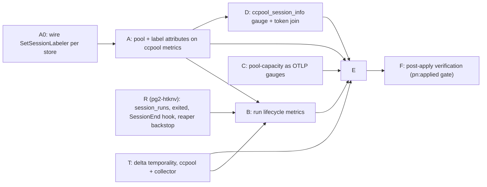

# ccpool per-pool Grafana dashboard — implementation plan

Status: DRAFT rev 5 (2026-09-29), revised after two independent reviews and the operator
rulings of 2026-09-29 (section 3). Repo: `phillipgreenii-nix-agent-support`. Beads T (collector
half) and possibly C ALSO change `phillipgreenii-nix-support-apps` (the otelcol pipeline);
both repos share the `pg2-` tracker.

Layer convention used throughout: at the Go/OTel layer label keys are dotted (`pgrouter.role`,
as `SessionAttrs` returns it); in Prometheus/PromQL/Grafana they are underscored
(`pgrouter_role`; collector `translation_strategy: UnderscoreEscapingWithoutSuffixes`, inferred
from config, confirmed live in Bead A). Go-side tests assert the dotted key; only queries and
dashboards use the underscored one.
Beads label set for every bead filed from this plan: `agent-support`, `ccpool`.

## 1. Goal

The operator MUST be able to open one Grafana dashboard and, **grouped by pool** (the
`pool` metric attribute, the pool directory's basename, for example `pg-router-ccpool-review`;
`pgrouter_role` is an optional second dimension), see:

1. how long ccpool sessions last (run duration distribution),
2. how runs ended (`idle_ttl`, `cap_eviction`, `operator`, `handler`, `exited`),
3. retries and failures,
4. token usage,
5. pool capacity vs. use,

so that a misbehaving pool is identifiable at a glance.

**Scope (rev 5).** Runs that end on their own (Claude exits, tmux dies) ARE in scope, via
`pg2-htknv` (`session_runs` table, a `SessionEnd` hook, and a reaper backstop). Manual CLI
invocations without an OTLP endpoint in their environment are not counted.

## 2. Findings that shape the plan (verified live and in code, 2026-09-29)

| Need                           | Present today                                                                                                                                                                                                                                                                                                                                                                                                                                                                                                                                                                                                                                                                                                                                                                           | Gap                                                                                                   |
| ------------------------------ | --------------------------------------------------------------------------------------------------------------------------------------------------------------------------------------------------------------------------------------------------------------------------------------------------------------------------------------------------------------------------------------------------------------------------------------------------------------------------------------------------------------------------------------------------------------------------------------------------------------------------------------------------------------------------------------------------------------------------------------------------------------------------------------- | ----------------------------------------------------------------------------------------------------- |
| Group by pool                  | The operator-label mechanism EXISTS (`pg2-24f89` D8/D9; packets `pg2-qye99.3`/`.4`/`.6`/`.8`): `ccpool new ... --meta k=v --label k` (and `ccpool meta set --label`) flags a metadata key as label-eligible (`store.MarkAsLabel`, column `is_label`), and the handler already passes `--label pgrouter.role --label pgrouter.pool`. But it is only half-wired: (1) `telemetry.SetSessionLabeler` has NO production caller, so `SessionAttrs` always returns empty (live Loki `ccpool` logs carry `external_id` but no role/pool); (2) `SessionAttrs` feeds only `slog` args (`sessionLogArgs`), while every `Record*` metric function takes no attributes, so the labels never reach metrics. Live `ccpool_*` series carry only `service_name`, `outcome`/`reason`/`route`, host labels | Wire the labeler; pass allowlisted labels into metric attributes                                      |
| Counter correctness (CRITICAL) | ccpool is a short-lived CLI exporting via `otlpmetricgrpc` with a PeriodicReader, i.e. CUMULATIVE temporality, every process starting at 0, all processes sharing one series (no instance id), and the collector has no `cumulativetodelta`/`deltatocumulative` processor. Live proof: `ccpool_launch_outcome_total{route="reuse_live",outcome="success"}` has 10 samples in 30 days, max value 1, so `increase(...[30d])` = 0 although 10 events occurred. Every counter/histogram panel would read ~0                                                                                                                                                                                                                                                                                 | Bead T (blocking, both repos): delta temporality in ccpool plus `deltatocumulative` in the collector  |
| Retries / failures             | `ccpool_launch_outcome_total` HAS series (`route=brand_new`/`reuse_live`, `outcome=success`/`timeout`); `ccpool_cancel_total` and `ccpool_sessions_preserved_for_human` have series (not recent); `ccpool_retries_total` has none                                                                                                                                                                                                                                                                                                                                                                                                                                                                                                                                                       | Only `retries_total` is unexercised; no pool dimension anywhere                                       |
| Duration / result              | Store has `CreatedAt` and `closed_at`; close reason stamped by `closeWithReason`                                                                                                                                                                                                                                                                                                                                                                                                                                                                                                                                                                                                                                                                                                        | Nothing exported                                                                                      |
| Tokens                         | `pa_monitor_session_tokens{session_id}` and `pa_monitor_session_info{session_id,session_name,status}`; `session_name` encodes the role only for pg-router sessions (`pg-router-<role>-<bead>`); other sessions (`pristine-a1`) are also present                                                                                                                                                                                                                                                                                                                                                                                                                                                                                                                                         | Live sessions only; pool derived by regex; semantics of the gauge (current vs. cumulative) unverified |
| Capacity                       | `pool-capacity.prom` written by the poolMetrics LaunchAgent with labels `{role,pool=<full dir path>,dim}`, `dim` in `max_sessions\|live\|preserved\|counted\|free`                                                                                                                                                                                                                                                                                                                                                                                                                                                                                                                                                                                                                      | No such series in Prometheus; `pool` label is a filesystem path (unbounded, unsuitable)               |
| Dashboard                      | None. `pg2-24f89` §1 lists a dashboard as out of scope and §9 as a natural follow-on; no open bead covers it                                                                                                                                                                                                                                                                                                                                                                                                                                                                                                                                                                                                                                                                            | Everything                                                                                            |

Existing patterns to reuse (Reuse First):

- Dashboard JSON + registration: `packages/pa-monitor/grafana/pa-monitor-overview.json`,
  registered in `darwin/modules/pa-monitor/default.nix:69-72` via
  `phillipgreenii.observability.dashboardProviders.<name> = { folder; dashboards; }`
  (darwin scope). `darwin/modules/ccpool/default.nix` already has an
  `obs = config.phillipgreenii.observability` block guarded by
  `lib.mkIf (obs.enable or false)`; the registration SHOULD go inside it. The
  provider only renders when `observability.ui.enable` is also set.
- Folder: reuse the existing `Claude Agents` folder title exactly (folders converge by
  title, ADR 0039).
- ccpool instruments: `packages/ccpool/internal/telemetry/metrics.go` (lazy
  registration, `Record*` functions, nil-safe). Tests spy through package-level aliases
  (for example `recordRetry = telemetry.RecordRetry`) because the instrument
  singleton cannot be reset; `metrics_test.go` tests `newMetricsInstruments` against a
  local meter. New work MUST follow both.
- Shutdown flush: `run()` in `packages/ccpool/cmd/ccpool/main.go:62` defers
  `shutdown(...)`, so metrics flush for every subcommand that returns through `run()`.

**Rev 5 corrections to the findings above** (section 3 governs where they disagree): the
"Group by pool" gap is now closed by a `pool` attribute PLUS the allowlisted role label (P1);
"Duration / result" is now sourced from `session_runs` (`pg2-htknv`), which also covers runs
that end without ccpool closing them; the "Tokens" join is on the Claude session id, not on
`session_name` (P2). Verified 2026-09-29: the Prometheus `pa_monitor_session_info.session_id`
equals ccpool's `claude_session_id`.

## 3. Decisions

Rev 5 rewrites this section (superseding rows P1, P2 and P4 of rev 4). Operator rulings of
2026-09-29: `session_runs` table (yes); natural exits in v1 (yes); token join on the Claude
session id (yes, "we can see if it works").

- **P1 (pool and role labels).** Metric attributes are (a) `pool`: the resolved pool
  directory's basename, threaded per `Service` (NOT process-global: `reap-all` iterates pools
  and uses `LoadForPool` without mutating `CCPOOL_POOL`), bounded by the operator-configured
  pools; and (b) labels from the existing operator-label mechanism (D8) restricted to an
  allowlist (default `pgrouter.role` only; `pgrouter.pool` is the constant `pg-router` and is
  useless for grouping). A pool is NOT guaranteed to hold one role, so `pool` is the primary
  grouping key and `pgrouter_role` is secondary. D9 does not enforce cardinality, so a key
  such as `pgrouter.bead` marked as a label would explode series; the allowlist is the guard.
  `external_id`, `session_id`, bead ids and filesystem paths MUST NOT become metric
  attributes (the pool basename is the only path-derived value, and only because the set of
  pools is small and operator-controlled). Unlabelled sessions show as an empty
  `pgrouter_role`.
- **P2 (tokens, v1).** Live-session gauge from pa-monitor. The join to a pool uses the Claude
  session id: `pa_monitor_session_info.session_id` equals ccpool's `claude_session_id`
  (verified 2026-09-29 for `pg-router-worker-zr-iu3pg.3`: both are
  `3e76223c-9544-49e2-a008-393709634f21`). ccpool's reaper emits a bounded
  `ccpool_session_info{claude_session_id, pool, pgrouter_role} = 1` gauge per live session
  (Bead D). Cumulative per-pool tokens is a follow-up.
- **P3 (capacity).** Emit capacity as OTLP gauges (a short spike in Bead C confirms), give the
  poolMetrics LaunchAgent `obs.mkEmitterEnv`, retire the `.prom` file and its temp-file leak.
  The fallback is a collector receiver (sibling repo). The collector has only otlp, filelog and
  optional hostmetrics receivers today.
- **P4 (natural exits, IN v1).** `pg2-htknv` adds the `session_runs` table (one row per launch
  or resume), a new close reason `exited`, a `SessionEnd` hook (`ccpool hook end`) and a
  reaper backstop. Labels MUST be resolved before any `Store.Delete`. The event log
  (`events.jsonl`) was considered as the source and rejected: it is not shipped to Loki and
  carries no role.
- **P5 (temporality).** Delta temporality in ccpool plus `deltatocumulative` in the collector
  (Bead T). Do NOT add `service.instance.id` or a pid attribute (unbounded series).
- **P6 (metric emission process).** Metrics are emitted by processes that have the OTLP
  environment: `closeWithReason` callers (handler-initiated `ccpool close`, the reaper) and
  the reaper. The Claude hook process has no OTLP environment, so a run ended by
  `ccpool hook end` only writes the store; the reaper's next sweep emits the metrics for
  runs that ended since the last emission (a per-run `metrics_emitted` flag, added by Bead B).

**Canonical grouping key (A, C, D, E agree):** the metric attribute `pool` (Prometheus label
`pool`). Capacity series (Bead C) use the pool name the handler already passes
(`--pool name=dir`). `pgrouter_role` is available for sessions that carry the label.

## 4. Work breakdown



Dependencies MUST be wired as real `bd dep` edges between sibling tasks. Every Go
bead MUST follow TDD (failing test first) and SHOULD be run through the
`pg-go-mutate:go-test-gaps` skill. Every bead MUST pass `prek` on changed files.

### Bead T — delta temporality for ccpool metrics (blocking; two repos)

- **Problem (verified live).** With cumulative temporality and a fresh process per
  invocation, every process exports a counter starting from 0 into one shared series, so
  `increase()`/`rate()` see no increase. Ten real launch events show as `increase` = 0.
- **ccpool side** (`phillipgreenii-nix-agent-support`, `internal/telemetry/telemetry.go`
  ~lines 122-140): configure delta temporality on the OTLP metric exporter
  (`otlpmetricgrpc.WithTemporalitySelector(sdkmetric.DeltaTemporalitySelector)`), or set
  `OTEL_EXPORTER_OTLP_METRICS_TEMPORALITY_PREFERENCE=delta` via `mkEmitterEnv`. Prefer the
  code change so it holds for every invocation path. Gauges are unaffected.
- **Collector side** (`phillipgreenii-nix-support-apps`,
  `darwin/services/otelcol/config.yaml.nix`, metrics pipeline): add the
  `deltatocumulative` processor before the `prometheusremotewrite` exporter, which drops
  delta sums. Confirm the collector distribution ships that processor. This bead is filed
  in the sibling repo's tracker with a note linking it; the ccpool half is filed here.
  Bead E and F depend on both halves (record the cross-tracker dependency in text).
- MUST NOT add `service.instance.id` or a pid attribute (unbounded series).
- **Acceptance.** Two `ccpool` processes each incrementing a counter once produce
  `increase(...) == 2` in Prometheus (this is also the Bead F check).

### Bead A0 — wire the existing label mechanism (bug fix)

- `telemetry.SetSessionLabeler` has no production caller, so `SessionAttrs` returns
  empty for every session, including in logs. `run()` (`cmd/ccpool/main.go`) opens NO
  store: each subcommand opens its own (`new.go`, `reply.go`, `hook.go`, `attend.go`,
  and `buildServiceFor` used by cancel/close/reap). The labeler is a process-global
  singleton, and `reap-all` builds one store per pool inside one process.
- Therefore: call `telemetry.SetSessionLabeler(st)` immediately after each
  `store.Open` (in `buildServiceFor`, `new.go`, `reply.go`), re-set it on every pool
  iteration of `reap-all`, and clear it (`nil`) when that store closes. Degrade to a
  no-op if the store cannot open.
- **Acceptance.** Integration test: create a session with `--meta pgrouter.role=review
--label pgrouter.role`; assert `SessionAttrs` returns it and the slog record carries
  it. A two-pool `reap-all` test asserts each pool's sessions resolve against their own
  store. Rows created before the handler passed `--label` have `is_label=0`; they show
  as "unlabelled" and no backfill is done in v1.

### Bead A — pool and label attributes on ccpool metrics

- **Pool.** Every metric record carries `pool` (P1): the basename of the resolved pool root
  (`config.ResolvePool(...).Root`, the same value that sets `CCPOOL_POOL` in `main.go`),
  held as a field on the per-pool `Service` deps and passed explicitly into the `Record*`
  functions. Do NOT read `CCPOOL_POOL` from the process environment inside `Record*`.
- **Labels.** Additional attributes come from `SessionAttrs(externalID)`, filtered through an
  allowlist (default `pgrouter.role` only; configurable in ccpool config). Keys not on the
  allowlist MUST be dropped from metrics (they still appear on logs). This is the
  cardinality guard D9 left to the caller; document it on the API.
- **API change.** All seven `Record*` functions gain the attribute parameters
  (`RecordRetryExhausted`, `RecordReapPhantomPruned` and
  `RecordSessionsPreservedForHuman(count)` currently take no label context). Every caller
  MUST be enumerated and updated: the aliases in `cmd/ccpool/retry.go`, and the
  `recordCancel` / `recordReap*` helpers in `internal/session/*`. Each call site already has
  the `externalID` it needs (they already call `sessionLogArgs`).
- **Resolve before delete.** `Store.Delete` also deletes the session's metadata
  (`store/ops.go` ~244-246). Reap Pass 0 (phantom prune) and `--purge` closes MUST resolve
  `SessionAttrs` BEFORE the delete and pass the result to the emitter; today the
  phantom-prune metric and its log line would always be unlabelled. Test both paths.
- **Multi-session commands.** `reap` / `reap-all` MUST resolve attributes per session inside
  their loop (D8.2), not once per process.
- **Gauge.** `ccpool_sessions_preserved_for_human` is process-wide and unlabelled today; it
  MUST emit one value per `pool` (and label set), and its description MUST state that a
  short-lived CLI is last-value-wins.
- **Name check.** Confirm the exported Prometheus names live (`pool`, expected
  `pgrouter_role`) and record them in the bead; B–E use them.
- **Acceptance.** Unit test per instrument asserting `pool` and the allowlisted key
  `pgrouter.role` appear and a non-allowlisted key (`pgrouter.bead`) does not; a `reap-all`
  test across two pools proving each record carries its own pool; phantom-prune and purge
  tests.

### Bead R — `session_runs`, natural exits, SessionEnd hook (`pg2-htknv`, already filed)

Tracked as bead `pg2-htknv` (filed 2026-09-29, with a research comment); summarized here so
the plan is self-contained.

- `session_runs` table (migration `009_*.sql`): one row per launch or resume, `started_at`,
  `ended_at` (NULL while open), `end_reason`, `end_source` (`close`, `hook`, `reaper`).
- `closeWithReason` ends the current run after teardown succeeds. New close reason `exited`
  (natural end), added to `store.CloseReasons` and `validateCloseReason`.
- `SessionEnd` hook (research: it exists; payload `reason` in
  `clear|resume|logout|prompt_input_exit|other`; cannot distinguish `/exit` from a crash; 1.5 s
  budget): add it to `ccpool-plugin/hooks/hooks.json` with an explicit timeout, dispatching to
  `ccpool hook end`. If the run already carries a reason (ccpool stamps it BEFORE sending
  `/exit`) keep it; otherwise record `exited`, `end_source=hook`, with the hook's exact
  timestamp. `reason=clear|resume` MUST NOT end the run as `exited` (verify on this machine).
- Reaper backstop: Reap Pass 0 ends any open run whose tmux session is gone with `exited`,
  `ended_at = last_activity_at`, before any delete. Covers SIGKILL, power loss and rows
  predating the hook.

### Bead B — run lifecycle metrics

- Depends on Bead R (`session_runs`), A (attribute plumbing) and T (temporality).
- Add `ccpool_session_duration_seconds` (`Float64Histogram`, attributes `pool`,
  `pgrouter.role`, `result`) and `ccpool_sessions_closed_total` (counter, same attributes).
  Duration is `ended_at - started_at` of the RUN, so a resumed session's idle-closed gap is
  no longer counted (this replaces the earlier `CreatedAt`-based duration and the
  `last_launched_at` option).
- **`result` vocabulary** is the close-reason set: `idle_ttl|cap_eviction|operator|handler|exited`.
- **Emission.** (1) A run ended by `closeWithReason` or the reaper is emitted by that same
  process right after the end is recorded, inside the per-`external_id` lock, after teardown
  succeeds. (2) A run ended by the hook (no OTLP environment in the hook process) is emitted
  by the reaper's next sweep. To make both idempotent, add a `metrics_emitted` flag on the run
  (migration `010_*.sql`, or fold into `009` if Bead R has not landed): the emitter selects
  ended runs with `metrics_emitted = 0`, emits, then sets the flag. Do NOT dedupe on "row
  already closed" (the row keeps `close_reason` across resumes).
- **Labels before delete.** Read `pool`, labels and run timestamps BEFORE `--purge` and
  Pass 0 delete the row.
- **Histogram.** `metric.WithUnit("s")` for OTel correctness (with
  `UnderscoreEscapingWithoutSuffixes` no suffix is added, so names are
  `ccpool_session_duration_seconds_bucket|_sum|_count`) and explicit bucket boundaries via
  `metric.WithExplicitBucketBoundaries(...)` spanning 30 s to 4 h; the SDK defaults are wrong
  for seconds.
- **Flush.** Test that the close path flushes through `run()`. `os.Exit` appears only in
  `main()` (flag-parse usage errors), so no bypass exists on the close path.
- **Also verify** `ccpool_retries_total` call sites (`cmd/ccpool/retry.go` `maybeRetry`): the
  only D6 instrument with no live series. Confirm it is merely unexercised, or file a bug
  bead.

### Bead C — pool-capacity as OTLP gauges (replaces the `.prom` file)

- **Spike (short).** Confirm P3 option (a): `ccpool capacity` (`cmd/ccpool/capacity.go`)
  already computes `max_sessions|live|preserved|counted|free`. Emit these as OTLP
  gauges with attribute `pool` (the pool name the handler already passes as
  `--pool name=dir`; the path itself MUST NOT become a label) and a `dim` attribute, from the poolMetrics LaunchAgent (or a `--emit-metrics` flag on
  `capacity`). Give the `pg-router-ccpool-handler-pool-metrics` LaunchAgent
  `obs.mkEmitterEnv` (`darwin/modules/pg-router-ccpool-handler/default.nix`); it has no
  `EnvironmentVariables` today. Gauges have no temporality problem.
- If the spike finds a blocker, fall back to option (b) (collector receiver in the
  sibling repo) and record the decision on the bead.
- **Retire the `.prom` path** when (a) lands: remove the file writer and thereby the
  mktemp leak (`home/programs/pg-router-ccpool-handler/default.nix` ~278-280: `set -eu`
  plus `mktemp` with no trap; ~90 leaked `pool-capacity.prom.XXXXXX` files in
  `~/.local/state/pg-router-ccpool-handler/`). If (b) is chosen instead, fix the leak
  with a trap and a regression test. Either way, clean up the existing leaked files as
  part of the bead (operator-approved deletion; look at the directory first).
- The path-valued `pool` label MUST NOT be carried over (unbounded).
- Panel 6 queries: in-use = `max by (pool) (...{dim="live"})`, capacity =
  `max by (pool) (...{dim="max_sessions"})`. This series does not exist in
  Prometheus today.
- Acceptance: series visible in Prometheus after apply (verified in Bead F).

### Bead D — session-info gauge and token usage by pool

- **Verified 2026-09-29:** `pa_monitor_session_info.session_id` equals ccpool's
  `claude_session_id` for `pg-router-worker-zr-iu3pg.3` (`3e76223c-9544-49e2-a008-393709634f21`
  in both `ccpool list --json` and Prometheus). The bead MUST re-verify on a review and a
  feedback session before relying on it (operator: "we can see if it works").
- **New gauge (Go, ccpool).** The reaper, which already enumerates live rows every 300 s and
  has the OTLP environment, emits `ccpool_session_info{claude_session_id, pool,
pgrouter.role} = 1` per live session, resolved before any delete. The label
  `claude_session_id` is high-cardinality by design but bounded by live sessions (the same
  order as pa-monitor's own `session_info`); it is the ONLY per-session id permitted on a
  ccpool metric and MUST be documented as an exception to the P1 rule. Stale series age out
  after the collector stops receiving them.
- **PromQL** (inline, no recording rules unless the observability module already supports
  rule files; unverified):

```promql
pa_monitor_session_tokens
  * on (session_id) group_left (pool, pgrouter_role)
    label_replace(
      max by (claude_session_id, pool, pgrouter_role) (ccpool_session_info),
      "session_id", "$1", "claude_session_id", "(.*)"
    )
```

- Sessions with no `ccpool_session_info` match (non-ccpool sessions, for example
  `pristine-a1`) drop out of the join, which is correct; they MUST NOT be mislabelled.
- Before writing the panel, read pa-monitor's emitter to confirm whether `session_tokens` is
  current-context or cumulative and word the panel description accordingly. State in the
  description: live sessions only; series vanish at session end.
- Fallback if the join fails on review or feedback sessions: derive the role from
  `session_name` with `label_replace` (only valid while a pool holds one role).
- File a follow-up bead for cumulative per-pool tokens.

### Bead E — dashboard

- New file `packages/ccpool/grafana/ccpool-pools.json` (new directory; the ccpool
  package's `default.nix` is a Go package and is unaffected). Register via
  `dashboardProviders.ccpool` inside the existing `mkIf (obs.enable or false)` block of
  `darwin/modules/ccpool/default.nix`, folder `Claude Agents`. The `uid` MUST be
  unique (pa-monitor uses `pa-monitor-overview`); use `ccpool-pools`.
- Template variable `$pool` (`label_values(ccpool_session_info, pool)`): it is empty until the
  first sweep after apply, so the variable SHOULD have a static custom fallback listing the
  configured pool names. `pgrouter_role` MAY be a second variable; sessions without a role
  label show as an empty `pgrouter_role`.
- Panels, each grouped `by (pool)`:
  1. Duration: `histogram_quantile(0.5|0.95, sum by (le, pool) (rate(ccpool_session_duration_seconds_bucket[$__rate_interval])))`.
  2. Results: `sum by (pool, result) (increase(ccpool_sessions_closed_total[$__range]))`
     (stacked bars).
  3. Retries: `increase(ccpool_retries_total[...])` by `pool, class`; exhausted by
     `pool`.
  4. Failures: launch outcomes by `pool, outcome, route`; cancel outcomes by `pool`;
     context row from `pg_router_failures_total` using `sum by (class, reason)` (the
     `handler-error` series has no `reason`; default it with `label_replace`).
  5. Tokens: Bead D expression.
  6. Capacity: Bead C expressions.
- Query hygiene: counters MUST use `increase()`/`rate()`, never raw values. Queries
  MUST NOT use `or vector(0)` on grouped sums (it yields a label-less series that will
  not align with per-pool groups); leave empty states as Grafana "No data" and add panel
  descriptions. Counter panels are only correct once Bead T has landed and applied; the
  bead MUST declare that dependency.
- Panel descriptions MUST note that manual operator CLI invocations without an OTLP
  endpoint in their environment are not counted (D10: out of scope).
- Dashboard test: there is NO existing flake check on `pa-monitor-overview.json`
  (only alerting YAML asserts in `flake.nix`). The bead SHOULD add a small check that
  the JSON parses, has the fixed `uid`, and that each panel query references only
  metric names defined in this plan; if the operator declines, the bead MUST say so
  explicitly.
- Colours and legend SHOULD follow the `dataviz` skill (one categorical colour per
  pool, identical across panels).

### Bead F — post-apply verification

- Gated with `pn:applied` on the commit of Beads A–E (use `pb:pb-gate-lifecycle`; file
  only after committing).
- Checks: dashboard appears under `Claude Agents`; each panel returns data or an
  intentional empty state per pool; `pool` is present on every `ccpool_*` series
  (confirms the exported label name); capacity series present.
- **Multi-process aggregation.** Close (or otherwise trigger a counter on) two
  throwaway sessions from two SEPARATE `ccpool` processes and assert
  `increase(ccpool_sessions_closed_total[...])` == 2 for that pool. This is the
  acceptance test for Bead T.
- Historic sessions that predate the handler's `--label` have an empty `pgrouter_role`; that is
  expected (Bead A0 documents it; no backfill in v1). Verify the token join on a review and a
  feedback session as well as a worker session; a natural exit (kill a throwaway session's
  claude) appears as `result=exited`.

## 5. Out of scope

- Cumulative per-pool token accounting (follow-up).
- Alert rules on the new metrics (separate bead once baselines exist).
- Changing `diaglog`/`hook.go` (per `pg2-24f89` D1).
- OTLP traces.

## 6. Risks

- **Cardinality**: guarded by the metric-attribute allowlist and the fixed `result` set; reviewers MUST reject
  any bead that adds an id-like or path-like attribute.
- **Undercounting**: metrics come only from processes with an OTLP endpoint in their
  environment (handler-dispatched subprocesses inherit it per D10, unverified for
  `ccpool close` subprocesses; Bead B MUST verify it). A run ended by the hook is counted at
  the reaper's next sweep (up to the reap interval, 300 s, late), and SIGKILL or power loss
  is only caught by the reaper backstop.
- **Empty dashboard at first**: mitigated by static variable fallback and panel
  descriptions.
- **Stale premise**: findings are dated 2026-09-29; each bead author MUST re-verify
  live state before acting.

## 7. Bead filing

Epic "ccpool per-pool dashboard" with sibling task children T, A0, A, B, C, D, E, F plus the existing bead `pg2-htknv` (Bead R). bd rejects mixed-type
`blocks` edges between an epic and a task (workspace memory, verified 2026-09-10), so
edges are wired between the tasks only, per the diagram. Each non-trivial technical
bead MUST be reviewed by an independent subagent against the codebase before release.
