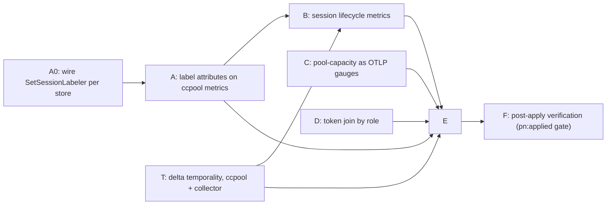

# ccpool per-pool Grafana dashboard — implementation plan

Status: DRAFT rev 4 (2026-09-29), revised after two independent reviews. Repo:
`phillipgreenii-nix-agent-support`. Beads T and (possibly) C ALSO change
`phillipgreenii-nix-support-apps` (the otelcol pipeline); bd dependencies do not cross
trackers, so those are filed in the tracker of the repo that owns the code and linked by
a note.

Layer convention used throughout: at the Go/OTel layer the label key is `pgrouter.role`
(as `SessionAttrs` returns it); in Prometheus/PromQL/Grafana it is `pgrouter_role`
(collector `translation_strategy: UnderscoreEscapingWithoutSuffixes`, dots become
underscores; inferred from config, confirmed live in Bead A). Go-side tests assert the
dotted key; only queries and dashboards use the underscored one.
Beads label set for every bead filed from this plan: `agent-support`, `ccpool`.

## 1. Goal

The operator MUST be able to open one Grafana dashboard and, **grouped by pool**
(`review`, `feedback`, `worker`; sessions with no role label, including the `default`
pool's, appear as "unlabelled"), see:

1. how long ccpool sessions last (duration distribution),
2. how sessions ended (close reason),
3. retries and failures,
4. token usage,
5. pool capacity vs. use,

so that a misbehaving pool is identifiable at a glance.

**Scope limit (stated up front).** Duration and result cover only sessions that
ccpool itself closes (reap, `ccpool close`, handler-initiated close). Sessions that
end on their own (Claude exits, tmux dies) never pass through `closeWithReason`;
covering them is a stretch goal (Bead B, section "natural exits"), not a
precondition for the dashboard.

## 2. Findings that shape the plan (verified live and in code, 2026-09-29)

| Need                           | Present today                                                                                                                                                                                                                                                                                                                                                                                                                                                                                                                                                                                                                                                                                                                                                                           | Gap                                                                                                   |
| ------------------------------ | --------------------------------------------------------------------------------------------------------------------------------------------------------------------------------------------------------------------------------------------------------------------------------------------------------------------------------------------------------------------------------------------------------------------------------------------------------------------------------------------------------------------------------------------------------------------------------------------------------------------------------------------------------------------------------------------------------------------------------------------------------------------------------------- | ----------------------------------------------------------------------------------------------------- |
| Group by pool                  | The operator-label mechanism EXISTS (`pg2-24f89` D8/D9; packets `pg2-qye99.3`/`.4`/`.6`/`.8`): `ccpool new ... --meta k=v --label k` (and `ccpool meta set --label`) flags a metadata key as label-eligible (`store.MarkAsLabel`, column `is_label`), and the handler already passes `--label pgrouter.role --label pgrouter.pool`. But it is only half-wired: (1) `telemetry.SetSessionLabeler` has NO production caller, so `SessionAttrs` always returns empty (live Loki `ccpool` logs carry `external_id` but no role/pool); (2) `SessionAttrs` feeds only `slog` args (`sessionLogArgs`), while every `Record*` metric function takes no attributes, so the labels never reach metrics. Live `ccpool_*` series carry only `service_name`, `outcome`/`reason`/`route`, host labels | Wire the labeler; pass allowlisted labels into metric attributes                                      |
| Counter correctness (CRITICAL) | ccpool is a short-lived CLI exporting via `otlpmetricgrpc` with a PeriodicReader, i.e. CUMULATIVE temporality, every process starting at 0, all processes sharing one series (no instance id), and the collector has no `cumulativetodelta`/`deltatocumulative` processor. Live proof: `ccpool_launch_outcome_total{route="reuse_live",outcome="success"}` has 10 samples in 30 days, max value 1, so `increase(...[30d])` = 0 although 10 events occurred. Every counter/histogram panel would read ~0                                                                                                                                                                                                                                                                                 | Bead T (blocking, both repos): delta temporality in ccpool plus `deltatocumulative` in the collector  |
| Retries / failures             | `ccpool_launch_outcome_total` HAS series (`route=brand_new`/`reuse_live`, `outcome=success`/`timeout`); `ccpool_cancel_total` and `ccpool_sessions_preserved_for_human` have series (not recent); `ccpool_retries_total` has none                                                                                                                                                                                                                                                                                                                                                                                                                                                                                                                                                       | Only `retries_total` is unexercised; no pool dimension anywhere                                       |
| Duration / result              | Store has `CreatedAt` and `closed_at`; close reason stamped by `closeWithReason`                                                                                                                                                                                                                                                                                                                                                                                                                                                                                                                                                                                                                                                                                                        | Nothing exported                                                                                      |
| Tokens                         | `pa_monitor_session_tokens{session_id}` and `pa_monitor_session_info{session_id,session_name,status}`; `session_name` encodes the role only for pg-router sessions (`pg-router-<role>-<bead>`); other sessions (`pristine-a1`) are also present                                                                                                                                                                                                                                                                                                                                                                                                                                                                                                                                         | Live sessions only; pool derived by regex; semantics of the gauge (current vs. cumulative) unverified |
| Capacity                       | `pool-capacity.prom` written by the poolMetrics LaunchAgent with labels `{role,pool=<full dir path>,dim}`, `dim` in `max_sessions\|live\|preserved\|counted\|free`                                                                                                                                                                                                                                                                                                                                                                                                                                                                                                                                                                                                                      | No such series in Prometheus; `pool` label is a filesystem path (unbounded, unsuitable)               |
| Dashboard                      | None. `pg2-24f89` §1 lists a dashboard as out of scope and §9 as a natural follow-on; no open bead covers it                                                                                                                                                                                                                                                                                                                                                                                                                                                                                                                                                                                                                                                                            | Everything                                                                                            |

Existing patterns to reuse (Reuse First):

- Dashboard JSON + registration: `packages/pa-monitor/grafana/pa-monitor-overview.json`,
  registered in `darwin/modules/pa-monitor/default.nix:69-72` via
  `phillipgreenii.observability.dashboardProviders.<name> = { folder; dashboards; }`
  (darwin scope). `darwin/modules/ccpool/default.nix` already has an
  `obs = config.phillipgreenii.observability` block guarded by
  `lib.mkIf (obs.enable or false)`; the registration SHOULD go inside it. The
  provider only renders when `observability.ui.enable` is also set.
- Folder: reuse the existing `Claude Agents` folder title exactly (folders converge by
  title, ADR 0039).
- ccpool instruments: `packages/ccpool/internal/telemetry/metrics.go` (lazy
  registration, `Record*` functions, nil-safe). Tests spy through package-level aliases
  (for example `recordRetry = telemetry.RecordRetry`) because the instrument
  singleton cannot be reset; `metrics_test.go` tests `newMetricsInstruments` against a
  local meter. New work MUST follow both.
- Shutdown flush: `run()` in `packages/ccpool/cmd/ccpool/main.go:62` defers
  `shutdown(...)`, so metrics flush for every subcommand that returns through `run()`.

## 3. Decisions (operator rulings requested before filing)

| ID  | Decision                                                                                                                                                                                                                                                                                                                                                                                                                                                                                                                                                                                                                                                                                                                                                                                                                                                                                                    | Recommendation                              |
| --- | ----------------------------------------------------------------------------------------------------------------------------------------------------------------------------------------------------------------------------------------------------------------------------------------------------------------------------------------------------------------------------------------------------------------------------------------------------------------------------------------------------------------------------------------------------------------------------------------------------------------------------------------------------------------------------------------------------------------------------------------------------------------------------------------------------------------------------------------------------------------------------------------------------------- | ------------------------------------------- |
| P1  | Use the EXISTING operator-label mechanism (D8) as the source of metric labels, instead of inventing a dir-derived `pool`. The operator chooses which metadata keys are labels (`--label`); the handler already labels `pgrouter.role` (`review\|feedback\|worker`, one pool per role) and `pgrouter.pool` (constant `pg-router`, useless for grouping). Metric attributes MUST be restricted to an allowlist (default `pgrouter.role` ONLY, since `pgrouter.pool` is the constant `pg-router` and would add a useless label to every series; configurable), because D9 deliberately does not enforce cardinality and a session key such as `pgrouter.bead` marked as a label would explode metric series. Logs MAY keep all marked labels. `external_id`, `session_id`, bead ids and paths MUST NOT become metric attributes. Sessions without labels (manual CLI) group under an empty/`unlabelled` value. | Accept                                      |
| P2  | Token usage v1 = live-session gauge from pa-monitor joined to a pool by `session_name`. Cumulative per-pool tokens is a follow-up.                                                                                                                                                                                                                                                                                                                                                                                                                                                                                                                                                                                                                                                                                                                                                                          | Accept                                      |
| P3  | Capacity ingestion path. The collector has only otlp, filelog and optional hostmetrics receivers, so `pool-capacity.prom` cannot be ingested as-is. Options: (a) RECOMMENDED: emit capacity as OTLP gauges from ccpool itself (ccpool already has the SDK and a `capacity` command; gauges have no temporality problem), give the poolMetrics LaunchAgent `obs.mkEmitterEnv`, and retire the `.prom` file and its temp-file leak; (b) add a Prometheus/textfile receiver to the collector (sibling-repo change). Bead C confirms (a) with a short spike.                                                                                                                                                                                                                                                                                                                                                    | Accept (a) unless the spike finds a blocker |
| P4  | Natural-exit coverage (sessions ending without ccpool closing them). Note the dependency: natural exits are only visible as reap Pass 0 phantom prunes, and `Store.Delete` removes the session's metadata, so labels MUST be resolved before the delete (Bead A) for a `natural` result to be labelled. The event log (`events.jsonl`, `Kind:"close"`) was considered as the source and rejected for v1: it is not shipped to Loki and carries no role.                                                                                                                                                                                                                                                                                                                                                                                                                                                     | Out of v1; file follow-up                   |
| P5  | Delta temporality (Bead T): change ccpool's exporter to delta and add `deltatocumulative` to the collector metrics pipeline. Do NOT add `service.instance.id` or a pid attribute (unbounded series).                                                                                                                                                                                                                                                                                                                                                                                                                                                                                                                                                                                                                                                                                                        | Accept                                      |

**Canonical grouping key (fixed up front so A, C, D, E agree):** the dashboard's
"pool" is the value of the `pgrouter.role` label (`review`, `feedback`, `worker`),
which OTel exports to Prometheus as `pgrouter_role` (dots become underscores; Bead A
MUST confirm the exact exported name live). Each role has its own pool dir, so role ==
pool for pg-router sessions. Capacity series (Bead C) and the token join (Bead D) are
relabelled to that same `pgrouter_role` name. Unlabelled sessions show as an empty
value and the dashboard MUST render them as "unlabelled", not drop them.

## 4. Work breakdown



Dependencies MUST be wired as real `bd dep` edges between sibling tasks. Every Go
bead MUST follow TDD (failing test first) and SHOULD be run through the
`pg-go-mutate:go-test-gaps` skill. Every bead MUST pass `prek` on changed files.

### Bead T — delta temporality for ccpool metrics (blocking; two repos)

- **Problem (verified live).** With cumulative temporality and a fresh process per
  invocation, every process exports a counter starting from 0 into one shared series, so
  `increase()`/`rate()` see no increase. Ten real launch events show as `increase` = 0.
- **ccpool side** (`phillipgreenii-nix-agent-support`, `internal/telemetry/telemetry.go`
  ~lines 122-140): configure delta temporality on the OTLP metric exporter
  (`otlpmetricgrpc.WithTemporalitySelector(sdkmetric.DeltaTemporalitySelector)`), or set
  `OTEL_EXPORTER_OTLP_METRICS_TEMPORALITY_PREFERENCE=delta` via `mkEmitterEnv`. Prefer the
  code change so it holds for every invocation path. Gauges are unaffected.
- **Collector side** (`phillipgreenii-nix-support-apps`,
  `darwin/services/otelcol/config.yaml.nix`, metrics pipeline): add the
  `deltatocumulative` processor before the `prometheusremotewrite` exporter, which drops
  delta sums. Confirm the collector distribution ships that processor. This bead is filed
  in the sibling repo's tracker with a note linking it; the ccpool half is filed here.
  Bead E and F depend on both halves (record the cross-tracker dependency in text).
- MUST NOT add `service.instance.id` or a pid attribute (unbounded series).
- **Acceptance.** Two `ccpool` processes each incrementing a counter once produce
  `increase(...) == 2` in Prometheus (this is also the Bead F check).

### Bead A0 — wire the existing label mechanism (bug fix)

- `telemetry.SetSessionLabeler` has no production caller, so `SessionAttrs` returns
  empty for every session, including in logs. `run()` (`cmd/ccpool/main.go`) opens NO
  store: each subcommand opens its own (`new.go`, `reply.go`, `hook.go`, `attend.go`,
  and `buildServiceFor` used by cancel/close/reap). The labeler is a process-global
  singleton, and `reap-all` builds one store per pool inside one process.
- Therefore: call `telemetry.SetSessionLabeler(st)` immediately after each
  `store.Open` (in `buildServiceFor`, `new.go`, `reply.go`), re-set it on every pool
  iteration of `reap-all`, and clear it (`nil`) when that store closes. Degrade to a
  no-op if the store cannot open.
- **Acceptance.** Integration test: create a session with `--meta pgrouter.role=review
--label pgrouter.role`; assert `SessionAttrs` returns it and the slog record carries
  it. A two-pool `reap-all` test asserts each pool's sessions resolve against their own
  store. Rows created before the handler passed `--label` have `is_label=0`; they show
  as "unlabelled" and no backfill is done in v1.

### Bead A — label attributes on ccpool metrics

- **Source.** Metric attributes come from `SessionAttrs(externalID)` (operator-chosen
  labels), filtered through an allowlist (default `pgrouter.role` only; configurable in
  ccpool config). Keys not on the allowlist MUST be dropped from metrics (they still
  appear on logs). This is the cardinality guard D9 left to the caller; document it on
  the API.
- **API change.** All seven `Record*` functions gain an attributes parameter
  (`RecordRetryExhausted`, `RecordReapPhantomPruned` and
  `RecordSessionsPreservedForHuman(count)` currently take no label context). Every
  caller MUST be enumerated and updated: the aliases in `cmd/ccpool/retry.go`, and the
  `recordCancel` / `recordReap*` helpers in `internal/session/*`. Each call site already
  has the `externalID` it needs (they already call `sessionLogArgs`).
- **Resolve before delete.** `Store.Delete` also deletes the session's metadata
  (`store/ops.go` ~244-246). Reap Pass 0 (phantom prune) and `--purge` closes MUST
  resolve `SessionAttrs` (and, for B, `CreatedAt`) BEFORE the delete and pass the
  result to the emitter; today the phantom-prune metric and its log line would always
  be unlabelled. Test both paths.
- **Multi-session commands.** `reap` / `reap-all` MUST resolve attributes per session
  inside their loop (D8.2), not once per process.
- **Gauge.** `ccpool_sessions_preserved_for_human` is process-wide and unlabelled today;
  it MUST emit one value per label set, and its description MUST state that a
  short-lived CLI is last-value-wins.
- **Name check.** Confirm the exported Prometheus label name for `pgrouter.role` live
  (expected `pgrouter_role`) and record it in the bead; B–E use it.
- **Acceptance.** Unit test per instrument asserting the allowlisted key
  `pgrouter.role` appears and a non-allowlisted key (`pgrouter.bead`) does not; a
  `reap-all` test across two roles proving each record carries its own role; phantom
  prune and purge tests.

### Bead B — session lifecycle metrics (ccpool-initiated closes)

- Add `ccpool_session_duration_seconds` (`Float64Histogram`, attributes
  `pgrouter.role`, `result`) and `ccpool_sessions_closed_total` (counter,
  `pgrouter.role`, `result`).
- **`result` vocabulary** is the real close-reason set enforced by
  `store/ops.go:208` and `validateCloseReason` (`close.go:57`):
  `idle_ttl|cap_eviction|operator|handler`. No other values.
- **Emission point and dedupe.** Emit once per successful `closeWithReason` invocation,
  inside the per-`external_id` lock closure, after teardown succeeds (the reason is
  stamped before `/exit` is delivered, and the function returns early on a
  `deliverCommand` error, so emitting at stamp time would double-count on retry). Do
  NOT dedupe on "row already closed": `close_reason`/`closed_at` are never cleared on
  resume, so a closed-then-resumed-then-closed session (idle_ttl followed by `ccpool
reply`) would be skipped the second time.
- **Duration.** `CreatedAt` is row creation, so a resumed session's duration includes
  time spent closed. The operator MUST decide between adding a `last_launched_at`
  column (accurate) and documenting the panel as "row age" (cheap); the plan
  recommends `last_launched_at` if the migration is small, else the documented "row
  age" with the limitation in the panel description. `CreatedAt == 0` is the only
  degenerate case: skip the histogram observation, still count the close, and log via
  `slog.Warn`. Read `CreatedAt` and labels before `--purge` deletes the row.
- **Histogram.** Set `metric.WithUnit("s")` for OTel correctness (with
  `UnderscoreEscapingWithoutSuffixes` no suffix is added, so metric names are
  `ccpool_session_duration_seconds_bucket|_sum|_count`) and explicit bucket boundaries
  via `metric.WithExplicitBucketBoundaries(...)` spanning 30s to 4h; the SDK default
  boundaries are wrong for seconds.
- **Flush.** Add a test proving the close path flushes through `run()`. `os.Exit` appears
  only in `main()` (flag-parse usage errors), so no bypass exists on the close path.
- **Natural exits (stretch, P4).** See P4 for the label-before-delete dependency.
- **Also verify** `ccpool_retries_total` call sites (`cmd/ccpool/retry.go`
  `maybeRetry`): the only D6 instrument with no live series. Confirm it is merely
  unexercised, or file a bug bead.
- Depends on Bead T for meaningful counters.

### Bead C — pool-capacity as OTLP gauges (replaces the `.prom` file)

- **Spike (short).** Confirm P3 option (a): `ccpool capacity` (`cmd/ccpool/capacity.go`)
  already computes `max_sessions|live|preserved|counted|free`. Emit these as OTLP
  gauges with attribute `pgrouter.role` (or the pool identity ccpool already has) and
  a `dim` attribute, from the poolMetrics LaunchAgent (or a `--emit-metrics` flag on
  `capacity`). Give the `pg-router-ccpool-handler-pool-metrics` LaunchAgent
  `obs.mkEmitterEnv` (`darwin/modules/pg-router-ccpool-handler/default.nix`); it has no
  `EnvironmentVariables` today. Gauges have no temporality problem.
- If the spike finds a blocker, fall back to option (b) (collector receiver in the
  sibling repo) and record the decision on the bead.
- **Retire the `.prom` path** when (a) lands: remove the file writer and thereby the
  mktemp leak (`home/programs/pg-router-ccpool-handler/default.nix` ~278-280: `set -eu`
  plus `mktemp` with no trap; ~90 leaked `pool-capacity.prom.XXXXXX` files in
  `~/.local/state/pg-router-ccpool-handler/`). If (b) is chosen instead, fix the leak
  with a trap and a regression test. Either way, clean up the existing leaked files as
  part of the bead (operator-approved deletion; look at the directory first).
- The path-valued `pool` label MUST NOT be carried over (unbounded).
- Panel 6 queries: in-use = `max by (pgrouter_role) (...{dim="live"})`, capacity =
  `max by (pgrouter_role) (...{dim="max_sessions"})`. This series does not exist in
  Prometheus today.
- Acceptance: series visible in Prometheus after apply (verified in Bead F).

### Bead D — token usage by pool

- PromQL, inline (no recording rules unless the observability module already supports
  rule files; that is unverified):

```promql
label_replace(
  pa_monitor_session_tokens
    * on (session_id) group_left (session_name)
      max by (session_id, session_name) (pa_monitor_session_info),
  "pgrouter_role", "$1", "session_name", "pg-router-(review|feedback|worker)-.*"
)
```

- `label_replace` leaves `pgrouter_role` unset on no match, so non-matching sessions MUST be
  given `pgrouter_role="none"` by a second step (or filtered with `pgrouter_role!=""`); they MUST NOT be
  mislabelled. The `max by (session_id, session_name)` on the right side avoids
  many-to-many errors when `status` changes.
- Before writing the panel, read pa-monitor's emitter to confirm whether
  `session_tokens` is current-context or cumulative and word the panel description
  accordingly. State in the description: live sessions only; series vanish at session
  end.
- File a follow-up bead for cumulative per-pool tokens.

### Bead E — dashboard

- New file `packages/ccpool/grafana/ccpool-pools.json` (new directory; the ccpool
  package's `default.nix` is a Go package and is unaffected). Register via
  `dashboardProviders.ccpool` inside the existing `mkIf (obs.enable or false)` block of
  `darwin/modules/ccpool/default.nix`, folder `Claude Agents`. The `uid` MUST be
  unique (pa-monitor uses `pa-monitor-overview`); use `ccpool-pools`.
- Template variable `$pool` (displayed as "pool", filtering on `pgrouter_role`):
  `label_values(...)` is empty until the first close, so the variable MUST have a static
  custom fallback listing `review,feedback,worker`, and panels MUST include an
  "unlabelled" group for sessions with no role label.
- Panels, each grouped `by (pgrouter_role)`:
  1. Duration: `histogram_quantile(0.5|0.95, sum by (le, pgrouter_role) (rate(ccpool_session_duration_seconds_bucket[$__rate_interval])))`.
  2. Results: `sum by (pgrouter_role, result) (increase(ccpool_sessions_closed_total[$__range]))`
     (stacked bars).
  3. Retries: `increase(ccpool_retries_total[...])` by `pgrouter_role, class`; exhausted by
     `pgrouter_role`.
  4. Failures: launch outcomes by `pgrouter_role, outcome, route`; cancel outcomes by `pgrouter_role`;
     context row from `pg_router_failures_total` using `sum by (class, reason)` (the
     `handler-error` series has no `reason`; default it with `label_replace`).
  5. Tokens: Bead D expression.
  6. Capacity: Bead C expressions.
- Query hygiene: counters MUST use `increase()`/`rate()`, never raw values. Queries
  MUST NOT use `or vector(0)` on grouped sums (it yields a label-less series that will
  not align with per-pool groups); leave empty states as Grafana "No data" and add panel
  descriptions. Counter panels are only correct once Bead T has landed and applied; the
  bead MUST declare that dependency.
- Panel descriptions MUST note that manual operator CLI invocations without an OTLP
  endpoint in their environment are not counted (D10: out of scope).
- Dashboard test: there is NO existing flake check on `pa-monitor-overview.json`
  (only alerting YAML asserts in `flake.nix`). The bead SHOULD add a small check that
  the JSON parses, has the fixed `uid`, and that each panel query references only
  metric names defined in this plan; if the operator declines, the bead MUST say so
  explicitly.
- Colours and legend SHOULD follow the `dataviz` skill (one categorical colour per
  pool, identical across panels).

### Bead F — post-apply verification

- Gated with `pn:applied` on the commit of Beads A–E (use `pb:pb-gate-lifecycle`; file
  only after committing).
- Checks: dashboard appears under `Claude Agents`; each panel returns data or an
  intentional empty state per pool; `pgrouter_role` is present on every `ccpool_*` series
  (confirms the exported label name); capacity series present.
- **Multi-process aggregation.** Close (or otherwise trigger a counter on) two
  throwaway sessions from two SEPARATE `ccpool` processes and assert
  `increase(ccpool_sessions_closed_total[...])` == 2 for that role. This is the
  acceptance test for Bead T.
- Historic sessions that predate the handler's `--label` show as "unlabelled"; that is
  expected (Bead A0 documents it; no backfill in v1).

## 5. Out of scope

- Cumulative per-pool token accounting (follow-up).
- Natural-exit lifecycle metrics beyond the Bead B stretch item (follow-up).
- Alert rules on the new metrics (separate bead once baselines exist).
- Changing `diaglog`/`hook.go` (per `pg2-24f89` D1).
- OTLP traces.

## 6. Risks

- **Cardinality**: guarded by the metric-attribute allowlist and the fixed `result` set; reviewers MUST reject
  any bead that adds an id-like or path-like attribute.
- **Undercounting**: duration/result see only ccpool-initiated closes and only
  invocations with an OTLP endpoint in their environment (handler-dispatched
  subprocesses inherit it per D10; unverified for `ccpool close` subprocesses, and Bead
  B MUST verify it).
- **Empty dashboard at first**: mitigated by static variable fallback and panel
  descriptions.
- **Stale premise**: findings are dated 2026-09-29; each bead author MUST re-verify
  live state before acting.

## 7. Bead filing

Epic "ccpool per-pool dashboard" with sibling task children T, A0, A–F. bd rejects mixed-type
`blocks` edges between an epic and a task (workspace memory, verified 2026-09-10), so
edges are wired between the tasks only, per the diagram. Each non-trivial technical
bead MUST be reviewed by an independent subagent against the codebase before release.
