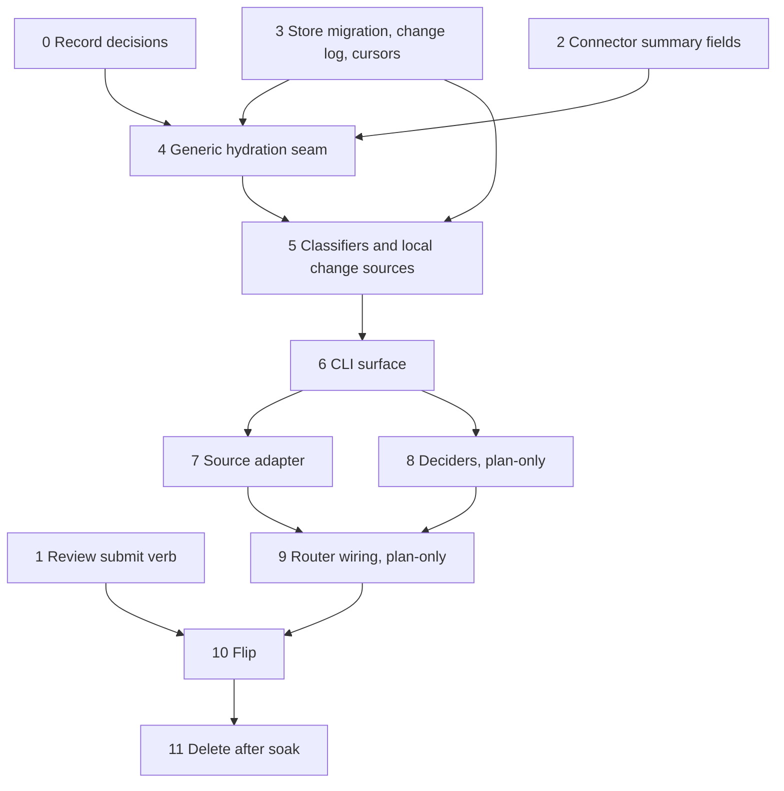

# Entity Change Flow Implementation Plan

> **For agentic workers:** REQUIRED SUB-SKILL: Use superpowers:subagent-driven-development (recommended) or superpowers:executing-plans to implement this plan task-by-task. Steps use checkbox (`- [ ]`) syntax for tracking.

**Goal:** Replace today's push-based, ledger-driven pg-desk `sync`/`run` flow with a pull-through
change flow: pg-connector detects changes, pg-desk hydrates snapshots and logs semantic changes,
pg-router routes events, and idempotent deciders (outside pg-desk) decide what work exists.

**Architecture:** Phased migration in the order the design's Migration section fixes. Old `sync`
keeps running until one atomic flip; deciders run in plan-only mode alongside it until parity is
proven; deletion waits for a soak period. Each phase below is independently landable and testable,
and is the unit `epic-decompose`/`plan-decompose` will split into work packets.

**Tech Stack:** Go (pg-desk, pg-connector, new decider binary, source adapter), SQLite (pg-desk
store), Nix (`nix build .#pg-desk`, `checks.<system>.pg-connector-go-tests`), pg-router config.

**Spec:** `docs/superpowers/specs/2026-09-29-entity-change-flow-design.md`. The generic gather/interpret
core that Phase 4 implements is specified in
`docs/superpowers/specs/2026-09-23-pg-desk-generic-entity-pipeline-design.md` (`pg2-2j5ac.46`).

**Scope note:** the spec spans several subsystems (connector, store, CLI, adapter, deciders,
routing), so this is a program plan: each phase fixes its files, interfaces, gate and rollback, and
leaves the red/green step-by-step detail to that phase's own decomposition. Where a phase says
"decomposition decides", the choice is deliberately not made here.

## Global Constraints

- pg-desk MUST NOT decide what work should exist; only deciders do (G5). pg-router's core MUST stay
  generic and name no concrete tool or entity rule (G4, ADR 0065).
- Deciders MUST be idempotent: re-running on an unchanged view writes nothing (G6).
- The flow MUST NOT depend on pg-pr (G8).
- Decorations MUST be deterministic, cheap and LLM-free (Phase 5 adds a test that no classifier or
  interpreter package imports an LLM or network client).
- Breaking contract changes ship as one coordinated cutover with no dual-version serving (S11);
  additive changes only otherwise.
- There MUST be no deployed state in which both `sync` apply and decider apply are enabled. Phase 8
  makes this checkable in this repo with a runtime interlock (decider `apply` refuses while pg-desk
  `sync.mode` is not `off`) instead of relying only on deployment config.
- Until the flip lands, old `sync`, `run`, `ledger`, `interpretation.sync_error`, the old `annotation`
  columns, `heartbeat` and the un-namespaced `feedback` verb MUST keep working. Destructive changes
  wait for Phase 11.
- pg-router binds match by exact string equality; no `pr.*` wildcard (S22).
- This repo is public: no employer-specific names in code, tests or docs; fixtures are synthetic and
  MUST pass `TestIdentifierAllowlistGuard` (`packages/pg-desk/cmd/pg-desk/identifier_allowlist_test.go`).
- Every new or changed pg-router query/role pair MUST be live-exercised (`pg-router run-query` /
  `run-role`, non-trivial outcome) as part of its own change.
- Fixtures live under their package's `testdata/`. Go tests run as whole-module builds
  (`packages/pg-desk/default.nix` sets no `subPackages`).
- Long commands (`nix build`, `nix flake check`, `go test ./...`) MUST run with an explicit timeout
  or in the background.

## Review Focus

Failure modes the spec implies that no phase's happy-path tests would catch. Each has a test in the
phase named in brackets.

1. **Crash between response flush and cursor advance** must cost a duplicate, never a loss.
   [Phase 3]
2. **`refresh` racing a `changes` hydration** must never regress an entity's `version`. [Phase 3]
3. **A failing or degraded backend** must never produce a `removed`/`closed` record; the entity stays
   active and `changes` exits 2. [Phase 5]
4. **A hidden entity** yields zero actions from every decider rule, and `land.ready` never creates a
   work item, only an annotation. [Phase 8]
5. **An entity that drops out of every watched query** becomes removed/inactive in `changes`, while
   the same absence in a targeted `refresh <id>` fails loudly. [Phases 5, 6]

---

## File Structure

| Path (under `packages/`)                                                 | Responsibility                                                                                                 | Phases  |
| ------------------------------------------------------------------------ | -------------------------------------------------------------------------------------------------------------- | ------- |
| `pg-connector/pkg/schema`, `pg-connector/cmd/pg-connector-pr-github`     | `schema.PR` summary fields incl. `node_id`; review submit write                                                | 1, 2    |
| `pg-connector/cmd/pg-connector-issue-beads`                              | `schema.Issue.Owner` (`pg2-t9zzg`)                                                                             | 2       |
| `pg-desk/internal/store`                                                 | additive migration, `entity` version/`hydrated_at`/`active`, `change_log`, cursors, `annotation_v2` dual-write | 3       |
| `pg-desk/internal/gather`, `internal/interpret`, `internal/pipeline`     | generic seam, PR/issue/thread hydration strategies, classifiers                                                | 4, 5    |
| `pg-desk/cmd/pg-desk`                                                    | `changes`, `refresh`, `history`, `show`, `open`, annotation verbs                                              | 6       |
| `pg-router-source-pg-connector` (mode) or a new adapter binary           | envelope to pg-router items (decomposition decides which)                                                      | 7       |
| `pg-decider` (new package)                                               | decider binary: rule registry keyed by `<type>`, `plan`, `apply`, audit                                        | 8       |
| `pg-router/internal/config` (this repo)                                  | loader checks: wildcard rejection, orphan producer/consumer                                                    | 9a      |
| `pg-router` deployment config (in the deployment repo, out of this repo) | sources, decider roles, prompt edits, `watch:` queries                                                         | 9b, 10  |
| `docs/adr/`, `docs/behavior/pg-desk/`                                    | decisions; behavior docs (`store-schema.md` with Phase 3, the rest with Phase 6)                               | 0, 3, 6 |

## Phase graph

Phases 1 and 2 have no upstream dependencies and can start immediately, in parallel with Phase 0.

---

### Phase 0: Record decisions (size S)

**Files:**

- Create: `docs/adr/00NN-entity-change-flow.md` (next free number per `docs/adr/index.md`; update the index)
- Modify: `docs/superpowers/specs/2026-09-09-pg-desk-and-connector-discovery-design.md` (D8, and the sync part of D9; D7 and D10 unchanged)

**Interfaces:**

- Produces: the ADR that Phase 3 onward cites instead of the spec's decision log.

- [ ] **Step 1:** Write the ADR from the spec's Decision log (S1-S24), one Context/Decision/Consequences entry per cluster (ownership split, pull-through, log and cursors, deciders, cutover). Cite `phillipgreenii-nix-agent-support` ADRs by repo, per the repo's citation conventions.
- [ ] **Step 2:** Amend D8 and the sync part of D9 in the 2026-09-09 design, pointing at the new ADR.
- [ ] **Step 3:** The `pg2-2j5ac.46` doc carries the S23 amendment but lives on branch `worktree-pg2-2j5ac.46-issue-entity-design`, not in this branch. Land it (via `integrate-branch`, after operator approval) before Phase 4, so Phase 4's cited spec exists in the tree.
- [ ] **Step 4:** Run `nix fmt -- <files>` then `prek run --files <files>`; expected: all hooks pass. Commit.

**Gate:** ADR merged; `bd show pg2-2j5ac.48` reports `closed`; the `.46` doc is on the primary branch.

### Phase 1: pg-connector review submit verb (size M)

**Files:**

- Modify: `pg-connector/cmd/pg-connector` (new verb `pr review submit <id>`), `pg-connector/cmd/pg-connector-pr-github`
- Test: per-backend fake-host tests

**Interfaces:**

- Produces: `pg-connector pr review submit <id>` with the contract in the spec's section 9.1.

- [ ] **Step 1:** Write failing fake-host tests: `TestReviewSubmitPendingOnly`, `TestReviewSubmitHeadMovedIsInvalidArgument` (HTTP 422 maps to exit `invalid_argument`), `TestReviewSubmitBotMarkerPresent`, `TestReviewSubmitSupersedeDeletesPriorPending`, `TestReviewSubmitSupersedeFailureExits2`.
- [ ] **Step 2:** Run `go test ./... -run ReviewSubmit` from `packages/pg-connector` (background or explicit timeout); expected: FAIL.
- [ ] **Step 3:** Implement the verb behind the connector's existing `Dispatch` shape, GitHub backend only. Decomposition decides the file split.
- [ ] **Step 4:** Re-run; expected: PASS. Run `checks.<system>.pg-connector-go-tests`.
- [ ] **Step 5:** Commit. The review prompt edit (`pg-pr review submit` to `pg-connector pr review submit`) is a separate change in the deployment repo and is live-exercised there.

**Gate:** verb live-exercised against a sandbox repo, producing a pending review only.

### Phase 2: Connector summary fields (size S-M)

**Files:**

- Modify: `pg-connector/pkg/schema` (`PR`: add `updated_at`, `review_decision`, `comment_count`, `review_count`, `node_id`; `Issue`: add `Owner`), `pg-connector/cmd/pg-connector-pr-github`, `pg-connector/cmd/pg-connector-issue-beads`

**Interfaces:**

- Produces: `schema.PR.NodeID string` and `schema.Issue.Owner string` (empty when a backend cannot provide them cheaply; never fabricated).

- [ ] **Step 1:** Write failing tests `TestPRSummaryIncludesNodeID`, `TestPRChangesReportsChangedWhenOnlyCommentCountMoves`, `TestIssueOwnerMappedFromBeadsOwnerKey`.
- [ ] **Step 2:** Run; expected FAIL. Implement (additive fields only). Re-run; expected PASS.
- [ ] **Step 3:** Confirm the `pg2-t9zzg` bead is closed by this phase, since it is the hard prerequisite for `.46`'s D-G4.
- [ ] **Step 4:** Run `checks.<system>.pg-connector-go-tests`. Commit.

**Gate:** existing consumer tests are unchanged and green.

### Phase 3: Store migration (additive), change log, cursors (size L)

**Files:**

- Modify: `pg-desk/internal/store/migrations.go`, `entity.go`, `annotation.go`
- Create: `pg-desk/internal/store/changelog.go`, `cursor.go`
- Test: `pg-desk/internal/store/*_test.go` against a REAL SQLite file
- Create/Modify: `docs/behavior/pg-desk/store-schema.md` in the SAME change

**Interfaces:**

- Produces: the ADDITIVE stage of the spec's section 9.11 only: `entity` columns `version`, `hydrated_at`, `active`; `change_log` appended in the same transaction as the version bump; `consumer` cursors; `annotation_v2` populated from the old `annotation` and dual-written (old columns and v2) by the store layer while `sync` is live. `sync_error`, the old `annotation` and `ledger` are NOT touched; those are Phase 11.

- [ ] **Step 1:** Write failing tests: `TestMigrationAddsEntityColumns`, `TestAnnotationReservedKeyMigration`, `TestAnnotationDualWriteKeepsOldColumns`, `TestAnnotationChangedAppendedInSameTransaction`, `TestLogAppendAndVersionBumpAreAtomic`, `TestCursorAdvancesOnlyAfterFlush`, `TestCrashBetweenFlushAndAdvanceYieldsDuplicateNotLoss`, `TestPruneWaitsForSlowestConsumer`, `TestConcurrentChangesSameConsumerSerialize`, `TestRefreshRacingHydrationNeverRegressesVersion` (goroutine race test on a real file, generalizing `lock_test.go`'s contention shape). The flush-then-advance test uses a fault-injecting `database/sql` driver to fail mid-sequence.
- [ ] **Step 2:** Run `go test ./internal/store/...`; expected FAIL.
- [ ] **Step 3:** Implement the migration and store API. Optimistic concurrency uses a `version` compare-and-set; a lost race retries and is counted for the observability metric.
- [ ] **Step 4:** Re-run with `-race`; expected PASS.
- [ ] **Step 5:** Run `nix build .#pg-desk` (background, explicit timeout) to run the whole-module checkPhase. Commit.

**Gate:** the migration applies to a checked-in synthetic pre-migration database (built by running the OLD migrations), and the existing `sync`/`run`/`hide`/`unhide`/`wip`/`feedback` test suites pass unchanged against the migrated schema (`TestOldSyncSuiteRunsAgainstMigratedSchema`).

Decomposition units: (a) schema migration plus annotation dual-write; (b) log, cursor, pruning and concurrency semantics.

### Phase 4: Generic hydration seam (size L)

**Files:**

- Create: `pg-desk/internal/gather/entity.go`, `internal/interpret/entity.go`, `internal/pipeline/entity.go`
- Modify: `internal/config` (`SelfIssueOwner`)

**Interfaces:**

- Consumes: Phase 3 store API; Phase 2 `schema.PR.NodeID`, `schema.Issue.Owner`.
- Produces: `EntityGatherer`, `GatherResult`, `EntityInterpreter`, `Pipeline.RunGenericEntity(ctx, entityType, entityID string, change gather.ChangeKind) error`, exactly as specified in the `.46` doc. Also adds thread hydration (`thread show`) as a third implementation and issue `deps` reads when configured.

- [ ] **Step 1:** Write failing tests from the `.46` doc's Testing section (registry dispatch incl. "no adapter registered", issue not-found path and the D-G8 gate, `InterpretIssue` mapping and both early returns) plus `TestThreadGatherAdapterHydratesMessages` and `TestPRHydrationKeepsXrefScan` (the cross-reference scan is kept unchanged).
- [ ] **Step 2:** Run; expected FAIL. Implement the seam; PR functions are registered behind adapters without internal change.
- [ ] **Step 3:** A failed detail read for one entity MUST leave its previous snapshot in place and log nothing (`TestFailedDetailReadKeepsPreviousSnapshot`).
- [ ] **Step 4:** Re-run; expected PASS. `nix build .#pg-desk`. Commit.

**Gate:** `TestPRPathParityFixtures` shows PR-path output byte-identical for every existing fixture, since `gather.Gather` and `interpret.Interpret` are unchanged.

### Phase 5: Classifiers and local change sources (size L)

**Files:**

- Create: `pg-desk/internal/classify/` (per-type classifier registry; package name decomposition may adjust)
- Modify: `internal/pipeline` so the NEW flows (`changes`, `refresh`) call the classifier and append to the change log in one transaction. The old `run`/`sync` path MUST NOT append (nothing consumes those records, and pruning waits on the slowest consumer): `TestLegacyRunPathAppendsNoChangeLog`.

**Interfaces:**

- Consumes: Phase 3 change log, Phase 4 snapshots.
- Produces: `Classify(old, new Snapshot) []Record`, where `Record.Kind` is the spec's section 6.4 kind (`head_changed`, `ci_changed`, `reconcile`, ...). This is a different type from `gather.ChangeKind` (`added|changed|removed|sweep`), which is only a hydration hint; the names MUST NOT be shared; local sources `link_changed`, `work_changed`, `annotation_changed`.

- [ ] **Step 1:** Write failing table tests per kind plus invariant tests `TestClassifyIdenticalSnapshotsIsEmpty`, `TestFirstObservationYieldsOnlyReconcile`, `TestKindsArePureFunctionOfOldAndNew`, and `TestDegradedBackendNeverYieldsRemovedOrClosed`.
- [ ] **Step 2:** Run; expected FAIL. Implement. Re-run; expected PASS. `nix build .#pg-desk`. Commit.

**Gate:** classification runs for every watched entity whether or not any decider subscribes (issues and threads included). Decomposition unit per entity type (`pr`, `issue`, `thread`) plus the local change sources.

### Phase 6: pg-desk CLI surface (size L)

**Files:**

- Modify: `pg-desk/cmd/pg-desk` (`changes`, `refresh`, `history`, `show`, `open`, `consumer list|forget`, `annotate`, `suppress|unsuppress --kind`, `pr force-review`, annotation verbs, and `<type> feedback` added with the old `feedback` verb kept as an alias), `internal/config` (`watch:` from the spec's section 9.10), `internal/httpapi`, `internal/metrics`
- Keep: `heartbeat.go`, `heartbeat_item.go` and the `heartbeat` config; the router role that calls them is removed in Phase 9b, and the code in Phase 11
- Create/Modify: `docs/behavior/pg-desk/` (changes, refresh, consumer, open, show, feedback, serve; retire `run-issue.md` in Phase 11)

**Interfaces:**

- Produces: `pg-desk <type> changes --consumer NAME [--query Q] [--cached] [--reset] [--limit N]`, `refresh <id>`, `history`, `show <id> [--json] [--refresh]`, exit codes per the spec's section 9.12; the change envelope of section 9.3.

- [ ] **Step 1:** Write failing tests: envelope golden JSON per contract version, `TestChangesCachedDoesNotAdvanceCursor`, `TestChangesResetReplaysActiveEntities`, `TestChangesExit2OnPartialFailure`, `TestChangesTotalFailureLogsNothingAndKeepsCursor`, `TestHydrationBudgetHydratesChangedBeforeSweepDue`, `TestConsumerForgetStopsPruneWaiting`, `TestRefreshFailureKeepsSnapshotAndEntityStaysDue`, `TestRefreshNotFoundFailsLoudly` and `TestChangesDroppedEntityBecomesInactive`, plus the sweep tests (`TestSweepSelectsOldestFirstCapN`, `TestSweepExcludesInactive`).
- [ ] **Step 2:** Run; expected FAIL. Implement. Re-run; expected PASS.
- [ ] **Step 3:** Update `docs/behavior/pg-desk/` in the SAME change (repo rule: behavior docs are the source of truth).
- [ ] **Step 4:** Add the `/metrics`, `status` and `doctor` coverage listed in the spec's section 11: per-type records, hydration failures, due backlog, consumer lag, optimistic-concurrency retries; `doctor` flags an unresolvable watched query, a consumer stalled past 3x its period, the sweep sizing bound (`active_count/N x poll_interval <= D`), and with `--router-config` which decider roles are bound per type.
- [ ] **Step 4b:** Add the G5 guard, `TestNoDecisionLogicInPgDesk` (module-dependency check that no decision logic exists under `packages/pg-desk` outside test fixtures).
- [ ] **Step 5:** `nix build .#pg-desk`; commit. `run`, `sync` and `heartbeat` still work unchanged; deletion is Phase 11.

**Gate:** `pg-desk pr changes --consumer scratch` against a live backend returns a non-empty, correct envelope, live-exercised. Decomposition units: (a) `changes`, sweep and budget; (b) `refresh`, `history`, `show`, `open`; (c) annotation, `consumer` and `feedback` verbs; (d) config, httpapi, metrics, doctor; (e) behavior docs.

### Phase 7: Source adapter (size S-M)

**Files:**

- Modify or create: `pg-router-source-pg-connector` (a new mode) or a new adapter binary; decomposition decides.

**Interfaces:**

- Consumes: the Phase 6 envelope (9.3) only, not the rest of the CLI. Produces: pg-router items `{id, type "TYPE.KIND", title, metadata{entity_type, entity_id, kind, seq, version, origin, degraded_sources}}` per the spec's section 9.4; one item per `(record, kind)`. It MUST NOT add or drop records or decide anything.

- [ ] **Step 1:** Write failing tests: envelope-to-items golden test, `TestAdapterPropagatesPgDeskExitCodes`.
- [ ] **Step 2:** Run; expected FAIL. Implement. Re-run; expected PASS. Commit.
- [ ] **Step 3:** Live-exercise, including the negative control: run the unwrapped binary under `env -i PATH=/usr/bin:/bin` and confirm it fails with the backing-command error, so an exit 0 through the nix wrapper is not taken as proof.

**Gate:** live-exercised, with at least one real routed item carrying the correct `type` and `metadata`.

### Phase 8: Deciders, plan-only (size XL)

**Files:**

- Create: `pg-decider/` (new package, `default.nix`, `go.mod`), rule registry keyed by `<type>`, `plan`, `apply`, audit
- Modify: `flake.nix` (register package and its Go test check), workspace package lists as required

**Interfaces:**

- Consumes: the composite view (spec section 9.5) only, and Phase 6's `show`, `refresh` and annotation verbs. Keys on `node_id` from Phase 2 (transitively through Phases 4-6).
- Produces: `pg-decider plan|apply <type> <id> [--from-item -]`; the action schema of section 9.7; the work-item contract of 9.8; audit comment per applied action.

- [ ] **Step 1:** Write failing table tests per PR rule id (`all.reopened`, `feedback.digest-changed`, `fixci.failing-on-head`, `conflict.present`, `land.ready`, adoption), including precedence tests: `TestHiddenEntityYieldsZeroActions`, `TestSuppressKindSkipsOnlyThatKind`, `TestLandReadyNeverCreatesWorkItem`, `TestTeamPRGetsOnlyOperatorPendingReview` (S16).
- [ ] **Step 2:** Write golden `plan` output tests covering all five skip reasons (hidden, suppressed, person-dismissed, review-pending, not matched) and `TestApplyWritesExactlyOneAuditComment`.
- [ ] **Step 3:** Run; expected FAIL. Implement `plan` first (pure `decide` core, no writes), then `apply`. Re-run; expected PASS.
- [ ] **Step 3b:** Add the interlock: `pg-decider apply` reads pg-desk's `sync.mode` and refuses (exit non-zero, no writes) unless it is `off`; `apply` is off by default. Test: `TestApplyRefusedWhileSyncModeIsNotOff`.
- [ ] **Step 4:** Build the parity tool: runs `plan` for every tracked PR fixture and diffs against the old `sync` plan mode's output on the SAME synthetic fixtures. Documented parity exceptions (S13-S16, S19) MUST be listed in the tool's expected diff. (The live-store parity run is Phase 9b.)
- [ ] **Step 5:** Add `node_id` adoption backfill (rewrite an adopted bead's `dedup_key` from `<repo>#<n>` to `node_id` form) with its own test.
- [ ] **Step 6:** Move the work-item contract (9.8) into `pg-decider` and add `TestRolePromptKeysAreSubsetOfWorkItemContract`. Add the G8 guard `TestNoPackageImportsPgPr` (no package under `packages/pg-router`, `packages/pg-desk` or `packages/pg-decider` imports `packages/pg-pr`).
- [ ] **Step 7:** Register `pg-decider` and its `-go-tests` check in `flake.nix` following the `pg-router-source-pg-connector` precedent; `nix build .#pg-decider` (background, explicit timeout); commit.

**Gate:** fixture parity diff clean apart from the listed exceptions; interlock test green. Decomposition units: (a) skeleton, contract, `plan` core; (b) PR rules by group; (c) `apply` and audit; (d) parity tool; (e) `node_id` backfill; (f) guards and flake registration.

### Phase 9: pg-router wiring, plan-only (size M, two units)

**Files:** (9a, this repo) `pg-router/internal/config` loader checks; (9b, deployment repo) `pg-desk changes` sources per watched type, the `watch:` queries populated from today's router query names, decider roles with `apply` disabled, the forced prompt edits (`pg-desk feedback` to `pg-desk pr feedback`; `pg-pr review submit` to `pg-connector pr review submit`), and removal of the `desk-heartbeat` query and role.

**Interfaces:**

- Consumes: Phases 7 and 8. Produces: explicit `emits`/`binds` kinds (no wildcards).

- [ ] **Step 1:** Write failing `pg-router` config tests: `TestLoaderRejectsWildcardEmitsBinds`, `TestOrphanProducerErrors`, `TestOrphanConsumerErrors`, `TestWorkedExampleRoundTrips`.
- [ ] **Step 2:** Run; expected FAIL. Implement/adjust loader checks if missing (`config.go` already has the orphan checks; wildcard rejection is new). Re-run; expected PASS. This is unit 9a.
- [ ] **Step 3 (unit 9b):** Apply config; live-exercise per `pg-router run-query` / `run-role`, checking the RENDERED role JSON in the handler command dir, and confirm a non-trivial outcome (at least one real `plan` output with an action, or a correct skip).

- [ ] **Step 4:** Live parity run: `pg-decider plan` for every tracked PR against the live store, diffed against live `sync` output.

**Gate:** the live parity diff is clean apart from the listed exceptions on N consecutive polls (N named by the operator; not decided here); `TestNoConfigEnablesSyncApplyAndDeciderApply` (config level, deployment repo) is green; old `sync` remains authoritative.

### Phase 10: Flip (size M)

**Files:** one change in the deployment repo plus pg-desk config (`sync.mode`).

- [ ] **Step 1:** In ONE change: deciders `apply` on; pg-desk `sync.mode = "off"`; old pg-connector sources and `desk-*` ingest roles removed.
- [ ] **Step 2:** Re-run `TestNoConfigEnablesSyncApplyAndDeciderApply` against the flip's rendered config; the Phase 8 interlock already backs it at runtime.
- [ ] **Step 3:** Live-exercise: at least one applied action visible on a real work item with its audit comment.
- [ ] **Step 4:** Rollback is reverting that one change (deciders back to plan-only, `sync.mode = "apply"`, old sources and roles restored); adoption makes either side safe to resume. Rehearse the revert once before the flip lands.

**Gate (observable):** Phase 9b's live parity is clean, the revert was rehearsed once, the no-both-enabled test is green, and Phase 1's `pg-connector pr review submit` is live (so no role still needs pg-pr). Then the operator authorizes the flip; applying it is operator-only.

### Phase 11: Delete after soak (size M)

**Files:** delete `pg-desk/internal/sync`, `ledger.go`, `import_pg_pr_annotations.go`, `run.go`, `heartbeat.go`, `heartbeat_item.go` and the `heartbeat` config; apply the spec's section 9.11 DESTRUCTIVE stage (`DROP COLUMN sync_error`, swap in `annotation_v2`, `DROP TABLE ledger`) and stop the annotation dual-write; retire `docs/behavior/pg-desk/run-issue.md` and `sync.md`.

- [ ] **Step 1:** Confirm the flip has run cleanly for the agreed soak period (the operator names it; not decided here).
- [ ] **Step 2:** Delete and remove tests that only covered the deleted code; run `nix build .#pg-desk`, then `nix flake check` once before landing. Commit.

**Gate:** pre-cutover `ledger` history is not migrated (accepted loss, spec section 13).

---

## Self-Review

- **Spec coverage:** goals G1-G8 map to Phases 3-8; section 5 to Phases 1-2; section 6 to Phases 3-6; section 7 to Phase 8; section 8 and 9.9 to Phases 7, 9; section 11 to Phase 6; section 13 to Phases 6, 10, 11; section 14 is the phase order. `.27`'s focus decider is out of scope here and depends on Phase 8's registry.
- **Type consistency:** `RunGenericEntity`, `EntityGatherer`, `EntityInterpreter` match the `.46` doc; envelope and item shapes match spec sections 9.3 and 9.4.
- **Proportion:** the plan is a program-level index. Phase 8 is the largest and is flagged for splitting.
- **Spec change made alongside this plan:** the spec's section 9.11 was a single DDL block that dropped `ledger`, `sync_error` and the old `annotation` while old `sync` had to keep running. It is now split into an additive stage (Migration step 3) and a destructive stage (step 9), with an annotation dual-write between them. This needs your review.
- **Open items for the operator:** the live-parity poll count N (Phase 9b); the soak period (Phase 11); whether the adapter is a new mode or a new binary (Phase 7).
