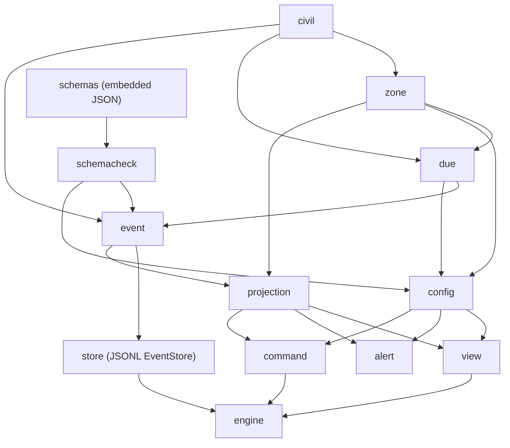

# pg-task-focus Core Library Implementation Plan (sub-project 1 of 5)

> **For agentic workers:** REQUIRED SUB-SKILL: Use superpowers:subagent-driven-development (recommended) or superpowers:executing-plans to implement this plan task-by-task. Steps use checkbox (`- [ ]`) syntax for tracking. The operator reviews this plan and chooses the execution method (see "Execution method options") before any code is written.

**Goal:** Build the `pg-task-focus` core library: the append-only JSONL event log, the projection and timer math derived from it, time and zone rules, config parsing and validation, and the validation-by-candidate-replay engine, with no HTTP, UI or CLI.

**Architecture:** Event Sourcing with a disposable Projection. A single `Engine` owns the write path: plan the events for a command, validate the whole candidate log by replay, append and fsync through the `EventStore` (Repository), adopt the validated candidate as the new projection, publish the new state version. Everything time-dependent takes an injected `Clock`; everything config-dependent takes a `Config` argument at read time and is never consulted during replay.

**Tech Stack:** Go (stdlib `encoding/json`, `time`, `time/tzdata`, `os`; `golang.org/x/sys/unix` for `flock`), a JSON Schema 2020-12 validator (see decision D2), gomod2nix packaging per this repository's conventions.

**Spec:** `docs/superpowers/specs/2026-10-07-pg-task-focus-design.md` (approved, landed on main at commit `39231ea7`, then amended by the operator's rulings 28 to 31 of 2026-10-08 in the same change as this plan revision). Epic bead `pg2-t7me1`; this plan is for child bead `pg2-t7me1.1`. Executors read both the spec and this plan. Under this repository's citation conventions, code and comments MUST NOT cite the spec file; state the rule in the code or cite the ADR from Task 1.

**Repository root:** `/Users/phillipg/phillipg_mbp/phillipgreenii-nix-agent-support`. All paths below are relative to the root of the worktree the executor works in. The Go module is `packages/pg-task-focus/`.

## Global Constraints

Copied from the spec; every task's requirements include this section.

- This repository is PUBLIC. No employer-specific content and no user identifiers other than the operator's own in code, tests, fixtures or docs. Fixtures use only generic text and the `example.test` host.
- Every stored instant is an RFC 3339 UTC timestamp with millisecond precision, for example `2026-10-07T13:30:00.000Z`.
- Every civil-date or wall-clock computation names an IANA zone; there is NO default zone. Abbreviations (`ET`, `EST`, `PST`) and bare offsets (`-05:00`) are rejected.
- A civil time that does not exist resolves to the first valid instant after the gap (`02:30` in a 02:00 to 03:00 gap resolves to `03:00` local). A civil time that occurs twice resolves to its earlier occurrence. Both rules are implemented and tested explicitly.
- The log is append-only. The only truncations are crash recovery (rule 7) and rollback of a failed append (rule 14), each back to the end of the last committed record.
- Replay MUST NOT consult the config. Task snapshots live in `task.materialized` and `cycle.started`.
- The event `v` is `1`. An unknown `v` refuses to start. `max_future_skew_seconds` defaults to `60`. Every minutes or interval value (`planned_minutes`, a boost, a `minutes` override, `cycle_minutes`, `repeat_minutes`) is an integer from 1 to 525600, which keeps duration arithmetic far from overflow. `event.MaxEventBytes` is 262144; a longer event is rejected before it is written, and a longer line found in a log is corruption.
- Operator rulings, honored exactly. (1) The overtime sound has NO acknowledge, mute, snooze or repeat cap; a short `sound` at expiry, then a short `reminder_sound` every `repeat_minutes` until the cycle is stopped. (2) Reminders count the cycle's RUNNING time (ruling of 2026-10-08): a paused cycle plays nothing and notifies nothing, and resuming continues the count where it stopped, so a cycle resumed half-way through an interval reminds when that interval completes; the expiry sound is never replayed by a pause and resume. (3) No carry-over: a task still open at rollover is `missed` or `skipped`, never carried into the next period. (4) Interrupted cycles stay visible: the running cycle is the focus, every paused cycle that is not stopped is dimmed beside it with a Switch action that swaps the focus (one batch of events), and a dimmed cycle can be stopped without switching to it. (5) A final line of the log that ends in a newline but does not parse is a torn tail, recovered like any other, not refused. (6) Backdating a period change has NO lower bound: the operator may backdate a rollover as far as needed to fix the date; only the future-skew rule and the timeline (candidate replay) apply. (7) Zone data comes from the standard library (`time/tzdata`); no zone database is committed to the repository. (8) The recovery sidecar is named `events.jsonl.recovered-<UTC yyyymmddThhmmssZ>-<n>`. (9) Commits use the conventional form `feat(pg-task-focus): ...`.
- Error `reason` codes are the closed set in the spec's "Daemon and HTTP API" table, and nothing else.
- Long commands (`nix build`, `go test ./...` over the whole module) MUST run with an explicit `timeout` (at most 600000 ms) or in the background. Nix runs go through `pg-nix-log-wrapped`.

## Review Focus

Inputs and conditions the spec implies that no happy-path test would exercise. Each has a pinning test in the task named in brackets.

1. **A backdated or corrected `effective_at` that changes entity order.** A correction that moves a `cycle.stopped` before a `cycle.resumed`, or backdates a start under a running cycle, must be `invalid_timeline`, and the result of a full replay (never an incremental append) is what decides. [Task 12, Task 13]
2. **Civil dates that do not exist or half-shift.** A whole civil date skipped by a zone (`Pacific/Apia`, 2011-12-30), a half-hour gap (`Australia/Lord_Howe`), and `00:00` in a zone whose transition falls at midnight. [Task 3]
3. **A crash at every point of the write path.** A line with no newline, an uncommitted batch at the tail, an interleaved or uncommitted batch mid-file (corruption), a crash after the sidecar copy but before the truncate, and a note or key/value value longer than `bufio`'s default 64 KiB token. [Task 8, Task 9]
4. **Retraction chains.** Retract a correction, retract a retraction (undo of undo), retract a batch whose task a later event completed (`batch_has_dependents`, with the dependents named), and the late completion of a `missed` task which is NOT a dependent. [Task 18]
5. **An idempotent retry after an unknown outcome.** The same `id` and payload after a `503`, after a restart (the index is rebuilt from `req_hash`), for a batch (the id is the batch id), and with `effective_at` omitted (a retry later must hash the same); a different payload under the same id is `id_conflict`. [Task 5, Task 19]
6. **Huge, invalid-UTF-8 or blank free text.** A 300 KiB note or reason and a reason holding the byte `0xff` are `invalid_request` before anything is built (`json.Marshal` would otherwise rewrite the byte to U+FFFD and store text the operator never wrote); a whitespace-only skip reason is `invalid_request`; a 100 KiB line already in a log still replays. [Task 5, Task 8, Task 16]
7. **A clock stepped backwards.** With no `effective_at`, a command whose clock reading is earlier than the entity's newest event is `invalid_timeline` with a detail naming both instants; it never corrupts the log and never panics. [Task 16]
8. **A config edited while history exists.** After a reload that removes a task definition, a cycle type or a non-active profile, replay, `view` and `alert` keep working from the snapshots in the log, a profile change withdraws the open tasks whose definition vanished, and a removed cycle type falls back to `defaults.alert`. [Task 14, Task 15, Task 17]
9. **The same request twice, concurrently.** Two goroutines sending one request `id` produce one set of events and the second receives the first's result; two goroutines completing one task under different ids produce one success and one `task_already_resolved`. [Task 19]
10. **Switching focus back and forth.** A to B and B to A at the same instant would leave a zero-length segment and is `invalid_timeline`; at later instants the segments alternate and the elapsed totals stay exact; stopping a dimmed cycle leaves the focus untouched; undoing a switch batch restores both cycles. [Task 12, Task 16, Task 18]

---

## Package layout and dependency order



All packages live under `packages/pg-task-focus/internal/` except `schemas` (data plus an embed shim, `packages/pg-task-focus/schemas/`, the directory the spec names). `internal/` is deliberate: the connector backend (sub-project 4) talks to the daemon's HTTP API and MUST NOT import Go packages. Sub-projects 2 and 3 live in the same module and import the packages below directly.

File map (create unless noted):

| Path under `packages/pg-task-focus/`                    | Responsibility                                                                                        |
| ------------------------------------------------------- | ----------------------------------------------------------------------------------------------------- |
| `go.mod`, `go.sum`, `gomod2nix.toml`, `update-deps.sh`  | module and dependency wiring                                                                          |
| `internal/clock/`                                       | `Clock`, `Real`, `Fake`                                                                               |
| `internal/civil/`                                       | `Date`, `Clock` (time of day), weekday and `HH:MM` parsing                                            |
| `internal/zone/`                                        | IANA validation (standard library `time/tzdata`), gap and overlap resolution, host zone discovery     |
| `internal/due/`                                         | due rule type and its resolution against a period                                                     |
| `internal/event/`                                       | envelope, `Instant`, ULID, payload types, canonical encode and decode, `ReqHash`                      |
| `schemas/`                                              | `event.schema.json`, `config.schema.json`, `embed.go`                                                 |
| `internal/schemacheck/`                                 | validator wrapper, `x-free-text` inventory                                                            |
| `internal/config/`                                      | config parse, semantic validation, resolution helpers, reload checks                                  |
| `internal/store/`                                       | JSONL `EventStore`: scan, crash recovery, lock, append with rollback, read-only mode, offline `Check` |
| `internal/projection/`                                  | candidate replay, correction and retraction overlay, tasks, periods, profile, cycles, timer math      |
| `internal/view/`                                        | read-time state: `next`, banners, resume offer, ordering, `not_in_profile`                            |
| `internal/alert/`                                       | overtime alert scheduler                                                                              |
| `internal/command/`                                     | command types, planning into events, dry-run previews, typed rejections                               |
| `internal/engine/`                                      | write path, idempotency index, state version, observer, reload, offline verify                        |
| `internal/testgen/`                                     | seeded generators for property tests, fixture helpers                                                 |
| `testdata/logs/`, `testdata/config/`                    | synthetic golden JSONL logs and configs                                                               |
| `docs/behavior/pg-task-focus/` (repo root)              | behavior docs (Task 1)                                                                                |
| `docs/adr/0088-...` and `docs/adr/index.md` (repo root) | the ADR (Task 1); re-read the index tail first, the number is not a remembered value                  |
| `flake.nix` (modify, repo root)                         | `pg-task-focus-go-tests` check, `pg-task-focus-golangci` lint registration                            |

## Binding API contract for sub-projects 2 to 5

Treat the declarations below as a contract. A later sub-project MUST consume exactly this surface; changing a name, signature or semantic here requires amending this plan and re-reviewing consumers. Field-level wire formats are defined by the JSON Schemas in `schemas/`.

```go
// package clock
type Clock interface{ Now() time.Time }
func Real() Clock
type Fake struct{ /* settable, advanceable */ }
func NewFake(t time.Time) *Fake
func (f *Fake) Set(t time.Time)
func (f *Fake) Advance(d time.Duration)
func (f *Fake) Now() time.Time

// package civil
type Date struct{ Year int; Month time.Month; Day int }       // JSON: "2026-10-07"
type TimeOfDay struct{ Hour, Minute int }                     // JSON: "09:30"
func ParseDate(s string) (Date, error)
func ParseTimeOfDay(s string) (TimeOfDay, error)
func ParseWeekday(s string) (time.Weekday, error)             // "mon".."sun"
func (d Date) String() string
func (d Date) AddDays(n int) Date
func (d Date) DaysUntil(o Date) int
func (d Date) Weekday() time.Weekday
func (d Date) Compare(o Date) int

// package zone
type Zone struct{ /* name + *time.Location */ }
func Load(name string) (Zone, error)                          // *Error{Reason: "invalid_zone"}
func (z Zone) Name() string
func (z Zone) Location() *time.Location
func ResolveCivil(z Zone, d civil.Date, t civil.TimeOfDay) time.Time // UTC, gap and overlap rules
func Today(z Zone, now time.Time) civil.Date
func Host(getenv func(string) string, readlink func(string) (string, error)) (Zone, error)

// package due
type Cadence string                                           // consts Daily, Weekly, Sprint = "daily", "weekly", "sprint"
type Rule struct {                                            // JSON: {"at","tz","weekday"?,"day"?}
    At civil.TimeOfDay; TZ zone.Zone; Weekday *time.Weekday; Day *int }
type Resolution struct{ Instant time.Time; Date civil.Date }
type NoMatch struct{ Reason string }                          // implements error
func Resolve(c Cadence, r Rule, start, end civil.Date) (Resolution, error) // end == start for daily

// package event
const SchemaVersion = 1
type ID string                                                // ULID, 26 chars Crockford base32
func NewID(t time.Time, entropy io.Reader) ID
func ParseID(s string) (ID, error)
type Instant time.Time                                        // JSON: fixed "2006-01-02T15:04:05.000Z"
func At(t time.Time) Instant                                  // UTC, truncated to ms
func (i Instant) Time() time.Time
type Type string                                              // the 17 types in the spec's event table
type Envelope struct {
    V int; ID ID; At, EffectiveAt Instant; ReqHash string; Type Type; Data json.RawMessage }
type Event struct{ Envelope; Payload Payload; Line int }      // Line: 1-based log position, 0 if unappended
type Payload interface{ EventType() Type }
func Decode(line []byte) (Event, error)                       // strict; schema-checked
func Encode(e Event) ([]byte, error)                          // one line, no trailing newline
func ReqHash(command string, clientFields any) (string, error)
type UnknownVersionError struct{ V int }                      // returned by Decode when v != 1
func Types() []Type                                           // the 17 event types
// payload structs: PeriodChanged, ProfileChanged, TaskMaterialized, TaskCompleted, TaskSkipped,
// TaskMissed, TaskWithdrawn, TaskReinstated, CycleStarted, CyclePaused, CycleResumed,
// CycleBoosted, CycleStopped, CycleAnnotated, EventCorrected, EventRetracted, BatchCommitted
// (field names = the spec's data fields, Go-cased). TaskID and CycleID are string types.
func NewTaskID(c due.Cadence, periodStart civil.Date, definition string) TaskID

// package config
type Config struct{ /* parsed, validated, immutable */ }
func Parse(raw []byte) (*Config, error)                       // *ValidationError lists every problem
func (c *Config) Digest() string
func (c *Config) Defaults() Defaults
func (c *Config) Profile(name string) (Profile, bool)         // task and cycle ids by cadence
func (c *Config) Task(id string) (TaskDef, bool)
func (c *Config) CycleType(id string) (CycleDef, bool)
func (c *Config) CycleMinutes(typ string, override *int) int  // override, type, then defaults
func (c *Config) Alert(typ string) Alert                      // Sound, ReminderSound, RepeatMinutes
func (c *Config) GroupRank(group string) int                  // unlisted groups sort last
func (c *Config) ListenPort() int
func (c *Config) PublicURL() string
func CheckReload(prev, next *Config, activeProfile string) error
func RestartRequired(prev, next *Config) []string             // "listen_port", "public_url"

// package store
type Recovery struct{ TornTail bool; UncommittedBatches int; TruncatedBytes int64; Sidecar string }
func DefaultDir(getenv func(string) string) string            // ${XDG_DATA_HOME:-$HOME/.local/share}/pg-task-focus
func Open(opts Options) (*Store, []event.Event, Recovery, error) // lock, scan, recover
func Check(path string) (CheckReport, error)                  // read-only, no lock
func (s *Store) Append(evs []event.Event) (AppendStats, error)
func (s *Store) Writable() bool
func (s *Store) Probe() error                                 // the store_writable probe
func (s *Store) Size() int64
func (s *Store) Close() error
var ErrLocked, ErrStoreUnavailable error
type CorruptError struct{ Line int; Cause error }
type UnknownVersionError struct{ Line, V int }                // wraps event.UnknownVersionError{V}; Unwrap returns it

// package projection
func Replay(events []event.Event) (*Model, error)             // full replay; *Invalid on impossible timeline
func Candidate(base, add []event.Event) (*Model, error)       // validation by candidate replay; assigns Line = len(base)+i+1 to the added events
func (m *Model) Log() []event.Event
type Invalid struct{ Detail string; Events []event.ID }       // reason is always invalid_timeline
func (m *Model) Lines() int
func (m *Model) Profile() string                              // "" when uninitialized
func (m *Model) Period(k Kind) (Period, bool)                 // current period of a kind
func (m *Model) Task(id event.TaskID) (Task, bool)
func (m *Model) Tasks() []Task
func (m *Model) Cycle(id event.CycleID) (Cycle, bool)
func (m *Model) Cycles() []Cycle
func (m *Model) Dimmed() []Cycle                              // paused and not stopped, most recently paused first
func (m *Model) Domain() Domain                               // the state by value, without log positions or history, for equality in tests
func (m *Model) Running() (Cycle, bool)
func (m *Model) RunningAt(t time.Time) (Cycle, bool)          // the cycle running at an instant
func (m *Model) Events(q EventQuery) []EventView              // corrected and original views
func (m *Model) Event(id event.ID) (EventView, bool)
func (m *Model) BatchEvents(b event.ID) []event.ID
func (m *Model) Dependents(batch event.ID) []event.ID         // later live events referencing an entity the batch CREATED (a switch or break creates none)
func (c Cycle) Elapsed(now time.Time) time.Duration
func (c Cycle) Remaining(now time.Time) time.Duration         // negative in overtime
func (c Cycle) Overtime(now time.Time) bool                   // running and Remaining < 0
func (c Cycle) TimeUp(now time.Time) bool                     // Remaining <= 0, running OR paused; the alert boundary (Overtime is running and < 0)
func (c Cycle) OvertimeSince(now time.Time) (time.Time, bool)
// Task{ID, Definition, Cadence, PeriodStart, Title, Group, Link, Due, DueRule, Status, ResolvedAt, Reason}
// Cycle{ID, Type, Title, PlannedMinutes, Boosts, Status, Segments []Segment, InterruptedBy, Note, KV}
// Segment{Start time.Time, End *time.Time, OpenedBy event.ID}   // End nil = open

// package view
type State struct{ /* header, tasks, next, running cycle (the focus), dimmed cycles, interrupt stack, resume offer */ }
func Build(m *projection.Model, cfg *config.Config, now time.Time) State
func RolloverBanner(k projection.Kind) string                 // "New day: roll over", "New week: roll over", "New sprint: roll over"

// package alert
type Kind string                                              // "expiry" | "reminder"
type Alert struct{ Kind Kind; CycleID event.CycleID; Sound string }
type Scheduler struct{ /* per-process memory, never logged */ }   // reminders count the cycle's running time
func NewScheduler() *Scheduler
func (s *Scheduler) Poll(m *projection.Model, cfg *config.Config, now time.Time) *Alert   // at most one; observes every non-stopped cycle and records what it plays; the daemon MUST call it after every commit and reload (OnCommit), before NextAt
func (s *Scheduler) NextAt(m *projection.Model, cfg *config.Config, now time.Time) (time.Time, bool)

// package command
type Reason string                                            // the spec's closed set
func (r Reason) Status() int                                  // 400, 404, 409, 422, 503 (a number, no net/http)
type Rejection struct{ Reason Reason; Detail string; Dependents []event.ID }  // implements error
type Command interface{ Name() string; ClientID() event.ID }
type Plan struct{ Events []event.Event; BatchID event.ID; Preview *Preview; Candidate *projection.Model }
type Version struct{ LogLines int; ConfigGeneration int64 }   // engine.Version is an alias of this
type Env struct{ Model *projection.Model; Config *config.Config; Now time.Time; Version Version; NewID func() event.ID }
func Build(env Env, c Command) (Plan, error)                  // pure (no IO, no mutation); runs projection.Candidate and maps *Invalid to Rejection{invalid_timeline}
// Commands: ChangePeriods, ChangeProfile, CompleteTask, SkipTask, StartCycle, PauseCycle,
// ResumeCycle, BoostCycle, StopCycle, SwitchCycle, AnnotateCycle, BackfillBreak, Correct, Retract.

// package engine
type Version = command.Version
type Options struct{ Dir string; Config *config.Config; ConfigGeneration int64; Clock clock.Clock;
    NewID func() event.ID; Observer Observer; FS store.FS }
func Open(opts Options) (*Engine, error)                      // replay, recover, ready
func (e *Engine) Do(ctx context.Context, c command.Command) (Result, error)   // dry-run commands return Result.Preview
func (e *Engine) Snapshot() Snapshot                          // consistent model, config, version
func (e *Engine) State(now time.Time) view.State
func (e *Engine) SetConfig(next *config.Config, generation int64) error        // CheckReload, then swap
func (e *Engine) Version() Version
func (e *Engine) OnCommit(f func(Version))                    // invoked after each successful commit and reload
func (e *Engine) Close() error
func Verify(path string) (VerifyReport, error)                // offline: store.Check plus replay
type Result struct{ EventIDs []event.ID; BatchID event.ID; Replayed bool; Version Version; Preview *command.Preview }
type Observer interface{ Replayed(n int, d time.Duration); Recovered(store.Recovery);
    Appended(t event.Type, s store.AppendStats); AppendFailed(stage string);
    Rejected(r command.Reason); Corrected(kind string) }
```

---

## Conventions for every task

- Work in the worktree; build and test with `go -C packages/pg-task-focus test ./internal/<pkg>/... -race -count=1` (the module has no network needs at test time).
- Test names describe the subject, never a bead id. Fixtures live under `testdata/` and are synthetic.
- Commit procedure at the end of each task: `git add <files>`; `pg-hooks fix`; `pg-hooks run pre-commit <files>`; `git commit` with the message given in the task (conventional form, `feat(pg-task-focus): ...`) and the repository's attribution trailer. Never `--no-verify`. New files MUST be `git add`ed before any hook run (hooks skip untracked files).
- A task is done only when its listed tests pass and `go -C packages/pg-task-focus vet ./...` is clean.
- Dependency changes (Tasks 6 and 9) re-run `packages/pg-task-focus/update-deps.sh` in the background (`bgrun`, it runs nix internally and needs network); commit `go.mod`, `go.sum` and `gomod2nix.toml` together.

---

### Task 1: Behavior docs and ADR (docs first)

**Files:**

- Create: `docs/behavior/pg-task-focus/README.md`, `event-log.md`, `corrections.md`, `time-and-zones.md`, `configuration.md`, `periods-and-rollover.md`, `cycles-and-timer.md`
- Create: `docs/adr/0088-pg-task-focus-event-log-and-projection.md` (use the next free number after reading `docs/adr/index.md`)
- Modify: `docs/adr/index.md` (one row)

**Interfaces:**

- Consumes: the spec's sections "Time and zones", "Event log", "Configuration", "Periods, profiles and rollover", "Work cycles and the timer", "Expiry sound and reminders".
- Produces: the product-level source of truth every later task implements against. Later sub-projects add their own docs (API, CLI, web UI) to the same directory.

- [ ] **Step 1: Read the templates.** Read `docs/behavior/pg-decider/README.md` and `docs/behavior/pg-decider/work-items.md` for structure (actors, stories, journeys, invariants in RFC 2119 language, intended behavior only, no code paths).
- [ ] **Step 2: Write the set.** One doc per area above. Each states actors, stories, journeys and numbered invariants. The invariants are the spec's rules restated at product level, including the operator rulings (no mute; reminders count running time; no carry-over; interrupted cycles stay visible with a Switch; a complete-but-unparsable final line is a torn tail; unrestricted backdating of a rollover) as explicit invariants with their provenance. `README.md` carries scope, the glossary subset this library owns, and a "Realization gaps" list naming what lands in sub-projects 2 to 5 (HTTP error mapping, sounds, UI strings, and rejecting invalid UTF-8 in the raw request body, because `json.Unmarshal` silently rewrites it).
- [ ] **Step 3: Write the ADR.** Context, decision, consequences for: event sourcing with correction events instead of edits; the projection is never persisted; the zone database is the standard library's embedded `time/tzdata`, and the host's zone files win when present (operator ruling 2026-10-08, D1); one `Engine` is the only writer; the loopback no-auth decision the spec asks the ADR to restate is left to sub-project 2's ADR amendment. Cite repositories by name per the citation conventions.
- [ ] **Step 4: Check.** Invoke the `behavior-docs-conformance:behavior-docs-intra-conformance` skill on `docs/behavior/pg-task-focus/` and fix every mechanical finding. Run `git add`, `pg-hooks fix`, `pg-hooks run pre-commit <the new files>`. Expected: all hooks pass.
- [ ] **Step 5: Commit** `feat(pg-task-focus): behavior docs and ADR for the core library`.

---

### Task 2: Module skeleton, nix wiring, clock

**Files:**

- Create: `packages/pg-task-focus/go.mod`, `update-deps.sh` (copy `packages/beads-exporter/update-deps.sh`, mode 0755), `internal/clock/clock.go`, `internal/clock/clock_test.go`, `internal/testgen/doc.go`
- Create (generated): `packages/pg-task-focus/gomod2nix.toml` (`go.sum` appears with the first dependency, Task 6; a module with none has no `go.sum`)
- Modify: `flake.nix` (three places, below)

**Interfaces:**

- Produces: `clock.Clock`, `clock.Real`, `clock.Fake` as in the contract. Module path `github.com/phillipgreenii/phillipgreenii-nix-agent-support/packages/pg-task-focus`; the `go` directive equals `packages/beads-exporter/go.mod`'s.

- [ ] **Step 1: Write the failing test** in `clock_test.go`: `TestFakeClockAdvanceAndSet` (Now returns the set instant, Advance(90s) moves it, Set moves it back), `TestRealClockIsUTCAgnostic` (Real().Now() is within one second of `time.Now()`).
- [ ] **Step 2: Run** `go -C packages/pg-task-focus test ./internal/clock/...`. Create `go.mod` first (the module line and the `go` directive only), so the failure is the missing symbol and not a missing module. Expected: FAIL, `undefined: Fake`.
- [ ] **Step 3: Implement** `clock.go`. Then generate `gomod2nix.toml` with `update-deps.sh` in the background and confirm `go-deps-wired` is satisfied (executable wrapper, toml present).
- [ ] **Step 4: Wire nix.** In `flake.nix`: (a) add `"pg-task-focus"` to `simpleGoLintModules`; (b) add the sentence "`pg-task-focus` added bead `pg2-t7me1.1`: no build-tagged test files, verified via `grep -rln '^//go:build' packages/pg-task-focus`" to the deliberate-exemption comment above `nonUnitGoBuildTags`; (c) add `pg-task-focus-go-tests` beside `pg-decider-go-tests` with `src = lib.cleanSource ./packages/pg-task-focus` and the module's `gomod2nixToml`. Do NOT add an overlay `packages.pg-task-focus` and no `default.nix`: the module has no `package main` until sub-project 2, and `mkGoApp` needs one. Version stamping (`main.Version` through `mkGoApp`, per `.claude/rules/package-versioning.md`) therefore lands in sub-project 2; this library exports only the constant `event.SchemaVersion`.
- [ ] **Step 5: Run** `go -C packages/pg-task-focus test ./... -count=1` (PASS), then `git add packages/pg-task-focus flake.nix` (a git flake does not see untracked files) and in the background `bgrun gt -- pg-nix-log-wrapped nix build .#checks.aarch64-darwin.pg-task-focus-go-tests .#checks.aarch64-darwin.pg-task-focus-golangci -L` with a 600000 ms ceiling, and read it with `bgcheck gt`. Expected: `DONE exit=0`.
- [ ] **Step 6: Commit** `feat(pg-task-focus): module skeleton, clock, nix checks`.

---

### Task 3: Civil dates and zones

**Files:**

- Create: `internal/civil/civil.go`, `internal/civil/civil_test.go`, `internal/zone/zone.go`, `internal/zone/resolve.go`, `internal/zone/host.go`, `internal/zone/zone_test.go`, `internal/zone/resolve_test.go`, `internal/zone/host_test.go`

**Interfaces:**

- Produces: `civil.*` and `zone.*` exactly as in the contract. `zone.Load` returns `*zone.Error{Reason: "invalid_zone"}`.
- Embedding (decision D1, ruled by the operator on 2026-10-08: use the standard library, commit no zone database): `zone.go` imports `_ "time/tzdata"` and loads names with `time.LoadLocation`. Go tries the host's zone files first and uses the embedded copy only when the host has none or its file is unreadable, so tests pin only 2026 transitions that are stable across tz database releases and never assert which source answered.

- [ ] **Step 1: Write failing civil tests (table-driven)**: `TestParseDate` (valid `2026-10-07`; rejects `2026-13-01`, `2026-02-30`, `2026-1-7`, empty, trailing space), `TestDateArithmetic` (AddDays across month, year and leap day; DaysUntil is the inverse; Weekday of `2026-10-07` is Wednesday), `TestParseTimeOfDay` (accepts `00:00`, `23:59`; rejects `24:00`, `9:30`, `09:60`, `09:30:00`), `TestParseWeekday` (`mon`..`sun` only, case-sensitive).
- [ ] **Step 2: Write failing zone tests.**
  - `TestLoadAcceptsIANA`: `America/New_York`, `Europe/London`, `Asia/Kolkata`, `UTC`.
  - `TestLoadRejectsAbbreviationsAndOffsets`: `ET`, `EST`, `PST`, `EST5EDT`, `-05:00`, `+0530`, `UTC-5`, `Local`, the empty string, ` America/New_York`, `america/new_york`, `America/new_york` and `AMERICA/NEW_YORK` all return `invalid_zone` (a case-insensitive host file system such as APFS accepts the odd-cased forms through `time.LoadLocation`, so the implementation checks the exact spelling).
  - `TestLoadIgnoresBrokenZONEINFO`: with `ZONEINFO` set to a nonexistent path, and to a directory holding a corrupted `America/New_York`, `Load` still returns correct data. This does NOT prove the embedded copy answered: on a host with zone files (every macOS machine) the host's files answer first. `ZONEINFO` is read once per process, so the test re-executes the test binary as a child (`exec.Command(os.Args[0], "-test.run=^TestHelperLoad$")` with the variable and a `PG_TASK_FOCUS_HELPER=1` guard in its environment, so the helper does nothing in a normal run) and asserts on the child's output.
  - `TestEmbeddedTZDataIsLinked`: the only test that pins ruling 7. It parses `zone.go` with `go/parser` and fails unless the file imports `time/tzdata`; removing the blank import must turn it red.
  - `TestResolveCivilGapAndOverlap` (table): `America/New_York` 2026-03-08 `02:30` resolves to `2026-03-08T07:00:00Z` (03:00 EDT); 2026-11-01 `01:30` resolves to the earlier occurrence, `2026-11-01T05:30:00Z`; both neighbouring transition days of a whole-hour zone; `Australia/Lord_Howe` 2026-10-04 `02:15` and `02:30` both resolve to `2026-10-03T15:30:00Z` (the half-hour gap ends at 02:30 local) and 2026-04-05 `01:45` resolves to the earlier occurrence, `2026-04-04T14:45:00Z`; `America/Santiago` 2026-09-06 `00:30` (a gap at midnight) resolves to `2026-09-06T04:00:00Z` (01:00 local); `Europe/London` 2026-03-29 `01:30` resolves to `2026-03-29T01:00:00Z` (02:00 BST); `Asia/Kolkata` 2026-10-07 `09:00` is `2026-10-07T03:30:00Z`; a non-transition day is the plain conversion. These values were checked against the toolchain's zone data on 2026-10-08.
  - `TestResolveCivilSkippedDate`: `Pacific/Apia` 2011-12-30 `09:00` resolves to the first valid instant after the skipped day (2011-12-31 00:00 local), `2011-12-30T10:00:00Z`.
  - `TestResolveCivilMidnightTransition`: a zone and year whose DST gap starts at `00:00` (find it in the test by scanning `ZoneBounds` over `America/Santiago`, `America/Havana` and `Asia/Beirut` for a transition at local midnight; assert at least one is found, else fail; then assert that `00:00` on that date resolves to the first valid instant, `01:00` local on the same civil date).
  - `TestResolveCivilProperty`: seeded generator over 12 zones and every day of 2026 and 2027 and times at 15-minute steps: the result is never earlier than the earliest candidate instant (the civil time read in the larger of the two offsets around the transition; in a gap the correct result is LATER than that, never earlier); when the civil time exists exactly once the result converted back reads the same civil fields; in an overlap it is the earlier of the two valid instants; in a gap it equals the transition instant.
  - `TestHostZone`: `TZ=America/New_York` wins; `TZ=` unset and `/etc/localtime -> /usr/share/zoneinfo/Europe/Paris` yields `Europe/Paris`; the macOS target `/var/db/timezone/zoneinfo/Asia/Tokyo` yields `Asia/Tokyo`; `TZ=EST` or `TZ=:` with a non-IANA link target fails with a message naming both inputs; a leading `:` in `TZ` is stripped (D12).
- [ ] **Step 3: Run** `go -C packages/pg-task-focus test ./internal/civil/... ./internal/zone/...`. Expected: FAIL (undefined).
- [ ] **Step 4: Implement** the signatures above. Hints that the tests do not determine: accept a name when it is exactly `UTC` or contains `/` and `time.LoadLocation` accepts it and its spelling is exact (D12): after `LoadLocation` succeeds, confirm each path segment against an `os.ReadDir` listing of the zone directory that holds the file (`$ZONEINFO`, then `/usr/share/zoneinfo`, `/usr/share/lib/zoneinfo`, `/usr/lib/locale/TZ`, `/etc/zoneinfo`); when no host directory holds it, the embedded copy decided and is already case-sensitive; `ResolveCivil` computes candidate instants from the offsets in effect 24 hours either side (`ZoneBounds`), keeps those whose local fields equal the request, returns the earliest when there are two, and in a gap returns the end of the zone interval that precedes it (`ZoneBounds` end). `Host` takes injected `getenv` and `readlink`, and returns the path after the last `zoneinfo/` segment.
- [ ] **Step 5: Run** the same command. Expected: PASS. Run `go -C packages/pg-task-focus vet ./internal/...`.
- [ ] **Step 6: Commit** `feat(pg-task-focus): civil dates and IANA zone resolution`.

---

### Task 4: Due rules

**Files:**

- Create: `internal/due/due.go`, `internal/due/due_test.go`

**Interfaces:**

- Consumes: `civil`, `zone`. Produces: `due.Cadence`, `due.Rule` (JSON: `{"at","tz","weekday"?,"day"?}`), `due.Resolution`, `due.NoMatch`, `due.Resolve`.

- [ ] **Step 1: Write failing tests (table-driven).**
  - `TestResolveDaily`: `at 09:00` in `America/New_York` on 2026-10-07 gives `2026-10-07T13:00:00Z`.
  - `TestResolveWeekly`: `weekday thu` in the week 2026-10-05..2026-10-11 resolves to 2026-10-08; a 10-day "week" containing two Thursdays resolves to the FIRST; a period whose range holds no such weekday returns `*NoMatch`.
  - `TestResolveSprintDay`: `day 1` is the sprint's first civil date; `day 14` of a 14-day sprint is the last civil date (end is inclusive); `day 15` returns `*NoMatch` with a reason naming the day and the period end.
  - `TestRuleZoneDiffersFromPeriodZone`: the rule resolves in its own `tz` regardless of any period zone.
  - `TestResolveOnTransitionDay`: a `02:30` rule on a spring-forward date resolves per Task 3.
  - `TestRuleJSONRoundTrip`: the snapshot form decodes to an equal `Rule`; a daily rule carrying `weekday` is rejected.
- [ ] **Step 2: Run** (FAIL, undefined). **Step 3: Implement** `Resolve` and the JSON codec; the codec enforces the field set per cadence only when given the cadence (`Rule.Validate(c Cadence) error`). **Step 4: Run** (PASS).
- [ ] **Step 5: Commit** `feat(pg-task-focus): due rule resolution`.

---

### Task 5: Event envelope, payloads, canonical encoding, request hash

**Files:**

- Create: `internal/event/instant.go`, `id.go`, `payload.go`, `codec.go`, `reqhash.go`, and `_test.go` for each; `testdata/events/` (one valid line per type)

**Interfaces:**

- Consumes: `civil`, `due`. Produces the `event.*` surface in the contract. `const MaxEventBytes = 262144`; `Encode` returns `ErrTooLarge` for a longer line and `ErrInvalidUTF8` for any string that is not valid UTF-8 (it must scan the strings itself, because `json.Marshal` silently rewrites invalid bytes to U+FFFD, so a test that only marshals proves nothing); `func ValidText(strs ...string) error` is the command layer's boundary check. `Decode` checks `v` FIRST, before the strict and schema decode (a schema that rejects `v: 2` must not turn it into an ordinary decode failure, which the store would then treat as a torn tail); `v` other than `1` returns `*UnknownVersionError{V}`, declared in `event`; `func Types() []Type` lists the 17 types. `Decode` MUST be strict: unknown fields rejected, `at` and `effective_at` must end in `Z`. (The schema check is wired in Task 6; this task validates structure in Go.)

- [ ] **Step 1: Write failing tests.**
  - `TestInstantRoundTrip`: `At(2026-10-07T13:30:04.1209Z)` encodes as `2026-10-07T13:30:04.120Z` (truncated, three digits always, `.000` kept); decoding `2026-10-07T13:30:04+00:00` or `...04.120+01:00` fails.
  - `TestNewIDMonotonicPrefix`: IDs are 26 chars, Crockford alphabet, the first 10 chars sort with time; `ParseID` rejects lowercase, `I`, `L`, `O`, `U`, wrong length.
  - `TestEncodeDecodeEveryType`: one event per type from `testdata/events/` round-trips byte-identically (encode(decode(line)) equals the line) and the encoding is a single line with no raw newline, including a `note` containing `\n`, `\t` and U+2028.
  - `TestEncodeRejectsOversizeAndInvalidUTF8`: a `cycle.annotated` note of 300 KiB is `ErrTooLarge`; a Go string holding the raw byte `0xff` is `ErrInvalidUTF8` and no bytes are returned; ordinary multi-byte text passes; `TestValidText` agrees.
  - `TestDecodeRejects`: unknown field, missing `type`, `v: 2` (`*UnknownVersionError{V: 2}`; the line number belongs to the store's wrapper), `effective_at` absent defaults are the caller's job so absence is an error at this layer, empty `task_id`.
  - `TestTaskIDShape`: `NewTaskID(due.Daily, 2026-10-07, "post-plan")` is `day:2026-10-07:post-plan` (the spec's own example), the weekly id starts `week:` and the sprint id starts `sprint:`. The spec's formula says `<cadence>` while its cadence values are `daily`, `weekly`, `sprint` and its example uses `day:`; the plan follows the example (decision D11a).
  - `TestReqHashStable`: the same fields in a different struct field order or map order hash equal; omitting an optional `effective_at` differs from supplying it; `id`, `dry_run` and `expected_version` never enter the hash; a changed `minutes` changes it; the command name enters the hash.
  - `TestKVRepeatedKeysPreserved`: `[{a,1},{a,2}]` keeps order and both entries.
- [ ] **Step 2: Run** (FAIL). **Step 3: Implement.** Payload structs carry `json` tags equal to the spec's data fields; optional fields use `omitempty`. `ReqHash` is sha256 hex of the canonical JSON (marshal, unmarshal into `any`, marshal again so keys sort) of `{command, fields}`. **Step 4: Run** (PASS).
- [ ] **Step 5: Commit** `feat(pg-task-focus): event envelope, payloads, ids, request hash`.

---

### Task 6: JSON Schemas and the validator wrapper

**Files:**

- Create: `schemas/event.schema.json`, `schemas/config.schema.json`, `schemas/embed.go`, `internal/schemacheck/schemacheck.go`, `internal/schemacheck/schemacheck_test.go`, `testdata/events/invalid/*.json`
- Modify: `go.mod`, `go.sum`, `gomod2nix.toml` (dependency D2)

**Interfaces:**

- Produces: `schemas.Event() []byte`, `schemas.Config() []byte`; `schemacheck.Compile(name string, raw []byte) (*Schema, error)`; `(*Schema).Validate(doc []byte) error` (error lists every violation with a JSON pointer); `schemacheck.FreeTextFields(s *Schema, eventType string) []string` (paths of every property annotated `x-free-text: true`).
- `event.schema.json` declares `$schema` 2020-12, holds one `$defs` entry per event type, and discriminates on `type`. Free-text fields (`label`, `reason`, `note`, `kv[].value`) carry `x-free-text: true`; `title` is a config snapshot and is not free text. All objects set `additionalProperties: false`. Minutes fields are integers from 1 to 525600, and `task.skipped.reason` must contain a non-space character. `event.corrected.fields` declares explicit optional properties (`effective_at` plus the union of the non-identity data keys of every type, each with its own type's definition) and sets `additionalProperties: false`; its `reason`, `note`, `label` and `kv[].value` are free text. `config.schema.json` mirrors the spec's Configuration section.

- [ ] **Step 1: Add the dependency** chosen in D2 (default `github.com/santhosh-tekuri/jsonschema/v6`), run `update-deps.sh` in the background.
- [ ] **Step 2: Write failing tests.**
  - `TestEveryEventTypeHasADef` (an external test in package `event_test`, to avoid an import cycle; it uses `event.Types()`): the 17 types equal the schema's discriminator set.
  - `TestValidLinesPass`: every file in `testdata/events/` validates.
  - `TestInvalidLinesFail` (table over `testdata/events/invalid/`): wrong `v`, `task.skipped` without `reason`, `task.skipped` with empty `reason`, `period.changed` week without `end`, `period.changed` day with `end`, `event.retracted` with both `target` and `batch`, `event.retracted` with neither, `cycle.started` with `planned_minutes: 0` and with `525601`, `cycle.boosted` with `minutes: 525601`, `task.skipped` with a whitespace-only `reason`, `task.materialized` without `due`, a payload containing an unexpected `carry_over` field.
  - `TestFreeTextInventory`: the set of `x-free-text` paths equals exactly `{period.changed.label, task.skipped.reason, event.corrected.reason, event.retracted.reason, cycle.annotated.note, cycle.annotated.kv[].value, event.corrected.fields.reason, event.corrected.fields.note, event.corrected.fields.label, event.corrected.fields.kv[].value}`; every other `string` property in the schema (ids, enums, dates, instants, titles, groups, links, zone names) must be listed in the test as non-free-text, so a new free-text property cannot be added without a deliberate choice.
  - `TestConfigSchemaRejectsOperatorRuledOptions`: configs carrying `snooze_minutes`, `mute`, `max_repeats` or `carry_over` anywhere fail with a path (rulings 1 and 3 hold at the schema level).
- [ ] **Step 3: Run** (FAIL). **Step 4: Write the schemas and the wrapper**; wire `event.Decode` to validate each line against the schema (one compiled schema, cached). **Step 5: Run** the tests of `schemacheck` and `event` (PASS).
- [ ] **Step 6: Commit** `feat(pg-task-focus): event and config JSON Schemas, validator wrapper`.

---

### Task 7: Config loading, validation and resolution helpers

**Files:**

- Create: `internal/config/config.go`, `validate.go`, `resolve.go`, `reload.go`, `_test.go` for each; `testdata/config/valid.json`, `testdata/config/invalid/*.json`

**Interfaces:**

- Consumes: `schemacheck`, `due`, `zone`. Produces the `config.*` surface in the contract. `ValidationError{Problems []Problem{Path, Message}}` implements `error` and reports ALL problems at once.

- [ ] **Step 1: Write failing tests.**
  - `TestParseValidExample`: `testdata/config/valid.json` (the spec's example, as JSON, with `example.test` as `public_url`) parses; resolved values equal the spec's: `CycleMinutes("deep-work", nil) == 50`, `CycleMinutes("review", nil) == 25`, with override `15` gives `15`; unknown type falls to `defaults.cycle_minutes`; `Alert("deep-work")` is `{Hero, Tink, 10}`; `Alert("review")` is `{Glass, Tink, 5}`; with no `reminder_sound` anywhere it equals `sound`.
  - `TestRule7Rejections` (table, one file each, asserting the Problem path): profile names an unknown task; unknown cycle; a task listed under a cadence other than its own; `daily` due with a `weekday`; `weekly` due missing `weekday`; `weekday: thursday`; `day: 0`; `at: "9:00"`, `"24:00"`; `tz: EST`, `tz: "-05:00"`; `minutes: 0`; `minutes: 525601`; `repeat_minutes: -1`; `defaults.profile` undefined; key `Has Space`; key `cycle_type` in a config `keys` list; missing `listen_port`; `public_url: ftp://x`; an unknown top-level key (D17).
  - `TestAllProblemsReported`: a config with three independent faults reports three Problems.
  - `TestGroupRank`: listed groups rank by position; an unlisted and an empty group rank after every listed one and equal to each other.
  - `TestDigestStable`: key order and whitespace do not change the digest; any value change does.
  - `TestCheckReload`: removing the active profile fails; removing a non-active profile passes; a config that fails `Parse` never reaches it.
  - `TestRestartRequired`: changing `listen_port` or `public_url` reports it; nothing else does.
- [ ] **Step 2: Run** (FAIL). **Step 3: Implement**: schema first, then the semantic checks of spec rule 7. **Step 4: Run** (PASS).
- [ ] **Step 5: Commit** `feat(pg-task-focus): config parsing and validation`.

---

### Task 8: JSONL store, part 1 (strict scan and classification)

**Files:**

- Create: `internal/store/scan.go`, `scan_test.go`, `testdata/logs/store/*.jsonl` (synthetic fragments)

**Interfaces:**

- Produces (package-internal first, surfaced by Task 9): `scan(r io.Reader) (events []event.Event, endOfLastCommitted int64, rep scanReport, err error)` where `scanReport` records a torn tail, an uncommitted trailing batch, and offsets. Errors are `*CorruptError{Line, Cause}` and `*UnknownVersionError`.
- Batch rules enforced: events carrying a membership `batch` (every type except `event.retracted`, where `batch` is a TARGET, see D7) are contiguous and closed by `batch.committed` with the same id; a `batch.committed` without an open batch, an interleaved event inside an open batch, or reuse of a committed batch id is corruption.

- [ ] **Step 1: Write failing tests (table-driven, one fixture fragment each).**
  - `TestScanCleanLog`: events, line count and `endOfLastCommitted == file size`.
  - `TestScanTornFinalLine`: a final line without `\n` is reported torn and excluded; `endOfLastCommitted` is the offset before it.
  - `TestScanCompleteButUnparsableFinalLineIsTornTail`: a newline-terminated final line that does not decode (garbage, or JSON that fails its schema) is reported torn and excluded, exactly like a line with no newline (operator ruling 2026-10-08); the same line followed by another line is `CorruptError`; a final line with an unknown `v` is `UnknownVersionError`, never torn.
  - `TestScanUncommittedTrailingBatch`: events of an open batch at EOF are excluded and counted; offset is before the first of them. A torn line AFTER an uncommitted batch reports both.
  - `TestScanCorruptionMidFile`: a torn or unparsable line followed by more lines, an uncommitted batch followed by a plain event, an interleaved batch, `batch.committed` with no batch, a reused batch id: each is `CorruptError` with the right 1-based line.
  - `TestScanUnknownVersion`: `v: 2` anywhere returns `UnknownVersionError` with its line, even mid-file.
  - `TestScanVeryLongLine`: a note of 200 KiB (above `bufio.Scanner`'s 64 KiB default, below `event.MaxEventBytes`) scans; a line longer than `MaxEventBytes` is `CorruptError` wherever it appears, including as the final newline-terminated line (this library never writes one, so it is not a torn write).
  - `TestScanBlankLine`: a blank line before the final line is corruption; a blank final line is a torn tail.
- [ ] **Step 2: Run** (FAIL). **Step 3: Implement** with `bufio.Reader.ReadBytes('\n')` tracking byte offsets. **Step 4: Run** (PASS).
- [ ] **Step 5: Commit** `feat(pg-task-focus): strict JSONL scan and batch classification`.

---

### Task 9: JSONL store, part 2 (lock, recovery, append, rollback, read-only)

**Files:**

- Create: `internal/store/store.go`, `fs.go`, `recover.go`, `check.go`, `faultfs_test.go` (test double), `store_test.go`, `recover_test.go`, `check_test.go`
- Modify: `go.mod`, `go.sum`, `gomod2nix.toml` (`golang.org/x/sys`, the `flock` precedent in `packages/pg-desk/internal/store/lock.go`)

**Interfaces:**

- Consumes: Task 8. Produces the `store.*` surface in the contract, plus the test seam `type FS interface{ OpenFile(name string, flag int, perm os.FileMode) (File, error); /* Stat, Remove, MkdirAll, CreateTemp */ }` and `type File interface{ io.ReaderAt; io.Writer; Sync() error; Truncate(int64) error; Stat() (os.FileInfo, error); Close() error }`. `store.Options{Dir string; FS FS; Now func() time.Time}` (nil FS means the OS; nil Now means `time.Now`; `Now` stamps the recovery sidecar).
- Recovery sidecar (D11): `events.jsonl.recovered-<UTC yyyymmddThhmmssZ>-<n>` in the data directory, mode 0600, never overwritten.

- [ ] **Step 1: Write failing tests.**
  - `TestOpenLocksDirectory`: a second `Open` on the same dir returns `ErrLocked` while the first is open, and succeeds after `Close`; a stale lock file with no holder does not block.
  - `TestOpenCreatesEmptyLogAndDir` (dir mode 0700).
  - `TestRecoverTornTail` (run for a final line without its newline and for a complete garbage line): the torn bytes are copied to the sidecar and fsynced BEFORE the truncate (the fault FS records call order: sidecar write, sidecar sync, truncate, log sync), the log ends at the last committed record, `Recovery{TornTail: true}`, and a following `Append` yields a clean log.
  - `TestRecoverUncommittedBatch` (same order assertions, `UncommittedBatches: 1`).
  - `TestRecoverIsIdempotentAfterCrashMidRecovery`: fault after the sidecar sync and before the truncate; reopening recovers again and creates a second sidecar, no data loss.
  - `TestOpenRefusesCorruption`: mid-file torn line and unknown `v` return the typed errors and DO NOT modify the file.
  - `TestAppendWritesAllLinesOneSyscallAndSyncs`: the batch is written with one `Write` of newline-terminated lines then one `Sync`.
  - `TestAppendWriteFailureRollsBack`: fault on `Write` (partial bytes written); the file is truncated to the pre-append size and synced; the store stays writable; the returned error is a typed append failure with stage `write`.
  - `TestAppendFsyncFailureEntersReadOnly`: fault on the append `Sync`; the store attempts rollback, then every later `Append` returns `ErrStoreUnavailable` and `Writable()` is false (D10).
  - `TestRollbackFailureEntersReadOnly`: fault on `Truncate` or on the rollback `Sync`.
  - `TestReadOnlyClearedOnlyByReopen`: after reopening (recovery runs) `Append` works.
  - `TestProbe`: creates and removes a temp file in the directory and opens the log for append without writing a byte; fails on a read-only directory.
  - `TestCheckOffline`: `Check` on a clean, torn-tail, uncommitted-batch and corrupt log reports lines, batches, recoveries it WOULD perform, and the corruption line; it never modifies the file and takes no lock (runs while a store is open).
  - `TestDefaultDir`: `XDG_DATA_HOME` wins; otherwise `$HOME/.local/share/pg-task-focus`.
- [ ] **Step 2: Run** (FAIL). **Step 3: Implement.** Keep the `flock` call in one function; the store never reads the log after `Open` (the engine holds the events). **Step 4: Run** (PASS).
- [ ] **Step 5: Commit** `feat(pg-task-focus): JSONL EventStore with recovery, lock, rollback, read-only mode`.

---

### Task 10: Projection I, overlay and event views (corrections and retractions)

**Files:**

- Create: `internal/projection/overlay.go`, `model.go`, `eventview.go`, `overlay_test.go`, `eventview_test.go`

**Interfaces:**

- Consumes: `event`. Produces: the internal pipeline stage `overlay(events) (live []liveEvent, views map[ID]EventView, err)`, `EventView{Original event.Event; Corrected event.Event; CorrectedBy []event.ID; Retracted bool; RetractedBy event.ID}`, `EventQuery{From, To *time.Time; Types []event.Type; View string}`, and a first `Model` with `Events(q)`, `Event(id)` and `BatchEvents(batch)`, built by an unexported `newModel(events)` over the overlay (Task 11's `Replay` extends it), so this task's view tests compile on their own.
- Semantics (spec rule 8): applied in log order; the last correction of a target wins; a correction replaces `effective_at` and/or non-identity `data` keys by replacing whole keys; a retraction removes its target (or every event of a batch) from the live set; a retraction of a correction or a retraction un-applies it, so the stack is recomputed in log order. A correction or retraction whose target appears later in the log, or whose batch matches no batch, is invalid.

- [ ] **Step 1: Write failing tests (table-driven).**
  - `TestLastCorrectionWins`; `TestCorrectionDoesNotChangeAtOrReqHash`; `TestEffectiveAtCorrection`.
  - `TestRetractionRemovesEventFromLiveSet`; `TestRetractBatchRemovesEveryMember`; `TestRetractionOfCorrectionRestoresPriorValue`; `TestRetractionOfRetractionRestoresEvent` (undo of undo).
  - `TestCorrectedTwiceThenFirstCorrectionRetracted`: the second correction still applies on the original.
  - `TestTargetMustPrecede` and `TestUnknownTarget`/`TestUnknownBatch`: the overlay returns an error carrying the offending event id.
  - `TestEventsQueryCorrectedAndOriginalViews`: the corrected view shows the live event with corrections applied, the original's id, and the correcting events; both views flag retracted events.
- [ ] **Step 2: Run** (FAIL). **Step 3: Implement.** Overlay returns typed errors `unknownEvent`, `invalidCorrection` (identity-field rules are enforced in Task 18's command layer AND re-checked here so a hand-edited log is rejected on replay). **Step 4: Run** (PASS).
- [ ] **Step 5: Commit** `feat(pg-task-focus): projection overlay for corrections and retractions`.

---

### Task 11: Projection II, periods, profile, task state

**Files:**

- Create: `internal/projection/period.go`, `task.go`, `period_test.go`, `task_test.go`; `testdata/logs/tasks/*.jsonl`

**Interfaces:**

- Produces `projection.Kind` (`day`, `week`, `sprint`), `Period{Kind, Start, End, Label, TZ zone.Zone, OpenedBy event.ID}`, `Task`, task `Status` (`open`, `completed`, `skipped`, `missed`, `withdrawn`), `Invalid`, and `Replay(events) (*Model, error)` with `Model.Task`, `Tasks`, `Period`, `Profile` and `Lines`. So that this task's tests compile and run on their own, it declares `type Cycle struct{}` and `type Segment struct{}` as empty stubs and its `Replay` ignores `cycle.*` events; Task 12 replaces the stubs and adds the cycle half.
- Task status precedence (spec rule 10), evaluated per task over its live events ordered by `effective_at` then log position: a live `completed` or `skipped` wins over everything (it supersedes `missed` regardless of order; it supersedes a `withdrawn` only when its `effective_at` precedes the withdrawal); otherwise the end of the withdraw and reinstate chain decides `withdrawn`; otherwise a live `missed` gives `missed`; otherwise `open`. `missed` and `withdrawn` are not resolutions.
- Invalid (`invalid_timeline`): two live resolutions, a resolution earlier than the materialization, a resolution after a withdrawal with no intervening reinstatement (unless it precedes the withdrawal), a reinstatement of a task that is not withdrawn, a second live materialization of one task id, a `period.changed` whose `start` is not later than the current `start` of its kind, a task whose period has no live `period.changed`, and any `task.materialized` before the first live `profile.changed`.

- [ ] **Step 1: Write failing tests (table-driven, golden logs).**
  - `TestPeriodCurrentIsLatestLiveStart` per kind; independent kinds.
  - `TestTaskStatusMatrix`: the full cross product of {none, missed, withdrawn, withdrawn then reinstated} x {none, completed, skipped} x ordering of `effective_at` relative to the withdrawal, asserting the precedence above.
  - `TestLateCompletionOfMissedTask`: effective 16:00 the day before a 00:05 rollover supersedes `missed` and is NOT flagged by the ordering checks; the same completion against a task of the NEW period is `invalid_timeline`.
  - `TestMissedAndWithdrawnExemptFromOrderingChecks`.
  - `TestTwoResolutionsInvalid`, `TestCompletionBeforeMaterializationInvalid`, `TestPeriodNotLaterInvalid`, `TestMaterializedBeforeProfileInvalid`.
  - `TestActiveProfileIsLatestLiveProfileChanged`, including after a retraction of the latest one.
  - `TestRetractedPeriodRestoresPreviousCurrent`.
  - `TestNoCarryOver` (ruling 3): after a rollover batch no task of the new period has a `definition` instance linking to the old one, and an open task in a left period stays `missed`/`skipped` forever with no event that could reopen it except `completed`/`skipped` per rule 10.
- [ ] **Step 2: Run** (FAIL). **Step 3: Implement.** **Step 4: Run** (PASS).
- [ ] **Step 5: Commit** `feat(pg-task-focus): projection of periods, profile and task state`.

---

### Task 12: Projection III, cycles, segments and timer math

**Files:**

- Create: `internal/projection/cycle.go`, `timer.go`, `replay.go`, `cycle_test.go`, `timer_test.go`, `replay_test.go`; `internal/testgen/logs.go`; `testdata/logs/cycles/*.jsonl`

**Interfaces:**

- Produces `Cycle` and `Segment` (replacing Task 11's stubs), the cycle half of `Replay` (Task 11 owns the function and `Invalid`), the `Elapsed`, `Remaining`, `Overtime`, `OvertimeSince` methods, `Model.Cycle`, `Cycles`, `Running` and `RunningAt`, `Cycle.TimeUp`, `testgen.Log(seed int64, steps int) []event.Event` (a seeded random walk over the task and cycle state machines that emits only valid events BY CONSTRUCTION, including interrupts, switches and breaks, with ids and instants it generates itself; it imports only `event`, and the projection tests call it from the external package `projection_test` to avoid an import cycle), `Model.Dimmed() []Cycle` (paused and not stopped, most recently paused first) and `Model.Domain() Domain` (the domain content by value, without the log, log positions or batches, so tests can compare states that differ only in history).
- Algorithm: group the live events by `cycle_id`; derive the interrupt pause of a cycle from each `cycle.started` that names it in `interrupts`, ordered at that event's `effective_at` and log position; sort each cycle's sequence by (`effective_at`, log position); run the state machine (`start`, then `pause`/`resume`/`boost`/`stop`/`annotate` per the spec's state table); then check, across all cycles, that no two running segments overlap. Zero-length running segments are invalid (D11). `elapsed` is the sum of running segments (an open segment ends at the read time), `remaining = planned + boosts - elapsed`, overtime is running with `remaining < 0`. `OvertimeSince` solves the crossing instant piecewise across boosts and segments.
- A `cycle.started` with `interrupts` requires the named cycle to be running at that instant and strictly later than its most recent start or resume; a start with no `interrupts` while another cycle is running at that instant is invalid.
- Interrupt links (the interrupt stack and the resume offer read them): `InterruptedBy` of cycle X is set by a `cycle.started` that names X in `interrupts`, and by a SWITCH: a `cycle.paused` of X and a `cycle.resumed` of a different cycle Y that share one batch id (a break back-fill pauses and resumes the SAME cycle, so it is never a switch; detection uses batch membership alone, so correcting one member's `effective_at` cannot turn a switch into a hand pause). A switch sets `X.InterruptedBy = Y`. A `cycle.resumed` or `cycle.stopped` of a cycle clears THAT cycle's own `InterruptedBy` (the stop of the displacing cycle does not); a `cycle.paused` made by hand never sets it.

- [ ] **Step 1: Write failing tests.**
  - `TestStateTable`: every operation against every state per the spec's table; each illegal cell is `invalid_timeline` on replay (the typed 409 mapping is Task 16's).
  - `TestElapsedIsSumOfSegments`, `TestOpenSegmentEndsAtReadTime`, `TestBoostExtendsRemaining`, `TestBoostOutOfOvertimeEndsOvertime`, `TestPausedCycleIsNeverInOvertime`, `TestOvertimeSinceAcrossBoostsAndResume`.
  - `TestInterruptPausesNamedCycleAtItsEffectiveAt` including a backdated `effective_at` and a pause strictly later than the interrupted cycle's last start or resume; equal instants are `invalid_timeline`.
  - `TestInterruptStack`: A interrupted by B interrupted by C; the stack order and `InterruptedBy` links are derived.
  - `TestTwoRunningCyclesInvalid`: a backdated start under a running cycle; a correction that moves a stop earlier than a later resume (Review Focus 1).
  - `TestResumeOfStoppedCycleInvalid`; `TestBackfilledBreakEndingAtStopInstantInvalid` (rule 13's example, by log order at equal instants).
  - `TestAnnotationReplacesAndWorksAfterStop`: the latest annotation is the whole note and key/value list; repeated keys preserved.
  - `TestSwitchBatchReplaysAsPauseThenResume`: A running since 09:00, B paused; `cycle.paused` A and `cycle.resumed` B both at 10:00 in one batch: A's segment ends 10:00, B's opens 10:00, no overlap; `TestSwitchBackAtTheSameInstantIsInvalid` (B to A again at 10:00 leaves a zero-length segment: `invalid_timeline`); `TestSwitchBackAndForthAtLaterInstants` (10:00, 10:10, 10:20: four exact segments).
  - `TestDimmedIsPausedAndNotStopped` (interrupted, paused by hand and switched-away cycles all appear, most recently paused first; a stopped cycle never); `TestDomainIgnoresHistory` (two logs reaching the same end state, one through a correction, have equal `Domain()`).
  - `TestOrderByEffectiveAtNotById`: two events with reversed ULID order apply by `effective_at` then log position.
  - `TestReplayDeterministic` (seeded property, 200 logs from `testgen.Log`, valid by construction): `Replay(log)` twice yields deeply equal models; `Elapsed` is never negative and equals the sum of segment lengths; every prefix of a generated log that ends at a commit boundary replays validly.
  - `TestSwitchUpdatesInterruptLinks`: (1) A interrupted by B, switch to A, stop the dimmed B, pause A by hand: A has no link; (2) A paused by hand, B started, switch to A, switch to B, stop B: `A.InterruptedBy` is B; (3) the scripted-day sequence (Task 19): deep-work's link is the notifications cycle after the 09:55 switch, and is cleared by its resume at 09:58.
  - `BenchmarkReplay50k`: a 50 000 event log from `testgen.Log`; record the figure in the task commit message (feeds decision D4).
- [ ] **Step 2: Run** (FAIL). **Step 3: Implement**; keep `Replay` a pure function. **Step 4: Run** (PASS) and `go -C packages/pg-task-focus test ./internal/projection/... -bench Replay50k -run ^$`.
- [ ] **Step 5: Commit** `feat(pg-task-focus): projection of cycles, segments and timer math`.

---

### Task 13: Validation by candidate replay

**Files:**

- Create: `internal/projection/candidate.go`, `candidate_test.go`

**Interfaces:**

- Consumes: `Replay`. Produces `func Candidate(base []event.Event, add []event.Event) (*Model, error)` (full replay of `base+add`; the error is `*Invalid`; the added events get `Line = len(base)+i+1`, so the adopted model needs no second replay) and `func (m *Model) Log() []event.Event` (the raw log the model was built from, for the engine). Per spec rule 9 every mutation, correction, retraction and client `effective_at` is validated by this function before anything is appended; D4 decides whether an incremental fast path is added (default: no).

- [ ] **Step 1: Write failing tests.** `TestCandidateAcceptsValidTailAppend`; `TestCandidateRejectsBackdatedOverlap`; `TestCandidateRejectsCorrectionCreatingTwoRunningCycles`; `TestCandidateRejectsRetractionLeavingTaskWithoutPeriod`; `TestCandidateAssignsLogPositions` (the added events carry consecutive `Line` values after the base, and equal-`effective_at` ordering follows them); `TestCandidateDoesNotMutateBase` (the base slice and a previously returned model are unchanged); `TestInvalidNamesOffendingEvents`.
- [ ] **Step 2: Run** (FAIL). **Step 3: Implement** (copy-on-extend, no shared backing array). **Step 4: Run** (PASS).
- [ ] **Step 5: Commit** `feat(pg-task-focus): candidate replay validation`.

---

### Task 14: View layer (read-time state)

**Files:**

- Create: `internal/view/state.go`, `next.go`, `resume.go`, `banner.go`, `_test.go` for each

**Interfaces:**

- Consumes: `projection`, `config`. Produces `State`, `Build`, `RolloverBanner`. These are the read-time config consumers, in addition to the alert and attention thresholds the spec names (spec rule 2 is incomplete here, see D5): `not_in_profile` (cycle type not in the active profile's cycles), group ordering, and the `next` tie-break.
- `State` carries per kind: the period, today's civil date in the period's zone, `Ended` (today is after the period's last civil date, inclusive end) and the banner string; tasks ordered by kind, then `GroupRank`, then due time, each with `Overdue`; `Next` (the open task with the earliest due, ties by group rank) across all kinds; the running cycle view, which is the focus (elapsed, remaining, overtime); `Dimmed`, every paused cycle that is not stopped, most recently paused first, each with `CanSwitch` (true while a cycle runs); the paused cycles in interrupt-stack order; `ResumeOffer`.
- Resume offer (D14, operator ruling 2026-10-08): a cycle is offered only when it is paused, was interrupted, and its interrupting cycle is stopped; among those the one with the latest interruption instant. The offer persists while another cycle runs, and the interrupted cycle also stays in `Dimmed`, so nothing is ever hidden. While another cycle runs the offer's action is Switch (a plain resume would be `cycle_already_running`); it ends when its cycle is switched to, resumed or stopped. `InterruptedBy` follows Task 12's switch rule, so an offer survives a switch away and back.

- [ ] **Step 1: Write failing tests.** `TestUninitializedState` (empty log, no panic, `Initialized == false`); `TestEndedPeriodBannerStrings` (exactly `New day: roll over`, `New week: roll over`, `New sprint: roll over`); `TestEndedBoundaryIsInclusiveEnd`; `TestTodayUsesPeriodZoneNotHostZone`; `TestTaskOrdering` (unlisted group last); `TestNextTiesBrokenByGroup`; `TestNextIgnoresResolvedAndWithdrawn`; `TestOverdueFlag` (display wording such as "overdue 12m" is client side); `TestResumeOfferAfterInterruptingCycleStopped`, `TestNoResumeOfferWhileInterrupterPausedOrRunning`, `TestResumeOfferChain` (C stops offers B, B stops offers A); `TestResumeOfferPersistsWhileAnotherCycleRuns`; `TestResumeOfferAfterSwitchSequences` (the three sequences of Task 12's `TestSwitchUpdatesInterruptLinks`: an offer appears only where a link survives and its interrupter is stopped); `TestDimmedListsEveryPausedNotStoppedCycle` (interrupted, paused by hand and switched away; never a stopped one; `CanSwitch` false when nothing runs); `TestFocusIsTheRunningCycleOnly`; `TestNotInProfileFlag`; `TestCycleTypeRemovedFromConfigStillRenders` (config lacks the type: falls back to snapshot title and `defaults`).
- [ ] **Step 2: Run** (FAIL). **Step 3: Implement.** **Step 4: Run** (PASS).
- [ ] **Step 5: Commit** `feat(pg-task-focus): read-time state view`.

---

### Task 15: Alert scheduling

**Files:**

- Create: `internal/alert/alert.go`, `alert_test.go`

**Interfaces:**

- Consumes: `projection`, `config`. Produces `Scheduler`, `Alert`, `Poll`, `NextAt`.
- Semantics (spec "Expiry sound and reminders" rules 2 to 4; rulings 1 and 2; spec decision-log row 29: reminders count RUNNING time). Alerts are NOT events; the scheduler's memory is per process. Time-up is `Remaining(now) <= 0` whatever the cycle's status, running or paused (`Cycle.TimeUp`; `Overtime`, which is running and `< 0`, is the display notion). Memory is kept for the life of the process, including for stopped cycles, so a retraction that un-stops one finds its anchor. `X` is the cycle type's resolved `repeat_minutes`. For every non-stopped cycle it has seen, the scheduler keeps an `anchor`: the cycle's elapsed running time when it last played an alert in the current overtime stretch, or unset. `Poll(m, cfg, now)` examines EVERY non-stopped cycle, not only the running one, and returns at most one alert (only a running cycle can alert):
  - a cycle that is not time-up gets its anchor unset, so entering overtime again plays the expiry again;
  - a time-up RUNNING cycle with an unset anchor plays the `sound` (the expiry) and sets `anchor = Elapsed(now)`; this is also what a long sleep that spanned the expiry produces;
  - a time-up running cycle whose `Elapsed(now) - anchor >= X` plays the `reminder_sound` once and sets `anchor = Elapsed(now)`: a long sleep yields ONE catch-up alert, never a burst, and the next one comes a further `X` of running time later;
  - a paused cycle plays nothing and its anchor does not move, because a paused cycle accrues no running time: resuming continues the same count, so a cycle resumed half-way through an interval reminds when that interval completes, and a pause and resume never replays the expiry;
  - a boost that leaves the cycle in overtime does not move the anchor (the cadence is untouched); a boost after which `Remaining > 0` makes the cycle not time-up, so the first rule unsets the anchor;
  - when `Elapsed(now) < anchor` (a back-filled break or a correction removed running time) the anchor is reset silently to `deadline + floor(over / X) * X`, so reminders neither stop nor double;
  - a cycle that was already present at the scheduler's FIRST poll (a restart) and has no memory cannot have its history known (D15): a time-up RUNNING one with `over = -Remaining < X` plays the expiry, otherwise one reminder, and then sets `anchor = deadline + floor(over / X) * X` (the grid, so a restart does not shift the cadence); a time-up PAUSED cycle present at the first poll records `anchor = deadline + floor(over / X) * X` in elapsed time silently and plays nothing, so resuming continues on the original grid. A cycle first seen on a LATER poll (for example a start backdated into overtime) has an unset anchor, so it plays the expiry.
  - `NextAt(m, cfg, now)` is defined for the running cycle only: when it is not time-up, the instant of time-up (`now + Remaining`); when it is time-up with an unset or missing anchor, `now`; otherwise `now + (anchor + X - Elapsed(now))`, never earlier than `now`. It reads the memory as `Poll` left it, and the daemon polls after every state change before it arms a timer; because the first case ignores the anchor, a boost out of overtime cannot leave `NextAt` stale; `Poll`'s own memory relies on the daemon polling after every commit and reload. A paused or stopped cycle has no `NextAt`.
  - Every `Alert`, expiry or reminder, is also a notification trigger; the library only reports it. There is no acknowledge, mute, snooze or cap anywhere in this API; the test below pins its absence.

- [ ] **Step 1: Write failing tests (fake clock, table-driven).**
  - `TestNoAlertBeforeTimeUp`; `TestExpiryOnceAtTimeUp` (remaining exactly zero fires the `sound` once; `TimeUp` is true there while `Overtime` is still false); `TestRemindersEveryRepeatMinutesOfRunningTime` (5 minute repeat: alerts at over 0, 5, 10); `TestRemindersContinueIndefinitely` (6 hours of overtime, still firing: no cap).
  - `TestPauseSilencesAndResumeContinuesTheCount` (rulings 2 and 29): a 50 minute `deep-work` cycle started 09:00 with repeat 10 expires at 09:50 and reminds at 10:00; paused at 10:05 (half-way through the interval) it plays nothing, including at 10:20; resumed at 10:30 it plays its next reminder at 10:35 (five more running minutes), then 10:45; never a second expiry, and never at 10:40.
  - `TestPauseBeforeTimeUpMovesExpiryByThePausedSpan` (a 50 minute cycle started 09:00, paused 09:20, resumed 09:30: expiry at 10:00).
  - `TestBackfilledBreakInOvertimeDoesNotSilenceReminders`: a 50 minute cycle started 11:00 with repeat 10 has reminded every 10 minutes through 13:10; at 13:12 a break 12:00 to 13:00 is back-filled (elapsed 72, over 22): the anchor resets to over 20 and the next reminder is at 13:20, not 14:20.
  - `TestCycleFirstSeenLaterInOvertimePlaysTheExpiry` (a start backdated into overtime after the scheduler's first poll); `TestBoostOutOfOvertimeThenExpiresAgain` (also when no `Poll` ran between the boost and the next time-up, which is why the daemon contract requires one); `TestBoostInsideOvertimeKeepsTheCadence` (X 10, a reminder played at over 60; a boost at over 63 that leaves the cycle in overtime, of any size, changes nothing: the next reminder is still 10 running minutes after the previous one, 7 minutes after the boost).
  - `TestNextAtAfterABoostWithoutPoll`: `NextAt` read straight after a boost commit, with no `Poll`, is the time-up instant when the boost ended overtime and the unchanged reminder instant when it did not.
  - `TestSleepYieldsOneCatchUp`: a poll after 2 hours asleep over a reminder returns exactly one alert, and the next is a further X running minutes later; a sleep that spanned the expiry itself yields the expiry sound, not a reminder.
  - `TestFreshSchedulerFirstPoll` (D15): a running cycle inside the first interval of overtime plays the expiry, later in overtime one reminder, not time-up nothing; a PAUSED cycle in overtime plays nothing, and after a resume at 10:30 (the restart-during-lunch case of the pause test above) its next reminder is at 10:35.
  - `TestSwitchedAwayCycleIsSilentAndSwitchingBackContinuesItsCount` (A in overtime is switched away for B: only B's schedule runs; switched back, A continues its own count).
  - `TestPerTypeAlertOverridesAndFallbackToDefaults`; `TestRemovedCycleTypeFallsBackToDefaults`.
  - `TestNextAtMatchesPoll` (after a `Poll` at that state, the instant `NextAt` returns is the first `now` at which `Poll` yields an alert).
  - `TestAPIHasNoAcknowledgeMuteSnoozeOrCap`: reflection over the EXPORTED method and field names of `Scheduler`, `Alert` and `config.Alert` fails on any containing `ack`, `mute`, `snooze`, `cap`, `max` (case-insensitive).
  - `TestStoppedCycleNeverAlerts`; `TestNoRunningCycleNeverAlerts`.
- [ ] **Step 2: Run** (FAIL). **Step 3: Implement.** **Step 4: Run** (PASS).
- [ ] **Step 5: Commit** `feat(pg-task-focus): overtime alert scheduler`.

---

### Task 16: Commands I, task and cycle operations

**Files:**

- Create: `internal/command/command.go`, `reason.go`, `task.go`, `cycle.go`, `_test.go` for each

**Interfaces:**

- Consumes: `projection`, `config`, `event`. Produces the `command.*` surface for `CompleteTask`, `SkipTask`, `StartCycle`, `PauseCycle`, `ResumeCycle`, `BoostCycle`, `StopCycle`, `SwitchCycle`, `AnnotateCycle`, and `Reason`, `Rejection`, `Env`, `Plan`, `Build`, plus `Version` and an empty `Preview` stub (Task 17 fills it in), so that `Env` and `Plan` compile here.
- Each command has `ID event.ID` (client id, optional), `EffectiveAt *time.Time` (all except annotate), and its fields as in the spec's API table. `Build` stamps `at` with `Env.Now`, defaults `effective_at` to `at` (truncated to ms), sets `req_hash` when `ID` is set, and sets the event id to `ID` when given. Typed 409 and 404 rejections use the model state only when the target entity's newest live event by (`effective_at`, log position) is also its newest logged event and the command's `effective_at` is not before it; otherwise the answer comes from candidate replay as `invalid_timeline` (D8).
- Reason set and statuses: the closed set in the spec. Mapping decided here: pause of a paused or stopped cycle is `cycle_not_running`; resume of a running or stopped cycle is `cycle_not_paused`; boost and stop of a stopped cycle is `cycle_not_running`; resume while another cycle runs is `cycle_already_running`; omitted `cycle_id` with nothing running is `no_running_cycle`; a second completion or skip is `task_already_resolved`; completing a withdrawn task is `task_withdrawn` unless its `effective_at` precedes the withdrawal.
- `SwitchCycle{ID; To CycleID; EffectiveAt}` (operator ruling 2026-10-08, spec work cycles rule 1): one batch of `cycle.paused` for the running cycle and `cycle.resumed` for `To`, both at the request's `effective_at`, then `batch.committed`. The cycle paused is the one running AT the request's `effective_at` (`Model.RunningAt`), so a backdated switch after the focus was stopped is valid. Rejections: `no_running_cycle` when no cycle runs at that instant (the client uses `resume`), `cycle_not_paused` when `To` is not paused, `unknown_cycle` for an unknown id, and `invalid_timeline` when the instant is not strictly after the paused cycle's last start or resume, or is not after `To`'s last pause (a later annotation or boost of `To` does not matter). Both cycles are targets for the typed-rejection rule above. A dimmed cycle is stopped, boosted or annotated with the ordinary commands and leaves the focus untouched.
- `Build` runs `projection.Candidate(env.Model.Log(), plan.Events)` itself, returns the resulting model as `Plan.Candidate` (the engine appends the events and adopts that model, so replay runs once), and maps a `*projection.Invalid` to `Rejection{invalid_timeline}`; every `invalid_timeline` test in Tasks 16 to 18 therefore runs through `Build`. Clock-behind rule: when `EffectiveAt` is nil and `Env.Now` is earlier than the newest live `effective_at` of the entity acted on, `Build` rejects `invalid_timeline` with a detail naming both instants; replay alone would accept some of these (a boost logged at 09:30, the clock stepped back to 09:20, and a pause stamped 09:20 is a valid timeline).

- [ ] **Step 1: Write failing tests (table-driven).**
  - `TestRejectionStatusTable`: every `Reason` maps to the spec's status; an unknown reason is a compile-time impossibility (a typed constant set) checked by listing the constants.
  - `TestCompleteTaskDefaults`: effective now, event `task.completed`, `req_hash` only when `ID` set.
  - `TestCompleteResolvedTaskIsTaskAlreadyResolved`; `TestSkipRequiresNonBlankReason` (empty and `"   "` are `invalid_request`; `" late "` is stored as `late`, decision D18 (c)); `TestCompleteMissedTaskAllowed`; `TestCompleteWithdrawnTask` (409 and the earlier-than-withdrawal exception); `TestUnknownTask` is `unknown_task`.
  - `TestFutureEffectiveAtRejected`: more than `max_future_skew_seconds` (default 60, config-overridable) ahead is `future_effective_at`; exactly at the skew passes.
  - `TestStartCycleSnapshotsTitleAndMinutes`: the event carries the type's title and `CycleMinutes(type, override)`; unknown type is `unknown_cycle_type`; a type outside the active profile is allowed.
  - `TestStartWhileRunningSetsInterruptsFromRunningAtEffectiveAt`: one `cycle.started` event with `interrupts`; the pause is NOT a separate event (spec rule 5).
  - `TestPauseResumeBoostStopMapping` (the Reason mapping above, each cell); `TestOmittedCycleIDDefaultsToRunning` for pause, boost and stop; `TestResumeAndAnnotateRequireIDUnlessOneCandidate` (D14: candidates are the non-stopped cycles).
  - `TestBoostMustBePositive`; `TestAnnotateAnyStateIncludingStopped`; `TestAnnotateKeyRules` (key `[a-z0-9_-]+` else `invalid_request`; `cycle_type` is `reserved_key`; repeated keys allowed; control characters in a value are stored as given, collapsing is the Notes emitter's job in sub-project 4).
  - `TestSwitchCycleBatch` (one batch, both events at one instant, commit marker, fresh ids); `TestSwitchRejections` (nothing running, target not paused, unknown target, instant not after the focus's last start or resume); `TestSwitchBackAndForth` (A to B then B to A at later instants: both succeed); `TestSwitchBackdatedAfterTheFocusWasStopped` (A stopped at 10:30, then a switch to B stamped 10:15 is valid); `TestSwitchToACycleWithALaterAnnotationIsValid`; `TestStopWhileDimmed` (a paused cycle is stopped while another runs; the focus is unchanged).
  - `TestMinutesBounds` (0 and 525601 are `invalid_request` for a start override and a boost; 525600 passes); `TestOversizeAndInvalidUTF8TextRejected` (a 300 KiB skip reason and a reason holding the byte `0xff` are `invalid_request` and build nothing; Review Focus 6); `TestPauseWithClockBehindLastEventIsInvalidTimeline` (no `effective_at`, clock earlier than the cycle's newest event: the detail names both instants; Review Focus 7).
  - `TestNoCommandHasCarryOverField`: reflection over every command struct (ruling 3).
- [ ] **Step 2: Run** (FAIL). **Step 3: Implement.** Cycle ids are fresh ULIDs from `Env.NewID` (D11). **Step 4: Run** (PASS).
- [ ] **Step 5: Commit** `feat(pg-task-focus): task and cycle commands`.

---

### Task 17: Commands II, period change, rollover, bootstrap, profile change, previews

**Files:**

- Create: `internal/command/period.go`, `profile.go`, `preview.go`, `_test.go` for each; `testdata/logs/rollover/*.jsonl`

**Interfaces:**

- Produces `ChangePeriods{ID; Changes []PeriodChange{Kind, Start, End *civil.Date, TZ, Label}; EffectiveAt *time.Time; Profile string; Overrides []Override{TaskID, Reason}; SkipAllReason string; ExpectedVersion *Version; DryRun bool}`, `ChangeProfile{ID; Profile; ExpectedVersion; DryRun}`, and `Preview`. `Version` was declared in Task 16 (in `command`, aliased by `engine`, so `command` never imports `engine`) and `Preview` there as an empty stub that this task fills in; `Build` compares `ExpectedVersion` with `Env.Version` and returns `stale_preview` on any difference.
- Batch order (spec rules 2 and 4 of "Periods, profiles and rollover", decision log row 26), all events sharing the request's `effective_at` and one `batch` id, ending in `batch.committed`: (1) for each kind being left, `task.missed` for every task that is `open` when validated, replaced by `task.skipped` with the reason for an override, or for every open task under `skip_all_reason` (overrides win); (2) `profile.changed` when the request carries `Profile` (it applies to the periods that remain current); (3) per new period, `period.changed` then its `task.materialized` events from the now-active profile, with `due` and `due_rule` resolved by `due.Resolve` and snapshotted. A definition whose rule matches no civil date is not materialized and is listed in the preview with the reason. Bootstrap (empty log or no profile yet): the batch begins with `profile.changed` carrying `defaults.profile`. A profile change withdraws every open task the profile no longer lists, including a task whose definition has since been removed from the config.
- `Preview` (dry run, spec rule 3): the open tasks of each period being left; the tasks each new period would materialize and those that could not be, with the reason; the tasks a requested profile change would add, withdraw and reinstate in the periods that remain current, each flagged when overdue immediately; any running or paused cycle that started in a period being left with its "End at" prefill (D14: the effective time of the latest live event in the log if later than the cycle's last event, else blank); and the `Version`. A dry run MUST return exactly the events the real request would append.

- [ ] **Step 1: Write failing tests (table-driven plus golden).**
  - `TestBootstrapBatchOrder`: first three changes on an empty log give `profile.changed` first, then per kind `period.changed` and its tasks, ending `batch.committed`; materialized ids follow `NewTaskID`; snapshots carry title, group, link, due instant and `due_rule` including `tz`.
  - `TestRolloverMissesOpenTasksOnly`: completed, skipped, missed and withdrawn tasks are untouched; open ones get `task.missed` at the request's `effective_at`.
  - `TestOverridesAndSkipAllPrecedence`: overrides win over `skip_all_reason`; an override naming an unknown task is `unknown_task`, a resolved one `task_already_resolved`, and the whole request is rejected.
  - `TestPeriodUnchangedRejected`: `start` not later than the current start of that kind is `period_unchanged` (409; on replay of a hand-edited log the same condition is `invalid_timeline`); and `TestEachKindChangesIndependently` (changing the day leaves weekly tasks).
  - `TestEndRequiredForWeekAndSprintAbsentForDay` (`invalid_request`).
  - `TestBackdatingIsUnrestricted` (D13, ruling 31): a rollover backdated by a day, by a week, and to a time before the left period's start is accepted and stamps `missed` (or the override's `skipped`) at the given time; `future_effective_at` still applies; anything the candidate replay finds impossible is `invalid_timeline`; there is no other bound and no config key for one.
  - `TestProfileInBatchAppliesToRemainingPeriodsOnly` (decision log row 26): with a day change plus a profile change, the weekly tasks of the current week are withdrawn or added by the new profile, the new day's tasks come from the new profile.
  - `TestChangeProfileAddsWithdrawsReinstates`: completed, skipped and missed tasks untouched; open tasks no longer listed get `task.withdrawn`; withdrawn tasks listed again get `task.reinstated` (never a second `task.materialized`); an unknown profile is `unknown_profile`.
  - `TestProfileChangeWithdrawsTasksWhoseDefinitionVanished` (Review Focus 8): after a config reload that drops `post-plan`, changing to the current profile withdraws the open instance; a completed one is untouched.
  - `TestDryRunEqualsRealPlan`: the previewed events (ids normalized) equal `Build` without `DryRun`; nothing is appended.
  - `TestExpectedVersionStale`: any difference in either member is `stale_preview`.
  - `TestMatchesNoCivilDateReported` (sprint `day: 15` in a 14 day sprint appears under "could not be materialized").
  - `TestPreviewListsRunningCycleFromLeftPeriod` with and without a prefill (nothing recorded after the cycle's last event: blank).
  - `TestRunningCycleUnaffectedByPeriodChange` (no cycle events in the plan).
  - `TestNoCarryOver` (ruling 3): no `task.materialized` in the plan has a task id belonging to a period being left, and no field anywhere requests carrying.
- [ ] **Step 2: Run** (FAIL). **Step 3: Implement.** **Step 4: Run** (PASS).
- [ ] **Step 5: Commit** `feat(pg-task-focus): period change, rollover, bootstrap and profile change`.

---

### Task 18: Commands III, break back-fill, end-at, correct, retract

**Files:**

- Create: `internal/command/break.go`, `correct.go`, `retract.go`, `_test.go` for each; `testdata/logs/corrections/*.jsonl`; `internal/projection/dependents.go` and `dependents_test.go` (`Model.Dependents`)

**Interfaces:**

- Produces `BackfillBreak{ID; CycleID; From, To time.Time}`, `Correct{ID; Target event.ID; Fields map[string]json.RawMessage; Reason string}`, `Retract{ID; Target event.ID; Batch event.ID; Reason string}`; "end at" is `StopCycle` with `EffectiveAt` (Task 16). A break is one batch: `cycle.paused` at `From` then `cycle.resumed` at `To`, both carrying the batch, then `batch.committed`; `To` strictly before the cycle's stop if it has one.
- Rules (spec rule 8 of "Event log"): a correction MUST NOT change the envelope `type`, or `cycle_id`, `task_id`, `target`, `batch`, `interrupts`, `definition`, `kind`, `start`, `cadence`, `period`, `profile`; it MUST NOT target `event.corrected`, `event.retracted` or `batch.committed`; replacement values are re-validated against the event schema. A retraction may target any event except `batch.committed`; a lone `task.materialized` or `period.changed` is rejected, and so is any retraction that leaves a task whose period has no live `period.changed`; an event carrying a membership `batch` is retracted only through that batch. A batch retraction is rejected as `batch_has_dependents` when a later live event references an entity the batch created, naming the dependents; a late completion or skip of a task the batch marked `missed` is not a dependent. Both produce ONE `event.retracted` event for a batch (D7).
- Rejection codes: unknown target or batch is `unknown_event` (404); the identity, target-type and lone-retraction violations are `invalid_correction` (422); anything the candidate replay refuses is `invalid_timeline` (D8).

- [ ] **Step 1: Write failing tests (table-driven, golden).**
  - `TestBackfillBreakEvents`: two events plus the commit, shared batch, correct instants; `TestBreakToMustPrecedeStop`; `TestBreakInsideExistingPause` (`invalid_timeline`); `TestBreakEndingAtStopInstant` (`invalid_timeline`, Review Focus 1); `TestEndAtEarlierThanLastEventInvalid`.
  - `TestCorrectionRejectsIdentityFields` (one subtest per identity key, plus the envelope `type`); `TestCorrectionRejectsForbiddenTargets` (corrected, retracted, committed); `TestCorrectionValidatedAgainstSchema` (a negative `minutes`); `TestCorrectionCanChangeEffectiveAtAndReason`; `TestCorrectionOfCycleTypeRequiresTitle` (D9).
  - `TestRetractAnyEventExceptCommitted`; `TestRetractCorrectionRestoresOriginal`; `TestRetractRetractionRestoresRetractedEvent`; `TestRetractLoneMaterializedRejected`; `TestRetractLonePeriodChangedRejected`; `TestRetractBatchMemberAloneRejected`; `TestRetractTaskWhosePeriodWouldLoseItsChangeRejected`.
  - `TestBatchRetractionRemovesRolloverAndNewPeriods` (the log returns to the prior current periods); `TestBatchHasDependents` (a task completed in the new period; the rejection lists exactly those event ids); `TestLateCompletionOfMissedTaskIsNotADependent` (retraction removes `task.missed` and leaves the completion); `TestRetractUnknownBatchIs404`.
  - `TestBreakFromNotBeforeToIsInvalidRequest`; `TestBreakInTheFutureIsFutureEffectiveAt`; `TestCorrectionWithAFutureEffectiveAtIsFutureEffectiveAt`; `TestCorrectionAppliedTwiceChangesNothing` (property over seeded `testgen.Log` logs, compared with `Model.Domain()`; the spec's Testing table); `TestCorrectionMovingARolloverAnywhereIsJudgedByTimelineRulesOnly` (no bound applies to a correction either).
  - `TestRetractSwitchBatchRestoresFocus` (a switch batch retracted by its id returns the focus to the first cycle; when later events make that impossible, candidate replay refuses with `invalid_timeline`).
  - `TestUndoIsAlwaysAvailableForACorrection`.
- [ ] **Step 2: Run** (FAIL). **Step 3: Implement**; `Dependents` comes from `projection.Model.Dependents` (add it here with its own test: `TestDependentsReferenceCreatedEntities`). **Step 4: Run** (PASS).
- [ ] **Step 5: Commit** `feat(pg-task-focus): break back-fill, correction and retraction commands`.

---

### Task 19: The Engine (write path, idempotency, versions, reload, offline verify)

**Files:**

- Create: `internal/engine/engine.go`, `idempotency.go`, `observer.go`, `verify.go`, `engine_test.go`, `idempotency_test.go`, `verify_test.go`, `concurrency_test.go`

**Interfaces:**

- Consumes everything above. Produces the `engine.*` surface in the contract.
- Write path under one mutex (spec "Write path"): idempotency lookup (before validation, compares only `req_hash`), `command.Build` (which runs `projection.Candidate` over the current log plus the plan and returns it as `Plan.Candidate`), `store.Append`, adopt `Plan.Candidate`, bump `Version`, run `OnCommit` callbacks, return. A candidate-replay or build rejection appends nothing and calls `Observer.Rejected`. A failure applying the adopted model after a durable append is impossible by construction, but if the candidate cannot be adopted the engine enters read-only mode and calls `AppendFailed("project")`.
- Idempotency (rule 11): index from event id (lone) or batch id to `{req_hash, event ids, batch id}`, rebuilt from the log's `req_hash` fields at `Open`, including retracted events. Same id and hash returns the original `Result` with `Replayed: true` and appends nothing; same id and different hash is `id_conflict`; a client id that collides with an event that has no `req_hash` is `id_conflict`. A request with no id gets generated ids and no idempotency.
- `Version{LogLines, ConfigGeneration}`; `ExpectedVersion` compares both. The caller supplies the config generation (the daemon owns the seed rule, spec rule 12 of "Event log").

- [ ] **Step 1: Write failing tests.**
  - `TestOpenReplaysAndReportsRecovery` (fake `Observer` receives `Replayed` and `Recovered`).
  - `TestDoAppendsFsyncsThenAdopts` (fault FS: the model is unchanged when the append fails; changed after success).
  - `TestRejectionAppendsNothingAndCountsReason` (every `Reason` reachable through `Do` is exercised once).
  - `TestIdempotentRetrySameResult` for a lone event and for a batch; `TestIdempotentRetryAfterRestart` (new `Engine` on the same dir answers from the rebuilt index); `TestIdempotentRetryWithEffectiveAtOmittedLater` (clock advanced, same result); `TestIdConflictOnDifferentPayload`; `TestSwitchIsIdempotentByRequestID` (the request id is the batch id); `TestIdempotencyLookupRunsBeforeValidation` (a retry of a request that would now be invalid still returns the original result).
  - `TestStoreUnavailableThenRetrySucceedsOnce`: simulate an unknown-outcome failure (the append reached disk, the response was lost): the retry with the same `id` returns the original and does not duplicate.
  - `TestReadOnlyModeRejectsEveryMutationAndKeepsReads`.
  - `TestStateVersionAdvancesOnCommitAndOnReload`; `TestSetConfigRejectsRemovedActiveProfile` (previous config stays); `TestOnCommitCallbacksRunAfterAdopt`.
  - `TestConcurrentDoIsSerialized` (`-race`, 50 goroutines, resulting log is a valid replay and line count equals the sum of accepted plans); `TestConcurrentSameIDProducesOneSetOfEvents` (eight goroutines, one request `id`: all receive the same `EventIDs`, exactly one set is in the log); `TestConcurrentCompleteSameTaskDifferentIDs` (exactly one success, the other `task_already_resolved`; Review Focus 9).
  - `TestDryRunNeverAppends`.
  - `TestVerifyOffline` (clean, torn tail, corrupt, invalid timeline): reports without modifying and without the lock.
  - `TestScriptedDayThroughEngine`: real store in a temp directory, a fake clock, the spec's example config, `America/New_York`, 2026-10-07 local unless stated. Script: bootstrap day `2026-10-07`, week `2026-10-05` to `2026-10-11`, sprint `2026-10-05` to `2026-10-18` (clock 08:50); complete `plan-day` 09:05; start `deep-work` 09:10; start `notifications` 09:40 (interrupts `deep-work`; at 09:45 the state's focus is `notifications` and `Dimmed` is `[deep-work]`); switch to `deep-work` 09:50; switch to `notifications` 09:55; stop `notifications` 09:58 (`ResumeOffer` names `deep-work`); resume `deep-work` 09:58; back-fill a break 12:00 to 13:00 (clock 13:05); stop `deep-work` 13:30; annotate it with a note and two `pr` pairs; skip `post-plan` with a reason; correct that skip's reason and then retract the correction; roll the day to `2026-10-08` (clock 2026-10-08 09:00; the open `end-of-day-summary` becomes missed); complete the missed `end-of-day-summary` with `effective_at` 16:00 the day before. Assert exactly: `deep-work` elapsed is 187 minutes (09:10-09:40 is 30, 09:50-09:55 is 5, 09:58-12:00 is 122, 13:00-13:30 is 30), `notifications` 13 minutes (09:40-09:50 and 09:55-09:58), `end-of-day-summary` completed with `ResolvedAt` at 16:00 local the prior day, and `Version().LogLines` equals the file's line count. Then close, reopen, build a new engine: `State` equals the state before, the idempotency index answers a retry of the first request, and every prefix at a commit boundary replays.
- [ ] **Step 2: Run** `go -C packages/pg-task-focus test ./internal/engine/... -race -count=1` (FAIL). **Step 3: Implement.** **Step 4: Run** (PASS).
- [ ] **Step 5: Commit** `feat(pg-task-focus): engine write path, idempotency, versions, offline verify`.

---

### Task 20: Golden logs, synthetic-fixture guard, final verification

**Files:**

- Create: `testdata/logs/golden/*.jsonl` and `*.state.json` (generated by an `-update` flag in `internal/engine/golden_test.go`), `internal/engine/golden_test.go`, `internal/testgen/fixture_guard_test.go`
- Modify: the Task 1 behavior docs and ADR if implementation exposed a disagreement (the docs win; fix the code, or amend the docs in the same commit with a recorded ruling)

**Interfaces:**

- Produces the golden replay suite sub-projects 2 to 5 reuse as realistic inputs: one log per scenario (a normal day; a week spanning a DST transition; a sprint; an on-call profile switch; an interrupt chain; a forgotten lunch fixed by a break back-fill; corrections including undo of undo; a corrupt-tail log for the recovery path).

- [ ] **Step 1: Write the tests.** `TestGoldenReplay` (each log replays; the resulting `view.State` at a pinned `now` equals the committed `*.state.json`; `-update` rewrites them). `TestFixturesAreSynthetic`: every file under `testdata/` contains no `http(s)://` URL whose host is not `example.test` (or a subdomain), no `@`, and every `link` value starts with `https://example.test/`. `TestGoldenLogsRoundTripThroughStore` (write the golden log through `store.Append`, reopen, identical events).
- [ ] **Step 2: Generate** the goldens with `-update`; review the diffs by hand against the behavior docs (a golden is a claim, not a snapshot to rubber-stamp).
- [ ] **Step 3: Close test gaps.** Invoke `pg-go-mutate:go-test-gaps` on `internal/projection`, `internal/zone` and `internal/store`; add tests for the surviving mutants it reports.
- [ ] **Step 4: Full verification.** `go -C packages/pg-task-focus vet ./...` and `go -C packages/pg-task-focus test ./... -race -count=1` with a 600000 ms timeout. Then `git add` the new files (a git flake does not see untracked files) and in the background `bgrun fin -- pg-nix-log-wrapped nix build .#checks.aarch64-darwin.pg-task-focus-go-tests .#checks.aarch64-darwin.pg-task-focus-golangci .#checks.aarch64-darwin.go-deps-wired -L` and `bgcheck fin`. Expected: `DONE exit=0`. Public-repo hygiene: from the repository root run `git grep -n -i -E 'zip.?recruiter|zip[a]ws|zr[.]org' -- packages/pg-task-focus docs/behavior/pg-task-focus docs/adr`. Expected: no output.
- [ ] **Step 5: Hooks and commit.** `git add` everything, `pg-hooks fix`, `pg-hooks run pre-commit <changed files>`, commit `feat(pg-task-focus): golden logs, fixture guard, verification`. Report in the bead that the wiring for `nix build .#pg-task-focus` and version stamping is deferred to sub-project 2.

---

## Spec coverage check

| Spec area (sub-project 1 scope per its "Build order")                                              | Task                        |
| -------------------------------------------------------------------------------------------------- | --------------------------- |
| Time and zones (all rules)                                                                         | 3, 4                        |
| Event envelope, types, rules 1 to 14                                                               | 5, 8, 9, 10 to 13, 16 to 19 |
| Event and config JSON Schemas, `x-free-text`                                                       | 6                           |
| Config loader, rules 1 to 9 (schema, semantics, reload)                                            | 7                           |
| JSONL store, crash recovery, lock, read-only mode                                                  | 8, 9                        |
| Projection, timer math, interrupt stack, resume offer, `next`                                      | 10 to 12, 14                |
| Rollover, bootstrap, profile change, previews                                                      | 17                          |
| Corrections, retractions, break back-fill, end-at                                                  | 18                          |
| Alert scheduling                                                                                   | 15                          |
| Interrupted cycles stay visible, dimmed, with a Switch action (spec work cycles rule 1, ruling 28) | 12, 14, 16, 18, 19          |
| Idempotency, state version, write path                                                             | 19                          |
| Behavior docs and ADR                                                                              | 1                           |
| Nix checks and lint wiring                                                                         | 2, 20                       |

Deliberately out of this sub-project: HTTP, OpenAPI, the CLI and its output schemas, `SoundPlayer` and notifications, observability exporters (the `Observer` seam is provided), the attention feed and calendar segment mapping and Notes format (read-model data is exposed; the formatting belongs to sub-projects 2 and 4, D5), the web UI, the SwiftBar plugin, the launchd and home modules.

---

## Open decisions for the operator

Each lists what the spec leaves open or gets wrong, how it changes the plan, and my recommendation. Items marked CONTRADICTION are places where the spec disagrees with itself or with how Go behaves; I did not resolve them silently, the plan carries the recommended default and says so where it is used. Items marked RULED were decided by the operator on 2026-10-08 and are closed: D1, D11 (e), D13, D14 (a) and D15.

**D1. RULED 2026-10-08 (was a CONTRADICTION): the embedded tz database.** The spec says to embed `time/tzdata` "so behavior does not depend on the host's zone files", but in the Go source (`time/zoneinfo_read.go`, `loadLocation`) the host's zone directories are tried FIRST and the embedded copy is only a fallback. The operator ruled: use the standard library's embedded `time/tzdata` and commit no zone database. Consequences, applied in Task 3 and the spec: the host's files win when present (on a macOS host they answer every lookup, so the embedded copy only matters on a host with none, and a test that points `ZONEINFO` at a broken directory proves nothing about it), a name is also checked for exact letter case (a case-insensitive host file system would otherwise accept `america/new_york`), and tests pin only transitions that are stable across tz database releases; the one test of the blank `time/tzdata` import parses the source. Operator ruling, verbatim: "we can use libraries which handle timezones, no need to pull in a zip."

**D2. A JSON Schema validator dependency.** No Go module in this repository carries a 2020-12 validator (`pg-rescue` hand-rolls a test-only subset). The spec requires events and config to be validated against their schemas on append and load, and sub-project 2 needs full OpenAPI 3.1 response validation. Recommendation: add `github.com/santhosh-tekuri/jsonschema/v6` (pure Go, 2020-12) now. Alternative: a hand-rolled keyword-subset validator that fails on unknown keywords, which costs code and will not suffice for sub-project 2. Changes Task 6 and the gomod2nix hashes.

**D3. Property-test tooling.** Recommendation: seeded generators on `math/rand/v2` in `internal/testgen` (a failing seed is printed and replayable, no new dependency, deterministic in the nix sandbox) rather than adding `pgregory.net/rapid`. Changes Tasks 12 and 19 only in which helper they import; Task 3's property test keeps a generator local to the zone tests (`package zone_test`), because `testgen` imports `event`, which imports `zone`.

**D4. Incremental validation path.** The spec says an append at the tail MAY be validated incrementally and lists a property test "replay equals the incrementally built projection". The plan validates every mutation by full replay of the candidate and adopts that candidate as the projection, so there is no second code path to keep equal. Cost is O(n) per mutation; Task 12's `BenchmarkReplay50k` measures it. Recommendation: full replay only, add an incremental path only if the benchmark or the `replay_duration_seconds` metric shows a problem, and read the spec's property test as "replay is deterministic, every commit-boundary prefix replays, and state after a restart equals state before" (Tasks 12 and 19). Operator confirmation needed because it reinterprets a listed test.

**D5. Scope against the bead text.** The bead description names the log, projection, time, config and the candidate-replay engine. The spec's "Build order" item 1 also includes the schemas as files, the data-directory lock, rollover, profile change, corrections, timer math AND alert scheduling. The plan follows the spec (a superset). It leaves out of sub-project 1: the attention feed, the calendar segment mapping and the Notes emitter and parser (they are sub-project 2 and 4 read models over data this library exposes: segments with `OpenedBy`, annotations, overdue and overtime facts). INCOMPLETENESS also noted: spec rule 2 of the event log says only alert behavior and attention thresholds read the current config at runtime, but `not_in_profile`, group ordering and the `next` tie-break must too; Task 14 does that at read time and never during replay. Recommendation: confirm the superset and the exclusions.

**D6. Package form and what is not wired yet.** The plan creates a module with no `package main`, so there is no `packages.pg-task-focus`, no overlay entry and no `default.nix`, hence no version stamping (`main.Version`) in this sub-project; the checks `pg-task-focus-go-tests` and `pg-task-focus-golangci` are wired. Alternative: add a stub `cmd/pg-task-focus` now to get `mkGoApp` and stamping early. Recommendation: no stub (the spec puts the CLI in sub-project 2, and a placeholder binary would ship behavior-free).

**D7. CONTRADICTION: the overloaded `batch` field.** (a) Rule 6 lists "a batch retraction" among mutations that append more than one event with a shared `batch` id, but a batch retraction is one `event.retracted` event whose `batch` field is the TARGET. (b) Rule 8.4 says an event that carries a `batch` MUST be retracted only through that batch; read literally that forbids ever retracting a batch-retraction event, contradicting "every correction is undoable" and "retraction of a retraction". The plan reads `batch` on `event.retracted` as a target and "carries a batch" as membership of a batch group, and treats a batch retraction as a single event. Recommendation: amend the spec text of rules 6 and 8.4 and rename the retraction's field to `target_batch` (a schema-only change now, expensive once the API and UI exist). If the operator declines the rename the plan keeps `batch` with the stated reading.

**D8. CONTRADICTION: error-code mapping.** (a) Rule 8.2 makes an unknown target `404 unknown_event`, but rule 8.3 says "a violation of 8.2 to 8.4 is rejected as 422 invalid_correction"; the plan treats 8.2 as 404 and 8.3 to 8.4 as 422 (the evident intent: the range should read 8.3 to 8.4). (b) A second completion or skip is `invalid_timeline` in rule 9 and `409 task_already_resolved` in rule 10; the plan returns the typed 409 when the command acts on the present state and `invalid_timeline` when candidate replay finds the double resolution (for example through a correction). (c) The table defines `cycle_not_running` as "the named cycle is stopped" and gives no code for pausing an already paused cycle; the plan uses `cycle_not_running` for "not running" generally. Recommendation: accept all three mappings and amend the spec.

**D9. Is a cycle's `data.type` correctable?** Rule 8.3 forbids changing `type`, which the identity list does not include for cycle types. The plan allows correcting a cycle's `data.type` only together with `data.title` (so no config lookup is needed during replay), and forbids changing the envelope `type`. Recommendation: accept. If the operator prefers to forbid it, retract and restart is the only fix for a wrongly typed cycle.

**D10. Fsync failure and read-only mode (rule 14).** The text can be read as "fsync failure always means read-only" or as "read-only only if the rollback also fails". The plan takes the conservative reading: a failed append fsync, a failed rollback truncate and a failed rollback fsync all enter read-only mode; a failed write whose rollback succeeds does not. Recommendation: accept.

**D11. Wire details the spec leaves unspecified (defaults chosen in the plan).** (a) CONTRADICTION, task id cadence prefix: the spec's example is `day:2026-10-07:post-plan`, but rule 3 says `<cadence>:...` and the cadence values are `daily`, `weekly`, `sprint`; the plan uses the EXAMPLE form (`day`, `week`, `sprint`), see Task 5. (b) `task.materialized.period` is the period's start civil date; `due_rule` is the config's due object verbatim including `tz`. (c) `req_hash` is the sha256 hex of canonical JSON of the command name plus the client-supplied fields, excluding `id`, `dry_run` and `expected_version`, and excluding defaulted fields. (d) The recovery sidecar is `events.jsonl.recovered-<UTC stamp>-<n>` (confirmed by the operator, 2026-10-08: "use recovered for the sidecar name"). (e) RULED 2026-10-08: a newline-terminated final line that does not parse is a torn tail, recovered like any other (operator: "do the torn tail solution"). (f) `cycle_id` is a fresh ULID. (g) Client-supplied instants are truncated to milliseconds before validation. (h) Zero-length running segments are `invalid_timeline` everywhere (rule 5 states it for interrupts only). Recommendation: accept all; (a) needs a one-line spec correction.

**D12. Which zone names are accepted.** The spec rejects abbreviations and offsets but `EST`, `MST`, `EST5EDT` and similar legacy names ARE in the IANA database, and `UTC` is both. The plan accepts exactly `UTC` and names containing `/` (so `Etc/GMT+5` passes), rejects everything else including the legacy no-slash names, and strips one leading `:` from `TZ` (the POSIX form). Recommendation: accept.

**D13. RULED 2026-10-08: backdating a period change has no lower bound.** The spec said "it MUST NOT precede the start of the period being left", which has no instant for a day. The operator ruled, verbatim, answering "How far back may a day roll-over be backdated?": "no restrictions, let me do what is necessary to fix the date". So the bound is removed from the spec (periods rule 5), no `day_start` config key exists, and a rollover may be backdated as far as needed. What still applies: the future-skew rule, and the timeline: candidate replay (event log rule 9) refuses a time that would make the log impossible as `invalid_timeline`. A late completion of a task that was marked `missed` is unaffected (rule 10). The earlier "day_start" readings are withdrawn.

**D14. UX-adjacent semantics the spec leaves open.** (a) RULED 2026-10-08: interrupted cycles stay visible. The running cycle is the focus; every paused cycle that is not stopped is listed as `Dimmed` beside it, with a Switch action that makes it the focus and dims the running one (one batch: `cycle.paused` then `cycle.resumed` at one instant, Task 16 `SwitchCycle`), and a dimmed cycle can be stopped while dimmed. The resume offer (a paused, interrupted cycle whose interrupter is STOPPED, latest interruption first) persists while another cycle runs. Operator ruling, verbatim: "if a cycle is interupted, both shoudl stay visible, but the new one is the focus, the other is dimmed. next to the dimmed on would be a button which would toggle it back to the primary and dim the new one. the approriate events would be emitted to track which one is paused vs running. the dimmed one can also be stopped while dim." (b) "End at" prefill: the effective time of the latest live event in the log if it is later than the cycle's last event, else blank. (c) Defaulting rules for `resume` and `annotate`: "exactly one candidate" means exactly one non-stopped cycle; `--last` is resolved client-side from state. Recommendation: accept.

**D15. RULED 2026-10-08: reminder cadence counts running time.** Operator ruling, verbatim: "for the overtime, there will be sound/notifications every X minutes of running time of the cycle. ie, if the cycle is paused, no notifications or sound. but if it is resumed half way through the X minutes, when it gets to X, the notification and sound would occur again." Implemented in Task 15 with a per-cycle anchor (the cycle's elapsed running time when it last played): a reminder is due when the cycle has run a further `X` since the anchor, a pause freezes the count and a resume continues it, a boost that leaves overtime does not move it, and a long sleep yields one catch-up alert and then a further `X` of running time. Each reminder is both a sound and a notification trigger. This replaces the earlier "rolling from the last alert played" reading and the spec's "first reminder after one full interval". Plan defaults, not ruled: after a daemon restart the scheduler cannot know what was heard, so a running cycle inside the first interval of overtime replays the expiry, a running cycle later in overtime plays one catch-up reminder and continues on the original grid, and a cycle that was paused or dimmed stays silent and resumes on that grid.

**D16. Where the ADR lands.** The spec says an ADR is part of the implementation. The plan writes the event-log and projection ADR in this sub-project (Task 1) because the embedded-zone and correction-model decisions are made here; the loopback and no-auth restatement waits for sub-project 2. Recommendation: accept.

**D17. Unknown config keys.** The plan rejects them (`additionalProperties: false` in the schema, also what pins the three operator rulings against a typo such as `snooze_minutes`). The spec is silent. Recommendation: accept; it makes future options an explicit schema change.

**D18. Additions to confirm (decided by this plan's revision, not by the operator).** (a) Every minutes or interval value is an integer from 1 to 525600 (one year), which keeps `time.Duration` arithmetic far from overflow; the first draft rejected only zero. (b) `event.MaxEventBytes` is 262144; a longer event is rejected as `invalid_request` before it is written, and a longer line found in a log is corruption; strings that are not valid UTF-8 are `invalid_request`. (c) A skip or override reason is trimmed of surrounding whitespace, and one that is empty after trimming is `invalid_request`. (d) `SwitchCycle` appends a batch (`cycle.paused`, `cycle.resumed`, `batch.committed`) at one `effective_at`; no new event type is needed. (e) The reason rule: a command returns a specific typed rejection only when the target entity's newest live event by (`effective_at`, log position) is also its newest logged event; every other failure is `invalid_timeline`. (f) A newline-terminated final line that is valid JSON of a known version but fails its schema (for example one written by a newer binary after a rollback) is treated as a torn tail under the 2026-10-08 ruling: the bytes go to the sidecar, are logged at warning and counted in `startup_recovery`, and nothing is lost. (g) `SwitchCycle` pauses the cycle running at its `effective_at`, not the one running now. Recommendation: accept all seven.

**Rulings check.** No contradiction with the operator rulings, which are now: no mute, acknowledge, snooze or cap on the overtime sound; reminders count running time, so pause silences them and resume continues the count (2026-10-08 clarification, D15); no carry-over; interrupted cycles stay visible and dimmed with a Switch (D14 (a)).

**Spec housekeeping.** The spec header and decision log are updated in the same change as this revision: rows 28 to 31 record the 2026-10-08 rulings (interrupted cycles, running-time reminders, torn tail, unrestricted backdating). Rows 18 to 23 and 25 to 27 still await the operator's confirmation, and the spec text for D7 (the `batch` field on `event.retracted`) and D8 is still to be tightened once the operator rules on them.

---

## Execution method options

The operator picks; no code is written before then.

| Option                                       | What happens                                                                                                                                                                                                                                                                                                                       | Fits when                                                                                                                                             |
| -------------------------------------------- | ---------------------------------------------------------------------------------------------------------------------------------------------------------------------------------------------------------------------------------------------------------------------------------------------------------------------------------- | ----------------------------------------------------------------------------------------------------------------------------------------------------- |
| A. Subagent-driven in this session           | A fresh subagent implements each of the 20 tasks and a fresh reviewer checks each before the next starts, then a whole-branch review. Most thorough; a fresh context per task and per review.                                                                                                                                      | Maximum independent scrutiny of event-sourcing correctness is worth the cost.                                                                         |
| B. Inline (`superpowers:executing-plans`)    | One session implements all tasks in order and one fresh reviewer checks the whole branch at the end. Cheapest and fastest; no independent review until the end.                                                                                                                                                                    | The operator wants speed and will review the final diff closely.                                                                                      |
| C. Staged, subagent-driven within each stage | Three stages, each on its own branch and landed separately, with an operator review gate between stages. Stage 1 (Tasks 1 to 9): docs, module, zone, due, events, schemas, config, store. Stage 2 (Tasks 10 to 15): projection, candidate replay, view, alerts. Stage 3 (Tasks 16 to 20): commands, engine, goldens, verification. | Correctness is critical, tasks depend on each other's interfaces, and the operator wants to see the contract settle before the engine is built on it. |

**Recommendation: C.** The library is the foundation four more sub-projects consume and it guards the operator's data, so independent per-task review is worth its cost (as in A); the tasks are tightly coupled through the binding contract above, so letting the operator review the contract after Stage 1 and the projection semantics after Stage 2, before commands and the engine are built on them, catches a wrong interface when it is cheap. Stages 1 and 2 are mostly serial because they share `go.mod`, so do not parallelize executors within a stage. If the operator prefers fewer gates, A is the fallback; B is not recommended for Tasks 10 to 19.
