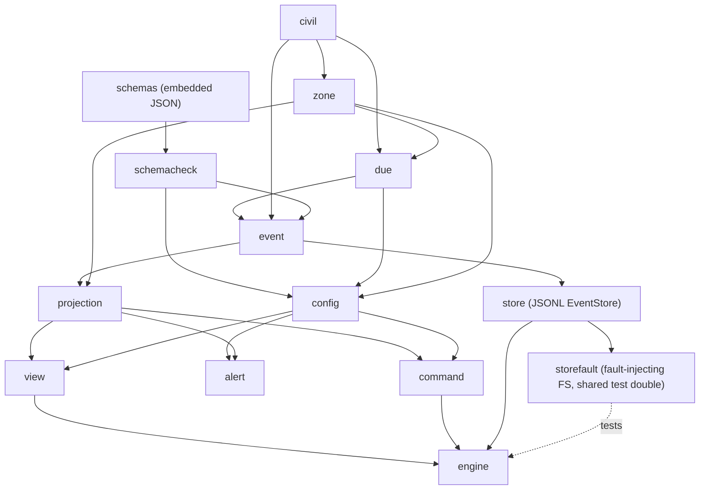

# pg-task-focus Core Library Implementation Plan (sub-project 1 of 5)

> **For agentic workers:** REQUIRED SUB-SKILL: Use superpowers:subagent-driven-development (recommended) or superpowers:executing-plans to implement this plan task-by-task. Steps use checkbox (`- [ ]`) syntax for tracking. The operator reviews this plan and chooses the execution method (see "Execution method options") before any code is written.

**Goal:** Build the `pg-task-focus` core library: the append-only JSONL event log, the projection and timer math derived from it, time and zone rules, config parsing and validation, and the validation-by-candidate-replay engine, with no HTTP, UI or CLI.

**Architecture:** Event Sourcing with a disposable Projection. A single `Engine` owns the write path: plan the events for a command, validate the whole candidate log by replay, append and fsync through the `EventStore` (Repository), adopt the validated candidate as the new projection, publish the new state version. Everything time-dependent takes an injected `Clock`; everything config-dependent takes a `Config` argument at read time and is never consulted during replay.

**Tech Stack:** Go (stdlib `encoding/json`, `time`, `time/tzdata`, `os`; `golang.org/x/sys/unix` for `flock`), a JSON Schema 2020-12 validator (decision D2, ruled: `github.com/santhosh-tekuri/jsonschema/v6`), `pgregory.net/rapid` for property tests (decision D3, ruled; test code only), gomod2nix packaging per this repository's conventions.

**Spec:** `docs/superpowers/specs/2026-10-07-pg-task-focus-design.md` (approved, landed on main at commit `39231ea7`, then amended by the operator's rulings 28 to 43 of 2026-10-08; rows 32 to 43 are the second round, folded in by the change that revised this plan). Epic bead `pg2-t7me1`; this plan is for child bead `pg2-t7me1.1`. Executors read both the spec and this plan. Under this repository's citation conventions, code and comments MUST NOT cite the spec file; state the rule in the code or cite the ADR from Task 1.

**Repository root:** `/Users/phillipg/phillipg_mbp/phillipgreenii-nix-agent-support`. All paths below are relative to the root of the worktree the executor works in. The Go module is `packages/pg-task-focus/`.

## Global Constraints

Copied from the spec; every task's requirements include this section.

- This repository is PUBLIC. No employer-specific content and no user identifiers other than the operator's own in code, tests, fixtures or docs. Fixtures use only generic text and the `example.test` host.
- Every stored instant is an RFC 3339 UTC timestamp with millisecond precision, for example `2026-10-07T13:30:00.000Z`.
- Every civil-date or wall-clock computation names an IANA zone; there is NO default zone. A zone name is valid when `time.LoadLocation` resolves it in its exact letter case (ruling of 2026-10-08, D12); the empty string and `Local` are rejected as implicit zones, and names the standard library does not know (`ET`, `PST`, `-05:00`) are rejected for that reason alone. `EST` and `MST` are accepted but are fixed offsets with no daylight saving; the behavior docs say so and recommend region names.
- A civil time that does not exist resolves to the first valid instant after the gap (`02:30` in a 02:00 to 03:00 gap resolves to `03:00` local). A civil time that occurs twice resolves to its earlier occurrence. Both rules are implemented and tested explicitly.
- The log is append-only. The only truncations are crash recovery (rule 7) and rollback of a failed append (rule 14), each back to the end of the last committed record.
- Replay MUST NOT consult the config. Task snapshots live in `task.materialized` and `cycle.started`.
- The event `v` is `1`. An unknown `v` refuses to start. `max_future_skew_seconds` defaults to `60`. Every minutes or interval value (`planned_minutes`, a boost, a `minutes` override, `cycle_minutes`, `repeat_minutes`) is an integer from 1 to 525600, which keeps duration arithmetic far from overflow. `event.MaxEventBytes` is 262144; a longer event is rejected before it is written, and a longer line found in a log is corruption.
- Operator rulings, honored exactly. (1) The overtime sound has NO acknowledge, mute, snooze or repeat cap; a short `sound` at expiry, then a short `reminder_sound` every `repeat_minutes` until the cycle is stopped. (2) Reminders count the cycle's RUNNING time (ruling of 2026-10-08): a paused cycle plays nothing and notifies nothing, and resuming continues the count where it stopped, so a cycle resumed half-way through an interval reminds when that interval completes; the expiry sound is never replayed by a pause and resume. (3) No carry-over: a task still open at rollover is `missed` or `skipped`, never carried into the next period. (4) Interrupted cycles stay visible: the running cycle is the focus, every paused cycle that is not stopped is dimmed beside it with a Switch action that swaps the focus (one batch of events), and a dimmed cycle can be stopped without switching to it. (5) A final line of the log that ends in a newline but does not parse is a torn tail, recovered like any other, not refused. (6) Backdating a period change has NO lower bound: the operator may backdate a rollover as far as needed to fix the date; only the future-skew rule and the timeline (candidate replay) apply. (7) Zone data comes from the standard library (`time/tzdata`); no zone database is committed to the repository. (8) The recovery sidecar is named `events.jsonl.recovered-<UTC yyyymmddThhmmssZ>-<n>`. (9) Commits use the conventional form `feat(pg-task-focus): ...`. (10) A `pause`, `resume`, `stop` or `switch` of a cycle that is already in that state at the request's effective instant is a no-op success (`changed: false`, a one-sentence `note`, no event, no version change, no error; a bounded in-memory cache answers a retry with the same id); a stopped cycle cannot change (`cycle_stopped`). (11) A period change is refused (`409 cycle_active`, naming the cycles) while any cycle is running or paused in the PRESENT state, whatever the change's effective instant (a cycle that ran across a backdated instant but is stopped now does not block); there is no "End at" prefill. (12) There is no `--last`: a cycle verb without an id applies only when exactly one candidate exists (for pause, boost and stop, the cycle running at the request's instant, else the only cycle that is not stopped), and more than one is `400 cycle_ambiguous`. (13) Read-only mode is obvious in every client: the library exposes `Engine.Health()` and `State.Store`, and every client shows `READ-ONLY: <reason>. Restart pg-task-focus to recover`. (14) Errors are expressive: one specific code per condition and a plain-sentence message naming the entity, the instants (UTC, then the active day period's zone with its identifier) and the ids of STORED events (the event a request would add is "the new event"); there is no generic catch-all code. (15) `event.retracted` names its target as `target` or `target_batch`, and `batch` means membership of a batch group and nothing else. (16) A skip or override reason is non-blank (empty or whitespace only is `invalid_request`). (17) A cycle's `data.type` (with its `title`) is correctable in the editor; the envelope `type` never is.
- Error `reason` codes are the closed set in the spec's "Daemon and HTTP API" table, and nothing else; each rejection also carries a plain-sentence message and the structured facts of the problem (see the Binding API contract).
- Long commands (`nix build`, `go test ./...` over the whole module) MUST run with an explicit `timeout` (at most 600000 ms) or in the background. Nix runs go through `pg-nix-log-wrapped`.

## Review Focus

Inputs and conditions the spec implies that no happy-path test would exercise. Each has a pinning test in the task named in brackets.

1. **A backdated or corrected `effective_at` that changes entity order.** A correction that moves a `cycle.stopped` before a `cycle.resumed` (`cycle_stopped`), or backdates a start under a running cycle (`another_cycle_running`), is rejected with the specific code of its condition, and the result of a full replay (never an incremental append) is what decides. [Task 12, Task 13]
2. **Civil dates that do not exist or half-shift.** A whole civil date skipped by a zone (`Pacific/Apia`, 2011-12-30), a half-hour gap (`Australia/Lord_Howe`), and `00:00` in a zone whose transition falls at midnight. [Task 3]
3. **A crash at every point of the write path.** A line with no newline, an uncommitted batch at the tail, an interleaved or uncommitted batch mid-file (corruption), a crash after the sidecar copy but before the truncate, and a note or key/value value longer than `bufio`'s default 64 KiB token. [Task 8, Task 9]
4. **Retraction chains.** Retract a correction, retract a retraction (undo of undo), retract a batch (one `event.retracted` with `target_batch`, which carries no `batch` and so can itself be retracted), retract a batch whose task a later event completed (`batch_has_dependents`, with the dependents named), and the late completion of a `missed` task which is NOT a dependent. [Task 5, Task 10, Task 18]
5. **An idempotent retry after an unknown outcome.** The same `id` and payload after a `503`, after a restart (the index is rebuilt from `req_hash`), for a batch (the id is the batch id), and with `effective_at` omitted (a retry later must hash the same); a different payload under the same id is `id_conflict`. [Task 5, Task 19]
6. **Huge, invalid-UTF-8 or blank free text.** A 300 KiB note or reason and a reason holding the byte `0xff` are `invalid_request` before anything is built (`json.Marshal` would otherwise rewrite the byte to U+FFFD and store text the operator never wrote); a blank skip reason (`""`, `"  "` or any whitespace only) is `invalid_request`; a 100 KiB line already in a log still replays. [Task 5, Task 8, Task 16]
7. **A clock stepped backwards.** With no `effective_at`, a command whose clock reading is earlier than the entity's newest event is `clock_behind_log` with a message naming both instants; it never corrupts the log and never panics. [Task 16]
8. **A config edited while history exists.** After a reload that removes a task definition, a cycle type or a non-active profile, replay, `view` and `alert` keep working from the snapshots in the log, a profile change withdraws the open tasks whose definition vanished, and a removed cycle type falls back to `defaults.alert`. [Task 14, Task 15, Task 17]
9. **The same request twice, concurrently.** Two goroutines sending one request `id` produce one set of events and the second receives the first's result; two goroutines completing one task under different ids produce one success and one `task_already_resolved`. [Task 19]
10. **Switching focus back and forth.** A to B and B to A at the same instant would leave a zero-length segment and is `empty_running_segment`; at later instants the segments alternate and the elapsed totals stay exact; stopping a dimmed cycle leaves the focus untouched; undoing a switch batch restores both cycles. [Task 12, Task 16, Task 18]
11. **Read-only mode that nobody can miss.** After a failed append fsync, or a failed rollback, the store keeps the cause and the instant; `Engine.Health()` and `State.Store` carry `ReadOnly`, `Reason` and `Since` for every client; `Engine.OnHealthChange` fires when the store enters read-only mode, so a daemon can push it over `/stream`; only reopening clears it; a healthy store reports the zero value. `Do` checks idempotency BEFORE the read-only gate, so a retry of a request whose events are durable returns its original result even while read-only, and a refusal is a `*command.Rejection` (`store_unavailable`) with the READ-ONLY sentence. [Task 9, Task 19]
12. **A period change with an active cycle.** A running cycle blocks it, a paused (dimmed) cycle blocks it, a stopped cycle does not; the check is on the PRESENT projection, whatever the change's `effective_at`, so a backdated rollover is blocked by a cycle that is active now and is NOT blocked by a cycle that ran across the backdated instant but is stopped now; the dry run lists the blocking cycles instead of failing; a cycle forgotten overnight is stopped with "end at" and the rollover then succeeds. [Task 17]
13. **Repeating a state command.** A pause of a paused cycle, a resume of a running one, a stop of a stopped one and a switch to the focus, each judged at the request's effective instant, succeed as a no-op with a `Note`, no event, no version change and no `OnCommit`; a pause or resume of a STOPPED cycle is `cycle_stopped`; a retry of a no-op with the same id returns the original result from a bounded in-memory cache (1024 entries, least recently used), a different payload under that id is `id_conflict`, and after a restart the request is evaluated again; an id-less repeated `stop` after the only cycle stopped is `no_running_cycle`. [Task 16, Task 19]
14. **An ambiguous cycle.** Resume or annotate with no id and two non-stopped cycles is `cycle_ambiguous` listing both; pause, boost and stop with no id take the cycle running at the request's instant, else the only non-stopped cycle, else `cycle_ambiguous` (several) or `no_running_cycle` (none); with exactly one candidate the verb applies. There is no `--last`. [Task 16]
15. **One code per condition, from either path.** The same condition gets the same code whether the command finds it from the present state or candidate replay finds it, and no code is generic. [Task 11, Task 12, Task 16, Task 18]

---

## Package layout and dependency order



All packages live under `packages/pg-task-focus/internal/` except `schemas` (data plus an embed shim, `packages/pg-task-focus/schemas/`, the directory the spec names). `internal/` is deliberate: the connector backend (sub-project 4) talks to the daemon's HTTP API and MUST NOT import Go packages. Sub-projects 2 and 3 live in the same module and import the packages below directly.

File map (create unless noted):

| Path under `packages/pg-task-focus/`                    | Responsibility                                                                                                                                                                                                               |
| ------------------------------------------------------- | ---------------------------------------------------------------------------------------------------------------------------------------------------------------------------------------------------------------------------- |
| `go.mod`, `go.sum`, `gomod2nix.toml`, `update-deps.sh`  | module and dependency wiring                                                                                                                                                                                                 |
| `internal/clock/`                                       | `Clock`, `Real`, `Fake`                                                                                                                                                                                                      |
| `internal/civil/`                                       | `Date`, `Clock` (time of day), weekday and `HH:MM` parsing                                                                                                                                                                   |
| `internal/zone/`                                        | IANA validation (standard library `time/tzdata`), gap and overlap resolution, host zone discovery                                                                                                                            |
| `internal/due/`                                         | due rule type and its resolution against a period                                                                                                                                                                            |
| `internal/event/`                                       | envelope, `Instant`, ULID, payload types, canonical encode and decode, `ReqHash`                                                                                                                                             |
| `schemas/`                                              | `event.schema.json`, `config.schema.json`, `embed.go`                                                                                                                                                                        |
| `internal/schemacheck/`                                 | validator wrapper, `x-free-text` inventory                                                                                                                                                                                   |
| `internal/config/`                                      | config parse, semantic validation, resolution helpers, reload checks                                                                                                                                                         |
| `internal/store/`                                       | JSONL `EventStore`: scan, crash recovery, lock, append with rollback, read-only mode and its `Health`, offline `Check`                                                                                                       |
| `internal/store/storefault/`                            | a normal package: the fault-injecting `store.FS` shared by the store tests (external `package store_test`, which breaks the import cycle) and the engine tests (`engine.Options.FS`); honours `O_APPEND`, records call order |
| `internal/projection/`                                  | candidate replay, correction and retraction overlay, tasks, periods, profile, cycles, timer math                                                                                                                             |
| `internal/view/`                                        | read-time state: `next`, banners, resume offer, ordering, `not_in_profile`                                                                                                                                                   |
| `internal/alert/`                                       | overtime alert scheduler                                                                                                                                                                                                     |
| `internal/command/`                                     | command types, planning into events, dry-run previews, typed rejections                                                                                                                                                      |
| `internal/engine/`                                      | write path, idempotency index, state version, observer, reload, offline verify                                                                                                                                               |
| `internal/testgen/`                                     | `rapid` generators (event logs, instants, zone names) for property tests, fixture helpers                                                                                                                                    |
| `testdata/logs/`, `testdata/config/`                    | synthetic golden JSONL logs and configs                                                                                                                                                                                      |
| `docs/behavior/pg-task-focus/` (repo root)              | behavior docs (Task 1)                                                                                                                                                                                                       |
| `docs/adr/0088-...` and `docs/adr/index.md` (repo root) | the ADR (Task 1); re-read the index tail first, the number is not a remembered value                                                                                                                                         |
| `flake.nix` (modify, repo root)                         | `pg-task-focus-go-tests` check, `pg-task-focus-golangci` lint registration                                                                                                                                                   |

## Binding API contract for sub-projects 2 to 5

Treat the declarations below as a contract. A later sub-project MUST consume exactly this surface; changing a name, signature or semantic here requires amending this plan and re-reviewing consumers. Field-level wire formats are defined by the JSON Schemas in `schemas/`.

```go
// package clock
type Clock interface{ Now() time.Time }
func Real() Clock
type Fake struct{ /* settable, advanceable */ }
func NewFake(t time.Time) *Fake
func (f *Fake) Set(t time.Time)
func (f *Fake) Advance(d time.Duration)
func (f *Fake) Now() time.Time

// package civil
type Date struct{ Year int; Month time.Month; Day int }       // JSON: "2026-10-07"
type TimeOfDay struct{ Hour, Minute int }                     // JSON: "09:30"
func ParseDate(s string) (Date, error)
func ParseTimeOfDay(s string) (TimeOfDay, error)
func ParseWeekday(s string) (time.Weekday, error)             // "mon".."sun"
func (d Date) String() string
func (d Date) AddDays(n int) Date
func (d Date) DaysUntil(o Date) int
func (d Date) Weekday() time.Weekday
func (d Date) Compare(o Date) int

// package zone
type Zone struct{ /* name + *time.Location */ }
func Load(name string) (Zone, error)                          // *Error{Reason: "invalid_zone"}; what time.LoadLocation resolves in its exact spelling, except "" and "Local"
func (z Zone) Name() string
func (z Zone) Location() *time.Location
func ResolveCivil(z Zone, d civil.Date, t civil.TimeOfDay) time.Time // UTC, gap and overlap rules
func Today(z Zone, now time.Time) civil.Date
func Host(getenv func(string) string, readlink func(string) (string, error)) (Zone, error)

// package due
type Cadence string                                           // consts Daily, Weekly, Sprint = "daily", "weekly", "sprint"
type Rule struct {                                            // JSON: {"at","tz","weekday"?,"day"?}
    At civil.TimeOfDay; TZ zone.Zone; Weekday *time.Weekday; Day *int }
type Resolution struct{ Instant time.Time; Date civil.Date }
type NoMatch struct{ Reason string }                          // implements error
func Resolve(c Cadence, r Rule, start, end civil.Date) (Resolution, error) // end == start for daily

// package event
const SchemaVersion = 1
type ID string                                                // ULID, 26 chars Crockford base32
func NewID(t time.Time, entropy io.Reader) ID
func ParseID(s string) (ID, error)
type Instant time.Time                                        // JSON: fixed "2006-01-02T15:04:05.000Z"
func At(t time.Time) Instant                                  // UTC, truncated to ms
func (i Instant) Time() time.Time
type Type string                                              // the 17 types in the spec's event table
type Envelope struct {
    V int; ID ID; At, EffectiveAt Instant; ReqHash string; Type Type; Data json.RawMessage }
type Event struct{ Envelope; Payload Payload; Line int }      // Line: 1-based log position, 0 if unappended
type Payload interface{ EventType() Type; BatchID() ID }      // BatchID is the membership batch id: empty for a non-member, and always empty for EventRetracted
func Decode(line []byte) (Event, error)                       // strict; schema-checked
func Encode(e Event) ([]byte, error)                          // one line, no trailing newline
func ReqHash(command string, clientFields any) (string, error)
type UnknownVersionError struct{ V int }                      // returned by Decode when v != 1
func Types() []Type                                           // the 17 event types
const MaxEventBytes = 262144
var ErrTooLarge, ErrInvalidUTF8 error                         // from Encode; the command layer maps both to invalid_request, so the engine never meets them at Append
func ValidText(strs ...string) error                          // boundary check: valid UTF-8 and within the size limit
func ValidReason(s string) (string, error)                    // trims surrounding whitespace; blank means strings.TrimSpace(s) == "" (Unicode whitespace) and is an error
// payload structs: PeriodChanged, ProfileChanged, TaskMaterialized, TaskCompleted, TaskSkipped,
// TaskMissed, TaskWithdrawn, TaskReinstated, CycleStarted, CyclePaused, CycleResumed,
// CycleBoosted, CycleStopped, CycleAnnotated, EventCorrected, EventRetracted, BatchCommitted
// (field names = the spec's data fields, Go-cased). TaskID and CycleID are string types.
// EventRetracted{Target event.ID; TargetBatch event.ID; Reason string}: exactly one of Target or TargetBatch; it has no Batch field.
// Every other payload that is a batch member carries Batch event.ID (membership only).
func NewTaskID(c due.Cadence, periodStart civil.Date, definition string) TaskID

// package config
type Config struct{ /* parsed, validated, immutable */ }
func Parse(raw []byte) (*Config, error)                       // *ValidationError lists every problem
func (c *Config) Digest() string
func (c *Config) Defaults() Defaults
func (c *Config) Profile(name string) (Profile, bool)         // task and cycle ids by cadence
func (c *Config) Task(id string) (TaskDef, bool)
func (c *Config) CycleType(id string) (CycleDef, bool)
func (c *Config) CycleMinutes(typ string, override *int) int  // override, type, then defaults
func (c *Config) Alert(typ string) Alert                      // Sound, ReminderSound, RepeatMinutes
func (c *Config) GroupRank(group string) int                  // unlisted groups sort last
func (c *Config) ListenPort() int
func (c *Config) PublicURL() string
func CheckReload(prev, next *Config, activeProfile string) error
func RestartRequired(prev, next *Config) []string             // "listen_port", "public_url"

// package store
type Recovery struct{ TornTail bool; UncommittedBatches int; TruncatedBytes int64; Sidecar string }
func DefaultDir(getenv func(string) string) string            // ${XDG_DATA_HOME:-$HOME/.local/share}/pg-task-focus
func Open(opts Options) (*Store, []event.Event, Recovery, error) // lock, scan, recover
func Check(path string) (CheckReport, error)                  // read-only, no lock; path is the data directory or the log file (implemented in Task 9)
func (s *Store) Append(evs []event.Event) (AppendStats, error) // AppendStats{Events, Bytes, Duration}; a failure is *AppendError{Stage "write"|"sync", Err}; the engine learns rolled-back versus read-only from Health() after the call
func (s *Store) Writable() bool
type ReadOnlyReason string                                    // four exported constants, each a closed plain sentence, never free text:
const ( ReasonWriteRollbackTruncate ReadOnlyReason = "the append write failed and the rollback could not truncate the log"
        ReasonWriteRollbackSync     ReadOnlyReason = "the append write failed and the rollback could not be synced"
        ReasonAppendSync            ReadOnlyReason = "the append fsync failed"
        ReasonAdopt                 ReadOnlyReason = "the new state could not be adopted after a durable append" )
type Health struct{ ReadOnly bool; Reason ReadOnlyReason; Since time.Time }
func (s *Store) Health() Health                               // zero value while writable; the first cause and its instant (Options.Now) once read-only
func (s *Store) MarkReadOnly(reason ReadOnlyReason)           // the engine's adoption-failure path (ReasonAdopt); keeps the first cause
func (s *Store) Probe() error                                 // the store_writable probe
func (s *Store) Size() int64
func (s *Store) Close() error
var ErrLocked, ErrStoreUnavailable error
type CorruptError struct{ Line int; Cause error }
type UnknownVersionError struct{ Line, V int }                // wraps event.UnknownVersionError{V}; Unwrap returns it

// package projection
func Replay(events []event.Event) (*Model, error)             // full replay; *Invalid when the timeline is impossible
func Candidate(base, add []event.Event) (*Model, error)       // validation by candidate replay; assigns Line = len(base)+i+1 to the added events
func (m *Model) Log() []event.Event
type Code string                                              // the closed set of replay-found codes (below); func Codes() []Code lists them (declared in Task 10, later tasks add codes)
type CycleStatus string                                       // consts NotStarted, Running, Paused, Stopped ("not_started", "running", "paused", "stopped")
type Invalid struct{ Code Code; Message string; Entity string; Events []event.ID; Cycles []event.CycleID; Instants []time.Time } // implements error; Message is one plain sentence naming the entity, the instants and the event ids; Entity is a stored task or cycle id or the period kind (empty when the offender is the new cycle itself); Events and Cycles list only STORED events and cycles, never the new event or a freshly generated cycle id; Instants includes the new event's effective_at
func (m *Model) Lines() int
func (m *Model) Profile() string                              // "" when uninitialized
func (m *Model) Period(k Kind) (Period, bool)                 // current period of a kind
func (m *Model) Task(id event.TaskID) (Task, bool)
func (m *Model) Tasks() []Task
func (m *Model) Cycle(id event.CycleID) (Cycle, bool)
func (m *Model) Cycles() []Cycle
func (m *Model) Dimmed() []Cycle                              // paused and not stopped, most recently paused first
func (m *Model) Domain() Domain                               // the state by value, without log positions or history, for equality in tests
func (m *Model) Running() (Cycle, bool)
func (m *Model) RunningAt(t time.Time) (Cycle, bool)          // the cycle running at an instant
func (m *Model) Events(q EventQuery) []EventView              // corrected and original views
func (m *Model) Event(id event.ID) (EventView, bool)
func (m *Model) BatchEvents(b event.ID) []event.ID
func (m *Model) Dependents(batch event.ID) []event.ID         // later live events referencing an entity the batch CREATED (a switch or break creates none)
func (m *Model) CycleDependents(start event.ID) []event.ID    // later live events of the cycle a cycle.started opened, and later cycle.started events naming it in interrupts
func (m *Model) CycleTitle(id event.CycleID) (string, bool)      // the model's cycle's title, else the corrected title of the latest logged cycle.started (retracted or not); never false for an id in Invalid.Cycles of a log written through Candidate
func CheckCorrection(target event.Event, fields map[string]json.RawMessage) *CorrectionProblem // CorrectionProblem{Identity bool; Field string; Err error}; nil when the correction applies; Identity: a forbidden target type (Field "") or an identity or envelope field (invalid_correction); else Err: the corrected event breaks its schema (Correct answers invalid_request); the overlay applies the same check
func (c Cycle) Elapsed(now time.Time) time.Duration
func (c Cycle) Remaining(now time.Time) time.Duration         // negative in overtime
func (c Cycle) Overtime(now time.Time) bool                   // running and Remaining < 0
func (c Cycle) StatusAt(t time.Time) CycleStatus             // NotStarted before the cycle's start; Running at the start instant and at every resume instant; Paused at a pause instant; Stopped at and after StoppedAt (a field, not a method)
func (c Cycle) TimeUp(now time.Time) bool                     // Remaining <= 0, running OR paused; the alert boundary (Overtime is running and < 0)
func (c Cycle) OvertimeSince(now time.Time) (time.Time, bool)
// Task{ID, Definition, Cadence, PeriodStart, Title, Group, Link, Due, DueRule, Status, ResolvedAt, Reason}
// Cycle{ID, Type, Title, PlannedMinutes, Boosts, Status, StoppedAt *time.Time, Segments []Segment, InterruptedBy, Note, KV}
// Segment{Start time.Time, End *time.Time, OpenedBy event.ID}   // End nil = open

// package view
type State struct{ /* header, tasks, next, running cycle (the focus), dimmed cycles, interrupt stack, resume offer, Store StoreHealth{ReadOnly, Reason, Since} */ }   // Build leaves Store zero; Engine.State fills it from Health()
func Build(m *projection.Model, cfg *config.Config, now time.Time) State
func RolloverBanner(k projection.Kind) string                 // "New day: roll over", "New week: roll over", "New sprint: roll over"

// package alert
type Kind string                                              // "expiry" | "reminder"
type Alert struct{ Kind Kind; CycleID event.CycleID; Sound string }
type Scheduler struct{ /* per-process memory, never logged */ }   // reminders count the cycle's running time
func NewScheduler() *Scheduler
func (s *Scheduler) Poll(m *projection.Model, cfg *config.Config, now time.Time) *Alert   // at most one; observes every non-stopped cycle and records what it plays; the daemon MUST call it after every commit and reload (OnCommit), before NextAt
func (s *Scheduler) NextAt(m *projection.Model, cfg *config.Config, now time.Time) (time.Time, bool)

// package command
type Reason string                                            // the spec's closed set (listed below); every projection.Code is a Reason
func (r Reason) Status() int                                  // 400, 404, 409, 422, 503 (a number, no net/http)
type CycleRef struct{ ID event.CycleID; Title string; Status projection.CycleStatus; StartedAt time.Time }
type Rejection struct{ Reason Reason; Message string; Entity string; Events []event.ID; Instants []time.Time; Cycles []CycleRef } // implements error; Events also carries the dependents of a batch or a cycle start; Cycles carries cycle_ambiguous candidates, cycle_active blockers and the cycles named by another_cycle_running (Build copies projection.Invalid.Cycles, looking up each title with projection.Model.CycleTitle)
type Command interface{ Name() string; ClientID() event.ID; ReqHash() (string, error); IsDryRun() bool } // ReqHash and IsDryRun let Do run the idempotency lookup and the dry-run exemption BEFORE Build
type Plan struct{ Events []event.Event; BatchID event.ID; NoOp bool; Note string; Preview *Preview; Candidate *projection.Model } // NoOp: nothing to append, no version change; Note is the one plain sentence saying why nothing changed (also set on a retraction of an already-retracted target)
type TaskRef struct{ ID event.TaskID; Title string; Overdue bool }
type Preview struct{ Leaving, Materialize, ProfileAdd, ProfileWithdraw, ProfileReinstate []TaskRef; NotMaterialized []struct{ Definition, Reason string }; BlockingCycles []CycleRef; Version Version }
type Version struct{ LogLines int; ConfigGeneration int64 }   // engine.Version is an alias of this
type Env struct{ Model *projection.Model; Config *config.Config; Now time.Time; Version Version; NewID func() event.ID }
func Build(env Env, c Command) (Plan, error)                  // pure (no IO, no mutation); runs projection.Candidate and maps *Invalid to a Rejection with the same code
// Commands: ChangePeriods, ChangeProfile, CompleteTask, SkipTask, StartCycle, PauseCycle,
// ResumeCycle, BoostCycle, StopCycle, SwitchCycle, AnnotateCycle, BackfillBreak, Correct, Retract.

// package engine
type Version = command.Version
type Health = store.Health
type Options struct{ Dir string; Config *config.Config; ConfigGeneration int64; Clock clock.Clock;
    NewID func() event.ID; Observer Observer; FS store.FS; AdoptFault func() error } // AdoptFault is a test seam: when it returns an error the validated candidate is not adopted (the adoption-failure path)
func Open(opts Options) (*Engine, error)                      // replay, recover, ready
func (e *Engine) Do(ctx context.Context, c command.Command) (Result, error)   // dry-run commands return Result.Preview
func (e *Engine) Snapshot() Snapshot                          // consistent model, config, version
func (e *Engine) State(now time.Time) view.State              // includes State.Store from Health()
func (e *Engine) Health() Health                              // read-only flag, reason and since; only reopening clears it
func (e *Engine) SetConfig(next *config.Config, generation int64) error        // CheckReload, then swap
func (e *Engine) Version() Version
func (e *Engine) OnCommit(f func(Version))                    // invoked after each successful commit and reload
func (e *Engine) OnHealthChange(f func(Health))               // invoked when the store enters read-only mode (and if the reason ever changes); never for a healthy store
func (e *Engine) Close() error
func Verify(path string) (VerifyReport, error)                // offline: store.Check plus replay
type Result struct{ Changed bool; Note string; EventIDs []event.ID; BatchID event.ID; Replayed bool; Version Version; Preview *command.Preview } // a no-op is Changed false with a Note and no EventIDs
type Observer interface{ Replayed(n int, d time.Duration); Recovered(store.Recovery);
    Appended(t event.Type, s store.AppendStats); AppendFailed(stage string);
    Rejected(r command.Reason); Corrected(kind string) }
```

The closed set of `command.Reason` codes (the spec's error table, one table; the replay-found ones are also `projection.Code` values). `Rejection` carries `Message`, `Entity`, `Events`, `Instants` and, for the cycle codes, `Cycles`.

| Status | Codes                                                                                                                                                                                                                                                                                                                                                                                                                           |
| ------ | ------------------------------------------------------------------------------------------------------------------------------------------------------------------------------------------------------------------------------------------------------------------------------------------------------------------------------------------------------------------------------------------------------------------------------- |
| 400    | `invalid_request`, `invalid_zone`, `unknown_profile`, `unknown_cycle_type`, `reserved_key`, `cycle_ambiguous`                                                                                                                                                                                                                                                                                                                   |
| 404    | `unknown_task`, `unknown_cycle`, `unknown_event`                                                                                                                                                                                                                                                                                                                                                                                |
| 409    | `no_running_cycle`, `cycle_stopped`, `another_cycle_running`, `interrupted_cycle_not_running`, `cycle_active`, `cycle_segments_overlap`, `break_ends_at_stop`, `clock_behind_log`, `task_already_resolved`, `task_withdrawn`, `task_not_withdrawn`, `task_materialized_twice`, `task_without_period`, `task_before_profile`, `period_unchanged`, `id_conflict`, `stale_preview`, `batch_has_dependents`, `cycle_has_dependents` |
| 422    | `invalid_correction`, `future_effective_at`, `stop_not_after_start`, `empty_running_segment`, `cycle_event_before_start`, `resolution_before_materialization`, `period_out_of_order`                                                                                                                                                                                                                                            |
| 503    | `store_unavailable`, `not_ready`                                                                                                                                                                                                                                                                                                                                                                                                |

`projection.Code` is the subset replay can find: `unknown_event`, `invalid_correction`, `cycle_stopped`, `another_cycle_running`, `interrupted_cycle_not_running`, `cycle_segments_overlap`, `break_ends_at_stop`, `stop_not_after_start`, `empty_running_segment`, `cycle_event_before_start`, `task_already_resolved`, `task_withdrawn`, `task_not_withdrawn`, `task_materialized_twice`, `task_without_period`, `task_before_profile`, `resolution_before_materialization`, `period_unchanged`, `period_out_of_order`. The command layer adds the codes only it can know (`invalid_*`, `reserved_key`, `unknown_*` for config ids, `no_running_cycle`, `cycle_ambiguous`, `cycle_active`, `clock_behind_log`, `id_conflict`, `stale_preview`, `batch_has_dependents`, `cycle_has_dependents`, `future_effective_at`, `store_unavailable`); `not_ready` belongs to the daemon (sub-project 2), which documents it, and the library never returns it. Statuses keep their HTTP meaning: 400 malformed or incomplete (including an ambiguous cycle, a correction whose replacement values break the event schema, and an event too long once encoded), 404 not found, 409 a conflict with the current state or other events (`cycle_stopped` is 409 because the request conflicts with an existing stop event, not because its own content is wrong), 422 an instant or content that is unacceptable for its own target (a stop at the instant of the cycle's start, a cycle event before its start, a completion before the task existed, a period change that sorts before an earlier one), 503 store unavailable.

Repeated state commands: `PauseCycle`, `ResumeCycle`, `StopCycle` and `SwitchCycle` return `Plan{NoOp: true, Note: ...}` (and `engine.Result{Changed: false, Note: ...}`) when the cycle is already in the requested state at the request's effective instant (`CycleStatus` `NotStarted` is never a no-op); nothing is appended and the version does not change. A no-op stores no `req_hash`, so the engine keeps a bounded in-memory cache (1024 entries, least recently used) of `{id, req_hash, Result}` for no-op results for the life of the process: a retry with the same id and hash returns the original `Changed: false` result, a different hash under that id is `id_conflict`, nothing is written to the log, and after a restart the cache is gone and the request is evaluated again. A retraction of an already-retracted target or batch is a no-op in the same way.

`Engine.Do` errors. Every refusal is a `*command.Rejection` (reach it with `errors.As`): a rejection from `Build`, `id_conflict`, or `store_unavailable`. `store_unavailable` has four shapes. (1) The store was already read-only when the request arrived (the gate): `Message` is `READ-ONLY: <reason>. Restart pg-task-focus to recover`, and nothing was attempted, so even a new id-less no-op is refused (the gate precedes `Build`). (2) An append failed and the file was rolled back, so the store stayed writable: `Message` is `the outcome is unknown: retry with the same id`. (3) The request's own append made the store read-only (its fsync failed, or a write failed and the rollback failed too): `Message` is the READ-ONLY sentence followed by `The outcome is unknown; if the request carried an id, retry with it after the restart`. (4) The new state could not be adopted after a durable append, so the store is now read-only: the READ-ONLY sentence followed by `The change is stored; if the request carried an id, retry with it after the restart to receive the result`. The daemon attaches the `store` details from `Health()`. Order inside `Do`: (a) a dry run (`Command.IsDryRun()`) NEVER reads or writes the idempotency index or the no-op cache and skips the gate, so a dry run carrying the id of a durable request returns a preview; (b) otherwise the idempotency lookup with `Command.ReqHash()` (the persistent index, then the no-op cache); (c) the read-only gate; (d) `Build`. A retry of a request whose events are durable therefore returns its original result with `Replayed: true` even while the store is read-only; the engine records the request in the index right after a durable append and before adopting the model, so this also holds when adoption failed. After an adoption failure the in-memory model is behind the log until the restart.

Messages: a `Message` cites only the ids of stored events and cycles; the event a request would add is "the new event" and a cycle it would create is "the new cycle". This holds for the present-state path and for `Candidate` alike: a `Candidate`-built `Invalid` lists ONLY stored events and cycles (those with `Line <= len(base)` or named by a stored event), so a freshly generated ULID is never in `Invalid.Cycles`, and the `Rejection` title lookup goes through `Model.CycleTitle`, which also finds a stored cycle whose start is retracted in the present model, so it cannot fail, and BOTH paths put the new event's `effective_at` in `Instants`. Every instant in a message is given in UTC (RFC 3339 with `Z`) followed in parentheses by the same instant in the active day period's zone with its identifier once a day period exists (for example `2026-10-07T14:00:00Z (10:00 America/New_York)`), so no zone is implicit. A double resolution is `task_already_resolved` on both paths: a command acting on the present state and `Candidate` list the one stored resolving event and call the other "the new event", and replay of a stored log with two stored resolvers lists both.

---

## Conventions for every task

- Work in the worktree; build and test with `go -C packages/pg-task-focus test ./internal/<pkg>/... -race -count=1` (the module has no network needs at test time).
- Test names describe the subject, never a bead id. Fixtures live under `testdata/` and are synthetic.
- Commit procedure at the end of each task: `git add <files>`; `pg-hooks fix`; `pg-hooks run pre-commit <files>`; `git commit` with the message given in the task (conventional form, `feat(pg-task-focus): ...`) and the repository's attribution trailer. Never `--no-verify`. New files MUST be `git add`ed before any hook run (hooks skip untracked files).
- A task is done only when its listed tests pass and `go -C packages/pg-task-focus vet ./...` is clean.
- Dependency changes (Tasks 3, 6 and 9) re-run `packages/pg-task-focus/update-deps.sh` in the background (`bgrun`, it runs nix internally and needs network) with `GOTOOLCHAIN=auto` in its environment, because `go.mod` needs Go 1.25 and the wrapped Go in this environment is 1.24.5 (observed in Task 2); commit `go.mod`, `go.sum` and `gomod2nix.toml` together.
- Slices: so one implementer pass stays reviewable, a large task is built in slices WITHOUT renumbering. Task 3: civil, then zone. Task 5: the primitives (`Instant`, ULID, `ReqHash`, `ValidText`, `ValidReason`), then the payload structs, `Encode`/`Decode` and `testdata`. Task 6: the event schema, `schemacheck` and the `Decode` wiring plus the dependency steps, then the config schema. Task 9: the FS seam, `Open`, the lock, recovery, `Check` and `DefaultDir`, then `Append`, rollback, `Health`, `MarkReadOnly`, `Probe` and the dependency steps. Each slice ends with its own commit `feat(pg-task-focus): ...` and a green `go test` of its packages.
- Property tests use `pgregory.net/rapid` (decision D3, ruled), which shrinks a failing case to a minimal one. A failing run prints the seed and the shrunk counterexample; replay it with `go -C packages/pg-task-focus test ./internal/<pkg>/... -run <Test> -rapid.seed=<seed>`, and raise the number of checks with `-rapid.checks=<n>` (the default is 100; the nix check `pg-task-focus-go-tests` passes `-rapid.nofailfile` and a pinned `-rapid.seed`, wired in Task 20, so it is deterministic and writes no failure file, while developers and the commit-time test hook run with random seeds, so a failure there prints the seed to replay). `rapid` also writes a failure file under the package's `testdata/rapid/<Test>/` on a failure, which replays first on the next run; executors MUST NOT commit those files unless the operator asks.

---

### Task 1: Behavior docs and ADR (docs first)

**Files:**

- Create: `docs/behavior/pg-task-focus/README.md`, `event-log.md`, `corrections.md`, `time-and-zones.md`, `configuration.md`, `periods-and-rollover.md`, `cycles-and-timer.md`
- Create: `docs/adr/0088-pg-task-focus-event-log-and-projection.md` (use the next free number after reading `docs/adr/index.md`)
- Modify: `docs/adr/index.md` (one row)

**Interfaces:**

- Consumes: the spec's sections "Time and zones", "Event log", "Configuration", "Periods, profiles and rollover", "Work cycles and the timer", "Expiry sound and reminders".
- Produces: the product-level source of truth every later task implements against. Later sub-projects add their own docs (API, CLI, web UI) to the same directory.

- [ ] **Step 1: Read the templates.** Read `docs/behavior/pg-decider/README.md` and `docs/behavior/pg-decider/work-items.md` for structure (actors, stories, journeys, invariants in RFC 2119 language, intended behavior only, no code paths).
- [ ] **Step 2: Write the set.** One doc per area above. Each states actors, stories, journeys and numbered invariants. The invariants are the spec's rules restated at product level, including the operator rulings (no mute; reminders count running time; no carry-over; interrupted cycles stay visible with a Switch; a complete-but-unparsable final line is a torn tail; unrestricted backdating of a rollover; a pause, resume, stop or switch of a cycle that is already in that state is a no-op success while a stopped cycle cannot change; a period change is refused while any cycle is running or paused, with no "End at" prefill; no `--last`, so an ambiguous cycle must be named; read-only mode is obvious in every client, including a future TUI; every error code names its problem and none is a generic catch-all; a skip or override reason is non-blank; `event.retracted` names `target` or `target_batch` and `batch` is membership only; zone names are what the standard library resolves, with the empty string and `Local` rejected and `EST` and `MST` documented as fixed offsets with region names recommended; a cycle's type is correctable in the editor, the envelope type never) as explicit invariants with their provenance. `time-and-zones.md` MUST carry the zone rule and the `EST` and `MST` caveat in so many words; `cycles-and-timer.md` the state table with its no-op cells; `periods-and-rollover.md` the active-cycle refusal; `event-log.md` the retraction fields, the read-only-mode invariant (obvious in every client, restart-only recovery; after an adoption failure the in-memory model is behind the log until the restart) and the expressive-error invariant (one specific code per condition, no generic code, a message naming the entity, the instants and the ids of stored events), and `corrections.md` the correction and retraction rules. `README.md` carries scope, the glossary subset this library owns, and a "Realization gaps" list naming what lands in sub-projects 2 to 5 (HTTP error mapping, sounds, UI strings, every client rendering read-only mode, and rejecting invalid UTF-8 in the raw request body, because `json.Unmarshal` silently rewrites it).
- [ ] **Step 3: Write the ADR.** Context, decision, consequences for: event sourcing with correction events instead of edits; the projection is never persisted; the zone database is the standard library's embedded `time/tzdata`, the host's zone files win when present (operator ruling 2026-10-08, D1), and a zone name is valid when the standard library resolves it (D12); one `Engine` is the only writer; the loopback no-auth decision the spec asks the ADR to restate is left to sub-project 2's ADR amendment. Cite repositories by name per the citation conventions.
- [ ] **Step 4: Check.** Invoke the `behavior-docs-conformance:behavior-docs-intra-conformance` skill on `docs/behavior/pg-task-focus/` and fix every mechanical finding. Run `git add`, `pg-hooks fix`, `pg-hooks run pre-commit <the new files>`. Expected: all hooks pass.
- [ ] **Step 5: Commit** `feat(pg-task-focus): behavior docs and ADR for the core library`.

---

### Task 2: Module skeleton, nix wiring, clock

**Files:**

- Create: `packages/pg-task-focus/go.mod`, `update-deps.sh` (copy `packages/beads-exporter/update-deps.sh`, mode 0755), `internal/clock/clock.go`, `internal/clock/clock_test.go`, `internal/testgen/doc.go`
- Create (generated): `packages/pg-task-focus/gomod2nix.toml` (`go.sum` appears with the first dependency, Task 3 (`pgregory.net/rapid`, D3); a module with none has no `go.sum`)
- Modify: `flake.nix` (three places, below)

**Interfaces:**

- Produces: `clock.Clock`, `clock.Real`, `clock.Fake` as in the contract. Module path `github.com/phillipgreenii/phillipgreenii-nix-agent-support/packages/pg-task-focus`; the `go` directive equals `packages/beads-exporter/go.mod`'s.

- [ ] **Step 1: Write the failing test** in `clock_test.go`: `TestFakeClockAdvanceAndSet` (Now returns the set instant, Advance(90s) moves it, Set moves it back), `TestRealClockIsUTCAgnostic` (Real().Now() is within one second of `time.Now()`).
- [ ] **Step 2: Run** `go -C packages/pg-task-focus test ./internal/clock/...`. Create `go.mod` first (the module line and the `go` directive only), so the failure is the missing symbol and not a missing module. Expected: FAIL, `undefined: Fake`.
- [ ] **Step 3: Implement** `clock.go`. Then generate `gomod2nix.toml` with `update-deps.sh` in the background and confirm `go-deps-wired` is satisfied (executable wrapper, toml present).
- [ ] **Step 4: Wire nix.** In `flake.nix`: (a) add `"pg-task-focus"` to `simpleGoLintModules`; (b) add the sentence "`pg-task-focus` added bead `pg2-t7me1.1`: no build-tagged test files, verified via `grep -rln '^//go:build' packages/pg-task-focus`" to the deliberate-exemption comment above `nonUnitGoBuildTags`; (c) add `pg-task-focus-go-tests` beside `pg-decider-go-tests` with `src = lib.cleanSource ./packages/pg-task-focus` and the module's `gomod2nixToml`. Do NOT add an overlay `packages.pg-task-focus` and no `default.nix`: the module has no `package main` until sub-project 2, and `mkGoApp` needs one. Version stamping (`main.Version` through `mkGoApp`, per `.claude/rules/package-versioning.md`) therefore lands in sub-project 2; this library exports only the constant `event.SchemaVersion`.
- [ ] **Step 5: Run** `go -C packages/pg-task-focus test ./... -count=1` (PASS), then `git add packages/pg-task-focus flake.nix` (a git flake does not see untracked files) and in the background `bgrun gt -- pg-nix-log-wrapped nix build .#checks.aarch64-darwin.pg-task-focus-go-tests .#checks.aarch64-darwin.pg-task-focus-golangci -L` with a 600000 ms ceiling, and read it with `bgcheck gt`. Expected: `DONE exit=0`.
- [ ] **Step 6: Commit** `feat(pg-task-focus): module skeleton, clock, nix checks`.

---

### Task 3: Civil dates and zones

**Files:**

- Create: `internal/civil/civil.go`, `internal/civil/civil_test.go`, `internal/zone/zone.go`, `internal/zone/resolve.go`, `internal/zone/host.go`, `internal/zone/zone_test.go`, `internal/zone/resolve_test.go`, `internal/zone/host_test.go`
- Modify: `go.mod`, `go.sum`, `gomod2nix.toml` (`pgregory.net/rapid`, decision D3; run `update-deps.sh` with `GOTOOLCHAIN=auto`, see Conventions)

**Interfaces:**

- Produces: `civil.*` and `zone.*` exactly as in the contract. `zone.Load` returns `*zone.Error{Reason: "invalid_zone"}`.
- Embedding (decision D1, ruled by the operator on 2026-10-08: use the standard library, commit no zone database): `zone.go` imports `_ "time/tzdata"` and loads names with `time.LoadLocation`. Go tries the host's zone files first and uses the embedded copy only when the host has none or its file is unreadable, so tests pin only 2026 transitions that are stable across tz database releases and never assert which source answered.
- Zone names (decision D12, ruled by the operator on 2026-10-08: "what is in the standard library is fine"): a name is valid when `time.LoadLocation` resolves it in its exact letter case. The library still rejects two inputs it would resolve, because they are implicit-zone escapes and not zone names (verified: `LoadLocation("")` is UTC and `LoadLocation("Local")` is the host's zone): the empty string and `Local`. `ET`, `PST` and bare offsets like `-05:00` are rejected only because the standard library does not know them. `EST`, `MST`, `EST5EDT` and `PST8PDT` are accepted; `EST` and `MST` are fixed offsets with no daylight saving (in July `EST` is UTC-5 while `America/New_York` is UTC-4), which Task 1's `time-and-zones.md` states, recommending region names.
- Property tests use `pgregory.net/rapid` directly in `package zone_test` (`internal/testgen` imports `event`, which imports `zone`, so Task 3 cannot use it); this task adds the dependency.

- [ ] **Step 1: Write failing civil tests (table-driven)**: `TestParseDate` (valid `2026-10-07`; rejects `2026-13-01`, `2026-02-30`, `2026-1-7`, empty, trailing space), `TestDateArithmetic` (AddDays across month, year and leap day; DaysUntil is the inverse; Weekday of `2026-10-07` is Wednesday), `TestParseTimeOfDay` (accepts `00:00`, `23:59`; rejects `24:00`, `9:30`, `09:60`, `09:30:00`), `TestParseWeekday` (`mon`..`sun` only, case-sensitive).
- [ ] **Step 2: Write failing zone tests.**
  - `TestLoadAcceptsIANA`: `America/New_York`, `Europe/London`, `Asia/Kolkata`, `UTC`, `Etc/GMT+5`.
  - `TestLoadAcceptsLegacyNamesTheStandardLibraryKnows`: `EST` and `EST5EDT` load without error. It does NOT pin their offsets or daylight saving behavior, which differ across tz database releases.
  - `TestLoadRejectsImplicitAndUnknownZones`: the empty string and `Local` (the standard library resolves them to UTC and the host zone, so the implementation rejects them explicitly) and `ET`, `PST`, `-05:00`, `+0530`, `UTC-5` (the standard library does not know them) all return `invalid_zone`.
  - `TestLoadRequiresExactSpelling`: ` America/New_York`, `america/new_york`, `America/new_york` and `AMERICA/NEW_YORK` return `invalid_zone` (a case-insensitive host file system such as APFS accepts the odd-cased forms through `time.LoadLocation`, so the implementation checks the exact spelling).
  - `TestLoadIgnoresBrokenZONEINFO`: with `ZONEINFO` set to a nonexistent path, and to a directory holding a corrupted `America/New_York`, `Load` still returns correct data. This does NOT prove the embedded copy answered: on a host with zone files (every macOS machine) the host's files answer first. `ZONEINFO` is read once per process, so the test re-executes the test binary as a child (`exec.Command(os.Args[0], "-test.run=^TestHelperLoad$")` with the variable and a `PG_TASK_FOCUS_HELPER=1` guard in its environment, so the helper does nothing in a normal run) and asserts on the child's output.
  - `TestEmbeddedTZDataIsLinked`: the only test that pins ruling 7. It parses `zone.go` with `go/parser` and fails unless the file imports `time/tzdata`; removing the blank import must turn it red.
  - `TestResolveCivilGapAndOverlap` (table): `America/New_York` 2026-03-08 `02:30` resolves to `2026-03-08T07:00:00Z` (03:00 EDT); 2026-11-01 `01:30` resolves to the earlier occurrence, `2026-11-01T05:30:00Z`; both neighbouring transition days of a whole-hour zone; `Australia/Lord_Howe` 2026-10-04 `02:15` and `02:30` both resolve to `2026-10-03T15:30:00Z` (the half-hour gap ends at 02:30 local) and 2026-04-05 `01:45` resolves to the earlier occurrence, `2026-04-04T14:45:00Z`; `America/Santiago` 2026-09-06 `00:30` (a gap at midnight) resolves to `2026-09-06T04:00:00Z` (01:00 local); `Europe/London` 2026-03-29 `01:30` resolves to `2026-03-29T01:00:00Z` (02:00 BST); `Asia/Kolkata` 2026-10-07 `09:00` is `2026-10-07T03:30:00Z`; a non-transition day is the plain conversion. These values were checked against the toolchain's zone data on 2026-10-08.
  - `TestResolveCivilSkippedDate`: `Pacific/Apia` 2011-12-30 `09:00` resolves to the first valid instant after the skipped day (2011-12-31 00:00 local), `2011-12-30T10:00:00Z`.
  - `TestResolveCivilMidnightTransition`: a zone and year whose DST gap starts at `00:00` (find it in the test by scanning `ZoneBounds` over `America/Santiago`, `America/Havana` and `Asia/Beirut` for a transition at local midnight; assert at least one is found, else fail; then assert that `00:00` on that date resolves to the first valid instant, `01:00` local on the same civil date).
  - `TestResolveCivilProperty` (`rapid`, `package zone_test`): the zone is drawn from 12 zones (`rapid.SampledFrom`), the date from every day of 2026 and 2027 or, one time in two, from the transition dates and their neighbours (found in the test by scanning `ZoneBounds`, so a default run does exercise gaps and overlaps), and the time at 15-minute steps (`rapid.IntRange(0, 95)`): the result is never earlier than the earliest candidate instant (the civil time read in the larger of the two offsets around the transition; in a gap the correct result is LATER than that, never earlier); when the civil time exists exactly once the result converted back reads the same civil fields; in an overlap it is the earlier of the two valid instants; in a gap it equals the transition instant.
  - `TestHostZone`: `TZ=America/New_York` wins; `TZ=` unset and `/etc/localtime -> /usr/share/zoneinfo/Europe/Paris` yields `Europe/Paris`; the macOS target `/var/db/timezone/zoneinfo/Asia/Tokyo` yields `Asia/Tokyo`; `TZ=Local`, or `TZ` unset with an `/etc/localtime` target that names no zone (no `zoneinfo/` segment), fails with a message naming both inputs; a leading `:` in `TZ` is stripped (D12).
- [ ] **Step 2b: Add the dependency** (the first file that imports it, the `rapid` property test, now exists): `go -C packages/pg-task-focus get pgregory.net/rapid`; `grep toolchain packages/pg-task-focus/go.mod` MUST print nothing (a `toolchain` line the nix Go would reject: delete it and run the step again). The nix files are regenerated in the step after the implementation passes.
- [ ] **Step 3: Run** `go -C packages/pg-task-focus test ./internal/civil/... ./internal/zone/...`. Expected: FAIL (undefined).
- [ ] **Step 4: Implement** the signatures above. Hints that the tests do not determine: reject the empty string and `Local`, then accept a name when `time.LoadLocation` accepts it and its spelling is exact (D12): after `LoadLocation` succeeds, confirm each path segment against an `os.ReadDir` listing of the zone directory that holds the file (`$ZONEINFO`, then `/usr/share/zoneinfo`, `/usr/share/lib/zoneinfo`, `/usr/lib/locale/TZ`, `/etc/zoneinfo`); when no host directory holds it, the embedded copy decided and is already case-sensitive; `ResolveCivil` computes candidate instants from the offsets in effect 24 hours either side (`ZoneBounds`), keeps those whose local fields equal the request, returns the earliest when there are two, and in a gap returns the end of the zone interval that precedes it (`ZoneBounds` end). `Host` takes injected `getenv` and `readlink`, and returns the path after the last `zoneinfo/` segment.
- [ ] **Step 5: Run** the same command. Expected: PASS. Run `go -C packages/pg-task-focus vet ./internal/...`.
- [ ] **Step 5b: Regenerate the nix dependency files** (the packages now have non-test files; `update-deps.sh` runs `go mod tidy`): from the repository root, `bgrun deps -- env GOTOOLCHAIN=auto pg-nix-log-wrapped packages/pg-task-focus/update-deps.sh` with a 600000 ms ceiling, read with `bgcheck deps`; then `git add packages/pg-task-focus/go.mod packages/pg-task-focus/go.sum packages/pg-task-focus/gomod2nix.toml`.
- [ ] **Step 6: Commit** `feat(pg-task-focus): civil dates and IANA zone resolution`.

---

### Task 4: Due rules

**Files:**

- Create: `internal/due/due.go`, `internal/due/due_test.go`

**Interfaces:**

- Consumes: `civil`, `zone`. Produces: `due.Cadence`, `due.Rule` (JSON: `{"at","tz","weekday"?,"day"?}`), `due.Resolution`, `due.NoMatch`, `due.Resolve`.

- [ ] **Step 1: Write failing tests (table-driven).**
  - `TestResolveDaily`: `at 09:00` in `America/New_York` on 2026-10-07 gives `2026-10-07T13:00:00Z`.
  - `TestResolveWeekly`: `weekday thu` in the week 2026-10-05..2026-10-11 resolves to 2026-10-08; a 10-day "week" containing two Thursdays resolves to the FIRST; a period whose range holds no such weekday returns `*NoMatch`.
  - `TestResolveSprintDay`: `day 1` is the sprint's first civil date; `day 14` of a 14-day sprint is the last civil date (end is inclusive); `day 15` returns `*NoMatch` with a reason naming the day and the period end.
  - `TestRuleZoneDiffersFromPeriodZone`: the rule resolves in its own `tz` regardless of any period zone.
  - `TestResolveOnTransitionDay`: a `02:30` rule on a spring-forward date resolves per Task 3.
  - `TestRuleJSONRoundTrip`: the snapshot form decodes to an equal `Rule`; a daily rule carrying `weekday` is rejected.
- [ ] **Step 2: Run** (FAIL, undefined). **Step 3: Implement** `Resolve` and the JSON codec; the codec enforces the field set per cadence only when given the cadence (`Rule.Validate(c Cadence) error`). **Step 4: Run** (PASS).
- [ ] **Step 5: Commit** `feat(pg-task-focus): due rule resolution`.

---

### Task 5: Event envelope, payloads, canonical encoding, request hash

**Files:**

- Create: `internal/event/instant.go`, `id.go`, `payload.go`, `codec.go`, `reqhash.go`, and `_test.go` for each; `testdata/events/` (one valid line per type, and one per form of `event.retracted`: `target` and `target_batch`)

**Interfaces:**

- Consumes: `civil`, `due`. Produces the `event.*` surface in the contract, including `Payload.BatchID()` (the membership batch id, empty for a non-member and always empty for `EventRetracted`; Tasks 8, 10 and 12 and `BatchEvents` read membership through it). `const MaxEventBytes = 262144`; `Encode` returns `ErrTooLarge` for a longer line and `ErrInvalidUTF8` for any string that is not valid UTF-8 (it must scan the strings itself, because `json.Marshal` silently rewrites invalid bytes to U+FFFD, so a test that only marshals proves nothing); `func ValidText(strs ...string) error` is the command layer's boundary check; `func ValidReason(s string) (string, error)` trims surrounding whitespace (a plan default, not a ruling) and rejects a blank reason, where blank is defined ONCE as `strings.TrimSpace(s) == ""` (Unicode whitespace) and the Go check is the authority (the schema only requires `minLength: 1`); `Decode` finishes with the Go semantic checks, so a stored `task.skipped` with a blank reason is rejected on replay too. `Decode` checks `v` FIRST, before the strict and schema decode (a schema that rejects `v: 2` must not turn it into an ordinary decode failure, which the store would then treat as a torn tail); `v` other than `1` returns `*UnknownVersionError{V}`, declared in `event`; `func Types() []Type` lists the 17 types. `Decode` MUST be strict: unknown fields rejected, `at` and `effective_at` must end in `Z`. `EventRetracted` carries `Target`, `TargetBatch` and `Reason`, exactly one of the first two (decision D7, ruled), and has no `Batch` field: `batch` is membership of a batch group on every other payload that has it. (The schema check is wired in Task 6; this task validates structure in Go.)

- [ ] **Step 1: Write failing tests.**
  - `TestInstantRoundTrip`: `At(2026-10-07T13:30:04.1209Z)` encodes as `2026-10-07T13:30:04.120Z` (truncated, three digits always, `.000` kept); decoding `2026-10-07T13:30:04+00:00` or `...04.120+01:00` fails.
  - `TestNewIDMonotonicPrefix`: IDs are 26 chars, Crockford alphabet, the first 10 chars sort with time; `ParseID` rejects lowercase, `I`, `L`, `O`, `U`, wrong length.
  - `TestEncodeDecodeEveryType`: one event per type from `testdata/events/` round-trips byte-identically (encode(decode(line)) equals the line) and the encoding is a single line with no raw newline, including a `note` containing `\n`, `\t` and U+2028.
  - `TestEncodeRejectsOversizeAndInvalidUTF8`: a `cycle.annotated` note of 300 KiB is `ErrTooLarge`; a Go string holding the raw byte `0xff` is `ErrInvalidUTF8` and no bytes are returned; ordinary multi-byte text passes; `TestValidText` agrees; `TestValidReason` (`""`, `"  "`, a tab and newline only, U+00A0 and U+3000 are errors; `" late "` returns `late`).
  - `TestDecodeRejects`: unknown field, missing `type`, `v: 2` (`*UnknownVersionError{V: 2}`; the line number belongs to the store's wrapper), `effective_at` absent defaults are the caller's job so absence is an error at this layer, empty `task_id`, an `event.retracted` carrying both `target` and `target_batch`, neither, or a `batch`, a `task.skipped` whose reason is blank (`"  "`, U+00A0, U+3000).
  - `TestTaskIDShape`: `NewTaskID(due.Daily, 2026-10-07, "post-plan")` is `day:2026-10-07:post-plan` (the spec's own example), the weekly id starts `week:` and the sprint id starts `sprint:`. The spec's formula says `<cadence>` while its cadence values are `daily`, `weekly`, `sprint` and its example uses `day:`; the plan follows the example (decision D11a).
  - `TestReqHashStable`: the same fields in a different struct field order or map order hash equal; omitting an optional `effective_at` differs from supplying it; `id`, `dry_run` and `expected_version` never enter the hash; a changed `minutes` changes it; the command name enters the hash.
  - `TestKVRepeatedKeysPreserved`: `[{a,1},{a,2}]` keeps order and both entries.
  - `TestBatchIDOfEveryPayload`: every batch-member payload returns its `Batch`, every non-member returns the empty id, `EventRetracted` always returns it empty, and `BatchCommitted` returns the id it closes.
- [ ] **Step 2: Run** (FAIL). **Step 3: Implement.** Payload structs carry `json` tags equal to the spec's data fields; optional fields use `omitempty`. `ReqHash` is sha256 hex of the canonical JSON (marshal, unmarshal into `any`, marshal again so keys sort) of `{command, fields}`. **Step 4: Run** (PASS).
- [ ] **Step 5: Commit** `feat(pg-task-focus): event envelope, payloads, ids, request hash`.

---

### Task 6: JSON Schemas and the validator wrapper

**Files:**

- Create: `schemas/event.schema.json`, `schemas/config.schema.json`, `schemas/embed.go`, `internal/schemacheck/schemacheck.go`, `internal/schemacheck/schemacheck_test.go`, `testdata/events/invalid/*.jsonl`
- Create: `internal/event/schema_test.go` (package `event_test`, for `TestEveryEventTypeHasADef`)
- Modify: `internal/event/codec.go` (`Decode` validates each line against the schema), `go.mod`, `go.sum`, `gomod2nix.toml` (dependency D2)

**Interfaces:**

- Produces: `schemas.Event() []byte`, `schemas.Config() []byte`; `schemacheck.Compile(name string, raw []byte) (*Schema, error)`; `(*Schema).Validate(doc []byte) error` (error lists every violation with a JSON pointer); `schemacheck.FreeTextFields(s *Schema, eventType string) []string` (paths of every property annotated `x-free-text: true`).
- `event.schema.json` declares `$schema` 2020-12, holds one `$defs` entry per event type, and discriminates on `type`. Free-text fields (`label`, `reason`, `note`, `kv[].value`) carry `x-free-text: true`; `title` is a config snapshot and is not free text. All objects set `additionalProperties: false`, with one exception that resolves a Task 5 finding: the `fields` object of `event.corrected` declares BOTH the replaceable keys and the identity keys (each with its type) and is otherwise closed, so a stored line that carries an identity key passes the schema and is refused by the rules layer (`invalid_correction`, Task 10 `TestOverlayRejectsIdentityCorrectionInStoredLog`), not by `Decode`; `Build` refuses it before anything is written. The membership `batch` is REQUIRED on `period.changed`, `profile.changed`, `task.materialized`, `task.missed`, `task.withdrawn`, `task.reinstated` and `batch.committed` (the spec's event-types table lists it without "optional"), and optional on `task.skipped`, `cycle.paused` and `cycle.resumed`; Task 5 left it optional in Go, so the schema is where it is enforced and `TestInvalidLinesFail` gains a line for each required case. Fixtures are `.jsonl` (prettier would reformat `.json` and break the byte-identical round trip): `TestValidLinesPass` globs `testdata/events/*.jsonl` and the invalid table lives in `testdata/events/invalid/*.jsonl`. Minutes fields are integers from 1 to 525600, and `task.skipped.reason` has `minLength: 1` (blank, meaning `strings.TrimSpace(s) == ""`, is the Go check `event.ValidReason`, decision D18 (c), ruled; the schema does not repeat it). `event.retracted` takes exactly one of `target` or `target_batch` and has no `batch` property. `event.corrected.fields` declares explicit optional properties (`effective_at` plus the union of the non-identity data keys of every type, each with its own type's definition) and sets `additionalProperties: false`; its `reason`, `note`, `label` and `kv[].value` are free text. `config.schema.json` mirrors the spec's Configuration section.

- [ ] **Step 1: Decide the dependency** (D2, ruled: `github.com/santhosh-tekuri/jsonschema/v6`); it is added in Step 4b, once `schemacheck.go` imports it.
- [ ] **Step 2: Write failing tests.**
  - `TestEveryEventTypeHasADef` (an external test in package `event_test`, to avoid an import cycle; it uses `event.Types()`): the 17 types equal the schema's discriminator set.
  - `TestValidLinesPass`: every file in `testdata/events/` validates.
  - `TestInvalidLinesFail` (table over `testdata/events/invalid/`): wrong `v`, `task.skipped` without `reason`, `task.skipped` with empty `reason`, `period.changed` week without `end`, `period.changed` day with `end`, `event.retracted` with both `target` and `target_batch`, `event.retracted` with neither, `event.retracted` with a `batch`, `cycle.started` with `planned_minutes: 0` and with `525601`, `cycle.boosted` with `minutes: 525601`, `task.materialized` without `due`, a payload containing an unexpected `carry_over` field.
  - `TestFreeTextInventory`: the set of `x-free-text` paths equals exactly `{period.changed.label, task.skipped.reason, event.corrected.reason, event.retracted.reason, cycle.annotated.note, cycle.annotated.kv[].value, event.corrected.fields.reason, event.corrected.fields.note, event.corrected.fields.label, event.corrected.fields.kv[].value}`; every other `string` property in the schema (ids, enums, dates, instants, titles, groups, links, zone names) must be listed in the test as non-free-text, so a new free-text property cannot be added without a deliberate choice.
  - `TestConfigSchemaRejectsOperatorRuledOptions`: configs carrying `snooze_minutes`, `mute`, `max_repeats` or `carry_over` anywhere fail with a path (rulings 1 and 3 hold at the schema level).
- [ ] **Step 3: Run** (FAIL). **Step 4: Write the schemas and the wrapper**; wire `event.Decode` to validate each line against the schema (one compiled schema, cached).
- [ ] **Step 4b: Add the dependency** (`schemacheck.go` now imports it): `go -C packages/pg-task-focus get github.com/santhosh-tekuri/jsonschema/v6`; `grep toolchain packages/pg-task-focus/go.mod` MUST print nothing (a `toolchain` line the nix Go would reject: delete it and run the step again). The nix files are regenerated in the step after the implementation passes.
- [ ] **Step 5: Run** the tests of `schemacheck` and `event` (PASS).
- [ ] **Step 5b: Regenerate the nix dependency files** (the packages now have non-test files; `update-deps.sh` runs `go mod tidy`): from the repository root, `bgrun deps -- env GOTOOLCHAIN=auto pg-nix-log-wrapped packages/pg-task-focus/update-deps.sh` with a 600000 ms ceiling, read with `bgcheck deps`; then `git add packages/pg-task-focus/go.mod packages/pg-task-focus/go.sum packages/pg-task-focus/gomod2nix.toml`.
- [ ] **Step 6: Commit** `feat(pg-task-focus): event and config JSON Schemas, validator wrapper`.

---

### Task 7: Config loading, validation and resolution helpers

**Files:**

- Create: `internal/config/config.go`, `validate.go`, `resolve.go`, `reload.go`, `_test.go` for each; `testdata/config/valid.json`, `testdata/config/invalid/*.json`

**Interfaces:**

- Consumes: `schemacheck`, `due`, `zone`. Produces the `config.*` surface in the contract. `ValidationError{Problems []Problem{Path, Message}}` implements `error` and reports ALL problems at once.

- [ ] **Step 1: Write failing tests.**
  - `TestParseValidExample`: `testdata/config/valid.json` (the spec's example, as JSON, with `example.test` as `public_url`) parses; resolved values equal the spec's: `CycleMinutes("deep-work", nil) == 50`, `CycleMinutes("review", nil) == 25`, with override `15` gives `15`; unknown type falls to `defaults.cycle_minutes`; `Alert("deep-work")` is `{Hero, Tink, 10}`; `Alert("review")` is `{Glass, Tink, 5}`; with no `reminder_sound` anywhere it equals `sound`.
  - `TestRule7Rejections` (table, one file each, asserting the Problem path): profile names an unknown task; unknown cycle; a task listed under a cadence other than its own; `daily` due with a `weekday`; `weekly` due missing `weekday`; `weekday: thursday`; `day: 0`; `at: "9:00"`, `"24:00"`; `tz: ET`, `tz: "-05:00"`, `tz: Local`, `tz: ""` (`tz: EST5EDT` parses: which names are zones is Task 3's rule, D12); `minutes: 0`; `minutes: 525601`; `repeat_minutes: -1`; `defaults.profile` undefined; key `Has Space`; key `cycle_type` in a config `keys` list; missing `listen_port`; `public_url: ftp://x`; an unknown top-level key (D17).
  - `TestAllProblemsReported`: a config with three independent faults reports three Problems.
  - `TestGroupRank`: listed groups rank by position; an unlisted and an empty group rank after every listed one and equal to each other.
  - `TestDigestStable`: key order and whitespace do not change the digest; any value change does.
  - `TestCheckReload`: removing the active profile fails; removing a non-active profile passes; a config that fails `Parse` never reaches it.
  - `TestRestartRequired`: changing `listen_port` or `public_url` reports it; nothing else does.
- [ ] **Step 2: Run** (FAIL). **Step 3: Implement**: schema first, then the semantic checks of spec rule 7. **Step 4: Run** (PASS).
- [ ] **Step 5: Commit** `feat(pg-task-focus): config parsing and validation`.

---

### Task 8: JSONL store, part 1 (strict scan and classification)

**Files:**

- Create: `internal/store/scan.go`, `scan_test.go`, `testdata/logs/store/*.jsonl` (synthetic fragments)

**Interfaces:**

- Produces (package-internal first, surfaced by Task 9): `scan(r io.Reader) (events []event.Event, endOfLastCommitted int64, rep scanReport, err error)` where `scanReport` records a torn tail, an uncommitted trailing batch, and offsets. Errors are `*CorruptError{Line, Cause}` and `*UnknownVersionError`.
- Batch rules enforced: events carrying a membership `batch` (read through `Payload.BatchID()`; `batch` means membership on every event type that has it; `event.retracted` has none and names a batch only as `target_batch`, see D7) are contiguous and closed by `batch.committed` with the same id; a `batch.committed` without an open batch, an interleaved event inside an open batch, or reuse of a committed batch id is corruption.

- [ ] **Step 1: Write failing tests (table-driven, one fixture fragment each).**
  - `TestScanCleanLog`: events, line count and `endOfLastCommitted == file size`.
  - `TestScanTornFinalLine`: a final line without `\n` is reported torn and excluded; `endOfLastCommitted` is the offset before it.
  - `TestScanCompleteButUnparsableFinalLineIsTornTail`: a newline-terminated final line that does not decode (garbage, or JSON that fails its schema) is reported torn and excluded, exactly like a line with no newline (operator ruling 2026-10-08); the same line followed by another line is `CorruptError`; a final line with an unknown `v` is `UnknownVersionError`, never torn.
  - `TestScanUncommittedTrailingBatch`: events of an open batch at EOF are excluded and counted; offset is before the first of them. A torn line AFTER an uncommitted batch reports both.
  - `TestScanCorruptionMidFile`: a torn or unparsable line followed by more lines, an uncommitted batch followed by a plain event, an interleaved batch, `batch.committed` with no batch, a reused batch id, an `event.retracted` carrying a `batch` (the schema forbids it): each is `CorruptError` with the right 1-based line.
  - `TestScanUnknownVersion`: `v: 2` anywhere returns `UnknownVersionError` with its line, even mid-file.
  - `TestScanVeryLongLine`: a note of 200 KiB (above `bufio.Scanner`'s 64 KiB default, below `event.MaxEventBytes`) scans; a line longer than `MaxEventBytes` is `CorruptError` wherever it appears, including as the final newline-terminated line (this library never writes one, so it is not a torn write).
  - `TestScanBlankLine`: a blank line before the final line is corruption; a blank final line is a torn tail.
- [ ] **Step 2: Run** (FAIL). **Step 3: Implement** with `bufio.Reader.ReadBytes('\n')` tracking byte offsets. **Step 4: Run** (PASS).
- [ ] **Step 5: Commit** `feat(pg-task-focus): strict JSONL scan and batch classification`.

---

### Task 9: JSONL store, part 2 (lock, recovery, append, rollback, read-only)

**Files:**

- Create: `internal/store/store.go`, `fs.go`, `recover.go`, `check.go`, `store_test.go`, `recover_test.go`, `check_test.go` (the tests that use the fault FS are external, `package store_test`)
- Create: `internal/store/storefault/faultfs.go` (and a small `faultfs_test.go`): the fault-injecting `store.FS`, a normal package shared by the store tests and the engine tests (`engine.Options.FS`); it honours `O_APPEND` and records call order
- Modify: `go.mod`, `go.sum`, `gomod2nix.toml` (`golang.org/x/sys`, the `flock` precedent in `packages/pg-desk/internal/store/lock.go`)

**Interfaces:**

- Consumes: Task 8. Produces the `store.*` surface in the contract, plus the test seam `type FS interface{ OpenFile(name string, flag int, perm os.FileMode) (File, error); /* Stat, Remove, MkdirAll, CreateTemp */ }` and `type File interface{ io.ReaderAt; io.Writer; Sync() error; Truncate(int64) error; Stat() (os.FileInfo, error); Close() error }`. `store.Options{Dir string; FS FS; Now func() time.Time}` (nil FS means the OS; nil Now means `time.Now`; `Now` stamps the recovery sidecar).
- Recovery sidecar (D11): `events.jsonl.recovered-<UTC yyyymmddThhmmssZ>-<n>` in the data directory, mode 0600, never overwritten.
- File handling: the log is opened with `O_APPEND`, so after a successful rollback truncate the next write cannot leave a NUL hole at the old offset, and the fault FS honours the flag. The directory lock uses a real file descriptor and bypasses the `FS` seam (`File` needs no `Fd()`), so the lock tests use real temporary directories.
- Read-only health (D10, ruled, with the operator's requirement that read-only mode be obvious everywhere): the store keeps the cause and the instant (`Options.Now`) it entered read-only mode, and `(*Store).Health()` returns `store.Health{ReadOnly, Reason, Since}`; the first cause is kept. `Reason` is the typed string `store.ReadOnlyReason` with four exported constants, each a closed plain sentence and never free text: `ReasonWriteRollbackTruncate` (`the append write failed and the rollback could not truncate the log`), `ReasonWriteRollbackSync` (`the append write failed and the rollback could not be synced`), `ReasonAppendSync` (`the append fsync failed`) and `ReasonAdopt` (`the new state could not be adopted after a durable append`); `MarkReadOnly(reason ReadOnlyReason)` takes the type and is the engine's adoption-failure path. A failed write whose rollback succeeds does not enter read-only mode.

- [ ] **Step 1: Write failing tests.**
  - `TestOpenLocksDirectory`: a second `Open` on the same dir returns `ErrLocked` while the first is open, and succeeds after `Close`; a stale lock file with no holder does not block.
  - `TestOpenCreatesEmptyLogAndDir` (dir mode 0700).
  - `TestRecoverTornTail` (run for a final line without its newline and for a complete garbage line): the torn bytes are copied to the sidecar and fsynced BEFORE the truncate (the fault FS records call order: sidecar write, sidecar sync, truncate, log sync), the log ends at the last committed record, `Recovery{TornTail: true}`, and a following `Append` yields a clean log.
  - `TestRecoverUncommittedBatch` (same order assertions, `UncommittedBatches: 1`).
  - `TestRecoverIsIdempotentAfterCrashMidRecovery`: fault after the sidecar sync and before the truncate; reopening recovers again and creates a second sidecar, no data loss.
  - `TestOpenRefusesCorruption`: mid-file torn line and unknown `v` return the typed errors and DO NOT modify the file.
  - `TestAppendWritesAllLinesOneSyscallAndSyncs`: the batch is written with one `Write` of newline-terminated lines then one `Sync`.
  - `TestAppendWriteFailureRollsBack`: fault on `Write` (partial bytes written); the file is truncated to the pre-append size and synced; the store stays writable; the returned error is a typed append failure with stage `write`.
  - `TestAppendFsyncFailureEntersReadOnly`: fault on the append `Sync`; the store attempts rollback, then every later `Append` returns `ErrStoreUnavailable` and `Writable()` is false (D10).
  - `TestRollbackFailureEntersReadOnly`: fault on `Truncate` or on the rollback `Sync`.
  - `TestReadOnlyClearedOnlyByReopen`: after reopening (recovery runs) `Append` works and `Health()` is the zero value.
  - `TestHealthReportsReadOnlyReasonAndSince`: for each fault (append `Sync`; a write fault followed by a `Truncate` fault; a write fault followed by a rollback `Sync` fault) `Health()` is read-only with exactly the matching sentence and a `Since` equal to `Options.Now` at the failure; a later failure never changes the reason or the instant; `MarkReadOnly` records its sentence; a healthy store, and a store whose write failed but rolled back cleanly, report the zero value.
  - `TestProbe`: creates and removes a temp file in the directory and opens the log for append without writing a byte; fails when the fault FS refuses `CreateTemp` or the append open (not by `chmod`, which is vacuous when the tests run as root).
  - `TestLogIsOpenedWithOAppend` (the fault FS records the flag) and `TestNoNulHoleAfterRollback` (a partial write, a successful rollback truncate, then an append: the file holds no NUL byte and the two writes are contiguous).
  - `TestHealthWritableAndProbeAreRaceFreeAgainstAFailingAppend` (`-race`: a failing `Append` runs concurrently with `Health()`, `Writable()` and `Probe()`).
  - `TestCheckOffline`: `Check` on a clean, torn-tail, uncommitted-batch and corrupt log reports lines, batches, recoveries it WOULD perform, and the corruption line; it never modifies the file and takes no lock (runs while a store is open).
  - `TestDefaultDir`: `XDG_DATA_HOME` wins; otherwise `$HOME/.local/share/pg-task-focus`.
- [ ] **Step 2: Run** (FAIL). **Step 3: Implement.** Keep the `flock` call in one function; the store never reads the log after `Open` (the engine holds the events).
- [ ] **Step 3b: Add the dependency** (the lock code now imports it): `go -C packages/pg-task-focus get golang.org/x/sys`; `grep toolchain packages/pg-task-focus/go.mod` MUST print nothing (a `toolchain` line the nix Go would reject: delete it and run the step again). The nix files are regenerated in the step after the implementation passes.
- [ ] **Step 4: Run** (PASS).
- [ ] **Step 4b: Regenerate the nix dependency files** (the packages now have non-test files; `update-deps.sh` runs `go mod tidy`): from the repository root, `bgrun deps -- env GOTOOLCHAIN=auto pg-nix-log-wrapped packages/pg-task-focus/update-deps.sh` with a 600000 ms ceiling, read with `bgcheck deps`; then `git add packages/pg-task-focus/go.mod packages/pg-task-focus/go.sum packages/pg-task-focus/gomod2nix.toml`.
- [ ] **Step 5: Commit** `feat(pg-task-focus): JSONL EventStore with recovery, lock, rollback, read-only mode`.

---

### Task 10: Projection I, overlay and event views (corrections and retractions)

**Files:**

- Create: `internal/projection/overlay.go`, `model.go`, `eventview.go`, `invalid.go`, `overlay_test.go`, `eventview_test.go`, `invalid_test.go`

**Interfaces:**

- Consumes: `event`. Declares the error vocabulary every later projection task extends: `type Code string` with `func Codes() []Code`, and `type Invalid struct{ Code Code; Message string; Entity string; Events []event.ID; Cycles []event.CycleID; Instants []time.Time }` (implements `error`; as in the contract). A `Candidate`-built `Invalid` lists ONLY stored events and cycles (events with `Line <= len(base)`, cycles present in the model): the event or cycle a request would add is called "the new event" or "the new cycle" in the message and never appears in `Events` or `Cycles`, so a freshly generated ULID can never be in `Invalid.Cycles` and the `Rejection` title lookup cannot fail; `Instants` includes the new event's `effective_at` on both the present-state path and `Candidate`; `Entity` is a stored task or cycle id or a period kind, and empty when the offender is the new cycle itself. This task adds the codes `unknown_event` and `invalid_correction`; Tasks 11 and 12 only add codes. Produces: the internal pipeline stage `overlay(events) (live []liveEvent, views map[ID]EventView, err)`, `EventView{Original event.Event; Corrected event.Event; CorrectedBy []event.ID; Retracted bool; RetractedBy event.ID}`, `EventQuery{From, To *time.Time; Types []event.Type; View string}`, and a first `Model` with `Events(q)`, `Event(id)` and `BatchEvents(batch)`, built by an unexported `newModel(events)` over the overlay (Task 11's `Replay` extends it), so this task's view tests compile on their own.
- Semantics (spec rule 8): applied in log order; the last correction of a target wins; a correction replaces `effective_at` and/or non-identity `data` keys by replacing whole keys; a retraction removes its `target`, or every event of its `target_batch`, from the live set (decision D7, ruled: a batch retraction is ONE `event.retracted` event); a retraction of a correction or a retraction un-applies it, and a retraction carries no `batch`, so it can itself be retracted alone; the stack is recomputed in log order. A correction or retraction whose target appears later in the log, or whose `target_batch` matches no batch, is invalid (`unknown_event`).

- [ ] **Step 1: Write failing tests (table-driven).**
  - `TestLastCorrectionWins`; `TestCorrectionDoesNotChangeAtOrReqHash`; `TestEffectiveAtCorrection`.
  - `TestRetractionRemovesEventFromLiveSet`; `TestRetractTargetBatchRemovesEveryMember`; `TestRetractionOfCorrectionRestoresPriorValue`; `TestRetractionOfRetractionRestoresEvent` (undo of undo); `TestRetractionOfABatchRetractionRestoresTheBatch` (the `event.retracted` that names a `target_batch` is itself retracted by `target`).
  - `TestCorrectedTwiceThenFirstCorrectionRetracted`: the second correction still applies on the original.
  - `TestOverlayRejectsIdentityCorrectionInStoredLog`: a hand-edited stored log in which a correction changes an identity field (one subtest per key, `target_batch` included) or the envelope `type`, or targets an `event.corrected`, an `event.retracted` or a `batch.committed`, is `invalid_correction` from replay, naming the stored target and the field; `TestBatchEventsReadMembershipThroughBatchID`.
  - `TestTargetMustPrecede` and `TestUnknownTarget`/`TestUnknownTargetBatch`: the overlay returns `*Invalid` with code `unknown_event` carrying the offending event id.
  - `TestInvalidImplementsErrorAndCodesListsTheCodesDeclaredSoFar`; `TestEventsQueryCorrectedAndOriginalViews`: the corrected view shows the live event with corrections applied, the original's id, and the correcting events; both views flag retracted events.
- [ ] **Step 2: Run** (FAIL). **Step 3: Implement.** Overlay returns `*Invalid` (declared in this task) with code `unknown_event` or `invalid_correction` (identity-field rules are enforced in Task 18's command layer AND re-checked here so a hand-edited log is rejected on replay). **Step 4: Run** (PASS).
- [ ] **Step 5: Commit** `feat(pg-task-focus): projection overlay for corrections and retractions`.

---

### Task 11: Projection II, periods, profile, task state

**Files:**

- Create: `internal/projection/period.go`, `task.go`, `period_test.go`, `task_test.go`; `testdata/logs/tasks/*.jsonl`

**Interfaces:**

- Produces `projection.Kind` (`day`, `week`, `sprint`), `Period{Kind, Start, End, Label, TZ zone.Zone, OpenedBy event.ID}`, `Task`, task status `TaskStatus` (`open`, `completed`, `skipped`, `missed`, `withdrawn`), the task and period codes below (added to Task 10's `Code` and `Codes()`; `Invalid` is Task 10's), and `Replay(events) (*Model, error)` with `Model.Task`, `Tasks`, `Period`, `Profile` and `Lines`. So that this task's tests compile and run on their own, it declares `type Cycle struct{}` and `type Segment struct{}` as empty stubs and its `Replay` ignores `cycle.*` events; Task 12 replaces the stubs and adds the cycle half.
- Task status precedence (spec rule 10), evaluated per task over its live events ordered by `effective_at` then log position: a live `completed` or `skipped` wins over everything (it supersedes `missed` regardless of order; it supersedes a `withdrawn` only when its `effective_at` precedes the withdrawal); otherwise the end of the withdraw and reinstate chain decides `withdrawn`; otherwise a live `missed` gives `missed`; otherwise `open`. `missed` and `withdrawn` are not resolutions.
- Invalid, one specific code per condition (decision D18 (e), ruled by the operator on 2026-10-08: "the error should be expressive of the problem"; there is no generic code): two live resolutions is `task_already_resolved`, the SAME code the command layer gives for a command on the present state, so the two paths agree (replay's message names the two stored resolving events); a resolution earlier than the materialization is `resolution_before_materialization`; a resolution after a withdrawal with no intervening reinstatement (unless it precedes the withdrawal) is `task_withdrawn`; a reinstatement of a task that is not withdrawn is `task_not_withdrawn`; a second live materialization of one task id is `task_materialized_twice`; a task whose period has no live `period.changed` is `task_without_period`; any `task.materialized` before the first live `profile.changed` is `task_before_profile`. Period ordering is classified from the EVENTS ALONE (no log position and no notion of which events were added), so plain `Replay` of a stored log and `Candidate` agree: the live `period.changed` events of a kind, sorted by (`effective_at`, log position), must have rising `start`s; where an adjacent pair does not, the offender is the change recorded LAST (the later envelope `at`; on a tie the later-sorted one). An offender that sorts after the change it fails to follow is `period_unchanged` (its `start` is not later than the current one of that kind). An offender that sorts BEFORE an existing change whose `start` is lower than its own is `period_out_of_order` (the order is violated although its start is later). Example, tested through both `Candidate` and `Replay`: P1 start 10-01; P2 start 10-08 effective 10-08; P3 start 10-09 effective 10-03 sorts as P1, P3, P2; the pair (P3, P2) is inverted, P3 was recorded last and sorts before P2 whose start is lower, so P3 is `period_out_of_order`. `Build` separately pre-checks the spec's rule 3 against the present state (a new `start` not later than the current one is `period_unchanged`) before calling `Candidate`; the pre-check and replay are separate rules, and where both fire they give the same code. Each `Invalid` carries a one-sentence `Message` naming the entity, the instants and the ids of stored events involved, plus `Entity`, `Events`, `Cycles` (where it names cycles) and `Instants`.

- [ ] **Step 1: Write failing tests (table-driven, golden logs).**
  - `TestPeriodCurrentIsLatestLiveStart` per kind; independent kinds.
  - `TestTaskStatusMatrix`: the full cross product of {none, missed, withdrawn, withdrawn then reinstated} x {none, completed, skipped} x ordering of `effective_at` relative to the withdrawal, asserting the precedence above.
  - `TestLateCompletionOfMissedTask`: effective 16:00 the day before a 00:05 rollover supersedes `missed` and is NOT flagged by the ordering checks; the same completion against a task of the NEW period is `resolution_before_materialization`.
  - `TestMissedAndWithdrawnExemptFromOrderingChecks`.
  - `TestTwoResolutionsAreTaskAlreadyResolved` (a retraction of a retraction brings two resolutions back to life; the message names both stored resolving events), `TestCompletionBeforeMaterialization`, `TestPeriodNotLaterIsPeriodUnchanged`, `TestBackdatedPeriodChangeIsPeriodOutOfOrder` (the P1/P2/P3 example above, through both `Candidate` and `Replay`), `TestMaterializedBeforeProfileIsTaskBeforeProfile`, `TestTaskWithoutPeriodChange`, `TestReinstatementOfATaskThatIsNotWithdrawn`, `TestSecondMaterializationIsTaskMaterializedTwice`, `TestResolutionAfterWithdrawalIsTaskWithdrawn`.
  - `TestInvalidCarriesCodeMessageEntityEventsAndInstants`: for every code above the `Message` is one sentence containing the entity id, the instants and the event ids, and `Entity`, `Events` and `Instants` are set.
  - `TestActiveProfileIsLatestLiveProfileChanged`, including after a retraction of the latest one.
  - `TestRetractedPeriodRestoresPreviousCurrent`.
  - `TestNoCarryOver` (ruling 3): after a rollover batch no task of the new period has a `definition` instance linking to the old one, and an open task in a left period stays `missed`/`skipped` forever with no event that could reopen it except `completed`/`skipped` per rule 10.
- [ ] **Step 2: Run** (FAIL). **Step 3: Implement.** **Step 4: Run** (PASS).
- [ ] **Step 5: Commit** `feat(pg-task-focus): projection of periods, profile and task state`.

---

### Task 12: Projection III, cycles, segments and timer math

**Files:**

- Create: `internal/projection/cycle.go`, `timer.go`, `replay.go`, `cycle_test.go`, `timer_test.go`, `replay_test.go`; `internal/testgen/logs.go`; `testdata/logs/cycles/*.jsonl`
- Modify: `internal/testgen/doc.go` (Task 2 wrote its package comment as "seeded generators"; it now says `rapid` generators)

**Interfaces:**

- Produces `Cycle` and `Segment` (replacing Task 11's stubs), the cycle half of `Replay` (Task 11 owns the function, Task 10 `Invalid`) and the internal `replay(events, firstAdded)` that `Replay` (`replay(events, len(events))`) and Task 13's `Candidate` wrap (this task's tests call it directly), the `Elapsed`, `Remaining`, `Overtime`, `OvertimeSince` methods, `Model.Cycle`, `Cycles`, `Running` and `RunningAt`, `Cycle.TimeUp`, the method `Cycle.StatusAt`, the field `Cycle.StoppedAt *time.Time`, `CycleStatus` with its constants `NotStarted`, `Running`, `Paused` and `Stopped`, `testgen.Log(maxSteps int) *rapid.Generator[[]event.Event]` (decision D3, ruled: a `pgregory.net/rapid` generator that draws a random walk over the task and cycle state machines and emits only valid events BY CONSTRUCTION, including interrupts, switches and breaks, with ids and instants it draws itself, so a failing log shrinks; it imports only `event` and `rapid`, and the projection tests call it from the external package `projection_test` to avoid an import cycle), `testgen.Days(n int) []event.Event` (a deterministic scripted-day builder with no randomness, for the benchmark and for logs of a known size), `testgen.Instant()` and `testgen.ZoneName()` generators, `Model.Dimmed() []Cycle` (paused and not stopped, most recently paused first) and `Model.Domain() Domain` (the domain content by value, without the log, log positions or batches, so tests can compare states that differ only in history).
- Algorithm: group the live events by `cycle_id`; derive the interrupt pause of a cycle from each `cycle.started` that names it in `interrupts`, ordered at that event's `effective_at` and log position; sort each cycle's sequence by (`effective_at`, log position); run the state machine (`start`, then `pause`/`resume`/`boost`/`stop`/`annotate` per the spec's state table); then check, across all cycles, that no two running segments overlap (`another_cycle_running`, naming both cycles in `Invalid.Cycles` and the instant). Every illegal step has its own code (decision D18 (e), ruled): a running segment that would end at or before the instant that opened it (a pause, interrupt, switch or STOP not strictly after the start or resume that opened the segment, so a zero-length segment too, including a stop at the instant of a resume: D11) is `empty_running_segment`; a stop at the very instant of the cycle's first start is `stop_not_after_start`; any other event of a cycle that sorts before the cycle's `cycle.started` (a pause, resume, boost, stop or annotation), or any event of a cycle with no live start (its start was retracted), is `cycle_event_before_start`; a pause, resume, boost or stop of a stopped cycle is `cycle_stopped`, except that a member of a break (a `cycle.paused` and a `cycle.resumed` of the SAME cycle sharing one batch) landing on a stopped cycle, whether its pause (the break starts at or after the stop) or its closing resume (it ends at or after the stop), is `break_ends_at_stop`, whose message points at "end at", ONLY when the break batch is among the ADDED events of the `replay(events, firstAdded)` call (`Candidate` adds them; plain `Replay` has none added); otherwise it is `cycle_stopped` and the message names the break's batch id; a pause of a paused cycle or a resume of a running one is `cycle_segments_overlap` (replay never treats these as no-ops; the no-ops belong to the command layer, Task 16). `Cycle.StatusAt(t)` reads the state at any instant from the segments and `StoppedAt`: a segment's start is running, its end is not, and before the cycle's `cycle.started` it is `NotStarted`. `elapsed` is the sum of running segments (an open segment ends at the read time), `remaining = planned + boosts - elapsed`, overtime is running with `remaining < 0`. `OvertimeSince` solves the crossing instant piecewise across boosts and segments.
- A `cycle.started` with `interrupts` requires the named cycle to be running at that instant (else `interrupted_cycle_not_running`) and the instant to be strictly later than its most recent start or resume (else `empty_running_segment`); a start with no `interrupts` while another cycle is running at that instant is `another_cycle_running`.
- Interrupt links (the interrupt stack and the resume offer read them): `InterruptedBy` of cycle X is set by a `cycle.started` that names X in `interrupts`, and by a SWITCH: a `cycle.paused` of X and a `cycle.resumed` of a different cycle Y that share one batch id (a break back-fill pauses and resumes the SAME cycle, so it is never a switch; detection uses batch membership alone, read with `Payload.BatchID()`, so correcting one member's `effective_at` cannot turn a switch into a hand pause). A switch sets `X.InterruptedBy = Y`. A `cycle.resumed` or `cycle.stopped` of a cycle clears THAT cycle's own `InterruptedBy` (the stop of the displacing cycle does not); a `cycle.paused` made by hand never sets it.

- [ ] **Step 1: Write failing tests.**
  - `TestStateTable`: every operation against every state per the spec's table; each cell that replay cannot accept has its specific code (`cycle_stopped`, `cycle_segments_overlap`); the no-op cells are the command layer's (Task 16).
  - `TestElapsedIsSumOfSegments`, `TestOpenSegmentEndsAtReadTime`, `TestBoostExtendsRemaining`, `TestBoostOutOfOvertimeEndsOvertime`, `TestPausedCycleIsNeverInOvertime`, `TestOvertimeSinceAcrossBoostsAndResume`.
  - `TestInterruptPausesNamedCycleAtItsEffectiveAt` including a backdated `effective_at` and a pause strictly later than the interrupted cycle's last start or resume; equal instants are `empty_running_segment`.
  - `TestInterruptStack`: A interrupted by B interrupted by C; the stack order and `InterruptedBy` links are derived.
  - `TestTwoRunningCyclesAreAnotherCycleRunning`: a backdated start under a running cycle (`another_cycle_running`, naming both cycles); a correction that moves a stop earlier than a later resume (`cycle_stopped`, Review Focus 1).
  - `TestResumeOfStoppedCycleIsCycleStopped`; `TestBackfilledBreakEndingAtStopInstantIsBreakEndsAtStop` (rule 13's example, by log order at equal instants, through `Candidate` with the closing resume among the added events; the message points at "end at") and `TestBackfilledBreakInAStoredLogIsCycleStopped` (the same events through plain `Replay`: `cycle_stopped`, the message naming the batch); `TestBackfilledBreakStartingAtOrAfterTheStopIsBreakEndsAtStop` (the pause lands on the stopped cycle; through `replay` with the batch added); `TestStopNotAfterStart` (a stop at the cycle's first start instant); `TestStopAtTheInstantOfAResumeIsEmptyRunningSegment`; `TestEventBeforeCycleStartIsCycleEventBeforeStart` (a pause, a resume, a boost, a stop and an annotation corrected to before the start, and a cycle whose `cycle.started` was retracted while later events remain); `TestInterruptOfACycleThatIsNotRunning` (`interrupted_cycle_not_running`: the named cycle is paused, stopped or not yet started at that instant); `TestPauseOfAPausedCycleIsCycleSegmentsOverlap`; `TestStatusAtGivesTheStateAtAnyInstant` (`NotStarted` before the start, `Running` at the start instant, `Paused` at a pause instant, `Running` at a resume instant, `Stopped` at the stop instant and after).
  - `TestInvalidMessagesNameEntityInstantsAndEvents` (every code of this task and Tasks 10 and 11: one-sentence `Message` with the entity id, the instants and the event ids; `Entity`, `Events`, `Instants` and, for `another_cycle_running`, `Cycles` set) and `TestCodesListsEveryCodeProduced` (the codes produced by these tests are exactly `Codes()`, so no code exists untested).
  - `TestAnnotationReplacesAndWorksAfterStop`: the latest annotation is the whole note and key/value list; repeated keys preserved.
  - `TestSwitchBatchReplaysAsPauseThenResume`: A running since 09:00, B paused; `cycle.paused` A and `cycle.resumed` B both at 10:00 in one batch: A's segment ends 10:00, B's opens 10:00, no overlap; `TestSwitchBackAtTheSameInstantIsEmptyRunningSegment` (B to A again at 10:00 leaves a zero-length segment: `empty_running_segment`); `TestSwitchBackAndForthAtLaterInstants` (10:00, 10:10, 10:20: four exact segments).
  - `TestDimmedIsPausedAndNotStopped` (interrupted, paused by hand and switched-away cycles all appear, most recently paused first; a stopped cycle never); `TestDomainIgnoresHistory` (two logs reaching the same end state, one through a correction, have equal `Domain()`).
  - `TestOrderByEffectiveAtNotById`: two events with reversed ULID order apply by `effective_at` then log position.
  - `TestReplayDeterministic` (a `rapid` property over `testgen.Log`, valid by construction): `Replay(log)` twice yields deeply equal models; `Elapsed` is never negative and equals the sum of segment lengths; every prefix of a generated log that ends at a commit boundary replays validly.
  - `TestSwitchUpdatesInterruptLinks`: (1) A interrupted by B, switch to A, stop the dimmed B, pause A by hand: A has no link; (2) A paused by hand, B started, switch to A, switch to B, stop B: `A.InterruptedBy` is B; (3) the scripted-day sequence (Task 19): deep-work's link is the notifications cycle after the 09:55 switch, and is cleared by its resume at 09:58.
  - `BenchmarkReplay50k`: a 50 000 event log from `testgen.Days`; record the figure in the task commit message (feeds decision D4, ruled: full replay unless this figure is low).
- [ ] **Step 2: Run** (FAIL). **Step 3: Implement**; keep `Replay` a pure function. **Step 4: Run** (PASS) and `go -C packages/pg-task-focus test ./internal/projection/... -bench Replay50k -run ^$`.
- [ ] **Step 5: Commit** `feat(pg-task-focus): projection of cycles, segments and timer math`.

---

### Task 13: Validation by candidate replay

**Files:**

- Create: `internal/projection/candidate.go`, `candidate_test.go`

**Interfaces:**

- Consumes: `Replay`. Produces `func Candidate(base []event.Event, add []event.Event) (*Model, error)` (full replay of `base+add`; the error is `*Invalid`; the added events get `Line = len(base)+i+1`, so the adopted model needs no second replay; `Candidate` wraps Task 12's internal `replay(events, firstAdded)`, which is how the one code that depends on the ADDED events is chosen: `break_ends_at_stop` versus `cycle_stopped`) and `func (m *Model) Log() []event.Event` (the raw log the model was built from, for the engine). Per spec rule 9 every mutation, correction, retraction and client `effective_at` is validated by this function before anything is appended; D4 (OPEN) decides whether an incremental fast path is added (default: no; the answer can change only this function's internals).

- [ ] **Step 1: Write failing tests.** `TestCandidateAcceptsValidTailAppend`; `TestCandidateRejectsBackdatedOverlap` (`another_cycle_running`); `TestCandidateRejectsCorrectionCreatingTwoRunningCycles` (`another_cycle_running`); `TestCandidateRejectsRetractionLeavingTaskWithoutPeriod` (`task_without_period`); `TestCandidateAssignsLogPositions` (the added events carry consecutive `Line` values after the base, and equal-`effective_at` ordering follows them); `TestCandidateDoesNotMutateBase` (the base slice and a previously returned model are unchanged); `TestInvalidNamesCodeEntityEventsAndInstants`.
- [ ] **Step 2: Run** (FAIL). **Step 3: Implement** (copy-on-extend, no shared backing array). **Step 4: Run** (PASS).
- [ ] **Step 5: Commit** `feat(pg-task-focus): candidate replay validation`.

---

### Task 14: View layer (read-time state)

**Files:**

- Create: `internal/view/state.go`, `next.go`, `resume.go`, `banner.go`, `_test.go` for each

**Interfaces:**

- Consumes: `projection`, `config`. Produces `State`, `Build`, `RolloverBanner`. These are the read-time config consumers, in addition to the alert and attention thresholds the spec names (spec rule 2 is incomplete here, see D5): `not_in_profile` (cycle type not in the active profile's cycles), group ordering, and the `next` tie-break.
- `State` carries per kind: the period, today's civil date in the period's zone, `Ended` (today is after the period's last civil date, inclusive end) and the banner string; tasks ordered by kind, then `GroupRank`, then due time, each with `Overdue`; `Next` (the open task with the earliest due, ties by group rank) across all kinds; the running cycle view, which is the focus (elapsed, remaining, overtime); `Dimmed`, every paused cycle that is not stopped, most recently paused first, each with `CanSwitch` (true while a cycle runs); the paused cycles in interrupt-stack order; `ResumeOffer`. `State.Store` is left zero by `Build`; `Engine.State` fills it from `Health()` (Task 19).
- Resume offer (D14, operator ruling 2026-10-08): a cycle is offered only when it is paused, was interrupted, and its interrupting cycle is stopped; among those the one with the latest interruption instant. The offer persists while another cycle runs, and the interrupted cycle also stays in `Dimmed`, so nothing is ever hidden. While another cycle runs the offer's action is Switch (a plain resume would be `another_cycle_running`); it ends when its cycle is switched to, resumed or stopped. `InterruptedBy` follows Task 12's switch rule, so an offer survives a switch away and back.

- [ ] **Step 1: Write failing tests.** `TestUninitializedState` (empty log, no panic, `Initialized == false`); `TestEndedPeriodBannerStrings` (exactly `New day: roll over`, `New week: roll over`, `New sprint: roll over`); `TestEndedBoundaryIsInclusiveEnd`; `TestTodayUsesPeriodZoneNotHostZone`; `TestTaskOrdering` (unlisted group last); `TestNextTiesBrokenByGroup`; `TestNextIgnoresResolvedAndWithdrawn`; `TestOverdueFlag` (display wording such as "overdue 12m" is client side); `TestResumeOfferAfterInterruptingCycleStopped`, `TestNoResumeOfferWhileInterrupterPausedOrRunning`, `TestResumeOfferChain` (C stops offers B, B stops offers A); `TestResumeOfferPersistsWhileAnotherCycleRuns`; `TestResumeOfferAfterSwitchSequences` (the three sequences of Task 12's `TestSwitchUpdatesInterruptLinks`: an offer appears only where a link survives and its interrupter is stopped); `TestDimmedListsEveryPausedNotStoppedCycle` (interrupted, paused by hand and switched away; never a stopped one; `CanSwitch` false when nothing runs); `TestFocusIsTheRunningCycleOnly`; `TestNotInProfileFlag`; `TestCycleTypeRemovedFromConfigStillRenders` (config lacks the type: falls back to snapshot title and `defaults`).
- [ ] **Step 2: Run** (FAIL). **Step 3: Implement.** **Step 4: Run** (PASS).
- [ ] **Step 5: Commit** `feat(pg-task-focus): read-time state view`.

---

### Task 15: Alert scheduling

**Files:**

- Create: `internal/alert/alert.go`, `alert_test.go`

**Interfaces:**

- Consumes: `projection`, `config`. Produces `Scheduler`, `Alert`, `Poll`, `NextAt`.
- Semantics (spec "Expiry sound and reminders" rules 2 to 4; rulings 1 and 2; spec decision-log row 29: reminders count RUNNING time). Alerts are NOT events; the scheduler's memory is per process. Time-up is `Remaining(now) <= 0` whatever the cycle's status, running or paused (`Cycle.TimeUp`; `Overtime`, which is running and `< 0`, is the display notion). Memory is kept for the life of the process, including for stopped cycles, so a retraction that un-stops one finds its anchor. `X` is the cycle type's resolved `repeat_minutes`. For every non-stopped cycle it has seen, the scheduler keeps an `anchor`: the cycle's elapsed running time when it last played an alert in the current overtime stretch, or unset. `Poll(m, cfg, now)` examines EVERY non-stopped cycle, not only the running one, and returns at most one alert (only a running cycle can alert):
  - a cycle that is not time-up gets its anchor unset, so entering overtime again plays the expiry again;
  - a time-up RUNNING cycle with an unset anchor plays the `sound` (the expiry) and sets `anchor = Elapsed(now)`; this is also what a long sleep that spanned the expiry produces;
  - a time-up running cycle whose `Elapsed(now) - anchor >= X` plays the `reminder_sound` once and sets `anchor = Elapsed(now)`: a long sleep yields ONE catch-up alert, never a burst, and the next one comes a further `X` of running time later;
  - a paused cycle plays nothing and its anchor does not move, because a paused cycle accrues no running time: resuming continues the same count, so a cycle resumed half-way through an interval reminds when that interval completes, and a pause and resume never replays the expiry;
  - a boost that leaves the cycle in overtime does not move the anchor (the cadence is untouched); a boost after which `Remaining > 0` makes the cycle not time-up, so the first rule unsets the anchor;
  - when `Elapsed(now) < anchor` (a back-filled break or a correction removed running time) the anchor is reset silently to `deadline + floor(over / X) * X`, so reminders neither stop nor double;
  - a cycle that was already present at the scheduler's FIRST poll (a restart) and has no memory cannot have its history known (D15): a time-up RUNNING one with `over = -Remaining < X` plays the expiry, otherwise one reminder, and then sets `anchor = deadline + floor(over / X) * X` (the grid, so a restart does not shift the cadence); a time-up PAUSED cycle present at the first poll records `anchor = deadline + floor(over / X) * X` in elapsed time silently and plays nothing, so resuming continues on the original grid. A cycle first seen on a LATER poll (for example a start backdated into overtime) has an unset anchor, so it plays the expiry.
  - `NextAt(m, cfg, now)` is defined for the running cycle only: when it is not time-up, the instant of time-up (`now + Remaining`); when it is time-up with an unset or missing anchor, `now`; otherwise `now + (anchor + X - Elapsed(now))`, never earlier than `now`. It reads the memory as `Poll` left it, and the daemon polls after every state change before it arms a timer; because the first case ignores the anchor, a boost out of overtime cannot leave `NextAt` stale; `Poll`'s own memory relies on the daemon polling after every commit and reload. A paused or stopped cycle has no `NextAt`.
  - Every `Alert`, expiry or reminder, is also a notification trigger; the library only reports it. There is no acknowledge, mute, snooze or cap anywhere in this API; the test below pins its absence.

- [ ] **Step 1: Write failing tests (fake clock, table-driven).**
  - `TestNoAlertBeforeTimeUp`; `TestExpiryOnceAtTimeUp` (remaining exactly zero fires the `sound` once; `TimeUp` is true there while `Overtime` is still false); `TestRemindersEveryRepeatMinutesOfRunningTime` (5 minute repeat: alerts at over 0, 5, 10); `TestRemindersContinueIndefinitely` (6 hours of overtime, still firing: no cap).
  - `TestPauseSilencesAndResumeContinuesTheCount` (rulings 2 and 29): a 50 minute `deep-work` cycle started 09:00 with repeat 10 expires at 09:50 and reminds at 10:00; paused at 10:05 (half-way through the interval) it plays nothing, including at 10:20; resumed at 10:30 it plays its next reminder at 10:35 (five more running minutes), then 10:45; never a second expiry, and never at 10:40.
  - `TestPauseBeforeTimeUpMovesExpiryByThePausedSpan` (a 50 minute cycle started 09:00, paused 09:20, resumed 09:30: expiry at 10:00).
  - `TestBackfilledBreakInOvertimeDoesNotSilenceReminders`: a 50 minute cycle started 11:00 with repeat 10 has reminded every 10 minutes through 13:10; at 13:12 a break 12:00 to 13:00 is back-filled (elapsed 72, over 22): the anchor resets to over 20 and the next reminder is at 13:20, not 14:20.
  - `TestCycleFirstSeenLaterInOvertimePlaysTheExpiry` (a start backdated into overtime after the scheduler's first poll); `TestBoostOutOfOvertimeThenExpiresAgain` (also when no `Poll` ran between the boost and the next time-up, which is why the daemon contract requires one); `TestBoostInsideOvertimeKeepsTheCadence` (X 10, a reminder played at over 60; a boost at over 63 that leaves the cycle in overtime, of any size, changes nothing: the next reminder is still 10 running minutes after the previous one, 7 minutes after the boost).
  - `TestNextAtAfterABoostWithoutPoll`: `NextAt` read straight after a boost commit, with no `Poll`, is the time-up instant when the boost ended overtime and the unchanged reminder instant when it did not.
  - `TestSleepYieldsOneCatchUp`: a poll after 2 hours asleep over a reminder returns exactly one alert, and the next is a further X running minutes later; a sleep that spanned the expiry itself yields the expiry sound, not a reminder.
  - `TestFreshSchedulerFirstPoll` (D15): a running cycle inside the first interval of overtime plays the expiry, later in overtime one reminder, not time-up nothing; a PAUSED cycle in overtime plays nothing, and after a resume at 10:30 (the restart-during-lunch case of the pause test above) its next reminder is at 10:35.
  - `TestSwitchedAwayCycleIsSilentAndSwitchingBackContinuesItsCount` (A in overtime is switched away for B: only B's schedule runs; switched back, A continues its own count).
  - `TestPerTypeAlertOverridesAndFallbackToDefaults`; `TestRemovedCycleTypeFallsBackToDefaults`.
  - `TestNextAtMatchesPoll` (after a `Poll` at that state, the instant `NextAt` returns is the first `now` at which `Poll` yields an alert).
  - `TestAPIHasNoAcknowledgeMuteSnoozeOrCap`: reflection over the EXPORTED method and field names of `Scheduler`, `Alert` and `config.Alert` fails on any containing `ack`, `mute`, `snooze`, `cap`, `max` (case-insensitive).
  - `TestStoppedCycleNeverAlerts`; `TestNoRunningCycleNeverAlerts`.
- [ ] **Step 2: Run** (FAIL). **Step 3: Implement.** **Step 4: Run** (PASS).
- [ ] **Step 5: Commit** `feat(pg-task-focus): overtime alert scheduler`.

---

### Task 16: Commands I, task and cycle operations

**Files:**

- Create: `internal/command/command.go`, `reason.go`, `task.go`, `cycle.go`, `_test.go` for each

**Interfaces:**

- Consumes: `projection`, `config`, `event`. Produces the `command.*` surface for `CompleteTask`, `SkipTask`, `StartCycle`, `PauseCycle`, `ResumeCycle`, `BoostCycle`, `StopCycle`, `SwitchCycle`, `AnnotateCycle`, and `Reason`, `Rejection`, `Env`, `Plan`, `Build`, plus `Version` and an empty `Preview` stub (Task 17 fills it in), so that `Env` and `Plan` compile here.
- Each command has `ID event.ID` (client id, optional), `EffectiveAt *time.Time` (all except annotate), and its fields as in the spec's API table; the cycle verbs carry an optional `CycleID`. Every command implements `ReqHash()` (Task 5's `event.ReqHash` over the command name and its client-supplied fields) and `IsDryRun()`. `Build` stamps `at` with `Env.Now`, defaults `effective_at` to `at` (truncated to ms), sets `req_hash` when `ID` is set, and sets the event id to `ID` when given.
- Reason set and statuses: the closed set in the spec's one error table (listed under the Binding API contract). `Build` evaluates in this order and stops at the first answer: (1) the request's own validity (`invalid_request`, text length and UTF-8, bounds, keys, and an `event.Encode` of every planned event, so `ErrTooLarge` and `ErrInvalidUTF8` become `invalid_request` here and never reach `Append`; then `future_effective_at`); (2) its targets, named targets first and state-dependent codes after: an unknown id, including a switch's `To`, is `unknown_task` or `unknown_cycle`, so a switch with an unknown `To` while nothing runs is `unknown_cycle` and not `no_running_cycle`; an omitted `cycle_id` is resolved for `pause`, `boost` and `stop` as the cycle running AT THE REQUEST'S effective instant (`Model.RunningAt`, as `switch` does), else, when none runs then and exactly one cycle is not stopped, that cycle (the no-op rule then decides), and for `resume` and `annotate` as the only cycle that is not stopped; with several candidates it is `cycle_ambiguous` with every candidate's id and title in `Rejection.Cycles` (so pause, boost and stop with no id, none running and several paused are also `cycle_ambiguous`: the operator's rule is that more than one must be identified), and with none it is `no_running_cycle` (decision D14 (c), ruled: there is no `--last`); a repeated id-less `stop` after the only cycle stopped therefore gets `no_running_cycle` (nothing to identify), whereas a NAMED repeated stop is a no-op; (3) for a task, a completion or skip of a task that is already resolved in the present state is `task_already_resolved` (the message names the stored resolving event and "the new event"), and of a withdrawn task `task_withdrawn` unless its `effective_at` precedes the withdrawal (step 6 gives the same code when a withdrawal only appears after a change); completing a `missed` task is allowed; (4) repeated state commands (decision D8, ruled by the operator: "pausing or running or stopping or starting a cycle which is already in that state is safe to do, no error is needed"): for `pause`, `resume`, `stop` and `switch`, a cycle whose `Cycle.StatusAt(effective instant)` already equals the requested state (`NotStarted` is never a no-op) returns `Plan{NoOp: true, Note: ...}` with no events and no candidate, the `Note` being one plain sentence naming the cycle's title and since when (for example `Deep work cycle has been paused since 14:00:00Z (10:00 America/New_York)`); (5) the clock-behind rule below; (6) the events are planned and `projection.Candidate(env.Model.Log(), plan.Events)` runs, and a `*projection.Invalid` becomes a `Rejection` with the SAME code, entity, stored events, cycles (titles looked up in the model, which cannot fail because `Invalid.Cycles` holds only stored cycles) and instants (both paths put the new event's `effective_at` in `Instants`, and neither lists the new event or a newly generated cycle id; messages call them "the new event" and "the new cycle"). Everything about a cycle's state at the instant (a stopped cycle, another cycle running, a pause inside a pause) is found by step 6 and nowhere else, so a present-state request and a backdated change get the same code for the same condition. The earlier draft's "reason rule" (typed answers only when the newest live event is also the newest logged one) is removed (decision D18 (e), ruled).
- `SwitchCycle{ID; To CycleID; EffectiveAt}` (operator rulings 2026-10-08, spec work cycles rule 1; decision D18 (d), ruled: no `cycle.switched` event, a switch is a pause plus a resume; D18 (g), ruled): one batch of `cycle.paused` for the running cycle and `cycle.resumed` for `To`, both at the request's `effective_at`, then `batch.committed`. The cycle paused is the one running AT the request's `effective_at` (`Model.RunningAt`), so a backdated switch after the focus was stopped is valid. Outcomes: no cycle runs at that instant is `no_running_cycle` (the client uses `resume`); an unknown `To` is `unknown_cycle`; `To` already running at that instant is a no-op; otherwise candidate replay answers `cycle_stopped` when `To` is stopped, `empty_running_segment` when the instant is not strictly after the paused cycle's last start or resume, and `cycle_segments_overlap` when the instant falls inside a pause that `To` already ends later. A dimmed cycle is stopped, boosted or annotated with the ordinary commands and leaves the focus untouched.
- `Build` runs `projection.Candidate(env.Model.Log(), plan.Events)` itself (step 6 above), returns the resulting model as `Plan.Candidate` (the engine appends the events and adopts that model, so replay runs once), and maps a `*projection.Invalid` to the `Rejection` whose `Reason` is its `Code`; every candidate-replay rejection test in Tasks 16 to 18 therefore runs through `Build`. Clock-behind rule: when `EffectiveAt` is nil and `Env.Now` is earlier than the newest live `effective_at` of the entity acted on, `Build` rejects `clock_behind_log` with a message naming both instants and saying to pass an `effective_at`; replay alone would accept some of these (a boost logged at 09:30, the clock stepped back to 09:20, and a pause stamped 09:20 is a valid timeline). A no-op is decided before this rule.

- [ ] **Step 1: Write failing tests (table-driven).**
  - `TestRejectionStatusTable`: every `Reason` maps to the spec's status, and the constants equal the spec's one error table code for code; `TestEveryReplayCodeIsAReason` (every `projection.Codes()` entry is a `Reason` with a status); `TestPresentStateAndReplayAgreeOnCodes` (for each condition the command layer reports, the same events are built by hand and run through `projection.Candidate`, and exactly these fields are equal: code, entity, stored events, cycles and instants; a double resolution is `task_already_resolved` on both paths).
  - `TestReqHashExcludesIDAndDefaultedFieldsForEveryCommand` (for each command of this task: the same fields hash equal whatever the `ID`, a defaulted `effective_at` stays out of the hash while a supplied one enters it, the command name enters it) and `TestIsDryRunIsFalseForTheseCommands`.
  - `TestUnknownTargetsAreCheckedBeforeStateCodes` (an unknown task or cycle id wins over a state code in the same request; a switch with an unknown `to` while nothing runs is `unknown_cycle`, not `no_running_cycle`).
  - `TestCompleteTaskDefaults`: effective now, event `task.completed`, `req_hash` only when `ID` set.
  - `TestCompleteResolvedTaskIsTaskAlreadyResolved`; `TestSkipRequiresNonBlankReason` (`""`, `"  "`, a tab and newline only, U+00A0 and U+3000 are `invalid_request`; `" late "` is stored as `late`, decision D18 (c), ruled); `TestCompleteMissedTaskAllowed`; `TestCompleteWithdrawnTask` (409 and the earlier-than-withdrawal exception); `TestCompleteBeforeMaterialization` (`resolution_before_materialization`); `TestUnknownTask` is `unknown_task`.
  - `TestFutureEffectiveAtRejected`: more than `max_future_skew_seconds` (default 60, config-overridable) ahead is `future_effective_at`; exactly at the skew passes.
  - `TestStartCycleSnapshotsTitleAndMinutes`: the event carries the type's title and `CycleMinutes(type, override)`; unknown type is `unknown_cycle_type`; a type outside the active profile is allowed.
  - `TestStartWhileRunningSetsInterruptsFromRunningAtEffectiveAt`: one `cycle.started` event with `interrupts`; the pause is NOT a separate event (spec rule 5).
  - `TestCycleStateTable` (the spec's table at the request's instant): the yes cells append their events; the no-op cells (pause of a paused cycle, resume of a running one, stop of a stopped one, switch to the focus) return `Plan{NoOp: true}` with no events; the stopped cells (pause, resume, boost, switch to a stopped cycle) are `cycle_stopped`; a resume of a paused cycle while another runs is `another_cycle_running` naming the running cycle in `Cycles`.
  - `TestRepeatedStateCommandsAreJudgedAtTheEffectiveInstant`: a pause effective at an instant when the cycle was already paused is a no-op even though it runs now; a pause effective at an instant when it was running, with a later pause already recorded, is `cycle_segments_overlap`; a stop effective later than the cycle's stop is a no-op, and earlier than it is `cycle_stopped` (the message says to correct that stop's time); a stop effective at the instant of the cycle's last resume is `empty_running_segment`, and at the instant of its first start `stop_not_after_start`; a no-op stores nothing even when the request carries an `id`.
  - `TestStatusAtBoundariesDecideNoOps`: before the cycle's start nothing is a no-op (a pause effective earlier is `cycle_event_before_start`); at the start instant and at a resume instant the cycle is running (a resume is a no-op); at a pause instant it is paused (a pause is a no-op); at the stop instant it is stopped (a stop is a no-op); `TestNoOpNoteNamesTheCycleAndSince`.
  - `TestOmittedCycleIDForPauseBoostAndStop` (the cycle running at the request's instant, so a backdated request picks the cycle that was running then; else the only non-stopped cycle; several is `cycle_ambiguous`; none is `no_running_cycle`; a repeated id-less `stop` after the only cycle stopped is `no_running_cycle` while the same `stop` naming the cycle is a no-op); `TestAmbiguousCycleMustBeNamed` (resume and annotate with no `cycle_id`: exactly one non-stopped cycle applies; two or more are `cycle_ambiguous`, status 400, with every candidate's id and title in `Cycles`; none is `no_running_cycle`; a stopped cycle named by id is annotated, which is the only way to annotate it).
  - `TestBoostMustBePositive`; `TestAnnotateAnyStateIncludingStopped`; `TestAnnotateKeyRules` (key `[a-z0-9_-]+` else `invalid_request`; `cycle_type` is `reserved_key`; repeated keys allowed; control characters in a value are stored as given, collapsing is the Notes emitter's job in sub-project 4).
  - `TestSwitchCycleBatch` (one batch, both events at one instant, commit marker, fresh ids); `TestSwitchRejections` (nothing running is `no_running_cycle`, an unknown target `unknown_cycle`, a stopped target `cycle_stopped`, an instant not after the focus's last start or resume `empty_running_segment`); `TestSwitchToTheFocusIsANoOp`; `TestSwitchBackAndForth` (A to B then B to A at later instants: both succeed); `TestSwitchBackdatedAfterTheFocusWasStopped` (A stopped at 10:30, then a switch to B stamped 10:15 is valid); `TestSwitchToACycleWithALaterAnnotationIsValid`; `TestStopWhileDimmed` (a paused cycle is stopped while another runs; the focus is unchanged).
  - `TestMinutesBounds` (0 and 525601 are `invalid_request` for a start override and a boost; 525600 passes); `TestOversizeAndInvalidUTF8TextRejected` (a 300 KiB skip reason and a reason holding the byte `0xff` are `invalid_request` and build nothing, Review Focus 6; `TestNoteAndKeyValuePairsWhoseSumExceedsTheLimitAreInvalidRequest`: a note of 150 KiB plus key/value values of 150 KiB, each under the limit alone, encode over `MaxEventBytes`, so `Build` answers `invalid_request` (400) and never a 503 append failure); `TestPauseWithClockBehindLastEventIsClockBehindLog` (no `effective_at`, clock earlier than the cycle's newest event: the message names both instants; Review Focus 7).
  - `TestNoCommandHasCarryOverField`: reflection over every command struct (ruling 3).
- [ ] **Step 2: Run** (FAIL). **Step 3: Implement.** Cycle ids are fresh ULIDs from `Env.NewID` (D11). **Step 4: Run** (PASS).
- [ ] **Step 5: Commit** `feat(pg-task-focus): task and cycle commands`.

---

### Task 17: Commands II, period change, rollover, bootstrap, profile change, previews

**Files:**

- Create: `internal/command/period.go`, `profile.go`, `preview.go`, `_test.go` for each; `testdata/logs/rollover/*.jsonl`

**Interfaces:**

- Produces `ChangePeriods{ID; Changes []PeriodChange{Kind, Start, End *civil.Date, TZ, Label}; EffectiveAt *time.Time; Profile string; Overrides []Override{TaskID, Reason}; SkipAllReason string; ExpectedVersion *Version; DryRun bool}`, `ChangeProfile{ID; Profile; ExpectedVersion; DryRun}`, and `Preview`. `Version` was declared in Task 16 (in `command`, aliased by `engine`, so `command` never imports `engine`) and `Preview` there as an empty stub that this task fills in; `Build` compares `ExpectedVersion` with `Env.Version` and returns `stale_preview` on any difference.
- Batch order (spec rules 2 and 4 of "Periods, profiles and rollover", decision log row 26), all events sharing the request's `effective_at` and one `batch` id, ending in `batch.committed`: (1) for each kind being left, `task.missed` for every task that is `open` when validated, replaced by `task.skipped` with the reason for an override, or for every open task under `skip_all_reason` (overrides win); (2) `profile.changed` when the request carries `Profile` (it applies to the periods that remain current); (3) per new period, `period.changed` then its `task.materialized` events from the now-active profile, with `due` and `due_rule` resolved by `due.Resolve` and snapshotted. A definition whose rule matches no civil date is not materialized and is listed in the preview with the reason. Bootstrap (empty log or no profile yet): the batch begins with `profile.changed` carrying `defaults.profile`. A profile change withdraws every open task the profile no longer lists, including a task whose definition has since been removed from the config.
- `Preview` (dry run, spec rule 3): the open tasks of each period being left; the tasks each new period would materialize and those that could not be, with the reason; the tasks a requested profile change would add, withdraw and reinstate in the periods that remain current, each flagged when overdue immediately; the cycles that block the change (`BlockingCycles []CycleRef`: every cycle that is running or paused now, decision D14 (b), ruled), with no "End at" prefill; and the `Version`. A dry run MUST return exactly the events the real request would append, except that when cycles block it the real request is rejected (`cycle_active`).
- Active cycles (decision D14 (b), ruled by the operator on 2026-10-08: "lets keep this simple and disallow a rollover with an active cycle"; the check is on the PRESENT projection, an operator decision of the same day): `Build` finds every cycle whose present status is `Running` or `Paused` (`Model.Cycles()`), whatever the change's `effective_at`, and rejects with `Rejection{cycle_active, Cycles: <each one, with its title, status and start>}`, whose message names them. A stopped cycle does not block, and neither does a cycle that ran across a backdated instant but is stopped now: a cycle is not tied to a period, so a cycle that spans a rollover is harmless. The rule applies to every period change, bootstrap included. A DryRun does not fail on it: it returns the full preview with `BlockingCycles` listed, and the real request is the one that is rejected. The operator stops the cycles first (`StopCycle`, with the existing "end at" `EffectiveAt` for one forgotten overnight) and repeats the change; a period change never stops a cycle and never emits a cycle event.
- Build order for a period change: (1) the request's own validity (`invalid_request`, including a missing or extra `end`, blank reasons and text size, then `future_effective_at`); (2) `invalid_zone` (a `zone.Load` error is mapped to it); (3) `unknown_profile`; (4) override targets (`unknown_task`, `task_already_resolved`); (5) `stale_preview`; (6) `period_unchanged` (each new `start` against the present current start of its kind); (7) `cycle_active`; (8) the events are planned and candidate replay runs, which can still answer `period_out_of_order` and every other code.

- [ ] **Step 1: Write failing tests (table-driven plus golden).**
  - `TestBootstrapBatchOrder`: first three changes on an empty log give `profile.changed` first, then per kind `period.changed` and its tasks, ending `batch.committed`; materialized ids follow `NewTaskID`; snapshots carry title, group, link, due instant and `due_rule` including `tz`.
  - `TestRolloverMissesOpenTasksOnly`: completed, skipped, missed and withdrawn tasks are untouched; open ones get `task.missed` at the request's `effective_at`.
  - `TestOverridesAndSkipAllPrecedence`: overrides win over `skip_all_reason`; an override naming an unknown task is `unknown_task`, a resolved one `task_already_resolved`, and the whole request is rejected; `TestOverrideAndSkipAllReasonsMustBeNonBlank` (`""` and `"  "` are `invalid_request` for an override and for `skip_all_reason`, decision D18 (c), ruled).
  - `TestPeriodUnchangedRejected`: `start` not later than the current start of that kind is `period_unchanged` (409, from `Build`'s present-state pre-check before `Candidate` runs; replay classifies from the events alone and gives the same code where both fire); `TestBackdatedChangeBeforeAnEarlierOneIsPeriodOutOfOrder` (422: the P1/P2/P3 example of Task 11, through `Build`); and `TestEachKindChangesIndependently` (changing the day leaves weekly tasks).
  - `TestEndRequiredForWeekAndSprintAbsentForDay` (`invalid_request`).
  - `TestBackdatingIsUnrestricted` (D13, ruling 31): a rollover backdated by a day, by a week, and to a time before the left period's start is accepted and stamps `missed` (or the override's `skipped`) at the given time; `future_effective_at` still applies; anything the candidate replay finds impossible gets the specific code of its condition; there is no other bound and no config key for one.
  - `TestProfileInBatchAppliesToRemainingPeriodsOnly` (decision log row 26): with a day change plus a profile change, the weekly tasks of the current week are withdrawn or added by the new profile, the new day's tasks come from the new profile.
  - `TestChangeProfileAddsWithdrawsReinstates`: completed, skipped and missed tasks untouched; open tasks no longer listed get `task.withdrawn`; withdrawn tasks listed again get `task.reinstated` (never a second `task.materialized`); an unknown profile is `unknown_profile`.
  - `TestProfileChangeWithdrawsTasksWhoseDefinitionVanished` (Review Focus 8): after a config reload that drops `post-plan`, changing to the current profile withdraws the open instance; a completed one is untouched.
  - `TestDryRunEqualsRealPlan`: the previewed events (ids normalized) equal `Build` without `DryRun`; nothing is appended.
  - `TestExpectedVersionStale`: any difference in either member is `stale_preview`.
  - `TestMatchesNoCivilDateReported` (sprint `day: 15` in a 14 day sprint appears under "could not be materialized").
  - `TestRolloverRejectedWhileACycleIsActive` (the cycle table): a running cycle blocks; a paused (dimmed) cycle blocks; a stopped cycle does not; two active cycles are both named in `Cycles`; a BACKDATED rollover is blocked by a cycle that is active now, and is NOT blocked by a cycle that was running at the backdated instant but is stopped now (it ran across the instant, which is harmless); a cycle forgotten overnight is stopped with `StopCycle` at an earlier `EffectiveAt` and the rollover is then accepted; bootstrap is blocked the same way.
  - `TestReqHashExcludesIDDryRunAndExpectedVersionAndDefaultedFields` for `ChangePeriods` and `ChangeProfile`, and `TestIsDryRunReflectsTheFlag`.
  - `TestChangePeriodsMapsZoneErrorToInvalidZone`; `TestChangePeriodsCheckOrder` (a request that breaks several rules gets the first in the order above; one case per adjacent pair).
  - `TestDryRunListsBlockingCyclesAndDoesNotFail`; `TestStoppedCycleIsUnaffectedByPeriodChange` (no cycle events in the plan, and no prefill field anywhere).
  - `TestNoCarryOver` (ruling 3): no `task.materialized` in the plan has a task id belonging to a period being left, and no field anywhere requests carrying.
- [ ] **Step 2: Run** (FAIL). **Step 3: Implement.** **Step 4: Run** (PASS).
- [ ] **Step 5: Commit** `feat(pg-task-focus): period change, rollover, bootstrap and profile change`.

---

### Task 18: Commands III, break back-fill, end-at, correct, retract

**Files:**

- Create: `internal/command/break.go`, `correct.go`, `retract.go`, `_test.go` for each; `testdata/logs/corrections/*.jsonl`; `internal/projection/dependents.go` and `dependents_test.go` (`Model.Dependents` and `Model.CycleDependents`)

**Interfaces:**

- Produces `BackfillBreak{ID; CycleID; From, To time.Time}`, `Correct{ID; Target event.ID; Fields map[string]json.RawMessage; Reason string}`, `Retract{ID; Target event.ID; TargetBatch event.ID; Reason string}` (exactly one of `Target` and `TargetBatch`, else `invalid_request`); "end at" is `StopCycle` with `EffectiveAt` (Task 16). A break is one batch: `cycle.paused` at `From` then `cycle.resumed` at `To`, both carrying the batch, then `batch.committed`; the whole break strictly before the cycle's stop if it has one (`break_ends_at_stop` otherwise, whether the pause or the closing resume lands at or after the stop; a break that overlaps an existing pause of the cycle is `cycle_segments_overlap`).
- Rules (spec rule 8 of "Event log"): a correction MUST NOT change the envelope `type`, or `cycle_id`, `task_id`, `target`, `target_batch`, `batch`, `interrupts`, `definition`, `kind`, `start`, `cadence`, `period`, `profile`. A cycle's `data.type` MAY be corrected (decision D9, ruled by the operator: "fixing a type can be done in the admin"): `Correct` validates the new type against `Env.Config`'s cycle types (`unknown_cycle_type`, 400) and fills `data.title`, and nothing else, from the config at correction time; the client does not supply the title (a `title` key in `Fields` is `invalid_request`), and replay never reads the config. A correction MUST NOT target `event.corrected`, `event.retracted` or `batch.committed`. Replacement values go through the same Go checks as a command (`ValidText`, `ValidReason`) and then the event schema, and a failure is `400 invalid_request` (not `invalid_correction`, which stays for rule 8.3 and 8.4 violations) with a message naming the field path. A retraction may target any event except `batch.committed`; a lone `task.materialized` or `period.changed` is rejected (`invalid_correction`), and so is any retraction that leaves a task whose period has no live `period.changed` (`task_without_period`, found by candidate replay); an event carrying a membership `batch` is retracted only through that batch (`TargetBatch`), and a retraction event carries no `batch`, so it can itself be retracted alone. A batch retraction is ONE `event.retracted` event with `target_batch` (decision D7, ruled), rejected as `batch_has_dependents` when a later live event references an entity the batch created, naming the dependents in `Rejection.Events`; a late completion or skip of a task the batch marked `missed` is not a dependent. A retraction of a `cycle.started` that has later live events of its cycle, or that a later `cycle.started` names in `interrupts`, is `409 cycle_has_dependents`, listing them in `Rejection.Events` (from `Model.CycleDependents`; replay of a stored log finds the same structure as `cycle_event_before_start` or `interrupted_cycle_not_running`). `Correct` and `Retract` evaluate in this order: (1) request validity (`invalid_request`, exactly one of `Target` and `TargetBatch`, the Go checks and the schema); (2) named targets exist (`unknown_event`, and `unknown_cycle_type` for a type correction); (3) the structural rules 8.3 and 8.4 (`invalid_correction`), so retracting a batch MEMBER alone is `invalid_correction` even when its batch is already retracted; (4) the no-op check; (5) the dependents pre-checks and candidate replay (`cycle_has_dependents`, `batch_has_dependents`, `task_without_period`, ...). A retraction of a target or batch that is already retracted (a live `event.retracted` removes it) is a no-op (`Changed: false`, a `Note` naming that retraction event); once that retraction is itself retracted, the target is live again and a new retraction applies.
- Rejection codes: an unknown `Target` or `TargetBatch` is `unknown_event` (404); the identity, target-type and lone-retraction violations are `invalid_correction` (422); anything the candidate replay refuses carries its own specific code (for example `task_without_period`, `cycle_stopped`, `another_cycle_running`, `empty_running_segment`), the same code the equivalent command would get (decisions D8 and D18 (e), ruled).

- [ ] **Step 1: Write failing tests (table-driven, golden).**
  - `TestBackfillBreakEvents`: two events plus the commit, shared batch, correct instants; `TestBreakToMustPrecedeStop` (`break_ends_at_stop`, both sub-cases: `From` before the stop and `To` at or after it; `From` at or after the stop); `TestBreakInsideExistingPause` (`cycle_segments_overlap`); `TestBreakEndingAtStopInstant` (`break_ends_at_stop` through `Build`, with the closing resume among the added events, the message pointing at "end at", Review Focus 1; the same stored events replayed with no added event are `cycle_stopped` naming the batch); `TestEndAtBeforeTheCycleStartIsStopNotAfterStart`; `TestEndAtBeforeALaterResumeIsCycleStopped`; `TestEndAtOnAStoppedCycle` (later than its stop is a no-op, earlier is `cycle_stopped`).
  - `TestCorrectionRejectsIdentityFields` (one subtest per identity key, `target_batch` included, plus the envelope `type`); `TestCorrectionRejectsForbiddenTargets` (corrected, retracted, committed); `TestCorrectionValidatedAgainstSchema` (a negative `minutes`, a blank `task.skipped` `reason` (`"  "`), a text over the limit: each is `400 invalid_request` with the field path in the message and details); `TestCorrectionCanChangeEffectiveAtAndReason`; `TestCorrectionOfCycleTypeFillsTitleFromConfig` (D9, ruled: the editor offers the fix; the title comes from the config and `planned_minutes` is untouched; an unknown type is `unknown_cycle_type`; a client-supplied `title` is `invalid_request`); `TestCorrectionMovingAPauseBeforeItsStartIsCycleEventBeforeStart`.
  - `TestRetractAnyEventExceptCommitted`; `TestRetractCorrectionRestoresOriginal`; `TestRetractRetractionRestoresRetractedEvent`; `TestRetractLoneMaterializedRejected`; `TestRetractLonePeriodChangedRejected`; `TestRetractBatchMemberAloneRejected`; `TestRetractTaskWhosePeriodWouldLoseItsChangeRejected` (`task_without_period`); `TestRetractRequiresExactlyOneOfTargetAndTargetBatch` (`invalid_request`); `TestUnknownTargetsAreCheckedBeforeStateCodes` (`unknown_event` wins over every state code); `TestRetractBatchMemberAloneIsInvalidCorrectionEvenWhenItsBatchIsAlreadyRetracted`; `TestReqHashExcludesIDAndDefaultedFieldsForEveryCommand` for `BackfillBreak`, `Correct` and `Retract`. The lone-event and batch-member rejections are `invalid_correction`.
  - `TestBatchRetractionRemovesRolloverAndNewPeriods` (the log returns to the prior current periods); `TestBatchHasDependents` (a task completed in the new period; the rejection lists exactly those event ids); `TestLateCompletionOfMissedTaskIsNotADependent` (retraction removes `task.missed` and leaves the completion); `TestRetractUnknownBatchIs404` (`unknown_event`); `TestRetractCycleStartWithLaterEventsIsCycleHasDependents` (the rejection lists the cycle's later events and a later interrupting start); `TestRetractionOfAnAlreadyRetractedTargetIsANoOp` (an event and a batch: `Changed` false with a `Note`; after the retraction is itself retracted a new retraction applies); `TestBatchRetractionIsOneEventWithTargetBatchAndNoBatch`; `TestRetractionOfABatchRetractionRestoresTheBatch` (the `event.retracted` is retracted by `Target`; no batch rule applies to it).
  - `TestBreakFromNotBeforeToIsInvalidRequest`; `TestBreakInTheFutureIsFutureEffectiveAt`; `TestCorrectionWithAFutureEffectiveAtIsFutureEffectiveAt`; `TestCorrectionAppliedTwiceChangesNothing` (a `rapid` property over `testgen.Log` logs, compared with `Model.Domain()`; the spec's Testing table); `TestCorrectionMovingARolloverAnywhereIsJudgedByTimelineRulesOnly` (no bound applies to a correction either).
  - `TestRetractSwitchBatchRestoresFocus` (a switch batch retracted by `TargetBatch` returns the focus to the first cycle; when later events make that impossible, candidate replay refuses with the specific code of the condition).
  - `TestUndoIsAlwaysAvailableForACorrection`.
- [ ] **Step 2: Run** (FAIL). **Step 3: Implement**; `Dependents` comes from `projection.Model.Dependents` (add it here with its own test: `TestDependentsReferenceCreatedEntities`), and `Model.CycleDependents` is owned by this task too (`TestCycleDependentsListsLaterEventsAndInterruptingStarts`). **Step 4: Run** (PASS).
- [ ] **Step 5: Commit** `feat(pg-task-focus): break back-fill, correction and retraction commands`.

---

### Task 19: The Engine (write path, idempotency, versions, reload, offline verify)

**Files:**

- Create: `internal/engine/engine.go`, `idempotency.go`, `observer.go`, `verify.go`, `engine_test.go`, `idempotency_test.go`, `verify_test.go`, `concurrency_test.go`

**Interfaces:**

- Consumes everything above. Produces the `engine.*` surface in the contract.
- Write path under one mutex (spec "Write path"): (a) a dry run (`Command.IsDryRun()`) never reads or writes the idempotency index or the no-op cache and skips the gate; (b) otherwise the idempotency lookup with `Command.ReqHash()` (the persistent index, then the no-op cache; it compares only `req_hash`); (c) THEN the read-only gate (a `*command.Rejection` `store_unavailable` carrying the READ-ONLY sentence, also for a new id-less no-op, because the gate precedes `Build`); (d) THEN `command.Build` (which runs `projection.Candidate` over the current log plus the plan and returns it as `Plan.Candidate`), `store.Append`, record the request in the idempotency index (before adoption, so a retry in this process returns the original result even if adoption fails), adopt `Plan.Candidate` (unless `Options.AdoptFault` returns an error), bump `Version`, run `OnCommit` callbacks, return. A candidate-replay or build rejection appends nothing and calls `Observer.Rejected`. A failed append returns `store_unavailable` with "the outcome is unknown: retry with the same id" when the file was rolled back; when the request's own append made the store read-only (its fsync failed, or the rollback failed) it returns the READ-ONLY sentence followed by "The outcome is unknown; if the request carried an id, retry with it after the restart". A failure applying the model after a durable append is impossible by construction, but if the candidate cannot be adopted the engine enters read-only mode (`Store.MarkReadOnly(store.ReasonAdopt)`), calls `AppendFailed("project")` and returns `store_unavailable` with the READ-ONLY sentence and "The change is stored; if the request carried an id, retry with it after the restart to receive the result"; the in-memory model is behind the log until the restart. A plan with `NoOp` set returns `Result{Changed: false, Note}` with no `EventIDs` at once: no append, no version bump, no `OnCommit`, no `Observer.Appended`, nothing written; the result is kept in the no-op cache. `Health()` returns the store's `Health`, `State(now)` copies it into `State.Store`, and `OnHealthChange` callbacks run when the store enters read-only mode (also on the adoption-failure path), so a daemon can push the change to its clients.
- Idempotency (rule 11): index from event id (lone) or batch id to `{req_hash, event ids, batch id}`, rebuilt from the log's `req_hash` fields at `Open`, including retracted events. Same id and hash returns the original `Result` with `Replayed: true` and appends nothing; same id and different hash is `id_conflict`; a client id that collides with an event that has no `req_hash` is `id_conflict`. A request with no id gets generated ids and no idempotency. A repeated `start` with the same `id` returns the original `Result`. A no-op appends nothing, so the engine keeps a bounded in-memory cache of `{id, req_hash, Result}` for no-op results (1024 entries, least recently used) for the life of the process: a retry with the same id and hash returns the original `Changed: false` result, a different hash under that id is `id_conflict`, nothing is written to the log, and after a restart the cache is gone and the request is evaluated again.
- `Version{LogLines, ConfigGeneration}`; `ExpectedVersion` compares both. The caller supplies the config generation (the daemon owns the seed rule, spec rule 12 of "Event log").

- [ ] **Step 1: Write failing tests.**
  - `TestOpenReplaysAndReportsRecovery` (fake `Observer` receives `Replayed` and `Recovered`).
  - `TestDoAppendsFsyncsThenAdopts` (the `storefault` FS through `Options.FS`: the model is unchanged when the append fails; changed after success).
  - `TestRejectionAppendsNothingAndCountsReason` (every `Reason` reachable through `Do` is exercised once).
  - `TestIdempotentRetrySameResult` for a lone event and for a batch; `TestIdempotentRetryAfterRestart` (new `Engine` on the same dir answers from the rebuilt index); `TestIdempotentRetryWithEffectiveAtOmittedLater` (clock advanced, same result); `TestIdConflictOnDifferentPayload`; `TestSwitchIsIdempotentByRequestID` (the request id is the batch id); `TestIdempotencyLookupRunsBeforeValidation` (a retry of a request that would now be invalid still returns the original result).
  - `TestStoreUnavailableThenRetrySucceedsOnce`: simulate an unknown-outcome failure (the append reached disk, the response was lost): the retry with the same `id` returns the original and does not duplicate.
  - `TestReadOnlyModeRejectsEveryMutationAndKeepsReads` (the reads include `Health()` and `State(now).Store`, both read-only with the reason and `Since`); `TestHealthReportsReadOnlyReasonAndSince` (through the engine: each store fault and the adoption failure give their sentence, `Health()` and `State(now).Store` agree, a healthy engine reports the zero value, reopening clears it).
  - `TestStateVersionAdvancesOnCommitAndOnReload`; `TestSetConfigRejectsRemovedActiveProfile` (previous config stays); `TestOnCommitCallbacksRunAfterAdopt`.
  - `TestConcurrentDoIsSerialized` (`-race`, 50 goroutines, resulting log is a valid replay and line count equals the sum of accepted plans); `TestConcurrentSameIDProducesOneSetOfEvents` (eight goroutines, one request `id`: all receive the same `EventIDs`, exactly one set is in the log); `TestConcurrentCompleteSameTaskDifferentIDs` (exactly one success, the other `task_already_resolved`; Review Focus 9).
  - `TestDryRunNeverAppends`.
  - `TestOnlyTheEngineWritesTheStoreAndTheModel` (D4, ruled: one writer). An architecture test that parses the module's non-test Go files with `go/parser`: `Store.Append` and `Store.MarkReadOnly` are called only from `internal/engine`, only one function in that package both appends and adopts a candidate, and `engine.Options` offers no way to hand in an already-open `*store.Store`; plus a behavior test: with the `storefault` FS failing the append, the model and `Version()` are unchanged, and after a success the file's line count and `Version().LogLines` move together.
  - `TestDryRunNeverReadsOrWritesTheIdempotencyIndexOrNoOpCache` (a dry run carrying the id of a durable request returns a preview, not that request's result; a dry run with a fresh id leaves nothing behind, so a real request with that id is not an `id_conflict`); `TestReadOnlyRefusesANewIdLessNoOp` (the gate precedes `Build`); `TestAppendFsyncFailedRequestGetsRetryGuidance` (the READ-ONLY sentence followed by the retry-after-restart guidance).
  - `TestNoOpAppendsNothingAndKeepsTheVersion` (pause of a paused cycle, resume of a running one, stop of a stopped one and switch to the focus, each through `Do`: `Result.Changed` is false with no `EventIDs`; the log file, `Version()` and the model are unchanged; `OnCommit` and `Observer.Appended` are not called; the rejection counter does not move); `TestRetriedNoOpReturnsTheOriginalResult` (the same `id` and payload after the state changed still returns the original `Changed: false` result with its `Note`, and the log has no new line); `TestNoOpIdConflictOnDifferentPayload` (`id_conflict`); `TestNoOpCacheIsBoundedAndLeastRecentlyUsed` (1024 entries; the 1025th evicts the least recently used); `TestNoOpIsEvaluatedAgainAfterARestart` (a new engine on the same directory has an empty cache, so the same request is evaluated against the present state and may now append); `TestRepeatedStartWithTheSameIDReturnsTheOriginal`.
  - `TestEnteringReadOnlyFiresHealthChange` (each store fault and the adoption failure fire `OnHealthChange` once with the matching `Health`; a healthy commit never does).
  - `TestRetryOfADurableRequestReturnsTheOriginalWhileReadOnly` (the idempotency lookup precedes the read-only gate, so the retry gets its original `Result` with `Replayed: true`, while a new mutation is `store_unavailable`; a dry run still works).
  - `TestDoErrorContract` (`errors.As` finds a `*command.Rejection` for a build rejection, `id_conflict`, a rolled-back append failure ("the outcome is unknown: retry with the same id"), read-only (the READ-ONLY sentence) and an adoption failure injected through `Options.AdoptFault` (`store_unavailable`, the READ-ONLY sentence plus the retry guidance); after the adoption failure the retry in the same process returns the original result, and after a restart the events are in the model).
  - `TestVerifyOffline` (clean, torn tail, corrupt, an impossible timeline reported with its specific code and message): reports without modifying and without the lock.
  - `TestScriptedDayThroughEngine`: real store in a temp directory, a fake clock, the spec's example config, `America/New_York`, 2026-10-07 local unless stated. Script: bootstrap day `2026-10-07`, week `2026-10-05` to `2026-10-11`, sprint `2026-10-05` to `2026-10-18` (clock 08:50); complete `plan-day` 09:05; start `deep-work` 09:10; start `notifications` 09:40 (interrupts `deep-work`; at 09:45 the state's focus is `notifications` and `Dimmed` is `[deep-work]`); switch to `deep-work` 09:50; switch to `notifications` 09:55; stop `notifications` 09:58 (`ResumeOffer` names `deep-work`); resume `deep-work` 09:58; back-fill a break 12:00 to 13:00 (clock 13:05); stop `deep-work` 13:30, then again at 13:35 (a no-op: `Changed` is false and `LogLines` does not move); annotate it with a note and two `pr` pairs; skip `post-plan` with a reason; correct that skip's reason and then retract the correction; roll the day to `2026-10-08` (clock 2026-10-08 09:00; the open `end-of-day-summary` becomes missed); complete the missed `end-of-day-summary` with `effective_at` 16:00 the day before. Assert exactly: `deep-work` elapsed is 187 minutes (09:10-09:40 is 30, 09:50-09:55 is 5, 09:58-12:00 is 122, 13:00-13:30 is 30), `notifications` 13 minutes (09:40-09:50 and 09:55-09:58), `end-of-day-summary` completed with `ResolvedAt` at 16:00 local the prior day, and `Version().LogLines` equals the file's line count. Then close, reopen, build a new engine: `State` equals the state before, the idempotency index answers a retry of the first request, and every prefix at a commit boundary replays.
- [ ] **Step 2: Run** `go -C packages/pg-task-focus test ./internal/engine/... -race -count=1` (FAIL). **Step 3: Implement.** **Step 4: Run** (PASS).
- [ ] **Step 5: Commit** `feat(pg-task-focus): engine write path, idempotency, versions, offline verify`.

---

### Task 20: Golden logs, synthetic-fixture guard, final verification

**Files:**

- Create: `testdata/logs/golden/*.jsonl` and `*.state.json` (generated by an `-update` flag in `internal/engine/golden_test.go`), `internal/engine/golden_test.go`, `internal/testgen/fixture_guard_test.go`
- Modify: `flake.nix` (the `pg-task-focus-go-tests` check passes `-rapid.nofailfile` and a pinned `-rapid.seed=1` to the test run, copying how `pg-decider-go-tests` passes flags, so the nix check is deterministic and writes no failure file; developers and the commit-time test hook keep random seeds, so a failure there prints the seed to replay)
- Modify: the Task 1 behavior docs and ADR if implementation exposed a disagreement (the docs win; fix the code, or amend the docs in the same commit with a recorded ruling)

**Interfaces:**

- Produces the golden replay suite sub-projects 2 to 5 reuse as realistic inputs: one log per scenario (a normal day; a week spanning a DST transition; a sprint; an on-call profile switch; an interrupt chain; a forgotten lunch fixed by a break back-fill; corrections including undo of undo; a corrupt-tail log for the recovery path).

- [ ] **Step 1: Write the tests.** `TestGoldenReplay` (each log replays; the resulting `view.State` at a pinned `now` equals the committed `*.state.json`; `-update` rewrites them). `TestFixturesAreSynthetic`: every file under `testdata/` contains no `http(s)://` URL whose host is not `example.test` (or a subdomain), no `@`, and every `link` value starts with `https://example.test/`. `TestGoldenLogsRoundTripThroughStore` (write the golden log through `store.Append`, reopen, identical events).
- [ ] **Step 2: Generate** the goldens with `-update`; review the diffs by hand against the behavior docs (a golden is a claim, not a snapshot to rubber-stamp).
- [ ] **Step 3: Close test gaps.** Invoke `pg-go-mutate:go-test-gaps` on `internal/projection`, `internal/zone` and `internal/store`; add tests for the surviving mutants it reports.
- [ ] **Step 4: Full verification.** `go -C packages/pg-task-focus vet ./...` and `go -C packages/pg-task-focus test ./... -race -count=1` with a 600000 ms timeout. Then `git add` the new files (a git flake does not see untracked files) and in the background `bgrun fin -- pg-nix-log-wrapped nix build .#checks.aarch64-darwin.pg-task-focus-go-tests .#checks.aarch64-darwin.pg-task-focus-golangci .#checks.aarch64-darwin.go-deps-wired -L` and `bgcheck fin`. Expected: `DONE exit=0`. Public-repo hygiene: from the repository root run `git grep -n -i -E 'zip.?recruiter|zip[a]ws|zr[.]org' -- packages/pg-task-focus docs/behavior/pg-task-focus docs/adr`. Expected: no output.
- [ ] **Step 5: Hooks and commit.** `git add` everything, `pg-hooks fix`, `pg-hooks run pre-commit <changed files>`, commit `feat(pg-task-focus): golden logs, fixture guard, verification`. Report in the bead that the wiring for `nix build .#pg-task-focus` and version stamping is deferred to sub-project 2.

---

## Spec coverage check

| Spec area (sub-project 1 scope per its "Build order")                                                                                                                         | Task                                                                        |
| ----------------------------------------------------------------------------------------------------------------------------------------------------------------------------- | --------------------------------------------------------------------------- |
| Time and zones (all rules)                                                                                                                                                    | 3, 4                                                                        |
| Event envelope, types, rules 1 to 14                                                                                                                                          | 5, 8, 9, 10 to 13, 16 to 19                                                 |
| Event and config JSON Schemas, `x-free-text`                                                                                                                                  | 6                                                                           |
| Config loader, rules 1 to 9 (schema, semantics, reload)                                                                                                                       | 7                                                                           |
| JSONL store, crash recovery, lock, read-only mode                                                                                                                             | 8, 9                                                                        |
| Projection, timer math, interrupt stack, resume offer, `next`                                                                                                                 | 10 to 12, 14                                                                |
| Rollover, bootstrap, profile change, previews                                                                                                                                 | 17                                                                          |
| Corrections, retractions, break back-fill, end-at                                                                                                                             | 18                                                                          |
| Alert scheduling                                                                                                                                                              | 15                                                                          |
| Interrupted cycles stay visible, dimmed, with a Switch action (spec work cycles rule 1, ruling 28)                                                                            | 12, 14, 16, 18, 19                                                          |
| Read-only mode is visible: the `store` health in `/state` and `/healthz` and in every client (event log rule 14, Clients, ruling 38)                                          | 9, 14, 19 (the library side; each client renders it in sub-projects 2 to 5) |
| One specific error code per condition, no-op state commands, `cycle_ambiguous`, a period change refused while a cycle is active (the API error table, rulings 36, 40, 41, 43) | 11, 12, 13, 16, 17, 18, 19                                                  |
| Retraction fields `target` and `target_batch`; a cycle's type correctable in the editor (event log rules 6 and 8, rulings 35, 37)                                             | 5, 6, 8, 10, 18                                                             |
| Zone names are what the standard library resolves (Time and zones, ruling 39)                                                                                                 | 3, 7                                                                        |
| Idempotency, state version, write path                                                                                                                                        | 19                                                                          |
| Behavior docs and ADR                                                                                                                                                         | 1                                                                           |
| Nix checks and lint wiring                                                                                                                                                    | 2, 20                                                                       |

Deliberately out of this sub-project: HTTP, OpenAPI, the CLI and its output schemas, `SoundPlayer` and notifications, observability exporters (the `Observer` seam is provided), the attention feed and calendar segment mapping and Notes format (read-model data is exposed; the formatting belongs to sub-projects 2 and 4, D5), the web UI, the SwiftBar plugin, the launchd and home modules, and every client's rendering of read-only mode (the banner, the `status` line, the menu-bar title, the attention item): this library supplies `Engine.Health()` and `State.Store`.

---

## Open decisions for the operator

Each lists what the spec leaves open or gets wrong, how it changes the plan, and my recommendation. Items marked CONTRADICTION are places where the spec disagrees with itself or with how Go behaves; I did not resolve them silently, the plan carries the recommended default and says so where it is used. Items marked RULED were decided by the operator on 2026-10-08 and are closed. Every decision is RULED except D4, which is OPEN: the operator asked for more context before answering, and the plan carries its default meanwhile.

**D1. RULED 2026-10-08 (was a CONTRADICTION): the embedded tz database.** The spec says to embed `time/tzdata` "so behavior does not depend on the host's zone files", but in the Go source (`time/zoneinfo_read.go`, `loadLocation`) the host's zone directories are tried FIRST and the embedded copy is only a fallback. The operator ruled: use the standard library's embedded `time/tzdata` and commit no zone database. Consequences, applied in Task 3 and the spec: the host's files win when present (on a macOS host they answer every lookup, so the embedded copy only matters on a host with none, and a test that points `ZONEINFO` at a broken directory proves nothing about it), a name is also checked for exact letter case (a case-insensitive host file system would otherwise accept `america/new_york`), and tests pin only transitions that are stable across tz database releases; the one test of the blank `time/tzdata` import parses the source. Operator ruling, verbatim: "we can use libraries which handle timezones, no need to pull in a zip."

**D2. RULED 2026-10-08: a JSON Schema validator dependency.** No Go module in this repository carries a 2020-12 validator (`pg-rescue` hand-rolls a test-only subset). The spec requires events and config to be validated against their schemas on append and load, and sub-project 2 needs full OpenAPI 3.1 response validation. The operator accepted the recommendation ("the rest of the decisions are good"): add `github.com/santhosh-tekuri/jsonschema/v6` (pure Go, 2020-12) in Task 6. The alternative, a hand-rolled keyword-subset validator, was rejected: it costs code and would not suffice for sub-project 2.

**D3. RULED 2026-10-08: property-test tooling, option B.** The operator ruled, verbatim: "d3: B", choosing `pgregory.net/rapid` (which shrinks a failing case) over seeded `math/rand/v2` generators. `internal/testgen` holds `rapid` generators (event logs, instants, zone names), and Task 3's property test uses `rapid` directly in `package zone_test` (`testgen` imports `event`, which imports `zone`). The dependency is added in the first task that needs it, which is Task 3, so Tasks 3, 6 and 9 change `go.mod`; `update-deps.sh` needs `GOTOOLCHAIN=auto` in this environment because `go.mod` needs Go 1.25 and the wrapped Go is 1.24.5 (observed in Task 2). A failing property prints a seed and a shrunk counterexample; replay it with `-rapid.seed`, raise the number of checks with `-rapid.checks`; the nix check passes `-rapid.nofailfile` and a pinned `-rapid.seed` (Task 20), while developers and the commit-time test hook use random seeds; `testdata/rapid` failure files are not committed unless the operator asks. Task 2 already wrote `internal/testgen/doc.go` with the words "seeded generators"; Task 12 amends it.

**D4. RULED 2026-10-08: full replay; no incremental path unless performance is low.** The spec says an append at the tail MAY be validated incrementally and lists a property test "replay equals the incrementally built projection". The plan validates every mutation by full replay of the candidate and adopts that candidate as the projection, so there is no second code path to keep equal. In plain terms: today every change replays the whole log once to prove the result is valid; an incremental path would check only the new events against a copy of the current state, which is faster for a very large log but is a second implementation of the rules that must be kept equal to the first. Cost of the default is O(n) per mutation; Task 12's `BenchmarkReplay50k` measures it. The operator first replied "d4: i need more context on this.", then, after the explanation, said: "there should be only one place in the code which is doing the writing, so a \"two paths drifting apart\" should not be possible. i'm ok with an in-memory state used for diffs, assuming we have appropriate writer protections that only one bit if code can do a write of both the file and the in-memory model at once.", and ruled: "ok, we can defer the decision to the performance, leave the the full validation unless the performance is low". Applied: every mutation is validated by full replay of the candidate and the candidate is adopted (Tasks 12, 13, 19); there is no incremental path. If `BenchmarkReplay50k` or the `replay_duration_seconds` metric shows a problem, a tail fast path MAY be added later, and only as the same per-event apply function that replay folds over, with a fall back to full replay for any event that does not sort at the tail (a backdated change, a correction or a retraction); it changes the internals of Tasks 13 and 19 only, never an interface, an event or an error code. The single-writer condition is a requirement now: the engine opens the store itself, so no other code holds a store handle; `Do` is the only code that calls `Store.Append` and adopts a model, under one mutex, and the append and the adoption are one function (Task 19 `TestOnlyTheEngineWritesTheStoreAndTheModel`). No decision is open.

**D5. RULED 2026-10-08: scope against the bead text and order.** The operator ruled, verbatim: "D5; as long as it all gets built and is tested as we go along, i don't care the order". The stage order stays, and every task already builds and tests as it goes (its own failing-then-passing tests and `go vet`). The scope: The bead description names the log, projection, time, config and the candidate-replay engine. The spec's "Build order" item 1 also includes the schemas as files, the data-directory lock, rollover, profile change, corrections, timer math AND alert scheduling. The plan follows the spec (a superset). It leaves out of sub-project 1: the attention feed, the calendar segment mapping and the Notes emitter and parser (they are sub-project 2 and 4 read models over data this library exposes: segments with `OpenedBy`, annotations, overdue and overtime facts). INCOMPLETENESS also noted: spec rule 2 of the event log says only alert behavior and attention thresholds read the current config at runtime, but `not_in_profile`, group ordering and the `next` tie-break must too; Task 14 does that at read time and never during replay. The superset and the exclusions stand.

**D6. RULED 2026-10-08 ("the rest of the decisions are good"): package form and what is not wired yet.** The plan creates a module with no `package main`, so there is no `packages.pg-task-focus`, no overlay entry and no `default.nix`, hence no version stamping (`main.Version`) in this sub-project; the checks `pg-task-focus-go-tests` and `pg-task-focus-golangci` are wired. The alternative, a stub `cmd/pg-task-focus` now to get `mkGoApp` and stamping early, was rejected: the spec puts the CLI in sub-project 2, and a placeholder binary would ship behavior-free.

**D7. RULED 2026-10-08 (was a CONTRADICTION): the overloaded `batch` field.** The operator ruled, verbatim: "d7, yes rename." The problem was that (a) rule 6 listed "a batch retraction" among mutations that append more than one event with a shared `batch` id, although a batch retraction is one `event.retracted` event whose `batch` field was the TARGET, and (b) rule 8.4 said an event that carries a `batch` MUST be retracted only through that batch, which read literally forbade retracting a batch-retraction event, contradicting "every correction is undoable". Applied in the spec and this plan: `event.retracted` takes exactly one of `target` (an event id) or `target_batch` (a batch id) and never carries `batch`; `batch` means membership of a batch group on every event type that has the field; a batch retraction is ONE `event.retracted` event and not itself a batch; a retraction can itself be retracted; `target_batch` joins the identity fields. See Task 5 (payload), Task 6 (schema), Task 8 (no special case for `event.retracted` in the batch scan), Tasks 10 and 18 (overlay and commands) and the Binding contract.

**D8. RULED 2026-10-08 (was a CONTRADICTION): error-code mapping.** The operator ruled, verbatim: "d8: stick to http standards for their meaning. only ask if there is a conflict for me to resolve. pausing or running or stopping or starting a cycle which is already in that state is safe to do, no error is needed." Applied: (a) an unknown target is `404 unknown_event`, and identity, target-type and lone-retraction violations are `422 invalid_correction` (the spec's range "8.2 to 8.4" now reads "8.3 to 8.4"); (b) a second completion or skip is `409 task_already_resolved` (spec rule 10, explicit; the operator's no-op sentence names cycles only), and a double resolution that only appears after a change (a correction, or the retraction of a retraction) is the SAME code, so the present-state path and candidate replay agree and the message names the resolving events; (c) is moot: a `pause`, `resume`, `stop` or `switch` of a cycle that is already in the requested state at the request's effective instant is a no-op success (`changed: false`, no event, no version change, no error), so `cycle_already_running`, `cycle_not_paused` and `cycle_not_running` no longer exist. Resuming, pausing, boosting or switching to a STOPPED cycle is `409 cycle_stopped`, and a resume of a paused cycle while another cycle runs is `409 another_cycle_running`. Statuses keep their HTTP meaning: 400 malformed or incomplete (including an ambiguous cycle), 404 not found, 409 a conflict with the current state or other events, 422 a well-formed request that is semantically unacceptable, 503 store unavailable. Where a code could be 409 or 422 one rule decides: 422 when the request's instant or content is unacceptable for its own target (a stop at or before the cycle's start, a completion before the task existed, a period change that sorts before an earlier one, an identity-field correction), 409 when it conflicts with the current state or another entity (`cycle_stopped` is 409 because the request conflicts with an existing stop event, not because its own content is wrong). A later review added `cycle_event_before_start` (422), `interrupted_cycle_not_running` (409) and `cycle_has_dependents` (409), and widened `empty_running_segment` to a stop.

**D9. RULED 2026-10-08: a cycle's `data.type` is correctable.** The operator ruled, verbatim: "d9: fixing a type can be done in the admin." Rule 8.3 forbids changing the envelope `type` and the identity fields, which do not include a cycle's `data.type`. The plan allows correcting a cycle's `data.type` through the corrections editor (the admin): `Correct` validates the new type against the config's cycle types (`unknown_cycle_type`) and fills `data.title`, and nothing else, from the config at correction time; the client never supplies the title, and replay never reads the config. The envelope `type` can never change.

**D10. RULED 2026-10-08: fsync failure and read-only mode (rule 14), and read-only mode must be obvious.** The operator ruled, verbatim: "d10 this is fine, but make sure it is obvious that we are in read-only mode. this shoudl be visible in web,tui, status, swiftbar, ..." The conservative reading is accepted: a failed append fsync, a failed rollback truncate and a failed rollback fsync all enter read-only mode, and only a restart clears it (`TestReadOnlyClearedOnlyByReopen`); a failed write whose rollback succeeds does not. The new requirement, applied in the spec and this plan: the store keeps the cause (Task 9), `Engine.Health()` returns `ReadOnly`, `Reason` and `Since`, and `State.Store` carries them (Task 19), so every client can show them. The spec adds `store{state, reason, since}` to `/state` and `/healthz`; a persistent web banner (`READ-ONLY: <reason>. Restart pg-task-focus to recover`) with every mutating control disabled or hidden; a CLI `status` first line `READ-ONLY: ...`, and the same sentence for any mutation that gets `503 store_unavailable` while the store is read-only; a distinct SwiftBar title and icon plus a dropdown line with the reason; a high-severity attention item for pg-connector; a `store_read_only` gauge and alert; and a requirement that every other present or future client (a TUI is not designed but is named by the operator) shows it. Tests: `TestHealthReportsReadOnlyReasonAndSince` (Tasks 9 and 19).

**D11. RULED 2026-10-08: wire details the spec leaves unspecified.** The operator ruled, verbatim: "D11 yes, day, week, sprint." All of (a) to (h) stand, and (a) is the task id prefix `day`, `week`, `sprint`. (a) CONTRADICTION, task id cadence prefix: the spec's example is `day:2026-10-07:post-plan`, but rule 3 says `<cadence>:...` and the cadence values are `daily`, `weekly`, `sprint`; the plan uses the EXAMPLE form (`day`, `week`, `sprint`), see Task 5. (b) `task.materialized.period` is the period's start civil date; `due_rule` is the config's due object verbatim including `tz`. (c) `req_hash` is the sha256 hex of canonical JSON of the command name plus the client-supplied fields, excluding `id`, `dry_run` and `expected_version`, and excluding defaulted fields. (d) The recovery sidecar is `events.jsonl.recovered-<UTC stamp>-<n>` (confirmed by the operator, 2026-10-08: "use recovered for the sidecar name"). (e) RULED 2026-10-08: a newline-terminated final line that does not parse is a torn tail, recovered like any other (operator: "do the torn tail solution"). (f) `cycle_id` is a fresh ULID. (g) Client-supplied instants are truncated to milliseconds before validation. (h) Zero-length running segments are `empty_running_segment` everywhere (rule 5 states it for interrupts only). (a) is the one-line spec correction.

**D12. RULED 2026-10-08: which zone names are accepted.** The operator ruled, verbatim: "D12, what is in the standard library is fine." The plan's earlier custom gate (exactly `UTC` or a name containing `/`) is removed. A name is valid when `time.LoadLocation` resolves it in its exact letter case; the exact-case check stays, because a case-insensitive file system would otherwise accept `america/new_york`. Two inputs the library still rejects are implicit-zone escapes, not zone names (verified: `LoadLocation("")` is UTC and `LoadLocation("Local")` is the host zone): the empty string and `Local`. `ET`, `PST` and `-05:00` are rejected simply because the standard library does not know them; `EST`, `MST`, `EST5EDT` and `PST8PDT` ARE accepted. `EST` and `MST` are fixed offsets with no daylight saving rule (verified: in July `EST` is UTC-5 where `America/New_York` is UTC-4), so the behavior docs MUST say so and recommend region names. A leading `:` in `TZ` is still stripped (the POSIX form). Applied in the spec's time-zone bullet, Task 1 (behavior docs), Task 3 (its tests do not pin the legacy names' offsets, which differ across tz database releases) and Task 7.

**D13. RULED 2026-10-08: backdating a period change has no lower bound.** The spec said "it MUST NOT precede the start of the period being left", which has no instant for a day. The operator ruled, verbatim, answering "How far back may a day roll-over be backdated?": "no restrictions, let me do what is necessary to fix the date". So the bound is removed from the spec (periods rule 5), no `day_start` config key exists, and a rollover may be backdated as far as needed. What still applies: the future-skew rule, and the timeline: candidate replay (event log rule 9) refuses a time that would make the log impossible, with the specific code of the condition (for example `period_out_of_order`). A late completion of a task that was marked `missed` is unaffected (rule 10). The earlier "day_start" readings are withdrawn.

**D14. RULED 2026-10-08: UX-adjacent semantics the spec leaves open.** (a) Interrupted cycles stay visible. The running cycle is the focus; every paused cycle that is not stopped is listed as `Dimmed` beside it, with a Switch action that makes it the focus and dims the running one (one batch: `cycle.paused` then `cycle.resumed` at one instant, Task 16 `SwitchCycle`), and a dimmed cycle can be stopped while dimmed. The resume offer (a paused, interrupted cycle whose interrupter is STOPPED, latest interruption first) persists while another cycle runs. Operator ruling, verbatim: "if a cycle is interupted, both shoudl stay visible, but the new one is the focus, the other is dimmed. next to the dimmed on would be a button which would toggle it back to the primary and dim the new one. the approriate events would be emitted to track which one is paused vs running. the dimmed one can also be stopped while dim." (b) A rollover with an active cycle is refused. The operator ruled, verbatim: "d14: lets keep this simple and disallow a rollover with an active cycle." A period change is rejected as `409 cycle_active`, naming the cycles, while ANY cycle is not stopped in the present state (running, or paused and dimmed), whatever its effective instant (an operator decision of 2026-10-08, given when the reviews of this change were applied); the operator stops them first, and the existing "end at" operation (Task 18) covers a cycle forgotten overnight. The earlier "End at" prefill is removed from the spec's periods rules and modal and from Task 17's `Preview`, which lists the blocking cycles instead; a cycle that ran across a backdated instant but is stopped now does not block, because a cycle is not tied to a period and a cycle that spans a rollover is harmless. (c) There is no `--last`. The operator ruled, verbatim: "14, no last, if more than one, then it must be identified." A cycle verb with no `cycle_id` applies only when exactly one candidate exists (for `pause`, `boost` and `stop` the running cycle; for `resume` and `annotate` the cycles that are not stopped); with more than one it is `400 cycle_ambiguous`, whose details list the candidates' ids and titles; with none it is `no_running_cycle`. Tests: `TestRolloverRejectedWhileACycleIsActive` (Task 17), `TestAmbiguousCycleMustBeNamed` (Task 16).

**D15. RULED 2026-10-08: reminder cadence counts running time.** Operator ruling, verbatim: "for the overtime, there will be sound/notifications every X minutes of running time of the cycle. ie, if the cycle is paused, no notifications or sound. but if it is resumed half way through the X minutes, when it gets to X, the notification and sound would occur again." Implemented in Task 15 with a per-cycle anchor (the cycle's elapsed running time when it last played): a reminder is due when the cycle has run a further `X` since the anchor, a pause freezes the count and a resume continues it, a boost that leaves overtime does not move it, and a long sleep yields one catch-up alert and then a further `X` of running time. Each reminder is both a sound and a notification trigger. This replaces the earlier "rolling from the last alert played" reading and the spec's "first reminder after one full interval". Plan defaults, not ruled: after a daemon restart the scheduler cannot know what was heard, so a running cycle inside the first interval of overtime replays the expiry, a running cycle later in overtime plays one catch-up reminder and continues on the original grid, and a cycle that was paused or dimmed stays silent and resumes on that grid.

**D16. RULED 2026-10-08 ("the rest of the decisions are good"): where the ADR lands.** The spec says an ADR is part of the implementation. The plan writes the event-log and projection ADR in this sub-project (Task 1) because the embedded-zone and correction-model decisions are made here; the loopback and no-auth restatement waits for sub-project 2.

**D17. RULED 2026-10-08 ("the rest of the decisions are good"): unknown config keys.** The plan rejects them (`additionalProperties: false` in the schema, also what pins the three operator rulings against a typo such as `snooze_minutes`). The spec is silent; this makes future options an explicit schema change.

**D18. RULED 2026-10-08: additions this plan's revision proposed.** (a) Every minutes or interval value is an integer from 1 to 525600 (one year), which keeps `time.Duration` arithmetic far from overflow; the first draft rejected only zero. (b) `event.MaxEventBytes` is 262144; a longer event is rejected as `invalid_request` before it is written, and a longer line found in a log is corruption; strings that are not valid UTF-8 are `invalid_request`. (a) and (b) are accepted ("the rest of the decisions are good"). (c) A skip or override reason is trimmed of surrounding whitespace and MUST be non-blank, where blank means empty or whitespace only: `""` and `"  "` are both `invalid_request` (operator, verbatim: `18: change it non-blank which includes "" and "  ".`). Blank is defined ONCE, as `strings.TrimSpace(s) == ""` (Unicode whitespace), with the Go check `event.ValidReason` as the authority and the schema requiring only `minLength: 1`; trimming of surrounding whitespace is a plan default, not a ruling. (d) `SwitchCycle` appends a batch (`cycle.paused`, `cycle.resumed`, `batch.committed`) at one `effective_at`, and there is no `cycle.switched` event (operator, verbatim: "no switched schema, pause and start is how it shoudl be implemented."; the plan reads "start" as the resume of an existing cycle, since a switch never creates one). (e) Errors are expressive (operator, verbatim: "d18e. the error should be expressive of the problem . invalid_timeline is not helpful to understanding the problem."): the generic `invalid_timeline` is dropped everywhere; each condition has its own code (the table under the Binding API contract), and each rejection carries a plain-sentence message naming the entity, the instants and the event ids, plus structured details; `projection.Invalid` (the Go type name stays) carries `Code`, `Message`, `Entity`, `Events` and `Instants`. The earlier "reason rule" (a typed 409 or 404 only when the target entity's newest live event is also its newest logged event) is removed: the same condition gets the same code whether it is found from the present state or by candidate replay. (f) A newline-terminated final line that is valid JSON of a known version but fails its schema (for example one written by a newer binary after a rollback) is treated as a torn tail under the 2026-10-08 ruling: the bytes go to the sidecar, are logged at warning and counted in `startup_recovery`, and nothing is lost; accepted ("the rest of the decisions are good"). (g) `SwitchCycle` pauses the cycle running at its `effective_at`, not the one running now (operator, verbatim: "d18g: sure."). All seven are ruled.

**Rulings check.** No contradiction with the operator rulings, which are now: no mute, acknowledge, snooze or cap on the overtime sound; reminders count running time, so pause silences them and resume continues the count (2026-10-08 clarification, D15); no carry-over; interrupted cycles stay visible and dimmed with a Switch (D14 (a)); a pause, resume or stop of a cycle already in that state is a no-op success (D8); a period change is refused while a cycle is active (D14 (b)); there is no `--last` (D14 (c)); read-only mode is shown by every client (D10); errors are expressive and there is no generic catch-all code (D18 (e)); `event.retracted` takes `target` or `target_batch` (D7); zone names are what the standard library resolves (D12). Four readings are mine and worth a glance: a resume of a paused cycle while another cycle runs is a real conflict, not a repeated state, so it keeps an error under the new name `another_cycle_running`; completing an already completed task stays `409 task_already_resolved` (spec rule 10), because the operator's no-op sentence names cycles; the CLI prints the READ-ONLY sentence for a `503 store_unavailable` only when the store really is read-only (a rolled-back failure prints that the outcome is unknown); and "pause and start" for the switch is read as pause plus resume.

**Spec housekeeping.** The spec header and decision log are updated in the same change as this revision: rows 28 to 31 record the first round of 2026-10-08 rulings (interrupted cycles, running-time reminders, torn tail, unrestricted backdating) and rows 32 to 43 the second round (plan decisions accepted, `rapid`, build order, `target_batch`, HTTP statuses and no-op state commands, fixing a type in the editor, read-only mode everywhere, zone names, a period change refused while a cycle is active, no `--last`, non-blank reasons and the switch, expressive errors). The spec's event types table and rules 5, 6, 8, 9, 11, 13 and 14, the zone bullet, the periods rules 2, 3, 5 and 10, the work-cycle state table, the error table, the clients (including the new read-only section), the observability section (the `store_read_only` gauge and alert, the `store` health object), the failure-handling and testing tables carry them. Rows 18 to 23, 26 and 27 were set in the design session and await a one-line confirmation; they block no task, and only D4 is an open decision of this plan. Row 25 was refined and accepted through D10 (row 38). The one open item is D4 (incremental validation), recorded under the spec's open questions.

---

## Execution method options

The operator picks; no code is written before then.

| Option                                       | What happens                                                                                                                                                                                                                                                                                                                       | Fits when                                                                                                                                             |
| -------------------------------------------- | ---------------------------------------------------------------------------------------------------------------------------------------------------------------------------------------------------------------------------------------------------------------------------------------------------------------------------------- | ----------------------------------------------------------------------------------------------------------------------------------------------------- |
| A. Subagent-driven in this session           | A fresh subagent implements each of the 20 tasks and a fresh reviewer checks each before the next starts, then a whole-branch review. Most thorough; a fresh context per task and per review.                                                                                                                                      | Maximum independent scrutiny of event-sourcing correctness is worth the cost.                                                                         |
| B. Inline (`superpowers:executing-plans`)    | One session implements all tasks in order and one fresh reviewer checks the whole branch at the end. Cheapest and fastest; no independent review until the end.                                                                                                                                                                    | The operator wants speed and will review the final diff closely.                                                                                      |
| C. Staged, subagent-driven within each stage | Three stages, each on its own branch and landed separately, with an operator review gate between stages. Stage 1 (Tasks 1 to 9): docs, module, zone, due, events, schemas, config, store. Stage 2 (Tasks 10 to 15): projection, candidate replay, view, alerts. Stage 3 (Tasks 16 to 20): commands, engine, goldens, verification. | Correctness is critical, tasks depend on each other's interfaces, and the operator wants to see the contract settle before the engine is built on it. |

**Recommendation: C.** The library is the foundation four more sub-projects consume and it guards the operator's data, so independent per-task review is worth its cost (as in A); the tasks are tightly coupled through the binding contract above, so letting the operator review the contract after Stage 1 and the projection semantics after Stage 2, before commands and the engine are built on them, catches a wrong interface when it is cheap. Stages 1 and 2 are mostly serial because they share `go.mod`, so do not parallelize executors within a stage. If the operator prefers fewer gates, A is the fallback; B is not recommended for Tasks 10 to 19.
