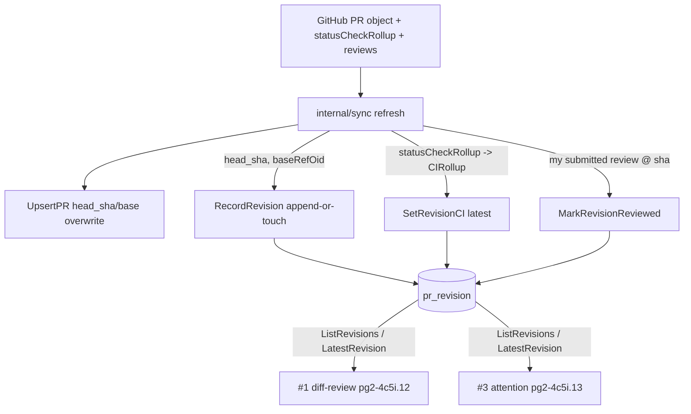

# Design — pg-pr #4: revision table (head-SHA timeline + per-revision CI + did-I-review)

**Bead:** `pg2-4c5i.11` (epic `pg2-4c5i`, pg-pr feedback Phase 2)
**Date:** 2026-06-25
**Status:** Accepted (design)

## Goal

Give pg-pr a per-PR **append-only revision log**: a time-ordered timeline of the
`(head_sha, base_sha)` pairs observed for a PR, each row carrying a compact CI
rollup for that head SHA and a marker recording my own submitted review of it.
This is the **data-layer root** of Phase 2: it is consumed by #1 diff-review
generation (`pg2-4c5i.12`) and #3 mine-vs-teammate attention signals
(`pg2-4c5i.13`), which compare `reviewed_at` SHA vs current head to drive
re-review-after-approval.

This feature **records and exposes** revisions only. The consuming logic (#1, #3)
and any dashboard rendering of the timeline are explicitly out of scope.

## Scope

### In scope (this bead)

- A new `pr_revision` SQLite table (schema migration v2 → v3), child of
  `pull_request` with `ON DELETE CASCADE`.
- A `Revision` model + store API in a new `internal/store/revision.go`:
  `RecordRevision`, `SetRevisionCI`, `MarkRevisionReviewed`, `ListRevisions`,
  `LatestRevision`.
- Sync integration on the existing refresh path: capture `base_sha`
  (`baseRefOid`), append-or-touch a revision, attach the CI rollup, and record my
  submitted review.

### Non-goals (other beads)

- #1 (`pg2-4c5i.12`) draft-review / `internal/reviewstage` orchestration — the
  draft-staged lifecycle stays in #1's domain; `pr_revision` records only my
  **submitted** review.
- #3 (`pg2-4c5i.13`) teammate-attention beads + dashboard signal — consumes
  `ListRevisions` / `LatestRevision`; not built here.
- Dashboard / CLI rendering of the timeline.
- Per-check CI breakdown (a compact rollup is sufficient; the existing
  `ci-failure` `feedback` rows already carry per-check failure detail).

## Design decisions (settled in brainstorm)

1. **Revision identity = `(head_sha, base_sha)`.** A revision is distinguished by
   both the PR head and its base commit, so a base advance under an unchanged head
   (`baseRefOid` moved → effective diff changed) starts a new revision, not just a
   new push.
2. **Append-by-observation timeline.** The table is an append-only log keyed by a
   monotonic `seq` per PR. Re-introducing a previously-seen `(head_sha, base_sha)`
   after a force-push appends a fresh row (honest re-introduction), rather than
   mutating history.
3. **Compact CI rollup + counts.** Each revision stores an overall `ci_state`
   plus `{passed, failed, pending}` counts and a `ci_captured_at`, not a per-check
   table.
4. **Submitted-review marker (focused).** Each revision records `reviewed_at` +
   `my_review_state ∈ {approved, changes-requested, commented}`, set when sync
   observes _my_ submitted GitHub review at that head SHA. Draft-staged state is
   #1's concern and is deliberately not modeled here.

## Schema

Migration is **DDL-only**, added as the next entry in the existing ordered
`migrations[]` mechanism (`internal/store/migrate.go`), bumping `schemaVersion`
2 → 3 under SQLite's `user_version` pragma. It is unrelated to the first-class
data-migrate command in `pg2-1pc6`.

```sql
-- internal/store/migrate.go : migration v2 -> v3
CREATE TABLE pr_revision (
    id              INTEGER PRIMARY KEY,
    pr_id           INTEGER NOT NULL REFERENCES pull_request(id) ON DELETE CASCADE,
    seq             INTEGER NOT NULL,             -- 1,2,3… per PR, monotonic
    head_sha        TEXT NOT NULL,
    base_sha        TEXT,                          -- baseRefOid; NULL until sync captures it
    observed_at     TEXT NOT NULL,                 -- first time this (head,base) was seen
    last_seen_at    TEXT NOT NULL,                 -- most recent sync that saw it as current
    ci_state        TEXT NOT NULL DEFAULT 'none'
                      CHECK (ci_state IN ('none','pending','success','failure','error')),
    ci_passed       INTEGER NOT NULL DEFAULT 0,
    ci_failed       INTEGER NOT NULL DEFAULT 0,
    ci_pending      INTEGER NOT NULL DEFAULT 0,
    ci_captured_at  TEXT,
    reviewed_at     TEXT,                          -- when I submitted a review at this head_sha
    my_review_state TEXT CHECK (my_review_state IS NULL OR
                      my_review_state IN ('approved','changes-requested','commented')),
    UNIQUE (pr_id, seq)
);
CREATE INDEX idx_pr_revision_pr ON pr_revision(pr_id);
```

`feedback.{subject_sha, first_seen_head_sha, is_outdated}` are untouched: those
express feedback-level outdating, while `pr_revision` is the PR-level timeline.
The two are complementary and both remain.

## Append rule (policy)

On each sync refresh of a PR, after `UpsertPR`, the sync layer MUST compute the
PR's current `(head_sha, base_sha)` and compare it to the PR's **latest** revision
(the row with the greatest `seq`):

- It MUST append a new revision (`seq = latest.seq + 1`, `observed_at = last_seen_at = now`)
  when the current pair differs from the latest revision in **either** field, OR
  when the PR has no revisions yet (first observation seeds `seq = 1`).
- It MUST otherwise (pair identical to the latest revision) update only the latest
  revision's `last_seen_at = now`, leaving `observed_at` and `seq` unchanged.
- `RecordRevision` MUST be idempotent within a single sync: calling it twice with
  the same current pair appends at most one row.

`base_sha` MAY be `NULL` (e.g. a REST fallback path that does not surface
`baseRefOid`). When `base_sha` is `NULL` on either side, the comparison MUST fall
back to `head_sha` equality so a missing base never causes spurious appends.

## Store API

A new `internal/store/revision.go` exposes the `Revision` model and these methods
(transaction-aware variants mirror the existing `Tx`-based pattern used by
`UpsertPR`):

```go
// internal/store/revision.go
type Revision struct {
    ID            int64
    PRID          int64
    Seq           int
    HeadSHA       string
    BaseSHA       string // "" when NULL
    ObservedAt    string
    LastSeenAt    string
    CIState       string // none|pending|success|failure|error
    CIPassed      int
    CIFailed      int
    CIPending     int
    CICapturedAt  string // "" when NULL
    ReviewedAt    string // "" when NULL
    MyReviewState string // "" when NULL; else approved|changes-requested|commented
}

// RecordRevision applies the append rule above and returns the resulting latest
// revision and whether a new row was appended.
func (db *DB) RecordRevision(ctx context.Context, prID int64, headSHA, baseSHA string) (Revision, bool, error)

// SetRevisionCI sets the compact CI rollup on a revision (idempotent overwrite).
func (db *DB) SetRevisionCI(ctx context.Context, revisionID int64, r CIRollup) error

// MarkRevisionReviewed records my submitted review at headSHA for a PR, on the
// LATEST (max seq) revision whose head_sha matches — a head SHA can recur across
// revisions after a force-push, and #3 cares about the most recent occurrence. It
// is a no-op (not an error) when no revision matches that head SHA yet.
func (db *DB) MarkRevisionReviewed(ctx context.Context, prID int64, headSHA, state, reviewedAt string) error

// ListRevisions returns a PR's revisions in ascending seq order (for #1/#3).
func (db *DB) ListRevisions(ctx context.Context, prID int64) ([]Revision, error)

// LatestRevision returns the highest-seq revision for a PR, or nil if none.
func (db *DB) LatestRevision(ctx context.Context, prID int64) (*Revision, error)

type CIRollup struct {
    State      string // none|pending|success|failure|error
    Passed     int
    Failed     int
    Pending    int
    CapturedAt string
}
```

## Sync integration

`pr_revision` has a single writer: the sync refresh path (`internal/sync`). Three
touch-points are added, all on the existing per-PR refresh that already runs
`UpsertPR` and fetches `statusCheckRollup`:

1. **Capture `base_sha`** — read `baseRefOid` from the GraphQL PR object (and
   populate best-effort on the REST fallback; `NULL` when unavailable).
2. **Record the revision** — call `RecordRevision(prID, headSHA, baseSHA)` after
   `UpsertPR`, applying the append rule.
3. **Attach CI** — map the existing `statusCheckRollup` for the current head into a
   `CIRollup` and call `SetRevisionCI` on the latest revision (idempotent; CI may
   land or change after the revision first appears).
4. **Record my review** — when sync observes my own submitted GitHub review at a
   SHA, call `MarkRevisionReviewed(prID, sha, state, at)`.

### Data flow



## Migration / backfill

The migration is schema-only. There is **no data backfill**: a migration-time
backfill could not populate per-SHA CI or `base_sha`, so seeding a synthetic
`seq = 1` row would record misleading data. Instead, the **next sync** naturally
seeds `seq = 1` for each PR with a real `base_sha` and CI rollup (the append rule's
"no revisions yet" branch). `ListRevisions` is therefore transiently empty for a
PR until its first post-deploy sync; consumers (#1, #3) MUST tolerate an empty
timeline.

## Testing

Following the existing `store.OpenForTest` (temp DB) and `migrate_test.go`
patterns:

- **Store unit tests** (`internal/store/revision_test.go`): append on head change;
  append on base change (head unchanged); touch `last_seen_at` on identical pair;
  force-push re-introduction appends a fresh `seq`; `base_sha` NULL falls back to
  head-only comparison; `SetRevisionCI` overwrite is idempotent on the latest
  revision; `MarkRevisionReviewed` marks the latest revision matching a head SHA
  (and the recurring-SHA case marks the most recent, not the original) and is a
  no-op when no revision matches; `ListRevisions` ascending order; `LatestRevision` selects max
  `seq`; FK cascade deletes revisions with their PR.
- **Migration test** (`internal/store/migrate_test.go`): v2 → v3 applies, is
  idempotent, leaves existing `pull_request`/`feedback` rows intact, and the new
  table enforces the `ci_state` / `my_review_state` CHECK constraints.
- **Sync wiring tests** (`internal/sync`): a head-change refresh appends a revision
  and attaches CI; `baseRefOid` is captured; an observed submitted review sets the
  marker.

## Risks / open points

- **`baseRefOid` availability on the REST fallback.** If REST cannot surface the
  base SHA cheaply, the fallback path leaves `base_sha` NULL and the append rule
  degrades gracefully to head-only — acceptable, documented above.
- **CI rollup mapping.** The exact mapping from `statusCheckRollup` states to the
  `{none,pending,success,failure,error}` enum + counts is mechanical and is
  pinned in the implementation plan.
