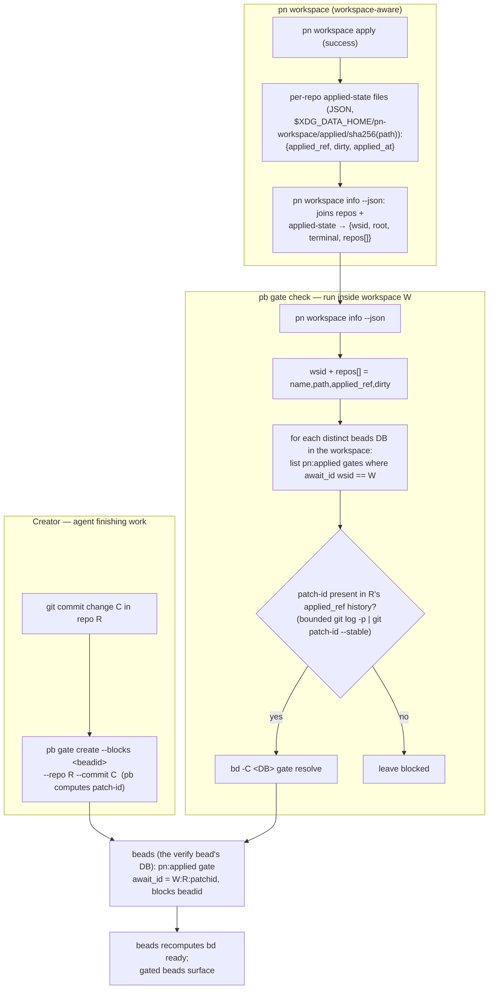
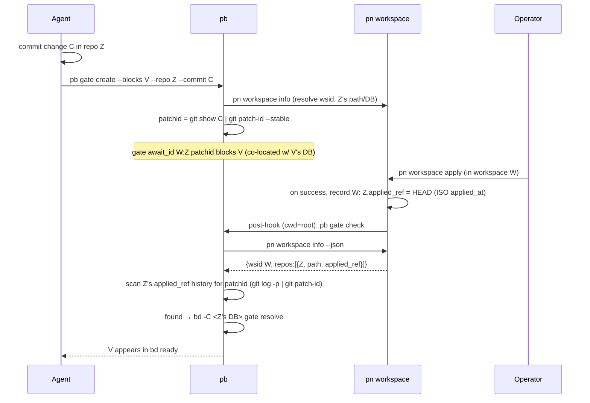

# pn:applied gates — beads gated until a pn workspace applies a change

**Date**: 2026-06-25 (rev. 2026-06-26)
**Bead**: (pending — created during planning)
**Status**: Draft

## Problem

Agents working the `bd ready` queue finish work and create follow-up beads —
canonically "verify code works" — that must **not** become workable until the
change has been **applied** to the running system (here: `pn workspace apply` →
`darwin-rebuild switch`). So `bd ready` drains; the operator applies; the apply
clears the gates; and the gated beads surface for agents to pick up.

"Applied" is per-machine and per-workspace; the same workspace may be checked out
on several computers, each with its own apply state.

## Goals / Non-goals

**Goals**

- A gate: "blocked until workspace `W` has applied change `C` of repo `R`."
- Release keyed to the **change** (its `git patch-id`), so it survives the local
  **rebases** this workflow uses (verified — see PoC), where commit SHAs change
  but the diff does not.
- A **definitive**, success-gated record of what a workspace applied, exposed via
  a stable `pn` API — `pb` never reads `pn`'s files.
- A **pull** model: `pb gate check`, run inside a workspace, resolves that
  workspace's gates with no event/stdin input.
- Work with **any** beads/Dolt topology (0+ servers, 0+ databases) — discovered,
  not configured.
- Failure-safe by construction; contract tests pin the `bd`, `pn`, and `git
patch-id` surfaces against drift.

**Non-goals**

- Surviving a **squash-merge** (it fuses diffs → a new patch-id). Accepted as a
  known loss; falls to stale-handling.
- Concurrent applies of one workspace (single-apply-per-workspace precondition).
- Beads auto-evaluating the gate (`bd gate check` cannot — see below).
- A hand-maintained rig/routing config.

## Key facts this rests on (verified)

1. **A custom gate type is a label, not a checker.** `bd gate create --type=<X>`
   stores `<X>` in `await_type` with no validation and it round-trips in `bd gate
list --json`; but `bd gate check` is a hardcoded switch (`cmd/bd/gate.go:523-535`,
   `default: continue`) with no checker registry or roadmap. So `pn:applied`
   gates are resolved by `pb`, never `bd`.
2. **`gh` gates = ambient context + a live oracle** (`gh run view <id>` with no
   `--repo`, repo inferred from cwd). `pn:applied` mirrors this with an **ambient
   workspace** and a local oracle (`pn workspace info`).
3. **`git patch-id` survives rebase; SHAs don't.** A PoC (`scratchpad/
patchid_spike.sh`, 7/7) confirmed: the patch-id is identical across a clean
   rebase, is found in the applied history, a revert gets a _different_ id, a
   cherry-pick the _same_ id, and line-number shifts are ignored. **Limitations
   (accepted):** an edit **within ~3 lines** of the change (pulled in by a rebase)
   changes its patch-id → a miss (fail-closed); a **squash** loses it; a
   multi-commit change has **one id per commit**. Performance is a non-issue
   (full-history scan of 1500 commits = 0.10s; bounded = 0.02s).

## Architecture



`pn` owns the workspace + apply + applied-state API; `pb` owns beads gates and
consumes `pn`'s API; beads is the **Adapter** turning "gate closed" into "bead
ready".

## The `pn:applied` gate (data shape)

- `await_type = "pn:applied"`.
- `await_id = "<wsid>:<repo>:<patch-id>"` — workspace id, repo key, and the
  change's `git patch-id --stable`. Split on the first two `:` (wsid/repo are
  keys without `:`; patch-id is hex).
- **Recommended: gate on the most recent commit (single).** The recommended way
  to use `pb` — and the **default** when no commit is given — is to gate on the
  **most recent commit** (`--commit HEAD`): one gate, one patch-id, keyed to the
  change's tip. The agent guidance (Component 5) MUST steer toward this.
- **Multi-commit (supported, not recommended).** A range of N commits yields **N
  patch-ids** (one per commit — verified). `pb gate create --commits <range>`
  creates **one gate per commit**, all blocking the same bead; beads ANDs
  blockers, so the bead surfaces only when **ALL** of its commits' patch-ids are
  found in the applied history (not "any"). Under a clean **rebase** each commit's
  patch-id is preserved, so all N gates still resolve; a **squash** that collapses
  the range loses the per-commit ids → those gates miss → stale-handler. Use this
  only when a change's commits may land/apply separately.
- **Baseline + scan range (per gate).** Each gate stores the repo's `applied_ref`
  at creation time as a **baseline** (in gate metadata; **may be empty** if the
  repo had not been applied yet). At check time: if the baseline is set and still
  present in the repo, scan `baseline..applied_ref`; **if the baseline is empty or
  no longer in the repo** (rebased/pruned away), fall back to scanning the **last
  `N` commits** of `applied_ref` (`N` configurable, **default 100**). Full-history
  is unnecessary (PoC: 0.10s/1500 commits) and this bound keeps it tiny.

## Workspace identity

Add a stable, **committed** `[workspace].id` to `pn-workspace.toml` (`name` exists
but is empty/unused; `pn` derives no id today). It must be **machine-invariant**
(same workspace on different machines → same id), so it is a pure pass-through of
one committed source value, never render-generated; `pn` SHOULD warn if the
on-disk id changes between applies. `pn workspace info` surfaces it. Because
`pb gate check` filters gates by `wsid`, two concurrently-checked-out workspaces
sharing a `wsid` would cross-resolve each other's gates — so `wsid` **MUST** be
unique per concurrently-live workspace, and `pn` **MUST fail** (not merely warn)
on a detected duplicate.

**Detection mechanism (must be specified, not assumed):** there is no machine-wide
workspace registry in `pn` today. Add a small one in the data dir — a `wsid →
workspace-root` map written/checked by `pn workspace apply`/`info`; if a `wsid`
resolves to a _different_ root than recorded, `pn` fails. This catches _same-
machine_ duplicates. `wsid` is a **human-readable slug** — `[a-z0-9-]+`
(lowercase, digits, dashes), like a name — _not_ a UUID. **Cross-machine**
uniqueness (the same `wsid` on two machines sharing one Dolt rig) cannot be
detected locally, so it is the **operator's responsibility** to choose a globally
unique slug; `pn` validates the slug _format_ and catches same-machine collisions,
but cannot guarantee cross-machine uniqueness for a human-chosen name.

## Component 1 — `pn` changes (applied-state system-of-record + API)

**Repo:** `phillipg-nix-repo-base` (`modules/pn`).

1. **`[workspace].id`** (above).
2. **Applied-state store — ONE location, the data dir (single source of truth).**
   `pn workspace apply` records each repo's applied state to
   `$XDG_DATA_HOME/pn-workspace/applied/<sha256(repo checkout path)>` as JSON:

   ```json
   {
     "applied_ref": "3e1f4b13…",
     "dirty": false,
     "applied_at": "2026-06-26T14:03:00Z"
   }
   ```

   This **replaces** today's per-repo files at
   `$XDG_STATE_HOME/zn-self-upgrade/apply/applied-hash/<sha256(repoDir)>` (which
   already hold the applied `HEAD`): there is now exactly **one** store, in the
   data dir, authoritative — not a parallel record beside a cache. Kept **keyed by
   repo checkout path** (worktree-correct: each checkout/worktree gets its own
   entry; no `wsid` in the key, so no cross-workspace record collision).
   `applied_ref` = the resolved `HEAD` applied (primary `main`, or a worktree's
   branch tip — the patch-id scan handles both). `applied_at` = ISO 8601 / RFC
   3339 UTC. Written **only on a successful apply**, **atomically**
   (write-temp-then-rename) — mirrors today's `markApplied` (`apply.go:97`,
   reached only after a successful `darwin-rebuild`), so failure-safety is
   inherent.
   - **The rebuild-skip check reads the same store.** `needsRebuild`
     (`updatecache.go`) is repointed at this location, so the rebuild-skip
     optimization and the gate scan share **one** source of truth — no second
     store to drift. (This subsumes the old `zn-self-upgrade` path you flagged;
     the legacy files are retired.)

3. **`pn workspace info [--json]`** — new subcommand. Build it on the **`Status`/
   `topoAlpha`** path (config iteration + per-repo `git`), **not `Discover`** —
   `Discover` unconditionally does a per-repo `nix eval` flake-input fan-out for
   its dep graph, which `info` does not need (and which would make it slow as a
   per-apply post-hook). It **joins** the workspace's configured repos (name +
   path + `wsid`/`root`/`terminal` from `pn-workspace.toml`) with each repo's
   applied-state file (item 2, looked up by `sha256(path)`). Returns `{wsid, root,
terminal, repos: [{name, path, applied_ref, dirty}]}` — note the TOML key is
   `[workspace].id` but the **JSON field is `wsid`** (the name `pb` and the
   `await_id` grammar use); they MUST match. `root` and each `path` are
   **required** — `pb` needs them to find the workspace's beads DBs and to run
   `git`. `--json` is the stable API `pb` consumes.

No JSON-on-stdin hook contract and no `PN_APPLY_STATUS` are needed (pull model +
success-gated record).

## Component 2 — `pb` ("phillip-beads") command group

**Repo:** `phillipgreenii-nix-agent-support` (public, ZR-clean; packaged via the
existing `mkGoApp`). **Runtime deps on `PATH`:** `pn` (info API), `bd` (gates),
`git` (patch-id + history). `pb` is **config-aware via the workspace**, not
hard-wired to a topology: it discovers beads DBs from the workspace's `.beads`
dirs. **All `pb` commands support `--json`** (machine-readable output, mirroring
`bd`), and **`pb gate check` supports `--dry-run`** (report what it _would_
resolve, change nothing — mirroring `bd gate check --dry-run`).

`pb`'s own `--json` schemas (pinned by tests, since the smoke/unit assertions and
the "best-effort report" contract depend on them):

- `pb gate check --json` → `{ "resolved": [<gate-id>…], "would_resolve":
[<gate-id>…] (only under --dry-run), "skipped": [{gate-id, repo, reason}…],
"stale_actions": [{gate-id, action}…] }`; exit non-zero iff `skipped` is
  non-empty.
- `pb gate create --json` → `{ "gates": [{gate-id, await_id, repo, patch-id,
applied_baseline}…] }`.

**Multi-DB generality.** A workspace may map to one shared Dolt server/project
(today's reality: all repos' `.beads` resolve to one `pg2` project on
`127.0.0.1:25252`, even though their `.beads` _paths_ and `issue_prefix` differ)
or to several genuinely separate DBs. `pb` **discovers** the endpoints from `root`

- each repo `path`'s `.beads`, and **dedupes by resolved Dolt identity** —
  `host:port` + database name + `project_id` (from each `.beads/metadata.json` /
  `config.yaml`), **not** the `.beads` path (which differs per repo and would cause
  redundant scans) nor the prefix. With one shared project that dedupes to a single
  scan. Co-location is automatic there and only load-bearing when DBs are genuinely
  separate (a cross-DB `blocks` edge does not hold a bead out of `bd ready` —
  verified). No routing config is authored. The dedupe key MUST be pinned by a
  contract test (see below).

### `pb gate create --blocks <beadid> --repo <repo> [--commit <ish>] [--commits <range>]`

- **`--commit` defaults to `HEAD`** (the most recent commit) when neither
  `--commit` nor `--commits` is given — the recommended single-gate usage.
- Resolves the current workspace via `pn workspace info`; **validates `<repo>`**
  (fails outright if unknown) and reads its `path`, `applied_ref`, + the `wsid`.
- Computes the patch-id(s): `git -C <path> show <ish> | git patch-id --stable`
  (one per commit for a range).
- Creates a `pn:applied` gate per patch-id (`bd gate create --type=pn:applied
--blocks <beadid> --await-id "<wsid>:<repo>:<patch-id>"`), **co-located in the
  same DB as `<beadid>`** (resolve the bead's DB and pass `bd -C`/`--db`) — a
  cross-DB block silently fails to hold, so this is enforced by construction.
- **Stores the baseline:** writes the repo's current `applied_ref` (from `info`)
  into the gate's `metadata.applied_baseline` (via a follow-up `bd update
--metadata`). It **MAY be empty** if the repo has not been applied yet. This is
  the producer for the check-side baseline read.
- A failed create leaves `<beadid>` un-gated but recoverable (re-run).

### `pb gate check [--dry-run] [--strict] [--last-n N] [--stale-handler convert-to-human|close] [--stale-after <dur>] [--json]`

Run **inside a workspace**:

1. `pn workspace info --json` → `{wsid, root, repos:[{name, path, applied_ref,
dirty}]}`. (Errors clearly if not in a workspace.)
2. **Enumerate distinct beads DBs.** For `root` and each repo `path`, find the
   nearest `.beads` by **walking up the parent chain** (like `bd` — the `.beads`
   may live above the repo dir, e.g. at the workspace root), **bounded at the
   workspace `root` — do not ascend above it** (else discovery could resolve a
   foreign `.beads` outside the workspace and, via a matching `wsid` slug,
   cross-resolve). A path with no `.beads` at/below `root` is **skipped**. Dedupe
   by resolved Dolt identity (above). For each distinct DB, `bd -C <dir> gate list
--limit 0 --json`. `pb` **sets `BD_JSON_ENVELOPE=1`** for all `bd` invocations
   and parses the `{schema_version, data:[…]}` envelope — the array-vs-envelope
   shape is controlled by that env var (and flips to envelope-default in bd v2.0),
   so `pb` MUST pin it rather than rely on the ambient default. (`--limit 50`
   default would strand gates.) Keep `await_type == "pn:applied"` **and**
   `await_id` wsid == this workspace's `wsid`.
3. For each gate, parse `await_id` → `(wsid, repo, patch-id)` and read its
   `metadata.applied_baseline`; look up the repo's `path`/`applied_ref` from
   `info`. Repo unknown → **skip and report** (never guess).
4. **Search** for the patch-id in the repo's applied history — one bounded pass.
   If the gate's baseline is set **and is an ancestor of** `applied_ref`
   (`git merge-base --is-ancestor`): scan `baseline..applied_ref`. Else (empty
   baseline, or baseline not an ancestor — diverged/rebased/pruned): scan the
   **last `N`** commits of `applied_ref` (`--last-n`, **default 100**). `git -C
<path> log -p --no-merges <range> | git patch-id --stable`, match all of that
   repo's gate patch-ids against the result set in one go. Present ⇒ (unless
   `--dry-run`) `bd -C <DB> gate resolve <gate>`. With `--dry-run`, report the
   would-resolve set and **change nothing**.
5. **Dirty — lenient by default** (a dirty apply should mostly work): scan
   `applied_ref`'s committed history regardless of `dirty`. `--strict` skips dirty
   repos. Accepted, recorded risk: an uncommitted _revert_ of the gated change
   leaves its commit in history (patch-id found) though the live build lacks it.
6. Best-effort + report: resolve all possible; exit non-zero with the union of
   skipped/undeterminable entries.

**Stale handling** is age-based and path-free (`pb gate gc`, or `--stale-handler`
on check): gates open longer than `--stale-after` are either `convert-to-human`
(**safe default** — relabel `human` → `bd human list`) or `close` (deliberate,
opt-in abandon; not fail-closed). This is the catch-all for the patch-id misses
(squash / within-context rebase) — there is **no `git notes` fallback**. A `timer`
gate MUST NOT auto-resolve these. **`--dry-run` also suppresses the stale-handler:**
it mutates nothing and instead reports the gates it _would_ convert/close.

`--stale-after` takes a **duration string** with **millisecond granularity** and
units up to days: `100ms`, `30s`, `1m`, `3d`. **Default `3d`.** (Go's
`time.ParseDuration` covers `ms`..`h` but **not `d`/days**, so `pb` needs a thin
parser that adds `d` = 24h.) `pb` MUST **reject any value below `1ms`** (zero,
negative, or sub-millisecond like `500us`) with an error — `1ms` is the minimum
resolvable unit. Millisecond granularity is deliberate so the smoke test can
exercise it (create a gate, wait ~1s, create a second, run with
`--stale-after=100ms` → the first is acted on, the second is not).

## Component 3 — Consumer: the apply post-hook

`[hooks.apply].post = pb gate check`. `pn` runs post-hooks via `sh -c` with **cwd
= workspace root** (`RunHooks` → `RunOptions{Dir: workspaceRoot}`), exactly what
`pb gate check` needs. The apply updates the record before the post-hook runs.
Post-hooks **only warn on failure** (`hooks.go`), so a broken `pb gate check`
leaves gates unresolved with a stderr warning — never aborts the apply, and
running on a _failed_ apply is harmless (record unchanged → nothing new resolves).
`pb` must be on the apply environment's `PATH`.

## Verify-bead lifecycle (made explicit)

The gate is generic — it releases a bead "once the change is applied"; "verify
code works" is the motivating case, but it can gate **any** post-deploy work.

- **Who/when:** the agent, when it finishes work needing post-deploy follow-up,
  **after committing** (the patch-id must exist). It creates the follow-up bead
  (acceptance criteria etc.) then `pb gate create` against the change's commit(s).
- **Create/gate window (real ordering requirement for a fleet):** if the bead is
  created workable and then gated, a _concurrent_ agent draining `bd ready` can
  claim it in the gap — "back-to-back" is not enough. So the bead MUST be born
  non-workable: create it **deferred** (or otherwise blocked), attach the gate(s),
  then un-defer; or create the gate's blocker before the bead is made ready. A
  failed gate-create then leaves a deferred (not workable) bead, recoverable.
- **After it unblocks:** the bead appears in `bd ready` as ordinary work; an agent
  picks it up, does the verification, and closes it — or, if verification fails,
  files a follow-up / reopens. The gate governs _when_ it becomes workable, not
  its content or outcome.

## Component 4 — Wiring (machine-specific)

**Repo:** downstream machine-config flake (out of scope here). nix-manage
`pn-workspace.toml` so `[workspace].id` carries the committed source value and
`[hooks.apply].post = pb gate check`.

## Component 5 — `pb` Claude plugin (agent guidance)

**Repo:** `phillipgreenii-nix-agent-support` (its nix-managed plugin/skill
marketplace). The autonomous agents draining `bd ready` won't use `pb` unless
they're told to — so ship a **Claude plugin/skill** that teaches the
verify-bead-lifecycle convention: after finishing work and committing, create the
follow-up bead **deferred**, run `pb gate create --repo <r>` (which defaults to
the **most recent commit** — the recommended single-gate usage) to gate it on the
change being applied, then un-defer; and that gated beads simply surface in `bd
ready` once applied. It MUST **recommend gating on the most recent commit** and
treat `--commits <range>` (multi-gate) as an advanced, rarely-needed option. It
should state the `pb gate create` invocation, the deferred-create ordering (the
fleet-race requirement), and when _not_ to gate. (Skill body loads on-invoke; only its
name+description are always-on — keep guidance in the body. Delivery via the
nix-managed marketplace, per this repo's plugin conventions.)

## Data flow



## Error handling / failure modes

| Situation                                             | Outcome                                                                                                |
| ----------------------------------------------------- | ------------------------------------------------------------------------------------------------------ |
| Apply fails                                           | record unchanged → `pb gate check` resolves nothing new (**inherent**)                                 |
| Apply succeeds but record write fails                 | `pn` returns the error; record absent/partial → gates stay blocked till next apply (**fail-closed**)   |
| Change's patch-id in `applied_ref` history            | **resolved** (survives rebase)                                                                         |
| Squash-merge                                          | patch-id changes → **miss** → stale-handler (accepted)                                                 |
| Rebase edits a line **within ~3 lines** of the change | patch-id changes → **miss** (fail-closed) → stale-handler                                              |
| Dirty working tree                                    | resolved by default (committed history scanned); `--strict` skips. Risk: uncommitted revert (accepted) |
| Multi-commit change                                   | one gate per commit; bead surfaces when **all** resolve                                                |
| Binary-only change                                    | works — binary diffs still get a patch-id (PoC scenario 6)                                             |
| Gate wsid ≠ this workspace / repo unknown             | **skipped** (and reported for unknown repo)                                                            |
| Gate in a separate DB (multi-DB topology)             | **found** — `pb` scans every distinct workspace DB                                                     |
| `pb gate check` itself fails (post-hook)              | warns only; apply not aborted; gates unresolved until re-run                                           |

Bias is fail-closed except the deliberate dirty-lenient default and the opt-in
`--stale-handler close`.

## Contract tests (guard against drift)

Isolated throwaway DB, in CI:

- **`bd` gate surface:** custom `--type=pn:applied` accepted + holds the bead;
  with **`BD_JSON_ENVELOPE=1`** (which `pb` always sets) `gate list --limit 0
--json` returns the `{schema_version, data:[…]}` envelope carrying
  `await_type`/`await_id` (the var controls array-vs-envelope and flips to
  envelope-default in v2.0 — pin the var, don't assume the ambient default);
  `gate check` skips `pn:applied`; `gate resolve` → ready; `dep add` (blocks)
  holds; `--limit 0` returns all; `bd update --metadata` round-trips
  `applied_baseline`; a cross-DB block does **not** hold (the co-location
  invariant). (Pin against the installed `bd` version — note 1.0.5 is also in the
  store; a bump could move the `gate.go` switch or `--limit`.)
- **Multi-DB dedupe key** (the spec mandates this be pinned): two `.beads` dirs
  sharing `host:port` + database + `project_id` (differing only by prefix) dedupe
  to **one** scan and resolve each gate **once**; two with distinct `project_id`s
  → two scans. (Today's reality is the former — all repos → one `pg2` project.)
- **`pn workspace info --json` schema:** pins `wsid`/`root`/`terminal`/
  `repos[].{name,path,applied_ref,dirty}` (JSON field is `wsid`, from TOML `id`);
  `root` + each `path` non-empty.
- **`git patch-id` behavior (deterministic assertions, not notes):** stable across
  a clean rebase; found via the bounded `log -p | patch-id --stable` scan;
  `--stable` ≠ `--verbatim`; a within-3-line-context rebase **deterministically
  MISSES** and a squash **deterministically LOSES** the id (both verified
  deterministic — assert them so a future git change is noticed); a binary change
  **does** yield a patch-id.

## Preconditions & assumptions

1. One apply of a workspace at a time.
2. Stable, committed `wsid` (machine-invariant).
3. Agents commit before gating; rebases are **local** (server-side squash/rebase
   isn't tracked — accepted).
4. Dirty trees tolerated by default (`--strict` to opt out).

## Idempotency

`pb gate check` derives decisions from the record + open gates + the patch-id
scan; re-running (or after a no-op apply) converges.

## Testing strategy

Isolated tests; any beads DB in a temp dir. (`pn` infra: `exec.NewFakeRunner` +
`t.TempDir()` + `t.Setenv` on XDG dirs, per `updatecache_test.go`. `pb` infra: the
isolated-`bd init` pattern from `packages/pg-pr/pkg/beads/mergerequest_test.go`.)

- The contract tests above.
- **`pn` (Go):** `[workspace].id` round-trips in `config_test.go`; record written
  **only on success**, **atomically** (a mid-write fault leaves no torn JSON),
  keyed by **repo checkout path** (worktree vs primary → distinct keys); the JSON
  shape `{applied_ref,dirty,applied_at}` pinned; `needsRebuild` **repointed** at
  the new store still skips correctly (regression); **record-write-fails →
  fail-closed** (write fails after a successful rebuild → `apply` errors AND a
  later scan resolves nothing); `info` built via `topoAlpha` (assert **zero `nix
eval`** subprocesses); duplicate-`wsid` → `pn` **exits non-zero** (MUST-fail),
  on-disk id-drift → warning.
- **`pb` (Go):** `gate create` computes the right patch-id, validates repo
  (fails on unknown), co-locates in the bead's DB, **multi-commit → one gate per
  commit** (bead surfaces only when all resolve), and creates the bead
  **deferred** (the fleet-race test: bead is **never** in `bd ready` during
  create→gate); `gate check` resolves a gate whose patch-id is in the applied
  history, survives a clean rebase end-to-end, multi-DB scan finds a gate in a
  non-cwd DB and **resolves it in that gate's own DB**, dirty lenient vs
  `--strict`, not-in-workspace errors, `>50` gates, **best-effort** (one
  resolvable + one unknown-repo → resolves the one, exits non-zero, lists the
  skip); `--commit` **defaults to HEAD**; **baseline-ancestry** (baseline present
  but not an ancestor of `applied_ref` → falls back to `--last-n`, not a false
  miss); **`--dry-run` mutates nothing** on _both_ the resolve and stale paths
  (assert no `gate resolve`/relabel issued); **`--json` output schemas** pinned
  for `gate check` and `gate create`; **`--stale-after` parser** accepts
  `100ms`/`3d` and **rejects** `0`, `-1s`, `500us`, bare `5`; stale
  `convert-to-human` vs `close` and the `--stale-after` **boundary** (younger left
  alone, older acted on — needs a clock seam).

### Smoke test (reusable harness) — the happy-path user story

An **automated smoke test** exercises the whole user scenario against a real test
workspace + git repos + a real beads/Dolt server. It is split into a reusable
harness so future tools can build on it:

- **`pn` test harness** — stands up an isolated **workspace + git repos** (extend
  the existing `modules/pn/internal/workspace/smoke` harness, which already builds
  isolated workspaces and `file://` bare-remote git repos with no network).
- **`pb` harness** — layers on the `pn` harness and adds an **isolated
  bead/Dolt db/server** (precedent: the isolated-`bd init` pattern in
  `packages/pg-pr/pkg/beads/mergerequest_test.go`). It need not be the only
  consumer — the split exists so other tools can reuse the workspace/git layer.

The smoke test asserts the **happy path only** (errors, mis-ordered steps, and
other failure modes belong to the isolated unit tests):

1. create a change in a git repo (commit);
2. create the verify bead + gate with **`pb gate create`**;
3. assert the verify bead is **blocked** by the gate (absent from `bd ready`);
4. run **`pb gate check` → assert it changes nothing** (no apply yet);
5. run **`pn apply`**;
6. run **`pb gate check`** again;
7. assert the verify bead is now **unblocked** (present in `bd ready`).

A second smoke assertion covers **stale handling with ms precision**: create a
gate, wait ~1s, create a second gate, run with `--stale-after=100ms` → the first
is acted on, the second is not.

## Alternatives considered

- **Gate on the raw commit SHA (rejected).** Breaks under the local rebases this
  workflow uses (SHA changes) — the original Blocker. patch-id fixes it.
- **`git notes` to carry a stable id (fallback, not primary).** Local-only and
  survives local rebase _with_ `notes.rewriteRef` config, and survives a
  within-context rebase that patch-id misses — but needs per-repo config, leaves
  stale copies, and still can't survive a server-side squash. Kept as a documented
  fallback if the patch-id context-window miss proves common.
- **Branch-name gating (superseded).** patch-id subsumes it: the diff is found in
  whatever was applied (main _or_ a worktree branch), with no merge-detection
  heuristic.
- **Single rolling "apply happened" human gate (the simplest alternative).** A
  long-lived gate all beads block on, resolved by a ~10-line post-hook on apply
  success. Delivers the queue-drains-then-surfaces behavior with **no `pb`, no
  record, no patch-id** — but coarse (any apply clears everything) and no
  per-change precision. Chosen against because per-change release is wanted and
  patch-id makes it cheap; this remains the fallback if the machinery proves not
  worth it.
- **`bd batch` / `mol pour` atomic create (rejected).** Neither creates gates;
  gate-after-bead is inherent.

## Component placement

| Component                                                                | Repo                                                    | Why                                      |
| ------------------------------------------------------------------------ | ------------------------------------------------------- | ---------------------------------------- |
| `[workspace].id`, applied-state record, `pn workspace info`              | `phillipg-nix-repo-base` (`modules/pn`)                 | workspace-aware producer + API           |
| `pb gate create` / `pb gate check` (gate logic, patch-id, multi-DB scan) | `phillipgreenii-nix-agent-support`                      | generic beads tool, public, ZR-clean     |
| `pb` Claude plugin/skill (agent guidance)                                | `phillipgreenii-nix-agent-support` (plugin marketplace) | teaches agents the gate-create lifecycle |
| `[workspace].id` value + `[hooks.apply].post = pb gate check`            | `pn-workspace.toml` (committed source value)            | per-workspace, machine-invariant         |

## Packaging & project structure (to repo standards)

`pb` is a Go binary; agent-support's Go binaries do **not** live in
`home/programs/` — that dir holds only thin home-manager option modules. So `pb`
needs **both**, mirroring the closest precedent **`pr-pool`** (which also shells
out to other tools):

- **`packages/pb/`** — the Go module (`cmd/pb/`, `internal/`, `go.mod`, `go.sum`,
  committed `gomod2nix.toml`) + `default.nix` calling **`mkGoApp`** (gomod2nix
  engine; **no `vendorHash`**; per-source-digest versioning, **not** repo
  gitHash). Runtime PATH deps (`pn`, `bd`, `git`) via `wrapProgram $out/bin/pb
--prefix PATH …` (template: `packages/pr-pool/default.nix`). `subPackages = [
"cmd/pb" ]` + `versionPath`. This is _runtime_ PATH wiring, not flake inputs, so
  it does not violate agent-support's "standalone / no external flake deps".
- **`home/programs/pb/default.nix`** — option module under
  `phillipgreenii.programs.pb`, listing the runtime deps in its `mkEnableOption`
  text (template: `home/programs/pr-pool/default.nix`).
- **`flake.nix`** — overlay line (`pb = final.callPackage ./packages/pb { … }`)
  next to `pr-pool`, a `packages.*` re-export, and per-package **gofmt +
  golangci-lint pre-commit hooks** (then `nix run .#install-pre-commit-hooks`).
- **Tests/gates:** `pb` unit tests run in the `mkGoApp` build (`nativeCheckInputs
= [ git ]`); the `bd`/`pn`/`git` **contract tests** use the build-tagged
  pattern (`//go:build contract`, like `ccpool-contract`) so external-binary tests
  don't run in the pure-nix sandbox. `pn workspace info` is a new cobra
  `workspaceInfoCmd` in `modules/pn/internal/cli/workspace.go`. Completion gates
  (both repos): `nix flake check` + `prek/pre-commit run --all-files`, README +
  CLAUDE.md updates.
- The repo-base `pn` change is **parse-and-surface only** for `[workspace].id`
  (extend `WorkspaceSection` + emit via `info`); the _value_ is owned downstream in
  `pn-workspace.toml`, never generated by `pn`.

## ADRs & tracking

This establishes cross-repo conventions → ADRs are warranted (per both repos'
"when to create an ADR"):

- **`phillipg-nix-repo-base` ADR 0012** — the applied-state store move
  (`zn-self-upgrade` → `$XDG_DATA_HOME/pn-workspace/applied/…`, new JSON shape,
  `needsRebuild` repoint) **and** `pn workspace info --json` as a stable consumed
  API.
- **`phillipg-nix-repo-base` ADR-0002 amendment** — `[workspace].id` (ADR-0002
  owns the `[workspace]` schema).
- **`phillipgreenii-nix-agent-support` ADR 0018** — the `pb` tool and the
  `pn:applied` gate contract (`await_id` grammar, multi-DB dedupe key, co-location
  invariant). Cross-link via "See also: <repo> docs/adr/NNNN".
- Track the work in **`bd`** (this repo's mandated tracker) — replace the spec's
  "Bead: pending" with the created id during planning.

## Resolved this round

- **`wsid`** = human-readable slug `[a-z0-9-]+`; `pn` validates format + catches
  same-machine dups via a local registry; cross-machine uniqueness is the
  operator's job. _(Open: `pn workspace init` seeding flow.)_
- **Multi-commit / rebase** = N commits → N patch-ids → N gates, **AND** (bead
  unblocks only when all are applied); clean rebase preserves each, squash loses
  them.
- **Scan bound** = baseline `applied_ref` stored per gate (may be empty); else
  scan last `--last-n` (default 100).
- **Stale** = `--stale-after` duration (`ms`..`d`), **default `3d`**; **no `git
notes`** fallback.
- **DB discovery** = walk up parents for `.beads` (not just the repo dir); skip a
  repo with none; dedupe by resolved Dolt identity.
- **`pb`** = `--json` on all commands; **`--dry-run`** on `gate check`.
- **Commit selection** = default & recommended is the **most recent commit**
  (`--commit HEAD`, single gate); `--commits <range>` is advanced/rare.
- **`--stale-after`** rejects values **below `1ms`**.
- **`pb` Claude plugin** added (Component 5), steering agents to single-commit
  gating.

## Open questions (resolve during planning)

1. **Smoke harness reuse** — how much of the existing `modules/pn/.../smoke`
   harness to extend vs. a fresh harness for the `pb` (bd/Dolt) layer.
2. **ADR numbers + tracking bead** — confirm repo-base 0012 / ADR-0002 amendment
   and agent-support 0018; create the `bd` bead.
