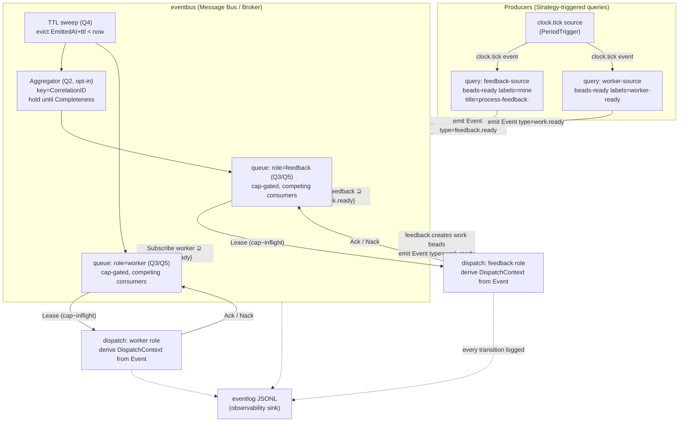
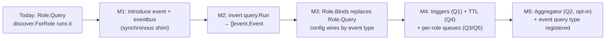

# pr-pool: split role from query via an event model — design

**Status**: Draft (awaiting review; implementation deferred to a later step)
**Date**: 2026-06-25
**Deciders**: Phillip Green II
**Bead**: `pg2-r6cf`

> This is a **design** deliverable, not an implementation. It answers the five open
> design questions recorded on `pg2-r6cf`, names the design patterns in play, gives a
> mermaid event-flow diagram, and lays out a migration path from today's coupled
> design. The executable, task-by-task plan is produced separately (writing-plans)
> once this design is approved.

---

## Context

Today a role **embeds** its discovery query. The coupling is structural and lives in
two places:

- `internal/roles/roles.go` — `Role` has a `Query query.Query` field
  (`roles.go:22`). The role _is_ its query: the built-in `feedback` role carries
  `query.BeadsReady{Labels:["mine"], TitlePrefix:"process-feedback:", …}` and the
  built-in `worker` role carries `query.BeadsReady{Labels:["worker-ready"], …}`
  (`internal/roles/builtin.go:42,53`).
- `internal/discover/discover.go` — `ForRole` runs **one role's query directly**
  (`role.Query.Run(ctx, env)`, `discover.go:61`) and wraps each resulting `item.Item`
  in a `DispatchContext{Role, Item}` (`discover.go:69`). `Discover` iterates the
  ordered `RoleSet` in config order, calling `ForRole` per role (`discover.go:42-56`).

Consequences of the coupling:

- **N queries : 1 role is impossible.** A role responds to exactly the one query
  baked into it. To feed a role from two sources you must define two roles.
- **1 query : N roles is impossible.** Two roles that want the same `bd ready`
  result run that query **twice** (the live 2026-06-09 trace showed `bd ready`
  returning 49 beads scanned redundantly per role).
- **The query is the trigger.** Discovery is a synchronous pull at the top of every
  `DrainOnce` pass (`orchestrator.go:80`); there is no notion of a query _emitting_
  work that a role _reacts_ to. A query that wants to wait for a correlated set of
  conditions has nowhere to express that.

What already exists and is **NOT** an event bus (important — do not over-read the
name): `internal/eventlog` is a JSONL **observability** writer (`eventlog.go:50`
`Emit(level, kind, msg, fields)`), append-only, with no dispatch, subscription, or
delivery semantics. The proposed event model is a **new** dispatch mechanism; the
eventlog remains the observability sink (events flowing through the new model are
_logged_ to it, §Observability).

Direction recorded on the bead: **separate role from query via events**. Queries
emit one-or-more **typed events**; roles **bind** to one-or-more event types and
respond to **any** of their bound events. This decision was deferred out of spec A
(stop-on-done + smoke harness) and spec C (TOML externalization), both of which
explicitly hand the `context`-vs-`event` dispatch-shape decision to **this** bead
(spec A "Out of scope": _"The `context`-vs-`event` shape of a dispatch is decided
there"_; spec C decision 1: _"Defer the `event` query type entirely (→ pg2-r6cf)"_).

This design therefore **owns** two things spec C left open:

1. The `event` query type that spec C's factory registry (`query/factory.go`)
   deliberately did not register.
2. The `run-role` **context-vs-event** distinction (does `run-role` take a
   self-contained event or a runtime-resolved context).

---

## Design patterns in play

Naming the patterns up front, because the rest of the design is an application of
them. Per workspace convention, the design is discussed in pattern terms.

| Pattern                           | Where it applies                                                                                                                                                                                                                                  |
| --------------------------------- | ------------------------------------------------------------------------------------------------------------------------------------------------------------------------------------------------------------------------------------------------- |
| **Producer/Consumer**             | Queries are **producers** of typed events; roles are **consumers**. The two are decoupled by an intermediary (the bus), which is the whole point of the split.                                                                                    |
| **Observer / Publish-Subscribe**  | Roles **subscribe** to event _types_ (not to a specific query). A query publishes an event type; every subscribed role-type is a potential consumer. Topic = event type.                                                                          |
| **Message Bus / Broker**          | The new `eventbus` package is the broker: it owns routing, the **per-role-type queue** topology (Q3), TTL eviction (Q4), and capacity-aware delivery (Q5).                                                                                        |
| **Competing Consumers**           | Within one role-type's queue, the role's _cap_ instances are competing consumers: one event is delivered to exactly **one** worker of that role-type (Q3 grouping).                                                                               |
| **Event Sourcing (bounded)**      | The event log is the source of truth for _what was produced/dispatched/correlated_; the JSONL eventlog already persists this. We adopt the **append + project** idea, not a full replay-the-world store (§"What we deliberately do NOT adopt").   |
| **CQRS (lightweight)**            | The **write** side (queries emit events; bus enqueues) is separated from the **read/decide** side (roles drain queues, capacity gating). Same separation the orchestrator already has between discover and drain.                                 |
| **Aggregator / Correlator (EIP)** | The ALL-style correlation (Q2) is the _Aggregator_ enterprise-integration pattern: collect related events keyed by a **correlation id**, hold them until a **completeness condition** is met, then emit one aggregated event.                     |
| **Saga / Routing Slip**           | The multi-role pipeline (feedback → produces work beads → worker) is a saga: each step emits the event that triggers the next. Today this is implicit in the `worker-ready` label; the event model makes the hand-off a first-class event.        |
| **Factory + Registry**            | Reused verbatim from spec C: event _types_, query _types_, and role _types_ are tagged unions discriminated by a `type` string, decoded by an instance-scoped factory `Registry` (`query/factory.go`). Adding an event type = register a factory. |
| **Strategy**                      | A query's **trigger** (Q1: period-tick vs enough-events) is a pluggable strategy on the query, not a hardcoded loop.                                                                                                                              |
| **Null Object / Nilable seam**    | The bus is threaded as a nilable seam (nil ⇒ synchronous direct-dispatch fallback), mirroring the existing `Log *eventlog.Writer` (`executor.go:37`) and `sessionmeta` seams.                                                                     |

---

## Core model

```go
// internal/event — leaf value package (imports nothing in-repo, like internal/item).
package event

// Event is one typed, self-contained fact emitted by a query (or by another role's
// completion). Type is the topic roles bind to. Payload generalizes item.Item:
// every Event that triggers a unit of work carries the Item to dispatch.
type Event struct {
    ID            string         // unique per emission (dedup key; ULID/stamp)
    Type          string         // the topic — roles subscribe to this (Observer)
    Item          item.Item      // the work payload (id/type/title/metadata)
    CorrelationID string         // groups events for ALL-style aggregation (Q2); "" if none
    Source        string         // emitting query name (provenance / observability)
    EmittedAt     time.Time      // for TTL (Q4) and ordering
    Attributes    map[string]any // extra, type-specific fields for the correlation/trigger strategies
}
```

`Event` **is the self-contained "event"** that spec A asked us to decide. A
`DispatchContext` (today: `{Role, Item}`, `discover.go:20`) is then **derived** from
an `Event` at the moment of delivery to a role — `DispatchContext{Role, Item:
event.Item}`. The resolution of run-time-only fields (worktree dir, self_login,
template vars — spec C §6) still happens at dispatch, on the derived context. See
Q-meta for the explicit context-vs-event resolution.

```go
// internal/eventbus — the broker (Message Bus). New package.
package eventbus

type Bus interface {
    // Publish enqueues an event onto every subscribed role-type's queue (Q3).
    Publish(ctx context.Context, e event.Event) error
    // Subscribe registers a role-type as a consumer of an event type (Observer).
    Subscribe(roleType string, eventType string)
    // Lease pulls up to n ready events for a role-type, respecting capacity (Q5)
    // and TTL (Q4). Returned events are leased, not deleted, until Ack/Nack.
    Lease(ctx context.Context, roleType string, n int) ([]event.Event, error)
    Ack(ctx context.Context, roleType string, eventID string) error
    Nack(ctx context.Context, roleType string, eventID string) error // re-queue / drop
}
```

```go
// internal/roles — Role loses its Query field; gains Binds.
type Role struct {
    Name    string
    Type    string
    Cap     int
    Enabled bool
    Binds   []string       // event TYPES this role consumes (replaces Query) — Observer subscription
    CCPool  *CCPoolConfig
    Command *CommandConfig
}

// A query becomes a producer that emits typed events instead of returning items inline.
type Query interface {
    Validate() error
    // Emits returns the event type(s) this query produces (for wiring + validation).
    Emits() []string
    // Trigger is the query's firing strategy (Q1) — Strategy pattern.
    Trigger() Trigger
    // Run produces zero or more events for the bus to publish.
    Run(ctx context.Context, env Env) ([]event.Event, error)
}
```

The critical inversion: `Run` returns **`[]event.Event`** (was `[]item.Item`), and a
role names the **event types it binds to** (`Binds`) instead of owning a query. A
query and a role are now wired **only** through a shared event-type string in config
— exactly the producer/consumer decoupling the bead asked for.

---

## The five open design questions — resolved

### Q1 — Query triggers: fixed period vs "enough-events"? Is a period tick itself an event?

**Resolved: triggers are a per-query pluggable Strategy; the period tick IS an
internal event (a "clock tick" event type); both period and enough-events are
first-class trigger strategies.**

A query's firing is decoupled from the drain loop via a `Trigger` strategy:

```go
type Trigger interface{ kind() }                  // sealed union (Strategy)
type PeriodTrigger    struct{ Every time.Duration } // fire on each tick
type ThresholdTrigger struct{ Binds []string; Count int } // fire when >=Count of Binds queued
type ManualTrigger    struct{}                      // fire only on run-query / run-role (smoke)
```

- **The period tick is itself an event** (decision: _yes_). A single internal
  `clock.tick` event type is published by a monotonic ticker; a `PeriodTrigger`
  query is just a role-less consumer of `clock.tick`. This is uniform with the rest
  of the model (everything is an event) and means the **drain pass** becomes the
  reaction to a `clock.tick` — i.e. today's "run discovery every PollInterval"
  (`config.go` `PollInterval`) is re-expressed as "a `clock.tick` every
  `PollInterval` triggers the period-driven queries." No special-case loop.
- **`ThresholdTrigger` ("enough-events")** lets a query fire when its upstream
  has produced enough events to be worth running, instead of on a fixed cadence.
  This is the producer/consumer back-pressure case (e.g. "only re-run the worker
  discovery once feedback has produced ≥1 work bead").
- **`ManualTrigger`** preserves the spec-A smoke harness: `run-query`/`run-role`
  fire a query/role **once**, out of band, regardless of cadence.

**Default for the existing roles:** `PeriodTrigger{Every: PollInterval}`, which
reproduces today's once-per-pass pull behavior exactly. The threshold and
event-driven triggers are _additive_ — built but not used by the two built-in roles
until config opts in.

**Why a tick-as-event (vs a hardcoded period loop):** uniformity. With the tick as
an event, the bus has one delivery mechanism, the orchestrator has one loop (drain
the bus), and a future "fire on external webhook" trigger is just another event
source — no new control-flow path. Rejected alternative: keep the drain's
`PollInterval` loop and bolt triggers on as a side-channel (two firing mechanisms to
reason about; the bead explicitly asks whether the tick should be an event, and the
answer that keeps the model coherent is yes).

### Q2 — ALL-style correlation (queries that must wait for multiple events): in scope, and what mechanism?

**Resolved: in scope as an OPT-IN Aggregator (EIP) keyed by `CorrelationID`, with an
explicit completeness condition and a TTL-bounded wait; NOT the default. The two
built-in roles use the simple ANY path and never touch the correlator.**

The bead flags that ALL-style queries "add queue + correlation complexity." The
resolution scopes that complexity behind a strategy so the common case stays simple:

- **ANY (default):** a role responds to _any_ one of its bound event types
  (`Binds`). One event in ⇒ one dispatch. This is the producer/consumer + competing
  consumers path; no correlation state. Both built-in roles use this.
- **ALL (opt-in, Aggregator pattern):** a role (or a derived "aggregating query")
  declares it needs a **set** of correlated events before it fires. Mechanism:
  - Events carry a `CorrelationID` (e.g. the parent PR bead id, which already glues
    feedback→work→worker in `roles/builtin.go`'s prompts).
  - The bus routes correlated events into a **pending-aggregate** holding area keyed
    by `(roleType, correlationID)`.
  - A **completeness condition** — declared in config — decides when the aggregate
    is "done": `all-of [eventTypeA, eventTypeB]`, or `count >= N`, or `quorum`.
  - When complete, the bus emits **one** aggregated `Event` (Item = the correlation
    target) to the role-type's main queue, and the role dispatches once.
  - **Incomplete aggregates expire via TTL (Q4)** — a half-collected aggregate that
    never completes is evicted and logged, so a missing sibling event can never wedge
    a queue forever.

```go
type Completeness interface{ complete(have []event.Event) bool }
type AllOf struct{ Types []string }   // all listed event types present for this correlation id
type CountOf struct{ N int }          // >= N events for this correlation id
```

**Why opt-in, not default:** the bead calls correlation "complexity" and asks
whether it is in scope. It is in scope **as a capability** (the saga/pipeline use
case is real), but forcing every role through a correlator would tax the 99% ANY
case with state it does not need. The Aggregator is a separate, registered strategy;
a role that does not declare a `correlation` block never allocates aggregate state.
Rejected alternative: make every dispatch correlation-aware (uniform but pays the
complexity tax everywhere; contradicts the bead's instinct that this is the costly
path to isolate).

### Q3 — Event grouping: how is a single event delivered to only ONE consumer per group? Confirm or replace "role-type as the group ⇒ per-role-type queues."

**Resolved: CONFIRMED. The group key is the role-type; the topology is one queue per
role-type; within that queue the role's `cap` instances are Competing Consumers, so
each event is leased to exactly one consumer of that role-type.**

This is the bead's candidate and it is the right one, for a concrete reason grounded
in the code: **capacity and busy-handling are per-role (`Role.Cap`,
`roles.go:21`), not per-event-type.** A `worker` role with `cap=1`
(`config.go` `MaxWorker`) can run one dispatch at a time regardless of how many event
types feed it. So the unit that must be capacity-gated, and therefore the unit a
queue must be scoped to, is the **role-type** — which is exactly Q5's conclusion (the
two questions are the same conclusion seen from two sides).

- **Publish fan-out (Observer):** one event of type `T` is enqueued onto the queue of
  **every** role-type subscribed to `T`. (Type `T` → roles `A` and `B` both get a
  copy — this is the 1-query:N-roles case the coupling forbids today.)
- **Within a role-type's queue (Competing Consumers):** the `cap` running instances
  of that role-type compete; a `Lease` hands an event to exactly one instance and
  marks it leased so no sibling instance double-dispatches it. This is "delivered to
  only ONE consumer per group."
- **De-dup across passes:** the leased event's `Event.ID` plus the existing
  per-attempt `external_id` uniqueness (ADR 0015 — `roles.go:48` mints a unique
  external_id per attempt) guarantee a single event yields a single dispatch even if
  the same underlying work re-surfaces in a later query run. (`beads-ready` is
  idempotent: the same ready bead re-appears every pass; the bus must dedup by
  `Event.ID` derived from a stable `(eventType, item.ID)` fingerprint so a still-ready
  bead does not get re-enqueued while its dispatch is in flight or leased.)

**Confirmed, with one refinement:** the queue is keyed by **role-_type_** (`ccpool` /
`command`) per the bead's wording, but in practice pr-pool's caps are per-role-_name_
(`feedback` cap 1, `worker` cap 1 are distinct), and `drain` already filters by
`d.Role.Name` (`orchestrator.go:127`). So the implementable group key is the
**role name** (a finer grain than role-type), which still satisfies "one consumer per
group" and matches the existing per-name cap accounting. The bead's "role-type as
group" is confirmed in spirit; the concrete key is the role name. Rejected
alternative: per-event-type queues (the bead's stated non-choice) — they cannot
express per-role capacity, would need a join back to roles to gate dispatch, and
break the moment two role-types share an event type.

### Q4 — Event TTL: do events expire, and how?

**Resolved: YES. Every event has a TTL; the bus evicts expired events on each drain
tick (lazy sweep) and refuses to lease an expired event; expiry is logged to the
eventlog. Default TTL is derived from `MaxWait` so a stale event cannot outlive the
window in which its dispatch could have mattered.**

- **TTL source:** `event.EmittedAt + ttl`. `ttl` is, in precedence order: a per-event
  type config value → a pool default (`[pool].event_ttl`) → a built-in default of
  `MaxWait` (`config.go` `MaxWait`, default 30m). Rationale for the `MaxWait` tie: a
  dispatch that cannot complete within `MaxWait` is already abandoned by the wait loop
  (spec A stop-on-done); an event older than that describes work whose freshness can
  no longer be trusted (a `beads-ready` bead may have been claimed/closed by someone
  else in the interim — re-query, do not dispatch stale).
- **Eviction:** lazy, on the drain tick. The bus does **not** run a background reaper
  thread (pr-pool's drain is a single-shot pass — `DrainOnce` — not a long-lived
  daemon; a sweeper on each `Lease`/`Publish` is sufficient and keeps the model
  thread-simple). An expired event is dropped and **logged** (`eventlog.Emit(level,
"event_expired", …)`) so silent loss is visible.
- **Incomplete aggregates (Q2):** the **aggregate** carries its own TTL on the
  oldest member; an aggregate that never completes within its TTL is evicted whole
  and logged (`event_aggregate_expired`), so a missing sibling cannot wedge the
  correlator.
- **Re-emission, not resurrection:** an expired `beads-ready` event is simply
  re-emitted on the next period tick if the bead is still ready — TTL bounds
  _staleness_, it does not lose _durable_ work, because the durable source of truth
  is the bead store, not the queue. (This is why bounded event sourcing, not full
  event sourcing, is the right altitude — see below.)

### Q5 — Per-role capacity / busy handling: confirm per-role queues (not per-event queues).

**Resolved: CONFIRMED — per-role(-name) queues, capacity-gated by `Role.Cap`. This is
the same conclusion as Q3 viewed from the capacity side, and it is what drives the
queue topology.**

- **Capacity gate:** `Lease(roleType, n)` returns at most `n = Cap − inflight` events.
  `inflight` is the count of leased-but-not-Acked events for that role. With
  `worker.cap = 1`, at most one worker event is leased at a time; the rest wait in the
  queue. This replaces today's _local counter_ in `drain` (`worked >= role.Cap`,
  `orchestrator.go:130`) with a queue-backed capacity gate — the same semantics, now
  durable across the pass instead of recomputed each pass.
- **Busy handling:** an event that cannot be leased (role at cap) **stays queued**
  (subject to TTL, Q4); it is not dropped and does not block other role-types (each
  has its own queue). This is precisely why per-**event** queues fail: a single
  event-type queue feeding two capacity-distinct roles cannot express "worker is busy
  but feedback is free" — the per-role queue can.
- **Relationship to session metadata (`pg2-5o5i`):** `inflight` can be computed from
  the live ccpool session metadata (`prpool.role` + `prpool.bead`,
  `2026-06-24-session-metadata-at-dispatch-design.md`) rather than an in-process
  counter, making the capacity gate robust across crashes — a worktree-isolated bead
  whose pr-pool process died still counts against cap until its session is reaped.
  (Captured as an integration point, not required for the first cut.)

### Q-meta — Is this architecture pursued, on what timeline, and is dispatch a context or an event?

- **Pursued:** YES (bead decision 2026-06-25 with user: _"PURSUE NOW — start the
  event-model design cycle."_). This document is that cycle's output.
- **Timeline:** no time estimate (per workspace rule). Effort sizing **XL** —
  introduces two new packages (`event`, `eventbus`), inverts `query.Run`'s return
  type, removes `Role.Query`, and re-expresses the drain loop. Staged migration below
  keeps each step shippable.
- **Context-vs-event (the decision spec A delegated here):** **the EVENT is the
  self-contained, persisted, transportable fact; the CONTEXT is the run-time-resolved
  derivation handed to the executor.** A query emits a self-contained `event.Event`
  (carrying the `item.Item`); the bus stores/transports _events_; at the moment of
  delivery to a role, the bus derives a `DispatchContext` by combining the event's
  `Item` with the resolved-at-dispatch fields (worktree dir, self*login, rendered
  template vars per spec C §6). So: **events cross the bus; contexts are ephemeral and
  built at dispatch.** `run-role` therefore accepts an **event** (self-contained — it
  can be reconstructed/replayed) and internally derives the context; `run-query`
  \_produces* events. This finalizes spec A's open question.

---

## Event flow (mermaid)



The dashed feedback→`work.ready`→bus edge is the **Saga** hand-off: the feedback
role's dispatch produces work beads and emits `work.ready`, which the worker role is
subscribed to — the `worker-ready` label coupling in today's
`roles/builtin.go:53` becomes a first-class event hop. (Today this is implicit: the
feedback prompt labels a bead `worker-ready` and the worker's query later finds it.
Under the event model it is an explicit emitted event, while the label remains the
durable backing fact.)

---

## What we deliberately do NOT adopt

- **Full event sourcing / event store as system of record.** The **bead store is the
  durable source of truth**; events are a _transport_ and _trigger_ layer over it.
  An expired or lost event is re-derived by re-running the query against the still-
  durable bead state (Q4 "re-emission, not resurrection"). Adopting a full
  replay-the-world event store would duplicate the bead store's job. We adopt the
  _append + project + correlate_ ideas, bounded to in-pass transport.
- **A long-lived daemon / background broker thread.** `pr-pool drain` is a
  single-shot pass (`DrainOnce`); the bus lives for the pass. The tick-as-event (Q1)
  means a _future_ daemon mode is additive (a long-running tick source), but this
  design does not introduce one. Lazy TTL sweep (Q4) keeps it thread-simple.
- **At-least-once cross-process durability.** Within a pass the bus is in-process;
  durability across crashes is provided by the bead store + ccpool session metadata
  (Q5), not by persisting the queue. A persisted queue is a possible later step, not
  this design.

---

## Migration path (from today's coupled design)

Staged so each step is independently shippable and reversible, mirroring spec C's
Phase-1/Phase-2 discipline. **Prerequisite:** spec C (TOML typed-union roles/queries,
`pg2-kplb`) and spec A (DispatchContext, smoke harness) — both already shaped/landed.



- **M1 — Introduce `event` + `eventbus` as a pass-through shim (no behavior change).**
  Add the `internal/event` leaf package and `internal/eventbus` with a trivial
  synchronous implementation: `Publish` immediately enqueues, `Lease` drains FIFO with
  the existing per-name cap counter. `discover.Discover` is rewritten to: run each
  query (still returning items in M1), wrap items as events, `Publish`, then the
  orchestrator `Lease`s per role and dispatches exactly as `drain` does today. Net
  behavior identical; the bus is a nilable seam (nil ⇒ today's direct path), so the
  change is a no-op until wired. **Tests:** golden parity against today's drain order.

- **M2 — Invert `query.Run` to return `[]event.Event`.** Change the `Query` interface
  (`query/query.go:35`) so `Run` emits events instead of items; `beads-ready`/`beads-
list`/`command` each wrap their `item.Item`s into `Event{Type: q.Emits()[0], Item:
it}`. The event type for the built-ins is derived from the role name during the
  transition (`feedback.ready`, `work.ready`). **Still 1:1 query:role** at this step.
  **Tests:** each query type emits the right event type + payload; error propagation
  (`pg2-qq9v`) preserved.

- **M3 — Replace `Role.Query` with `Role.Binds` and wire via config.** Remove the
  `Query` field from `Role` (`roles.go:22`); add `Binds []string`. Queries become
  top-level config entries (`[[query]]`) with their own `name` + `emits`; roles
  declare `binds = ["feedback.ready"]`. The built-in `RoleSet` + a built-in
  `QuerySet` reproduce today's pairing (feedback query emits `feedback.ready`, feedback
  role binds it). **This is the actual decoupling** — after M3, N:M query:role is
  expressible. `config.Validate` gains a check that every `binds` type is `emits` by
  some query and vice-versa (no orphan producers/consumers). **Tests:** decode N:M
  config; orphan-bind / orphan-emit validation errors; built-in parity golden.

- **M4 — Triggers (Q1), TTL (Q4), per-role queues (Q3/Q5).** Replace the FIFO shim
  with the real per-role(-name) queue topology, the capacity gate (`Cap − inflight`),
  the TTL sweep, and the `Trigger` strategies. The `clock.tick` source replaces the
  drain's implicit `PollInterval` pull. Built-ins default to
  `PeriodTrigger{PollInterval}` ⇒ behavior unchanged. **Tests:** cap-gating (one
  worker leased at a time); TTL eviction + log; threshold trigger fires on count;
  period tick drives a pass.

- **M5 — Aggregator (Q2) + register the `event` query type.** Add the opt-in
  `Completeness`/correlation path and register the spec-C-deferred `event` query type
  in the factory registry (`query/factory.go`) — a query that _consumes_ events and
  emits an aggregated event (the saga/pipeline hop made explicit). **Tests:** AllOf /
  CountOf completeness; incomplete aggregate expires (Q4); correlation isolation
  (two correlation ids do not cross-contaminate).

**Rollback posture:** M1–M3 each keep the nilable-seam fallback, so any step can ship
disabled and be reverted by config. The risky behavior change is M4 (the loop
inversion); it is gated behind the same golden + parity tests spec A/C established
(`orchestrator/golden_test.go`).

---

## Observability

Every bus transition (publish, lease, ack/nack, expire, aggregate-complete,
aggregate-expire) is emitted to the existing `internal/eventlog` JSONL writer
(`eventlog.Emit(level, kind, msg, fields)`) with a stable `kind` per transition. The
eventlog stays a pure observability sink — it does **not** become the bus. This gives
an operator a replayable trace of why each dispatch happened (which event, which
trigger, which correlation) without adding a second logging mechanism.

---

## Open items for the implementation plan (not decided here)

- Exact `Event.ID` fingerprint function for `beads-ready` dedup (stable across passes
  while a bead remains ready) — candidate: `hash(eventType + item.ID + claim-state)`.
- Whether `inflight` reads from in-process state or live ccpool session metadata
  (`pg2-5o5i`) in the first cut (Q5 integration point — captured, deferred).
- Whether the `clock.tick` source is a goroutine ticker or a synchronous per-pass
  injection in the single-shot `DrainOnce` model (leans synchronous for M4).
- Config surface (`[[query]]` table shape, `binds`/`emits`/`trigger`/`correlation`
  keys) — to be specified in spec-C's TOML grammar style when M3 is planned.

## Related decisions

- Spec A — `docs/superpowers/specs/2026-06-15-pr-pool-stop-on-done-and-role-smoke-harness-design.md`
  (delegated the context-vs-event decision here; DispatchContext growth point).
- Spec C — `docs/superpowers/specs/2026-06-16-pr-pool-externalize-roles-prompts-queries-toml-design.md`
  (typed-union role/query factory registry; deferred the `event` query type here).
- Work triaging — `docs/superpowers/specs/2026-06-09-pr-pool-work-triaging-design.md`
  (the feedback→work→worker saga this model makes explicit).
- Session metadata — `docs/superpowers/specs/2026-06-24-session-metadata-at-dispatch-design.md`
  (the `inflight`/capacity integration point, Q5).
- ADR 0015 (per-attempt `external_id` / resumability — the dedup anchor, Q3);
  `pg2-qq9v` (propagate query errors, never swallow as "no work" — preserved through
  M2); `pg2-c1vp` (single-terminal race — untouched by this layer; the bus feeds the
  existing executor).
