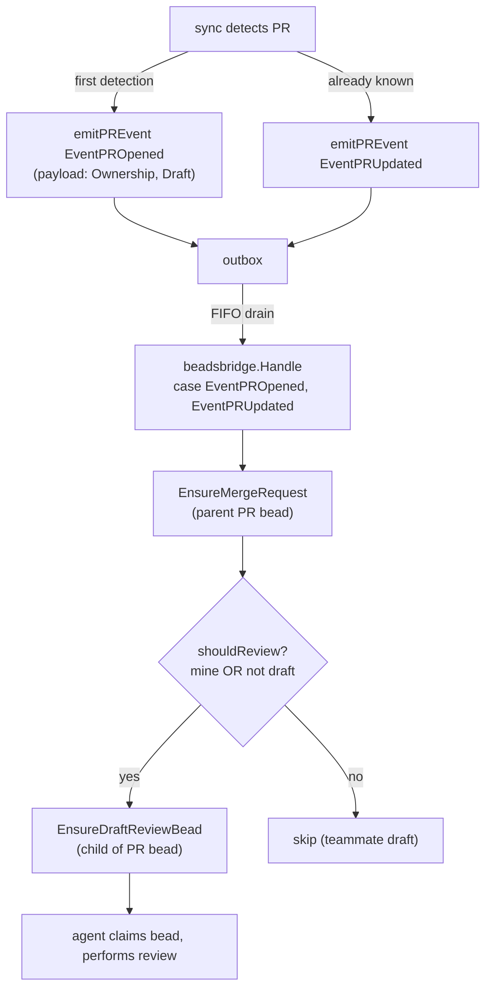

# pg-pr draft-review bead — Design

**Status**: Draft
**Date**: 2026-06-29
**Deciders**: Phillip Green II
**Bead**: `pg2-4c5i.12` (pg-pr #1: diff-review generation)
**Epic**: `pg2-4c5i` (pg-pr feedback Phase 2)
**Source spec**: `docs/superpowers/specs/2026-06-23-pg-pr-feedback-phase2-prompt.md` (item 1)
**Roadmap**: `docs/superpowers/plans/2026-06-23-pg-pr-feedback-phase2-roadmap.md`

## Context

Phase 2 item #1 ("diff-review generation") originally bundled three concerns:
agents reviewing a PR diff, producing a draft review, and routing that review to
GitHub (teammate PRs → staged pending review) or an internal merge loop (my
PRs). On review, the scope of **this** bead (`pg2-4c5i.12`) is deliberately
narrowed to the **first** concern only:

> pg-pr's responsibility is to sync GitHub state into its local store. When it
> detects a new PR, it MUST create a bead that represents "review this PR," and
> then stop. An agent picks up that bead and performs the review. Applying the
> resulting review back to the PR on GitHub (as a draft) is a later, not-yet-
> designed concern.

The two output-routing concerns are split into their own beads (see
[Out of Scope](#out-of-scope)).

### Foundation already on `main`

- **emit → bridge projection (`#5`, `pg2-4c5i.9`)**: `internal/sync` emits
  `pr.opened` / `pr.updated` / `pr.closed` / `pr.merged` into a transactional
  outbox; `internal/beadsbridge` is the **sole writer** of the merge-request
  (PR) bead, projecting it from those events (`bridge.go`).
- **PR lifecycle events** carry a `store.PRPayload` that already includes
  `Ownership` (`mine` / `team`) and `Draft` (`internal/sync/prevents.go:33-38`).
- **`pr.opened` fires exactly once per PR, on first detection**: `sync.go:429-432`
  selects `EventPROpened` only when the PR was not already in the store
  (`repoPreExisting`); the on-demand refresh path makes the same decision via a
  `store.GetPR` existence check (`refresh.go` / `sync.go:1157-1163`). Subsequent
  observations emit `pr.updated`.
- **Enrichment (`#2`, `pg2-4c5i.10`)** and the **revision table (`#4`,
  `pg2-4c5i.11`)** are merged but are **not** consumed by this bead (see
  [Non-dependencies](#non-dependencies)).
- **Draft staging primitives** (`internal/reviewstage`, `pg-pr review
draft/post/submit`) already exist and are **not** touched by this bead; they
  belong to the deferred output-routing work.

## Decision

When `beadsbridge` projects the merge-request (PR) bead from a `pr.opened` /
`pr.updated` event, it MUST also ensure a child **`draft-review` bead** under
that PR bead, gated by an ownership/draft rule. pg-pr's responsibility ends at
bead creation.

### Trigger and gating rule

The bridge MUST ensure the `draft-review` bead in the **same handler branch**
that already handles `store.EventPROpened` and `store.EventPRUpdated`, after
`EnsureMergeRequest` has ensured the parent PR bead. The bead MUST be ensured
when, and only when:

```text
shouldReview := payload.Ownership == "mine" || !payload.Draft
```

| Ownership | GitHub draft? | `draft-review` bead created?  | Event that creates it            |
| --------- | ------------- | ----------------------------- | -------------------------------- |
| `mine`    | yes or no     | **MUST** create               | `pr.opened`                      |
| `team`    | no (ready)    | **MUST** create               | `pr.opened`                      |
| `team`    | yes (draft)   | **MUST NOT** create (wait)    | —                                |
| `team`    | draft → ready | **MUST** create on transition | `pr.updated` (flips `Draft` off) |

Because the rule is evaluated on every `pr.opened` / `pr.updated`, a teammate PR
that starts as a draft naturally gets its `draft-review` bead on the
`pr.updated` that removes the draft flag — no separate watcher is required. My
own PRs are reviewed even while still in draft.

### Mechanism (chosen: project inside the existing PR-lifecycle handler)



The `BeadClient` interface (`internal/beadsbridge`) gains one method:

```go
// EnsureDraftReviewBead ensures exactly one open draft-review bead exists as a
// child of the PR (merge-request) bead identified by repo+number. It is
// idempotent on re-delivery and MUST NOT resurrect a closed draft-review bead.
EnsureDraftReviewBead(ctx context.Context, repo string, number int, fields DraftReviewFields) (id string, alreadyClosed bool, err error)
```

`DraftReviewFields` carries the data the agent needs to start: `HeadSHA`,
`Ownership`, and a human-facing title (e.g. `Review PR #<n>: <title>`).

### Bead shape and lifecycle

- **Type / parentage**: a distinct work item that is a **child of the
  merge-request (PR) bead** — separate from the existing _processing-cycle_
  (feedback) bead, which represents different work.
- **Idempotency**: at most one **open** `draft-review` bead per PR. Re-fired
  `pr.opened` / `pr.updated` events (e.g. after a store rebuild, or every poll
  tick for a ready teammate PR) MUST be no-ops when an open bead already exists.
  This mirrors `EnsureMergeRequest`'s upsert-by-(repo, number) contract.
- **No resurrection**: if the `draft-review` bead has been closed (review done),
  a later `pr.opened` / `pr.updated` MUST NOT recreate it — the same closed-bead
  guard the merge-request bead uses (`alreadyClosed`).
- **Cascade close**: when the PR bead is closed or merged (`pr.closed` /
  `pr.merged` → `cascadeClose`), any open `draft-review` child MUST be closed
  too. The implementation MUST verify `ListChildrenOfPR` enumerates the new bead
  type so `cascadeClose` covers it.
- **Ordering invariant preserved**: the parent PR bead is ensured before the
  child within the single handler invocation, so the existing
  parent-before-child guarantee holds without relying on outbox ordering between
  two events.

### Non-dependencies

This bead does **not** consume the revision table (`#4`) or enrichment (`#2`):

- **No re-review-on-new-revision**: creating a fresh review obligation when a new
  head SHA lands after a review is the concern of `#3` (`pg2-4c5i.13`, teammate
  attention signals), which keys off `reviewed_at_sha` vs `head_sha`. This bead
  is purely `pr.opened`/`pr.updated`-driven.
- **No reviewer-agent selection from enrichment**: which reviewer agents run is
  an agent-layer concern handled when the bead is picked up, not at emission
  time. (If selection later proves better computed deterministically in Go, that
  is an additive change to `DraftReviewFields`, not a precondition here.)

## Out of Scope

Captured as new beads, both **children of epic `pg2-4c5i`** and **blocked by
`pg2-4c5i.12`** (they need the `draft-review` bead to exist):

1. **`pg2-4c5i.34` (H1) — handle review output for _my_ PRs**: review findings
   feed the internal merge loop; not posted to GitHub.
2. **`pg2-4c5i.35` (H2) — handle review output for _teammate_ PRs**: apply the
   review to the GitHub PR as a draft / pending review for the human to submit
   (builds on the existing `internal/reviewstage` + `pg-pr review post`
   primitives). Related to `pg2-4c5i.13` (teammate attention signal), but
   distinct: this is the review-_application_ path, not the attention bead.

Also out of scope here: defining the agent/skill workflow that _consumes_ the
`draft-review` bead and produces the review itself.

## Testing

Bridge-level tests in `internal/beadsbridge`, mirroring the existing
merge-request bead tests:

- `pr.opened` for a `mine` PR (draft or not) → exactly one `draft-review` bead.
- `pr.opened` for a `team` **draft** PR → **no** `draft-review` bead; a
  subsequent `pr.updated` with `Draft=false` → exactly one bead.
- Re-delivery of the same event → still one bead (idempotent).
- Closed `draft-review` bead is **not** resurrected by a later event.
- `pr.closed` / `pr.merged` → open `draft-review` child is closed by
  `cascadeClose`.
- No `draft-review` bead is created under an already-closed PR bead.

## Alternatives Considered

### Dedicated `draft-review.created` event

Emit a separate event type from `internal/sync` after the PR row is upserted,
with its own bridge handler. Rejected: the trigger is identically "PR detected"
(`pr.opened`) plus the draft→ready transition (`pr.updated`), both of which the
existing PR-lifecycle handler already receives. A new event type, emission site,
and handler add surface area with no behavioral gain, and would require
re-establishing the parent-before-child ordering across two events rather than
within one handler.

### Thick-Go orchestration (pg-pr runs the review)

Have pg-pr's Go binary select and run reviewer agents itself (extending the
`zr-agent` shell-out used for PR descriptions), staging the draft directly.
Rejected: it diverges from the established model where review agents run via
Claude Code's Task tool, buries fan-out inside a subprocess, and contradicts the
narrowed scope ("pg-pr stops at bead creation").

## Related Decisions

- `pg2-4c5i.9` (`#5`) — beadsbridge PR-lifecycle event ownership: established the
  emit → bridge projection pattern this bead extends.
- `pg2-4c5i.13` (`#3`) — owns re-review-after-approval and teammate attention
  signals; intentionally not handled here.
- `pg2-4c5i.10` (`#2`), `pg2-4c5i.11` (`#4`) — merged foundation, not consumed by
  this bead (see Non-dependencies).
