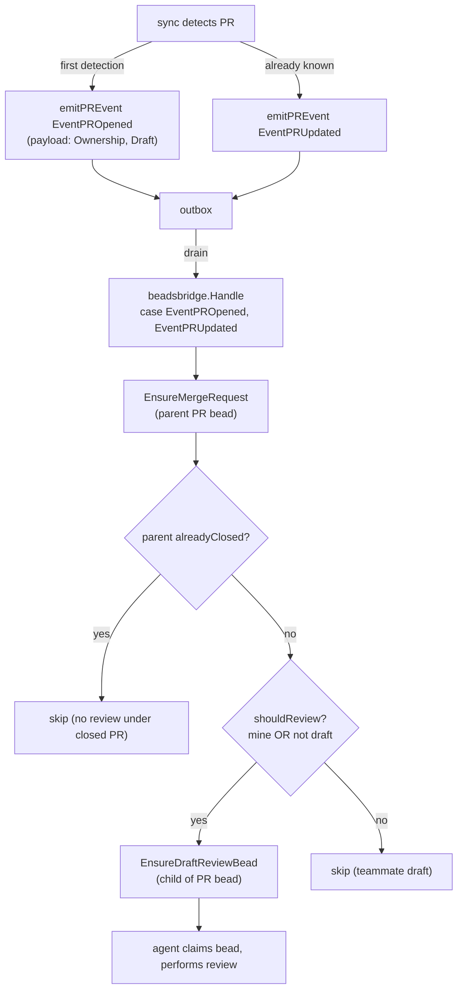

# pg-pr draft-review bead — Design

**Status**: Draft
**Date**: 2026-06-29
**Deciders**: Phillip Green II
**Bead**: `pg2-4c5i.12` (pg-pr #1: diff-review generation)
**Epic**: `pg2-4c5i` (pg-pr feedback Phase 2)
**Source spec**: `docs/superpowers/specs/2026-06-23-pg-pr-feedback-phase2-prompt.md` (item 1)
**Roadmap**: `docs/superpowers/plans/2026-06-23-pg-pr-feedback-phase2-roadmap.md`

## Context

Phase 2 item #1 ("diff-review generation") originally bundled three concerns:
agents reviewing a PR diff, producing a draft review, and routing that review to
GitHub (teammate PRs → staged pending review) or an internal merge loop (my
PRs). On review, the scope of **this** bead (`pg2-4c5i.12`) is deliberately
narrowed to the **first** concern only:

> pg-pr's responsibility is to sync GitHub state into its local store. When it
> detects a new PR, it MUST create a bead that represents "review this PR," and
> then stop. An agent picks up that bead and performs the review. Applying the
> resulting review back to the PR on GitHub (as a draft) is a later, not-yet-
> designed concern.

The two output-routing concerns are split into their own beads (see
[Out of Scope](#out-of-scope)).

### Foundation already on `main`

- **emit → bridge projection (`#5`, `pg2-4c5i.9`)**: `internal/sync` emits
  `pr.opened` / `pr.updated` / `pr.closed` / `pr.merged` into a transactional
  outbox; `internal/beadsbridge` is the **sole writer** of the merge-request
  (PR) bead, projecting it from those events (`bridge.go`).
- **PR lifecycle events** carry a `store.PRPayload` that already includes
  `Ownership` (`mine` / `team`) and `Draft` on the opened/updated events
  (`internal/sync/prevents.go:32-38`, `internal/store/event.go`). The
  close/merge payload (`emitPRClosed`, `prevents.go:80-82`) intentionally omits
  `Draft`/`Title` — but the gate below never runs on that payload (it only runs
  in the opened/updated handler branch).
- **`pr.opened` vs `pr.updated`** is decided per observation, and the two code
  paths use **different existence checks** (see note): the bulk/daemon loop
  (`sync.go:429-432`) keys off `repoPreExisting`, sourced from open
  merge-request beads (`ListMergeRequests(false)`, `sync.go:1339-1349`); the
  on-demand refresh path (`sync.go:1157-1162`, `applyFetchedPR`) keys off the
  SQL `pull_request` row (`store.GetPR`). The `maybePromoteDraft` path emits
  `pr.updated` with `Draft=false`, `Ownership=mine` (`sync.go:1576-1581`).
  **The gate below is invariant to which path fired and to opened-vs-updated
  misclassification** — it depends only on `Ownership`/`Draft` and on the
  idempotent ensure — so this divergence is benign for this feature. It is
  called out so the implementation does not assume a single source of truth.
- **Enrichment (`#2`, `pg2-4c5i.10`)** and the **revision table (`#4`,
  `pg2-4c5i.11`)** are merged but are **not** consumed by this bead (see
  [Non-dependencies](#non-dependencies)).
- **Draft staging primitives** (`internal/reviewstage`, `pg-pr review
draft/post/submit`) already exist and are **not** touched by this bead; they
  belong to the deferred output-routing work.
- **Bead-type convention**: pg-pr registers only `merge-request` and `feedback`
  as bd custom types (`pkg/beads/types.go:11-15`); the workspace's
  `types.custom` config is set imperatively per `.beads/` and is **not** in this
  repo. `processing-cycle` and `action` beads therefore reuse the builtin `task`
  type and discriminate by a **title prefix** (`pkg/beads/processingcycle.go:26-52`,
  `processingCycleTitlePrefix = "process-feedback: "`). This design follows that
  convention (see [Bead representation](#bead-representation)) so it needs **no**
  out-of-repo config change.

## Decision

When `beadsbridge` projects the merge-request (PR) bead from a `pr.opened` /
`pr.updated` event, it MUST also ensure a child **draft-review bead** under that
PR bead, gated by an ownership/draft rule. pg-pr's responsibility ends at bead
creation.

### Trigger and gating rule

The bridge MUST ensure the draft-review bead in the **same handler branch** that
already handles `store.EventPROpened` and `store.EventPRUpdated`, after
`EnsureMergeRequest` has ensured the parent PR bead. It MUST ensure the bead
when, and only when:

```text
shouldReview := payload.Ownership == "mine" || !payload.Draft
```

…and it MUST skip when `EnsureMergeRequest` reports the parent PR bead is already
closed (see [closed-parent guard](#bead-representation)).

| Ownership | GitHub draft? | draft-review bead created?    | Event that creates it            |
| --------- | ------------- | ----------------------------- | -------------------------------- |
| `mine`    | yes or no     | **MUST** create               | `pr.opened`                      |
| `team`    | no (ready)    | **MUST** create               | `pr.opened`                      |
| `team`    | yes (draft)   | **MUST NOT** create (wait)    | —                                |
| `team`    | draft → ready | **MUST** create on transition | `pr.updated` (flips `Draft` off) |

Because the rule is evaluated on every `pr.opened` / `pr.updated`, a teammate PR
that starts as a draft naturally gets its draft-review bead on the `pr.updated`
that removes the draft flag — no separate watcher is required. My own PRs are
reviewed even while still in draft (a deliberate product choice).

### Mechanism (chosen: project inside the existing PR-lifecycle handler)



The `BeadClient` interface (`internal/beadsbridge`) gains one method, modelled on
`CreateProcessingCycle` + a merge-request-style dedup scan:

```go
// EnsureDraftReviewBead ensures exactly one draft-review bead (open OR closed)
// exists as a child of the PR bead identified by repo+number. Idempotent on
// re-delivery; MUST NOT resurrect a closed draft-review bead. A lookup error
// MUST be returned (caller skips and retries next tick) — it MUST NOT be
// treated as "none exists" (that is the documented duplicate-cycle bug,
// processingcycle.go:84-90).
EnsureDraftReviewBead(ctx context.Context, repo string, number int, fields DraftReviewFields) (id string, err error)
```

`DraftReviewFields` carries **informational** data for the consuming agent —
`HeadSHA` (the SHA observed at emission), `Ownership`, and a human-facing title.
`HeadSHA` is **not** part of the dedup key (see Non-dependencies).

### Bead representation

- **Type**: the builtin bd `task` type, discriminated by a title prefix
  `draft-review: ` (mirroring `processing-cycle`'s `process-feedback: `,
  `processingcycle.go:26-52`). This needs **no** `types.custom` change. A custom
  `draft-review` type is explicitly rejected: it would require updating every
  workspace's out-of-repo `types.custom` config, with a silent-miss failure mode
  if missed.
- **Parentage**: a child of the merge-request (PR) bead, wired with
  `dep add <child> <pr> --type=parent-child` (as `CreateProcessingCycle` does).
  Distinct from the `process-feedback:` (processing-cycle) bead — different work.
- **Ownership label**: the bead carries a `mine` / `team` label so the deferred
  output-routing beads (`pg2-4c5i.34` / `.35`) can distinguish without re-deriving
  ownership.
- **Dedup key (idempotency + no-resurrection)**: one draft-review bead per parent
  PR bead, regardless of state. `EnsureDraftReviewBead` MUST: list the PR bead's
  children (`ListChildrenOfPR`, which returns all children regardless of type —
  `processingcycle.go:158-183`); intersect with `task` beads whose title has the
  `draft-review: ` prefix in **both open and closed** states (a merge-request-
  style scan, `mergerequest.go:227-273`, **not** the open-only
  `FindOpenProcessingCycle` scan); if any match exists (open or closed), skip
  creation. This dedups re-delivered events and prevents resurrecting a completed
  (closed) review.
- **Closed-parent guard**: if `EnsureMergeRequest` returns `alreadyClosed == true`
  for the parent PR bead, the handler MUST skip `EnsureDraftReviewBead` — no
  review bead under a closed PR. This reuses the existing signal and mirrors the
  processing-cycle guard (`bridge.go:84-86`). It is distinct from the child
  no-resurrection check above.
- **Cascade close**: when the PR bead is closed or merged (`pr.closed` /
  `pr.merged` → `cascadeClose`, `bridge.go:99-116`), any open draft-review child
  is closed automatically — `ListChildrenOfPR` already enumerates all children
  regardless of type, and `CloseProcessingCycle`/`bd close` works on any type.
  No new cascade code is required; a test MUST assert it.
- **Ordering invariant preserved**: the parent PR bead is ensured before the
  child within the single handler invocation, so the existing parent-before-child
  guarantee holds without relying on inter-event outbox ordering.

### Delivery semantics (correction)

The outbox is **fire-once / best-effort**, not at-least-once: `RunOutbox` marks
each row `complete` regardless of the dispatch outcome and discards handler
errors (`internal/store/outbox.go:56-59, 90-96`). A draft-review create that
fails on a transient error is therefore **dropped for that event**, not retried
by the outbox. Recovery instead comes from the **poll layer**: the next sync tick
re-observes the PR and re-emits `pr.updated`, re-running the gate and the
idempotent ensure. This recreation works for a _first_ create (nothing to
resurrect); it relies on the PR still being observed and still passing the gate.
This is acceptable — but the design's no-miss reasoning rests on poll-tick
re-emission, not on outbox redelivery.

### Non-dependencies

This bead does **not** consume the revision table (`#4`) or enrichment (`#2`):

- **No re-review-on-new-revision**: creating a fresh review obligation when a new
  head SHA lands after a review is the concern of `#3` (`pg2-4c5i.13`). This bead
  is purely `pr.opened`/`pr.updated`-driven, and dedups by `(repo, number)` —
  **not** by head SHA. Keying on head SHA would mint a new bead on every
  force-push, silently pulling in the deferred re-review concern. `HeadSHA` on
  the bead is informational only.
- **No reviewer-agent selection from enrichment**: which reviewer agents run is
  an agent-layer concern handled when the bead is picked up, not at emission
  time. (If selection later proves better computed in Go, that is an additive
  change to `DraftReviewFields`, not a precondition here.)

### Known limitations (inherited from the platform)

- **Reopened PRs are not re-reviewed.** There is no `pr.reopened` event
  (`store/event.go`), and once a PR bead is closed `EnsureMergeRequest` returns
  `alreadyClosed` permanently. A closed→reopened PR therefore gets neither a new
  merge-request bead nor a new draft-review bead. Pre-existing gap; out of scope.
- **`draft → ready → draft` does not withdraw the bead.** The gate only
  _creates_; it never closes a draft-review bead when a teammate PR reverts to
  draft. This is intentional — review work may already be underway; withdrawal is
  out of scope.

## Out of Scope

Captured as new beads, both **children of epic `pg2-4c5i`** and **blocked by
`pg2-4c5i.12`** (they need the draft-review bead to exist):

1. **`pg2-4c5i.34` (H1) — handle review output for _my_ PRs**: review findings
   feed the internal merge loop; not posted to GitHub.
2. **`pg2-4c5i.35` (H2) — handle review output for _teammate_ PRs**: apply the
   review to the GitHub PR as a draft / pending review for the human to submit
   (builds on the existing `internal/reviewstage` + `pg-pr review post`
   primitives). Related to `pg2-4c5i.13` (teammate attention signal), but
   distinct: this is the review-_application_ path, not the attention bead.

3. **`pg2-4c5i.36` — consume the draft-review bead**: the `bd ready`-driven
   loop / updated `pg-pr-review-team-pr` skill that claims the bead and produces
   the review (shared for mine + team). This bead only _emits_ the work item;
   without `pg2-4c5i.36` the feature emits beads nothing acts on, so `.36` must
   land before the workflow is end-to-end.

## Testing

Bridge-level tests in `internal/beadsbridge`, mirroring the merge-request bead
tests:

- `pr.opened` for a `mine` PR (draft or not) → exactly one draft-review bead.
- `pr.opened` for a `team` **draft** PR → **no** draft-review bead; a subsequent
  `pr.updated` with `Draft=false` → exactly one bead.
- Re-delivery of the same event → still one bead (idempotent).
- A **closed** draft-review bead is **not** resurrected by a later event.
- A transient **lookup error** during the dedup scan → the handler skips and does
  **not** create a second bead (returns the error; retries next tick).
- Parent PR bead already **closed** (`EnsureMergeRequest` → `alreadyClosed`) → no
  draft-review bead created.
- `pr.closed` / `pr.merged` → an open draft-review child is closed by
  `cascadeClose`.

## Alternatives Considered

### Dedicated `draft-review.created` event

Emit a separate event type from `internal/sync` after the PR row is upserted,
with its own bridge handler. Rejected: the trigger is identically "PR detected"
(`pr.opened`) plus the draft→ready transition (`pr.updated`), both of which the
existing PR-lifecycle handler already receives. A new event type, emission site,
and handler add surface area with no behavioral gain, and would require
re-establishing the parent-before-child ordering across two events rather than
within one handler.

### A custom `draft-review` bd type

Register `draft-review` in `types.custom`. Rejected: that config lives outside
this repo (set imperatively per workspace `.beads/`), so there is no
version-controlled change and a missed rollout fails silently. Reusing the
builtin `task` type with a title prefix (as `processing-cycle` does) needs no
config and keeps dedup/cascade consistent with existing machinery.

### Thick-Go orchestration (pg-pr runs the review)

Have pg-pr's Go binary select and run reviewer agents itself (extending the
`zr-agent` shell-out used for PR descriptions), staging the draft directly.
Rejected: it diverges from the established model where review agents run via
Claude Code's Task tool, buries fan-out inside a subprocess, and contradicts the
narrowed scope ("pg-pr stops at bead creation").

## Related Decisions

- `pg2-4c5i.9` (`#5`) — beadsbridge PR-lifecycle event ownership: established the
  emit → bridge projection pattern this bead extends.
- `pg2-4c5i.13` (`#3`) — owns re-review-after-approval and teammate attention
  signals; intentionally not handled here.
- `pg2-4c5i.34` / `pg2-4c5i.35` — the deferred output-routing beads this bead
  unblocks.
- `pg2-4c5i.36` — the consumer (claims the draft-review bead and produces the
  review); this bead unblocks it.
- `pg2-4c5i.10` (`#2`), `pg2-4c5i.11` (`#4`) — merged foundation, not consumed by
  this bead (see Non-dependencies).
