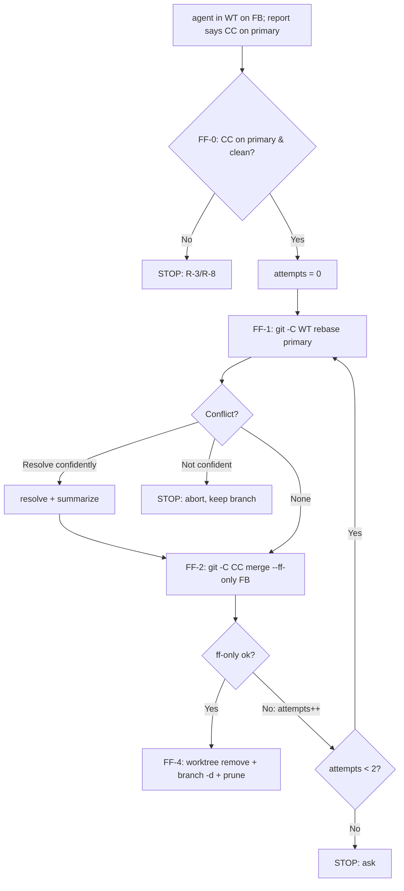

# Design: Canonical-primary-branch + Worktree Discipline, and the `integrate-branch` tool

- **Date:** 2026-07-13
- **Status:** Draft v6 (two review passes folded in; awaiting user review)
- **Scope:** (A) Agent working-discipline rules for git repos; (B) an `integrate-branch`
  skill that consults an advisory support tool and integrates the current branch by
  the repo's method. Deliberately **not** coupled to `pn`-workspace or beads.
- **Related beads:** `pg2-nu3o5` (bd fail-closed bug, out of scope);
  `pg2-8r1rp` (later refocus of `wrap-up-session` to delegate to `integrate-branch`).
- **Note:** the `integrate-branch` plugin gets its own README/spec at implementation
  time; the rules doc will merely reference it.

## 1. Problem

Agents get **stuck at the rebase + fast-forward-merge ("land") step** when the
canonical clone is **not on its primary branch** or is **dirty** — because agents
work directly in the canonical checkout (switching it off-branch / dirtying it) and
the guidance they read **normalizes** that with work-arounds instead of preventing
it. The intended model already exists implicitly (`pn workspace` **P1 guarantee**,
`phillipg-nix-repo-base/docs/worktrees.md`, `phillipg-nix-repo-base` **ADR 0009**)
but isn't stated where agents read it, and one `superpowers` skill contradicts it.

### Root-cause note (verified 2026-07-13)

"Running `bd` from a worktree corrupts the shared Dolt server" was **falsified**:
`bd` resolves `.beads/` by filesystem walk-up then git-common-dir discovery — both
verified working from worktrees, no corruption. The real failure (`bd` spawns a
local server when the shared server is unreachable) is worktree-independent and
tracked as `pg2-nu3o5`. No "run `bd` only from the canonical root" rule.

## 2. Goals / Non-goals

**Goals:** one crisp tiered rule set (canonical on its primary branch; work in a
worktree/workforest by default; a floating-branch halt-guard); an `integrate-branch`
skill that adapts to the repo via an **advisory** support tool; reconcile
conflicting guidance; delete stale memories.

**Non-goals:** refactoring `wrap-up-session` now (`pg2-8r1rp`); changing `pn` tooling
code; fixing `pg2-nu3o5`; coupling the tool to `pn`-workspace.toml, a central
registry, or a required beads dependency.

## 3. Rules by tier (RFC 2119)

"Primary branch" = the repo's default integration branch, resolved as
`pgii-integrate-branch.primaryBranch` (git config) → `git symbolic-ref
refs/remotes/origin/HEAD` (git standard) → **`main`**. Rules say "primary branch."

### Tier R — Any repo (→ global `pgii-agent-rules.md`)

- **R-1** The canonical clone MUST have its primary branch checked out as steady state.
- **R-2** Only the canonical clone MAY have the primary branch checked out; a
  worktree/workforest member MUST use a feature branch.
- **R-3** An agent MUST NOT switch the canonical clone off its primary branch or
  leave it dirty in steady state. On finding it unexpectedly off-branch/dirty, the
  agent MUST **stop and report** — not reset, re-checkout, stash, or work around it.
- **R-4** By default an isolated single-repo change MUST be done in a git worktree.
- **R-5** The worktree **and** workforest requirements (R-4, P-1) MAY be overridden
  when the user explicitly says so.
- **R-6** For a change judged very small/quick, the agent MAY take the direct-commit
  path (commit on the primary branch in the canonical clone) — but if it does, it
  MUST first ask the user.
- **R-7** Concurrent agents in different worktrees are expected; the primary branch
  advancing during work is absorbed by the rebase. Only a rebase **conflict** or a
  **persistent ff-race during landing** warrants attention.
- **R-8 (floating-branch halt)** If an integration would **advance the canonical
  primary branch** (e.g. a local ff-merge) and the canonical clone is **not on its
  primary branch**, the agent MUST **halt and report** — merging then advances the
  wrong branch and orphans work into hanging branches. (For methods that do not
  touch the canonical primary — e.g. `pull-request` — an off-primary/dirty canonical
  is an R-3 anomaly to _surface_, not necessarily to halt.)
- **R-9 (integration entry point)** To integrate completed work, the agent MUST use
  the `integrate-branch` skill. The agent MUST NOT use
  `superpowers:finishing-a-development-branch` (plain non-ff merge, no rebase).

### Tier P — Any `pn`-workspace (in `pn-workspace-rules`)

Tier P _uses_ `integrate-branch` per repo; the tool does not depend on Tier P.

- **P-1** A multi-repo change MUST be isolated in a **workforest**. (Overridable, R-5.)
- **P-2** Landing a workforest set is a **best-effort ordered transaction** (local
  ff-merges can't be rolled back): rebase the set; integrate each repo in dependency
  order via `integrate-branch`; if a repo can't land after its retries, **stop**,
  keep the set, report which landed and which is blocked.
- **P-3** Remove the set only when **every** repo has landed and is clean.
- **P-4** `--in-place` is the sanctioned direct-on-primary escape hatch.
- **P-5** `bd` works from a worktree/workforest (git-common-dir discovery).
- **P-6 (loose coupling)** The `pn` repos get their `pgii-integrate-branch.*` git
  config set via `pn`'s **existing per-repo `post-clone` event hook** (ADR 0019),
  which already runs in `pn-workspace.toml`. No `pn` tooling change; the tool knows
  nothing about `pn` — it just reads git config. (See the §5 example.)

Off-branch/dirty **work-arounds are removed** from this skill's agent-facing guidance.

## 4. The `integrate-branch` tool

`integrate-branch` (skill) is the single entry point. It runs `integrate-branch-support`
(an **advisory** bash tool), then **the agent decides** and delegates to a handler
skill (**Strategy** pattern; handlers are **Command**-style skills). Ships
`ff-merge-to-main` and `pull-request`; extensible.

```mermaid
flowchart TD
    U["User: integrate-branch"] --> S["integrate-branch skill"]
    S --> T["run integrate-branch-support → advisory report"]
    T --> DEC{"agent decides (report + its own context)"}
    DEC -->|nothing to integrate: on primary / detached / 0 ahead| NONE["report: nothing to land"]
    DEC -->|strategy resolved (declared, inferred, or agent-decided) & feasible| H["invoke matching handler skill"]
    DEC -->|declared-but-infeasible, or cannot decide| ASK["ask the user"]
    H --> H1["ff-merge-to-main (§4.5) — FF-0 halts if canonical off-primary/dirty (R-8/R-3)"]
    H --> H2["pull-request (push+PR; never auto-merge; surface canonical anomaly)"]
```

### 4.1 The support tool is advisory

`integrate-branch-support` **does not decide or command** — it returns a definitive
`strategy` when it can, otherwise `null` plus every fact it gathered, and the agent
decides (it may use other context, or ask the user). It never returns
`ask`/`halt`/`none`; those are agent decisions, guided by the `integrate-branch`
skill and the Tier R rules.

### 4.2 Explicit declaration + signals (all git-standard; beads optional)

- **Explicit declaration:** `git config --get pgii-integrate-branch.strategy` (a
  custom git-config prefix; local, never pushed; works for repos we can't commit to;
  set however — nix, manual). If set, that is the `strategy`.
- **Signals** (only when undeclared):
  - **No remote** (`git remote` empty) → `ff-merge-to-main` (PR impossible — a hard
    disqualifier).
  - **Open PR for the branch** (`gh` / forge CLI / a configured PR-probe, each only
    when available) → `pull-request`.
  - **Open merge-request tracker bead** (`bd list --type=merge-request`) →
    `pull-request`. **Optional**; if beads is absent/unreachable it contributes
    nothing and the tool does not fail.
  - Caveats: a remote merely _existing_ does NOT imply PR; a **merged/closed** PR
    means work is already integrated.
- **Graceful degradation:** any optional source that errors (beads down, `gh`
  missing) is simply omitted; the tool still returns what it could gather.

### 4.3 Support-tool response (pruned to what the agent can't already see)

```json
{
  "strategy": "pull-request", // or null when the tool can't determine one
  "reason": "open PR #42 found for feat-x",
  "primary_branch": "main",
  "canonical": { "branch": "main", "dirty": false },
  "remote": "origin", // null when the repo has no remote
  "open_pr": { "number": 42, "state": "open", "url": "…" }, // null when none
  "mr_bead": "pg2-abcd" // null / omitted when beads unavailable
}
```

| Property           | What it is                           | Why the agent needs it                                                                              |
| ------------------ | ------------------------------------ | --------------------------------------------------------------------------------------------------- |
| `strategy`         | the determined method, or `null`     | the advisory answer; `null` ⇒ agent decides from facts/context                                      |
| `reason`           | human-readable explanation           | agent summarizes to the user; transparency (also carries provenance, e.g. "declared" vs "inferred") |
| `primary_branch`   | resolved primary branch              | handler target; R-8 comparison; agent computes "commits ahead"                                      |
| `canonical.branch` | what the canonical clone is on now   | agent surfaces R-3 / a canonical-advancing method halts (R-8) if `≠ primary_branch`                 |
| `canonical.dirty`  | whether the canonical clone is dirty | R-3; ff-merge halts, PR surfaces                                                                    |
| `remote`           | remote name/url, or `null`           | no-remote ⇒ PR impossible                                                                           |
| `open_pr`          | PR number/state/url, or `null`       | PR indicator                                                                                        |
| `mr_bead`          | merge-request bead id, or `null`     | optional PR indicator                                                                               |

Dropped after review: `strategy_source` (absence of `strategy` is sufficient;
provenance lives in `reason`), `subject.*` (the agent already knows its own branch /
worktree, and computes commits-ahead from `primary_branch`), `handler_skill` (the
`strategy` value names the handler; the skill maps built-ins), `unavailable`,
`worktreeRoots`, and `canonical.path` (the handler re-derives it via git-common-dir,
§4.5).

**Robustness:** `integrate-branch-support` is bats-tested and fail-safe — on any hard
error it exits nonzero (agent treats as "could not determine"); optional-source
failures are non-fatal (§4.2); edge cases resolved explicitly: not-a-git-repo →
nonzero; detached HEAD → report it (agent decides); multiple remotes → use the
branch's upstream remote else report ambiguity; run-from-worktree → resolve canonical
via git-common-dir.

### 4.4 How the agent reacts (in the `integrate-branch` skill)

The decision logic lives in the skill (agent judgment), not the tool:

1. **Nothing to integrate** — the subject is on the primary branch, is detached (no
   feature branch), or has `0` commits ahead of `primary_branch` → report and stop.
2. **Surface canonical anomalies** — if `canonical.branch ≠ primary_branch` or
   `canonical.dirty`, report it (R-3). Whether it _blocks_ is method-dependent
   (step 3): a canonical-advancing method halts (R-8, enforced by FF-0); a
   `pull-request` surfaces it and proceeds.
3. `strategy` set **and feasible** given the facts → **invoke that handler skill**
   (after confirming it is an installed handler — a typo/correctness fail-safe), then
   relay the outcome and summarize `reason` when it was inferred. If the declared
   strategy is **infeasible** (e.g. `pull-request` with `remote: null`), do NOT
   invoke — surface the conflict and ask.
4. `strategy` is `null` → decide from the facts **plus any other context the agent
   has**; if it still cannot decide, **ask the user** (optionally persisting the
   answer via `git config pgii-integrate-branch.strategy`).

### 4.5 Handler contract + shipped handlers

Each handler is a Command with a **uniform contract**. Because skills do not receive
typed arguments, a handler **re-derives its own context from git** rather than relying
on values being passed in: the worktree `<WT>` = the current working tree; the feature
branch `<FB>` = its current branch (`git rev-parse --abbrev-ref HEAD`; a detached HEAD
→ halt, nothing to integrate); the canonical clone `<CC>` = the main working tree of
the common dir (via `git rev-parse --git-common-dir`); the primary branch via the
shared resolution (§3). The support-tool report is the _agent's_ decision input, not
the handler's data channel; the resolution is **mirrored** rather than shared —
`integrate-branch-support` and each handler independently reimplement the same §3
resolution order (the handlers are skills and so cannot source the tool's bash lib),
which is what keeps the two agreeing. Each handler MUST re-verify
Tier R preconditions, integrate by its method, halt-and-report on anomaly, clean up per
its method, and report `landed | pr-opened | stopped:<reason>`. Uniformity lets an org
add its own handler (declared as the `strategy` value) without changing
`integrate-branch`.

**`ff-merge-to-main` handler** — rebase-first (per requirement: rebase from primary
first). `CC` = canonical clone; `WT` = the agent's worktree; `FB` = feature branch.

- **FF-0** Verify `CC` is on the primary branch and clean; else halt (R-3/R-8).
- **FF-1** Rebase in the worktree: `git -C <WT> rebase <primary>`. **On conflict:**
  attempt resolution; if confident, do NOT stop but summarize to the user; only if
  not confident, `rebase --abort`, keep the branch, hand off.
- **FF-2** ff-only merge in the canonical clone: `git -C <CC> merge --ff-only <FB>`
  (valid even though `<FB>` is checked out in `<WT>`).
- **FF-3** `attempts = 0`; if FF-2 fails as non-ff (primary moved), `attempts++` and
  retry from FF-1; when `attempts` reaches **2**, stop and ask.
- **FF-4** Cleanup, run against `<CC>` and with the shell relocated **out of** `<WT>`
  first (removing the worktree you are standing in breaks subsequent commands):
  `git -C <CC> worktree remove <WT>` (git refuses to remove the main working tree, so
  the canonical clone is inherently protected), `git -C <CC> branch -d <FB>`,
  `git -C <CC> worktree prune`.



**`pull-request` handler** — push the feature branch, open/update the PR, **never
auto-merge** (this workspace requires explicit human permission). Keep the
branch/worktree. Surface `canonical.dirty` if set. Report the PR URL.

### 4.6 Worked examples (support-tool report → agent action)

1. **Typical nix-\* repo** (`pn` set `pgii-integrate-branch.strategy=ff-merge-to-main`;
   worktree on `feat-x`; canonical on `main`, clean):
   `{strategy:"ff-merge-to-main", reason:"declared", primary_branch:"main",
canonical:{branch:"main",dirty:false}, remote:"origin", open_pr:null}`
   → agent runs the **ff-merge-to-main** handler.
2. **ZR monorepo** (`git config pgii-integrate-branch.strategy=pull-request`):
   `{strategy:"pull-request", reason:"declared", remote:"origin", open_pr:null}`
   → agent runs **pull-request** (push + open PR; no auto-merge).
3. **Local-only repo, no remote:** `{strategy:"ff-merge-to-main", reason:"no remote —
PR impossible", remote:null}` → **ff-merge-to-main**.
4. **Open PR, undeclared:** `{strategy:"pull-request", reason:"open PR #42",
open_pr:{number:42,state:"open"}}` → **pull-request** (updates the PR).
5. **Undetermined** (remote present, no PR, nothing declared): `{strategy:null,
reason:"remote present, no PR, nothing declared — cannot infer", remote:"origin",
open_pr:null}` → agent uses other context; if still unsure, **asks the user**
   (offers to persist the choice via git config).
6. **Anomaly — canonical off primary:** `{strategy:"ff-merge-to-main", primary_branch:
"main", canonical:{branch:"some-other-branch"}}` → agent **halts** (R-8) and reports.
7. **Nothing to integrate:** report has `primary_branch:"main"`; agent finds `0`
   commits ahead → reports "already integrated / nothing to do".
8. **Beads unavailable:** `mr_bead:null`; the tool still returns a strategy from the
   other signals and does not fail.

## 5. Implementation map (verified homes)

| Change                                                                                                                                                                            | Home                                                                                                                          |
| --------------------------------------------------------------------------------------------------------------------------------------------------------------------------------- | ----------------------------------------------------------------------------------------------------------------------------- |
| Tier R (R-1…R-9, incl. "use `integrate-branch`, not `finishing-a-development-branch`")                                                                                            | `phillipgreenii-nix-agent-support/home/programs/agent-rules/pgii-agent-rules.md` (nix source of global `~/.claude/CLAUDE.md`) |
| New **`integrate-branch`** plugin: the `integrate-branch` skill + `ff-merge-to-main` + `pull-request` handler skills + bats-tested `integrate-branch-support` (+ own README/spec) | `phillipgreenii-nix-agent-support/claude-marketplace/`                                                                        |
| **`pn-workspace-rules`** (Tier P; P-2 transaction; P-6 git-config provisioning; remove work-arounds; land via `integrate-branch`)                                                 | `phillipg-nix-repo-base/pn-workspace-rules/skills/pn-workspace-rules/SKILL.md`                                                |
| Delete 6 stale memories                                                                                                                                                           | shared `bd` DB, from canonical root                                                                                           |
| **`wrap-up-session`**                                                                                                                                                             | unchanged now (`pg2-8r1rp`)                                                                                                   |

Loose coupling example (`pn` provisions git config via its existing post-clone hook, §P-6):

```toml
# pn-workspace.toml — existing [[repos.<key>.hooks]] mechanism (ADR 0019)
[[repos.<key>.hooks]]
when = ['post-clone']
run  = [
  'git config pgii-integrate-branch.strategy ff-merge-to-main',
  'git config pgii-integrate-branch.primaryBranch main',
]
```

## 6. `superpowers` reconciliation

- **`finishing-a-development-branch` — conflict**, superseded by R-9 + `integrate-branch`.
- **`using-git-worktrees` — cooperates** (its Step 0 honors R-4 as a declared
  preference and creates the worktree without asking). Keep it.

Enforcement is R-9 (a rule) **only — no `PreToolUse` hard-disable hook.** (And do NOT
deny `using-git-worktrees`, which cooperates.)

## 7. Memory sweep (delete; relocate kernel)

Delete (all confirmed to exist): `worktree-isolation-for-agent-work`,
`sdd-isolate-in-worktree`, `shared-checkout-branch-switches-during-merge`,
`workforest-landing-vs-parallel-agents`, `workforest-bd-shared-server-corruption`
(verified stale), `pn-coordinated-worktrees-status` (open follow-up = `pg2-fdx0`).
`zm-hooks-install-git-hooks-not-dispatcher` out of scope; left.

## 8. Rollout notes

- **`agent-support` conforms:** the shared-checkout branch-switching pattern is retired.
- No per-repo declarations are _required_; undeclared repos use signals, and `pn`
  provisions `pgii-integrate-branch.strategy` for the `pn` repos so their common case
  isn't ambiguous. `git config` is how any repo (incl. ZR) pins its method.
- Cleanup is method-specific: ff-merge retires the worktree+branch (FF-4); PR keeps them.
- Implementation spans two repos (`agent-support`, `repo-base`) → a **workforest**.

## 9. Verification

- **Rules:** rebuild home-manager; confirm Tier R in the rendered `~/.claude/CLAUDE.md`;
  confirm `pn-workspace-rules` reflects Tier P.
- **`integrate-branch-support` (bats):** declared strategy → that; no remote → ff-merge;
  open PR / MR bead → PR; merged PR → (no PR signal); remote+no-PR+undeclared →
  `strategy:null`; canonical off-primary reported; `canonical.dirty` reported;
  beads-down non-fatal; not-a-repo / detached / multi-remote handled;
  run-from-worktree resolves canonical via common dir.
- **`integrate-branch` skill:** each §4.4 branch (halt / none / invoke / ask) exercised;
  unknown handler → halt.
- **`ff-merge-to-main`:** rebase-first onto a moved primary; ff-only from canonical
  while the branch is in the worktree; forced non-ff exercises the retry loop (stop
  after the 2nd failed ff-merge); FF-1
  conflict resolve-and-summarize; FF-4 removes only the landed worktree, never the
  main one; halts on `canonical.dirty`.
- **`pull-request`:** never auto-merges; surfaces `canonical.dirty`.
- **No regressions:** `bd` resolves from root and worktree; the six memories gone.

## 10. Open decisions (confirm at review)

Resolved this session: Tier R = global; ambiguous → tool returns `null`+facts, agent
decides; beads = optional+graceful; `finishing-a-development-branch` → R-9 rule; names
= `integrate-branch` / `integrate-branch-support` in `agent-support`; git prefix
`pgii-integrate-branch`; response schema pruned (§4.3).

Also resolved this pass: the **ad-hoc multi-repo rule is dropped**;
`finishing-a-development-branch` is enforced by the **R-9 rule only — no hard-disable
hook**; and the **`pn` defensive off-branch/dirty integration path is kept** as a
deliberate safety net — a rule stating a state "shouldn't happen" does not _prevent_
it, so the defensive code stays (no removal planned).

**No open decisions remain.**
