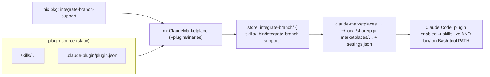

# Unified nix-managed Claude plugin delivery (rules + skills + binaries)

**Date**: 2026-07-15
**Bead**: pg2-sikj3
**Status**: Proposed (awaiting human sign-off — this doc is the decision artifact, not an implementation)
**Related**: pg2-wwpy9-adjacent incident during the 2026-07-13 canonical-main rollout
(`docs/superpowers/specs/2026-07-13-canonical-main-worktree-discipline-design.md`, apply bead
pg2-k7tyn); rules-delivery precedent
(`docs/superpowers/specs/2026-06-25-agent-rules-delivery-design.md`, beads pg2-44sj / pg2-qewh);
builder authority `phillipg-nix-repo-base/lib/claude-marketplace.nix` + `docs/claude-marketplaces.md`.

## Problem

The `integrate-branch` / canonical-main capability is delivered through **three independent
mechanisms**, each wired separately:

1. **Tier R rules** — `home/programs/agent-rules` renders `pgii-agent-rules.md` into
   `~/.claude/CLAUDE.md` via `home.file`. Gated on `phillipgreenii.programs.claude.enable`.
2. **The skills** — `claude-marketplace/integrate-branch/skills/` (dispatcher +
   `ff-merge-to-main` / `pull-request` handlers), bundled by `mkClaudeMarketplace` and registered
   by `home/programs/claude-marketplaces`. Gated on `claude.enable` plus the automatic
   `marketplaces.nixProvided` threading in `homeModules.default`. Plugin `defaultEnabled: true`.
3. **The detector CLI** — `integrate-branch-support`, delivered by a **separate** home-manager
   module `home/programs/integrate-branch-support` whose `enable` defaults to **false** and is
   turned on per-machine (only site today:
   `phillipg-nix-ziprecruiter/machines/phillipg-mbp-02/default.nix`, `home.packages`).

### The incident this fixes

After `darwin-rebuild switch`, mechanisms 1 and 2 were live but mechanism 3 was not — the
`integrate-branch` dispatcher was **non-functional** because `integrate-branch-support` was not on
`PATH` (its home module had never been separately enabled). The dispatcher's very first step runs
`integrate-branch-support`; without it the whole landing flow (which Tier R **R-9** mandates) is
dead. Nothing surfaced the gap until end-to-end verification. The root cause is structural: the
skill that **calls** the binary and the binary itself ship through two unrelated mechanisms with
two unrelated enable flags, so they can (and did) drift apart.

## Goal

Deliver a plugin's **skills/commands + its binaries as ONE nix-managed unit**, and bring the
plugin's **rules** under the same single enable, so that turning on one plugin makes all of its
capability available together — no separate `home/programs/<tool>` enable, no "is the CLI on
`PATH`?" gap, no per-machine wiring drift. Make the "CLI missing after apply" failure class
**structurally impossible**.

## Key finding — Claude Code plugins ship `bin/` on `PATH` natively

Claude Code plugins support a first-class, documented **`bin/`** directory: every executable
placed in a plugin's `bin/` is added to the **Bash tool's `PATH`** while the plugin is enabled,
and is invokable as a **bare command** in any Bash tool call. This is documented in the official
plugin reference (the "File locations reference" / "Standard plugin layout" tables at
`code.claude.com/docs/en/plugins-reference` and `.../plugins`) alongside `skills/`, `agents/`,
`hooks/`, `.mcp.json`, `.lsp.json`, and `monitors/`.

Consequences for this design:

- A plugin **CAN** carry its own detector binary. Bundling `integrate-branch-support` into the
  `integrate-branch` plugin's `bin/` means the skill and the binary it calls become **one
  artifact, enabled by one flag** — the drift that caused the incident becomes impossible.
- The `bin/` `PATH` injection is scoped to **Claude Code's Bash tool**, not the user's ambient
  login shell. This is exactly the scope `integrate-branch-support` needs — it is only ever
  invoked by the dispatcher skill via a Bash tool call. (If a human ever wants the CLI in their
  interactive shell too, that is a _separate_, additive need; see "Non-goals".)
- Claude auto-discovers `bin/`; **no manifest entry is required** — the executable just needs to
  be present and executable in the enabled plugin directory.

The rules are the exception: **plugin-carried rules cannot be delivered as a loaded file inside the
plugin.** The 2026-06-25 design established empirically (Claude Code 2.1.186) that a plugin-root
`CLAUDE.md` is **not loaded** (inert), a skill body is on-invoke (wrong for always-on), and a
SessionStart hook double-injects against the user `CLAUDE.md` that _is_ loaded. The only verified
always-on vehicle is the user-level `~/.claude/CLAUDE.md`. So "the plugin's rules" must still be
**written to `~/.claude/CLAUDE.md` by nix** — they cannot ride inside the plugin store dir as a
Claude-loaded file. Unifying rules therefore means unifying the **enable + authoring path**, not
physically relocating the rules into the plugin bundle.

## Options

### Option 1 — Binary into plugin `bin/`; rules stay in `agent-rules` (same gate)

Extend the marketplace builder so a plugin can have nix-built binaries injected into its `bin/`.
Bundle `integrate-branch-support` into the `integrate-branch` plugin. **Retire**
`home/programs/integrate-branch-support` and its per-machine enable. Leave the Tier R rules exactly
where they are (`agent-rules` → `~/.claude/CLAUDE.md`, gated on `claude.enable`).

- The plugin (skills + binary) and the rules are then all gated by the **single** machine flag
  `phillipgreenii.programs.claude.enable`; the separate `integrate-branch-support.enable`
  disappears entirely. Note the co-enable guarantee is at the `claude.enable` level, not the
  per-plugin toggle: a per-plugin disable via `marketplaces.overrides` would drop this plugin's
  skills+binary while the monolithic rules persist — plugin-level co-variance of rules waits for
  Phase 2.
- Skills + binary become one store artifact with one version digest and one enable — the incident
  is structurally impossible.
- The rules are not _plugin-declared_, but they are already co-gated and always-on. AC1 ("one flag
  makes rules + skills + binaries available") and AC2 ("no separate `home/programs/<tool>` enable
  for a plugin's own binary") are satisfied; AC3's "rules … migrated onto the unified mechanism"
  is satisfied _in the co-enable sense_ but not in a "the plugin owns its rules" sense.
- **Risk: S.** Smallest diff; touches only the builder (+ one plugin's binary wiring) and deletes
  one home module. Directly kills the incident.

### Option 2 — Option 1 **plus** plugin-declared rules aggregated into `~/.claude/CLAUDE.md`

On top of Option 1, let a plugin **declare a rules fragment** (a markdown file in the plugin, e.g.
`rules/*.md`, surfaced through the builder's `passthru`). The `claude-marketplaces` consumer
aggregates the rules fragments of all **enabled** plugins and composes them into
`~/.claude/CLAUDE.md` together with the personal always-on rules that `agent-rules` owns today.

- Rules, skills, and binary are all **plugin-declared** and all appear/disappear with the single
  plugin-enable — the most literal reading of the bead ("rules + skills + binaries together").
- The Tier R integrate-branch rules (R-1..R-9) would move from the monolithic `pgii-agent-rules.md`
  into the `integrate-branch` plugin, so they are present **iff** that plugin is enabled.
- Requires answering the **rules-ownership question** (below) and solving fragment **ordering,
  de-duplication, and composition** with the personal rules, plus preserving the _single verified
  always-on delivery_ (one `~/.claude/CLAUDE.md`, no double-injection — the exact trap pg2-qewh
  cleaned up).
- **Risk: L.** Broadest change; touches the builder, the consumer module, `agent-rules`, and the
  rules content model. Higher chance of a regression in the always-on delivery.

### Option 3 — Status quo (rejected baseline)

Keep the 3-way split; rely on documentation/checklists to remember the third enable. Rejected: it
is exactly what produced the incident; a documentation fix does not make the failure structurally
impossible.

## Recommendation

Adopt a **phased** path:

- **Phase 1 (MUST) = Option 1.** Inject the binary into the plugin `bin/` and retire the separate
  module. This is the high-value, low-risk core: it eliminates the incident, removes a per-machine
  flag, and is a prerequisite for Phase 2 regardless. The builder gains a binary-injection
  capability that is independently useful for any future plugin that ships a helper CLI (e.g.
  `pg-pr`, `claude-extended-tool-approver`).
- **Phase 2 (SHOULD, needs the human decision below) = Option 2's rules aggregation.** Pursue only
  after the rules-ownership question is answered and a composition design that preserves the single
  always-on `~/.claude/CLAUDE.md` is specified. Phase 2 is what fully satisfies AC3 in the
  "plugin owns its rules" sense; Phase 1 alone satisfies AC1/AC2 and the co-enable reading of AC3.

The two phases are independently landable; Phase 1 SHOULD land first and does not block on Phase 2.

## Builder extension (Phase 1 mechanics)

`mkClaudePlugin` / `mkClaudeMarketplace` in `phillipg-nix-repo-base/lib/claude-marketplace.nix`
today understand only `{ name, version, defaultEnabled }` per plugin and `cp -r` the static plugin
source. Extend them with an **optional per-plugin binary injection**. The extension targets
`mkClaudeMarketplace` (the actual delivery path for `integrate-branch`, which ships via the
marketplace bundle); `mkClaudePlugin` gains the analogous single-plugin form for consistency:

- `mkClaudeMarketplace` gains an optional `pluginBinaries` argument: an attrset
  `{ <pluginName> = [ <package> … ]; }`. For each named plugin, the build links every
  `${package}/bin/*` into `$out/<pluginDir>/bin/`, shipping **real, executable** entries (resolve
  symlinks / preserve the `+x` bit) so Claude's directory-source copy yields runnable files.
- The flake wires it explicitly at the call site, e.g.
  `pluginBinaries = { integrate-branch = [ pkgs.integrate-branch-support ]; }`. Explicit nix-side
  mapping is preferred over a manifest-declared registry (simpler; no name→drv indirection).

### Version-digest caveat (MUST)

The per-plugin version is stamped `<declared>+<digest>` where the digest is a `builtins.path`
content digest of the plugin **source** dir (see the builder's `stampVersion` /
`mkSrcDigest`). If a binary is injected at build time from a _separate_ derivation, a change to the
binary would **not** change a source-only digest — so Claude would keep serving a stale cached
plugin after a binary update. The extension **MUST fold the injected binaries' store paths into the
version-digest input**, so bumping `integrate-branch-support` bumps the `integrate-branch` plugin
version and busts Claude's versioned cache. This is the single most important correctness property
of the extension and MUST be covered by a builder unit test
(`lib/claude-marketplace-tests.nix`).

### Structural guarantee

With skills and binary in one artifact under one enable, the dispatcher and its detector ship and
enable together. As defense-in-depth, the dispatcher skill SHOULD also fail **loud and actionable**
if `integrate-branch-support` is somehow absent (a clear "detector not on PATH — is the
integrate-branch plugin enabled?" message rather than a bare command-not-found), so any residual
gap is self-diagnosing.

## The human decision (why this is DESIGN+HUMAN, not auto-implement)

Phase 2 hinges on a judgment call that changes the fleet's rules model and MUST be a human sign-off:

- **Rules ownership.** Should the Tier R integrate-branch rules (R-1..R-9) **move out** of the
  monolithic personal `pgii-agent-rules.md` and **into** the `integrate-branch` plugin, so they are
  present only when that plugin is enabled? This is attractive (rules travel with capability) but
  it fragments the single personal always-on rules file and couples rule presence to plugin-enable
  state on every machine. The alternative is to keep the rules monolithic and treat Phase 2's
  "unification" purely as co-enable (i.e. stop at Option 1). This is the crux and needs the owner's
  call.
- **Always-on invariant.** Any rules-aggregation design MUST preserve the property pg2-qewh
  restored: exactly **one** always-on delivery into `~/.claude/CLAUDE.md`, with **no
  double-injection**. A composition bug here silently doubles token cost or (worse) drops rules.
- **Blast radius.** This mechanism is what the fleet + the landing flow depend on; a regression in
  plugin delivery breaks `integrate-branch` (and thus every agent's landing) on every machine.
  That is why implementation is explicitly out of scope for the autonomous pass.

## Migration / rollout

1. Land the builder extension + its unit test (Phase 1) in `phillipg-nix-repo-base`.
2. Wire `pluginBinaries = { integrate-branch = [ pkgs.integrate-branch-support ]; }` in
   `phillipgreenii-nix-agent-support/flake.nix`; delete `home/programs/integrate-branch-support`
   and remove its per-machine enable in `phillipg-nix-ziprecruiter/machines/phillipg-mbp-02`.
3. **Verify end-to-end** on a real apply: after `darwin-rebuild switch`, in a Claude Bash tool
   call, `integrate-branch-support` resolves as a bare command **and** the dispatcher runs — with
   the `integrate-branch-support.enable` module gone. Confirm a binary bump changes the plugin
   version (cache-bust).
4. (Phase 2, post-decision) Design + land plugin-declared rules aggregation, preserving the single
   `~/.claude/CLAUDE.md` always-on delivery.

Because Claude installs the marketplace from a directory source it copies into a versioned cache,
verification MUST confirm the copy preserves the `bin/` executables' `+x` bit and that they run
(nix-built shell/compiled artifacts reference `/nix/store`, which is present on the target).

## Acceptance-criteria mapping

| Bead AC                                                         | Phase 1 (Option 1)                        | Phase 2 (Option 2 rules)   |
| --------------------------------------------------------------- | ----------------------------------------- | -------------------------- |
| One flag ⇒ rules + skills + binaries available                  | Yes (co-gated on `claude.enable`)         | Yes (plugin-declared)      |
| No separate `home/programs/<tool>` enable for a plugin's binary | Yes (module retired)                      | Yes                        |
| integrate-branch stack migrated onto the unified mechanism      | Skills+binary: yes. Rules: co-enable only | Rules also plugin-declared |

## Non-goals

- Ambient-shell (login shell) availability of `integrate-branch-support`. Plugin `bin/` scopes to
  Claude's Bash tool, which is the only caller. If a human shell need arises later, add it
  additively (e.g. an opt-in `home.packages`), separate from this unification.
- Changing the `directory`-source marketplace registration model or the content-digest versioning
  scheme (ADR-0006/0010) beyond folding injected binaries into the digest input.
- Uninstalling ghost plugins from Claude's runtime cache (tracked separately, pg2-onli).
