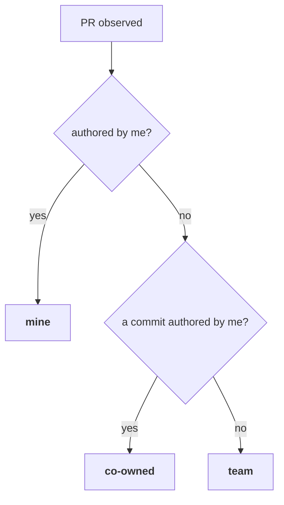

# pg-pr: Three-Way PR Ownership + Conflict Urgency

- **Date:** 2026-07-16
- **Beads:** `pg2-aag72` (Spec A — ownership), `pg2-tsgkj` (Spec B — conflict urgency)
- **Status:** Approved model; pending spec review
- **Package:** `packages/pg-pr`

## 1. Problem

Two related gaps in how pg-pr classifies and prioritizes tracked PRs.

**`pg2-aag72`.** Ownership is binary — `mine` (I authored) or `team` (anyone
else). Once I push a commit onto a teammate's PR (out of band; pg-pr never
commits on my behalf), I can no longer objectively review it, yet it stays in my
team-review queue and none of my "act on my own PR" behaviors apply to it.

**`pg2-tsgkj`.** A merge conflict is fetched from GitHub but unused for
prioritization. A conflict on a PR I can fix should raise its urgency ("react
quickly"); a conflict on a PR I only review should lower it ("not worth
reviewing until the author rebases").

## 2. Unified Model — one axis: "can I act on this PR?"

Both beads reduce to a three-way ownership classification. The classification is
the shared foundation; conflict urgency (Spec B) keys on the same axis.



| State      | Meaning                                     | Review it? | Reply / act? | Draft→ready promote? | Conflict effect    |
| ---------- | ------------------------------------------- | ---------- | ------------ | -------------------- | ------------------ |
| `mine`     | I authored it                               | no         | yes          | **yes**              | raise urgency      |
| `co-owned` | teammate authored, ≥1 commit authored by me | **no**     | **yes**      | **no**               | raise urgency      |
| `team`     | teammate authored, no commit of mine        | yes        | never        | never                | **lower** priority |

**Precedence (MUST):** `mine` is decided _first_ and always wins. A PR I authored
stays `mine` even if teammates also push commits to it. `co-owned` applies _only_
to a teammate-authored PR carrying at least one commit authored by me.

**What counts as "my commit" (MUST):** a PR commit whose GitHub **author login ==
`cfg().SelfLogin`** — the same identity `isSelfAuthored` already uses for PR
authorship. Commit **committer** is NOT used (bots/rebases set it); `Co-authored-by:`
trailers are NOT used (out of scope, per `pg2-aag72`).

**`co-owned` behaves exactly like `mine` everywhere EXCEPT the single upstream
write that asserts readiness on the author's behalf** — `maybePromoteDraft →
SetDraft(false)`. That carve-out is the entire semantic difference: I may push
changes and reply, but marking _their_ PR ready-for-review is still their call.

## 3. Architecture — one shared classifier

The dashboard builder (`internal/snapshot/builder.go`) derives ownership from
`p.PR.Author == in.Self` directly; the sync engine derives it from
`isSelfAuthored` at ~7 sites. To keep both paths provably consistent (the same
discipline as the shared `NeedsAttention` predicate), introduce ONE pure
classifier and route every site through it.

```go
// package ownership (new: internal/ownership)
type Ownership string

const (
	Mine     Ownership = "mine"
	CoOwned  Ownership = "co-owned"
	Team     Ownership = "team"
)

// Classify applies precedence: authored-by-self => Mine; else a self-authored
// commit => CoOwned; else Team. Empty self => Team (never asserts ownership).
// commitAuthors is the set of per-commit author logins observed this tick;
// nil/empty (enrichment absent) degrades to authorship-only (Mine|Team).
func Classify(self, prAuthor string, commitAuthors []string) Ownership

// ActsAsMine reports whether store consumers should treat this like my own PR
// (dashboard placement, reply-posting, mine-style review, no team attention).
// True for Mine and CoOwned.
func (o Ownership) ActsAsMine() bool { return o == Mine || o == CoOwned }
```

**Degradation (MUST):** when a tick has no enriched commit data for a PR
(close-detection, some refresh branches), `commitAuthors` is nil and the PR
classifies `Mine|Team` by authorship only. This is consistent with the
stateless-re-derivation philosophy — the next enriched tick refines it — and it
never mis-promotes a draft (the promote gate is authorship-only regardless).

---

## 4. Spec A — three-way ownership (`pg2-aag72`)

### 4.1 Capture commit authors (GraphQL enrich)

`pkg/provider/vcs/github/enrich.go` already fetches `commits(last: 20)` but reads
only `commit.message`. Extend the node + selection to also read the commit
author login, and surface it on `vcs.EnrichedPR`.

```graphql
commits(last: 20) {
  totalCount
  pageInfo { hasNextPage }
  nodes {
    commit {
      oid
      message
      author { user { login } }   # NEW
      statusCheckRollup { ... }
    }
  }
}
```

```go
// vcs.EnrichedPR
CommitAuthors []string // NEW: per-commit author logins (author.user.login),
                       // "" entries dropped; deduped is fine.
```

`enrichedPRFromNode` populates `CommitAuthors` from
`n.Commits.Nodes[i].Commit.Author.User.Login` (nil-safe: web edits / unlinked
emails yield a nil `user`, contributing no entry).

**Known limit (NOT blocking):** `commits(last: 20)` — an early self-authored
commit on a >20-commit PR falls outside the window. Acceptable for v1; follow-up
if it bites. Carried forward from the bead.

### 4.2 Store migration — `ownership` CHECK

`internal/store/migrate.go` has `ownership TEXT NOT NULL CHECK (ownership IN
('mine','team'))`. Add a v7→v8 migration rebuilding `pull_request` with
`CHECK (ownership IN ('mine','co-owned','team'))` via the SQLite 12-step ALTER
already used for the v6 `feedback.kind` change.

**MUST:** `pull_request` has ON DELETE CASCADE children (`feedback`,
`pr_revision`); `applyMigration` already disables `foreign_keys` around the
migration tx and runs `foreign_key_check` after — the rebuild reuses that path.
Update `store.PullRequest.Ownership` doc comment to `"mine" | "co-owned" | "team"`.

### 4.3 Sync engine wiring

Route every ownership-deriving site through `ownership.Classify`. Two distinct
concepts that currently coincide MUST be separated:

- **`ownership` string** (→ store row + `PRPayload` + events → beadsbridge,
  replyposter, attention, dashboard): three-way, from `Classify`.
- **draft-promote write-gate** (`maybePromoteDraft` at `sync.go:508` and
  `sync.go:1295`): stays **authorship-only** (`isSelfAuthored`). Renamed for
  clarity (e.g. `promotableSet` / `authoredByMe`) so the divergence from
  `ownership` is explicit and self-documenting.

Sites to convert (behavior in the table §2):

| Site                                                      | Change                                                                                                                                                                                                                                                                                            |
| --------------------------------------------------------- | ------------------------------------------------------------------------------------------------------------------------------------------------------------------------------------------------------------------------------------------------------------------------------------------------- |
| `sync.go:387-392` `mineSet` build                         | split: `ownership` map (3-way) for classification; authorship-only set for the promote gate                                                                                                                                                                                                       |
| `sync.go:437-440` ownership string                        | `Classify(self, pr.Author, enriched.CommitAuthors)`                                                                                                                                                                                                                                               |
| `sync.go:508` `maybePromoteDraft` gate                    | authorship-only (unchanged semantics, renamed)                                                                                                                                                                                                                                                    |
| `sync.go:1186`, `refresh.go:63` close-detection ownership | `Classify` (degrades to authorship; low stakes)                                                                                                                                                                                                                                                   |
| `sync.go:1259`, `sync.go:1295` single-PR path             | `Classify` for string; authorship-only for promote                                                                                                                                                                                                                                                |
| `refresh.go:83` "hidden team draft"                       | hide only when `ownership == Team`; a `co-owned` draft is surfaced (mine-like)                                                                                                                                                                                                                    |
| `refresh.go:86` hardcoded `"team"`                        | derived ownership                                                                                                                                                                                                                                                                                 |
| `refresh.go:111` attention emit gate                      | emit whenever `ownership != Mine` — `team` emits the real predicate; `co-owned` emits `Need=false` to clear (§4.5). (`ActsAsMine()` is wrong here: co-owned satisfies it yet must still emit a clearing event.)                                                                                   |
| `ingest.go:45` `mine` bool                                | `Classify(...).ActsAsMine()` (co-owned processes feedback like mine)                                                                                                                                                                                                                              |
| `detector.go:181` existing-bead partition                 | co-owned beads carry the teammate author, so `isSelfAuthored(author)` puts them in the not-mine partition. **MUST verify during implementation** that this function's consumer does not misroute a co-owned PR (trace the partition's use before relying on it); adjust to `Classify` if it does. |

### 4.4 Downstream consumers

- **`replyposter/poster.go:71`** — change `if pr.Ownership != "mine"` skip to
  skip only when `pr.Ownership == "team"` (post for mine + co-owned).
- **`beadsbridge/bridge.go:93-94`** — draft-review is mine-style for
  `ActsAsMine()`; gate `p.Ownership != "team" || !p.Draft`. `EnsureDraftReviewBead`
  `mine` arg = `ActsAsMine()`.
- **Dashboard** (`snapshot/builder.go`) — partition on `Classify`, not
  `Author == Self`. `co-owned` rows render in the **Mine panel** with a new
  `CoOwned bool` field on `MineRow` (badge). `PRInput` gains the commit-author
  signal (threaded from the same enriched data the sync loop uses).

### 4.5 Transition handling (team → co-owned)

The classification is stateless (re-derived each tick), but two beads created
under the prior `team` classification MUST be reconciled on transition:

1. **Attention bead** — a `team` PR emits `pr.attention`; once `co-owned`, that
   bead must close. Implement by continuing to emit `pr.attention` for a
   `co-owned` PR with **`Need=false`** (never a review target for me). The
   existing `projectAttentionBead` closes on `!Need` idempotently, so a
   team→co-owned transition self-heals in one tick. `mine` PRs emit nothing
   (unchanged).
2. **Draft-review bead** — `EnsureDraftReviewBead` sets the `mine` label only at
   create time and never recreates. A team-review bead created before I pushed
   would keep routing as team. **MUST** add a narrow capability to add the
   `mine` label to an _open_ draft-review bead when a PR is `co-owned` and its
   bead lacks the label. Closed (completed) review beads are left alone (a stale
   completed team-review is handled by the existing re-review-on-head-advance
   gate when my commits advance the head).
3. **Merge-request bead** — `Author` field stays the teammate. Add a visible
   `co-owned` marker (bd label `co-owned`) so the state is obvious in `bd`.
   Reverts (label removed) if the PR later re-derives to `team` (my commits
   force-pushed away).

### 4.6 Acceptance criteria (Spec A)

Carries `pg2-aag72` AC1–AC7, refined for three states:

- **AC-A1** Teammate-authored PR + ≥1 commit authored by me ⇒ `Ownership ==
"co-owned"` on both the store row and `PRPayload`.
- **AC-A2** Same PR, no commit of mine ⇒ `team` (no regression).
- **AC-A3** PR I authored ⇒ `mine`, even if teammates also pushed commits
  (precedence).
- **AC-A4** My only commit later removed (next tick observes none) ⇒ reverts to
  `team` (stateless).
- **AC-A5** Downstream for `co-owned`: replyposter posts; beadsbridge creates a
  MINE draft-review; it is NOT a team-review attention item (attention bead
  closed); it renders in the Mine panel badged co-owned.
- **AC-A6** `SelfLogin` empty ⇒ never `mine`/`co-owned` via commits.
- **AC-A7** A `co-owned` **draft** PR is **never** auto-promoted
  (`SetDraft(false)` not called); a `mine` draft still is.
- **AC-A8** team→co-owned transition closes the open attention bead and relabels
  the open draft-review bead `mine`.
- **AC-A9** Unit tests cover AC-A1..A8 (table tests alongside existing
  ingest/ownership/builder tests).

---

## 5. Spec B — conflict urgency (`pg2-tsgkj`), built on Spec A

### 5.1 Conflict predicate (shared, pure)

```go
// A PR "has conflicts" when GitHub reports either signal.
func HasConflict(pr api.PR) bool {
	return pr.Mergeable == "CONFLICTING" || pr.MergeStateStatus == "DIRTY"
}
```

`Mergeable == "UNKNOWN"` (GitHub still computing) is NOT a conflict.

### 5.2 Dashboard signals

- `MineRow` gains `HasConflicts bool` and `NeedsConflictResolution bool`
  (`HasConflicts` — mirrors the existing `NeedsMergeReminder` idiom). Applies to
  `mine` and `co-owned` rows (both in the Mine panel; both are PRs I can fix).
- `TeamRow` gains `HasConflicts bool`.
- **Attention dampening (MUST):** a conflicting `team` PR is not worth reviewing
  until rebased. Extend the shared predicate to
  `NeedsAttention(revs, draftReviewClosed, hasConflict)` — when `hasConflict` it
  returns `need=false`. Both consumers already hold the **live** PR, so each
  passes `HasConflict(pr)`: `buildTeamRow` (`p.PR`) and the attention projector
  `emitAttention` (the `pr` in scope in `refreshPR`). No new persistence is
  needed. This preserves the single-predicate invariant, so the dashboard signal
  and the attention **bead** both suppress for a conflicting team PR (the bead
  closes via the existing `Need=false → projectAttentionBead` path).

### 5.3 Bead priority (relative ±1, revert on clear)

Merge-request beads are created at bd's default priority. On conflict, nudge the
merge-request bead's priority by one level, preserving the manual baseline:

- `mine` / `co-owned` conflicting ⇒ **raise one level** (e.g. P2→P1).
- `team` conflicting ⇒ **lower one level** (e.g. P2→P3).
- conflict cleared ⇒ **restore the baseline**.

**Statelessness / idempotency (MUST):** store the pre-adjustment priority in a
new merge-request metadata field `priority_baseline` the first tick a conflict is
seen; each subsequent conflicting tick is a no-op (baseline already set, priority
already adjusted). On clear, restore `priority_baseline` and delete the field.
Clamp at P0 (can't raise above) and P3 (can't lower below).

**New beads-client surface:**

```go
// pkg/beads — merge-request priority
func (c *Client) SetPriority(ctx context.Context, id string, p int) error // bd update <id> -p <p>
// bdIssue gains Priority parsing; MergeRequestFields gains PriorityBaseline (metadata).
```

The conflict→priority reconciliation runs in the sync per-PR path (where
ownership + enriched conflict signal are both in hand), emitting through the
existing bead client so it stays idempotent per tick.

### 5.4 Acceptance criteria (Spec B)

- **AC-B1** `HasConflict` true iff `Mergeable=="CONFLICTING"` or
  `MergeStateStatus=="DIRTY"`; `"UNKNOWN"`/`"MERGEABLE"` ⇒ false.
- **AC-B2** Conflicting `mine`/`co-owned` PR: `MineRow.HasConflicts` and
  `NeedsConflictResolution` true; merge-request bead priority raised one level
  (baseline stored), clamped at P0.
- **AC-B3** Conflicting `team` PR: `TeamRow.HasConflicts` true; `NeedsAttention`
  forced false; attention bead closed; merge-request bead priority lowered one
  level (baseline stored), clamped at P3.
- **AC-B4** Conflict cleared ⇒ priority restored to baseline, `priority_baseline`
  removed, `HasConflicts`/`NeedsConflictResolution` false, team `NeedsAttention`
  re-derives normally.
- **AC-B5** Repeated conflicting ticks do not compound the adjustment
  (idempotent).
- **AC-B6** Unit tests cover AC-B1..B5.

---

## 6. Testing strategy

- Pure units first (TDD): `ownership.Classify` (precedence, degradation, empty
  self); `HasConflict`; priority-nudge/clamp/revert logic.
- Table tests alongside existing suites: ingest ownership, snapshot builder
  partition + rows, beadsbridge draft-review/attention transitions,
  replyposter gate.
- Enrich parse test: commit-author extraction incl. nil `user`.
- Store migration test: v7→v8 accepts `co-owned`, preserves rows + children (FK
  check), mirrors existing `migrate_test.go`.
- Completion gates (repo `CLAUDE.md`): `go test ./...` in the package, then
  `nix flake check` and `prek/pre-commit run --all-files` at the repo root.

## 7. Out of scope / follow-ups

- `Co-authored-by:` trailer attribution (deferred by `pg2-aag72`).
- `commits(last: 20)` pagination window (follow-up if a >20-commit PR misses an
  early self-authored commit).
- A dedicated co-owned dashboard panel (chose Mine-panel-badged; revisit if the
  co-owned set grows).

## 8. Sequencing

Spec A lands the ownership foundation; Spec B builds on its `co-owned` state and
shared conflict/ownership axis. Implement A → B in one branch
(`pg2-aag72-coowned-ownership`), integrated via the `integrate-branch` skill.
`pg2-tsgkj` MUST depend on `pg2-aag72` in bd.
