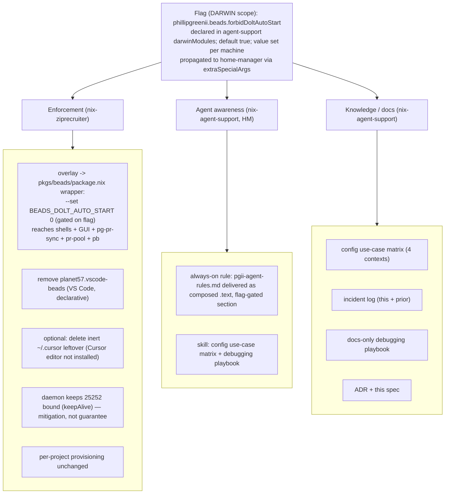

# Design: Machine-wide "no rogue dolt auto-start" guarantee for beads

- **Date:** 2026-07-24
- **Status:** Draft — revised after independent review (rev 2)
- **Owner repo:** `phillipgreenii-nix-agent-support` (declares the policy flag + propagates it to home-manager + agent awareness + docs)
- **Consumer repo:** `phillipg-nix-ziprecruiter` (enforcement wiring: `bd` overlay env + VS Code extension removal)

> **Review incorporated (rev 2):** enforcement moved from the home-module `bd` to the pkgs/overlay chokepoint (B1); flag moved to darwin scope with home-manager propagation (B1); precise `wrapProgram` mechanism (B2); corrected S1 — the Cursor _editor_ is not installed, so its extension copy is an inert leftover, not an active caller (optional hygiene removal only); always-on rule switched to composed `.text` (S2); `keepAlive` treated as a service-module invariant, not a machine option (S3); port invariant qualified as mitigation, not guarantee (S4); matrix root-daemon row marked forward-looking (N3).

## 1. Problem

On `phillipg-mbp-02`, beads (`bd`) repeatedly broke because a **second, config-less `dolt sql-server` kept binding `127.0.0.1:25252`**, starving the legitimate shared server. The legitimate server is a per-user launchd agent (`org.nixos.beads-dolt-server`, `keepAlive=true`) serving the real data (`~/.local/share/beads-dolt`: `pg2` 178M + `zr` 19G). While the rogue held the port, launchd respawned the daemon in a crash-loop (`LastExitStatus=256`, "Port 25252 already in use") and every `bd` call hit the wrong (near-empty) DB.

### Root cause (this incident)

The **`planet57.vscode-beads` VS Code extension** polls `bd dolt status` every `beads.refreshInterval` (default **3000 ms**) and, on connect / on any connection error, runs **`bd dolt start`**, spawning `dolt sql-server -H 127.0.0.1 -P 25252` (no `--config`) rooted at the workspace-local `./.beads/dolt` (~52K empty DB).

### Prior incident (same class)

A **non-dolt daemon that shells out to `bd` on a timer** (a PR-sync / maintenance daemon) ran without the user-level environment, so its `bd` calls resolved config differently and started a competitor. Class: **a caller starts a competing server because it does not inherit the machine's intended beads/dolt config.** This is why enforcement must reach launchd daemons, not just shells (see §2, B1).

## 2. Key facts from config research + review (bd 1.0.4)

- **`dolt.auto-start` is per-project only** (`.beads/config.yaml`). There is **no** global `config.yaml` for it. A `~/.config/bd/config.yaml` does **not** control auto-start. _(Retires the "set it in a global config file" idea.)_
- **`BEADS_DOLT_AUTO_START=0` is a true, cwd-independent switch** for _transparent_ auto-start (bd's error text pairs it with `dolt.auto-start: false`).
- **No config/env value suppresses explicit `bd dolt start`** in `dolt_mode: server` (only `embedded` refuses, which is incompatible with the shared server). Explicit starts can only be prevented by removing/guarding the caller or by holding the port.
- **The chokepoint is the OVERLAY, not `home.packages`.** `nix-ziprecruiter/machines/default.nix:146-154` overlays `pkgs.llm-agentsPkgs.beads = callPackage ../pkgs/beads/package.nix {}`. Consumers that resolve `bd` from that pkgs attribute — **`pg-pr-sync` daemon** (`darwin/services/pg-pr-sync/default.nix:10,57-73`), **pr-pool / pb** (`agent-support/flake.nix:133,138,1862`), shells, and GUI apps — all get whatever that derivation's wrapper sets. `package.nix:78-82` already `--set BD_BACKUP_ENABLED 0`. A `home.packages`-level override reaches **none** of the launchd daemons — the same blind spot that makes `home.sessionVariables` insufficient (`package.nix:65-77`). **Therefore the env MUST be set in the overlay/`package.nix` wrapper.**
- **Scope conflict:** the chokepoint is at **darwin/pkgs** scope; a home-manager option cannot gate it. The flag is therefore declared at **darwin** scope and propagated into home-manager for the HM-scoped consumers (rule, skill, vscode removal).
- **The extension has no off switch.** The active poller was the nix-managed VS Code extension (`home/programs/vscode/default.nix:10`). A second copy exists at `~/.cursor/extensions/planet57.vscode-beads-0.12.0-universal`, but the **Cursor editor is not installed** (no `/Applications/Cursor.app`; `~/.cursor` belongs to the Cursor _CLI agent_, not an editor extension host). That copy is an **inert leftover**, not an active poller; deleting it is optional hygiene.
- **Open item:** whether bd central config (`BEADS_CENTRAL_CONFIG`) accepts `dolt.auto-start` as a default — optional backstop only; not required.

## 3. Goals / non-goals

**Goals**

- G1. No context on this machine — **including launchd daemons** — transparently auto-starts a dolt server.
- G2. The active caller that ran explicit `bd dolt start` unconditionally — the VS Code extension — is removed (declarative). The inert `~/.cursor` leftover is optionally cleaned up (Cursor editor not installed).
- G3. The whole policy is gated by a **single flag**, opt-in per machine.
- G4. Future agents are made aware of the failure mode and equipped to debug it.
- G5. Past incidents and the debugging method are recorded.

**Non-goals**

- N1. Blocking explicit `bd dolt start` / `dolt sql-server` (user directive: the daemon starts dolt directly; legit test servers must remain possible).
- N2. Changing the shared-server architecture, ports, or per-project provisioning.
- N3. A packaged diagnostic tool (playbook is docs-only).

## 4. Policy (RFC 2119)

- P1. When the flag is enabled, the machine-wide `bd` derivation (the overlay/`package.nix` wrapper) **MUST** export `BEADS_DOLT_AUTO_START=0`, so every consumer — shells, GUI apps, **and launchd daemons (user or root)** — inherits it.
- P2. When the flag is enabled, `planet57.vscode-beads` **MUST NOT** be installed via nix (VS Code). The inert `~/.cursor/extensions` copy **MAY** be removed as hygiene; it is not an active poller (Cursor editor not installed).
- P3. The shared `org.nixos.beads-dolt-server` agent **MUST** stay `keepAlive=true` and own `127.0.0.1:25252`. This is a **mitigation** (it downgrades stray explicit starts to no-ops _while it holds the port_), **not a guarantee** — restart/activation/OOM windows exist where the port is briefly free.
- P4. Per-project `.beads/` **MUST** stay `dolt_mode: server`, `dolt-server.port = 25252`, `dolt.auto-start: false` (already provisioned).
- P5. The flag **SHOULD** default enabled (secure-by-default); a machine where auto-start is acceptable **MAY** set it `false`.
- P6. Enforcement, the always-on rule, the skill, and both extension removals **MUST** read the one flag; none may hardcode the policy.

## 5. Architecture



**Patterns:** _feature toggle_ (flag), _facade / single chokepoint_ (overlay `bd` wrapper), _defense-in-depth_ (env default reaching all contexts + caller removal + port mitigation), _fail-safe default_.

## 6. Component design

### 6.1 The flag (darwin scope + HM propagation)

- **Option:** `phillipgreenii.beads.forbidDoltAutoStart`, declared with `lib.mkOption { type = lib.types.bool; default = true; description = "..."; }` (plain `mkOption` for clean rendered text; `default = true` is a safe plain default — not a bundle/`mkDefault`, no opposing-`mkDefault` risk).
- **Declared in:** agent-support's **darwin** module (`darwinModules.default = ./darwin`), because the enforcement chokepoint (the overlay) is darwin-scoped. Confirmed in scope: `nix-ziprecruiter/darwin/system/default.nix:16` imports `phillipgreenii-agent-support.darwinModules.default`.
- **Propagated to home-manager:** the same agent-support darwin module sets `home-manager.extraSpecialArgs.forbidDoltAutoStart = config.phillipgreenii.beads.forbidDoltAutoStart;` so HM-scoped consumers (the agent-rule module, the skill enablement, the vscode removal at `home/programs/vscode`) can read it. (`nix-ziprecruiter/darwin/system/default.nix:61` imports `...homeModules.default`, and HM is configured in that darwin config, so `extraSpecialArgs` reaches all HM modules.)
- **Value set in:** `nix-ziprecruiter/machines/phillipg-mbp-02/default.nix` (explicit `= true;` for auditability).
- **Note (N1):** agent-support's existing `home/programs/beads/default.nix` is dormant here (`config` gated on `mkIf cfg.enable`, and `beads.enable` is not set — the live one is `nix-ziprecruiter/home/programs/beads/default.nix`). Only the _option declaration_ + propagation belong in agent-support; no config-side enforcement goes there.

### 6.2 Enforcement (nix-ziprecruiter)

**6.2.1 `bd` overlay env default.** In `machines/default.nix` (where the overlay lives and `config` is in scope), pass the flag into the package:

```nix
# nix-ziprecruiter/machines/default.nix (illustrative — inside the module, config in scope)
nixpkgs.overlays = [
  (final: prev: {
    llm-agentsPkgs = prev.llm-agentsPkgs // {
      beads = final.callPackage ../pkgs/beads/package.nix {
        forbidDoltAutoStart = config.phillipgreenii.beads.forbidDoltAutoStart;
      };
    };
  })
];
```

```nix
# nix-ziprecruiter/pkgs/beads/package.nix (illustrative — parameterize the single wrapProgram)
{ /* … existing args … */ forbidDoltAutoStart ? true }:
# … in postInstall, ONE wrapProgram call:
#   wrapProgram $out/bin/bd \
#     --prefix PATH : ${dolt}/bin \
#     --set BD_BACKUP_ENABLED 0 \
#     ${lib.optionalString forbidDoltAutoStart "--set BEADS_DOLT_AUTO_START 0"}
```

- Mechanism note (B2): parameterize the package and add the flag to the **existing** `wrapProgram` (no second wrapper, no `postInstall` duplication). The override touches only build-arg/`postInstall`, **never `src`** — `package.nix:136-139` warns that an `overrideAttrs { src = …; }` desyncs the vendor FOD; a build-arg parameter avoids that entirely.
- Recursion caveat: referencing `config.<flag>` inside `nixpkgs.overlays` is safe here because the flag is a plain bool with no pkgs dependency, but implementation **MUST** confirm `nix flake check` / eval shows no infinite recursion. **Fallback** if it does: bake `--set BEADS_DOLT_AUTO_START 0` unconditionally into `package.nix` (mirroring `BD_BACKUP_ENABLED`) and let the flag gate only the removals/rule/skill/docs — accepting the env as always-on for this fleet's `bd`.

**6.2.2 Remove the extension (VS Code).**

- Remove `planet57.vscode-beads` from `home/programs/vscode/default.nix:10`, gated on the flag. This was the only active poller.
- The `~/.cursor/extensions/planet57.vscode-beads-0.12.0-universal` copy is an inert leftover — the Cursor editor is not installed (`~/.cursor` is the Cursor CLI agent's dir). It is not part of the failure and not nix-managed; deleting the stale dir is optional hygiene, noted in the incident log.

**6.2.3 Daemon invariant.** `keepAlive = true` is hardcoded in the service module (`darwin/services/beads-dolt-server/default.nix:108`), not a machine option (S3). Document it as an invariant there (comment/test); do **not** assert a non-existent `services.beads-dolt-server.keepAlive` option. Treat it as a mitigation per P3.

**6.2.4 Provisioning.** Unchanged.

### 6.3 Agent awareness (nix-agent-support, HM, flag-gated via specialArg)

**6.3.1 Always-on rule.** `home/programs/agent-rules/default.nix` currently does `home.file.".claude/CLAUDE.md".source = ./pgii-agent-rules.md`. A `.source` store path cannot include/exclude a section conditionally (S2). Switch delivery to composed text:

```nix
# illustrative
home.file.".claude/CLAUDE.md".text =
  builtins.readFile ./pgii-agent-rules.md
  + lib.optionalString forbidDoltAutoStart (builtins.readFile ./beads-dolt-rule.md);
```

The module reads `forbidDoltAutoStart` from the specialArg (§6.1). Rule content: the invariant ("this machine forbids dolt auto-start; the shared daemon owns 25252"), the smell ("dolt server restart-loop / 'database not found' / bd on an empty DB"), and a pointer to the skill.

**6.3.2 Skill.** New skill in `claude-marketplace` (own plugin dir, `SKILL.md` + `references/`), triggers on "beads/dolt server keeps restarting", "which process starts dolt", "debug beads server". Body: recognize the failure, the use-case matrix, the debugging playbook.

### 6.4 Knowledge / docs (nix-agent-support)

**6.4.1 Config use-case matrix:**

| Context                    | How it starts          | Sees shell env? | How it gets the default | Real `bd` consumer today?                          |
| -------------------------- | ---------------------- | --------------- | ----------------------- | -------------------------------------------------- |
| User CLI shell             | interactive login      | yes             | overlay `bd` wrapper    | yes                                                |
| GUI app (VS Code)          | launchd `gui/UID`      | no              | overlay `bd` wrapper    | yes (extension — being removed)                    |
| Per-user launchd agent     | plist, `gui/UID`       | no              | overlay `bd` wrapper    | yes (`pg-pr-sync`)                                 |
| Root/system launchd daemon | plist, `system` domain | no              | overlay `bd` wrapper    | **none today** (only Caddy proxy); forward-looking |

Takeaway: the overlay wrapper is the only mechanism common to all rows; `home.packages`/`sessionVariables` miss the daemon rows.

**6.4.2 Incident log** (repo-convention home; e.g. `docs/runbooks/` or beads docs):

- _2026-07-24 — vscode-beads rogue server._ Signature: 2 dolt servers on 25252, daemon `LastExitStatus=256` crash-loop, `bd dolt start` ppid = VS Code extension host. Fix: remove the VS Code extension, `BEADS_DOLT_AUTO_START=0` in the overlay `bd`, kill rogue → daemon binds. (An inert `~/.cursor` copy exists but the Cursor editor is not installed.)
- _Prior — non-dolt daemon shelling `bd` without user env._

**6.4.3 Debugging playbook (docs-only):** `ps -axo pid,ppid,lstart,command | grep 'dolt sql-server'` (config vs config-less; start times) → `lsof -nP -iTCP:25252 | grep LISTEN` (port holder) → `launchctl list org.nixos.beads-dolt-server` (PID churn + `LastExitStatus`) → read both `dolt-server.log`s → narrow the caller (enumerate launchd jobs + `pg-launchd` wrappers; Claude hooks; a fast `ps` **spawn-catcher** recording PPID/parent-command to catch the ephemeral `bd`; shut down suspect daemons/editor windows/Claude sessions one at a time) → confirm data safety (`du -sh` daemon vs local; `bd stats`) before killing.

**6.4.4 ADR** — `docs/adr/NNNN-beads-dolt-no-autostart.md`.

## 7. Implementation plan

Ordering: T1 first (declares + propagates the flag). Agent-support tasks (T1, T5–T7) are unblocked. ziprecruiter tasks (T2–T4) are **blocked** on the dirty `nix-ziprecruiter/CLAUDE.md` (see §8). T8 validates.

- **T1 (agent-support):** Declare `phillipgreenii.beads.forbidDoltAutoStart` (`mkOption`, bool, default true) in the darwin module; set `home-manager.extraSpecialArgs.forbidDoltAutoStart`. Confirm no eval conflict with the dormant beads home module.
- **T2 (ziprecruiter):** Parameterize `pkgs/beads/package.nix` with `forbidDoltAutoStart` and add the flag-gated `--set BEADS_DOLT_AUTO_START 0` to the existing `wrapProgram`; pass the flag through the `machines/default.nix` overlay. Validate no eval recursion; confirm a built `bd` carries the var.
- **T3 (ziprecruiter):** Remove `planet57.vscode-beads` from `home/programs/vscode/default.nix` under the flag. Optionally delete the inert `~/.cursor/extensions/planet57.vscode-beads-*` leftover (hygiene; Cursor editor not installed).
- **T4 (ziprecruiter):** Set `forbidDoltAutoStart = true;` in `machines/phillipg-mbp-02/default.nix`; add a comment/test documenting the `keepAlive=true` service invariant (no fake option).
- **T5 (agent-support):** Convert `agent-rules` delivery to composed `.text`; add the flag-gated beads/dolt rule file; read the flag via specialArg.
- **T6 (agent-support):** Create the skill (SKILL.md + references); wire into the marketplace build.
- **T7 (agent-support):** Write docs — use-case matrix, incident log (incl. Cursor), playbook, ADR.
- **T8 (both):** Validate — `nix flake check` per repo; `darwin-rebuild check --flake .` build-only (needs the updated agent-support input via `--override-input` or lock bump); grep the built `bd` wrapper for `BEADS_DOLT_AUTO_START`; confirm `planet57.vscode-beads` absent from the built profile; confirm the composed CLAUDE.md contains the rule when the flag is on.

## 8. Cross-repo & isolation notes

- Change spans two repos (ziprecruiter → agent-support). Building ziprecruiter against the new option requires an input override / lock bump.
- This is a **pn-workspace**. Cross-repo work should go through a **coordinated workforest** (fork → work → validate → land); landing is **out of scope** here (do not commit yet).
- **Blocker:** `nix-ziprecruiter` canonical is on `main` but has an uncommitted modified `CLAUDE.md` not created this session. Per worktree discipline (R-3) the agent must not stash/reset/work around it. ziprecruiter tasks (T2–T4) and end-to-end validation (T8) are **held** until it is resolved. Agent-support tasks (T1, T5–T7) may proceed in an isolated worktree; their standalone `nix flake check` runs without ziprecruiter, but the full darwin build validation waits.

## 9. Open questions

- OQ1. Confirm the overlay-reads-`config` pattern evaluates without recursion; if not, use the §6.2.1 unconditional-bake fallback.
- OQ2. Decide whether to add a real `keepAlive` option to the service module (for machine-assertability) or keep it a hardcoded invariant with a comment/test (S3).
- OQ3. (Resolved) Cursor editor is not installed; the `~/.cursor` extension copy is inert. Optional stale-dir cleanup only.
- OQ4. Confirm whether bd central config accepts `dolt.auto-start` (optional backstop).
- OQ5. Home for the incident log / playbook (repo convention).
