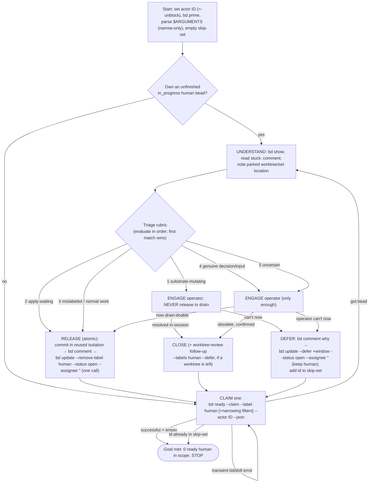

# `/unblock-human-beads` — drain the human-blocked bead queue by unblocking — Design

**Status**: Draft (awaiting final review; revised after two independent design reviews)
**Date**: 2026-07-27
**Deciders**: Phillip Green II
**Beads**: none (built interactively). This command automates the recurring
_manual_ pattern captured by the `pg2-umg05` / `pg2-aqe2b` lineage
("drain `bd ready --label human` queue").

> Brainstorming output. The executable, task-by-task plan is produced separately
> (writing-plans) into `docs/superpowers/plans/`.

---

## Context

`/drain-beads` (`claude-marketplace/pb/commands/drain-beads.md`) is an autonomous
orchestrator that drains this pn-workspace's `bd` queue: it loops
`claim → isolate → delegate → validate → land → close`, cooperating with concurrent
drain sessions via atomic claims. Its CLAIM and TERMINATION both use
`bd ready --exclude-label human`, so a bead carrying the **`human`** label is
deliberately parked — invisible to every drain session until a person clears it.

The `human` label is applied three ways:

1. `/drain-beads` **STUCK** — a bead a drain session could not finish (underspecified,
   needs a decision, pre-apply gates cannot pass). It parks the WIP (keeping the isolated
   worktree/branch), comments where the WIP is parked (`branch drain/<id>` in the repo at
   its worktree path), labels `human`, then unclaims.
2. **Gate stale-conversion** — `pb gate check` converts a `pn:applied` gate that has sat
   unapplied past its stale window into a `human` bead.
3. **By hand** — the operator labels something for their own attention.

Clearing that parked queue is today a **manual** activity (see `pg2-umg05`'s notes —
"~33 remain", bucketed into _design/decision-needed_, _deploy-gated_,
_concurrent/architectural_, and _P4 nits_). This command automates it: it is the
`human`-queue counterpart to `/drain-beads`, and it mirrors drain's loop shape.

### What `/drain-beads` already handles — plus the one additive change

Two worries were checked and are already covered, so no _behavioral_ change to drain is
needed for them:

- **Deferred.** `bd ready` excludes deferred by default (its help: _"Excludes
  in_progress, blocked, deferred, and hooked issues"_). Every relevant query — drain's
  CLAIM/TERMINATION and this command's `bd ready --claim --label human` — is
  deferred-safe by construction. Drain's only non-`bd ready` query, its resume
  `bd list --status in_progress --assignee <id>`, is status-filtered, so a deferred bead
  cannot match.
- **Worktree reuse on re-claim.** Drain's single-repo ISOLATE reuses an existing parked
  worktree/branch (_"if that worktree/branch already exists … REUSE it"_,
  `.worktrees/<id>` on `drain/<id>`). For multi-repo, drain re-invokes `fork-workforest`,
  whose preflight returns `resume` when the set already exists — its option (a) is "just
  `cd` into it and continue". Either way an already-parked isolation is reused, so once
  this command releases a parked bead, drain picks it up and continues there.

**The one change to `/drain-beads`:** it gains the same **query-restricting arguments**
this command needs (see "Shared feature" below). Both commands accept optional
`$ARGUMENTS` that only ever _narrow_ the claim query. That is the sole edit to
`drain-beads.md`.

---

## Goals / Non-goals

**Goal.** For each ready `human` bead, do **only enough to lift the _human_ blocker**,
then release the bead so a separately-running `/drain-beads` can finish it.

**"Only enough" is a bound on _how far_, not on _what kind of action_.** Unblocking MAY
require any of: answering a question in the bead, making and recording a decision,
clarifying/refining a bead's description or acceptance criteria, touching an external
system, or making a _small_ code/doc change. The command is **not** limited in the kind
of action it may take — it is limited to the minimum that removes the blocker.

**Stop predicate (the anti-"keep completing it" guard).** The human blocker is lifted the
instant the bead **no longer needs a human's input or decision to proceed as ordinary
drain work**. At that instant the command **MUST STOP and RELEASE — even if the
implementation is 0% done.** Driving the bead further toward completion is the observed
failure mode and is forbidden. (Only the substrate-mutating class below is finished
in-session, because drain cannot safely take it — see the rubric.)

**Non-goals.** The command **MUST NOT**:

- **drive the bead to completion** (except the substrate-mutating carve-out), land,
  merge, or push anything;
- change any command other than the additive `$ARGUMENTS` support on `drain-beads.md`.

**Terminal actions (exactly one per claimed bead) — there is no automatic "re-park".**

- **RELEASE** (default) — the human blocker is lifted; hand the bead to the drain pool.
  Applied only when drain can actually make progress on what remains.
- **CLOSE** — the bead is already satisfied/obsolete (operator-confirmed), or a
  substrate-mutating bead was resolved in-session; nothing left for drain to do.
- **DEFER** (operator-initiated, or a substrate/human-only-action bead that cannot be
  done now) — the operator decides it cannot be resolved right now. No re-park machinery:
  a defer removes the bead from the ready queue so the loop continues and terminates; the
  bead keeps its `human` label and resurfaces when the defer window passes.

---

## The loop (mirrors `/drain-beads`)

### Steps

1. **Actor id** — pick a STABLE, UNIQUE id **distinct from drain's**: prefer
   `${CLAUDE_SESSION_ID}-unblock` (else the session-private-path UUID + `-unblock`; last
   resort a remembered random UUID). The `-unblock` suffix is load-bearing: `/drain-beads`
   resume (`bd list --status in_progress --assignee ID`, no label filter, `drain-beads.md:59`)
   would otherwise recover this command's in-progress `human` beads if both ran under the
   same `$CLAUDE_SESSION_ID` in one session. Pass the id as `--actor` on every
   claim/unclaim/comment/close/defer.
2. **Resume** — recover a bead you already own but did not finish:
   `bd list --status in_progress --assignee "ID" --label human --json`. If one exists,
   resume it before claiming new work.
3. **CLAIM** (atomic, race-safe — the only claim path):
   `bd ready --claim --label human [+ narrowing filters from $ARGUMENTS] --actor "ID"
--json`. A **successful empty** result → **DONE, STOP**. A returned id that is already
   in the session skip-set → **DONE, STOP** (guards a short-window defer that resurfaced).
   A **transient error** (bd/dolt blip) → back off and retry; never treat an error as
   empty.
4. **UNDERSTAND** — `bd show <id>`; read the `stuck:` comment/description and, if drain
   parked one, the worktree/branch/set location.
5. **TRIAGE + UNBLOCK** — classify with the rubric (first match wins) and do only enough
   to lift the human blocker; engage the operator only when human input is required. Any
   committed code/docs go in the **reused** parked isolation (see Reuse rule). Obey the
   Stop predicate.
6. **Terminal action** — RELEASE / CLOSE / DEFER as above. On RELEASE the label-removal +
   unclaim is a **single atomic `bd update`** performed only after the explanatory
   `bd comment` (and any commit) lands. On DEFER, add the id to the session skip-set.
7. **Loop** to step 3.

While a bead is claimed (`in_progress` + owned), it is invisible to every drain and peer
unblock session (`bd ready` excludes `in_progress`), so all step-5/6 work happens with no
race. The bead re-enters a queue only at the terminal action (RELEASE → drain pool;
DEFER → hidden until the window; CLOSE → gone).

---

## Per-bead triage rubric (evaluate in order; first match wins)

The rubric is the load-bearing judgment; it MUST be explicit in the command so an agent
both auto-resolves no-human-needed beads without nagging the operator and never silently
resolves something that genuinely needed a person. **Order matters** — a bead that
matches more than one class is handled by the first it matches (so substrate-mutating
dominates).

| #   | Class                        | How to recognize                                                                                                                                                                                                                         | Action                                                                                                                                              |
| --- | ---------------------------- | ---------------------------------------------------------------------------------------------------------------------------------------------------------------------------------------------------------------------------------------- | --------------------------------------------------------------------------------------------------------------------------------------------------- |
| 1   | **substrate-mutating**       | carries the `worktree-review` label, OR its work would remove/prune worktrees or workforest sets, delete `.worktrees/*`, or otherwise mutate the shared isolation substrate other sessions depend on (drain's "unscoped claims" warning) | **ENGAGE; NEVER RELEASE to drain** (drain auto-claims and prunes unattended). Resolve in-session **with** the operator, serially → CLOSE; or DEFER. |
| 2   | **apply-waiting**            | "verify/act after apply", deploy-gated content                                                                                                                                                                                           | **RELEASE.** The command assumes `pn workspace apply` was run before it — see below.                                                                |
| 3   | **mislabeled / normal work** | the label's reason is provably moot (referenced worktree already gone, decision already recorded later, transient infra passed) and no human input is needed                                                                             | **RELEASE** — no operator prompt.                                                                                                                   |
| 4   | **genuine decision/input**   | needs a design/architectural decision, is underspecified, or otherwise needs a person to move it forward                                                                                                                                 | **ENGAGE** (only enough) → RELEASE if now drain-doable / CLOSE / DEFER.                                                                             |
| 5   | **uncertain**                | cannot confidently place the bead above                                                                                                                                                                                                  | treat as genuine → **ENGAGE** (conservative; never silently auto-resolve).                                                                          |

**apply-waiting = trust, always.** This command **expects `pn workspace apply` to have
been run before it is invoked.** Every apply-waiting bead is RELEASEd on that premise; the
command does **not** verify applied-ness (there is no readable signal distinguishing an
already-applied change from a not-yet-applied one, confirmed by inspecting `pb`). Accepted
trade-off: a bead whose specific change was somehow _not_ in that apply round-trips
(drain can't confirm → STUCK → re-`human`) and reappears next run — self-correcting, not
dangerous.

---

## Isolation: reuse vs create

- **Reuse (existing parked isolation for the bead) — always, directly.** `cd` into the
  parked single-repo worktree or multi-repo set and do the minimal work there; commit on
  the parked branch. Do **not** invoke `fork-workforest`; do **not** clean it up.
- **Create (no isolation exists) — single-repo only.** If committed code is genuinely
  required and no parked isolation exists, create it at drain's exact convention:
  `git worktree add .worktrees/<id> -b drain/<id>` (off local main), so drain's ISOLATE
  reuses it on re-claim.
- **Never create a fresh multi-repo set mid-session.** `fork-workforest` MUST run from the
  canonical workspace root and MUST NOT be nested inside a set. If a _new_ multi-repo
  isolation would be needed, record the decision/plan on the bead and RELEASE (or DEFER) —
  let `/drain-beads` fork it.

---

## Shared feature: query-restricting arguments (both commands)

Both `/unblock-human-beads` and `/drain-beads` accept optional `$ARGUMENTS` (freeform
additional context). This is the sole change to `drain-beads.md`.

- Arguments may only **NARROW** the claim query — e.g. an extra label, a priority, a
  parent/epic, a type, a specific bead id, or a one-bead / N-bead limit ("just one").
- Arguments **MUST NOT broaden** scope or remove the safety filters: `/drain-beads` keeps
  `--exclude-label human` and deferred-exclusion; `/unblock-human-beads` keeps
  `--label human` and deferred-exclusion. Narrowing only, always.
- Filters mapping to `bd ready` flags (`--label`, `--priority`, `--parent`, `--type`,
  `-n/--limit`) are applied there. "Run for one bead" is a loop limit (process one, stop).
- **Specific bead id (safe path):** because `bd ready --claim` claims the _first_ match,
  a chosen id is honored by (1) confirming that id appears in `bd ready --label human
[scope] --json` (ready, in-scope, `human`, not deferred), then (2) claiming it with
  `bd update <id> --claim --actor "ID"` (the single-id claim). This preserves the Sourcing
  invariant (a non-`human`/deferred id is rejected);
  the residual check-then-claim TOCTOU is acceptable because the claim is idempotent for
  the owning actor.
- Frontmatter gains an `argument-hint` documenting the accepted restrictions.

---

## Invariants (RFC 2119)

- **Sourcing / deferred-safety.** Work **MUST** be claimed only via
  `bd ready --claim --label human` (plus narrowing `$ARGUMENTS`); the command **MUST NOT**
  use `bd list --label human` as a work source and **MUST NOT** pass `--include-deferred`.
  A specific-id claim **MUST** first confirm the id is in the `bd ready --label human`
  set.
- **Minimality + stop predicate.** The command **MUST** stop and RELEASE the instant the
  bead no longer needs a human to proceed as ordinary drain work; it **MUST NOT** drive
  the bead to completion (except the substrate carve-out), land, merge, or push.
- **RELEASE only when drain can progress.** A bead **MUST** be RELEASEd only when drain
  can actually make progress on what remains. A bead whose only remaining work is a
  human-only action drain cannot perform is DEFERred or left `human`, not released
  (apply-waiting is exempt: it is RELEASEd on the pre-apply premise above).
- **Substrate guard.** A substrate-mutating bead (rubric #1) **MUST NOT** be RELEASEd to
  drain and **MUST NOT** be auto-actioned; it is engaged with the operator (serial,
  in-session) or DEFERred/left `human`.
- **Atomic release ordering.** On RELEASE the `human`-label removal, `status=open`, and
  `assignee=""` **MUST** be a **single** `bd update` call, after the explanatory
  `bd comment` (and any commit) has landed — no crash window leaving a label-less
  `in_progress` orphan.
- **Reuse.** The command **MUST** reuse an existing parked isolation and **MUST NOT** clean
  it up. It **MAY** create single-repo isolation at drain's convention when none exists and
  committed code is required; it **MUST NOT** create a fresh multi-repo set mid-session.
- **DEFER termination.** A DEFER **MUST** use a window that outlives the session (floor
  `+1d`) and **MUST** add the id to a session-local skip-set; a CLAIM returning a skip-set
  id **MUST** terminate the run. Together these guarantee the loop cannot re-nag the
  operator about a just-deferred bead.
- **Distinct actor.** The command's actor id **MUST** be distinct from any concurrent
  `/drain-beads` actor (the `${CLAUDE_SESSION_ID}-unblock` suffix), so drain's
  label-unfiltered resume cannot recover this command's in-progress `human` beads.
- **Close guard.** The command **MUST NOT** close a bead without explicit operator
  confirmation (or an in-session-resolved substrate bead); if a worktree is left, it
  **MUST** file a `worktree-review` follow-up bead
  (`bd create … --labels human --defer +window --deps "discovered-from:<id>"`) rather than
  orphan it or feed drain a substrate task.
- **Arguments narrow-only.** `$ARGUMENTS` **MUST** only restrict the claim query and
  **MUST NOT** remove safety filters or broaden scope (both commands).
- **Actor discipline.** Every `bd` claim/unclaim/comment/close/defer **MUST** carry the
  session's stable `--actor "ID"`.

---

## Concurrency & known limitations (accepted trade-offs)

- **Parallel-safe claims.** N `unblock-human-beads` sessions (distinct actor ids) never
  claim the same bead — atomic `bd ready --claim --label human` hands each to one session.
  Honest caveat: parallelism helps throughput on **auto-resolvable** beads (apply-waiting /
  mislabeled); **genuine-human** beads serialize on the one operator.
- **Runs alongside `/drain-beads`.** Intended: each RELEASE hands a now-unlabeled `open`
  bead to the drain pool, which drain claims and finishes (reusing the parked isolation).
  Disjoint claim sets (`--label human` vs `--exclude-label human`).
- **Stranded orphans.** As with `/drain-beads`, a mid-work crash leaves the bead
  `in_progress` owned by a dead actor id; only that same id resumes it. A human should
  periodically re-open stale in-progress human beads
  (`bd update <id> --status open --assignee ""`). The atomic-release invariant removes the
  _release-window_ orphan specifically.
- **apply-waiting trust.** As above — an apply-waiting bead whose change wasn't actually in
  the operator's apply round-trips harmlessly (self-correcting churn).
- **in_progress human beads are untouched.** `bd ready` excludes `in_progress`, so a human
  bead already owned/in-flight (e.g. `pg2-umg05`) is never claimed.

---

## The command files

### New — `claude-marketplace/pb/commands/unblock-human-beads.md`

Sibling to `drain-beads.md`. Frontmatter: a `description:` (the `human`-queue counterpart
to `/drain-beads` that claims one parked `human` bead at a time, does only enough to lift
the human blocker reusing drain's parked isolation, then releases it to the drain pool —
explicitly not a completer/lander, closing only operator-confirmed obsolete beads) plus an
`argument-hint`. Body mirrors `drain-beads.md`: distinct-actor-id note, resume/startup,
the CLAIM→UNDERSTAND→TRIAGE→terminal loop, the triage rubric (with precedence), the
isolation rule, the invariants (minimality/stop-predicate, RELEASE-only-when-drain-can-
progress, substrate guard, atomic-release, reuse, DEFER-termination, distinct-actor,
close-guard), the shared-arguments contract, a limitations section, and the mermaid loop
diagram. It **MUST** carry the future-editor rationale for the Sourcing Invariant so
deferred-safety cannot silently regress.

### Edit — `claude-marketplace/pb/commands/drain-beads.md`

Add only the **query-restricting `$ARGUMENTS`** support: an `argument-hint` in frontmatter
and a short "Optional scope arguments" section stating that any provided context narrows
the `bd ready --claim --exclude-label human` query (labels/priority/parent/type/limit or a
specific bead id, honored via the same safe confirm-then-claim path) and **MUST NOT**
remove `--exclude-label human` or the deferred exclusion, nor broaden scope. No other
behavioral change.

---

## Validation

Prompt-docs plus this design doc — no unit-testable code. Validation is the repo's
standard gate set, which **MUST** pass before the change is claimed complete:

- `prek run --all-files` (or `pre-commit run --all-files`) — includes prettier for `*.md`;
  follow the repo's markdown conventions (backtick glob patterns, paths with underscores,
  and identifiers).
- `nix flake check` — validates the flake, including however the claude-marketplace plugin
  set is assembled.

Manual acceptance: run against the live `bd ready --label human` queue and confirm it (a)
claims one bead at a time within any `$ARGUMENTS` scope, (b) RELEASEs apply-waiting and
mislabeled beads without prompting, ENGAGEs genuine-human beads, and NEVER releases a
substrate-mutating bead to drain, (c) never proceeds to completion (except a substrate bead
resolved in-session) and releases via the single atomic `bd update`, (d) reuses (never
cleans up) parked isolation, (e) DEFERs with a ≥`+1d` window and does not re-nag within the
run, and (f) uses a distinct `-unblock` actor id. Also confirm `/drain-beads` still drains
normally and now honors a narrowing `$ARGUMENTS`.

---

## Out of scope / follow-ups

- **Retire the manual pattern.** Once this command exists, the manual
  `pg2-umg05` / `pg2-aqe2b` "drain the human queue" lineage is superseded and can be closed.
  Not done here (that bead is `in_progress` and owned) — noted as a follow-up.
- **apply-waiting → gate migration.** A future enhancement could proactively convert a
  detectably-unapplied apply-waiting bead into a fresh `pn:applied` gate. Deliberately out
  of scope: this command trusts the pre-apply premise instead.
