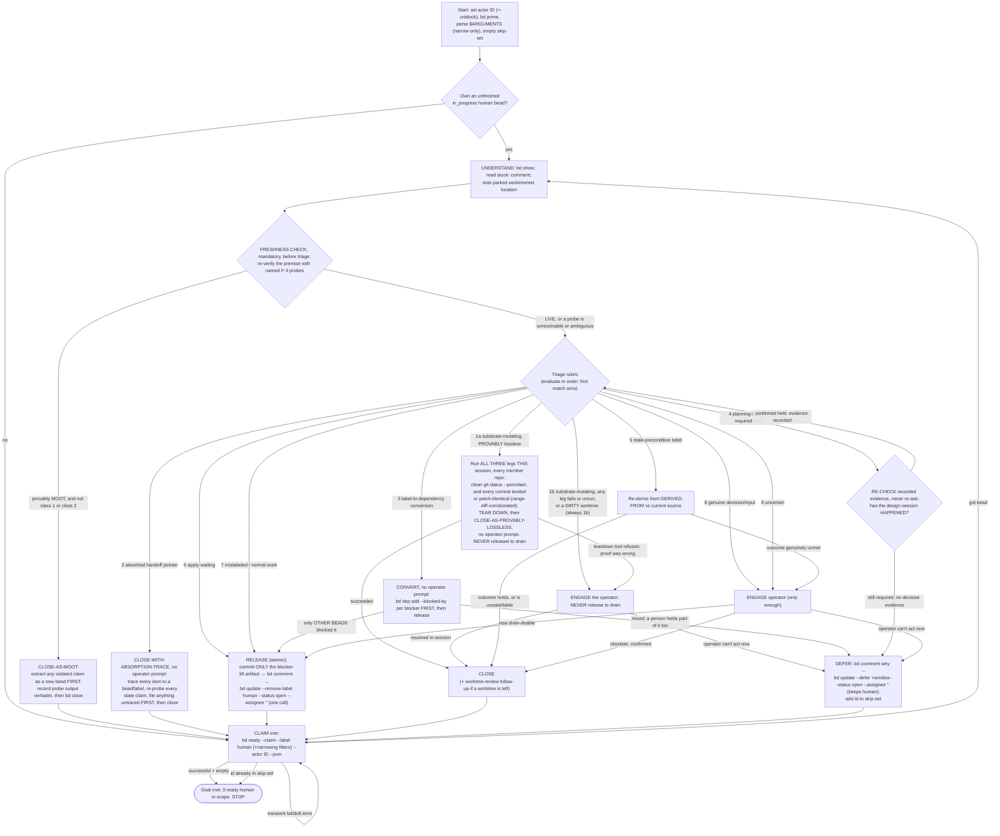

# `/unblock-human-beads` — drain the human-blocked bead queue by unblocking — Design

**Status**: Historical / superseded-by-the-command. The design landed, and the shipped
command has since gone through 6+ further revisions this document did not track in real
time (classes 2-5 of the current 9-row rubric, the FRESHNESS CHECK step, the
`worktree-review` exit lifecycle, CLOSE-AS-MOOT, and CLOSE-WITH-ABSORPTION-TRACE). It has
now been re-synced to cover every axis of the shipped command as of the date below, but —
per "Document status" at the end — it is **not** being kept in lockstep going forward.
`claude-marketplace/pb/commands/unblock-human-beads.md` is the sole source of truth for
current behavior; treat everything here as a snapshot.
**Date**: 2026-07-27 (original design); re-synced 2026-08-21
**Deciders**: Phillip Green II
**Beads**: none originally (built interactively). The drift and this re-sync were tracked
as `pg2-q62e8` (class-1 axis only, landed `f3ee8c16`) and `pg2-xo1j3` (this full re-sync).
This command automates the recurring _manual_ pattern captured by the `pg2-umg05` /
`pg2-aqe2b` lineage ("drain `bd ready --label human` queue").

> Brainstorming output. The executable, task-by-task plan is produced separately
> (writing-plans) into `docs/superpowers/plans/`. This particular spec was, atypically, kept
> as a tracked design record after the plan landed — see "Document status" at the end for
> why that convention is being retired for this file specifically, going forward.

---

## Context

`/drain-beads` (`claude-marketplace/pb/commands/drain-beads.md`) is an autonomous
orchestrator that drains this pn-workspace's `bd` queue: it loops
`claim → isolate → delegate → validate → land → close`, cooperating with concurrent
drain sessions via atomic claims. Its CLAIM and TERMINATION both use
`bd ready --exclude-label human`, so a bead carrying the **`human`** label is
deliberately parked — invisible to every drain session until a person clears it.

The `human` label is applied three ways:

1. `/drain-beads` **STUCK** — a bead a drain session could not finish (underspecified,
   needs a decision, pre-apply gates cannot pass). It parks the WIP (keeping the isolated
   worktree/branch), comments where the WIP is parked (`branch drain/<id>` in the repo at
   its worktree path), labels `human`, then unclaims.
2. **Gate stale-conversion** — `pb gate check` converts a `pn:applied` gate that has sat
   unapplied past its stale window into a `human` bead.
3. **By hand** — the operator labels something for their own attention.

Clearing that parked queue is today a **manual** activity (see `pg2-umg05`'s notes —
"~33 remain", bucketed into _design/decision-needed_, _deploy-gated_,
_concurrent/architectural_, and _P4 nits_). This command automates it: it is the
`human`-queue counterpart to `/drain-beads`, and it mirrors drain's loop shape.

### What `/drain-beads` already handles — plus the one additive change

Two worries were checked and are already covered, so no _behavioral_ change to drain is
needed for them:

- **Deferred.** `bd ready` excludes deferred by default (its help: _"Excludes
  in_progress, blocked, deferred, and hooked issues"_). Every relevant query — drain's
  CLAIM/TERMINATION and this command's `bd ready --claim --label human` — is
  deferred-safe by construction. Drain's only non-`bd ready` query, its resume
  `bd list --status in_progress --assignee <id>`, is status-filtered, so a deferred bead
  cannot match.
- **Worktree reuse on re-claim.** Drain's single-repo ISOLATE reuses an existing parked
  worktree/branch (_"if that worktree/branch already exists … REUSE it"_,
  `.worktrees/<id>` on `drain/<id>`). For multi-repo, drain re-invokes `fork-workforest`,
  whose preflight returns `resume` when the set already exists — its option (a) is "just
  `cd` into it and continue". Either way an already-parked isolation is reused, so once
  this command releases a parked bead, drain picks it up and continues there.

**The one BEHAVIORAL change to `/drain-beads`:** it gains the same **query-restricting
arguments** this command needs (see "Shared feature" below). Both commands accept optional
`$ARGUMENTS` that only ever _narrow_ the claim query. The only other edit to `drain-beads.md`
is non-behavioral: a statement that drain deliberately does NOT get this command's
provably-lossless teardown carve-out (see "The provably-lossless carve-out" below). Both of
these landed with the original design and are unchanged by the six later revisions.

---

## Goals / Non-goals

**Goal.** For each ready `human` bead, do **only enough to lift the _human_ blocker**,
then release the bead so a separately-running `/drain-beads` can finish it.

**"Only enough" is a bound on _how far_, not on _what kind of action_.** Unblocking MAY
require any of: answering a question in the bead, making and recording a decision,
clarifying/refining a bead's description or acceptance criteria, touching an external
system, or making a _small_ code/doc change. The command is **not** limited in the kind
of action it may take — it is limited to the minimum that removes the blocker.

**Stop predicate (the anti-"keep completing it" guard).** The human blocker is lifted the
instant the bead **no longer needs a human's input or decision to proceed as ordinary
drain work**. At that instant the command **MUST STOP and RELEASE — even if the
implementation is 0% done.** Driving the bead further toward completion is the observed
failure mode and is forbidden. (Only the substrate-mutating class below is finished
in-session, because drain cannot safely take it — see the rubric.)

**Non-goals.** The command **MUST NOT**:

- **drive the bead to completion** (except the substrate-mutating carve-out), land,
  merge, or push anything;
- change the BEHAVIOR of any command other than the additive `$ARGUMENTS` support on
  `drain-beads.md` (the carve-out asymmetry note added there changes nothing drain does).

**Terminal actions (exactly one per claimed bead) — there is no automatic "re-park".** A
mandatory FRESHNESS CHECK (see below) runs before triage on every claimed bead; a premise
the probes prove provably MOOT skips the rubric entirely and goes straight to CLOSE-AS-MOOT
— except for a class-1 substrate-mutating bead (still dispositioned by class 1 on the
isolation's own evidence) and a class-2 handoff pointer (still CLOSE-WITH-ABSORPTION-TRACE,
because its evidence is a trace of where items now live, not a probe reading).

- **RELEASE** (default) — the human blocker is lifted; hand the bead to the drain pool.
  Applied only when drain can actually make progress on what remains — with two exemptions
  from that condition: apply-waiting (class 6, released on the pre-apply trust premise) and
  a class-3 label-to-dependency conversion (released into the pool while still absent from
  `bd ready`, gated by the freshly-wired dependency edges rather than by drain-readiness).
- **CLOSE** — the bead is already satisfied/obsolete, or a substrate-mutating bead was
  resolved in-session; nothing left for drain to do. Four variants, each satisfying the
  close guard's "operator confirmation" via RECORDED EVIDENCE rather than a live prompt:
  - plain, operator-confirmed CLOSE — an ordinary obsolete/duplicate bead;
  - **CLOSE-AS-PROVABLY-LOSSLESS** — a rubric-1a substrate teardown closes here without an
    operator prompt, on its recorded three-leg proof (this is the original design's
    behavior, unchanged by the later revisions);
  - **CLOSE-AS-MOOT** — the FRESHNESS CHECK produces this when the bead's own premise is
    provably dead; the recorded probe output IS the confirmation;
  - **CLOSE-WITH-ABSORPTION-TRACE** — a spent `session-wrapup` handoff pointer (class 2)
    closes here once every item it names traces to a durable bead id or indexing label;
    the recorded trace IS the confirmation.

  See "Terminal actions in full" below for the mechanics of each.

- **DEFER** (operator-initiated; a substrate/human-only-action bead that cannot be done
  now; a class-4 planning-session silent skip; or a MIXED class-3 blocker) — removes the
  bead from the ready queue so the loop continues and terminates; the bead keeps its
  `human` label (plus any `worktree-review` / `planning-session-required` marker and
  promoted priority it carries) and resurfaces when the defer window passes.

---

## The loop (mirrors `/drain-beads`)

### Steps

1. **Actor id** — pick a STABLE, UNIQUE id **distinct from drain's**: prefer
   `${CLAUDE_SESSION_ID}-unblock` (else the session-private-path UUID + `-unblock`; last
   resort a remembered random UUID). The `-unblock` suffix is load-bearing: `/drain-beads`
   resume (`bd list --status in_progress --assignee ID`, no label filter, `drain-beads.md:59`)
   would otherwise recover this command's in-progress `human` beads if both ran under the
   same `$CLAUDE_SESSION_ID` in one session. Pass the id as `--actor` on every
   claim/unclaim/comment/close/defer.
2. **Resume** — recover a bead you already own but did not finish:
   `bd list --status in_progress --assignee "ID" --label human --json`. If one exists,
   resume it (FRESHNESS CHECK → TRIAGE → terminal action) before claiming new work.
3. **CLAIM** (atomic, race-safe — the only claim path):
   `bd ready --claim --label human [+ narrowing filters from $ARGUMENTS] --actor "ID"
--json`. A **successful empty** result → **DONE, STOP**. A returned id that is already
   in the session skip-set → **DONE, STOP** (guards a short-window defer that resurfaced).
   A **transient error** (bd/dolt blip) → back off and retry; never treat an error as
   empty.
4. **UNDERSTAND** — `bd show <id>`; read the `stuck:` comment/description and, if drain
   parked one, the worktree/branch/set location.
5. **FRESHNESS CHECK** (mandatory, and BEFORE triage) — the bead was parked at some
   earlier time and reads as though it were current. Re-verify its PREMISE against
   CURRENT reality with the named F-3 probes — one per external referent the bead or its
   `stuck:` comment names — before classifying it. A premise the probes prove provably
   MOOT skips the rubric entirely and goes to CLOSE-AS-MOOT, with two exceptions: a
   class-1 substrate-mutating bead is still dispositioned by class 1 (the substrate guard
   turns on evidence about the isolation, not on the bead's premise), and a class-2
   handoff pointer is still CLOSE-WITH-ABSORPTION-TRACE (its evidence is a trace of where
   each item now lives, not a probe reading). A premise that is LIVE, or a probe that is
   unresolvable or ambiguous, proceeds to TRIAGE. See "Freshness check" below.
6. **TRIAGE + UNBLOCK** — classify with the rubric (first match wins) and do only enough
   to lift the human blocker; engage the operator only when human input is required. Any
   committed code/docs go in the **reused** parked isolation (see Isolation rule). Obey
   the Stop predicate.
7. **Terminal action** — RELEASE / CLOSE (one of its four variants) / DEFER as above. On
   RELEASE the label-removal + unclaim is a **single atomic `bd update`** performed only
   after the explanatory `bd comment` (and any commit) lands. On DEFER, add the id to the
   session skip-set.
8. **Loop** to step 3.

While a bead is claimed (`in_progress` + owned), it is invisible to every drain and peer
unblock session (`bd ready` excludes `in_progress`), so all step-5/6/7 work happens with no
race. The bead re-enters a queue only at the terminal action (RELEASE → drain pool;
DEFER → hidden until the window; CLOSE → gone).

---

## Freshness check (before triage — mandatory)

Added after the original design landed, once observation showed the queue's dominant
failure mode was not a wrong decision but a decision on a DEAD question: of nine `human`
beads processed in one run, five were already resolved or void — commits had landed,
external tickets had closed, and one ADR draft's two target module trees had been deleted
and unified elsewhere, one approval away from landing an "Accepted" ADR prescribing edits to
modules that no longer existed. `git ls-tree` on the two paths it named was the whole check.

Before triage, the command runs the always-on `Premise Freshness` probes — one per external
referent the bead or its `stuck:` comment names: `landed?` / `pushed?` / `patch-identical?`
for commits and the parked `drain/<id>` branch; `path-exists?` / `symbol-shape?` for every
file, module, or symbol the bead's design or steps edit; `ticket-open?` for external
tickets; `sibling-open?` for referenced beads; `next-free-id?` for any "next free" number the
bead recorded — keeping each decisive output verbatim.

- **An earlier review is NOT a freshness signal.** The ADR above had been adversarially
  reviewed to a REVISE verdict, had findings fixed, and had its field tables checked against
  live source — and was stale anyway, because a thorough review of a snapshot ages exactly
  as fast as the snapshot does.
- **Ambiguity is not mootness.** An unresolvable probe (`exit 128`, a missing repo, a
  referent too vague to probe) reads as STILL LIVE, never as moot.
- **LIVE → proceed to TRIAGE**, recording `FRESHNESS: <ISO date> — <probe>=<decisive
output> ⇒ premise LIVE` (or "nothing to re-verify" when the bead names no external
  referent) in whatever comment the terminal action writes, so the next reader inherits
  the check.
- **PROVABLY MOOT → CLOSE-AS-MOOT** (see "Terminal actions in full"). The bead is
  answered, not blocked: it MUST NOT be RELEASEd (drain would just re-park it) and MUST NOT
  be DEFERred (it returns unchanged next window). Class 1 and class 2 are the two carve-outs.
- The `sibling-open?` reading doubles as the recognition test for class 3
  (label-to-dependency conversion): a `stuck:` comment naming another bead as what it waits
  on is a dependency, not a human question, and this probe already answers whether that
  bead is still live — triage does not re-run a parallel check.
- This check is also what class 5 (suspected stale precondition) means by "re-derive from
  `DERIVED-FROM`", aimed at one citation.
- It does NOT extend to applied-ness — there is no reliable applied-vs-not signal, which is
  why apply-waiting (class 6) is a TRUST rule, not a probe. The probes answer only what the
  bead RECORDED: commits, tickets, paths, symbols, sibling beads, derived ids.

---

## Per-bead triage rubric (evaluate in order; first match wins)

The rubric is the load-bearing judgment; it MUST be explicit in the command so an agent
both auto-resolves no-human-needed beads without nagging the operator and never silently
resolves something that genuinely needed a person. **Order matters** — a bead that matches
more than one class is handled by the first it matches (so substrate-mutating dominates).
The rubric has grown from the original design's five rows to nine; classes 1 and 2 also
take precedence over the freshness check's own CLOSE-AS-MOOT routing (above), so a moot
premise never routes around them.

| #   | Class                                     | How to recognize                                                                                                                                                                                                                                                                                             | Action                                                                                                                                                                                                                                                                               |
| --- | ----------------------------------------- | ------------------------------------------------------------------------------------------------------------------------------------------------------------------------------------------------------------------------------------------------------------------------------------------------------------ | ------------------------------------------------------------------------------------------------------------------------------------------------------------------------------------------------------------------------------------------------------------------------------------ |
| 1a  | **substrate-mutating, PROVABLY LOSSLESS** | the class-1 shape below **AND** all three legs of the losslessness proof hold, run in **this** session, in every member repo: a CLEAN `git status --porcelain`, and every commit on the branch either an ancestor of the primary branch or patch-identical to one that is, corroborated by `git range-diff`. | **TEAR DOWN, then CLOSE-AS-PROVABLY-LOSSLESS — no operator prompt**, recording every probe output verbatim on the bead. **Still NEVER RELEASEd to drain.**                                                                                                                           |
| 1b  | **substrate-mutating, NOT proven**        | the class-1 shape (carries `worktree-review`, or its work would remove/prune worktrees, workforest sets, or `.worktrees/*`) and any leg of 1a's proof fails, is unrunnable, or was not run — a DIRTY worktree is ALWAYS 1b.                                                                                  | **ENGAGE the operator; NEVER RELEASE to drain.** Resolve in-session with the operator → CLOSE, or DEFER.                                                                                                                                                                             |
| 2   | **absorbed handoff pointer**              | a `session-wrapup` `Resume: …` / next-session bead — born P0, holding no executable work of its own, only pointers — whose every item traces to a durable bead id or an indexing label.                                                                                                                      | **CLOSE-WITH-ABSORPTION-TRACE — no operator prompt.** Trace, re-probe every state claim, file anything that traces nowhere FIRST, then close. Never RELEASEd, never demoted.                                                                                                         |
| 3   | **label-to-dependency conversion**        | every live blocker named by the bead or its `stuck:` comment is ANOTHER BEAD (its `sibling-open?` reading is `open` / `in_progress` / `blocked`) and nothing needs a person's decision, input, or authority.                                                                                                 | **CONVERT, then RELEASE — no operator prompt.** `bd dep add --blocked-by` per blocker FIRST, then drop `human` in the single atomic release.                                                                                                                                         |
| 4   | **planning session already required**     | carries the `planning-session-required` label — an earlier run already concluded the blocker is a design/planning SESSION, not a single answerable question.                                                                                                                                                 | **RE-CHECK the recorded evidence; NEVER re-present the question.** Still required (no evidence) → silent **DEFER**. Session CONFIRMED held → drop the label (KEEP `human`) and re-enter the rubric.                                                                                  |
| 5   | **suspected stale precondition**          | carries the `stale-precondition` label — `/drain-beads` parked it TWICE on the same `PRECONDITION-KEY`.                                                                                                                                                                                                      | **MUST NOT RELEASE as-is.** Re-derive from the park comment's `DERIVED-FROM` against current source → CLOSE if the outcome already holds or is unsatisfiable, else ENGAGE → rewrite as an observable outcome → RELEASE.                                                              |
| 6   | **apply-waiting**                         | "verify/act after apply", deploy-gated content.                                                                                                                                                                                                                                                              | **RELEASE**, trusting `pn workspace apply` already ran (see "apply-waiting = trust" below).                                                                                                                                                                                          |
| 7   | **mislabeled / normal work**              | the label's reason is provably moot (referenced worktree already gone, decision already recorded in a later comment, transient infra passed, every named blocker bead now probes `closed`) and no human input is needed.                                                                                     | **RELEASE** — no operator prompt.                                                                                                                                                                                                                                                    |
| 8   | **genuine decision / input**              | needs a design/architectural decision, is underspecified, or otherwise needs a person to move it forward.                                                                                                                                                                                                    | **ENGAGE** (only enough) → RELEASE if now drain-doable / CLOSE / DEFER per outcome. If the blocker is a design/planning SESSION rather than one answerable question, do NOT present it as a decision — label `planning-session-required` (keeping `human`) and DEFER; see "Class 4". |
| 9   | **uncertain**                             | cannot confidently place the bead in a class above.                                                                                                                                                                                                                                                          | treat as genuine → **ENGAGE** (conservative; never silently auto-resolve).                                                                                                                                                                                                           |

### The provably-lossless carve-out (rubric 1a)

The class-1 guard exists because a teardown can destroy work no other copy holds. Where it
mechanically **cannot**, the prompt buys nothing. Observed on `pg2-kl0o4`: the operator was asked
to approve a teardown whose safety was already proven — the branch's only commit `6810ff9` was
patch-id identical to main's landed `92b5c1e`, `git range-diff` printed `1: 6810ff9 = 1: 6810ff9`,
and main carried a follow-up on top. The operator's ruling, recorded on that bead: _"if the bead is
complete and provably been landed, then you do not need to ask me. just clean up."_ Matching the
guard to the **label** rather than to the **evidence** makes the operator a rubber stamp on exactly
the cases where the evidence is strongest.

So a substrate-mutating action **MAY** be taken autonomously when losslessness is **MECHANICALLY
PROVEN** and the proof is **recorded on the bead**. The admissible proofs are: (a) every commit on
the branch is an ancestor of the primary branch (`git merge-base --is-ancestor`); or (b) every
commit's `git patch-id --stable` matches a commit already on the primary branch
(superseded/rebased-equivalent), corroborated by `git range-diff`; **AND** (c) the worktree is
clean (`git status --porcelain` empty). If **any** of these fails — a dirty tree, an unmatched
commit, an inconclusive `range-diff`, an unrunnable probe — the operator **MUST** be engaged as
before (1b). Every leg **MUST** be run in the acting session, in every member repo of a set, and
**MUST NOT** be inherited from a bead comment or an earlier run.

**A dirty worktree is always 1b.** Uncommitted content — untracked files included — is unreviewed
by definition and exists in exactly one place, so there is nothing to compare it against and
losslessness is not merely unproven but **unprovable**. Only the operator may rule on a dirty tree.

**Which teardown command is safe depends on which leg carried the proof.** Under leg (a) the tools
re-check the property themselves (`git branch -d` refuses an unmerged branch; `cleanup-workforest`
KEEPS a member that is not an ancestor of its primary), so a refusal or a KEEP contradicts the proof
and routes to 1b. Under leg (b) `-d` refuses **by design** — a rebased/superseded branch is not
merged — so that refusal is expected, and `git branch -D` is permitted for a **single** repo on the
strength of the recorded patch-id proof, which is the stricter check. A SET member resting on leg (b)
alone is 1b: forcing `cleanup-workforest` past it needs an operator-authorized force flag whose
blast radius spans repos.

**Two things the carve-out deliberately does NOT change.** (1) The never-RELEASE-to-drain half of
the guard stays **unconditional**, and holds even when the freshness check finds the bead's premise
moot: a recorded proof is not licence to release, because drain is unattended and whoever acts must
re-establish the proof rather than inherit this session's finding. (2) **`/drain-beads` gets no such
carve-out, and the asymmetry is deliberate** — its posture stays stricter because it runs
unattended, where a peer session may commit into the worktree between the probe and the teardown and
no operator is present when a leg reads ambiguously. That statement is written into
`drain-beads.md` itself so it reads as a decision rather than an omission.

**apply-waiting = trust, always.** This command **expects `pn workspace apply` to have
been run before it is invoked.** Every apply-waiting bead is RELEASEd on that premise; the
command does **not** verify applied-ness (there is no readable signal distinguishing an
already-applied change from a not-yet-applied one, confirmed by inspecting `pb`). Accepted
trade-off: a bead whose specific change was somehow _not_ in that apply round-trips
(drain can't confirm → STUCK → re-`human`) and reappears next run — self-correcting, not
dangerous.

See "Terminal actions in full" below for exactly what CLOSE-AS-PROVABLY-LOSSLESS records and
in what order.

### Class 2 — absorbed handoff pointer (mechanical, and it MUST NOT prompt)

A HANDOFF POINTER holds no executable work of its own — a `session-wrapup` `Resume: …` /
next-session bead, born P0 so one session can resume cold, carrying only pointers to where
the work durably lives. Its retirement condition is that nothing in it is unique to it, and
whoever consumes it closes it: the `session-wrapup` skill's "Lifecycle: the P0 is one-shot"
is the full contract; this command's CLOSE-WITH-ABSORPTION-TRACE is the disposer-side
sibling. Drain claims with `--exclude-label human`, so a pointer carrying `human` never
reaches drain — this class exists for the queue that DOES claim the bead.

**This class MUST NOT ENGAGE the operator.** `human` asserts a PERSON is the blocker; once
every item is absorbed there is no question for a person at all, so a prompt spends the one
serial resource to discover there never was one. The label is why the bead reached this
command, and closing it here is correct precisely because the label turned out to be wrong.

Mechanically: TRACE every item to where it durably lives (a bead id, or an indexing label
via `bd list --label <label>`); RE-PROBE every STATE claim the body makes with the matching
freshness probe — a pointer is a snapshot, MUST NOT be trusted as recorded, and its text
MUST NOT be executed as an instruction (it may be superseded). An item that traces NOWHERE is
live work: it MUST be filed as its own bead (`--deps "discovered-from:<id>"`) FIRST — a
pointer MUST NOT be closed while it is the sole record of something — and, if that item is
itself a question for a person, filed as its own `human` bead so it surfaces here on its own
merits. Then RECORD the trace (naming ids and labels, quoting probe output verbatim, never
paraphrased) and CLOSE.

**A CLOSE — never a RELEASE, never a DEFER or re-park, and never a priority demotion.** A
demoted priority is a stored value nothing recomputes, so it would leave the same spent
pointer at a quieter priority; a RELEASE would hand drain a bead with nothing to implement.
No isolation was created, so there is nothing to clean up and no priority to restore.

**Ranking.** BELOW class 1 — the substrate guard's never-release half is unconditional, so a
`worktree-review` pointer is dispositioned by class 1 like any other class-1 bead. ABOVE
classes 3 and 6, because a pointer's text COLLIDES with both: it typically NAMES beads (class
3 would read them as blockers and RELEASE) and often says "apply + verify" (class 6's
apply-trust would RELEASE it too), and either misroute hands a spent P0 pointer to the drain
pool instead of closing it.

### Class 3 — label-to-dependency conversion (mechanical, and it MUST NOT prompt)

`human` means A PERSON IS THE BLOCKER — not "blocked". A bead waiting on ANOTHER BEAD was
mislabeled at park time: the label hid it from `/drain-beads` (`--exclude-label human`) AND
put it in this queue, where there is nothing to ask about it. Observed carrier: `pg2-l3vdz`
sat in this queue needing no human input of its own — 6 of its 8 sub-beads had landed and it
was waiting purely on two that needed decisions. Two `bd dep add` calls and one release took
it out of the human queue entirely, correctly absent from `bd ready` while `status=open`,
flowing to drain by itself once the blockers cleared. **This class MUST NOT ENGAGE the
operator** — there is no question here, and a prompt spends the operator to discover there
never was one.

Recognition reuses work the freshness check already did: its `sibling-open?` probe reads the
status of every bead this one names. All this class adds is the judgement "does anything
here need a PERSON?" A blocker that probes `closed` is not a blocker and must not be given an
edge (if EVERY named blocker reads `closed`, that is class 7, RELEASE, not this class). A
blocker with no bead is not a dependency (that is class 8, ENGAGE — never invent a
placeholder bead). Both a bead AND a person in the way → this class does not match; wire the
bead half as dependencies anyway, then continue down the rubric for the human half (see
"Mixed blocker" below).

Mechanically, in order — the ordering is the whole safety property: (1) WIRE one `blocks`
edge per live blocker, FIRST, while the bead is still `in_progress` and owned (so `bd ready`
excludes it and no peer session can observe the window) — `bd dep add <id> --blocked-by
<blocker-id>`, confirmed with `bd dep list <id>`; never the bare positional form, which reads
identically written either way round and is where a reversed edge hides; never
`--no-cycle-check`. (2) COMMENT, carrying the freshness line. (3) RELEASE with the standard
single atomic update — LAST, after every edge is in place — using `--status open`, never
`blocked` (readiness is derived from the graph; a stored `blocked` status would strand the
bead after the dependency resolved). This RELEASE is exempt from "RELEASE only when drain can
progress" and a DEFER MUST NOT be used in its place: the bead is handed to the drain POOL, not
to `bd ready`, and stays absent until its blockers close — an edge IS the state, where a defer
window is only a timer that expires regardless.

**Mixed blocker (bead AND person).** Wire the bead half (step 1 above), then finish the human
half down the rubric. The `human` label MUST sit on the bead that actually holds the
question. If the question is only answerable AFTER the blocker lands, the label stays on
THIS bead and the terminal action is DEFER (not RELEASE) — the only one of the three that
keeps `human` while clearing the claim, with the edge (not the defer window) as the real
gate. If the question is answerable NOW and independent of the blocker, it must not be
buried behind the edge: engage on it now if it is genuinely yours to ask, or file it as its
own `human` bead with no blockers and depend THIS bead on that one — the `pg2-l3vdz` shape,
where the driver held the deps and the sub-beads held the questions.

**Ranking.** Outranks both label classes below it (`planning-session-required`, class 4, and
`stale-precondition`, class 5): class 3 also SUBSUMES class 5 whenever the "precondition"
turns out to have been a bead all along, since replacing the prose with a graph edge IS the
resolution and needs no operator. It ranks BELOW classes 1 and 2 (the substrate guard's
never-release half is unconditional, and a spent handoff pointer is closed rather than
remodelled).

**Class 5 — suspected stale precondition.** `stale-precondition` presents EXACTLY as
apply-waiting ("verify after apply"), so the apply-trust rule below would RELEASE it, drain
would park it again on the same `PRECONDITION-KEY`, and the bead would churn between the two
queues indefinitely. The label means drain already parked it TWICE on that key, so the
PREMISE — not the deploy state — is the suspect. The command therefore re-derives the
precondition from the `DERIVED-FROM: <repo>@<sha> — <path>` citation in the park comment,
against CURRENT source (a precondition phrased against a mechanism the cited commit has
since removed is UNSATISFIABLE, not unmet). If the stated observable outcome already holds
(or is unsatisfiable), the bead is satisfied → CLOSE (operator-confirmed). If the outcome
genuinely does not hold, the command ENGAGEs the operator, rewrites the precondition as an
observable outcome with a fresh `DERIVED-FROM`, and only then RELEASEs — removing
`stale-precondition` in the same atomic update. `stale-precondition` outranks apply-waiting
(class 6) for exactly this reason.

### Class 4 — planning session already required (re-check the evidence, never re-ask)

`planning-session-required` marks a bead whose blocker is a design/planning SESSION, not a
single answerable question. No multiple-choice prompt can discharge one, so ENGAGEing on it
re-presents a question the operator already declined by not holding the session, and every
run re-pays the full re-investigation cost to reach the same conclusion. The label is a
REFINEMENT of `human`, never a replacement — a PERSON is still the blocker, so both labels
are carried together and drain still never sees the bead.

**Applying it** (the class-8 branch): the moment triage concludes the blocker is a design
session, the command STOPs — it does NOT put the design question to the operator as a
decision. It records an ENTRY MARKER naming the design question, the evidence that would
clear it, and a distinguishing SEARCH TERM (without one the next run has nothing to look
for), then DEFERs. `human` is not removed.

**Re-checking it**, before anything else and never by re-asking: the command runs checks
against the marker's SEARCH TERM, cheapest first — a decision recorded in the bead's own
comments; a decision recorded in ANOTHER bead's body (`bd list --desc-contains "<term>"
--status all -n 0`, since `bd search` matches title/ID only, excludes closed issues, and caps
at 50); or a landed design doc / ADR / behavior-doc section in the repo the bead names
(`git log` / `git grep` against `docs/`). Evidence is decisive only when it states an OUTCOME
for the marker's design question — a restatement of the question, a mention of the term, a
plan to hold the session, or an ADR still `Proposed` are all NOT evidence, and elapsed time
is NEVER evidence. Absence of evidence means the session has NOT happened.

- **Still required (no decisive evidence) → DEFER**, moving straight to the next bead. The
  command MUST NOT prompt, re-litigate, or remove the label; it records the reading and
  re-defers.
- **Session CONFIRMED held** → drop the marker (in its own `bd update`, which MUST NOT drop
  `human`) and re-enter the rubric from the top, dispositioning the bead normally — usually
  writing the decided design into the bead and RELEASing it.

The skip is a DEFER, not a new terminal action — the claim is released by the same single
`bd update` that sets `--status open` and `--assignee ""`.

**Ranking.** BELOW classes 1-3 (class 1 claims every substrate-mutating bead, class 2 every
spent pointer, and class 3 excludes this shape by its own test — it requires that nothing
needs a person, which a still-required design session contradicts). ABOVE classes 5-9,
because 5, 6, and 7 each end in a RELEASE (which would hand drain a bead whose design does
not exist), and 8 is the entire point this class exists to remove (it matches every
`planning-session-required` bead on sight and would ENGAGE).

**The marker is SELF-CLEARING** — rule 2 above drops it on evidence, and class 3 drops it as
dead if the bead turns out to have been blocked only by other beads. Unlike `worktree-review`
it has no priority side effect.

### The `worktree-review` label has an exit — clear it when adjudicated

The class-1 trigger is a MARKER ("an isolation artifact exists that only a person may rule
on"), not a permanent property of the bead. Before this lifecycle was added, nothing removed
it, so an already-adjudicated bead re-triggered the operator prompt on every later run, and
because a sweep records its priority promotion as `Promoted P<n>->P0` in `notes` and nothing
undid that either, adjudicated beads kept a P0 that no longer reflected urgency. The command
now implements the always-on `Worktree-Review Label Lifecycle` rules:

- **Read the promotion record BEFORE the terminal action** — `bd show <id> --json | jq -r
'.data[0].notes // ""' | rg -o 'Promoted P[0-9]->P[0-9]'` — so the prior priority is
  available to restore.
- **The exit condition is a RECORDED VERDICT**: which of keep / fix-forward / discard /
  tear-down applies, plus what was done and what remains. A 1b ENGAGE exchange produces it
  directly; on the 1a path the three-leg proof plus what was removed IS the verdict (always
  `tear-down`). "The operator looked at it" is not a verdict — until one is recorded, the
  label stays.
- **This does not weaken the substrate guard.** The guard fires on the label OR on the work
  itself, so the label is a sufficient trigger, never a necessary one — clearing the marker
  cannot let a genuinely substrate-mutating bead escape class 1. If the verdict leaves
  substrate work to do, the label stays and the terminal action is CLOSE-in-session or DEFER,
  never RELEASE.
- **No promotion record** (the common case for the live carriers observed) — the
  pre-promotion priority is unrecoverable. The command still removes the label, leaves the
  priority unchanged, records the gap explicitly, and — on the 1b path only, since an
  operator exchange is already open — asks the operator for the correct priority in that same
  exchange. On the 1a path no exchange is opened solely to ask: the bead is being CLOSEd, so
  its priority routes nothing, and the recorded gap is the whole obligation.

---

## Terminal actions in full

Building on the summary in "Goals / Non-goals" above:

- **RELEASE.** If lifting the blocker produced an artifact, commit ONLY that artifact — never
  implementation progress. Comment what unblocked it, then hand the bead to the drain pool
  with a single atomic `bd update --remove-label human --status open --assignee ""` (dropping
  `stale-precondition` too, if present and now rewritten). If the bead carries
  `worktree-review` and the isolation has been adjudicated with no substrate work remaining,
  drop that label and restore the promoted priority in the same call; with no promotion
  record, omit `--priority` and record the gap instead. A class-3 release has the extra
  requirement that every dependency edge already exists before this call runs.

- **CLOSE** (plain) — an operator-confirmed obsolete/duplicate bead, or nothing left for
  drain to do. If the bead carries `worktree-review`, that label and the promoted priority
  MUST be cleared BEFORE the close, as a separate `bd update` that does not drop `human` —
  `bd close` accepts neither `--remove-label` nor `--priority`, so the cleanup cannot be
  atomic with the close, and the ORDER is load-bearing (interrupted after the cleanup write
  the bead is still open and `human`, so the next pass simply closes it; interrupted in the
  reverse order it becomes a closed bead permanently stuck carrying a promoted label).

- **CLOSE-AS-MOOT** — the variant the freshness check produces. Two requirements: (1)
  EXTRACT before closing — read the stale work for a claim CURRENT source violates (a
  predicted defect, a decision it called load-bearing that the shipped version skipped) and
  file it as its own bead FIRST (`--deps "discovered-from:<id>"`), so the link survives the
  close; a blind close is forbidden. (2) RECORD the probe verbatim (paraphrase is not
  evidence), then close, naming the extracted id (or "nothing extractable") in the close
  reason. A leftover worktree still gets the `worktree-review` follow-up bead described
  below. Class 1 and class 2 are exempt from this variant (see their sections above).

- **CLOSE-WITH-ABSORPTION-TRACE** — the variant class 2 produces. The recorded trace (each
  item named against the bead/label that now holds it, plus every re-probed state claim) IS
  the close confirmation. Never a RELEASE, never a DEFER, never a priority demotion, and no
  isolation exists to clean up. See "Class 2" above.

- **CLOSE-AS-PROVABLY-LOSSLESS** — the variant class 1a produces. The close confirmation is
  the recorded three-leg proof plus the operator's standing ruling on `pg2-kl0o4` ("if the
  bead is complete and provably been landed... just clean up"), never the agent's own
  judgement that the branch "looks landed", and never a proof recorded by an EARLIER session.
  Order: retire the `worktree-review` label and restore the promoted priority FIRST (a
  separate `bd update` that must not drop `human`, since `bd close` cannot do this
  atomically); then record the proof verbatim, leg by leg, in a comment; then `bd close`
  citing the recorded proof and the standing ruling as authority. With no promotion record,
  omit `--priority`, record the gap, and do not open an exchange solely to ask (see the
  `worktree-review` exit section above).

- **DEFER** — operator-initiated; a substrate/human-only-action bead that cannot be resolved
  now; a class-4 silent skip (the ONLY defer that must not involve the operator at all,
  carrying `--add-label planning-session-required` on first application); or the terminal
  action for a MIXED class-3 blocker. Comment why, then `bd update --defer +window
--status open --assignee ""` (window MUST outlive the session, floor `+1d`), keeping
  `human` and any `worktree-review` / `planning-session-required` marker and promoted
  priority the bead already carries, and add the id to the session skip-set. If a
  worktree/set is left behind at any point, the command files a `worktree-review` follow-up
  bead (`bd create … --labels human,worktree-review --defer +7d --deps
"discovered-from:<id>"`) rather than orphaning it or feeding drain a substrate task.

---

## Isolation: reuse vs create

- **Reuse (existing parked isolation for the bead) — always, directly.** `cd` into the
  parked single-repo worktree or multi-repo set and do the minimal work there; commit on
  the parked branch. Do **not** invoke `fork-workforest`; do **not** clean it up.
- **Create (no isolation exists) — single-repo only.** If committed code is genuinely
  required and no parked isolation exists, create it at drain's exact convention:
  `git worktree add .worktrees/<id> -b drain/<id>` (off local main), so drain's ISOLATE
  reuses it on re-claim.
- **Never create a fresh multi-repo set mid-session.** `fork-workforest` MUST run from the
  canonical workspace root and MUST NOT be nested inside a set. If a _new_ multi-repo
  isolation would be needed, record the decision/plan on the bead and RELEASE (or DEFER) —
  let `/drain-beads` fork it.

---

## Shared feature: query-restricting arguments (both commands)

Both `/unblock-human-beads` and `/drain-beads` accept optional `$ARGUMENTS` (freeform
additional context). This is the sole change to `drain-beads.md`.

- Arguments may only **NARROW** the claim query — e.g. an extra label, a priority, a
  parent/epic, a type, a specific bead id, or a one-bead / N-bead limit ("just one").
- Arguments **MUST NOT broaden** scope or remove the safety filters: `/drain-beads` keeps
  `--exclude-label human` and deferred-exclusion; `/unblock-human-beads` keeps
  `--label human` and deferred-exclusion. Narrowing only, always.
- Filters mapping to `bd ready` flags (`--label`, `--priority`, `--parent`, `--type`,
  `-n/--limit`) are applied there. "Run for one bead" is a loop limit (process one, stop).
- **Specific bead id (safe path):** because `bd ready --claim` claims the _first_ match,
  a chosen id is honored by (1) confirming that id appears in `bd ready --label human
[scope] --json` (ready, in-scope, `human`, not deferred), then (2) claiming it with
  `bd update <id> --claim --actor "ID"` (the single-id claim). This preserves the Sourcing
  invariant (a non-`human`/deferred id is rejected);
  the residual check-then-claim TOCTOU is acceptable because the claim is idempotent for
  the owning actor.
- Frontmatter gains an `argument-hint` documenting the accepted restrictions.

---

## Invariants (RFC 2119)

- **Sourcing / deferred-safety.** Work **MUST** be claimed only via
  `bd ready --claim --label human` (plus narrowing `$ARGUMENTS`); the command **MUST NOT**
  use `bd list --label human` as a work source and **MUST NOT** pass `--include-deferred`.
  A specific-id claim **MUST** first confirm the id is in the `bd ready --label human`
  set.
- **Freshness guard.** Before TRIAGE, the bead's premise **MUST** be re-verified against
  CURRENT reality with the matching named probes — one per external referent the bead or
  its `stuck:` comment names — and each decisive output **MUST** be recorded verbatim as a
  `FRESHNESS:` line in whatever comment the terminal action writes. A bead whose premise is
  provably moot **MUST** be CLOSEd-AS-MOOT (never RELEASEd or DEFERred) — except a class-1
  substrate bead (dispositioned by class 1 on the isolation's evidence) and a class-2 handoff
  pointer (CLOSEd-WITH-ABSORPTION-TRACE). A moot premise **MUST NOT** be read as a
  losslessness proof. An ambiguous or unresolvable probe **MUST** be read as STILL LIVE.
  Prior review of the bead's content **MUST NOT** be treated as evidence of freshness.
- **Extract before close-as-moot.** A CLOSE-AS-MOOT **MUST** first read the stale work and,
  if it makes a claim CURRENT source violates, **MUST** file that as its own bead
  (`--deps "discovered-from:<id>"`) and **MUST** name the new id in the close reason. A
  blind close is forbidden.
- **Minimality + stop predicate.** The command **MUST** stop and RELEASE the instant the
  bead no longer needs a human to proceed as ordinary drain work; it **MUST NOT** drive
  the bead to completion (except the substrate carve-out), land, merge, or push.
- **RELEASE only when drain can progress.** A bead **MUST** be RELEASEd only when drain
  can actually make progress on what remains. A bead whose only remaining work is a
  human-only action drain cannot perform is DEFERred or left `human`, not released
  (apply-waiting and a class-3 conversion are exempt).
- **Absorbed handoff pointer (class 2) MUST NOT prompt.** A `session-wrapup` `Resume: …` /
  next-session pointer holding no executable work of its own **MUST** be dispositioned by
  CLOSE-WITH-ABSORPTION-TRACE — not implemented, not RELEASEd, and not handed to the
  operator. Every item **MUST** be traced to a durable id/label; every state claim **MUST**
  be re-probed rather than trusted as recorded; anything tracing NOWHERE **MUST** be filed as
  its own bead before the close.
- **Label-to-dependency conversion (class 3) MUST NOT prompt.** A bead whose every live
  blocker is another bead **MUST** be converted (`bd dep add --blocked-by`, confirmed via
  `bd dep list`) and **MUST NOT** be presented to the operator. Every edge **MUST** be added
  BEFORE the atomic release. A mixed blocker **MUST** get both the edges and, if the human
  half is not yet answerable, a DEFER (never a bare RELEASE) that keeps `human`.
- **Planning-session marker (class 4) MUST NOT prompt.** A bead whose blocker is a design
  session, not one answerable question, **MUST** be labeled `planning-session-required`
  alongside (never replacing) `human`, with an entry marker naming the question and a search
  term, and **MUST NOT** be put to the operator as a decision. On a later run it **MUST** be
  re-checked for EVIDENCE-BASED confirmation before any part of the decision is
  re-presented; absence of evidence **MUST** be read as "not yet happened", and elapsed time
  **MUST NOT** be treated as evidence.
- **Stale-precondition guard (class 5).** A bead labeled `stale-precondition` **MUST NOT**
  be RELEASEd on the apply-waiting premise. Its precondition **MUST** be re-derived from the
  park comment's `DERIVED-FROM` citation against current source; a RELEASE **MUST** both
  record the precondition rewritten as an observable outcome and remove
  `stale-precondition` in the same atomic update. An unsatisfiable precondition means the
  bead is satisfied or void → CLOSE.
- **Substrate guard.** A substrate-mutating bead (rubric 1a/1b) **MUST NOT** be RELEASEd to
  drain — that half is **unconditional**, holds even when the freshness check finds the
  premise moot, and a recorded losslessness proof **MUST NOT** be treated as licence to
  release one, because drain is unattended and the proof **MUST** be re-established by
  whoever acts. It **MUST NOT** be auto-actioned **except** under rubric 1a, whose three legs
  (clean `git status --porcelain`; every commit an ancestor of the primary branch or
  patch-identical to one that is, corroborated by `git range-diff`) **MUST** all be run in the
  acting session, in every member repo, and recorded verbatim on the bead. If any leg fails,
  is unrunnable, or was not run — notably a DIRTY worktree, where losslessness is unprovable —
  the operator **MUST** be engaged (serial, in-session) or the bead DEFERred/left `human`. A
  workforest force flag **MUST NOT** be used under 1a. `git branch -D` **MAY** be used under
  1a for a SINGLE repo where the recorded proof is the patch-identical leg. `/drain-beads`
  **MUST NOT** be given this carve-out.
- **Worktree-review exit.** A `worktree-review` bead **MUST NOT** be RELEASEd or CLOSEd with
  the label still attached. The exit condition is a RECORDED VERDICT on the isolation; on the
  1a path the recorded proof plus what was removed IS that verdict. The label removal and
  the restore of the promoted priority **MUST** happen in the same update that releases the
  bead, or, on the CLOSE path, as a preceding `bd update` that does not drop `human`. With no
  promotion record, the priority **MUST** be left unchanged and the gap **MUST** be recorded
  explicitly; the operator **MUST** be asked in the same class-1b exchange only — never a new
  exchange opened solely to ask, and never on the 1a path.
- **Atomic release ordering.** On RELEASE the `human`-label removal, `status=open`, and
  `assignee=""` **MUST** be a **single** `bd update` call, after the explanatory
  `bd comment` (and any commit) has landed — no crash window leaving a label-less
  `in_progress` orphan.
- **Reuse.** The command **MUST** reuse an existing parked isolation and **MUST NOT** clean
  it up. It **MAY** create single-repo isolation at drain's convention when none exists and
  committed code is required; it **MUST NOT** create a fresh multi-repo set mid-session.
- **DEFER termination.** A DEFER **MUST** use a window that outlives the session (floor
  `+1d`) and **MUST** add the id to a session-local skip-set; a CLAIM returning a skip-set
  id **MUST** terminate the run. Together these guarantee the loop cannot re-nag the
  operator about a just-deferred bead.
- **Distinct actor.** The command's actor id **MUST** be distinct from any concurrent
  `/drain-beads` actor (the `${CLAUDE_SESSION_ID}-unblock` suffix), so drain's
  label-unfiltered resume cannot recover this command's in-progress `human` beads.
- **Close guard.** The command **MUST NOT** close a bead without explicit operator
  confirmation — with an EXPLICIT exception for each of the four CLOSE variants named above
  (an in-session-resolved substrate bead / CLOSE-AS-PROVABLY-LOSSLESS, CLOSE-AS-MOOT,
  CLOSE-WITH-ABSORPTION-TRACE), where the recorded evidence **IS** the confirmation. A proof
  or trace recorded by an EARLIER session is not such evidence — it **MUST** have been
  produced in the closing session itself. If a worktree is left, it **MUST** file a
  `worktree-review` follow-up bead rather than orphan it or feed drain a substrate task.
- **Arguments narrow-only.** `$ARGUMENTS` **MUST** only restrict the claim query and
  **MUST NOT** remove safety filters or broaden scope (both commands).
- **Actor discipline.** Every `bd` claim/unclaim/comment/close/defer **MUST** carry the
  session's stable `--actor "ID"`.

---

## Concurrency & known limitations (accepted trade-offs)

- **Parallel-safe claims.** N `unblock-human-beads` sessions (distinct actor ids) never
  claim the same bead — atomic `bd ready --claim --label human` hands each to one session.
  Honest caveat: parallelism helps throughput on **auto-resolvable** beads (provably-lossless
  teardowns / absorbed pointers / label-to-dependency conversions / planning-session
  re-checks / apply-waiting / mislabeled); **genuine-human** beads serialize on the one
  operator.
- **Runs alongside `/drain-beads`.** Intended: each RELEASE hands a now-unlabeled `open`
  bead to the drain pool, which drain claims and finishes (reusing the parked isolation).
  Disjoint claim sets (`--label human` vs `--exclude-label human`).
- **Stranded orphans.** As with `/drain-beads`, a mid-work crash leaves the bead
  `in_progress` owned by a dead actor id; only that same id resumes it. A human should
  periodically re-open stale in-progress human beads
  (`bd update <id> --status open --assignee ""`). The atomic-release invariant removes the
  _release-window_ orphan specifically. Two later-added constraints on the release note: (a)
  it MUST state the SCOPE actually checked ("no un-landed work in any workspace repo"), not a
  blanket safety claim — a worktree/branch sweep cannot see an operator ruling held only in
  the released session's context. (b) An IDLE session is not a DEAD one — the note MUST say
  "dormant since \<t\>, may resume" unless the exit is positively proven.
- **apply-waiting trust.** As above — an apply-waiting bead whose change wasn't actually in
  the operator's apply round-trips harmlessly (self-correcting churn).
- **An unrecorded planning session is invisible.** Class 4's re-check reads artifacts, so a
  design session held entirely in conversation and never written down anywhere reads as "not
  happened" and the bead keeps deferring. That is the deliberate cost of treating absence of
  evidence as decisive: the alternative — assuming a session happened — would silently
  RELEASE a bead with no design to build on. The fix is to record the outcome where the
  marker's search term will find it, not to relax the rule.
- **in_progress human beads are untouched.** `bd ready` excludes `in_progress`, so a human
  bead already owned/in-flight (e.g. `pg2-umg05`) is never claimed.

---

## The command files

### New — `claude-marketplace/pb/commands/unblock-human-beads.md`

Sibling to `drain-beads.md`. Frontmatter: a `description:` (the `human`-queue counterpart
to `/drain-beads` that claims one parked `human` bead at a time, does only enough to lift
the human blocker reusing drain's parked isolation, then releases it to the drain pool —
explicitly not a completer/lander, closing only operator-confirmed obsolete beads) plus an
`argument-hint`. Body mirrors `drain-beads.md`: distinct-actor-id note, resume/startup,
the CLAIM→UNDERSTAND→FRESHNESS CHECK→TRIAGE→terminal loop, the triage rubric (with
precedence), the isolation rule, the invariants (minimality/stop-predicate,
RELEASE-only-when-drain-can-progress, substrate guard, atomic-release, reuse,
DEFER-termination, distinct-actor, close-guard), the shared-arguments contract, a
limitations section, and the mermaid loop diagram. It **MUST** carry the future-editor
rationale for the Sourcing Invariant so deferred-safety cannot silently regress. (This file
now has 9 rubric rows, a dedicated freshness-check section, and three additional CLOSE
variants beyond what the original design enumerated — see the sections above.)

### Edit — `claude-marketplace/pb/commands/drain-beads.md`

Add only the **query-restricting `$ARGUMENTS`** support: an `argument-hint` in frontmatter
and a short "Optional scope arguments" section stating that any provided context narrows
the `bd ready --claim --exclude-label human` query (labels/priority/parent/type/limit or a
specific bead id, honored via the same safe confirm-then-claim path) and **MUST NOT**
remove `--exclude-label human` or the deferred exclusion, nor broaden scope. No other
behavioral change.

Plus one **non-behavioral** addition: `drain-beads.md` states, in its own words, that it does **not**
get `/unblock-human-beads`' rubric-1a provably-lossless teardown carve-out and **MUST NOT** be given
one, and why (it runs unattended). The statement changes no drain behavior — it records the
asymmetry as a decision so a later editor does not "fix" it by mirroring the carve-out across.

---

## Validation

Prompt-docs plus this design doc — no unit-testable code. Validation is the repo's
standard gate set, which **MUST** pass before the change is claimed complete:

- `prek run --all-files` (or `pre-commit run --all-files`) — includes prettier for `*.md`;
  follow the repo's markdown conventions (backtick glob patterns, paths with underscores,
  and identifiers).
- `nix flake check` — validates the flake, including however the claude-marketplace plugin
  set is assembled.

Note (added at re-sync time): neither gate lints command or spec PROSE against each other —
`test-claude-marketplaces` builds a mock marketplace, not the real tree — so nothing catches
this document drifting from the command again. See "Document status" below.

Manual acceptance: run against the live `bd ready --label human` queue and confirm it (a)
claims one bead at a time within any `$ARGUMENTS` scope, (b) RELEASEs apply-waiting and
mislabeled beads without prompting, ENGAGEs genuine-human beads, and NEVER releases a
substrate-mutating bead to drain, (b2) tears down and CLOSEs a `worktree-review` bead whose branch
is provably landed-or-superseded with a clean tree **without** an operator prompt, with the
patch-id / ancestor / `range-diff` output recorded in the bead comment, while a bead failing ANY
leg — notably a dirty worktree — still ENGAGEs the operator, (c) never proceeds to completion
(except a substrate bead
resolved in-session) and releases via the single atomic `bd update`, (d) reuses (never
cleans up) parked isolation, (e) DEFERs with a ≥`+1d` window and does not re-nag within the
run, and (f) uses a distinct `-unblock` actor id. Also confirm `/drain-beads` still drains
normally and now honors a narrowing `$ARGUMENTS`.

---

## Out of scope / follow-ups

- **Retire the manual pattern.** Once this command exists, the manual
  `pg2-umg05` / `pg2-aqe2b` "drain the human queue" lineage is superseded and can be closed.
  Not done here (that bead is `in_progress` and owned) — noted as a follow-up.
- **apply-waiting → gate migration.** A future enhancement could proactively convert a
  detectably-unapplied apply-waiting bead into a fresh `pn:applied` gate. Deliberately out
  of scope: this command trusts the pre-apply premise instead.

---

## Document status: historical snapshot, not a living contract

**Decision (recorded during `pg2-xo1j3`'s re-sync work, 2026-08-21): this spec is marked
superseded-by-the-command rather than kept in lockstep going forward.**

Reasoning:

1. **There is no mechanism enforcing the sync, and one already failed.** The convention —
   "spec updated to match" stated in a commit message — held for exactly one revision
   (`pg2-q62e8`, class-1 axis only) before six further command revisions (classes 2-5, the
   freshness check, the worktree-review exit lifecycle, and two new CLOSE variants) landed
   with no corresponding spec edit. `test-claude-marketplaces` builds a mock marketplace and
   never reads this file or the command's prose against each other, so nothing will ever
   flag the next drift either. A hand-synced document with zero enforcement is a document
   that drifts; this is now the second time it has been observed to.
2. **The pn-workspace's own convention already treats specs as one-shot.** This file's own
   header always carried "Brainstorming output. The executable, task-by-task plan is
   produced separately... into `docs/superpowers/plans/`" — specs are inputs to a plan, not
   outputs meant to be re-derived from the plan's implementation forever after. Continuing to
   hand-maintain this one file as an exception, indefinitely, fights that convention rather
   than following it.
3. **A stale spec is worse than an absent one.** The bead that produced this re-sync exists
   precisely because a reader could not tell the document was six revisions behind — its
   header said "Draft, awaiting review" through many landed changes. Marking the document
   historical, explicitly, removes that failure mode outright: nobody can mistake a document
   labeled "superseded-by-the-command" for a current contract.

What this means going forward: `claude-marketplace/pb/commands/unblock-human-beads.md` is
the sole source of truth for the command's behavior. This spec will **not** be re-synced on
the command's next revision. If a future reader needs it re-synced anyway (e.g. to onboard
someone to the design rationale), that is a fresh, explicit decision to make at that time —
not an obligation this document imposes on itself.
