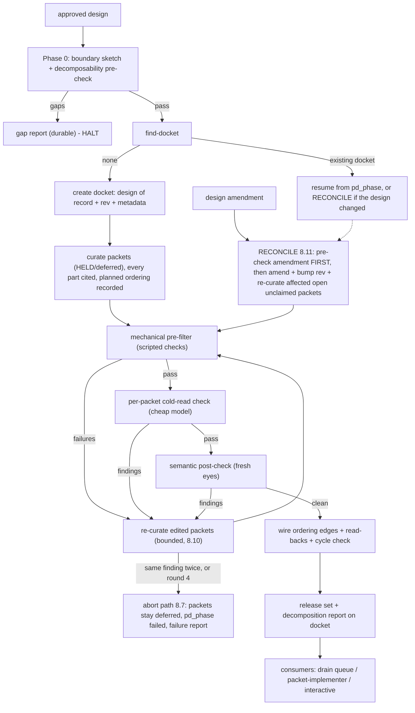

# `plan-decompose` — curated, self-contained work packets from an approved design

> DESIGN OF RECORD: this file (operator ruling 2026-08-27: keep in the repo — "this is a
> significant change and we may want to come back to it later"). Produced by the brainstorming
> skill run WITH the operator on bead `pg2-98dt2`, session `cd276067-6241-4b81-8fcb-eb5e7223e82f`,
> 2026-08-27. All rulings in §3 were made by the operator in that conversation. Revision 2
> incorporates a five-lens adversarial review (completeness, correctness, UX, token efficiency,
> agent-first; same date): native bd metadata instead of notes tokens, defer/undefer as the hold
> mechanism, bounded fix loops, a mechanical pre-filter before the semantic post-check, a cost
> model, phase markers for resume, and reconcile-vs-claimed-packet handling. Companion
> implementation plan: `docs/superpowers/plans/2026-08-27-plan-decompose-implementation.md`.
> Rule codes cited as `B-…`/`D-…`/`F-…`/`L-…`/`P-…`/`R-…`/`S-…`/`T-…`/`W-…` (here and in the
> companion plan) refer to the workspace's standing agent rules (`pgii-agent-rules`).

## 1. Problem

`pg2-svfbb` decomposed a 39 KB design into 8 child beads. Each child description is a terse
~1 KB pointer ("per spec section 5 …") into the epic's DESIGN field, so every implementing
agent MUST read the full design (~10k tokens) before writing code: ~4% of its budget spent
before work starts, duplicated 8 times (~80k tokens), plus the confusion risk of constraints
that do not concern that child. The decomposition also has no staleness guard (children curated
against design revision N keep reading as current after the design moves to N+1), no record of
whether curation was sufficient, and the sizing ruling ("a Sonnet agent within 250k tokens")
is hardcoded prose repeated in every child.

The operator ruled the svfbb instance acceptable as-is, and asked for general tooling that does
better: a skill that turns an approved design/plan into implementation issues that are curated
and self-contained, so implementers are efficient — no fleet of agents repeating the same reads.

## 2. Prior art evaluated (Search First / Reuse First)

| Source                                                       | What it contributes                                                                                                                                                           | What it lacks for this goal                                                                                                                                   |
| ------------------------------------------------------------ | ----------------------------------------------------------------------------------------------------------------------------------------------------------------------------- | ------------------------------------------------------------------------------------------------------------------------------------------------------------- |
| `superpowers:writing-plans`                                  | Task self-containment ("a task's implementer sees only their own task"), the Interfaces block (Consumes/Produces), Global Constraints copied verbatim, the task-boundary test | Plan-grade tasks embed exact implementation code — rots fastest, decomposition ≈ implementation                                                               |
| `superpowers:subagent-driven-development`                    | Isolated per-task briefs, "never make a subagent read the whole plan", BLOCKED/NEEDS_CONTEXT escalation statuses, model-selection guidance ("turn count beats token price")   | In-session orchestration only; no durable tracker artifact, no staleness story                                                                                |
| `mattpocock-skills:to-tickets` (+ `wayfinder-beads` binding) | Tracker-agnostic skill + binding-skill layering (the pattern §5 adopts), vertical-slice sizing, `bd` operation mapping                                                        | Philosophically anti-curation ("avoid file paths and code — they go stale"); implementers are expected to re-read the spec; upstream plugin, not ours to edit |
| `bead-grooming`                                              | The acceptance-criteria altitude rules and the dedicated `--acceptance` field                                                                                                 | Improves EXISTING beads; explicitly refuses authoring new ones                                                                                                |
| `pb:/drain-beads`                                            | Pointer-brief discipline ("run `bd show <id>` yourself; a brief transcribes nothing"), epic-never-claimable convention (drain's `--exclude-type epic`)                        | Consumes beads as found; cannot fix under-curated ones                                                                                                        |
| `pb:pb-gate-lifecycle`                                       | Precedent for creating beads DEFERRED so `bd ready` cannot surface them until a condition clears                                                                              | Gates on `pn:applied`, not on curation state                                                                                                                  |
| `pg-pr`                                                      | The plugin-owns-its-agents topology (`agents/*.md`, orchestrator + readonly specialists)                                                                                      | Different domain                                                                                                                                              |

Conclusion: no existing skill produces curated self-contained issues from a design. The pieces
compose: superpowers supplies the packet internals, to-tickets/wayfinder supplies the layering
pattern, bead-grooming supplies the criteria bar, drain and pb-gate supply the consumer and
hold conventions unchanged, pg-pr supplies the packaging topology.

## 3. Decisions (operator rulings, 2026-08-27)

- **D1 — Consumer-agnostic packets; agents are never load-bearing.** The packet text is the
  interface: any consumer (the `/drain-beads` queue, in-session dispatch, an interactive
  session) MUST be able to complete a packet from its text alone. The defined agents (§10) are
  reference consumers encoding the discipline; if work succeeds only via the agents, that is a
  curation defect.
- **D2 — Bounds: implement + validate.** A packet covers implementation plus CHANGE-SCOPED
  validation (the task's own tests/commands), both inside the sizing budget. Validation of the
  changes is NOT the full pre-landing/pre-push gate. Isolation, landing, cleanup, and
  claim/close hygiene stay consumer-standard, referenced by one line, never transcribed.
  Deviations MUST be stamped explicitly per packet.
- **D3 — One-read is the target, not a gate.** The decomposer SHOULD produce packets an agent
  can execute from one read; where a packet legitimately needs more reads, the decomposer MUST
  still ship it (never halt on sizing) and MUST plan the extra reads explicitly
  (`Expected additional reads:`).
- **D4 — The decomposer splits and curates; it never authors.** Every substantive statement in
  a packet MUST carry a citation into the design (§6.1 syntax). Content with no citable source
  is invention and MUST NOT be written. Plan gaps found by the pre-check (§8.1) HALT
  decomposition with a gap report; §8.10 defines the other bounded halts.
- **D5 — Staleness: stamp + reconcile.** Every packet carries curation-provenance metadata;
  the docket carries a revision marker; RECONCILE mode re-curates open packets after a design
  amendment; implementers treat a stamp/revision mismatch as suspected-stale and MUST NOT work
  it.
- **D6 — Packaging: a new plugin** `plan-decompose` in this repo's claude-marketplace (pg-pr
  topology), not a `pb` extension and not a to-tickets fork.
- **D7 — Layered core + binding** (the wayfinder-beads pattern): a medium-agnostic core skill
  and per-medium binding skills. The core MUST NOT silently default to an ad-hoc medium (the
  failure mode T-1 exists to prevent). Resolution: use the binding named in the
  brief/invocation; when none is named and exactly ONE binding skill is installed, auto-select
  it and announce the selection; with zero or several candidates and none named, refuse with
  the candidate list.
- **D8 — Vocabulary:** the parent object is a **docket** (design-of-record holder + packet
  index + escalation path, never itself workable); children are **work packets**.
- **D9 — Metadata channel; nothing hardcoded.** Model, budget, stamps, and phase/state markers
  ride docket/packet METADATA — the medium's structured, per-key, replace-semantics field —
  never the content an implementer reads as the packet body, and never free-text notes. Sizing
  resolves packet metadata → docket metadata → skill-documented default. Retargeting an epic
  (e.g. Sonnet/250k → Opus/300k) is one docket metadata edit. Metadata values are small
  (keys + short values); a medium whose default display incidentally shows them costs nothing —
  the guarantee that matters is that the design payload and curation machinery never ride
  packet content.
- **D10 — Metrics: gathering in v1, reporting deferred.** The medium contract includes
  append-only metric operations and the implementer closeout emits a record; the aggregation
  /report mode is future work that requires no v1 change.
- **D11 — Four gates, bounded:** a decomposability pre-check on the plan (§8.1); a mechanical
  pre-filter over the drafted set (§8.4, near-zero cost, gates the agent dispatches); a
  per-packet cold-read check (§8.4); and a set-level semantic post-decomposition check (§8.5).
  Packets are HELD (deferred) until the semantic check passes, then released as a set. All fix
  loops are bounded (§8.10).
- **D12 — Design of record for this project:** this repo-committed file.

## 4. Concepts

- **Docket** — the parent object: holds the full design of record verbatim plus a revision
  marker, indexes the packets, states the docket-wide defaults (sizing policy and
  lifecycle-bounds default — carried in docket METADATA, §7; there is no separate
  "docket defaults" text store), and is the escalation path. A docket is never claimable work. A bead IS a docket
  iff its metadata carries `pd_rev`; a bead IS a packet iff its metadata carries
  `pd_curated_rev`.
- **Work packet** — one self-contained unit of implementation work, sized to a stated model and
  all-in token budget. Content anatomy in §6; metadata in §7.
- **Medium binding** — a skill mapping the core's abstract operations (§5.2) onto a concrete
  tracker/medium. v1 ships exactly one: beads (§11).
- **All-in budget** — the packet budget covers the implementer's prompts, the packet text,
  everything it must read, the implementation turns, and the change-scoped validation turns.

## 5. Architecture

### 5.1 Plugin layout

```
claude-marketplace/plan-decompose/
├── .claude-plugin/plugin.json
├── skills/
│   ├── plan-decompose/SKILL.md          # core, medium-agnostic (modes: check | decompose | reconcile)
│   └── plan-decompose-beads/SKILL.md    # beads binding (operation table)
└── agents/
    ├── plan-decomposer.md               # executes the core procedure; brief names the binding
    └── packet-implementer.md            # reference consumer discipline
```

The plugin and its core skill share the name `plan-decompose` (the repo's existing
`bead-grooming:bead-grooming` pattern) — deliberately, so there is exactly one string to
remember; an inverted pair (`plan-decompose` vs `decompose-plan`) was reviewed and rejected as
a memory trap.

Registration: one entry in `claude-marketplace/.claude-plugin/marketplace.json`. Nothing in
`flake.nix` changes (the marketplace derivation copies the tree wholesale and discovers
plugins/skills/agents by directory convention).

### 5.2 Core medium contract (abstract operations)

The core skill is written against these operations; a binding MUST map every one of them.

| Operation                                                | Purpose                                                                                                                                                                            |
| -------------------------------------------------------- | ---------------------------------------------------------------------------------------------------------------------------------------------------------------------------------- |
| `find-docket(design-source)`                             | Dedup/resume probe: an existing docket for this design source MUST be found before creating another (§8.9)                                                                         |
| `create-docket(design, revision, metadata)`              | Persist the design of record + revision + docket metadata; docket MUST NOT be claimable work                                                                                       |
| `create-packet(docket, content, criteria, metadata)`     | Persist one packet, HELD (not claimable by any queue consumer) until released                                                                                                      |
| `wire-ordering(blocked, blocker)`                        | Ordering edge; MUST be verified by read-back; cycles MUST be checked after bulk wiring                                                                                             |
| `read-packet(packet)` / `read-docket-design(docket)`     | Content reads (the implementer path / the escalation path)                                                                                                                         |
| `read-metadata(obj)` / `write-metadata(obj, kv)`         | Structured per-key channel with REPLACE semantics; cheap to read independent of design size                                                                                        |
| `release-set(docket)`                                    | Make all held packets claimable; per-packet progress recorded so an interrupted sweep is resumable                                                                                 |
| `write-report(target, report)`                           | Append a durable report (decomposition report, phase notes, failure notes, gap reports) to a target issue — the docket, or a named tracking issue when no docket exists yet (§8.1) |
| `append-metric(packet, record)` / `read-metrics(docket)` | Append-only metric records; aggregation is deferred (D10) and MUST scope/paginate when built                                                                                       |
| `amend-design(docket, design, revision+1)`               | RECONCILE entry point; MUST handle the medium's large-design storage (§11)                                                                                                         |
| `close-docket(docket)`                                   | Terminal close once all packets are closed (or a zero-packet outcome is recorded); operator-triggered or consumer-triggered, never automatic mid-flight                            |

### 5.3 Pipeline



## 6. Work-packet content anatomy

Nine parts, in this order (the order is load-bearing — §12). The binding maps where the body
and the criteria land. Every part obeys the provenance rule (D4).

1. **Shared preamble** (byte-identical across siblings where present) — global constraints and
   docket-wide normative text that binds this packet, copied VERBATIM.
2. **Objective** — the end-to-end deliverable, one paragraph, rewritten curation.
3. **Contract** — _Consumes:_ exact signatures/interfaces this packet uses (from predecessor
   packets or existing code). _Produces:_ the names, types, and behaviors later packets rely
   on. Neighbors communicate ONLY through contracts; siblings' text is not authority.
4. **Files** — create/modify/test paths, repo root stated once, absolute or root-relative.
5. **Binding decisions** — decided-hows from the design that constrain the inside of this
   packet (mandated algorithms, idioms, error shapes, libraries), copied VERBATIM.
   Decision-encoding snippets (a schema, a state machine) are allowed; implementation code is
   not. **The freedom boundary MUST be explicit:** anything the design did not decide is the
   implementer's choice, and the decomposer cannot add a preference there (it would have no
   citation).
6. **Validation (change-scoped)** — exact commands, timeouts, expected results for THIS
   change. Never the full pre-landing gate (D2).
7. **Acceptance criteria** — independently verifiable checklist at the bead-grooming altitude
   for the packet's type.
8. **Out of scope** — names the sibling packet where each neighboring concern lives.
9. **Lifecycle bounds + escalation pointer** — one line each: "this packet = implement +
   validate; isolation/landing/cleanup/claim hygiene are consumer-standard" (plus stamped
   deviations); and the docket id with the standing instruction: _read the docket design ONLY
   when stuck, and record that you did._ Optional `Expected additional reads: <paths>` when a
   needed read-set is too big to inline (D3).

### 6.1 Citation syntax

Every substantive clause in parts 2, 3, and 5 MUST end with a fixed inline marker:
`[design: <section number or heading>]` (e.g. `[design: §4.4]`). The marker is what makes D4
mechanically checkable: the pre-filter greps for uncited clauses, and the semantic post-check
resolves markers against the design text instead of judging provenance from prose. Parts 1
and 5 that are verbatim copies cite their source section once for the whole block.

## 7. Metadata (structured channel, replace semantics)

All keys are prefixed `pd_` to avoid collision with other tooling. Underscores, not hyphens:
bd's `--set-metadata` validates keys against `[a-zA-Z_][a-zA-Z0-9_.]*` (probed 2026-08-27;
the JSON `--metadata` form skips that validation, so a hyphenated key would create a value
`--set-metadata` can never update). Values are compared as strings.

| Key                                                       | On     | Meaning                                                                                                                                                                                                                    |
| --------------------------------------------------------- | ------ | -------------------------------------------------------------------------------------------------------------------------------------------------------------------------------------------------------------------------- |
| `pd_rev`                                                  | docket | Design-of-record revision, bumped by RECONCILE                                                                                                                                                                             |
| `pd_model`, `pd_budget`, `pd_read_target`                 | docket | Sizing policy for the decomposition (e.g. `sonnet`, `250k`, `25`)                                                                                                                                                          |
| `pd_phase`                                                | docket | Pipeline phase marker: `precheck` / `curating` / `prefilter` / `coldread` / `postcheck` / `wiring` / `releasing:<n>/<m>` / `released` / `reconciling:<rev>` / `failed:<phase>` — written at every transition (§8.9, §8.11) |
| `pd_source`                                               | docket | The design source identifier (path or bead id) used by `find-docket` dedup                                                                                                                                                 |
| `pd_model`, `pd_budget`                                   | packet | Deviation ONLY — absent means docket policy applies                                                                                                                                                                        |
| `pd_curated_rev`, `pd_curated_date`, `pd_curated_session` | packet | Curation provenance stamp (session = the decomposer's own session id, B-5 style)                                                                                                                                           |
| `pd_stale`                                                | packet | Set by a stamp-mismatch release or by RECONCILE on a claimed packet (`reconcile-pending`); cleared by re-curation                                                                                                          |

Resolution order for sizing: packet metadata → docket metadata → the skill's documented
fallback default (stated ONCE in the core skill, labeled as the fallback). No model name or
budget number ever appears in packet content (D9). A malformed or missing metadata value MUST
be treated as absent (falling through the resolution order) and MUST be flagged in the next
report; an implementer treats a malformed stamp as a mismatch (suspected-stale).

Metric records are NOT metadata (they are history): they ride the medium's append-only channel
(§11) as single-line records with fixed key order:
`pd_metrics outcome=<done|blocked|released> escalation-reads=<n> validation-retries=<n> tokens=<k>`.

## 8. Decomposition procedure (core skill, mode `decompose`)

### 8.1 Phase 0 — boundary sketch + decomposability pre-check

First produce a **boundary sketch**: packet titles plus one-line scopes only — NOT curation.
The sketch is what the pre-check probes against (without it the pre-check would be circular,
needing boundaries that only §8.2 draws). Then, for each sketched packet, probe whether the
anatomy is EXTRACTABLE from the plan: seam contracts decided; file/package layout stated;
validation approach stated; behavior precise enough for verifiable criteria. Mechanical scans:
TBD/TODO/placeholder markers; open-items sections intersecting packet scope. Judgment probe:
_could two reasonable implementers, given only this plan, build incompatible halves of this
seam?_ Any gap ⇒ HALT with a gap report — decomposing around a gap creates packets whose
neighbors do not exist (D4).

**Gap report handling (durable, addressed):** the report lists each gap (what is missing,
which anatomy part it blocks, where in the design it should live). No docket is created on a
Phase-0 halt. The report goes to the DISPATCHER of record (the session/agent that invoked the
decomposer — never an inferred "author"); when the brief names a tracking bead for the design
(it SHOULD), the report is ALSO appended there via `write-report` — the operation accepts any
tracking issue precisely for this pre-docket case — so it survives the session.

### 8.2 Build and curate

`find-docket` first (§8.9). Create the docket (design verbatim + `pd_rev` + metadata +
`pd_source`). Draft packet boundaries from the sketch with the task-boundary test (from
writing-plans, §2): split only where a reviewer could reject one half while approving the
other; otherwise fold. Curate each packet per §6, citing per §6.1, and record the PLANNED
ORDERING as you go — the blocked-by pairs implied by each Contract's Consumes/Produces — in
the decomposition-report draft; §8.5 checks seams against it and §8.6 wires it. Packets are
created HELD — deferred, invisible to every ready-queue consumer. While drafting, track
candidate shared blocks; when the last packet is drafted, any block common to ALL packets
MUST be resolved before any check runs (catching it later wastes N cold-reads on text about
to be deleted): text that merely restates consumer discipline already carried by the
implementer agent prompt or by docket metadata is DELETED, while docket-specific normative
text STAYS in every packet as the §6 part 1 shared preamble, byte-identical — packet
self-containment (D1) outranks deduplication, so the preamble is the sanctioned repetition.

### 8.3 Sizing

Estimate each packet's fixed inputs (packet text + expected read-set, bytes ÷ 4) against the
resolved policy; target fixed inputs ≤ `pd_read_target`% of budget. Over target ⇒ split.
**Unsplittable** means no boundary passes the reviewer-reject test — any split would create
halves a reviewer could not independently accept. Genuinely unsplittable ⇒ write a
packet-metadata deviation and proceed — sizing never halts (D3). Per-packet estimates go in
the decomposition report, not packet content. Note the coupling: the semantic post-check's
own cost scales with Σ packet fixed-reads, so the target also bounds check cost.

### 8.4 Mechanical pre-filter, then cold-read check

**Pre-filter (scripted or trivial-model, near-zero cost, runs first and gates):** uncited
clauses (grep for §6.1 markers); file-overlap collisions across packets' Files parts without a
connecting ordering edge; out-of-scope pointers whose target packet lacks the pointed-at
concern; byte-identity of shared preambles; metadata completeness (stamps, policy, `pd_rev`).
Failures loop to §8.2 without spending a single agent dispatch.

**Cold-read check (per packet, cheap model):** an agent reads ONLY the packet content and
answers: _could you execute this? name everything missing._ Findings feed re-curation. This is
the pre-flight twin of the `escalation-reads` metric. Any packet EDITED after its cold-read
MUST be cold-read again (an editor with the full design in context cannot certify
self-containment — that is the entire reason this check is isolated) and MUST be re-sized
(§8.3) — a fix can blow the read target.

### 8.5 Semantic post-check (set level)

A fresh-eyes agent — the one role that legitimately reads the full design AND all packets —
verifies the two properties that need judgment:

1. **Coverage, both directions** — every design element lands in a packet or is recorded (via
   `write-report`, append-only — never by editing the design) as deliberately not decomposed;
   every §6.1 citation resolves to design text that actually supports the clause.
2. **Seam consistency** — every _Consumes_ is supplied by a predecessor's _Produces_ or by
   existing code (verified present), signatures matching; contradictory sibling contracts are
   findings. Predecessor/successor means the PLANNED ordering recorded during curation
   (§8.2) — actual edges are wired only later, in §8.6.

Graph checks (cycles, parent-blocked-by-child, at-least-one-workable — the last applies only
when the packet count is ≥ 1) run in §8.6 against the medium after wiring; the pre-filter
(§8.4) already caught the mechanical set properties. Findings loop back to §8.2 → §8.4,
bounded per §8.10.

### 8.6 Wire, release, report

Wire ordering edges (blocked-by direction verified by read-back on EVERY edge; a failed
read-back is re-tried once and then treated as a §8.10 recurring finding). Cycle check after
bulk wiring — the medium's cycle probe MAY be global, so its output MUST be filtered to this
docket's packet ids. Release the set, recording per-packet progress in `pd_phase`
(`releasing:<n>/<m>`) so an interrupted sweep resumes rather than restarts. Write the
decomposition report (`write-report`): packet index, per-packet fixed-read estimates and
dispatch counts, sizing deviations, check outcomes, hoisting flags (advisory — they never
block release), not-decomposed records, and an explicit "no uncited content" assertion.

### 8.7 Abort path

If the decomposer stops early on ANY exit (error, context exhaustion, operator interrupt), it
MUST: leave all packets DEFERRED (never release an unverified set — an aborted release of
uncurated, unwired packets into the claimable queue is the worst failure this design can
produce), set `pd_phase=failed:<phase>`, and `write-report` a failure note stating what was
completed. A successor (or the same skill re-invoked) finds the state via §8.9. The decomposer
holds no bead claims in the normal path — packets are DEFERRED, not assigned — so claim
hygiene (B-1) is satisfied by construction; a claim the DISPATCHING session holds on an
originating bead is that session's own duty. Nothing unverified becomes claimable.

### 8.8 Mode `check`

Phase 0 alone (sketch + pre-check), as a standing "is this plan ready to decompose" probe. On
PASS its output is the verdict line plus the boundary sketch (which §8.2 then reuses); on
gaps, the §8.1 gap report. Same durability rules as §8.1.

### 8.9 Dedup, phase marker, resume

Before creating a docket, `find-docket(design-source)` (beads: metadata/label query on
`pd_source`). An existing docket for the same source ⇒ MUST NOT create a second; route to
RECONCILE (if the design changed) or resume. Resume: read `pd_phase` and the docket's existing
packets, continue from the recorded phase. The phase marker is what distinguishes
"decomposition in progress / died mid-flight" from an ordinary stranded bead (B-6): a deferred
packet under a docket whose `pd_phase` is not `released` is mid-decomposition by definition,
and MUST be reported, not stolen or force-released.

### 8.10 Loop bounds and halts (P-4/P-5 idiom)

No loop in this pipeline is unbounded:

- A finding (cold-read or post-check) recurring on the SAME packet a SECOND time after a fix
  attempt ⇒ treat as a Phase-0-style gap: HALT that packet's curation, include it in a gap
  report, and continue the rest of the set only if it is separable (no seam depends on the
  halted packet); otherwise halt the decomposition with the abort path (§8.7).
- The full re-curation loop (§8.5 → §8.2) runs at most 3 rounds; on the 4th, non-convergence
  IS the finding: abort path + a "did not converge" report naming the oscillating findings.
- Phase-0 gaps, recurring findings, and non-convergence are the three sanctioned halts; sizing
  never halts (D3).

### 8.11 Mode `reconcile`

Input: a docket and the amended design text. Order is load-bearing: run the §8.1 pre-check on
the AMENDED design FIRST; only after it passes, `amend-design` (bump `pd_rev`, supersede per
S-2 — struck/rewritten text, ruling recorded), setting `pd_phase=reconciling:<new-rev>` at
that moment and restoring `released` when the reconcile completes — an interrupted reconcile
is thereby detectable and resumable via §8.9 like any other phase. Then re-curate the
affected OPEN, UNCLAIMED
packets, restamp them, and re-run §8.4 + a §8.5 pass SCOPED to the amended sections, the
re-curated packets, and their direct graph neighbors (seam consistency only) — the full-set
semantic check is for initial release and deliberate audits, not every amendment. Packets
untouched by the amendment keep their stamps.

**Claimed packets:** RECONCILE MUST NOT rewrite a packet that is actively claimed. It sets
`pd_stale=reconcile-pending` on it instead; the implementer's escalation ladder and closeout
both check `pd_stale` (§10.2), so the change is caught at the packet's next natural
checkpoint rather than under the implementer's feet.

**Stamp-mismatch releases** (an implementer found rotted curation before reconcile ran): the
release MUST re-DEFER the packet and set `pd_stale=<found-rev>`, not return it to the open
pool — otherwise every queue consumer claims, checks, and releases it in an endless
cross-session spin (the P-4 shape). RECONCILE is what clears `pd_stale` and undefers. The
docket failure/report channel tells the operator a reconcile is owed.

## 9. Cost model and the floor

### 9.1 What the cure costs (N packets, design ≈ Dk tokens, packet ≈ Pk tokens)

| Stage                                                  | Cost                                 | Model tier | Frequency                    |
| ------------------------------------------------------ | ------------------------------------ | ---------- | ---------------------------- |
| Decomposer: read design + repo context, sketch, curate | D + repo reads + N·P output          | capable    | once                         |
| Mechanical pre-filter                                  | ≈ 0 (scripted/trivial)               | —          | per round                    |
| Cold-reads                                             | N · (P + dispatch overhead ~1k)      | cheap      | once + per edited packet     |
| Semantic post-check                                    | D + N·P per pass                     | mid        | once + per §8.10 round (≤ 3) |
| RECONCILE                                              | amendment-scoped subset of the above | mixed      | per amendment                |

For the svfbb reference shape (N=8, D≈10k, P≈2–3k): decomposition-side ≈ 60–100k tokens
including one fix round — of the same order as the ~80k the implementers would otherwise burn
re-reading the design, BUT paid once, mostly on cheaper tiers, versus paid again on every
implementer dispatch, retry, and re-drain; and the un-costed term is quality: implementers no
longer wade through 10k tokens of constraints that do not concern them. The savings scale with
N and with how many times packets are re-worked; the costs are front-loaded and bounded.

### 9.2 The floor

Break-even is fragile below roughly N=4 for a 10k-token design. Therefore: a design whose
sketch anticipates FEWER THAN 3 packets SHOULD NOT be decomposed by this pipeline — file the
bead(s) directly (bead-grooming quality bar) with the design attached or referenced — and a
sketch of 3–4 packets is MARGINAL: still permitted, but `check` says so and leaves the call
to the operator. The core skill's description MUST carry the floor as an anti-trigger, and
`check` mode reports the verdict ("below floor — file directly" / "marginal" / "clear"). The
operator MAY override.

## 10. The agents

### 10.1 `plan-decomposer`

Executes §8. Brief MUST name: design source, binding skill (or rely on D7 auto-selection),
absolute repo root(s), docket metadata (or accept defaults), and SHOULD name a tracking bead
for gap reports. Runs on a capable model (judgment-heavy; the whole point is front-loading
thought). Sub-dispatches cold-readers on a cheap model and the semantic post-check on a mid
model, both read-only; their brief templates and finding schemas are fixed in the agent file
so independent implementations cannot diverge. MUST NOT author content (D4); MUST keep packets
deferred until the post-check passes; MUST follow the §8.7 abort path on every early exit.
MUST NOT edit the plugin's own sources (hoisting flags are advisory report entries for a
human).

### 10.2 `packet-implementer`

The reference consumer; carries all hoisted common discipline so packets never repeat it:

1. Claim with an explicit actor. **Stamp check** (two metadata reads, cost independent of
   design size): packet `pd_curated_rev` vs docket `pd_rev`, and `pd_stale` unset — any
   mismatch ⇒ suspected-stale ⇒ re-defer with `pd_stale` set (§8.11) and stop; MUST NOT work
   rotted curation.
2. Read the packet content once; work packet-first; validate change-scoped only.
3. **Escalation ladder when stuck:** (a) re-read your packet — is it actually answered?
   (b) re-check `pd_stale` (a reconcile may be pending), then read the docket design,
   RECORDING that you did (the `escalation-reads` metric); (c) still stuck ⇒ release with a
   what-was-missing note. It MUST NOT guess across a contract seam and MUST NOT read sibling
   packets — if the contract is insufficient, that is a curation defect to report, not a
   research prompt.
4. Closeout: re-check `pd_stale` once, append the metric record (§7 format), then close or
   release per claim-hygiene rules.

Default model comes from the docket policy via the dispatcher; the agent frontmatter carries a
static default that mirrors the core skill's documented fallback (overridable at dispatch).

## 11. Beads binding (`plan-decompose-beads`)

| Abstract operation                   | Beads mapping                                                                                                                                                                                                                                                                                                                                                                                                                                                                                                                                                                                        |
| ------------------------------------ | ---------------------------------------------------------------------------------------------------------------------------------------------------------------------------------------------------------------------------------------------------------------------------------------------------------------------------------------------------------------------------------------------------------------------------------------------------------------------------------------------------------------------------------------------------------------------------------------------------- |
| `find-docket`                        | Query beads labeled `docket` and match `pd_source` metadata against the design source                                                                                                                                                                                                                                                                                                                                                                                                                                                                                                                |
| `create-docket`                      | Epic bead, label `docket`; design of record VERBATIM in the DESIGN field. Field cap: description/design cap at 65,535 bytes (previously verified in this workspace); larger designs chunk into `bd comment --file` parts, the DESIGN field holding the header + a numbered chunk index (`part <n>/<m>: comment <id>`) that `read-docket-design` follows in order. Container note "do not claim for direct work"; drain's `--exclude-type epic` keeps it out of the drain queue (that exclusion lives in drain, not bd — `bd ready` itself returns epics)                                             |
| `read-metadata` / `write-metadata`   | Native bd metadata: `--metadata k=v` at create, `bd update <id> --set-metadata k=v` to change, read via `bd show <id> --json` metadata field (exact JSON path verified at build time). REPLACE semantics per key — never notes tokens (append-only notes cannot supersede `pd_rev`)                                                                                                                                                                                                                                                                                                                  |
| `create-packet`                      | Child bead (`--parent <epic>`, type task, `--no-inherit-labels` — without it every packet inherits the `docket` label and breaks discovery): §6 body → description; criteria → the dedicated `--acceptance` field; HELD = created DEFERRED (single-call create-deferred if `bd create` supports it — verify at build time; else create-then-`bd defer` immediately, window noted). `bd defer` is the mechanism `bd ready` actually respects — assignee does NOT hide a bead from `bd ready` (verified: the default ready query has no assignee filter; `-u` is opt-in) — pb-gate-lifecycle precedent |
| `wire-ordering`                      | `bd dep add <blocked> --blocked-by <blocker>` then `bd dep list <blocked>` read-back on EVERY edge; `bd dep cycles` after bulk wiring, output FILTERED to this docket's packet ids (the command is database-global)                                                                                                                                                                                                                                                                                                                                                                                  |
| `read-packet` / `read-docket-design` | `bd show <id>` / the epic's DESIGN field (+ chunk index when chunked)                                                                                                                                                                                                                                                                                                                                                                                                                                                                                                                                |
| `release-set`                        | Per packet: `bd undefer <id>`, with `pd_phase=releasing:<n>/<m>` updated as the sweep proceeds                                                                                                                                                                                                                                                                                                                                                                                                                                                                                                       |
| `write-report`                       | `bd comment <target-bead>` — the docket epic, or the named tracking bead for pre-docket gap reports (append-only; immune to the row-clobber failure mode)                                                                                                                                                                                                                                                                                                                                                                                                                                            |
| `append-metric` / `read-metrics`     | `bd comment <packet-id>` with the §7 record / `bd comments <id> --json` over the docket's children (aggregation, when built, MUST scope by docket and paginate)                                                                                                                                                                                                                                                                                                                                                                                                                                      |
| `amend-design`                       | Rewrite the DESIGN field (S-2: superseded text struck/rewritten, ruling recorded verbatim); for chunked designs, rewrite the header/index and append new-revision chunks, striking superseded chunks in the index (comments cannot be edited); bump `pd_rev` via `--set-metadata`                                                                                                                                                                                                                                                                                                                    |
| `close-docket`                       | `bd close <epic>` once children are closed (bd refuses an epic close with open children; the documented `--force` override is for the operator, not this skill)                                                                                                                                                                                                                                                                                                                                                                                                                                      |

Claim/close hygiene, `human` labeling, and dependency-direction rules follow the workspace's
standing bd rules (B-/D-series); this binding restates none of them, it only cites them.
Whether `bd lint` reads the dedicated acceptance field or only description headings is
verified at build time; the `--acceptance` field remains the storage of record either way
(it is what bead-grooming's bar names).

## 12. Caching and hoisting rules

### 12.1 Hoist before you repeat

Anything common to ALL packets that is consumer DISCIPLINE or POLICY (one-read discipline,
lifecycle default, escalation semantics, sizing default) lives ONCE — in the implementer
agent prompt or docket metadata — never copied into N packets. The cheapest cached token is
the one that is not there. Docket-specific normative TEXT common to all packets is the one
sanctioned repetition: it stays in each packet's §6 part 1 shared preamble, byte-identical,
because packet self-containment (D1) outranks deduplication (§8.2). Enforced incrementally at
draft time (§8.2) and audited by the pre-filter.

### 12.2 Shared-first, byte-identical layout

What must appear in more than one packet (§6 part 1) goes at the TOP of the body, identical
bytes and order across siblings, specific content after. Honest caveat: cross-packet prefix
caching only genuinely covers the static agent/skill text a consumer assembles before the
packet; byte-identical shared blocks mostly buy dedup when one context reads several packets
(reconcile, post-check, review) — the layout rule costs nothing, so it stands.

## 13. Metrics (v1: gather only)

Signals and their sources:

| Signal                 | Meaning                               | Source                                              |
| ---------------------- | ------------------------------------- | --------------------------------------------------- |
| `escalation-reads`     | Curation quality (headline number)    | Implementer closeout record                         |
| `validation-retries`   | Validation-section quality            | Implementer closeout record                         |
| `outcome`              | done / blocked / released             | Implementer closeout record                         |
| `tokens`               | Actual vs estimated budget            | Implementer closeout record vs decomposition report |
| `pd_stale` occurrences | Reconcile misses / staleness pressure | Packet metadata + docket reports                    |

Bare consumers (drain without the agent, interactive sessions) will not emit records —
accepted; coverage is best-effort. Ground-truth backstop: pg-ccaudit's transcript index can
find docket-design reads by sessions that claimed a child with zero implementer cooperation
(occasional audit, not the daily loop). The report/aggregation mode is DEFERRED (D10); the
contract operations above are sufficient for it to be added without changing v1 artifacts.

## 14. Usage (operator-facing)

- **Check:** "is `<design doc / bead>` ready to decompose?" → mode `check`: verdict +
  boundary sketch, or gap report.
- **Decompose:** "decompose `<design>` into beads" (optionally: sizing policy, tracking bead)
  → the session dispatches `plan-decomposer` with the brief per §10.1; progress is visible in
  the docket's `pd_phase` and phase-transition report comments.
- **Reconcile:** "the design for docket `<id>` changed — reconcile" → mode `reconcile` with
  the amended text.
- **Not for:** designs below the §9.2 floor; grooming existing beads (bead-grooming); working
  the queue (drain). These are anti-triggers in the skill description.

## 15. Rejected alternatives

- **Fold into `pb`** — integration-natural (pb owns the epic/child conventions and drain
  consumes the output) but mixes plan AUTHORING into a consumption plugin and raises the blast
  radius of a defaultEnabled plugin drain depends on.
- **Extend `to-tickets` via the wayfinder-beads binding** — upstream philosophy is
  anti-curation ("avoid file paths and code"), and the plugin is not ours to edit; the
  override would live awkwardly in the binding.
- **Plan-grade (maximal) curation** — writing-plans-style exact code in every packet: highest
  one-read fidelity but decomposition becomes implementation and code-in-packets rots fastest
  against amendments.
- **Minimal tickets + spec extracts** — cheapest to produce but implementers re-derive
  contracts, which is the repeated-turns waste this design exists to remove.
- **Re-check curation at claim time by re-reading the design** — would reintroduce the very
  read the design removes; the stamp compare (two metadata reads) replaces it.
- **Hold-via-assignee** — rejected on verified evidence: `bd ready` does not filter on
  assignee, so an "open + assigned" packet is claimable mid-curation; defer/undefer is the
  primitive that actually gates the ready queue.
- **Metadata as notes tokens** — rejected: notes are append-only narrative; a superseded
  `rev=` token would coexist with its replacement with no last-wins rule, defeating D5.

## 16. Testing and validation

- Repo gates: prek hooks on changed files; `nix flake check` (content is markdown-only; the
  marketplace derivation picks the plugin up by directory convention).
- Build-time empirical probes (cheap, against a scratch bead): the `bd show --json` metadata
  JSON path; create-deferred support; whether `bd lint` reads the `--acceptance` field; stamp
  check output size bounded independent of DESIGN-field size (< ~500 tokens on a chunked-max
  docket).
- First real use is the acceptance test: decompose an actual approved design end-to-end
  (docket + packets + checks + release) and work at least one packet with `packet-implementer`
  — filed as a follow-up bead rather than blocking this landing, since it needs a real design
  as input.
- Skill evals (`evals/` convention) are deferred until the skill text stabilizes against real
  use.

## 17. Open items

- Aggregation/report mode (D10 defers it; §5.2 contract already supports it).
- Diff-based `amend-design` (v1 takes the full amended text; a patch form would cut the
  reconcile resupply cost for large designs).
- Additional bindings (a markdown-files binding would put §7 metadata in frontmatter, stripped
  by the binder when serving content; Jira) — explicitly YAGNI until a consumer exists.
- Whether `/drain-beads` should prefer `packet-implementer` when a claimed bead carries
  curation metadata — a later `pb` change, deliberately out of scope (D1 keeps it optional).
- Tuning `pd_read_target` (25 starting default) and the §9.2 floor against gathered metrics.
