# pg-desk and connector discovery: the scheduler pattern, the freshness contract, and the retirement of pg-pr's sync, dashboard, and open

**Status**: Draft, revision 5 after the build-ordering discussion, pending operator review
**Date**: 2026-09-09
**Deciders**: Phillip Green II (operator), in a brainstorm session with Claude
**Bead**: `pg2-od9se`
**Design of record it amends**: `docs/superpowers/specs/2026-09-03-unified-connector-architecture-design.md` (epic `pg2-2j5ac`)

## 1. Purpose and scope

The 2026-09-03 design left four load-bearing questions as appendix notes: what replaces
`pg-pr sync`'s bead minting, what happens to `pg-pr open` and the Grafana dashboard, where PR
rows and approver data go, and how any future automation should consume connectors. This
document answers them as decisions. It also generalizes the answer into a pattern every future
connector-consuming automation MUST consider first: **connectors gather, pr-pool schedules, one
interpreter tool derives meaning and signals agents, and humans read a store.**

In scope:

- A contract every connector type MUST meet from now on: statelessness, named queries, an
  incremental `list` op, and `AsOf`/`Stale` on every entity schema (section 4).
- Two new umbrella verbs, `list` and `changes`, backed by a delta ledger the umbrella owns
  (section 5). The entity cache is designed here but deferred to its own phase.
- pr-pool as the only scheduler in the system, with zero core changes, plus one small adapter
  that speaks both pg-connector's and pr-pool's contracts (section 6).
- `pg-desk`, a new generic gather/interpret/sync tool in this repo that owns the human-facing
  store, the dashboard endpoint, and the opener (section 7).
- Jira and Slack as further sources of the same pattern (section 8).
- The resulting amendments to the design of record, the disposition of every `pg-pr` SQLite
  table, and the reshaped phase plan (section 9).

Out of scope: pg-connector's pending PR write verbs (`create`, `ready`, `draft`, `review`,
`comment`, and so on, section 9.1 of the design of record), the review-orchestrator trigger
redesign, and git-activity ingestion, which `work-report` owns (`pg2-lelc0`).

Terminology: where this document says "phase 1" it means this design's first delivery, phases 7
through 12 of section 9.5, which end with the cutover flip and the deletions. "The cache phase" is
phase 14 there. Phase numbers continue the epic `pg2-2j5ac`'s existing 1 through 6. Revision 5
reshaped the phases into vertical slices (D16); a "checkpoint" is the operator-runnable
verification each phase ends with, listed in section 9.5.

## 2. Decisions ledger

Every row below is an operator ruling from the 2026-09-09 session, recorded so a later reader can
tell an executed decision from an open question. D13 through D15 were ruled after the subagent
reviews of revision 1. D16 through D20 were ruled in the build-ordering discussion that produced
revision 5, in the session that continued this one (`pg2-rfvgl`).

| #   | Decision                                                                                                                                                                                                                                                                                                                              |
| --- | ------------------------------------------------------------------------------------------------------------------------------------------------------------------------------------------------------------------------------------------------------------------------------------------------------------------------------------- |
| D1  | The dashboard and the opener both survive with full parity: all five triage panels, hide, WIP, and the batch-open flow. The operator keeps the Grafana panel open to see when PRs need review and uses `open` to batch-open them.                                                                                                     |
| D2  | pr-pool is the single scheduler. No connector runs a daemon. The dashboard is therefore only as fresh as pr-pool is alive, and daemonizing pr-pool is a precondition of retiring `pg-pr sync`.                                                                                                                                        |
| D3  | Connectors are stateless. A connector MAY be handed state (an opaque cursor) in a request, but MUST NOT persist any. The three existing backend-local stores are removed. This reverses the 2026-09-06 ruling on `pg2-f327j` that allowed backend-local stores.                                                                       |
| D4  | Named queries are per-backend configuration in that backend's native syntax. The generic tool never encodes "mine" or "my team". A backend that does not recognize a name answers `query_not_recognized`, a soft outcome the umbrella skips quietly.                                                                                  |
| D5  | The umbrella makes the final determination of what changed, never a backend. A backend MAY support incremental listing through an opaque cursor the umbrella stores and passes back, returning what it believes changed; the umbrella still content-diffs it.                                                                         |
| D6  | The umbrella owns every cursor: the per-backend fetch cursor and the per-consumer change cursor. Phase 1 ships this as a delta ledger without entity copies. The entity cache, with stale fallback, is a later phase.                                                                                                                 |
| D7  | Derived data (categories, feedback dispositions, enrichment, urgency, cross-references, panel placement) lives in one interpreter store, not in a connector and not in beads. Human annotations (hide, WIP) live there too.                                                                                                           |
| D8  | Beads are for agents. The interpreter writes to beads only to signal agent work, only through `pg-connector issue`, and never reads beads directly for the human views. A merge-request bead is minted lazily, as an anchor, only when agent work needs one.                                                                          |
| D9  | The flow per event is gather everything available, then interpret, then sync. The three stages run inside one process because pr-pool's core does not sequence handlers and its behavior docs place sequencing outside the core.                                                                                                      |
| D10 | The interpreter is generic and lives in this repo as `packages/pg-desk`. The ZR repo supplies configuration only. `df-categorize` and `df-feedback` retire into interpreter steps.                                                                                                                                                    |
| D11 | Jira and Slack roles do cross-referencing and attention. Jira bead-minting is deferred until reconciled with daily-focus; D19 sets the direction of that reconciliation. git activity is excluded; `work-report` owns it.                                                                                                             |
| D12 | Rejected: a mirror in a ZR-side store, per-connector auto-refresh daemons, listing without a cursor, per-entity acks in phase 1, and the entity cache in phase 1 (section 10).                                                                                                                                                        |
| D13 | The `pg-pr:active-pr` gate is dropped, not re-created through new issue-capability ops. It existed because beads was the primary store; with facts held outside beads and reconciled only when appropriate, that reconciliation is the gating mechanism.                                                                              |
| D14 | The query-side adapter between pg-connector's change feed and pr-pool's item contract is its own component, aware of both, not a pr-pool output format on the umbrella and not part of `pg-desk`.                                                                                                                                     |
| D15 | Draft auto-promotion, `wip on`'s upstream draft conversion, and pending reply posting are accepted, recorded losses for now, because the `pr ready`, `pr draft`, and comment verbs are out of scope. pg-desk exposes what is ready to promote so the operator can act by hand.                                                        |
| D16 | Build order is vertical slices, not component layers: every phase ends at a checkpoint the operator runs by hand against the live system while `pg-pr` keeps running, and the checkpoint is a docket boundary. Soak durations are written as one working day and are placeholders the operator tunes during testing, not fixed gates. |
| D17 | `pg-desk` sync has three modes, `off`, `plan`, and `apply`. `plan` runs the full adoption and rule logic and records every intended bead write in the store without calling `pg-connector issue`; it is the parity check for sync. `apply` is switched on only at the cutover flip.                                                   |
| D18 | `pg-desk serve` soaks on an alternate port behind one ZR option that also renders a temporary Grafana board; turning that option off is the port move-back, so the flip cannot forget it. The cutover is split into a reversible flip (phase 11) and a later deletion phase (12), with a second soak between.                         |
| D19 | daily-focus follows the same pattern and stops treating beads as its primary store: everything surveyed is stored uncapped, and a capped reconcile step mints focus beads; pulling more work is reconciling more from the store. Whose store is section 11's open item; this document recommends `pg-desk`'s. Refines D11.            |
| D20 | `pg-pr pr view` call sites are replaced by need: sites reading PR facts only use `pg-connector pr show`; sites reading `wip`, approvals, or the consolidated picture use `pg-desk show`. Each group is rewritten in the phase whose destination ships, per the design of record's sequencing rule, not batched at cutover.            |

## 3. Architecture overview

```mermaid
flowchart LR
    subgraph EXT["external systems"]
        GH["GitHub"]
        JI["Jira"]
        SL["Slack"]
        BD["beads"]
    end
    subgraph T2["Tier 2: stateless backends"]
        PRB["pg-connector-pr-github"]
        IJB["pg-connector-issue-jira"]
        IBB["pg-connector-issue-beads"]
        THB["pg-connector-thread-slack (new)"]
    end
    subgraph T1["Tier 1: pg-connector umbrella"]
        REG["registry and per-backend config"]
        LEDGER["delta ledger: fetch cursors, id-to-hash index, consumer cursors"]
        CACHE["entity cache (later phase)"]
    end
    ADAPT["pr-pool-source-pg-connector: change feed to pr-pool items"]
    subgraph SCHED["scheduler: pr-pool, config only"]
        Q["queries: changes feeds, a sweep, a heartbeat"]
        R["command roles: pg-desk run, pg-desk heartbeat"]
        CCR["ccpool roles: feedback, worker, review (unchanged)"]
    end
    subgraph DESK["pg-desk: gather, interpret, sync"]
        PIPE["pipeline per event"]
        STORE["store: facts, interpretations, xrefs, annotations, ledger"]
        SERVE["serve and open"]
    end
    GH --> PRB
    JI --> IJB
    BD --> IBB
    SL --> THB
    PRB --> T1
    IJB --> T1
    IBB --> T1
    THB --> T1
    T1 -->|"changes and list"| ADAPT
    ADAPT -->|"items"| Q
    Q -->|"typed events"| R
    Q -->|"issue list named queries"| CCR
    R --> PIPE
    PIPE -->|"gather via pg-connector"| T1
    PIPE --> STORE
    PIPE -->|"sync agent signals via pg-connector issue"| T1
    STORE --> SERVE
    SERVE --> GRAF["Grafana My Work"]
    SERVE --> HUMAN["operator"]
```



Design vocabulary. The umbrella is a Facade over Adapters (the backends). The delta ledger is
snapshot-diff Change Data Capture with per-consumer offsets, a log read by offset rather than a
transactional outbox (it shares no transaction with any producer). pr-pool is Publish-Subscribe
with competing consumers, an event router that deliberately does not sequence. The query-side
adapter is an Adapter in the strict sense. `pg-desk` is Command Query Responsibility Segregation
in miniature: an Extract-Transform-Load write side whose store is a read model, a Reconciliation
step that makes beads match the store's desired state, and a `serve` query side computed per
request over the materialized `interpretation` rows.

## 4. Connector contract additions: discovery and freshness

The design of record's invariants cover capability scoping, the wire shape, versioning, the error
taxonomy, the registry, exit codes, auth, and the composition boundary. Nothing in them says
"every connector type MUST support X" beyond the wire shape. This section adds that contract. Its
rules apply to every entity type, current and future, and to every backend.

### 4.1 Statelessness

- A backend MUST NOT persist state between invocations. It MAY be handed state in a request (the
  `cursor` of section 4.2, the `config` block of section 4.7) and MUST treat it as opaque input to
  that one call.
- The three existing backend-local stores are removed: `pg-connector-pr-github`'s category and
  disposition store (with its `migrate-disposition` one-shot tool), `pg-connector-ci-github-actions`'s
  run-to-repo correlation file, and that same backend's last-known-good run-list cache, which is
  the one place a backend serves `Stale: true` today. The data the first held is derived state
  (section 7); the second is replaced by a `repo` argument the caller supplies (section 4.5); the
  third's stale fallback is lost until the cache phase restores it for every type (section 5.6).
- Consequently the `pr` capability's `categorize` and `feedback_set` ops are removed, and
  `schema.PR.Category`, `PRComment.Disposition`, and the `feedback_set` result shape are removed in
  the v3 bump (section 4.5). The design of record's section 6.1 is superseded (section 9.1).

### 4.2 Named queries and the `list` op

Every entity type with a remote system and a free-text search MUST expose a discovery op named
`list`. Two exemptions: `scm` has no remote entity, and `ci` has no free-text search, so it keeps
its existing PR-keyed `ci list <pr-id>` verb unchanged and is discovered through the PR it belongs
to. `list --query` therefore applies to `pr`, `issue`, and `thread`.

Request:

```json
{
  "op": "list",
  "args": { "query": "mine", "cursor": null, "ids_only": false },
  "config": { "queries": { "mine": "..." } }
}
```

Response `result`:

```json
{
  "entities": [],
  "present_ids": [],
  "cursor": null,
  "truncated": false
}
```

- `query` is a NAME. The backend MUST resolve it against `config.queries.<name>` from the request
  (section 4.7) and MUST NOT ship any built-in query names. The expression is in the backend's own
  native syntax: a GitHub search string, a JQL string, a `bd` argument vector, a Slack search
  string. Identity resolves natively (`author:@me`, `currentUser()`), never in generic code.
- A query value MAY be a list of expressions. The backend runs each, unions the results
  deduplicated by id, and reports `truncated` if any member truncated. This is how one named query
  reproduces the union pg-pr builds today from team-authored, review-requested, reviewed-by,
  assignee, and watch-label buckets, which GitHub cannot express as one search because it ANDs
  distinct qualifiers.
- `entities` MUST be full entities in that type's schema. When `cursor` in the request is `null`,
  `entities` MUST be every entity the query matches. When a cursor is present and the backend
  supports incremental listing, `entities` MAY be only those the backend believes changed or
  appeared since that cursor. With `ids_only: true` the backend MAY return entities carrying only
  `id`; the umbrella uses this for the sweep.
- `present_ids` MUST always be the complete set of ids the query matches right now, so the umbrella
  can derive removals. A backend that does not support incremental listing returns the ids of
  `entities`.
- `cursor` in the response is opaque to the umbrella. A backend that does not support incremental
  listing MUST return `null` and MUST ignore any cursor it is handed. A backend SHOULD version-tag
  its cursor blob and MUST treat an undecodable cursor as `null` (a full fetch), never as an error.
  For GitHub the intended cursor is a map of PR id to a fingerprint hash (updated-at, head OID,
  checks rollup, state, draft flag, review and comment counts), which is pg-pr's detector strategy
  re-ported from `packages/pg-pr/pkg/provider/vcs/github/fingerprint.go` into the backend as a
  pure function of (cursor in, live fingerprint search, cursor out). For Jira it is an
  `updated >=` bound; note that `present_ids` then needs a second, ids-only JQL per refresh. For
  Slack it is an `oldest` timestamp. Every backend ships `list` with `cursor: null` first, in phase
  7; the GitHub fingerprint cursor is a phase 8 follow-on packet behind its own checkpoint, and the
  Jira cursor lands in phase 13, because the ledger's content diff already handles a cursorless
  backend (section 5.2).
- `truncated` MUST be `true` when the backend could not enumerate the full match set (a search cap,
  a page limit). The umbrella MUST NOT derive removals from a truncated `present_ids`.
- Rate protection is the backend's: `pg-connector-pr-github` MUST read the GraphQL rate-limit
  remainder from each response and answer `unavailable` when it is below a configurable reserve
  (default 1000 points), so a caller degrades instead of exhausting the budget. This carries
  pg-pr's existing reserve forward without state.

The umbrella exposes this as `pg-connector <type> list --query <name> [--ids-only] [--backend <binary>]`.
It fans out to every registered backend of the type unless `--backend` pins one. It MUST NOT pass
a cursor on this verb; `list` is always a full fetch. Incremental fetching is reserved for
`changes` (section 5). The verb ships in phase 7, before the ledger, because the first checkpoint
compares its output with `pg-pr pr list` (section 9.5). Named queries are not parameterized; a
caller needing "the PR for this head branch" uses `pr show` or a future targeted verb, not `list`.

### 4.3 `query_not_recognized`

A backend handed a query name absent from its `config.queries` MUST answer the error envelope with
code `query_not_recognized`. This is a new member of the closed error enum, with backend exit code
8, extending the existing exit-code table in declaration order (2 through 7 are taken).

- The umbrella MUST treat it as "not applicable to this backend": skip the backend, report it in
  the fan-out `sources[]` with status `not_applicable`, log at debug level only, and exclude it
  from degraded-outcome accounting. A fan-out where at least one backend recognized the name is a
  success with respect to this code.
- If every registered backend answers `query_not_recognized`, the umbrella MUST fail the call with
  `invalid_argument`, because the caller asked for something nothing knows.
- A backend MUST NOT treat an unrecognized name as a usage error, a crash, or an empty result.
- Because the outcome is quiet by design, `pg-connector config validate` MUST print, per backend,
  the query names its config block defines, and MUST report as degraded any name that appears in
  no backend of its type. `pg-connector config show --queries` prints the same table on demand.
  The nix module (section 4.8) SHOULD assert at evaluation time that every query name pr-pool's
  rendered config references exists under some backend block.

### 4.4 Freshness: `AsOf` and `Stale` on every schema

Every entity schema MUST carry the `AsOf`/`Stale` pair `schema.PR` and `schema.CIRun` already
carry, with the same semantics: the backend that answers a read is the sole computer of its own
staleness, `AsOf` is that read's own as-of time, and an entity with no usable as-of time MUST be
reported stale. A stateless backend performing a live read always reports `Stale: false`. Once
the cache phase lands, the umbrella MAY set `Stale: true` and an older `AsOf` on an entity it
serves from its own cache (section 5.6). After section 4.1's removals no backend serves stale
data, because none has anything to serve it from.

### 4.5 Schema growth

- `PR`: v2 to v3. Remove `Category`, `PRComment.Disposition`, and the `feedback_set` result shape.
  Add `head_sha`, `additions`, `deletions`, `changed_files`, `mergeable`, `merge_state_status`,
  `review_requests` (logins and team slugs), and `checks_rollup` (`success | failure | pending |
none`). The rollup is a fact GitHub exposes on the PR itself and is carried here so the dashboard
  does not fan out to the `ci` capability per PR per tick. `files` and `commits` are NOT added; the
  design of record's table already lists `pr files` and `pr commits` as destinations, they ship in
  phase 7, and `commits` MUST carry each commit's author login, which the co-owned ownership
  classification consumes.
- `Issue`: v3 to v4. `Assignee`, `Parent`, `Description`, and `Deps` already exist. Add
  `AsOf`/`Stale`, `updated_at`, `due_date` (the daily-focus v2 design depends on Jira `duedate`
  too), `metadata` (a string-to-string map; beads' integer `pr_number` is coerced to its decimal
  string, and consumers parse it), and `external_refs` (ids the tracker exposes that point at other
  systems).
- `CIRun`: v2 to v3. Add `repo`. `get_logs` gains a `repo` argument the caller supplies from the run
  it already holds, so no backend-local correlation file is needed. This reverses the 2026-09-06
  ruling that `GetLogs` resolve the repo internally, under D3. The ZR Captain's Log backend
  (`pg-pr-cicd-captains-log`) compiles against `pkg/schema` through the `pg-connector-src`
  replace, so this bump breaks it at ZR's next relock: the bump and its ZR fix are one packet,
  landed as a pair, and the `ci` capability keeps working on the previous lock until the operator
  relocks. The `PR` and `Issue` bumps have no compiled consumer outside this repo.
- `Thread`: new, v1, with the shape this document defines (the design of record's section 10.2 named
  the type and its registry and naming conventions but sketched no fields): `id`, `channel`,
  `permalink`, `started_by`, `participants`, `last_reply_at`, `reply_count`, `text` (root message),
  `mentions_me`, plus `AsOf`/`Stale`. It ships in phase 13 with its first backend, not in phase 7:
  a type with no backend has no checkpoint.

### 4.6 Issue capability widening

`pg-desk` writes beads only through `pg-connector issue`, and today that capability has `show`,
`create`, `comment`, and `transition`. It MUST grow:

- `list` per section 4.2.
- `update <id>` with `--metadata`, `--add-label`, `--remove-label`, `--priority`, `--title`,
  `--description`, all optional, applied in one call. Jira maps these to fields; beads maps them to
  `bd update`.
- `close <id> --reason`. Jira maps to a resolving transition; beads to `bd close`.
- `deps <id> [--full]` returning the recursive upward dependency set (what this issue is blocked
  by, transitively), as ids or, with `--full`, as full `Issue` entities. This is what
  waiting-on-me needs; `show`'s existing one-level `Deps` field is not enough. Backends without a
  dependency concept answer an empty result, never an error.
- `create` gains `--metadata` and `--parent`; `--labels`, `--priority`, `--issue-type`, and
  `--description` already exist.
- No gate ops (D13). Reopening a closed issue is `transition <id> open` followed by `update`.

### 4.7 Per-backend configuration

The shared config file (resolved exactly as today) gains a `backends:` mapping keyed by binary
name. The umbrella MUST treat each value as opaque, MUST copy it verbatim into every request to
that backend as the top-level `config` member, and MUST NOT validate its contents. Backends
therefore read no files and have no configuration path of their own: a backend's behavior is a
pure function of one request.

```yaml
configSchemaVersion: 2
connector:
  pr: [pg-connector-pr-github]
  issue: [pg-connector-issue-jira, pg-connector-issue-beads]
  thread: [pg-connector-thread-slack]
backends:
  pg-connector-pr-github:
    rate_reserve_points: 1000
    queries:
      mine: "is:pr is:open author:@me repo:OWNER/REPO"
      team:
        - "is:pr is:open repo:OWNER/REPO author:LOGIN-A author:LOGIN-B"
        - "is:pr is:open repo:OWNER/REPO review-requested:@me -author:@me"
        - "is:pr is:open repo:OWNER/REPO reviewed-by:@me -author:@me"
        - "is:pr is:open repo:OWNER/REPO assignee:@me -author:@me"
        - "is:pr is:open repo:OWNER/REPO label:WATCH-LABEL -author:@me"
  pg-connector-issue-jira:
    queries:
      mine: "assignee = currentUser() AND resolution = Unresolved"
  pg-connector-issue-beads:
    queries:
      work-beads: "list --type merge-request --status open"
      feedback-ready: "ready --label mine --exclude-label human"
      worker-ready: "ready --label worker-ready --exclude-label human"
      review-ready: "ready --exclude-label human"
  pg-connector-thread-slack:
    queries:
      involving-me: "to:@me is:thread after:-14d"
state:
  consumer_prune_after: "30d"
```

- The `queries` key is the only key this design gives meaning to inside a backend block; a backend
  MAY define others (`rate_reserve_points`, a Slack channel allowlist, a Jira field map) and
  documents them itself in its `capabilities` response.
- For `pg-connector-issue-beads` a query expression is the full `bd` argument vector after the
  binary; the backend appends `--json --limit 0` and permits only `ready` and `list` as the first
  token. `bd ready` has no title filter, and `--type` accepts bd's built-in types plus the
  workspace's configured `types.custom` list (which is how `merge-request` exists); cycle and
  review beads are plain `task`s, so they are selected by label here and narrowed by title prefix
  in the adapter (section 6.1), exactly the two filters today's `jq` pipelines apply.
- A backend block MUST NOT carry a secret. Credentials stay where the design of record's section
  4.6 puts them, in each backend's own environment chain. The umbrella MUST NOT log request bodies,
  or MUST redact `config` if it ever does. The `request.schema.json` conformance schema gains
  `config` as an opaque object.
- Every Tier-1 verb MUST accept `--backend <binary>` to pin one registered backend. An id-less op on
  a type with more than one registered backend MUST require it when the op cannot fan out
  meaningfully (`create`) and MUST fan out when it can (`list`).

### 4.8 A nix module MUST own the shared config

The ZR machine configuration already renders `pg-pr/config.yaml`, including a hand-written
`connector:` key, through `xdg.configFile`. No home-manager OPTION renders `connector:`,
`backends:`, or `state:` today, and two writers of one file collide. The `pg-connector`
home-manager module in this repo therefore gains options that own the file: `connector`,
`backends`, `state`, and `configSchemaVersion`, plus `extraConfig` (an attrset) for pg-pr's
remaining keys during the overlap. Phase 7 introduces `configSchemaVersion` at 2 (the design of
record's section 4.1 decided the field; nothing defines it yet; absent means 1). In phase 7 the ZR
repo moves its pg-pr block into `extraConfig` and deletes its own `xdg.configFile` entry. The
module also installs `pg-connector-issue-jira`, which it and the ZR package list omit today.

**Acceptance criteria**

- Every `pr`, `issue`, and `thread` backend's `capabilities` lists `list`; a conformance golden
  exercises `list` with `cursor: null`, `list` with an unrecognized name, `list` with a list-valued
  query, and, for a backend declaring incremental support, `list` with a cursor it previously
  returned and with a garbage cursor.
- `pg-connector-pr-github` and `pg-connector-ci-github-actions` contain no `os.CreateTemp`,
  `os.WriteFile`, `XDG_STATE_HOME`, or flock reference outside tests; `migrate-disposition` is
  deleted; the module's layout check passes unchanged, and the entity-store scan is extended to
  `cmd/pg-connector/internal/**` and to a `thread` kind token before the ledger lands.
- `PR` v3, `Issue` v4, `CIRun` v3, `Thread` v1 as listed; a schema test asserts `AsOf`/`Stale` on
  every entity type in `pkg/schema`; `capabilityPackages` in the naming convention test includes
  `thread`.
- `query_not_recognized` is in the closed enum with exit code 8; a fan-out test shows one
  recognizing backend yields exit 0 with a `not_applicable` source row and none yields
  `invalid_argument`; `config validate` prints per-backend query names and degrades on a name no
  backend knows.
- `pg-connector issue update|close|deps` exist and are implemented by both issue backends;
  `deps --full` returns full entities recursively.
- `pr files` and `pr commits` ship; `commits` carries author logins.
- The `pg-connector` home-manager module renders the complete shared config from options; the ZR
  machine config no longer writes the file directly; pr-pool's rendered query names are asserted
  against the rendered backend blocks at evaluation time.
- pg-connector's behavior set amends `INV-REG-2` (multi-backend targeted ops), which `--backend`
  and the design of record's section 4.13 supersede.

## 5. Umbrella: `list`, `changes`, and the delta ledger

### 5.1 Verbs

- `pg-connector <type> list --query <name> [--ids-only] [--backend <b>]`: full fetch, fan-out, never
  cached in phase 1; ships in phase 7. Output is `{"entities": [...], "sources": [...]}` with entities concatenated in
  backend registration order and the `sources[]` envelope every fan-out verb carries per the design
  of record's section 4.5. Each entity carries its own `AsOf`/`Stale`.
- `pg-connector <type> changes --query <name> --consumer <id> [--cached] [--reset] [--backend <b>]`:
  ships in phase 8; refreshes through the ledger (section 5.2) by default, then returns the changes since the named
  consumer's cursor and advances it. `--cached` skips the refresh and returns whatever the ledger
  already knows past the cursor, touching no backend.
- `pg-connector ledger show [--type] [--backend] [--query] [--consumer]`: prints fetch cursors,
  index sizes, versions, and consumer positions, so "why did this PR not re-fire" is answerable.
- `pg-connector ledger clear [--type] [--backend] [--query]`: drops ledger entries (and, later,
  cache entries) matching the filters. The cache phase adds `pg-connector cache` verbs beside it.

`changes` output (`--output json`):

```json
{
  "sources": [
    {
      "backend": "pg-connector-pr-github",
      "status": "ok",
      "version": 42,
      "truncated": false
    }
  ],
  "changes": [
    { "change": "added", "source": "pg-connector-pr-github", "entity": {} },
    { "change": "changed", "source": "pg-connector-pr-github", "entity": {} },
    {
      "change": "removed",
      "source": "pg-connector-pr-github",
      "entity": { "id": "OWNER/REPO#123" }
    }
  ]
}
```

In phase 1 a `removed` entity carries its id only. Consumers hold the last content themselves.

### 5.2 The delta ledger

Per (type, backend, query) the umbrella persists one file under `$XDG_STATE_HOME/pg-connector/ledger/`:

- the opaque fetch cursor last returned by that backend for that query;
- an index of entity id to (content hash, version-last-changed, removed-at-version or null);
- the current version counter for that (type, backend, query).

On a refresh the umbrella, per backend: loads the ledger; calls `list` with the stored cursor;
hashes every returned entity over a canonical serialization that EXCLUDES `AsOf` and `Stale`;
marks entities whose hash differs as `changed`, entities absent from the index as `added`, and,
unless `truncated`, indexed ids absent from `present_ids` as `removed`; increments the version;
stores the new cursor. A backend that ignores cursors and returns everything is handled by the same
hash comparison. A fingerprint bump with identical content is therefore no change. A backend that
answers `unavailable` or any error leaves its file untouched for that refresh.

Each ledger file is guarded by a flock on a sibling lock file and written by temp-file-and-rename,
because two pr-pool queries (`pr-mine` and `pr-team`) and any operator invocation share the same
`(pr, pg-connector-pr-github)` backend and may run concurrently. The ledger is derived state: losing
it or clearing it costs one re-emission of every entity as `added`, never data. A backend swap
starts a fresh ledger, since files are keyed by binary name.

The ledger is not a cache: it holds hashes, not entities, and cannot answer a read. That is
deliberate for phase 1 (D6). It is a few kilobytes at the operator's volume.

### 5.3 Consumer cursors and the sweep

Per (type, backend, query, consumer) the ledger holds one version number, so a consumer of a
two-backend type has one cursor per backend and a backend that failed this refresh does not
advance. `changes` returns every index entry whose version-last-changed or removed-at-version is
greater than that backend's consumer cursor, then, after its output is fully written and flushed,
sets each answering backend's cursor to that backend's current version. A crash between flush and
advance costs a duplicate delivery on the next call, which roles absorb; it never costs a loss.
`--reset` sets every cursor for that consumer to zero first, so the next call reports every live
entity as `added` and no tombstone.

Because the cursor advances on read, a consumer whose handler fails after reading does not see
that entity again until it changes. The design accepts this (the design of record's section 6.1
already makes command roles own their own retry) and closes the gap in two parts. First, a slow
pr-pool query runs `list --ids-only` on a long period and emits every present entity on a
`reconcile` event bound to the same roles (section 6.1); roles are idempotent by pr-pool's own
contract. Second, because a removal that was mishandled is by definition no longer present, the
interpreter re-verifies every entity it still holds an open agent signal for at sweep time
(section 7.5). Per-entity acknowledgements remain the upgrade path if a role ever proves to need
at-least-once, and they would not change the query shape.

### 5.4 Eviction

Phase 1 has three rules, and nothing else to evict:

1. An index entry marked removed is dropped once every consumer's cursor for that (type, backend,
   query) has passed its removed-at-version.
2. A consumer cursor unseen for `state.consumer_prune_after` (default thirty days) is dropped.
3. A (type, backend, query) whose backend answered `query_not_recognized` on the last refresh is
   dropped with its cursors.

### 5.5 Outcomes and exit codes

`changes` and `list` are fan-out verbs and use the fan-out exit scheme (0 complete, 2 degraded, 3
total failure) with `query_not_recognized` excluded from degraded accounting (section 4.3). A
truncated result is a warning in the envelope, never a nonzero exit. A consumer MUST NOT propagate
a pg-connector exit code as its own (the design of record's section 6.1 rule).

### 5.6 Deferred: the entity cache

A later phase adds entity copies beside the ledger, in the same state directory, one file per type
and backend. With them: `list` and `show` answer from local state when a backend reports
`unavailable`, with `Stale: true` and the cached `AsOf`; a `removed` change carries the last
content; `show` results carry a max-age (default one hour) and a per-backend size cap with
least-recently-used eviction; removed entities become tombstones retained until every consumer has
passed them or seven days elapse. The cache is default-on per type with an explicit opt-out per
type in `state:` and per backend through a capabilities flag; an opted-out key still keeps its
ledger, because the change feed depends on it. The `changes` protocol consumers see does not
change when the cache lands, which is what makes deferring it safe. This phase also restores the
stale fallback the `ci` backend loses in phase 7.

**Acceptance criteria**

- `changes` with a fresh consumer reports every entity as `added`; a second call reports nothing; a
  backend-side content change reports exactly that entity as `changed`; an id missing from
  `present_ids` reports `removed`; a truncated result reports no removals.
- With two backends registered, a failing backend advances neither its fetch cursor nor any
  consumer's cursor for it, while the other backend's changes are delivered; every change row
  carries `source`; the envelope carries `sources[]`.
- Two consumers on one query advance independently; `--reset` on one does not affect the other and
  re-emits no tombstones.
- A cursor-supporting fake backend receives the exact cursor it last returned; a garbage cursor
  produces a full fetch.
- Two concurrent `changes` invocations against one ledger file serialize correctly.
- The three eviction rules are each covered by a test.
- Hashing excludes `AsOf`/`Stale`: a re-fetch with identical content and a new `AsOf` yields no
  change.
- `ledger show` and `ledger clear` exist; `--backend` pins one backend on every verb.

## 6. pr-pool: the scheduler, config only

pr-pool's core is unchanged. Its shipped model is already this design's pattern: an opaque
`command` query emits typed items on a period, threshold, or manual trigger; a `command` or
`ccpool` role bound by event type handles them; the durable event queue keeps no attempt history;
the trigger belongs to the core. Two properties shaped this design: pull events are born expired,
so a source is re-emitted every tick unless the source itself filters to changes, which `changes`
now does; and handlers today run inline and one at a time, a structural fact rather than a
contract, so a heavy handler delays every other dispatch in its tick.

### 6.1 The adapter, the queries, and the roles

**`pr-pool-source-pg-connector`** (D14; name is the operator's to change) is a small standalone Go
binary in this repo at `packages/pr-pool-source-pg-connector`. It knows exactly two contracts,
pg-connector's `changes`/`list` envelopes and pr-pool's command-query item array, and holds no
state. Three subcommands, each printing one JSON array in pr-pool's `rawItem` shape:

- `pr-pool-source-pg-connector changes <type> <query> --consumer <id>` runs `pg-connector <type>
changes --query <query> --consumer <id> --output json` and prints one item per change:
  `{"id": <entity id>, "type": <type>, "title": <entity title or id>, "metadata": {"change":
"added|changed|removed", "source": <backend>, "degraded_sources": [...]}}`. It exits 0 on a complete
  or degraded pg-connector outcome (degraded backends are named in every item's metadata) and
  non-zero only on total failure or `invalid_argument`, so pr-pool records a source error rather
  than an empty result.
- `pr-pool-source-pg-connector sweep <type> <query>...` runs `list --ids-only` for each named query,
  unions the ids, and prints items with `metadata.change = "sweep"`.
- `pr-pool-source-pg-connector list <type> <query> --backend <binary> [--title-prefix <p>] [--issue-type <t>]`
  runs a full `list` and prints one item per entity with `type` set to the entity's own issue type
  and `metadata` set to the entity's `metadata` map, after applying the two post-filters today's
  `jq` pipelines apply (title prefix and issue type), because `bd ready` cannot filter on title.
  This replaces the shell pipelines: beads selected by the named query become items carrying the
  bead's own metadata, exactly as today.

Every adapter invocation that reaches the beads backend MUST carry that backend's workspace
variable (`PG_CONNECTOR_ISSUE_BEADS_DIR`, fallback `BEADS_DIR`), the same rule section 7.3 gives
`pg-desk`: pr-pool pins the variable only for ccpool roles, and a command query inherits pr-pool's
own environment. The adapter takes `--beads-dir <path>` and exports the variable for its
`pg-connector` child; the ZR stanzas pass the workspace pr-pool itself runs against, rendered by
nix (`BEADS-DIR` below).

The stanzas then need no shell and no jq:

```toml
[[query]]
name = "pr-mine"
emits = ["pr.changed"]
type = "command"
trigger = { kind = "period", every = "60s" }
command = { format = "json", argv = ["pr-pool-source-pg-connector", "changes", "pr", "mine", "--consumer", "pr-pool"] }

[[query]]
name = "pr-sweep"
emits = ["pr.reconcile"]
type = "command"
trigger = { kind = "period", every = "30m" }
command = { format = "json", argv = ["pr-pool-source-pg-connector", "sweep", "pr", "mine", "team"] }

[[query]]
name = "feedback-source"
emits = ["feedback.ready"]
type = "command"
command = { format = "json", argv = ["pr-pool-source-pg-connector", "list", "issue", "feedback-ready", "--backend", "pg-connector-issue-beads", "--beads-dir", "BEADS-DIR", "--title-prefix", "process-feedback:", "--issue-type", "task"] }

[[query]]
name = "desk-heartbeat"
emits = ["desk.heartbeat"]
type = "command"
trigger = { kind = "period", every = "60s" }
command = { format = "json", argv = ["pg-desk", "heartbeat-item"] }

[[role]]
name = "desk-pr"
type = "command"
binds = ["pr.changed", "pr.reconcile"]
command.argv = ["pg-desk", "run", "pr", "{{.Item.ID}}", "--change", "{{index .Item.Metadata \"change\"}}"]

[[role]]
name = "desk-heartbeat"
type = "command"
binds = ["desk.heartbeat"]
command.argv = ["pg-desk", "heartbeat"]
```

The full query set: `pr-mine` and `pr-team` (60s), `issue-jira-mine` and `issue-beads-work` (5m),
`thread-me` (5m) as change feeds; `pr-sweep` over both PR queries (30m); `desk-heartbeat` (60s);
and the three existing bead sources rewritten to the adapter's `list`: `feedback-source` as above,
`worker-source` with `worker-ready` and no post-filter, `review-source` with `review-ready` and
`--title-prefix "review-pr: " --issue-type task`. They emit the same event types they emit today,
so no ccpool role changes. Roles: `desk-pr`, `desk-issue`, `desk-thread`, `desk-heartbeat`. The
`issue-beads-work` feed is what replaces `pg-pr changes`: a bead closing re-runs interpretation for
its PR. The heartbeat exists because a change feed emits nothing when nothing changes, and the
dashboard's freshness bound (section 7.7) needs proof that the scheduler is alive; `heartbeat-item`
prints an item whose id is the current RFC3339 timestamp, because the queue de-duplicates a
repeated id while it is retained. Periods are the operator's to tune.

The three bead-source rewrites land in phase 8 as their own packet, ahead of `pg-desk`, and are
the first production consumer of the new contract: they exercise the beads backend's `list`, the
wire `config` passthrough, named-query resolution, the adapter's two post-filters, and item
decoding through pr-pool's own `rawItem` type, while emitting the same event types to the same
ccpool roles. One difference is known in advance and MUST be normalized by the packet's acceptance
diff: the issue schema's `metadata` is string-to-string (section 4.5), so the adapter emits
`"pr_number": "123"` and `"draft": "true"` where today's `jq` output carries a number and a
boolean. The prompts read `pr_number`, `repo`, `branch`, and `head_sha` through Go templates, which
render both forms identically, and nothing reads `draft`. Revert is restoring the three `argv`
values.

### 6.2 Daemonization is a precondition

ZR enables `programs.pr-pool.daemon.enable` before `pg-pr sync` is disabled. Until then the
dashboard has no producer. The deferred launchd-scheduler bead (`pg2-ynhr.9`, deferred to
2026-10-02 for manual end-to-end testing) describes a `periodicDrain`-shaped timer running
`reconcile` then a drain pass; the module makes `periodicDrain` and `daemon` mutually exclusive.
That bead SHOULD be re-scoped to `daemon.enable` and folded into phase 10 rather than tracked
separately. Phases 8 and 10 run pr-pool by hand with `pr-pool drain`, which is the manual
end-to-end testing that bead's deferral asked for; `daemon.enable` is phase 10's last packet,
after those manual runs and before the first soak, because the dashboard's freshness bound
(section 7.7) needs the heartbeat.

### 6.3 Hardcoded `pg-pr` sites

- `cmd/pr-pool/drain.go`'s `pg-pr config show` fallback: ZR sets `[pool].self_login`; the fallback
  is deleted.
- `internal/prpoolacl`'s `pg-pr pr list` and the ACL half of the `reconcile` subcommand retire.
  Their logic (review-pr bead projection and re-review on head advance) moves into `pg-desk`'s
  `review-request` sync step (section 7.5); the active-pr gate is dropped (D13). The subcommand's
  other half, the report of stranded self-owned cycles missing the `mine` label, moves into
  `pg-desk doctor`. The behavior docs already register that this subcommand should not be in the
  generic binary. Neither is invoked by any scheduler or ZR configuration today; the operator runs
  `reconcile` by hand. From the phase 11 flip on it MUST NOT be run, because `pg-desk` sync is then
  the writer of review-pr beads; both are deleted in phase 12.
- The built-in review prompt's `pg-pr review submit`, ZR's `modules/zm/pr-pool/review-prompt.txt`,
  and the `Bash(pg-pr:*)` allowed-tools grant: rewritten to `pg-connector pr review submit` in the
  phase that ships that verb.
- `packages/pr-pool/default.nix`'s wrapper puts `pg-pr` on pr-pool's PATH. It stays there through
  phase 12 and beyond, because `pr create`, `pr update`, `pr merge`, `pr automerge`, `review`, `comment`, and
  `worktree` remain pg-pr's only implementation until the write-verb phase; it is removed with the
  module under the removal criterion.

### 6.4 Phase 3 stanzas

The three `categorize-pr`, `categorize-ci`, and `feedback-pr` queries poll `bd ready` every ten
seconds and each hit runs a live `pg-connector pr show` per merge-request bead per role. Once
pr-pool is daemonized that is three live GitHub reads per PR every ten seconds. The fourth,
`categorize-issue`, reads beads only but writes through the same `pr categorize` op. All four
queries and their four command roles retire with `df-categorize` and `df-feedback` (D10) in phase
7, in the same change that removes the two ops, so no tick fails with `unknown_op` in between.
That change is phase 7's removals packet, separate from the additive contract packets so those
land and are checked first, and it MUST land before `daemon.enable` in phase 10, because a
daemonized pr-pool would otherwise run these live reads every ten seconds.

**Acceptance criteria**

- `packages/pr-pool` has zero Go changes attributable to this design other than deleting the
  ACL half of `reconcile`, `prpoolacl`, and the `pg-pr config show` fallback.
- At phase 12, a grep for a literal invocation of a RETIRING verb (`pg-pr sync`, `changes`, `open`,
  `migrate`, `feedback`, `pr hide`, `pr unhide`, `pr wip`, `pr list`, `pr view`, `pr ready`, and
  `pr create --wip`) returns zero hits across both repositories' roots `claude-marketplace/**`,
  `modules/**`, `home/**`, and `packages/**`, excluding `packages/pg-pr` itself, this document,
  ADRs, and historical prose. Invocations of surviving verbs (`pr create`, `pr update`, `pr merge`,
  `pr automerge`, `review`, `comment`, `worktree`, `auth`, `config show`) are rewritten in the
  write-verb phase, and the unqualified zero-hit grep is the design of record's removal-criterion
  item 2, evaluated at module deletion, not here.
- ZR's rendered config declares at least one `[[role]]` (the known silent-fallback trap) and passes
  `pr-pool config --show` with every backing command resolvable.
- `pr-pool-source-pg-connector` has golden tests for each of its three subcommands against a
  pg-connector wire double, including degraded and total-failure envelopes and the title-prefix
  and issue-type filters, and a test that its item output decodes through pr-pool's own `rawItem`
  type and selects exactly the beads today's three `jq` pipelines select for a fixture `bd ready`
  result.

## 7. pg-desk

### 7.1 Purpose and placement

`pg-desk` answers "what is on my desk": it gathers facts through pg-connector, derives meaning,
signals agents through beads, and serves the operator a triage view and an opener. It is generic
and config-driven, lives at `packages/pg-desk` in this repo, and MUST contain no organization
identifiers; the ZR repo supplies configuration only, exactly as it does for pg-pr and pr-pool. It
MUST compose pg-connector verbs and MUST NOT call `gh`, `bd`, `pjira`, or any system client
directly (the design of record's composition rule for standalone tools). The beads backend it
targets is a config key, `agent_tracker_backend`, never a literal.

It supersedes, in this repo: pg-pr's `internal/snapshot`, `internal/freshness`,
`internal/ownership`, `internal/agentregistry`, `internal/enrich`, `internal/beadsbridge`,
`internal/prlock`, `pkg/beads/mergerequest.go`, `processingcycle.go`, and `feedback.go`,
`internal/httpapi/dashboard.go`, `internal/dashboard`, `internal/browser`, and `cmd/pg-pr/open.go`,
all of which port into it. In the ZR repo it supersedes `df-categorize` and `df-feedback`.

### 7.2 The pipeline

```mermaid
flowchart LR
    subgraph G["1. gather, all through pg-connector"]
        G1["pr show, pr files, pr commits"]
        G2["ci list for the PR"]
        G3["issue show for each ticket key found in branch, title, body"]
        G4["issue list query=work-beads, matched to this PR by metadata or title key"]
        G5["issue deps --full for waiting-on-me"]
        G6["thread entities already linked in the store"]
    end
    subgraph I["2. interpret, pure functions over the store"]
        I1["ownership: mine, co-owned, team"]
        I2["enrichment: kind, languages, size"]
        I3["urgency: labels, keywords, checks, Jira priority, broken main"]
        I4["category and feedback dispositions, honoring recorded overrides"]
        I5["approvals, gate state, waiting-on-me, match reasons, panel, ready-to-promote"]
        I6["cross-references: PR to issue to thread"]
    end
    subgraph S["3. sync, agent signals only, through pg-connector issue"]
        S1["merge-request anchor: ensure when a child needs it, close on confirmed closure"]
        S2["process-feedback cycle bead, summary in its description"]
        S3["review-pr bead, reopened on head advance"]
    end
    EV["pr-pool event: pr.changed or pr.reconcile with id and change kind"] --> G
    G --> I
    I --> S
    I --> ST["store"]
    S --> LED["ledger table"]
    ST --> SV["pg-desk serve and open"]
```



`pg-desk run <type> <id> --change added|changed|removed|sweep` executes all three stages for one
entity; an absent `--change` means `sweep`. An `issue` or `thread` event additionally re-runs
stage 2 only for every PR the store links to it; sync for a PR happens only on that PR's own event
or on the sweep, so agent signals are never written from facts older than the last gather of that
PR. The stages run in one process because they are strictly ordered and pr-pool's core does not
sequence handlers (D9). pr-pool does let an external process inject an event, but chaining three
roles through injection would put a workflow into the router its behavior docs keep flat.

### 7.3 Gather

Gather calls only pg-connector, reads only the ids it is handed plus what the store already links,
and never widens its scope to survey. Each fact lands in the `entity` table with the `AsOf` the
connector reported. Every `pg-connector issue` exec, in gather and in sync alike, carries the beads
backend's workspace variable `PG_CONNECTOR_ISSUE_BEADS_DIR` (fallback `BEADS_DIR`) for the PR's
repo, because that backend refuses to run without one and pr-pool pins it only for ccpool roles.
Per-run budget: `pr files` and `pr commits` are keyed by `head_sha` in the store and are not
re-fetched when the head is unchanged; a `sweep` run skips stage 1 entirely when the entity's
content hash is unchanged since its last run. A gather failure on one input degrades that run:
interpret proceeds with what it has, marks the interpretation `degraded` with the failing input
named, and the run still exits 0 to pr-pool. A backend `unavailable` is such a degradation. Only a
failure to fetch the triggering entity itself exits 1.

On `--change removed`, gather re-reads the triggering entity with `pr show`. The result decides
what "removed" meant: `open` means the PR merely left the named query, and only query membership
and match reasons update; `merged` or `closed` is a confirmed closure and sync closes the anchor
with the matching reason; `not_found` is treated as a closure with reason `gone` and the run exits 0. An id the store does not know is a no-op.

### 7.4 Interpret

Every interpretation is a deterministic function of store rows, with an injectable clock, and NO
LLM (the existing compute-only ruling carries over unchanged). Steps and their provenance:

- Ownership: pg-pr's `internal/ownership` three-way classifier, reading self and team from config
  and commit author logins from `pr commits`.
- Enrichment: pg-pr's `internal/enrich` kind, languages, and size, over `pr files` and
  `pr commits` output.
- Urgency: pg-pr's base scoring (labels, keywords, checks rollup, bugfix commits) plus the layered
  signals that read cross-referenced rows instead of injected hooks: project health and Jira
  priority. The Slack incident signal is not carried: today it is a nil-disabled, LLM-assessed
  hook with no deterministic variant, so it remains deferred with `pg2-jpfw.5`.
- Category: the ranking `df-categorize` implements today, ported, with the vocabulary in config.
- Feedback dispositions: `df-feedback`'s rule set, ported, evaluated over every comment and thread
  of the PR each run (live recompute, idempotent). A disposition recorded through
  `pg-desk feedback set` (section 7.7), by the operator or by a feedback agent, is an override
  the rule set MUST honor over its own verdict.
- Approvals, gate state, waiting-on-me, panel placement: pg-pr's snapshot builder, agent registry,
  and approver allowlist, ported. Waiting-on-me is computed from the bead facts stage 1 gathered
  through `issue deps --full`, so the human views never read beads.
- Match reasons: recomputed from v3 facts, not from which named query returned the PR: author in
  `team_members`; `review_requests` contains self; a review by self exists; `labels` intersects
  `watch_labels`. This preserves the dashboard's "Requested" and "Watch Label" columns and
  `open --reason`.
- Ready-to-promote: pg-pr's promotion predicate (own PR, not co-owned, draft, not WIP, checks
  green, no bot disapproval, no merge conflict) is evaluated and stored as a flag, because the
  promotion itself is a recorded loss (D15).
- Cross-references: ticket keys (config patterns) and URLs found in PR branch, title, and body,
  Jira issue text, and thread text; each link stores the evidence that produced it.

Hidden and WIP are NOT interpreted: `serve` and `open` join `annotation` at read time, so a
`hide` or `wip` takes effect on the next request, not the next run. Hidden PRs are excluded from
the five panel arrays and exposed as their own `hidden` array. Today's daemon builds with hidden
rows included and the panels do not filter them, so this also fixes a live defect.

### 7.5 Sync

Sync writes only agent signals, only through `pg-connector issue` pinned to
`agent_tracker_backend`, and records every write in the `ledger` table. The dedup key for every
bead kind lives IN THE BEAD, never only in the ledger: `metadata.repo` plus `metadata.pr_number`
for anchors and review requests, and the exact title `process-feedback: <repo>#<n>` for cycles
(pg-pr's `ProcessingCycleKey`; today's cycles carry no metadata). A crash between `issue create`
and the ledger write must not mint a duplicate on the next run, which is the duplicate-anchor bug
pg-pr already fixed once. The ledger is a cache of bead ids; on a miss, sync consults the
work-beads gathered in stage 1, matched by those keys, before creating anything.

**Modes, overlap, and adoption (D17).** `sync.mode` is `off`, `plan`, or `apply`. In `off` sync
does not run. In `plan` sync runs the full adoption and rule logic below and records every write
it would make, with its kind, dedup key, and the fields it would set, as planned rows in the
`ledger` table; it calls no `pg-connector issue` write. `pg-desk status` and `pg-desk show` print
the planned rows, so the operator can compare them with the beads `pg-pr sync` actually minted:
while `pg-pr sync` is healthy, `plan` MUST show adoption for every PR it covers and no creates,
which is the sync parity check of phase 10. `apply` performs the writes. Gather, interpret, and
serve run alongside `pg-pr sync` in `off` and `plan` for the soaks section 9.6 requires, without
two writers on the beads store; `apply` is switched on only at the phase 11 flip. On its first run
in `plan` or `apply`, before creating anything, sync lists open merge-request, `process-feedback:`,
and `review-pr:` beads through `issue list --query work-beads` and its label-selected siblings,
adopts anchors and review requests into the ledger by metadata, adopts merge-request beads that
carry no `repo` and `pr_number` metadata by the `<repo>#<n>:` title prefix (daily-focus's
`df-wire` mints such beads today, section 8, and pg-pr's own duplicate class `pg2-onq1e` had the
same blind spot), adopts cycles by exact title, and seeds the last-reviewed head SHA from the
newest review-pr bead's `metadata.head_sha`. A bead adopted by title gets `repo` and `pr_number`
written on it by the first `apply` run, so one rule serves thereafter.

**Bead shapes.** These MUST match what the ccpool prompts and the pr-pool sources read today, so
that no source selects a different set of beads in phase 1 and no prompt change is required for
selection parity. The ZR feedback prompt's wording about "feedback children" is already stale
against pg-pr, which mints none, and is corrected in phase 12 together with the skill rewrite
below. Any later change to a shape MUST land with the sources and prompts that read it, in one
phase. pg-desk drops the
anchor's `sync_error` and `ci_only_attempts` metadata keys, which nothing reads from the bead, and
adds `repo`, `pr_number`, and `branch` metadata to new cycles, which today's title-keyed cycles
lack, so future adoption can use one rule.

| Kind           | bd type         | Title                          | Labels                                               | Metadata                                                                                          | Parent |
| -------------- | --------------- | ------------------------------ | ---------------------------------------------------- | ------------------------------------------------------------------------------------------------- | ------ |
| anchor         | `merge-request` | `<repo>#<n>: <pr title>`       | `co-owned` when applicable, `pbase:<n>` while nudged | `repo`, `pr_number`, `state`, `branch`, `base`, `author`, `url`, `draft`, `last_synced_at`        | none   |
| feedback cycle | `task`          | `process-feedback: <repo>#<n>` | `mine`, `fbsum:<digest>`                             | `repo`, `pr_number`, `branch` (new); the rendered summary of unaddressed items is the description | anchor |
| review request | `task`          | `review-pr: <repo>#<n>`        | as today                                             | `repo`, `pr_number`, `branch`, `head_sha`, `ownership`                                            | anchor |

pg-pr mints no per-item feedback child beads today: the cycle's description carries the summary and
the `fbsum` label carries its digest. pg-desk reproduces that shape. The `pg-pr-process-feedback`
skill that the ZR feedback prompt loads still invokes `pg-pr feedback list|show|disposition`, verbs
pg-pr no longer has, so it is rewritten in phase 12 regardless: it reads items from
`pg-connector pr show` and records a disposition with `pg-desk feedback set` (section 7.7).

Rules, ported from pg-pr's reconcile logic and pr-pool's ACL:

- **Anchor**: exactly one per `(repo, number)`. Created lazily, when a cycle or review request
  first needs a parent (D8), with the conflict-priority nudge and its `pbase` baseline applied via
  `issue update`. Closed, with its open cycles, only on a CONFIRMED closure (section 7.3), never
  because the PR left a query. An already-closed anchor is never reopened. Because the review-request
  rule below covers nearly every open PR, nearly every open PR ends up with an anchor in practice;
  D8 is satisfied by construction, not by scarcity.
- **Feedback cycle**: for every PR with unaddressed feedback (comments and threads whose
  disposition is neither `will-fix`, `wont-fix`, nor `no-action`), ensure one open cycle keyed by
  title and deduplicated by `fbsum`, with the rendered summary as its description, carrying the
  `mine` label only when the PR's ownership acts as mine. This is pg-pr's exact behavior: team
  PRs get unlabeled cycles that no source selects, and the `feedback` source picks up the `mine`
  ones. This closes the split epic's hazard H2.
- **Review request**: ported verbatim from pr-pool's ACL, which projects the AGENT review queue,
  not the operator's: for every PR with ownership `mine` or `co-owned`, draft included, and for
  every team PR that is not a draft, ensure one review-pr bead. When the head advances past the
  ledger's last-reviewed SHA, reopen a completed bead with `issue transition <id> open` and refresh
  its metadata with `issue update`. No gate (D13). Revision 2 of this document had narrowed this to
  team PRs awaiting the operator's review; that was a transcription error, corrected here.
- **Sweep re-verification**: on a `sweep` run for any entity with an open anchor, and at sweep
  time for every ledger row whose entity is no longer present in any query, re-read the PR with
  `pr show` and close what is confirmed closed. This is what makes the at-most-once change feed
  safe for removals (section 5.3).
- **Recorded losses (D15)**: draft auto-promotion, `wip on`'s upstream draft conversion, and
  pending reply posting are not performed. `ready_to_promote` (section 7.4) and `open --promotable`
  (section 7.7) let the operator batch-promote by hand with `gh pr ready` until `pg-connector pr
ready` and `pr draft` ship in their own phase, at which point promotion returns as a sync step.

### 7.6 Store

SQLite at `$XDG_STATE_HOME/pg-desk/store.db`, migrated with a version ladder as pg-pr's is, opened
in WAL mode with a busy timeout so `serve`, the CLI, and `run` can overlap. Every pipeline run takes
a per-`(type, id)` lock (pg-pr's `internal/prlock`, ported) so a cascaded re-run and a direct run
for the same PR serialize, which will matter when pr-pool dispatches handlers in parallel. Rows are
keyed by `repo` so a second repository is additive.

| Table            | Contents                                                                                                                                    | Written by                                      |
| ---------------- | ------------------------------------------------------------------------------------------------------------------------------------------- | ----------------------------------------------- |
| `entity`         | last gathered facts per (type, id) as JSON, with `as_of`, `stale`, content hash, `head_sha` for files/commits                               | gather                                          |
| `interpretation` | ownership, enrichment, urgency, category, dispositions, approvals, gate state, match reasons, panel, ready-to-promote, degraded, sync_error | interpret, sync (error field only)              |
| `xref`           | (from type, from id, to type, to id, evidence, first seen, last confirmed)                                                                  | interpret                                       |
| `annotation`     | hidden, hidden reason, wip, per PR; disposition overrides per (PR, comment id) with who set them                                            | the CLI (operator or agent), never the pipeline |
| `ledger`         | entity to bead ids by kind, last synced content hash, last synced at, last reviewed head SHA                                                | sync                                            |
| `meta`           | schema version, last heartbeat, last run, last sweep                                                                                        | migrations, heartbeat, run                      |

Human and agent annotations survive every pipeline run by construction: no stage writes that table.

### 7.7 Human views and operator commands

- `pg-desk serve [--addr 127.0.0.1:9818]`: a long-lived HTTP server run as a launchd user agent by a
  generic `services.pg-desk-serve` darwin module in this repo (package, port, log path options).
  ZR enables it in phase 9 behind one soak option (D18): while `soak.enable` is true the server
  listens on the soak port, default 9819, and a temporary "My Work (pg-desk soak)" Grafana board
  points at it, because `pg-pr sync` holds 9818 for both the dashboard and `/metrics` until the
  flip; when `soak.enable` is false the server listens on `dashboards.pgPr.port` and no temporary
  board is rendered. A ZR evaluation-time assertion requires the two ports to be equal whenever
  the soak is off. The phase 11 flip is turning the option off, after which the Grafana JSON's
  seven per-panel URLs and the support-apps `dashboards.pgPr.port` option are byte-identical to
  today. It reads the store only, reloads
  its config on SIGHUP, and returns 503 until the store has at least one interpretation. It serves
  `GET /api/v1/dashboard` with today's payload contract: the five named selectors
  (`mine_act_now`, `mine_awaiting_others`, `mine_awaiting_other_things`, `team_act_now`,
  `team_blocked`) and the root fields `generated_at`, `age_seconds`, `stale`, `stale_after_seconds`,
  `sync_interval_seconds`, `dropped_count`; plus new: a `hidden` array, `last_run_at`,
  `last_sweep_at`, `runs_failed_24h`, `errors[]`, and per-row `degraded`, `sync_error`, and
  `ready_to_promote`. Freshness derives from `meta.last_heartbeat` with the same two-period bound
  pg-pr uses, so a dead scheduler shows as stale within two minutes. It also serves a minimal
  `/metrics` so the existing Prometheus scrape target stays green.
- `pg-desk open`: a port of `pg-pr open` reading the store directly, no daemon required, so
  `--addr` is dropped. Flags and today's defaults, pinned by the ported `open_test.go` and
  `open_json_test.go` goldens: `--mine`, `--all`, `--needs-attention`, `--reason R`, `--owner O`,
  `--not-owner O`, `--unapproved`, `--include-hidden`, `--promotable` (new), `--max N`, `--print`,
  `--json`, `--no-hyperlinks`; the `--all` versus `--needs-attention` and `--json` versus `--print`
  exclusions; `--reason`/`--owner`/`--not-owner` rejected with `--mine`; merged-PR exclusion; the
  per-side attention default (team defaults to needs-attention, `--mine` defaults to all); the
  `PG_DESK_OUTPUT=json` environment override. Opens one browser window with a tab per PR through
  the existing darwin opener.
- `pg-desk hide <pr> [reason]`, `unhide <pr>`, `wip on|off <pr>`: write `annotation`. `<pr>` accepts
  `OWNER/REPO#N`, a PR URL, or a bare number when the store holds one repository or the cwd
  resolves one. `wip on` no longer converts a ready PR to draft upstream (D15).
- `pg-desk feedback list <pr>` and `pg-desk feedback set <pr> <comment-id> --disposition open|will-fix|wont-fix|no-action`:
  the former prints the PR's comments and threads with their current dispositions from the store;
  the latter records an override in `annotation`, attributed to the caller (`--actor`, default the
  configured actor). This is the write path the rewritten process-feedback skill uses, replacing
  `pg-pr feedback disposition`.
- `pg-desk show <pr> [--refresh]`: prints the store's interpretation for one PR with its `as_of`;
  `--refresh` runs the pipeline for that id first. Replaces `pg-pr pr view`'s enrichment display
  and `pg-pr sync --pr N` as the manual re-check.
- `pg-desk status`: store path and schema version, entity and interpretation counts, last
  heartbeat, run, and sweep, degraded rows, sync errors, and `pg-connector ledger show` for the
  configured consumer.
- `pg-desk doctor`: config resolves; `pg-connector` on PATH and `config validate` passes; every
  configured query name recognized by some backend; `serve` reachable; the stranded-cycle report
  formerly in `pr-pool reconcile`.
- `pg-desk heartbeat` and `heartbeat-item`: the former stamps `meta.last_heartbeat`; the latter
  prints the single pr-pool item the `desk-heartbeat` query emits, with a timestamp id.
- `pg-desk import-pg-pr-annotations --store <pg-pr store.db>`: one-shot cutover tool copying the
  `pull_request` columns `user_hidden`, `user_hidden_reason`, and `wip` into `annotation`. It MUST
  run before the first sweep so hidden PRs do not flash onto the board. It is the first step of the
  phase 11 flip, and because it is idempotent it MAY also run during the phase 9 soak so the soak
  board hides what pg-pr hides.

### 7.8 Configuration

A YAML file resolved like pg-connector's, rendered by a nix module from options the ZR repo sets.
Identity and team membership are written once in nix and rendered into every place that needs
them: the pr-github `mine`/`team` expressions, pr-pool's `[pool].self_login`, and pg-desk's own
config.

| Key                                                                        | Provenance in pg-pr                                                  | Used by                                                                                                         |
| -------------------------------------------------------------------------- | -------------------------------------------------------------------- | --------------------------------------------------------------------------------------------------------------- |
| `self_login`, `team_members`                                               | `config.SelfLogin`, `repos[].team_members`                           | ownership, match reasons, review request                                                                        |
| `watch_labels`                                                             | `repos[].watch_labels`                                               | match reasons                                                                                                   |
| `repos[]` (`remote`, `beads_dir`)                                          | `repos[].path`                                                       | which beads workspace gather and sync target; phase 9 supports exactly one, multi-repo stays under `pg2-ynhr.7` |
| `ticket_patterns`                                                          | `repos[].ticket_patterns`                                            | cross-references                                                                                                |
| `agents[]` (`login`, `approval_regex`, `policy`)                           | `agents` and the agent registry policy block                         | approvals classification, bot verdicts                                                                          |
| `approver_allowlist`, `verdict_generations`                                | `config.ApproverAllowlist`, `internal/sync/approver.go`              | bot verdict, gate state                                                                                         |
| `check_interpreters`, `ci_only_attempts_threshold`                         | `repos[].check_interpreters`, top-level `ci_only_attempts_threshold` | checks rollup exclusion, gate state                                                                             |
| `jira` (`high_priority_values`, `incident_labels`, `incident_issue_types`) | `config.Jira`                                                        | layered urgency                                                                                                 |
| `category_vocabulary`, `urgency` (labels, keywords, thresholds)            | `df-categorize`, `internal/enrich`                                   | category, urgency                                                                                               |
| `agent_tracker_backend`, `actor`                                           | new; pg-pr used `BEADS_ACTOR="pg-pr daemon"`                         | every `pg-connector issue` write; `feedback set` attribution                                                    |
| `sync.mode`                                                                | new                                                                  | `off`, `plan`, or `apply` (section 7.5, D17)                                                                    |
| `heartbeat_period`, `stale_after`                                          | `internal/freshness`                                                 | serve freshness, `sync_interval_seconds`, `stale_after_seconds`                                                 |
| `serve.addr`, `serve.log`, `open.chrome_bin`                               | `sync --scrape-addr`, `PGPR_CHROME_BIN`                              | serve, open                                                                                                     |

### 7.9 Failure handling and logging

- To pr-pool: exit 0 on success and on a degraded run, 1 on failure to fetch the triggering entity
  or on a store error, never 9, never a raw pg-connector code (the section 6.1 rule of the design
  of record, unchanged).
- Sync failures are recorded on the interpretation row (`sync_error`), surface on the dashboard,
  count into `runs_failed_24h`, and are retried by the sweep.
- `run` logs structured JSON to stderr, which pr-pool captures; `serve` logs to the path the
  launchd module sets, default `~/Library/Logs/pg-desk-serve.log`. `--verbose` on `run` prints the
  three-stage timeline. OpenTelemetry export is a later observability item, with pr-pool's own
  metrics sink.
- The server never blocks on the pipeline; it reads committed rows only.

### 7.10 Testing

- Interpret steps are pure: golden tests over fixture store rows with an injected clock, ported
  from pg-pr's existing snapshot, ownership, enrich, and reconcile test suites (the design of
  record's removal-criterion item 6, resolved by relocation rather than loss).
- Gather and sync are tested against an in-process pg-connector double speaking the wire protocol,
  reusing `pkg/scriptout/conformance`.
- `serve` has a payload golden matching the Grafana JSON's selectors and columns; `open` has the
  ported flag and JSON goldens.
- A bats smoke test runs the nix-wrapped `pg-desk run pr` against a stub `pg-connector` on PATH and
  the unwrapped binary under `env -i` to prove the composition rule (no `gh`, `bd`, `pjira`).

**Acceptance criteria**

- `packages/pg-desk` execs no binary other than `pg-connector` and the configured browser; a
  chokepoint test in the style of `dependency_direction_test.go` enforces it.
- The five panels, the `hidden` array, hide, WIP, and every `open` flag and default produce the
  same rows as pg-pr for a fixture PR set, except that hidden rows are excluded from the panels.
- No stage writes `annotation`; a test proves a full pipeline run leaves it byte-identical, and a
  recorded disposition override survives a re-run and wins over the rule set's verdict.
- Every bead write goes through `pg-connector issue` with the workspace variable set; a fixture run
  against the wire double shows the anchor is created only after the first cycle or review request,
  dedup survives a simulated crash between create and ledger write, adoption of pre-existing beads
  (including title-keyed cycles) creates nothing, a `removed` change with `pr show` reporting
  `open` closes nothing, and confirmed closure closes the anchor and its cycles.
- The review-request selection matches pr-pool's ACL for a fixture set: every mine and co-owned PR
  including drafts, every non-draft team PR, no others.
- With `sync.mode` `off` or `plan` no `pg-connector issue` write occurs; in `plan` the planned rows
  match, kind for kind, the writes a subsequent `apply` run against the same fixture performs.
- A fixture `merge-request` bead titled `<repo>#<n>: ...` with no `repo` or `pr_number` metadata
  is adopted by title, not duplicated, and gains both keys on the first `apply` run.
- Exit codes: a degraded gather exits 0; a missing triggering entity exits 1; no run ever exits 9.
- `serve` returns 503 before the first interpretation and reports `stale: true` when
  `meta.last_heartbeat` is older than two heartbeat periods.
- The identifier-allowlist guard is extended to `packages/pg-desk`'s fixtures.

## 8. Jira, Slack, and git activity

- **Jira**: `pg-connector-issue-jira` implements `list` over `pjira search --jql`, with the cursor
  an `updated >=` bound appended to the configured JQL and a second ids-only search for
  `present_ids`. pr-pool's `issue-jira-mine` feed triggers `pg-desk run issue`, which
  cross-references the issue to PRs and threads and re-interprets linked PRs. Minting beads from
  Jira follows D19. daily-focus today surveys Jira with `pjira`, ranks, applies a flat cap
  (default six in-plan items), and mints focus beads, plus metadata-less merge-request beads for
  PR items, through `df-wire`, with beads as its only store. Under D19 the survey lands uncapped
  in a store and a capped reconcile step mints the beads; `df-pull`'s "more work" becomes
  reconciling more from the store. This document recommends that store be `pg-desk`'s: focus
  ranking becomes an interpret step over `entity` rows, the cap a `focus` sync step, and
  `df-survey` and `df-wire` retire into `pg-desk` as D10 retired `df-categorize` and
  `df-feedback`. The alternative, a daily-focus store of its own, means two interpreters and two
  reconcilers, and its PR items would still have to find `pg-desk`'s anchor. That design is phase
  15 and its own document; whose store is section 11's open item.
- **Slack**: the `Thread` type is re-added (section 4.5) because it now has a consumer.
  `pg-connector-thread-slack` implements `show` and `list` over Slack search with the operator's own
  modifiers in config, cursor an `oldest` timestamp. Slack search truncates readily, so `truncated`
  will usually suppress removal detection for threads; consumers must expect that. External
  dependencies: a token and a test-double convention for an HTTP-only backend, which no existing
  pattern covers (the design of record's section 10.2 note). `pg-desk run thread` cross-references
  threads to PRs and issues by permalinks and ticket keys.
- **Attention**: `pg-desk` MAY later expose an attention source over its store as a standalone
  `pg-connector-attention-desk` plugin; not designed here.
- **git activity**: excluded. `work-report` owns ingestion (`pg2-lelc0`); a future source over its
  query interface is a one-stanza addition when it exists.
- **Generality claim, narrowed**: the connector contract, the ledger, the adapter, and pg-desk's
  `entity` and `xref` tables are type-agnostic. `interpretation`, `annotation`, `ledger`, and
  `serve` are PR-shaped in phase 1. pg-desk is a PR hub that also ingests issues and threads for
  cross-reference; a Jira-shaped or thread-shaped human view is a later design.

**Acceptance criteria**

- `pg-connector-issue-jira` answers `list` for a fixture JQL with a cursor round trip and a
  `truncated` page, using a recorded `pjira` double.
- `pg-connector-thread-slack` passes the conformance suite with an HTTP double whose convention is
  documented in its README before any other Slack code lands.
- `pg-desk run issue` and `run thread` write `xref` rows with evidence and re-interpret linked PRs
  without writing beads.

## 9. Impact on the design of record and on pg-pr retirement

### 9.1 Amendments to `2026-09-03-unified-connector-architecture-design.md`

1. Section 2: `Thread` is re-added as a shipped type with the consumer named in section 8 here. The
   operator-ruling note on `pg2-f327j` allowing backend-local stores is marked reversed by D3.
2. Section 4.1: "each backend's own settings live in that backend's own environment" is amended to
   the `backends:` block passed over the wire (section 4.7 here), credentials excepted.
3. Section 4.4: unchanged in substance; add that attention stays stateless while a standalone
   plugin MAY read `pg-desk`'s store.
4. Section 4.5 and 4.13 examples naming `categorize`/`feedback_set` are replaced with `show`/`list`.
5. Section 4.10: "no pg-connector-level lock" is amended for the ledger's flock (section 5.2 here).
6. Section 5.2's note that `issue-jira` is aspirational is removed; it shipped in phase 2.
7. Section 6.1: superseded in full by section 7 here.
8. Section 7.4: `df-categorize` and `df-feedback` are removed from the ZR `daily-focus` module;
   `df-attention` and `df-search` stay.
9. Section 8: add a note that a Tier-1 delta ledger (and later cache) keyed per type, backend, and
   query is not a cross-connector correlation store; the mechanical check is extended, not relaxed.
10. Section 9.1 table: `sync` becomes "pr-pool change feeds plus `pg-desk` sync"; `changes` becomes
    "the `issue-beads-work` feed"; `sync --pr` becomes `pg-desk show --refresh`; `open` and the
    local dashboard become `pg-desk open` and `pg-desk serve`; `pr hide|unhide|wip` become
    `pg-desk hide|unhide|wip`; `pr view`'s enrichment portion becomes `pg-desk show`; the
    `feedback` row is deleted; the `pr` row gains `list --query` (`files` and `commits` are already
    there); `ci runs` stays `ci list <pr-id>`.
11. Appendix A: PR rows and approver data are resolved (section 9.3 here); the `pr list`
    live-versus-cache question is resolved as "live in phase 1, cached in the cache phase"; the
    "Data freshness" paragraph and `schema.CIRun.Stale`'s comment are updated for the removed
    run-list cache.
12. Appendix B: the `pg-pr open` question is closed by D1.
13. The 2026-09-06 `GetLogs` ruling is recorded as reversed (section 4.5 here).
14. Sections 7.3 and 7.4 (daily-focus): record D19, daily-focus moves to store-first with beads as
    a reconciled projection; the successor to `df-survey` and `df-wire` is phase 15 here.
15. Section 9.3's sequencing rule is applied to the `pr view`, `pr files`, and `pr commits` call
    sites by need (D20, section 9.4 here); section 9.4's dependency order gains the phases of
    section 9.5 here.

These amendments are the first packet of phase 7.

### 9.2 What `pg-pr sync` does today, and where each job goes

| Job in `sync`                                               | Destination                                                                                                           |
| ----------------------------------------------------------- | --------------------------------------------------------------------------------------------------------------------- |
| Fingerprint-driven PR discovery across search buckets       | `pg-connector-pr-github` `list` with cursor; the buckets become the list-valued `team` named query                    |
| GraphQL rate reserve and self-pause                         | the backend's `rate_reserve_points`, answering `unavailable`                                                          |
| PR, revision, approval rows in SQLite                       | `pg-desk` `entity` and `interpretation`, re-derived; no migration                                                     |
| Enrichment                                                  | `pg-desk` interpret                                                                                                   |
| Merge-request bead reconcile, priority nudge, cascade close | `pg-desk` sync, anchor rules                                                                                          |
| Feedback ingest and process-feedback cycle beads            | `pg-desk` sync, feedback cycle                                                                                        |
| Draft auto-promotion                                        | recorded loss (D15); `ready_to_promote` flag and `open --promotable` for manual `gh pr ready`                         |
| Pending reply posting                                       | recorded loss (D15)                                                                                                   |
| Dashboard snapshot and `/api/v1/dashboard`                  | `pg-desk serve`                                                                                                       |
| Config reload per tick and on SIGHUP                        | `pg-desk serve` reloads on SIGHUP; `run` reads config per invocation                                                  |
| Prometheus surface behind the Ops board                     | retires with the daemon; `pg-desk serve` exposes a minimal `/metrics`; a real ops board is a later observability item |

### 9.3 pg-pr SQLite dispositions, completing the design of record's table

| Table                                  | Disposition                                                                                                                                                      |
| -------------------------------------- | ---------------------------------------------------------------------------------------------------------------------------------------------------------------- |
| `pull_request`                         | drop; PR facts re-derived into `pg-desk` on first sweep; its `user_hidden`, `user_hidden_reason`, `wip` columns **migrate** first via `import-pg-pr-annotations` |
| `pr_revision`                          | drop; gate state is re-derived, revision history is an accepted loss                                                                                             |
| `pr_approval`                          | drop; approvals re-derived from gathered reviews, dismissed reviews included                                                                                     |
| `feedback`, `code_comment_message`     | drop; dispositions re-derived (Phase 3 migrated zero real rows)                                                                                                  |
| `outbox` (including its lease columns) | drop, as already decided                                                                                                                                         |
| `repo_sync_state`                      | drop, as already decided                                                                                                                                         |
| `data_migration`                       | drop with the store                                                                                                                                              |

The file `store.db` itself is deleted only when `packages/pg-pr` is deleted under the removal
criterion. Phase 11 disables the daemon and leaves both the file and the command groups, so
re-enabling `pg-pr-sync` is a one-line rollback during the second soak; phase 12 deletes the
retiring command groups and still leaves the file.

**Acceptance criteria**

- `import-pg-pr-annotations` round-trips a fixture pg-pr `store.db` into `annotation` and is
  idempotent on a second run.
- After phase 11, `store.db` still exists on the operator's machine and `pg-pr-sync` is disabled,
  not deleted; after phase 12 the retiring command groups are gone and the file still exists, until
  the module deletion packet.

### 9.4 support-apps and the ZR repo

- support-apps: the My Work JSON gains an age stat panel, a Hidden table under the collapsed row,
  and the new `degraded`/`sync_error`/`ready_to_promote` columns; its URLs are unchanged because
  port 9818 is kept. The `pg-pr-dashboard-json-shape` flake check is repointed at `pg-desk`'s
  payload golden. The Ops board `pg-pr-ops.json` and the Prometheus service's
  `testdata/pgpr-baseline.yml` are removed. The `dashboards.pgPr` option is renamed or documented as
  pg-desk's.
- ZR repo, by phase. Phase 7 moves the pg-pr config block into the pg-connector module's
  `extraConfig`, removes the four Phase 3 stanzas and `df-categorize`/`df-feedback` from
  `modules/daily-focus`, adds `pg-connector-issue-jira` to the package list, and lands the Captain's
  Log fix paired with the `CIRun` bump (section 4.5). Phase 8 rewrites the three bead-source
  stanzas to the adapter and adds it to the package list (section 6.1). Phase 9 enables
  `services.pg-desk-serve` behind the soak option, renders pg-desk config, adds `pg-desk` to the
  package list, and rewrites the `pg-desk show` group of `pr view` sites (D20), the ones that read
  `wip`: `modules/zr-refactor/rc-publish/rc-publish.sh` (`pr view` and `pr wip on`; its `pr create`
  call survives) and its bats test, `claude-marketplace/zr-refactor/commands/status.md`, and
  `claude-marketplace/zr-refactor/skills/zr-refactor/SKILL.md`. Phase 10 rewrites
  `modules/zm/default.nix`'s remaining queries and roles, sets `[pool].self_login`, and enables
  `programs.pr-pool.daemon`. Phase 11 is the flip: turn the soak option off, run
  `import-pg-pr-annotations`, set `sync.mode: apply`, and disable `darwin/services/pg-pr-sync`.
  Phase 12 deletes `darwin/services/pg-pr-sync` including its fingerprint-poll alert rule and
  rewrites every remaining ZR call site of a RETIRING verb: `rc-publish.sh`'s `pr list`,
  `claude-marketplace/zr-refactor/commands/{work,retire}.md`,
  `claude-marketplace/daily-focus/commands/close.md` (`pr view` for PR facts, D20), the `pg-pr`
  permission entries in `modules/claude-code/settings.local.json`, and the agent memory files that
  teach draft promotion, `pg-pr pr wip`, and the pg-pr daemon feedback workflow (four files).
  `pg-pr` STAYS in the ZR package list through phase 12, because its surviving verbs have no other
  implementation yet; it leaves with the module under the removal criterion.
- agent-support call sites, by phase (D20 and the design of record's section 9.3 sequencing rule).
  Phase 7, once `PR` v3 and `pr files`/`pr commits` ship: the PR-facts group moves to
  `pg-connector pr show|files|commits`: `pg-pr-workflow`'s discover line, `checkout-pr`,
  `lib/pr-generation-shared.md`, and the review agents `pg-pr-review-jira-alignment` and
  `pg-pr-review-pr-structure`; the checkpoint is a review orchestrator run on the rewritten agents.
  Phase 9: `check-my-pr`'s `pr view` moves to `pg-desk show`, since it reads approvals and state.
  Phase 12, retiring verbs only: `check-my-pr`'s `sync`, `pg-pr-workflow`'s `sync` and `pr wip`,
  `pg-pr-write-pr-description`'s `pr wip`, `pg-pr-watch-my-prs`'s `sync`, all of
  `pg-pr-process-feedback`, and the `pr list` call in
  `claude-marketplace/integrate-branch/skills/pull-request/SKILL.md`. Sites that use only surviving
  verbs (`pg-pr-review-team-pr`, the `pr create`/`update`/`merge`/`automerge` calls) wait for the
  write-verb phase.
- Consumers the ladder verifies explicitly, beyond the dashboard: the Captain's Log backend (phase
  7); `df-attention` and `df-search`, which exec `pg-connector` against the same shared config
  (phase 7); pg-pr's own surviving verbs, whose config loader tolerates the new keys (phase 7);
  the ccpool prompts and bead sources (phases 8 and 10); the skills that read merge-request beads
  by title and metadata, `df-find-pr-bead`, and activity-collector's beads collector, which feeds
  the daily summary (phase 11); the Prometheus scrape target and the Ops board (phases 11 and 12).

**Acceptance criteria**

- The Grafana JSON's seven URLs and datasource are byte-identical before and after cutover; the
  repointed flake check passes against `pg-desk`'s golden.
- `rc-publish.sh` and its bats test pass against a `pg-pr` stub that rejects `pr list`, `pr wip`,
  and `pr view` and accepts `pr create`.
- The section 6 retiring-verb grep AC holds for both repositories.
- ZR evaluation fails when `soak.enable` is false and `services.pg-desk-serve`'s port differs from
  `dashboards.pgPr.port`; with `soak.enable` true the temporary board is rendered and points at the
  soak port.
- At the end of phase 9, a grep for `pg-pr pr view`, `pr files`, and `pr commits` across both
  repositories finds only the phase 12 sites named above.

### 9.5 Phases

Phase 5 of `pg2-2j5ac` (retirement preconditions) proceeds once this document is approved and the
design of record carries section 9.1's amendments; its trigger is blocked on `pg2-od9se` until
then. The following phases are added after it. Revision 5 cut them as vertical slices (D16): each
phase ends at a checkpoint the operator runs by hand against the live system while `pg-pr` keeps
running, and the checkpoint is a docket boundary, because a released docket drains without a
pause. Two properties make the slicing cheap: gather degrades by design when an input is missing
(section 7.3), so `pg-desk` lands before every verb it wants exists, and the ledger content-diffs
a cursorless backend (section 5.2), so the GitHub fingerprint cursor trails the ledger. Removals
are their own packet inside phase 7, so the additive contract packets land and are checked first.

| Phase | Scope                                                                                                                                                                                                                                                                                                                                                                                                                                                                                                                                                                                                                                                                                             | Checkpoint                                                                                                                                                                                                                                                                                                                                                                 | Depends on |
| ----- | ------------------------------------------------------------------------------------------------------------------------------------------------------------------------------------------------------------------------------------------------------------------------------------------------------------------------------------------------------------------------------------------------------------------------------------------------------------------------------------------------------------------------------------------------------------------------------------------------------------------------------------------------------------------------------------------------- | -------------------------------------------------------------------------------------------------------------------------------------------------------------------------------------------------------------------------------------------------------------------------------------------------------------------------------------------------------------------------- | ---------- |
| 7     | Design-of-record amendments (first packet); `backends:` block and wire `config`, `--backend`, `query_not_recognized`, `config validate` and `config show --queries`, the pg-connector nix module owning the shared config; `list` with `cursor: null` in the pr-github, issue-beads, and issue-jira backends; the umbrella `list` verb; `PR` v3 and `Issue` v4; `CIRun` v3 paired with the Captain's Log fix; `pr files` and `pr commits`; issue capability widening (`update`, `close`, `deps`, `create --metadata` and `--parent`); the removals packet (two `pr` ops, three backend-local stores, four Phase 3 stanzas, `df-categorize` and `df-feedback`); the PR-facts call-site group (D20) | `pg-connector pr list --query team` returns the same PR id set as `pg-pr pr list`; `issue list --query feedback-ready` matches today's `bd ready` plus `jq` pipeline; `issue deps --full` on a known bead chain; `pg-pr config show`, `df-attention`, and `df-search` still work after the module renders the config; the review orchestrator runs on the rewritten agents | 5          |
| 8     | Delta ledger, `changes`, consumer cursors, `--reset`, `ledger show` and `ledger clear`, eviction; then the pr-github fingerprint cursor as a follow-on packet; `pr-pool-source-pg-connector` with `--beads-dir`; the three ZR bead-source stanzas rewritten to the adapter; pg-connector behavior docs updated                                                                                                                                                                                                                                                                                                                                                                                    | Two `changes` calls show every PR as `added` then nothing; push to a PR; the third call shows exactly that PR as `changed`; `ledger show` prints the stored cursor after the follow-on; the adapter's items diff empty against the `jq` pipelines after scalar-type normalization; a manual `pr-pool drain` dispatches the same beads to the same roles                    | 7          |
| 9     | `pg-desk` (behavior docs first): store, gather, `show`, `status`; interpret, `serve` behind the ZR soak option on the soak port, `open`, `hide`, `unhide`, `wip`, `feedback list` and `feedback set`, `doctor`, `import-pg-pr-annotations`; nix module and ZR config; the temporary soak board and the My Work JSON additions; the `pg-desk show` call-site group (D20)                                                                                                                                                                                                                                                                                                                           | `pg-desk run pr X` then `pg-desk show X` matches `gh pr view`; the five panels diffed between the soak port and 9818 differ only by hidden rows and new fields; `pg-desk open --print` matches `pg-pr open --print`; `rc-publish.sh` passes against a `pg-pr` stub rejecting `pr view` and `pr wip`                                                                        | 8          |
| 10    | `sync.mode` with `plan`; pr-pool change-feed queries, sweep, heartbeat, and desk roles in ZR config, run by hand with `pr-pool drain`; `[pool].self_login`; `daemon.enable` (`pg2-ynhr.9` re-scoped) as the last packet; first soak                                                                                                                                                                                                                                                                                                                                                                                                                                                               | `plan` against the live tracker adopts every bead `pg-pr sync` minted and creates nothing; a manual `pr-pool drain` fires `pg-desk run` per change and `status` shows the last run advancing; stopping the daemon flips `stale` within two heartbeat periods; the soak board and My Work agree for one working day, operator-tuned                                         | 9          |
| 11    | The cutover flip, reversible step by step: `import-pg-pr-annotations`, `sync.mode: apply`, `pg-pr-sync` disabled, the soak option off (serve on 9818, temporary board gone), `pr-pool reconcile` no longer run by hand; second soak                                                                                                                                                                                                                                                                                                                                                                                                                                                               | Beads minted over the soak match plan mode's predictions; the Grafana JSON's seven URLs are byte-identical and the repointed flake check passes; activity-collector's daily summary still lists PR beads; `check-my-pr` and `pg-pr-work-bead` work against a pg-desk-minted anchor; one working day, operator-tuned                                                        | 10         |
| 12    | Deletions: `pg-pr` `sync`, `changes`, `open`, dashboard, `migrate`, `pr hide`, `unhide`, `wip`, `list`, `view`, `ready`, and `create --wip`; the ACL half of `reconcile`, `prpoolacl`, and the `pg-pr config show` fallback; `darwin/services/pg-pr-sync` and its alert rule; the Ops board and Prometheus baseline; every remaining retiring-verb call site in section 9.4; the process-feedback skill rewritten; pr-pool behavior-doc gap rows closed                                                                                                                                                                                                                                           | The retiring-verb grep returns zero hits in both repositories; `store.db` still exists                                                                                                                                                                                                                                                                                     | 11         |
| 13    | Jira and Slack sources: the `issue-jira` cursor round trip, `Thread` v1 and `pg-connector-thread-slack`, `pg-desk` issue and thread pipelines, cross-references, layered urgency                                                                                                                                                                                                                                                                                                                                                                                                                                                                                                                  | `pg-desk run issue` and `run thread` write `xref` rows and re-interpret linked PRs without writing beads                                                                                                                                                                                                                                                                   | 9          |
| 14    | Umbrella entity cache: stale fallback for every type, `list` and `show` from cache, tombstones, opt-outs                                                                                                                                                                                                                                                                                                                                                                                                                                                                                                                                                                                          | A backend answering `unavailable` is served from cache with `Stale: true` and the cached `AsOf`                                                                                                                                                                                                                                                                            | 8          |
| 15    | Focus: daily-focus store-first per D19, designed in its own document; `df-survey` and `df-wire` retire into the interpreter; `df-pull` becomes reconcile-more                                                                                                                                                                                                                                                                                                                                                                                                                                                                                                                                     | Defined by that document                                                                                                                                                                                                                                                                                                                                                   | 13         |

Behavior-docs updates land in the phase that changes the behavior, per this repo's rule; the
`pg-desk` set is its own first packet in phase 9. Draft promotion returns as a sync step in
whichever future phase ships `pg-connector pr ready` and `pr draft`. Each soak is written as one
working day and is a placeholder the operator tunes during testing (D16). The phase 11 flip and
the phase 7 removals packet are each filed as their own bead when their phase is decomposed, so
neither depends on a person remembering it.

### 9.6 Removal criterion changes

Item 4 of the design of record's removal criterion ("Appendix B's two open dispositions are
resolved") is satisfied by D1 and section 7.7. Four items are added: pr-pool runs as a daemon at
ZR and `pg-desk serve` has served the dashboard in `sync.mode: plan` for at least one working day,
operator-tuned, before the phase 11 flip; the flip has run in `sync.mode: apply` with `pg-pr-sync`
disabled for at least one working day, operator-tuned, before any phase 12 deletion; the
`annotation` import has run; and the literal-invocation
grep of item 2 explicitly includes `pg-pr pr hide`, `wip`, `view`, `list`, and `ready` and covers
both repositories' `claude-marketplace/**`, `modules/**`, `home/**`, and `packages/**`. `store.db`
is deleted only with the module (section 9.3).

## 10. Rejected alternatives

- **Mirror in a ZR-side store.** Every new system would need a ZR mirror table and poll
  subcommand, other scripts could not get stale data from pg-connector, and it relocates the
  canonical store section 8 of the design of record rejected.
- **Per-connector auto-refresh daemons.** Buys refresh while nobody asks, which `Stale` already
  covers, at the cost of N launchd units and a second clock. pr-pool's own docs say the trigger
  belongs to the core.
- **Listing without a cursor.** Every refresh becomes a full fetch of every PR's reviews and
  comments, the exact cost that forced ADR 0012. The 30-minute sweep is a bounded version of that
  cost, taken deliberately and reduced by `--ids-only`.
- **Per-entity acknowledgements in phase 1.** Correct but heavier. The sweep plus sweep-time
  re-verification of open anchors gives the same guarantee for idempotent roles with no protocol;
  the sweep alone would not, because a mishandled removal is no longer present to re-emit.
- **Entity cache in phase 1.** Deferred: the ledger alone yields deltas, and the cache's arrival
  changes nothing consumers see.
- **Change detection inside `pg-desk`.** It would keep Tier 1 fully stateless and avoid a third copy
  of change state. Rejected because it makes `pg-desk` both a pr-pool query and a role, ties the
  only consumer-independent change feed to one consumer, and would have to be undone when the
  cache lands; the umbrella owning all cursors keeps every future consumer on one feed.
- **Re-creating the active-pr gate through `issue gate` ops (D13).** The gate guarded a stale,
  network-free seam; pg-desk creates review requests from a live read and dedups by bead metadata.
- **A pr-pool item format on the umbrella (D14).** Tier 1 would learn one consumer's shape. The
  adapter is a separate component instead.
- **Hardened `sh` and `jq` stanzas.** Five hand-maintained programs in nix strings, and the failure
  semantics live in shell. The adapter's translations are tested code.
- **Per-item feedback child beads.** pg-pr does not mint them today; the feedback prompt's
  child-bead wording is already stale and is corrected with the skill rewrite. Pinning a new child
  shape would force a second prompt rewrite for no consumer.
- **Component-layered phases.** Revision 4 ordered contract, umbrella, `pg-desk`, cutover; the
  first hand-runnable comparison arrived at the end of the third phase and the first parity check
  at the fourth. Rejected for vertical slices with a checkpoint per phase (D16).
- **Cutover as one step.** Bundled the reversible flip with the irreversible deletions, so the
  fix-forward option section 9.3 preserves (`store.db` kept, `pg-pr-sync` disabled not deleted)
  would have been moot. Split into phases 11 and 12 with a soak between (D18).
- **Verifying sync by switching it on.** Revision 4's only sync gate was `sync.enabled`; nothing
  showed what sync would write before it wrote real beads. Rejected for `plan` mode (D17).

## 11. Open items for operator review

1. Periods: 60s for PR feeds and heartbeat, 5m for issue and thread feeds, 30m sweep, are proposals.
2. The adapter's name, `pr-pool-source-pg-connector`, and pg-desk's binary name are provisional.
3. Slack token provisioning and the HTTP test-double convention are prerequisites for phase 13.
4. The Ops board has no successor here; pr-pool's metrics sink and `pg-desk` metrics are a
   separate observability design.
5. Which phase ships `pg-connector pr ready` and `pr draft`, which ends the D15 loss.
6. Whose store daily-focus reconciles from under D19: `pg-desk`'s, as section 8 recommends, or one
   of its own. This revision is written on the recommendation; the operator confirms at its read.
7. The soak port, default 9819, and the soak option's name.

## Appendix A: premise corrections to `pg2-od9se`

- `pg-pr pr list` exists (`cmd/pg-pr/pr_list.go`) and pr-pool's `prpoolacl` already calls it. The
  bead said it never existed as a CLI verb. What does not exist is `pg-connector pr list`.
- The enrichment columns feed only `pg-pr pr view`. The dashboard reads ownership, hidden/WIP,
  revision gate state, approvals, and live PR facts. "Enrichment data" and "dashboard data" were
  two dispositions, not one.
- pg-pr's `feedback` command group no longer exists; the design of record's row for it is moot, and
  the process-feedback skill that still invokes it is already broken against pg-pr.
- `pg-pr sync` is not one job but at least ten (section 9.2); "retires without a rewrite target"
  held for none of the first six.

## Appendix B: review provenance

Revision 1 of this document was reviewed on 2026-09-09 by four independent read-only subagents
(correctness, completeness, UX, architecture) against the repositories, producing 97 findings.
Revision 2 incorporated them, with operator rulings D13 through D15 deciding three. A fifth
subagent then verified revision 2 against the finding list and the code and reported 22 residual
defects, four of them major: the adapter could not reproduce the title-prefix filters, the
feedback-child row described beads pg-pr never mints, the review-request rule had been narrowed
away from the ACL it claimed to port, and the phase 10 call-site list was incomplete. Revision 3
incorporates all 22. The reviews' own texts are in the session transcript, not in this repository.

Revision 3 was re-verified: 21 of 22 fixed, one partial, and one new major (phase 10 over-scoped
past pg-pr's surviving verbs), fixed in revision 4. Revision 5 followed the build-ordering
discussion with the operator in the continuation session (`pg2-rfvgl`, 2026-09-09), rulings D16
through D20: it cut the phases into vertical slices with a checkpoint each, added `sync.mode`
with `plan`, the soak option, and the split cutover, recorded the consumer inventory that the
discussion surfaced (the Captain's Log backend, daily-focus's clients and its second minter of
merge-request beads, the `pr view` groups, activity-collector's daily summary), and moved the
`pr view`, `pr files`, and `pr commits` rewrites to the phases whose destinations ship them.
