# pg-desk and connector discovery: the scheduler pattern, the freshness contract, and the retirement of pg-pr's sync, dashboard, and open

**Status**: Draft, pending operator review
**Date**: 2026-09-09
**Deciders**: Phillip Green II (operator), in a brainstorm session with Claude
**Bead**: `pg2-od9se`
**Design of record it amends**: `docs/superpowers/specs/2026-09-03-unified-connector-architecture-design.md` (epic `pg2-2j5ac`)

## 1. Purpose and scope

The 2026-09-03 design left four load-bearing questions as appendix notes: what replaces
`pg-pr sync`'s bead minting, what happens to `pg-pr open` and the Grafana dashboard, where PR
rows and approver data go, and how any future automation should consume connectors. This
document answers them as decisions. It also generalizes the answer into a pattern every future
connector-consuming automation MUST consider first: **connectors gather, pr-pool schedules, one
interpreter tool derives meaning and signals agents, and humans read a store.**

In scope:

- A contract every connector type MUST meet from now on: statelessness, named queries, an
  incremental `list` op, and `AsOf`/`Stale` on every entity schema (section 4).
- Two new umbrella verbs, `list` and `changes`, backed by a delta ledger the umbrella owns
  (section 5). The entity cache is designed here but deferred to its own phase.
- pr-pool as the only scheduler in the system, with zero core changes (section 6).
- `pg-desk`, a new generic gather/interpret/sync tool in this repo that owns the human-facing
  store, the dashboard endpoint, and the opener (section 7).
- Jira and Slack as further sources of the same pattern (section 8).
- The resulting amendments to the design of record, the disposition of every `pg-pr` SQLite
  table, and the reshaped phase plan (section 9).

Out of scope: pg-connector's pending PR write verbs (`create`, `review`, `comment`, and so on,
section 9.1 of the design of record), the review-orchestrator trigger redesign, and git-activity
ingestion, which `work-report` owns (`pg2-lelc0`).

Terminology: where this document says "phase 1" it means this design's first delivery, phases 7
through 10 of section 9.5. "The cache phase" is phase 12 there. Phase numbers continue the epic
`pg2-2j5ac`'s existing 1 through 6.

## 2. Decisions ledger

Every row below is an operator ruling from the 2026-09-09 session, recorded so a later reader can
tell an executed decision from an open question.

| #   | Decision                                                                                                                                                                                                                                                     |
| --- | ------------------------------------------------------------------------------------------------------------------------------------------------------------------------------------------------------------------------------------------------------------ |
| D1  | The dashboard and the opener both survive with full parity: all five triage panels, hide, WIP, and the batch-open flow. The operator keeps the Grafana panel open to see when PRs need review and uses `open` to batch-open them.                            |
| D2  | pr-pool is the single scheduler. No connector runs a daemon. The dashboard is therefore only as fresh as pr-pool is alive, and daemonizing pr-pool is a precondition of retiring `pg-pr sync`.                                                               |
| D3  | Connectors are stateless. A connector MAY be handed state (an opaque cursor) in a request, but MUST NOT persist any. The two existing backend-local stores are removed.                                                                                      |
| D4  | Named queries are per-backend configuration in that backend's native syntax. The generic tool never encodes "mine" or "my team". A backend that does not recognize a name answers `query_not_recognized`, a soft outcome the umbrella skips quietly.         |
| D5  | Change determination is the umbrella's job, never a backend's. A backend MAY support incremental listing through an opaque cursor the umbrella stores and passes back.                                                                                       |
| D6  | The umbrella owns every cursor: the per-backend fetch cursor and the per-consumer change cursor. Phase 1 ships this as a delta ledger without entity copies. The entity cache, with stale fallback, is a later phase.                                        |
| D7  | Derived data (categories, feedback dispositions, enrichment, urgency, cross-references, panel placement) lives in one interpreter store, not in a connector and not in beads. Human annotations (hide, WIP) live there too.                                  |
| D8  | Beads are for agents. The interpreter writes to beads only to signal agent work, only through `pg-connector issue`, and never reads beads directly for the human views. A merge-request bead is minted lazily, as an anchor, only when agent work needs one. |
| D9  | The flow per event is gather everything available, then interpret, then sync. The three stages run inside one process because pr-pool cannot order roles.                                                                                                    |
| D10 | The interpreter is generic and lives in this repo as `packages/pg-desk`. The ZR repo supplies configuration only. `df-categorize` and `df-feedback` retire into interpreter steps.                                                                           |
| D11 | Jira and Slack roles do cross-referencing and attention. Jira bead-minting is deferred until reconciled with daily-focus. git activity is excluded; `work-report` owns it.                                                                                   |
| D12 | Rejected: a mirror in a ZR-side store, per-connector auto-refresh daemons, listing without a cursor, per-entity acks in phase 1, and the entity cache in phase 1 (section 10).                                                                               |

## 3. Architecture overview

```mermaid
flowchart LR
    subgraph EXT["external systems"]
        GH["GitHub"]
        JI["Jira"]
        SL["Slack"]
        BD["beads"]
    end
    subgraph T2["Tier 2: stateless backends"]
        PRB["pg-connector-pr-github"]
        IJB["pg-connector-issue-jira"]
        IBB["pg-connector-issue-beads"]
        THB["pg-connector-thread-slack (new)"]
    end
    subgraph T1["Tier 1: pg-connector umbrella"]
        REG["registry and per-backend config"]
        LEDGER["delta ledger: fetch cursors, id-to-hash index, consumer cursors"]
        CACHE["entity cache (later phase)"]
    end
    subgraph SCHED["scheduler: pr-pool, config only"]
        Q["queries: changes feeds and a sweep"]
        R["command roles: pg-desk run"]
        CCR["ccpool roles: feedback, worker, review (unchanged)"]
    end
    subgraph DESK["pg-desk: gather, interpret, sync"]
        PIPE["pipeline per event"]
        STORE["store: facts, interpretations, xrefs, annotations, ledger"]
        SERVE["serve and open"]
    end
    GH --> PRB
    JI --> IJB
    BD --> IBB
    SL --> THB
    PRB --> T1
    IJB --> T1
    IBB --> T1
    THB --> T1
    T1 -->|"changes"| Q
    Q -->|"typed events"| R
    Q -->|"issue list named queries"| CCR
    R --> PIPE
    PIPE -->|"gather via pg-connector"| T1
    PIPE --> STORE
    PIPE -->|"sync agent signals via pg-connector issue"| T1
    STORE --> SERVE
    SERVE --> GRAF["Grafana My Work"]
    SERVE --> HUMAN["operator"]
```



Design vocabulary. The umbrella is a Facade over Adapters (the backends). The delta ledger is
Change Data Capture with per-consumer cursors, the same shape as a transactional outbox read by
name. pr-pool is an event router (Pipes and Filters at the process boundary). `pg-desk` is an
Extract-Transform-Load pipeline whose store is a Repository, and whose `serve` output is a
Materialized View over that repository.

## 4. Connector contract additions: discovery and freshness

The design of record's invariants cover capability scoping, the wire shape, versioning, the error
taxonomy, the registry, exit codes, auth, and the composition boundary. Nothing in them says
"every connector type MUST support X" beyond the wire shape. This section adds that contract. Its
rules apply to every entity type, current and future, and to every backend.

### 4.1 Statelessness

- A backend MUST NOT persist state between invocations. It MAY be handed state in a request (the
  `cursor` of section 4.2, the `config` block of section 4.7) and MUST treat it as opaque input to
  that one call.
- The two existing backend-local stores are removed: `pg-connector-pr-github`'s category and
  disposition store, and `pg-connector-ci-github-actions`'s run-to-repo correlation file. The data
  both held is derived state (section 7) or a fetch convenience the caller now supplies (section
  4.5).
- Consequently the `pr` capability's `categorize` and `feedback_set` ops are removed, and
  `schema.PR.Category` is removed in the v3 bump (section 4.5). The design of record's section 6.1
  is superseded (section 9.1).

### 4.2 Named queries and the `list` op

Every entity type with a remote system MUST expose a discovery op named `list`. `scm` is the one
exception, per the design of record: it has no remote entity to discover.

Request:

```json
{
  "op": "list",
  "args": { "query": "mine", "cursor": null },
  "config": { "queries": { "mine": "..." } }
}
```

Response `result`:

```json
{
  "entities": [],
  "present_ids": [],
  "cursor": null,
  "truncated": false
}
```

- `query` is a NAME. The backend MUST resolve it against `config.queries.<name>` from the request
  (section 4.7) and MUST NOT ship any built-in query names. The expression is in the backend's own
  native syntax: a GitHub search string, a JQL string, a `bd` argument string, a Slack search
  string. Identity resolves natively (`author:@me`, `currentUser()`), never in generic code.
- `entities` MUST be full entities in that type's schema. When `cursor` in the request is `null`,
  `entities` MUST be every entity the query matches. When a cursor is present and the backend
  supports incremental listing, `entities` MAY be only those the backend believes changed or
  appeared since that cursor.
- `present_ids` MUST always be the complete set of ids the query matches right now, so the umbrella
  can derive removals. A backend that does not support incremental listing returns the ids of
  `entities`.
- `cursor` in the response is opaque to the umbrella. A backend that does not support incremental
  listing MUST return `null` and MUST ignore any cursor it is handed. For GitHub the intended
  cursor is a map of PR id to a fingerprint hash (updated-at, head OID, checks rollup, state, draft
  flag, review and comment counts), which is exactly pg-pr's detector strategy moved into the
  backend as a pure function of (cursor in, live fingerprint search, cursor out). For Jira it is an
  `updated >=` bound. For Slack it is an `oldest` timestamp.
- `truncated` MUST be `true` when the backend could not enumerate the full match set (a search cap,
  a page limit). The umbrella MUST NOT derive removals from a truncated `present_ids`.

The umbrella exposes this as `pg-connector <type> list --query <name> [--backend <binary>]`. It
fans out to every registered backend of the type unless `--backend` pins one. It MUST NOT pass a
cursor on this verb; `list` is always a full fetch. Incremental fetching is reserved for `changes`
(section 5).

### 4.3 `query_not_recognized`

A backend handed a query name absent from its `config.queries` MUST answer the error envelope with
code `query_not_recognized`. This is a new member of the closed error enum.

- The umbrella MUST treat it as "not applicable to this backend": skip the backend, log at debug
  level only, and exclude it from degraded-outcome accounting. A fan-out where at least one backend
  recognized the name is a success with respect to this code.
- If every registered backend answers `query_not_recognized`, the umbrella MUST fail the call with
  `invalid_argument`, because the caller asked for something nothing knows.
- A backend MUST NOT treat an unrecognized name as a usage error, a crash, or an empty result.

### 4.4 Freshness: `AsOf` and `Stale` on every schema

Every entity schema MUST carry the `AsOf`/`Stale` pair `schema.PR` already carries, with the same
semantics: the backend that answers a read is the sole computer of its own staleness, `AsOf` is
that read's own as-of time, and an entity with no usable as-of time MUST be reported stale. A
stateless backend performing a live read always reports `Stale: false`. The umbrella MAY set
`Stale: true` and an older `AsOf` on an entity it serves from its own cache (section 5.6); a
backend never does, because it has nothing to serve stale from.

### 4.5 Schema growth

- `PR`: v2 to v3. Remove `Category`. Add `head_sha`, `additions`, `deletions`, `changed_files`,
  `mergeable`, `merge_state_status`, `review_requests` (logins and team slugs), and `checks_rollup`
  (`success | failure | pending | none`). The rollup is a fact GitHub exposes on the PR itself and
  is carried here so the dashboard does not fan out to the `ci` capability per PR per tick. `files`
  and `commits` are NOT added; they stay behind the `pr files` and `pr commits` verbs of the design
  of record's table, which `pg-desk` calls during gather.
- `Issue`: v3 to v4. Add `AsOf`/`Stale`, `assignee`, `updated_at`, `due_date` (the daily-focus v2
  design depends on Jira `duedate` too), `metadata` (a string map, needed for beads), and
  `external_refs` (ids found in the issue that point at other systems, as the tracker exposes
  them).
- `CIRun`: v1 to v2. Add `AsOf`/`Stale` and `repo`. `get_logs` gains a `repo` argument the caller
  supplies from the run it already holds, so no backend-local correlation file is needed.
- `Thread`: new, v1, per the design of record's section 10.2 shape: `id`, `channel`, `permalink`,
  `started_by`, `participants`, `last_reply_at`, `reply_count`, `text` (root message),
  `mentions_me`, plus `AsOf`/`Stale`.

### 4.6 Issue capability widening

`pg-desk` writes beads only through `pg-connector issue`, and today that capability has `show`,
`create`, `comment`, and `transition`. It MUST grow:

- `list` per section 4.2.
- `update <id>` with `--metadata`, `--add-label`, `--remove-label`, `--priority`, `--title`, all
  optional, applied in one call. Jira maps these to fields; beads maps them to `bd update`.
- `close <id> --reason`. Jira maps to a resolving transition; beads to `bd close`.
- `deps <id>` returning the issue's blocking and blocked-by ids, read-only. Backends without a
  dependency concept answer an empty result, never an error.
- `create` gains `--metadata`, `--labels`, `--priority`, `--type`, `--parent`.

### 4.7 Per-backend configuration

The shared config file (resolved exactly as today) gains a `backends:` mapping keyed by binary
name. The umbrella MUST treat each value as opaque, MUST copy it verbatim into every request to
that backend as the top-level `config` member, and MUST NOT validate its contents. Backends
therefore read no files and have no configuration path of their own: a backend's behavior is a
pure function of one request.

```yaml
connector:
  pr: [pg-connector-pr-github]
  issue: [pg-connector-issue-jira, pg-connector-issue-beads]
  thread: [pg-connector-thread-slack]
backends:
  pg-connector-pr-github:
    queries:
      mine: "is:pr is:open author:@me repo:OWNER/REPO"
      team: "is:pr is:open repo:OWNER/REPO author:LOGIN-A author:LOGIN-B"
  pg-connector-issue-jira:
    queries:
      mine: "assignee = currentUser() AND resolution = Unresolved"
  pg-connector-issue-beads:
    queries:
      work-beads: "--type merge-request,process-feedback,review-pr --status open"
      feedback-ready: "ready --type process-feedback --label mine --exclude-label human"
  pg-connector-thread-slack:
    queries:
      involving-me: "to:@me is:thread after:-14d"
state:
  consumer_prune_after: "30d"
```

The `queries` key is the only key this design gives meaning to inside a backend block; a backend
MAY define others (a Slack channel allowlist, a Jira field map) and documents them itself. The
`request.schema.json` conformance schema gains the optional `config` object.

Every Tier-1 verb MUST accept `--backend <binary>` to pin one registered backend. An id-less op on
a type with more than one registered backend MUST require it when the op cannot fan out
meaningfully (`create`) and MUST fan out when it can (`list`).

### 4.8 A nix module MUST generate the shared config

No module in either repo writes `connector:` today; every backend is unreachable until a human
edits the file. The `pg-connector` home-manager module gains options that render `connector:`,
`backends:`, and `state:` from nix. The ZR repo sets them. This is a precondition of pr-pool
driving anything unattended.

**Acceptance criteria**

- Every backend binary's `capabilities` lists `list` (except `scm`), and a conformance golden
  exercises `list` with `cursor: null`, `list` with an unrecognized name, and, for a backend
  declaring incremental support, `list` with a cursor it previously returned.
- `pg-connector-pr-github` and `pg-connector-ci-github-actions` have no `os.WriteFile`,
  `os.Create`, or state-directory reference outside tests; the module's layout and entity-store
  checks pass unchanged.
- `PR` v3, `Issue` v4, `CIRun` v2, `Thread` v1 as listed; every one carries `AsOf`/`Stale`; a
  schema test asserts the pair is present on every entity type in `pkg/schema`.
- `query_not_recognized` is in the closed enum with its own wire exit code; a fan-out test shows
  one recognizing backend yields exit 0 and none yields `invalid_argument`.
- `pg-connector issue update|close|deps` exist and are implemented by both issue backends.
- The `pg-connector` home-manager module renders the complete shared config from options.

## 5. Umbrella: `list`, `changes`, and the delta ledger

### 5.1 Verbs

- `pg-connector <type> list --query <name> [--backend <b>]`: full fetch, fan-out, never cached in
  phase 1. Output is the merged entity list grouped by backend in registration order, with each
  entity carrying its own `AsOf`/`Stale`.
- `pg-connector <type> changes --query <name> --consumer <id> [--refresh] [--reset] [--backend <b>]`:
  returns the changes since the named consumer's cursor and advances it. With `--refresh`, first
  performs an incremental fetch through the ledger (section 5.2). Without it, returns whatever the
  ledger already knows past the cursor, touching no backend.
- `pg-connector state clear [--type] [--backend] [--query]`: drops ledger entries (and, later,
  cache entries) matching the filters.

`changes` output (`--output json`):

```json
{
  "version": 42,
  "truncated": false,
  "changes": [
    { "change": "added", "entity": {} },
    { "change": "changed", "entity": {} },
    { "change": "removed", "entity": { "id": "OWNER/REPO#123" } }
  ]
}
```

In phase 1 a `removed` entity carries its id only. Consumers hold the last content themselves.

### 5.2 The delta ledger

Per (type, backend, query) the umbrella persists, under `$XDG_STATE_HOME/pg-connector/`, one file
per type and backend:

- the opaque fetch cursor last returned by that backend for that query;
- an index of entity id to (content hash, version-last-changed, removed-at-version or null);
- the current version counter.

On `changes --refresh` the umbrella: loads the ledger; calls `list` with the stored cursor; hashes
every returned entity over a canonical serialization that EXCLUDES `AsOf` and `Stale`; marks
entities whose hash differs as `changed`, entities absent from the index as `added`, and, unless
`truncated`, indexed ids absent from `present_ids` as `removed`; increments the version; stores the
new cursor. A backend that ignores cursors and returns everything is handled by the same hash
comparison. A fingerprint bump with identical content is therefore no change.

The ledger is not a cache: it holds hashes, not entities, and cannot answer a read. That is
deliberate for phase 1 (D6). It is a few kilobytes at the operator's volume.

### 5.3 Consumer cursors and the sweep

Per (type, query, consumer) the ledger holds one version number. `changes` returns every index
entry whose version-last-changed or removed-at-version is greater than the consumer's cursor, then
sets the cursor to the current version. `--reset` sets it to zero first, so the next call reports
every live entity as `added`.

Because the cursor advances on read, a consumer whose handler fails after reading does not see
that entity again until it changes. The design accepts this (the design of record's section 6.1
already makes command roles own their own retry) and closes the gap the way change-data-capture
systems always do: a second, slow pr-pool query runs the full `list` on a long period and emits
every entity on a `reconcile` event bound to the same roles (section 6.1). Roles are idempotent by
pr-pool's own contract, so the sweep costs nothing but one full fetch per backend per period.
Per-entity acknowledgements are the upgrade path if a role ever proves to need at-least-once, and
they would not change the query shape.

### 5.4 Eviction

Phase 1 has three rules, and nothing else to evict:

1. An index entry marked removed is dropped once every consumer's cursor for that query has passed
   its removed-at-version.
2. A consumer cursor unseen for `state.consumer_prune_after` (default thirty days) is dropped.
3. A (type, backend, query) whose every backend answered `query_not_recognized` on the last refresh
   is dropped with its cursors.

### 5.5 Outcomes and exit codes

`changes` and `list` are fan-out verbs and use the fan-out exit scheme (0 complete, 2 degraded, 3
total failure) with `query_not_recognized` excluded from degraded accounting (section 4.3). A
truncated result is a warning in the envelope, never a nonzero exit. A consumer MUST NOT propagate
a pg-connector exit code as its own (the design of record's section 6.1 rule).

### 5.6 Deferred: the entity cache

A later phase adds entity copies beside the ledger, in the same state directory, one file per type
and backend. With them: `list` and `show` answer from local state when a backend reports
`unavailable`, with `Stale: true` and the cached `AsOf`; a `removed` change carries the last
content; `show` results carry a max-age (default one hour) and a per-backend size cap with
least-recently-used eviction; removed entities become tombstones retained until every consumer has
passed them or seven days elapse. The cache is default-on per type with an explicit opt-out per
type in `state:` and per backend through a capabilities flag; an opted-out key still keeps its
ledger, because the change feed depends on it. The `changes` protocol consumers see does not
change when the cache lands, which is what makes deferring it safe.

**Acceptance criteria**

- `changes` with a fresh consumer reports every entity as `added`; a second call reports nothing; a
  backend-side content change reports exactly that entity as `changed`; an id missing from
  `present_ids` reports `removed`; a truncated result reports no removals.
- Two consumers on one query advance independently; `--reset` on one does not affect the other.
- A cursor-supporting fake backend receives the exact cursor it last returned.
- The three eviction rules are each covered by a test.
- Hashing excludes `AsOf`/`Stale`: a re-fetch with identical content and a new `AsOf` yields no
  change.

## 6. pr-pool: the scheduler, config only

pr-pool's core is unchanged. Its shipped model is already this design's pattern: an opaque
`command` query emits typed items on a period, threshold, or manual trigger; a `command` or
`ccpool` role bound by event type handles them; the queue is deliberately stateless and the
trigger belongs to the core. The properties that shaped this design are that events are born
expired (so a source is re-emitted every tick unless the source itself filters to changes, which
`changes` now does) and that handlers run inline and sequentially.

### 6.1 Queries and roles

```toml
[[query]]
name = "pr-mine"
emits = ["pr.changed"]
type = "command"
trigger = { kind = "period", every = "60s" }
command = { format = "json", argv = [
  "sh", "-c",
  "pg-connector pr changes --query mine --consumer pr-pool --refresh --output json | jq -c '[.changes[] | {id: .entity.id, type: \"pr\", title: (.entity.title // .entity.id), metadata: {change: .change}}]'",
] }

[[query]]
name = "pr-sweep"
emits = ["pr.reconcile"]
type = "command"
trigger = { kind = "period", every = "30m" }
command = { format = "json", argv = [
  "sh", "-c",
  "pg-connector pr list --query mine --output json | jq -c '[.[] | {id, type: \"pr\", title, metadata: {change: \"sweep\"}}]'",
] }

[[role]]
name = "desk-pr"
type = "command"
binds = ["pr.changed", "pr.reconcile"]
command.argv = ["pg-desk", "run", "pr", "{{.Item.ID}}"]
```

The full set: `pr-mine` and `pr-team` (60s), `issue-jira-mine` and `issue-beads-work` (5m),
`thread-me` (5m) as change feeds; `pr-sweep` over both PR queries (30m); roles `desk-pr`,
`desk-issue`, `desk-thread`. The `issue-beads-work` feed is what replaces `pg-pr changes`: a bead
closing re-runs interpretation for its PR. The `feedback`, `worker`, `review`, and
`categorize-issue` sources are rewritten from shell `bd ready` pipelines to
`pg-connector issue list --query <name> --backend pg-connector-issue-beads`, emitting the same
event types they emit today, so no ccpool role changes. Periods are the operator's to tune.

### 6.2 Daemonization is a precondition

ZR enables `programs.pr-pool.daemon.enable` before `pg-pr sync` is disabled. Until then the
dashboard has no producer. The deferred launchd-scheduler bead (`pg2-ynhr.9`, deferred to
2026-10-02 for manual end-to-end testing) is the same precondition and SHOULD be folded into this
design's phase 10 rather than tracked separately.

### 6.3 Hardcoded `pg-pr` sites

- `cmd/pr-pool/drain.go`'s `pg-pr config show` fallback: ZR sets `[pool].self_login`; the fallback
  is deleted.
- `internal/prpoolacl`'s `pg-pr pr list`: the whole `reconcile` subcommand retires. Its logic
  (review-pr bead projection, the active-pr gate, re-review on head advance) moves into
  `pg-desk`'s `review-request` sync step (section 7.5). The behavior docs already register that
  this subcommand should not be in the generic binary.
- The built-in review prompt's `pg-pr review submit` and the `Bash(pg-pr:*)` allowed-tools grant:
  rewritten to `pg-connector pr review submit` in the phase that ships that verb.

### 6.4 Phase 3 stanzas

The four `categorize-*`/`feedback-pr` queries poll `bd ready` every ten seconds and each hit runs
a live `pg-connector pr show` per merge-request bead per role. Once pr-pool is daemonized that is
three live GitHub reads per PR every ten seconds. They retire with `df-categorize` and
`df-feedback` (D10): categorization and disposition become interpreter steps that run once per
change.

**Acceptance criteria**

- `packages/pr-pool` has zero Go changes attributable to this design other than deleting the
  `reconcile` subcommand, `prpoolacl`, and the `pg-pr config show` fallback.
- A repo-wide grep for a literal `pg-pr` invocation in `packages/pr-pool` returns zero hits.
- ZR's rendered config declares at least one `[[role]]` (the known silent-fallback trap) and passes
  `pr-pool config validate` with every backing command resolvable.

## 7. pg-desk

### 7.1 Purpose and placement

`pg-desk` answers "what is on my desk": it gathers facts through pg-connector, derives meaning,
signals agents through beads, and serves the operator a triage view and an opener. It is generic
and config-driven, lives at `packages/pg-desk` in this repo, and MUST contain no organization
identifiers; the ZR repo supplies configuration only, exactly as it does for pg-pr and pr-pool. It
MUST compose pg-connector verbs and MUST NOT call `gh`, `bd`, `pjira`, or any system client
directly (the design of record's composition rule for standalone tools).

It supersedes, in this repo: pg-pr's `internal/snapshot`, `internal/freshness`,
`internal/ownership`, `internal/agentregistry`, `internal/enrich`, `internal/beadsbridge`,
`pkg/beads/mergerequest.go` and `processingcycle.go`, `internal/httpapi/dashboard.go`,
`internal/dashboard`, `internal/browser`, and `cmd/pg-pr/open.go`, all of which port into it. In
the ZR repo it supersedes `df-categorize` and `df-feedback`.

### 7.2 The pipeline

```mermaid
flowchart LR
    EV["pr-pool event: pr.changed or pr.reconcile with id"] --> G
    subgraph G["1. gather, all through pg-connector"]
        G1["pr show, pr files, pr commits"]
        G2["ci list for the PR"]
        G3["issue show for each ticket key found in branch, title, body"]
        G4["issue list query=work-beads filtered to this PR via the ledger"]
        G5["thread entities already linked in the store"]
    end
    G --> I
    subgraph I["2. interpret, pure functions over the store"]
        I1["ownership: mine, co-owned, team"]
        I2["enrichment: kind, languages, size"]
        I3["urgency: labels, keywords, checks, Jira priority, Slack incident, broken main"]
        I4["category and feedback dispositions"]
        I5["approvals, gate state, waiting-on-me, panel placement"]
        I6["cross-references: PR to issue to thread"]
    end
    I --> S
    subgraph S["3. sync, agent signals only, through pg-connector issue"]
        S1["merge-request anchor: ensure when a child needs it, close on PR close"]
        S2["process-feedback cycle bead"]
        S3["review-pr bead and gate"]
    end
    I --> ST["store"]
    S --> LED["ledger table"]
    ST --> SV["pg-desk serve and open"]
```



`pg-desk run <type> <id>` executes all three stages for one entity. An `issue` or `thread` event
additionally re-runs stages 2 and 3 for every PR the store links to it. The stages run in one
process because they are strictly ordered and pr-pool cannot order roles or let a role emit an
event (D9).

### 7.3 Gather

Gather calls only pg-connector, reads only the ids it is handed plus what the store already links,
and never widens its scope to survey. Each fact lands in the `entity` table with the `AsOf` the
connector reported. A gather failure on one input degrades that run: interpret proceeds with what
it has, marks the interpretation `degraded` with the failing input named, and the run still exits
0 to pr-pool. Only a failure to fetch the triggering entity itself exits 1.

### 7.4 Interpret

Every interpretation is a deterministic function of store rows, with an injectable clock, and NO
LLM (the existing compute-only ruling carries over unchanged). Steps and their provenance:

- Ownership: pg-pr's `internal/ownership` three-way classifier, reading self and team from config.
- Enrichment: pg-pr's `internal/enrich` kind, languages, and size, over `pr files` and
  `pr commits` output.
- Urgency: pg-pr's base scoring (labels, keywords, checks rollup, bugfix commits) plus the layered
  signals (project health, Jira priority, Slack incident) which now read cross-referenced rows
  instead of injected hooks. The Slack incident signal stays keyword-based; its LLM variant remains
  deferred (`pg2-jpfw.5`).
- Category: the ranking `df-categorize` implements today, ported, with the vocabulary in config.
- Feedback dispositions: `df-feedback`'s rule set, ported, evaluated over every comment and thread
  of the PR each run (live recompute, idempotent).
- Approvals, gate state, waiting-on-me, panel placement: pg-pr's snapshot builder, agent registry,
  and approver allowlist, ported. Waiting-on-me is computed from bead facts gathered in stage 1
  through `issue deps`, so the human views never walk beads.
- Cross-references: ticket keys (config patterns) and URLs found in PR branch, title, and body,
  Jira issue text, and thread text; each link stores the evidence that produced it.

### 7.5 Sync

Sync writes only agent signals, only through `pg-connector issue` pinned to the beads backend, and
records every write in the `ledger` table keyed by entity so later runs are idempotent without
scanning beads. Rules, ported from pg-pr's reconcile logic:

- **Anchor** (merge-request bead): exactly one per `(repo, number)`, found through the ledger.
  Created lazily, when a cycle or review-pr bead first needs a parent (D8), carrying the metadata
  the worker and feedback prompts read today (`repo`, `pr_number`, `branch`, `base`, `author`,
  `url`, `draft`, `state`), the `co-owned` label, and the conflict-priority nudge with its `pbase`
  baseline. On a `removed` change the run calls `pg-connector pr show` on the id to learn merged
  versus closed, then closes the anchor and its open cycles with the corresponding reason. An
  already-closed anchor is never reopened.
- **Feedback cycle**: for PRs the operator owns, when unaddressed feedback exists (comments and
  threads without a `will-fix`, `wont-fix`, or `no-action` disposition), ensure one open
  `process-feedback` cycle bead deduplicated by a digest of the unaddressed set, labeled so the
  existing `feedback` source selects it. This closes the split epic's hazard H2.
- **Review request**: for team PRs where the operator is review-requested and has not approved at
  the current head, ensure one `review-pr` bead and its active-pr gate; re-emit when the head
  advances past the last reviewed SHA recorded in the ledger. This replaces pr-pool's `reconcile`.
- Bead shapes (types, labels, title prefixes) and the pr-pool sources that select them MUST change
  in the same phase, because the existing sources filter on title prefixes and labels.
- Draft auto-promotion and pending reply posting, both upstream writes `pg-pr sync` performs today,
  return as sync steps only once `pg-connector pr ready` and the comment verbs ship. Until then
  they are an accepted, recorded loss (section 11).

### 7.6 Store

SQLite at `$XDG_STATE_HOME/pg-desk/store.db`, migrated with a version ladder as pg-pr's is.

| Table            | Contents                                                                                       | Written by                  |
| ---------------- | ---------------------------------------------------------------------------------------------- | --------------------------- |
| `entity`         | last gathered facts per (type, id) as JSON, with `as_of` and `stale`                           | gather                      |
| `interpretation` | ownership, enrichment, urgency, category, dispositions, approvals, gate state, panel, degraded | interpret                   |
| `xref`           | (from type, from id, to type, to id, evidence, first seen, last confirmed)                     | interpret                   |
| `annotation`     | hidden, hidden reason, wip, per PR                                                             | the CLI, never the pipeline |
| `ledger`         | entity to bead ids by kind, last synced content hash, last synced at, last reviewed head SHA   | sync                        |
| `meta`           | schema version                                                                                 | migrations                  |

Human annotations survive every pipeline run by construction: no stage writes that table.

### 7.7 Human views

- `pg-desk serve [--addr 127.0.0.1:PORT]`: serves `GET /api/v1/dashboard` with today's payload
  contract, including the six root selectors (`mine_act_now`, `mine_awaiting_others`,
  `mine_awaiting_other_things`, `team_act_now`, `team_blocked`, and the hidden row), so the Grafana
  JSON in support-apps changes only its datasource port. Freshness fields derive from the oldest
  `as_of` among the rows shown. It reads the store only. It returns 503 until the store has at least
  one interpretation, mirroring today's first-tick behavior.
- `pg-desk open [--mine] [--all] [--reason R] [--owner O] [--not-owner O] [--unapproved] [--include-hidden] [--max N] [--print] [--json]`:
  a port of `pg-pr open`, reading the same snapshot the server renders, opening one browser window
  with a tab per PR through the existing darwin opener, with the same per-side attention defaults.
- `pg-desk hide <pr> [reason]`, `unhide <pr>`, `wip on|off <pr>`: write `annotation`. `wip on` no
  longer converts a ready PR to draft upstream until `pg-connector pr draft` ships (section 11).
- `pg-desk show <pr>`: prints the store's interpretation for one PR, replacing what `pg-pr pr view`
  showed from enrichment columns.
- `pg-desk import-pg-pr-annotations --store <pg-pr store.db>`: one-shot cutover tool copying
  `user_hidden`, `user_hidden_reason`, and `wip` into `annotation`, in the shape of the existing
  `migrate-disposition` tool.

### 7.8 Configuration

A YAML file resolved like pg-connector's, rendered by a nix module from options the ZR repo sets:
`self_login`, `team_members`, `ticket_patterns`, `agents` (login and approval regex),
`approver_allowlist`, `category_vocabulary`, `urgency` (labels, keywords, thresholds),
`serve.addr`, `open.chrome_bin`. Identity therefore lives in three rendered places (the pr-github
`mine`/`team` expressions, pr-pool's `self_login`, `pg-desk`'s `self_login` and `team_members`) and
one nix source.

### 7.9 Failure handling

- To pr-pool: exit 0 on success and on a degraded run, 1 on failure to fetch the triggering entity
  or on a store error, never 9, never a raw pg-connector code (the section 6.1 rule of the design
  of record, unchanged).
- Sync failures are recorded on the interpretation row and surface on the dashboard as a per-row
  marker; the sweep retries them.
- A `removed` event for an id the store does not know is a no-op.
- The server never blocks on the pipeline; it reads committed rows only.

### 7.10 Testing

- Interpret steps are pure: golden tests over fixture store rows with an injected clock, ported
  from pg-pr's existing snapshot, ownership, enrich, and reconcile test suites (the design of
  record's removal-criterion item 6, resolved by relocation rather than loss).
- Gather and sync are tested against an in-process pg-connector double speaking the wire protocol,
  reusing `pkg/scriptout/conformance`.
- `serve` has a payload golden matching the Grafana JSON's selectors and columns.
- A bats smoke test runs the nix-wrapped `pg-desk run pr` against a stub `pg-connector` on PATH and
  the unwrapped binary under `env -i` to prove the composition rule (no `gh`, `bd`, `pjira`).

**Acceptance criteria**

- `packages/pg-desk` execs no binary other than `pg-connector` and the configured browser; a
  chokepoint test in the style of `dependency_direction_test.go` enforces it.
- The five panels, hide, WIP, and `open`'s filters produce the same rows as pg-pr for a fixture PR
  set (a side-by-side golden captured before cutover).
- No stage writes `annotation`; a test proves a full pipeline run leaves it byte-identical.
- Every bead write goes through `pg-connector issue`; a fixture run against the wire double shows
  the anchor is created only after the first cycle or review-pr bead, and closed on `removed`.
- The identifier-allowlist guard is extended to `packages/pg-desk`'s fixtures.

## 8. Jira, Slack, and git activity

- **Jira**: `pg-connector-issue-jira` implements `list` over `pjira search --jql`, with the cursor
  an `updated >=` bound appended to the configured JQL. pr-pool's `issue-jira-mine` feed triggers
  `pg-desk run issue`, which cross-references the issue to PRs and threads and recomputes layered
  urgency. Minting beads from Jira is deferred until reconciled with daily-focus, which already
  turns Jira issues into focus beads through `df-survey` and `df-wire` (D11).
- **Slack**: the `Thread` type is re-added (section 4.5) because it now has a consumer.
  `pg-connector-thread-slack` implements `show` and `list` over Slack search with the operator's own
  modifiers in config, cursor an `oldest` timestamp. External dependencies: a token and a
  test-double convention for an HTTP-only backend, which no existing pattern covers (the design of
  record's section 10.2 note). `pg-desk run thread` cross-references threads to PRs and issues by
  permalinks and ticket keys, and feeds the Slack incident urgency signal.
- **Attention**: `pg-desk` MAY later expose an attention source over its store as a standalone
  `pg-connector-attention-desk` plugin; not designed here.
- **git activity**: excluded. `work-report` owns ingestion (`pg2-lelc0`); a future source over its
  query interface is a one-stanza addition when it exists.

## 9. Impact on the design of record and on pg-pr retirement

### 9.1 Amendments to `2026-09-03-unified-connector-architecture-design.md`

1. Section 2: `Thread` is re-added as a shipped type with the consumer named in section 8 here.
2. Section 4.4: unchanged in substance; add that attention stays stateless while a standalone
   plugin MAY read `pg-desk`'s store.
3. Section 6.1: superseded in full by section 7 here. The two roles, the two ops, the backend-local
   category and disposition store, and the "categorization's confirmed consumer is Grafana"
   rationale are all replaced.
4. Section 7.4: `df-categorize` and `df-feedback` are removed from the ZR `daily-focus` module;
   `df-attention` and `df-search` stay.
5. Section 8: add a note that a Tier-1 delta ledger (and later cache) keyed per type and backend is
   not a cross-connector correlation store; the mechanical check is unchanged.
6. Section 9.1 table: `sync` row's destination becomes "pr-pool `changes` feeds plus `pg-desk`
   sync"; `changes` row becomes "the `issue-beads-work` feed"; `open` and the local dashboard rows
   become "`pg-desk open` and `pg-desk serve`"; the `feedback` row is deleted (the group no longer
   exists in pg-pr); the `pr` row gains `list`, `files`, `commits`; `pr list`'s destination is
   `pg-connector pr list --query`.
7. Appendix A: PR rows and approver data are resolved (section 9.3 here); the `pr list`
   live-versus-cache question is resolved as "live in phase 1, cached in the cache phase".
8. Appendix B: the `pg-pr open` question is closed by D1.
9. The `AsOf`/`Stale` comment on `schema.PR` is updated to reflect that a backend never serves
   stale data and the umbrella may.

### 9.2 What `pg-pr sync` does today, and where each job goes

| Job in `sync`                                               | Destination                                                                                   |
| ----------------------------------------------------------- | --------------------------------------------------------------------------------------------- |
| Fingerprint-driven PR discovery across search buckets       | `pg-connector-pr-github` `list` with cursor; the buckets become named queries                 |
| PR, revision, approval rows in SQLite                       | `pg-desk` `entity` and `interpretation`, re-derived; no migration                             |
| Enrichment                                                  | `pg-desk` interpret                                                                           |
| Merge-request bead reconcile, priority nudge, cascade close | `pg-desk` sync, anchor rules                                                                  |
| Feedback ingest and process-feedback cycle beads            | `pg-desk` sync, feedback cycle                                                                |
| Draft auto-promotion                                        | deferred until `pg-connector pr ready` ships; recorded loss                                   |
| Pending reply posting                                       | deferred until `pg-connector pr comment` ships; recorded loss                                 |
| Dashboard snapshot and `/api/v1/dashboard`                  | `pg-desk serve`                                                                               |
| Prometheus surface behind the Ops board                     | retires with the daemon; pr-pool's own metrics and `pg-desk`'s are a later observability item |

### 9.3 pg-pr SQLite dispositions, completing the design of record's table

| Table                              | Disposition                                                                  |
| ---------------------------------- | ---------------------------------------------------------------------------- |
| `pull_request` rows                | drop; re-derived into `pg-desk` `entity` and `interpretation` on first sweep |
| `pr_revision`                      | drop; gate state is re-derived, revision history is an accepted loss         |
| `pr_approval`                      | drop; approvals re-derived from gathered reviews, dismissed reviews included |
| `feedback`, `code_comment_message` | drop; dispositions re-derived (Phase 3 migrated zero real rows)              |
| `outbox`, leases                   | drop, as already decided                                                     |
| `repo_sync_state`                  | drop, as already decided                                                     |
| `user_state` (hidden, wip)         | **migrate** into `pg-desk` `annotation` via `import-pg-pr-annotations`       |

### 9.4 support-apps

The My Work dashboard JSON changes its Infinity datasource URL to `pg-desk serve`'s port. The Ops
board is retired with the daemon. The `pg-pr` Prometheus baseline test data under the prometheus
service is removed in the same change.

### 9.5 Phases

Phase 5 of `pg2-2j5ac` (retirement preconditions) proceeds now against the amended table; its
Appendix B blocker is closed by this document. The following phases are added after it, with
dependencies as stated:

| Phase | Scope                                                                                                                                                                                                                                              | Depends on |
| ----- | -------------------------------------------------------------------------------------------------------------------------------------------------------------------------------------------------------------------------------------------------- | ---------- |
| 7     | Connector contract: schema bumps, `Thread` type, `list` with cursor in every backend, `query_not_recognized`, wire `config`, `--backend`, issue capability widening, backend-local stores and the two `pr` ops removed, nix-rendered shared config | 5          |
| 8     | Umbrella `list`, `changes`, delta ledger, consumer cursors, `--reset`, `state clear`, eviction                                                                                                                                                     | 7          |
| 9     | `pg-desk`: store, pipeline, ported interpret and sync logic, `serve`, `open`, annotations, import tool, nix module and ZR config, Grafana repoint                                                                                                  | 8          |
| 10    | pr-pool config rewrite, ZR daemonization, `reconcile` and `prpoolacl` deletion, `df-categorize`/`df-feedback` retirement; then cutover: disable `pg-pr-sync`, delete `sync`, `changes`, `open`, dashboard, `migrate` groups, drop tables           | 9          |
| 11    | Jira and Slack sources: `issue-jira` `list`, `pg-connector-thread-slack`, `pg-desk` issue and thread pipelines, cross-references, layered urgency                                                                                                  | 9          |
| 12    | Umbrella entity cache: stale fallback, `list`/`show` from cache, tombstones, opt-outs                                                                                                                                                              | 8          |

### 9.6 Removal criterion changes

Item 4 of the design of record's removal criterion ("Appendix B's two open dispositions are
resolved") is satisfied by D1 and section 7.7. Two items are added: pr-pool runs as a daemon at ZR
and `pg-desk serve` has served the dashboard for at least one full working day before `pg-pr-sync`
is disabled; and the `annotation` import has run. The cutover of `sync`, `changes`, `open`, the
dashboard, and `migrate` happens in phase 10 as one step per the no-shim rule.

## 10. Rejected alternatives

- **Mirror in a ZR-side store.** Every new system would need a ZR mirror table and poll
  subcommand, other scripts could not get stale data from pg-connector, and it relocates the
  canonical store section 8 of the design of record rejected.
- **Per-connector auto-refresh daemons.** Buys refresh while nobody asks, which `Stale` already
  covers, at the cost of N launchd units and a second clock. pr-pool's own docs say the trigger
  belongs to the core.
- **Listing without a cursor.** Every refresh becomes a full fetch of every PR's reviews and
  comments, the exact cost that forced ADR 0012.
- **Per-entity acknowledgements in phase 1.** Correct but heavier; the sweep gives the same
  guarantee for idempotent roles with no protocol.
- **Entity cache in phase 1.** Deferred: the ledger alone yields deltas, and the cache's arrival
  changes nothing consumers see.
- **Change detection inside `pg-desk`.** Considered when deferring the cache; rejected because the
  umbrella owning all cursors keeps `pg-desk` a pure role and keeps phase 12 non-disruptive.

## 11. Open items for operator review

1. Periods: 60s for PR feeds, 5m for issue and thread feeds, 30m sweep, are proposals.
2. Draft auto-promotion and pending reply posting are recorded losses until the PR write verbs
   ship. Confirm, or pull `pr ready` and `pr comment` forward into phase 7.
3. `wip on` loses its upstream draft conversion until `pr draft` ships; same question.
4. Slack token provisioning and the HTTP test-double convention are prerequisites for phase 11.
5. The Ops board has no successor here; pr-pool's metrics sink and `pg-desk` metrics are a
   separate observability design.
6. Whether `pg-desk show` fully replaces `pg-pr pr view`, or `pg-connector pr show --output human`
   covers the rest.

## Appendix A: premise corrections to `pg2-od9se`

- `pg-pr pr list` exists (`cmd/pg-pr/pr_list.go`) and pr-pool's `prpoolacl` already calls it. The
  bead said it never existed as a CLI verb. What does not exist is `pg-connector pr list`.
- The enrichment columns feed only `pg-pr pr view`. The dashboard reads ownership, hidden/WIP,
  revision gate state, approvals, and live PR facts. "Enrichment data" and "dashboard data" were
  two dispositions, not one.
- pg-pr's `feedback` command group no longer exists; the design of record's row for it is moot.
- `pg-pr sync` is not one job but at least eight (section 9.2); "retires without a rewrite target"
  held for none of the first five.
