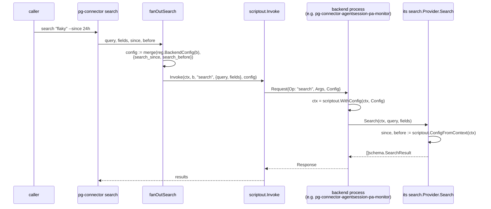

# search capability time-bound filtering — recommendation

Status: exploratory brainstorm, converged (2026-09-18); answers bead `pg2-emmut`, itself spun out
of the agentsession connector design's own explicit out-of-scope note (`docs/superpowers/specs/
2026-09-18-agentsession-connector-design.md`, "Explicitly out of scope" → "Time-bound filtering on
pg-connector's generic `search` capability"). This file is an ephemeral extraction source per this
repo's own citation conventions (`CLAUDE.md`, "Architecture Decision Records" → "Citation
conventions") — do not cite it from code; derive an ADR if any of this needs to outlive the
implementation.

## Recommendation (up front)

**Do not touch `search.Provider`'s Go method signature, and do not overload `fields`.** Deliver
`--since`/`--before` to a backend that wants them through the wire-level `config` channel
(`pkg/scriptout.WithConfig`/`ConfigFromContext`) that `pg-connector attention list` already uses
for `attention.perBackend`'s `attention_threshold`/`attention_exclude` — but populate that
channel's `since`/`before` keys **per call**, from a new `pg-connector search --since/--before`
CLI flag, not from a static nix-rendered `attention.perBackend`-shaped option. A backend with no
use for them (`pg-connector-pr-github`, `pg-connector-issue-jira`) requires **zero code changes**:
each already exposes an equivalent time bound today, natively, inside the query string itself
(GitHub search qualifiers, JQL comparisons). Only `pg-connector-agentsession-pa-monitor` — the one
backend whose query language is a bare full-text scan with no such qualifier syntax — needs to
read the new keys and forward them to `pa-monitor search --since/--before`.

This is deliberately a fifth option, not a pick among the bead's four. It reuses machinery this
codebase already validated for a structurally similar problem, adds no member to a shared Go
interface three (soon four) independent binaries implement, and correctly treats a time bound as
a per-invocation caller argument (like `fields`) rather than a standing per-host policy (like
`attention_threshold`).

## The question

`pkg/provider/search.Provider` (`packages/pg-connector/pkg/provider/search/iface.go`) declares one
method:

```go
type Provider interface {
	Search(ctx context.Context, query string, fields []string) ([]schema.SearchResult, error)
}
```

Every registered `search.sources` backend implements this same interface — today
`pg-connector-pr-github` and `pg-connector-issue-jira`, soon `pg-connector-agentsession-pa-monitor`
(design doc above, not yet built). None of them can express a time bound through it. Meanwhile
`pa-monitor search` (also not yet built — see "What exists today" below) and the underlying
`claudetranscript.Search(path, query, since, before time.Time)` primitive it will call are being
designed with exactly that filter, reachable only by invoking `pa-monitor` directly, never through
`pg-connector search <query>`'s generic fan-out. The bead asks whether/how to close that gap
uniformly.

## What exists today (verified against this worktree)

- **`fields []string` is documented as attribute selection, not filtering.**
  `search/iface.go`'s own doc comment: "fields is the caller-requested attribute list … how an
  empty list is interpreted … is left to the concrete implementation" and "[Search] does not
  itself validate fields against any known attribute name." `pkg/schema/search.go` confirms the
  same reading: `Attributes` is "whatever type-declared or backend-declared extension attributes a
  query's requested fields list asked for" — a projection knob, never a predicate. Both current
  implementations (`pg-connector-pr-github/internal/provider.go:304`,
  `pg-connector-issue-jira/internal/backend.go:687`) simply ignore `fields` (`_ []string`) today.
  Reusing this parameter to mean "restrict by time" would give the same wire field two unrelated
  jobs depending on which value looks like a duration/timestamp — a semantic collision the
  interface's own contract already forecloses.

- **`pg-connector-pr-github.Search`** (`provider.go:304`) passes `query` straight through, unparsed,
  to `ghProvider.SearchPRs` — literal GitHub search syntax. GitHub search already has native
  time-bound qualifiers (`created:>=2026-09-01`, `updated:<2026-08-01`, etc.); a caller wanting a
  bounded PR search can embed one today, with **no code change anywhere**, by writing it into the
  query text handed to `pg-connector search`.

- **`pg-connector-issue-jira.Search`** (`backend.go:687`) passes `query` straight through, as raw
  JQL, to `pjira search --jql <QUERY> --all`. JQL has the same native capability
  (`updated >= "-1d"`, `created >= "2026-09-01"`). Same conclusion: already solved for this
  backend, today, with no interface change.

- **`pg-connector-agentsession-pa-monitor` (planned) has no native query language at all.** Per the
  agentsession design (`docs/superpowers/specs/2026-09-18-agentsession-connector-design.md`,
  "pa-monitor changes (Phase 1)", item 3), `pa-monitor search` will run "a naive per-call scan over
  parsed text blocks" against transcript content — bare substring/text matching, not a
  qualifier-bearing query grammar. That is _why_ the plan gave it dedicated `--since <bound>
--before <bound>` flags at the `pa-monitor` CLI layer instead of a query-syntax convention: there
  is no query syntax to extend. This backend is the genuine outlier the other two are not.

- **Neither `pa-monitor search` nor `claudetranscript.Search` exist yet in this worktree** —
  confirmed by `find`/`grep` over `packages/pa-monitor` and `packages/claude-transcript`: no
  `search` subcommand, no `Search` function. They are Phase-1 design, per
  `docs/superpowers/plans/2026-09-18-agentsession-connector.md` (`func Search(path, query string,
since, before time.Time) ([]Match, error)`, lines ~83, ~221-260). This recommendation is
  independent of whether that phase has landed — it answers the shared-interface question either
  way — but it means today there is no live consumer forcing an answer yet, only the design
  question itself.

- **The `config` wire channel already exists and already carries exactly this shape of
  knob, for a different capability.** `attention.perBackend.<name>.{threshold,exclude}`
  (`home/programs/pg-connector/default.nix`, `attentionBackendExtra`/`renderedBackends`, lines
  ~52-86) renders onto each backend's opaque `backends.<name>` config block, without adding a
  single parameter to `attention.Provider.ListAttention(ctx)` — that method takes only `ctx`. Each
  backend reads its own `attention_threshold`/`attention_exclude` from
  `scriptout.ConfigFromContext(ctx)` _inside_ its own handler
  (`pg-connector-issue-jira/internal/attention.go`, `pg-connector-issue-beads/internal/
attention.go`; `pg-connector-pr-github`'s own rate-limit reserve reads the same channel's
  `rate_reserve_points` key, `provider.go:160`). The mechanism's own doc comment
  (`pkg/scriptout/config_context.go:1-11`) states the freedom boundary directly: "Widening Handle
  itself would touch every capability's dispatch table … Context is this package's existing
  vehicle for a value every handler transitively receives without changing its own signature."
  `search`'s own fan-out (`cmd/pg-connector/search.go:70-102`, `fanOutSearch`) is the one Tier-1
  verb that does **not** thread this channel yet — it calls `scriptout.Invoke(ctx, b, "search",
args, nil)` with a literal `nil` config, and says so in a comment: "search is outside this
  packet's own Files scope … no bead has yet needed per-backend config for search." That comment
  is now stale in exactly the direction this bead is asking about.

## Options weighed (the bead's four, plus this one)

1. **Widen `search.Provider.Search`'s Go signature** (`Search(ctx, query, fields, since, before)`).
   Rejected: a breaking change to every current and future implementer of a small, shared
   interface — for a parameter two of the three current backends do not need at all (they already
   have an equivalent, native, in-query mechanism) and the third can receive through an existing
   side channel instead. This is the classic cost of widening a **Strategy pattern**'s interface
   for one concrete strategy's requirement: every other strategy pays the recompilation/signature
   cost for a parameter it will forever ignore.

2. **Overload `fields []string`.** Rejected outright: `fields` is a documented, contractual
   attribute-selection list ("what to return"), and a time bound is a filter ("what to match") —
   conflating them breaks the interface's own stated contract, not just a style preference. A
   value in `fields` that happens to parse as `"24h"` or an RFC3339 timestamp would be
   indistinguishable from a caller who actually wants an attribute literally named `24h`.

3. **A static per-backend config knob mirroring `attention.perBackend`'s
   `threshold`/`exclude` shape** (e.g. a nix-level `search.perBackend.<name>.since`). Rejected as
   the wrong _kind_ of parameter, not the wrong mechanism: `attention_threshold` is standing host
   policy — set once in machine config, applied to every `list_attention` call until an operator
   edits the nix module and rebuilds. `--since`/`--before` on a search is a per-invocation argument
   a caller wants to vary on every call (`pg-connector search "flaky" --since 24h` right now, then
   `--since 7d` five minutes later) — exactly like `fields` and `query` themselves. Forcing it
   through a nix option would mean editing and rebuilding a home-manager module to change what
   "since" means for the _next_ search, which is not how any other per-call argument in this CLI
   works.

4. **Recommended: reuse the existing `config`-via-context wire channel, populated per-call
   from a new CLI flag**, rather than from static nix config. This keeps `attention.perBackend`'s
   proven _delivery mechanism_ (a backend-opaque JSON blob threaded onto `context.Context`, read
   only by the backend that cares) while fixing the mismatch option 3 has: the blob is now built
   fresh by `fanOutSearch` on every call from `--since`/`--before` flag values, not read verbatim
   from a static `backends.<name>` nix render. `pkg/provider/search`'s `iface.go`/`dispatch.go` do
   not change at all; `pg-connector-pr-github`/`pg-connector-issue-jira` do not change at all
   (they already silently ignore config keys they don't recognize, the same "well-behaved
   implementation … silently ignores" convention `search/iface.go` already documents for `fields`).

## Recommended mechanism, concretely



`search.Provider.Search`'s own signature is untouched at every step; `since`/`before` ride
alongside `query`/`fields` on the wire request's already-existing `Config` member
(`pkg/scriptout/exec.go:92-99` — "config is copied verbatim onto the outgoing Request's own Config
member"), the same member `attention.perBackend` already populates for a different capability.

## Concrete next step, if adopted

This bead's own acceptance is a recommendation, not code — the following is written as the plan
for whoever picks this up next (a separate implementation bead, filed by the orchestrator, not by
this exploration):

1. `cmd/pg-connector/search.go`'s `newSearchCmd` MUST gain `--since`/`--before` string flags,
   parsed with the same duration-or-RFC3339 convention already chosen for `pa-monitor search`
   (`docs/superpowers/plans/2026-09-18-agentsession-connector.md`'s `parseTimeBound`), so a caller
   sees one consistent syntax across both entry points.
2. `fanOutSearch` MUST build each backend's per-call `config` by merging `reg.BackendConfig(b)`'s
   existing static block (today passed as literal `nil`) with `{"search_since": <RFC3339 or
omitted>, "search_before": <RFC3339 or omitted>}` when either flag was given, then pass that
   merged blob to `scriptout.Invoke` in place of today's hardcoded `nil`. `fanOutSearch`'s own stale
   comment ("no bead has yet needed per-backend config for search") MUST be corrected in the same
   change. The `search_` prefix MUST be used (not bare `since`/`before`) to avoid any future
   collision with `attention.perBackend`'s `attention_`-prefixed keys inside the same
   `backends.<name>` block.
3. `pg-connector-agentsession-pa-monitor`'s own `Search` implementation (once that backend exists)
   MUST read `search_since`/`search_before` from `scriptout.ConfigFromContext(ctx)` and forward them
   to `pa-monitor search --since/--before` verbatim — mirroring exactly how
   `pg-connector-issue-jira/internal/attention.go` already reads `attention_threshold`/
   `attention_exclude` from the same channel today.
4. `pg-connector-pr-github` and `pg-connector-issue-jira` MUST NOT be changed by this work — they
   already answer a time-bounded search today via their own native query syntax embedded directly
   in the query string.
5. `pg-connector search`'s own `--help` text and any operator-facing docs SHOULD state the
   resulting asymmetry explicitly, so it is a documented freedom boundary rather than a surprise: a
   caller who fans a single `search --since 24h` out across `pr-github` + `agentsession` gets a
   time-filtered agentsession result set but an **unfiltered** pr-github result set unless they
   also add a GitHub `updated:>=…` qualifier into the query text themselves — `--since`/`--before`
   only bounds backends that read the new config keys, which today means agentsession alone.

## Out of scope for this exploration

- Building `pg-connector-agentsession-pa-monitor`, `pa-monitor search`, or
  `claudetranscript.Search` themselves — tracked by the agentsession connector design/plan, not
  this bead.
- A universal, backend-independent time-bound _query language_ pg-connector itself parses and
  rewrites per backend (e.g. translating one caller-facing `--since` into GitHub's `updated:>=` and
  JQL's `updated >=` automatically). Nothing in the current bead or design asks for this, and it
  would be a materially larger change (a query-rewriting layer, per-backend syntax knowledge living
  in the Tier-1 core) than the gap actually observed — filing it, if wanted, is a separate decision
  for the orchestrator.
