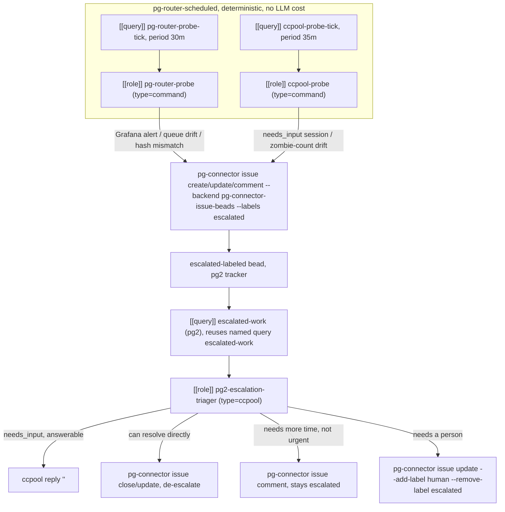

# pg-router/ccpool self-monitoring and escalation design

Status: approved for implementation
Date: 2026-09-22

## Purpose

pg-router and ccpool have no automated self-monitoring today. The live incident that motivated
this design (bead `pg2-5sirm`, `phillipgreenii-nix-agent-support`) — the `review`/`feedback`
ccpool-handler roles crash-looping on a dead session row — was caught and diagnosed by a human
manually polling `pg-router status`, `ccpool list`, and `events.jsonl` over the course of a
session. This design automates that polling cheaply, and adds a mechanism to act on what it
finds.

Two cheap, deterministic **probes** watch pg-router's and ccpool's own operational health and,
on a real finding, file a `bd` issue labeled `escalated` — no LLM involved in detection. A single
**escalation-triager** role (an LLM-backed ccpool session, reused across both `bd` trackers on
this machine) picks up `escalated` beads, investigates, and either resolves the situation
directly (including answering a stuck `needs_input` ccpool session), leaves it for a later pass
with new findings appended, or hands it to a human by swapping the `escalated` label for `human`.

This keeps the expensive part (an actual Claude session) gated behind a real finding, the same
two-phase shape `local-alert-triage` (`phillipg-nix-ziprecruiter`, merged 2026-09-21) already
validated for Grafana alerts generally — this design is the pg-router/ccpool-specific,
scheduled counterpart, reusing that precedent's conventions rather than duplicating its Grafana
plumbing.

## Precedent this design follows

- **`local-alert-triage`** (`phillipg-nix-ziprecruiter/modules/local-alert-triage`, bead
  `pg2-kv9ps`, merged): the closest existing thing. This design borrows its exit-code convention
  (`0`/`2`/`3`/`4`, see `lat-survey/tests/test-lat-survey-exit-codes.bats`), its fingerprint
  scheme for Grafana findings (`<rule-uid>|<sorted key=value labels>` plus a semicolon-joined
  alias field so a rule rename doesn't spawn a duplicate), and its no-duplicate/no-op-update
  philosophy, verbatim where the shape matches.
- **`desk-heartbeat`** (`phillipg-nix-ziprecruiter/modules/zm/default.nix`): the query/role split
  this design's two probes mirror exactly — a trivial periodic `[[query]]` that only produces a
  timestamp item, bound to a `type = "command"` `[[role]]` where the real work actually runs.
- **`feedback`/`worker`/`review`** (same file): the `type = "ccpool"` role shape the
  escalation-triager copies (actor/completion/onFailure/onDispatchFail/promptBody).
- **`pg-connector`'s `issue` capability** (`packages/pg-connector/pkg/provider/issue`): already a
  full read+write contract (`show/create/comment/transition/list/update/close/deps`) over the
  `pg-connector` CLI, backed by `pg-connector-issue-beads` mapping onto real `bd` calls. Nothing
  in this design needs a new backend capability.

## Architecture



The same `escalated-work` query and `escalation-triager` role shape are also wired for the `zr`
tracker (`zr-escalation-triager`), reusing one shared prompt/logic — see "Two trackers, one
role" below. Today only the `pg2`-side probes feed it; the `zr` wiring is deliberately dormant
until something produces a `zr`-tracker `escalated` bead (accepted scope — see Known
limitations).

## Tracker targeting (the part that needed correcting)

`pg-connector-issue-beads` does **not** resolve its target tracker from the calling process's
CWD — that was the original design and was deliberately reverted (bead `pg2-1q9c0`) because the
umbrella inherits whatever CWD it happens to be invoked from, not a human's deliberate choice. It
requires the `PG_CONNECTOR_ISSUE_BEADS_DIR` env var (or `bd`'s own `BEADS_DIR`, checked second)
and returns `ErrWorkspaceNotConfigured` otherwise.

Neither the command-type role config (`roleFile.Command{Argv []string}`) nor the ccpool-type role
config (`roleFile.CCPool{...}`, no `Env` field either, even though the underlying
`ccpool.CC.Ensure` interface and `ccpool new -env` both support it) expose a per-role env
override. This needs no code change to `pg-router`/`pg-router-ccpool-handler`, just:

- **Probes (command-type roles)**: wrap the role's `command.argv` with plain `env`:

  ```nix
  # modules/zm/default.nix, pgRouterCcpoolHandlerRoles.pg-router-probe
  pg-router-probe = {
    type = "command";
    command.argv = [
      "env"
      "PG_CONNECTOR_ISSUE_BEADS_DIR=${pg2WorkspaceDir}"
      "${pkgs.pg-router-probe}/bin/pg-router-probe"
    ];
  };
  ```

- **Triager (ccpool-type role)**: the dispatched session is a real Claude agent with `Bash` —
  its prompt instructs it to prefix every `pg-connector` invocation with
  `PG_CONNECTOR_ISSUE_BEADS_DIR=<this tracker's workspace dir>`, baked as a literal value into
  that tracker's own prompt file (two near-identical prompt files, differing only in that one
  value and the tracker-specific framing sentence).

`pg2WorkspaceDir` MUST resolve to whichever directory under `~/phillipg_mbp` `bd` already
resolves the `pg2-` tracker from (confirm the exact value at implementation time via
`bd show pg2-5sirm` from candidate directories — not guessed here, matching this design's own
"verify at implementation time" precedent set by `local-alert-triage`'s Grafana API paths).

The **read side** (the `escalated-work` query feeding the triager's dispatch, and the probes'
own pre-create dedup check) is unaffected by this: `pg-router-source-pg-connector changes issue
escalated-work --beads-dir <path>` already has a working `--beads-dir` flag (the same one
`issue-beads-work` uses today) and needs no change.

## Bead identity and schema

**Label**: every bead this system creates carries `escalated`. Deliberately not a generic label
like `alert` or `ccpool` — those risk another agent or process picking it up for an unrelated
reason (the operator's original objection). Repo label (`agent-support` vs. `ziprecruiter`, both
repos' own `CLAUDE.md` require one) is **not** set by either probe — it is a judgment call
(is this a tool bug or a deployment/config issue?) reserved for the triager's first pass, not the
deterministic probe filing the bead.

**Fingerprint metadata key**: `pg_router_escalation_fingerprint`, exact-match only (no fuzzy
matching at probe time — that judgment stays with the triager, mirroring `local-alert-triage`'s
own split between `lat-survey`'s exact-match and the LLM step's fuzzy rename detection).

- Grafana-alert findings (`pg-router-probe`): `<rule-uid>|<sorted key=value labels>`, plus a
  semicolon-joined alias field on the bead (`pg_router_escalation_fingerprint_aliases`) so a rule
  UID/label change doesn't spawn a duplicate — verbatim reuse of `lat-survey`'s scheme.
- `needs_input` findings (`ccpool-probe`): `needs-input:<ccpool session external_id>`.
- Zombie-count drift (`ccpool-probe`): `zombie-count:<severity band>` (see "nothing new" rule
  below for how the band is computed).
- Queue/backlog drift, daemon/handler hash mismatch (`pg-router-probe`): `queue-growth:<type>` /
  `binary-hash-mismatch`.

**"Nothing new" rule** (governs whether a probe creates, comments, or does nothing, for an
existing fingerprint match):

- Grafana finding: skip unless state, severity, or episode count changed since the matched
  bead's last comment.
- `needs_input` finding: skip unless the session's own state actually changed (e.g. it's no
  longer `needs_input`, or a materially different question is now pending) since the last note.
- Zombie-count / queue-growth finding: skip unless the value moved into a new severity band since
  the last note (bands: e.g. baseline / +50% / +100% / sustained-growth — exact thresholds are an
  implementation detail, not re-derived here).

A probe MUST run this check via `pg-connector issue list --query escalated-work --backend
pg-connector-issue-beads` (with `PG_CONNECTOR_ISSUE_BEADS_DIR` set), never `bd search`/`bd list`
directly.

**Body template** (mirrors `local-alert-triage`'s own):

```
Pg-Router-Escalation-Fingerprint: <fingerprint>

Source: pg-router-probe | ccpool-probe
Finding: <one-line description>
Since: <first-seen timestamp>
Evidence:
<raw evidence: alert payload / session id + tail excerpt / metric values>
```

Later updates append via `pg-connector issue comment`, never overwrite the body.

## `pg-router-probe` and `ccpool-probe`

Both are new packages in `phillipgreenii-nix-agent-support`, each with its own home-manager
module (`home/programs/pg-router-probe/`, `home/programs/ccpool-probe/`), matching this repo's
one-program-per-directory convention. Neither contains ZR-specific content — the tracker
directory and any ZR-flavored text are supplied at dispatch time via the `env`-wrapped argv, not
hardcoded.

Each binary exposes two subcommands, mirroring `pg-desk`'s own `heartbeat-item`/`heartbeat` split:

- `<probe> tick-item` — the `[[query]]`'s command; emits a single trivial timestamp item and does
  nothing else. Exists only so pg-router has something to dispatch on schedule.
- `<probe> run` — the bound `[[role]]`'s command; does the real work, including the
  `pg-connector` side effects. This is where every external call (HTTP client to Grafana,
  `ccpool` subprocess, `pg-connector` subprocess) MUST carry an explicit timeout — command-type
  roles get **no watchdog at all** (`pg-router-ccpool-handler`'s command executor explicitly
  documents "no ccpool/watchdog," unlike `budget.time` for ccpool-type roles), so a hang here is
  invisible to pg-router's own dispatch-failure tracking.

**`pg-router-probe run` checks**:

1. Grafana currently-firing alerts filtered to pg-router's 4 registered rule UIDs
   (`pg-router-liveness-down`, `pg-router-backlog-growing`, `pg-router-queue-depth-growing`,
   `pg-router-failure-rate`), same Grafana access pattern `lat-survey` already uses.
2. Queue/backlog drift vs. a persisted last-run snapshot.
3. Daemon/handler binary hash sanity (unexpected change with no corresponding deploy record).

**`ccpool-probe run` checks**:

1. `ccpool list -filter pgrouter.pool=pg-router -state needs_input` — scoped via the metadata
   `pg-router-ccpool-handler` already stamps on every session it dispatches
   (`internal/ccpool/meta.go`'s `DispatchMeta`), including the escalation-triager's own sessions.
   No new tagging scheme needed.
2. Errored/working zombie count vs. a persisted baseline.

**Exit codes** (reusing `lat-survey`'s convention exactly): `0` clean, nothing found or nothing
new; `2` usage error; `3` total failure (e.g. every sub-check's dependency unreachable) — writes
nothing; `4` partial (one sub-check degraded, others ran) — proceeds with what succeeded, and
the resulting bead (if any) carries a note about which sub-check was skipped.

**Snapshot robustness**: a missing, corrupted, or version-mismatched last-run snapshot are all
treated identically — log it, treat as "no prior baseline" (this run is quiet on drift checks by
construction), and overwrite with a fresh, version-stamped snapshot.

## Scheduling

Both probes are scheduled through pg-router itself (the `desk-heartbeat` pattern), not an
independent launchd timer — chosen deliberately for consistent operational visibility in
`pg-router status`/`events.jsonl`, the same place every other role's activity already shows up.
Accepted tradeoff, stated once: if pg-router itself is fully down, these probes do not run
either — a monitoring system that depends on the thing it watches to schedule itself. Visibility
was prioritized over that edge case.

```nix
# modules/zm/default.nix, pgRouterConfigAttrs.query
{
  name = "pg-router-probe-tick";
  emits = [ "pg-router-probe.tick" ];
  type = "command";
  trigger = { kind = "period"; every = "30m"; };
  command.argv = [ "${pkgs.pg-router-probe}/bin/pg-router-probe" "tick-item" ];
}
{
  name = "ccpool-probe-tick";
  emits = [ "ccpool-probe.tick" ];
  type = "command";
  trigger = { kind = "period"; every = "35m"; };
  command.argv = [ "${pkgs.ccpool-probe}/bin/ccpool-probe" "tick-item" ];
}
```

30m/35m are plain round numbers, matching every other period trigger already in this file
(`pr-sweep`=30m, `issue-beads-work`=5m, heartbeats=60s) — not a deliberately-coprime pair. Two
lightweight non-LLM CLI checks firing roughly half an hour apart is not spike territory; a plain
stagger gets the same "don't collide" property without numbers an on-call human can't reason
about at a glance.

**Alerting gap this design closes**: a probe's own `tick-item` command failing routes through
`pg_router_source_failures` (`internal/discover/discover.go`'s `SourceFailureObserver`) — a
different metric than `pg_router_failures_total`, which is the only one `alerts.yaml`'s existing
`pg-router-failure-rate` rule watches. Left alone, this reproduces `pg2-5sirm`'s own root defect
(a metric with no alert) inside the system built to prevent it. This design adds a new rule:

```yaml
# packages/pg-router/grafana/alerting/alerts.yaml, new rule
- uid: pg-router-source-failure-rate
  title: pg-router event source failure rate is non-zero (by source)
  condition: C
  for: 10m
  noDataState: OK
  execErrState: Error
  labels:
    severity: warning
  annotations:
    summary: "pg-router source {{ $labels.source }} has been failing to produce events"
    description: "sum by (source) (rate(pg_router_source_failures[10m])) has stayed above 0 for over 10 minutes for source {{ $labels.source }} -- a query's own command is failing, which is invisible to pg_router_failures_total (dispatch-side only). Added alongside the pg-router-probe/ccpool-probe self-monitoring system (2026-09-22) specifically so a probe's own failure to run is not itself a silent gap."
  data:
    - refId: A
      relativeTimeRange: { from: 600, to: 0 }
      datasourceUid: prometheus
      model:
        refId: A
        editorMode: code
        instant: true
        expr: sum by (source) (rate(pg_router_source_failures[10m]))
    - refId: B
      datasourceUid: __expr__
      model: { refId: B, type: reduce, expression: A, reducer: last }
    - refId: C
      datasourceUid: __expr__
      model:
        refId: C
        type: threshold
        expression: B
        conditions: [{ evaluator: { type: gt, params: [0] } }]
```

## Two trackers, one role: the escalation-triager

**Triggering**: a new named query in `pg-connector-issue-beads.queries`
(`phillipg-nix-ziprecruiter/machines/phillipg-mbp-02/default.nix`):

```nix
pg-connector-issue-beads.queries.escalated-work = "ready --label escalated --exclude-label human";
```

`--exclude-label human` matches the standing convention already used by `feedback-ready`,
`worker-ready`, and `review-ready` in this same block — a human-labeled bead is never picked up
by automation, full stop.

Two `[[query]]`/`[[role]]` pairs reference this one named query, differing only in which
tracker's workspace they point at:

```nix
# modules/zm/default.nix, pgRouterConfigAttrs.query
{
  name = "pg2-escalated-work";
  emits = [ "escalated.pg2" ];
  type = "command";
  command.argv = [
    "${pkgs.pg-router-source-pg-connector}/bin/pg-router-source-pg-connector"
    "changes" "issue" "escalated-work" "--consumer" "pg-router" "--beads-dir" pg2WorkspaceDir
  ];
  format = "json";
}
{
  name = "zr-escalated-work";
  emits = [ "escalated.zr" ];
  type = "command";
  command.argv = [
    "${pkgs.pg-router-source-pg-connector}/bin/pg-router-source-pg-connector"
    "changes" "issue" "escalated-work" "--consumer" "pg-router" "--beads-dir" monorepoPath
  ];
  format = "json";
}
```

```nix
# modules/zm/default.nix, pgRouterConfigAttrs.role
{ name = "pg2-escalation-triager"; enabled = true; binds = [ "escalated.pg2" ]; }
{ name = "zr-escalation-triager"; enabled = true; binds = [ "escalated.zr" ]; }
```

```nix
# modules/zm/default.nix, pgRouterCcpoolHandlerRoles
pg2-escalation-triager = {
  type = "ccpool";
  ccpool = {
    actor = "pgii-pool__pg2-escalation-triager";
    completion = "close-or-handback";
    onFailure = "add-human";
    onDispatchFail = "leave";
    authorshipGuard = false;
    promptBody = lib.removeSuffix "\n" (builtins.readFile ./pg-router/escalation-triager-pg2-prompt.txt);
  };
};
zr-escalation-triager = {
  type = "ccpool";
  ccpool = {
    actor = "pgii-pool__zr-escalation-triager";
    completion = "close-or-handback";
    onFailure = "add-human";
    onDispatchFail = "leave";
    authorshipGuard = false;
    promptBody = lib.removeSuffix "\n" (builtins.readFile ./pg-router/escalation-triager-zr-prompt.txt);
  };
};
```

The two prompt files share one body, differing only in the tracker-specific
`PG_CONNECTOR_ISSUE_BEADS_DIR` value and a one-line framing sentence. Both live in
`modules/zm/pg-router/`, alongside the existing `feedback`/`worker`/`review` prompts.

### Behavior

1. Read the bead's fingerprint/evidence; investigate using `pg-router status`, `ccpool list`,
   `events.jsonl`, and Grafana as needed.
2. If the finding is a `needs_input` ccpool session and the triager can confidently answer the
   pending question: `ccpool reply <session> "<answer>"` (never `ccpool attach`).
3. Decide one of three outcomes:
   - **Handle directly**: take an already-authorized action (pause/unpause pg-router,
     close/purge a zombie ccpool session, the `ccpool reply` above) that resolves the finding,
     then `pg-connector issue close`/`update --remove-label escalated`.
     _Example_: a `needs_input` session is stuck on a question the triager can answer from the
     bead's own transcript context (e.g. "which retry attempt is this?") — reply, confirm the
     session resumed, close the bead.
   - **Triage**: append what was learned via `pg-connector issue comment`, leave `escalated` for
     a later pass. Before appending, check the bead's own prior comments — a repeat dispatch on
     a still-unresolved, unchanged situation MUST NOT append a redundant "still happening" note
     (this is the same "nothing new" discipline the probes apply, now applied by the triager to
     its own repeat visits).
     _Example_: queue depth is growing but the cause isn't yet clear and nothing about it has
     changed since the last look — note that it's still under observation, don't repeat verbatim.
   - **Escalate to human**: `pg-connector issue update --add-label human --remove-label
escalated`, when resolving it requires something only a person can do (e.g. the exact
     `zr-0t0z7.3` shape from this session's own monitoring: a permission-elevated edit the
     triager cannot make itself).
     _Example_: the pending `needs_input` question is asking for a decision outside the
     triager's authority (approving a destructive action, a design call), or the underlying fix
     requires editing pg-router/ccpool-handler source — which this role MUST NOT do; code fixes
     stay bead → drain session, matching the standing "file/update beads, don't fix" mandate from
     this session's own monitoring authority.
4. No `bd`-style claim/assignee step is needed before working a bead: pg-router's own role
   dispatch already guarantees single-delivery per queued item (the same reason `feedback`/
   `worker`/`review` never call `bd claim` either), and `pg-connector`'s `IssueUpdateFields` has
   no assignee field to call anyway.

**Concurrency**: shares ccpool's existing default pool for v1, like `feedback`/`worker`/`review`
do today — true dedicated per-role isolation (`pg2-mr0sl`) has unresolved prerequisites
(`pg2-ts8h0` blocked on `pg2-2pqzq`, a flake-lock relock already deliberately deferred by the
operator). Acceptable given this role fires rarely. File a follow-on bead once that chain lands
to reconsider isolating it.

## Error handling summary

| Failure                                                 | Behavior                                                                                                                                               |
| ------------------------------------------------------- | ------------------------------------------------------------------------------------------------------------------------------------------------------ |
| Probe's external call hangs                             | Probe MUST own an explicit timeout on every external call; no pg-router watchdog exists for command-type roles                                         |
| Probe's `tick-item` command fails                       | Now alerted via the new `pg-router-source-failure-rate` rule                                                                                           |
| Probe partial failure (one sub-check down)              | Exit `4`, proceed with what succeeded, note the gap in any resulting bead                                                                              |
| Probe total failure                                     | Exit `3`, write nothing                                                                                                                                |
| `pg-connector` call fails (create/update/comment/close) | Probe/triager logs and does not retry indefinitely; a persistent failure here would itself eventually be visible as a repeat finding on the next cycle |
| Triager dispatch fails                                  | `onDispatchFail = "leave"`; `onFailure = "add-human"` (mirrors `worker`/`review`)                                                                      |
| `ccpool reply` fails                                    | Falls through to the triage/escalate decision, not treated as success                                                                                  |

## Validation

- Per-probe unit/integration tests for the deterministic logic (fingerprinting, "nothing new"
  comparison, snapshot robustness), using fixtures the same way `lat-survey`'s bats suite does.
- Manual smoke test: force a real finding (e.g. temporarily rename a bead's fingerprint metadata,
  or simulate a `needs_input` session) and confirm the full path — probe → bead → triager
  dispatch → resolution/triage/escalation — before considering either probe or the triager done.
- `prek run --files <changed files>` before each commit; `nix flake check` once before landing,
  per this repo's own land-time gate.
- Post-implementation review: dispatch an independent subagent to review the implementation
  against this spec for correctness, completeness, UX, and consistency, before considering this
  done — mirroring `local-alert-triage`'s own closing step, and this design's own review process.

## Known limitations (accepted, not deferred by oversight)

- Probes depend on pg-router itself being up to run (the "watchman" tradeoff) — accepted in
  exchange for unified operational visibility.
- The `zr-escalation-triager` wiring is live but currently dormant: nothing today produces a
  `zr`-tracker `escalated` bead. It was still wired now, per an explicit ask, so a future
  zr-side source needs no new plumbing — only a bead to feed it.
- Concurrency isolation for the triager is deferred to `pg2-mr0sl`/`pg2-ts8h0` landing.
