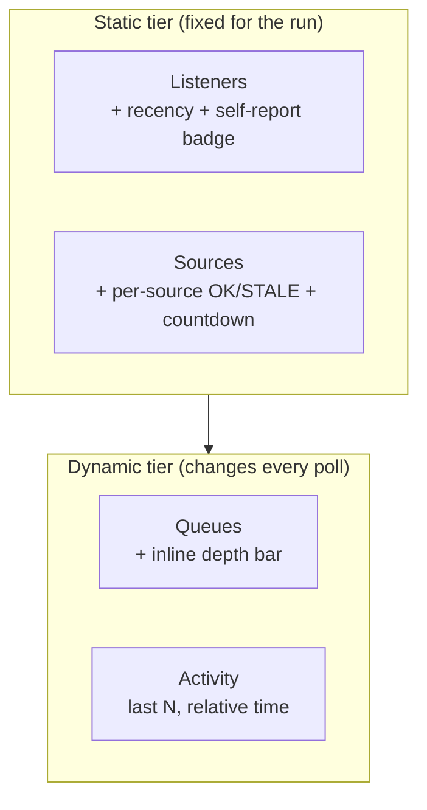
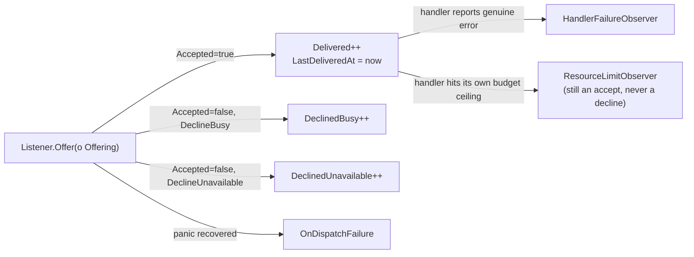

# pg-router TUI & dashboard observability — design

Status: draft, awaiting review. Throwaway per this repo's `docs/behavior`-first
convention: this file exists to get from an operator complaint to an
implementation plan, then it is superseded by whatever lands in
`docs/behavior/`, `schemas/`, and code. Nothing outside this repo should ever
cite it by path.

## Context

The operator (Phillip) reviewed pg-router's TUI (`internal/tui`) and Grafana
dashboard (`grafana/`) and found the operator-facing surface insufficient:

- The "Registry" pane appears to show only handlers, and it is unclear
  whether sources are registered at all.
- Source health reads "stale" so often that the tool looks broken.
- There is no way to tell which listeners are doing something right now.
- The Activity pane sits above the other panes and its row count changes on
  every poll, visibly reflowing the panes below it.
- The Activity pane shows unbounded entries with absolute timestamps.
- `pr.reconcile`'s queue depth reads as roughly 70 on every pass, which looks
  like 70 items needing the operator's attention.
- Whatever changes land here should have a dashboard-side counterpart where
  one makes sense.

Three parallel research passes (against `internal/tui/*`, `internal/core`,
`internal/config`, `internal/eventqueue`, `internal/orchestrator`,
`internal/metrics`, and `grafana/`) plus two direct code reads of
`internal/tui/reply.go`, `internal/eventqueue/queue.go`, and
`internal/orchestrator/orchestrator.go` established ground truth before this
design was written. Findings are cited by file:line throughout.

## Scope

This design covers `phillipgreenii-nix-agent-support/packages/pg-router`
only:

- `internal/tui/*` — the operator-facing terminal UI.
- `internal/tui/reply.go`, `internal/core/core.go`,
  `schemas/*.json`, `conformance/testdata/**` — the wire shapes those panes
  render, and the additive fields this design adds to them.
- `internal/eventqueue/queue.go`, `internal/orchestrator/*` — the per-listener
  counters this design widens.
- `internal/config/registry.go` — the new optional per-source interval field.
- `grafana/*`, `internal/metrics/metrics.go` — phase 2 only (see "Phasing").

No changes to `pg-connector` (the CLI/backend tool pg-router's sources pull
from) and no changes to `phillipg-nix-ziprecruiter`'s query configuration
(the `pr-sweep`/`team` query breadth is an explicit non-goal — see below).

## Non-goals (explicitly deferred or rejected)

- **Computing a "PRs needing action" count for `pr.reconcile`.** Rejected by
  the operator: pg-router has no business classifying PR content as
  actionable, and doing so would reintroduce the "Tier-2 execs Tier-1"
  layering violation the 2026-09-05 pg-connector deep review already flagged
  as a defect elsewhere in this system. `pr.reconcile`'s count is relabeled
  (see "pr.reconcile relabeling"), not filtered.
- **Tightening `phillipg-nix-ziprecruiter`'s `team` query** to true
  involves-me filters. This changes what the operator actually monitors, not
  how it is displayed — the operator's call, tracked separately, out of this
  design's scope.
- **True per-listener "busy right now" tracking.** Requires exporting
  `eventqueue.Queue`'s private per-listener in-flight state
  (`internal/eventqueue/queue.go`) through the orchestrator and onto the
  wire. Deferred to a phase 2 bead; phase 1 ships a cheaper recency proxy
  instead (see "Listener recency").
- **Dashboard metric/panel parity.** The operator chose to sequence TUI first,
  dashboard second. Phase 2 is scoped in "Phasing" but not designed in detail
  here; it gets its own follow-on design once the phase-1 wire shapes are
  settled, since the new metrics should mirror the final field names.

## Design overview

Three defects and one naming collision are being fixed, using patterns
already present elsewhere in this codebase:

1. **Wrong interval fed into staleness.** `sourceHealthText`
   (`internal/tui/panes.go:96-115`, comparison at `:110`) computes staleness
   as `now - LastTick > 3 × tickIntervalMs`, where `tickIntervalMs` is the
   core's own pool-tick cadence (`StatusReply.TickIntervalMs`,
   `internal/tui/reply.go:31`) applied uniformly to every source. A source
   that legitimately polls slower than the core's tick — any `kind: "period"`
   query with its own `[query.trigger] every`
   (`internal/config/registry.go:447-461`) — reads "stale" between every one
   of its own normal ticks. The fix introduces a `StalenessPolicy` Strategy:
   one implementation computes the threshold from a known interval, another
   returns "interval unknown" outright, and `sourceHealthText` calls whichever
   one applies instead of hand-checking a single formula. Only `period`
   triggers resolve to a concrete interval today — `buildTrigger` also
   returns `query.ThresholdTrigger`/`query.ManualTrigger` for the other two
   `[[query]]` kinds, and neither carries an `Every` at all
   (`internal/config/registry.go:447-469`), so those sources get the
   "unknown" Strategy, not a computed one.
2. **A naming collision, not a missing feature.** `internal/core.Registry`
   (self-report: `Register`/`RegisterInProcess`,
   `internal/core/registry.go:140-183`) and `internal/config.Registry` (the
   TOML-driven engine that turns `[[role]]`/`[[query]]` blocks into the
   Listeners/Sources the TUI already shows,
   `internal/config/registry.go:334-360`) are two unrelated types that
   happen to share a name. Only `internal/core.Registry` reaches the wire
   (`StatusReply.Registry []Registration`, `internal/tui/reply.go:35`,
   rendered by the TUI's "Registry" pane) — and only handlers call into it
   (`cmd/pg-router/run.go:360`,
   `svc.Registry().RegisterInProcess(r.Name, core.KindHandler)`), because its
   actual purpose is letting `Offer` consult self-reported availability
   _before_ dispatching (`internal/orchestrator/orchestrator.go:92-104`,
   `core.Registry.Available`) — the mechanism behind `DeclineUnavailable`
   below. Sources have no equivalent pre-dispatch check, so nothing ever
   registers one. The fix removes the standalone "Registry" pane and folds
   its one real signal (a handler's self-reported availability) into the
   Listeners pane as a column, keyed by `Registration.ID == Listener.Role`
   (verified equal at the one call site above).
3. **A flat typed field hiding a classification that already reaches the raw
   wire.** `Listener.Declined` (`internal/tui/reply.go:149`) is a single
   `int64`. But `DeclineReason` (`internal/eventqueue/queue.go:66-87`) —
   `DeclineBusy` ("not right now"), `DeclineUnavailable` (the
   self-reported-availability race from point 2, unavoidable and not a bug),
   `DeclineNone` (unclassified/legacy) — is not new data to invent: it's
   already bumped into `ListenerCounts.DeclinedByReason` and emitted in raw
   `listeners[]` JSON as `declinedByReason` (`internal/core/core.go:195-215`,
   `:1445-1478`, landed under bead `pg2-j4uwg`). The gap is narrower than "no
   classification exists" — it's that `internal/tui/reply.go`'s _typed_
   `Listener` struct never decodes that field (its own doc comment lists
   `resolvedConfig`/`counters` as deliberately-deferred fields but doesn't
   mention `declinedByReason` at all). One wrinkle to account for: the map's
   keys are `reason.String()` ("busy"/"unavailable"/"none") _unless_ a
   Listener supplies a `DeclineDetail` override
   (`internal/eventqueue/queue.go:830-839`), in which case the key becomes an
   arbitrary opaque string instead. The fix decodes and buckets that existing
   map — exact "busy"/"unavailable" keys into their own fields, anything else
   (including override strings) into a visible "other" bucket — rather than
   adding new counters at the eventqueue layer. Separately, a handler's own
   _business-logic_ rejection is not a decline at all — it is
   `HandlerFailureObserver` (`internal/orchestrator/orchestrator.go:115-126`),
   which today reaches only the metrics Emitter, not the wire; that part IS
   new plumbing. And a resource-limit hard-stop is already excluded from
   "declined" — tracked as a genuine accept via `ResourceLimitObserver` (same
   file, `:105-114`; `internal/orchestrator/listener.go:266-267`, "a budget
   hard-stop was a genuine ACCEPT, never a decline") — though that observer
   has no live caller today (`listener.go:267-269`/`:306-309`: the
   `watchdog.ErrBudgetExceeded` signal it existed for "has no wire-level
   signal to detect it from anymore"). It's cited here as evidence the code
   already agrees resource limits aren't declines, not as something this
   design wires up.
4. **A recency proxy, not new plumbing, for "what's this listener doing."**
   True in-flight tracking is phase 2 (see "Non-goals"). Phase 1 adds a
   `LastDeliveredAt` timestamp to `Listener`, populated at the same point the
   existing `Delivered` counter increments, giving an honest "last delivered
   Ns ago" column with no new instrumentation surface.
5. **A flat zone list with no grouping.** Today's TUI zone order
   (`internal/tui/model.go:414-450`) is flat: banner → Activity (full-width,
   height = current entry count) → Listeners → Queues → Sources → Registry.
   Activity's row count changes every poll and visibly pushes every pane
   below it. The fix partitions that same flat list into two ordered groups:
   a **static tier** (Listeners, Sources — fixed membership for the run)
   rendered above a **dynamic tier** (Queues, Activity — changes every poll).
   This is a reordering and a `dropOrder` change, not a new component
   abstraction — nothing in the static tier moves when the dynamic tier's
   content changes.





## Data model changes

All changes are additive to the wire shape (`schemas/*.json`,
`internal/tui/reply.go`, `internal/core/core.go`'s `composeStatusReply`);
existing consumers that ignore unknown JSON fields are unaffected. Each field
below needs a matching update to the golden fixtures under
`conformance/testdata/golden/` and, since a `compat/` fixture set exists, a
backward-compat entry proving an old-shape reply still decodes.

### Source

Add one field:

```go
type Source struct {
	Name     string    `json:"name"`
	Type     string    `json:"type"`
	Enabled  bool      `json:"enabled"`
	Excluded bool      `json:"excluded"`
	Mode     string    `json:"mode"`
	LastTick time.Time `json:"lastTick"`
	Failure  *Failure  `json:"failure"`
	// ExpectedIntervalMs is this source's own expected tick cadence, in
	// milliseconds. For a `kind: "period"` query it is that query's resolved
	// trigger interval (internal/config/registry.go's buildTrigger, already
	// computed internally today — this field surfaces an existing value, it
	// does not compute a new one). `kind: "threshold"`/`"manual"` queries
	// have no such interval (buildTrigger returns ThresholdTrigger/
	// ManualTrigger, neither carrying an Every) and resolve to 0. 0 means
	// unknown, and staleness MUST render as "N/A", never "stale", when it is
	// 0.
	ExpectedIntervalMs int64 `json:"expectedIntervalMs"`
}
```

Config addition (`internal/config/registry.go`): an optional
`expected_interval` duration field on a source's config block. This is
forward-looking, not additive-to-an-existing-thing: no query in this codebase
is push-mode today — `Mode` is `"pull"` for every existing source
(`internal/core/status.go:60-64` documents `Mode` as schema-general, "no
query type in this codebase fires from anything but the drive loop's own
Trigger, so there is no live 'push' query"). The field exists so that if/when
a push source is added, its staleness can be interval-aware from day one
instead of needing a second follow-up change. Unset stays unset — this is NOT
a required field and MUST NOT default to the pool `PollInterval`, since a
push source's real cadence has no relationship to the core's tick.

Staleness Strategy (`internal/tui/panes.go`), replacing the single
`staleThreshold(tickIntervalMs)` formula with a `StalenessPolicy` selected
per source:

- `ExpectedIntervalMs == 0` → the "unknown" policy: render `N/A` (not
  "stale", not "ok"). This is distinct from the existing `idle` state
  (a source that has never ticked at all) — `idle` MUST still take
  precedence over `N/A` exactly as it takes precedence over `stale` today;
  `N/A` only applies to a source that has ticked at least once but whose
  expected cadence is unknown.
- Otherwise → the interval-based policy: `threshold = max(3 ×
ExpectedIntervalMs, 5s)` (same shape as today, just fed the right
  interval) → `OK` / `STALE <duration overdue>`.
- When `OK`, additionally render the countdown to the next expected tick:
  `ExpectedIntervalMs - (now - LastTick)`, floored at 0.

### Listener

Add a recency timestamp and split the decline counter:

```go
type Listener struct {
	Role      string   `json:"role"`
	Binds     []string `json:"binds"`
	Enabled   bool     `json:"enabled"`
	Excluded  bool     `json:"excluded"`
	Delivered int64    `json:"delivered"`
	// LastDeliveredAt is the timestamp of the most recent successful
	// delivery (Offer returning Accepted=true), populated at the same call
	// site that increments Delivered. Zero value means never delivered.
	LastDeliveredAt time.Time `json:"lastDeliveredAt"`
	// Declined stays as this listener's existing total, for backward
	// compatibility with any existing consumer that reads it; DeclinedBusy +
	// DeclinedUnavailable + DeclinedOther MUST sum to it.
	Declined           int64    `json:"declined"`
	DeclinedBusy       int64    `json:"declinedBusy"`
	DeclinedUnavailable int64   `json:"declinedUnavailable"`
	// DeclinedOther covers DeclineNone (the legacy/unclassified catch-all)
	// AND any decline whose OnDeclined reason was a Listener-supplied
	// DeclineDetail override string rather than one of the two known reason
	// strings (internal/eventqueue/queue.go:830-839) — named distinctly from
	// Busy/Unavailable so a nonzero value is visibly "something not cleanly
	// classified," not silently folded into either real reason.
	DeclinedOther int64 `json:"declinedOther"`
	// HandlerFailures counts genuine business-logic rejections
	// (HandlerFailureObserver) — NOT a decline (the item was accepted), kept
	// on Listener because it is the same "is this listener working
	// correctly" question the pane already answers.
	HandlerFailures int64 `json:"handlerFailures"`
	Backoff         *Backoff `json:"backoff"`
	// SelfReportState folds in what the standalone Registry pane used to
	// show: Registration.State for the Registration whose ID equals this
	// Listener's Role, or "" if this listener has never self-reported (which
	// is a legitimate, common state, not an error). A value of "degraded" or
	// "unavailable" MUST render with the same warning styling HEALTH already
	// uses for those states (panes.go's poolDegraded treats them as
	// unhealthy elsewhere in this file) — it MUST NOT render as plain text
	// indistinguishable from a healthy self-report.
	SelfReportState string `json:"selfReportState"`
}
```

Population:

- `LastDeliveredAt`: set at the existing call site that increments
  `Delivered`, which gains a paired timestamp write.
- `DeclinedBusy`/`DeclinedUnavailable`/`DeclinedOther`: **decoded and
  bucketed from data that already reaches the wire**, not new counters.
  `internal/core/core.go`'s `ListenerCounts.DeclinedByReason` is already
  bumped on every `OnDeclined` call (`cmd/pg-router/run.go:726-736`, bead
  `pg2-j4uwg`) and already emitted as raw `declinedByReason` JSON
  (`statusListeners`, `core.go:1445-1478`) — `internal/tui/reply.go`'s typed
  `Listener` just never decodes it. The fix adds that decode step, bucketing
  the exact keys `"busy"`/`"unavailable"` into their own fields and folding
  every other key (including `DeclineDetail` overrides) into `DeclinedOther`.
  No change to `internal/eventqueue/queue.go` or `core.go`'s bump/emit sites
  is needed for this part.
- `HandlerFailures`: new counter fed by `HandlerFailureObserver`
  (`internal/orchestrator/orchestrator.go:115-126`), which today only
  reports to the metrics Emitter — this design adds a second, per-listener
  sink. This one IS new plumbing, unlike the decline breakdown above.
- `SelfReportState`: computed where the reply is assembled
  (`composeStatusReply`, `internal/core/core.go`), by looking up
  `Registration.ID == Listener.Role` in the existing `registry` array — no
  new registration call sites, this is a join over data that already
  exists.

### Registry pane removal

The standalone "Registry" pane (`internal/tui/panes.go:293-305`) is removed.
`StatusReply.Registry []Registration` stays on the wire unchanged (removing
it would be a breaking, non-additive change for no reason — the TUI simply
stops rendering a dedicated pane for it, consuming it only via the
`SelfReportState` join above). Sources never populate a `Registration`
(nothing calls `Register` for a source — see "Design overview" point 2), so
no equivalent join is added to `Source`.

`docs/behavior/interfaces.md:234-236` documents, as intended behavior, "a
push-only source still registers so it appears in the registry and its
lifecycle is known." That promise has no implementation path today (no
source, push or pull, ever calls `Register`) and this design does not add
one — see "Phasing", Phase 1 item 7, for the required doc reconciliation.

### pr.reconcile relabeling

Display-only, no wire change: the Queues pane's row for any queue type
sourced from a reconciliation-style sweep (starting with `pr.reconcile`)
renders with a label clarifying it is a monitored-universe count, e.g.
`pr.reconcile 70 (heartbeat)`, rather than presenting the bare number beside
types like `pr.changed` that ARE incremental/actionable. No new metric, no
new field — this is a rendering-layer string change plus (if needed) a small
config-driven list of "heartbeat-style" type names, since pg-router has no
existing way to distinguish a reconciliation sweep type from an incremental
one.

## TUI changes

### Layout: two tiers

Replace the flat zone list in `internal/tui/model.go:414-450` with two
docked sections, static above dynamic (diagram above). Drop-order under
height pressure (`unfocusedPaneDropOrder`, `model.go:540-547`) changes to
trim within the dynamic tier first (Activity, then Queues) before ever
touching the static tier — today Queues and Registry share drop-priority 4,
dropping before Listeners/Sources; Registry no longer exists as a pane, and
Queues drops only after Activity.

### Sources pane

Two-column health plus countdown, per "Data model changes → Source":

```
SOURCE            STATUS    SINCE LAST TICK   NEXT CHECK IN
pr-sweep          ok        4m10s             ~50s
ci-github-actions ok        22s               ~2m38s
scm-git           STALE     8m03s             overdue by 5m03s
push-ci-relay     N/A       1m40s             (no interval configured)
brand-new-source  idle      —                 (never ticked)
```

`push-ci-relay` HAS ticked (real elapsed duration shown) but its interval is
unknown, hence `N/A` — distinct from `brand-new-source`, which has never
ticked at all and shows the existing `idle` state, unchanged and taking
precedence over `N/A`/`STALE` exactly as it does today.

### Listeners pane

Recency, decline breakdown, and self-report badge added:

```
ROLE           BINDS   HEALTH  LAST DELIVERED  DLVD  DECL(busy/unavail/other)  FAIL  SELF
df-feedback    pr.*    ok      12s ago         341   2 / 0 / 0                 1     started
df-categorize  issue.* ok      3s ago          128   0 / 0 / 0                 0     —
```

`SELF` renders `—` when `SelfReportState == ""` — a listener that has never
self-reported is not an error state, and MUST NOT render as blank-looks-broken.

### Queues pane

Unchanged columns, adds an inline depth bar to incremental/actionable queue
types only, and the relabeling from "pr.reconcile relabeling" to
heartbeat-style types:

```
TYPE                DEPTH
pr.reconcile        70  (heartbeat)
pr.changed           3  █░░░░░░░░░░░░░░░░░░░░
work.ready           1  ░░░░░░░░░░░░░░░░░░░░░
```

A heartbeat-labeled type renders WITHOUT the bar. A near-full progress bar
next to text saying "this isn't actionable" would contradict the whole point
of the relabeling — the bar is reserved for types where "fuller" meaningfully
signals backlog, which a heartbeat sweep's count never does.

### Activity pane

Capped to the last N entries (proposing N=8, a Go constant for phase 1, not
a config field — revisit if that turns out to be too rigid), relative
timestamps instead of absolute `HH:MM:SS`:

```
2s ago     pr.changed        → delivered
9s ago     work.ready        → delivered
12s ago    pr.reconcile      → deduped
```

`ActivityEntry` (`internal/tui/reply.go:119-124`) carries no listener
attribution today (`Seq`, `StartedAt`, `Type`, `Outcome` only) — this design
does NOT add one; the mockups shown earlier in discussion that implied
per-listener attribution in Activity were inaccurate and are corrected here.
Attribution stays out of scope for Activity; it is answered instead by the
Listeners pane's new `LAST DELIVERED` column.

## Phasing

**Phase 1 (this design, TUI-only):**

1. `Source.ExpectedIntervalMs` + per-source staleness Strategy + `N/A` state
   - push-mode `expected_interval` config field.
2. `Listener.LastDeliveredAt`, decline breakdown, `HandlerFailures`,
   `SelfReportState`; Registry pane removal.
3. Two-tier layout partitioning + drop-order change.
4. Queues inline bar + `pr.reconcile` relabeling.
5. Activity cap + relative timestamps.
6. Wire schema, golden fixture, and compat fixture updates for all of the
   above.
7. `docs/behavior/interfaces.md` update reflecting the corrected staleness
   semantics, the decline-reason breakdown, and the Registry/self-report
   clarification — required in the same change per this repo's
   `docs/behavior`-first convention, since these are documented behaviors
   being corrected, not just internal refactors. This MUST also reconcile
   `interfaces.md:234-236`'s "a push-only source still registers" line: since
   this design gives sources no path into the self-report registry, that
   line either needs to be corrected to describe what actually happens
   (self-report stays handler-only; a source's own liveness is the Sources
   pane's `LastTick`/staleness, not registry membership) or, if source
   self-registration is still wanted, implementing it becomes an explicit
   added item here rather than a silent gap.

**Phase 2 (follow-on design, not detailed here):** true per-listener
in-flight tracking; stable `source_id`/`listener_id` metric labels
(`internal/metrics/metrics.go`); Grafana panels mirroring the phase-1 wire
additions (per-source staleness, per-listener recency/decline-breakdown,
`pr.reconcile` heartbeat vs. incremental queue distinction).

**Advisory, non-blocking:** this repo's `docs/adr/` series has comparably
sized reinterpretations recorded as their own ADRs (e.g. 0056, 0061, 0065).
Once Phase 1 lands, filing one covering the staleness-semantics correction,
the decline-reason surfacing, and the Registry pane's retirement is a
reasonable candidate — not required before or during implementation.

## Error handling & edge cases

- A source with `ExpectedIntervalMs == 0` never renders "stale" — only `N/A`.
  This is a deliberate weakening of today's behavior (today it silently uses
  the pool's `PollInterval`, which is precisely the bug being fixed).
- `DeclinedBusy + DeclinedUnavailable + DeclinedOther` MUST always sum to
  `Declined`; a test asserts this invariant so a future new `DeclineReason`
  value cannot silently go uncounted.
- `SelfReportState` lookup is a plain map/slice join with no error path — a
  `Registration` with an `ID` that matches no `Listener.Role` (should not
  happen given the one call site, but is not structurally prevented) is
  simply not surfaced; it does not crash the reply assembly.
- Negative countdown display (an overdue pull whose next tick should already
  have fired) renders as `overdue by <duration>`, not a negative number.

## Testing strategy

- `internal/tui/panes_test.go`: table tests for the per-source staleness
  Strategy (interval, last-tick, now) → (status, countdown-or-overdue)
  covering the `N/A` case explicitly.
- Wherever `declinedByReason` gets decoded and bucketed (`internal/core` or
  `internal/tui`, per implementation): a test asserting the three-way sum
  invariant above, including a case with a `DeclineDetail` override key
  landing in `DeclinedOther` rather than being dropped or miscounted.
- `internal/orchestrator`: a test exercising `HandlerFailureObserver`
  incrementing the new `HandlerFailures` sink without touching `Declined`.
- `internal/tui` layout test: assert that growing/shrinking `Activity`'s
  entry count does not change the static tier's rendered position (a
  regression test for the reflow defect this design fixes).
- `internal/core`: a test for the `SelfReportState` join, covering "listener
  never self-reported" (`""`, not a crash) and "listener has self-reported"
  (state matches).
- Golden/conformance: update `conformance/testdata/golden/*` for the widened
  shapes; add a `compat/` fixture proving an old (pre-widening) reply still
  decodes into the new `StatusReply`/`Source`/`Listener` types with the new
  fields at their zero values.
