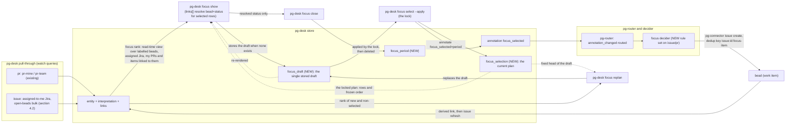

# Daily focus, store-first: phase 15 of the pg-desk/connector program

- **Date**: 2026-09-23 (revised 2026-10-06 against the landed entity change flow; amended 2026-10-08 in two sessions)
- **Status**: Draft, landed on the operator's instruction of 2026-10-07 (review first, then land)
  so that decomposition can start from it. The ranking model, candidate set, epic slot rule and rank
  placement (section 6, D-F11) were ruled by the operator on 2026-10-05, and the minting path
  (D-F12 to D-F16) on 2026-10-06; D-F17 to D-F21 were proposed by the agent from the 2026-10-07
  five-dimension review and CONFIRMED by the operator on 2026-10-07, together with the age-key
  source, the per-source-freshness gap, deferral of the `week`/`sprint` period types, and the landing
  order. A second, independent five-dimension review (completeness, correctness, UX, observability,
  test coverage) ran on 2026-10-07 and its findings are folded into this revision. The three
  questions that review raised were RULED by the operator on 2026-10-08 (section 12 records them
  verbatim): the draft-and-lock plan model (D-F22, which amends D-F5 and D-F18 and adds the `replan`
  verb), the widened open-beads bulk query (section 4.2), and the issue closed listener (section 8
  Routing). That first 2026-10-08 text (D-F22, D-F23, the unified plan and replan layout, the Jira
  status category and the routing correction) was the agent's reading of those rulings and had one
  independent read-only review. **A review session on 2026-10-08 (the second session) then ruled on
  the rest, and section 12 records those rulings verbatim as RV-A to RV-E and as the eight readings R1
  to R8:** the draft is ONE stored row the tool manages, not a caller-held file (RV-A); only the
  CURRENT plan exists, with no history, no event table and no stored struck state, and the first lock
  of a new period replaces the plan (RV-B, which SUPERSEDES D-F17 and the earlier confirmation that an
  item selected on an earlier day keeps its bead); a bead is a candidate when it carries the label
  `pg-focus-planable` (RV-C, which supersedes the bead half of D-F23); items linked to a seed by any
  link are candidates too, one hop (RV-D); and an empty identity list warns and does not fail (RV-E).
  The operator has now reviewed section 12's items across the two sessions of 2026-10-08, but has NOT
  read the document line by line, and the second-session amendments have had no independent review.
- **Bead**: `pg2-2j5ac.27` (this design's own tracking bead; phase 15's decompose-trigger is
  `blocked-by` it)
- **Depends on**: the entity change flow (`docs/superpowers/specs/2026-09-29-entity-change-flow-design.md`,
  ADR 0077) and its cutover release. This document targets the **post-cutover** world: pg-desk's
  `ledger` table, `sync.mode`, `internal/sync`, `pg-desk run` and heartbeat are removed by that
  cutover and MUST NOT be built on. The issue-entity pipeline that an earlier revision treated as an
  unlanded external prerequisite (`pg2-2j5ac.46`, closed) has landed (section 4.1).
- **Amends**: `phillipgreenii-nix-agent-support`'s
  `docs/superpowers/specs/2026-09-09-pg-desk-and-connector-discovery-design.md` (D19, D26, phase
  15's row in its phase table — "designed in its own document", checkpoint "defined by that
  document"; this is that document) and the private machine flake's
  `2026-09-02-daily-focus-v2-design.md` (decides what of v2 survives — answer: `df-attention`/
  `df-search`, untouched; everything else in v2's `df-survey`/`df-deferred`/`df-wire`/`df-pull`/
  `df-resolve-focus`/`df-find-pr-bead`/`df-split-blockers` family retires; the map is section 3's retirement map and the list is section 10). It also asks
  for one amendment to the entity change flow design and ADR 0077 (D-F14).

## 1. Purpose and scope

Phase 15 retires daily-focus's beads-as-primary-store architecture (v2, fully implemented and
live in the private machine flake today) in favor of the store-first pattern the rest of the
pg-desk/connector program already uses: everything surveyed lands uncapped in `pg-desk`'s SQLite
store; focus ranking is a compute-only, read-time view over `entity` rows; a decider mints beads
only where an agent actually needs one; "pulling more work" is selecting more from the store, not a
separate mechanism (D19, D26).

This document is scoped to daily-focus's own retirement (`df-survey`, `df-deferred`, `df-wire`,
`df-verify-wiring`, `df-pull`, `df-resolve-focus`, `df-find-pr-bead`, `df-split-blockers`,
`df-close-focus`, and the three command files that orchestrate them). It does not touch `df-attention`/`df-search`/`df-categorize`/`df-feedback`
(already retired into `pg-desk` in earlier phases per D10, or — for attention/search — deliberately
unrelated per the v2 doc's own §0 cross-reference) or any PR-side pg-desk behavior.

## 2. Decisions ledger

Operator rulings from the 2026-09-23 design session that produced this document, D-F11 from the
2026-10-05 ranking session (which supersedes D-F7), and D-F12 to D-F14 from the 2026-10-06 revision
session that reconciled this document with the landed entity change flow, D-F15 and D-F16 from the
review that followed it, and D-F17 to D-F21, proposed by the agent from the 2026-10-07 five-dimension
review and CONFIRMED by the operator on 2026-10-07, and D-F22 and D-F23, RULED by the operator on 2026-10-08, together with the review-session rulings RV-A to RV-E of the same day (section 12), which amend or supersede D-F3, D-F5, D-F6, D-F8, D-F10 to D-F13, D-F17 to D-F20, D-F22 and D-F23 (each is marked: the agent-proposed rows are recommendations the operator can reverse without unpicking anything else, and the RULED rows record what the operator said). The later
2026-10-07 review refined their mechanics without changing a confirmed decision; each refinement
is in the row or section it touches. D-F7 was made in the
operator's absence (a 10-minute `AskUserQuestion` timeout) on the session's best judgment, per
precedent already set twice earlier in the same session; it is superseded, kept for provenance.

| #     | Decision                                                                                                                                                                                                                                                                                                                                                                                                                                                                                                                                                                                                                                                                                                                                                                                                                                                                                                                                                                                                                                                                                                                                                                                                                                                                                                                                                                                                                                                                                                                                                                                                                                                                                                                                                                                                                                                                                                                                                                                                                                                                                                                                                                                                                                                                                                                                                                                                                                                                                                                                                                                                                                                                                                                                                                                                                                                                                                                                                                                                                                                                                                                                                                                                                                                                                                                                                                                                                                                                                                                                                                                                                                                                                                                                                                                                                                                                                                                                                                                                                                                  |
| ----- | --------------------------------------------------------------------------------------------------------------------------------------------------------------------------------------------------------------------------------------------------------------------------------------------------------------------------------------------------------------------------------------------------------------------------------------------------------------------------------------------------------------------------------------------------------------------------------------------------------------------------------------------------------------------------------------------------------------------------------------------------------------------------------------------------------------------------------------------------------------------------------------------------------------------------------------------------------------------------------------------------------------------------------------------------------------------------------------------------------------------------------------------------------------------------------------------------------------------------------------------------------------------------------------------------------------------------------------------------------------------------------------------------------------------------------------------------------------------------------------------------------------------------------------------------------------------------------------------------------------------------------------------------------------------------------------------------------------------------------------------------------------------------------------------------------------------------------------------------------------------------------------------------------------------------------------------------------------------------------------------------------------------------------------------------------------------------------------------------------------------------------------------------------------------------------------------------------------------------------------------------------------------------------------------------------------------------------------------------------------------------------------------------------------------------------------------------------------------------------------------------------------------------------------------------------------------------------------------------------------------------------------------------------------------------------------------------------------------------------------------------------------------------------------------------------------------------------------------------------------------------------------------------------------------------------------------------------------------------------------------------------------------------------------------------------------------------------------------------------------------------------------------------------------------------------------------------------------------------------------------------------------------------------------------------------------------------------------------------------------------------------------------------------------------------------------------------------------------------------------------------------------------------------------------------------------------------------------------------------------------------------------------------------------------------------------------------------------------------------------------------------------------------------------------------------------------------------------------------------------------------------------------------------------------------------------------------------------------------------------------------------------------------------------------------------- |
| D-F1  | Daily-focus's PR candidate gathering reuses pg-desk's existing `pr-mine`/`pr-team` watch queries unchanged. Issue-type candidates (Jira issues, epics, bd tasks) are persisted by the same pull-through that serves PRs: pg-desk lists each name in `watch.issue.queries` with `pg-connector issue list --fingerprints`, hydrates added or changed entities through `issue show`, and persists them (`docs/behavior/pg-desk/changes.md`; the generic issue-entity pipeline of closed bead `pg2-2j5ac.46`, landed). This document therefore adds NO new gather code; it adds two named queries to `watch.issue.queries` (section 4.2). An earlier revision of this document treated issue-entity gather as an unlanded external prerequisite; that framing is retired.                                                                                                                                                                                                                                                                                                                                                                                                                                                                                                                                                                                                                                                                                                                                                                                                                                                                                                                                                                                                                                                                                                                                                                                                                                                                                                                                                                                                                                                                                                                                                                                                                                                                                                                                                                                                                                                                                                                                                                                                                                                                                                                                                                                                                                                                                                                                                                                                                                                                                                                                                                                                                                                                                                                                                                                                                                                                                                                                                                                                                                                                                                                                                                                                                                                                                     |
| D-F2  | `pg-connector-pr-github`'s `mine` query stays scoped to the single repository the deployment configures (one repo), narrowing daily-focus's PR survey from v2's cross-repo author search. Recorded loss, same pattern as the design of record's D15. The repository itself is deployment configuration and is not named here.                                                                                                                                                                                                                                                                                                                                                                                                                                                                                                                                                                                                                                                                                                                                                                                                                                                                                                                                                                                                                                                                                                                                                                                                                                                                                                                                                                                                                                                                                                                                                                                                                                                                                                                                                                                                                                                                                                                                                                                                                                                                                                                                                                                                                                                                                                                                                                                                                                                                                                                                                                                                                                                                                                                                                                                                                                                                                                                                                                                                                                                                                                                                                                                                                                                                                                                                                                                                                                                                                                                                                                                                                                                                                                                             |
| D-F3  | `df-deferred`'s description-marker-section mechanism retires entirely. "Deferred" is derived: candidates the store already holds that are not rows of the current plan (`focus_selection`). **Amended 2026-10-08 (second session) by RV-B:** the plan is the current plan only. No description grammar, no lost-update hazard, no size cost.                                                                                                                                                                                                                                                                                                                                                                                                                                                                                                                                                                                                                                                                                                                                                                                                                                                                                                                                                                                                                                                                                                                                                                                                                                                                                                                                                                                                                                                                                                                                                                                                                                                                                                                                                                                                                                                                                                                                                                                                                                                                                                                                                                                                                                                                                                                                                                                                                                                                                                                                                                                                                                                                                                                                                                                                                                                                                                                                                                                                                                                                                                                                                                                                                                                                                                                                                                                                                                                                                                                                                                                                                                                                                                              |
| D-F4  | The per-day "focus bead" (one bead with wired blocking deps) retires. "Today's focus" becomes a `pg-desk` view/query (`focus_selection`/`focus_period`, §5), generalizing to week/sprint via a `period_type` column rather than a new bead type per level (not built this phase — schema-ready only). Beads stay reserved for actual agent-workable signals (D8), never for human plan-tracking.                                                                                                                                                                                                                                                                                                                                                                                                                                                                                                                                                                                                                                                                                                                                                                                                                                                                                                                                                                                                                                                                                                                                                                                                                                                                                                                                                                                                                                                                                                                                                                                                                                                                                                                                                                                                                                                                                                                                                                                                                                                                                                                                                                                                                                                                                                                                                                                                                                                                                                                                                                                                                                                                                                                                                                                                                                                                                                                                                                                                                                                                                                                                                                                                                                                                                                                                                                                                                                                                                                                                                                                                                                                          |
| D-F5  | Gate replies and pull selections reference candidates by their own `(entity_type, entity_id)` — the same key already exists for a PR/Jira/bead item — never a derived positional handle. Every FACT shown (title, due date, priority, status) is read live from current `entity`/`interpretation` rows, so a priority or due-date change is never hidden from the operator. **Amended 2026-10-08 by D-F22 for the ORDER only:** the order is computed once per draft and frozen until the operator locks the plan or asks for a `replan`; the old rule that every `show`/`select` recomputes the order is withdrawn. The positional-handle rejection stands (keys remain the only handle). **Amended 2026-10-08 (second session) by RV-A:** the draft that freezes the order is the single stored `focus_draft` row, not a caller-held document.                                                                                                                                                                                                                                                                                                                                                                                                                                                                                                                                                                                                                                                                                                                                                                                                                                                                                                                                                                                                                                                                                                                                                                                                                                                                                                                                                                                                                                                                                                                                                                                                                                                                                                                                                                                                                                                                                                                                                                                                                                                                                                                                                                                                                                                                                                                                                                                                                                                                                                                                                                                                                                                                                                                                                                                                                                                                                                                                                                                                                                                                                                                                                                                                          |
| D-F6  | `focus_selection` and `focus_period` (§5; `focus_run` has a surrogate key too, and `focus_draft` is the single row `id = 1`) use an internal surrogate primary key (`id INTEGER PRIMARY KEY AUTOINCREMENT`) with a `UNIQUE` constraint carrying the natural key, diverging deliberately from every existing pg-desk table, which all use a composite natural-column primary key with no surrogate. `focus_selection` references `focus_period` by its surrogate `id` (a real foreign key, not a repeated `period_type`/`period_key` pair) and references `entity` by its own composite key (`repo, entity_type, entity_id`) — `entity` already is the table that establishes an `(entity_type, entity_id)` pair is valid, so `focus_selection` gets that validation from a real foreign key rather than untyped text columns.                                                                                                                                                                                                                                                                                                                                                                                                                                                                                                                                                                                                                                                                                                                                                                                                                                                                                                                                                                                                                                                                                                                                                                                                                                                                                                                                                                                                                                                                                                                                                                                                                                                                                                                                                                                                                                                                                                                                                                                                                                                                                                                                                                                                                                                                                                                                                                                                                                                                                                                                                                                                                                                                                                                                                                                                                                                                                                                                                                                                                                                                                                                                                                                                                             |
| D-F7  | **SUPERSEDED 2026-10-05 by D-F11 (candidate set and epic slot rule).** Original text, kept for provenance: epic candidacy narrows to "owned by me AND has an open/in_progress child" — the "OR a recently-closed child" half of today's rule is dropped as a recorded loss, because expressing it would need a per-epic follow-up query the static named-query model (§4) cannot do. **Made in the operator's absence.**                                                                                                                                                                                                                                                                                                                                                                                                                                                                                                                                                                                                                                                                                                                                                                                                                                                                                                                                                                                                                                                                                                                                                                                                                                                                                                                                                                                                                                                                                                                                                                                                                                                                                                                                                                                                                                                                                                                                                                                                                                                                                                                                                                                                                                                                                                                                                                                                                                                                                                                                                                                                                                                                                                                                                                                                                                                                                                                                                                                                                                                                                                                                                                                                                                                                                                                                                                                                                                                                                                                                                                                                                                  |
| D-F8  | **DONE** (bead `pg2-t9zzg`, closed). `schema.Issue` gained an `Owner` field (bd's `owner` key — the responsible human), distinct from `Assignee`, which carries bd's claim/actor identity, not ownership; and pg-desk's issue ownership classifier reads it through the configured self-owner identity. "Assigned or owned by the operator" (D-F11) therefore reused `interpretation.ownership` for issues. **Amended 2026-10-08 by D-F23, and again (second session) by RV-C:** focus candidacy for Jira reads the assignee against an identity list and for beads reads the label `pg-focus-planable`, never the owner, so the `Owner` field stays on the schema but the focus design no longer uses it.                                                                                                                                                                                                                                                                                                                                                                                                                                                                                                                                                                                                                                                                                                                                                                                                                                                                                                                                                                                                                                                                                                                                                                                                                                                                                                                                                                                                                                                                                                                                                                                                                                                                                                                                                                                                                                                                                                                                                                                                                                                                                                                                                                                                                                                                                                                                                                                                                                                                                                                                                                                                                                                                                                                                                                                                                                                                                                                                                                                                                                                                                                                                                                                                                                                                                                                                                |
| D-F9  | There is no separate `focus split` verb. `pg-desk focus show` resolves each already-selected row's associated bead and current status unconditionally, folded into its existing per-item output, from the entity's view: the linked work item appears in the view's `links[]` with its state, labels, metadata and assignee. The link exists because the minted bead's own metadata names the source entity (D-F13), which the generic source-entity extractor recognizes; no tracker call is made at `show` time. The watch queries MUST cover the minted beads (a watched bead is one some `watch.issue.queries` name lists; section 4.2), with one nuance recorded in section 4.2: a CLOSED focus bead leaves the open-beads query and reaches `links[]` only through the change flow's removal-confirmation read. `close.md`'s survey step becomes a `focus show` call, not a dedicated verb.                                                                                                                                                                                                                                                                                                                                                                                                                                                                                                                                                                                                                                                                                                                                                                                                                                                                                                                                                                                                                                                                                                                                                                                                                                                                                                                                                                                                                                                                                                                                                                                                                                                                                                                                                                                                                                                                                                                                                                                                                                                                                                                                                                                                                                                                                                                                                                                                                                                                                                                                                                                                                                                                                                                                                                                                                                                                                                                                                                                                                                                                                                                                                         |
| D-F10 | `focus close`'s per-bead progress note is appended by `close.md` itself via `pg-connector issue comment` (→ `bd comment`), not by pg-desk and not via today's `bd update --append-notes` (→ bd's separate NOTES field), followed by `pg-desk issue refresh <bead>` so the store sees the write (change-flow S10: external writes go straight through pg-connector by the actor, then refresh). pg-desk MUST NOT execute tracker write verbs (G5). Comments are the better mechanism for this content: bd captures `created_at`/`author` on each comment natively, where NOTES is one unstructured, unbounded-growth text field the caller must manually date-tag (exactly what `df-close-focus.sh`'s `[daily-focus <date>] <progress>` prefix exists to work around). The `[daily-focus <date>]` tag's PURPOSE splits in two — recording that a bead was part of a day's focus (now redundant; `focus_selection` already durably and queryably records this) vs. carrying forward what actually happened for whoever reads the bead next (not redundant; pg-desk's store holds no narrative text). Only the first purpose retires. **Amended 2026-10-08 (second session) by RV-B:** `focus_selection` now records only the CURRENT plan and no history, so the first purpose retires only for the current plan; which items were in a past day's plan is recoverable only from the per-bead comments `close.md` writes at close.                                                                                                                                                                                                                                                                                                                                                                                                                                                                                                                                                                                                                                                                                                                                                                                                                                                                                                                                                                                                                                                                                                                                                                                                                                                                                                                                                                                                                                                                                                                                                                                                                                                                                                                                                                                                                                                                                                                                                                                                                                                                                                                                                                                                                                                                                                                                                                                                                                                                                                                                                                                                                          |
| D-F11 | **Ranking model, ruled by the operator 2026-10-05** (focused ranking session; supersedes D-F7 and the v2 ranking ported unchanged). Candidate set: everything non-done that is a seed or is linked to one (authored or review-requested PRs, Jira issues assigned to the operator, beads labelled `pg-focus-planable`, and any `issue` or `pr` entity joined to a seed by a pg-desk link, one hop; amended 2026-10-08 by D-F23, then (second session) by RV-C and RV-D: the owner field is not used, bead candidacy is a label, links enlarge the set), with no started/ownership filter that hides an item. Slot rule: an epic and its children never use more than one slot; a child takes the slot and the epic is listed only when it is incomplete with no open child. Started (seeds only): bead in_progress, Jira In Progress category, any open SEED PR. Rank: strict lexicographic tiers, no weights: overdue first (started first, then most overdue), then started, then not started; inside the started and not-started tiers the keys are a due date inside the 7-day horizon, then unblocks, then priority, then age. Placement: the rank is a read-time pure computation inside pg-desk, computed when a draft is made (D-F22) and stored only as the single draft (RV-A), never as a standing candidate list; a router-triggered idempotent decider only mints beads for the selected items (this replaces the provisional 2026-10-02 answer that a decider computes the rank). The head-to-head evidence is in section 6.                                                                                                                                                                                                                                                                                                                                                                                                                                                                                                                                                                                                                                                                                                                                                                                                                                                                                                                                                                                                                                                                                                                                                                                                                                                                                                                                                                                                                                                                                                                                                                                                                                                                                                                                                                                                                                                                                                                                                                                                                                                                                                                                                                                                                                                                                                                                                                                                                                                                                                                |
| D-F12 | **Selection reaches the minting decider as an annotation (operator, 2026-10-06).** `focus select` and `focus pull` write the `focus_selection` row AND an annotation `focus_selected=<period_key>` on each selected entity (`pg-desk <type> annotate`, origin `pg-desk`). The annotation emits `annotation_changed`, which every decider already subscribes to, so no new change source and no change to the change-flow change-kind catalogue is needed. The table is the current plan and the foreign-key-guarded record (it keeps no history, RV-B); the annotation is the single carrier the decider reads. A strike deletes the row and sets the annotation to `none` once no row of the entity remains (section 5).                                                                                                                                                                                                                                                                                                                                                                                                                                                                                                                                                                                                                                                                                                                                                                                                                                                                                                                                                                                                                                                                                                                                                                                                                                                                                                                                                                                                                                                                                                                                                                                                                                                                                                                                                                                                                                                                                                                                                                                                                                                                                                                                                                                                                                                                                                                                                                                                                                                                                                                                                                                                                                                                                                                                                                                                                                                                                                                                                                                                                                                                                                                                                                                                                                                                                                                                 |
| D-F13 | **A focus bead is one bead per source entity (operator, 2026-10-06).** The decider's work-item kind is `focus-item`, with dedup key `<entity_type>:<entity_id>:focus-item` and NO per-day suffix, consistent with D-F4 (no per-day bead). The change-flow same-context rule applies, with the context being the source entity: a closed focus bead is never recreated, a bead the decider held on a strike is released on a reselect, and a bead a worker closed is left closed (section 8); a second bead is never minted. The bead's metadata carries neutral `source_type` and `source_id` fields naming the source entity, which a NEW generic source-entity metadata extractor turns into a link of a distinct, neutral relation (`source`) (change-flow S25: "derived whenever an entity's own data names the other"). The extractor carries no focus vocabulary, so it passes the G5 guard, and it MUST NOT reuse the `repo`+`pr_number` fields: the existing issue extractor reads only those and `parent`, and a reused `repo`+`pr_number` would yield a `work` link that the PR decider treats as that PR's own work item. A strike, or any other way a row leaves the plan (RV-B), holds the bead (an indefinite defer), and a reselect (the annotation becomes a real period key again, by `ok`, `+key`, `pull` or a new-period lock) releases it (section 8). An epic needs no bead; its entity id already is a bead id.                                                                                                                                                                                                                                                                                                                                                                                                                                                                                                                                                                                                                                                                                                                                                                                                                                                                                                                                                                                                                                                                                                                                                                                                                                                                                                                                                                                                                                                                                                                                                                                                                                                                                                                                                                                                                                                                                                                                                                                                                                                                                                                                                                                                                                                                                                                                                                                                                                                                                                                                                                                                                     |
| D-F14 | **Amend the change-flow design and ADR 0077 (operator, 2026-10-06).** The change-flow design's decoration-versus-decision classification (section 2; its closing sentence reads "Cross-entity judgment that chooses an outcome (for example daily-focus ranking) is a decision, not a decoration"), together with S2 and G5, puts daily-focus ranking in a decider. The 2026-10-05 ruling (D-F11) places the rank in pg-desk as a read-time view. The amendment records: a rank that is a read-only, side-effect-free view over stored facts — it writes nothing and mints no work — MAY live in pg-desk; only MINTING work from a selection is a decision, and it lives in the decider (D-F12, D-F13). Without it, a change-flow conformance review would reject `internal/focus` in pg-desk. Recorded as ADR 0087, which extends ADR 0081's read-time rule (attention) to this rank, with a pointer in ADR 0077 and in the change-flow design's section 2; all three land in the same commit series as this document.                                                                                                                                                                                                                                                                                                                                                                                                                                                                                                                                                                                                                                                                                                                                                                                                                                                                                                                                                                                                                                                                                                                                                                                                                                                                                                                                                                                                                                                                                                                                                                                                                                                                                                                                                                                                                                                                                                                                                                                                                                                                                                                                                                                                                                                                                                                                                                                                                                                                                                                                                                                                                                                                                                                                                                                                                                                                                                                                                                                                                                   |
| D-F15 | **The selection is a reserved view member (operator, 2026-10-06, later in the review session).** The `focus_selected` annotation is surfaced to deciders as a dedicated `annotations.focus_selected` member of `show`'s composite view (and of pg-decider's view reader), beside `ready_to_land`; the decider namespace, documented as written by deciders, is not reused, and no generic other-keys map is added.                                                                                                                                                                                                                                                                                                                                                                                                                                                                                                                                                                                                                                                                                                                                                                                                                                                                                                                                                                                                                                                                                                                                                                                                                                                                                                                                                                                                                                                                                                                                                                                                                                                                                                                                                                                                                                                                                                                                                                                                                                                                                                                                                                                                                                                                                                                                                                                                                                                                                                                                                                                                                                                                                                                                                                                                                                                                                                                                                                                                                                                                                                                                                                                                                                                                                                                                                                                                                                                                                                                                                                                                                                        |
| D-F16 | **A strike takes the focus bead out of play (operator, 2026-10-06; mechanism revised by the operator on 2026-10-07 to avoid bead churn).** The 2026-10-06 ruling was that a strike must not leave a bead that a worker can still claim for an item taken out of focus, and that a reselect brings the item back. The 2026-10-07 revision fixes the mechanism: a bead that is part of the plan is undeferred and in play; a bead whose item has left the plan is given an INDEFINITE defer; a reselect undefers it. Nothing is closed or reopened, and every tool that looks for a focus bead MUST look at deferred ones too, so a held bead is never recreated (D-F19). A source that is hidden or suppressed freezes its bead as it was (section 8), the one exception to "a strike takes the bead out of play".                                                                                                                                                                                                                                                                                                                                                                                                                                                                                                                                                                                                                                                                                                                                                                                                                                                                                                                                                                                                                                                                                                                                                                                                                                                                                                                                                                                                                                                                                                                                                                                                                                                                                                                                                                                                                                                                                                                                                                                                                                                                                                                                                                                                                                                                                                                                                                                                                                                                                                                                                                                                                                                                                                                                                                                                                                                                                                                                                                                                                                                                                                                                                                                                                                         |
| D-F17 | **SUPERSEDED 2026-10-08 (second session) by RV-B; it was never an operator requirement.** It was proposed by the agent from the 2026-10-07 five-dimension review and CONFIRMED on 2026-10-07 with "this is good" against a summary. When the operator asked whether there was a requirement behind the event history, there was none, and the operator ruled that only the CURRENT plan exists. Kept for provenance, condensed: `focus_selection` rows were never deleted (a strike set a stored `struck` state with `struck_at` and `struck_reason`), each row recorded `source`, `rank_position`, `tier` and `cap`, and the flip-by-flip history of one item was an append-only `focus_selection_event` table. **What stands from it:** `rank_position` and `tier` stay on the row as the frozen plan (D-F22), and the read-only verb `pg-desk focus explain <key>` (section 7.5) stays, answering "why is this ranked, in the plan, minted or held" from the live rows the way `attention explain` does for ADR 0081's view; it has no flip history. **What goes:** `status`, `struck_at`, `struck_reason`, `source` and `cap` on `focus_selection`, the `focus_selection_event` table, the `struck`, `finished today` and `carried over` blocks of `show`, and the `absorbed` events. A strike now DELETES the row (D-F18, section 5).                                                                                                                                                                                                                                                                                                                                                                                                                                                                                                                                                                                                                                                                                                                                                                                                                                                                                                                                                                                                                                                                                                                                                                                                                                                                                                                                                                                                                                                                                                                                                                                                                                                                                                                                                                                                                                                                                                                                                                                                                                                                                                                                                                                                                                                                                                                                                                                                                                                                                                                                                                                                                                                                                                                |
| D-F18 | **CONFIRMED (operator, 2026-10-07; proposed by the agent), amended 2026-10-08 by D-F22 and again (second session) by RV-B: what removes a row from the plan.** A row leaves the plan only for a reason the operator can see in the lock preview: an explicit `-key` (a strike), an explicit `cap=N` lower than the persisted cap, a non-terminal loss of candidacy (the entity became hidden or inactive without a terminal state; cause `dropped`), or the first lock of a new period replacing the plan (below). Each DELETES the row; nothing is kept, and the cause is counted only in the run record. RANK DRIFT NEVER REMOVES a row (D-F22), so a bare `ok` can no longer hold a bead because a new overdue item outranked it, and an item whose source finished (a merged or closed PR, a done issue) stays in the plan, shown `finished`, never removed; the decider's terminal-source hold (section 8) already holds its bead (sections 7.1 and 7.2). Reassignment removes no row for any type: this is the AUTHOR'S inference, forced by dropping `source` (the old reassigned rule depended on it), and NOT an operator ruling. Its consequence is that a Jira issue reassigned away stays in the plan, and its bead in play, until the next new-period lock or a `-key`; a hand-add outside every watch query can go inactive through the age sweep and is then `dropped` at the next lock (the CHANGES block shows it). Rows added by `pull`, by a force-pull (`+key` of an existing candidate) or by a hand-add are ordinary rows and persist across later `select` runs unless explicitly struck, so an ordinary re-run of `create` cannot silently hold added work. The cap in force is persisted on the period, so a re-run without `cap=` keeps it. Because a removal takes a bead out of play, `select` MUST show every removal and its cause BEFORE it applies (a `--dry-run` preview, which `create.md` runs first, section 7.2). The annotation holds the MOST RECENT period key in which the item has a row, defined as the maximum `period_key` over the item's rows in every period (else `none`), computed from the committed table and written right after it (step 5 of section 7.2 gives the order); it never means "selected today" (that is read from the table). A `-key` deletes the entity's rows in every period and writes `none`. **New period (RV-B; rule revised the same day after review):** a lock is a FIRST LOCK when the period has no `focus_selection` row, tested inside the lock transaction (an existing `focus_period` row does not matter). A first lock replaces the plan only when ALL hold: the final set is non-empty; the period key is greater than every other period's key that holds rows; and the key is not later than today in `focus.time_zone`. It then makes that period's plan THE plan, deleting in the same transaction every `focus_selection` row of every other period, so an old-plan item that is not in the new plan gets the annotation `none` and the decider holds its minted bead. A first lock for an earlier period, or for a future date, is exit `1`, and an EMPTY first lock (an empty set of insertions) replaces nothing but still applies `-key` deletions, writes its `focus_run` row (outcome `empty`) and consumes the applicable draft. A day rolling over alone holds nothing (no lock yet), and a `pull` never replaces a plan (a `pull` into a period with no rows while another period holds rows is exit `1`, so two live plans can never exist). This SUPERSEDES the 2026-10-07 confirmation that an item selected on an earlier day and not struck keeps its bead and annotation (operator, 2026-10-08: "we have already established that it would be deferred if not currently in the plan"). Original 2026-10-07 text, superseded, kept for provenance: a strike kept the row with a stored `struck` state and a `struck_reason` of `operator`, `cap` or `dropped`, and a reassignment counted as `dropped` for rows that had entered as candidates. |
| D-F19 | **CONFIRMED (operator, 2026-10-07; mechanism per the operator's direction, details proposed by the agent): hold and release mechanics.** A focus bead is in play (open or claimed) or held. HELD means all three of: status `deferred`, metadata `focus_hold=struck`, and an empty assignee. (An earlier draft added "with no end date"; the decider's view carries no deferral date, so that condition cannot be observed and is dropped. The hold itself sets no end date, so a bead the rule held is indefinitely deferred.) A strike of an open, unclaimed bead with no open children (a strike here is the item leaving the plan by any cause: `-key`, a lower `cap=`, `dropped` or a new-period lock, which the decider sees only as the annotation `none`; RV-B) is ONE `update` setting status `deferred` and `focus_hold=struck`; a reselect of a held bead (the annotation becomes a real period key again, by `ok`, `+key`, `pull` or a new-period lock) is ONE `update` setting status `open`, clearing the deferral, and `focus_hold=released` (the connector's metadata merges and has no unset). Both are `update` actions, to which the action layer adds `Status` and `ClearDefer` fields (the connector already accepts both; an earlier draft also added `ClearAssignee`, which no path uses, so it is dropped); the decider never emits `close` or `reopen` for a focus bead. A claimed bead is never deferred, a bead deferred without the marker is someone else's and is left alone, and the marker alone never triggers a release, so a live claim is never wiped. Every hold and release re-reads the bead live first, because the decider's view is the stored snapshot. Spiked against real `bd` 1.2.2 on 2026-10-07: `--status deferred` with no date hides the bead from `bd ready` and keeps it in `bd list`; defer plus metadata, and undefer plus clear, each work in one call; a deferred claimed bead keeps its assignee. Nothing in the rule depends on who closed an item, so change-flow S26 holds, but the behavior docs word the decider's reading of a work item more narrowly ("open or closed" only) and need amending (section 12 item (h)). Consequences for other tools (section 8): a narrow watch query for held beads, a dedup query that lists focus beads, `/pb:unstick-beads` excluding the `focus-item` label, and a periodic re-evaluation binding.                                                                                                                                                                                                                                                                                                                                                                                                                                                                                                                                                                                                                                                                                                                                                                                                                                                                                                                                                                                                                                                                                                                                                                                                                                                                                                                                                                                                                                                                                                                                                                                                                                                  |
| D-F20 | **CONFIRMED (operator, 2026-10-07; proposed by the agent): the operator-facing verb contract.** `focus select` gains `--dry-run`, and every echoed row names its downstream bead consequence in a closed vocabulary (section 7.2 step 7). `focus show` prints a coverage header and a closed-vocabulary bead column, and every verb has `--json` for the LLM command prose that consumes it (section 7.1; the contract string is `pg-desk.focus/v1`, carried in a `contract` member as `show.md`'s own contract is, with no separate `schemaVersion`). Exit codes follow pg-desk's scheme: `1` usage or an old-schema store, `2` partial, `3` total failure, `6` period closed (`4`, `5` and `7` are unused by focus: `4` is `head-check`'s, `5` the retired `df-pull` code, `7` removed by RV-A; section 7). **Amended 2026-10-08 by D-F22:** `--expect` is withdrawn, and there is a sixth verb, `replan` (section 7.6). **Amended 2026-10-08 (second session) by RV-A:** with the draft stored by the tool there is no draft `base` to guard, so exit `7`, which D-F22 briefly gave to a plan that changed since the draft was made, is removed and left unused.                                                                                                                                                                                                                                                                                                                                                                                                                                                                                                                                                                                                                                                                                                                                                                                                                                                                                                                                                                                                                                                                                                                                                                                                                                                                                                                                                                                                                                                                                                                                                                                                                                                                                                                                                                                                                                                                                                                                                                                                                                                                                                                                                                                                                                                                                                                                                                                                                                                                                                                                                                                                                                                                                                                                                                                                                                                                                       |
| D-F21 | **CONFIRMED (operator, 2026-10-07; proposed by the agent): observability is part of the design.** Every new component declares what it emits and logs (the telemetry-declaration convention of `docs/behavior/pg-desk/README.md`): section 8.2 specifies the verbs' durable run record and structured stderr line, the `/metrics` families computed from the store at scrape time and their alert rules, a `doctor` focus block, the decider's rule id and counters, and a rank-regression parity check.                                                                                                                                                                                                                                                                                                                                                                                                                                                                                                                                                                                                                                                                                                                                                                                                                                                                                                                                                                                                                                                                                                                                                                                                                                                                                                                                                                                                                                                                                                                                                                                                                                                                                                                                                                                                                                                                                                                                                                                                                                                                                                                                                                                                                                                                                                                                                                                                                                                                                                                                                                                                                                                                                                                                                                                                                                                                                                                                                                                                                                                                                                                                                                                                                                                                                                                                                                                                                                                                                                                                                  |
| D-F22 | **RULED (operator, 2026-10-08): the plan is drafted, locked and re-planned, and the order is computed once per draft. Amended 2026-10-08 (second session) by RV-A: the draft is ONE stored row managed by the tool.** The operator's words, verbatim: "as i'm making a plan, the computation for the initial order should happen only once until i lock the plan in or i ask for a recalcuation"; and on the mechanics, "1A, 2A, 3A, 4 i don't think we want a recalc, i think what i want is to \"replan\" which would pull new items into the plan. this means that it would reorder things, but the previous plan remains as is. ie, the new items and nonselected items would be ordered correctly, but stay out of the selection. we are a draft phase again until we approve and go back to the actual plan which is using the asme freeze rules as before. 5 the draft only lives until the plan is created. it needs not persistence." (Its fork 5, "it needs not persistence", was OVERRULED in the review session by "does the draft need to be a file the caller owns? can't it be managed by the tool? we don't need multiple drafts."; what stands of fork 5 is "the draft only lives until the plan is created".) The model, in design-pattern terms: a draft is a Memento that the TOOL stores, singular, in `focus_draft` (section 5), and it ends at lock. (1) A **draft** is the order, tiers and cap line computed once, plus a `made_at`, the `+` proposal flags, the `finished` and `new` marks, the epics block and the coverage state it was computed under. It has one table with one row; a lock deletes it, a `replan` replaces it, and the caller holds no file (section 7). (2) **Lock** is `select --apply`. A locked plan freezes the ORDER, TIER and CAP LINE of its rows (their recorded `rank_position`, `tier` and the period's `cap`); title, due date, priority and status stay live, and drift shows as a notice, not a re-sort (fork 1A). (3) **`replan`** (a verb, section 7.6) opens a draft again over a locked plan: the plan rows stay exactly as they are, every other candidate, new ones included, is ordered afresh and proposed for nothing, and nothing joins the plan until the reply names it (`+key`) and the operator locks. (4) Candidates that arrive while a draft is stored are not in it and show as `new since draft` (fork 2A); a draft row whose source finishes stays visible, marked `finished`, and is not removed at lock (fork 3A); a finished item is shown in the plan, is never removed, and is NOT counted toward the cap (operator, 2026-10-08, "finished is not struct and can be shown in the plan, but it shouldn't be counted towards the cap"). (5) Rank drift alone never removes anything (amends D-F18). (6) `--expect`, the draft `base` and `digest`, the `--draft` and `--save-draft` flags and exit `7` are all gone (section 7). A `select` with no stored draft computes one inside its own process and applies it in the same run, so the order is computed once there too (it prints a warning and records `fresh_order`). A `pull` leaves the stored draft in place.                                                                                                                                                                                                                                                                                                                                                                                                                                                                                                                                                                                                                                                                                                                                                                                                                                                                                              |
| D-F23 | **RULED (operator, 2026-10-08); the BEAD half SUPERSEDED the same day (second session) by RV-C, the Jira half stands.** A Jira issue is a focus candidate when it is ASSIGNED to the operator (the assignee matched against a LIST of operator identities, `focus.operator_identities`, among the entities the assigned-to-me query gathered; the list serves Jira only now: the Jira connector's assignee is the display name, else the email, section 6); an empty list is a NOTICE, not a failure (RV-E). PR candidacy is unchanged (authorship, `mine` or `co-owned`, or a review request). Candidacy is for ENTRY only, for every type (RV-B). **Superseded bead half, kept for provenance:** the operator, verbatim, "for beads, the assigned is the one i was thinking about."; context: D-F8 built the bd `owner` field and D-F11 said "assigned or owned"; in this tracker 232 of 233 open beads are owned by the operator and none is assigned to the operator (bd's assignee is a claim marker, set to a session actor id only while a session works the bead), so ownership admitted almost every open bead, agent work included, and the assignee rule needed an exception in the claim rules (item (s), withdrawn). The operator's next ruling replaced it: a bead is a candidate when it carries the label `pg-focus-planable` ("yes, label, something more specific, so pg-focus-planable."), and an entity linked to a seed is a candidate too (RV-C, RV-D; sections 6 and 12).                                                                                                                                                                                                                                                                                                                                                                                                                                                                                                                                                                                                                                                                                                                                                                                                                                                                                                                                                                                                                                                                                                                                                                                                                                                                                                                                                                                                                                                                                                                                                                                                                                                                                                                                                                                                                                                                                                                                                                                                                                                                                                                                                                                                                                                                                                                                                                                                                                                                                                                                                          |

## 3. Architecture overview



### Retirement map

| Component                   | Fate                                 | Replaced by                                                                                                         |
| --------------------------- | ------------------------------------ | ------------------------------------------------------------------------------------------------------------------- |
| `df-survey` (shallow)       | Retires                              | Live read of `entity`/`interpretation` rows (§6)                                                                    |
| `df-survey` (gate-apply)    | Retires                              | `pg-desk focus select --apply` (§7.2)                                                                               |
| `df-survey` (deep)          | Retires                              | Not needed — `focus show`/`select` read every fact live (the order freezes per draft, D-F22), no separate deep pass |
| `df-deferred`               | Retires                              | `focus_selection` absence = deferred (D-F3)                                                                         |
| `df-wire`                   | Retires (logic moves into a decider) | The focus decider's `focus-item` rule (§8, D-F12, D-F13)                                                            |
| `df-pull`                   | Retires                              | `pg-desk focus pull` (§7.3)                                                                                         |
| `df-resolve-focus`          | Retires                              | `pg-desk focus show`/existence check via `period_key`                                                               |
| `df-find-pr-bead`           | Retires                              | The entity's `links[]` plus the decider's dedup-key lookup (change-flow work-item)                                  |
| `df-split-blockers`         | Retires                              | `pg-desk focus show`'s resolved bead+status for selected rows (§7.1, D-F9)                                          |
| `df-verify-wiring`          | Retires                              | Not needed — nothing is wired (§8)                                                                                  |
| `df-close-focus`            | Retires                              | `pg-desk focus close` (§7.4) plus `close.md`'s own per-bead comments (D-F10)                                        |
| `df-attention`, `df-search` | Unchanged                            | n/a — unrelated (pure `pg-connector` clients already)                                                               |

## 4. Gather

### 4.1 Issue entities are already gathered (landed prerequisite, `pg2-2j5ac.46`)

An earlier revision of this document found, by reading the code, that pg-desk gathered only PRs, and
therefore scoped issue-entity gather out to an external prerequisite design session,
`pg2-2j5ac.46`. That session has closed and its design has landed (the generic entity pipeline
design, `docs/superpowers/specs/2026-09-23-pg-desk-generic-entity-pipeline-design.md`): gather,
interpret and persist take an entity-type registry covering `pr` and `issue`, issue ownership is
classified against a configured self-owner identity, and the entity change flow's pull-through
(`pg-desk <type> changes`) is the single path that discovers, hydrates and persists watched
entities of every type (`docs/behavior/pg-desk/changes.md`). This document therefore builds on that
pipeline and specifies no gather code of its own.

Two cautions carry over:

- The old `pg-desk run`/`sync` paths are removed by the change-flow cutover release but still
  present in code until it ships. This document targets the post-cutover world and MUST NOT call
  or extend them.
- Persisted entities are never deleted; a closed or unwatched entity stays as an inactive row.
  Every candidate query in section 6 MUST therefore filter on `entity.active`.

### 4.2 Watch queries

pg-router already runs one `desk-<type>-changes` query per watched type (change-flow S22); what a
type watches is pg-desk configuration: `watch.issue.queries` is a list of named `pg-connector issue
list` queries, each listed with `--fingerprints` and hydrated when added or changed. Daily-focus
adds no pg-router feed and no feed schedule of its own (the focus decider role binds the per-type
`<type>.changed` event the change flow already emits, section 8 Routing). The deployment's
`watch.issue.queries` MUST include two named queries (the names here are illustrative; the real
names are deployment configuration), and the narrow held-bead query below is a third entry:

- **An assigned-to-me Jira query**: Jira issues assigned to the operator (today's `issue-jira-mine`
  query). It GATHERS them; candidacy is decided at rank time by matching the stored assignee against
  the operator identity list (section 6, D-F23), so the rank is a pure function of stored rows and
  does not read which query listed an entity.
- **An open-beads bulk query**: every `open`, `in_progress` or `blocked` bead, with no type filter
  (`blocked` added by the operator's ruling of 2026-10-08, "B", so a `blocked` child still counts as
  an open child of its epic and the epic keeps one slot, section 6). Its purpose is landing every bead
  with its `labels`, its `parent` field and its links, and every epic itself, in the store, so the
  focus-rank step (§6) can answer "does this bead carry the label `pg-focus-planable`", "is it linked
  to a seed" and "does this epic have an open child" with a pure in-store join, no per-bead and no
  per-epic query. The candidate set is the labelled subset plus the linked items (RV-C, RV-D), and a
  narrower label query would be redundant, because the slot rule and link resolution need every open
  bead anyway. (An earlier revision matched `--assignee`; the assignee rule for beads is superseded.)
  It is the same "one bulk bead query, deduped by id" trick `df-survey` uses today, running
  continuously.

PR candidate gathering (`pr-mine`/`pr-team`) needs no change — D-F1. Volume is bounded by the
mechanism rather than guessed at: a poll diffs list fingerprints and hydrates only added or changed
entities, capped by `hydration.max_per_poll` (default 50), with the age sweep re-hydrating the rest
in rolling batches (`docs/behavior/pg-desk/changes.md`; change-flow 8.4, 8.5). `doctor` reports
when the sweep falls behind.

**Beads minted by the focus decider MUST be covered by a watch query** (the open-beads bulk query
does), because the entity's link to its minted bead is resolved from that bead's own entity row
(D-F9, D-F13). **A held focus bead is deferred, not closed (D-F16, D-F19), and an
open-beads query that lists only `open`, `in_progress` and `blocked` beads would drop it**: the source entity's
link to its bead would vanish and the decider would see "no bead" and mint a second one. The
open-beads bulk query is widened to `blocked` and NOT to `deferred`, because widening it to `deferred` would pull in
every parked and gated bead of the workspace and change the slot rule; a NARROW watch query for held
focus beads (`--label focus-item --status deferred`) is added beside it, and the decider's dedup
lookup needs its own query that lists focus beads in every non-closed status (section 8). Both are
deployment changes. A focus bead that a worker finishes closes and leaves the query, so its entity row is no
longer refreshed by a poll; its final state reaches the source entity's `links[]` through the
removal-confirmation read described in `docs/behavior/pg-desk/changes.md`, and the decider's own
`pg-desk issue refresh <bead>` after a create, hold or release (section 8) keeps it current without
waiting for that read. A bead that was minted and closed by a worker between two polls was never in
a persisted listing, so no removal-confirmation read happens for it; its link stays `open` until the
remote age sweep (`sweep.max_age`) re-hydrates the bead, and that is the bound on this staleness. The
decider acts on link state only to hold or release a bead, and treats a link it cannot confirm as "no
change", so stale evidence never makes it write.

**Coverage and freshness are persisted, because `show` is store-only.** `focus show` reads no
tracker, so "a category failed or was truncated" cannot be discovered at read time. The pull-through
therefore persists, per watched query, the last listing status (`ok`, `degraded` or `failed`, with its
reason) in `meta` beside the change flow's `change_flow.watchset.*` counters, and `focus show` reads
it (section 7.1's coverage header). That persistence is NEW behavior the change flow does not have
today (it persists only the watch-set and hydration counters; the per-query status exists only in the
pull-through's own per-call result), so it is an amendment item for `changes.md`, `store-schema.md`
and the change-flow design (section 12 item (m)): the key is `change_flow.listing.<type>.<query>`,
holding the status, the reason and the time. The per-source freshness recorder of today (`pg-desk heartbeat`
writing `meta.source_fetch.*`, read by `pg-desk freshness`) is removed by the change-flow cutover and
the change-flow design does not say what replaces it. That is a cross-document gap this design does
not close (section 12): until it is closed, the focus staleness signals are each entity's
`hydrated_at` and the persisted listing status.

## 5. Store schema

New tables, alongside pg-desk's `entity`/`interpretation`/`xref`/`annotation` (the change flow's v2
schema adds `version`, `hydrated_at`, `active` and `list_fp` to `entity`, and drops `ledger`; none of
that touches the foreign-key target below, because `entity`'s primary key `(repo, entity_type,
entity_id)` is unchanged):

```sql
CREATE TABLE focus_period (
    id            INTEGER PRIMARY KEY AUTOINCREMENT,
    period_type   TEXT NOT NULL,      -- 'day' this phase; schema allows 'week'/'sprint' later
    period_key    TEXT NOT NULL,      -- e.g. '2026-09-23' for period_type='day'; parsed and
                                       -- re-formatted on write, so '2026-9-3' cannot make a
                                       -- second period
    cap           INTEGER,            -- the cap in force for the period (a re-run without
                                       -- `cap=` reuses it); NULL until a run sets one
    closed_at     TEXT,
    close_note    TEXT,
    UNIQUE (period_type, period_key),
    CHECK (period_type IN ('day', 'week', 'sprint'))
);

-- The current plan, and nothing else (RV-B): every row is selected, none is ever kept after it
-- leaves the plan, and there is no history table.
CREATE TABLE focus_selection (
    id              INTEGER PRIMARY KEY AUTOINCREMENT,
    focus_period_id INTEGER NOT NULL,
    repo            TEXT NOT NULL,    -- same repo constant pg-desk already uses for every
                                       -- entity it gathers (§8's "single configured repo" in
                                       -- the parent design), not a per-issue attribute
    entity_type     TEXT NOT NULL,    -- 'pr' | 'issue' (Jira or bd; told apart by the bead-id
                                       -- pattern, section 8.1)
    entity_id       TEXT NOT NULL,
    selected_at     TEXT NOT NULL,
    rank_position   INTEGER NOT NULL, -- the row's place in the frozen plan: a per-period lock
                                       -- sequence (section 7.2 step 5), the draft position
                                       -- only for the first lock (D-F22)
    tier            TEXT,             -- 'overdue' | 'started' | 'not_started' as of that draft;
                                       -- NULL for a hand-add
    UNIQUE (focus_period_id, repo, entity_type, entity_id),
    CHECK (tier IS NULL OR tier IN ('overdue', 'started', 'not_started')),
    FOREIGN KEY (focus_period_id) REFERENCES focus_period (id),
    FOREIGN KEY (repo, entity_type, entity_id) REFERENCES entity (repo, entity_type, entity_id)
);

-- The ONE stored draft (RV-A, D-F22): at most one row, managed by pg-desk, never held by the caller.
-- It ends at lock (select --apply deletes it in the same transaction as the plan write), and
-- replan replaces it. The period need not have a focus_period row yet, so it is not a foreign key.
CREATE TABLE focus_draft (
    id          INTEGER PRIMARY KEY CHECK (id = 1),
    period_type TEXT NOT NULL,
    period_key  TEXT NOT NULL,        -- the period the draft was made for; it applies only to a command that addresses it (section 7)
    cap         INTEGER NOT NULL,     -- the cap line the draft was made with
    made_at     TEXT NOT NULL,
    body_json   TEXT NOT NULL,        -- a `contract` member (pg-desk.focus.draft/v1; missing or unknown = corrupt), the ordered candidate rows (key, tier, deciding key, the
                                       -- '+' proposal flags, the finished and new marks, via), the
                                       -- trailing epics block, and the coverage state the draft was
                                       -- computed under; NO plan rows and NO facts (both read live)
    CHECK (period_type IN ('day', 'week', 'sprint'))
);

-- One row per non-dry-run verb run (select, pull, close, select --repair), the durable copy of
-- the structured stderr line of section 8.2. It is run telemetry, not plan history. A total failure
-- that commits nothing else still leaves this row when the store is writable.
CREATE TABLE focus_run (
    id          INTEGER PRIMARY KEY AUTOINCREMENT,
    run_id      TEXT NOT NULL UNIQUE,   -- a ULID, printed by the verb and carried in --json
    verb        TEXT NOT NULL,          -- 'select' | 'pull' | 'close' | 'repair'
    focus_period_id INTEGER,
    started_at  TEXT NOT NULL,
    actor       TEXT NOT NULL,
    exit_code   INTEGER,                -- NULL until the run is finalised (section 7.2 step 5); a
                                         -- NULL left by a crash counts as outcome `total`
    counts_json TEXT NOT NULL,          -- ranked, selected, removed by cause (operator, cap,
                                         -- dropped, new_period), forced, handadded, absorbed,
                                         -- hydrated, per-entity annotation outcome with its
                                         -- change_log seq, the draft's age and drift rows, fresh_order,
                                         -- and the rank_inputs counts of section 8.2
    FOREIGN KEY (focus_period_id) REFERENCES focus_period (id)
);
```

`focus_period` and `focus_selection` use an internal surrogate primary key with the natural key expressed as a `UNIQUE` constraint (D-F6; `focus_run` has a surrogate key too, and `focus_draft` is the single row `id = 1`) — a deliberate divergence from every other pg-desk table, called out here so a
later reader does not mistake it for drift. `focus_selection` references `focus_period` by its
surrogate id rather than repeating `period_type`/`period_key`, and — per the operator's own
question during design, "do we have a table which would ensure `entity_type`/`entity_id` is
valid" — it also carries a real foreign key into pg-desk's existing `entity` table, so a
selection can never name an entity pg-desk never actually gathered. Both foreign keys are
genuinely enforced: pg-desk's store already opens every connection with `_pragma=foreign_keys(ON)`
(`internal/store/store.go`), so this isn't a documentation-only intent.

**Only the current plan is stored (RV-B; operator, 2026-10-08: "we only need to know what is currently
assigned").** `focus_selection` holds the plan: one row per selected entity per period, each with
`selected_at`, its `rank_position` and its `tier` (NULL for a hand-add), and nothing about how it got
there or how it left. A row is the frozen plan (D-F22): `show` renders the plan in `rank_position`
order with the recorded `tier`, and the cap line from the period's `cap`. The columns are never an
input to the rank of any OTHER candidate, and a draft never reads them to order its non-plan rows.
**There is no history.** A strike DELETES the entity's row in every period, a lower `cap=` deletes the
unfinished rows beyond N, a row whose entity is hidden or inactive without a terminal state leaves with
cause `dropped`, and the first lock of a new period deletes every row of every other period (§7.2 step 5; the first-lock test counts `focus_selection` rows, not the `focus_period` row). There is no `status`, `struck_at`, `struck_reason`, `source` or per-row `cap`, and no event table.
Which items were in a past day's plan is recoverable only from the per-bead comments `close.md` writes
(D-F10). Every row in the table is selected, so no query filters on a status. The cap in force for the
next run is `focus_period.cap`. The cause of each removal is counted in `focus_run.counts_json` and the
run's stderr line (§8.2), which is run telemetry and not plan history.

**The draft is one stored row (RV-A).** `focus_draft` has a single row (`id = 1`) because only one
draft exists (operator: "we don't need multiple drafts"). It holds the period (type and key, which
need not have a `focus_period` row yet), the `cap`, `made_at`, and one JSON document with a `contract` member (`pg-desk.focus.draft/v1`; a draft whose `contract` is missing or unknown counts as corrupt, §7) and the ordered candidate rows (key, tier, the deciding key, the `+` proposal flags, the `finished` and `new` marks and
`via`), the trailing epics block and the coverage state the draft was computed under. It stores NO
plan rows (the `PLAN` block is read live from `focus_selection`) and no facts (title, due date,
priority and status are read live at render). `show` stores it only for today's period, when the period has no plan and is not closed, no draft exists or the stored one is stale or unreadable, and `--no-store` is absent (§7.1),
`replan` replaces it, `select --apply` deletes it in the transaction that writes the plan, and `close`
deletes the draft of the period it closes. The caller never holds a file.

Consequence: `focus_period` is no longer written only by `focus close` (§7.4). Every verb that
writes a selection (`focus select --apply`, `focus pull`) must first get-or-create the
`focus_period` row for `(period_type, period_key)` — `closed_at`/`close_note` left `NULL` on
creation — so it has an `id` to insert `focus_selection` rows against. `focus close` becomes the
verb that sets `closed_at`/`close_note` on a row that, in practice, already exists by the time a
day is closed.

**Where the tables are created.** Schema changes go through pg-desk's migration ladder or the
change-flow cutover block, never an ad-hoc `CREATE TABLE`. Because nothing of this design is in
production yet, the four tables (`focus_period`, `focus_selection`, `focus_draft` and `focus_run`) join the change flow's v2 cutover block (one transaction, one
operator window), together with a `first_seen_at TEXT` column on `entity` (set once on the first
insert and backfilled at cutover from `as_of`; it is the age key's fallback, section 6, and the
change log cannot supply it because it is pruned). If the cutover ships first, they become a
version-3 migration step instead; the phase 15 decomposition decides which at that time. The focus
tables join the irreversible part of the cutover, so the rollback of section 11 does not remove them.

**The selection annotation (D-F12).** In addition to its rows, every selection writes
`focus_selected=<period_key>` on the selected entity (`pg-desk <type> annotate`, origin
`pg-desk`). The key is a reserved annotation, like `ready_to_land` (operator ruling, 2026-10-06:
a dedicated member, not the `decider` namespace, which is documented as written BY deciders). The
view's `annotations` set is closed today (`docs/behavior/pg-desk/show.md`; pg-decider's
`internal/view` `Annotations`), so a stored annotation is never visible to a decider unless the view
contract names it: the decomposition MUST add `annotations.focus_selected` to `show`'s composite view
(the stored value, or `null` when unset; the member is ALWAYS emitted) and to pg-decider's view
reader (section 12 item (g)). The reader MUST track presence, not only value: pg-decider's view
reader tolerates unknown members and decodes a missing one exactly like `null` (as it does for
`ready_to_land`), so a decider newer than its pg-desk, or a pg-desk rolled back, would read every
selection as "absent" and HOLD every unclaimed focus bead. An absent member therefore fails the run
closed (exit 3, a counted `failed` with reason `view-lacks-focus_selected`, nothing written), while a
present `null` means unset; `doctor` carries a line that checks the contract (section 8.2). That
is what a decider reads from the entity's view; the two writes happen in `focus select`/`focus pull`'s single flow, the
table first, and a re-run is idempotent (a row that exists and an annotation that already holds the
value are left alone: the verb reads the current value first, so a re-run appends no redundant
change record), so a failure between them is repaired by `select --repair`, the only repair (a second `select --apply` finds no stored draft, because the first lock deleted it, and computes a new one; a re-run with the same reply over the locked plan is idempotent). The table writes of one verb
run in a single store transaction, and the per-entity annotation read-then-write holds pg-desk's
existing per-entity lock, so two concurrent `select`/`pull` runs (two operators, or an operator and an
agent) serialize per entity and last writer wins; the later run's echo shows what it found. The value
is a FUNCTION of the table, so every verb and `--repair` write the same thing: the maximum `period_key` over the entity's rows in every period, else `none` (D-F18). A strike in period P therefore writes `none` only when no other row remains for the entity, and the
function, computed from the committed table under the per-entity lock, is what makes the
table and the annotation unable to diverge except through a failed annotation write, which `--repair`
mends. It never means "selected today".
A strike (the row is deleted) sets `focus_selected=none`, because `annotate` today has no generic removal form (only paired verbs for
specific keys, such as `suppress`/`unsuppress`); a generic removal form on `annotate` is the
cleaner mechanism and is a small pg-desk item for the phase 15 decomposition to size, with the
decider treating `none` and an absent key identically until it exists.

The owner field exists on issues (D-F8) but the focus candidate set no longer reads it (D-F23); nothing
is added to `schema.Issue` here.

## 6. Interpret: the focus-rank step

Unlike every other pg-desk interpret step (ownership, enrichment, urgency, category — each a pure
function of ONE entity's own gathered facts), focus-rank is a **sweep**: it operates over the
whole candidate set at once, computed when a draft is made (`show` on a period with no plan and no stored draft, or `replan`; `select` with no applicable draft and `pull` compute in-process and store nothing, D-F22) and stored only, by `show` and `replan`, as the single draft of D-F22 (RV-A), never as a standing candidate list.
It reads `entity` rows exactly the way every other interpret step does — this step itself is pure
computation over facts, unchanged in kind from the rest of pg-desk's interpret layer. It reads
issue-type `entity` rows that the change flow's pull-through already persists (§4.1), and only
rows with `active = 1`.

**Placement (ruled 2026-10-05, D-F11; amended into the change flow, D-F14).** The rank is a
read-time, side-effect-free computation inside pg-desk. The router-triggered idempotent decider does
NOT compute it; the decider only mints beads for the items the operator actually selects (D-F12,
D-F13). This replaces the provisional 2026-10-02 answer that a focus decider computes the rank: the
rank depends on time (overdue, the 7-day horizon) and on cross-entity facts (the epic slot rule),
and a rank written on an entity change goes stale for both, the same reason the attention evaluator
is read-time (pg2-m482k, 2026-10-05). The change flow's decoration-versus-decision rule names
daily-focus ranking as a decision; D-F14 amends it so that a read-only rank view that writes nothing
and mints no work lives in pg-desk, while minting stays in the decider.

**Candidate set** (D-F11, amended 2026-10-08 (second session) by RV-C and RV-D): every non-done item
that is a SEED or is joined to a seed by a link, with no "started" or ownership filter that hides one.

**Seeds:**

- PRs that are open and `active` and either carry `interpretation.ownership` `mine` or `co-owned`, or
  list the operator among the snapshot's review requests (surfaced by `pr-mine` or `pr-team`); every
  other `pr-team` PR is NOT a seed, because "started" below makes every open seed PR rank
  ahead of unstarted work, and a team-wide PR list would swamp the plan,
- Jira issues whose ASSIGNEE is one of the operator's configured identities (D-F23, operator
  2026-10-08; the owner field is NOT read), evaluated at rank time over stored `entity` rows (a Jira
  issue is gathered by the assigned-to-me query of §4.2, but candidacy never reads which query listed
  it). The identities are a LIST under one key (`focus.operator_identities`; the decomposition names
  it), which serves Jira ONLY since RV-C: the Jira connector's assignee is the display name, else the
  email, so a single `self_issue_owner` string cannot match both. A match is the stored assignee
  TRIMMED of surrounding whitespace (new: `classifyOwnership` compares the raw string) and compared
  exactly and case-sensitively, as it does today. An empty list yields no Jira seeds, which is a
  NOTICE and not a failure (RV-E, §7.1). Ownership elsewhere, for contrast: a PR is the operator's by
  AUTHORSHIP (`interpretation.ownership` is `mine` when the PR author is the configured self,
  `co-owned` when a self-authored commit is on its branch, else `team`),
- beads that carry the label `pg-focus-planable` (RV-C) and are `open`, `in_progress` or `blocked` and
  `active`. Assignment and the owner field do NOT matter for a bead, so a bead a worker claims is
  still a seed and an unassigned one needs no claim-rule exception. An unlabelled bead can still
  enter a plan with `+key` (a hand-add). The label is the operator's marker for plannable work, set
  with `bd update <id> --add-label pg-focus-planable` (section 12 item (v)).

**Linked candidates** (RV-D). A CANDIDATE is a seed OR any entity joined to a seed by a pg-desk link of one of these relations, derived or external, in either direction (`docs/behavior/pg-desk/links.md`): exactly `jira`, `work`, `parent`, `mentions`, a PR's `depends_on` and an external `references`. A `ci` link (the `build` kind) and `self` yield nothing. The reach is ONE hop and never transitive: a linked entity that is not itself a seed
does not make its own links candidates. The linked entity MUST be an `issue` or `pr` entity in the
store (a link to an entity the store has never gathered yields nothing), `active`, non-terminal, not
excluded by the exclusions below, not hidden, and not a deferred bead; the exclusions apply to seeds
too, so a hidden or excluded seed seeds nothing. Links of kind `build` or `other`, and links to
`thread` entities, never yield a candidate in this phase: threads are not candidates, and Slack-thread
candidacy is OUT OF SCOPE here and a later extension that needs its own bead (section 12 item (x)). An absorbed key of a `--merge` (§7.2 step 3) is excluded as a candidate regardless of any link, so the kept item's seed status never re-admits it. A linked candidate takes part in the correlation-group rule, the slot rule and the rank exactly as any
candidate does, shows in the candidate list, and enters the plan only by `+key` or `ok` like any
other; an entity that is both a seed and linked appears once. Each linked candidate carries a `via`
fact, the seed key and the relation (the first seed in (kind, key) order, and a count of further
seeds), which `show` and `explain` print, so "why is this here" is answerable. **Epics** have no
special rule (RV-D, "marked or linked"): an epic is a candidate only when it carries the label or is
linked to a seed, and the `parent` link counts, so labelling an epic makes its direct children
candidates, and a seed child makes its epic a linked candidate that the unchanged slot rule below
suppresses into the trailing block. Labelling a large epic therefore yields many candidates; the plan
stays capped.

**Candidacy is for ENTRY, never for staying, for every type (RV-B):** an item that is reassigned or a bead that is deferred is no longer a new candidate (a bead a worker claims stays a seed, because assignment never matters for a bead), but a row already in the plan stays regardless and `show` prints it `claimed by <actor>`,
`deferred` or `no longer a candidate`; such a row is never removed by the change (D-F18), and the
operator strikes it with `-key`.

Three exclusions, all applied to seeds and linked candidates alike and before the slot rule: an entity whose own metadata carries `source_id`
is NEVER a candidate (it is a minted focus bead; without this rule a labelled or linked bead would take a second slot for the same work, and could be selected so the decider would mint a bead for a bead); a bead whose metadata carries a `dedup_key` is NEVER a candidate either (it is a
work item some decider minted for a PR, such as a review or CI-fix bead, which `bd` may default to the
operator as owner; the PR itself is the candidate); and an entity hidden through `pg-desk <type> hide` is not a candidate (operator
ruling 2026-10-07: a hidden entity is ignored for decisions and logic, though it keeps being updated,
until it goes away or is unhidden; a `wip`-marked entity stays a candidate). A bead with `status=deferred` is not a candidate and not an "open child" for the slot rule either: it is parked (a held focus bead, a gated verify bead, a bead a person deferred).

**A correlation group takes ONE slot.** Entities joined by derived `work` links (a PR and the anchor
or work-item beads that name it) are one group: the group is represented by its highest-ranked member
and consumes one slot, and the others are not separately listed. (Only `work` links join a group; the
`source` link of a minted focus bead does not, so a focus bead's priority never leaks into its PR's.)
The group's earliest due date and highest priority are inherited as the keys below say.

**Slot rule** (D-F11): an epic and its children MUST NOT consume more than one slot between them.
(This holds for bd epics. The Jira connector maps no `parent` today, so until item (u) of section 12 a
Jira Epic and its assigned children each take a slot, and the `show` header says so; the `source_id`
and `dedup_key` exclusions likewise apply to beads only.)
A child item takes the slot; the epic is NOT listed separately while it has any open child. An epic
that is incomplete and has NO open child work is a candidate in its own right, because the operator
must move it along (create children, split it, and so on). The rule is applied BEFORE the cap line
is counted. The old D-F7 narrowing ("has an open child") is superseded; the closed-child signal is
no longer needed, so the sketched `pg-connector-issue-beads` capability is not required.

Reading of the slot rule, confirmed by the operator 2026-10-07 and pinned by the tests: working on a
child implies working on its epic, so the epic does not need a slot. "Child" means a DIRECT child
(the child's `parent` field names the epic), and an inactive entity (`active = 0`) is not an open
child. Each open child that is a candidate (a labelled bead, an assigned Jira issue, or any child linked to a seed, including through the `parent` link of a labelled epic) is its own candidate, so the operator can focus on two
or three children of one epic and each takes its own slot; the epic is not in the ranked slots while
it has any open child (an open child that is not a candidate counts; a HIDDEN child does not, because a
hidden entity is ignored for decisions and logic). Pinned edge cases: an open descendant counts
through nested epics (A's child epic B with an open child C: A and B are both in the trailing block and
C takes the slot), and the in-plan indicator counts open descendants in the plan transitively; only the
bead's single `parent` field is consulted, so a second parent is out of scope; `+<epicKey>` of an epic
that has an open child is a usage error naming the child; the "open" statuses the slot rule sees are
the ones the open-beads bulk query lists (`open`, `in_progress` and `blocked`, widened on the
operator's ruling of 2026-10-08, section 4.2), so a `blocked` child IS an open child and its epic does
not take a second slot. A `blocked` child that is a candidate (labelled or linked) is also a candidate in its own right, because D-F11's candidate set includes every non-done seed (confirmed as R6, section 12); a `deferred` child is neither. Such an epic is shown instead in a
trailing block below the cap line, "epics with children in play" (ONE membership rule, RV-D: an epic is listed when it has an open DIRECT child that is a
candidate, or when it is itself a candidate suppressed by an open child, and transitively through
nested epics; an epic none of whose open children is a candidate and which is not itself a candidate is in neither the ranked slots nor this block, because in this tracker that is nearly every epic and listing
them would drown the plan),
sorted by (kind, key) so the block is deterministic, not counted against
`cap`, each with an indicator of how many of its open children are in the plan (a join over the same
`parent` field the slot rule already reads; if it proves non-trivial the decomposition drops the
indicator and keeps the block, and if the block itself is non-trivial it drops both). An epic with NO
open child is a candidate in its own right and ranks normally, because it needs the operator to
review it: close it, or create the children that finish it. A child that is not in the store yet
(hydration is capped, §4.2) is unknown, not absent: `focus show`'s coverage header (§7.1) says so, and
the epic is then listed as it would be with no child.

**Started** (D-F11; SEEDS only, since a candidate reached ONLY through a link is never started, whatever its type or state): a bead with state `in_progress`; a Jira issue whose status category is
`indeterminate` (Jira's In Progress category; Jira has exactly three categories, To Do `new`, In
Progress `indeterminate` and Done `done`, plus a legacy "no category" that counts as not started). The
connector carries the native category into the issue snapshot (a connector change, section 12 item
(r)); an earlier draft matched a configured name list, `jira.in_progress_statuses`, because the connector
exposed no category, and that list stays for the attention rules that already use it and as the fallback when a snapshot carries no category (counted in `rank_inputs`, section 8.2); any open SEED PR (mine, co-owned or review-requested); a linked-only team PR, an unassigned Jira issue in category `indeterminate` and an unlabelled `in_progress` bead all rank in the not-started tier. Consequence to keep visible: every open seed PR is started, so PRs rank above non-overdue unstarted beads and
Jira issues.

**Rank** (D-F11): strict lexicographic tiers, no weights, no arithmetic. The tiers, in order:

1. **Overdue** (due date before `--date`). Within it: started items first, then the most overdue,
   then unblocks (descending), then priority, then age.
2. **Started** (not overdue).
3. **Not started** (not overdue).

Inside tiers 2 and 3 the keys, in order, are:

1. Due date within a **7-day horizon from `--date`**: a nearer date sorts ahead of a farther one,
   and any date inside the horizon sorts ahead of none. A due date outside the horizon is
   deliberately equivalent to no due date for this key. Source: Jira `duedate` or bd's due date;
   correlated items inherit the earliest across the group, where a correlation group is the set of
   entities joined by derived `work` links (a PR and the bead that names it). Parsing: a date-only
   value is a calendar day and a timestamp is converted to the operator's configured time zone and
   then truncated to its day; "overdue" and "inside the horizon" compare calendar days against
   `--date`, which defaults to today in that zone (the day of an injected clock, so a test controls
   it); "inside the horizon" means due in 0 to 7 days inclusive (`--date` + 7 is inside, +8 is not); an
   unparseable value counts as no due date and is never an error, but it is COUNTED
   (`rank_inputs.unparseable_due`, section 8.2) so a tracker's format change that silently turns every
   date into "none" shows up. The time zone is a NEW pg-desk key, `focus.time_zone` (an IANA name,
   default the process-local zone; no such key exists today), so that a launchd job running under a
   different zone cannot roll the day at the wrong hour (section 12 item (m)). The "horizon" key is
   not a raw date comparison: "outside the horizon" is one equivalence class with "none", which is what
   keeps the order transitive.
2. Unblocks (descending): the count of open items this one blocks. For PRs it is the number of
   open dependents the dependency resolver reports for the PR (`dependency.Resolver.DependentsOf`;
   stack and external edges, the latter recorded with `pg-desk pr link add ... --relation
depends_on`). For beads and Jira issues it needs issue-dependency hydration (`SetReadIssueDeps`
   in pg-desk's issue gatherer), which exists in code but is not switched on in production and has
   no configuration key yet; until it is, the unblocks key is `0` for issues. Switching it on is NOT
   enough: `issue deps` returns the recursive set an issue is blocked BY, and nothing computes how many
   open items one blocks, so the decomposition MUST also build a reverse-edge index over the stored
   issue dependencies (restricted to active, non-terminal issues, DIRECT dependents only), the issue
   counterpart of `dependency.Resolver.DependentsOf` (section 12 item (b)). It MUST schedule both ahead
   of the rank's acceptance test, and until then `rank_inputs.unblocks_unavailable` counts the issues
   that ranked with the key at `0` (section 8.2).
3. Priority: bead P0-P4 directly, Jira priority via the same data-driven mapping table (any unmapped priority value sorts after P4). **A PR with no priority of its own inherits
   the highest priority among its correlated items, else P2** (v2 doc section 4.4); this
   inheritance rule is part of the port, not an incidental detail.
4. Age (descending), then kind+key tiebreak. The age key needs a stable creation time and
   `schema.Issue` carries none (only an update time, which would reorder an item every time it is
   touched, against D-F5): the age is the tracker's creation time where the snapshot carries it, else
   the entity's first-seen time in the store (operator ruling, 2026-10-07), "descending" meaning the
   OLDEST item first. Neither source exists yet: `schema.Issue` needs a `CreatedAt` field (bd has the
   value and does not map it), and `entity` needs the `first_seen_at` column of section 5 (the change
   log cannot be the source, because it is pruned), so both are section 12 items; at cutover every
   migrated entity gets `as_of` as its first-seen time, so age order among pre-cutover entities is
   approximate until they turn over, and `rank_inputs.age_fallback` counts how many items ranked on
   the fallback. The final tiebreak makes the order total, so the same inputs always rank identically;
   the comparator MUST be a strict weak order (transitive), which a property test pins (section 10.1).

Evidence (the operator's head-to-head rulings, 2026-10-05; each pair decided the key order above):

| Pair (first listed wins)                                                | Fixes                                    |
| ----------------------------------------------------------------------- | ---------------------------------------- |
| started P2 over unstarted P1, same deadline                             | started outranks priority                |
| started, blocks nothing over unstarted unblocker                        | started outranks unblocking              |
| started P1 with no deadline over unstarted P3 due tomorrow              | started outranks a non-overdue deadline  |
| overdue unstarted P1 over started P3 with no deadline                   | overdue outranks started                 |
| unstarted P3 due in 3 days over unstarted P1 with no deadline           | deadline outranks priority               |
| started P3 due tomorrow over started P1 with no deadline                | deadline outranks priority, when started |
| unstarted P2 unblocking 3 over unstarted P1 blocking none               | unblocking outranks priority             |
| unstarted, due in 3 days over unstarted, no deadline, unblocks 3 others | deadline outranks unblocking             |

**Cap line**: after the slot rule, the first `cap` (default 6, `--cap N` override) ranked items are
`in_plan: true` for _display_ only (in a draft; once a plan is locked the cap line comes from the
period's `cap` and the recorded rows, D-F22). Nothing is written by the rank computation itself (there
is no `focus rank` verb; `show`, `select`, `replan`, `pull` and `explain` all call it); `focus_selection` is written only by `select`/`pull` (section 7), and the single `focus_draft` row only by `show` and `replan` (storing the draft is a side effect of those verbs, not part of the rank computation, and it mints nothing, D-F14).

## 7. The `focus` verb family

**The draft/lock cycle (D-F22, RV-A) governs the verbs.** A **plan** is the period's `focus_selection`
rows (a period has a plan when it has at least one; the `focus_period` row does not matter): it is
what has been locked, its order is frozen, and only the current plan exists (RV-B). A **draft** is the
single row of `focus_draft` (§5), which pg-desk stores and manages; the caller never holds a file.
`show` (in the one case of §7.1) and `replan` compute one and store it; `--json` prints the same
document for the command prose to read (it is never passed back in), with the members `contract`,
`mode` of `draft` or `plan`, the mode-independent `has_plan` and `plan_rows` and `unclosed_periods`
(§7.1), `period`, `made_at`, `cap`, the ordered rows with tier and the deciding key, the rows
proposed for the plan, the trailing epics block, the coverage state and the `rank_inputs` counts.
Each ordered row carries its entity key, title, tier, the key that put it ahead of the row below, due
date, priority, the `+` flag, the `finished` and `new` marks, and `via` for a linked candidate. The
stored draft holds candidates, proposals and marks only: the `PLAN` block of a draft is always read
LIVE from the plan rows, so a plan that changes between two `show` calls (a `pull`, a strike) is never
shown stale. A fresh rank is called when a stored draft is re-rendered and at lock ONLY to compute
the drift notice and `drift_rows`, never to order anything (the order is always the draft's, so "the
rank is computed once" counts the ordering call). The new `focus_run.counts_json` members are
`draft_age_seconds`, `drift_rows`, `fresh_order`, the coverage state, the removed-by-cause counts and
the claimed or deferred rows kept in the plan.

**The addressed period (one rule).** Every verb addresses ONE period: `--date`, else today in
`focus.time_zone`. It is never taken from the stored draft. An **applicable draft** is a stored draft
whose period equals the addressed period; this is the single term used throughout. A **stale draft**
is a stored draft whose period key is earlier than today or whose period is closed. The rules:

- An applicable draft is used: `show` re-renders it and `select` applies the reply to it.
- A stored draft whose period is LATER than the addressed period, and any stored draft when `show
--no-store` is used, is ignored, with `NOTICE stored draft is for <date>; pass --date <date> or run
replan` (for `--no-store`: `NOTICE stored draft ignored (--no-store)`). `select --apply` for a period
  that has no applicable draft computes in-process, with the `fresh_order` warning.
- A stale draft is replaced by `show` and by `replan` (below). A draft made at 23:50 and still unlocked
  after midnight is stale, so lock it with `--date <draft day>` BEFORE running a plain `show` or
  `replan` for the new day; §7.2 step 5 allows that date when it is the newest period and not in the
  future.
- `show` and `replan` STORE a draft only when the addressed period equals TODAY in `focus.time_zone`;
  any other `--date` is implicitly `--no-store`, and the output says so.

**Draft lifecycle (RV-A).**

- `show` stores the initial draft only in the case of §7.1 (no applicable draft, no plan for the
  period, the period neither closed nor other than today, no `--no-store`, and the row free: empty,
  stale or unreadable). The store is an `INSERT ... ON CONFLICT DO UPDATE` taken only when the stored
  period is less than the addressed one (else `DO NOTHING`), inside a transaction that re-checks "no
  plan rows for the period", so a `show` that computed before a lock committed stores nothing and
  prints the plan instead.
- `show` with an applicable draft re-renders it: the order, tiers, deciding keys and cap line are the
  draft's, facts are live, and a drift notice and a `new since draft` block say what changed.
- `show` with a locked plan and no applicable draft prints the PLAN (`mode: plan`) and stores nothing.
  `show --no-store` never stores.
- `replan` REPLACES the stored draft (an explicit recompute) whenever it stores, which is when the
  addressed period is today and not closed; for any other `--date` it prints and stores nothing. It
  stores inside a transaction that re-checks the plan state for the period: if a plan now exists where
  it had computed an initial draft, it recomputes as a plan-mode replan (nothing proposed `+`) (§7.6).
- `select --apply` is the lock: it applies the reply to the applicable draft and DELETES the stored
  draft in the same transaction as the plan write, whenever the draft's period key is at or below the
  locked period's (the applicable one and any stale earlier one). `select` with no applicable draft
  computes one in its own process and applies it in the same run. `select --dry-run` previews against
  the stored draft, writes nothing and leaves it. An EMPTY first lock consumes the draft too (§7.2
  step 5).
- `pull` leaves the draft alone: it adds rows to the plan, the draft's marks survive, and a pulled
  entity now in the plan shows in the PLAN block instead of `candidates`. Its exit-1 check (another
  period holds rows) runs inside its own transaction.
- Two concurrent locks serialize in the store transaction (the draft is read inside it); the second
  finds no draft, so it computes in-process and carries the `fresh_order` warning. Of two concurrent
  FIRST locks, the second chooses its branch INSIDE its transaction by re-reading the period's rows
  (rows exist, so it takes the plan-exists branch).
- A draft whose `contract` is missing or unknown (`focus_draft.body_json` carries a `contract` member,
  `pg-desk.focus.draft/v1`), or that cannot be decoded, is treated as ABSENT, never as an error: `show`
  and `replan` print `NOTICE stored draft unreadable; replaced`, compute fresh, replace it unless
  `--no-store`, and exit `0` (so the existence guard `show --json --no-store` never exits `1` for a bad
  draft), and `select --apply` falls back to computing in-process with the warning.
- `close` deletes the draft of the period it closes (§7.4).

The cycle is: draft, reply, lock (`select --apply`), and later, if wanted, `replan` to draft again
over the locked plan. Nothing re-sorts the plan except a `replan` that the operator then locks. The
`create.md` prose keeps no file.

All six verbs (`show`, `select`, `replan`, `pull`, `close`, `explain`) take `--period day` (the only
implemented value this phase; `week`/`sprint` are schema-ready, not wired, and any other value is a
usage error) and operate on `period_key` = a date, defaulting to today in the operator's configured
time zone, `focus.time_zone`, §6). `--period` is accepted for the day it names and hidden from help
until a second value exists. `--date` is optional on every verb and defaults to today (it is never taken from a stored draft, §7); when it names a
day other than today the verb prints `NOTE: writing into period <date>, not today`, because a mistyped
date would otherwise silently create a new period. Each verb also takes `--json` (D-F20), also
selected by `PG_DESK_OUTPUT=json` as the house verbs are: one object with a `contract` member
(`pg-desk.focus/v1`, the convention of `show.md`; there is no separate `schemaVersion`), a `run_id`
for the verbs that write, and the same members the text shows, so the command prose that consumes it
parses a contract rather than a table.

**Exit codes.** The `focus` verbs use pg-desk's established scheme (change flow 9.12) with its
established meanings, so a caller scripting `pg-desk` and `pg-connector` together needs no special
case: `0` ok; `1` usage error, a malformed reply or stdin, a first lock for a period earlier than the
current plan or in the future (§7.2 step 5), a `pull` into a period that has no rows while another
period holds rows (§7.3), a `pull` into a future period, a `close` for a future date, or a store that is not migrated for the focus tables (the problem named, nothing applied, matching every other typed verb); `2` partial;
`3` total failure; a new `6` for "period closed" (unused elsewhere in pg-desk). `7` is left UNUSED: it
once meant "the plan changed since the draft was made", which needs a draft `base` that a stored draft
no longer has (RV-A), and `4` (`head-check`'s) and `5` (the retired `df-pull` multi-candidate code)
stay unavailable, so none of the three is reused. Checks run in this order, once, and §7.2 step 1
follows it: usage and flag errors (the earlier-period, future-period and pull-before-first-lock errors
included), then the period-closed check (`6`), then reading the stored draft (an unreadable one is treated as absent: `show` and `replan` print `NOTICE stored draft unreadable; replaced` and exit `0`, and `select --apply` falls back to computing in-process with the warning), then parsing of the stdin reply (`1`), then hand-add hydration, then the write, which reads
the draft again INSIDE its transaction (so two locks of one draft cannot both use it: the second
finds none and computes in-process). A run that is doomed by an earlier check never hydrates. A
non-dry-run `select` or `pull` that exits `1` or `6` writes no selection state and no annotation, and
writes its one `focus_run` row in its own transaction when the store is writable (so the `usage` and
`period_closed` outcomes of §8.2 are counted); a `--dry-run` writes no row. Every non-zero exit
prints a one-line remedy on stderr (for example `coverage incomplete: jira-assigned failed (timeout); run
pg-desk issue changes and re-run show; the table below is valid for the sources that listed`). The
`create.md` prose MUST treat `show`'s `2` as a WARNING, with a valid table on stdout, and `select`'s
`2` as a partial write; the two share a number and not a meaning. An earlier
revision put usage errors on `3` "so each number has exactly one meaning"; that was wrong, because `3`
already means total failure in `changes` and `refresh`, and it is withdrawn. Routine skips (a named
item already selected, or no longer a candidate) are reported on stderr and are NOT a partial: they
exit `0`. The per-verb descriptions below use this scheme.

### 7.1 `pg-desk focus show [--date YYYY-MM-DD] [--cap N] [--all] [--no-store] [--json]`

`show` writes nothing except, in one case below, the single stored draft, and has three modes (D-F22,
RV-A). It addresses ONE period (§7: `--date`, else today), and only an applicable draft (§7: a stored draft whose period is that period) is used.

- **An applicable draft is stored: it re-renders that draft.** The ORDER, tiers, deciding keys and cap
  line are the draft's; every FACT (title, due date, priority, status, bead column, `stale` mark) is
  read live, and the `PLAN` block is read live from the plan rows. A `drift` notice says how many draft
  rows would sit differently under a fresh rank, which draft rows are now `finished` or no longer
  candidates, and a `new since draft` block lists candidates the draft does not hold (it never adds
  them to the table). `--cap` with an applicable draft is a usage error (the cap is the draft's,
  and the reply's `cap=N` is where it changes). An unreadable draft (corrupt, or a `contract` that is missing or unknown) is treated as absent, not as an error (§7).
- **No applicable draft and no plan for the period: it computes a DRAFT, and stores it only when it
  may.** It computes the candidate set and rank (§6) once, in this run, and prints a `PLAN` block, the
  proposed plan (the top `cap` rows, marked `+`), then the cap line, then a `candidates` block with
  every other candidate sorted by the rank. `replan` (§7.6) prints the same layout; only the source of
  the `PLAN` block differs. It stores the result as the single draft only when ALL of these hold: no
  `--no-store`; the addressed period is TODAY in `focus.time_zone` (any other `--date` is implicitly
  `--no-store` and prints `NOTICE period <date> is not today; no draft stored`); the period is not
  closed; the period has no plan; and the row is free to take, which means no draft is stored or the
  stored one is STALE (its period is earlier than today, or closed) or unreadable (§7). The store is
  one transaction that re-checks "no plan rows for the period", with `INSERT ... ON CONFLICT DO UPDATE`
  only when the stored period is less than the addressed one and `DO NOTHING` otherwise, so a `show`
  that computed before a lock committed stores nothing and prints the plan instead, and a draft for the
  same period is never overwritten (it is re-rendered, above). A stale draft that `show` replaces
  prints no error; an unreadable one prints `NOTICE stored draft unreadable; replaced` and the verb
  still exits `0`. A stored draft for a LATER period than the addressed one is left alone, with
  `NOTICE stored draft is for <date>; pass --date <date> or run replan`. The header reads `DRAFT
(stored; reply to lock it in)` when it stored one, and `--json` carries the draft document (§7), which
  the command prose reads and never passes back. A second bare `show` re-renders the stored draft
  instead of recomputing, so the order the operator saw is the order the lock uses; to recompute, run
  `replan`. `--cap N` sets the new draft's cap. `--no-store` computes and renders but never stores and
  never re-renders a stored draft (it says `NOTICE stored draft ignored (--no-store)` when one applies).
- **A plan exists and no applicable draft is stored: it prints the PLAN and stores nothing.** The
  selected rows appear in recorded `rank_position` order with their recorded `tier` and the period's
  `cap` line, facts live, and a `plan` header (`locked <selected_at>`) and a cap line that counts only
  UNFINISHED rows against the cap (`cap 6: 4 in plan, 2 open slots; 2 finished, not counted`;
  operator, 2026-10-08: a finished item is shown in the plan, is not removed, and is not counted toward
  the cap, so finishing work frees its slot). Below the cap line a `candidates` block lists the other
  candidates in CURRENT rank, labelled `current rank, not frozen`, with a notice counting those that
  now rank above the plan's last row and suggesting `replan`. This is the browse the bare `show` always
  was.

**`--json` members that do not depend on the mode.** Beside `mode` (`draft` or `plan`), `show --json`
carries `has_plan` (bool) and `plan_rows` (the locked plan rows, live facts), and `unclosed_periods`
(the older periods that still hold rows and have no `closed_at`). A stored replan draft over a locked
plan therefore reads `mode: draft` and `has_plan: true`. `create.md`'s plan-existence guard and
`close.md`'s survey MUST call `show --json --no-store` and test `has_plan`, NEVER `mode`. A period "has
a plan" when it has at least one `focus_selection` row; the `focus_period` row does not matter.

By default the table shows the in-plan rows plus the next ten; `--all` prints every candidate (the
candidate set is uncapped, D-F11), and a footer says `<n> shown of <m> candidates (--all)` when it
truncates. Below the cap line, an "epics with children in play" block lists
each epic that has an open child, unranked, with how many of its descendants are in the plan (§6).

**Layout (normative: a human and the `create.md` prose both consume it).** Fixed section order:
scope, notices, coverage, a `candidates:` count line per source, the draft line (`draft made <age>
ago` for a stored draft), the `PLAN` table (a finished row is marked `finished` INSIDE it), cap line,
the `candidates` table (every mode: the other candidates sorted by the rank; the draft's own proposals
are in `PLAN`), epics block, `new since draft` block (when a stored draft is re-rendered), footer.
The initial draft, `replan` and plan mode share this skeleton and differ only in what fills `PLAN`.
The per-source line reads like `candidates: pr 5, jira 3, bead 0 (label pg-focus-planable matches none
of 233 open beads; label one or use +key), 2 of them via links`, so an empty source says why. The
tables have a leading `MARK` column (`*` in the plan, `+` proposed, would be selected on `ok`, blank
otherwise, so a locked row and a proposed row are two separate facts), then rank, tier, the key that
put this row ahead of the row BELOW it, due date, priority, the bead column (below), the key and the
title, and, for a linked candidate, a `via <seed key> (<relation>)` fact. Each row carries its
`(stale)` mark when its stored snapshot is flagged stale. A header names the scope (the configured
repository) so a narrowing such as D-F2's is visible rather than silent. Every failed or degraded
candidate source prints one `NOTICE` line ABOVE the table (`NOTICE jira-assigned FAILED (timeout):
assigned Jira issues are NOT in this table`), so a table that looks normal cannot hide a missing
source. The draft line says how old a stored draft is (and `NOTICE stored draft is for <date>; pass --date <date> or run replan` when it belongs to a later period and is ignored), so a draft held for hours says so; a `NOTICE period <date> was never closed` line names each older period that still holds rows and has no `closed_at` (`--json`: `unclosed_periods`);
`select` records the draft's age in `focus_run` (§5).

A **coverage line per watched type** gives the
active count, the count still due or never hydrated (the shared `changes.ActiveCount` and
`changes.DueBacklog` helpers), the age of the oldest `hydrated_at`, and the persisted listing status
of each watch query (§4.2). Exit `0` coverage complete, including a small routine hydration backlog
(printed as a NOTICE); `2` coverage incomplete, meaning any listing `degraded` or `failed`, or a
backlog above `focus.coverage_backlog_max` (default 10% of the active count), shown and never silently
omitted; `3` total failure, no candidates computable; `1` an unmigrated store. A legitimately empty
candidate set is exit `0` and prints `no candidates`, distinct from `3`. An EMPTY operator identity
list is NOT a failure (RV-E): `show` and `replan` print `NOTICE focus.operator_identities is empty: no
Jira issue can be a candidate by assignment` and exit `0`, with a valid table of what the other
sources produce, because useful data is worked with and a warning is sufficient; `doctor` reports it
too (§8.2).

**Rows of the plan that are no longer ranked are still shown.** Every `focus_selection` row of the
period appears even when its entity is no longer a candidate: an item that finished (a merged or
closed PR, a done issue) stays in the plan and is shown INSIDE the `PLAN` table marked `finished`, with
its outcome (D-F18, D-F22: finishing is not a removal; it appears once, never also in another block),
and a row that lost candidacy for a non-terminal reason (hidden, or inactive without a terminal state)
stays until the next lock, marked `no longer a candidate: hidden|inactive`, where the CHANGES block
names it before it is removed (cause `dropped`). Rank drift never moves a row. An item that was struck
or cut by a lower `cap=` is gone from the plan and appears in no block of `show` (RV-B: only the current
plan exists), so `close.md`'s survey, which reads this output, sees the plan as it stands and can tell
finished work (`finished`) from open work. A candidate that is not in the plan still shows the bead
column of its linked focus bead, if any (for example `held`), so an item removed earlier is visible as
held.

**The bead column is a closed vocabulary** (D-F20), so "pending" never hides a reason. Its values are the "Shown as" column of the state-by-outcome table of §8.3, the same table that defines the `select` echo of §7.2, so the two cannot drift.

This is also the mitigation for losing "browse today's plan via plain `bd show`" (there is no
more focus bead to `bd show`, D-F4): `focus show` with no pending gate reply is exactly that
browse — and, longer-term, pg-desk's existing `serve` dashboard (parent design §7.7) is the
natural place to surface `focus_selection` alongside the PR panels it already renders, though
that wiring is not designed here.

**Resolved status for already-selected rows (D-F9, replaces `df-split-blockers`/`focus split`).**
For every row already in `focus_selection` for the period, `show` additionally resolves it to a
bead and reports that bead's current status, unconditionally — no separate verb, no flag, and no
tracker call at `show` time: the entity's view carries `links[]`, and the minted bead is one of
them because its own metadata names the source entity (D-F13, a derived link). The linked item's
state, labels, metadata and assignee are part of the link, and an epic's status is already in its
own `entity` row (the entity id already is the bead id). This holds only for beads some watch query
covers (§4.2). `close.md`'s survey step (today's `df-split-blockers`) becomes a plain `focus show --json --no-store` call, grouping the resolved rows into whatever buckets it needs (its own per-item "real progress"
judgment, §9, already operates at a finer grain than finished/open anyway). A selected item
whose bead has not been minted yet is shown as selected with the matching state of the bead column
above, never a bare "pending". The CHANGES block and the echo of §7.2 show a removed row's bead outcome (`held`, or `claimed, left running`), so the operator sees what a strike did; once the row is gone, `explain` (§7.5) answers from the bead's state.

### 7.2 `pg-desk focus select [--date YYYY-MM-DD] [--cap N] [--apply | --dry-run] [--merge <keepKey>=<absorbedKey>,...] [--repair] [--json]` (reply on stdin)

`--apply` is the write form. Without it `select` previews exactly as `--dry-run` does (it prints the
CHANGES block of step 7 and writes nothing), and the two flags together are accepted and mean
preview, so no spelling of the command writes by accident. `--repair` reads no reply (below). The
`create.md` prose MUST run the preview first, show the operator its CHANGES block, and only then apply
the same reply against the same stored draft; a strike takes a bead out of play (D-F16), so the
operator MUST see it before it commits, not only in the echo after. **`select --apply` is the LOCK**
(D-F22).

1. Obtain the draft and **print it**. If an applicable draft exists (§7), use it: the ORDER is the draft's and
   nothing is re-ranked, while every fact is read live (as `show` does). With no applicable draft (none, or one for another period, which is ignored), compute a draft in this process, exactly as `replan` would (§7.6), and apply to it in the same run, so the
   order is still computed once (a no-draft preview and a no-draft apply are two independent drafts
   and CAN differ; that is why `create.md` makes the draft first, with `show`, and why an `--apply`
   that finds none prints `WARNING: no stored draft; the order was computed now and may differ from
what you saw` on stderr and records `fresh_order: true` in `focus_run`). The coverage state the
   draft was computed under (any degraded or failed source) is recorded in `focus_run` too, so a lock
   over incomplete data is visible afterwards. An unreadable draft (corrupt, or a `contract` that is missing or unknown) counts as absent: `--apply` falls back to the in-process compute with the same warning (§7). A draft's rank can be hours old and that is
   intended (the operator is locking THIS order); the preview prints `draft made <age> ago`, and a
   draft row whose source has finished since is printed `finished` and is NOT selected by `ok` or
   `+key` (a finished item is not worked; it is reported on stderr as a routine skip, exit `0`, and it
   does not count toward `cap`). **Finished** is defined by the snapshot's own state, read BEFORE
   `active`: a PR that is merged or closed, an issue the connector reports closed or done (the bead status `closed`; for Jira the status CATEGORY `done`, which is also
   what makes the change flow emit the `closed` kind once the classifier uses it (section 12 item (r)).
   Today the classifier matches the hardcoded status names `closed`, `done`, `resolved`, `cancelled`,
   `canceled` and `wontfix` and ignores the category, so a done-category status with another name
   ("Complete", "Released", "Won't Do") yields `status_changed` only and never `closed`; verified
   2026-10-08, and the operator ruled the category is the right check). A
   closed entity is also deactivated, so "inactive" without a terminal state is the only non-terminal
   case (step 4).
2. Parse the reply: `ok` (lock the draft as shown: it keeps every selected row and selects the draft's rows marked `+` that are not yet in the plan; over an existing plan it selects nothing new BY RANK, because a `replan` draft proposes nothing, D-F22, but it does lock any still-unlocked `+` proposals of a first draft whose plan was created meanwhile by a `pull`, so its CHANGES block can show `will mint`), `-<key>` (strike: the entity's row is DELETED in every period, step 5),
   `+<key>` (force-pull an existing candidate, or — if `<key>` matches no
   candidate — attempt a hand-add; a hand-add also works for any bead, labelled or not), `cap=N` (re-cap; see step 4). Grammar, pinned: tokens are separated by
   whitespace or commas; `ok` may be combined with other tokens; keywords are case-insensitive; `cap=`
   may appear once and `N` is a positive integer; an EMPTY reply is a usage error (exit `1`, "reply
   `ok` to accept"), so a closed stdin in a non-interactive run cannot apply the whole plan; a
   `-<key>` naming no candidate and no row in ANY period's plan is a usage error (exit `1`; a key that exists only as a row in another period's plan is accepted and deletes it), so a typo is never a
   silent no-op. A key is written in any form `pg-desk`'s typed
   verbs already resolve (a bare PR number, a URL, `OWNER/REPO#N`, a tracker key) and the echo prints
   the canonical key AND the title, so a key that resolved to something unintended is visible. A
   hand-add of a key new to the store is echoed as `+<key> (hydrated, new to store): <title>`. **Hand-add hydration is a separate, reported pre-step, not part of the atomic
   parse:** a key the store has never gathered has no `entity` row for the foreign key, so pg-desk
   first hydrates it with `pg-desk <type> refresh` (a read of the tracker, which does write the store's
   own `entity` row and its change record), and the echo says which keys were hydrated. If that fails
   the hand-add is a usage error and, because hydration already wrote store rows, the verb says so; the
   atomicity claim below is about SELECTION state only. A hand-added entity outside every watch query
   stays selected but is not refreshed by polls, so its bead state goes stale: `show` marks it
   "unwatched" (D-F9's resolved status is unavailable for it) and `doctor` lists it (§8.2).
   **Parsing is atomic and happens entirely before any application of selection state**, matching
   v2's own gate-apply pipeline (v2 doc §4.6: "parse ALL tokens ... NOTHING applied" on any problem):
   a conflicting pair for one key (`-X +X`), an unrecognized token, or a hand-add that resolves to a
   nonexistent or closed id are ALL usage errors — exit `1` naming the problem, no selection state
   changed, the caller re-prompts. There is no partial-application case at the reply-parsing stage.
3. Separately, `--merge <keepKey>=<absorbedKey>` (repeatable, comma-separated) is an LLM-supplied
   flag, not part of the operator's typed reply — this is v2's residual-fuzzy-correlation judgment
   (v2 doc §5 step 4, §9.1): two candidates the mechanical v2 doc §4.3 correlation missed but that
   represent the same real work. `absorbedKey` is dropped from consideration entirely and never gets
   its own `focus_selection` row or annotation. Instead `select` records an
   EXTERNAL link between the two entities (`pg-desk <type> link add` with its default relation
   `references`, change-flow S25 — external
   links are for exactly what no entity's own data names), so the absorbed item stays visible as
   related work under the kept item and no bead is minted for it. **A merge persists**: the rank
   collapses an entity into the kept entity's slot when a merge link joins them (the decomposition
   names the marker that tells a merge link from any other `references` link), so the next `select`,
   run without the flag or by a different caller, does not return the absorbed item as an ordinary
   candidate and re-mint its bead. The echo prints a line per merge (`merged PROJ-5 into
OWNER/REPO#400 (link recorded; no bead for PROJ-5)`), `--dry-run` lists merges, `show` marks the
   absorbed key `absorbed into <key>`, and `+<absorbedKey>` reverses a merge. A merge records only the
   external link and the echo line, whether or not the kept key is in the plan; no row and no event is
   written for it (RV-B).
4. Compute the final set from the draft and the plan; rank is NEVER recomputed here (D-F22). `cap` has two
   roles. As the INITIAL-PLAN size it is the reply's `cap=N`, else the draft's own `cap` (its `--cap`,
   else the period's persisted `cap`, else the default 6), so a first `ok` selects exactly the rows the
   operator saw marked `+`, never more. As a REMOVAL THRESHOLD over an existing plan, ONLY a reply `cap=N` counts, and it deletes rows ONLY when N is LESS THAN the persisted period cap (at or above it nothing is deleted: the cap line just reads `0 open slots` and pulled or force-added rows survive); a shrink applies ONLY to the rows already in the plan before this reply (unfinished rows, highest `rank_position` first): rows added by this reply's `+key` and the draft's `+` proposals are exempt from the shrink and raise the effective cap as stated below. `replan --cap` and `select --cap` move the displayed cap line only and persist nothing, so `replan --cap 3` followed by a bare `ok` never removes anything. The period `cap` persisted at a lock is the reply's `cap=N` when given; at a FIRST lock with no reply cap it is the draft's cap (the initial-plan size); otherwise it is unchanged. `select --cap` together with an applicable draft is a usage error (the cap is the
   draft's, and the reply's `cap=N` is where it changes); with no stored draft it sets the in-process
   draft's cap. A plan whose rows exceed its cap (a force-pull) prints `0 open slots` and never a
   negative count.
   - **No row in the period yet** (a FIRST LOCK, §7.2 step 5): the final set is the draft's rows marked `+`, in
     draft order (`cap=N` re-takes the top N of the SAME draft order), plus force-pulled and hand-added
     items, each of which raises the effective cap by one ONLY when it would otherwise fall outside the
     top `cap` (matching the v2 doc's own rule). A finished draft row is skipped and does not count
     toward `cap`. A `-key` on a proposal that was never selected writes NO row (a strike needs a
     row): the key is simply left out of the final set, no other row is backfilled into its slot, and
     a later draft proposes it again. The same holds for an item struck earlier: it is not in the plan,
     so it MAY be proposed again, and neither does `pull --top` skip it.
   - **A plan exists** (a lock after `replan`, a `pull` made after the draft, or a re-run): the final
     set is EVERY currently selected row, in its recorded order, plus the draft's rows marked `+` that
     are not yet in the plan (an initial draft whose proposals were partly pulled meanwhile locks the
     rest; a `replan` draft marks none, and for an initial draft a reply `cap=N` also re-takes the top
     N of the draft's order as the proposed set), plus any `+key`, minus any `-key`. Nothing is added by rank, so a bare `ok` over a `replan` draft can never remove and can never add; over a first draft it adds only that draft's still-unlocked `+` rows. `cap=N` below both the persisted period cap and the number of selected, UNFINISHED rows deletes, among the rows already in the plan before this reply, the unfinished rows with the highest `rank_position` beyond N, each with cause `cap` and shown in the CHANGES block; a finished row is never
     cap-removed and does not count toward `cap`; `cap=N` above it only raises the cap line. A row
     whose source is terminal stays (shown `finished`). A row that lost candidacy for a NON-terminal
     reason is removed with cause `dropped`, and the CHANGES block names it before it applies; the
     closed list of those reasons is: an entity hidden, and an entity inactive without a terminal
     state (a hand-add outside every watch query can go inactive through the age sweep and is then `dropped` at the next lock, which the CHANGES block shows). Reassignment is not on the list, which is the author's inference forced by dropping `source` and not an operator ruling (a Jira issue reassigned away stays in the plan, and its bead in play, until the next new-period lock or a `-key`), and neither is a worker claiming a bead (a claim leaves the bead a seed, and the row shows `claimed by <actor>`), a defer (`deferred`, including a held focus bead) or a release:
     candidacy is for ENTRY only, for every type (RV-B), so the row stays, shows `claimed by <actor>`
     or `deferred`, and only `-key` removes it. Suppression by the slot rule, a correlation group or a
     merge is NOT a loss of candidacy and never removes: the row stays and `show` prints it
     `covered by <key>` (so an epic that gains a child, a `blocked` one included, keeps its slot until
     the operator strikes it).
   - **Keys.** A key known to the draft or the plan is valid with both signs. For a finished or
     no-longer-candidate row, `+key` is a routine skip (exit `0`) and `-key` is a no-op reported on
     stderr; a hand-add that resolves to a closed or terminal id remains a usage error (exit `1`). A
     `+key` of a candidate that arrived after the draft is judged against the LIVE candidate set and is
     a force-pull (`forced`), not a hand-add.
     Rows earlier added by `pull`, by a force-pull or by a hand-add are ordinary plan rows and stay in
     the set (D-F18).
5. Reconcile `focus_selection` for this period to the final set (D-F18, RV-B): every item in the final
   set that has no row is INSERTED with `selected_at`, `rank_position` and `tier`; every row of this
   period that is absent from the final set is DELETED, and the cause is counted in the run record:
   `operator` for an explicit `-key`, `cap` for an explicit lower `cap=` (never for displacement by
   rank, which no longer exists), `dropped` for an item that stopped being a candidate for a non-terminal reason, `new_period` for an old plan's row deleted by a first lock (the stored vocabulary is exactly these four; the CHANGES block displays them as `you`, `cap`, `no longer a candidate: hidden|inactive` and `new plan`). A row whose source is terminal is not in this list at all: it stays and `show`
   prints it `finished` (§7.1). **`rank_position` is a per-period lock sequence, not a rank**: the
   first lock numbers its rows 1..n in draft order (force-pulled and hand-added rows after them, in
   reply order); every later add (`+key`, a hand-add, a `pull`) takes the maximum `rank_position` over
   the period's rows plus one, in reply order; a row already in the plan is never rewritten, and a
   deletion leaves a gap and never renumbers. A hand-add has no tier (`NULL`, shown `-`). So the plan
   keeps the order it was locked in and plan-mode `show` sorts on a total order. Get-or-create the
   `focus_period` row first if absent (§5), and persist the period's `cap` by the rule of step 4 (the reply's `cap=N` when given; at a first lock with no reply cap, the draft's cap; otherwise unchanged). **A first lock may replace the plan** (RV-B): a lock is a FIRST LOCK when the period has no `focus_selection` row, tested INSIDE the lock transaction (a `focus_period` row that exists does not matter). The same transaction also deletes every `focus_selection` row of every OTHER period (a closed period's `focus_period` row, `closed_at` and `close_note` stay; only its selection rows go), so an item of the old plan that is not in the new plan loses its only row, but only when ALL of these hold: the final set is non-empty; the period key is GREATER than every other period's key that holds rows; and the key is not later than today in `focus.time_zone`. Otherwise a first lock for an earlier period is exit `1` (`period <date> is earlier than the current plan (<date>); history is not rewritten`), a first lock for a future date is exit `1` (`period <date> is in the future; plan it on the day`), and an EMPTY first lock (an empty set of insertions) replaces nothing but still APPLIES `-key` deletions (every row of the entity in every period) and their `none` annotations; it writes no insertions, writes its `focus_run` row (outcome `empty`) and DELETES the applicable draft (the lock consumes it), so with no `-key` it writes nothing but that run row and the draft deletion (exit `0`, `no change`). Then write the `focus_selected` annotation of §5 on every
   affected entity (inserted and deleted rows alike: the maximum `period_key` over its rows, else
   `none`; D-F12). A `-key` deletes EVERY row of that entity in EVERY period (today's, if it has one,
   and any other period's; the verbs never leave two periods holding rows, so this covers a restored backup or a manual edit, and the tests seed it directly), writes `none` once no row remains, and
   so ALWAYS holds the bead; a delete that left another period's row would leave the annotation at
   that period's key and silently defeat the hold, while the echo said `struck by you`. **Write
   order:** the table rows (inserts and deletes, other periods' rows on a first lock included), the deletion of the stored draft (when its period key is at or below the locked period's), the `focus_period` row and the `focus_run` row commit in ONE store transaction (the draft is read inside it, so a concurrent lock or `replan` is observed, and the lock chooses its branch, first lock or plan exists, by re-reading the period's rows inside it, so of two concurrent first locks the second takes the plan-exists branch); then each
   entity's `focus_selected` annotation is written under pg-desk's per-entity lock, its value computed
   from the committed table; then the `focus_run` row's `counts_json` is updated with the per-entity
   `{outcome, seq}` (the `seq` exists only after the annotation write) and the row's `exit_code` is set
   last, so a partial run (exit `2`) is recorded as partial and
   `pg_desk_focus_runs{outcome="partial"}` is right. A crash between the steps leaves rows without annotations, which
   `--repair` mends and the `row_without_annotation` divergence names (§8.2); the stderr line of §8.2
   is printed from the final record.
6. **Nothing is minted here.** `select` writes selection state only. The annotation is what a
   router-triggered focus decider reacts to (§8); `select` does not wait for it, and a bead appears
   after the decider's next run. This is the G5 boundary: pg-desk MUST NOT contain the `focus-item`
   work kind or dedup-key logic, or execute a tracker write verb.
7. Print the CHANGES block and the echo table. The **CHANGES block** comes first after the draft (and, after the draft, is all that a preview prints): every row the run will newly select (`will mint`, `will release`) and every row it
   will remove (`will hold`, `left running`), each with its CAUSE (the stored vocabulary `operator`, `cap`, `dropped`, `new_period`, displayed as `you`, `cap`, `no longer a candidate: hidden|inactive` and `new plan`), so a removal is visible BEFORE it takes a bead out of play; when the first lock would delete the rows of an older period that has no `closed_at`, it also prints `period <date> was never closed; its rows are deleted by this lock` with cause `new plan` (`create.md` MUST run `close.md` for that period first, §9). A
   bare `ok` over an existing plan removes nothing for rank or for a finished source, so its CHANGES block
   is empty unless the plan holds a row that lost candidacy, the lock is the first of a new period, or the draft still holds unlocked `+` proposals (`will mint`). The **echo
   table** names the resolved entity and title for every applied token explicitly (e.g.
   `-OWNER/REPO#123 → struck by you, removed from the plan`), so a token that resolved to something other than intended is
   visible immediately rather than silently wrong, and names each row's DOWNSTREAM consequence, read from
   the store's `links[]`, as an EFFECT (`mint`, `hold`, `release`, `none`) plus a BECAUSE clause drawn
   from the "Shown as" vocabulary of §8.3, so a reader learns two words per row (`--json` carries both
   as fields, plus the cause). A strike therefore shows that it will take a bead out of play before
   the operator walks away. The echo prints the bead id wherever it names a bead, and for an item that
   IS a bead (an epic or a plain bd task) says `is bead <id>; strike does not defer it`; for a claimed
   bead it says `claimed by <actor>, left running (stop it with bd; pg-desk cannot)`.

`--dry-run` runs steps 1 to 4 (against the same stored draft, so the preview and the apply cannot
differ in order unless a `replan` or another lock ran between them) and prints what step 5 and the
annotation writes would do, with the
echo of step 7, writing nothing: no row, no annotation, no `focus_period`, and the stored draft is
NOT deleted (the same discipline as
`pull` and `close`). A strike now defers beads (D-F16) just as a selection mints or undefers them, and
both change what workers can claim, so the preview is owed here too. The hand-add hydration pre-step is skipped under
`--dry-run` and the key reported as "would hydrate".

Exit `0` applied (or previewed); `1` a usage error (a parse-stage problem, or a first lock for a period earlier than the current plan or in the future — no selection state changed, per step 2); `6` the period is closed;
`3` a `focus_selection` write that failed outright; `2` partial —
`focus_selection` committed (step 5's rows) but the annotation write failed for some, not all, of the
entities; the echo names which. Re-running `select` is NOT a pure repair, because it reads a new reply and, with no stored draft
(the lock deleted it), computes a new draft; the repair is `pg-desk focus select --repair`, which re-writes any missing or mismatched `focus_selected` annotation from the table, scanning EVERY entity whose annotation is not `none` and every entity with a plan row in any period (so the cross-period deletions of a first lock are repaired), using the annotation
function of §5, and reads no reply. `--repair` with `--dry-run` prints what it would write, and
`--repair` takes no reply and no `--merge`, and is EXEMPT from the period-closed check
(exit `6`): the annotation function of §5 is rewritten from the table, so a `row_without_annotation`
left by a crash just before `close` is mended, and an `annotation_without_row` is mended the same way
(the annotation is rewritten to the function's value, `none` when no row remains).

**Dependency note**: this verb family depends on the entity change flow and its cutover release
(§4.1), and its minting half depends on the focus decider (§8). The 2026-09-23 note that
reconciled the tracking bead's "depends on phase 11 (`sync.mode: apply`)" against the parent
design's phase 13 is moot: `sync.mode` is removed by the change flow, and the plan/apply gate for
minting is the decider's own (`pg-decider plan|apply`). Whoever decomposes phase 15 sets its
real ordering against the cutover and the decider rather than either old phase number.

**UX cost, named rather than left implicit**: typing a full `OWNER/REPO#NUMBER` or Jira/bd key in
a reply is more keystrokes than v2's short `p3`/`j5`/`e2` handles. §13 records why the handle
mechanism was rejected (it required freezing exactly the data the operator wants live); this is
the real, day-to-day price of that trade, not a cost-free simplification.

### 7.3 `pg-desk focus pull [--date YYYY-MM-DD] [--top K | key...] [--dry-run] [--json]`

Strictly additive and outside the draft/lock cycle (§7.6): it computes the rank in its own run, ignores
and leaves alone the stored draft, and performs no removal, no re-cap and no re-sort of the plan. It
IS a lock of what it adds, and `--top K` reads the CURRENT rank, which can differ from the stored
draft. Its rows take `rank_position` by the rule of §7.2 step 5 (the maximum plus one, in rank order)
and record the tier of the run. **A `pull` does NOT invalidate the stored draft** (RV-A; this amends
the first-session reading R7): the draft's marks survive, a pulled entity now in the plan shows in the
`PLAN` block instead of `candidates`, and at the lock a draft row that is already in the plan is simply
already there. `create.md` need not avoid a `pull` while a draft is stored. A `pull` never replaces a plan: it is additive, and a `pull` into a period that has no rows while ANOTHER period holds rows is exit `1` (see below; the check runs inside the `pull`'s transaction). A positional argument is ALWAYS a key; a
count is only ever
`--top K`, and `--top` together with a key is a usage error, so `pull 3` can never mean either "three
more" or "PR number 3" by guesswork. Bare invocation previews (recompute, print, change nothing —
also "what's left today?"). `--top K` selects the top-`K` not-yet-selected candidates by current
rank; named keys select those specifically (already selected, or no longer a candidate — e.g.
merged/closed since — reported and skipped). Selected items union into `focus_selection` (get-or-
create the `focus_period` row first, same as `select`) and receive the same `focus_selected`
annotation (D-F12), which the focus decider acts on. No re-survey, no cap — "pull more" is
deliberately uncapped, same as today.

Exit `0` done, including "nothing left to pull" and named items that were already selected or are no
longer candidates (each reported on stderr, a routine skip and not a partial); `1` usage, a `pull` into a period that has no rows while ANOTHER period holds rows (remedy `lock today's plan first: run show, then select --apply`, so two live plans can never exist), or a `pull` into a future period; `3` a store write failure, or no named key has an `entity` row at all (a total failure of the request; a key that
resolves to an entity that is merely already selected or no longer a candidate is a skip, so a
request whose every key is such a skip exits `0`); `2` partial (some
annotation writes failed, as for `select`); `6` the period is closed (`focus_period` has `closed_at`
set) — terminal, matching today's df-pull's "pulling into a closed day is always wrong." Pulled rows
are ordinary plan rows and persist across later `select` runs unless struck (D-F18).

`--dry-run` runs the same resolution and reports exactly what would be selected and annotated,
writing nothing to `focus_selection` or the annotation table, **and skipping the `focus_period`
get-or-create too** — a `--dry-run` call must not leave behind even an empty `focus_period` row as
a side effect of what's supposed to be a no-op preview. Worth having natively (not left to the
caller simply not invoking the verb) because a selection leads to a minted bead, a real, visible,
not-cheaply-undone action.

### 7.4 `pg-desk focus close --date YYYY-MM-DD [--dry-run] [--json]` (day summary on stdin)

Writes `closed_at`/`close_note` onto the `focus_period` row (creating it if absent) — the
`close_note` is where today's day-summary-onto-the-focus-bead text goes, since there is no more
focus bead to carry it. `focus close` reads **one JSON object on stdin**: `{"summary": "<day summary
text>"}`. The summary is free-form text that can contain quotes and newlines — the same reason
`select --apply`'s reply is read from stdin rather than argv (v2 doc §4.6). `summary` becomes `close_note`. `close` also deletes the stored draft when it is the draft of the period being closed (RV-A), in the same transaction, so a closed day leaves no draft behind.

**Per-bead progress notes are NOT written by pg-desk** (D-F10, G5: pg-desk MUST NOT execute tracker
write verbs, and pg-desk's own composition rule limits what it may exec). This does not drop
`df-close-focus`'s real, currently-used behavior of carrying context onto individual beads across
sessions: `close.md` (LLM command prose) appends each progress note itself with `pg-connector issue
comment`, one per resolved bead from `focus show`'s output (D-F9), then runs `pg-desk issue refresh
<bead>` so the store sees the write, and only then calls `focus close`. It fails fast on the first
append failure, same as today's script (no rollback of notes already appended), and does not call
`focus close` if any note failed.

`--dry-run` reports the resolved `close_note`, writing nothing and — same as `pull`'s `--dry-run`
above — not creating a `focus_period` row if one doesn't already exist.

Exit `0` closed, and also `0` (reported as "already closed") when the period is already closed with an
identical summary, so a retried `close.md` does not look like a failure after the summary was
recorded; `1` usage (malformed stdin, or a `--date` later than today); `3` a store write failure; `6` already closed with a DIFFERENT
summary (the recorded one is kept and the message names the close time; a closed day cannot be
amended or reopened this phase, and `select`/`pull` on it exit `6` with `period <date> is closed; use
--date <tomorrow>`). `close` writes a `focus_run` row.

### 7.5 `pg-desk focus explain <key> [--date YYYY-MM-DD] [--json]` (D-F17, simplified by RV-B)

A pure read: it writes nothing, creates no `focus_period` row, and is safe to run at any time. It is
computed live only; there is no history to read (RV-B). For one entity it prints, from the live rows:
whether it is a candidate and, if not, why (inactive, hidden, excluded as a minted bead, neither a seed
nor linked to one); for a linked candidate, its `via` (the seed key and the relation); its tier and the
key that decided its position against each neighbor (overdue, started, due-in-horizon, unblocks,
priority, age); the epic-slot reason when it was suppressed or listed; its position relative to the cap
line; its plan row if it has one (`selected_at`, `rank_position`, `tier`); its `focus_selected`
annotation; and its bead's state, read from the bead's `focus_hold` marker and its latest audit
comment in the store. The closed skip reasons of the decider are NOT recalled (no durable record of
them exists, and a `plan` writes nothing): `explain` recomputes them live from the same view and labels
the line `recomputed now`. `explain` accepts the same key forms as `select`; an unknown key prints
`not held` and exits `0` (the house convention of `attention explain`), and an unmigrated store exits
`1`. It is the answer to "why is X among my candidates, or not in my plan" and "why did a bead
appear", the way `attention explain` is for ADR 0081's view, and it covers the change flow's debugging
stories for the focus path.

### 7.6 `pg-desk focus replan [--date YYYY-MM-DD] [--cap N] [--all] [--json]` (D-F22)

Opens a DRAFT again. It writes only the single `focus_draft` row, REPLACING any stored draft (an
explicit recompute): no selection row, no annotation, no `focus_period` and no `focus_run` row. The
operator's words: "replan ... would pull new items into the plan. this means that it would reorder
things, but the previous plan remains as is. ie, the new items and nonselected items would be ordered
correctly, but stay out of the selection. we are a draft phase again until we approve and go back to
the actual plan". And, on the layout: "replan should look and behaving like plan, except where plan
produces a list of items as the plan and the others are sorted below, replan will precent the
existing plan as the plan and the others are sorted below." Confirmed in the review session as R1
(section 12): "after replan, it shows the plan as it was before the replan was started as the draft
plan. below the draft plan, which shows the other options should be a refreshed view of all items
possible to plan."

**Replan is the initial draft with a different source for the plan block.** Both print the same layout
(`PLAN` block, cap line, `candidates` block sorted below), take the same reply grammar (`ok`, `-key`,
`+key`, `cap=N`) and lock the same way (`select --apply`). The initial draft FILLS the plan block
with a proposal (the top `cap` candidates by the rank); a replan fills it with the EXISTING plan.

- **The current plan is shown as the plan** (operator, 2026-10-08): a `PLAN` block first, holding the
  period's `focus_selection` rows marked `*`, in their recorded `rank_position` order and with their
  recorded tier, facts live. A finished row is shown in the plan block marked `finished`, is not
  removed, and is not counted toward the cap (the cap line reads as in §7.1: unfinished rows against
  `cap`, finished rows listed separately). The draft never re-ranks, re-tiers or proposes to remove
  plan rows.
- **Every other item is updated and sorted by the rules.** All other candidates, including candidates
  that arrived since the plan was locked (marked `new`), are re-read live and ranked afresh by the §6
  rank, and printed in a separate `candidates` block below the plan and its cap line, in that order. NONE is marked `+`:
  a replan proposes nothing, so a bare `ok` over a replan draft changes nothing (§7.2 step 4). An item
  joins the plan only when the reply names it (`+key`), after which it takes the next
  `rank_position` and the cap line widens by one only if the plan is already at `cap`.
- Facts are live; the order is computed once, in this run, and the stored draft carries `mode: draft`,
  `made_at` and the order. The operator is in the draft phase until a `select --apply` locks it (back
  to the plan, with the same freeze rules as before, and the stored draft is deleted) or a later
  `replan` replaces it. A draft that is never locked leaves the plan exactly as it was.
- On a period with no plan, `replan` prints what `show` prints (an initial draft with the top `cap`
  proposed): the first plan is the degenerate replan.
- `replan` addresses the period like every verb (`--date`, else today). It stores, replacing the stored draft whatever its period, only when the addressed period is today and not closed; for any other `--date` it prints and stores nothing, with `NOTICE period <date> is not today; no draft stored`. It stores inside a transaction that re-checks the plan state for the period: if a plan now exists where it had computed an initial draft, it recomputes as a plan-mode replan (nothing proposed `+`). An unreadable stored draft is replaced with `NOTICE stored draft unreadable; replaced` (exit `0`).
- It never prompts, so it is safe in a script; exit codes are `show`'s (`0`, `2` with the same coverage
  meaning, `3`, `1`), and `6` is not used because a read of a closed period is allowed (it prints
  `period closed` and the plan).

`pull` (§7.3) is NOT part of this cycle: it is an immediate, additive lock of named or top-ranked
items by the rank at that moment, it ignores the CONTENT of the stored draft, and it leaves that draft
in place with its marks (RV-A). To act on a draft's order, reply `+key` and lock.

On a CLOSED period `replan` prints the plan (`mode: plan`, `period closed`), stores nothing and exits
`0`: there is no draft to make, and any stored draft is left as it is. `replan` writes no `focus_run`
row and no log line of its own (a draft is not an event), so abandoned drafts are not counted; the
lock records what was locked, including the draft's age (§8.2).

## 8. Minting: the focus decider

There is no sync pass, and nothing mints from `select` or `pull`. What replaces `df-wire` is a
decider rule (change-flow section 7, G5), registered in `pg-decider` and routed by pg-router:

- **Trigger.** `focus select`/`pull` write `focus_selected=<period_key>` on the selected entity
  (D-F12). The annotation emits `annotation_changed`, which every decider subscribes to, so the
  decider runs on the next routed item for that entity. The routed kind is a hint only: the decider
  re-derives everything from the entity's current view (G6), so duplicates and reordering are
  harmless.
- **Rule.** The rule runs under two entity types, `issue` and `pr` (the entity's own type decides
  the source), and for a `pr` entity it runs inside the PR decider's hidden and suppressed
  precedence: a hidden or suppressed PR gets no focus bead. For an entity whose view shows
  `annotations.focus_selected` set to a real period key, and which has no linked `focus-item` bead,
  create one through `pg-connector issue create` with dedup key `<entity_type>:<entity_id>:focus-item`
  (D-F13), the bead shape of section 8.1, and metadata naming the source entity. No bead is minted
  for an entity whose id already is a bead id (an epic or a plain bd task, section 8.1), and none for
  a source that is terminal (a merged or closed PR, a done issue): the PR decider's own rules treat a
  merged or closed PR as dead, and the focus rule follows them.
  - **Strike holds (operator, 2026-10-06; mechanism revised 2026-10-07, D-F16, D-F19).** The decider sees a strike only as the annotation `none`, so a row leaving the plan for any cause (`-key`, a lower `cap=`, `dropped`, or the first lock of a new period; RV-B) holds the bead the same way. Terms,
    each read from the bead's view: a bead is **claimed** when its state is `in_progress` or its
    assignee is non-empty; it is **held** only when ALL THREE of these hold: status `deferred`,
    `focus_hold=struck`, and an empty assignee; every other open bead is **in play**. If the view shows
    `none` (an ABSENT member is not `none`: it fails the run closed, section 5) and a `focus-item` bead
    exists, the decider holds it when the bead's
    status is exactly `open`, it is unclaimed, it has no open children (a worker may have filed
    children under it, and a defer hides a parent's whole subtree), and it is not already held (the
    marker is irrelevant to the decision, so a bead undeferred by hand that still carries
    `focus_hold=struck` is held again, and the echo says `will hold`): ONE
    `update` setting status `deferred`, setting no end date, and metadata `focus_hold=struck`. The
    decider cannot read "no open children" from its view, which carries neither children nor deferral
    dates (`view.Link` has state, labels, metadata and assignee only), so the check is a NAMED live read
    in the apply step: a NEW read-only connector capability, `pg-connector issue children <bead>` (the
    beads backend runs `bd list --parent <bead>`; today `issue list` has only `--query`, `--ids-only`
    and `--fingerprints`, and a named query is a static argv, so a per-bead parent read cannot be one,
    and `schema.Issue` carries `Parent` and one-level `Deps` but no children), whose failure FAILS CLOSED
    (the hold is not written and the action is counted `failed`), and it is item (t) of section 12 and
    in the dependency list of item (h). The same hold
    applies when the SOURCE is terminal (a merged or closed PR, a done issue): the work
    is dead, and without this the bead of a dead source stays claimable forever, because the PR
    anchor cascade closes only `work`-relation children and the focus bead's relation is `source`.
    That hold is a deliberate exception to INV-DECIDER-25 (rules outside the anchor group MUST NOT
    create, reopen or update a work item for a terminal PR), which section 12 item (h) amends. A
    reselect of a terminal source holds, never releases. A PR's close or merge is
    heard by an EVENT listener, not by the reconcile tier: the local reconcile re-routes only ACTIVE
    entities and a closed PR is deactivated, so the one route is the change event that carries the
    `closed` or `merged` kind. The router delivers one `<type>.changed` event per changed entity, with
    the kinds in its metadata (the 2026-10-05 per-type check design; the per-kind event names of the
    change-flow design's example config were the adapter's choice, not a ruling, and are shorthand for
    those kinds). For an ISSUE the same `closed` kind exists, but no deployed decider role listens; the
    operator ruled on 2026-10-08 that the focus role MUST listen for it, mirroring the PR (see Routing
    below), so a terminal issue re-runs the focus decider when the change flow sees it close. A reopened
    entity returns as a `reconcile` record, not a `reopened` one (the classifier reports only
    `reconcile` for an entity that was inactive), and the role's `<type>.changed` binding, which carries
    `reconcile` as a kind, is what releases the held bead. The `terminal_source_bead_open` divergence gauge of section 8.2 remains the signal that
    the listener is missing or the role is still in `plan`.
    Anything else is left alone, with the skip reason "already handled" (`claimed`, `blocked`,
    `pinned`, `hooked`, closed, or deferred by someone else; section 8.3): a claimed bead is never
    deferred, because a deferred bead keeps its assignee (the stranded shape of the claim rules) and a
    worker is already on it, so the worker finishes and the bead closes on its own. An absent key with
    no bead does nothing (the rule reports "not matched"). The reasons come from the closed
    five-reason vocabulary of `plan-and-apply.md` (`hidden`, `suppressed`, `already handled`,
    `review-pending`, `not matched`). The branch is idempotent by construction: after the hold the view
    shows the marker, so a re-run on an unchanged view writes nothing (INV-DECIDER-8). If the
    post-write `issue refresh` fails the next run re-holds once and posts one more audit comment,
    which INV-DECIDER-16 allows.
  - **A hold or release re-reads the bead live first.** The decider decides from `pg-desk show`, which
    reads the stored snapshot, so a worker's claim can land between the last hydration and the write
    (a window of minutes, not milliseconds). Before a hold or a release the apply step therefore reads
    the bead live (`pg-connector issue show <id>`, a read) and re-checks the same
    conditions. This live read is a DECLARED SECOND INPUT of the rule: INV-DECIDER-8 and -9 ("a pure
    function of the view alone") are amended to say that `apply` MAY read the target work item live to
    ABANDON a write and MUST NOT use that read to choose a different write (section 12 item (h)). An
    abandoned write is a new apply outcome, `skipped-stale`, counted under `skipped` so that
    `planned = applied + deduped + failed + skipped` (INV-DECIDER-20) still holds, posting no audit
    comment (INV-DECIDER-16), and followed by `pg-desk issue refresh <bead>` so the stale store row is
    repaired; without that refresh every later run would re-plan the same hold and abandon it forever.
    A live read that fails fails closed (no write). The window between the read and the write is
    accepted, with one compensation: after a HOLD the apply step reads the bead once more, and if a
    claim landed in the window (the bead is deferred AND has an assignee, the stranded shape) it issues
    one `update` back to `in_progress`, leaves the marker alone and reports `claimed, left running`.
  - **Same-context row.** The context is the source entity. A bead in play: nothing to do. A HELD bead
    (all three conditions above) whose item is selected again is released with ONE `update`: status
    `open`, the deferral cleared (`--clear-defer`) and metadata `focus_hold=released`, never a second
    bead. A release never clears an assignee, because a held bead has none by definition. The marker
    alone never triggers a release: `focus_hold=struck` on a bead that is not deferred, or that has an
    assignee, means the bead is not held (an earlier draft keyed the release on the marker and could
    wipe a live claim). When such an `open`, unassigned bead's item is SELECTED, the rule rewrites the
    stale marker to `released` with a metadata-only `update`, so a later strike holds it normally; when
    its item has left the plan the hold applies (above). A bead deferred WITHOUT the marker
    was parked by someone else (an agent, a sweep) and is left alone: "already handled", and `focus
show` says `deferred by someone else`. A later strike overwrites `released` with `struck`. A bead a
    worker closed is never recreated and never reopened, whatever the cause: "already handled", and
    `focus show` says `closed`. Hold and release are both `update` actions, to which the action
    layer adds `Status` and `ClearDefer` fields (the connector already accepts both on `issue
    update`); the decider never emits a `close` or a `reopen` for a focus bead, so `closed`
    keeps meaning "the work is finished" and nothing in the rule depends on who closed an item or how
    (change-flow S26 and INV-DECIDER-5 hold in that sense). The behavior docs do word these rules more
    narrowly, so they need amending (section 12 item (h)).
  - **A claimed strike is re-evaluated.** The strike leaves a claimed bead alone, and if the worker
    later releases it (open, unassigned) nothing would otherwise re-trigger the decider, so the item
    taken out of focus would stay claimable. The focus decider role's `<type>.changed` binding
    therefore also receives the change flow's periodic `reconcile` kind (the local reconcile tier of
    `docs/behavior/pg-desk/changes.md` re-routes every active entity on its reconcile age, and
    `reconcile` is a kind inside the `<type>.changed` event, not a separate event type), so an item taken out of the plan is re-evaluated at least that often. Until that binding exists, a strike of a claimed bead is best-effort, and `focus show` and
    `doctor` flag "item removed from the plan with a bead in play" (section 8.2).
  - **Every tool that looks for a focus bead MUST look at deferred ones, through a NARROW query, not by
    widening the bulk ones.** (1) A watch query for held focus beads (`--label focus-item --status
deferred`) is added beside the open-beads bulk query, which is `open`/`in_progress`/`blocked` and
    NOT `deferred` (section 4.2): widening the bulk query to `deferred` would pull in every parked and gated bead of the workspace and change the
    slot rule's candidates. (2) The decider's dedup lookup (`issue list --query work-beads`, hard-coded in
    pg-decider's connector client with no configuration key) must list
    focus beads in EVERY status, closed included (`open`, `in_progress`, `blocked`, `deferred`,
    `closed`): D-F13 and INV-DECIDER-2 say a closed focus bead is never recreated, and a lookup that
    omits `closed` re-mints when a worker claims and closes a bead before the source's link appears
    (for instance when the post-create `issue refresh` failed). Production's
    `work-beads` query lists only title-matched anchor and feedback beads, so it does not list a bead
    titled `Focus ...` even when open; the focus lookup needs its own query expression (for example
    `--label focus-item`, all statuses), named by a NEW decider configuration key, `focus_beads_query`
    (amended into `docs/behavior/pg-decider/config.md`), under a name the `issue-beads-work` feed does
    not share, because widening a
    feed's query makes it dispatch non-PR beads as errors. On a dedup HIT for a source whose view shows
    no linked bead, the apply step runs `pg-desk issue refresh <hit>` and writes nothing else. (3) `/pb:unstick-beads` reviews every
    `status=deferred` bead with an elapsed or empty `defer_until` and may undefer it, re-date it, turn
    the defer into a `blocks` edge, or close it as stale (a closed focus bead is never reopened, so that
    would end the item for good): it MUST exclude any bead labelled `focus-item` from its targets in
    its Stage 1 and Stage 3 selection and not only in the worker prompt (its command and worker prompt
    live in this repository's `pb` plugin), and any other sweep that undefers or closes MUST do the
    same. The label is the exclusion key because the sweep's export row names labels and not metadata;
    the marker stays for the decider. (4) `status=deferred` entities are neither candidates (section 6)
    nor "open children" for the slot rule.
  - **The marker value** is a plain word (`struck`, `released`), not `true`: `bd` stores a metadata
    value of `true` as a boolean. The connector coerces it to a string on the wire, so this is a
    precaution and not a requirement, but a plain word is also self-describing in `bd show`.
  - **Hidden and suppressed sources.** The decider skips every rule for a hidden entity and a
    suppressed kind (the PR decider's precedence, applied to both types). A source hidden or
    suppressed AFTER its bead exists therefore leaves the bead as it was (in play or held), and a strike
    or reselect of it cannot change the bead until it is un-hidden. This is the documented consequence of the precedence, not a
    defect, and `focus show` marks the row `pending (hidden)` or `pending (suppressed)`.
- **Plan and apply.** The decider ships in `plan` mode first. `pg-decider plan` and `pg-decider
apply` are two commands, so there is no mode flag to switch: the router role that runs the
  decider is changed from running `plan` to running `apply`, the same way every other decider is
  promoted. There is no `sync.mode`.
- **Where the code lives.** The rule lives in `pg-decider`, which is where work-kind and dedup-key
  literals are allowed; pg-desk's `internal/focus` (rank, selection store) carries none, and a
  guard test pins that (G5). That guard, `TestNoDecisionLogicInPgDesk`, is planned for the change
  flow's Phase 10 and is not in the tree yet: this design depends on it and extends it with the
  `focus-item` literal, builds it module-local (walking to the module's own `go.mod`, so it runs under
  the nix build rather than skipping), and gives it a non-vacuity check and a planted-violation
  self-test. The vocabulary allowed in pg-desk is `focus`, `focus_selected`, `source_type`,
  `source_id`.
- **Routing.** The router matches `binds` and `emits` by exact string, and the source adapter emits ONE
  event per changed entity typed `<type>.changed`, with the change kinds in `metadata.kinds` (it
  declares `emit "<type>.changed"`; the 2026-10-05 per-type check design records that the per-kind
  names were the adapter's choice and keeps per-kind events only as an alternative). A decider never
  branches on the kind (it re-derives from the view, G6), so the closed listener of the operator's
  2026-10-08 ruling ("there should be closed listener for issues as well. we should mirror what PR
  does") is a role that binds `issue.changed` (every issue change, `closed` and the periodic `reconcile`
  kind included, so a claimed strike is re-evaluated and a reopened entity, which returns as
  `reconcile`, is re-evaluated; there is no separate `*.reconcile` event to bind, and the lag `doctor`
  reports is that of the single `<type>.changed` consumer). The PR side needs no new binding: the focus rule
  rides the PR decider role, which binds `pr.changed`. A role that bound a per-kind name such as
  `issue.closed` would never be dispatched and the loader's orphan check would reject it, so those
  names elsewhere in this document mean "a change carrying that kind". The focus decider ALSO needs
  the annotation write to route: the `focus_selected` annotation emits `annotation_changed`, which
  arrives as the same `<type>.changed` event, so one binding per type covers the minting trigger, the
  closed listener and the reopen. **The deployment today is the older coarse shape** (verified
  2026-10-08): the issue feeds emit `issue.changed`, a coarse `desk-issue` role binds it and runs the
  old `pg-desk run issue` path, no `desk-issue-changes` or `desk-pr-changes` query exists, no decider
  role is wired for issues or PRs, and no `watch.issue.queries` or `watch.pr.queries` is set, so the
  change flow's pipeline is not live. The focus role therefore lands with the change-flow cutover, not
  before it. A new or changed `[[query]]`/`[[role]]` pair MUST be exercised live (section 11).
- **After the write.** The decider's apply step runs `pg-desk issue refresh <bead>` (change-flow
  S10) so the new bead's entity row, and therefore the derived link, is visible without waiting for
  the next poll. The audit trail is a comment on the bead, as for every decider.

### 8.1 The focus bead shape

The decider MUST NOT invent this; the decomposition copies it into `work-items.md`. The rule id is
`focus.item` (it keys the run counters, the audit comment's `rule:` line and the escalation
annotation `escalated.focus.item`); one rule covers mint, hold and release. The issue-snapshot
fields it needs (title, priority, issue type) are not read by pg-decider's view reader today, which
decodes a snapshot only for `pr`, so an issue-snapshot decoder is a section 12 item.

| Property       | Value                                                                                                                                                                                                                                                                                                                                                                                                                                                                                                                                                                                                 |
| -------------- | ----------------------------------------------------------------------------------------------------------------------------------------------------------------------------------------------------------------------------------------------------------------------------------------------------------------------------------------------------------------------------------------------------------------------------------------------------------------------------------------------------------------------------------------------------------------------------------------------------- |
| Source kinds   | A PR, and a Jira issue (a Jira Epic included): a bead is minted. A bd epic, or a plain bd task that is a candidate: NO bead (its entity id already is a bead id; operator, 2026-10-07: for now a bead only helps track things, and this may change). The decider and pg-desk tell the two issue backends apart by ONE configured bead-id pattern (`bead_id_pattern`, amended into the decider's `config.md` and pg-desk's config): an issue whose id matches it is a bead, every other issue is not. `schema.Issue.Tracker` is a free-form workspace or base-URL string and is NOT the discriminator. |
| Type           | `bug` when the source is a Jira `Bug` (a PR is `task`), else `task`.                                                                                                                                                                                                                                                                                                                                                                                                                                                                                                                                  |
| Priority       | The source's priority through the same data-driven mapping table as the rank (§6); unmapped values and PRs without one map to P2.                                                                                                                                                                                                                                                                                                                                                                                                                                                                     |
| Title          | `Focus <source ref> - <source title>`. The title MUST NOT start with `<ref>: `, which pg-decider's anchor-adoption match would read as the PR's own anchor bead.                                                                                                                                                                                                                                                                                                                                                                                                                                      |
| Labels         | `focus-item`. No `human` label, no worker-routing label: whether a worker takes the bead is the router's decision, not the rule's.                                                                                                                                                                                                                                                                                                                                                                                                                                                                    |
| Assignee/owner | Created without an assignee, so it reads unclaimed for the hold rule. `bd` may default the OWNER to the creator, which the connector's create does not override; that is harmless, because a bead whose metadata carries `source_id` is never a candidate (§6), whoever owns it.                                                                                                                                                                                                                                                                                                                      |
| Parent         | None (D-F4: no per-day parent).                                                                                                                                                                                                                                                                                                                                                                                                                                                                                                                                                                       |
| Metadata       | `source_type`, `source_id` (neutral names, no focus vocabulary), and the decider's `focus_hold` marker (`struck` while held, `released` after, D-F19; a non-boolean string on purpose).                                                                                                                                                                                                                                                                                                                                                                                                               |
| Description    | One line naming the source entity, so a worker who opens the bead can find it.                                                                                                                                                                                                                                                                                                                                                                                                                                                                                                                        |
| Dedup key      | `<entity_type>:<entity_id>:focus-item` (D-F13), no per-day suffix.                                                                                                                                                                                                                                                                                                                                                                                                                                                                                                                                    |

### 8.2 Telemetry, logs and health (D-F21)

Following the telemetry declaration every pg-desk component carries (`docs/behavior/pg-desk/README.md`):

- **The verbs** (`show`, `select`, `replan`, `pull`, `close`, `explain`) emit no OpenTelemetry. Every
  non-dry-run `select`, `pull`, `close` and `select --repair` writes a `focus_run` row (§5) and
  prints the same record as ONE structured JSON stderr line, `pg-desk.focus-select/v1` (additive
  members only), with the members `contract`, `verb` (`select`, `pull`, `close` or `repair`), `run_id`
  (a ULID, also printed in `--json` and `explain`), `period`, `dry_run`, `actor`, `exit_code`,
  the cap, the counts of ranked, selected, removed from the plan (by cause: `operator`, `cap`, `dropped` or `new_period`), forced, handadded and
  absorbed items, the tier counts, the `rank_inputs` counts below, and the annotation outcome per
  entity as `{key, outcome, seq}` where `outcome` is `ok` or `failed` and `seq` is the `change_log`
  sequence of the `annotation_changed` the write produced. That `seq` is the one the decider's audit
  comment records when it is routed from that change, so a select, the decider's actions and a bead
  hold join through `run_id` and `seq` without a transcript. Because the stored draft can be hours old (D-F22), the line and `counts_json` also carry `draft_age_seconds` and `drift_rows` (how many draft rows a fresh rank would have placed differently at lock), so a lock
  of a stale draft is measurable and not only visible in a transcript. The stderr line is a copy; the row is the
  record, because these verbs run in interactive sessions whose stderr is gone by Thursday. A dry run
  prints the line with `dry_run: true` and writes no row. The decider's `pg-decider.run-counters/v1`
  gains additive `seq` and `from_item` members for the same join. Hand-adds, merges and hydrations list their keys in `counts_json`, since a bare count is not auditable. The removed-by-cause counts of `counts_json` are the only record of why rows left the plan, because no removed row is stored (RV-B); no metric family reads a removed row, and any series about removals MUST be fed from these run counts.
- **Rank inputs, counted.** Several silent degradations are by design (an unparseable due date is "no
  due date", an unmapped priority sorts last, the unblocks key is `0` for issues until hydration, age
  falls back to first-seen). Each is counted per run and per `show` in `rank_inputs`
  (`unparseable_due`, `unmapped_priority`, `age_fallback`, `unblocks_unavailable`), stored in
  `counts_json`, printed in the `show` header and exposed as
  `pg_desk_focus_rank_degraded_inputs{input}`, so a tracker format change that collapses every due
  date shows up as a count and not as a quietly different order.
- **Metrics** on `serve`'s `/metrics`, computed from the store at scrape time like the change-flow
  families (`docs/behavior/pg-desk/serve.md`). The label sets are closed and bounded; NO series carries an entity key or a bead id. In every series below, "selected rows" and "the current plan" mean the rows of the NEWEST period that holds rows, not the local day. The series (the operator-confirmed "three families" are the
  selection, bead and divergence families; the rest are supporting series of the same kinds):
  - `pg_desk_focus_selected` (the rows of the current plan: the NEWEST period that holds rows, never the local day);
  - `pg_desk_focus_beads{state}` with `state` in `open|claimed|held|deferred_other|blocked|closed`, and
    `pg_desk_focus_oldest_bead_age_seconds{state}` for `open` (minted and never claimed) and `held`;
  - `pg_desk_focus_pending_beads{reason}` with `reason` in
    `unminted|hidden|suppressed|no_bead_by_design|unwatched|source_terminal`, and
    `pg_desk_focus_oldest_pending_bead_age_seconds{reason}`; only `unminted` can page, because the other
    reasons are legitimate permanent states and counting them would train the operator to mute the alert.
    A finished item stays in the plan (D-F22) and its bead is held by the terminal-source hold, so a row
    whose source is terminal is counted under `source_terminal` and is EXCLUDED from `unminted`, from
    `selected_bead_held` and from `terminal_source_bead_open` while its bead is held (the last still
    counts a terminal source whose bead is NOT held, which is the missing-binding signal);
  - `pg_desk_focus_divergence{kind}` with `kind` in `row_without_annotation`,
    `annotation_without_row`, `stale_period` (a period that STILL HOLDS rows, has no `closed_at`, and is older than the newest period that holds rows or older than yesterday), `selected_bead_held`, `removed_bead_open_unclaimed`,
    `removed_bead_claimed` and `terminal_source_bead_open`; the row-based kinds are defined over the item's NEWEST `focus_selection` row only (so an item with rows in two periods, which the verbs never create but a restored backup can, is not forever "mismatched"), and the two `removed_bead_*` kinds are defined over the annotation and the link, not over a row (an entity whose `focus_selected` annotation is `none` and whose focus bead is open and unclaimed, or claimed; RV-B: a removed item has no stored row);
  - `pg_desk_focus_unwatched_selected`;
  - `pg_desk_focus_runs{verb,outcome}` with `outcome` in
    `ok|partial|total|period_closed|usage|empty`, derived from `focus_run`, so partial (exit `2`) and total (exit `3`) are distinguishable;
  - `pg_desk_focus_run_age_seconds` (time since the last non-dry-run select; informational);
  - `pg_desk_focus_rank_degraded_inputs{input}` (above) and
    `pg_desk_watch_listing_status{type,status}` (counts of watch queries by `ok|degraded|failed`, so
    incomplete coverage is alertable and not only a `show` exit `2`).
- **Alert rules** ship with the metrics, in `packages/pg-desk/grafana/alerting/alerts.yaml`, each with an
  `internal/alertrules` test and its uid named in `serve.md`: `pg-desk-focus-pending-beads-age`
  (`pg_desk_focus_oldest_pending_bead_age_seconds{reason="unminted"} > 1800`, `for: 10m`; this is the
  alert that catches a decider role that is unbound or still in `plan`, the wired-and-evaluating-but-
  doing-nothing shape recorded in this repository's `CLAUDE.md`), `pg-desk-focus-divergence-selected-held`
  (`kind="selected_bead_held"`, `for: 30m`), `pg-desk-focus-divergence-removed-claimable` (`kind="removed_bead_open_unclaimed"`, `for: 1h`), and `pg-desk-focus-annotation-divergence`
  (`row_without_annotation` or `annotation_without_row`, `for: 15m`). Decider failures reach
  `pg_router_failures_total{role="<focus role>"}`, covered by the existing `pg-router-failure-rate` rule,
  plus the escalation `human` bead (INV-DECIDER-18). Dashboard panels live in
  `phillipgreenii-nix-support-apps`' `pg-desk-metrics.json` (section 12 item (m)).
- **The 2026-10-08 model, observed** (added by the third review, because a stored draft and a label-and-link candidate set are invisible by default): series `pg_desk_focus_candidates{source}`
  (`pr|jira|bead`, as printed by `show`'s per-source line), `pg_desk_focus_linked_candidates` (the candidates that are in the set only through a link, RV-D), `pg_desk_focus_draft_age_seconds` (time since the stored draft's `made_at`; absent when none is stored), `pg_desk_focus_plan_rows{state}` (`in_plan`,
  `finished`, `open_slots`), `pg_desk_focus_last_lock_draft_age_seconds` and
  `pg_desk_focus_last_lock_drift_rows` (from the last `focus_run`, so a stale-draft lock is a series and
  not only a SQL query), and `pg_desk_focus_jira_status_category_absent`; `rank_inputs` gains
  `status_category_absent`. ALERT RULES, each with an `internal/alertrules` test: `pg-desk-focus-terminal-source-bead-open`
  (`terminal_source_bead_open > 0` for 1h; the signal that the issue closed listener is missing or the
  role is in `plan`), `pg-desk-watch-listing-degraded` (`pg_desk_watch_listing_status{status!="ok"} > 0`
  for 30m), `pg-desk-focus-rank-degraded` (a sustained non-zero `pg_desk_focus_rank_degraded_inputs`),
  and `pg-desk-focus-consumer-lag` (the single `<type>.changed` consumer of the focus role).
  `doctor` has no gate here: an EMPTY operator identity list is a REPORT, not a gate (RV-E; it zeroes the Jira candidates and the `show` notice is the other symptom). `doctor` REPORTS: the empty identity list, open beads exist and bead candidates are `0` (the empty set RV-C creates until a bead carries `pg-focus-planable`), a stored draft older than its period, and active Jira issues that lack a status category.
- **`doctor` and `status`** gain a `focus:` block. Every line states whether it is a `gate` or a
  `report`, the count and a one-line remedy. GATES: an `unminted` selection (the metric's definition, which excludes an epic or bd task, a
  hidden or suppressed source and a terminal source) older than `focus.pending_gate_age`
  (default 30m) with its annotation set and no bead (the missing-role and `plan`-mode case; `doctor`
  cannot read a role's `plan` versus `apply` from the router config, which carries only `name`,
  `enabled` and `binds`, so the age is the signal and an explicit "plan mode" bead-column value does
  not exist), a `row_without_annotation` divergence (remedy `select --repair`), `selected_bead_held`,
  and the view-contract line (`focus view contract: ok|missing annotations.focus_selected`, produced
  by running `show` on a known entity). REPORTS: coverage backlog and failed listings (§7.1), unwatched
  selections, an item removed from the plan whose bead is still in play (the claimed-strike case of section 8), a held
  bead whose item is selected again, a bead minted and never claimed, the reconcile consumer's lag
  (`pg_desk_consumer_lag` for the focus role's consumer), the audit comments written today (so a
  re-hold loop is visible), and an escalated focus rule. On a store not migrated for the focus tables
  the block prints `focus: unmigrated` and skips.
- **The decider** emits the usual `pg-decider.run-counters/v1` line keyed by rule id `focus.item`,
  and the audit comment on every bead write carries the rule id and the facts, including
  `facts.transition` (`mint`, `hold`, `release` or `hold_terminal`). One rule id covers four
  transitions, so the counters line gains an additive `transitions` object
  (`{"hold":{"applied":1,"skipped-stale":1}}`), and every skip of a source that has a focus bead emits a
  counter even when no action was planned, so strikes that never take effect are visible. The line
  volume is one per active entity per `sweep.reconcile_age` once the role binds `<type>.changed`.
- **Rank regression** is detected by golden fixtures under `internal/focus/testdata/rank/`, ported from
  the retired `df-survey` suites and carrying a documented diff list for the deliberate changes (D-F2,
  D-F11, RV-C's label-only bead candidates and RV-D's linked candidates, D-F23's assignee match for Jira, the Jira status category, and the widened `blocked`
  query). The differential check in the pattern of `pg-decider-parity` runs ONCE at cutover, as a
  runbook step (§11), because its oracle, `df-survey`, retires with the cutover; it is not a standing
  gate. The standing gate is a committed set of scrubbed RECORDED snapshots per backend (Jira, bd,
  GitHub PR) run through the rank in a `pg-desk-focus-rank-gate` check in the pattern of
  `pg-decider-parity-gate`, asserting the rank order AND the `rank_inputs` counts, so a real-input
  drift (for example a changed due-date format) fails a check and not only a synthetic fixture.

What's gone compared to today's `df-wire`: no `wire_targets` resolution, no epic-vs-task
blocking-edge distinction, no bulk `bd dep add`, no `df-verify-wiring`. There is nothing to wire to
(no per-day focus bead, D-F4), so the class of defect that produced today's retro finding 4
(undocumented epic-vs-task wiring constraint) cannot recur — not handled, structurally absent.

### 8.3 State-by-outcome table (one source for the `show` column and the `select` echo)

Terms are those of section 8: **claimed** is state `in_progress` or a non-empty assignee, **held** is
deferred AND `focus_hold=struck` AND unassigned. "Marker" means `focus_hold=struck`. The "Shown as"
column is the closed vocabulary of the bead column in section 7.1, and the "Echo on select" column is
the closed vocabulary of section 7.2 step 7; the table is the only place either is defined.

| Bead state                                                            | Shown as                     | On strike (echo)                   | On select (echo)                      | Skip reason       |
| --------------------------------------------------------------------- | ---------------------------- | ---------------------------------- | ------------------------------------- | ----------------- |
| No bead yet, decider not run                                          | `pending`                    | nothing to do                      | `will mint`                           | `not matched`     |
| No bead yet, source hidden                                            | `pending (hidden)`           | nothing to do                      | `no change (source hidden)`           | `hidden`          |
| No bead yet, kind suppressed                                          | `pending (suppressed)`       | nothing to do                      | `no change (suppressed)`              | `suppressed`      |
| No bead yet, source terminal (finished)                               | `source done (no bead)`      | nothing to do                      | `no change (source finished)`         | `not matched`     |
| Source is an epic or a bd task (its id is a bead id)                  | `n/a (epic or bead)`         | `no bead`                          | `no bead`                             | n/a               |
| `open`, unclaimed, no marker or marker `released`                     | `open`                       | `will hold`                        | `bead open, no change`                | `already handled` |
| `open`, unclaimed, no marker or marker `released`, with open children | `open (has children)`        | `no change (has open children)`    | `bead open, no change`                | `already handled` |
| `open`, unclaimed, marker `struck` (undeferred by hand)               | `open (marker stale)`        | `will hold`                        | `will rewrite the marker`             | `already handled` |
| `in_progress` or assigned                                             | `claimed`                    | `claimed by <actor>, left running` | `claimed by <actor>, no change`       | `already handled` |
| `deferred`, marker `struck`, unassigned (held)                        | `held`                       | `no change (already held)`         | `held, will release`                  | `already handled` |
| `deferred`, no marker (parked by someone else)                        | `deferred by someone else`   | `no change`                        | `deferred by someone else, no change` | `already handled` |
| `blocked`, `pinned` or `hooked`                                       | the status word              | `no change`                        | `no change`                           | `already handled` |
| `closed`                                                              | `closed`                     | `no change`                        | `worker-closed, no change`            | `already handled` |
| Source terminal (merged or closed PR, done issue), bead unclaimed     | `source done`                | `will hold`                        | `will hold (source done)`             | `already handled` |
| A hold failed or was abandoned after the live re-read                 | `hold stale`                 | `no change (changed since read)`   | `no change (changed since read)`      | `skipped-stale`   |
| An escalated `human` sibling exists (INV-DECIDER-18)                  | `escalated`                  | unchanged                          | unchanged                             | n/a               |
| Source outside every watch query                                      | `unwatched` (added to above) | unchanged                          | unchanged                             | n/a               |

A bead closed as stale or moot by a sweep reads `closed` too, because the decider does not read
who closed it (section 8), and the word does not claim the work was done; the bead's own close reason
is one `bd show` away. A source that is terminal
holds an unclaimed bead exactly like a strike (section 8). `show` and `explain` read the decider's
`plan` versus `apply` configuration from nowhere (the router config carries no argv), so there is no
`plan-mode` value: a bead that stays `pending` past `focus.pending_gate_age` is the signal, and
`doctor` reports it (section 8.2). `pending` shows its age (`pending 12m`) and the echo says
`will mint (the router creates it on its next run; show reads pending until then)`. The skip-reason
column is the decider's closed vocabulary plus the apply outcome `skipped-stale`; `already handled` covers
several states on purpose, and the `Shown as` column is what separates them for a human, grouped in the
help text as `in play`, `held`, `someone else's`, `closed`, `not yet`.

## 9. Consumer rewrites (the private machine flake)

| Consumer                          | Today                                                                                                                              | Rewritten to                                                                                                                                                                                                                                                                                                                                                                                                                                                                                                                                                                                                                                                                                                                                                                                                                                         |
| --------------------------------- | ---------------------------------------------------------------------------------------------------------------------------------- | ---------------------------------------------------------------------------------------------------------------------------------------------------------------------------------------------------------------------------------------------------------------------------------------------------------------------------------------------------------------------------------------------------------------------------------------------------------------------------------------------------------------------------------------------------------------------------------------------------------------------------------------------------------------------------------------------------------------------------------------------------------------------------------------------------------------------------------------------------- |
| `create.md` duplicate guard       | `df-resolve-focus <date> --status all`                                                                                             | `pg-desk focus show --json --no-store --date X` (it stores nothing); `has_plan: true`, NEVER `mode` (a stored replan draft over a locked plan reads `mode: draft`, `has_plan: true`; a bare `show` of a planless period prints a full DRAFT, so "nonempty output" no longer means "a selection exists") ⇒ same use-as-is/amend operator decision, where "amend" is `replan`                                                                                                                                                                                                                                                                                                                                                                                                                                                                          |
| `create.md` gate                  | `df-survey` shallow → table → reply → `--apply-gate`                                                                               | first `pg-desk focus show --json --no-store`, and when it reports an unclosed older period (`unclosed_periods`) run `close.md` for that period before anything else (the first lock would delete its rows); then `pg-desk focus show --json` (or `replan --json` when `has_plan` is true), which stores the single draft → table rendered from it, re-rendered by a bare `show` → reply → `pg-desk focus select` preview (its CHANGES block shown to the operator) → `pg-desk focus select --apply` with the same reply, which locks and deletes the stored draft; the prose keeps no file, MUST NOT run `replan` between reply and lock (it would replace the draft), offers `replan` when the operator asks to reconsider, and runs `replan` when `show` prints `NOTICE stored draft is for <date>`; `show`'s exit `2` is a warning, not a failure |
| `create.md` deep/mint/wire        | `df-survey --deep` → LLM drop/merge → `df-wire`                                                                                    | `-<key>` covers "drop"; `--merge <key>=<key>` on `focus select` (§7.2 step 3) covers "merge"; minting is the focus decider's, triggered by the selection annotation (§8), not a step of `create.md`                                                                                                                                                                                                                                                                                                                                                                                                                                                                                                                                                                                                                                                  |
| `pull.md`                         | invokes `df-pull` verbatim, including its exit-`5` multi-candidate branch                                                          | invokes `pg-desk focus pull` verbatim — **not** the same exit codes: `focus pull` has no exit `5`, for the same reason `close.md` resolve (below) loses its multi-candidate case. `pull.md`'s own exit-5 handling prose is dead and should be removed, not left in place. An exit `1` from `focus pull` (today's plan is not locked yet, or the date is in the future) is handled by pointing the operator to `create` (lock today's plan first).                                                                                                                                                                                                                                                                                                                                                                                                    |
| `close.md` resolve                | `df-resolve-focus <date>`, exit-5 multi-candidate handling                                                                         | `pg-desk focus show --json --no-store --date X` existence check (`has_plan`, never `mode`; it stores nothing), where X is the newest period in `unclosed_periods` (from a `show --json --no-store` call) when today has no plan rows, else today — no multi-candidate case exists (`period_key` is the date, exactly; the ambiguity class retires with it)                                                                                                                                                                                                                                                                                                                                                                                                                                                                                           |
| `close.md` survey                 | `df-split-blockers <focus-id>`                                                                                                     | `pg-desk focus show --json --no-store --date X` — resolved bead+status for each selected row (D-F9), grouped by `close.md` itself                                                                                                                                                                                                                                                                                                                                                                                                                                                                                                                                                                                                                                                                                                                    |
| `close.md` per-bead notes + close | `df-close-focus`: appends a progress note to every touched bead, then the day summary onto the focus bead, then `bd close --force` | `close.md` appends each per-bead note with `pg-connector issue comment`, then `pg-desk issue refresh <bead>` (D-F10); then `pg-desk focus close --date X` with the day summary on stdin (§7.4); no bead is closed                                                                                                                                                                                                                                                                                                                                                                                                                                                                                                                                                                                                                                    |

`close.md` steps 3-5 (summarize, judge real progress, Jira comment gate) are unaffected — they
consume the resolved item list either way (grouping it into finished/open, or whatever
grouping it needs, is now `close.md`'s own job rather than a dedicated verb's output shape) and
still produce the same summary/per-bead-notes content that step 6 consumes; step 6 is now two
parts, the per-bead comments (done by `close.md`) and `focus close` (the day summary on stdin).

## 10. Retirement, testing, and validation

**Retires** (script, nix wiring in `scripts.nix`/`default.nix`, and bats tests, together):
`df-survey`, `df-deferred`, `df-wire`, `df-verify-wiring` (a step inside `df-wire`, but its own
top-level script/nix-module/bats-test entry — easy to miss if this list is read as exhaustive
without checking the daily-focus module directory directly), `df-pull`, `df-resolve-focus`,
`df-find-pr-bead`, `df-split-blockers`, `df-close-focus` (its day-summary half folds into `focus
close`, §7.4; its per-bead notes move into `close.md`). Unchanged: `df-attention`, `df-search`.

**Testing moves with the logic**, into a new `internal/focus` package plus `cmd/pg-desk/focus*.go`
(rank and the selection store) and a new `focus-item` rule in `pg-decider` (minting) — a genuine
rewrite of `df-survey`'s bats-tested ranking/gate-apply suites, not a file move. The issue-entity
pipeline (§4.1) has its own landed test suite and is not re-tested here. Named test targets for
THIS document's own scope: ranking (the tier order, the 7-day due horizon, the started and overdue
definitions, the epic slot rule, and the priority-inheritance rule, §6); the unblocks key for PRs
against the dependency resolver; the cap/select/replan/pull semantics (a plan is never re-sorted by a
lock, `replan` proposes nothing, `pull` is additive and leaves the stored draft alone, the single stored draft's lifecycle, D-F22, RV-A); `show`'s resolved-status join through `links[]` (D-F9) for all three
candidate types, including the "bead pending" state; the `--merge` flag recording an external link
(§7.2 step 3); the selection annotation write, its idempotent re-run and the `none` strike (§5,
D-F12); `--dry-run` on both `pull` and `close`, including that it does not create a `focus_period`
row; and, for the decider, `plan` writes nothing while `apply` creates exactly one bead, the dedup
key is stable across days, a closed bead is not recreated, an epic gets no bead, a strike defers an unclaimed bead with the hold marker and leaves a claimed one running, a reselect releases a held bead but touches neither a worker-closed one nor one deferred by someone else (reporting "already handled"), and an absent key with no bead does nothing. A guard test pins that pg-desk contains no `focus-item` literal and execs
no tracker write verb (G5). What remains bash/bats in the private machine flake: nothing of
substance for daily-focus's own logic — `create.md`/`pull.md`/`close.md` become LLM command prose
invoking `pg-desk` and `pg-connector`, same as they already invoke `pg-connector` today.

### 10.1 Test plan by level (the list above is the minimum; this is the decomposition's checklist)

**Section 11 is an operator-run manual checkpoint, not a test gate.** Everything below is automated.
Conventions to follow: a decider rule is one file registered from `init()` with an ordinal and tests
that drive `decide.Decide` over JSON views, with plan goldens regenerated deliberately; the clock is
injected (`interpret.Clock`, never `time.Now()`); a guard test walks to its module's own `go.mod` and
carries a non-vacuity check and a planted-violation self-test; idempotence is proven by rebuilding the
view from the applied writes and asserting a second run writes nothing (INV-DECIDER-8).

**Existing tests the focus rule changes, which the decomposition MUST update in the same change**
(none of these was named before the review):

- Every pg-decider plan golden (`hidden.plan.txt` and its siblings, both `.txt` and `.json`) lists
  every registered rule under "skipped", so a new rule adds a row to each; regenerate with `-update`,
  deliberately.
- `suiteRuleIDs` in the rules suite, `TestHiddenEntityYieldsZeroActions` (every PR rule must act on
  some fixture) and `TestSuppressKindSkipsOnlyThatKind`; `focus.item` needs `pr` and `issue` fixtures.
- Adding a sixth kind to `workitem.Kinds()`: `TestKindsAreTheFiveExactStrings`, the `specTable` copy
  and `TestEveryKindContractCarriesDedupKey`, the work-item keylist golden, the `Kinds()` loops in the
  dedup-key and index tests, `linkedWork` in plan rendering, and `all.closed`'s loop. `KindContract`
  has one issue-type string, so the Jira `Bug` map (section 8.1) needs the contract widened.
- `TestPlanWithoutADeciderForTheTypeExits1` and `TestApplyWithoutADeciderForTheTypeExits1` use type
  `issue`, which now has a decider: retarget them to `thread`, and add an issue-type plan golden.
- pg-desk store: `TestMigrateCreatesAllTables` (renamed: it asserts the table set by name, the existing tables less `ledger`, which the cutover drops, plus `focus_period`, `focus_selection`, `focus_draft` and `focus_run`, and no longer a count), the `schema_version` assertion, and the schema-dump
  comparison in the cutover tests move with whichever migration the tables join (section 5).
- The three `show_{pr,issue,thread}.golden.json` files, and `INV-SHOW-7`, widen for
  `annotations.focus_selected`.

**New tests, by level** (unit unless stated):

- Rank, with an injected clock: `TestFocusRankBoundaries` (due equal to `--date`, a day before, `+7`,
  `+8`, a date-only value against an offset timestamp, empty, garbage), `TestFocusDefaultDateIsInjectedClockLocalDay`, `TestFocusRankStableAcrossRepeatedCalls` (shuffled input, identical order),
  `TestEpicSlotOneChildHidesEpic`, `TestEpicWithNoOpenChildIsCandidate`, `TestEpicChildThatIsNotACandidateCounts`,
  `TestEpicChildNotInStoreYet`, `TestInactiveEntitiesExcluded`, `TestMintedBeadIsNeverACandidate`,
  `TestHiddenEntityIsNotACandidate`, `TestCorrelatedDueDateInheritance`, `TestStartedDefinitionPerType`,
  `TestCapLineAndForcePullRaisesCap`, `TestUnblocksZeroForIssuesUntilHydrationEnabled`, and one
  golden per head-to-head row of section 6.
- Store: `TestFocusTablesCreated` and its idempotence, `TestFocusSelectionForeignKeyRejectsUnknownEntity`,
  the two `UNIQUE` constraints, `TestFocusSelectionStrikeDeletesRows`, `TestFocusPeriodGetOrCreate`.
- Verbs (integration, `store.OpenForTest`, with a `focus.Store` seam whose annotate function a test can
  make fail for one entity): reply conflict exits `1` with nothing applied; select reconciles (a
  shrunk cap deletes the highest positions, a pulled row survives a later select); `TestFocusSelectRerunWritesNoNewChangeRecord`; annotation failure exits `2` and `select --repair` fixes it; `select --dry-run` writes
  nothing; `pull` on a closed period exits `6`; `close` on a closed period exits `0` with the same summary and `6` with a different one; `close` with malformed stdin exits `1`;
  hand-add hydrates then reports "unwatched"; `--period week` is rejected; an unmigrated store exits
  `1`; `focus explain` is read-only (no `focus_period` row, no change record).
- Extractor (`internal/pipeline`): it emits relation `source` only (never `work`, and nothing from
  `repo`+`pr_number`), it rebuilds on re-hydrate, and a PR plan with a linked focus bead is
  unchanged, including one whose title looks like a PR anchor (no adoption).
- View contract: `TestTypedShowFocusSelectedIsStringOrNull`, `TestViewParsesFocusSelected`,
  `TestViewParsesIssueSnapshot`, and a drift test in pg-decider that parses a copy of pg-desk's
  `show_issue.golden.json` and fails if any `annotations` member in it is not a field of
  `view.Annotations`. Without the member the decider reads every selection as absent, so every
  selection looks like a strike and nothing is ever minted, silently.
- Decider, table-driven over the bead states `{open, in_progress with assignee, blocked, deferred,
closed, human-labelled open}`: the single `update` (status `deferred`, marker `struck`) for a hold and the single `update` (status `open`, deferral cleared, marker `released`) for a release, and no `close` or `reopen` op anywhere in a focus plan; `TestFocusHoldIsIdempotent` and `TestFocusClaimedStrikeLeavesBeadAlone` (decide, apply, rebuild the view, decide again: zero writes); `TestFocusReleaseOnlyTouchesHeldBeads` across a bead deferred with the marker, deferred without it, marker `struck` but open, marker `struck` but assigned (a release MUST NOT clear that assignee), closed, and in play; a stale-view test (the view says open and unassigned, the live read says claimed: no write); the cycle strike, release, strike (the marker goes `struck`, `released`, `struck`); `TestFocusHoldSkipsBeadWithOpenChildren`; a terminal source holds an unclaimed bead; one test row per line of the section 8.3 table; `TestFocusRuleIgnoresCloseReason` (done, wontfix, duplicate give identical plans: S26's own test, which holds unchanged); `TestFocusNeverClosesOrReopens`; `TestUpdateActionCarriesStatus` for the new action field; `none`, `""` and absent keys behave
  identically and a malformed key is `not matched`; a terminal source mints nothing; hidden and
  suppressed sources for both types; a selected PR hidden after its bead exists, then struck, keeps
  the bead; `TestFocusRuleRegisteredForIssueAndPR`.
- Guard: `TestNoDecisionLogicInPgDesk` and `TestG5GuardCatchesFocusItemLiteral`. The guard is OWNED by
  this change when the change flow's Phase 10 has not landed it. The existing `nopgpr_test.go` pattern
  skips when `flake.nix` is not found above the test directory, which makes it vacuous under the nix
  build, so this guard walks to the module's own `go.mod`, asserts the scanned file count exceeds a floor
  (non-vacuity), bans the literals `focus-item` and `dedup_key` and any `exec` of `bd`, bans connector
  write verbs at the argv level (`issue create|update|comment|close`) while an allow-side fixture
  proves `pg-desk issue refresh` and the `pg-connector` read verbs stay legal, and carries two
  planted-violation self-tests (a literal and a write-verb exec).
- **Added by the second review (the decomposition's checklist; each is a named test unless stated)**:
  - Rank: `TestRankIsTotalAndTransitive` (a property test over generated candidates: for all triples
    `a<b && b<c` implies `a<c`; a fixed-seed shuffle from a non-canonical start gives an identical
    order; ties resolve by kind and key), `TestOverdueTierInnerOrder` (one golden per key),
    `TestHorizonEquivalenceClass` (+8 days equals none, so unblocks decides),
    `TestPriorityInheritance` (highest of the correlated items, else P2; any unmapped priority value after P4), `TestAgeTrackerCreationElseFirstSeen` (both sources, direction pinned: oldest
    first), `TestSourceLinkDoesNotJoinCorrelationGroup`, `TestCorrelationGroupTakesOneSlot`,
    `TestWorkItemBeadWithDedupKeyIsNotACandidate`, `TestPRUnblocksFromDependencyResolver`,
    `TestIssueUnblocksFromReverseEdgeIndex`, `TestPRCandidatePredicate` (mine, co-owned, review-requested
    in; other team PRs out), and the head-to-head goldens written as ONE full ordered list plus a
    reversed-key negative control, not only adjacent pairs.
  - Slot rule: `TestEpicSlotChildStatusMatrix` (open, in_progress, blocked, deferred, closed, inactive,
    hidden), `TestEpicSlotNestedEpicsTransitive`, `TestEpicSlotTwoChildrenTwoSlots`,
    `TestEpicsInPlayBlockIsSortedAndNotCounted` (also under `--all` and `--json`),
    `TestPlusEpicKeyWithOpenChildIsUsageError`.
  - Plan and removal semantics: `TestSelectTwiceWithOkIsByteIdentical` (a full-store snapshot after each
    run: rows, annotation, `focus_period`; the second run has no stored draft and computes one
    in-process), `TestForcedAndHandaddedRowsSurviveRerun`, `TestCapPersistsAcrossRerun`,
    `TestRemovalReasonPerCause` (operator, cap, dropped, new period; and never rank),
    `TestFinishedItemStaysInPlanAndShowsFinished` (no removal, no annotation change, and the decider's
    terminal-source hold still holds its bead), `TestAnnotationIsMaxPeriodAcrossPeriods` (including a
    deletion in an older period while a newer one has a row), `TestMergePersistsAcrossRuns`
    and `TestMergeAbsorbedItemNeverSelected` (self-merge, chains, absorbed key already in the plan).
  - Stored draft, lock and replan (D-F22, RV-A; every case runs against a fake clock and a mutable
    fixture so the rank can change between steps): `TestShowStoresOneDraftAndReRendersIt` (a `show`
    on a planless period writes the single `focus_draft` row; change the fixture's priorities and due
    dates so a fresh rank differs, then `show`, `select --dry-run` and `select --apply`: the printed
    order and the written `rank_position` values are the draft's in all three, while the facts shown
    are the live ones), `TestReplanReplacesTheStoredDraft`, `TestLockDeletesTheDraftInTheSameTransaction`
    (a crash injected between the plan write and the delete leaves neither or both),
    `TestSecondConcurrentLockComputesFresh` (two locks of one draft: the second finds no draft,
    computes in-process, carries the `fresh_order` warning and records it in `focus_run`),
    `TestSelectDryRunLeavesTheDraft` (a full-store snapshot, every table and `meta`, is byte-identical
    before and after `select --dry-run`), `TestPullLeavesTheDraftAndItsMarksSurvive` (a `pull` between
    draft and lock: the draft is unchanged, a pulled entity shows in `PLAN` instead of `candidates`, and
    the lock selects the draft's remaining `+` rows), `TestStoredDraftOfALaterPeriodIsIgnoredWithNotice` (addressing a past day while today's draft is stored: `show` prints the NOTICE and stores nothing; `select --apply` computes in-process with the `fresh_order` warning), `TestStaleEarlierPeriodDraftIsReplacedByShow`, `TestStaleEarlierPeriodDraftIsReplacedByReplan`, `TestFirstLockOfALaterPeriodDeletesAStaleDraft` (a lock deletes any draft whose period is at or below the locked one), `TestNonTodayDateStoresNothing` (`show --date` and `replan --date` for a non-today period store nothing and print the NOTICE), `TestClosedPeriodDraftIsStale`, `TestLockAfterMidnightWithExplicitDateLocksTheDraftDay` (without `--date` the addressed period is today, the draft is stale and `select` ignores it), `TestShowOfAPlannedPeriodWhileADraftIsStoredForAnotherPeriod` (prints that plan), `TestShowWithLockedPlanStoresNothing`, `TestShowNoStoreStoresNothing` (every table and `meta` byte-identical), `TestShowOnAClosedPeriodStoresNothing`, `TestShowLockRaceStoresNothingAndPrintsThePlan` (a lock commits between the compute and the insert: the insert is skipped and the plan is printed), `TestFocusDraftRejectsIdOtherThanOneAndASecondRow`, `TestHasPlanIsModeIndependent` (a stored replan draft over a locked plan reads `mode: draft` and `has_plan: true`; the existence check with `--no-store` stores nothing, and the guards test `has_plan`), `TestStoredDraftPlanBlockIsReadLive` (a plan row deleted
    after the draft was made does not appear in the draft's `PLAN` block),
    `TestSelectWithoutStoredDraftComputesOnce` (the rank function is called once per run, counted
    through an injected recorder), `TestBareOkOverPlanNeverRemovesOrAdds` (a new overdue item outranks
    the plan's last row: the plan is unchanged and the CHANGES block is empty),
    `TestReplanKeepsPlanFixedAndProposesNothing` (selected rows keep order and tier; new and
    non-selected rows are re-ordered, none is `+`; `ok` changes nothing; `+key` adds with the next
    `rank_position`), `TestReplanOnEmptyPeriodEqualsShow`, `TestNewCandidatesAfterDraftShowAsNewSinceDraft`
    (never in the table), `TestFinishedDraftRowIsSkippedAtLock` (printed `finished`, not selected, exit
    `0`, routine skip on stderr), `TestCapShrinkRemovesHighestPositionsOnly` and
    `TestCapRaiseOnlyMovesTheLine`, `TestReplyCapShrinkExemptsRowsAddedByThisReply`, `TestCapRestatingCurrentCapKeepsPulledRows`, `TestPersistedCapIsReplyCapElseFirstLockDraftCapElseUnchanged` (`replan --cap` and `select --cap` persist nothing), `TestBareOkLocksUnlockedProposalsOfAFirstDraftAfterAPull`, `TestCheckOrderIsUsageThenClosedThenReplyThenHydrationThenWrite` (a
    malformed reply over a closed period is `6`; a doomed run never hydrates),
    `TestCapPrecedenceReplyThenDraftThenPeriodThenSix` (a draft made with `--cap 4` over a persisted cap
    of 6 locks exactly the four `+` rows), `TestRankPositionIsAscendingAndNeverRewritten` (first lock,
    `+key`, hand-add and `pull`: positions are the maximum plus one over the period's rows, existing rows
    untouched, a hand-add's tier is `NULL`), `TestPlanOrderIsTotalWithNullTier`,
    `TestPlusAndMinusOnFinishedOrLostRow` (`+` skip exit `0`, `-` no-op, a hand-add of a terminal key
    exit `1`), `TestReplanShowsPlanBlockThenSortedCandidates` (the plan block keeps its order and shows
    a finished row marked `finished`; the candidates block is re-sorted by the rank),
    `TestFinishedRowShownInPlanFreesItsSlot` (the cap line counts unfinished rows only, and a `+key`
    into the freed slot does not widen the cap), `TestFinishedRowsDoNotCountTowardCap` and
    `TestCapShrinkNeverRemovesFinishedRow`, `TestSlotGroupAndMergeSuppressionNeverRemove` (a planned
    epic that gains a child, a `blocked` one included, a planned PR absorbed into a correlation group,
    and a `--merge` of a planned item: each stays in the plan and prints `covered by <key>`),
    `TestFinishedIsEvaluatedBeforeActive` (a merged PR is `finished`, never `dropped`),
    `TestPlusOfCandidateNewSinceDraftIsForced`, `TestReplanOnClosedPeriodPrintsPlanAndStoresNothing`,
    `TestReplanWritesTheDraftRowAndNoRunRow`, `TestOkOverReplanEchoesNoChange` (the echo says `no
change; name items with +key or use pull`), `TestShowPlanModeFreezesOrderAndShowsDrift` (a golden
    with the `candidates` block and the replan suggestion), `TestRunRecordCarriesDraftAgeAndDrift`,
    `TestCloseDeletesTheDraftOfItsPeriod`, `TestUnreadableDraftIsTreatedAsAbsent` (a missing or unknown `contract`, or undecodable JSON: `show` and `replan` print `NOTICE stored draft unreadable; replaced`, compute fresh, replace the row unless `--no-store` and exit `0`; the existence guard `show --json --no-store` never exits `1` for a bad draft; `select --apply` falls back to in-process compute with the warning), and a
    round trip of the draft document through `--json` (the contract is stable; the document is read
    by the command prose and is never passed back in).
  - Plan lifecycle across periods (RV-B): `TestFirstLockOfANewPeriodDeletesOtherPeriodsRows` (a closed period keeps its `focus_period` row, `closed_at` and `close_note` while its rows go),
    `TestNewPeriodLockAnnotatesNoneAndHoldsOmittedItems` (an item of the old plan that is not in the new
    plan reads `none` and its bead is held; one that is in both keeps its bead),
    `TestNewPeriodLockShowsTheRemovalsInChanges`, `TestRolloverAloneHoldsNothing` (a new day with no
    lock), `TestPullIntoNewPeriodBeforeFirstLockExitsOne` (with the remedy text `lock today's plan first: run show, then select --apply`), `TestEarlierDateLockIsExitOne`, `TestFutureDateLockIsExitOne`, `TestEmptyFirstLockReplacesNothingAndConsumesTheDraft`, `TestMinusKeyInAnEmptyFirstLockStrikesAndHolds`, `TestEmptyFirstLockWritesRunRowWithOutcomeEmpty`, `TestMinusKeyOnARowOnlyInAnotherPeriodDeletesIt`, `TestCloseFutureDateIsExitOne`, `TestPullIntoFuturePeriodIsExitOne`, `TestPullExitOneCheckRunsInsideTheTransaction`, `TestNotLaterThanTodayBoundaryUsesFocusTimeZoneNotUTC` (around the day boundary), `TestShowJsonUnclosedPeriodsAndNotice`, `TestReplanVsConcurrentLockRecomputesAsPlanModeReplan`, `TestTwoConcurrentFirstLocksSecondTakesPlanExistsBranch`, `TestFirstLockCountsRowsNotThePeriodRow` (a `focus_period` row with no `focus_selection` row is still a first lock), `TestChangesBlockNamesAnUnclosedPeriod`, `TestRepairScansEveryAnnotatedEntityAndEveryPlanRowEntity`, `TestHandAddInactiveByAgeSweepIsDroppedAtNextLock`, `TestReassignedJiraIssueStaysInPlanUntilNewPeriodLockOrStrike`, `TestStrikeDeletesRowsInEveryPeriod` (the item has a
    row in an earlier period too (seeded directly, since the verbs never create it): `-key` deletes both, the annotation becomes
    `none`, the bead is held), `TestLowerCapDeletesTheHighestUnfinishedPositions`,
    `TestHiddenOrInactiveWithoutTerminalIsDroppedAndShownInChanges`, `TestReassignedItemStaysInPlan`
    (candidacy is for entry only, for every type), `TestExplainHasNoFlipHistory` (live facts only: no
    `focus_selection_event` member).
  - Slot rule and closed listener (the 2026-10-08 rulings): `TestEpicSlotBlockedChildCountsAsOpen`
    (an epic whose only child is `blocked` takes no slot of its own, and the child is a candidate when labelled), the open-beads bulk query lists `blocked`, `TestFocusRoleBindsIssueAndPrChanged`
    (the router config the deployment ships binds `issue.changed` and `pr.changed` for the focus role,
    binds no `*.reconcile`, `*.closed` or `*.merged` name, every emitted type is bound, and `doctor`'s "expected empty for issue" text is amended),
    `TestIssueClosedKindFollowsJiraStatusCategory` (a Jira status in category `done` with a name outside
    the old six, such as "Complete" or "Released", yields `closed`; a status named "Done" whose category
    is not `done` does not; all three categories and the empty one are table rows),
    `TestJiraBackendCarriesStatusCategory`, `TestStartedFollowsJiraStatusCategory` (`indeterminate`
    is started under any status name), `TestAbsentCategoryFallsBackToStateName`, `TestFocusHoldsBeadOfClosedIssue` and the cycle closed
    issue, then the entity returns as `reconcile` (not `reopened`, which the classifier does not produce
    for an inactive entity), the held bead is released while the item is still selected; a return of an item the operator struck while it
    was closed stays held, a return of a claimed bead is left running, a closed issue with no bead mints
    nothing, `TestFinishedRowIsNotCountedAsHeldOrUnminted`
    (`selected_bead_held` and `unminted` exclude a terminal source; it counts under `source_terminal`),
    and a volume check that the widened `blocked` query stays inside `hydration.max_per_poll`.
  - Candidacy by label and Jira assignee, and the empty identity list (RV-C and RV-E; D-F23 for Jira):
    `TestLabelledBeadIsASeed`, `TestUnlabelledAssignedBeadIsNotACandidate`,
    `TestBeadOwnerAloneIsNotACandidate`, `TestDeferredLabelledBeadIsNotACandidate`,
    `TestPlusKeyHandAddsAnyBead` (an unlabelled bead enters through `+key`),
    `TestBlockedLabelledChildIsCandidate`, `TestJiraCandidacyUsesAssigneeIdentityList` (the display
    name, the email, surrounding whitespace, case-sensitivity, a multi-word name, an actor-id assignee
    is out, an empty list yields none; rank reads stored rows, never query membership),
    `TestTrimmedAssigneeMatch`, `TestLabelledBeadClaimedByWorkerStaysInPlan` (the assignee becomes a
    session actor id: the row stays, prints `claimed by <actor>`, is not removed),
    `TestDeferredPlanRowStaysInPlan`, `TestBeadIsNeverDroppedByClaimOrDefer`, `TestLabelRemovedAfterEntryStaysInPlan`, `TestEmptyCandidateSetExitsZero` (exit
    `0`, `no candidates`, distinct from `3`), `TestNoBeadCandidatesLineNamesTheLabel` (the per-source
    `candidates:` line says how many open beads are unlabelled and which label to add),
    `TestEmptyIdentityListIsANoticeWithExitZero` (the notice text, exit `0`, a valid table of the other
    sources, and a `doctor` REPORT, not a gate), `TestOpenBeadsButZeroBeadCandidatesIsADoctorReport`.
  - Link candidacy (RV-D): `TestLinkedEntityIsACandidateOneHop` (seed to linked, in either direction,
    for each yielding relation: `parent`, `mentions`, `work`, `jira`, a PR's `depends_on` and an external `references`), `TestLinkCandidacyIsNotTransitive` (a linked non-seed's own links yield nothing),
    `TestThreadAndBuildLinksYieldNoCandidates` (links of kind `build` or `other`, and links to `thread`
    entities), `TestLinkedCandidateExclusionsStillApply` (a minted focus bead with `source_id`, a work-item
    bead with `dedup_key`, a hidden entity, a deferred bead, an inactive and a terminal entity),
    `TestHiddenOrExcludedSeedSeedsNothing`, `TestLinkToEntityNotInStoreYieldsNothing`,
    `TestLinkedCandidateShowsVia` (the seed key and the relation, in `show` and in `explain`),
    `TestSeedAndLinkedItemAppearsOnce`, `TestLinkedCandidateObeysCorrelationGroupSlotRuleAndRank`,
    `TestLinkedCandidateEntersPlanOnlyByPlusKeyOrOk`, `TestCiAndSelfLinksYieldNothing`, `TestMergedAbsorbedKeyIsNotReadmittedByLinks` (a `--merge` absorbed key stays out although the kept item is a seed and a link joins them), `TestLinkedOnlyCandidateIsNotStarted` (a linked-only team PR, an unassigned Jira issue in category `indeterminate` and an unlabelled `in_progress` bead each rank in the not-started tier), `TestLinkedOnlyJiraIssueIsNotStartedEvenInIndeterminateCategory`.
  - Epics by label and by link (RV-D): `TestEpicIsACandidateWhenLabelled`,
    `TestEpicIsACandidateWhenLinkedToASeed` (a seed child makes its epic a linked candidate that the
    unchanged slot rule suppresses into the trailing block), `TestLabellingAnEpicMakesItsDirectChildrenCandidates`
    (through the `parent` link), `TestUnlabelledUnlinkedEpicIsNotACandidate`.
  - Layout and cap line: `TestInitialDraftAndReplanShareSkeleton` (the same section headers in the same
    order; only the `PLAN` source differs), `TestCapLineTextWithFinishedRows` (the exact string
    `cap 6: 4 in plan, 2 open slots; 2 finished, not counted`),
    `TestInitialDraftCapLineWithFewerCandidatesThanCap`, `TestFinishedShownOnceInsidePlan` (never also
    in another block), `TestSelectWithoutStoredDraftWarnsAndRecordsFreshOrder`,
    `TestLockOverDegradedSourceRecordsCoverage`, the `show` notices (`drift`, a stored draft of another
    period) and the `NOTE: writing into period` and `--all` footer cases as goldens.
  - Write order (§7.2 step 5): `TestRowsCommitBeforeAnnotationsAndRunRecordIsFinalizedLast` (kill the
    process between the steps: rows present, `row_without_annotation` reported, `--repair` mends it,
    the run record's `counts_json` completes after the annotation `seq`s exist).
  - Jira status category chain (item (r)): `TestPjiraStatusCategoryDecoded` (in the base repository,
    including `undefined` mapped to empty), `TestSourceTerminalFollowsJiraCategory` (it deactivates),
    `TestCategoryRolloutEmitsClosedForAlreadyStoredDoneIssue` (the state string is unchanged and
    terminal-ness changes), `TestFinishedFollowsJiraCategory`, `TestStartedWithAbsentCategory` and
    `TestRankInputsCountsAbsentCategory`, `TestAttentionDoneAgreesWithCategory` (or the documented
    divergence), and a burst re-hydration test bounded by `hydration.max_per_poll`.
  - Added by the fourth review (amended by the review session, RV-A to RV-E): `TestReplanCapThenBareOkNeverRemoves`
    and `TestSelectCapFlagWithStoredDraftIsUsageError`; `TestMergeWithUnselectedKeptKeyRecordsLinkOnly`
    (the external link and the echo line, no row and no event); `TestRunRowExitCodeFinalisedLast` (a partial run
    records exit `2` and outcome `partial`, and a NULL `exit_code` left by a crash counts as `total`);
    `TestJiraEpicTakesItsOwnSlotUntilParentMapped`; `TestEpicsInPlayBlockMembership` (the one rule,
    nested epics, an epic that is not a candidate and has only non-candidate children is in neither
    place); `TestStrikeOfNeverSelectedProposalWritesNoRow` (no backfill, proposed again next time);
    `TestRepairIgnoresClosedPeriod` and `TestRepairMendsAnnotationWithoutRow`;
    `TestDoctorPendingGateIsUnminted` (an epic, a hidden source and a terminal source do not trip it);
    `TestChildrenReadFailsClosed` and a connector test for `issue children`; and
    `TestShowPlanModeFreezesOrderAndShowsDrift` asserts the `candidates` block (labelled `current rank,
not frozen`), not a `not in plan` block. Deleted with the history model (RV-B): the tests for the
    struck rows and blocks, `focus_selection_event`, the absorbed event, the carried-over block, the
    reselect of a struck row and `TestPullTopSkipsOperatorStruckRows`.
  - Alert rules of §8.2 each have an `internal/alertrules` rule test.
  - Verb contract: `TestFocusExitCodes` (a table of verb x documented code, asserting the code, that
    the stdout table is present where it should be, and the stderr remedy), `FuzzParseReply` (never panics; an error implies zero store writes) and `TestReplyGrammarTable`
    (empty stdin, `ok -X`, typos, duplicate tokens, `cap=0|-1|abc`, repeated `cap=`, CRLF, mixed
    separators, a key that is hidden or closed) with a before/after full-store snapshot,
    `TestPullBareIntegerIsAKey`, `TestSelectPreviewWithoutApplyWritesNothingInAnyTable`
    (the snapshot covers every table, not only the focus tables) and `TestDryRunEchoEqualsApplyEcho`,
    `TestFocusJSONGolden` (one per verb, one `contract` convention), a text-versus-JSON parity test,
    `TestFocusExplainOutput` (a golden per case: not a candidate and why, a linked candidate with its `via`, epic suppressed, in the plan, minted, held; plus an unknown key and no history member), `TestCloseIdempotentWithSameSummary`.
  - Decider: `TestFocusApplyLiveReadPrecedesWrite` (call-log order `issue show` then `issue update`),
    `TestFocusApplyAbandonsWhenLiveClaimed` with variants live-closed, live-held, live-children and
    live-error (fails closed; zero updates and zero comments; the outcome is `skipped-stale` and an
    `issue refresh` follows), `TestFocusDecideIsIndependentOfRoutedKind`,
    `TestFocusClaimedStrikeThenReleasedIsHeldOnReconcile`, `TestFocusHoldReReadsAfterWriteAndRestoresClaim`,
    `TestFocusStaleMarkerOpenBeadIsHeldOnStrikeAndRewrittenOnSelect`,
    `TestFocusRuleFailsClosedWhenMemberAbsentFromView` (an absent `annotations.focus_selected` yields
    no hold; a present `null` may hold; the reader tracks presence), `TestFocusDedupMatrix` (link
    present or absent x dedup lookup lists or not x every bead status including closed, counting
    `issue create` calls), `TestFocusTerminalSourceHoldsAndNeverReleases`, and a parity-package test:
    `internal/parity/normalize.go` hard-codes the five kinds (`newKinds`) and errors on any other, so a
    scenario carrying a focus annotation and the new `update` fields (status, defer clearing) MUST be
    added with it.
  - Observability: `TestFocusMetricsFamilies` against the real `serve` scrape (family names, exact
    label sets, a value-level test per family, and that no label carries a key or bead id),
    `TestDoctorFocusBlock` (gate versus report, the unmigrated store, the view-contract line),
    `TestSelectStderrLineIsParseableJSON` (field set, run id, per-entity `seq`), `TestFocusRunRowWritten`
    (including after a total failure when the store is writable), alert-rule tests in
    `internal/alertrules`, and a decider test that `run-counters` carries `focus.item` with
    `transitions`.
  - Migration and rollback: `TestFocusTablesUpgradeFromV1WithData`, `TestCutoverFailureLeavesNoFocusTables`,
    `TestFocusVerbOnOldSchemaNamesTheProblem`, `TestEntityFirstSeenBackfilledFromAsOf`.
  - Doc conformance: a traceability check that every `INV-FOCUS-*` id in `focus.md` appears in a test
    name or comment; `TestSection83TableMatchesCode` (the table, or its `focus.md` copy, parsed against
    the Go enum), plus one shared fixture list consumed by both pg-desk's echo prediction and
    pg-decider's actual plan over the same view, the only way "the echo says will hold" and "the decider
    holds" stay true together.
  - Contract tests against the real tool: a recorded-argv test of the exact `pg-connector issue update
--status deferred ...` vector, and an opt-in real-`bd` test (gated by an environment variable in the
    pattern of `realbin_test.go`; it skips locally and fails when the `_REQUIRE_BINARIES` variable is set
    in the nix check, and it may need a live dolt server, so it stays opt-in) because hold and release
    were spiked by hand against bd 1.2.2 only and a fake connector proves argv shape, not bd behavior.
  - Hygiene as acceptance items: run `pg-go-mutate` over `internal/focus`, the reply parser, the rank
    comparator and the `focus.item` rule and close the gaps; every dry-run test snapshots EVERY table
    before and after; new files under `internal/focus` and `cmd/pg-desk/focus*.go` are untracked until
    `git add`, and the commit-time hook skips untracked files, so the checklist stages them before any
    `pg-hooks run`; the public repository's identifier guard is widened to `internal/focus/testdata`,
    since the goldens are ported from private-flake suites. The `df-survey` oracle retires with the
    cutover, so the committed goldens and recorded snapshots (section 8.2), not the one-time
    differential check, are the only standing gate.
- Retirement (private machine flake, outside this repo): a check that none of the ten retired script
  names is exposed and `df-attention`/`df-search` are, and a lint over `create.md`, `pull.md` and
  `close.md` for `df-`, `exit 5`, `focus split` and `--apply-gate`.

**New query and role validation.** `nix flake check` passing proves a config evaluates, not that it
produces real rows or effects when actually triggered (a lesson already recorded in this
repository's `CLAUDE.md` from a live incident). The phase 15 checkpoint below requires exercising
the new watch queries and the new decider role live, not just a clean flake check.

## 11. Phase 15 checkpoint (operator-run by hand, D16)

- The entity change flow cutover has shipped, so pg-desk no longer carries `ledger`, `sync.mode`
  or `pg-desk run`, and issue entities hydrate through `pg-desk issue changes` (§4.1). This
  precedes everything below; none of it is meaningful on the pre-cutover code.
- `pg-desk focus show --date <today>` produces the same candidate set `df-survey` would have,
  modulo the recorded narrowing of D-F2's PR repo scope, the deliberate widening of D-F11's candidate
  set (the seeds and the items one hop from them, with the epic slot rule) over `df-survey`'s, and
  the RV-C narrowing of beads to those carrying the label `pg-focus-planable` (so the bead side differs
  from `df-survey` by design; label at least one bead before comparing).
- The watch queries of §4.2 (the assigned-to-me Jira query, the open-beads bulk query and the narrow held-bead query) are each run live at least once (`pg-desk issue changes`, or the
  router's `run-query` equivalent) with a confirmed non-trivial outcome — real `entity` rows
  landing for an epic and a plain bd task, not just a clean `nix flake check`.
- ORDER (the cutover runbook below is load-bearing): the live `apply` steps in this checklist run only
  AFTER runbook step (1) has disabled `df-wire`, so the old and new mint paths are never both active
  for one item.
- The focus decider's role is exercised live in `plan` mode against a real selection and reports
  the bead it would create, then in `apply` mode creates exactly one, whose derived link appears in
  the source entity's `links[]` after `issue refresh`.
- A full `select --apply` → `pull` → `show` (resolved status) → per-bead comments → `close` cycle
  runs end-to-end against the live tracker for one real day.
- Observability and repair, each observed live (the repository rule: a wiring change is exercised
  live): the `/metrics` scrape shows the focus families of §8.2 and each shipped alert rule evaluates
  (an unbound role makes `pg-desk-focus-pending-beads-age` fire); `doctor`'s `focus:` block reports its
  gates and reports, including the empty-identity report line; `select --dry-run` prints the CHANGES block of a
  strike before `--apply` does it; `select --repair` mends a deliberately removed annotation; `explain` answers for an item that is not in the plan; the first `select --apply` lock of a new day deletes yesterday's rows and holds the beads of yesterday's items that are not in the new plan; and a `-key` of an item that also has a row in another period deletes both and holds its bead. Decider cost: measure the run time of
  the focus decider per `issue.changed` event against the open-beads population (233 beads at the time
  of writing, each re-routed at `sweep.reconcile_age`), and set the lag budget of
  `pg-desk-focus-consumer-lag` from it; if one consumer cannot keep up, route only entities with a
  non-`none` annotation or a linked focus bead.
- The 2026-10-08 rulings, each observed live: a draft made with `show` and locked with `select
--apply` writes the draft's order even after a priority is changed in between, and the lock deletes
  the stored draft; a `pull` between draft and lock leaves the draft and its marks in place; `replan`
  shows the locked rows first and proposes nothing, and a bare `ok` over it changes nothing; closing a
  selected issue holds its bead (the shipped router config binds `issue.changed` for the focus role)
  and its return releases the bead; and an epic whose only child is `blocked` takes no slot of its own.
  Also observed live: before the check, the operator labels at least one bead `pg-focus-planable`
  (otherwise the bead side returns nothing and the `candidates:` line says so); that bead appears as a
  candidate, an item linked to it appears with its `via`, and after a worker claims it the plan row
  stays and shows `claimed by <actor>`; the first lock of a new day deletes the old day's rows and
  holds the beads of old items that are not in the new plan, while a `pull` and a day rolling over
  alone hold nothing; a Jira issue in a done-category status whose name is not one of the old six (for
  example "Complete") is read as `closed` through `pjira`; a finished plan row frees its slot (the cap
  line reports it); an empty `focus.operator_identities` prints its notice and exits `0`; and an
  initial draft and a replan print the same layout.
- `close.md`'s rewritten resolve/survey/close steps produce output its unchanged steps 3-5 accept
  without modification.
- Live decider behaviors, each observed and not inferred from a clean `flake check`: selecting the same
  item twice yields exactly one bead; re-running `apply` writes nothing; striking an unclaimed bead
  defers it (it leaves `bd ready` and stays in `bd list`), striking a claimed one leaves it running;
  reselecting undefers the held bead; a worker-closed bead or one deferred by someone else is left
  alone; `/pb:unstick-beads` leaves a marked bead deferred; the `work-beads` and open-beads watch
  queries (the held-bead watch query and the focus dedup query) list the minted and the held bead (otherwise the decider's dedup lookup misses it and a
  second selection mints a duplicate); a freshly minted bead reads unclaimed; `pg-router run-role` for
  the new role produces a non-trivial outcome; and the real due-date formats of the tracker backends
  parse as section 6 says.
- **Cutover and rollback runbook** (D-F20; the order is load-bearing): (0) wait for `focus show` to
  exit `0` (coverage complete): with `hydration.max_per_poll` at 50 a freshly cut-over store exits `2`
  for several polls, and the comparison in step 2 is meaningless until coverage is complete; (1)
  disable `df-wire`, so the
  old and new mechanisms cannot both mint for the same item; (2) run `focus show` once and compare it
  with `df-survey` through the one-time differential check of section 8.2, accepting the recorded
  differences (D-F2, D-F11, RV-C, RV-D, the Jira status category and the `blocked` widening) and noting that the `scope:` header names the single repository; (3) handle an in-flight v2
  day: an existing per-day focus bead (the v2 bead labelled `daily-focus`) is CLOSED at this step
  (no exclusion rule exists for it: it has neither `source_id` nor `dedup_key`, and its wired dependencies could link it to a labelled bead, which would make it a linked candidate, RV-D), so it cannot take a slot; it
  is never imported, and today's selection
  is made with `focus select` so `create.md`'s duplicate guard sees a row; (4) flip the decider role
  from `plan` to `apply`. Rollback is the reverse: flip the role back to `plan`, re-enable `df-wire`,
  and leave existing focus beads in place, since they are ordinary beads. The focus tables are part of
  the irreversible cutover block and stay. The deletion of the `df-*` scripts (section 10) MUST land as
  a SEPARATE later change, after this checkpoint passes, because the rollback needs `df-wire`.

## 12. Open items for operator review

- **The change-flow cutover is a hard dependency** (§4.1): phase 15's decomposition and its
  checkpoint order against that release and the focus decider, not against the retired phase
  numbers (§7.2's dependency note).
- **D-F14 is a spec amendment that MUST land with this document**: the change-flow design's
  decoration-versus-decision text and ADR 0077 are amended in the same landing, so the two are not
  in conflict at any commit.
- **Small pg-desk and pg-decider items this design needs, for the decomposition to size**: (a) a
  generic removal form on `pg-desk <type> annotate` (§5; `none` is the stopgap); (b) switching on
  issue-dependency hydration, with a configuration key, so the unblocks key works for beads and
  Jira (§6); (c) the generic source-entity metadata extractor with a distinct, neutral `source`
  relation (D-F13), which also needs a wording change to change-flow S25 (work-item extraction is
  today limited to the documented metadata fields and parent links) and to `links.md`; (d) the
  `focus-item` work kind in pg-decider: amend `docs/behavior/pg-decider/work-items.md` (it says five
  kinds, and `TestKindsAreTheFiveExactStrings` pins them) with the kind, the bead shape (§8.1), the
  dedup key and the context row, register an `issue` rule set (pg-decider exits 1 for `issue` today,
  and `pr` is the only always-registered type), add the rules row, and add an issue-snapshot decoder to
  pg-decider's view reader (it decodes a snapshot only for `pr`). Note a conflict to resolve:
  `docs/behavior/pg-decider/README.md` says a rule's condition is specified in exactly one place, the
  PR rule table of the change-flow design, and MUST NOT be restated, whereas the focus rule's condition
  lives in this document, which ADR 0087 does not treat as durable; the amendment names the durable
  home of the focus rule's condition; (e) where the four focus tables (`focus_period`, `focus_selection`, `focus_draft` and `focus_run`) are created, the cutover block or a
  version-3 step (§5); (f) the exit codes of the `focus` verbs, settled on pg-desk's scheme (§7);
  (g) the `annotations.focus_selected` member in `show`'s composite view, in `show.md` and `INV-SHOW-7`,
  in `annotate.md`'s reserved-keys table and `INV-ANNOTATE-2` (value shape: a period key or `none`), and
  in pg-decider's view reader (§5; the view's annotation set is closed today); (h) the decider's
  hold and release of focus beads on a strike or reselect (§8, D-F19): the `update` action gains a
  `Status` field (the connector already accepts `--status deferred`), the closed-skip-reason table for
  the rule by bead state, the narrow held-bead watch query and a dedup query that lists focus beads (section 8; the bulk
  queries are NOT widened), `/pb:unstick-beads` (its Stage 1 and Stage 3 target selection, not only its
  worker prompt) and any other undeferring or closing sweep taught to exclude the `focus-item` label, and
  the focus role bound to `<type>.changed`, which carries the periodic reconcile kind. Nothing in the rule depends on who closed an
  item, so S26 holds, but the decider's behavior docs say it reads only "open or closed", so they MUST be
  amended: `work-items.md` (the same-context text and `INV-DECIDER-5`), the action table of
  `plan-and-apply.md` (`update` gains status, deferral and assignee clearing) and `INV-DECIDER-2`; (i) the new behavior docs and rows the repository rule
  requires in the SAME change: `docs/behavior/pg-desk/focus.md` (with `INV-FOCUS-n` ids and the
  telemetry declaration of §8.2) and its `README.md` row, `store-schema.md`, `serve.md` (the metrics
  families), `operator-commands.md` (the `doctor` focus block), `plan-and-apply.md` and the decider
  README (today "only `pr` has a decider"); (j) the router role for the focus decider: a NEW role binding `issue.changed`
  (§8 Routing; `reconcile` arrives as a kind inside it), while the PR side rides the PR decider role,
  which already binds `pr.changed` and needs no new binding, with the deployment's `watch.issue.queries` and
  `watch.pr.queries` set, which they are not today; (k) the cross-document gap that per-source freshness has
  no recorder once `heartbeat` is removed (§4.2), to be closed in the change-flow design or declared
  deferred there; (l) the change-flow Phase 10 guard `TestNoDecisionLogicInPgDesk` (§8), which this
  change owns if Phase 10 has not landed it; (m) added by the second 2026-10-07 review: a
  `focus.time_zone` key, a `focus.coverage_backlog_max` key, a `focus.pending_gate_age` key, a `focus.operator_identities` list key (D-F23; Jira only since RV-C) and a `bead_id_pattern` key (§6, §7.1, §8.2, §8.1), documented in the pg-desk config behavior doc and, for
  the pattern, the decider's `config.md`; the persisted per-query listing status
  `change_flow.listing.<type>.<query>` in `changes.md`, `store-schema.md` and the change-flow design
  (§4.2); a `first_seen_at` column on `entity` and a `CreatedAt` field on `schema.Issue` (§5, §6); the
  reverse-edge issue-dependency index for the unblocks key (§6); the `focus_draft` and `focus_run` tables (the `focus_selection_event` table of an earlier revision is dropped, RV-B) and the alert rules and dashboard panels of §8.2 (the panels live in
  `phillipgreenii-nix-support-apps`); (n) amendments the terminal-source hold and the live re-read
  need beyond (h): INV-DECIDER-25 excepts the `focus.item` hold of a terminal source, INV-DECIDER-8 and
  -9 admit a live read that may only abandon a write, INV-DECIDER-20's outcome set gains
  `skipped-stale`, and the decider's `config.md` gains `focus_beads_query`; (o) other behavior docs the
  rank touches: `hide-unhide-wip.md` and `interpret.md` ("a hidden entity is not a focus candidate"),
  `operator-commands.md`'s "expected empty for issue" text (false once the focus role binds
  `issue.*`), and a note in the 2026-09-09 design's D26 that this document amends it (ADR 0077 says
  D26 is "not edited"); (p) the private-flake consumer rewrites of §9 and the retirements of §10 each
  need a bead of their own, and the retirements land only after the §11 checkpoint.
- **Clarifications and agent proposals**: all CONFIRMED by the operator on 2026-10-07 ("this is
  good", against the agent's summary of each with its recommendation): D-F17 to D-F21 (including
  D-F19's hold and release details and the terminal-source hold), the age key's source (tracker
  creation time, else first-seen time in the store), that an item selected on an earlier day and not
  struck keeps its bead and annotation, and that deferred beads are neither candidates nor "open
  children" for the slot rule. **Amended 2026-10-08 (second session) by RV-B:** D-F17 is SUPERSEDED
  (the operator found no requirement behind it), and the confirmation that an item selected on an
  earlier day and not struck keeps its bead is SUPERSEDED (an item that is not in the current plan is
  deferred); the rest stands.
  RULED by the operator 2026-10-07 and already applied above: the slot rule's reading (section 6: each
  candidate child takes its own slot, an epic with open children sits in a trailing block with an
  in-plan indicator, an epic with no open child ranks normally), hidden entities are ignored for
  decisions and logic, no bead is minted for a bead (section 8.1), and `--expect <digest>` is
  optional (section 7.2; withdrawn on 2026-10-08 by D-F22, which replaced it with the draft's `base`,
  and the `base` in turn withdrawn by RV-A: a draft is stored, so nothing carries a digest).
- **The operator has now reviewed this section's items, not the document line by line.** The operator
  instructed on 2026-10-07 to run the independent review and then land, which is what this document
  landed on; on 2026-10-08 the operator reviewed this section's items (the rulings recorded below,
  from both sessions) but did not read the document section by section, and the header says so. The
  review's findings are folded in above, with help text, `tldr` pages and shell completions for the
  `focus` group left to the decomposition under these minimum acceptance criteria: `focus select
--help` documents the reply grammar with examples, the exit codes and `--dry-run`; `focus --help`
  links `show`, `replan`, `explain` and `pull` and names the label `pg-focus-planable` that marks a
  bead for planning; a `tldr` page `pg-desk-focus` shows the morning flow (`show`, `select
--dry-run`, `select --apply`, `replan`, `pull --top 2`, `close`); shell completions cover the verbs,
  and keys complete from the store's candidates. The 2026-10-07 folded text has had its own
  independent reviews (see the header).
- **RULED by the operator on 2026-10-08** (the three questions the second review raised; recorded
  verbatim, with the agent's mechanics below each, which the operator answered fork by fork):
  1. **Rank drift on a re-run, resolved as the draft/lock model (D-F22).** The operator: "i think we
     made need to track a bit more. as i'm making a plan, the computation for the initial order should
     happen only once until i lock the plan in or i ask for a recalcuation." Then, on the five forks:
     "1A, 2A, 3A, 4 i don't think we want a recalc, i think what i want is to \"replan\" which would pull
     new items into the plan. this means that it would reorder things, but the previous plan remains as
     is. ie, the new items and nonselected items would be ordered correctly, but stay out of the
     selection. we are a draft phase again until we approve and go back to the actual plan which is
     using the asme freeze rules as before. 5 the draft only lives until the plan is created. it needs
     not persistence." Applied: D-F5, D-F18, D-F20 and the new D-F22; sections 5, 6, 7 (including the new
     verb `replan`, 7.6), 8.2 and 9; the test list in 10.1. The forks as answered: 1A the order, tier and
     cap line freeze while facts stay live with a drift notice; 2A new candidates stay out of a stored draft
     and show as `new since draft`; 3A a draft item that finishes stays visible, marked `finished`, and is
     not struck at lock; 4 no `recalc`, a `replan` instead; 5 the draft is not stored (OVERRULED the same day, in the review session, by RV-A: the draft is stored, singly, by the tool). A later ruling
     the same day, on reading the landed text: "the replan should show the current plan as the plan,
     but the other items will be updated and sorted based upon the rules. finished is not struct and
     can be shown in the plan, but it shouldn't be counted towards the cap." Applied in sections 7.1
     and 7.6 and D-F22: the plan is its own block, the other candidates are re-read and re-sorted in a
     separate block, and a finished row is shown in the plan, never struck, and not counted toward the
     cap (so it frees its slot).
  2. **A `blocked` child of an epic: option B.** The operator: "B". Applied: the open-beads bulk query
     lists `open`, `in_progress` and `blocked` (section 4.2), so a `blocked` child is an open child for
     the slot rule (section 6).
  3. **Whether anything re-routes a terminal ISSUE after `issue.closed`.** The operator: "there should
     be closed listener for issues as well. we should mirror what PR does, so does it have a listener
     or does the reconcile phase handle it?" The answer, from the change-flow design and
     `docs/behavior/pg-desk/changes.md`: a PR uses a LISTENER, not the reconcile tier, which cannot
     cover it because it re-routes only active entities and a closed entity is deactivated. **Corrected
     the same day after the deployment was read:** the first answer named per-kind bindings
     (`pr.closed`, `pr.merged`, `pr.reopened`) taken from the change-flow design's example config; the
     router actually delivers `<type>.changed` events with the kinds in metadata, so the listener is a
     binding of `issue.changed` (and the PR decider's `pr.changed`), and the deployed router has no
     per-kind PR binding to mirror. The ruling stands as the operator gave it: the focus decider is
     re-run when an issue closes. Applied in section 8, Routing.
- **RULED by the operator on 2026-10-08, review session (second session): the agent's eight readings
  R1 to R8 of the first 2026-10-08 session** (until now they were readings, not rulings). On R1 the
  operator described the layout, verbatim: "after replan, it shows the plan as it was before the replan
  was started as the draft plan. below the draft plan, which shows the other options should be a
  refreshed view of all items possible to plan." On the rest, verbatim: "the rest of the r2-r8 looks
  good." Outcome: (R1) CONFIRMED as the operator described: a `replan` draft proposes nothing, so a
  bare `ok` over it locks the plan unchanged and never fills a slot a finished item freed (the cap line
  shows the open slots; the operator adds with `+key` or `pull`); (R2) CONFIRMED: `--expect` stays
  withdrawn, and RV-A below withdraws the draft's `base` as well; (R3) OVERRULED by RV-A: the draft is
  not a caller-held document but the single row the tool stores and manages; (R4) CONFIRMED: a finished
  item stays in the plan rather than being removed as `dropped`, and the decider's terminal-source
  hold, not a strike, holds its bead; (R5) CONFIRMED: a draft row that finished before the lock is
  skipped at lock, not selected; (R6) CONFIRMED in content: a `blocked` bead is a candidate in its own
  right (since RV-C because it is labelled or linked, no longer because it is assigned); (R7) AMENDED
  by RV-A: `pull` stays outside the cycle as an immediate additive lock, but it no longer invalidates a
  draft; (R8) CONFIRMED in content: `+key` hand-adds any bead (§7.2 step 2), so a bead need not carry
  the label to be worked today, only to be a candidate.
  **Remaining risks of the draft model, not designed away:** `replan` proposing nothing is the likeliest
  thing to surprise the operator, because "pull new items into the plan" can also be read as "propose
  them" (R1 is now confirmed by the operator's own description of the layout, so this is a UX note and
  not an open question; `?` marks the operator accepts with `+key` would be the smallest change that
  serves both); and a `replan` between a `select --dry-run` preview and its `--apply` replaces the
  draft the apply then uses (the apply prints `draft made <age> ago` and its own CHANGES block, and
  `create.md` MUST NOT run `replan` between reply and lock).
- **RULED by the operator on 2026-10-08, review session (second session; recorded verbatim, with the
  agent's mechanics below each).** The operator reviewed this section's items (the rulings above, the
  fourth review's five calls and the open points of the first session) and answered them as RV-A to
  RV-E below. This is NOT a line-by-line read of the document.
  - **RV-A, one stored draft** (overrules fork 5 of ruling 1 above, R3 and D-F22 item (1); amends R7). The
    operator: "does the draft need to be a file the caller owns? can't it be managed by the tool? we
    don't need multiple drafts." Mechanics: a draft is ONE stored row, `focus_draft` (section 5),
    managed by pg-desk, and no verb takes or writes a draft file. `show` on a period with no plan and
    no stored draft computes one draft and stores it; `show` with a stored draft re-renders it (order,
    tiers and cap line are the draft's, facts are live, a drift notice and a `new since draft` block
    show what changed); `show` with a locked plan and no stored draft prints the PLAN and stores
    nothing; `replan` always REPLACES the stored draft (an explicit recompute) and prints it with the
    layout of §7.6; `select --apply` locks, applying the reply to the stored draft and DELETING it in
    the same transaction as the plan write; `select` with no stored draft computes one in its own
    process and applies it in the same run (the `fresh_order` warning stays); `select --dry-run`
    previews against the stored draft, writes nothing and leaves it. The plan block of a draft is
    always read LIVE from the plan rows; the draft stores only candidates, proposals and marks. The period a verb addresses is `--date`, else today; it is never taken from the draft, and only an applicable draft (one for the addressed period) is used (the mechanics were revised the same day after an independent review: a draft made at 23:50 is locked after midnight by passing `--date <draft day>`; `show` gains `--no-store` and the mode-independent `has_plan`, and stores nothing for a closed period; `show` and `replan` store only for today and replace a stale earlier-period draft, and an unreadable draft is treated as absent). REMOVED: `--draft`, `--save-draft`, the draft `base` and `digest`
    (including `focus_run.digest` and the `draft_digest` count), the usage error for a plan-mode
    document given to `select`, `--expect` (history only), and exit `7`. Concurrency: two concurrent
    locks serialize in the store transaction; the second finds no draft, so it computes in-process and
    carries the `fresh_order` warning. A `pull` no longer invalidates the draft (this amends R7): it
    adds rows to the plan, the draft's marks survive, and a pulled entity now in the plan shows in the
    PLAN block instead of `candidates`.
  - **RV-B, only the current plan exists; no plan history** (supersedes D-F17). The operator, first
    batch, on the carried-over and period model: "i'm not sure i follow the model of this. a day or week
    or sprint is an entity with an id, so the act of assigning a unit of work with either of those
    shouldn't be anything more than a reference in a table. striking a work item from today should have
    no bearing on yesterday's plan. assuming we even keep different plans. we could just keep the
    current plan, i'm not sure if there is merit to keeping historical plans. we could track those as
    metadata on each work item bead, but again i'm not sure if that is needed." Second batch, on
    history: "this feels complicated, why an event history. we only need to know what is currently
    assigned. i'm not sure if any history is needed. was there some requirement i'm forgetting about?"
    Answer to that question: there was none. D-F17 (selection history, `focus_selection_event`,
    `struck_at` and `struck_reason`, flip history in `explain`) was an AGENT proposal from the
    2026-10-07 review, confirmed against a summary ("this is good"), not an operator requirement; it is
    SUPERSEDED. On the previous-plan and backing-bead special cases: "i don't think we need to get so
    caught up on if an item was in a previous plan or not. i don't think we need to care so much if
    there is a backing bead or not. we have already established that it would be deferred if not
    currently in the plan." Mechanics: `focus_selection` keeps `id`, `focus_period_id`, `repo`,
    `entity_type`, `entity_id`, `selected_at`, `rank_position` and a nullable `tier`, and loses
    `status`, `struck_at`, `struck_reason`, `source` and `cap`; the `focus_selection_event` table is
    dropped; `focus_period` is unchanged and `focus_run` stays (run telemetry) minus its `digest`
    column. A strike (`-key`) DELETES the entity's row in every period; a lower `cap=` deletes the
    unfinished rows beyond N with the highest `rank_position`; a row also leaves the plan when its
    entity becomes hidden or inactive without a terminal state (cause `dropped`), shown in the CHANGES
    block before it applies. Reassignment no longer removes a row for any type (candidacy is for entry only), which replaces the rules that depended on `source`; this is the author's inference forced by dropping `source`, not an operator ruling. Finished rows stay, marked `finished`,
    uncounted toward the cap. The `struck` and `finished today` blocks, the `carried over` block and
    the `absorbed` events are gone, and a row that was struck may be proposed again. NEW PERIOD TRANSITION (rule revised the same day after an independent review, by the caller's decision): the first `select --apply` lock for a period (a lock that finds the period with no `focus_selection` row, whatever the `focus_period` row) makes that period's plan THE plan, deleting in the same transaction every `focus_selection` row of every other period, so the old plan's items that are not in the new plan get the annotation `none` and the decider holds their minted beads; it fires only when the final set is non-empty, the period key is greater than every other period's key that holds rows, and it is not later than today (otherwise exit `1`; an empty first lock replaces nothing but still applies `-key` deletions and consumes the draft); a day rolling over alone holds nothing, and a `pull` never replaces a plan (a `pull` into a period with no rows while another holds rows is exit `1`). This SUPERSEDES the 2026-10-07 confirmation that an item
    selected on an earlier day and not struck keeps its bead. "Current plan" means the most recent
    locked plan. `focus explain` stays and is computed live only. The consequence accepted with the
    ruling: which items were in a past day's plan is recoverable only from the per-bead comments
    `close.md` writes at close (D-F10).
  - **RV-C, bead candidacy is a label** (supersedes the bead half of D-F23). The operator: "we need to
    think about beads. for jira issues and prs and chats, things are very simple given they are
    external system and it is easy to link portion to me. beads are different given the whole db is
    exposed. i think we may need a way of marking beads as being part of the plannable work so that
    they act close to how jira issues or PRs work. i wouldn't need to have all 200+ be considered mine.
    but the epics probably, but maybe not. what beads i do want to consider would be the ones we mark
    plus any others which are linked to any marked bead or jira issue or pr or slack thread or ...
    does that make sense?" Then: "yes, label, something more specific, so pg-focus-planable."
    Mechanics: a bead is a candidate seed when it carries the label `pg-focus-planable`, is open,
    in progress or blocked, and is active (a `deferred` bead is excluded, and the exclusions and the
    hidden rule of §6 still apply); assignment no longer matters for beads, and `+key` still hand-adds
    any bead. Jira and PR candidacy are unchanged. Item (s) is withdrawn: no claim-rule exception is
    needed, and the already-landed exemptions become dead rules to be retired by a separate bead. The
    open-beads bulk query (§4.2) stays, because the slot rule and link resolution need every open
    bead.
  - **RV-D, links enlarge the candidate set.** The operator: "any links, pg-desk tracks various links
    between entities." and, on epics: "4) marked or linked". Mechanics: the SEEDS are the labelled
    beads, the Jira issues of the operator's assigned-to-me set and the candidate PRs; a CANDIDATE is a
    seed or any `issue` or `pr` entity joined to a seed by ANY pg-desk link relation (derived or
    external, either direction), ONE hop only and never transitive (the author's reading of "any links": any relation that joins two ENTITIES, that is `jira`, `work`, `parent`, `mentions`, `depends_on` and `references`; `self` and `ci` are not such relations), that is active, non-terminal, not
    excluded and not hidden or a deferred bead. Links of kind `build` or `other`, and links to `thread`
    entities, yield no candidate (item (x)). A linked candidate follows the correlation-group rule, the
    slot rule and the rank unchanged, appears once when it is also a seed, enters the plan only by
    `+key` or `ok` like any candidate, and carries a `via` fact (the seed key and the relation) in
    `show` and `explain`. An epic has no special rule: it is a candidate only when labelled or linked
    to a seed (the `parent` link counts, so labelling an epic makes its direct children candidates and
    a seed child makes its epic a linked candidate that the unchanged slot rule suppresses into the
    trailing block); labelling a large epic therefore yields many candidates, and the plan stays
    capped. The transitive reading is NOT adopted unless the operator says so (section 13).
  - **RV-E, an empty identity list warns and does not fail.** The operator: "if there is useful data we
    should work with it and not fail totally because we are missing some portion, a warning is
    sufficient." Mechanics: `show` and `replan` with an empty `focus.operator_identities` print the
    NOTICE `focus.operator_identities is empty: no Jira issue can be a candidate by assignment` and
    exit `0`; coverage-incomplete stays exit `2` with a valid table (already a warning for
    `create.md`); `doctor` reports the empty list and no longer gates on it.
  - **The fourth review's calls, as the operator addressed them.** (a) The carried-over and period
    history model: superseded by RV-B. (b) Bead candidacy, and the epics call: RV-C and RV-D (epics:
    "4) marked or linked", kept through RV-D). (c) The Jira epic slot rule (the Jira connector maps no
    `parent` or children today, so a Jira Epic and its assigned children each take a slot): "that fine
    for now, but create the bead to add parent (or children) for jira." Accepted for now and tracked by
    existing beads `pg2-upb9j` (Jira parent mapping) and `pg2-sii5c` (Jira issue children); no new bead
    is needed. (d) The previous-plan and backing-bead special cases: simplified per RV-B. (e) An empty
    identity list: RV-E. On the chain bead ids: "yes, beads reference the plan." So this design does NOT cite the chain beads; they cite the design.
  - **Author's call, not an operator ruling (an unclosed older period at the first lock).** The first lock that would delete the rows of an older period that has no `closed_at` does NOT stop: the CHANGES block names it (`period <date> was never closed; its rows are deleted by this lock`) and `create.md` MUST run `close.md` for that period first. A hard stop (exit `1`) was considered and rejected, because it would block every morning for an operator who does not close days, and what is lost is only the per-bead notes and the close note. The operator may tighten it.
- **Verified 2026-10-08 (three read-only verifiers; this section's findings replace the earlier "to be
  checked" notes):**
  1. **The deployed router predates this design's event names.** It emits `issue.changed`,
     `pr.changed` and `pr.reconcile`, binds them in coarse `desk-issue` and `desk-pr` roles that run the
     old `pg-desk run` path, has no `desk-issue-changes` or `desk-pr-changes` query, wires no
     `pg-decider` role for issues or PRs, and sets no `watch.issue.queries` or `watch.pr.queries`. The
     adapter emits `<type>.changed` with the kinds in metadata, so section 8 Routing binds that type
     and not per-kind names. The change-flow pipeline is not live; this design lands with its cutover.
  2. **None of the watch queries of §4.2 exists.** The nearest, `work-beads`, is title-filtered
     and already lists `blocked`. The assigned-to-me Jira query exists under another name and is not
     watched.
  3. **Widening to `blocked` is a no-op on today's data.** The tracker stores status `blocked` on 0
     beads; the 76 beads `bd blocked` reports are blocked through dependency edges and have status
     `open`, so they already count as open children (233 open, 3 in progress, 25 deferred, 0 stored
     blocked). The widening matters only if something starts writing the status.
  4. **An owner-based bead query is not selective, so it was ruled out.** 232 of 233 open beads are
     OWNED by the operator and none is ASSIGNED to the operator (the assignee is set only while a
     session works a bead), so "assigned or owned" admitted about 232 candidates, 75 of them
     dependency-blocked, 84 labelled `human`. RULED 2026-10-08, the operator: "for beads, the assigned
     is the one i was thinking about." (D-F23). The finding stands. **The ruling is SUPERSEDED the same
     day (second session) by RV-C:** assignment was not the marker either (it left no bead a candidate
     until the operator assigned one, and needed a claim-rule exception, item (s), now withdrawn); a
     bead is a candidate when it carries the label `pg-focus-planable`, or is linked to a seed (RV-D).
  5. **A Jira done status counts as `closed` only under six names** (`closed`, `done`, `resolved`,
     `cancelled`, `canceled`, `wontfix`), hardcoded, ignoring `jira.done_statuses` and the status
     category. RULED 2026-10-08: the operator, "i would have though status category would have been a
     better thing to check brecause i think it is only 3 values, right?", then "yes" to the agent's
     answer (three categories) and its proposal: the connector carries the native category, the
     classifier treats category `done` as terminal for Jira, the bead status `closed` stays the bead
     rule, and "started" uses the category `indeterminate` (section 6). Item (r). Confirmed again by
     the operator the same day, after being asked whether to keep the status-name list as an
     override: "use status category as it keeps from having to list specific status."
  6. **`reopened` is effectively unreachable for a closed entity**, because the classifier reports only
     `reconcile` for an entity that was inactive; the release on return rides the `<type>.changed` binding.
- **Behavior docs and code the 2026-10-08 rulings add to the decomposition** (item (q), beside (a) to
  (p) above): `docs/behavior/pg-desk/focus.md` gains the draft document contract and the single stored draft (stored by `show` or `replan`, replaced by `replan`, deleted by the lock), the plan and draft modes of `show` and `replan`, and the first-lock replacement of the plan, with `INV-FOCUS-n` ids for "a draft is stored singly and ends at lock", "rank drift never removes a row", "a lock writes the draft's order" and "only the current plan exists"; the `create.md` and
  `pull.md` prose follows section 9; the router role of item (j) binds `issue.changed`; item (r), the Jira status category, a CHAIN across
  repositories, in this order (the first links must land before any selection exists): (1) `pjira`
  (in the base repository, `modules/jira/pkg/pjira`; its `Issue` has no category field today) requests
  and decodes Jira's `statusCategory` and exposes `status_category` with the closed values `new`,
  `indeterminate`, `done`, mapping Jira's legacy `undefined` ("No Category") to empty; (2) the Jira
  backend of `pg-connector` (`pg-connector-issue-jira`, today `State: iss.Status`, the status name
  only) decodes it and carries it on the shared issue schema, whose schema version and `docs/behavior`
  gain the field; (3) the classifier (`internal/classify/issue.go`) treats category `done` as terminal
  for Jira while keeping the state-name rule for beads, comparing TERMINAL-NESS before and after and
  not the state string (an issue already stored as "Complete" whose category arrives as `done` has the
  same state string and would otherwise yield no `closed` record): concretely `issueView` (decoded by
  `decodeIssueFacts`) carries `status_category`, `issueIsTerminal` becomes a test on the view, and
  `issueStateKinds` compares the two views' terminal-ness; `classify.SourceTerminal(entityType, facts,
now, window)` already decodes the facts blob itself, so it picks the category up through the same
  view and its signature does not change; (4) the focus rank's "started" and "finished" tests read the category; an absent category
  (an older snapshot, a backend that has none) falls back to the previous name rules
  (`jira.in_progress_statuses` for started, the state-name set for terminal), is counted as
  `rank_inputs.status_category_absent`, and prints a `doctor` report line ("N active Jira issues lack a
  status category"); (5) the attention rules' `DeriveIssueAttentionFacts` prefers the category when
  present, and its field, whose values `in_progress|done|other` collide in name with the native ones,
  is renamed or documented, so a "Complete" issue is not finished for focus yet still raising due-date
  alerts; (6) the behavior docs that define "issue in a terminal state" (`changes.md`, `gather.md`,
  `interpret.md`, `attention.md`) are reworded. Adding the field changes every Jira list fingerprint at
  once, so the first poll after the connector change is a BURST re-hydration bounded by
  `hydration.max_per_poll`, not a slow age sweep. And the deployment's open-beads bulk query gains
  `blocked`; item (t), a read-only connector capability `pg-connector issue children <id>` (the beads
  backend runs `bd list --parent <id>`; Jira returns the issues whose parent is the key once item (u)
  exists), with its behavior-doc amendment, a fail-closed test and a live step, because the focus
  decider's hold needs "no open children" (§8); item (u), a Jira `parent` mapping in the Jira backend
  (the Epic link or parent field), so the slot rule covers Jira epics, which it does not today (§6);
  and item (s), WITHDRAWN 2026-10-08 (second session) by RV-C (the letter is kept so the other items
  keep theirs). It was assignment as the bead candidacy rule (D-F23): a list key of operator
  identities for the assignee match of beads and Jira, and an exception in the bead-claim rules (the
  `beads-lifecycle` skill's B-5 and B-6 treat an `open` bead with a non-empty assignee as stranded,
  and a machine `bd` wrapper may refuse a claim from a non-interactive session). Bead candidacy is now
  the label `pg-focus-planable` (section 6), which needs no claim-rule exception, and the identity
  list serves Jira only. **Consequence outside this repository:** the exemption already landed in the
  claim rules (the `beads-lifecycle` B-8 exemption for a deliberate operator assignment) and the
  matching exemption in the unstick sweeps are now dead rules, to be retired by a separate bead (the
  operator's tooling files it; this design does not number it). New items from the same ruling: item
  (v), the label MUST be documented where the daily-focus command prose and help text tell the
  operator how to mark work for planning (`bd update <id> --add-label pg-focus-planable`, in
  `create.md` and in `focus --help`), and it is the only bead marker (no assignee, no owner); item
  (w), `focus.operator_identities` is documented as a Jira-only key (its entry in item (m) stands);
  and item (x), a Slack thread is NOT a candidate in this design (RV-D): thread candidacy is a later
  extension that needs its own design and its own bead, and a link to a `thread` entity yields no
  candidate.
- **Public-repo scrub: done in this revision.** The draft no longer names the employer's private
  repositories, tickets or machine flake. Re-scan the whole file case-insensitively for the
  employer name, its abbreviation, private repository names, PR and ticket numbers before it
  lands, and again after any later edit.
- **`week`/`sprint` period types: DEFERRED** (operator ruling, 2026-10-07). The schema is ready; no
  verb implements them and none is built this phase.
- **Per-source freshness after `heartbeat` is removed**: the operator ruled (2026-10-07) that the gap
  is closed in the change-flow design, not here; it is not a focus problem. Until then `focus show`
  reports per-entity `hydrated_at` plus the persisted listing status.
- **Landing order**: the operator ruled (2026-10-07) to land this design without waiting for the
  history scrub (bead `pg2-k23s6`), because the file has been scrubbed of private identifiers and the
  scan is clean.

## 13. Rejected alternatives

- **A per-day focus bead with wired dependencies** (today's model) — rejected; see D-F4. Beads
  stay reserved for agent-workable signals per D8, and a per-period bead-wiring convention does
  not generalize to week/sprint without new mechanism per level.
- **Positional handles + a persisted candidate snapshot** (an earlier draft of this design) —
  rejected; froze exactly the information (rank, signals) the operator needs live, to solve a
  narrower identity-stability problem that a direct `(entity_type, entity_id)` reference solves
  without freezing anything (D-F5). **Narrowed 2026-10-08 (D-F22) and again (second session) by
  RV-A:** the rejection of positional handles and of a standing persisted candidate list STANDS. What
  the operator later ruled is that the ORDER is computed once per draft and frozen in a locked plan,
  while facts stay live; the draft is stored as ONE row the tool manages (`focus_draft`, which ends at
  lock) and the locked plan is the selected rows' recorded position, not a candidate list.
- **A `recalc` verb that re-ranks everything after a lock and proposes strikes** — rejected by the
  operator on 2026-10-08 in favour of `replan`, which re-orders only the new and non-selected
  candidates, leaves the plan as it is, and never proposes a strike (D-F22).
- **Persisting the draft** (a draft table, so a later `show` could re-render it without the caller
  holding it) — first rejected by the operator on 2026-10-08 ("it needs not persistence"), then
  **REVERSED the same day (second session) by RV-A**: the draft IS stored, as the single `focus_draft`
  row the tool manages (D-F22). Kept for provenance. The cost the first ruling accepted (a caller that
  loses its draft file makes a new draft) disappears with the file.
- **Composite natural-key primary keys for the new tables**, matching every existing pg-desk
  table — rejected for `focus_selection`/`focus_period` specifically, per operator preference
  (D-F6).
- **A dedicated `pg-connector-issue-beads` capability for exact epic candidacy** (owner +
  active-or-recently-closed-child, in one call) — no longer needed: D-F7's narrowing was superseded
  by D-F11 (2026-10-05), whose slot rule ("an epic is listed only when it has no open child")
  needs no closed-child signal, so no new backend code is required for epic candidacy.
- **A separate `focus split` verb** (an earlier draft of this design, matching `df-split-blockers`
  1:1) — rejected; the bead-resolution it performed is real and needed, but bucketing it into
  `closed`/`carried-over` was a shape carried over from the retiring script rather than something
  any consumer actually required. Folded into `focus show` instead (D-F9), through the entity's
  `links[]`.
- **A daily-focus-specific issue-ingest path, bypassing the shared gather layer** — rejected, and
  now moot: the shared pipeline (§4.1) serves issue entities, so a bypass would have left two code
  paths writing the same table for the same reason.
- **A new pg-connector notes-append capability**, to preserve `df-close-focus.sh`'s exact
  `bd update --append-notes` mechanism — rejected; `Comment` already exists, tested, on both
  issue backends today, and is arguably the better mechanism for this content anyway (D-F10).
- **Minting directly from `focus select`/`pull` through a pg-desk `ledger` and a `sync.mode`
  gate** (this document's own earlier design) — rejected: the entity change flow removes both, and
  G5 keeps work-kind and dedup-key logic and tracker writes out of pg-desk (D-F12, D-F13, §8).
- **A new `focus_changed` local change source**, or **annotations only with no `focus_selection`
  table** — rejected in favor of the annotation plus the table (D-F12): the first amends the change
  flow's change-kind catalogue for no benefit the existing `annotation_changed` does not give, and
  the second loses the plan table and the foreign-key-guarded `closed_at` join.
- **A per-day suffix on the focus bead's dedup key** — rejected (D-F13): it would mint a bead per
  item per day and contradict D-F4.
- **Computing the rank in a decider** (honoring the change flow's decision rule literally) —
  rejected by the 2026-10-05 ruling (D-F11) and reconciled by the D-F14 amendment: the rank
  depends on time and cross-entity facts, so a rank written on a change goes stale.
- **A caller-held draft file** (`--draft <path>`, `--save-draft <path>`, a draft `base` and `digest`,
  exit `7`) — rejected by the operator on 2026-10-08 (second session, RV-A): "does the draft need to
  be a file the caller owns? can't it be managed by the tool? we don't need multiple drafts." The
  single stored `focus_draft` row replaces it (D-F22); the guards the file needed (a digest against
  edits, a `base` against a moved plan, exit `7`) go with it.
- **Plan history and an event log** (a `status` with `struck_at` and `struck_reason`, a `source`
  column, a `focus_selection_event` table, flip-by-flip history in `explain`, a `carried over` block;
  D-F17) — rejected by the operator on 2026-10-08 (second session, RV-B): "this feels complicated,
  why an event history. we only need to know what is currently assigned." Only the current plan
  exists; a strike deletes the row. `focus_run` stays as run telemetry, which is not plan history.
- **Assignee or owner as bead candidacy** (D-F8's owner, D-F23's assignee) — rejected: ownership
  admitted 232 of 233 open beads, and assignment left none until the operator assigned one and needed
  an exception in the claim rules. Replaced by the label `pg-focus-planable` (RV-C).
- **Transitive link candidacy** (a linked entity's own links also yield candidates) — NOT adopted:
  the operator's "any links, pg-desk tracks various links between entities" is read as one hop,
  either direction, any relation, because a transitive reading would pull whole connected components
  of the store (epic, children, their PRs, their threads) into the candidate list. The operator MAY
  rule otherwise (RV-D).
