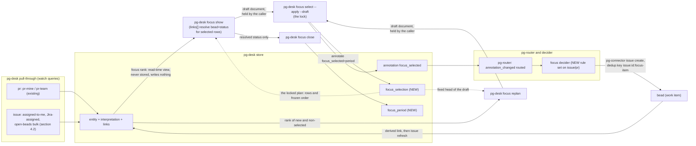

# Daily focus, store-first: phase 15 of the pg-desk/connector program

- **Date**: 2026-09-23 (revised 2026-10-06 against the landed entity change flow)
- **Status**: Draft, landed on the operator's instruction of 2026-10-07 (review first, then land)
  so that decomposition can start from it. The ranking model, candidate set, epic slot rule and rank
  placement (section 6, D-F11) were ruled by the operator on 2026-10-05, and the minting path
  (D-F12 to D-F16) on 2026-10-06; D-F17 to D-F21 were proposed by the agent from the 2026-10-07
  five-dimension review and CONFIRMED by the operator on 2026-10-07, together with the age-key
  source, the per-source-freshness gap, deferral of the `week`/`sprint` period types, and the landing
  order. A second, independent five-dimension review (completeness, correctness, UX, observability,
  test coverage) ran on 2026-10-07 and its findings are folded into this revision; the operator has
  NOT read the folded text line by line. The three questions that review raised were RULED by the
  operator on 2026-10-08 (section 12 records them verbatim): the draft-and-lock plan model (D-F22,
  which amends D-F5 and D-F18 and adds the `replan` verb), the widened open-beads bulk query (section
  4.2), and the issue closed listener (section 8 Routing). That 2026-10-08 text is the agent's
  reading of those rulings; it has had one independent read-only review, whose findings are folded in,
  and no review by the operator.
- **Bead**: `pg2-2j5ac.27` (this design's own tracking bead; phase 15's decompose-trigger is
  `blocked-by` it)
- **Depends on**: the entity change flow (`docs/superpowers/specs/2026-09-29-entity-change-flow-design.md`,
  ADR 0077) and its cutover release. This document targets the **post-cutover** world: pg-desk's
  `ledger` table, `sync.mode`, `internal/sync`, `pg-desk run` and heartbeat are removed by that
  cutover and MUST NOT be built on. The issue-entity pipeline that an earlier revision treated as an
  unlanded external prerequisite (`pg2-2j5ac.46`, closed) has landed (section 4.1).
- **Amends**: `phillipgreenii-nix-agent-support`'s
  `docs/superpowers/specs/2026-09-09-pg-desk-and-connector-discovery-design.md` (D19, D26, phase
  15's row in its phase table — "designed in its own document", checkpoint "defined by that
  document"; this is that document) and the private machine flake's
  `2026-09-02-daily-focus-v2-design.md` (decides what of v2 survives — answer: `df-attention`/
  `df-search`, untouched; everything else in v2's `df-survey`/`df-deferred`/`df-wire`/`df-pull`/
  `df-resolve-focus`/`df-find-pr-bead`/`df-split-blockers` family retires; the map is section 3's retirement map and the list is section 10). It also asks
  for one amendment to the entity change flow design and ADR 0077 (D-F14).

## 1. Purpose and scope

Phase 15 retires daily-focus's beads-as-primary-store architecture (v2, fully implemented and
live in the private machine flake today) in favor of the store-first pattern the rest of the
pg-desk/connector program already uses: everything surveyed lands uncapped in `pg-desk`'s SQLite
store; focus ranking is a compute-only, read-time view over `entity` rows; a decider mints beads
only where an agent actually needs one; "pulling more work" is selecting more from the store, not a
separate mechanism (D19, D26).

This document is scoped to daily-focus's own retirement (`df-survey`, `df-deferred`, `df-wire`,
`df-verify-wiring`, `df-pull`, `df-resolve-focus`, `df-find-pr-bead`, `df-split-blockers`,
`df-close-focus`, and the three command files that orchestrate them). It does not touch `df-attention`/`df-search`/`df-categorize`/`df-feedback`
(already retired into `pg-desk` in earlier phases per D10, or — for attention/search — deliberately
unrelated per the v2 doc's own §0 cross-reference) or any PR-side pg-desk behavior.

## 2. Decisions ledger

Operator rulings from the 2026-09-23 design session that produced this document, D-F11 from the
2026-10-05 ranking session (which supersedes D-F7), and D-F12 to D-F14 from the 2026-10-06 revision
session that reconciled this document with the landed entity change flow, D-F15 and D-F16 from the
review that followed it, and D-F17 to D-F21, proposed by the agent from the 2026-10-07 five-dimension
review and CONFIRMED by the operator on 2026-10-07, and D-F22, RULED by the operator on 2026-10-08
(each is marked, and each is the agent's
recommendation, so the operator can reverse it without unpicking anything else). The later
2026-10-07 review refined their mechanics without changing a confirmed decision; each refinement
is in the row or section it touches. D-F7 was made in the
operator's absence (a 10-minute `AskUserQuestion` timeout) on the session's best judgment, per
precedent already set twice earlier in the same session; it is superseded, kept for provenance.

| #     | Decision                                                                                                                                                                                                                                                                                                                                                                                                                                                                                                                                                                                                                                                                                                                                                                                                                                                                                                                                                                                                                                                                                                                                                                                                                                                                                                                                                                                                                                                                                                                                                                                                                                                                                                                                                                                                                                                                                                                                                                                                                                                                                                                                                                                                                                                                                                                                                                                                                                                                                                                                                                                                                                        |
| ----- | ----------------------------------------------------------------------------------------------------------------------------------------------------------------------------------------------------------------------------------------------------------------------------------------------------------------------------------------------------------------------------------------------------------------------------------------------------------------------------------------------------------------------------------------------------------------------------------------------------------------------------------------------------------------------------------------------------------------------------------------------------------------------------------------------------------------------------------------------------------------------------------------------------------------------------------------------------------------------------------------------------------------------------------------------------------------------------------------------------------------------------------------------------------------------------------------------------------------------------------------------------------------------------------------------------------------------------------------------------------------------------------------------------------------------------------------------------------------------------------------------------------------------------------------------------------------------------------------------------------------------------------------------------------------------------------------------------------------------------------------------------------------------------------------------------------------------------------------------------------------------------------------------------------------------------------------------------------------------------------------------------------------------------------------------------------------------------------------------------------------------------------------------------------------------------------------------------------------------------------------------------------------------------------------------------------------------------------------------------------------------------------------------------------------------------------------------------------------------------------------------------------------------------------------------------------------------------------------------------------------------------------------------- |
| D-F1  | Daily-focus's PR candidate gathering reuses pg-desk's existing `pr-mine`/`pr-team` watch queries unchanged. Issue-type candidates (Jira issues, epics, bd tasks) are persisted by the same pull-through that serves PRs: pg-desk lists each name in `watch.issue.queries` with `pg-connector issue list --fingerprints`, hydrates added or changed entities through `issue show`, and persists them (`docs/behavior/pg-desk/changes.md`; the generic issue-entity pipeline of closed bead `pg2-2j5ac.46`, landed). This document therefore adds NO new gather code; it adds three named queries to `watch.issue.queries` (section 4.2). An earlier revision of this document treated issue-entity gather as an unlanded external prerequisite; that framing is retired.                                                                                                                                                                                                                                                                                                                                                                                                                                                                                                                                                                                                                                                                                                                                                                                                                                                                                                                                                                                                                                                                                                                                                                                                                                                                                                                                                                                                                                                                                                                                                                                                                                                                                                                                                                                                                                                                         |
| D-F2  | `pg-connector-pr-github`'s `mine` query stays scoped to the single repository the deployment configures (one repo), narrowing daily-focus's PR survey from v2's cross-repo author search. Recorded loss, same pattern as the design of record's D15. The repository itself is deployment configuration and is not named here.                                                                                                                                                                                                                                                                                                                                                                                                                                                                                                                                                                                                                                                                                                                                                                                                                                                                                                                                                                                                                                                                                                                                                                                                                                                                                                                                                                                                                                                                                                                                                                                                                                                                                                                                                                                                                                                                                                                                                                                                                                                                                                                                                                                                                                                                                                                   |
| D-F3  | `df-deferred`'s description-marker-section mechanism retires entirely. "Deferred" is derived: candidates the store already holds that are not `focus_selection`-selected for the period. No description grammar, no lost-update hazard, no size cost.                                                                                                                                                                                                                                                                                                                                                                                                                                                                                                                                                                                                                                                                                                                                                                                                                                                                                                                                                                                                                                                                                                                                                                                                                                                                                                                                                                                                                                                                                                                                                                                                                                                                                                                                                                                                                                                                                                                                                                                                                                                                                                                                                                                                                                                                                                                                                                                           |
| D-F4  | The per-day "focus bead" (one bead with wired blocking deps) retires. "Today's focus" becomes a `pg-desk` view/query (`focus_selection`/`focus_period`, §5), generalizing to week/sprint via a `period_type` column rather than a new bead type per level (not built this phase — schema-ready only). Beads stay reserved for actual agent-workable signals (D8), never for human plan-tracking.                                                                                                                                                                                                                                                                                                                                                                                                                                                                                                                                                                                                                                                                                                                                                                                                                                                                                                                                                                                                                                                                                                                                                                                                                                                                                                                                                                                                                                                                                                                                                                                                                                                                                                                                                                                                                                                                                                                                                                                                                                                                                                                                                                                                                                                |
| D-F5  | Gate replies and pull selections reference candidates by their own `(entity_type, entity_id)` — the same key already exists for a PR/Jira/bead item — never a derived positional handle. Every FACT shown (title, due date, priority, status) is read live from current `entity`/`interpretation` rows, so a priority or due-date change is never hidden from the operator. **Amended 2026-10-08 by D-F22 for the ORDER only:** the order is computed once per draft and frozen until the operator locks the plan or asks for a `replan`; the old rule that every `show`/`select` recomputes the order is withdrawn. The positional-handle rejection stands (keys remain the only handle).                                                                                                                                                                                                                                                                                                                                                                                                                                                                                                                                                                                                                                                                                                                                                                                                                                                                                                                                                                                                                                                                                                                                                                                                                                                                                                                                                                                                                                                                                                                                                                                                                                                                                                                                                                                                                                                                                                                                                      |
| D-F6  | `focus_selection` and `focus_period` (§5) use an internal surrogate primary key (`id INTEGER PRIMARY KEY AUTOINCREMENT`) with a `UNIQUE` constraint carrying the natural key, diverging deliberately from every existing pg-desk table, which all use a composite natural-column primary key with no surrogate. `focus_selection` references `focus_period` by its surrogate `id` (a real foreign key, not a repeated `period_type`/`period_key` pair) and references `entity` by its own composite key (`repo, entity_type, entity_id`) — `entity` already is the table that establishes an `(entity_type, entity_id)` pair is valid, so `focus_selection` gets that validation from a real foreign key rather than untyped text columns.                                                                                                                                                                                                                                                                                                                                                                                                                                                                                                                                                                                                                                                                                                                                                                                                                                                                                                                                                                                                                                                                                                                                                                                                                                                                                                                                                                                                                                                                                                                                                                                                                                                                                                                                                                                                                                                                                                      |
| D-F7  | **SUPERSEDED 2026-10-05 by D-F11 (candidate set and epic slot rule).** Original text, kept for provenance: epic candidacy narrows to "owned by me AND has an open/in_progress child" — the "OR a recently-closed child" half of today's rule is dropped as a recorded loss, because expressing it would need a per-epic follow-up query the static named-query model (§4) cannot do. **Made in the operator's absence.**                                                                                                                                                                                                                                                                                                                                                                                                                                                                                                                                                                                                                                                                                                                                                                                                                                                                                                                                                                                                                                                                                                                                                                                                                                                                                                                                                                                                                                                                                                                                                                                                                                                                                                                                                                                                                                                                                                                                                                                                                                                                                                                                                                                                                        |
| D-F8  | **DONE** (bead `pg2-t9zzg`, closed). `schema.Issue` gained an `Owner` field (bd's `owner` key — the responsible human), distinct from `Assignee`, which carries bd's claim/actor identity, not ownership; and pg-desk's issue ownership classifier reads it through the configured self-owner identity. "Assigned or owned by the operator" (D-F11) therefore reuses `interpretation.ownership` for issues; nothing new is built for it here.                                                                                                                                                                                                                                                                                                                                                                                                                                                                                                                                                                                                                                                                                                                                                                                                                                                                                                                                                                                                                                                                                                                                                                                                                                                                                                                                                                                                                                                                                                                                                                                                                                                                                                                                                                                                                                                                                                                                                                                                                                                                                                                                                                                                   |
| D-F9  | There is no separate `focus split` verb. `pg-desk focus show` resolves each already-selected row's associated bead and current status unconditionally, folded into its existing per-item output, from the entity's view: the linked work item appears in the view's `links[]` with its state, labels, metadata and assignee. The link exists because the minted bead's own metadata names the source entity (D-F13), which the generic source-entity extractor recognizes; no tracker call is made at `show` time. The watch queries MUST cover the minted beads (a watched bead is one some `watch.issue.queries` name lists; section 4.2), with one nuance recorded in section 4.2: a CLOSED focus bead leaves the open-beads query and reaches `links[]` only through the change flow's removal-confirmation read. `close.md`'s survey step becomes a `focus show` call, not a dedicated verb.                                                                                                                                                                                                                                                                                                                                                                                                                                                                                                                                                                                                                                                                                                                                                                                                                                                                                                                                                                                                                                                                                                                                                                                                                                                                                                                                                                                                                                                                                                                                                                                                                                                                                                                                               |
| D-F10 | `focus close`'s per-bead progress note is appended by `close.md` itself via `pg-connector issue comment` (→ `bd comment`), not by pg-desk and not via today's `bd update --append-notes` (→ bd's separate NOTES field), followed by `pg-desk issue refresh <bead>` so the store sees the write (change-flow S10: external writes go straight through pg-connector by the actor, then refresh). pg-desk MUST NOT execute tracker write verbs (G5). Comments are the better mechanism for this content: bd captures `created_at`/`author` on each comment natively, where NOTES is one unstructured, unbounded-growth text field the caller must manually date-tag (exactly what `df-close-focus.sh`'s `[daily-focus <date>] <progress>` prefix exists to work around). The `[daily-focus <date>]` tag's PURPOSE splits in two — recording that a bead was part of a day's focus (now redundant; `focus_selection` already durably and queryably records this) vs. carrying forward what actually happened for whoever reads the bead next (not redundant; pg-desk's store holds no narrative text). Only the first purpose retires.                                                                                                                                                                                                                                                                                                                                                                                                                                                                                                                                                                                                                                                                                                                                                                                                                                                                                                                                                                                                                                                                                                                                                                                                                                                                                                                                                                                                                                                                                                              |
| D-F11 | **Ranking model, ruled by the operator 2026-10-05** (focused ranking session; supersedes D-F7 and the v2 ranking ported unchanged). Candidate set: everything non-done ASSIGNED to the operator (authored or assigned PRs, assigned Jira issues, beads assigned to or owned by the operator), with no started/ownership filter that hides an item. Slot rule: an epic and its children never use more than one slot; a child takes the slot and the epic is listed only when it is incomplete with no open child. Started: bead in_progress, Jira In Progress category, any open assigned PR. Rank: strict lexicographic tiers, no weights: overdue first (started first, then most overdue), then started, then not started; inside the started and not-started tiers the keys are a due date inside the 7-day horizon, then unblocks, then priority, then age. Placement: the rank is a read-time pure computation inside pg-desk, computed when a draft is made (D-F22) and never stored as a candidate list; a router-triggered idempotent decider only mints beads for the selected items (this replaces the provisional 2026-10-02 answer that a decider computes the rank). The head-to-head evidence is in section 6.                                                                                                                                                                                                                                                                                                                                                                                                                                                                                                                                                                                                                                                                                                                                                                                                                                                                                                                                                                                                                                                                                                                                                                                                                                                                                                                                                                                                                   |
| D-F12 | **Selection reaches the minting decider as an annotation (operator, 2026-10-06).** `focus select` and `focus pull` write the `focus_selection` row AND an annotation `focus_selected=<period_key>` on each selected entity (`pg-desk <type> annotate`, origin `pg-desk`). The annotation emits `annotation_changed`, which every decider already subscribes to, so no new change source and no change to the change-flow change-kind catalogue is needed. The table remains the period history and the foreign-key-guarded record; the annotation is the single carrier the decider reads. A struck selection sets the annotation to `none` (section 5).                                                                                                                                                                                                                                                                                                                                                                                                                                                                                                                                                                                                                                                                                                                                                                                                                                                                                                                                                                                                                                                                                                                                                                                                                                                                                                                                                                                                                                                                                                                                                                                                                                                                                                                                                                                                                                                                                                                                                                                        |
| D-F13 | **A focus bead is one bead per source entity (operator, 2026-10-06).** The decider's work-item kind is `focus-item`, with dedup key `<entity_type>:<entity_id>:focus-item` and NO per-day suffix, consistent with D-F4 (no per-day bead). The change-flow same-context rule applies, with the context being the source entity: a closed focus bead is never recreated, a bead the decider held on a strike is released on a reselect, and a bead a worker closed is left closed (section 8); a second bead is never minted. The bead's metadata carries neutral `source_type` and `source_id` fields naming the source entity, which a NEW generic source-entity metadata extractor turns into a link of a distinct, neutral relation (`source`) (change-flow S25: "derived whenever an entity's own data names the other"). The extractor carries no focus vocabulary, so it passes the G5 guard, and it MUST NOT reuse the `repo`+`pr_number` fields: the existing issue extractor reads only those and `parent`, and a reused `repo`+`pr_number` would yield a `work` link that the PR decider treats as that PR's own work item. A strike holds the bead (an indefinite defer) and a reselect releases it (section 8). An epic needs no bead; its entity id already is a bead id.                                                                                                                                                                                                                                                                                                                                                                                                                                                                                                                                                                                                                                                                                                                                                                                                                                                                                                                                                                                                                                                                                                                                                                                                                                                                                                                                                           |
| D-F14 | **Amend the change-flow design and ADR 0077 (operator, 2026-10-06).** The change-flow design's decoration-versus-decision classification (section 2; its closing sentence reads "Cross-entity judgment that chooses an outcome (for example daily-focus ranking) is a decision, not a decoration"), together with S2 and G5, puts daily-focus ranking in a decider. The 2026-10-05 ruling (D-F11) places the rank in pg-desk as a read-time view. The amendment records: a rank that is a read-only, side-effect-free view over stored facts — it writes nothing and mints no work — MAY live in pg-desk; only MINTING work from a selection is a decision, and it lives in the decider (D-F12, D-F13). Without it, a change-flow conformance review would reject `internal/focus` in pg-desk. Recorded as ADR 0087, which extends ADR 0081's read-time rule (attention) to this rank, with a pointer in ADR 0077 and in the change-flow design's section 2; all three land in the same commit series as this document.                                                                                                                                                                                                                                                                                                                                                                                                                                                                                                                                                                                                                                                                                                                                                                                                                                                                                                                                                                                                                                                                                                                                                                                                                                                                                                                                                                                                                                                                                                                                                                                                                         |
| D-F15 | **The selection is a reserved view member (operator, 2026-10-06, later in the review session).** The `focus_selected` annotation is surfaced to deciders as a dedicated `annotations.focus_selected` member of `show`'s composite view (and of pg-decider's view reader), beside `ready_to_land`; the decider namespace, documented as written by deciders, is not reused, and no generic other-keys map is added.                                                                                                                                                                                                                                                                                                                                                                                                                                                                                                                                                                                                                                                                                                                                                                                                                                                                                                                                                                                                                                                                                                                                                                                                                                                                                                                                                                                                                                                                                                                                                                                                                                                                                                                                                                                                                                                                                                                                                                                                                                                                                                                                                                                                                              |
| D-F16 | **A strike takes the focus bead out of play (operator, 2026-10-06; mechanism revised by the operator on 2026-10-07 to avoid bead churn).** The 2026-10-06 ruling was that a strike must not leave a bead that a worker can still claim for an item taken out of focus, and that a reselect brings the item back. The 2026-10-07 revision fixes the mechanism: a bead that is part of the plan is undeferred and in play; a struck bead is unlinked from the current focus and given an INDEFINITE defer; a reselect undefers it. Nothing is closed or reopened, and every tool that looks for a focus bead MUST look at deferred ones too, so a held bead is never recreated (D-F19). A source that is hidden or suppressed freezes its bead as it was (section 8), the one exception to "a strike takes the bead out of play".                                                                                                                                                                                                                                                                                                                                                                                                                                                                                                                                                                                                                                                                                                                                                                                                                                                                                                                                                                                                                                                                                                                                                                                                                                                                                                                                                                                                                                                                                                                                                                                                                                                                                                                                                                                                                 |
| D-F17 | **CONFIRMED (operator, 2026-10-07; proposed by the agent): selection history is kept and explainable.** `focus_selection` rows are never deleted: a strike sets `status='struck'`, `struck_at` and `struck_reason`, and each row records `source` (`ranked`, `forced`, `handadded`, `pulled`), `rank_position`, `tier` and `cap` as of the selecting run (a record of what was shown when the plan was locked; for a selected row that record IS its place in the frozen plan, D-F22, and it is never an input to a later rank of any other item). The flip-by-flip history of one item is the append-only `focus_selection_event` table (section 5), NOT the change log: a change-log row records neither the annotation key nor its value, and the log is pruned. A new read-only verb, `pg-desk focus explain <key>` (section 7.5), answers "why was this ranked, selected, struck, minted or held" from the live rows, the way `attention explain` does for ADR 0081's view.                                                                                                                                                                                                                                                                                                                                                                                                                                                                                                                                                                                                                                                                                                                                                                                                                                                                                                                                                                                                                                                                                                                                                                                                                                                                                                                                                                                                                                                                                                                                                                                                                                                                |
| D-F18 | **CONFIRMED (operator, 2026-10-07; proposed by the agent): what counts as a strike.** An item is struck when it was `selected` in the period's rows and is absent from the new final set for a reason the operator can see in the lock preview: an explicit `-key`, an explicit lower `cap=`, or a non-terminal loss of candidacy (reassigned, hidden, deactivated); the row records which in `struck_reason` (`operator`, `cap`, `dropped`). **Amended 2026-10-08 by D-F22 (the operator's ruling on the former open question 1):** RANK DRIFT NEVER STRIKES, so a bare `ok` can no longer hold a bead because a new overdue item outranked it (the original text struck any selected item absent from a recomputed final set "for ANY reason", which included displacement by rank), and an item whose source finished (a merged or closed PR, a done issue) stays `selected` and is shown as `finished`, never struck; the decider's terminal-source hold (section 8) already holds its bead (sections 7.1 and 7.2). Rows added by `pull`, by a force-pull (`+key` of an existing candidate) or by a hand-add (`source` `pulled`, `forced` or `handadded`) persist across later `select` runs unless explicitly struck, so an ordinary re-run of `create` cannot silently hold added work. The cap in force is persisted on the period, so a re-run without `cap=` keeps it. Because a strike now takes a bead out of play, `select` MUST show every strike and its cause BEFORE it applies (a `--dry-run` preview, which `create.md` runs first, section 7.2). The annotation holds the MOST RECENT period key in which the item is selected, defined as the maximum `period_key` over the item's `selected` rows in every period (else `none`), written in the same transaction as the table change; it never means "selected today" (that is read from the table). A day rolling over holds nothing by itself: an item selected yesterday and not today keeps its bead and its annotation until it is struck, and `-key` on such an item writes `none` and holds as usual.                                                                                                                                                                                                                                                                                                                                                                                                                                                                                                                                                                |
| D-F19 | **CONFIRMED (operator, 2026-10-07; mechanism per the operator's direction, details proposed by the agent): hold and release mechanics.** A focus bead is in play (open or claimed) or held. HELD means all three of: status `deferred`, metadata `focus_hold=struck`, and an empty assignee. (An earlier draft added "with no end date"; the decider's view carries no deferral date, so that condition cannot be observed and is dropped. The hold itself sets no end date, so a bead the rule held is indefinitely deferred.) A strike of an open, unclaimed bead with no open children is ONE `update` setting status `deferred` and `focus_hold=struck`; a reselect of a held bead is ONE `update` setting status `open`, clearing the deferral, and `focus_hold=released` (the connector's metadata merges and has no unset). Both are `update` actions, to which the action layer adds `Status` and `ClearDefer` fields (the connector already accepts both; an earlier draft also added `ClearAssignee`, which no path uses, so it is dropped); the decider never emits `close` or `reopen` for a focus bead. A claimed bead is never deferred, a bead deferred without the marker is someone else's and is left alone, and the marker alone never triggers a release, so a live claim is never wiped. Every hold and release re-reads the bead live first, because the decider's view is the stored snapshot. Spiked against real `bd` 1.2.2 on 2026-10-07: `--status deferred` with no date hides the bead from `bd ready` and keeps it in `bd list`; defer plus metadata, and undefer plus clear, each work in one call; a deferred claimed bead keeps its assignee. Nothing in the rule depends on who closed an item, so change-flow S26 holds, but the behavior docs word the decider's reading of a work item more narrowly ("open or closed" only) and need amending (section 12 item (h)). Consequences for other tools (section 8): a narrow watch query for held beads, a dedup query that lists focus beads, `/pb:unstick-beads` excluding the `focus-item` label, and a periodic re-evaluation binding.                                                                                                                                                                                                                                                                                                                                                                                                                                                                                                                     |
| D-F20 | **CONFIRMED (operator, 2026-10-07; proposed by the agent): the operator-facing verb contract.** `focus select` gains `--dry-run`, and every echoed row names its downstream bead consequence in a closed vocabulary (section 7.2 step 7). `focus show` prints a coverage header and a closed-vocabulary bead column, and every verb has `--json` for the LLM command prose that consumes it (section 7.1; the contract string is `pg-desk.focus/v1`, carried in a `contract` member as `show.md`'s own contract is, with no separate `schemaVersion`). Exit codes follow pg-desk's scheme: `1` usage or an old-schema store, `2` partial, `3` total failure, `6` period closed, and `7` for a plan that changed since the draft was made (section 7; `4` is already `head-check`'s). **Amended 2026-10-08 by D-F22:** exit `7` guards the draft's `base` against the persisted plan instead of an `--expect` table digest, and `--expect` is withdrawn; there is a sixth verb, `replan` (section 7.6).                                                                                                                                                                                                                                                                                                                                                                                                                                                                                                                                                                                                                                                                                                                                                                                                                                                                                                                                                                                                                                                                                                                                                                                                                                                                                                                                                                                                                                                                                                                                                                                                                                          |
| D-F21 | **CONFIRMED (operator, 2026-10-07; proposed by the agent): observability is part of the design.** Every new component declares what it emits and logs (the telemetry-declaration convention of `docs/behavior/pg-desk/README.md`): section 8.2 specifies the verbs' durable run record and structured stderr line, the `/metrics` families computed from the store at scrape time and their alert rules, a `doctor` focus block, the decider's rule id and counters, and a rank-regression parity check.                                                                                                                                                                                                                                                                                                                                                                                                                                                                                                                                                                                                                                                                                                                                                                                                                                                                                                                                                                                                                                                                                                                                                                                                                                                                                                                                                                                                                                                                                                                                                                                                                                                                                                                                                                                                                                                                                                                                                                                                                                                                                                                                        |
| D-F22 | **RULED (operator, 2026-10-08): the plan is drafted, locked and re-planned, and the order is computed once per draft.** The operator's words, verbatim: "as i'm making a plan, the computation for the initial order should happen only once until i lock the plan in or i ask for a recalcuation"; and on the mechanics, "1A, 2A, 3A, 4 i don't think we want a recalc, i think what i want is to \"replan\" which would pull new items into the plan. this means that it would reorder things, but the previous plan remains as is. ie, the new items and nonselected items would be ordered correctly, but stay out of the selection. we are a draft phase again until we approve and go back to the actual plan which is using the asme freeze rules as before. 5 the draft only lives until the plan is created. it needs not persistence." The model, in design-pattern terms: a draft is a Memento the CALLER holds and pg-desk never stores. (1) A **draft** is a document: the order, tiers and cap line computed once, plus a `base` digest of the period's persisted plan, a `made_at` and a `digest` naming it. It has no table and no `meta` key; it ends when the plan is locked or the caller drops it, and the `create.md` prose holds it and hands it back with `--draft` (section 7). (2) **Lock** is `select --apply`. A locked plan freezes the ORDER, TIER and CAP LINE of its selected rows (their recorded `rank_position`, `tier` and `cap`); title, due date, priority and status stay live, and drift shows as a notice, not a re-sort (fork 1A). (3) **`replan`** (a new verb, section 7.6) opens a draft again over a locked plan: the selected rows stay exactly as they are, every other candidate, new ones included, is ordered afresh and proposed for nothing, and nothing joins the plan until the reply names it (`+key`) and the operator locks. (4) Candidates that arrive while a draft is held are not in it and show as `new since draft` (fork 2A); a draft row whose source finishes stays visible, marked `finished`, and is not struck at lock (fork 3A); a finished item is shown in the plan, is never struck, and is NOT counted toward the cap (operator, 2026-10-08, "finished is not struct and can be shown in the plan, but it shouldn't be counted towards the cap"). (5) Rank drift alone never strikes anything (amends D-F18). (6) `--expect` is withdrawn, and exit `7` now means the persisted plan changed since the draft's `base`. A `select` given no `--draft` computes a draft inside its own process and applies it in the same run, so the order is computed once there too. |

## 3. Architecture overview



### Retirement map

| Component                   | Fate                                 | Replaced by                                                                                                         |
| --------------------------- | ------------------------------------ | ------------------------------------------------------------------------------------------------------------------- |
| `df-survey` (shallow)       | Retires                              | Live read of `entity`/`interpretation` rows (§6)                                                                    |
| `df-survey` (gate-apply)    | Retires                              | `pg-desk focus select --apply` (§7.2)                                                                               |
| `df-survey` (deep)          | Retires                              | Not needed — `focus show`/`select` read every fact live (the order freezes per draft, D-F22), no separate deep pass |
| `df-deferred`               | Retires                              | `focus_selection` absence = deferred (D-F3)                                                                         |
| `df-wire`                   | Retires (logic moves into a decider) | The focus decider's `focus-item` rule (§8, D-F12, D-F13)                                                            |
| `df-pull`                   | Retires                              | `pg-desk focus pull` (§7.3)                                                                                         |
| `df-resolve-focus`          | Retires                              | `pg-desk focus show`/existence check via `period_key`                                                               |
| `df-find-pr-bead`           | Retires                              | The entity's `links[]` plus the decider's dedup-key lookup (change-flow work-item)                                  |
| `df-split-blockers`         | Retires                              | `pg-desk focus show`'s resolved bead+status for selected rows (§7.1, D-F9)                                          |
| `df-verify-wiring`          | Retires                              | Not needed — nothing is wired (§8)                                                                                  |
| `df-close-focus`            | Retires                              | `pg-desk focus close` (§7.4) plus `close.md`'s own per-bead comments (D-F10)                                        |
| `df-attention`, `df-search` | Unchanged                            | n/a — unrelated (pure `pg-connector` clients already)                                                               |

## 4. Gather

### 4.1 Issue entities are already gathered (landed prerequisite, `pg2-2j5ac.46`)

An earlier revision of this document found, by reading the code, that pg-desk gathered only PRs, and
therefore scoped issue-entity gather out to an external prerequisite design session,
`pg2-2j5ac.46`. That session has closed and its design has landed (the generic entity pipeline
design, `docs/superpowers/specs/2026-09-23-pg-desk-generic-entity-pipeline-design.md`): gather,
interpret and persist take an entity-type registry covering `pr` and `issue`, issue ownership is
classified against a configured self-owner identity, and the entity change flow's pull-through
(`pg-desk <type> changes`) is the single path that discovers, hydrates and persists watched
entities of every type (`docs/behavior/pg-desk/changes.md`). This document therefore builds on that
pipeline and specifies no gather code of its own.

Two cautions carry over:

- The old `pg-desk run`/`sync` paths are removed by the change-flow cutover release but still
  present in code until it ships. This document targets the post-cutover world and MUST NOT call
  or extend them.
- Persisted entities are never deleted; a closed or unwatched entity stays as an inactive row.
  Every candidate query in section 6 MUST therefore filter on `entity.active`.

### 4.2 Watch queries

pg-router already runs one `desk-<type>-changes` query per watched type (change-flow S22); what a
type watches is pg-desk configuration: `watch.issue.queries` is a list of named `pg-connector issue
list` queries, each listed with `--fingerprints` and hydrated when added or changed. Daily-focus
adds no pg-router feed, no feed schedule and no `issue.changed` routing of its own. The deployment's
`watch.issue.queries` MUST include three named queries (the names here are illustrative; the real
names are deployment configuration):

- **An assigned-to-me Jira query**: Jira issues assigned to the operator (today's `issue-jira-mine`
  query). Together with the bead query below it realizes D-F11's candidate set for issues.
- **An assigned-or-owned bead query**: beads whose assignee or owner is the operator (the owner
  field exists, D-F8).
- **An open-beads bulk query**: every `open`, `in_progress` or `blocked` bead, with no type filter
  (`blocked` added by the operator's ruling of 2026-10-08, "B", so a `blocked` child still counts as
  an open child of its epic and the epic keeps one slot, section 6). Its purpose
  is narrower than the first two: landing every child issue's `parent` field, and every epic itself,
  in the store so the focus-rank step (§6) can answer "does this epic have an open child" with a
  pure in-store join, no per-epic query. It is the same "one bulk bead query, deduped by id" trick
  `df-survey` uses today, running continuously.

PR candidate gathering (`pr-mine`/`pr-team`) needs no change — D-F1. Volume is bounded by the
mechanism rather than guessed at: a poll diffs list fingerprints and hydrates only added or changed
entities, capped by `hydration.max_per_poll` (default 50), with the age sweep re-hydrating the rest
in rolling batches (`docs/behavior/pg-desk/changes.md`; change-flow 8.4, 8.5). `doctor` reports
when the sweep falls behind.

**Beads minted by the focus decider MUST be covered by a watch query** (the open-beads bulk query
does), because the entity's link to its minted bead is resolved from that bead's own entity row
(D-F9, D-F13). **A held (struck) focus bead is deferred, not closed (D-F16, D-F19), and an
open-beads query that lists only `open`, `in_progress` and `blocked` beads would drop it**: the source entity's
link to its bead would vanish and the decider would see "no bead" and mint a second one. The
open-beads bulk query is widened to `blocked` and NOT to `deferred`, because widening it to `deferred` would pull in
every parked and gated bead of the workspace and change the slot rule; a NARROW watch query for held
focus beads (`--label focus-item --status deferred`) is added beside it, and the decider's dedup
lookup needs its own query that lists focus beads in every non-closed status (section 8). Both are
deployment changes. A focus bead that a worker finishes closes and leaves the query, so its entity row is no
longer refreshed by a poll; its final state reaches the source entity's `links[]` through the
removal-confirmation read described in `docs/behavior/pg-desk/changes.md`, and the decider's own
`pg-desk issue refresh <bead>` after a create, hold or release (section 8) keeps it current without
waiting for that read. A bead that was minted and closed by a worker between two polls was never in
a persisted listing, so no removal-confirmation read happens for it; its link stays `open` until the
remote age sweep (`sweep.max_age`) re-hydrates the bead, and that is the bound on this staleness. The
decider acts on link state only to hold or release a bead, and treats a link it cannot confirm as "no
change", so stale evidence never makes it write.

**Coverage and freshness are persisted, because `show` is store-only.** `focus show` reads no
tracker, so "a category failed or was truncated" cannot be discovered at read time. The pull-through
therefore persists, per watched query, the last listing status (`ok`, `degraded` or `failed`, with its
reason) in `meta` beside the change flow's `change_flow.watchset.*` counters, and `focus show` reads
it (section 7.1's coverage header). That persistence is NEW behavior the change flow does not have
today (it persists only the watch-set and hydration counters; the per-query status exists only in the
pull-through's own per-call result), so it is an amendment item for `changes.md`, `store-schema.md`
and the change-flow design (section 12 item (m)): the key is `change_flow.listing.<type>.<query>`,
holding the status, the reason and the time. The per-source freshness recorder of today (`pg-desk heartbeat`
writing `meta.source_fetch.*`, read by `pg-desk freshness`) is removed by the change-flow cutover and
the change-flow design does not say what replaces it. That is a cross-document gap this design does
not close (section 12): until it is closed, the focus staleness signals are each entity's
`hydrated_at` and the persisted listing status.

## 5. Store schema

New tables, alongside pg-desk's `entity`/`interpretation`/`xref`/`annotation` (the change flow's v2
schema adds `version`, `hydrated_at`, `active` and `list_fp` to `entity`, and drops `ledger`; none of
that touches the foreign-key target below, because `entity`'s primary key `(repo, entity_type,
entity_id)` is unchanged):

```sql
CREATE TABLE focus_period (
    id            INTEGER PRIMARY KEY AUTOINCREMENT,
    period_type   TEXT NOT NULL,      -- 'day' this phase; schema allows 'week'/'sprint' later
    period_key    TEXT NOT NULL,      -- e.g. '2026-09-23' for period_type='day'; parsed and
                                       -- re-formatted on write, so '2026-9-3' cannot make a
                                       -- second period
    cap           INTEGER,            -- the cap in force for the period (a re-run without
                                       -- `cap=` reuses it); NULL until a run sets one
    closed_at     TEXT,
    close_note    TEXT,
    UNIQUE (period_type, period_key),
    CHECK (period_type IN ('day', 'week', 'sprint'))
);

CREATE TABLE focus_selection (
    id              INTEGER PRIMARY KEY AUTOINCREMENT,
    focus_period_id INTEGER NOT NULL,
    repo            TEXT NOT NULL,    -- same repo constant pg-desk already uses for every
                                       -- entity it gathers (§8's "single configured repo" in
                                       -- the parent design), not a per-issue attribute
    entity_type     TEXT NOT NULL,    -- 'pr' | 'issue' (Jira or bd; told apart by the bead-id
                                       -- pattern, section 8.1)
    entity_id       TEXT NOT NULL,
    selected_at     TEXT NOT NULL,
    status          TEXT NOT NULL DEFAULT 'selected',  -- 'selected' | 'struck' (D-F17, D-F18)
    struck_at       TEXT,             -- set on a strike, NULL again on a reselect (the history
                                       -- is focus_selection_event)
    struck_reason   TEXT,             -- 'operator' | 'cap' | 'dropped' while struck, else NULL;
                                       -- 'dropped' is a NON-terminal loss of candidacy only (never
                                       -- rank drift, never a finished source, D-F18, D-F22)
    source          TEXT NOT NULL,    -- 'ranked' | 'forced' | 'handadded' | 'pulled'
    rank_position   INTEGER,          -- the row's place in the frozen plan: its position in the
                                       -- draft that was locked (D-F22)
    tier            TEXT,             -- 'overdue' | 'started' | 'not_started' as of that draft
    cap             INTEGER,          -- the cap in force for that run
    UNIQUE (focus_period_id, repo, entity_type, entity_id),
    CHECK (status IN ('selected', 'struck')),
    CHECK (source IN ('ranked', 'forced', 'handadded', 'pulled')),
    CHECK (tier IS NULL OR tier IN ('overdue', 'started', 'not_started')),
    CHECK ((status = 'struck') = (struck_at IS NOT NULL)),
    CHECK ((status = 'struck') = (struck_reason IS NOT NULL)),
    FOREIGN KEY (focus_period_id) REFERENCES focus_period (id),
    FOREIGN KEY (repo, entity_type, entity_id) REFERENCES entity (repo, entity_type, entity_id)
);

-- Append-only history, written in the same transaction as the row change it records and
-- never pruned (it is one small row per flip).
CREATE TABLE focus_selection_event (
    id                 INTEGER PRIMARY KEY AUTOINCREMENT,
    focus_selection_id INTEGER NOT NULL,
    at                 TEXT NOT NULL,
    run_id             TEXT NOT NULL,   -- the focus_run that wrote it
    actor              TEXT NOT NULL,
    event              TEXT NOT NULL,   -- 'selected' | 'struck' | 'reselected' | 'absorbed'
    source             TEXT,
    rank_position      INTEGER,
    tier               TEXT,
    cap                INTEGER,
    reason             TEXT,            -- the struck_reason, or the absorbing key
    FOREIGN KEY (focus_selection_id) REFERENCES focus_selection (id)
);

-- One row per non-dry-run verb run (select, pull, close, select --repair), the durable copy of
-- the structured stderr line of section 8.2. A total failure that commits nothing else still
-- leaves this row when the store is writable.
CREATE TABLE focus_run (
    id          INTEGER PRIMARY KEY AUTOINCREMENT,
    run_id      TEXT NOT NULL UNIQUE,   -- a ULID, printed by the verb and carried in --json
    verb        TEXT NOT NULL,          -- 'select' | 'pull' | 'close' | 'repair'
    focus_period_id INTEGER,
    started_at  TEXT NOT NULL,
    actor       TEXT NOT NULL,
    exit_code   INTEGER NOT NULL,
    digest      TEXT,                   -- the digest of the draft this run locked (D-F22), or the
                                         -- one it computed in-process when given none
    counts_json TEXT NOT NULL,          -- ranked, selected, struck by reason, forced, handadded,
                                         -- absorbed, hydrated, per-entity annotation outcome
                                         -- with its change_log seq, and the rank_inputs counts
                                         -- of section 8.2
    FOREIGN KEY (focus_period_id) REFERENCES focus_period (id)
);
```

Both tables use an internal surrogate primary key with the natural key expressed as a `UNIQUE`
constraint (D-F6) — a deliberate divergence from every other pg-desk table, called out here so a
later reader does not mistake it for drift. `focus_selection` references `focus_period` by its
surrogate id rather than repeating `period_type`/`period_key`, and — per the operator's own
question during design, "do we have a table which would ensure `entity_type`/`entity_id` is
valid" — it also carries a real foreign key into pg-desk's existing `entity` table, so a
selection can never name an entity pg-desk never actually gathered. Both foreign keys are
genuinely enforced: pg-desk's store already opens every connection with `_pragma=foreign_keys(ON)`
(`internal/store/store.go`), so this isn't a documentation-only intent.

The extra columns (D-F17) record what was SHOWN when the row was written, so a later `focus explain`
can say why an item was selected. For a `selected` row they are also the frozen plan (D-F22): `show`
renders the plan in `rank_position` order with the recorded `tier`, and the cap line from the period's
`cap`. They are never an input to the rank of any OTHER candidate, and a draft never reads them to
order its non-plan rows. **There is no draft table** (operator, 2026-10-08: "it needs not
persistence"): a draft is a document the caller holds (D-F22, section 7), so nothing in this schema,
and no `meta` key, records one. A strike
keeps the row (`status='struck'`, `struck_at` and `struck_reason` set) and a reselect flips it back to
`selected` and clears both; each flip appends a `focus_selection_event` row in the same transaction,
and that table, not the change log, is the flip-by-flip history (the change log's row carries neither
the annotation key nor its value, so a `focus_selected` flip cannot be told from any other
`annotation_changed`, and it is pruned). Every query that means "selected" MUST filter on
`status = 'selected'`. The row's own `cap` is history only; the cap in force for the next run is
`focus_period.cap`.

Consequence: `focus_period` is no longer written only by `focus close` (§7.4). Every verb that
writes a selection (`focus select --apply`, `focus pull`) must first get-or-create the
`focus_period` row for `(period_type, period_key)` — `closed_at`/`close_note` left `NULL` on
creation — so it has an `id` to insert `focus_selection` rows against. `focus close` becomes the
verb that sets `closed_at`/`close_note` on a row that, in practice, already exists by the time a
day is closed.

**Where the tables are created.** Schema changes go through pg-desk's migration ladder or the
change-flow cutover block, never an ad-hoc `CREATE TABLE`. Because nothing of this design is in
production yet, the four tables join the change flow's v2 cutover block (one transaction, one
operator window), together with a `first_seen_at TEXT` column on `entity` (set once on the first
insert and backfilled at cutover from `as_of`; it is the age key's fallback, section 6, and the
change log cannot supply it because it is pruned). If the cutover ships first, they become a
version-3 migration step instead; the phase 15 decomposition decides which at that time. The focus
tables join the irreversible part of the cutover, so the rollback of section 11 does not remove them.

**The selection annotation (D-F12).** In addition to its rows, every selection writes
`focus_selected=<period_key>` on the selected entity (`pg-desk <type> annotate`, origin
`pg-desk`). The key is a reserved annotation, like `ready_to_land` (operator ruling, 2026-10-06:
a dedicated member, not the `decider` namespace, which is documented as written BY deciders). The
view's `annotations` set is closed today (`docs/behavior/pg-desk/show.md`; pg-decider's
`internal/view` `Annotations`), so a stored annotation is never visible to a decider unless the view
contract names it: the decomposition MUST add `annotations.focus_selected` to `show`'s composite view
(the stored value, or `null` when unset; the member is ALWAYS emitted) and to pg-decider's view
reader (section 12 item (g)). The reader MUST track presence, not only value: pg-decider's view
reader tolerates unknown members and decodes a missing one exactly like `null` (as it does for
`ready_to_land`), so a decider newer than its pg-desk, or a pg-desk rolled back, would read every
selection as "absent" and HOLD every unclaimed focus bead. An absent member therefore fails the run
closed (exit 3, a counted `failed` with reason `view-lacks-focus_selected`, nothing written), while a
present `null` means unset; `doctor` carries a line that checks the contract (section 8.2). That
is what a decider reads from the entity's view; the two writes happen in `focus select`/`focus pull`'s single flow, the
table first, and a re-run is idempotent (a row that exists and an annotation that already holds the
value are left alone: the verb reads the current value first, so a re-run appends no redundant
change record), so a failure between them is repaired by re-running. The table writes of one verb
run in a single store transaction, and the per-entity annotation read-then-write holds pg-desk's
existing per-entity lock, so two concurrent `select`/`pull` runs (two operators, or an operator and an
agent) serialize per entity and last writer wins; the later run's echo shows what it found. The value
is a FUNCTION of the table, so every verb and `--repair` write the same thing: the maximum
`period_key` over the entity's `selected` rows in every period, else `none` (D-F18). A strike in
period P therefore writes `none` only when no other `selected` row remains for the entity, and the
function, computed in the transaction of the table change under the per-entity lock, is what makes the
table and the annotation unable to diverge except through a failed annotation write, which `--repair`
mends. It never means "selected today".
A struck selection sets `focus_selected=none`, because `annotate` today has no generic removal form (only paired verbs for
specific keys, such as `suppress`/`unsuppress`); a generic removal form on `annotate` is the
cleaner mechanism and is a small pg-desk item for the phase 15 decomposition to size, with the
decider treating `none` and an absent key identically until it exists.

The owner field this design needs on issues already exists (D-F8); nothing is added to
`schema.Issue` here.

## 6. Interpret: the focus-rank step

Unlike every other pg-desk interpret step (ownership, enrichment, urgency, category — each a pure
function of ONE entity's own gathered facts), focus-rank is a **sweep**: it operates over the
whole candidate set at once, computed when a draft is made (`show` on a period with no plan, `replan`,
or a `select`/`pull` given no draft, D-F22) and never stored as a candidate list.
It reads `entity` rows exactly the way every other interpret step does — this step itself is pure
computation over facts, unchanged in kind from the rest of pg-desk's interpret layer. It reads
issue-type `entity` rows that the change flow's pull-through already persists (§4.1), and only
rows with `active = 1`.

**Placement (ruled 2026-10-05, D-F11; amended into the change flow, D-F14).** The rank is a
read-time, side-effect-free computation inside pg-desk. The router-triggered idempotent decider does
NOT compute it; the decider only mints beads for the items the operator actually selects (D-F12,
D-F13). This replaces the provisional 2026-10-02 answer that a focus decider computes the rank: the
rank depends on time (overdue, the 7-day horizon) and on cross-entity facts (the epic slot rule),
and a rank written on an entity change goes stale for both, the same reason the attention evaluator
is read-time (pg2-m482k, 2026-10-05). The change flow's decoration-versus-decision rule names
daily-focus ranking as a decision; D-F14 amends it so that a read-only rank view that writes nothing
and mints no work lives in pg-desk, while minting stays in the decider.

**Candidate set** (D-F11): every non-done item ASSIGNED to the operator, with no "started" or
ownership filter that hides an assigned item:

- PRs that are open and `active` and either carry `interpretation.ownership` `mine` or `co-owned`, or
  list the operator among the snapshot's review requests (surfaced by `pr-mine` or `pr-team`); every
  other `pr-team` PR is NOT a candidate, because "started" below makes every open candidate PR rank
  ahead of unstarted work, and a team-wide PR list would swamp the plan,
- Jira issues assigned to the operator (surfaced by the assigned-to-me Jira watch query, §4.2), and
- beads whose assignee or owner resolves to the configured operator identity (D-F8:
  `interpretation.ownership` for issues, which already reads both).

Three exclusions, all applied before the slot rule: an entity whose own metadata carries `source_id`
is NEVER a candidate (it is a minted focus bead; without this rule a bead assigned or owned by the
operator would take a second slot for the same work, and could be selected so the decider would mint
a bead for a bead); a bead whose metadata carries a `dedup_key` is NEVER a candidate either (it is a
work item some decider minted for a PR, such as a review or CI-fix bead, which `bd` may default to the
operator as owner; the PR itself is the candidate); and an entity hidden through `pg-desk <type> hide` is not a candidate (operator
ruling 2026-10-07: a hidden entity is ignored for decisions and logic, though it keeps being updated,
until it goes away or is unhidden; a `wip`-marked entity stays a candidate). A bead with `status=deferred` is not a candidate and not an "open child" for the slot rule either: it is parked (a held focus bead, a gated verify bead, a bead a person deferred).

**A correlation group takes ONE slot.** Entities joined by derived `work` links (a PR and the anchor
or work-item beads that name it) are one group: the group is represented by its highest-ranked member
and consumes one slot, and the others are not separately listed. (Only `work` links join a group; the
`source` link of a minted focus bead does not, so a focus bead's priority never leaks into its PR's.)
The group's earliest due date and highest priority are inherited as the keys below say.

**Slot rule** (D-F11): an epic and its children MUST NOT consume more than one slot between them.
A child item takes the slot; the epic is NOT listed separately while it has any open child. An epic
that is incomplete and has NO open child work is a candidate in its own right, because the operator
must move it along (create children, split it, and so on). The rule is applied BEFORE the cap line
is counted. The old D-F7 narrowing ("has an open child") is superseded; the closed-child signal is
no longer needed, so the sketched `pg-connector-issue-beads` capability is not required.

Reading of the slot rule, confirmed by the operator 2026-10-07 and pinned by the tests: working on a
child implies working on its epic, so the epic does not need a slot. "Child" means a DIRECT child
(the child's `parent` field names the epic), and an inactive entity (`active = 0`) is not an open
child. Each open child assigned to the operator is its own candidate, so the operator can focus on two
or three children of one epic and each takes its own slot; the epic is not in the ranked slots while
it has any open child (an open child owned by someone else counts; a HIDDEN child does not, because a
hidden entity is ignored for decisions and logic). Pinned edge cases: an open descendant counts
through nested epics (A's child epic B with an open child C: A and B are both in the trailing block and
C takes the slot), and the in-plan indicator counts open descendants in the plan transitively; only the
bead's single `parent` field is consulted, so a second parent is out of scope; `+<epicKey>` of an epic
that has an open child is a usage error naming the child; the "open" statuses the slot rule sees are
the ones the open-beads bulk query lists (`open`, `in_progress` and `blocked`, widened on the
operator's ruling of 2026-10-08, section 4.2), so a `blocked` child IS an open child and its epic does
not take a second slot. A `blocked` child assigned to the operator is also a candidate in its own
right, because D-F11's candidate set is every non-done assigned item (an agent reading of the ruling,
section 12); a `deferred` child is neither. Such an epic is shown instead in a
trailing block below the cap line, "epics with children in play", sorted by (kind, key) so the block and
the digest are deterministic, not counted against
`cap`, each with an indicator of how many of its open children are in the plan (a join over the same
`parent` field the slot rule already reads; if it proves non-trivial the decomposition drops the
indicator and keeps the block, and if the block itself is non-trivial it drops both). An epic with NO
open child is a candidate in its own right and ranks normally, because it needs the operator to
review it: close it, or create the children that finish it. A child that is not in the store yet
(hydration is capped, §4.2) is unknown, not absent: `focus show`'s coverage header (§7.1) says so, and
the epic is then listed as it would be with no child.

**Started** (D-F11): a bead with state `in_progress`; a Jira issue whose status is one of the
configured `jira.in_progress_statuses` (case-insensitive; the connector exposes no tracker-native
status category, so the name list is the only available signal); any open candidate PR, whether
authored or review-assigned. Consequence to
keep visible: every open assigned PR is started, so PRs rank above non-overdue unstarted beads and
Jira issues.

**Rank** (D-F11): strict lexicographic tiers, no weights, no arithmetic. The tiers, in order:

1. **Overdue** (due date before `--date`). Within it: started items first, then the most overdue,
   then unblocks (descending), then priority, then age.
2. **Started** (not overdue).
3. **Not started** (not overdue).

Inside tiers 2 and 3 the keys, in order, are:

1. Due date within a **7-day horizon from `--date`**: a nearer date sorts ahead of a farther one,
   and any date inside the horizon sorts ahead of none. A due date outside the horizon is
   deliberately equivalent to no due date for this key. Source: Jira `duedate` or bd's due date;
   correlated items inherit the earliest across the group, where a correlation group is the set of
   entities joined by derived `work` links (a PR and the bead that names it). Parsing: a date-only
   value is a calendar day and a timestamp is converted to the operator's configured time zone and
   then truncated to its day; "overdue" and "inside the horizon" compare calendar days against
   `--date`, which defaults to today in that zone (the day of an injected clock, so a test controls
   it); "inside the horizon" means due in 0 to 7 days inclusive (`--date` + 7 is inside, +8 is not); an
   unparseable value counts as no due date and is never an error, but it is COUNTED
   (`rank_inputs.unparseable_due`, section 8.2) so a tracker's format change that silently turns every
   date into "none" shows up. The time zone is a NEW pg-desk key, `focus.time_zone` (an IANA name,
   default the process-local zone; no such key exists today), so that a launchd job running under a
   different zone cannot roll the day at the wrong hour (section 12 item (m)). The "horizon" key is
   not a raw date comparison: "outside the horizon" is one equivalence class with "none", which is what
   keeps the order transitive.
2. Unblocks (descending): the count of open items this one blocks. For PRs it is the number of
   open dependents the dependency resolver reports for the PR (`dependency.Resolver.DependentsOf`;
   stack and external edges, the latter recorded with `pg-desk pr link add ... --relation
depends_on`). For beads and Jira issues it needs issue-dependency hydration (`SetReadIssueDeps`
   in pg-desk's issue gatherer), which exists in code but is not switched on in production and has
   no configuration key yet; until it is, the unblocks key is `0` for issues. Switching it on is NOT
   enough: `issue deps` returns the recursive set an issue is blocked BY, and nothing computes how many
   open items one blocks, so the decomposition MUST also build a reverse-edge index over the stored
   issue dependencies (restricted to active, non-terminal issues, DIRECT dependents only), the issue
   counterpart of `dependency.Resolver.DependentsOf` (section 12 item (b)). It MUST schedule both ahead
   of the rank's acceptance test, and until then `rank_inputs.unblocks_unavailable` counts the issues
   that ranked with the key at `0` (section 8.2).
3. Priority: bead P0-P4 directly, Jira priority via the same data-driven mapping table (unmapped
   values, including `Needs Priority`, sort after P4). **A PR with no priority of its own inherits
   the highest priority among its correlated items, else P2** (v2 doc section 4.4); this
   inheritance rule is part of the port, not an incidental detail.
4. Age (descending), then kind+key tiebreak. The age key needs a stable creation time and
   `schema.Issue` carries none (only an update time, which would reorder an item every time it is
   touched, against D-F5): the age is the tracker's creation time where the snapshot carries it, else
   the entity's first-seen time in the store (operator ruling, 2026-10-07), "descending" meaning the
   OLDEST item first. Neither source exists yet: `schema.Issue` needs a `CreatedAt` field (bd has the
   value and does not map it), and `entity` needs the `first_seen_at` column of section 5 (the change
   log cannot be the source, because it is pruned), so both are section 12 items; at cutover every
   migrated entity gets `as_of` as its first-seen time, so age order among pre-cutover entities is
   approximate until they turn over, and `rank_inputs.age_fallback` counts how many items ranked on
   the fallback. The final tiebreak makes the order total, so the same inputs always rank identically;
   the comparator MUST be a strict weak order (transitive), which a property test pins (section 10.1).

Evidence (the operator's head-to-head rulings, 2026-10-05; each pair decided the key order above):

| Pair (first listed wins)                                                | Fixes                                    |
| ----------------------------------------------------------------------- | ---------------------------------------- |
| started P2 over unstarted P1, same deadline                             | started outranks priority                |
| started, blocks nothing over unstarted unblocker                        | started outranks unblocking              |
| started P1 with no deadline over unstarted P3 due tomorrow              | started outranks a non-overdue deadline  |
| overdue unstarted P1 over started P3 with no deadline                   | overdue outranks started                 |
| unstarted P3 due in 3 days over unstarted P1 with no deadline           | deadline outranks priority               |
| started P3 due tomorrow over started P1 with no deadline                | deadline outranks priority, when started |
| unstarted P2 unblocking 3 over unstarted P1 blocking none               | unblocking outranks priority             |
| unstarted, due in 3 days over unstarted, no deadline, unblocks 3 others | deadline outranks unblocking             |

**Cap line**: after the slot rule, the first `cap` (default 6, `--cap N` override) ranked items are
`in_plan: true` for _display_ only (in a draft; once a plan is locked the cap line comes from the
period's `cap` and the recorded rows, D-F22). Nothing is written by the rank computation itself (there
is no `focus rank` verb; `show`, `select`, `replan`, `pull` and `explain` all call it); `focus_selection` is written
only by `select`/`pull` (section 7).

## 7. The `focus` verb family

**The draft/lock cycle (D-F22) governs the verbs.** A **plan** is the period's `selected`
`focus_selection` rows: it is what has been locked, its order is frozen, and it is the only plan state
pg-desk stores. A **draft** is a document the CALLER holds and pg-desk never stores: `show` (on a period
with no plan) and `replan` print one, `--json` carries it (members: `contract`, `mode` of `draft` or
`plan`, `period`, `made_at`, `digest`, `base`, `cap`, the ordered rows with tier and the deciding key, the
rows proposed for the plan, the trailing epics block), and `select --draft <path>` applies a reply to it.
`base` is a digest of the period's persisted plan at the moment the draft was made: the period's
`cap` and EVERY `focus_selection` row of the period, struck rows included, in `id` order, each as
(key, `status`, `rank_position`, `tier`, `source`, `cap`); a period with no `focus_period` row or no rows
has one constant `base` (the digest of the empty list), whether or not the verb is a `--dry-run`.
`digest` names the draft itself (a hash over the period, `cap`, `base` and the ordered rows) and is
RECOMPUTED when a draft is loaded: a file that no longer matches its own `digest` (an edit, a
truncation) is a usage error, exit `1`. The draft's period is authoritative: with `--draft`, `--date`
MAY be omitted and, when given, MUST equal the draft's period (else exit `1`), so a draft made at 23:50
still locks into its own day after midnight. A plan-mode document (`mode: plan`) is not a draft: given
to `select --draft` it is exit `1` with the remedy `run replan`. The cycle is: draft, reply, lock (`select --apply`), and later,
if wanted, `replan` to draft again over the locked plan. Nothing re-sorts the plan except a `replan`
that the operator then locks. The `create.md` prose keeps the draft in one per-session temporary file
and deletes it once the lock succeeds or the operator abandons the draft.

All six verbs (`show`, `select`, `replan`, `pull`, `close`, `explain`) take `--period day` (the only
implemented value this phase; `week`/`sprint` are schema-ready, not wired, and any other value is a
usage error) and operate on `period_key` = a date, defaulting to today in the operator's configured
time zone, `focus.time_zone`, §6). `--period` is accepted for the day it names and hidden from help
until a second value exists. `--date` is optional on every verb and defaults to today; when it names a
day other than today the verb prints `NOTE: writing into period <date>, not today`, because a mistyped
date would otherwise silently create a new period. Each verb also takes `--json` (D-F20), also
selected by `PG_DESK_OUTPUT=json` as the house verbs are: one object with a `contract` member
(`pg-desk.focus/v1`, the convention of `show.md`; there is no separate `schemaVersion`), a `run_id`
for the verbs that write, and the same members the text shows, so the command prose that consumes it
parses a contract rather than a table.

**Exit codes.** The `focus` verbs use pg-desk's established scheme (change flow 9.12) with its
established meanings, so a caller scripting `pg-desk` and `pg-connector` together needs no special
case: `0` ok; `1` usage error, a malformed reply or stdin, or a store that is not migrated for the
focus tables (the problem named, nothing applied, matching every other typed verb); `2` partial;
`3` total failure; a new `6` for "period closed" (unused elsewhere in pg-desk); and a new `7` for "the
plan changed since the draft was made" (the draft's `base` no longer matches the persisted plan, D-F22;
`4` is `head-check`'s and `5` is the retired `df-pull`
multi-candidate code, so neither is reused). Checks run in this order, once, and §7.2 step 1 follows it: usage and flag errors, then the
period-closed check (`6`), then loading and validating the draft (`1`), then parsing of the stdin reply
(`1`), then the draft's `base` (`7`), then hand-add hydration, then the write, which re-checks `base`
INSIDE its transaction (so two locks holding one draft cannot both pass: the second exits `7` from
there, having written nothing). A run that is doomed by an earlier check never hydrates. A non-dry-run
`select` or `pull` that exits `1`, `6` or `7` writes no selection state and no annotation, and writes its
one `focus_run` row in its own transaction when the store is writable (so the `usage`, `period_closed`
and `plan_changed` outcomes of §8.2 are counted); a `--dry-run` writes no row. Every non-zero exit
prints a one-line remedy on stderr (for example `coverage incomplete: jira-assigned failed (timeout); run
pg-desk issue changes and re-run show; the table below is valid for the sources that listed`). The
`create.md` prose MUST treat `show`'s `2` as a WARNING, with a valid table on stdout, and `select`'s
`2` as a partial write; the two share a number and not a meaning. An earlier
revision put usage errors on `3` "so each number has exactly one meaning"; that was wrong, because `3`
already means total failure in `changes` and `refresh`, and it is withdrawn. Routine skips (a named
item already selected, or no longer a candidate) are reported on stderr and are NOT a partial: they
exit `0`. The per-verb descriptions below use this scheme.

### 7.1 `pg-desk focus show [--date YYYY-MM-DD] [--cap N] [--all] [--draft <path>] [--json]`

`show` writes nothing, never freezes anything, and has three modes (D-F22):

- **No plan for the period, no `--draft`: it prints a DRAFT.** It computes the candidate set and rank
  (§6) once, in this run, and prints the ranked table with the top `cap` marked `+` (proposed). The
  header reads `DRAFT (not saved; reply to lock it in)` and `--json` carries the draft document (§7),
  which the caller holds and passes back. A second bare `show` is a second, independent computation:
  to keep an order, hold the draft, do not re-run `show`.
- **`--draft <path>`: it re-renders that draft.** The ORDER, tiers, deciding keys and cap line are the
  draft's; every FACT (title, due date, priority, status, bead column, `stale` mark) is read live. A
  `drift` notice says how many draft rows would sit differently under a fresh rank, which draft rows are
  now `finished` or no longer candidates, and a `new since draft` block lists candidates the draft does
  not hold (it never adds them to the table). A draft whose `base` no longer matches the persisted plan
  prints `NOTICE plan changed since this draft; select would exit 7`.
- **A plan exists, no `--draft`: it prints the PLAN.** The selected rows appear in recorded
  `rank_position` order with their recorded `tier` and the period's `cap` line, facts live, and a
  `plan` header (`locked <selected_at>`) and a cap line that counts only UNFINISHED rows against the cap
  (`cap 6: 4 in plan, 2 open slots; 2 finished, not counted`; operator, 2026-10-08: a finished item is
  shown in the plan, is not struck, and is not counted toward the cap, so finishing work frees its
  slot). Below the cap line a `not in plan` block lists the other
  candidates in CURRENT rank, labelled `current rank, not frozen`, with a notice counting those that
  now rank above the plan's last row and suggesting `replan`. `--json` carries `mode: plan` and no
  proposed rows. This is the browse the bare `show` always was.

By default the table shows the in-plan rows plus the next ten; `--all` prints every candidate (the
candidate set is uncapped, D-F11), and a footer says `<n> shown of <m> candidates (--all)` when it
truncates. Below the cap line, an "epics with children in play" block lists
each epic that has an open child, unranked, with how many of its descendants are in the plan (§6).

**Layout (normative: a human and the `create.md` prose both consume it).** Fixed section order:
scope, notices, coverage, digest, table, cap line, epics block, `new since draft` block (draft
mode) or `not in plan` block (plan mode), finished block, struck block, carried-over block, footer. The table has a leading `MARK` column (`*` selected, `+` proposed, would
be selected on `ok`, `-` struck, blank otherwise, so "in the plan" and "selected" are two separate
facts), then rank, tier, the key that put this row ahead of the row BELOW it, due date, priority, the
bead column (below), the key and the title. Each row carries its `(stale)` mark when its stored
snapshot is flagged stale. A header names the scope (the configured repository) so a narrowing such
as D-F2's is visible rather than silent. Every failed or degraded candidate source prints one
`NOTICE` line ABOVE the table (`NOTICE jira-assigned FAILED (timeout): assigned Jira issues are NOT in
this table`), so a table that looks normal cannot hide a missing source. A `digest:` line names the
draft (or, in plan mode, the plan) as shown; for a draft it is the `digest` of §7 and the line also
prints `base:` and `made <age> ago`, so a draft held for hours says so. `select` records the digest it
locked in `focus_run` (§5).

A **coverage line per watched type** gives the
active count, the count still due or never hydrated (the shared `changes.ActiveCount` and
`changes.DueBacklog` helpers), the age of the oldest `hydrated_at`, and the persisted listing status
of each watch query (§4.2). Exit `0` coverage complete, including a small routine hydration backlog
(printed as a NOTICE); `2` coverage incomplete, meaning any listing `degraded` or `failed`, or a
backlog above `focus.coverage_backlog_max` (default 10% of the active count), shown and never silently
omitted; `3` total failure, no candidates computable; `1` an unmigrated store. A legitimately empty
candidate set is exit `0` and prints `no candidates`, distinct from `3`.

**Rows of the period that are no longer ranked are still shown.** Every `focus_selection` row of the
period appears even when its entity is no longer a candidate: an item that finished (a merged or
closed PR, a done issue) stays `selected` and is listed in a `finished today` block with its outcome
(D-F18, D-F22: finishing is not a strike), an item the operator struck in a `struck by you` block, and
an item struck by a lower `cap=` or by a non-terminal loss of candidacy in the struck block with its
cause. Rank drift never moves a row into the struck block. So `close.md`'s survey, which reads this output, can tell finished work from dropped work.
A `carried over` block lists every item whose `focus_selected` annotation names an EARLIER period and
whose bead is still in play (D-F18: a day rolling over holds nothing), with its last period key and
bead state, and tells the operator that `-<key>` strikes it. Each of these rows' bead column and mark
resolves for ANY candidate whose annotation is a real period key, not only for rows of today's
period.

**The bead column is a closed vocabulary** (D-F20), so "pending" never hides a reason. Its values are the "Shown as" column of the state-by-outcome table of §8.3, the same table that defines the `select` echo of §7.2, so the two cannot drift.

This is also the mitigation for losing "browse today's plan via plain `bd show`" (there is no
more focus bead to `bd show`, D-F4): `focus show` with no pending gate reply is exactly that
browse — and, longer-term, pg-desk's existing `serve` dashboard (parent design §7.7) is the
natural place to surface `focus_selection` alongside the PR panels it already renders, though
that wiring is not designed here.

**Resolved status for already-selected rows (D-F9, replaces `df-split-blockers`/`focus split`).**
For every row already in `focus_selection` for the period, `show` additionally resolves it to a
bead and reports that bead's current status, unconditionally — no separate verb, no flag, and no
tracker call at `show` time: the entity's view carries `links[]`, and the minted bead is one of
them because its own metadata names the source entity (D-F13, a derived link). The linked item's
state, labels, metadata and assignee are part of the link, and an epic's status is already in its
own `entity` row (the entity id already is the bead id). This holds only for beads some watch query
covers (§4.2). `close.md`'s survey step (today's `df-split-blockers`) becomes a plain `focus show`
call, grouping the resolved rows into whatever buckets it needs (its own per-item "real progress"
judgment, §9, already operates at a finer grain than closed/carried-over anyway). A selected item
whose bead has not been minted yet is shown as selected with the matching state of the bead column
above, never a bare "pending". A struck row (`status='struck'`) leaves the selected table but is
still resolved and shown in the `struck` block (or, when its source finished, the `finished today`
block, §7.1 above), with its bead's outcome (`held`, or `claimed, left running`), so the operator can
see what a strike did.

### 7.2 `pg-desk focus select [--date YYYY-MM-DD] [--cap N] [--apply | --dry-run] [--draft <path>] [--merge <keepKey>=<absorbedKey>,...] [--repair] [--json]` (reply on stdin)

`--apply` is the write form. Without it `select` previews exactly as `--dry-run` does (it prints the
CHANGES block of step 7 and writes nothing), and the two flags together are accepted and mean
preview, so no spelling of the command writes by accident. `--repair` reads no reply (below). The
`create.md` prose MUST run the preview first, show the operator its CHANGES block, and only then apply
the same reply against the same draft (`--draft <path>`); a strike takes a bead out of play (D-F16),
so the operator MUST see it before it commits, not only in the echo after. **`select --apply` is the
LOCK** (D-F22).

1. Obtain the draft and **print it**. With `--draft <path>`, load that draft: the ORDER is the draft's
   and nothing is re-ranked, while every fact is read live (as `show --draft` does). Without
   `--draft`, compute a draft in this process, exactly as `replan` would (§7.6), and apply to it in
   the same run, so the order is still computed once (a no-draft preview and a no-draft apply are two
   independent drafts and CAN differ, which the `base` check cannot catch; that is why `create.md` MUST
   pass `--draft`). The draft is validated by the order of §7: an unreadable, malformed, edited or
   plan-mode file, or one for another period, is exit `1`; and, after the reply parses (step 2), a
   draft whose `base` differs from the persisted plan's digest NOW aborts with exit
   `7` and the message `plan changed since this draft (base <old> != <new>); nothing applied; re-run
show or replan and re-reply`, because someone locked or struck something after the draft was made.
   There is no `--expect` (withdrawn by D-F22): the `base` check is the optimistic-concurrency guard,
   and it is automatic, so a held draft cannot clobber a newer plan. A draft's rank can be hours old and
   that is intended (the operator is locking THIS order); the preview prints `draft made <age> ago`, and
   a draft row whose source has finished since is printed `finished` and is NOT selected by `ok` or
   `+key` (a finished item is not worked; it is reported on stderr as a routine skip, exit `0`, and it
   does not count toward `cap`). **Finished** is defined by the snapshot's own state, read BEFORE
   `active`: a PR that is merged or closed, an issue the connector reports closed or done (the bead status `closed`; for Jira the classifier's terminal-state set,
   the same one that makes the change flow emit the `closed` kind. That set is HARDCODED to the status
   names `closed`, `done`, `resolved`, `cancelled`, `canceled` and `wontfix` and ignores both the
   configured `jira.done_statuses` and the status category, so a done-category status with another name
   ("Complete", "Released", "Won't Do") yields `status_changed` only and never `closed`; verified
   2026-10-08, and an item of section 12). A
   closed entity is also deactivated, so "inactive" without a terminal state is the only non-terminal
   case (step 4).
2. Parse the reply: `ok` (lock the draft as shown: with no plan it selects the rows marked `+`; over
   an existing plan it keeps every selected row and selects nothing new, because a `replan` draft
   proposes nothing, D-F22), `-<key>` (strike: the row stays and becomes
   `status='struck'`, D-F17), `+<key>` (force-pull an existing candidate, or — if `<key>` matches no
   candidate — attempt a hand-add), `cap=N` (re-cap; see step 4). Grammar, pinned: tokens are separated by
   whitespace or commas; `ok` may be combined with other tokens; keywords are case-insensitive; `cap=`
   may appear once and `N` is a positive integer; an EMPTY reply is a usage error (exit `1`, "reply
   `ok` to accept"), so a closed stdin in a non-interactive run cannot apply the whole plan; a
   `-<key>` naming no candidate and no existing row is a usage error (exit `1`), so a typo is never a
   silent no-op. A key is written in any form `pg-desk`'s typed
   verbs already resolve (a bare PR number, a URL, `OWNER/REPO#N`, a tracker key) and the echo prints
   the canonical key AND the title, so a key that resolved to something unintended is visible. A
   hand-add of a key new to the store is echoed as `+<key> (hydrated, new to store): <title>`. **Hand-add hydration is a separate, reported pre-step, not part of the atomic
   parse:** a key the store has never gathered has no `entity` row for the foreign key, so pg-desk
   first hydrates it with `pg-desk <type> refresh` (a read of the tracker, which does write the store's
   own `entity` row and its change record), and the echo says which keys were hydrated. If that fails
   the hand-add is a usage error and, because hydration already wrote store rows, the verb says so; the
   atomicity claim below is about SELECTION state only. A hand-added entity outside every watch query
   stays selected but is not refreshed by polls, so its bead state goes stale: `show` marks it
   "unwatched" (D-F9's resolved status is unavailable for it) and `doctor` lists it (§8.2).
   **Parsing is atomic and happens entirely before any application of selection state**, matching
   v2's own gate-apply pipeline (v2 doc §4.6: "parse ALL tokens ... NOTHING applied" on any problem):
   a conflicting pair for one key (`-X +X`), an unrecognized token, or a hand-add that resolves to a
   nonexistent or closed id are ALL usage errors — exit `1` naming the problem, no selection state
   changed, the caller re-prompts. There is no partial-application case at the reply-parsing stage.
3. Separately, `--merge <keepKey>=<absorbedKey>` (repeatable, comma-separated) is an LLM-supplied
   flag, not part of the operator's typed reply — this is v2's residual-fuzzy-correlation judgment
   (v2 doc §5 step 4, §9.1): two candidates the mechanical v2 doc §4.3 correlation missed but that
   represent the same real work. `absorbedKey` is dropped from consideration entirely (as if
   struck) and never gets its own `focus_selection` row or annotation. Instead `select` records an
   EXTERNAL link between the two entities (`pg-desk <type> link add` with its default relation
   `references`, change-flow S25 — external
   links are for exactly what no entity's own data names), so the absorbed item stays visible as
   related work under the kept item and no bead is minted for it. **A merge persists**: the rank
   collapses an entity into the kept entity's slot when a merge link joins them (the decomposition
   names the marker that tells a merge link from any other `references` link), so the next `select`,
   run without the flag or by a different caller, does not return the absorbed item as an ordinary
   candidate and re-mint its bead. The echo prints a line per merge (`merged PROJ-5 into
OWNER/REPO#400 (link recorded; no bead for PROJ-5)`), `--dry-run` lists merges, `show` marks the
   absorbed key `absorbed into <key>`, and `+<absorbedKey>` reverses a merge. Each merge appends an
   `absorbed` row to `focus_selection_event`.
4. Compute the final set from the draft and the plan; rank is NEVER recomputed here (D-F22). `cap` is
   the reply's `cap=N`, else the draft's own `cap` (resolved when the draft was made: its `--cap`, else
   the period's persisted `cap`, else the default 6), so `ok` selects exactly the rows the operator saw
   marked `+`, never more (`show --draft` takes no `--cap`: it is a
   usage error there, the cap is the draft's, and `select` is where `cap=N` changes it).
   - **No `selected` row yet** (the first lock; struck rows may exist): the final set is the draft's
     rows marked `+`, in draft order (`cap=N` re-takes the top N of the SAME draft order), plus
     force-pulled and hand-added items, each of which raises the effective cap by one ONLY when it would
     otherwise fall outside the top `cap` (matching the v2 doc's own rule). A finished draft row is
     skipped and does not count toward `cap`; a row the operator struck earlier is never proposed
     again (it is reselected only by `+key`).
   - **A plan exists** (a lock after `replan`, or a re-run): the final set is EVERY currently `selected`
     row, in its recorded order, plus any `+key`, minus any `-key`. Nothing is added by rank, so a bare
     `ok` can never strike and can never add. `cap=N` below the number of selected, UNFINISHED rows
     strikes the unfinished rows with the highest `rank_position` beyond N, each with cause `cap` and
     shown in the CHANGES block; a finished row is never cap-struck and does not count toward `cap`;
     `cap=N` above it only raises the cap line. A row whose source is terminal stays selected (shown
     `finished`). A row that lost candidacy for a NON-terminal reason (reassigned, hidden, or inactive
     without a terminal state) is struck `dropped`, and the CHANGES block names it before it applies.
     Suppression by the slot rule, a correlation group or a merge is NOT a loss of candidacy and never
     strikes: the row stays selected and `show` prints it `covered by <key>` (so an epic that gains a
     child, a `blocked` one included, keeps its slot until the operator strikes it).
   - **Keys.** A key known to the draft or the plan is valid with both signs. For a finished or
     no-longer-candidate row, `+key` is a routine skip (exit `0`) and `-key` is a no-op reported on
     stderr; a hand-add that resolves to a closed or terminal id remains a usage error (exit `1`). A
     `+key` of a candidate that arrived after the draft is judged against the LIVE candidate set and is
     a force-pull (`forced`), not a hand-add.
     Rows earlier added by `pull`, by a force-pull or by a hand-add, and not struck, stay in the set
     (D-F18).
5. Reconcile `focus_selection` for this period to the final set (D-F17, D-F18): every item in the
   final set is `selected` (inserted, or flipped back from `struck`, with `source`, `rank_position`,
   `tier` and `cap` recorded, `struck_at` and `struck_reason` cleared); every row that was `selected`
   and is absent from the final set, for any reason, becomes `struck` with `struck_at` and a
   `struck_reason`: `operator` for an explicit `-key`, `cap` for an explicit lower `cap=` (never for
   displacement by rank, which no longer exists), `dropped` for an item that stopped being a candidate
   for a non-terminal reason. A row whose source is terminal is not in this list at all: it stays
   `selected` and `show` prints it `finished` (§7.1). **`rank_position` is a dense per-period lock
   sequence, not a rank**: the first lock numbers its selected rows 1..n in draft order (force-pulled
   and hand-added rows after them, in reply order); every later add (`+key`, a hand-add, a `pull`, a
   reselect of a struck row) takes the maximum `rank_position` over ALL of the period's rows, struck
   included, plus one, in reply order; a row that is already `selected` is never rewritten (its
   `source`, `rank_position`, `tier` and `cap` stay as locked), and only inserted or reselected rows are
   written. A hand-add has no tier (`NULL`, shown `-`). So the plan keeps the order it was locked in
   and plan-mode `show` sorts on a total order. Each flip appends a `focus_selection_event` row. Nothing is
   deleted. Get-or-create the `focus_period` row
   first if absent (§5), and persist the period's `cap`. Then write the `focus_selected` annotation of
   §5 on every affected entity (the maximum `period_key` over its selected rows, else `none`; D-F12). A
   `-key` on an item selected in an EARLIER period (annotation present, no row this period) strikes
   that row of the earlier period when it exists, or writes `none` when no row remains `selected`, so a
   strike always holds the bead. The whole of step 5 plus the `focus_run` row is one store
   transaction, and the stderr line of §8.2 is printed from it.
6. **Nothing is minted here.** `select` writes selection state only. The annotation is what a
   router-triggered focus decider reacts to (§8); `select` does not wait for it, and a bead appears
   after the decider's next run. This is the G5 boundary: pg-desk MUST NOT contain the `focus-item`
   work kind or dedup-key logic, or execute a tracker write verb.
7. Print the CHANGES block and the echo table. The **CHANGES block** comes first (and is all that a
   preview prints): every row the run will newly select (`will mint`, `will release`) and every row it
   will strike (`will hold`, `left running`), each with its CAUSE (`you`, `cap`, `no longer a
candidate: reassigned|hidden|inactive`), so a strike is visible BEFORE it takes a bead out of play. A
   bare `ok` over an existing plan strikes nothing for rank or for a finished source, so its CHANGES block
   is empty unless the plan holds a row that lost candidacy. The **echo
   table** names the resolved entity and title for every applied token explicitly (e.g.
   `-OWNER/REPO#123 → struck by you`), so a token that resolved to something other than intended is
   visible immediately rather than silently wrong, and names each row's DOWNSTREAM consequence, read from
   the store's `links[]`, as an EFFECT (`mint`, `hold`, `release`, `none`) plus a BECAUSE clause drawn
   from the "Shown as" vocabulary of §8.3, so a reader learns two words per row (`--json` carries both
   as fields, plus the cause). A strike therefore shows that it will take a bead out of play before
   the operator walks away. The echo prints the bead id wherever it names a bead, and for an item that
   IS a bead (an epic or a plain bd task) says `is bead <id>; strike does not defer it`; for a claimed
   bead it says `claimed by <actor>, left running (stop it with bd; pg-desk cannot)`.

`--dry-run` runs steps 1 to 4 (against the same `--draft`, so the preview and the apply cannot differ
in order) and prints what step 5 and the annotation writes would do, with the
echo of step 7, writing nothing: no row, no annotation, no `focus_period` (the same discipline as
`pull` and `close`). A strike now defers beads (D-F16) just as a selection mints or undefers them, and
both change what workers can claim, so the preview is owed here too. The hand-add hydration pre-step is skipped under
`--dry-run` and the key reported as "would hydrate".

Exit `0` applied (or previewed); `1` a usage error (a parse-stage problem — no selection state
changed, per step 2); `6` the period is closed; `7` the draft's `base` no longer matches the plan; `3` a
`focus_selection` write that failed outright; `2` partial —
`focus_selection` committed (step 5's rows) but the annotation write failed for some, not all, of the
entities; the echo names which. Re-running `select` is NOT a pure repair, because it reads a new reply and, without a `--draft`,
computes a new draft; the repair is `pg-desk focus select --repair`, which re-writes any missing
or mismatched `focus_selected` annotation for the period's rows from the table, using the annotation
function of §5, and reads no reply. `--repair` with `--dry-run` prints what it would write, and
`--repair` takes no reply, no `--merge` and no `--draft`.

**Dependency note**: this verb family depends on the entity change flow and its cutover release
(§4.1), and its minting half depends on the focus decider (§8). The 2026-09-23 note that
reconciled the tracking bead's "depends on phase 11 (`sync.mode: apply`)" against the parent
design's phase 13 is moot: `sync.mode` is removed by the change flow, and the plan/apply gate for
minting is the decider's own (`pg-decider plan|apply`). Whoever decomposes phase 15 sets its
real ordering against the cutover and the decider rather than either old phase number.

**UX cost, named rather than left implicit**: typing a full `OWNER/REPO#NUMBER` or Jira/bd key in
a reply is more keystrokes than v2's short `p3`/`j5`/`e2` handles. §13 records why the handle
mechanism was rejected (it required freezing exactly the data the operator wants live); this is
the real, day-to-day price of that trade, not a cost-free simplification.

### 7.3 `pg-desk focus pull [--date YYYY-MM-DD] [--top K | key...] [--dry-run]`

Strictly additive and outside the draft/lock cycle (§7.6): it computes the rank in its own run, takes no
draft, and performs no strike, no re-cap and no re-sort of the plan. It IS a lock of what it adds, and
`--top K` reads the CURRENT rank, which can differ from a draft the operator holds. Its rows take
`rank_position` by the rule of §7.2 step 5 (the maximum plus one, in rank order) and record the tier
and cap of the run. **A `pull` changes the persisted plan, so it invalidates every draft held across
it**: the held draft's `base` no longer matches and its lock exits `7`; the remedy is `replan`, which
shows the pulled rows as the fixed head. This is deliberate (a `base` that tolerated additive rows
would let a held draft lock a plan the operator never saw), and `create.md` MUST NOT interleave `pull`
with a held draft. A positional argument is ALWAYS a key; a count is only ever
`--top K`, and `--top` together with a key is a usage error, so `pull 3` can never mean either "three
more" or "PR number 3" by guesswork. Bare invocation previews (recompute, print, change nothing —
also "what's left today?"). `--top K` selects the top-`K` not-yet-selected candidates by current
rank; named keys select those specifically (already selected, or no longer a candidate — e.g.
merged/closed since — reported and skipped). Selected items union into `focus_selection` (get-or-
create the `focus_period` row first, same as `select`) and receive the same `focus_selected`
annotation (D-F12), which the focus decider acts on. No re-survey, no cap — "pull more" is
deliberately uncapped, same as today.

Exit `0` done, including "nothing left to pull" and named items that were already selected or are no
longer candidates (each reported on stderr, a routine skip and not a partial); `1` usage; `3` a store
write failure, or no named key has an `entity` row at all (a total failure of the request; a key that
resolves to an entity that is merely already selected or no longer a candidate is a skip, so a
request whose every key is such a skip exits `0`); `2` partial (some
annotation writes failed, as for `select`); `6` the period is closed (`focus_period` has `closed_at`
set) — terminal, matching today's df-pull's "pulling into a closed day is always wrong." Pulled rows
carry `source='pulled'` and persist across later `select` runs (D-F18).

`--dry-run` runs the same resolution and reports exactly what would be selected and annotated,
writing nothing to `focus_selection` or the annotation table, **and skipping the `focus_period`
get-or-create too** — a `--dry-run` call must not leave behind even an empty `focus_period` row as
a side effect of what's supposed to be a no-op preview. Worth having natively (not left to the
caller simply not invoking the verb) because a selection leads to a minted bead, a real, visible,
not-cheaply-undone action.

### 7.4 `pg-desk focus close --date YYYY-MM-DD [--dry-run]` (day summary on stdin)

Writes `closed_at`/`close_note` onto the `focus_period` row (creating it if absent) — the
`close_note` is where today's day-summary-onto-the-focus-bead text goes, since there is no more
focus bead to carry it. `focus close` reads **one JSON object on stdin**: `{"summary": "<day summary
text>"}`. The summary is free-form text that can contain quotes and newlines — the same reason
`select --apply`'s reply is read from stdin rather than argv (v2 doc §4.6). `summary` becomes
`close_note`.

**Per-bead progress notes are NOT written by pg-desk** (D-F10, G5: pg-desk MUST NOT execute tracker
write verbs, and pg-desk's own composition rule limits what it may exec). This does not drop
`df-close-focus`'s real, currently-used behavior of carrying context onto individual beads across
sessions: `close.md` (LLM command prose) appends each progress note itself with `pg-connector issue
comment`, one per resolved bead from `focus show`'s output (D-F9), then runs `pg-desk issue refresh
<bead>` so the store sees the write, and only then calls `focus close`. It fails fast on the first
append failure, same as today's script (no rollback of notes already appended), and does not call
`focus close` if any note failed.

`--dry-run` reports the resolved `close_note`, writing nothing and — same as `pull`'s `--dry-run`
above — not creating a `focus_period` row if one doesn't already exist.

Exit `0` closed, and also `0` (reported as "already closed") when the period is already closed with an
identical summary, so a retried `close.md` does not look like a failure after the summary was
recorded; `1` usage (malformed stdin); `3` a store write failure; `6` already closed with a DIFFERENT
summary (the recorded one is kept and the message names the close time; a closed day cannot be
amended or reopened this phase, and `select`/`pull` on it exit `6` with `period <date> is closed; use
--date <tomorrow>`). `close` writes a `focus_run` row.

### 7.5 `pg-desk focus explain <key> [--date YYYY-MM-DD] [--json]` (D-F17)

A pure read: it writes nothing, creates no `focus_period` row, and is safe to run at any time. For
one entity it prints, from the live rows: whether it is a candidate and, if not, why (inactive,
hidden, excluded as a minted bead, not assigned to the operator); its tier and the key that decided
its position against each neighbor (overdue, started, due-in-horizon, unblocks, priority, age); the
epic-slot reason when it was suppressed or listed; its position relative to the cap line; its
`focus_selection` row (`status`, `source`, `rank_position`, `tier`, `cap`, `selected_at`,
`struck_at`, `struck_reason`) and the full flip history from `focus_selection_event` (with each event's
`run_id`, so a flip joins to its `focus_run` and, through the recorded annotation `seq`, to the
decider's audit comment); its `focus_selected` annotation; and its bead's state, read from the bead's
`focus_hold` marker and its latest audit comment in the store. The closed skip reasons of the decider
are NOT recalled (no durable record of them exists, and a `plan` writes nothing): `explain` recomputes
them live from the same view and labels the line `recomputed now`. `explain` accepts the same key forms
as `select`; an unknown key prints `not held` and exits `0` (the house convention of `attention
explain`), and an unmigrated store exits `1`. It is the answer to
"why was X not in my plan" and "why did a bead appear", the way `attention explain` is for ADR 0081's
view, and it covers the change flow's debugging stories for the focus path.

### 7.6 `pg-desk focus replan [--date YYYY-MM-DD] [--cap N] [--all] [--json]` (D-F22)

Opens a DRAFT again. It is a pure read, like `show`: it writes no row, no annotation and no
`focus_period`, and it does not write a `focus_run` row. The operator's words: "replan ... would pull
new items into the plan. this means that it would reorder things, but the previous plan remains as is.
ie, the new items and nonselected items would be ordered correctly, but stay out of the selection. we
are a draft phase again until we approve and go back to the actual plan".

- **The current plan is shown as the plan** (operator, 2026-10-08): a `PLAN` block first, holding the
  period's `selected` rows marked `*`, in their recorded `rank_position` order and with their recorded
  tier, facts live. A finished row is shown in the plan block marked `finished`, is not struck, and is
  not counted toward the cap (the cap line reads as in §7.1: unfinished rows against `cap`, finished
  rows listed separately). The draft never re-ranks, re-tiers or proposes to strike plan rows.
- **Every other item is updated and sorted by the rules.** All other candidates, including candidates
  that arrived since the plan was locked (marked `new`), are re-read live and ranked afresh by the §6
  rank, and printed in a separate `candidates` block below the plan and its cap line, in that order. NONE is marked `+`:
  a replan proposes nothing, so a bare `ok` over a replan draft changes nothing (§7.2 step 4). An item
  joins the plan only when the reply names it (`+key`), after which it takes the next
  `rank_position` and the cap line widens by one only if the plan is already at `cap`.
- Facts are live; the order is computed once, in this run, and the draft document (`--json`) carries
  `mode: draft`, `base`, `digest` and `made_at`. The operator is in the draft phase until a `select
--apply --draft <path>` locks it (back to the plan, with the same freeze rules as before) or the
  caller drops the draft, in which case the plan is exactly as it was.
- On a period with no plan, `replan` prints what `show` prints (an initial draft with the top `cap`
  proposed): the first plan is the degenerate replan.
- It never prompts, so it is safe in a script; exit codes are `show`'s (`0`, `2` with the same coverage
  meaning, `3`, `1`), and `6` is not used because a read of a closed period is allowed (it prints
  `period closed` and the plan).

`pull` (§7.3) is NOT part of this cycle: it is an immediate, additive lock of named or top-ranked
items by the rank at that moment, it ignores the CONTENT of any draft the operator is holding, and it
invalidates that draft (exit `7` at its lock, then `replan`). To act on a draft's order, reply `+key`
and lock.

On a CLOSED period `replan` prints the plan (`mode: plan`, `period closed`) and exits `0`: there is no
draft to make, and a plan-mode document handed to `select --draft` is exit `1` (`run replan`). A
`show --draft` of a plan-mode document re-renders it as the plan. `replan` writes no `focus_run` row
and no log line of its own (a draft is not an event), so abandoned drafts are not counted; the lock
records what was locked (§8.2).

## 8. Minting: the focus decider

There is no sync pass, and nothing mints from `select` or `pull`. What replaces `df-wire` is a
decider rule (change-flow section 7, G5), registered in `pg-decider` and routed by pg-router:

- **Trigger.** `focus select`/`pull` write `focus_selected=<period_key>` on the selected entity
  (D-F12). The annotation emits `annotation_changed`, which every decider subscribes to, so the
  decider runs on the next routed item for that entity. The routed kind is a hint only: the decider
  re-derives everything from the entity's current view (G6), so duplicates and reordering are
  harmless.
- **Rule.** The rule runs under two entity types, `issue` and `pr` (the entity's own type decides
  the source), and for a `pr` entity it runs inside the PR decider's hidden and suppressed
  precedence: a hidden or suppressed PR gets no focus bead. For an entity whose view shows
  `annotations.focus_selected` set to a real period key, and which has no linked `focus-item` bead,
  create one through `pg-connector issue create` with dedup key `<entity_type>:<entity_id>:focus-item`
  (D-F13), the bead shape of section 8.1, and metadata naming the source entity. No bead is minted
  for an entity whose id already is a bead id (an epic or a plain bd task, section 8.1), and none for
  a source that is terminal (a merged or closed PR, a done issue): the PR decider's own rules treat a
  merged or closed PR as dead, and the focus rule follows them.
  - **Strike holds (operator, 2026-10-06; mechanism revised 2026-10-07, D-F16, D-F19).** Terms,
    each read from the bead's view: a bead is **claimed** when its state is `in_progress` or its
    assignee is non-empty; it is **held** only when ALL THREE of these hold: status `deferred`,
    `focus_hold=struck`, and an empty assignee; every other open bead is **in play**. If the view shows
    `none` (an ABSENT member is not `none`: it fails the run closed, section 5) and a `focus-item` bead
    exists, the decider holds it when the bead's
    status is exactly `open`, it is unclaimed, it has no open children (a worker may have filed
    children under it, and a defer hides a parent's whole subtree), and it is not already held (the
    marker is irrelevant to the decision, so a bead undeferred by hand that still carries
    `focus_hold=struck` is held again, and the echo says `will hold`): ONE
    `update` setting status `deferred`, setting no end date, and metadata `focus_hold=struck`. The
    decider cannot read "no open children" from its view, which carries neither children nor deferral
    dates (`view.Link` has state, labels, metadata and assignee only), so the check is a NAMED live read
    in the apply step: `pg-connector issue list --parent <bead>`, whose failure FAILS CLOSED (the hold is
    not written and the action is counted `failed`), and it is added to the dependency list of section 12
    item (h). The same hold
    applies when the SOURCE is terminal (a merged or closed PR, a done issue): the work
    is dead, and without this the bead of a dead source stays claimable forever, because the PR
    anchor cascade closes only `work`-relation children and the focus bead's relation is `source`.
    That hold is a deliberate exception to INV-DECIDER-25 (rules outside the anchor group MUST NOT
    create, reopen or update a work item for a terminal PR), which section 12 item (h) amends. A
    reselect of a terminal source holds, never releases. A PR's close or merge is
    heard by an EVENT listener, not by the reconcile tier: the local reconcile re-routes only ACTIVE
    entities and a closed PR is deactivated, so the one route is the change event that carries the
    `closed` or `merged` kind. The router delivers one `<type>.changed` event per changed entity, with
    the kinds in its metadata (the 2026-10-05 per-type check design; the per-kind event names of the
    change-flow design's example config were the adapter's choice, not a ruling, and are shorthand for
    those kinds). For an ISSUE the same `closed` kind exists, but no deployed decider role listens; the
    operator ruled on 2026-10-08 that the focus role MUST listen for it, mirroring the PR (see Routing
    below), so a terminal issue re-runs the focus decider when the change flow sees it close. A reopened
    entity returns as a `reconcile` record, not a `reopened` one (the classifier reports only
    `reconcile` for an entity that was inactive), and the role's reconcile binding is what releases the
    held bead. The `terminal_source_bead_open` divergence gauge of section 8.2 remains the signal that
    the listener is missing or the role is still in `plan`.
    Anything else is left alone, with the skip reason "already handled" (`claimed`, `blocked`,
    `pinned`, `hooked`, closed, or deferred by someone else; section 8.3): a claimed bead is never
    deferred, because a deferred bead keeps its assignee (the stranded shape of the claim rules) and a
    worker is already on it, so the worker finishes and the bead closes on its own. An absent key with
    no bead does nothing (the rule reports "not matched"). The reasons come from the closed
    five-reason vocabulary of `plan-and-apply.md` (`hidden`, `suppressed`, `already handled`,
    `review-pending`, `not matched`). The branch is idempotent by construction: after the hold the view
    shows the marker, so a re-run on an unchanged view writes nothing (INV-DECIDER-8). If the
    post-write `issue refresh` fails the next run re-holds once and posts one more audit comment,
    which INV-DECIDER-16 allows.
  - **A hold or release re-reads the bead live first.** The decider decides from `pg-desk show`, which
    reads the stored snapshot, so a worker's claim can land between the last hydration and the write
    (a window of minutes, not milliseconds). Before a hold or a release the apply step therefore reads
    the bead live (`pg-connector issue show <id>`, a read) and re-checks the same
    conditions. This live read is a DECLARED SECOND INPUT of the rule: INV-DECIDER-8 and -9 ("a pure
    function of the view alone") are amended to say that `apply` MAY read the target work item live to
    ABANDON a write and MUST NOT use that read to choose a different write (section 12 item (h)). An
    abandoned write is a new apply outcome, `skipped-stale`, counted under `skipped` so that
    `planned = applied + deduped + failed + skipped` (INV-DECIDER-20) still holds, posting no audit
    comment (INV-DECIDER-16), and followed by `pg-desk issue refresh <bead>` so the stale store row is
    repaired; without that refresh every later run would re-plan the same hold and abandon it forever.
    A live read that fails fails closed (no write). The window between the read and the write is
    accepted, with one compensation: after a HOLD the apply step reads the bead once more, and if a
    claim landed in the window (the bead is deferred AND has an assignee, the stranded shape) it issues
    one `update` back to `in_progress`, leaves the marker alone and reports `claimed, left running`.
  - **Same-context row.** The context is the source entity. A bead in play: nothing to do. A HELD bead
    (all three conditions above) whose item is selected again is released with ONE `update`: status
    `open`, the deferral cleared (`--clear-defer`) and metadata `focus_hold=released`, never a second
    bead. A release never clears an assignee, because a held bead has none by definition. The marker
    alone never triggers a release: `focus_hold=struck` on a bead that is not deferred, or that has an
    assignee, means the bead is not held (an earlier draft keyed the release on the marker and could
    wipe a live claim). When such an `open`, unassigned bead's item is SELECTED, the rule rewrites the
    stale marker to `released` with a metadata-only `update`, so a later strike holds it normally; when
    its item is struck the hold applies (above). A bead deferred WITHOUT the marker
    was parked by someone else (an agent, a sweep) and is left alone: "already handled", and `focus
show` says `deferred by someone else`. A later strike overwrites `released` with `struck`. A bead a
    worker closed is never recreated and never reopened, whatever the cause: "already handled", and
    `focus show` says `closed`. Hold and release are both `update` actions, to which the action
    layer adds `Status` and `ClearDefer` fields (the connector already accepts both on `issue
    update`); the decider never emits a `close` or a `reopen` for a focus bead, so `closed`
    keeps meaning "the work is finished" and nothing in the rule depends on who closed an item or how
    (change-flow S26 and INV-DECIDER-5 hold in that sense). The behavior docs do word these rules more
    narrowly, so they need amending (section 12 item (h)).
  - **A claimed strike is re-evaluated.** The strike leaves a claimed bead alone, and if the worker
    later releases it (open, unassigned) nothing would otherwise re-trigger the decider, so the item
    taken out of focus would stay claimable. The focus decider role therefore also binds the change
    flow's periodic reconcile record (the local reconcile tier of `docs/behavior/pg-desk/changes.md`
    re-routes every active entity on its reconcile age), so a struck item is re-evaluated at least that
    often. Until that binding exists, a strike of a claimed bead is best-effort, and `focus show` and
    `doctor` flag "struck item with a bead in play" (section 8.2).
  - **Every tool that looks for a focus bead MUST look at deferred ones, through a NARROW query, not by
    widening the bulk ones.** (1) A watch query for held focus beads (`--label focus-item --status
deferred`) is added beside the open-beads bulk query, which is `open`/`in_progress`/`blocked` and
    NOT `deferred` (section 4.2): widening the bulk query to `deferred` would pull in every parked and gated bead of the workspace and change the
    slot rule's candidates. (2) The decider's dedup lookup (`issue list --query work-beads`, hard-coded in
    pg-decider's connector client with no configuration key) must list
    focus beads in EVERY status, closed included (`open`, `in_progress`, `blocked`, `deferred`,
    `closed`): D-F13 and INV-DECIDER-2 say a closed focus bead is never recreated, and a lookup that
    omits `closed` re-mints when a worker claims and closes a bead before the source's link appears
    (for instance when the post-create `issue refresh` failed). Production's
    `work-beads` query lists only title-matched anchor and feedback beads, so it does not list a bead
    titled `Focus ...` even when open; the focus lookup needs its own query expression (for example
    `--label focus-item`, all statuses), named by a NEW decider configuration key, `focus_beads_query`
    (amended into `docs/behavior/pg-decider/config.md`), under a name the `issue-beads-work` feed does
    not share, because widening a
    feed's query makes it dispatch non-PR beads as errors. On a dedup HIT for a source whose view shows
    no linked bead, the apply step runs `pg-desk issue refresh <hit>` and writes nothing else. (3) `/pb:unstick-beads` reviews every
    `status=deferred` bead with an elapsed or empty `defer_until` and may undefer it, re-date it, turn
    the defer into a `blocks` edge, or close it as stale (a closed focus bead is never reopened, so that
    would end the item for good): it MUST exclude any bead labelled `focus-item` from its targets in
    its Stage 1 and Stage 3 selection and not only in the worker prompt (its command and worker prompt
    live in this repository's `pb` plugin), and any other sweep that undefers or closes MUST do the
    same. The label is the exclusion key because the sweep's export row names labels and not metadata;
    the marker stays for the decider. (4) `status=deferred` entities are neither candidates (section 6)
    nor "open children" for the slot rule.
  - **The marker value** is a plain word (`struck`, `released`), not `true`: `bd` stores a metadata
    value of `true` as a boolean. The connector coerces it to a string on the wire, so this is a
    precaution and not a requirement, but a plain word is also self-describing in `bd show`.
  - **Hidden and suppressed sources.** The decider skips every rule for a hidden entity and a
    suppressed kind (the PR decider's precedence, applied to both types). A source hidden or
    suppressed AFTER its bead exists therefore leaves the bead as it was (in play or held), and a strike
    or reselect of it cannot change the bead until it is un-hidden. This is the documented consequence of the precedence, not a
    defect, and `focus show` marks the row `pending (hidden)` or `pending (suppressed)`.
- **Plan and apply.** The decider ships in `plan` mode first. `pg-decider plan` and `pg-decider
apply` are two commands, so there is no mode flag to switch: the router role that runs the
  decider is changed from running `plan` to running `apply`, the same way every other decider is
  promoted. There is no `sync.mode`.
- **Where the code lives.** The rule lives in `pg-decider`, which is where work-kind and dedup-key
  literals are allowed; pg-desk's `internal/focus` (rank, selection store) carries none, and a
  guard test pins that (G5). That guard, `TestNoDecisionLogicInPgDesk`, is planned for the change
  flow's Phase 10 and is not in the tree yet: this design depends on it and extends it with the
  `focus-item` literal, builds it module-local (walking to the module's own `go.mod`, so it runs under
  the nix build rather than skipping), and gives it a non-vacuity check and a planted-violation
  self-test. The vocabulary allowed in pg-desk is `focus`, `focus_selected`, `source_type`,
  `source_id`.
- **Routing.** The router matches `binds` and `emits` by exact string, and the source adapter emits ONE
  event per changed entity typed `<type>.changed`, with the change kinds in `metadata.kinds` (it
  declares `emit "<type>.changed"`; the 2026-10-05 per-type check design records that the per-kind
  names were the adapter's choice and keeps per-kind events only as an alternative). A decider never
  branches on the kind (it re-derives from the view, G6), so the closed listener of the operator's
  2026-10-08 ruling ("there should be closed listener for issues as well. we should mirror what PR
  does") is a role that binds `issue.changed` (every issue change, `closed` included) and the change
  flow's periodic reconcile record (so a claimed strike is re-evaluated, and so a reopened entity,
  which returns as `reconcile`, is re-evaluated). The PR side needs no new binding: the focus rule
  rides the PR decider role, which binds `pr.changed`. A role that bound a per-kind name such as
  `issue.closed` would never be dispatched and the loader's orphan check would reject it, so those
  names elsewhere in this document mean "a change carrying that kind". The focus decider ALSO needs
  the annotation write to route: the `focus_selected` annotation emits `annotation_changed`, which
  arrives as the same `<type>.changed` event, so one binding per type covers the minting trigger, the
  closed listener and the reopen. **The deployment today is the older coarse shape** (verified
  2026-10-08): the issue feeds emit `issue.changed`, a coarse `desk-issue` role binds it and runs the
  old `pg-desk run issue` path, no `desk-issue-changes` or `desk-pr-changes` query exists, no decider
  role is wired for issues or PRs, and no `watch.issue.queries` or `watch.pr.queries` is set, so the
  change flow's pipeline is not live. The focus role therefore lands with the change-flow cutover, not
  before it. A new or changed `[[query]]`/`[[role]]` pair MUST be exercised live (section 11).
- **After the write.** The decider's apply step runs `pg-desk issue refresh <bead>` (change-flow
  S10) so the new bead's entity row, and therefore the derived link, is visible without waiting for
  the next poll. The audit trail is a comment on the bead, as for every decider.

### 8.1 The focus bead shape

The decider MUST NOT invent this; the decomposition copies it into `work-items.md`. The rule id is
`focus.item` (it keys the run counters, the audit comment's `rule:` line and the escalation
annotation `escalated.focus.item`); one rule covers mint, hold and release. The issue-snapshot
fields it needs (title, priority, issue type) are not read by pg-decider's view reader today, which
decodes a snapshot only for `pr`, so an issue-snapshot decoder is a section 12 item.

| Property       | Value                                                                                                                                                                                                                                                                                                                                                                                                                                                                                                                                                                                                               |
| -------------- | ------------------------------------------------------------------------------------------------------------------------------------------------------------------------------------------------------------------------------------------------------------------------------------------------------------------------------------------------------------------------------------------------------------------------------------------------------------------------------------------------------------------------------------------------------------------------------------------------------------------- |
| Source kinds   | A PR, and a Jira issue (a Jira Epic included): a bead is minted. A bd epic, or a plain bd task assigned or owned by the operator: NO bead (its entity id already is a bead id; operator, 2026-10-07: for now a bead only helps track things, and this may change). The decider and pg-desk tell the two issue backends apart by ONE configured bead-id pattern (`bead_id_pattern`, amended into the decider's `config.md` and pg-desk's config): an issue whose id matches it is a bead, every other issue is not. `schema.Issue.Tracker` is a free-form workspace or base-URL string and is NOT the discriminator. |
| Type           | `bug` when the source is a Jira `Bug` (a PR is `task`), else `task`.                                                                                                                                                                                                                                                                                                                                                                                                                                                                                                                                                |
| Priority       | The source's priority through the same data-driven mapping table as the rank (§6); unmapped values and PRs without one map to P2.                                                                                                                                                                                                                                                                                                                                                                                                                                                                                   |
| Title          | `Focus <source ref> - <source title>`. The title MUST NOT start with `<ref>: `, which pg-decider's anchor-adoption match would read as the PR's own anchor bead.                                                                                                                                                                                                                                                                                                                                                                                                                                                    |
| Labels         | `focus-item`. No `human` label, no worker-routing label: whether a worker takes the bead is the router's decision, not the rule's.                                                                                                                                                                                                                                                                                                                                                                                                                                                                                  |
| Assignee/owner | Created without an assignee, so it reads unclaimed for the hold rule. `bd` may default the OWNER to the creator, which the connector's create does not override; that is harmless, because a bead whose metadata carries `source_id` is never a candidate (§6), whoever owns it.                                                                                                                                                                                                                                                                                                                                    |
| Parent         | None (D-F4: no per-day parent).                                                                                                                                                                                                                                                                                                                                                                                                                                                                                                                                                                                     |
| Metadata       | `source_type`, `source_id` (neutral names, no focus vocabulary), and the decider's `focus_hold` marker (`struck` while held, `released` after, D-F19; a non-boolean string on purpose).                                                                                                                                                                                                                                                                                                                                                                                                                             |
| Description    | One line naming the source entity, so a worker who opens the bead can find it.                                                                                                                                                                                                                                                                                                                                                                                                                                                                                                                                      |
| Dedup key      | `<entity_type>:<entity_id>:focus-item` (D-F13), no per-day suffix.                                                                                                                                                                                                                                                                                                                                                                                                                                                                                                                                                  |

### 8.2 Telemetry, logs and health (D-F21)

Following the telemetry declaration every pg-desk component carries (`docs/behavior/pg-desk/README.md`):

- **The verbs** (`show`, `select`, `replan`, `pull`, `close`, `explain`) emit no OpenTelemetry. Every
  non-dry-run `select`, `pull`, `close` and `select --repair` writes a `focus_run` row (§5) and
  prints the same record as ONE structured JSON stderr line, `pg-desk.focus-select/v1` (additive
  members only), with the members `contract`, `verb` (`select`, `pull`, `close` or `repair`), `run_id`
  (a ULID, also printed in `--json` and `explain`), `period`, `dry_run`, `actor`, `exit_code`,
  `digest`, the cap, the counts of ranked, selected, struck (by `struck_reason`), forced, handadded and
  absorbed items, the tier counts, the `rank_inputs` counts below, and the annotation outcome per
  entity as `{key, outcome, seq}` where `outcome` is `ok` or `failed` and `seq` is the `change_log`
  sequence of the `annotation_changed` the write produced. That `seq` is the one the decider's audit
  comment records when it is routed from that change, so a select, the decider's actions and a bead
  hold join through `run_id` and `seq` without a transcript. Because a draft is held by the caller and
  can be hours old (D-F22), the line and `counts_json` also carry `draft_digest`, `draft_age_seconds`
  and `drift_rows` (how many draft rows a fresh rank would have placed differently at lock), so a lock
  of a stale draft is measurable and not only visible in a transcript. The stderr line is a copy; the row is the
  record, because these verbs run in interactive sessions whose stderr is gone by Thursday. A dry run
  prints the line with `dry_run: true` and writes no row. The decider's `pg-decider.run-counters/v1`
  gains additive `seq` and `from_item` members for the same join. Hand-adds, merges and hydrations
  list their keys in `counts_json`, since a bare count is not auditable.
- **Rank inputs, counted.** Several silent degradations are by design (an unparseable due date is "no
  due date", an unmapped priority sorts last, the unblocks key is `0` for issues until hydration, age
  falls back to first-seen). Each is counted per run and per `show` in `rank_inputs`
  (`unparseable_due`, `unmapped_priority`, `age_fallback`, `unblocks_unavailable`), stored in
  `counts_json`, printed in the `show` header and exposed as
  `pg_desk_focus_rank_degraded_inputs{input}`, so a tracker format change that collapses every due
  date shows up as a count and not as a quietly different order.
- **Metrics** on `serve`'s `/metrics`, computed from the store at scrape time like the change-flow
  families (`docs/behavior/pg-desk/serve.md`). The label sets are closed and bounded; NO series
  carries an entity key or a bead id. The series (the operator-confirmed "three families" are the
  selection, bead and divergence families; the rest are supporting series of the same kinds):
  - `pg_desk_focus_selected` (selected rows of the current local day);
  - `pg_desk_focus_beads{state}` with `state` in `open|claimed|held|deferred_other|blocked|closed`, and
    `pg_desk_focus_oldest_bead_age_seconds{state}` for `open` (minted and never claimed) and `held`;
  - `pg_desk_focus_pending_beads{reason}` with `reason` in
    `unminted|hidden|suppressed|no_bead_by_design|unwatched|source_terminal`, and
    `pg_desk_focus_oldest_pending_bead_age_seconds{reason}`; only `unminted` can page, because the other
    reasons are legitimate permanent states and counting them would train the operator to mute the alert.
    A finished item stays `selected` (D-F22) and its bead is held by the terminal-source hold, so a row
    whose source is terminal is counted under `source_terminal` and is EXCLUDED from `unminted`, from
    `selected_bead_held` and from `terminal_source_bead_open` while its bead is held (the last still
    counts a terminal source whose bead is NOT held, which is the missing-binding signal);
  - `pg_desk_focus_divergence{kind}` with `kind` in `row_without_annotation`,
    `annotation_without_row`, `stale_period`, `selected_bead_held`, `struck_bead_open_unclaimed`,
    `struck_bead_claimed` and `terminal_source_bead_open`,
    each defined over the item's NEWEST `focus_selection` row only (so an item selected yesterday and
    reselected today is not forever "mismatched");
  - `pg_desk_focus_unwatched_selected`;
  - `pg_desk_focus_runs{verb,outcome}` with `outcome` in
    `ok|partial|total|period_closed|plan_changed|usage`, derived from `focus_run`, so partial (exit `2`),
    total (exit `3`) and a draft applied against a changed plan (exit `7`) are distinguishable;
  - `pg_desk_focus_run_age_seconds` (time since the last non-dry-run select; informational);
  - `pg_desk_focus_rank_degraded_inputs{input}` (above) and
    `pg_desk_watch_listing_status{type,status}` (counts of watch queries by `ok|degraded|failed`, so
    incomplete coverage is alertable and not only a `show` exit `2`).
- **Alert rules** ship with the metrics, in `packages/pg-desk/grafana/alerting/alerts.yaml`, each with an
  `internal/alertrules` test and its uid named in `serve.md`: `pg-desk-focus-pending-beads-age`
  (`pg_desk_focus_oldest_pending_bead_age_seconds{reason="unminted"} > 1800`, `for: 10m`; this is the
  alert that catches a decider role that is unbound or still in `plan`, the wired-and-evaluating-but-
  doing-nothing shape recorded in this repository's `CLAUDE.md`), `pg-desk-focus-divergence-selected-held`
  (`kind="selected_bead_held"`, `for: 30m`), `pg-desk-focus-divergence-struck-claimable`
  (`kind="struck_bead_open_unclaimed"`, `for: 1h`), and `pg-desk-focus-annotation-divergence`
  (`row_without_annotation` or `annotation_without_row`, `for: 15m`). Decider failures reach
  `pg_router_failures_total{role="<focus role>"}`, covered by the existing `pg-router-failure-rate` rule,
  plus the escalation `human` bead (INV-DECIDER-18). Dashboard panels live in
  `phillipgreenii-nix-support-apps`' `pg-desk-metrics.json` (section 12 item (m)).
- **`doctor` and `status`** gain a `focus:` block. Every line states whether it is a `gate` or a
  `report`, the count and a one-line remedy. GATES: a selection older than `focus.pending_gate_age`
  (default 30m) with its annotation set and no bead (the missing-role and `plan`-mode case; `doctor`
  cannot read a role's `plan` versus `apply` from the router config, which carries only `name`,
  `enabled` and `binds`, so the age is the signal and an explicit "plan mode" bead-column value does
  not exist), a `row_without_annotation` divergence (remedy `select --repair`), `selected_bead_held`,
  and the view-contract line (`focus view contract: ok|missing annotations.focus_selected`, produced
  by running `show` on a known entity). REPORTS: coverage backlog and failed listings (§7.1), unwatched
  selections, a struck item whose bead is still in play (the claimed-strike case of section 8), a held
  bead whose item is selected again, a bead minted and never claimed, the reconcile consumer's lag
  (`pg_desk_consumer_lag` for the focus role's consumer), the audit comments written today (so a
  re-hold loop is visible), and an escalated focus rule. On a store not migrated for the focus tables
  the block prints `focus: unmigrated` and skips.
- **The decider** emits the usual `pg-decider.run-counters/v1` line keyed by rule id `focus.item`,
  and the audit comment on every bead write carries the rule id and the facts, including
  `facts.transition` (`mint`, `hold`, `release` or `hold_terminal`). One rule id covers four
  transitions, so the counters line gains an additive `transitions` object
  (`{"hold":{"applied":1,"skipped-stale":1}}`), and every skip of a source that has a focus bead emits a
  counter even when no action was planned, so strikes that never take effect are visible. The line
  volume is one per active entity per `sweep.reconcile_age` once the role binds the reconcile record.
- **Rank regression** is detected by golden fixtures under `internal/focus/testdata/rank/`, ported from
  the retired `df-survey` suites and carrying a documented diff list for the deliberate changes (D-F2,
  D-F11). The differential check in the pattern of `pg-decider-parity` runs ONCE at cutover, as a
  runbook step (§11), because its oracle, `df-survey`, retires with the cutover; it is not a standing
  gate. The standing gate is a committed set of scrubbed RECORDED snapshots per backend (Jira, bd,
  GitHub PR) run through the rank in a `pg-desk-focus-rank-gate` check in the pattern of
  `pg-decider-parity-gate`, asserting the rank order AND the `rank_inputs` counts, so a real-input
  drift (for example a changed due-date format) fails a check and not only a synthetic fixture.

What's gone compared to today's `df-wire`: no `wire_targets` resolution, no epic-vs-task
blocking-edge distinction, no bulk `bd dep add`, no `df-verify-wiring`. There is nothing to wire to
(no per-day focus bead, D-F4), so the class of defect that produced today's retro finding 4
(undocumented epic-vs-task wiring constraint) cannot recur — not handled, structurally absent.

### 8.3 State-by-outcome table (one source for the `show` column and the `select` echo)

Terms are those of section 8: **claimed** is state `in_progress` or a non-empty assignee, **held** is
deferred AND `focus_hold=struck` AND unassigned. "Marker" means `focus_hold=struck`. The "Shown as"
column is the closed vocabulary of the bead column in section 7.1, and the "Echo on select" column is
the closed vocabulary of section 7.2 step 7; the table is the only place either is defined.

| Bead state                                                            | Shown as                     | On strike (echo)                   | On select (echo)                      | Skip reason       |
| --------------------------------------------------------------------- | ---------------------------- | ---------------------------------- | ------------------------------------- | ----------------- |
| No bead yet, decider not run                                          | `pending`                    | nothing to do                      | `will mint`                           | `not matched`     |
| No bead yet, source hidden                                            | `pending (hidden)`           | nothing to do                      | `no change (source hidden)`           | `hidden`          |
| No bead yet, kind suppressed                                          | `pending (suppressed)`       | nothing to do                      | `no change (suppressed)`              | `suppressed`      |
| No bead yet, source terminal (finished)                               | `source done (no bead)`      | nothing to do                      | `no change (source finished)`         | `not matched`     |
| Source is an epic or a bd task (its id is a bead id)                  | `n/a (epic or bead)`         | `no bead`                          | `no bead`                             | n/a               |
| `open`, unclaimed, no marker or marker `released`                     | `open`                       | `will hold`                        | `bead open, no change`                | `already handled` |
| `open`, unclaimed, no marker or marker `released`, with open children | `open (has children)`        | `no change (has open children)`    | `bead open, no change`                | `already handled` |
| `open`, unclaimed, marker `struck` (undeferred by hand)               | `open (marker stale)`        | `will hold`                        | `will rewrite the marker`             | `already handled` |
| `in_progress` or assigned                                             | `claimed`                    | `claimed by <actor>, left running` | `claimed by <actor>, no change`       | `already handled` |
| `deferred`, marker `struck`, unassigned (held)                        | `held`                       | `no change (already held)`         | `held, will release`                  | `already handled` |
| `deferred`, no marker (parked by someone else)                        | `deferred by someone else`   | `no change`                        | `deferred by someone else, no change` | `already handled` |
| `blocked`, `pinned` or `hooked`                                       | the status word              | `no change`                        | `no change`                           | `already handled` |
| `closed`                                                              | `closed`                     | `no change`                        | `worker-closed, no change`            | `already handled` |
| Source terminal (merged or closed PR, done issue), bead unclaimed     | `source done`                | `will hold`                        | `will hold (source done)`             | `already handled` |
| A hold failed or was abandoned after the live re-read                 | `hold stale`                 | `no change (changed since read)`   | `no change (changed since read)`      | `skipped-stale`   |
| An escalated `human` sibling exists (INV-DECIDER-18)                  | `escalated`                  | unchanged                          | unchanged                             | n/a               |
| Source outside every watch query                                      | `unwatched` (added to above) | unchanged                          | unchanged                             | n/a               |

A bead closed as stale or moot by a sweep reads `closed` too, because the decider does not read
who closed it (section 8), and the word does not claim the work was done; the bead's own close reason
is one `bd show` away. A source that is terminal
holds an unclaimed bead exactly like a strike (section 8). `show` and `explain` read the decider's
`plan` versus `apply` configuration from nowhere (the router config carries no argv), so there is no
`plan-mode` value: a bead that stays `pending` past `focus.pending_gate_age` is the signal, and
`doctor` reports it (section 8.2). `pending` shows its age (`pending 12m`) and the echo says
`will mint (the router creates it on its next run; show reads pending until then)`. The skip-reason
column is the decider's closed vocabulary plus the apply outcome `skipped-stale`; `already handled` covers
several states on purpose, and the `Shown as` column is what separates them for a human, grouped in the
help text as `in play`, `held`, `someone else's`, `closed`, `not yet`.

## 9. Consumer rewrites (the private machine flake)

| Consumer                          | Today                                                                                                                              | Rewritten to                                                                                                                                                                                                                                                                                                                                                                                                                                                                                    |
| --------------------------------- | ---------------------------------------------------------------------------------------------------------------------------------- | ----------------------------------------------------------------------------------------------------------------------------------------------------------------------------------------------------------------------------------------------------------------------------------------------------------------------------------------------------------------------------------------------------------------------------------------------------------------------------------------------- |
| `create.md` duplicate guard       | `df-resolve-focus <date> --status all`                                                                                             | `pg-desk focus show --json --date X`; `mode: plan` with selected rows (a bare `show` of a planless period now prints a full DRAFT, so "nonempty output" no longer means "a selection exists") ⇒ same use-as-is/amend operator decision, where "amend" is `replan`                                                                                                                                                                                                                               |
| `create.md` gate                  | `df-survey` shallow → table → reply → `--apply-gate`                                                                               | `pg-desk focus show --json` (or `replan --json` when a plan exists) held as the draft file → table rendered from it, re-rendered with `show --draft` → reply → `pg-desk focus select --draft F` preview (its CHANGES block shown to the operator) → `pg-desk focus select --apply --draft F` with the same reply, which locks; the prose MUST NOT re-run `show` between reply and lock, and offers `replan` when the operator asks to reconsider; `show`'s exit `2` is a warning, not a failure |
| `create.md` deep/mint/wire        | `df-survey --deep` → LLM drop/merge → `df-wire`                                                                                    | `-<key>` covers "drop"; `--merge <key>=<key>` on `focus select` (§7.2 step 3) covers "merge"; minting is the focus decider's, triggered by the selection annotation (§8), not a step of `create.md`                                                                                                                                                                                                                                                                                             |
| `pull.md`                         | invokes `df-pull` verbatim, including its exit-`5` multi-candidate branch                                                          | invokes `pg-desk focus pull` verbatim — **not** the same exit codes: `focus pull` has no exit `5`, for the same reason `close.md` resolve (below) loses its multi-candidate case. `pull.md`'s own exit-5 handling prose is dead and should be removed, not left in place.                                                                                                                                                                                                                       |
| `close.md` resolve                | `df-resolve-focus <date>`, exit-5 multi-candidate handling                                                                         | `pg-desk focus show --json --date X` existence check (`mode: plan`) — no multi-candidate case exists (`period_key` is the date, exactly; the ambiguity class retires with it)                                                                                                                                                                                                                                                                                                                   |
| `close.md` survey                 | `df-split-blockers <focus-id>`                                                                                                     | `pg-desk focus show --date X` — resolved bead+status for each selected row (D-F9), grouped by `close.md` itself                                                                                                                                                                                                                                                                                                                                                                                 |
| `close.md` per-bead notes + close | `df-close-focus`: appends a progress note to every touched bead, then the day summary onto the focus bead, then `bd close --force` | `close.md` appends each per-bead note with `pg-connector issue comment`, then `pg-desk issue refresh <bead>` (D-F10); then `pg-desk focus close --date X` with the day summary on stdin (§7.4); no bead is closed                                                                                                                                                                                                                                                                               |

`close.md` steps 3-5 (summarize, judge real progress, Jira comment gate) are unaffected — they
consume the resolved item list either way (grouping it into closed/carried-over, or whatever
grouping it needs, is now `close.md`'s own job rather than a dedicated verb's output shape) and
still produce the same summary/per-bead-notes content that step 6 consumes; step 6 is now two
parts, the per-bead comments (done by `close.md`) and `focus close` (the day summary on stdin).

## 10. Retirement, testing, and validation

**Retires** (script, nix wiring in `scripts.nix`/`default.nix`, and bats tests, together):
`df-survey`, `df-deferred`, `df-wire`, `df-verify-wiring` (a step inside `df-wire`, but its own
top-level script/nix-module/bats-test entry — easy to miss if this list is read as exhaustive
without checking the daily-focus module directory directly), `df-pull`, `df-resolve-focus`,
`df-find-pr-bead`, `df-split-blockers`, `df-close-focus` (its day-summary half folds into `focus
close`, §7.4; its per-bead notes move into `close.md`). Unchanged: `df-attention`, `df-search`.

**Testing moves with the logic**, into a new `internal/focus` package plus `cmd/pg-desk/focus*.go`
(rank and the selection store) and a new `focus-item` rule in `pg-decider` (minting) — a genuine
rewrite of `df-survey`'s bats-tested ranking/gate-apply suites, not a file move. The issue-entity
pipeline (§4.1) has its own landed test suite and is not re-tested here. Named test targets for
THIS document's own scope: ranking (the tier order, the 7-day due horizon, the started and overdue
definitions, the epic slot rule, and the priority-inheritance rule, §6); the unblocks key for PRs
against the dependency resolver; the cap/select/replan/pull semantics (a plan is never re-sorted by a
lock, `replan` proposes nothing, `pull` is additive, D-F22); `show`'s resolved-status join through `links[]` (D-F9) for all three
candidate types, including the "bead pending" state; the `--merge` flag recording an external link
(§7.2 step 3); the selection annotation write, its idempotent re-run and the `none` strike (§5,
D-F12); `--dry-run` on both `pull` and `close`, including that it does not create a `focus_period`
row; and, for the decider, `plan` writes nothing while `apply` creates exactly one bead, the dedup
key is stable across days, a closed bead is not recreated, an epic gets no bead, a strike defers an unclaimed bead with the hold marker and leaves a claimed one running, a reselect releases a held bead but touches neither a worker-closed one nor one deferred by someone else (reporting "already handled"), and an absent key with no bead does nothing. A guard test pins that pg-desk contains no `focus-item` literal and execs
no tracker write verb (G5). What remains bash/bats in the private machine flake: nothing of
substance for daily-focus's own logic — `create.md`/`pull.md`/`close.md` become LLM command prose
invoking `pg-desk` and `pg-connector`, same as they already invoke `pg-connector` today.

### 10.1 Test plan by level (the list above is the minimum; this is the decomposition's checklist)

**Section 11 is an operator-run manual checkpoint, not a test gate.** Everything below is automated.
Conventions to follow: a decider rule is one file registered from `init()` with an ordinal and tests
that drive `decide.Decide` over JSON views, with plan goldens regenerated deliberately; the clock is
injected (`interpret.Clock`, never `time.Now()`); a guard test walks to its module's own `go.mod` and
carries a non-vacuity check and a planted-violation self-test; idempotence is proven by rebuilding the
view from the applied writes and asserting a second run writes nothing (INV-DECIDER-8).

**Existing tests the focus rule changes, which the decomposition MUST update in the same change**
(none of these was named before the review):

- Every pg-decider plan golden (`hidden.plan.txt` and its siblings, both `.txt` and `.json`) lists
  every registered rule under "skipped", so a new rule adds a row to each; regenerate with `-update`,
  deliberately.
- `suiteRuleIDs` in the rules suite, `TestHiddenEntityYieldsZeroActions` (every PR rule must act on
  some fixture) and `TestSuppressKindSkipsOnlyThatKind`; `focus.item` needs `pr` and `issue` fixtures.
- Adding a sixth kind to `workitem.Kinds()`: `TestKindsAreTheFiveExactStrings`, the `specTable` copy
  and `TestEveryKindContractCarriesDedupKey`, the work-item keylist golden, the `Kinds()` loops in the
  dedup-key and index tests, `linkedWork` in plan rendering, and `all.closed`'s loop. `KindContract`
  has one issue-type string, so the Jira `Bug` map (section 8.1) needs the contract widened.
- `TestPlanWithoutADeciderForTheTypeExits1` and `TestApplyWithoutADeciderForTheTypeExits1` use type
  `issue`, which now has a decider: retarget them to `thread`, and add an issue-type plan golden.
- pg-desk store: `TestMigrateCreatesAllSixTables`, the `schema_version` assertion, and the schema-dump
  comparison in the cutover tests move with whichever migration the tables join (section 5).
- The three `show_{pr,issue,thread}.golden.json` files, and `INV-SHOW-7`, widen for
  `annotations.focus_selected`.

**New tests, by level** (unit unless stated):

- Rank, with an injected clock: `TestFocusRankBoundaries` (due equal to `--date`, a day before, `+7`,
  `+8`, a date-only value against an offset timestamp, empty, garbage), `TestFocusDefaultDateIsInjectedClockLocalDay`, `TestFocusRankStableAcrossRepeatedCalls` (shuffled input, identical order),
  `TestEpicSlotOneChildHidesEpic`, `TestEpicWithNoOpenChildIsCandidate`, `TestEpicChildOwnedBySomeoneElse`,
  `TestEpicChildNotInStoreYet`, `TestInactiveEntitiesExcluded`, `TestMintedBeadIsNeverACandidate`,
  `TestHiddenEntityIsNotACandidate`, `TestCorrelatedDueDateInheritance`, `TestStartedDefinitionPerType`,
  `TestCapLineAndForcePullRaisesCap`, `TestUnblocksZeroForIssuesUntilHydrationEnabled`, and one
  golden per head-to-head row of section 6.
- Store: `TestFocusTablesCreated` and its idempotence, `TestFocusSelectionForeignKeyRejectsUnknownEntity`,
  the two `UNIQUE` constraints, `TestFocusSelectionStrikeKeepsRow`, `TestFocusPeriodGetOrCreate`.
- Verbs (integration, `store.OpenForTest`, with a `focus.Store` seam whose annotate function a test can
  make fail for one entity): reply conflict exits `1` with nothing applied; select reconciles (a
  shrunk cap strikes, a pulled row survives a later select); `TestFocusSelectRerunWritesNoNewChangeRecord`; annotation failure exits `2` and `select --repair` fixes it; `select --dry-run` writes
  nothing; `pull` and `close` on a closed period exit `6`; `close` with malformed stdin exits `1`;
  hand-add hydrates then reports "unwatched"; `--period week` is rejected; an unmigrated store exits
  `1`; `focus explain` is read-only (no `focus_period` row, no change record).
- Extractor (`internal/pipeline`): it emits relation `source` only (never `work`, and nothing from
  `repo`+`pr_number`), it rebuilds on re-hydrate, and a PR plan with a linked focus bead is
  unchanged, including one whose title looks like a PR anchor (no adoption).
- View contract: `TestTypedShowFocusSelectedIsStringOrNull`, `TestViewParsesFocusSelected`,
  `TestViewParsesIssueSnapshot`, and a drift test in pg-decider that parses a copy of pg-desk's
  `show_issue.golden.json` and fails if any `annotations` member in it is not a field of
  `view.Annotations`. Without the member the decider reads every selection as absent, so every
  selection looks like a strike and nothing is ever minted, silently.
- Decider, table-driven over the bead states `{open, in_progress with assignee, blocked, deferred,
closed, human-labelled open}`: the single `update` (status `deferred`, marker `struck`) for a hold and the single `update` (status `open`, deferral cleared, marker `released`) for a release, and no `close` or `reopen` op anywhere in a focus plan; `TestFocusHoldIsIdempotent` and `TestFocusClaimedStrikeLeavesBeadAlone` (decide, apply, rebuild the view, decide again: zero writes); `TestFocusReleaseOnlyTouchesHeldBeads` across a bead deferred with the marker, deferred without it, marker `struck` but open, marker `struck` but assigned (a release MUST NOT clear that assignee), closed, and in play; a stale-view test (the view says open and unassigned, the live read says claimed: no write); the cycle strike, release, strike (the marker goes `struck`, `released`, `struck`); `TestFocusHoldSkipsBeadWithOpenChildren`; a terminal source holds an unclaimed bead; one test row per line of the section 8.3 table; `TestFocusRuleIgnoresCloseReason` (done, wontfix, duplicate give identical plans: S26's own test, which holds unchanged); `TestFocusNeverClosesOrReopens`; `TestUpdateActionCarriesStatus` for the new action field; `none`, `""` and absent keys behave
  identically and a malformed key is `not matched`; a terminal source mints nothing; hidden and
  suppressed sources for both types; a selected PR hidden after its bead exists, then struck, keeps
  the bead; `TestFocusRuleRegisteredForIssueAndPR`.
- Guard: `TestNoDecisionLogicInPgDesk` and `TestG5GuardCatchesFocusItemLiteral`. The guard is OWNED by
  this change when the change flow's Phase 10 has not landed it. The existing `nopgpr_test.go` pattern
  skips when `flake.nix` is not found above the test directory, which makes it vacuous under the nix
  build, so this guard walks to the module's own `go.mod`, asserts the scanned file count exceeds a floor
  (non-vacuity), bans the literals `focus-item` and `dedup_key` and any `exec` of `bd`, bans connector
  write verbs at the argv level (`issue create|update|comment|close`) while an allow-side fixture
  proves `pg-desk issue refresh` and the `pg-connector` read verbs stay legal, and carries two
  planted-violation self-tests (a literal and a write-verb exec).
- **Added by the second review (the decomposition's checklist; each is a named test unless stated)**:
  - Rank: `TestRankIsTotalAndTransitive` (a property test over generated candidates: for all triples
    `a<b && b<c` implies `a<c`; a fixed-seed shuffle from a non-canonical start gives an identical
    order; ties resolve by kind and key), `TestOverdueTierInnerOrder` (one golden per key),
    `TestHorizonEquivalenceClass` (+8 days equals none, so unblocks decides),
    `TestPriorityInheritance` (highest of the correlated items, else P2; `Needs Priority` and unmapped
    values after P4), `TestAgeTrackerCreationElseFirstSeen` (both sources, direction pinned: oldest
    first), `TestSourceLinkDoesNotJoinCorrelationGroup`, `TestCorrelationGroupTakesOneSlot`,
    `TestWorkItemBeadWithDedupKeyIsNotACandidate`, `TestPRUnblocksFromDependencyResolver`,
    `TestIssueUnblocksFromReverseEdgeIndex`, `TestPRCandidatePredicate` (mine, co-owned, review-requested
    in; other team PRs out), and the head-to-head goldens written as ONE full ordered list plus a
    reversed-key negative control, not only adjacent pairs.
  - Slot rule: `TestEpicSlotChildStatusMatrix` (open, in_progress, blocked, deferred, closed, inactive,
    hidden), `TestEpicSlotNestedEpicsTransitive`, `TestEpicSlotTwoChildrenTwoSlots`,
    `TestEpicsInPlayBlockIsSortedAndNotCounted` (also under `--all` and `--json`),
    `TestPlusEpicKeyWithOpenChildIsUsageError`.
  - Strike and selection semantics: `TestSelectTwiceWithOkIsByteIdentical` (a full-store snapshot after
    each run: rows, annotation, event table, `focus_period`), `TestForcedAndHandaddedRowsSurviveRerun`,
    `TestCapPersistsAcrossRerun`, `TestStrikeReasonPerCause` (operator, cap, dropped; and never rank), `TestFinishedItemStaysSelectedAndShowsFinished` (no strike, no annotation change, and the decider's terminal-source hold still holds its bead),
    `TestSelectNextDayKeepsYesterdaysBead`, `TestEarlierPeriodStrikeWritesNone`,
    `TestAnnotationIsMaxSelectedPeriodAcrossPeriods` (including a strike in an older period while a
    newer one is selected), `TestCarriedOverBlockListsEarlierSelections`, `TestMergePersistsAcrossRuns`
    and `TestMergeAbsorbedItemNeverSelected` (self-merge, chains, absorbed key already selected).
  - Draft, lock and replan (D-F22; every case runs against a fake clock and a mutable fixture so the
    rank can change between steps): `TestDraftIsComputedOnceAndOrderIsFrozen` (make a draft, change the
    fixture's priorities and due dates so a fresh rank differs, then `show --draft`, `select --dry-run
--draft` and `select --apply --draft`: the printed order and the written `rank_position` values are
    the draft's in all three, while the facts shown are the live ones),
    `TestDraftLivesNowhereInTheStore` (a full-store snapshot, every table and `meta`, is byte-identical
    before and after `show`, `replan` and `select --dry-run`), `TestSelectWithoutDraftComputesOnce` (the
    rank function is called once per run, counted through an injected recorder),
    `TestBareOkOverPlanNeverStrikesOrAdds` (a new overdue item outranks the plan's last row: the plan is
    unchanged and the CHANGES block is empty), `TestReplanKeepsPlanFixedAndProposesNothing` (selected rows
    keep order and tier; new and non-selected rows are re-ordered, none is `+`; `ok` changes nothing; `+key`
    adds with the next `rank_position`), `TestReplanOnEmptyPeriodEqualsShow`,
    `TestNewCandidatesAfterDraftShowAsNewSinceDraft` (never in the table), `TestFinishedDraftRowIsSkippedAtLock`
    (printed `finished`, not selected, exit `0`, routine skip on stderr), `TestCapShrinkStrikesHighestPositionsOnly`
    and `TestCapRaiseOnlyMovesTheLine`, `TestStaleBaseExitsSeven` (two drafts from one plan; lock one, then
    the other exits `7` with zero selection and annotation writes and one `focus_run` row of outcome
    `plan_changed`, and a `--dry-run` exit `7` writes no row), `TestBaseRecheckedInsideTransaction` (a
    concurrent lock between the check and the write: the second exits `7` from the transaction),
    `TestCheckOrderIsUsageThenClosedThenDraftThenReplyThenBase` (a malformed reply over a stale base is
    `1`; a closed period over a stale base is `6`; a doomed run never hydrates),
    `TestEditedDraftDigestMismatchIsUsageError`, `TestPlanModeDocumentToDraftFlagIsUsageError`,
    `TestDraftPeriodIsAuthoritativeAcrossMidnight` (`--date` omitted locks into the draft's day;
    a conflicting `--date` is `1`), `TestDraftFromAnotherPeriodIsUsageError`,
    `TestMalformedDraftIsUsageError`, `TestPullInvalidatesHeldDraft` (a `pull` between draft and lock
    gives exit `7`, including for a first draft whose `base` was the empty list, and `replan` then shows
    the pulled rows as the fixed head), `TestCapPrecedenceReplyThenDraftThenPeriodThenSix` (a draft made
    with `--cap 4` over a persisted cap of 6 locks exactly the four `+` rows),
    `TestRankPositionIsDenseAndNeverRewritten` (first lock, `+key`, hand-add, `pull` and a reselect of a
    struck row: positions are the maximum plus one over ALL rows, existing rows untouched, a hand-add's
    tier is `NULL`), `TestPlanOrderIsTotalWithNullTier`, `TestOperatorStruckRowIsNotReproposed` (every
    row struck, then `show` proposes none of them), `TestPlusAndMinusOnFinishedOrLostRow` (`+` skip
    exit `0`, `-` no-op, a hand-add of a terminal key exit `1`), `TestReplanShowsPlanBlockThenSortedCandidates`
    (the plan block keeps its order and shows a finished row marked `finished`; the candidates block is
    re-sorted by the rank), `TestFinishedRowShownInPlanFreesItsSlot` (the cap line counts unfinished
    rows only, and a `+key` into the freed slot does not widen the cap), `TestFinishedRowsDoNotCountTowardCap`
    and `TestCapShrinkNeverStrikesFinishedRow`, `TestSlotGroupAndMergeSuppressionNeverStrike` (a planned
    epic that gains a child, a `blocked` one included, a planned PR absorbed into a correlation group, and
    a `--merge` of a planned item: each stays selected and prints `covered by <key>`),
    `TestFinishedIsEvaluatedBeforeActive` (a merged PR is `finished`, never `dropped`),
    `TestPlusOfCandidateNewSinceDraftIsForced`, `TestReplanOnClosedPeriodPrintsPlan`,
    `TestReplanWritesNoRunRow`, `TestOkOverReplanEchoesNoChange` (the echo says `no change; name items
    with +key or use pull`),
    `TestShowPlanModeFreezesOrderAndShowsDrift` (a golden with the `not in plan` block and the replan
    suggestion), `TestRunRecordCarriesDraftDigestAgeAndDrift`, and a round trip of the draft document
    through `--json` (the contract is stable and the digest is a pure function of the document).
  - Slot rule and closed listener (the 2026-10-08 rulings): `TestEpicSlotBlockedChildCountsAsOpen`
    (an epic whose only child is `blocked` takes no slot of its own, and the child is a candidate when
    assigned), the open-beads bulk query lists `blocked`, `TestFocusRoleBindsIssueChangedAndReconcile`
    (the router config the deployment ships binds `issue.changed` and the reconcile record for the focus
    role, every emitted type is bound, and `doctor`'s "expected empty for issue" text is amended),
    `TestIssueTerminalStatesHonourConfiguredDoneStatuses` (a done-category Jira status with a name
    outside the hardcoded six yields `closed`), `TestFocusHoldsBeadOfClosedIssue` and the cycle closed
    issue, then the entity returns as `reconcile` (not `reopened`, which the classifier does not produce
    for an inactive entity), the held bead is released while the item is still selected; a return of an item the operator struck while it
    was closed stays held, a return of a claimed bead is left running, a closed issue with no bead mints
    nothing, `TestFinishedRowIsNotCountedAsHeldOrUnminted`
    (`selected_bead_held` and `unminted` exclude a terminal source; it counts under `source_terminal`),
    and a volume check that the widened `blocked` query stays inside `hydration.max_per_poll`.
  - Verb contract: `TestFocusExitCodes` (a table of verb x documented code, asserting the code, that
    the stdout table is present where it should be, and the stderr remedy), a draft whose `base` no
    longer matches the plan exits `7` and writes nothing, `FuzzParseReply` (never panics; an error implies zero store writes) and `TestReplyGrammarTable`
    (empty stdin, `ok -X`, typos, duplicate tokens, `cap=0|-1|abc`, repeated `cap=`, CRLF, mixed
    separators, a key that is hidden or closed) with a before/after full-store snapshot,
    `TestPullBareIntegerIsAKey`, `TestSelectPreviewWithoutApplyWritesNothingInAnyTable`
    (the snapshot covers every table, not only the focus tables) and `TestDryRunEchoEqualsApplyEcho`,
    `TestFocusJSONGolden` (one per verb, one `contract` convention), a text-versus-JSON parity test,
    `TestFocusExplainOutput` (a golden per case: not a candidate and why, epic suppressed, struck,
    minted, held; plus an unknown key), `TestCloseIdempotentWithSameSummary`.
  - Decider: `TestFocusApplyLiveReadPrecedesWrite` (call-log order `issue show` then `issue update`),
    `TestFocusApplyAbandonsWhenLiveClaimed` with variants live-closed, live-held, live-children and
    live-error (fails closed; zero updates and zero comments; the outcome is `skipped-stale` and an
    `issue refresh` follows), `TestFocusDecideIsIndependentOfRoutedKind`,
    `TestFocusClaimedStrikeThenReleasedIsHeldOnReconcile`, `TestFocusHoldReReadsAfterWriteAndRestoresClaim`,
    `TestFocusStaleMarkerOpenBeadIsHeldOnStrikeAndRewrittenOnSelect`,
    `TestFocusRuleFailsClosedWhenMemberAbsentFromView` (an absent `annotations.focus_selected` yields
    no hold; a present `null` may hold; the reader tracks presence), `TestFocusDedupMatrix` (link
    present or absent x dedup lookup lists or not x every bead status including closed, counting
    `issue create` calls), `TestFocusTerminalSourceHoldsAndNeverReleases`, and a parity-package test:
    `internal/parity/normalize.go` hard-codes the five kinds (`newKinds`) and errors on any other, so a
    scenario carrying a focus annotation and the new `update` fields (status, defer clearing) MUST be
    added with it.
  - Observability: `TestFocusMetricsFamilies` against the real `serve` scrape (family names, exact
    label sets, a value-level test per family, and that no label carries a key or bead id),
    `TestDoctorFocusBlock` (gate versus report, the unmigrated store, the view-contract line),
    `TestSelectStderrLineIsParseableJSON` (field set, run id, per-entity `seq`), `TestFocusRunRowWritten`
    (including after a total failure when the store is writable), alert-rule tests in
    `internal/alertrules`, and a decider test that `run-counters` carries `focus.item` with
    `transitions`.
  - Migration and rollback: `TestFocusTablesUpgradeFromV1WithData`, `TestCutoverFailureLeavesNoFocusTables`,
    `TestFocusVerbOnOldSchemaNamesTheProblem`, `TestEntityFirstSeenBackfilledFromAsOf`.
  - Doc conformance: a traceability check that every `INV-FOCUS-*` id in `focus.md` appears in a test
    name or comment; `TestSection83TableMatchesCode` (the table, or its `focus.md` copy, parsed against
    the Go enum), plus one shared fixture list consumed by both pg-desk's echo prediction and
    pg-decider's actual plan over the same view, the only way "the echo says will hold" and "the decider
    holds" stay true together.
  - Contract tests against the real tool: a recorded-argv test of the exact `pg-connector issue update
--status deferred ...` vector, and an opt-in real-`bd` test (gated by an environment variable in the
    pattern of `realbin_test.go`; it skips locally and fails when the `_REQUIRE_BINARIES` variable is set
    in the nix check, and it may need a live dolt server, so it stays opt-in) because hold and release
    were spiked by hand against bd 1.2.2 only and a fake connector proves argv shape, not bd behavior.
  - Hygiene as acceptance items: run `pg-go-mutate` over `internal/focus`, the reply parser, the rank
    comparator and the `focus.item` rule and close the gaps; every dry-run test snapshots EVERY table
    before and after; new files under `internal/focus` and `cmd/pg-desk/focus*.go` are untracked until
    `git add`, and the commit-time hook skips untracked files, so the checklist stages them before any
    `pg-hooks run`; the public repository's identifier guard is widened to `internal/focus/testdata`,
    since the goldens are ported from private-flake suites. The `df-survey` oracle retires with the
    cutover, so the committed goldens and recorded snapshots (section 8.2), not the one-time
    differential check, are the only standing gate.
- Retirement (private machine flake, outside this repo): a check that none of the ten retired script
  names is exposed and `df-attention`/`df-search` are, and a lint over `create.md`, `pull.md` and
  `close.md` for `df-`, `exit 5`, `focus split` and `--apply-gate`.

**New query and role validation.** `nix flake check` passing proves a config evaluates, not that it
produces real rows or effects when actually triggered (a lesson already recorded in this
repository's `CLAUDE.md` from a live incident). The phase 15 checkpoint below requires exercising
the new watch queries and the new decider role live, not just a clean flake check.

## 11. Phase 15 checkpoint (operator-run by hand, D16)

- The entity change flow cutover has shipped, so pg-desk no longer carries `ledger`, `sync.mode`
  or `pg-desk run`, and issue entities hydrate through `pg-desk issue changes` (§4.1). This
  precedes everything below; none of it is meaningful on the pre-cutover code.
- `pg-desk focus show --date <today>` produces the same candidate set `df-survey` would have,
  modulo the recorded narrowing of D-F2's PR repo scope, and the deliberate widening of D-F11's
  candidate set (everything assigned to the operator, with the epic slot rule) over `df-survey`'s.
- The three watch queries of §4.2 are each run live at least once (`pg-desk issue changes`, or the
  router's `run-query` equivalent) with a confirmed non-trivial outcome — real `entity` rows
  landing for an epic and a plain bd task, not just a clean `nix flake check`.
- The focus decider's role is exercised live in `plan` mode against a real selection and reports
  the bead it would create, then in `apply` mode creates exactly one, whose derived link appears in
  the source entity's `links[]` after `issue refresh`.
- A full `select --apply` → `pull` → `show` (resolved status) → per-bead comments → `close` cycle
  runs end-to-end against the live tracker for one real day.
- The 2026-10-08 rulings, each observed live: a draft made with `show --json` and locked with `select
--apply --draft` writes the draft's order even after a priority is changed in between; a `pull`
  between draft and lock gives exit `7`; `replan` shows the locked rows first and proposes nothing, and
  a bare `ok` over it changes nothing; closing a selected issue holds its bead (the shipped router config
  binds `issue.changed` for the focus role) and its return releases the bead; and an epic whose only child is `blocked`
  takes no slot of its own.
- `close.md`'s rewritten resolve/survey/close steps produce output its unchanged steps 3-5 accept
  without modification.
- Live decider behaviors, each observed and not inferred from a clean `flake check`: selecting the same
  item twice yields exactly one bead; re-running `apply` writes nothing; striking an unclaimed bead
  defers it (it leaves `bd ready` and stays in `bd list`), striking a claimed one leaves it running;
  reselecting undefers the held bead; a worker-closed bead or one deferred by someone else is left
  alone; `/pb:unstick-beads` leaves a marked bead deferred; the `work-beads` and open-beads watch
  queries (the held-bead watch query and the focus dedup query) list the minted and the held bead (otherwise the decider's dedup lookup misses it and a
  second selection mints a duplicate); a freshly minted bead reads unclaimed; `pg-router run-role` for
  the new role produces a non-trivial outcome; and the real due-date formats of the tracker backends
  parse as section 6 says.
- **Cutover and rollback runbook** (D-F20; the order is load-bearing): (0) wait for `focus show` to
  exit `0` (coverage complete): with `hydration.max_per_poll` at 50 a freshly cut-over store exits `2`
  for several polls, and the comparison in step 2 is meaningless until coverage is complete; (1)
  disable `df-wire`, so the
  old and new mechanisms cannot both mint for the same item; (2) run `focus show` once and compare it
  with `df-survey` through the one-time differential check of section 8.2, accepting the recorded
  differences (D-F2,
  D-F11) and noting that the `scope:` header names the single repository; (3) handle an in-flight v2
  day: an existing per-day focus bead (the v2 bead labelled `daily-focus`) is excluded from the
  candidates, or closed at this step, so it cannot take a slot as an operator-owned bead or epic; it
  is never imported, and today's selection
  is made with `focus select` so `create.md`'s duplicate guard sees a row; (4) flip the decider role
  from `plan` to `apply`. Rollback is the reverse: flip the role back to `plan`, re-enable `df-wire`,
  and leave existing focus beads in place, since they are ordinary beads. The focus tables are part of
  the irreversible cutover block and stay. The deletion of the `df-*` scripts (section 10) MUST land as
  a SEPARATE later change, after this checkpoint passes, because the rollback needs `df-wire`.

## 12. Open items for operator review

- **The change-flow cutover is a hard dependency** (§4.1): phase 15's decomposition and its
  checkpoint order against that release and the focus decider, not against the retired phase
  numbers (§7.2's dependency note).
- **D-F14 is a spec amendment that MUST land with this document**: the change-flow design's
  decoration-versus-decision text and ADR 0077 are amended in the same landing, so the two are not
  in conflict at any commit.
- **Small pg-desk and pg-decider items this design needs, for the decomposition to size**: (a) a
  generic removal form on `pg-desk <type> annotate` (§5; `none` is the stopgap); (b) switching on
  issue-dependency hydration, with a configuration key, so the unblocks key works for beads and
  Jira (§6); (c) the generic source-entity metadata extractor with a distinct, neutral `source`
  relation (D-F13), which also needs a wording change to change-flow S25 (work-item extraction is
  today limited to the documented metadata fields and parent links) and to `links.md`; (d) the
  `focus-item` work kind in pg-decider: amend `docs/behavior/pg-decider/work-items.md` (it says five
  kinds, and `TestKindsAreTheFiveExactStrings` pins them) with the kind, the bead shape (§8.1), the
  dedup key and the context row, register an `issue` rule set (pg-decider exits 1 for `issue` today,
  and `pr` is the only always-registered type), add the rules row, and add an issue-snapshot decoder to
  pg-decider's view reader (it decodes a snapshot only for `pr`). Note a conflict to resolve:
  `docs/behavior/pg-decider/README.md` says a rule's condition is specified in exactly one place, the
  PR rule table of the change-flow design, and MUST NOT be restated, whereas the focus rule's condition
  lives in this document, which ADR 0087 does not treat as durable; the amendment names the durable
  home of the focus rule's condition; (e) where the two focus tables are created, the cutover block or a
  version-3 step (§5); (f) the exit codes of the `focus` verbs, settled on pg-desk's scheme (§7);
  (g) the `annotations.focus_selected` member in `show`'s composite view, in `show.md` and `INV-SHOW-7`,
  in `annotate.md`'s reserved-keys table and `INV-ANNOTATE-2` (value shape: a period key or `none`), and
  in pg-decider's view reader (§5; the view's annotation set is closed today); (h) the decider's
  hold and release of focus beads on a strike or reselect (§8, D-F19): the `update` action gains a
  `Status` field (the connector already accepts `--status deferred`), the closed-skip-reason table for
  the rule by bead state, the narrow held-bead watch query and a dedup query that lists focus beads (section 8; the bulk
  queries are NOT widened), `/pb:unstick-beads` (its Stage 1 and Stage 3 target selection, not only its
  worker prompt) and any other undeferring or closing sweep taught to exclude the `focus-item` label, and
  the focus role bound to the periodic reconcile record. Nothing in the rule depends on who closed an
  item, so S26 holds, but the decider's behavior docs say it reads only "open or closed", so they MUST be
  amended: `work-items.md` (the same-context text and `INV-DECIDER-5`), the action table of
  `plan-and-apply.md` (`update` gains status, deferral and assignee clearing) and `INV-DECIDER-2`; (i) the new behavior docs and rows the repository rule
  requires in the SAME change: `docs/behavior/pg-desk/focus.md` (with `INV-FOCUS-n` ids and the
  telemetry declaration of §8.2) and its `README.md` row, `store-schema.md`, `serve.md` (the metrics
  families), `operator-commands.md` (the `doctor` focus block), `plan-and-apply.md` and the decider
  README (today "only `pr` has a decider"); (j) the router role for the focus decider, binding `issue.changed`,
  `pr.changed` and the reconcile record (§8 Routing), with the deployment's `watch.issue.queries` and
  `watch.pr.queries` set, which they are not today; (k) the cross-document gap that per-source freshness has
  no recorder once `heartbeat` is removed (§4.2), to be closed in the change-flow design or declared
  deferred there; (l) the change-flow Phase 10 guard `TestNoDecisionLogicInPgDesk` (§8), which this
  change owns if Phase 10 has not landed it; (m) added by the second 2026-10-07 review: a
  `focus.time_zone` key, a `focus.coverage_backlog_max` key, a `focus.pending_gate_age` key and a
  `bead_id_pattern` key (§6, §7.1, §8.2, §8.1), documented in the pg-desk config behavior doc and, for
  the pattern, the decider's `config.md`; the persisted per-query listing status
  `change_flow.listing.<type>.<query>` in `changes.md`, `store-schema.md` and the change-flow design
  (§4.2); a `first_seen_at` column on `entity` and a `CreatedAt` field on `schema.Issue` (§5, §6); the
  reverse-edge issue-dependency index for the unblocks key (§6); the `focus_selection_event` and
  `focus_run` tables and the alert rules and dashboard panels of §8.2 (the panels live in
  `phillipgreenii-nix-support-apps`); (n) amendments the terminal-source hold and the live re-read
  need beyond (h): INV-DECIDER-25 excepts the `focus.item` hold of a terminal source, INV-DECIDER-8 and
  -9 admit a live read that may only abandon a write, INV-DECIDER-20's outcome set gains
  `skipped-stale`, and the decider's `config.md` gains `focus_beads_query`; (o) other behavior docs the
  rank touches: `hide-unhide-wip.md` and `interpret.md` ("a hidden entity is not a focus candidate"),
  `operator-commands.md`'s "expected empty for issue" text (false once the focus role binds
  `issue.*`), and a note in the 2026-09-09 design's D26 that this document amends it (ADR 0077 says
  D26 is "not edited"); (p) the private-flake consumer rewrites of §9 and the retirements of §10 each
  need a bead of their own, and the retirements land only after the §11 checkpoint.
- **Clarifications and agent proposals**: all CONFIRMED by the operator on 2026-10-07 ("this is
  good", against the agent's summary of each with its recommendation): D-F17 to D-F21 (including
  D-F19's hold and release details and the terminal-source hold), the age key's source (tracker
  creation time, else first-seen time in the store), that an item selected on an earlier day and not
  struck keeps its bead and annotation, and that deferred beads are neither candidates nor "open
  children" for the slot rule.
  RULED by the operator 2026-10-07 and already applied above: the slot rule's reading (section 6: each
  assigned child takes its own slot, an epic with open children sits in a trailing block with an
  in-plan indicator, an epic with no open child ranks normally), hidden entities are ignored for
  decisions and logic, no bead is minted for a bead (section 8.1), and `--expect <digest>` is
  optional (section 7.2; withdrawn on 2026-10-08 by D-F22, which replaces it with the draft's `base`).
- **The operator has not read this document line by line.** The operator instructed on 2026-10-07 to
  run the independent review and then land, and that instruction is what this document landed on; it
  is NOT a section-by-section approval, and the header says so. The review's findings are folded in
  above, with help text, `tldr` pages and shell completions for the `focus` group left to the
  decomposition under these minimum acceptance criteria: `focus select --help` documents the reply
  grammar with examples, the exit codes and `--dry-run`; `focus --help` links `show`, `replan`, `explain` and
  `pull`; a `tldr` page `pg-desk-focus` shows the morning flow (`show --json` held as the draft,
  `select --draft`, `select --apply --draft`, `replan`, `pull --top 2`, `close`); shell completions cover the verbs, and keys complete from the
  store's candidates. The folded text itself has had no review beyond the agent's own.
- **RULED by the operator on 2026-10-08** (the three questions the second review raised; recorded
  verbatim, with the agent's mechanics below each, which the operator answered fork by fork):
  1. **Rank drift on a re-run, resolved as the draft/lock model (D-F22).** The operator: "i think we
     made need to track a bit more. as i'm making a plan, the computation for the initial order should
     happen only once until i lock the plan in or i ask for a recalcuation." Then, on the five forks:
     "1A, 2A, 3A, 4 i don't think we want a recalc, i think what i want is to \"replan\" which would pull
     new items into the plan. this means that it would reorder things, but the previous plan remains as
     is. ie, the new items and nonselected items would be ordered correctly, but stay out of the
     selection. we are a draft phase again until we approve and go back to the actual plan which is
     using the asme freeze rules as before. 5 the draft only lives until the plan is created. it needs
     not persistence." Applied: D-F5, D-F18, D-F20 and the new D-F22; sections 5, 6, 7 (including the new
     verb `replan`, 7.6), 8.2 and 9; the test list in 10.1. The forks as answered: 1A the order, tier and
     cap line freeze while facts stay live with a drift notice; 2A new candidates stay out of a held draft
     and show as `new since draft`; 3A a draft item that finishes stays visible, marked `finished`, and is
     not struck at lock; 4 no `recalc`, a `replan` instead; 5 the draft is not stored. A later ruling
     the same day, on reading the landed text: "the replan should show the current plan as the plan,
     but the other items will be updated and sorted based upon the rules. finished is not struct and
     can be shown in the plan, but it shouldn't be counted towards the cap." Applied in sections 7.1
     and 7.6 and D-F22: the plan is its own block, the other candidates are re-read and re-sorted in a
     separate block, and a finished row is shown in the plan, never struck, and not counted toward the
     cap (so it frees its slot).
  2. **A `blocked` child of an epic: option B.** The operator: "B". Applied: the open-beads bulk query
     lists `open`, `in_progress` and `blocked` (section 4.2), so a `blocked` child is an open child for
     the slot rule (section 6).
  3. **Whether anything re-routes a terminal ISSUE after `issue.closed`.** The operator: "there should
     be closed listener for issues as well. we should mirror what PR does, so does it have a listener
     or does the reconcile phase handle it?" The answer, from the change-flow design and
     `docs/behavior/pg-desk/changes.md`: a PR uses a LISTENER, not the reconcile tier, which cannot
     cover it because it re-routes only active entities and a closed entity is deactivated. **Corrected
     the same day after the deployment was read:** the first answer named per-kind bindings
     (`pr.closed`, `pr.merged`, `pr.reopened`) taken from the change-flow design's example config; the
     router actually delivers `<type>.changed` events with the kinds in metadata, so the listener is a
     binding of `issue.changed` (and the PR decider's `pr.changed`), and the deployed router has no
     per-kind PR binding to mirror. The ruling stands as the operator gave it: the focus decider is
     re-run when an issue closes. Applied in section 8, Routing.
- **Agent readings of those rulings, NOT themselves ruled (the operator may overrule any of them):**
  (R1) a `replan` draft proposes nothing, so a bare `ok` over it locks the plan unchanged and never
  fills a slot a finished item freed (the cap line shows the open slots; the operator adds with `+key`
  or `pull`); (R2) `--expect`
  is withdrawn in favour of the draft's `base`; (R3) a draft is carried by the caller as a document
  (`--draft <path>`), because "no persistence" rules out storing it in pg-desk, and a `select` given no
  draft computes one in its own process; (R4) a finished item stays `selected` rather than being struck
  `dropped`, and the decider's terminal-source hold, not a strike, holds its bead; (R5) a draft row that
  finished before the lock is skipped at lock, not selected; (R6) a `blocked` bead assigned to the
  operator is a candidate in its own right, as D-F11's "every non-done assigned item" implies; (R7)
  `pull` stays outside the cycle as an immediate additive lock that invalidates a held draft;
  (R8) the candidate set is every non-done bead OWNED by the operator, per D-F8, although verification
  4 shows that is almost every open bead.
  **Known remaining risks of the draft model, not designed away:** a draft is an LLM-held file, so a
  lost or hand-edited one is a new draft or exit `1` (the `digest` check catches edits); abandoned
  drafts leave no trace; `replan` proposing nothing is the likeliest thing to surprise the operator,
  because "pull new items into the plan" can also be read as "propose them" (`?` marks the operator
  accepts with `+key` would be the smallest change that serves both).
- **Verified 2026-10-08 (three read-only verifiers; this section's findings replace the earlier "to be
  checked" notes):**
  1. **The deployed router predates this design's event names.** It emits `issue.changed`,
     `pr.changed` and `pr.reconcile`, binds them in coarse `desk-issue` and `desk-pr` roles that run the
     old `pg-desk run` path, has no `desk-issue-changes` or `desk-pr-changes` query, wires no
     `pg-decider` role for issues or PRs, and sets no `watch.issue.queries` or `watch.pr.queries`. The
     adapter emits `<type>.changed` with the kinds in metadata, so section 8 Routing binds that type
     and not per-kind names. The change-flow pipeline is not live; this design lands with its cutover.
  2. **The three watch queries of §4.2 do not exist.** The nearest, `work-beads`, is title-filtered
     and already lists `blocked`. The assigned-to-me Jira query exists under another name and is not
     watched.
  3. **Widening to `blocked` is a no-op on today's data.** The tracker stores status `blocked` on 0
     beads; the 76 beads `bd blocked` reports are blocked through dependency edges and have status
     `open`, so they already count as open children (233 open, 3 in progress, 25 deferred, 0 stored
     blocked). The widening matters only if something starts writing the status.
  4. **An owner-based bead query is not selective.** 232 of 233 open beads are OWNED by the operator
     and none is ASSIGNED to the operator (the assignee is set only while a session works a bead), so
     D-F8's "assigned or owned" admits about 232 candidates, 75 of them dependency-blocked. The rank and
     cap handle the volume, but this is the operator's to confirm as the intended candidate set.
  5. **A Jira done status counts as `closed` only under six names** (`closed`, `done`, `resolved`,
     `cancelled`, `canceled`, `wontfix`), hardcoded, ignoring `jira.done_statuses` and the status
     category; the decomposition either honours the configuration or documents the six, and checks the
     deployed workflow's done status name.
  6. **`reopened` is effectively unreachable for a closed entity**, because the classifier reports only
     `reconcile` for an entity that was inactive; the release on return rides the reconcile binding.
- **Behavior docs and code the 2026-10-08 rulings add to the decomposition** (item (q), beside (a) to
  (p) above): `docs/behavior/pg-desk/focus.md` gains the draft document contract, the plan and draft
  modes of `show`, `replan` and the exit-`7` meaning, with `INV-FOCUS-n` ids for "a draft is never
  stored", "rank drift never strikes" and "a lock writes the draft's order"; the `create.md` and
  `pull.md` prose follows section 9; the router role of item (j) binds `issue.changed`; the Jira terminal-state set honours the
  configured done statuses (verification 5); and the deployment's open-beads bulk query gains
  `blocked`.
- **Public-repo scrub: done in this revision.** The draft no longer names the employer's private
  repositories, tickets or machine flake. Re-scan the whole file case-insensitively for the
  employer name, its abbreviation, private repository names, PR and ticket numbers before it
  lands, and again after any later edit.
- **`week`/`sprint` period types: DEFERRED** (operator ruling, 2026-10-07). The schema is ready; no
  verb implements them and none is built this phase.
- **Per-source freshness after `heartbeat` is removed**: the operator ruled (2026-10-07) that the gap
  is closed in the change-flow design, not here; it is not a focus problem. Until then `focus show`
  reports per-entity `hydrated_at` plus the persisted listing status.
- **Landing order**: the operator ruled (2026-10-07) to land this design without waiting for the
  history scrub (bead `pg2-k23s6`), because the file has been scrubbed of private identifiers and the
  scan is clean.

## 13. Rejected alternatives

- **A per-day focus bead with wired dependencies** (today's model) — rejected; see D-F4. Beads
  stay reserved for agent-workable signals per D8, and a per-period bead-wiring convention does
  not generalize to week/sprint without new mechanism per level.
- **Positional handles + a persisted candidate snapshot** (an earlier draft of this design) —
  rejected; froze exactly the information (rank, signals) the operator needs live, to solve a
  narrower identity-stability problem that a direct `(entity_type, entity_id)` reference solves
  without freezing anything (D-F5). **Narrowed 2026-10-08 (D-F22):** the rejection of positional
  handles and of a persisted candidate snapshot STANDS. What the operator later ruled is that the
  ORDER is computed once per draft and frozen in a locked plan, while facts stay live; the draft is a
  document the caller holds (not a stored snapshot) and the locked plan is the selected rows' recorded
  position, not a candidate list.
- **A `recalc` verb that re-ranks everything after a lock and proposes strikes** — rejected by the
  operator on 2026-10-08 in favour of `replan`, which re-orders only the new and non-selected
  candidates, leaves the plan as it is, and never proposes a strike (D-F22).
- **Persisting the draft** (a draft table, or a `meta` key, so a later `show` could re-render it
  without the caller holding it) — rejected by the operator on 2026-10-08: "it needs not persistence".
  The cost is accepted and named: a caller that loses the draft file simply makes a new draft.
- **Composite natural-key primary keys for the new tables**, matching every existing pg-desk
  table — rejected for `focus_selection`/`focus_period` specifically, per operator preference
  (D-F6).
- **A dedicated `pg-connector-issue-beads` capability for exact epic candidacy** (owner +
  active-or-recently-closed-child, in one call) — no longer needed: D-F7's narrowing was superseded
  by D-F11 (2026-10-05), whose slot rule ("an epic is listed only when it has no open child")
  needs no closed-child signal, so no new backend code is required for epic candidacy.
- **A separate `focus split` verb** (an earlier draft of this design, matching `df-split-blockers`
  1:1) — rejected; the bead-resolution it performed is real and needed, but bucketing it into
  `closed`/`carried-over` was a shape carried over from the retiring script rather than something
  any consumer actually required. Folded into `focus show` instead (D-F9), through the entity's
  `links[]`.
- **A daily-focus-specific issue-ingest path, bypassing the shared gather layer** — rejected, and
  now moot: the shared pipeline (§4.1) serves issue entities, so a bypass would have left two code
  paths writing the same table for the same reason.
- **A new pg-connector notes-append capability**, to preserve `df-close-focus.sh`'s exact
  `bd update --append-notes` mechanism — rejected; `Comment` already exists, tested, on both
  issue backends today, and is arguably the better mechanism for this content anyway (D-F10).
- **Minting directly from `focus select`/`pull` through a pg-desk `ledger` and a `sync.mode`
  gate** (this document's own earlier design) — rejected: the entity change flow removes both, and
  G5 keeps work-kind and dedup-key logic and tracker writes out of pg-desk (D-F12, D-F13, §8).
- **A new `focus_changed` local change source**, or **annotations only with no `focus_selection`
  table** — rejected in favor of the annotation plus the table (D-F12): the first amends the change
  flow's change-kind catalogue for no benefit the existing `annotation_changed` does not give, and
  the second loses period history and the foreign-key-guarded `closed_at` join.
- **A per-day suffix on the focus bead's dedup key** — rejected (D-F13): it would mint a bead per
  item per day and contradict D-F4.
- **Computing the rank in a decider** (honoring the change flow's decision rule literally) —
  rejected by the 2026-10-05 ruling (D-F11) and reconciled by the D-F14 amendment: the rank
  depends on time and cross-entity facts, so a rank written on a change goes stale.
