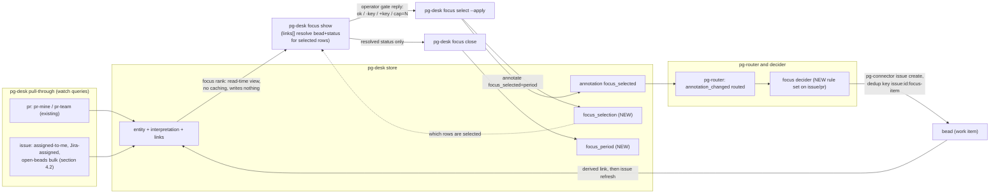

# Daily focus, store-first: phase 15 of the pg-desk/connector program

- **Date**: 2026-09-23 (revised 2026-10-06 against the landed entity change flow)
- **Status**: Draft — the ranking model, candidate set, epic slot rule and rank placement (section 6,
  D-F11) were ruled by the operator on 2026-10-05, and the minting path (D-F12 to D-F16) on
  2026-10-06; D-F17 to D-F21 are AGENT-PROPOSED from the 2026-10-07 five-dimension review
  (correctness, completeness, UX, observability, test coverage) and await operator confirmation;
  the rest of the document is pending operator review and is NOT approved
- **Bead**: `pg2-2j5ac.27` (this design's own tracking bead; phase 15's decompose-trigger is
  `blocked-by` it)
- **Depends on**: the entity change flow (`docs/superpowers/specs/2026-09-29-entity-change-flow-design.md`,
  ADR 0077) and its cutover release. This document targets the **post-cutover** world: pg-desk's
  `ledger` table, `sync.mode`, `internal/sync`, `pg-desk run` and heartbeat are removed by that
  cutover and MUST NOT be built on. The issue-entity pipeline that an earlier revision treated as an
  unlanded external prerequisite (`pg2-2j5ac.46`, closed) has landed (section 4.1).
- **Amends**: `phillipgreenii-nix-agent-support`'s
  `docs/superpowers/specs/2026-09-09-pg-desk-and-connector-discovery-design.md` (D19, D26, phase
  15's row in its phase table — "designed in its own document", checkpoint "defined by that
  document"; this is that document) and the private machine flake's
  `2026-09-02-daily-focus-v2-design.md` (decides what of v2 survives — answer: `df-attention`/
  `df-search`, untouched; everything else in v2's `df-survey`/`df-deferred`/`df-wire`/`df-pull`/
  `df-resolve-focus`/`df-find-pr-bead`/`df-split-blockers` family retires; the map is section 3's retirement map and the list is section 10). It also asks
  for one amendment to the entity change flow design and ADR 0077 (D-F14).

## 1. Purpose and scope

Phase 15 retires daily-focus's beads-as-primary-store architecture (v2, fully implemented and
live in the private machine flake today) in favor of the store-first pattern the rest of the
pg-desk/connector program already uses: everything surveyed lands uncapped in `pg-desk`'s SQLite
store; focus ranking is a compute-only, read-time view over `entity` rows; a decider mints beads
only where an agent actually needs one; "pulling more work" is selecting more from the store, not a
separate mechanism (D19, D26).

This document is scoped to daily-focus's own retirement (`df-survey`, `df-deferred`, `df-wire`,
`df-verify-wiring`, `df-pull`, `df-resolve-focus`, `df-find-pr-bead`, `df-split-blockers`,
`df-close-focus`, and the three command files that orchestrate them). It does not touch `df-attention`/`df-search`/`df-categorize`/`df-feedback`
(already retired into `pg-desk` in earlier phases per D10, or — for attention/search — deliberately
unrelated per the v2 doc's own §0 cross-reference) or any PR-side pg-desk behavior.

## 2. Decisions ledger

Operator rulings from the 2026-09-23 design session that produced this document, D-F11 from the
2026-10-05 ranking session (which supersedes D-F7), and D-F12 to D-F14 from the 2026-10-06 revision
session that reconciled this document with the landed entity change flow, D-F15 and D-F16 from the
review that followed it, and D-F17 to D-F21, proposed by the agent from the 2026-10-07 five-dimension
review and NOT yet ruled by the operator (each is marked, and each is the agent's recommendation, so
the operator can reverse it without unpicking anything else). D-F7 was made in the
operator's absence (a 10-minute `AskUserQuestion` timeout) on the session's best judgment, per
precedent already set twice earlier in the same session; it is superseded, kept for provenance.

| #     | Decision                                                                                                                                                                                                                                                                                                                                                                                                                                                                                                                                                                                                                                                                                                                                                                                                                                                                                                                                                                                                                                                                                                                                                                                                                                                                                               |
| ----- | ------------------------------------------------------------------------------------------------------------------------------------------------------------------------------------------------------------------------------------------------------------------------------------------------------------------------------------------------------------------------------------------------------------------------------------------------------------------------------------------------------------------------------------------------------------------------------------------------------------------------------------------------------------------------------------------------------------------------------------------------------------------------------------------------------------------------------------------------------------------------------------------------------------------------------------------------------------------------------------------------------------------------------------------------------------------------------------------------------------------------------------------------------------------------------------------------------------------------------------------------------------------------------------------------------ |
| D-F1  | Daily-focus's PR candidate gathering reuses pg-desk's existing `pr-mine`/`pr-team` watch queries unchanged. Issue-type candidates (Jira issues, epics, bd tasks) are persisted by the same pull-through that serves PRs: pg-desk lists each name in `watch.issue.queries` with `pg-connector issue list --fingerprints`, hydrates added or changed entities through `issue show`, and persists them (`docs/behavior/pg-desk/changes.md`; the generic issue-entity pipeline of closed bead `pg2-2j5ac.46`, landed). This document therefore adds NO new gather code; it adds three named queries to `watch.issue.queries` (section 4.2). An earlier revision of this document treated issue-entity gather as an unlanded external prerequisite; that framing is retired.                                                                                                                                                                                                                                                                                                                                                                                                                                                                                                                                |
| D-F2  | `pg-connector-pr-github`'s `mine` query stays scoped to the single repository the deployment configures (one repo), narrowing daily-focus's PR survey from v2's cross-repo author search. Recorded loss, same pattern as the design of record's D15. The repository itself is deployment configuration and is not named here.                                                                                                                                                                                                                                                                                                                                                                                                                                                                                                                                                                                                                                                                                                                                                                                                                                                                                                                                                                          |
| D-F3  | `df-deferred`'s description-marker-section mechanism retires entirely. "Deferred" is derived: candidates the store already holds that are not `focus_selection`-selected for the period. No description grammar, no lost-update hazard, no size cost.                                                                                                                                                                                                                                                                                                                                                                                                                                                                                                                                                                                                                                                                                                                                                                                                                                                                                                                                                                                                                                                  |
| D-F4  | The per-day "focus bead" (one bead with wired blocking deps) retires. "Today's focus" becomes a `pg-desk` view/query (`focus_selection`/`focus_period`, §5), generalizing to week/sprint via a `period_type` column rather than a new bead type per level (not built this phase — schema-ready only). Beads stay reserved for actual agent-workable signals (D8), never for human plan-tracking.                                                                                                                                                                                                                                                                                                                                                                                                                                                                                                                                                                                                                                                                                                                                                                                                                                                                                                       |
| D-F5  | Gate replies and pull selections reference candidates by their own `(entity_type, entity_id)` — the same key already exists for a PR/Jira/bead item — never a derived positional handle. `focus show`/`focus select`/`focus pull` always recompute live from current `entity`/`interpretation` rows; nothing is cached or frozen between a `show` and the `select --apply`/`pull` that follows it, so a priority or due-date change is never hidden from the operator.                                                                                                                                                                                                                                                                                                                                                                                                                                                                                                                                                                                                                                                                                                                                                                                                                                 |
| D-F6  | `focus_selection` and `focus_period` (§5) use an internal surrogate primary key (`id INTEGER PRIMARY KEY AUTOINCREMENT`) with a `UNIQUE` constraint carrying the natural key, diverging deliberately from every existing pg-desk table, which all use a composite natural-column primary key with no surrogate. `focus_selection` references `focus_period` by its surrogate `id` (a real foreign key, not a repeated `period_type`/`period_key` pair) and references `entity` by its own composite key (`repo, entity_type, entity_id`) — `entity` already is the table that establishes an `(entity_type, entity_id)` pair is valid, so `focus_selection` gets that validation from a real foreign key rather than untyped text columns.                                                                                                                                                                                                                                                                                                                                                                                                                                                                                                                                                             |
| D-F7  | **SUPERSEDED 2026-10-05 by D-F11 (candidate set and epic slot rule).** Original text, kept for provenance: epic candidacy narrows to "owned by me AND has an open/in_progress child" — the "OR a recently-closed child" half of today's rule is dropped as a recorded loss, because expressing it would need a per-epic follow-up query the static named-query model (§4) cannot do. **Made in the operator's absence.**                                                                                                                                                                                                                                                                                                                                                                                                                                                                                                                                                                                                                                                                                                                                                                                                                                                                               |
| D-F8  | **DONE** (bead `pg2-t9zzg`, closed). `schema.Issue` gained an `Owner` field (bd's `owner` key — the responsible human), distinct from `Assignee`, which carries bd's claim/actor identity, not ownership; and pg-desk's issue ownership classifier reads it through the configured self-owner identity. "Assigned or owned by the operator" (D-F11) therefore reuses `interpretation.ownership` for issues; nothing new is built for it here.                                                                                                                                                                                                                                                                                                                                                                                                                                                                                                                                                                                                                                                                                                                                                                                                                                                          |
| D-F9  | There is no separate `focus split` verb. `pg-desk focus show` resolves each already-selected row's associated bead and current status unconditionally, folded into its existing per-item output, from the entity's view: the linked work item appears in the view's `links[]` with its state, labels, metadata and assignee. The link exists because the minted bead's own metadata names the source entity (D-F13), which the generic source-entity extractor recognizes; no tracker call is made at `show` time. The watch queries MUST cover the minted beads (a watched bead is one some `watch.issue.queries` name lists; section 4.2), with one nuance recorded in section 4.2: a CLOSED focus bead leaves the open-beads query and reaches `links[]` only through the change flow's removal-confirmation read. `close.md`'s survey step becomes a `focus show` call, not a dedicated verb.                                                                                                                                                                                                                                                                                                                                                                                                      |
| D-F10 | `focus close`'s per-bead progress note is appended by `close.md` itself via `pg-connector issue comment` (→ `bd comment`), not by pg-desk and not via today's `bd update --append-notes` (→ bd's separate NOTES field), followed by `pg-desk issue refresh <bead>` so the store sees the write (change-flow S10: external writes go straight through pg-connector by the actor, then refresh). pg-desk MUST NOT execute tracker write verbs (G5). Comments are the better mechanism for this content: bd captures `created_at`/`author` on each comment natively, where NOTES is one unstructured, unbounded-growth text field the caller must manually date-tag (exactly what `df-close-focus.sh`'s `[daily-focus <date>] <progress>` prefix exists to work around). The `[daily-focus <date>]` tag's PURPOSE splits in two — recording that a bead was part of a day's focus (now redundant; `focus_selection` already durably and queryably records this) vs. carrying forward what actually happened for whoever reads the bead next (not redundant; pg-desk's store holds no narrative text). Only the first purpose retires.                                                                                                                                                                     |
| D-F11 | **Ranking model, ruled by the operator 2026-10-05** (focused ranking session; supersedes D-F7 and the v2 ranking ported unchanged). Candidate set: everything non-done ASSIGNED to the operator (authored or assigned PRs, assigned Jira issues, beads assigned to or owned by the operator), with no started/ownership filter that hides an item. Slot rule: an epic and its children never use more than one slot; a child takes the slot and the epic is listed only when it is incomplete with no open child. Started: bead in_progress, Jira In Progress category, any open assigned PR. Rank: strict lexicographic tiers, no weights: overdue first (started first, then most overdue), then started, then not started; inside the started and not-started tiers the keys are a due date inside the 7-day horizon, then unblocks, then priority, then age. Placement: the rank is a read-time pure computation inside pg-desk, recomputed on every `focus show/select/pull`; a router-triggered idempotent decider only mints beads for the selected items (this replaces the provisional 2026-10-02 answer that a decider computes the rank). The head-to-head evidence is in section 6.                                                                                                        |
| D-F12 | **Selection reaches the minting decider as an annotation (operator, 2026-10-06).** `focus select` and `focus pull` write the `focus_selection` row AND an annotation `focus_selected=<period_key>` on each selected entity (`pg-desk <type> annotate`, origin `pg-desk`). The annotation emits `annotation_changed`, which every decider already subscribes to, so no new change source and no change to the change-flow change-kind catalogue is needed. The table remains the period history and the foreign-key-guarded record; the annotation is the single carrier the decider reads. A struck selection sets the annotation to `none` (section 5).                                                                                                                                                                                                                                                                                                                                                                                                                                                                                                                                                                                                                                               |
| D-F13 | **A focus bead is one bead per source entity (operator, 2026-10-06).** The decider's work-item kind is `focus-item`, with dedup key `<entity_type>:<entity_id>:focus-item` and NO per-day suffix, consistent with D-F4 (no per-day bead). The change-flow same-context rule applies, with the context being the source entity: a closed focus bead is never recreated, a bead the decider itself withdrew on a strike is reopened on a reselect, and a bead a worker closed is left closed (section 8); a second bead is never minted. The bead's metadata carries neutral `source_type` and `source_id` fields naming the source entity, which a NEW generic source-entity metadata extractor turns into a link of a distinct, neutral relation (`source`) (change-flow S25: "derived whenever an entity's own data names the other"). The extractor carries no focus vocabulary, so it passes the G5 guard, and it MUST NOT reuse the `repo`+`pr_number` fields: the existing issue extractor reads only those and `parent`, and a reused `repo`+`pr_number` would yield a `work` link that the PR decider treats as that PR's own work item. A strike withdraws the bead and a reselect reopens a bead the decider withdrew (section 8). An epic needs no bead; its entity id already is a bead id. |
| D-F14 | **Amend the change-flow design and ADR 0077 (operator, 2026-10-06).** The change-flow design's decoration-versus-decision classification (section 2; its closing sentence reads "Cross-entity judgment that chooses an outcome (for example daily-focus ranking) is a decision, not a decoration"), together with S2 and G5, puts daily-focus ranking in a decider. The 2026-10-05 ruling (D-F11) places the rank in pg-desk as a read-time view. The amendment records: a rank that is a read-only, side-effect-free view over stored facts — it writes nothing and mints no work — MAY live in pg-desk; only MINTING work from a selection is a decision, and it lives in the decider (D-F12, D-F13). Without it, a change-flow conformance review would reject `internal/focus` in pg-desk. Recorded as ADR 0085, which extends ADR 0081's read-time rule (attention) to this rank, with a pointer in ADR 0077 and in the change-flow design's section 2; all three land in the same commit series as this document.                                                                                                                                                                                                                                                                                |
| D-F15 | **The selection is a reserved view member (operator, 2026-10-06, later in the review session).** The `focus_selected` annotation is surfaced to deciders as a dedicated `annotations.focus_selected` member of `show`'s composite view (and of pg-decider's view reader), beside `ready_to_land`; the decider namespace, documented as written by deciders, is not reused, and no generic other-keys map is added.                                                                                                                                                                                                                                                                                                                                                                                                                                                                                                                                                                                                                                                                                                                                                                                                                                                                                     |
| D-F16 | **A strike withdraws the focus bead (operator, 2026-10-06, later in the review session).** When an item is struck after its focus bead exists, the decider closes the bead if it is open and unclaimed, with the withdrawn marker, and, if a worker holds it, only records a once-only note (D-F19). A reselect reopens a bead the decider withdrew. This reverses the earlier draft's "the decider never closes on a strike".                                                                                                                                                                                                                                                                                                                                                                                                                                                                                                                                                                                                                                                                                                                                                                                                                                                                         |
| D-F17 | **PROPOSED (agent, 2026-10-07; not yet ruled): selection history is kept and explainable.** `focus_selection` rows are never deleted: a strike sets `status='struck'` and `struck_at`, and each row records `source` (`ranked`, `forced`, `handadded`, `pulled`), `rank_position`, `tier` and `cap` as of the selecting run (a record of what was shown, not a cache of the rank, so D-F5 still holds). The full flip history of one item is the change log of its `focus_selected` annotation. A new read-only verb, `pg-desk focus explain <key>` (section 7.5), answers "why was this ranked, selected, struck, minted or withdrawn" from the live rows, the way `attention explain` does for ADR 0081's view.                                                                                                                                                                                                                                                                                                                                                                                                                                                                                                                                                                                      |
| D-F18 | **PROPOSED (agent, 2026-10-07; not yet ruled): what counts as a strike.** An item is struck when it was `selected` in the period's rows and is absent from the new final set for ANY reason (an explicit `-key`, a shrunk `cap`, or it stopped being a candidate), not only on an explicit `-key`. Rows added by `pull` (`source='pulled'`) persist across later `select` runs unless explicitly struck, so an ordinary re-run of `create` cannot silently withdraw pulled work. The annotation holds the MOST RECENT period key in which the item was selected; it never means "selected today" (that is read from the table). A day rolling over withdraws nothing by itself: an item selected yesterday and not today keeps its bead and its annotation until it is struck, and `-key` on such an item writes `none` and withdraws as usual.                                                                                                                                                                                                                                                                                                                                                                                                                                                        |
| D-F19 | **PROPOSED (agent, 2026-10-07; not yet ruled): withdraw and reopen mechanics, and the S26 exception.** The decider's action vocabulary is closed (create, update, reopen, close, annotate) and a connector close carries only a reason, so the withdrawn marker is a SEPARATE action. Withdraw is `update` (`focus_withdrawn=true`) then `close` (the close `RequiresPrior` the update). Reopen is `reopen` then `update` (`focus_withdrawn=false`), so a later worker close is not mistaken for a withdrawal. A struck item whose bead is claimed (the view's state is `in_progress`, or its assignee is non-empty) gets one `update` that sets `focus_struck_noted=<period_key>`, whose audit comment is the notice; the marker makes a re-run write nothing (INV-DECIDER-8) and the reselect clears it. Reading `focus_withdrawn` makes behavior depend on how a bead was closed, which change-flow S26, INV-DECIDER-5 and the same-context text of `work-items.md` forbid. The decision records that the marker is the DECIDER'S OWN state, not a closer identity, and the one permitted exception; ADR 0085 and section 12 item (h) carry the amendment.                                                                                                                                          |
| D-F20 | **PROPOSED (agent, 2026-10-07; not yet ruled): the operator-facing verb contract.** `focus select` gains `--dry-run`, and every echoed row names its downstream bead consequence in a closed vocabulary (section 7.2 step 7). `focus show` prints a coverage header and a closed-vocabulary bead column, and every verb has `--json` (`pg-desk.focus/v1`) for the LLM command prose that consumes it (section 7.1). Exit codes follow pg-desk's scheme exactly: `1` usage or an old-schema store, `2` partial, `3` total failure, `6` period closed (section 7).                                                                                                                                                                                                                                                                                                                                                                                                                                                                                                                                                                                                                                                                                                                                       |
| D-F21 | **PROPOSED (agent, 2026-10-07; not yet ruled): observability is part of the design.** Every new component declares what it emits and logs (the telemetry-declaration convention of `docs/behavior/pg-desk/README.md`): section 8.2 specifies the verbs' structured stderr line, the `/metrics` families computed from the store at scrape time, a `doctor` focus block, the decider's rule id, and a rank-regression parity check.                                                                                                                                                                                                                                                                                                                                                                                                                                                                                                                                                                                                                                                                                                                                                                                                                                                                     |

## 3. Architecture overview



### Retirement map

| Component                   | Fate                                 | Replaced by                                                                        |
| --------------------------- | ------------------------------------ | ---------------------------------------------------------------------------------- |
| `df-survey` (shallow)       | Retires                              | Live read of `entity`/`interpretation` rows (§6)                                   |
| `df-survey` (gate-apply)    | Retires                              | `pg-desk focus select --apply` (§7.2)                                              |
| `df-survey` (deep)          | Retires                              | Not needed — `focus show`/`select` are always live, no separate deep pass          |
| `df-deferred`               | Retires                              | `focus_selection` absence = deferred (D-F3)                                        |
| `df-wire`                   | Retires (logic moves into a decider) | The focus decider's `focus-item` rule (§8, D-F12, D-F13)                           |
| `df-pull`                   | Retires                              | `pg-desk focus pull` (§7.3)                                                        |
| `df-resolve-focus`          | Retires                              | `pg-desk focus show`/existence check via `period_key`                              |
| `df-find-pr-bead`           | Retires                              | The entity's `links[]` plus the decider's dedup-key lookup (change-flow work-item) |
| `df-split-blockers`         | Retires                              | `pg-desk focus show`'s resolved bead+status for selected rows (§7.1, D-F9)         |
| `df-verify-wiring`          | Retires                              | Not needed — nothing is wired (§8)                                                 |
| `df-close-focus`            | Retires                              | `pg-desk focus close` (§7.4) plus `close.md`'s own per-bead comments (D-F10)       |
| `df-attention`, `df-search` | Unchanged                            | n/a — unrelated (pure `pg-connector` clients already)                              |

## 4. Gather

### 4.1 Issue entities are already gathered (landed prerequisite, `pg2-2j5ac.46`)

An earlier revision of this document found, by reading the code, that pg-desk gathered only PRs, and
therefore scoped issue-entity gather out to an external prerequisite design session,
`pg2-2j5ac.46`. That session has closed and its design has landed (the generic entity pipeline
design, `docs/superpowers/specs/2026-09-23-pg-desk-generic-entity-pipeline-design.md`): gather,
interpret and persist take an entity-type registry covering `pr` and `issue`, issue ownership is
classified against a configured self-owner identity, and the entity change flow's pull-through
(`pg-desk <type> changes`) is the single path that discovers, hydrates and persists watched
entities of every type (`docs/behavior/pg-desk/changes.md`). This document therefore builds on that
pipeline and specifies no gather code of its own.

Two cautions carry over:

- The old `pg-desk run`/`sync` paths are removed by the change-flow cutover release but still
  present in code until it ships. This document targets the post-cutover world and MUST NOT call
  or extend them.
- Persisted entities are never deleted; a closed or unwatched entity stays as an inactive row.
  Every candidate query in section 6 MUST therefore filter on `entity.active`.

### 4.2 Watch queries

pg-router already runs one `desk-<type>-changes` query per watched type (change-flow S22); what a
type watches is pg-desk configuration: `watch.issue.queries` is a list of named `pg-connector issue
list` queries, each listed with `--fingerprints` and hydrated when added or changed. Daily-focus
adds no pg-router feed, no feed schedule and no `issue.changed` routing of its own. The deployment's
`watch.issue.queries` MUST include three named queries (the names here are illustrative; the real
names are deployment configuration):

- **An assigned-to-me Jira query**: Jira issues assigned to the operator (today's `issue-jira-mine`
  query). Together with the bead query below it realizes D-F11's candidate set for issues.
- **An assigned-or-owned bead query**: beads whose assignee or owner is the operator (the owner
  field exists, D-F8).
- **An open-beads bulk query**: every `open`/`in_progress` bead, with no type filter. Its purpose
  is narrower than the first two: landing every child issue's `parent` field, and every epic itself,
  in the store so the focus-rank step (§6) can answer "does this epic have an open child" with a
  pure in-store join, no per-epic query. It is the same "one bulk bead query, deduped by id" trick
  `df-survey` uses today, running continuously.

PR candidate gathering (`pr-mine`/`pr-team`) needs no change — D-F1. Volume is bounded by the
mechanism rather than guessed at: a poll diffs list fingerprints and hydrates only added or changed
entities, capped by `hydration.max_per_poll` (default 50), with the age sweep re-hydrating the rest
in rolling batches (`docs/behavior/pg-desk/changes.md`; change-flow 8.4, 8.5). `doctor` reports
when the sweep falls behind.

**Beads minted by the focus decider MUST be covered by a watch query** (the open-beads bulk query
does), because the entity's link to its minted bead is resolved from that bead's own entity row
(D-F9, D-F13). A focus bead that closes (a worker finished it, or the decider withdrew it) leaves
the open-beads query, so its entity row is no longer refreshed by a poll; its final state reaches
the source entity's `links[]` through the removal-confirmation read described in
`docs/behavior/pg-desk/changes.md`, and the decider's own `pg-desk issue refresh <bead>` after a
close or reopen (section 8) keeps it current without waiting for that read. A bead that was minted
and closed by a worker between two polls was never in a persisted listing, so no removal-confirmation
read happens for it; its link stays `open` until the remote age sweep (`sweep.max_age`) re-hydrates
the bead, and that is the bound on this staleness. Because the withdraw-versus-worker-closed
distinction (section 8) reads that state, the decider treats a link it cannot confirm as closed
conservatively: it never reopens on stale evidence.

**Coverage and freshness are persisted, because `show` is store-only.** `focus show` reads no
tracker, so "a category failed or was truncated" cannot be discovered at read time. The pull-through
therefore persists, per watched query, the last listing status (`ok`, `degraded` or `failed`, with its
reason) in `meta` beside the change flow's `change_flow.watchset.*` counters, and `focus show` reads
it (section 7.1's coverage header). The per-source freshness recorder of today (`pg-desk heartbeat`
writing `meta.source_fetch.*`, read by `pg-desk freshness`) is removed by the change-flow cutover and
the change-flow design does not say what replaces it. That is a cross-document gap this design does
not close (section 12): until it is closed, the focus staleness signals are each entity's
`hydrated_at` and the persisted listing status.

## 5. Store schema

New tables, alongside pg-desk's `entity`/`interpretation`/`xref`/`annotation` (the change flow's v2
schema adds `version`, `hydrated_at`, `active` and `list_fp` to `entity`, and drops `ledger`; none of
that touches the foreign-key target below, because `entity`'s primary key `(repo, entity_type,
entity_id)` is unchanged):

```sql
CREATE TABLE focus_period (
    id            INTEGER PRIMARY KEY AUTOINCREMENT,
    period_type   TEXT NOT NULL,      -- 'day' this phase; schema allows 'week'/'sprint' later
    period_key    TEXT NOT NULL,      -- e.g. '2026-09-23' for period_type='day'
    closed_at     TEXT,
    close_note    TEXT,
    UNIQUE (period_type, period_key)
);

CREATE TABLE focus_selection (
    id              INTEGER PRIMARY KEY AUTOINCREMENT,
    focus_period_id INTEGER NOT NULL,
    repo            TEXT NOT NULL,    -- same repo constant pg-desk already uses for every
                                       -- entity it gathers (§8's "single configured repo" in
                                       -- the parent design), not a per-issue attribute
    entity_type     TEXT NOT NULL,    -- 'pr' | 'issue' (Jira or bd; disambiguated by entity_id shape)
    entity_id       TEXT NOT NULL,
    selected_at     TEXT NOT NULL,
    status          TEXT NOT NULL DEFAULT 'selected',  -- 'selected' | 'struck' (D-F17, D-F18)
    struck_at       TEXT,
    source          TEXT NOT NULL,    -- 'ranked' | 'forced' | 'handadded' | 'pulled'
    rank_position   INTEGER,          -- as shown to the operator by the selecting run
    tier            TEXT,             -- 'overdue' | 'started' | 'not_started' as of that run
    cap             INTEGER,          -- the cap in force for that run
    UNIQUE (focus_period_id, repo, entity_type, entity_id),
    FOREIGN KEY (focus_period_id) REFERENCES focus_period (id),
    FOREIGN KEY (repo, entity_type, entity_id) REFERENCES entity (repo, entity_type, entity_id)
);
```

Both tables use an internal surrogate primary key with the natural key expressed as a `UNIQUE`
constraint (D-F6) — a deliberate divergence from every other pg-desk table, called out here so a
later reader does not mistake it for drift. `focus_selection` references `focus_period` by its
surrogate id rather than repeating `period_type`/`period_key`, and — per the operator's own
question during design, "do we have a table which would ensure `entity_type`/`entity_id` is
valid" — it also carries a real foreign key into pg-desk's existing `entity` table, so a
selection can never name an entity pg-desk never actually gathered. Both foreign keys are
genuinely enforced: pg-desk's store already opens every connection with `_pragma=foreign_keys(ON)`
(`internal/store/store.go`), so this isn't a documentation-only intent.

The extra columns (D-F17) record what was SHOWN when the row was written, so a later `focus explain`
can say why an item was selected; they are history, never an input to a later rank (D-F5). A strike
keeps the row (`status='struck'`, `struck_at` set) and a reselect flips it back to `selected`; the
flip-by-flip history is the change log of the item's `focus_selected` annotation. Every query that
means "selected" MUST filter on `status = 'selected'`.

Consequence: `focus_period` is no longer written only by `focus close` (§7.4). Every verb that
writes a selection (`focus select --apply`, `focus pull`) must first get-or-create the
`focus_period` row for `(period_type, period_key)` — `closed_at`/`close_note` left `NULL` on
creation — so it has an `id` to insert `focus_selection` rows against. `focus close` becomes the
verb that sets `closed_at`/`close_note` on a row that, in practice, already exists by the time a
day is closed.

**Where the tables are created.** Schema changes go through pg-desk's migration ladder or the
change-flow cutover block, never an ad-hoc `CREATE TABLE`. Because nothing of this design is in
production yet, the two tables join the change flow's v2 cutover block (one transaction, one
operator window). If the cutover ships first, they become a version-3 migration step instead; the
phase 15 decomposition decides which at that time.

**The selection annotation (D-F12).** In addition to its rows, every selection writes
`focus_selected=<period_key>` on the selected entity (`pg-desk <type> annotate`, origin
`pg-desk`). The key is a reserved annotation, like `ready_to_land` (operator ruling, 2026-10-06:
a dedicated member, not the `decider` namespace, which is documented as written BY deciders). The
view's `annotations` set is closed today (`docs/behavior/pg-desk/show.md`; pg-decider's
`internal/view` `Annotations`), so a stored annotation is never visible to a decider unless the view
contract names it: the decomposition MUST add `annotations.focus_selected` to `show`'s composite view
(the stored value, or `null` when unset) and to pg-decider's view reader (section 12 item (g)). That
is what a decider reads from the entity's view; the two writes happen in `focus select`/`focus pull`'s single flow, the
table first, and a re-run is idempotent (a row that exists and an annotation that already holds the
value are left alone: the verb reads the current value first, so a re-run appends no redundant
change record), so a failure between them is repaired by re-running. The table writes of one verb
run in a single store transaction, and the per-entity annotation read-then-write holds pg-desk's
existing per-entity lock, so two concurrent `select`/`pull` runs (two operators, or an operator and an
agent) serialize per entity and last writer wins; the later run's echo shows what it found. The value
means "the most recent period in which this item was selected" (D-F18), never "selected today".
A struck selection sets `focus_selected=none`, because `annotate` today has no generic removal form (only paired verbs for
specific keys, such as `suppress`/`unsuppress`); a generic removal form on `annotate` is the
cleaner mechanism and is a small pg-desk item for the phase 15 decomposition to size, with the
decider treating `none` and an absent key identically until it exists.

The owner field this design needs on issues already exists (D-F8); nothing is added to
`schema.Issue` here.

## 6. Interpret: the focus-rank step

Unlike every other pg-desk interpret step (ownership, enrichment, urgency, category — each a pure
function of ONE entity's own gathered facts), focus-rank is a **sweep**: it operates over the
whole candidate set at once, computed fresh on every read (`show`/`select`/`pull`), never cached.
It reads `entity` rows exactly the way every other interpret step does — this step itself is pure
computation over facts, unchanged in kind from the rest of pg-desk's interpret layer. It reads
issue-type `entity` rows that the change flow's pull-through already persists (§4.1), and only
rows with `active = 1`.

**Placement (ruled 2026-10-05, D-F11; amended into the change flow, D-F14).** The rank is a
read-time, side-effect-free computation inside pg-desk. The router-triggered idempotent decider does
NOT compute it; the decider only mints beads for the items the operator actually selects (D-F12,
D-F13). This replaces the provisional 2026-10-02 answer that a focus decider computes the rank: the
rank depends on time (overdue, the 7-day horizon) and on cross-entity facts (the epic slot rule),
and a rank written on an entity change goes stale for both, the same reason the attention evaluator
is read-time (pg2-m482k, 2026-10-05). The change flow's decoration-versus-decision rule names
daily-focus ranking as a decision; D-F14 amends it so that a read-only rank view that writes nothing
and mints no work lives in pg-desk, while minting stays in the decider.

**Candidate set** (D-F11): every non-done item ASSIGNED to the operator, with no "started" or
ownership filter that hides an assigned item:

- PRs the operator authored or was assigned (surfaced by `pr-mine` or `pr-team`),
- Jira issues assigned to the operator (surfaced by the assigned-to-me Jira watch query, §4.2), and
- beads whose assignee or owner resolves to the configured operator identity (D-F8:
  `interpretation.ownership` for issues, which already reads both).

Two exclusions, both applied before the slot rule: an entity whose own metadata carries `source_id`
is NEVER a candidate (it is a minted focus bead; without this rule a bead assigned or owned by the
operator would take a second slot for the same work, and could be selected so the decider would mint
a bead for a bead), and an entity hidden through `pg-desk <type> hide` is not a candidate (operator
ruling 2026-10-07: a hidden entity is ignored for decisions and logic, though it keeps being updated,
until it goes away or is unhidden; a `wip`-marked entity stays a candidate).

**Slot rule** (D-F11): an epic and its children MUST NOT consume more than one slot between them.
A child item takes the slot; the epic is NOT listed separately while it has any open child. An epic
that is incomplete and has NO open child work is a candidate in its own right, because the operator
must move it along (create children, split it, and so on). The rule is applied BEFORE the cap line
is counted. The old D-F7 narrowing ("has an open child") is superseded; the closed-child signal is
no longer needed, so the sketched `pg-connector-issue-beads` capability is not required.

Reading of the slot rule, confirmed by the operator 2026-10-07 and pinned by the tests: working on a
child implies working on its epic, so the epic does not need a slot. "Child" means a DIRECT child
(the child's `parent` field names the epic), and an inactive entity (`active = 0`) is not an open
child. Each open child assigned to the operator is its own candidate, so the operator can focus on two
or three children of one epic and each takes its own slot; the epic is not in the ranked slots while
it has any open child (an open child owned by someone else counts). Such an epic is shown instead in a
trailing block below the cap line, "epics with children in play", unranked and not counted against
`cap`, each with an indicator of how many of its open children are in the plan (a join over the same
`parent` field the slot rule already reads; if it proves non-trivial the decomposition drops the
indicator and keeps the block, and if the block itself is non-trivial it drops both). An epic with NO
open child is a candidate in its own right and ranks normally, because it needs the operator to
review it: close it, or create the children that finish it. A child that is not in the store yet
(hydration is capped, §4.2) is unknown, not absent: `focus show`'s coverage header (§7.1) says so, and
the epic is then listed as it would be with no child.

**Started** (D-F11): a bead with state `in_progress`; a Jira issue in the In Progress status
category; any open PR assigned to the operator, whether authored or review-assigned. Consequence to
keep visible: every open assigned PR is started, so PRs rank above non-overdue unstarted beads and
Jira issues.

**Rank** (D-F11): strict lexicographic tiers, no weights, no arithmetic. The tiers, in order:

1. **Overdue** (due date before `--date`). Within it: started items first, then the most overdue,
   then unblocks (descending), then priority, then age.
2. **Started** (not overdue).
3. **Not started** (not overdue).

Inside tiers 2 and 3 the keys, in order, are:

1. Due date within a **7-day horizon from `--date`**: a nearer date sorts ahead of a farther one,
   and any date inside the horizon sorts ahead of none. A due date outside the horizon is
   deliberately equivalent to no due date for this key. Source: Jira `duedate` or bd's due date;
   correlated items inherit the earliest across the group, where a correlation group is the set of
   entities joined by derived `work` links (a PR and the bead that names it). Parsing: a date-only
   value is a calendar day and a timestamp is converted to the operator's configured time zone and
   then truncated to its day; "overdue" and "inside the horizon" compare calendar days against
   `--date`, which defaults to today in that zone (the day of an injected clock, so a test controls
   it); an unparseable value counts as no due date and is never an error.
2. Unblocks (descending): the count of open items this one blocks. For PRs it is the number of
   open dependents the dependency resolver reports for the PR (`dependency.Resolver.DependentsOf`;
   stack and external edges, the latter recorded with `pg-desk pr link add ... --relation
depends_on`). For beads and Jira issues it needs issue-dependency hydration (`SetReadIssueDeps`
   in pg-desk's issue gatherer), which exists in code but is not switched on in production and has
   no configuration key yet; until it is, the unblocks key is `0` for issues. Turning it on is a
   small item the phase 15 decomposition MUST schedule ahead of the rank's acceptance test.
3. Priority: bead P0-P4 directly, Jira priority via the same data-driven mapping table (unmapped
   values, including `Needs Priority`, sort after P4). **A PR with no priority of its own inherits
   the highest priority among its correlated items, else P2** (v2 doc section 4.4); this
   inheritance rule is part of the port, not an incidental detail.
4. Age (descending), then kind+key tiebreak. The age key needs a stable creation time and
   `schema.Issue` carries none (only an update time, which would reorder an item every time it is
   touched, against D-F5): the decomposition MUST name a stable source (the tracker's creation time
   where the snapshot carries it, else the entity's first-seen time in the store) or drop the key, in
   which case the kind+key tiebreak follows priority. The final tiebreak makes the order total, so the
   same inputs always rank identically.

Evidence (the operator's head-to-head rulings, 2026-10-05; each pair decided the key order above):

| Pair (first listed wins)                                                | Fixes                                    |
| ----------------------------------------------------------------------- | ---------------------------------------- |
| started P2 over unstarted P1, same deadline                             | started outranks priority                |
| started, blocks nothing over unstarted unblocker                        | started outranks unblocking              |
| started P1 with no deadline over unstarted P3 due tomorrow              | started outranks a non-overdue deadline  |
| overdue unstarted P1 over started P3 with no deadline                   | overdue outranks started                 |
| unstarted P3 due in 3 days over unstarted P1 with no deadline           | deadline outranks priority               |
| started P3 due tomorrow over started P1 with no deadline                | deadline outranks priority, when started |
| unstarted P2 unblocking 3 over unstarted P1 blocking none               | unblocking outranks priority             |
| unstarted, due in 3 days over unstarted, no deadline, unblocks 3 others | deadline outranks unblocking             |

**Cap line**: after the slot rule, the first `cap` (default 6, `--cap N` override) ranked items are
`in_plan: true` for _display_ only. Nothing is written by the rank computation itself (there is no
`focus rank` verb; `show`, `select`, `pull` and `explain` all call it); `focus_selection` is written
only by `select`/`pull` (section 7).

## 7. The `focus` verb family

All five verbs (`show`, `select`, `pull`, `close`, `explain`) take `--period day` (the only
implemented value this phase; `week`/`sprint` are schema-ready, not wired, and any other value is a
usage error) and operate on `period_key` = a date, defaulting to today in the operator's configured
time zone (§6). Each also takes `--json` (D-F20): one object, `schemaVersion` `1`, with the same
members the text shows, so the command prose that consumes it parses a contract rather than a table.

**Exit codes.** The `focus` verbs use pg-desk's established scheme (change flow 9.12) with its
established meanings, so a caller scripting `pg-desk` and `pg-connector` together needs no special
case: `0` ok; `1` usage error, a malformed reply or stdin, or a store that is not migrated for the
focus tables (the problem named, nothing applied, matching every other typed verb); `2` partial;
`3` total failure; and a new `6` for "period closed" (unused elsewhere in pg-desk). An earlier
revision put usage errors on `3` "so each number has exactly one meaning"; that was wrong, because `3`
already means total failure in `changes` and `refresh`, and it is withdrawn. Routine skips (a named
item already selected, or no longer a candidate) are reported on stderr and are NOT a partial: they
exit `0`. The per-verb descriptions below use this scheme.

### 7.1 `pg-desk focus show [--date YYYY-MM-DD] [--cap N] [--all] [--json]`

Computes the candidate set and rank fresh (§6), cross-references existing `focus_selection` rows
for the period so already-selected items display as selected, and prints the ranked table.
By default the table shows the in-plan rows plus the next ten; `--all` prints every candidate (the
candidate set is uncapped, D-F11). Below the cap line, an "epics with children in play" block lists
each epic that has an open child, unranked, with how many of its children are in the plan (§6). A
`digest:` line identifies the table as shown, for `select --expect` (§7.2). Each row carries its tier, the key that decided its position
against its neighbor, due date, priority, a `(stale)` mark when its stored snapshot is flagged stale,
and its bead state (below). A header names the scope (the configured repository) so a narrowing
such as D-F2's is visible rather than silent, and prints a **coverage line per watched type**: the
active count, the count still due or never hydrated (the shared `changes.ActiveCount` and
`changes.DueBacklog` helpers), the age of the oldest `hydrated_at`, and the persisted listing status
of each watch query (§4.2). Exit `0` coverage complete; `2` coverage incomplete (a hydration backlog,
a degraded or failed listing, or a stale source — shown and never silently omitted); `3` total
failure, no candidates computable; `1` an unmigrated store.

**The bead column is a closed vocabulary** (D-F20), so "pending" never hides a reason:
`pending` (the decider has not run), `pending (hidden)` and `pending (suppressed)` (the source is
hidden or suppressed, so the decider will not mint, §8), `plan-mode` (the decider role is configured
as `plan`; nothing is minted yet), `open`, `claimed`, `in_progress`, `closed (done)` (a worker
closed it), `withdrawn` (the decider withdrew it), `escalated` (the decider's `human` escalation
sibling exists, INV-DECIDER-18), `unwatched` (§7.2) and `n/a (epic or bead)` (no bead is minted, §8.1).

This is also the mitigation for losing "browse today's plan via plain `bd show`" (there is no
more focus bead to `bd show`, D-F4): `focus show` with no pending gate reply is exactly that
browse — and, longer-term, pg-desk's existing `serve` dashboard (parent design §7.7) is the
natural place to surface `focus_selection` alongside the PR panels it already renders, though
that wiring is not designed here.

**Resolved status for already-selected rows (D-F9, replaces `df-split-blockers`/`focus split`).**
For every row already in `focus_selection` for the period, `show` additionally resolves it to a
bead and reports that bead's current status, unconditionally — no separate verb, no flag, and no
tracker call at `show` time: the entity's view carries `links[]`, and the minted bead is one of
them because its own metadata names the source entity (D-F13, a derived link). The linked item's
state, labels, metadata and assignee are part of the link, and an epic's status is already in its
own `entity` row (the entity id already is the bead id). This holds only for beads some watch query
covers (§4.2). `close.md`'s survey step (today's `df-split-blockers`) becomes a plain `focus show`
call, grouping the resolved rows into whatever buckets it needs (its own per-item "real progress"
judgment, §9, already operates at a finer grain than closed/carried-over anyway). A selected item
whose bead has not been minted yet is shown as selected with the matching state of the bead column
above, never a bare "pending". A struck row (`status='struck'`) leaves the selected table but is
still resolved and shown in a separate "struck today" block, with its bead's outcome (`withdrawn`,
or `claimed, left open with a note`), so the operator can see what a strike did.

### 7.2 `pg-desk focus select --date YYYY-MM-DD --apply [--dry-run] [--merge <keepKey>=<absorbedKey>,...]` (reply on stdin)

1. Recompute the candidate table live (identical to `show`) and **print it** — this is what the
   reply gets applied against, always current, never more than one round trip stale (D-F5). `show`
   prints a short digest of the ranked key order and cap line, and `select` accepts an OPTIONAL
   `--expect <digest>`: when given, it aborts with a distinct exit code (chosen by the decomposition
   from the codes pg-desk does not use) if the table changed since it was shown (an
   optimistic-concurrency check). It is never required: without it, `select` applies the reply to
   whatever the table now is, which is the live-recompute behavior D-F5 chose (operator, 2026-10-07).
   The
   reply is applied against THIS table, which can differ from the `show` table the operator read (a
   poll landed, or a due date crossed midnight); the echo (step 7) is what makes any such difference
   visible.
2. Parse the reply: `ok`/empty (accept as shown), `-<key>` (strike: the row stays and becomes
   `status='struck'`, D-F17), `+<key>` (force-pull an existing candidate, or — if `<key>` matches no
   candidate — attempt a hand-add), `cap=N` (re-cap). A key is written in any form `pg-desk`'s typed
   verbs already resolve (a bare PR number, a URL, `OWNER/REPO#N`, a tracker key) and the echo prints
   the canonical key. **Hand-add hydration is a separate, reported pre-step, not part of the atomic
   parse:** a key the store has never gathered has no `entity` row for the foreign key, so pg-desk
   first hydrates it with `pg-desk <type> refresh` (a read of the tracker, which does write the store's
   own `entity` row and its change record), and the echo says which keys were hydrated. If that fails
   the hand-add is a usage error and, because hydration already wrote store rows, the verb says so; the
   atomicity claim below is about SELECTION state only. A hand-added entity outside every watch query
   stays selected but is not refreshed by polls, so its bead state goes stale: `show` marks it
   "unwatched" (D-F9's resolved status is unavailable for it) and `doctor` lists it (§8.2).
   **Parsing is atomic and happens entirely before any application of selection state**, matching
   v2's own gate-apply pipeline (v2 doc §4.6: "parse ALL tokens ... NOTHING applied" on any problem):
   a conflicting pair for one key (`-X +X`), an unrecognized token, or a hand-add that resolves to a
   nonexistent or closed id are ALL usage errors — exit `1` naming the problem, no selection state
   changed, the caller re-prompts. There is no partial-application case at the reply-parsing stage.
3. Separately, `--merge <keepKey>=<absorbedKey>` (repeatable, comma-separated) is an LLM-supplied
   flag, not part of the operator's typed reply — this is v2's residual-fuzzy-correlation judgment
   (v2 doc §5 step 4, §9.1): two candidates the mechanical v2 doc §4.3 correlation missed but that
   represent the same real work. `absorbedKey` is dropped from consideration entirely (as if
   struck) and never gets its own `focus_selection` row or annotation. Instead `select` records an
   EXTERNAL link between the two entities (`pg-desk <type> link add` with its default relation
   `references`, change-flow S25 — external
   links are for exactly what no entity's own data names), so the absorbed item stays visible as
   related work under the kept item and no bead is minted for it.
4. Recompute `in_plan` from scratch: non-struck, non-absorbed items ranked, top `cap` in-plan;
   force-pulled/hand-added items in-plan additionally (each raises the effective cap by one,
   matching the v2 doc's own rule). Rows earlier added by `pull` and not struck stay in the set
   (D-F18).
5. Reconcile `focus_selection` for this period to the final set (D-F17, D-F18): every item in the
   final set is `selected` (inserted, or flipped back from `struck`, with `source`, `rank_position`,
   `tier` and `cap` recorded); every row that was `selected` and is absent from the final set, for any
   reason, becomes `struck` with `struck_at`. Nothing is deleted. Get-or-create the `focus_period` row
   first if absent (§5). Then write the `focus_selected=<period_key>` annotation on every selected
   entity, and `focus_selected=none` on every struck one (D-F12, §5). A `-key` on an item selected in
   an EARLIER period (annotation present, no row this period) also writes `none`, so a strike always
   withdraws.
6. **Nothing is minted here.** `select` writes selection state only. The annotation is what a
   router-triggered focus decider reacts to (§8); `select` does not wait for it, and a bead appears
   after the decider's next run. This is the G5 boundary: pg-desk MUST NOT contain the `focus-item`
   work kind or dedup-key logic, or execute a tracker write verb.
7. Print the echo table, naming the resolved entity for every applied token explicitly (e.g.
   `-OWNER/REPO#123 → struck`), so a token that resolved to something other than intended is visible
   immediately rather than silently wrong, and naming each row's DOWNSTREAM consequence, read from
   the store's `links[]`, in a closed vocabulary: `will mint`, `bead open, no change`,
   `will withdraw (unclaimed)`, `claimed by <actor>, note only`, `worker-closed, not reopened`,
   `withdrawn, will reopen`, `no bead (epic or bead)`. A strike therefore shows that it will close a
   bead before the operator walks away.

`--dry-run` runs steps 1 to 4 and prints what step 5 and the annotation writes would do, with the
echo of step 7, writing nothing: no row, no annotation, no `focus_period` (the same discipline as
`pull` and `close`). A strike now closes beads (D-F16), which is as hard to undo as a selection that
mints one, so the preview is owed here too. The hand-add hydration pre-step is skipped under
`--dry-run` and the key reported as "would hydrate".

Exit `0` applied; `1` a usage error (a parse-stage problem — no selection state changed, per step
2); `6` the period is closed; `3` a `focus_selection` write that failed outright; `2` partial —
`focus_selection` committed (step 5's rows) but the annotation write failed for some, not all, of the
entities; the echo names which. Re-running `select` is NOT a pure repair, because it recomputes the
rank and reads a new reply; the repair is `pg-desk focus select --repair`, which re-writes any missing
or mismatched `focus_selected` annotation for the period's rows from the table and reads no reply.

**Dependency note**: this verb family depends on the entity change flow and its cutover release
(§4.1), and its minting half depends on the focus decider (§8). The 2026-09-23 note that
reconciled the tracking bead's "depends on phase 11 (`sync.mode: apply`)" against the parent
design's phase 13 is moot: `sync.mode` is removed by the change flow, and the plan/apply gate for
minting is the decider's own (`pg-decider plan|apply`). Whoever decomposes phase 15 sets its
real ordering against the cutover and the decider rather than either old phase number.

**UX cost, named rather than left implicit**: typing a full `OWNER/REPO#NUMBER` or Jira/bd key in
a reply is more keystrokes than v2's short `p3`/`j5`/`e2` handles. §13 records why the handle
mechanism was rejected (it required freezing exactly the data the operator wants live); this is
the real, day-to-day price of that trade, not a cost-free simplification.

### 7.3 `pg-desk focus pull [--date YYYY-MM-DD] [k | key...] [--dry-run]`

Same live-recompute-then-print discipline as `select`, but strictly additive: no strike, no
re-cap, no recompute-from-scratch. Bare invocation previews (recompute, print, change nothing —
also "what's left today?"). A count `k` selects the top-`k` not-yet-selected candidates by current
rank; named keys select those specifically (already selected, or no longer a candidate — e.g.
merged/closed since — reported and skipped). Selected items union into `focus_selection` (get-or-
create the `focus_period` row first, same as `select`) and receive the same `focus_selected`
annotation (D-F12), which the focus decider acts on. No re-survey, no cap — "pull more" is
deliberately uncapped, same as today.

Exit `0` done, including "nothing left to pull" and named items that were already selected or are no
longer candidates (each reported on stderr, a routine skip and not a partial); `1` usage; `3` a store
write failure, or nothing named resolves (a total failure of the request); `2` partial (some
annotation writes failed, as for `select`); `6` the period is closed (`focus_period` has `closed_at`
set) — terminal, matching today's df-pull's "pulling into a closed day is always wrong." Pulled rows
carry `source='pulled'` and persist across later `select` runs (D-F18).

`--dry-run` runs the same resolution and reports exactly what would be selected and annotated,
writing nothing to `focus_selection` or the annotation table, **and skipping the `focus_period`
get-or-create too** — a `--dry-run` call must not leave behind even an empty `focus_period` row as
a side effect of what's supposed to be a no-op preview. Worth having natively (not left to the
caller simply not invoking the verb) because a selection leads to a minted bead, a real, visible,
not-cheaply-undone action.

### 7.4 `pg-desk focus close --date YYYY-MM-DD [--dry-run]` (day summary on stdin)

Writes `closed_at`/`close_note` onto the `focus_period` row (creating it if absent) — the
`close_note` is where today's day-summary-onto-the-focus-bead text goes, since there is no more
focus bead to carry it. `focus close` reads **one JSON object on stdin**: `{"summary": "<day summary
text>"}`. The summary is free-form text that can contain quotes and newlines — the same reason
`select --apply`'s reply is read from stdin rather than argv (v2 doc §4.6). `summary` becomes
`close_note`.

**Per-bead progress notes are NOT written by pg-desk** (D-F10, G5: pg-desk MUST NOT execute tracker
write verbs, and pg-desk's own composition rule limits what it may exec). This does not drop
`df-close-focus`'s real, currently-used behavior of carrying context onto individual beads across
sessions: `close.md` (LLM command prose) appends each progress note itself with `pg-connector issue
comment`, one per resolved bead from `focus show`'s output (D-F9), then runs `pg-desk issue refresh
<bead>` so the store sees the write, and only then calls `focus close`. It fails fast on the first
append failure, same as today's script (no rollback of notes already appended), and does not call
`focus close` if any note failed.

`--dry-run` reports the resolved `close_note`, writing nothing and — same as `pull`'s `--dry-run`
above — not creating a `focus_period` row if one doesn't already exist.

Exit `0` closed; `1` usage (malformed stdin); `3` a store write failure; `6` already closed
(idempotent no-op, reported).

### 7.5 `pg-desk focus explain <key> [--date YYYY-MM-DD] [--json]` (D-F17)

A pure read: it writes nothing, creates no `focus_period` row, and is safe to run at any time. For
one entity it prints, from the live rows: whether it is a candidate and, if not, why (inactive,
hidden, excluded as a minted bead, not assigned to the operator); its tier and the key that decided
its position against each neighbor (overdue, started, due-in-horizon, unblocks, priority, age); the
epic-slot reason when it was suppressed or listed; its position relative to the cap line; its
`focus_selection` row (`status`, `source`, `rank_position`, `tier`, `cap`, `selected_at`,
`struck_at`); its `focus_selected` annotation; and its bead's state with the decider's last outcome
for the rule (`minted`, `withdrawn`, `reopened`, or the closed skip reason). It is the answer to
"why was X not in my plan" and "why did a bead appear", the way `attention explain` is for ADR 0081's
view, and it covers the change flow's debugging stories for the focus path.

## 8. Minting: the focus decider

There is no sync pass, and nothing mints from `select` or `pull`. What replaces `df-wire` is a
decider rule (change-flow section 7, G5), registered in `pg-decider` and routed by pg-router:

- **Trigger.** `focus select`/`pull` write `focus_selected=<period_key>` on the selected entity
  (D-F12). The annotation emits `annotation_changed`, which every decider subscribes to, so the
  decider runs on the next routed item for that entity. The routed kind is a hint only: the decider
  re-derives everything from the entity's current view (G6), so duplicates and reordering are
  harmless.
- **Rule.** The rule runs under two entity types, `issue` and `pr` (the entity's own type decides
  the source), and for a `pr` entity it runs inside the PR decider's hidden and suppressed
  precedence: a hidden or suppressed PR gets no focus bead. For an entity whose view shows
  `annotations.focus_selected` set to a real period key, and which has no linked `focus-item` bead,
  create one through `pg-connector issue create` with dedup key `<entity_type>:<entity_id>:focus-item`
  (D-F13), the bead shape of section 8.1, and metadata naming the source entity. No bead is minted
  for an entity whose id already is a bead id (an epic or a plain bd task, section 8.1), and none for
  a source that is terminal (a merged or closed PR, a done issue): the PR decider's own rules treat a
  merged or closed PR as dead, and the focus rule follows them.
  - **Strike withdraws (operator, 2026-10-06; mechanics D-F19).** If the view shows `none` or an
    absent key and a `focus-item` bead exists, the decider withdraws it. "Claimed" means the bead's
    state is `in_progress` or its assignee is non-empty; every other open state (`open`, `blocked`,
    `deferred`) with an empty assignee is "unclaimed". An unclaimed open bead gets two ordered
    actions: an `update` setting `focus_withdrawn=true`, then a `close` whose reason names the strike
    (the close `RequiresPrior` the update, so a failed update leaves the bead open and unmarked, and
    the next run retries). A claimed bead is left alone and gets ONE `update` setting
    `focus_struck_noted=<period_key>`, whose audit comment is the notice to the worker; because the
    marker is part of the view, a re-run on an unchanged view writes nothing (INV-DECIDER-8) and the
    notice is not repeated at every reconcile. An absent key with no bead does nothing (the rule
    reports "not matched", from the closed five-reason vocabulary of `plan-and-apply.md`).
  - **Same-context row.** The context is the source entity. A bead that is open: nothing to do. A
    bead the decider itself withdrew (`focus_withdrawn=true`) and the operator reselected: `reopen`,
    then an `update` setting `focus_withdrawn=false` and clearing `focus_struck_noted`, never a second
    bead. A bead closed any other way (a worker finished it, `focus_withdrawn` absent or `false`):
    never recreated and never reopened, and the rule reports the skip reason "already handled" rather
    than staying silent. A reselect of a worker-closed item therefore changes nothing, and `focus show`
    says `closed (done)` (section 7.1) so the operator is not left guessing. The marker is the
    decider's own state and the one place behavior reads how a bead was closed; D-F19 and section 12
    item (h) record the S26 exception.
  - **Hidden and suppressed sources.** The decider skips every rule for a hidden entity and a
    suppressed kind (the PR decider's precedence, applied to both types). A source hidden or
    suppressed AFTER its bead exists therefore keeps the bead open, and a strike of it cannot withdraw
    the bead until it is un-hidden. This is the documented consequence of the precedence, not a
    defect, and `focus show` marks the row `pending (hidden)` or `pending (suppressed)`.
- **Plan and apply.** The decider ships in `plan` mode first. `pg-decider plan` and `pg-decider
apply` are two commands, so there is no mode flag to switch: the router role that runs the
  decider is changed from running `plan` to running `apply`, the same way every other decider is
  promoted. There is no `sync.mode`.
- **Where the code lives.** The rule lives in `pg-decider`, which is where work-kind and dedup-key
  literals are allowed; pg-desk's `internal/focus` (rank, selection store) carries none, and a
  guard test pins that (G5). That guard, `TestNoDecisionLogicInPgDesk`, is planned for the change
  flow's Phase 10 and is not in the tree yet: this design depends on it and extends it with the
  `focus-item` literal, builds it module-local (walking to the module's own `go.mod`, so it runs under
  the nix build rather than skipping), and gives it a non-vacuity check and a planted-violation
  self-test. The vocabulary allowed in pg-desk is `focus`, `focus_selected`, `source_type`,
  `source_id`.
- **Routing.** No router role binds any `issue.*` kind today (`doctor` expects that list empty for
  `issue`), and `desk-issue-changes` emits only `issue.opened` and `issue.closed`. The deployment
  therefore needs a role for the focus decider that binds `issue.annotation_changed` and
  `pr.annotation_changed`, the `desk-issue-changes` query's `emits` widened to include
  `issue.annotation_changed`, and a decider identity for the failure-annotation namespace; a new or
  changed `[[query]]`/`[[role]]` pair MUST be exercised live (section 11).
- **After the write.** The decider's apply step runs `pg-desk issue refresh <bead>` (change-flow
  S10) so the new bead's entity row, and therefore the derived link, is visible without waiting for
  the next poll. The audit trail is a comment on the bead, as for every decider.

### 8.1 The focus bead shape

The decider MUST NOT invent this; the decomposition copies it into `work-items.md`. The rule id is
`focus.item` (it keys the run counters, the audit comment's `rule:` line and the escalation
annotation `escalated.focus.item`); one rule covers mint, withdraw and reopen. The issue-snapshot
fields it needs (title, priority, issue type) are not read by pg-decider's view reader today, which
decodes a snapshot only for `pr`, so an issue-snapshot decoder is a section 12 item.

| Property       | Value                                                                                                                                                                                                                                                                                                                                                                      |
| -------------- | -------------------------------------------------------------------------------------------------------------------------------------------------------------------------------------------------------------------------------------------------------------------------------------------------------------------------------------------------------------------------- |
| Source kinds   | A PR, and a Jira issue: a bead is minted. An epic, or a plain bd task assigned or owned by the operator: NO bead (its entity id already is a bead id; operator, 2026-10-07: for now a bead only helps track things, and this may change). The decider tells the two issue backends apart by the issue snapshot's backend discriminator; the decomposition names the field. |
| Type           | `bug` when the source is a Jira `Bug` (a PR is `task`), else `task`.                                                                                                                                                                                                                                                                                                       |
| Priority       | The source's priority through the same data-driven mapping table as the rank (§6); unmapped values and PRs without one map to P2.                                                                                                                                                                                                                                          |
| Title          | `Focus <source ref> - <source title>`. The title MUST NOT start with `<ref>: `, which pg-decider's anchor-adoption match would read as the PR's own anchor bead.                                                                                                                                                                                                           |
| Labels         | `focus-item`. No `human` label, no worker-routing label: whether a worker takes the bead is the router's decision, not the rule's.                                                                                                                                                                                                                                         |
| Assignee/owner | Empty. A minted bead MUST NOT be assigned or owned by the operator (it would match the candidate rule, §6) and MUST read unclaimed for the withdraw rule.                                                                                                                                                                                                                  |
| Parent         | None (D-F4: no per-day parent).                                                                                                                                                                                                                                                                                                                                            |
| Metadata       | `source_type`, `source_id` (neutral names, no focus vocabulary), and the decider's `focus_withdrawn` and `focus_struck_noted` markers (D-F19).                                                                                                                                                                                                                             |
| Description    | One line naming the source entity, so a worker who opens the bead can find it.                                                                                                                                                                                                                                                                                             |
| Dedup key      | `<entity_type>:<entity_id>:focus-item` (D-F13), no per-day suffix.                                                                                                                                                                                                                                                                                                         |

### 8.2 Telemetry, logs and health (D-F21)

Following the telemetry declaration every pg-desk component carries (`docs/behavior/pg-desk/README.md`):

- **The verbs** (`show`, `select`, `pull`, `close`, `explain`) emit no OpenTelemetry. `select` and
  `pull` each write one structured stderr line, `pg-desk.focus-select/v1`, with the period, the
  cap, the counts of ranked, selected, struck, forced, handadded and absorbed items, the tier counts,
  and the annotation outcome per entity (`ok` or `failed`).
- **Metrics** on `serve`'s `/metrics`, computed from the store at scrape time like the change-flow
  families (`docs/behavior/pg-desk/serve.md`): `pg_desk_focus_selected{period_type}`;
  `pg_desk_focus_pending_beads` (selected, annotation set, no linked bead) with its oldest age;
  `pg_desk_focus_annotation_mismatch` (selected rows whose annotation does not match, and annotations
  naming a period with no row); `pg_desk_focus_unwatched_selected`.
- **`doctor` and `status`** gain a `focus:` block: coverage backlog (§7.1), the focus-decider role
  routed or not (a gate when a selection older than a configured age has its annotation but no bead,
  which is exactly the missing-role and `plan`-mode case), annotation mismatches, unwatched
  selections, and an escalated focus rule.
- **The decider** emits the usual `pg-decider.run-counters/v1` line keyed by rule id `focus.item`,
  and the audit comment on every bead write carries the rule id and the facts.
- **Rank regression** is detected by golden fixtures under `internal/focus/testdata/rank/`, ported from
  the retired `df-survey` suites and carrying a documented diff list for the deliberate changes (D-F2,
  D-F11), plus a differential check in the pattern of `pg-decider-parity` run once at cutover.

What's gone compared to today's `df-wire`: no `wire_targets` resolution, no epic-vs-task
blocking-edge distinction, no bulk `bd dep add`, no `df-verify-wiring`. There is nothing to wire to
(no per-day focus bead, D-F4), so the class of defect that produced today's retro finding 4
(undocumented epic-vs-task wiring constraint) cannot recur — not handled, structurally absent.

## 9. Consumer rewrites (the private machine flake)

| Consumer                          | Today                                                                                                                              | Rewritten to                                                                                                                                                                                                                                                              |
| --------------------------------- | ---------------------------------------------------------------------------------------------------------------------------------- | ------------------------------------------------------------------------------------------------------------------------------------------------------------------------------------------------------------------------------------------------------------------------- |
| `create.md` duplicate guard       | `df-resolve-focus <date> --status all`                                                                                             | `pg-desk focus show --date X`; nonempty selection ⇒ same use-as-is/amend operator decision                                                                                                                                                                                |
| `create.md` gate                  | `df-survey` shallow → table → reply → `--apply-gate`                                                                               | `pg-desk focus show` → table → reply → `pg-desk focus select --apply`                                                                                                                                                                                                     |
| `create.md` deep/mint/wire        | `df-survey --deep` → LLM drop/merge → `df-wire`                                                                                    | `-<key>` covers "drop"; `--merge <key>=<key>` on `focus select` (§7.2 step 3) covers "merge"; minting is the focus decider's, triggered by the selection annotation (§8), not a step of `create.md`                                                                       |
| `pull.md`                         | invokes `df-pull` verbatim, including its exit-`5` multi-candidate branch                                                          | invokes `pg-desk focus pull` verbatim — **not** the same exit codes: `focus pull` has no exit `5`, for the same reason `close.md` resolve (below) loses its multi-candidate case. `pull.md`'s own exit-5 handling prose is dead and should be removed, not left in place. |
| `close.md` resolve                | `df-resolve-focus <date>`, exit-5 multi-candidate handling                                                                         | `pg-desk focus show --date X` existence check — no multi-candidate case exists (`period_key` is the date, exactly; the ambiguity class retires with it)                                                                                                                   |
| `close.md` survey                 | `df-split-blockers <focus-id>`                                                                                                     | `pg-desk focus show --date X` — resolved bead+status for each selected row (D-F9), grouped by `close.md` itself                                                                                                                                                           |
| `close.md` per-bead notes + close | `df-close-focus`: appends a progress note to every touched bead, then the day summary onto the focus bead, then `bd close --force` | `close.md` appends each per-bead note with `pg-connector issue comment`, then `pg-desk issue refresh <bead>` (D-F10); then `pg-desk focus close --date X` with the day summary on stdin (§7.4); no bead is closed                                                         |

`close.md` steps 3-5 (summarize, judge real progress, Jira comment gate) are unaffected — they
consume the resolved item list either way (grouping it into closed/carried-over, or whatever
grouping it needs, is now `close.md`'s own job rather than a dedicated verb's output shape) and
still produce the same summary/per-bead-notes content that step 6 consumes; step 6 is now two
parts, the per-bead comments (done by `close.md`) and `focus close` (the day summary on stdin).

## 10. Retirement, testing, and validation

**Retires** (script, nix wiring in `scripts.nix`/`default.nix`, and bats tests, together):
`df-survey`, `df-deferred`, `df-wire`, `df-verify-wiring` (a step inside `df-wire`, but its own
top-level script/nix-module/bats-test entry — easy to miss if this list is read as exhaustive
without checking the daily-focus module directory directly), `df-pull`, `df-resolve-focus`,
`df-find-pr-bead`, `df-split-blockers`, `df-close-focus` (its day-summary half folds into `focus
close`, §7.4; its per-bead notes move into `close.md`). Unchanged: `df-attention`, `df-search`.

**Testing moves with the logic**, into a new `internal/focus` package plus `cmd/pg-desk/focus*.go`
(rank and the selection store) and a new `focus-item` rule in `pg-decider` (minting) — a genuine
rewrite of `df-survey`'s bats-tested ranking/gate-apply suites, not a file move. The issue-entity
pipeline (§4.1) has its own landed test suite and is not re-tested here. Named test targets for
THIS document's own scope: ranking (the tier order, the 7-day due horizon, the started and overdue
definitions, the epic slot rule, and the priority-inheritance rule, §6); the unblocks key for PRs
against the dependency resolver; the cap/select/pull recompute-from-scratch and additive-only
semantics respectively; `show`'s resolved-status join through `links[]` (D-F9) for all three
candidate types, including the "bead pending" state; the `--merge` flag recording an external link
(§7.2 step 3); the selection annotation write, its idempotent re-run and the `none` strike (§5,
D-F12); `--dry-run` on both `pull` and `close`, including that it does not create a `focus_period`
row; and, for the decider, `plan` writes nothing while `apply` creates exactly one bead, the dedup
key is stable across days, a closed bead is not recreated, an epic gets no bead, a strike closes an unclaimed bead with the withdrawn marker and notes a claimed one exactly once, a reselect reopens a withdrawn bead but never a worker-closed one (reporting "already handled"), and an absent key with no bead does nothing. A guard test pins that pg-desk contains no `focus-item` literal and execs
no tracker write verb (G5). What remains bash/bats in the private machine flake: nothing of
substance for daily-focus's own logic — `create.md`/`pull.md`/`close.md` become LLM command prose
invoking `pg-desk` and `pg-connector`, same as they already invoke `pg-connector` today.

### 10.1 Test plan by level (the list above is the minimum; this is the decomposition's checklist)

**Section 11 is an operator-run manual checkpoint, not a test gate.** Everything below is automated.
Conventions to follow: a decider rule is one file registered from `init()` with an ordinal and tests
that drive `decide.Decide` over JSON views, with plan goldens regenerated deliberately; the clock is
injected (`interpret.Clock`, never `time.Now()`); a guard test walks to its module's own `go.mod` and
carries a non-vacuity check and a planted-violation self-test; idempotence is proven by rebuilding the
view from the applied writes and asserting a second run writes nothing (INV-DECIDER-8).

**Existing tests the focus rule changes, which the decomposition MUST update in the same change**
(none of these was named before the review):

- Every pg-decider plan golden (`hidden.plan.txt` and its siblings, both `.txt` and `.json`) lists
  every registered rule under "skipped", so a new rule adds a row to each; regenerate with `-update`,
  deliberately.
- `suiteRuleIDs` in the rules suite, `TestHiddenEntityYieldsZeroActions` (every PR rule must act on
  some fixture) and `TestSuppressKindSkipsOnlyThatKind`; `focus.item` needs `pr` and `issue` fixtures.
- Adding a sixth kind to `workitem.Kinds()`: `TestKindsAreTheFiveExactStrings`, the `specTable` copy
  and `TestEveryKindContractCarriesDedupKey`, the work-item keylist golden, the `Kinds()` loops in the
  dedup-key and index tests, `linkedWork` in plan rendering, and `all.closed`'s loop. `KindContract`
  has one issue-type string, so the Jira `Bug` map (section 8.1) needs the contract widened.
- `TestPlanWithoutADeciderForTheTypeExits1` and `TestApplyWithoutADeciderForTheTypeExits1` use type
  `issue`, which now has a decider: retarget them to `thread`, and add an issue-type plan golden.
- pg-desk store: `TestMigrateCreatesAllSixTables`, the `schema_version` assertion, and the schema-dump
  comparison in the cutover tests move with whichever migration the tables join (section 5).
- The three `show_{pr,issue,thread}.golden.json` files, and `INV-SHOW-7`, widen for
  `annotations.focus_selected`.

**New tests, by level** (unit unless stated):

- Rank, with an injected clock: `TestFocusRankBoundaries` (due equal to `--date`, a day before, `+7`,
  `+8`, a date-only value against an offset timestamp, empty, garbage), `TestFocusDefaultDateIsInjectedClockLocalDay`, `TestFocusRankStableAcrossRepeatedCalls` (shuffled input, identical order),
  `TestEpicSlotOneChildHidesEpic`, `TestEpicWithNoOpenChildIsCandidate`, `TestEpicChildOwnedBySomeoneElse`,
  `TestEpicChildNotInStoreYet`, `TestInactiveEntitiesExcluded`, `TestMintedBeadIsNeverACandidate`,
  `TestHiddenEntityIsNotACandidate`, `TestCorrelatedDueDateInheritance`, `TestStartedDefinitionPerType`,
  `TestCapLineAndForcePullRaisesCap`, `TestUnblocksZeroForIssuesUntilHydrationEnabled`, and one
  golden per head-to-head row of section 6.
- Store: `TestFocusTablesCreated` and its idempotence, `TestFocusSelectionForeignKeyRejectsUnknownEntity`,
  the two `UNIQUE` constraints, `TestFocusSelectionStrikeKeepsRow`, `TestFocusPeriodGetOrCreate`.
- Verbs (integration, `store.OpenForTest`, with a `focus.Store` seam whose annotate function a test can
  make fail for one entity): reply conflict exits `1` with nothing applied; select reconciles (a
  shrunk cap strikes, a pulled row survives a later select); `TestFocusSelectRerunWritesNoNewChangeRecord`; annotation failure exits `2` and `select --repair` fixes it; `select --dry-run` writes
  nothing; `pull` and `close` on a closed period exit `6`; `close` with malformed stdin exits `1`;
  hand-add hydrates then reports "unwatched"; `--period week` is rejected; an unmigrated store exits
  `1`; `focus explain` is read-only (no `focus_period` row, no change record).
- Extractor (`internal/pipeline`): it emits relation `source` only (never `work`, and nothing from
  `repo`+`pr_number`), it rebuilds on re-hydrate, and a PR plan with a linked focus bead is
  unchanged, including one whose title looks like a PR anchor (no adoption).
- View contract: `TestTypedShowFocusSelectedIsStringOrNull`, `TestViewParsesFocusSelected`,
  `TestViewParsesIssueSnapshot`, and a drift test in pg-decider that parses a copy of pg-desk's
  `show_issue.golden.json` and fails if any `annotations` member in it is not a field of
  `view.Annotations`. Without the member the decider reads every selection as absent, so every
  selection looks like a strike and nothing is ever minted, silently.
- Decider, table-driven over the bead states `{open, in_progress with assignee, blocked, deferred,
closed, human-labelled open}`: the ordered actions and `RequiresPrior` for withdraw; reopen clears
  the marker; `TestFocusClaimedStrikeIdempotent` (decide, apply, rebuild the view, decide again:
  zero writes); `TestFocusWorkerClosedIsNotReopenedButWithdrawnIs` across `focus_withdrawn` absent,
  `false`, `true`; `TestFocusRuleIgnoresCloseReason` (done, wontfix, duplicate give identical plans:
  S26's own test, restated for the one marker that may matter); `none`, `""` and absent keys behave
  identically and a malformed key is `not matched`; a terminal source mints nothing; hidden and
  suppressed sources for both types; a selected PR hidden after its bead exists, then struck, keeps
  the bead; `TestFocusRuleRegisteredForIssueAndPR`.
- Guard: `TestNoDecisionLogicInPgDesk` and `TestG5GuardCatchesFocusItemLiteral`.
- Retirement (private machine flake, outside this repo): a check that none of the ten retired script
  names is exposed and `df-attention`/`df-search` are, and a lint over `create.md`, `pull.md` and
  `close.md` for `df-`, `exit 5`, `focus split` and `--apply-gate`.

**New query and role validation.** `nix flake check` passing proves a config evaluates, not that it
produces real rows or effects when actually triggered (a lesson already recorded in this
repository's `CLAUDE.md` from a live incident). The phase 15 checkpoint below requires exercising
the new watch queries and the new decider role live, not just a clean flake check.

## 11. Phase 15 checkpoint (operator-run by hand, D16)

- The entity change flow cutover has shipped, so pg-desk no longer carries `ledger`, `sync.mode`
  or `pg-desk run`, and issue entities hydrate through `pg-desk issue changes` (§4.1). This
  precedes everything below; none of it is meaningful on the pre-cutover code.
- `pg-desk focus show --date <today>` produces the same candidate set `df-survey` would have,
  modulo the recorded narrowing of D-F2's PR repo scope, and the deliberate widening of D-F11's
  candidate set (everything assigned to the operator, with the epic slot rule) over `df-survey`'s.
- The three watch queries of §4.2 are each run live at least once (`pg-desk issue changes`, or the
  router's `run-query` equivalent) with a confirmed non-trivial outcome — real `entity` rows
  landing for an epic and a plain bd task, not just a clean `nix flake check`.
- The focus decider's role is exercised live in `plan` mode against a real selection and reports
  the bead it would create, then in `apply` mode creates exactly one, whose derived link appears in
  the source entity's `links[]` after `issue refresh`.
- A full `select --apply` → `pull` → `show` (resolved status) → per-bead comments → `close` cycle
  runs end-to-end against the live tracker for one real day.
- `close.md`'s rewritten resolve/survey/close steps produce output its unchanged steps 3-5 accept
  without modification.
- Live decider behaviors, each observed and not inferred from a clean `flake check`: selecting the same
  item twice yields exactly one bead; re-running `apply` writes nothing; striking an unclaimed bead
  withdraws it, striking a claimed one leaves it open with one note and no second note on a re-run;
  reselecting reopens the withdrawn bead; a worker-closed bead is not reopened by a reselect; the
  `work-beads` watch query lists the minted bead (otherwise the decider's dedup lookup misses it and a
  second selection mints a duplicate); a freshly minted bead reads unclaimed; `pg-router run-role` for
  the new role produces a non-trivial outcome; and the real due-date formats of the tracker backends
  parse as section 6 says.
- **Cutover and rollback runbook** (D-F20; the order is load-bearing): (1) disable `df-wire`, so the
  old and new mechanisms cannot both mint for the same item; (2) run `focus show` once and compare it
  with `df-survey` through the parity check of section 8.2, accepting the recorded differences (D-F2,
  D-F11) and noting that the `scope:` header names the single repository; (3) handle an in-flight v2
  day: an existing per-day focus bead is left alone, never imported or closed, and today's selection
  is made with `focus select` so `create.md`'s duplicate guard sees a row; (4) flip the decider role
  from `plan` to `apply`. Rollback is the reverse: flip the role back to `plan`, re-enable `df-wire`,
  and leave existing focus beads in place, since they are ordinary beads.

## 12. Open items for operator review

- **The change-flow cutover is a hard dependency** (§4.1): phase 15's decomposition and its
  checkpoint order against that release and the focus decider, not against the retired phase
  numbers (§7.2's dependency note).
- **D-F14 is a spec amendment that MUST land with this document**: the change-flow design's
  decoration-versus-decision text and ADR 0077 are amended in the same landing, so the two are not
  in conflict at any commit.
- **Small pg-desk and pg-decider items this design needs, for the decomposition to size**: (a) a
  generic removal form on `pg-desk <type> annotate` (§5; `none` is the stopgap); (b) switching on
  issue-dependency hydration, with a configuration key, so the unblocks key works for beads and
  Jira (§6); (c) the generic source-entity metadata extractor with a distinct, neutral `source`
  relation (D-F13), which also needs a wording change to change-flow S25 (work-item extraction is
  today limited to the documented metadata fields and parent links) and to `links.md`; (d) the
  `focus-item` work kind in pg-decider: amend `docs/behavior/pg-decider/work-items.md` (it says five
  kinds, and `TestKindsAreTheFiveExactStrings` pins them) with the kind, the bead shape (§8.1), the
  dedup key and the context row, register an `issue` rule set (pg-decider exits 1 for `issue` today,
  and `pr` is the only always-registered type), add the rules row, and add an issue-snapshot decoder to
  pg-decider's view reader (it decodes a snapshot only for `pr`). Note a conflict to resolve:
  `docs/behavior/pg-decider/README.md` says a rule's condition is specified in exactly one place, the
  PR rule table of the change-flow design, and MUST NOT be restated, whereas the focus rule's condition
  lives in this document, which ADR 0085 does not treat as durable; the amendment names the durable
  home of the focus rule's condition; (e) where the two focus tables are created, the cutover block or a
  version-3 step (§5); (f) the exit codes of the `focus` verbs, settled on pg-desk's scheme (§7);
  (g) the `annotations.focus_selected` member in `show`'s composite view, in `show.md` and `INV-SHOW-7`,
  in `annotate.md`'s reserved-keys table and `INV-ANNOTATE-2` (value shape: a period key or `none`), and
  in pg-decider's view reader (§5; the view's annotation set is closed today); (h) the decider's
  withdraw and reopen of focus beads on a strike or reselect (§8, D-F19), which amends change-flow S26,
  `INV-DECIDER-5`, `INV-DECIDER-2` and the same-context text of `work-items.md` to name the
  decider-authored `focus_withdrawn` marker as the one permitted exception, and adds the closed-skip-
  reason table for the rule by bead state; (i) the new behavior docs and rows the repository rule
  requires in the SAME change: `docs/behavior/pg-desk/focus.md` (with `INV-FOCUS-n` ids and the
  telemetry declaration of §8.2) and its `README.md` row, `store-schema.md`, `serve.md` (the metrics
  families), `operator-commands.md` (the `doctor` focus block), `plan-and-apply.md` and the decider
  README (today "only `pr` has a decider"); (j) the router role and the `desk-issue-changes` `emits`
  widening for the focus decider (§8 Routing); (k) the cross-document gap that per-source freshness has
  no recorder once `heartbeat` is removed (§4.2), to be closed in the change-flow design or declared
  deferred there; (l) the change-flow Phase 10 guard `TestNoDecisionLogicInPgDesk` (§8).
- **Clarifications and agent proposals the operator should confirm** (none changes a ruled decision):
  D-F17 to D-F21 (above, still unruled; D-F19 in particular waits on the question of whether anything
  claims a focus bead automatically, which decides whether a strike must touch the bead at all); the
  age key's source; and that an item selected on an earlier day and not struck keeps its bead.
  RULED by the operator 2026-10-07 and already applied above: the slot rule's reading (section 6: each
  assigned child takes its own slot, an epic with open children sits in a trailing block with an
  in-plan indicator, an epic with no open child ranks normally), hidden entities are ignored for
  decisions and logic, no bead is minted for a bead (section 8.1), and `--expect <digest>` is
  optional (section 7.2).
- **The rest of the document is not yet reviewed by the operator.** Only section 6, D-F11 and the
  2026-10-06 rulings D-F12 to D-F16 are ruled; approval of the whole document, recorded in this
  header, is still required before landing. The 2026-10-07 five-dimension review (correctness and
  completeness, UX and observability, test coverage) is folded in above, except that help text, `tldr`
  pages and shell completions for the new `focus` group are left to the decomposition; the fixes
  themselves have had no further review.
- **Public-repo scrub: done in this revision.** The draft no longer names the employer's private
  repositories, tickets or machine flake. Re-scan the whole file case-insensitively for the
  employer name, its abbreviation, private repository names, PR and ticket numbers before it
  lands, and again after any later edit.
- Whether `week`/`sprint` period types are worth building now or genuinely deferred (the schema
  is ready either way; no verb currently implements them).

## 13. Rejected alternatives

- **A per-day focus bead with wired dependencies** (today's model) — rejected; see D-F4. Beads
  stay reserved for agent-workable signals per D8, and a per-period bead-wiring convention does
  not generalize to week/sprint without new mechanism per level.
- **Positional handles + a persisted candidate snapshot** (an earlier draft of this design) —
  rejected; froze exactly the information (rank, signals) the operator needs live, to solve a
  narrower identity-stability problem that a direct `(entity_type, entity_id)` reference solves
  without freezing anything (D-F5).
- **Composite natural-key primary keys for the new tables**, matching every existing pg-desk
  table — rejected for `focus_selection`/`focus_period` specifically, per operator preference
  (D-F6).
- **A dedicated `pg-connector-issue-beads` capability for exact epic candidacy** (owner +
  active-or-recently-closed-child, in one call) — no longer needed: D-F7's narrowing was superseded
  by D-F11 (2026-10-05), whose slot rule ("an epic is listed only when it has no open child")
  needs no closed-child signal, so no new backend code is required for epic candidacy.
- **A separate `focus split` verb** (an earlier draft of this design, matching `df-split-blockers`
  1:1) — rejected; the bead-resolution it performed is real and needed, but bucketing it into
  `closed`/`carried-over` was a shape carried over from the retiring script rather than something
  any consumer actually required. Folded into `focus show` instead (D-F9), through the entity's
  `links[]`.
- **A daily-focus-specific issue-ingest path, bypassing the shared gather layer** — rejected, and
  now moot: the shared pipeline (§4.1) serves issue entities, so a bypass would have left two code
  paths writing the same table for the same reason.
- **A new pg-connector notes-append capability**, to preserve `df-close-focus.sh`'s exact
  `bd update --append-notes` mechanism — rejected; `Comment` already exists, tested, on both
  issue backends today, and is arguably the better mechanism for this content anyway (D-F10).
- **Minting directly from `focus select`/`pull` through a pg-desk `ledger` and a `sync.mode`
  gate** (this document's own earlier design) — rejected: the entity change flow removes both, and
  G5 keeps work-kind and dedup-key logic and tracker writes out of pg-desk (D-F12, D-F13, §8).
- **A new `focus_changed` local change source**, or **annotations only with no `focus_selection`
  table** — rejected in favor of the annotation plus the table (D-F12): the first amends the change
  flow's change-kind catalogue for no benefit the existing `annotation_changed` does not give, and
  the second loses period history and the foreign-key-guarded `closed_at` join.
- **A per-day suffix on the focus bead's dedup key** — rejected (D-F13): it would mint a bead per
  item per day and contradict D-F4.
- **Computing the rank in a decider** (honoring the change flow's decision rule literally) —
  rejected by the 2026-10-05 ruling (D-F11) and reconciled by the D-F14 amendment: the rank
  depends on time and cross-entity facts, so a rank written on a change goes stale.
