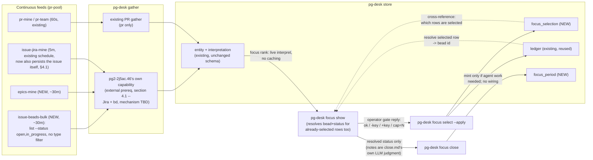

# Daily focus, store-first: phase 15 of the pg-desk/connector program

- **Date**: 2026-09-23
- **Status**: Draft — the ranking model, candidate set, epic slot rule and rank placement (section 6,
  D-F11) were ruled by the operator on 2026-10-05; the rest of the document is pending operator
  review and is NOT approved
- **Bead**: `pg2-2j5ac.27` (this design's own tracking bead; phase 15's decompose-trigger is
  `blocked-by` it)
- **Depends on**: `pg2-2j5ac.46` (a new, external prerequisite design session — widening
  pg-desk's gather/interpret/persist pipeline to support issue-type entities, discovered during
  this session's own review — `blocked-by`-wired onto this bead; see §4.1)
- **Amends**: `phillipgreenii-nix-agent-support`'s
  `docs/superpowers/specs/2026-09-09-pg-desk-and-connector-discovery-design.md` (D19, D26, phase
  15's row in §9.5 — "designed in its own document", checkpoint "defined by that document"; this
  is that document) and `phillipg-nix-ziprecruiter`'s
  `docs/superpowers/specs/2026-09-02-daily-focus-v2-design.md` (decides what of v2 survives —
  answer: `df-attention`/`df-search`, untouched; everything else in v2's `df-survey`/`df-deferred`/
  `df-wire`/`df-pull`/`df-resolve-focus`/`df-find-pr-bead`/`df-split-blockers` family retires,
  §9 below).

## 1. Purpose and scope

Phase 15 retires daily-focus's beads-as-primary-store architecture (v2, fully implemented and
live in `phillipg-nix-ziprecruiter` today) in favor of the store-first pattern the rest of the
pg-desk/connector program already uses: everything surveyed lands uncapped in `pg-desk`'s SQLite
store; focus ranking is a compute-only interpret step over `entity` rows; a capped step mints
beads only where an agent actually needs one; "pulling more work" is selecting more from the
store, not a separate mechanism (D19, D26).

This document is scoped to daily-focus's own retirement (`df-survey`, `df-deferred`, `df-wire`,
`df-verify-wiring`, `df-pull`, `df-resolve-focus`, `df-find-pr-bead`, `df-split-blockers`,
`df-close-focus`, and the three command files that orchestrate them). It does not touch `df-attention`/`df-search`/`df-categorize`/`df-feedback`
(already retired into `pg-desk` in earlier phases per D10, or — for attention/search — deliberately
unrelated per the v2 doc's own §0 cross-reference) or any PR-side pg-desk behavior.

## 2. Decisions ledger

Operator rulings from the 2026-09-23 design session that produced this document, plus D-F11 from
the 2026-10-05 ranking session (which supersedes D-F7). D-F7 was made
in the operator's absence (a 10-minute `AskUserQuestion` timeout) on the session's best judgment,
per precedent already set twice earlier in the same session — it is flagged for revisit in §11,
not silently assumed settled.

| #     | Decision                                                                                                                                                                                                                                                                                                                                                                                                                                                                                                                                                                                                                                                                                                                                                                                                                                                                                                                                                                                                                                                                                                                                                                                                          |
| ----- | ----------------------------------------------------------------------------------------------------------------------------------------------------------------------------------------------------------------------------------------------------------------------------------------------------------------------------------------------------------------------------------------------------------------------------------------------------------------------------------------------------------------------------------------------------------------------------------------------------------------------------------------------------------------------------------------------------------------------------------------------------------------------------------------------------------------------------------------------------------------------------------------------------------------------------------------------------------------------------------------------------------------------------------------------------------------------------------------------------------------------------------------------------------------------------------------------------------------- |
| D-F1  | Daily-focus's PR candidate gathering reuses pg-desk's existing `pr-mine`/`pr-team` feeds (60s) unchanged — this half was already true: PR gather already persists `entity` rows. Jira/epic/bd-task candidate gathering reuses the existing feed _schedule_ (`issue-jira-mine` at 5m; two new feeds, §4) but requires new pg-desk code: `internal/gather.Gatherer` today only gathers `entityType == "pr"`, and `pg-desk run issue` never persists an issue's own `entity` row (it only re-interprets PRs already cross-referenced to it) — verified against `internal/gather/gather.go` and `docs/behavior/pg-desk/run-issue.md`. This is not, as an earlier revision of this document claimed, already there, and — per three review rounds finding the gap runs through `interpret`/`persist`/`run.go`'s dispatch/two hardcoded-kind readers too, deeper than a single missing method — building it is scoped OUT to its own external prerequisite bead, `pg2-2j5ac.46`, `blocked-by`-wired onto this bead (§4.1), rather than specified here.                                                                                                                                                                  |
| D-F2  | `pg-connector-pr-github`'s `mine` query stays scoped to `repo:ZR-Private/ziprecruiter` (one repo), narrowing daily-focus's PR survey from today's cross-repo `gh search prs --author @me`. Recorded loss, same pattern as the design of record's D15.                                                                                                                                                                                                                                                                                                                                                                                                                                                                                                                                                                                                                                                                                                                                                                                                                                                                                                                                                             |
| D-F3  | `df-deferred`'s description-marker-section mechanism retires entirely. "Deferred" is derived: candidates the store already holds that are not `focus_selection`-selected for the period. No description grammar, no lost-update hazard, no size cost.                                                                                                                                                                                                                                                                                                                                                                                                                                                                                                                                                                                                                                                                                                                                                                                                                                                                                                                                                             |
| D-F4  | The per-day "focus bead" (one bead with wired blocking deps) retires. "Today's focus" becomes a `pg-desk` view/query (`focus_selection`/`focus_period`, §5), generalizing to week/sprint via a `period_type` column rather than a new bead type per level (not built this phase — schema-ready only). Beads stay reserved for actual agent-workable signals (D8), never for human plan-tracking.                                                                                                                                                                                                                                                                                                                                                                                                                                                                                                                                                                                                                                                                                                                                                                                                                  |
| D-F5  | Gate replies and pull selections reference candidates by their own `(entity_type, entity_id)` — the same key already exists for a PR/Jira/bead item — never a derived positional handle. `focus show`/`focus select`/`focus pull` always recompute live from current `entity`/`interpretation` rows; nothing is cached or frozen between a `show` and the `select --apply`/`pull` that follows it, so a priority or due-date change is never hidden from the operator.                                                                                                                                                                                                                                                                                                                                                                                                                                                                                                                                                                                                                                                                                                                                            |
| D-F6  | `focus_selection` and `focus_period` (§5) use an internal surrogate primary key (`id INTEGER PRIMARY KEY AUTOINCREMENT`) with a `UNIQUE` constraint carrying the natural key, diverging deliberately from every existing pg-desk table (`entity`/`interpretation`/`xref`/`annotation`/`ledger`), which all use a composite natural-column primary key with no surrogate. `focus_selection` references `focus_period` by its surrogate `id` (a real foreign key, not a repeated `period_type`/`period_key` pair) and references `entity` by its own composite key (`repo, entity_type, entity_id`) — `entity` already is the table that establishes an `(entity_type, entity_id)` pair is valid, so `focus_selection` gets that validation from a real foreign key rather than untyped text columns.                                                                                                                                                                                                                                                                                                                                                                                                               |
| D-F7  | **SUPERSEDED 2026-10-05 by D-F11 (candidate set and epic slot rule).** Original text, kept for provenance: epic candidacy narrows to "owned by me AND has an open/in_progress child" — the "OR a recently-closed child" half of today's rule is dropped as a recorded loss, because expressing it would need a per-epic follow-up query the static named-query model (§4) cannot do. **Made in the operator's absence; flagged for revisit, §11.**                                                                                                                                                                                                                                                                                                                                                                                                                                                                                                                                                                                                                                                                                                                                                                |
| D-F8  | `schema.Issue` gains an `Owner` field (bd's `owner` key — the responsible human), mapped in `pg-connector-issue-beads`'s backend the same way `Assignee`/`Parent` were added by `pg2-akfw5`. `Owner` is distinct from the existing `Assignee` field, which carries bd's claim/actor identity, not ownership — verified live against this workspace's own `bd show`/`bd list --json` output, which return both `owner` and `assignee` as separate keys.                                                                                                                                                                                                                                                                                                                                                                                                                                                                                                                                                                                                                                                                                                                                                            |
| D-F9  | There is no separate `focus split` verb. `pg-desk focus show` resolves each already-selected row's associated bead and current status unconditionally, folded into its existing per-item output. This is not a new PER-CALL live-lookup cost once `pg2-2j5ac.46` lands (D-F1): an epic's status sits in its own gathered `entity` row (the entity id already is the bead id); a PR anchor's closure is already inferred by pg-desk's own sync step from the PR's own entity state (this half was already true, unaffected by D-F1); a Jira-sourced item's minted/correlated bd task rides along in the `issue-beads-bulk` feed. None of this is true TODAY, before that prerequisite bead lands — D-F9 depends on D-F1's prerequisite, not on anything pre-existing. `close.md`'s survey step becomes a `focus show` call, not a dedicated verb.                                                                                                                                                                                                                                                                                                                                                                  |
| D-F10 | `focus close`'s per-bead progress note is appended via `pg-connector issue comment` (→ `bd comment`), not today's `bd update --append-notes` (→ bd's separate NOTES field) — a deliberate, named change, not an accidental substitution. Verified both `pg-connector-issue-beads` and `pg-connector-issue-jira` implement `Comment` today (real, tested code on both backends, not a stub), so this needs no new pg-connector capability. Comments are also the better mechanism for this content: bd captures `created_at`/`author` on each comment natively, where NOTES is one unstructured, unbounded-growth text field the caller must manually date-tag (exactly what `df-close-focus.sh`'s `[daily-focus <date>] <progress>` prefix exists to work around). Relatedly: the `[daily-focus <date>]` tag's own PURPOSE splits in two — recording that a bead was part of a day's focus (now redundant; `focus_selection` already durably and queryably records this) vs. carrying forward what actually happened for whoever reads the bead next (not redundant; pg-desk's store holds no narrative text). Only the first purpose retires; the comment's actual content is not a tracking artifact and stays. |
| D-F11 | **Ranking model, ruled by the operator 2026-10-05** (focused ranking session; supersedes D-F7 and the v2 ranking ported unchanged). Candidate set: everything non-done ASSIGNED to the operator (authored or assigned PRs, assigned Jira issues, beads assigned to or owned by the operator), with no started/ownership filter that hides an item. Slot rule: an epic and its children never use more than one slot; a child takes the slot and the epic is listed only when it is incomplete with no open child. Started: bead in_progress, Jira In Progress category, any open assigned PR. Rank: strict lexicographic tiers, no weights: overdue first (started first, then most overdue), then started, then not started; inside the started and not-started tiers the keys are a due date inside the 7-day horizon, then unblocks, then priority, then age. Placement: the rank is a read-time pure computation inside pg-desk, recomputed on every `focus show/select/pull`; the router-triggered idempotent decider only mints beads for the selected items (this replaces the provisional 2026-10-02 answer that a decider computes the rank). The head-to-head evidence is in section 6.                 |

## 3. Architecture overview



### Retirement map

| Component                   | Fate                                  | Replaced by                                                                |
| --------------------------- | ------------------------------------- | -------------------------------------------------------------------------- |
| `df-survey` (shallow)       | Retires                               | Live read of `entity`/`interpretation` rows (§6)                           |
| `df-survey` (gate-apply)    | Retires                               | `pg-desk focus select --apply` (§7.2)                                      |
| `df-survey` (deep)          | Retires                               | Not needed — `focus show`/`select` are always live, no separate deep pass  |
| `df-deferred`               | Retires                               | `focus_selection` absence = deferred (D-F3)                                |
| `df-wire`                   | Retires (logic shrinks into sync, §8) | Mint-only-if-needed in `focus select --apply`                              |
| `df-pull`                   | Retires                               | `pg-desk focus pull` (§7.3)                                                |
| `df-resolve-focus`          | Retires                               | `pg-desk focus show`/existence check via `period_key`                      |
| `df-find-pr-bead`           | Retires                               | `ledger` lookup (already exists)                                           |
| `df-split-blockers`         | Retires                               | `pg-desk focus show`'s resolved bead+status for selected rows (§7.1, D-F9) |
| `df-verify-wiring`          | Retires                               | Not needed — nothing is wired (§8)                                         |
| `df-close-focus`            | Retires                               | `pg-desk focus close` (§7.4) — including its per-bead progress notes       |
| `df-attention`, `df-search` | Unchanged                             | n/a — unrelated (pure `pg-connector` clients already)                      |

## 4. Gather

### 4.1 The missing capability: issue-entity gather (external prerequisite, `pg2-2j5ac.46`)

Checked directly against the code rather than assumed: `internal/gather.Gatherer.Gather` accepts
only `entityType == "pr"` — any other value is rejected outright ("gather: entity type %q not
supported in Phase 9 (pr-triggered gather only)", `internal/gather/gather.go`). `pg-desk run
issue`'s existing dispatch never persists an issue's own facts as an `entity` row — it only
re-interprets PRs already cross-referenced to it, or resolves a bead's linked PR and interprets
that. There is no existing path, today, by which a Jira ticket's, an epic's, or a bd task's own
facts land in the `entity` table.

Three review rounds during this design session progressively found that this gap runs through
every layer pg-desk built PR-only — not just `gather`, but also `interpret` (gated on `PRShow`
being populated), `persist`'s interpretation-table half (built from PR-shaped fields), the issue
dispatch's control flow (two branches that both return immediately, no seam to extend), two
operator-facing surfaces that hardcode the `ledger` table's three existing sync `kind` values,
and the behavior doc that currently documents the opposite of what's needed. Pinning all of that
down to exact Go seams and struct changes is implementation-decomposition work, not something
this design document should carry — the same way the parent design names capabilities like "PR
v3" without specifying their diff.

**This document therefore treats issue-entity gather as an external prerequisite**, tracked as
its own design-session bead, `pg2-2j5ac.46` ("pg-desk: design session — widen gather/interpret/
persist pipeline to support issue-type entities"), wired `blocked-by` onto this bead
(`pg2-2j5ac.27`) so phase 15's decomposition cannot proceed ahead of it. Everything below in §4
and §6 **assumes `pg2-2j5ac.46` has landed**: that pg-desk can persist and interpret an issue's
own facts, backend-agnostically (Jira and bd), without breaking existing PR-side behavior. The
exact mechanism — new gather method vs. something else, how `run.go`'s dispatch changes, how the
ledger-kind readers widen — is `pg2-2j5ac.46`'s own design to make, not this one's.

### 4.2 Feeds

Once `pg2-2j5ac.46` lands: `issue-jira-mine` (5m, existing) needs no NEW feed wiring — its
schedule and query are unchanged — but the code it triggers persists a Jira ticket's own facts as
an `entity` row for the first time, not just using them to re-interpret linked PRs. Two genuinely
new feeds, both on `pg-connector-issue-beads`, both `emits = [ "issue.changed" ]`, triggering that
same widened dispatch:

- **`epics-mine`** (~30m, D21-style tunable default): query `list --type epic --status
open,in_progress`. No owner filter at the query layer — `bd list` has none — ownership is
  computed in interpret (§6) against the new `Owner` field (D-F8).
- **`issue-beads-bulk`** (~30m): query `list --status open,in_progress` with no type filter. This
  is the same "one bulk bead query, deduped by id" trick `df-survey` already uses today (§4.1 of
  the v2 doc) for `unblocks` and correlation, just running continuously. Its purpose here is
  narrower than that: landing every child issue's `parent` field in the store so the focus-rank
  step (§6) can answer "does this epic have an open/in_progress child" with a pure in-store join,
  no per-epic query.

PR candidate gathering (`pr-mine`/`pr-team`) needs no new feed and no new code — D-F1.

`issue-beads-bulk`'s volume is not budgeted here and should be sized during `pg2-2j5ac.46`'s own
work: unlike the existing label-scoped bead feeds (`feedback-ready`/`worker-ready`/
`review-ready`), an unfiltered `list --status open,in_progress` fires one gather event per every
open/in_progress bd issue in the whole tracker, every ~30 minutes. Likely fine at this operator's
actual bead volume, but untested against it.

## 5. Store schema

New tables, alongside pg-desk's existing `entity`/`interpretation`/`xref`/`annotation`/`ledger`
(unchanged):

```sql
CREATE TABLE focus_period (
    id            INTEGER PRIMARY KEY AUTOINCREMENT,
    period_type   TEXT NOT NULL,      -- 'day' this phase; schema allows 'week'/'sprint' later
    period_key    TEXT NOT NULL,      -- e.g. '2026-09-23' for period_type='day'
    closed_at     TEXT,
    close_note    TEXT,
    UNIQUE (period_type, period_key)
);

CREATE TABLE focus_selection (
    id              INTEGER PRIMARY KEY AUTOINCREMENT,
    focus_period_id INTEGER NOT NULL,
    repo            TEXT NOT NULL,    -- same repo constant pg-desk already uses for every
                                       -- entity it gathers (§8's "single configured repo" in
                                       -- the parent design), not a per-issue attribute
    entity_type     TEXT NOT NULL,    -- 'pr' | 'issue' (Jira or bd; disambiguated by entity_id shape)
    entity_id       TEXT NOT NULL,
    selected_at     TEXT NOT NULL,
    UNIQUE (focus_period_id, repo, entity_type, entity_id),
    FOREIGN KEY (focus_period_id) REFERENCES focus_period (id),
    FOREIGN KEY (repo, entity_type, entity_id) REFERENCES entity (repo, entity_type, entity_id)
);
```

Both tables use an internal surrogate primary key with the natural key expressed as a `UNIQUE`
constraint (D-F6) — a deliberate divergence from every other pg-desk table, called out here so a
later reader does not mistake it for drift. `focus_selection` references `focus_period` by its
surrogate id rather than repeating `period_type`/`period_key`, and — per the operator's own
question during design, "do we have a table which would ensure `entity_type`/`entity_id` is
valid" — it also carries a real foreign key into pg-desk's existing `entity` table, so a
selection can never name an entity pg-desk never actually gathered. Both foreign keys are
genuinely enforced: pg-desk's store already opens every connection with `_pragma=foreign_keys(ON)`
(`internal/store/store.go`), so this isn't a documentation-only intent.

Consequence: `focus_period` is no longer written only by `focus close` (§7.4). Every verb that
writes a selection (`focus select --apply`, `focus pull`) must first get-or-create the
`focus_period` row for `(period_type, period_key)` — `closed_at`/`close_note` left `NULL` on
creation — so it has an `id` to insert `focus_selection` rows against. `focus close` becomes the
verb that sets `closed_at`/`close_note` on a row that, in practice, already exists by the time a
day is closed.

`schema.Issue` (pg-connector, not pg-desk) gains:

```go
// Owner is the issue's owning human, in whatever identity form its tracker
// uses (a bd owner email, a Jira reporter/owner field). Distinct from
// Assignee, which carries claim/actor identity, not ownership. Empty when
// unassigned or the backend does not supply one.
Owner string `json:"owner,omitempty"`
```

mapped in `pg-connector-issue-beads`'s `bdIssue`/`toSchemaIssue` from bd's `owner` key, the same
shape as the existing `Assignee`/`Parent` fields (D-F8).

## 6. Interpret: the focus-rank step

Unlike every other pg-desk interpret step (ownership, enrichment, urgency, category — each a pure
function of ONE entity's own gathered facts), focus-rank is a **sweep**: it operates over the
whole candidate set at once, computed fresh on every read (`show`/`select`/`pull`), never cached.
It reads `entity` rows exactly the way every other interpret step does — this step itself is pure
computation over facts, unchanged in kind from the rest of pg-desk's interpret layer. What it
reads depends entirely on `pg2-2j5ac.46` (§4.1): issue-type `entity` rows only exist once that
prerequisite lands.

**Placement (ruled 2026-10-05, D-F11).** The rank is a read-time, side-effect-free computation inside
pg-desk. The router-triggered idempotent decider does NOT compute it; the decider only mints beads
for the items the operator actually selects. This replaces the provisional 2026-10-02 answer that a
focus decider computes the rank: the rank depends on time (overdue, the 7-day horizon) and on
cross-entity facts (the epic slot rule), and a rank written on an entity change goes stale for both,
the same reason the attention evaluator is read-time (pg2-m482k, 2026-10-05).

**Candidate set** (D-F11): every non-done item ASSIGNED to the operator, with no "started" or
ownership filter that hides an assigned item:

- PRs the operator authored or was assigned (surfaced by `pr-mine` or `pr-team`),
- Jira issues assigned to the operator (surfaced by `issue-jira-mine`), and
- beads whose `Assignee` or `Owner` resolves to the configured operator identity (D-F8).

**Slot rule** (D-F11): an epic and its children MUST NOT consume more than one slot between them.
A child item takes the slot; the epic is NOT listed separately while it has any open child. An epic
that is incomplete and has NO open child work is a candidate in its own right, because the operator
must move it along (create children, split it, and so on). The rule is applied BEFORE the cap line
is counted. The old D-F7 narrowing ("has an open child") is superseded; the closed-child signal is
no longer needed, so the sketched `pg-connector-issue-beads` capability is not required.

**Started** (D-F11): a bead with state `in_progress`; a Jira issue in the In Progress status
category; any open PR assigned to the operator, whether authored or review-assigned. Consequence to
keep visible: every open assigned PR is started, so PRs rank above non-overdue unstarted beads and
Jira issues.

**Rank** (D-F11): strict lexicographic tiers, no weights, no arithmetic. The tiers, in order:

1. **Overdue** (due date before `--date`). Within it: started items first, then the most overdue,
   then unblocks (descending), then priority, then age.
2. **Started** (not overdue).
3. **Not started** (not overdue).

Inside tiers 2 and 3 the keys, in order, are:

1. Due date within a **7-day horizon from `--date`**: a nearer date sorts ahead of a farther one,
   and any date inside the horizon sorts ahead of none. A due date outside the horizon is
   deliberately equivalent to no due date for this key. Source: Jira `duedate` or bd's due date;
   correlated items inherit the earliest across the group.
2. Unblocks (descending): the count of open items this one blocks (bd dependency edges; PR-to-PR
   once pg-desk has a dependency source, pg2-m482k prerequisite).
3. Priority: bead P0-P4 directly, Jira priority via the same data-driven mapping table (unmapped
   values, including `Needs Priority`, sort after P4). **A PR with no priority of its own inherits
   the highest priority among its correlated items, else P2** (v2 doc section 4.4); this
   inheritance rule is part of the port, not an incidental detail.
4. Age (descending), then kind+key tiebreak.

Evidence (the operator's head-to-head rulings, 2026-10-05; each pair decided the key order above):

| Pair (first listed wins)                                                | Fixes                                    |
| ----------------------------------------------------------------------- | ---------------------------------------- |
| started P2 over unstarted P1, same deadline                             | started outranks priority                |
| started, blocks nothing over unstarted unblocker                        | started outranks unblocking              |
| started P1 with no deadline over unstarted P3 due tomorrow              | started outranks a non-overdue deadline  |
| overdue unstarted P1 over started P3 with no deadline                   | overdue outranks started                 |
| unstarted P3 due in 3 days over unstarted P1 with no deadline           | deadline outranks priority               |
| started P3 due tomorrow over started P1 with no deadline                | deadline outranks priority, when started |
| unstarted P2 unblocking 3 over unstarted P1 blocking none               | unblocking outranks priority             |
| unstarted, due in 3 days over unstarted, no deadline, unblocks 3 others | deadline outranks unblocking             |

**Cap line**: after the slot rule, the first `cap` (default 6, `--cap N` override) ranked items are
`in_plan: true` for _display_ only. Nothing is written by `focus rank` itself; `focus_selection` is
written only by `select`/`pull` (section 7).

## 7. The `focus` verb family

All four verbs take `--period day` (the only implemented value this phase; `week`/`sprint` are
schema-ready, not wired) and operate on `period_key` = a date, defaulting to today.

### 7.1 `pg-desk focus show [--date YYYY-MM-DD] [--cap N]`

Computes the candidate set and rank fresh (§6), cross-references existing `focus_selection` rows
for the period so already-selected items display as selected, and prints the ranked table —
same shape as today's gate table (§4.2/§4.5 of the v2 doc: category status/truncation, per-item
signals, PR `status_phrase`). Exit `0` all categories ok; `4` partial (a category failed or was
truncated — shown, never silently omitted, per the v2 doc's own §4.8 invariant); `3` total
failure, no candidates computable.

This is also the mitigation for losing "browse today's plan via plain `bd show`" (there is no
more focus bead to `bd show`, D-F4): `focus show` with no pending gate reply is exactly that
browse — and, longer-term, pg-desk's existing `serve` dashboard (parent design §7.7) is the
natural place to surface `focus_selection` alongside the PR panels it already renders, though
that wiring is not designed here.

**Resolved status for already-selected rows (D-F9, replaces `df-split-blockers`/`focus split`).**
For every row already in `focus_selection` for the period, `show` additionally resolves it to a
bead and reports that bead's current status, unconditionally — no separate verb, no flag, and no
new live-lookup cost: an epic's status is already sitting in its own gathered `entity` row (the
entity id already is the bead id); a PR anchor's closure is already inferred by pg-desk's own
sync step from the PR's own entity state; a Jira-sourced item's minted or correlated bd task rides
along in the `issue-beads-bulk` feed (§4) — gathered for epic-child detection, but it sweeps up
every open/in_progress bead, including a focus-minted one, for free. `close.md`'s survey step
(today's `df-split-blockers`) becomes a plain `focus show` call, grouping the resolved rows into
whatever buckets it needs (its own per-item "real progress" judgment, §9, already operates at a
finer grain than closed/carried-over anyway).

### 7.2 `pg-desk focus select --date YYYY-MM-DD --apply [--merge <keepKey>=<absorbedKey>,...]` (reply on stdin)

1. Recompute the candidate table live (identical to `show`) and **print it** — this is what the
   reply gets applied against, always current, never more than one round trip stale (D-F5).
2. Parse the reply: `ok`/empty (accept as shown), `-<key>` (strike — this is also v2's "drop": a
   struck item is simply absent from `focus_selection`, so under this design there is no separate
   drop-vs-strike distinction to preserve), `+<key>` (force-pull an existing candidate, or — if
   `<key>` matches no candidate — attempt a hand-add: resolve it as a real lookup), `cap=N`
   (re-cap). **Parsing is atomic and happens entirely before any application**, matching v2's own
   gate-apply pipeline (v2 doc §4.6: "parse ALL tokens ... NOTHING applied" on any problem): a
   conflicting pair for one key (`-X +X`), an unrecognized token, or a hand-add that resolves to a
   nonexistent or closed id are ALL usage errors — exit `2` naming the problem, nothing applied,
   the caller re-prompts. There is no partial-application case at the reply-parsing stage.
3. Separately, `--merge <keepKey>=<absorbedKey>` (repeatable, comma-separated) is an LLM-supplied
   flag, not part of the operator's typed reply — this is v2's residual-fuzzy-correlation judgment
   (v2 doc §5 step 4, §9.1): two candidates the mechanical v2 doc §4.3 correlation missed but that
   represent the same real work. `absorbedKey` is dropped from consideration entirely (as if
   struck) and never gets its own `focus_selection` row; whatever bead resolution `absorbedKey`
   would have contributed (e.g. a PR link) folds into `keepKey`'s own minting/ledger step (6,
   below) — mirroring v2's "`e4` is not wired separately; its `wire_targets` union into `j2`'s."
4. Recompute `in_plan` from scratch: non-struck, non-absorbed items ranked, top `cap` in-plan;
   force-pulled/hand-added items in-plan additionally (each raises the effective cap by one,
   matching the v2 doc's own rule).
5. Replace `focus_selection` rows for this period wholesale with the final in-plan set (rewrite,
   never accumulate — the same "rewrite, never append" discipline the retired `df-deferred` used).
   Get-or-create the `focus_period` row first if absent (§5).
6. For each selected item lacking an associated bead (checked via `ledger` and the existing v2
   doc §4.3 correlation rules before assuming none exists) — **including any row left over from a
   prior run whose mint never succeeded** (step 6's own partial-failure case, not just
   newly-selected ones, so a previously orphaned selection is retried automatically rather than
   staying permanently unminted): if `pg-desk`'s own `sync.mode` (parent design D17,
   `internal/sync/sync.go`) is `off` or `plan`, record what _would_ be minted in `ledger` without
   calling `pg-connector issue`. This is a **parallel** discipline to `internal/sync`'s existing
   plan-mode behavior, not shared code or a shared `kind` taxonomy — `internal/sync.Syncer` is
   itself gated to `entityType == "pr"` and its three `kind` values (`anchor`, `feedback-cycle`,
   `review-request`, `internal/sync/classify.go`) are all PR-bead shapes; minting here goes
   through the new `internal/focus` package (§10) directly, writing its own `ledger` rows under a
   new kind, `focus-item`, added to that table's existing (informal) vocabulary. In `apply`, mint
   for real: same type-map (Jira `Bug` → `bug`, else → `task`) and priority-map `df-wire` uses
   today, record `entity → bead-id` in `ledger` under `kind = "focus-item"`. Epics need nothing
   here — the entity id already is a bead id.
7. Print the echo table, naming the resolved entity for every applied token explicitly (e.g.
   `-ZR-Private/ziprecruiter#108526 → struck`), so a token that resolved to something other than
   intended is visible immediately rather than silently wrong.

Exit `0` applied; `2` usage (a parse-stage problem — nothing applied, per step 2); `3` a
`focus_selection` write or a `ledger` write failed outright; `4` partial — `focus_selection`
committed (step 5 succeeded), but the mint sub-step (step 6) failed for some, not all, of the
items needing one; the echo names which.

**Dependency note**: the tracking bead `pg2-2j5ac.27` states phase 15 depends on phase 11
("`focus` sync step mints beads, which needs `sync.mode: apply`"), but the parent design's own
phase table (`2026-09-09-...md` §9.5) lists phase 15's dependency as phase 13 only. Step 6's
`sync.mode` gate above makes this safe either way — focus-minting cannot write real beads before
`apply` regardless of decompose ordering — but the two source documents disagree and neither is
corrected by this one; whoever decomposes phase 15 should reconcile them explicitly rather than
inherit the discrepancy silently.

**UX cost, named rather than left implicit**: typing a full `OWNER/REPO#NUMBER` or Jira/bd key in
a reply is more keystrokes than v2's short `p3`/`j5`/`e2` handles. §13 records why the handle
mechanism was rejected (it required freezing exactly the data the operator wants live); this is
the real, day-to-day price of that trade, not a cost-free simplification.

### 7.3 `pg-desk focus pull [--date YYYY-MM-DD] [k | key...] [--dry-run]`

Same live-recompute-then-print discipline as `select`, but strictly additive: no strike, no
re-cap, no recompute-from-scratch. Bare invocation previews (recompute, print, change nothing —
also "what's left today?"). A count `k` selects the top-`k` not-yet-selected candidates by current
rank; named keys select those specifically (already selected, or no longer a candidate — e.g.
merged/closed since — reported and skipped). Selected items union into `focus_selection`
(get-or-create the `focus_period` row first, same as `select`) and go through the same
`sync.mode`-gated mint-only-if-needed step as `select` (§7.2 step 6, including its orphaned-row
retry). No re-survey, no cap — "pull more" is deliberately uncapped, same as today.

Exit `0` done (including "nothing left to pull"); `2` usage; `3` a tool call failed; `4` partial
(named items skipped/stale, or nothing named resolves); `6` the period is closed (`focus_period`
has `closed_at` set) — terminal, matching today's df-pull's "pulling into a closed day is always
wrong."

`--dry-run` runs the same resolution and reports exactly what would be selected and what would be
minted, writing nothing to `focus_selection` or `ledger`, calling no `pg-connector issue`, **and
skipping the `focus_period` get-or-create too** — a `--dry-run` call must not leave behind even
an empty `focus_period` row as a side effect of what's supposed to be a no-op preview. Worth
having natively (not left to the caller simply not invoking the verb) because minting is a real,
visible, not-cheaply-undone action.

### 7.4 `pg-desk focus close --date YYYY-MM-DD [--dry-run]` (day summary + per-bead notes on stdin)

Writes `closed_at`/`close_note` onto the `focus_period` row (creating it if absent) — the
`close_note` is where today's day-summary-onto-the-focus-bead text goes, since there is no more
focus bead to carry it. This does **not**, by itself, cover everything `df-close-focus` does
today: that script also appends a `[daily-focus <date>] <progress>` note to **every touched
bead**, closed or carried over (`df-close-focus.sh`'s own `--notes-file`, one JSONL line per
bead), which is real, currently-used behavior for carrying context onto individual beads across
sessions — not a bead-artifact concern the retiring focus bead itself created.

`focus close` therefore reads **one JSON object on stdin**, not a `--notes-file`/`--note` flag
pair: `{"summary": "<day summary text>", "notes": [{"id": "<bead-id>", "note": "<progress
text>"}, ...]}`, one `notes` entry per resolved bead from `focus show`'s resolved-status output
(D-F9). Both fields are free-form text that can contain quotes and newlines — the same reason
`select --apply`'s reply is read from stdin rather than argv (v2 doc §4.6): a `--notes-file FILE`
flag would just be a second convention for a problem this design already solved once. `summary`
becomes `close_note`; each `notes` entry is appended to its bead via `pg-connector issue comment`
before `focus_period` is written. Fails fast on the first append failure, same as today's script
(no rollback of notes already appended).

`--dry-run` reports the resolved `close_note` and the per-bead notes that would be appended,
writing nothing, appending nothing, and — same as `pull`'s `--dry-run` above — not creating a
`focus_period` row if one doesn't already exist. Same rationale: posting a bead comment is
visible and not cheaply undone.

Exit `0` closed; `2` usage (malformed stdin, or a `notes` entry naming a bead `focus show` didn't
actually resolve); `6` already closed (idempotent no-op, reported); `3` a note append or store
write failed.

## 8. Sync

Folded into `focus select --apply` step 6 and `focus pull`'s equivalent step (§7.2/§7.3) — there
is no separate sync pass. What's gone compared to today's `df-wire`: no `wire_targets`
resolution, no epic-vs-task blocking-edge distinction, no bulk `bd dep add`, no
`df-verify-wiring`. There is nothing to wire to (no per-day focus bead, D-F4), so the class of
defect that produced today's retro finding 4 (undocumented epic-vs-task wiring constraint) cannot
recur — not handled, structurally absent.

## 9. Consumer rewrites (`phillipg-nix-ziprecruiter`)

| Consumer                          | Today                                                                                                                              | Rewritten to                                                                                                                                                                                                                                                              |
| --------------------------------- | ---------------------------------------------------------------------------------------------------------------------------------- | ------------------------------------------------------------------------------------------------------------------------------------------------------------------------------------------------------------------------------------------------------------------------- |
| `create.md` duplicate guard       | `df-resolve-focus <date> --status all`                                                                                             | `pg-desk focus show --date X`; nonempty selection ⇒ same use-as-is/amend operator decision                                                                                                                                                                                |
| `create.md` gate                  | `df-survey` shallow → table → reply → `--apply-gate`                                                                               | `pg-desk focus show` → table → reply → `pg-desk focus select --apply`                                                                                                                                                                                                     |
| `create.md` deep/mint/wire        | `df-survey --deep` → LLM drop/merge → `df-wire`                                                                                    | `-<key>` covers "drop"; `--merge <key>=<key>` on `focus select` (§7.2 step 3) covers "merge"; folded into step 7.2                                                                                                                                                        |
| `pull.md`                         | invokes `df-pull` verbatim, including its exit-`5` multi-candidate branch                                                          | invokes `pg-desk focus pull` verbatim — **not** the same exit codes: `focus pull` has no exit `5`, for the same reason `close.md` resolve (below) loses its multi-candidate case. `pull.md`'s own exit-5 handling prose is dead and should be removed, not left in place. |
| `close.md` resolve                | `df-resolve-focus <date>`, exit-5 multi-candidate handling                                                                         | `pg-desk focus show --date X` existence check — no multi-candidate case exists (`period_key` is the date, exactly; the ambiguity class retires with it)                                                                                                                   |
| `close.md` survey                 | `df-split-blockers <focus-id>`                                                                                                     | `pg-desk focus show --date X` — resolved bead+status for each selected row (D-F9), grouped by `close.md` itself                                                                                                                                                           |
| `close.md` per-bead notes + close | `df-close-focus`: appends a progress note to every touched bead, then the day summary onto the focus bead, then `bd close --force` | `pg-desk focus close --date X` — same per-bead notes and day summary, both on stdin as one JSON object (§7.4), no bead closed                                                                                                                                             |

`close.md` steps 3-5 (summarize, judge real progress, Jira comment gate) are unaffected — they
consume the resolved item list either way (grouping it into closed/carried-over, or whatever
grouping it needs, is now `close.md`'s own job rather than a dedicated verb's output shape) and
still produce the same summary/per-bead-notes content step 6 (now `focus close`, reading it from
stdin instead of `--notes-file`/`--summary-file`) consumes.

## 10. Retirement, testing, and validation

**Retires** (script, nix wiring in `scripts.nix`/`default.nix`, and bats tests, together):
`df-survey`, `df-deferred`, `df-wire`, `df-verify-wiring` (a step inside `df-wire`, but its own
top-level script/nix-module/bats-test entry — easy to miss if this list is read as exhaustive
without checking `modules/daily-focus/` directly), `df-pull`, `df-resolve-focus`,
`df-find-pr-bead`, `df-split-blockers`, `df-close-focus` (folds into `focus close`, §7.4).
Unchanged: `df-attention`, `df-search`.

**Testing moves with the logic**, into a new `internal/focus` package plus `cmd/pg-desk/focus*.go`
— a genuine rewrite of `df-survey`'s bats-tested ranking/gate-apply suites, not a file move.
`pg2-2j5ac.46`'s own issue-gather capability (§4.1) gets its own test suite, scoped by that
design's own session, not this one. Named test targets for THIS document's own scope, called out
specifically because they're what changed across this document's own review rounds and are the
easiest to leave unspecified by accident: ranking (the 7-day due
horizon and priority-inheritance rules, §6); the cap/select/pull recompute-from-scratch and
additive-only semantics respectively; `show`'s resolved-status join (D-F9) for all three
candidate types; the `--merge` flag (§7.2 step 3); `sync.mode` gating (`off`/`plan`/`apply`) on
the mint step, including that `plan` writes to `ledger` but calls no `pg-connector issue`; the
orphaned-selection retry (§7.2 step 6); and `--dry-run` on both `pull` and `close`, including that
it does not create a `focus_period` row. What remains bash/bats in `phillipg-nix-ziprecruiter`:
nothing of substance for daily-focus's own logic — `create.md`/`pull.md`/`close.md` become LLM
command prose invoking `pg-desk`, same as they already invoke `pg-connector` post-phase-9.

**New feed/query validation.** Per this session's own live incident
(`pg2-93e5s`/`pg2-cjwfu`, recorded in `phillipgreenii-nix-agent-support`'s `CLAUDE.md`):
`nix flake check` passing on `epics-mine`/`issue-beads-bulk` proves the config evaluates, not that
it produces real rows when actually triggered. The phase 15 checkpoint below requires exercising
both live, not just a clean flake check.

## 11. Phase 15 checkpoint (operator-run by hand, D16)

- `pg2-2j5ac.46` (§4.1) is closed, with its own design's checkpoint met — pg-desk can persist and
  interpret issue-type entities, backend-agnostically, without regressing PR-side behavior. This
  precedes everything below; none of it is meaningful until this prerequisite lands.
- `pg-desk focus show --date <today>` produces the same candidate set `df-survey` would have,
  modulo the recorded narrowing of D-F2's PR repo scope, and the deliberate widening of D-F11's
  candidate set (everything assigned to the operator, with the epic slot rule) over `df-survey`'s.
- `epics-mine` and `issue-beads-bulk` are each run live at least once (`pg-router run-query` or
  equivalent) with a confirmed non-trivial outcome — real `entity` rows landing for an epic and a
  plain bd task, not just a clean `nix flake check`.
- `issue-jira-mine`'s existing tick is confirmed to now ALSO persist the triggering Jira ticket's
  own `entity` row (via whatever `pg2-2j5ac.46` builds) — this is a behavior change to existing,
  already-running code, not just the two new feeds, and is easy to miss verifying since nothing
  about the feed's own config changed.
- A full `select --apply` → `pull` → `show` (resolved status) → `close` cycle runs end-to-end
  against the live tracker for one real day.
- `close.md`'s rewritten resolve/survey/close steps produce output its unchanged steps 3-5 accept
  without modification.

## 12. Open items for operator review

- **`pg2-2j5ac.46`** (§4.1) is a hard, `blocked-by`-wired dependency: phase 15's own decomposition
  cannot start until it closes. Its own design session decides the exact mechanism this document
  deliberately leaves unspecified.
- **D-F7 is closed:** superseded by D-F11 (2026-10-05). Reconcile in the revision pass, because
  D-F11 widens the candidate set to everything assigned to the operator and §4.2 (the feeds:
  `pr-mine`/`pr-team`, `issue-jira-mine`, `epics-mine`, `issue-beads-bulk`) and §4.1 still describe
  the narrower D-F7 candidate set: the feeds must surface every assigned PR, Jira issue and bead
  (assignee OR owner), and `epics-mine`'s purpose (landing child `parent` fields for the open-child
  join) now serves the slot rule instead. Also reconcile §7 (the `focus show` table shows the
  ranking tier), §9/§10 (the rank test suites), and the unblocks source for PRs.
- **The rest of the document is not yet reviewed by the operator.** Only section 6 and D-F11 are
  ruled; approval of the whole document, recorded in this header, is still required before landing.
- **Public-repo scrub before landing (blocker for the landing step).** This repository is public
  and must not name the employer's private repos or tickets. The draft still names the private
  monorepo and a PR number in decision D-F2 and in the section 7.2 example, and names the private
  machine flake in the header, section 1 and section 9. Genericize every such reference (for
  example "the monorepo", "the private machine flake") and re-scan the whole file for
  org-specific identifiers (case-insensitive: the employer name, its abbreviation, private repo
  names, PR and ticket numbers) before it lands.
- Whether `week`/`sprint` period types are worth building now or genuinely deferred (the schema
  is ready either way; no verb currently implements them).

## 13. Rejected alternatives

- **A per-day focus bead with wired dependencies** (today's model) — rejected; see D-F4. Beads
  stay reserved for agent-workable signals per D8, and a per-period bead-wiring convention does
  not generalize to week/sprint without new mechanism per level.
- **Positional handles + a persisted candidate snapshot** (an earlier draft of this design) —
  rejected; froze exactly the information (rank, signals) the operator needs live, to solve a
  narrower identity-stability problem that a direct `(entity_type, entity_id)` reference solves
  without freezing anything (D-F5).
- **Composite natural-key primary keys for the new tables**, matching every existing pg-desk
  table — rejected for `focus_selection`/`focus_period` specifically, per operator preference
  (D-F6).
- **A dedicated `pg-connector-issue-beads` capability for exact epic candidacy** (owner +
  active-or-recently-closed-child, in one call) — no longer needed: D-F7's narrowing was superseded
  by D-F11 (2026-10-05), whose slot rule ("an epic is listed only when it has no open child")
  needs no closed-child signal, so no new backend code is required for epic candidacy.
- **A separate `focus split` verb** (an earlier draft of this design, matching `df-split-blockers`
  1:1) — rejected; the bead-resolution it performed is real and needed, but bucketing it into
  `closed`/`carried-over` was a shape carried over from the retiring script rather than something
  any consumer actually required, and the lookup itself was initially assumed to be an expensive
  live call before checking — it isn't, once §4.1's gather addition lands (D-F9). Folded into
  `focus show` instead.
- **A daily-focus-specific issue-ingest path, bypassing `internal/gather` entirely** (writing
  `entity` rows for Jira/epic/bd-task candidates from a bespoke `internal/focus`-package call
  rather than extending the shared gather layer) — leaned against, not finally settled here: the
  parent design already frames `entity`/`xref` as type-agnostic infrastructure other consumers
  may eventually need too, and a bypass would leave two different code paths writing the same
  table for the same reason. But the exact mechanism is `pg2-2j5ac.46`'s own design to make
  (§4.1), not this document's — that session may find a reason to bypass after all.
- **A new pg-connector notes-append capability**, to preserve `df-close-focus.sh`'s exact
  `bd update --append-notes` mechanism — rejected; `Comment` already exists, tested, on both
  issue backends today, and is arguably the better mechanism for this content anyway (D-F10).
