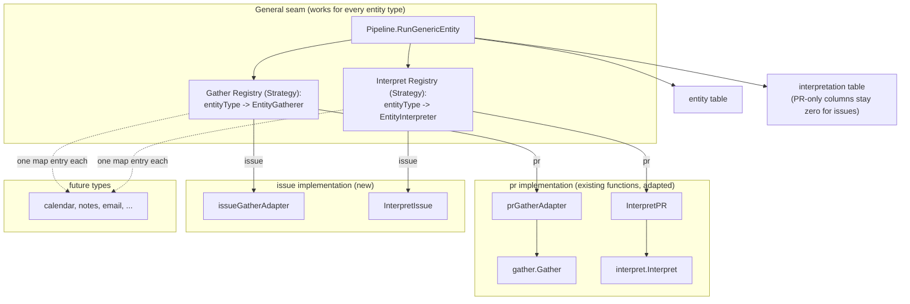

# pg-desk: a generic entity gather/interpret core, with issue-type entities as its first instance

- **Date**: 2026-09-23 (rewritten to current design 2026-09-29)
- **Status**: Draft — independently reviewed; pending final operator sign-off (`pg2-2j5ac.48`)
- **Bead**: `pg2-2j5ac.46`
- **Governed by**: `docs/superpowers/specs/2026-09-29-entity-change-flow-design.md` (the entity
  change flow design; not yet landed on main). That design owns triggering (pull-through
  `changes`), decisions (deciders), the store schema and the composite-view contract. This document
  owns only the generic gather/interpret core that hydrates an entity of a given type.
- **Blocks**: `pg2-2j5ac.27` (daily-focus store-first, phase 15), which assumes issue-type
  entities can be hydrated. Its focus step becomes a focus decider under the governing design.
- **Relates to**: `docs/superpowers/specs/2026-09-09-pg-desk-and-connector-discovery-design.md`
  (the founding pg-desk design). This document clarifies D10's "the interpreter is generic" as
  generic across entity types, not only across backends within one type.

## 1. Purpose and scope

`pg-desk`'s gather → interpret pipeline can fetch and interpret exactly one entity type: a PR.
Daily-focus (`pg2-2j5ac.27`) needs pg-desk to hold its own facts about issue-type entities (Jira
tickets, bd epics, bd tasks). `gather` rejects every type other than `pr`; `interpret` is gated on
PR-shaped facts; the interpretation write is built from PR-shaped fields.

Rather than add a third PR-shaped special case, this design adds a generic gather/interpret **core**:
a registry of per-type strategies, with the existing PR functions registered unchanged behind a thin
adapter and issue support built as the first real instance of the seam. This validates the seam
before any further type (calendar, notes, email — none has a `pg-connector` provider yet) uses it.

In scope: a generic gather contract and registry; a generic interpret contract and registry (reusing
the `interpretation` columns that already generalize); and a pipeline entry point that dispatches
through both.

Out of scope: any calendar/notes/email connector; the `internal/focus` package and its ranking
logic (owned by `pg2-2j5ac.27`); triggering, deciders, the store schema and the composite view
(owned by the governing design).

## 2. Decisions

| #    | Decision                                                                                                                                                                                                                                             | Reason                                                                                                                                                                                                                                                                      |
| ---- | ---------------------------------------------------------------------------------------------------------------------------------------------------------------------------------------------------------------------------------------------------- | --------------------------------------------------------------------------------------------------------------------------------------------------------------------------------------------------------------------------------------------------------------------------- |
| D-G1 | Build a generic gather/interpret core, not a narrow issue-only fix.                                                                                                                                                                                  | The connector layer (`pr`, `issue`, `ci`, `scm`, `calendar`, `thread`, `agentsession`, `search`, `attention`) is already domain-agnostic; only pg-desk's pipeline is PR-locked. A narrow fix would be the third PR-shaped special case.                                     |
| D-G2 | The PR pipeline (`gather.Gather`, `interpret.Interpret`, `gather.Facts`, the PR-only `Interpretation` columns) is not refactored. A thin Adapter registers it in the generic dispatch. This Adapter is the governing design's PR hydration strategy. | A working, pinned-contract pipeline gains nothing from being made generic.                                                                                                                                                                                                  |
| D-G3 | Issue entities get a real `interpretation` row using the columns that already generalize (`ownership`, `category`, `degraded`, `as_of`).                                                                                                             | A cached, refreshed interpretation row does not conflict with daily-focus's "never cache the rank" rule: that rule governs read-time recomputation of the rank, not whether the underlying rows are cached.                                                                 |
| D-G4 | `Ownership` is not duplicated per type. `interpret.classifyOwnership` is reused: `classifyOwnership(cfg.SelfIssueOwner, issue.Owner, []string{issue.Assignee})`.                                                                                     | "Opened by someone else but I committed to it" (PR) and "owned by someone else but assigned to me" (issue) are the same `CoOwned` relationship. Only the config value is type-specific, because a GitHub login and a bd/Jira owner identity are different strings.          |
| D-G5 | `Urgency`, `Enrichment`, `Dispositions`, `Approvals`, `GateState`, `MatchReasons`, `Panel` and `ReadyToPromote` stay zero-valued for issue rows. No due-date or priority scoring here.                                                               | There is no existing due-horizon logic to reuse, and daily-focus must recompute urgency live with cross-entity correlation anyway; a second scoring function here would diverge from it.                                                                                    |
| D-G8 | A genuinely not-found issue hard-fails in a targeted `pg-desk <type> refresh <id>`, unless the change is an explicit removal. In the changes flow, an entity that drops out of every watched query is removed/inactive, not an error.                | Mirrors the PR path's existing gate. A "existed but was removed/cancelled" distinction is wanted but not built: `GatherResult.RemovedState` stays free to carry a different value (for example `removed`) once a backend can confirm it, and that value is always graceful. |

Raw payloads MAY be stored, but the composite view serves typed `schema.*` snapshots, never the raw
payload; the snapshot contract belongs to the governing design.

Not adopted (original decisions D-G6, D-G7 and the implicit keep-`sync`), because the governing
design replaces the mechanisms they belonged to:

- D-G6, a `run issue` fallthrough to the generic path — `run` is retired; the generic path is the issue
  hydration strategy invoked by the changes and `refresh` flows;
- D-G7, `sync.KnownLedgerKinds` and any ledger-kind work — `sync` and the ledger table are removed;
- keeping `sync.Syncer` as a PR-only follow-on step — removed with `sync`.

## 3. Architecture



The seam is the pair of contracts (`EntityGatherer`, `EntityInterpreter`), their registries, and
`RunGenericEntity`. Every type, including `pr`, is an implementation of it; `pr` is simply the
implementation whose bodies already exist. The Registries are the **Strategy** pattern (one
algorithm per entity type, chosen at dispatch), realized as a small **Registry** (`map[string]...`)
so a new type is one map entry, not a new arm at every call site. `prGatherAdapter` and
`InterpretPR` are **Adapters**: they let the existing PR functions, unchanged internally, satisfy
the contracts.

## 4. Gather

New file `internal/gather/entity.go`; `gather.go` and `Facts` are not modified.

```go
// EntityGatherer is the per-entity-type gather contract (Strategy).
type EntityGatherer interface {
	GatherEntity(ctx context.Context, entityID string, change ChangeKind) (GatherResult, error)
}

// GatherResult is the generic envelope every EntityGatherer returns.
type GatherResult struct {
	Payload  json.RawMessage
	AsOf     string
	Degraded string
	// RemovedState is "" unless the type defines a removed/not_found concept.
	// Today only "not_found" (id unknown to the backend) is ever set. A future
	// backend MAY report a different value (e.g. "removed") when it can confirm
	// the item existed and was later deleted/cancelled; the pipeline treats any
	// such other value as always-graceful (D-G8).
	RemovedState string
}

// IssueFacts is the issue entity's own gather payload, parallel to Facts.
type IssueFacts struct {
	IssueShow json.RawMessage `json:"issue_show,omitempty"`
}

// prGatherAdapter adapts the existing, unchanged Gather method.
type prGatherAdapter struct{ g *Gatherer }

func (a prGatherAdapter) GatherEntity(ctx context.Context, entityID string, change ChangeKind) (GatherResult, error) {
	facts, err := a.g.Gather(ctx, "pr", entityID, change)
	if err != nil {
		return GatherResult{}, err
	}
	payload, err := json.Marshal(facts)
	if err != nil {
		return GatherResult{}, fmt.Errorf("gather: marshal pr facts: %w", err)
	}
	return GatherResult{Payload: payload, AsOf: facts.AsOf, Degraded: facts.Degraded, RemovedState: facts.RemovedState}, nil
}

// issueGatherAdapter: one `issue show <id>` targeted call, reusing
// g.targetedCall's 0/4/1 classification and g.issueBeadsDirEnv's workspace-var
// threading. `change` is accepted but not branched on: issue gather has no
// equivalent of PR gather's removed re-read or head-sha cache yet.
type issueGatherAdapter struct{ g *Gatherer }

func (a issueGatherAdapter) GatherEntity(ctx context.Context, entityID string, change ChangeKind) (GatherResult, error) {
	raw, notFound, err := a.g.targetedCall(ctx, []string{"issue", "show", entityID}, a.g.issueBeadsDirEnv())
	if notFound {
		return GatherResult{RemovedState: "not_found"}, nil
	}
	if err != nil {
		return GatherResult{}, fmt.Errorf("gather issue: fetch %s: %w", entityID, err)
	}
	var asOf struct {
		AsOf string `json:"as_of"`
	}
	_ = json.Unmarshal(raw, &asOf) // best-effort; empty AsOf means interpret stamps clock time

	payload, err := json.Marshal(IssueFacts{IssueShow: raw})
	if err != nil {
		return GatherResult{}, fmt.Errorf("gather issue: marshal %s: %w", entityID, err)
	}
	return GatherResult{Payload: payload, AsOf: asOf.AsOf}, nil
}

// EntityGatherers returns the Registry: exactly {"pr", "issue"} today.
func (g *Gatherer) EntityGatherers() map[string]EntityGatherer {
	return map[string]EntityGatherer{
		"pr":    prGatherAdapter{g: g},
		"issue": issueGatherAdapter{g: g},
	}
}
```

`ChangeKind` (`added`, `changed`, `removed`, `sweep`) is a hint about why pg-desk is hydrating this
entity now, not part of the entity's identity. A gatherer MAY use it to choose a cheaper or
different read (PR gather re-reads on `removed` and consults a head-sha cache on `sweep`); a
gatherer with nothing to branch on, like the issue one, ignores it. The caller is pg-desk itself:
its `changes` flow derives the kind from what pg-connector reported (or `sweep` for age-driven
re-hydration), and the pipeline passes it through. `RunGenericEntity` also uses `removed` to
exempt an explicit removal from the D-G8 not-found failure.

## 5. Interpret

New file `internal/interpret/entity.go`; `Interpret` and `Interpretation` are only consumed.

```go
// EntityInterpreter is the per-type interpret contract (Strategy). A func type
// fits because this package is stateless and pure-function-shaped.
type EntityInterpreter func(result gather.GatherResult, clock Clock, cfg *config.Config) (Interpretation, error)

// InterpretPR adapts the existing, unchanged Interpret function.
func InterpretPR(result gather.GatherResult, clock Clock, cfg *config.Config) (Interpretation, error) {
	var facts gather.Facts
	if err := json.Unmarshal(result.Payload, &facts); err != nil {
		return Interpretation{}, fmt.Errorf("interpret: decode pr payload: %w", err)
	}
	return Interpret(facts, clock, cfg)
}

// InterpretIssue fills the columns that already generalize (Ownership,
// Category, Degraded, AsOf) and leaves every PR-only column zero (D-G5).
func InterpretIssue(result gather.GatherResult, clock Clock, cfg *config.Config) (Interpretation, error) {
	now := clock.Now().UTC().Format(time.RFC3339)
	// Check length BEFORE decoding, as Interpret does: an allowed removed or
	// not-found result has a nil Payload and must degrade, not error.
	if len(result.Payload) == 0 {
		return Interpretation{Degraded: result.Degraded, AsOf: now}, nil
	}
	var facts gather.IssueFacts
	if err := json.Unmarshal(result.Payload, &facts); err != nil {
		return Interpretation{}, fmt.Errorf("interpret: decode issue payload: %w", err)
	}
	if len(facts.IssueShow) == 0 {
		return Interpretation{Degraded: result.Degraded, AsOf: now}, nil
	}
	var issue issueShowFields // ID/Owner/Assignee/IssueType, hand-decoded like gather.go's prShowFields
	if err := json.Unmarshal(facts.IssueShow, &issue); err != nil {
		return Interpretation{}, fmt.Errorf("interpret: decode issue show: %w", err)
	}
	var selfIssueOwner string
	if cfg != nil {
		selfIssueOwner = cfg.SelfIssueOwner
	}
	return Interpretation{
		Ownership: string(classifyOwnership(selfIssueOwner, issue.Owner, []string{issue.Assignee})),
		Category:  issue.IssueType, // tracker vocabulary echoed verbatim, not PR's inferred category
		Degraded:  result.Degraded,
		AsOf:      now,
	}, nil
}

// Built once at package init: nothing to close over.
var entityInterpreters = map[string]EntityInterpreter{
	"pr":    InterpretPR,
	"issue": InterpretIssue,
}

func EntityInterpreters() map[string]EntityInterpreter { return entityInterpreters }
```

`issue.Owner` requires `schema.Issue` to gain an `Owner` field (bd's `owner` key), mapped in
`pg-connector-issue-beads`'s backend. This is tracked as `pg2-t9zzg` and MUST land before any
implementation of D-G4 goes live: until then `classifyOwnership` can never classify an issue as
`Mine` for its tracker-native owner, silently and with no degraded signal.

`config.Config` gains one field, `SelfIssueOwner string`, beside the existing `SelfLogin`.
`SelfLogin` is GitHub-specific and already deployed, so it is not renamed or restructured.

## 6. Pipeline

New file `internal/pipeline/entity.go`.

`Pipeline` gains an `entityGatherers map[string]gather.EntityGatherer` field, populated once in
`New()` from the real `*gather.Gatherer`. An explicit field (not a runtime type assertion on
`p.gatherer`) keeps existing pipeline tests, which inject a narrower fake, working, and lets an
issue-path test set the field directly.

```go
// RunGenericEntity: gather -> interpret -> persist for any registered
// entityType, dispatched through both registries.
func (p *Pipeline) RunGenericEntity(ctx context.Context, entityType, entityID string, change gather.ChangeKind) error {
	adapter, ok := p.entityGatherers[entityType]
	if !ok {
		return fmt.Errorf("pipeline: no gather adapter registered for entity type %q", entityType)
	}
	result, err := adapter.GatherEntity(ctx, entityID, change)
	if err != nil {
		return fmt.Errorf("pipeline: gather %s %s: %w", entityType, entityID, err)
	}

	// D-G8: hard-fail on a genuine not-found unless this is an explicit removal.
	if result.RemovedState == "not_found" && change != gather.ChangeKindRemoved {
		return fmt.Errorf("pipeline: %s %s: not found", entityType, entityID)
	}

	interpreter, ok := interpret.EntityInterpreters()[entityType]
	if !ok {
		return fmt.Errorf("pipeline: no interpret adapter registered for entity type %q", entityType)
	}
	interp, err := interpreter(result, p.clock, p.cfg)
	if err != nil {
		return fmt.Errorf("pipeline: interpret %s %s: %w", entityType, entityID, err)
	}

	_, err = p.persistRaw(entityType, entityID, result.Payload, result.AsOf, interp)
	return err
}
```

`persistRaw(entityType, entityID string, payload json.RawMessage, asOf string, interp
interpret.Interpretation)` is a new sibling of the PR path's `persist`, because issue payloads are
not `gather.Facts`. It drops `HeadSHA` tracking (nothing outside gather's in-process PR cache reads
`entity.head_sha`).

How a hydration becomes a typed `schema.Issue` or `schema.PR` snapshot, including the `version`
check, `hydrated_at` and `active` bookkeeping and change-log append, is owned by the governing
design. `persistRaw` is the payload-and-interpretation half of that write.

Under the governing design `sync` is removed, so the PR path's `Run` also loses its
`sync.Syncer` step, and `interpret.Interpretation` loses `SyncError` and its readers. That removal
belongs to the governing design's migration, not to this document.

## 7. Store

This document adds no store change of its own: `entity` (keyed generically by `repo, entity_type,
entity_id`, with an untyped JSON `facts` column), `interpretation` (same keying; PR-only columns
stay zero for issue rows) and `xref` already generalize. The schema changes that do exist —
`entity` gaining `version`, `hydrated_at` and `active`, `interpretation` dropping `sync_error`, and
`annotation` becoming key/value — belong to the governing design.

## 8. Testing

New suites, none touching existing PR-path tests:

- `EntityGatherers` / `EntityInterpreters` registry dispatch, including the "no adapter registered"
  error path (matters once a third type updates one registry but not the other);
- `issueGatherAdapter`'s not-found path, and `RunGenericEntity`'s D-G8 gate on it (the adapter has
  no independent degraded path: it makes one `targetedCall`, and any non-not-found failure is a
  hard error);
- `InterpretIssue`: ownership and category mapping, the length-check-before-decode early return,
  and the empty-`IssueShow` early return.

## 9. Open items for operator review

- **Naming**: `RunGenericEntity`, `EntityGatherer`, `EntityInterpreter` and `persistRaw` are
  working names.
- **`schema.Issue.Owner`** (`pg2-t9zzg`) is a hard prerequisite for D-G4's implementation (see
  Interpret).
- **`refresh` semantics**: what `ChangeKind` a targeted `refresh <id>` passes, and how its failure
  semantics (previous snapshot kept, entity stays due) map onto D-G8's hard error, are settled by the
  governing design's refresh contract.
- **`persistRaw` and `HeadSHA`**: the dropped `HeadSHA` must be reconciled with the PR snapshot's
  `head_sha` in the governing design.
- **`IssueFacts` widening**: recording an issue's own discovered cross-references (as PR gather does
  for Jira-ticket and thread xrefs) is deliberately left for a later phase; not decided against.

## 10. Rejected alternatives

- **Narrow, issue-only support without a generic seam** — would be the third PR-shaped special case
  (D-G1).
- **Skipping the interpretation row for issues** — "never cache the rank" governs read-time
  recomputation, not whether the underlying row exists (D-G3).
- **A separate `classifyIssueOwnership`** — `classifyOwnership` already generalizes (D-G4).
- **A `scoreIssueUrgency` function in `interpret`** — no logic to port, and daily-focus must
  recompute it live anyway (D-G5).
- **A distinct verb such as `pg-desk gather-issue <id>`** — moot: `run` is retired and the generic
  path is reached through the changes and `refresh` flows.
- **Restructuring `Config.SelfLogin` into a nested identity struct** — a breaking config change to
  a deployed field for cosmetic benefit.
