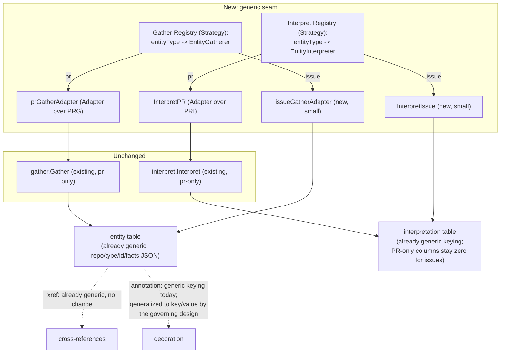

# pg-desk: a generic entity gather/interpret core, with issue-type entities as its first instance

- **Date**: 2026-09-23
- **Status**: Draft — independent review complete 2026-09-25 (`pg2-2j5ac.48`); addendum applied
  (see §13); pending final operator sign-off
- **Bead**: `pg2-2j5ac.46`
- **Governed by**: `docs/superpowers/specs/2026-09-29-entity-change-flow-design.md` (the entity
  change flow design, branch `worktree-pg-desk-cli-boundary-notes`, not yet landed on main).
  Amended 2026-09-29 per that design's decision S23 (operator ruling "A: amend .46"): where the two
  overlap, the governing design owns triggering (pull-through `changes`), decisions (deciders) and
  the composite-view contract; this document keeps the generic gather/interpret core for issues.
  See "Amendment 2026-09-29" below for the per-decision disposition. Sections marked
  **SUPERSEDED** are retained as history only and are not to be implemented.
- **Blocks**: `pg2-2j5ac.27` (daily-focus store-first, phase 15) — that design's §4.1 treats this
  bead as an external prerequisite and assumes the design below without specifying it. Once this
  bead closes, that document's §4.1/§6 can be finalized against the actual mechanism instead of
  deferring it. (Amended 2026-09-29: that design's focus `sync` step becomes a focus decider under
  the governing design, and its planned focus-item ledger kind needs a new home.)
- **Relates to**: `docs/superpowers/specs/2026-09-09-pg-desk-and-connector-discovery-design.md`
  (the founding pg-desk design, `pg2-od9se`, epic `pg2-2j5ac`) — this document does not amend that
  one's decisions ledger, but clarifies D10's "the interpreter is generic" in a direction that
  design did not itself specify: generic across entity TYPES, not only across backends within one
  type.

## 1. Purpose and scope

`pg-desk`'s gather → interpret → persist pipeline has, since Phase 9, been able to fetch and
interpret exactly one entity type: a PR. Phase 15's daily-focus redesign (`pg2-2j5ac.27`) is the
first consumer that needs pg-desk to hold its own facts about issue-type entities (Jira tickets, bd
epics, bd tasks) — not merely use an issue as a signal to refresh a linked PR's interpretation,
which is all `run issue` does today. Three review rounds during that design session found the gap
runs through every layer of the pipeline that was built PR-only: `gather` rejects any entity type
other than `pr` outright; `interpret` is gated on PR-shaped facts being present; `persist`'s
interpretation-table write is built entirely from PR-shaped fields; `run.go`'s issue dispatch has
no seam to add a "persist this issue's own facts" step; two operator-facing surfaces hardcode the
ledger table's three PR-bead sync kinds; and the behavior doc documents the opposite of what's
needed.

Rather than solve this as a third bolt-on special case (PR gather, PR-as-signal-for-urgency,
now issue-as-a-third-thing), this document designs a genuinely generic gather/interpret **core**,
with the PR pipeline **left completely untouched** as the first, still-unmigrated specialized
case, and issue-type support built as the **first real instance** of the new generic seam — a
second data point, not a rewrite of the first. This validates the seam before any third type
(calendar, notes, email — none of which have a `pg-connector` provider yet) is ever built against
it.

In scope: a generic gather adapter contract and registry; a generic interpret adapter contract and
registry, reusing the existing `interpretation` table's columns that already generalize; and the
`pipeline` entry point that dispatches through both. (Amended 2026-09-29: the `run issue` dispatch
change, the `beadref` error taxonomy addition and the ledger-kind dedup that were originally in
scope here are struck — the governing design retires `run` for changes/refresh and removes `sync`
and the ledger table; see the amendment below.)

Out of scope: any actual calendar/notes/email connector (none exist in `pg-connector` yet); the
`internal/focus` package and its priority/due-date ranking logic (owned by `pg2-2j5ac.27`'s own
phase, reads this bead's output, is not part of it); rewriting `docs/behavior/pg-desk/run-issue.md`
(lands in the implementation phase that changes the behavior, per this repo's own convention — not
this design bead's own deliverable); any decoration/annotation generalization beyond noting the
keying is already generic.

## 2. Decisions ledger

Operator rulings from this 2026-09-23 design session.

| #    | Decision                                                                                                                                                                                                                                                                                                                                                                                                                                                                                                                                                                                                                                                                                                                                                                                                                                                                                                                                                                                                                                                                                                                                                                                                                                                                                                                |
| ---- | ----------------------------------------------------------------------------------------------------------------------------------------------------------------------------------------------------------------------------------------------------------------------------------------------------------------------------------------------------------------------------------------------------------------------------------------------------------------------------------------------------------------------------------------------------------------------------------------------------------------------------------------------------------------------------------------------------------------------------------------------------------------------------------------------------------------------------------------------------------------------------------------------------------------------------------------------------------------------------------------------------------------------------------------------------------------------------------------------------------------------------------------------------------------------------------------------------------------------------------------------------------------------------------------------------------------------- |
| D-G1 | Scope is the generic gather/interpret **core**, not a narrow issue-type-only fix. The founding pg-desk design's own connector layer (`pg-connector`'s provider set: `pr`, `issue`, `ci`, `scm`, `calendar`, `thread`, `agentsession`, `search`, `attention`) was already domain-agnostic; only pg-desk's own gather/interpret pipeline stayed PR-locked. Building issue-type support as the first instance of a real generic seam, rather than a second special case, is the point of this bead.                                                                                                                                                                                                                                                                                                                                                                                                                                                                                                                                                                                                                                                                                                                                                                                                                        |
| D-G2 | **REFRAMED 2026-09-29 (S23):** the PR Adapter over the unchanged `gather.Gather`/`interpret.Interpret` is the governing design's PR hydration strategy; the reuse-first reasoning below stands. The PR pipeline (`gather.Gather`, `interpret.Interpret`, `gather.Facts`, `interpret.Interpretation`'s existing PR-only columns) is **not refactored or migrated**. It is registered into the new generic dispatch via a thin Adapter, unchanged underneath. Reuse-first: a working, pinned-contract pipeline is not touched to add genericity that has zero near-term benefit to it.                                                                                                                                                                                                                                                                                                                                                                                                                                                                                                                                                                                                                                                                                                                                    |
| D-G3 | Issue-type entities **do** get a real `interpretation` row, using the existing table's columns that already generalize (`ownership`, `category`, `degraded`, `as_of`) — reversing an earlier, narrower analysis in this same session that argued for entity-row-only. A persisted, periodically-refreshed interpretation row does not conflict with daily-focus's "never cache the rank" rule (D-F5 of `pg2-2j5ac.27`'s own doc): that rule governs live recomputation of the RANK/SELECTION decision at read time, not whether the underlying rows are cached — PR urgency is already exactly this kind of periodically-refreshed cache today.                                                                                                                                                                                                                                                                                                                                                                                                                                                                                                                                                                                                                                                                         |
| D-G4 | `Ownership` is **not** duplicated per entity type. `interpret.classifyOwnership(self, primary string, coOwnerCandidates []string) Ownership` (existing, `ownership.go`) is reused unchanged for issues: `classifyOwnership(cfg.SelfIssueOwner, issue.Owner, []string{issue.Assignee})`. A PR's "opened by someone else but I committed to it" and an issue's "owned by someone else but assigned to me" are the same relationship (`CoOwned`). Only the config value feeding it (`SelfIssueOwner`, new) is type-specific — GitHub login and a bd/Jira owner identity are genuinely different strings for the same person and cannot collapse into one field.                                                                                                                                                                                                                                                                                                                                                                                                                                                                                                                                                                                                                                                            |
| D-G5 | `Urgency` (and `Enrichment`/`Dispositions`/`Approvals`/`GateState`/`MatchReasons`/`Panel`/`ReadyToPromote`) stay zero-value for issue-type interpretation rows. No due-date/priority scoring is written in this bead. `pg-desk` has no existing due-horizon or priority-mapping logic to reuse (checked against `urgency.go`: its Jira signal is a crude high-priority-list boolean, not the richer scoring `pg2-2j5ac.27`'s own §6 needs), and that consumer must recompute urgency live with cross-entity correlation regardless — writing a duplicate, unread scoring function here now would diverge from what that phase actually needs. Write it once, where it is consumed.                                                                                                                                                                                                                                                                                                                                                                                                                                                                                                                                                                                                                                      |
| D-G6 | **STRUCK 2026-09-29 (S23) — SUPERSEDED, history only:** `run` is retired for changes/refresh; the generic gather+persist path becomes the issue hydration strategy of the governing design, not a fallthrough inside `run issue`. Original text: `run issue`'s existing two branches are preserved unchanged for PR-linked ids (Jira ticket already xref'd to a PR; a bead matching one of the three PR-linked shapes). A bead matching **none** of those shapes falls through, in the SAME command, to the new generic gather+persist path — no separate new verb. A Jira ticket **always** does both (persist its own facts AND re-interpret linked PRs), since a ticket is never itself "about" one PR, only cross-referenced to some.                                                                                                                                                                                                                                                                                                                                                                                                                                                                                                                                                                               |
| D-G7 | **STRUCK 2026-09-29 (S23) — SUPERSEDED, history only:** `sync` and the ledger table are removed by the governing design, so there is no `sync.KnownLedgerKinds` to deduplicate. Original text: `status.go`/`show.go`'s duplicated 3-element ledger-kind literal is deduplicated into one exported `sync.KnownLedgerKinds`, consumed by both call sites. No new kind is added by this bead — this is pure reuse-first cleanup so `pg2-2j5ac.27`'s own `internal/focus` package has exactly one place to add `"focus-item"` later.                                                                                                                                                                                                                                                                                                                                                                                                                                                                                                                                                                                                                                                                                                                                                                                        |
| D-G8 | **KEPT, SCOPED 2026-09-29 (S23):** applies to a targeted `pg-desk <type> refresh <id>` only. In the changes flow an entity that drops out of every watched query is removed/inactive, not a hard failure. Original text: A genuinely not-found issue **hard-fails**, mirroring the PR path exactly: `RunGenericEntity` (§6) errors on a `RemovedState == "not_found"` gather result unless `change == gather.ChangeKindRemoved` — the same gate `gather.Gather` already applies to PRs (`gather.go:329-334`). Operator ruling (2026-09-25, independent-review finding S1): this is intentional, not an oversight — a soft-delete/cancelled distinction ("this issue _existed_, and was later removed/cancelled/closed-permanently" vs. "this id is simply unknown") is a real, desired distinction but is **not built in this bead**. It is a forward-looking extension seam only: `GatherResult.RemovedState` (§4) stays free to carry a _different_ value (e.g. `"removed"`) once some backend can positively confirm that distinction, and `RunGenericEntity`'s gate MUST treat that different value as always-graceful — never a hard failure — the moment a backend provides it, exactly like the PR path already treats an explicit `removed` change. No backend provides it today; nothing here requires one to. |

### Amendment 2026-09-29: reconciliation with the entity change flow design

Operator ruling (Phillip, 2026-09-29, choice "A: amend .46"): "This design governs; amend .46".
The governing design is `docs/superpowers/specs/2026-09-29-entity-change-flow-design.md`, decision
S23. It postdates this document and splits triggering (pull-through `changes`), decisions (deciders)
and the composite-view contract away from hydration. This document's generic gather/interpret core
is exactly the hydration half, so most of it survives.

| Decision   | Disposition  | Effect                                                                                                                                                               |
| ---------- | ------------ | -------------------------------------------------------------------------------------------------------------------------------------------------------------------- |
| D-G1       | Kept         | Unchanged.                                                                                                                                                           |
| D-G2       | Reframed     | The PR Adapter over unchanged `gather.Gather`/`interpret.Interpret` is the governing design's PR hydration strategy.                                                 |
| D-G3       | Kept         | Unchanged.                                                                                                                                                           |
| D-G4       | Kept         | Unchanged.                                                                                                                                                           |
| D-G5       | Kept         | Unchanged.                                                                                                                                                           |
| D-G6       | Struck       | `run` is retired for changes/refresh; the generic gather+persist path becomes the issue hydration strategy.                                                          |
| D-G7       | Struck       | `sync` and the ledger table are removed, so `sync.KnownLedgerKinds` has no purpose.                                                                                  |
| D-G8       | Kept, scoped | Applies to targeted `pg-desk <type> refresh <id>` only. In the changes flow an entity that drops out of every watched query is removed/inactive, not a hard failure. |
| (implicit) | Struck       | Keeping `sync.Syncer` as the PR-only follow-on step of the pipeline is struck along with `sync`.                                                                     |

Raw payloads (`GatherResult.Payload`) MAY still be stored, but the composite view serves typed
`schema.*` snapshots, never the raw payload. Concretely, the `IssueFacts`/`gather.Facts` payload
shapes and the `persistRaw` write path in sections 4 and 6 are the gather-and-interpret half only:
the governing design owns how a hydration becomes a typed `schema.Issue`/`schema.PR` snapshot
(including its `version` check, `hydrated_at`/`active` bookkeeping and change-log append), and
`persistRaw`'s deliberate `HeadSHA` drop must be reconciled with the PR snapshot's `head_sha` there.
Likewise the `change gather.ChangeKind` parameter and D-G8's `ChangeKindRemoved` exemption assume a
caller-supplied change kind; what a targeted `refresh <id>` passes, and how its failure semantics
(previous snapshot kept, entity stays due) map onto D-G8's hard error, are settled by the governing
design's refresh contract, not here.

Consequences for the sections below: section 7 (Dispatch and `beadref`) and section 8 (Ledger
kinds) are SUPERSEDED and kept as history only; sections 3, 6 and 10 are annotated where they
mention the struck items. This document's own independent-review addendum (section 13) and
rejected-alternatives history (section 12) are unchanged.

## 3. Architecture overview



Design vocabulary: the Gather/Interpret registries are the **Strategy** pattern (one algorithm
per entity type, selected at dispatch time), realized as a small **Registry** (`map[string]...`)
rather than a compile-time switch, so a third type is one map entry, not a new arm at every call
site. `prGatherAdapter`/`InterpretPR` are the **Adapter** pattern: they let the existing, unchanged
PR implementations satisfy the new generic contracts without modification.

## 4. Gather

New file `internal/gather/entity.go` — `gather.go`/`Facts` are not modified.

```go
// EntityGatherer is the per-entity-type gather adapter contract (Strategy).
// internal/pipeline's registry dispatches to the one registered for a
// given entityType.
type EntityGatherer interface {
	GatherEntity(ctx context.Context, entityID string, change ChangeKind) (GatherResult, error)
}

// GatherResult is the generic envelope every EntityGatherer returns — what
// internal/pipeline persists verbatim into the entity table's facts column
// (Entity.Facts is already an untyped JSON blob; no schema change).
type GatherResult struct {
	Payload  json.RawMessage
	AsOf     string
	Degraded string
	// RemovedState is "" unless this type defines a removed/not_found
	// concept. Today only "not_found" is ever set (id unknown to the
	// backend). A future backend capability MAY report a *different*
	// value (e.g. "removed") when it can positively confirm the item
	// existed and was later deleted/cancelled — distinct from "never
	// existed" — per D-G8. RunGenericEntity's gate (§6) already treats
	// any such other value as always-graceful, never a hard failure; not
	// built here, no backend provides it today.
	RemovedState string
}

// IssueFacts is the issue-type entity's own gather payload — new, small,
// self-contained (parallel to Facts, never merged into it). One field
// this phase; a later phase MAY widen it (e.g. an issue's own
// linked-issue cross-references) without touching Facts or any PR code.
type IssueFacts struct {
	IssueShow json.RawMessage `json:"issue_show,omitempty"`
}

// prGatherAdapter adapts the existing, unchanged Gather method — an
// Adapter, not a rewrite.
type prGatherAdapter struct{ g *Gatherer }

func (a prGatherAdapter) GatherEntity(ctx context.Context, entityID string, change ChangeKind) (GatherResult, error) {
	facts, err := a.g.Gather(ctx, "pr", entityID, change)
	if err != nil {
		return GatherResult{}, err
	}
	payload, err := json.Marshal(facts)
	if err != nil {
		return GatherResult{}, fmt.Errorf("gather: marshal pr facts: %w", err)
	}
	return GatherResult{Payload: payload, AsOf: facts.AsOf, Degraded: facts.Degraded, RemovedState: facts.RemovedState}, nil
}

// issueGatherAdapter is new and small: one `issue show <id>` targeted
// call, reusing g.targetedCall's existing 0/4/1 classify and
// g.issueBeadsDirEnv's existing workspace-var threading — no new
// exec/classify mechanism.
type issueGatherAdapter struct{ g *Gatherer }

// GatherEntity's change parameter is accepted but not yet branched on:
// every change kind fetches identically today, unlike PR's Gather, which
// branches heavily on it (removed re-read, sweep head-sha cache). Not an
// oversight — issue-type gather has no equivalent cache to consult yet;
// a later phase MAY use it (e.g. a cheaper poll path for one change kind)
// without changing this method's signature.
func (a issueGatherAdapter) GatherEntity(ctx context.Context, entityID string, change ChangeKind) (GatherResult, error) {
	raw, notFound, err := a.g.targetedCall(ctx, []string{"issue", "show", entityID}, a.g.issueBeadsDirEnv())
	if notFound {
		// Only "not_found" is ever set here today — see D-G8 and
		// GatherResult.RemovedState's comment above for the forward-
		// looking "existed but removed/cancelled" extension seam this
		// deliberately does NOT implement.
		return GatherResult{RemovedState: "not_found"}, nil
	}
	if err != nil {
		return GatherResult{}, fmt.Errorf("gather issue: fetch %s: %w", entityID, err)
	}
	var asOf struct {
		AsOf string `json:"as_of"`
	}
	_ = json.Unmarshal(raw, &asOf) // best-effort; empty AsOf just means interpret stamps clock time

	payload, err := json.Marshal(IssueFacts{IssueShow: raw})
	if err != nil {
		return GatherResult{}, fmt.Errorf("gather issue: marshal %s: %w", entityID, err)
	}
	return GatherResult{Payload: payload, AsOf: asOf.AsOf}, nil
}

// EntityGatherers returns the Registry every generic-path caller
// dispatches through — exactly {"pr", "issue"} today. Adding a third type
// is one more map entry here, never a new switch arm in cmd/pg-desk/run.go
// or internal/pipeline.
func (g *Gatherer) EntityGatherers() map[string]EntityGatherer {
	return map[string]EntityGatherer{
		"pr":    prGatherAdapter{g: g},
		"issue": issueGatherAdapter{g: g},
	}
}
```

## 5. Interpret

New file `internal/interpret/entity.go` — `interpret.go`/`Interpret`/`Interpretation` are not
modified (only consumed).

```go
// EntityInterpreter is the per-entity-type interpret adapter contract
// (Strategy, realized as a func type: this package is already
// stateless/pure-function-shaped, so a func type is the idiomatic fit over
// an interface with nothing to close over).
type EntityInterpreter func(result gather.GatherResult, clock Clock, cfg *config.Config) (Interpretation, error)

// InterpretPR adapts the existing, unchanged Interpret function.
func InterpretPR(result gather.GatherResult, clock Clock, cfg *config.Config) (Interpretation, error) {
	var facts gather.Facts
	if err := json.Unmarshal(result.Payload, &facts); err != nil {
		return Interpretation{}, fmt.Errorf("interpret: decode pr payload: %w", err)
	}
	return Interpret(facts, clock, cfg)
}

// InterpretIssue is new and small: fills in the columns that already
// generalize (Ownership, Category, Degraded, AsOf) and leaves every
// PR-only column at zero value (D-G5).
func InterpretIssue(result gather.GatherResult, clock Clock, cfg *config.Config) (Interpretation, error) {
	now := clock.Now().UTC().Format(time.RFC3339)
	// Check length BEFORE decoding — mirrors interpret.Interpret's own
	// len-check-before-decode pattern (interpret.go:218) and gather.go's
	// decode helpers exactly. FIXED (2026-09-25 review, finding B1): an
	// earlier draft of this function unmarshaled result.Payload first,
	// which panics-into-error on the allowed removed/not-found case (§6,
	// D-G8), where Payload is nil — the opposite of the graceful degrade
	// this branch exists to provide.
	if len(result.Payload) == 0 {
		return Interpretation{Degraded: result.Degraded, AsOf: now}, nil
	}
	var facts gather.IssueFacts
	if err := json.Unmarshal(result.Payload, &facts); err != nil {
		return Interpretation{}, fmt.Errorf("interpret: decode issue payload: %w", err)
	}
	if len(facts.IssueShow) == 0 {
		return Interpretation{Degraded: result.Degraded, AsOf: now}, nil
	}
	var issue issueShowFields // ID/Owner/Assignee/IssueType — hand-decoded, same convention as gather.go's prShowFields
	if err := json.Unmarshal(facts.IssueShow, &issue); err != nil {
		return Interpretation{}, fmt.Errorf("interpret: decode issue show: %w", err)
	}
	var selfIssueOwner string
	if cfg != nil {
		selfIssueOwner = cfg.SelfIssueOwner
	}
	return Interpretation{
		Ownership: string(classifyOwnership(selfIssueOwner, issue.Owner, []string{issue.Assignee})),
		Category:  issue.IssueType, // verbatim tracker vocabulary, not PR's classifyCategory mechanism — a different concept (echoed, not inferred)
		Degraded:  result.Degraded,
		AsOf:      now,
	}, nil
}

// entityInterpreters is built once at package init, not per call (FIXED,
// finding M4) — this package is pure-function-shaped with nothing to
// close over, unlike gather's per-*Gatherer-instance EntityGatherers().
var entityInterpreters = map[string]EntityInterpreter{
	"pr":    InterpretPR,
	"issue": InterpretIssue,
}

// EntityInterpreters returns the Registry symmetric with gather's
// EntityGatherers.
func EntityInterpreters() map[string]EntityInterpreter {
	return entityInterpreters
}
```

`issue.Owner` requires `schema.Issue` to gain an `Owner` field (bd's `owner` key), mapped in
`pg-connector-issue-beads`'s backend the same way `Assignee`/`Parent` were added — this was already
named in `pg2-2j5ac.27`'s own D-F8 and is a shared prerequisite, not duplicated here.

`config.Config` gains one new field, `SelfIssueOwner string` (sibling to the existing `SelfLogin`,
not a replacement or a restructure into a nested identity struct — `SelfLogin` is GitHub-specific
and already deployed; renaming it would be a breaking config-file change for zero benefit).

## 6. Pipeline

New file `internal/pipeline/entity.go`. `Run` (PR path) and `RunInterpretOnly` are unchanged.

```go
// Pipeline gains one new field (FIXED, finding S3): entityGatherers
// map[string]gather.EntityGatherer, populated ONCE in New() from the real
// *gather.Gatherer's EntityGatherers() — alongside New()'s existing
// p.gatherer assignment. An earlier draft instead recovered this via a
// runtime type assertion, p.gatherer.(interface{ EntityGatherers()
// ... }), which existing pipeline tests can't satisfy: they inject a
// narrower fake (gatherFunc, pipeline_test.go) implementing only Gather.
// An explicit field also means EntityGatherers() is called once total
// (fixes finding M4's per-call map-literal allocation on the gather
// side), not once per RunGenericEntity call, and an issue-path test can
// just set p.entityGatherers directly without inventing a second double
// type.
//
// RunGenericEntity is the third entry point: gather -> interpret -> persist
// for any registered entityType, dispatched through both registries.
// (Amended 2026-09-29: the original note that sync stays PR-only is moot —
// sync is removed by the governing design.)
func (p *Pipeline) RunGenericEntity(ctx context.Context, entityType, entityID string, change gather.ChangeKind) error {
	adapter, ok := p.entityGatherers[entityType]
	if !ok {
		return fmt.Errorf("pipeline: no gather adapter registered for entity type %q", entityType)
	}
	result, err := adapter.GatherEntity(ctx, entityID, change)
	if err != nil {
		return fmt.Errorf("pipeline: gather %s %s: %w", entityType, entityID, err)
	}

	// D-G8 (scoped 2026-09-29 to targeted `refresh <id>` — the changes flow
	// treats a dropped-out entity as removed/inactive instead) (FIXED, finding S1): hard-fail on a genuine not-found unless
	// this is an explicit removal — mirrors gather.Gather's own existing
	// gate for the PR path exactly (gather.go:329-334). See §4's
	// GatherResult.RemovedState comment for the forward-looking, not-
	// built-here extension seam this leaves open.
	if result.RemovedState == "not_found" && change != gather.ChangeKindRemoved {
		return fmt.Errorf("pipeline: %s %s: not found", entityType, entityID)
	}

	interpreter, ok := interpret.EntityInterpreters()[entityType]
	if !ok {
		return fmt.Errorf("pipeline: no interpret adapter registered for entity type %q", entityType)
	}
	interp, err := interpreter(result, p.clock, p.cfg)
	if err != nil {
		return fmt.Errorf("pipeline: interpret %s %s: %w", entityType, entityID, err)
	}

	// persistRaw is a NEW sibling function, not a widened persist (FIXED,
	// finding S2): persist's actual signature is persist(entityType,
	// entityID string, facts gather.Facts, interp interpret.Interpretation)
	// — facts is its THIRD parameter, and persist derives
	// AsOf/HeadSHA/factsJSON from that struct internally (pipeline.go:354).
	// RunGenericEntity has no gather.Facts value to give it (issue-type
	// payloads are a different shape, IssueFacts), so Run's existing PR
	// call site to persist is genuinely unchanged, but persistRaw is new
	// code with its own signature, persistRaw(entityType, entityID string,
	// payload json.RawMessage, asOf string, interp interpret.Interpretation),
	// not a loosened first argument. HeadSHA tracking is deliberately
	// dropped for the generic path — entity.head_sha is nullable with no
	// reader outside gather's own in-process PR cache (store/entity.go) —
	// stated here explicitly rather than left implicit; a future entity
	// type that needs it extends persistRaw's signature then, not now.
	_, err = p.persistRaw(entityType, entityID, result.Payload, result.AsOf, interp)
	return err
}
```

## 7. Dispatch (`cmd/pg-desk/run.go`) and `beadref` — SUPERSEDED (2026-09-29)

> **SUPERSEDED, history only — do not implement.** This section is D-G6's dispatch design. D-G6 is
> struck: `run` is retired for changes/refresh, and the generic gather+persist path is invoked by
> the governing design's changes and `refresh` flows instead. The `ErrNoPRLink` sentinel and the
> `runBeadIssue`/`runJiraIssue` shapes below are retained so the reasoning and the section 13
> review findings that touch them (S4, S5) stay legible.

```go
// beadref.go: CORRECTED (2026-09-25 review, finding S4) — today's
// ResolvePR already returns two textually distinct fmt.Errorf branches
// (beadref.go:74 for the show-failure case, :78-81 for the shape-mismatch
// case), not one undifferentiated error as an earlier draft of this
// document claimed. The real gap is that neither is a comparable
// sentinel, so run.go's caller can't branch on which happened — that
// gap, not a two-cases-collapsed-into-one miscategorization, is what
// ErrNoPRLink actually fixes.
var ErrNoPRLink = errors.New("beadref: bead matches no known PR-linked shape")
// The "matches no known bead shape" branch now wraps ErrNoPRLink instead
// of a bare fmt.Errorf; the Show-failure branch is unchanged (still a
// genuine failure, not a shape mismatch).
```

```go
// run.go dispatch:
case "issue":
    if ticketkey.MatchesShape(entityID, cfg.TicketPatterns) {
        return runJiraIssue(cmd.Context(), p, cfg, st, entityID, change) // widened below
    }
    return runBeadIssue(cmd.Context(), p, cfg, st, entityID, change) // new, replaces the inline resolve-or-fail block

// runBeadIssue: try today's resolve-to-linked-PR first (unchanged for
// anchor/feedback-cycle/review-request beads); ErrNoPRLink falls through
// to the new generic path instead of erroring.
func runBeadIssue(ctx context.Context, p *pipeline.Pipeline, cfg *config.Config, st *store.Store, beadID string, change gather.ChangeKind) error {
	_, prEntityID, err := runResolveBeadPR(ctx, cfg, beadID)
	switch {
	case err == nil:
		return p.RunInterpretOnly(ctx, entityTypePR, prEntityID, change)
	case errors.Is(err, beadref.ErrNoPRLink):
		return p.RunGenericEntity(ctx, "issue", beadID, change)
	default:
		return fmt.Errorf("run issue: resolve bead %s to PR: %w", beadID, err)
	}
}

// runJiraIssue widened: ALWAYS persists the ticket's own facts (new), in
// addition to re-interpreting every linked PR (existing). CORRECTED
// (2026-09-25 review, finding S5): an earlier draft claimed failures from
// both steps join with "every one attempted, no short-circuit" — true
// only for the inner per-PR loop. The existing xrefs lookup itself,
// st.ListXrefsByTo, currently returns immediately on its OWN error
// (run.go:132-135, unchanged in that earlier draft), which would silently
// discard the persist step's already-recorded error in errs. Fixed here
// by joining that failure into errs too, instead of returning early —
// this now genuinely matches D-G6's "every one attempted" intent for the
// function as a whole, not just its inner loop.
func runJiraIssue(ctx context.Context, p *pipeline.Pipeline, cfg *config.Config, st *store.Store, ticketKey string, change gather.ChangeKind) error {
	var errs []error
	if err := p.RunGenericEntity(ctx, "issue", ticketKey, change); err != nil {
		errs = append(errs, fmt.Errorf("persist issue %s: %w", ticketKey, err))
	}
	xrefs, err := st.ListXrefsByTo(ctx, ticketKey)
	if err != nil {
		errs = append(errs, fmt.Errorf("run issue: list xrefs for %s: %w", ticketKey, err))
	} else {
		// ... existing per-PR re-interpret loop over xrefs, unchanged, appends into errs ...
	}
	return errors.Join(errs...)
}
```

The beads-backend workspace variable (`PG_CONNECTOR_ISSUE_BEADS_DIR`/`BEADS_DIR`) needs no new
threading: `issueGatherAdapter` reuses `g.issueBeadsDirEnv()`, the same helper every existing issue
exec already uses. `pg-connector`'s `DispatchTargeted` short-circuiting on any error other than
`ErrNotFound` (so a beads backend's `ErrUnavailable` from a missing workspace var would not fall
through to a Jira backend) is not a live bug for this design: as long as the env var is always
threaded — which it now is, via the same existing helper — that failure mode is not reached.

## 8. Ledger kinds — SUPERSEDED (2026-09-29)

> **SUPERSEDED, history only — do not implement.** D-G7 is struck: the governing design removes
> `sync` and the ledger table, so there is no kind list to deduplicate.

```go
// internal/sync/classify.go — the settled dedup (D-G7).
// KnownLedgerKinds is the ordered, canonical kind list — the single place
// status.go and show.go now both read from, instead of each hand-rolling
// its own literal copy. No new kind added here; pg2-2j5ac.27's own
// internal/focus package appends "focus-item" to this one slice later.
var KnownLedgerKinds = []string{KindAnchor, KindFeedbackCycle, KindReviewRequest}
```

`status.go`'s `plannedSyncKinds` and `show.go`'s inline `[]string{"anchor", "feedback-cycle",
"review-request"}` both become `sync.KnownLedgerKinds`.

## 9. Store and schema

> **Amended 2026-09-29:** the "no schema migration" claim below describes this document's own
> scope only. The governing design carries a store migration that supersedes it: `entity` gains
> `version`, `hydrated_at` and `active`; `interpretation` drops `sync_error`; `annotation` is
> generalized to key/value (so the "`annotation` keying is already generic ... not built here"
> remarks below no longer hold — the governing design builds it). Read the governing design's
> store section for the authoritative schema.

No schema migration. `entity` (already keyed generically by `repo, entity_type, entity_id` with an
untyped JSON `facts` column) and `interpretation` (same keying; PR-only columns simply stay at
their zero value for issue rows) need no changes. `xref` (cross-references) is already fully
generic and gets more use, not more code. `annotation`'s keying is already generic; its two fields
(`Hidden`, `WIP`) carry PR-review-specific meaning today — extending `Hidden` to a type-agnostic
"hide from my desk view" is plausible future work, not built here.

## 10. Testing

New test suites needed, none touching existing PR-path tests: `EntityGatherers`/`EntityInterpreters`
registry dispatch (including the "no adapter registered" error path, which matters once a third
type is added and one registry is updated without the other); `issueGatherAdapter`'s not_found path
and `RunGenericEntity`'s D-G8 gate on it (CORRECTED, finding M2: this adapter has no independent
"degraded" path of its own today — `Degraded` is always zero-value, since it makes exactly one
`targetedCall` and any non-not_found failure is a hard error, not a soft degradation; an earlier
draft of this section wrongly promised a "degraded path" test with nothing to exercise); `InterpretIssue`'s
ownership/category mapping, its length-check-before-decode early return (B1), and its own
empty-`IssueShow` early return. (Amended 2026-09-29: the tests originally listed here for
`runBeadIssue`, `runJiraIssue` and the `sync.KnownLedgerKinds` dedup are struck along with
sections 7 and 8; the governing design owns the tests for its own triggering and refresh flows.)

## 11. Open items for operator review

- **Independent adversarial review completed 2026-09-25** (via `pg2-2j5ac.48`, the handoff bead
  filed alongside this document). One blocking finding (B1) and five should-fix findings
  (S1/S2/S3/S4/S5) plus four minor findings (M1-M4) — see §13 for the full addendum. D-G1-D-G7
  were confirmed coherent with each other and with §12's rejected alternatives; nothing here
  required a from-scratch redesign.
- **Naming**: `RunGenericEntity`, `EntityGatherer`/`EntityInterpreter`, `persistRaw` are working
  names from this session, not finalized.
- **`schema.Issue.Owner`** (D-F8, named by `pg2-2j5ac.27`'s own doc) is a shared prerequisite this
  design also depends on but does not itself decompose — now tracked as its own bead, `pg2-t9zzg`.
  CORRECTED (2026-09-25 review, finding S6; operator ruling same date): this is not a soft
  "sequenced ahead of or alongside" item — until it lands, `classifyOwnership` (D-G4) can never
  classify an issue as "Mine" for its actual tracker-native owner, silently, with no degraded
  signal. `pg2-t9zzg` MUST land BEFORE any implementation of this design's D-G4 code goes live;
  landing order relative to the two DESIGN beads themselves (this one and `pg2-2j5ac.27`) doesn't
  matter, since neither decomposes the work itself.
- Whether `IssueFacts` should widen in this same phase to record an issue's own discovered
  cross-references (mirroring PR gather's Jira-ticket/thread xref writes) was raised and
  deliberately left for a later phase (§1 out-of-scope) — not decided against, just not needed by
  `pg2-2j5ac.27`'s own checkpoint.

## 12. Rejected alternatives

- **Solving issue-type support narrowly**, without a generic seam — rejected; would have been the
  third PR-shaped special case in this codebase's history (PR gather itself, Jira-as-signal in
  Phase 13, now issue-as-a-third-thing), and the connector layer underneath was already generic,
  making the narrowing avoidable rather than load-bearing (D-G1).
- **Skipping the interpretation row entirely for issue-type entities** — an earlier position in
  this same session, reversed by D-G3 once "never cache the rank" was correctly scoped to
  read-time recomputation, not to whether the underlying row exists.
- **A separate `classifyIssueOwnership` function** — rejected; `interpret.classifyOwnership` already
  generalizes exactly (D-G4).
- **A new `scoreIssueUrgency` function inside `interpret`** — rejected; no existing logic to port,
  and the one real consumer (`pg2-2j5ac.27`'s `internal/focus`) needs to recompute this live with
  cross-entity correlation regardless, so writing it here now would be a second, divergent
  implementation of logic that has to be written properly later anyway (D-G5).
- **A distinct new verb** (e.g. `pg-desk gather-issue <id>`) instead of falling through inside
  `run issue`'s existing dispatch — rejected (D-G6); one verb, one dispatch point, matching how the
  Jira half already needs to do two things unconditionally.
- **Restructuring `Config.SelfLogin` into a nested `Self` identity struct** alongside the new
  `SelfIssueOwner` field — rejected; would be a breaking config-file change to an already-deployed
  field for no benefit beyond cosmetic grouping.

- **Keeping `run issue`'s fallthrough, `sync.KnownLedgerKinds` and `sync.Syncer`** (D-G6, D-G7 and
  the implicit keep-`sync`) — rejected 2026-09-29 by operator ruling (governing design decision
  S23): the governing design retires `run` for changes/refresh and removes `sync` and the ledger
  table, so these were built on triggering this document no longer owns.

## 13. Independent review addendum (2026-09-25)

Independent adversarial review run via `pg2-2j5ac.48` (fresh-eyes subagent, no prior context on
this design), weighted toward §4-§8's interfaces per that bead's own instructions. Findings and
resolution:

| ID  | Severity   | Finding                                                                                                                                                           | Resolution                                                                                                                                                                                                                                                                                  |
| --- | ---------- | ----------------------------------------------------------------------------------------------------------------------------------------------------------------- | ------------------------------------------------------------------------------------------------------------------------------------------------------------------------------------------------------------------------------------------------------------------------------------------- |
| B1  | Blocking   | `InterpretIssue` decoded `result.Payload` before checking its length, so the allowed not-found/removed case threw a decode error instead of degrading gracefully. | Fixed in §5: length check moved before decode, mirroring `interpret.Interpret`'s own pattern.                                                                                                                                                                                               |
| S1  | Should-fix | Not-found/removed semantics for issues were undecided; risk of silent non-degraded persistence of a not-found id.                                                 | New decision **D-G8** (§2): hard-fail on not-found unless `change == ChangeKindRemoved`, mirroring the PR gate exactly. Operator ruling (2026-09-25): a future "existed but removed/cancelled" distinction is a real, wanted extension — left as a `RemovedState` seam (§4), not built now. |
| S2  | Should-fix | `persist`/`persistRaw` relationship was described inconsistently with "unchanged"; `HeadSHA` drop was implicit.                                                   | §6 rewritten: `persistRaw` stated plainly as a new sibling function, not a widened `persist`; `HeadSHA` drop stated explicitly with its rationale.                                                                                                                                          |
| S3  | Should-fix | `RunGenericEntity`'s runtime type assertion on `p.gatherer` is incompatible with existing pipeline test doubles.                                                  | §6 rewritten: `Pipeline` gains an explicit `entityGatherers` field populated once in `New()`; also resolves M4's per-call gather-side map allocation.                                                                                                                                       |
| S4  | Should-fix | §7 mischaracterized `beadref.ResolvePR`'s current error handling as one undifferentiated error.                                                                   | §7 comment corrected: two branches already exist; the real gap (no comparable sentinel) is unchanged and is what `ErrNoPRLink` actually fixes.                                                                                                                                              |
| S5  | Should-fix | `runJiraIssue`'s "every step attempted" claim didn't hold once the existing `ListXrefsByTo` early-return was traced.                                              | §7 rewritten: that failure now joins `errs` too instead of returning early.                                                                                                                                                                                                                 |
| S6  | Should-fix | `schema.Issue.Owner` (D-F8) undersold as a soft "alongside" dependency; actually silently breaks D-G4's ownership classification until it lands.                  | Tracked as its own bead, `pg2-t9zzg` (groomed, plan-ready); §11 and D-G8's sibling text corrected to state a strict landing-order requirement for D-G4's _implementation_ (not the design beads themselves).                                                                                |
| M1  | Minor      | `issueGatherAdapter.GatherEntity`'s `change` parameter is unused, undocumented.                                                                                   | §4: documented as intentional, not an oversight.                                                                                                                                                                                                                                            |
| M2  | Minor      | §10 promised a test for an `issueGatherAdapter` "degraded path" that nothing in §4 produces.                                                                      | §10 corrected: no independent degraded path exists in this adapter today; claim removed.                                                                                                                                                                                                    |
| M3  | Minor      | "first-argument type" claim about `persist` was imprecise (`facts` is the third parameter).                                                                       | Resolved by S2's rewrite.                                                                                                                                                                                                                                                                   |
| M4  | Minor      | `EntityGatherers()`/`EntityInterpreters()` allocated a fresh map literal per call.                                                                                | Resolved by S3 (gather side, via the new `Pipeline.entityGatherers` field) and directly in §5 (interpret side, package-level `entityInterpreters` var).                                                                                                                                     |

D-G1 through D-G7 and the Strategy+Registry architecture (§3) were confirmed coherent with each
other and with §12's rejected alternatives — this addendum is corrective, not a redesign.

**Still pending**: final operator review of this addendum and the status flip from Draft to
Approved (see header).
