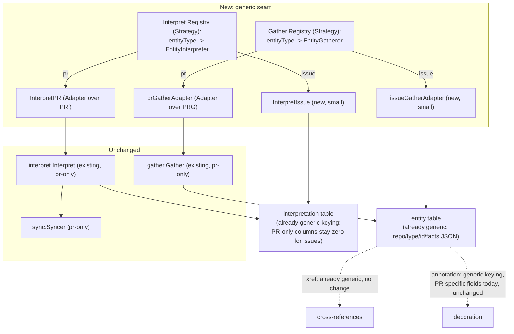

# pg-desk: a generic entity gather/interpret core, with issue-type entities as its first instance

- **Date**: 2026-09-23
- **Status**: Draft — pending operator review (no independent adversarial review yet; see §8)
- **Bead**: `pg2-2j5ac.46`
- **Blocks**: `pg2-2j5ac.27` (daily-focus store-first, phase 15) — that design's §4.1 treats this
  bead as an external prerequisite and assumes the design below without specifying it. Once this
  bead closes, that document's §4.1/§6 can be finalized against the actual mechanism instead of
  deferring it.
- **Relates to**: `docs/superpowers/specs/2026-09-09-pg-desk-and-connector-discovery-design.md`
  (the founding pg-desk design, `pg2-od9se`, epic `pg2-2j5ac`) — this document does not amend that
  one's decisions ledger, but clarifies D10's "the interpreter is generic" in a direction that
  design did not itself specify: generic across entity TYPES, not only across backends within one
  type.

## 1. Purpose and scope

`pg-desk`'s gather → interpret → persist pipeline has, since Phase 9, been able to fetch and
interpret exactly one entity type: a PR. Phase 15's daily-focus redesign (`pg2-2j5ac.27`) is the
first consumer that needs pg-desk to hold its own facts about issue-type entities (Jira tickets, bd
epics, bd tasks) — not merely use an issue as a signal to refresh a linked PR's interpretation,
which is all `run issue` does today. Three review rounds during that design session found the gap
runs through every layer of the pipeline that was built PR-only: `gather` rejects any entity type
other than `pr` outright; `interpret` is gated on PR-shaped facts being present; `persist`'s
interpretation-table write is built entirely from PR-shaped fields; `run.go`'s issue dispatch has
no seam to add a "persist this issue's own facts" step; two operator-facing surfaces hardcode the
ledger table's three PR-bead sync kinds; and the behavior doc documents the opposite of what's
needed.

Rather than solve this as a third bolt-on special case (PR gather, PR-as-signal-for-urgency,
now issue-as-a-third-thing), this document designs a genuinely generic gather/interpret **core**,
with the PR pipeline **left completely untouched** as the first, still-unmigrated specialized
case, and issue-type support built as the **first real instance** of the new generic seam — a
second data point, not a rewrite of the first. This validates the seam before any third type
(calendar, notes, email — none of which have a `pg-connector` provider yet) is ever built against
it.

In scope: a generic gather adapter contract and registry; a generic interpret adapter contract and
registry, reusing the existing `interpretation` table's columns that already generalize; the
`pipeline` entry point that dispatches through both; the `run issue` dispatch change needed for
entities with no linked PR; a `beadref` error taxonomy addition; and a small ledger-kind dedup.

Out of scope: any actual calendar/notes/email connector (none exist in `pg-connector` yet); the
`internal/focus` package and its priority/due-date ranking logic (owned by `pg2-2j5ac.27`'s own
phase, reads this bead's output, is not part of it); rewriting `docs/behavior/pg-desk/run-issue.md`
(lands in the implementation phase that changes the behavior, per this repo's own convention — not
this design bead's own deliverable); any decoration/annotation generalization beyond noting the
keying is already generic.

## 2. Decisions ledger

Operator rulings from this 2026-09-23 design session.

| #    | Decision                                                                                                                                                                                                                                                                                                                                                                                                                                                                                                                                                                                                                                                                           |
| ---- | ---------------------------------------------------------------------------------------------------------------------------------------------------------------------------------------------------------------------------------------------------------------------------------------------------------------------------------------------------------------------------------------------------------------------------------------------------------------------------------------------------------------------------------------------------------------------------------------------------------------------------------------------------------------------------------- |
| D-G1 | Scope is the generic gather/interpret **core**, not a narrow issue-type-only fix. The founding pg-desk design's own connector layer (`pg-connector`'s provider set: `pr`, `issue`, `ci`, `scm`, `calendar`, `thread`, `agentsession`, `search`, `attention`) was already domain-agnostic; only pg-desk's own gather/interpret pipeline stayed PR-locked. Building issue-type support as the first instance of a real generic seam, rather than a second special case, is the point of this bead.                                                                                                                                                                                   |
| D-G2 | The PR pipeline (`gather.Gather`, `interpret.Interpret`, `gather.Facts`, `interpret.Interpretation`'s existing PR-only columns) is **not refactored or migrated**. It is registered into the new generic dispatch via a thin Adapter, unchanged underneath. Reuse-first: a working, pinned-contract pipeline is not touched to add genericity that has zero near-term benefit to it.                                                                                                                                                                                                                                                                                               |
| D-G3 | Issue-type entities **do** get a real `interpretation` row, using the existing table's columns that already generalize (`ownership`, `category`, `degraded`, `as_of`) — reversing an earlier, narrower analysis in this same session that argued for entity-row-only. A persisted, periodically-refreshed interpretation row does not conflict with daily-focus's "never cache the rank" rule (D-F5 of `pg2-2j5ac.27`'s own doc): that rule governs live recomputation of the RANK/SELECTION decision at read time, not whether the underlying rows are cached — PR urgency is already exactly this kind of periodically-refreshed cache today.                                    |
| D-G4 | `Ownership` is **not** duplicated per entity type. `interpret.classifyOwnership(self, primary string, coOwnerCandidates []string) Ownership` (existing, `ownership.go`) is reused unchanged for issues: `classifyOwnership(cfg.SelfIssueOwner, issue.Owner, []string{issue.Assignee})`. A PR's "opened by someone else but I committed to it" and an issue's "owned by someone else but assigned to me" are the same relationship (`CoOwned`). Only the config value feeding it (`SelfIssueOwner`, new) is type-specific — GitHub login and a bd/Jira owner identity are genuinely different strings for the same person and cannot collapse into one field.                       |
| D-G5 | `Urgency` (and `Enrichment`/`Dispositions`/`Approvals`/`GateState`/`MatchReasons`/`Panel`/`ReadyToPromote`) stay zero-value for issue-type interpretation rows. No due-date/priority scoring is written in this bead. `pg-desk` has no existing due-horizon or priority-mapping logic to reuse (checked against `urgency.go`: its Jira signal is a crude high-priority-list boolean, not the richer scoring `pg2-2j5ac.27`'s own §6 needs), and that consumer must recompute urgency live with cross-entity correlation regardless — writing a duplicate, unread scoring function here now would diverge from what that phase actually needs. Write it once, where it is consumed. |
| D-G6 | `run issue`'s existing two branches are preserved unchanged for PR-linked ids (Jira ticket already xref'd to a PR; a bead matching one of the three PR-linked shapes). A bead matching **none** of those shapes falls through, in the SAME command, to the new generic gather+persist path — no separate new verb. A Jira ticket **always** does both (persist its own facts AND re-interpret linked PRs), since a ticket is never itself "about" one PR, only cross-referenced to some.                                                                                                                                                                                           |
| D-G7 | `status.go`/`show.go`'s duplicated 3-element ledger-kind literal is deduplicated into one exported `sync.KnownLedgerKinds`, consumed by both call sites. No new kind is added by this bead — this is pure reuse-first cleanup so `pg2-2j5ac.27`'s own `internal/focus` package has exactly one place to add `"focus-item"` later.                                                                                                                                                                                                                                                                                                                                                  |

## 3. Architecture overview



Design vocabulary: the Gather/Interpret registries are the **Strategy** pattern (one algorithm
per entity type, selected at dispatch time), realized as a small **Registry** (`map[string]...`)
rather than a compile-time switch, so a third type is one map entry, not a new arm at every call
site. `prGatherAdapter`/`InterpretPR` are the **Adapter** pattern: they let the existing, unchanged
PR implementations satisfy the new generic contracts without modification.

## 4. Gather

New file `internal/gather/entity.go` — `gather.go`/`Facts` are not modified.

```go
// EntityGatherer is the per-entity-type gather adapter contract (Strategy).
// internal/pipeline's registry dispatches to the one registered for a
// given entityType.
type EntityGatherer interface {
	GatherEntity(ctx context.Context, entityID string, change ChangeKind) (GatherResult, error)
}

// GatherResult is the generic envelope every EntityGatherer returns — what
// internal/pipeline persists verbatim into the entity table's facts column
// (Entity.Facts is already an untyped JSON blob; no schema change).
type GatherResult struct {
	Payload      json.RawMessage
	AsOf         string
	Degraded     string
	RemovedState string // "" unless this type defines a removed/not_found concept
}

// IssueFacts is the issue-type entity's own gather payload — new, small,
// self-contained (parallel to Facts, never merged into it). One field
// this phase; a later phase MAY widen it (e.g. an issue's own
// linked-issue cross-references) without touching Facts or any PR code.
type IssueFacts struct {
	IssueShow json.RawMessage `json:"issue_show,omitempty"`
}

// prGatherAdapter adapts the existing, unchanged Gather method — an
// Adapter, not a rewrite.
type prGatherAdapter struct{ g *Gatherer }

func (a prGatherAdapter) GatherEntity(ctx context.Context, entityID string, change ChangeKind) (GatherResult, error) {
	facts, err := a.g.Gather(ctx, "pr", entityID, change)
	if err != nil {
		return GatherResult{}, err
	}
	payload, err := json.Marshal(facts)
	if err != nil {
		return GatherResult{}, fmt.Errorf("gather: marshal pr facts: %w", err)
	}
	return GatherResult{Payload: payload, AsOf: facts.AsOf, Degraded: facts.Degraded, RemovedState: facts.RemovedState}, nil
}

// issueGatherAdapter is new and small: one `issue show <id>` targeted
// call, reusing g.targetedCall's existing 0/4/1 classify and
// g.issueBeadsDirEnv's existing workspace-var threading — no new
// exec/classify mechanism.
type issueGatherAdapter struct{ g *Gatherer }

func (a issueGatherAdapter) GatherEntity(ctx context.Context, entityID string, change ChangeKind) (GatherResult, error) {
	raw, notFound, err := a.g.targetedCall(ctx, []string{"issue", "show", entityID}, a.g.issueBeadsDirEnv())
	if notFound {
		return GatherResult{RemovedState: "not_found"}, nil
	}
	if err != nil {
		return GatherResult{}, fmt.Errorf("gather issue: fetch %s: %w", entityID, err)
	}
	var asOf struct {
		AsOf string `json:"as_of"`
	}
	_ = json.Unmarshal(raw, &asOf) // best-effort; empty AsOf just means interpret stamps clock time

	payload, err := json.Marshal(IssueFacts{IssueShow: raw})
	if err != nil {
		return GatherResult{}, fmt.Errorf("gather issue: marshal %s: %w", entityID, err)
	}
	return GatherResult{Payload: payload, AsOf: asOf.AsOf}, nil
}

// EntityGatherers returns the Registry every generic-path caller
// dispatches through — exactly {"pr", "issue"} today. Adding a third type
// is one more map entry here, never a new switch arm in cmd/pg-desk/run.go
// or internal/pipeline.
func (g *Gatherer) EntityGatherers() map[string]EntityGatherer {
	return map[string]EntityGatherer{
		"pr":    prGatherAdapter{g: g},
		"issue": issueGatherAdapter{g: g},
	}
}
```

## 5. Interpret

New file `internal/interpret/entity.go` — `interpret.go`/`Interpret`/`Interpretation` are not
modified (only consumed).

```go
// EntityInterpreter is the per-entity-type interpret adapter contract
// (Strategy, realized as a func type: this package is already
// stateless/pure-function-shaped, so a func type is the idiomatic fit over
// an interface with nothing to close over).
type EntityInterpreter func(result gather.GatherResult, clock Clock, cfg *config.Config) (Interpretation, error)

// InterpretPR adapts the existing, unchanged Interpret function.
func InterpretPR(result gather.GatherResult, clock Clock, cfg *config.Config) (Interpretation, error) {
	var facts gather.Facts
	if err := json.Unmarshal(result.Payload, &facts); err != nil {
		return Interpretation{}, fmt.Errorf("interpret: decode pr payload: %w", err)
	}
	return Interpret(facts, clock, cfg)
}

// InterpretIssue is new and small: fills in the columns that already
// generalize (Ownership, Category, Degraded, AsOf) and leaves every
// PR-only column at zero value (D-G5).
func InterpretIssue(result gather.GatherResult, clock Clock, cfg *config.Config) (Interpretation, error) {
	now := clock.Now().UTC().Format(time.RFC3339)
	var facts gather.IssueFacts
	if err := json.Unmarshal(result.Payload, &facts); err != nil {
		return Interpretation{}, fmt.Errorf("interpret: decode issue payload: %w", err)
	}
	if len(facts.IssueShow) == 0 {
		return Interpretation{Degraded: result.Degraded, AsOf: now}, nil
	}
	var issue issueShowFields // ID/Owner/Assignee/IssueType — hand-decoded, same convention as gather.go's prShowFields
	if err := json.Unmarshal(facts.IssueShow, &issue); err != nil {
		return Interpretation{}, fmt.Errorf("interpret: decode issue show: %w", err)
	}
	var selfIssueOwner string
	if cfg != nil {
		selfIssueOwner = cfg.SelfIssueOwner
	}
	return Interpretation{
		Ownership: string(classifyOwnership(selfIssueOwner, issue.Owner, []string{issue.Assignee})),
		Category:  issue.IssueType, // verbatim tracker vocabulary, not PR's classifyCategory mechanism — a different concept (echoed, not inferred)
		Degraded:  result.Degraded,
		AsOf:      now,
	}, nil
}

// EntityInterpreters returns the Registry symmetric with gather's
// EntityGatherers.
func EntityInterpreters() map[string]EntityInterpreter {
	return map[string]EntityInterpreter{
		"pr":    InterpretPR,
		"issue": InterpretIssue,
	}
}
```

`issue.Owner` requires `schema.Issue` to gain an `Owner` field (bd's `owner` key), mapped in
`pg-connector-issue-beads`'s backend the same way `Assignee`/`Parent` were added — this was already
named in `pg2-2j5ac.27`'s own D-F8 and is a shared prerequisite, not duplicated here.

`config.Config` gains one new field, `SelfIssueOwner string` (sibling to the existing `SelfLogin`,
not a replacement or a restructure into a nested identity struct — `SelfLogin` is GitHub-specific
and already deployed; renaming it would be a breaking config-file change for zero benefit).

## 6. Pipeline

New file `internal/pipeline/entity.go`. `Run` (PR path) and `RunInterpretOnly` are unchanged.

```go
// RunGenericEntity is the third entry point: gather -> interpret -> persist
// for any registered entityType, dispatched through both registries.
// Sync is never invoked here — sync stays PR-only, per Run's existing
// entityTypePR gate.
func (p *Pipeline) RunGenericEntity(ctx context.Context, entityType, entityID string, change gather.ChangeKind) error {
	gatherers := p.gatherer.(interface{ EntityGatherers() map[string]gather.EntityGatherer }).EntityGatherers()
	adapter, ok := gatherers[entityType]
	if !ok {
		return fmt.Errorf("pipeline: no gather adapter registered for entity type %q", entityType)
	}
	result, err := adapter.GatherEntity(ctx, entityID, change)
	if err != nil {
		return fmt.Errorf("pipeline: gather %s %s: %w", entityType, entityID, err)
	}

	interpreter, ok := interpret.EntityInterpreters()[entityType]
	if !ok {
		return fmt.Errorf("pipeline: no interpret adapter registered for entity type %q", entityType)
	}
	interp, err := interpreter(result, p.clock, p.cfg)
	if err != nil {
		return fmt.Errorf("pipeline: interpret %s %s: %w", entityType, entityID, err)
	}

	// persist() is widened to take a raw json.RawMessage payload instead of
	// gather.Facts specifically for the entity.facts write — it already
	// generalizes to any entityType/entityID; only its first-argument type
	// needs to loosen, not its behavior.
	_, err = p.persistRaw(entityType, entityID, result.Payload, result.AsOf, interp)
	return err
}
```

## 7. Dispatch (`cmd/pg-desk/run.go`) and `beadref`

```go
// beadref.go: today's ResolvePR collapses "bead unreadable" and "bead
// matches no known PR-linked shape" into one undifferentiated error — the
// exact missing seam cmd/pg-desk/run.go needs.
var ErrNoPRLink = errors.New("beadref: bead matches no known PR-linked shape")
// The "matches no known bead shape" branch now wraps ErrNoPRLink instead
// of a bare fmt.Errorf; the Show-failure branch is unchanged (still a
// genuine failure, not a shape mismatch).
```

```go
// run.go dispatch:
case "issue":
    if ticketkey.MatchesShape(entityID, cfg.TicketPatterns) {
        return runJiraIssue(cmd.Context(), p, cfg, st, entityID, change) // widened below
    }
    return runBeadIssue(cmd.Context(), p, cfg, st, entityID, change) // new, replaces the inline resolve-or-fail block

// runBeadIssue: try today's resolve-to-linked-PR first (unchanged for
// anchor/feedback-cycle/review-request beads); ErrNoPRLink falls through
// to the new generic path instead of erroring.
func runBeadIssue(ctx context.Context, p *pipeline.Pipeline, cfg *config.Config, st *store.Store, beadID string, change gather.ChangeKind) error {
	_, prEntityID, err := runResolveBeadPR(ctx, cfg, beadID)
	switch {
	case err == nil:
		return p.RunInterpretOnly(ctx, entityTypePR, prEntityID, change)
	case errors.Is(err, beadref.ErrNoPRLink):
		return p.RunGenericEntity(ctx, "issue", beadID, change)
	default:
		return fmt.Errorf("run issue: resolve bead %s to PR: %w", beadID, err)
	}
}

// runJiraIssue widened: ALWAYS persists the ticket's own facts (new), in
// addition to re-interpreting every linked PR (existing, unchanged).
// Failures from both steps join — the same "every one attempted, no
// short-circuit" convention the existing multi-PR loop already uses.
func runJiraIssue(ctx context.Context, p *pipeline.Pipeline, cfg *config.Config, st *store.Store, ticketKey string, change gather.ChangeKind) error {
	var errs []error
	if err := p.RunGenericEntity(ctx, "issue", ticketKey, change); err != nil {
		errs = append(errs, fmt.Errorf("persist issue %s: %w", ticketKey, err))
	}
	// ... existing xrefs/re-interpret loop, unchanged, appends into errs ...
}
```

The beads-backend workspace variable (`PG_CONNECTOR_ISSUE_BEADS_DIR`/`BEADS_DIR`) needs no new
threading: `issueGatherAdapter` reuses `g.issueBeadsDirEnv()`, the same helper every existing issue
exec already uses. `pg-connector`'s `DispatchTargeted` short-circuiting on any error other than
`ErrNotFound` (so a beads backend's `ErrUnavailable` from a missing workspace var would not fall
through to a Jira backend) is not a live bug for this design: as long as the env var is always
threaded — which it now is, via the same existing helper — that failure mode is not reached.

## 8. Ledger kinds

```go
// internal/sync/classify.go — the settled dedup (D-G7).
// KnownLedgerKinds is the ordered, canonical kind list — the single place
// status.go and show.go now both read from, instead of each hand-rolling
// its own literal copy. No new kind added here; pg2-2j5ac.27's own
// internal/focus package appends "focus-item" to this one slice later.
var KnownLedgerKinds = []string{KindAnchor, KindFeedbackCycle, KindReviewRequest}
```

`status.go`'s `plannedSyncKinds` and `show.go`'s inline `[]string{"anchor", "feedback-cycle",
"review-request"}` both become `sync.KnownLedgerKinds`.

## 9. Store and schema

No schema migration. `entity` (already keyed generically by `repo, entity_type, entity_id` with an
untyped JSON `facts` column) and `interpretation` (same keying; PR-only columns simply stay at
their zero value for issue rows) need no changes. `xref` (cross-references) is already fully
generic and gets more use, not more code. `annotation`'s keying is already generic; its two fields
(`Hidden`, `WIP`) carry PR-review-specific meaning today — extending `Hidden` to a type-agnostic
"hide from my desk view" is plausible future work, not built here.

## 10. Testing

New test suites needed, none touching existing PR-path tests: `EntityGatherers`/`EntityInterpreters`
registry dispatch (including the "no adapter registered" error path, which matters once a third
type is added and one registry is updated without the other); `issueGatherAdapter`'s not_found and
degraded paths; `InterpretIssue`'s ownership/category mapping and its own empty-payload early
return; `runBeadIssue`'s three-way branch (resolves to PR / falls through via `ErrNoPRLink` /
genuine `Show` failure); `runJiraIssue`'s widened dual-effect behavior and error-join; the
`sync.KnownLedgerKinds` dedup (both call sites read the same slice).

## 11. Open items for operator review

- **No independent adversarial review yet.** This document was produced entirely through live,
  synchronous back-and-forth with the operator in one session — unlike `pg2-2j5ac.27`'s own doc,
  which underwent three independent review rounds before this bead was even filed. A next-session
  pass should get an independent critique before this bead closes (see the handoff bead filed
  alongside this document).
- **Naming**: `RunGenericEntity`, `EntityGatherer`/`EntityInterpreter`, `persistRaw` are working
  names from this session, not finalized.
- **`schema.Issue.Owner`** (D-F8, named by `pg2-2j5ac.27`'s own doc) is a shared prerequisite this
  design also depends on but does not itself decompose — whichever bead lands it first should be
  sequenced ahead of or alongside this one's own implementation.
- Whether `IssueFacts` should widen in this same phase to record an issue's own discovered
  cross-references (mirroring PR gather's Jira-ticket/thread xref writes) was raised and
  deliberately left for a later phase (§1 out-of-scope) — not decided against, just not needed by
  `pg2-2j5ac.27`'s own checkpoint.

## 12. Rejected alternatives

- **Solving issue-type support narrowly**, without a generic seam — rejected; would have been the
  third PR-shaped special case in this codebase's history (PR gather itself, Jira-as-signal in
  Phase 13, now issue-as-a-third-thing), and the connector layer underneath was already generic,
  making the narrowing avoidable rather than load-bearing (D-G1).
- **Skipping the interpretation row entirely for issue-type entities** — an earlier position in
  this same session, reversed by D-G3 once "never cache the rank" was correctly scoped to
  read-time recomputation, not to whether the underlying row exists.
- **A separate `classifyIssueOwnership` function** — rejected; `interpret.classifyOwnership` already
  generalizes exactly (D-G4).
- **A new `scoreIssueUrgency` function inside `interpret`** — rejected; no existing logic to port,
  and the one real consumer (`pg2-2j5ac.27`'s `internal/focus`) needs to recompute this live with
  cross-entity correlation regardless, so writing it here now would be a second, divergent
  implementation of logic that has to be written properly later anyway (D-G5).
- **A distinct new verb** (e.g. `pg-desk gather-issue <id>`) instead of falling through inside
  `run issue`'s existing dispatch — rejected (D-G6); one verb, one dispatch point, matching how the
  Jira half already needs to do two things unconditionally.
- **Restructuring `Config.SelfLogin` into a nested `Self` identity struct** alongside the new
  `SelfIssueOwner` field — rejected; would be a breaking config-file change to an already-deployed
  field for no benefit beyond cosmetic grouping.
