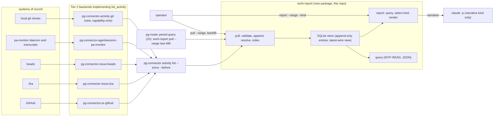

# A unified work-tracker on pg-connector: the `activity` capability, `work-report`, and the retirement of activity-collector and work-activity-tracker

**Status**: Approved 2026-10-05 (revision 2; the operator's spec-review rulings are recorded in
section 13, and the "proposed" ledger rows are thereby adopted). Written 2026-09-23 under bead
`pg2-6pn7g`; revision 2 applies the operator's rulings of that day (WT-D5, WT-D6, WT-D18's filing)
and the findings of one independent review round. Supersedes the uncommitted draft
`2026-09-23-work-report-connector-integration-design.md` (revisions 1-3, same day); Appendix A
records what that draft's content became here.
**Date**: 2026-09-23 (revision 2, approved 2026-10-05). Text corrections from the post-approval
review were applied 2026-10-05 under bead `pg2-zc9s0` (findings recorded on decomposition bead
`pg2-319a2`, program epic `pg2-vfmp7`); they change no section 13 ruling.
**Deciders**: Phillip Green II (operator), in conversation with Claude
**Beads**: `pg2-6pn7g` (this plan), `pg2-lelc0` (work-report's tracking bead, which this plan
refines), `pg2-2j5ac` (the connector program epic, cited for context, not a dependency)
**Amends**: `docs/superpowers/specs/2026-09-03-unified-connector-architecture-design.md` (the
connector design of record: adds a third cross-cutting capability and a capability-only backend
kind) and `docs/superpowers/specs/2026-09-09-pg-desk-and-connector-discovery-design.md` (refines
its decision D11)
**Builds on**: work-report's behavior docs at commit `3a61f08` on `phillipgreenii-nix-support-apps`
main (`packages/work-report/docs/behavior/`), treated as the floor of intended behavior (signed
off 2026-10-05); three amendments to them were approved the same day, in the section "Behavior-doc
amendments"

## 1. Purpose and scope

The operator wants ONE tool that records their own work and renders it as reports. Two prior
attempts exist in `phillipgreenii-nix-support-apps` — `packages/activity-collector` (Go, SQLite,
manual daily CLI, never deployed) and `packages/work-activity-tracker` (Python, event-sourced,
deployed on the work machine, manual only) — and a third, `packages/work-report`, has behavior docs
but no code. The operator's stated intent is that the first two are removed when the third is
built. The 2026-09-18 ruling on `pg2-lelc0` says the third MUST ingest through `pg-connector`
rather than reinvent source integration; this document decides the mechanics, end to end, as the
bead `pg2-6pn7g` asked: not "how does work-report call pg-connector" but "what does one
work-tracker built on pg-connector look like".

**What the reports are for** (operator, 2026-09-23, in answer to a direct question): daily and
weekly status write-ups, and a durable personal record for retros. Not, as primary goals,
time-accounting or agent-session auditing. Two consequences drive the design:

- A durable record MUST be able to **backfill** a past range on demand. Forward-only observation
  of live state is not enough.
- Attribution MUST be reliable: an entry in the record is something the operator did, not
  something that happened in a workspace the operator can see.

**Facts about what already exists**, verified 2026-09-23 against code (paths under
`packages/pg-connector` unless noted):

- `pg-connector`'s `list` op takes a **static named query** plus an opaque cursor and `ids_only`
  (`pkg/provider/*/dispatch.go`, `pkg/schema/queries.go`). There is no range parameter: a caller
  cannot ask any type for "entities in a date span".
- `changes` exists for `pr`, `issue`, `calendar`, `thread` only; its ledger keeps per-entity
  hashes and a monotonic version, no timestamps and no bodies (`cmd/pg-connector/ledger.go`). It
  is forward-only by construction.
- Entity schemas carry no event timestamps. `PR` has `merged` but no `merged_at`; `Issue` has
  `updated_at` only. A delta on Tuesday cannot say what happened on Tuesday.
- The Phase-14 entity cache holds latest copies with a one-hour max age and LRU eviction, served
  only when a backend is unavailable (`cmd/pg-connector/cache.go`). It is not a history.
- The design of record's section "Rejected alternative: canonical/shared store" forbids, with a
  mechanical test (`entity_store_test.go`), any store inside `pg-connector` keyed by more than one
  entity type. A history store therefore lives in a consumer, exactly as the pg-desk design's D11
  already says: "git activity is excluded; `work-report` owns it".
- `pg-desk`'s SQLite store is last-state per `(type, id)` (its design's section "Store"); it is
  "what is on my desk", not "what I did". The concurrent Phase-15 daily-focus design
  (`pg2-2j5ac.27`) works inside that store and does not touch this design.
- `pg-connector-agentsession-pa-monitor`'s `list` is a live-status snapshot
  (`pa-monitor status --json`); no op enumerates ended sessions. The 2026-09-18 agentsession design
  ruled that all Claude session and transcript knowledge flows through `pa-monitor`'s CLI, never a
  second transcript parser.
- The `scm` capability and its Tier-2 backend `pg-connector-scm-git` already exist on main
  (`packages/pg-connector/cmd/pg-connector-scm-git`): local git worktrees and cwd-to-branch
  resolution (`worktree_add`, `worktree_remove`, `worktree_list`, `branch_detect`), with no remote
  sync concept. `scm` does not cover commit history, so there is still no existing source of
  commits.
- `attention` and `search` are the house pattern for a cross-cutting capability: a schema file,
  a one-method provider interface, a dispatch table, a top-level `<capability>.sources`
  registration independent of `connector.<type>`, an umbrella fan-out verb, and a nix option
  (`pkg/schema/attention.go`, `pkg/provider/attention/`, `cmd/pg-connector/attention.go`,
  `home/programs/pg-connector/default.nix`). A binary MAY be registered under a capability's
  `sources` without owning any entity type.
- `pg-router` turns query items into events that roles bind and handlers act on
  (`packages/pg-router/internal/query`, `internal/orchestrator`). A command query whose output is
  an empty JSON array is accepted and produces no events (`internal/query/command.go`).
- `pjira search --expand changelog,comments --all` exists, so Jira transitions carry real
  timestamps. `bd list --json` carries `created_at`, `started_at`, `closed_at`, `updated_at`,
  `created_by`, `assignee`, `owner` and no event list.
- Time bounds were designed once already, for `search`: `pg2-emmut` (closed 2026-09-18) landed
  `docs/superpowers/specs/2026-09-18-search-time-bound-filter-design.md`, recommending per-call
  `--since`/`--before` flags delivered to backends through the wire `config` channel as
  `search_since`/`search_before`, with no provider-interface change. It is unimplemented: no such
  key exists in code and no implementation bead exists; the operator ruled (2026-10-05) that this
  follow-through is folded into Phase 0 (section "Ranged `list` queries"). No bead covers a range on `<type> list`;
  the pg-desk design's section "Named queries and the `list` op" says "named queries are not
  parameterized". `calendar list_events` is the one shipped op that already takes a range in its
  args (`{start, end}`, `pkg/provider/calendar/dispatch.go`).
- `pg-desk` is the precedent for a `pg-connector` consumer's module shape: a sibling Go module in
  this repo that execs the `pg-connector` binary from PATH and decodes its JSON into its own
  structs — its production code deliberately never imports `pkg/schema`; the local
  `replace => ../pg-connector` in its `go.mod` serves its test suite only
  (`packages/pg-desk/go.mod`, `packages/pg-desk/internal/gather/gather.go`).

**Out of scope**: the report's delivery channel (Slack, email, a served page); time accounting
(`work-timer`'s start/stop boundaries stay a separate, complementary stream a later source MAY
ingest); a relationship graph across entities (work-activity-tracker's `RelationshipDiscovered`
model — a later report kind MAY compute it from `fields`); efficient or indexed transcript
search (the 2026-09-18 design's deferral stands).

## 2. Decisions ledger

Each row is a decision this document makes. Every former "proposed" row was ruled in the operator's
2026-10-05 spec review (section 13); "adopted" rows apply an earlier operator ruling unchanged; "operator ruling" rows
were decided in the 2026-09-23 session and are settled. Every decision is elaborated in the section
named; WT-D16 (the name) has no section of its own and is listed under "Open items for operator
review".

| Id     | Decision                                                                                                                                                                                                                                                                                                                                                                                                                                                                                                                                                                                                                                                                                                       | Status                                                                                                                                                                                                                                                                                  | Section                                                    |
| ------ | -------------------------------------------------------------------------------------------------------------------------------------------------------------------------------------------------------------------------------------------------------------------------------------------------------------------------------------------------------------------------------------------------------------------------------------------------------------------------------------------------------------------------------------------------------------------------------------------------------------------------------------------------------------------------------------------------------------- | --------------------------------------------------------------------------------------------------------------------------------------------------------------------------------------------------------------------------------------------------------------------------------------- | ---------------------------------------------------------- |
| WT-D1  | Ingestion goes through ONE new cross-cutting `pg-connector` capability, `activity`, whose single op `list_activity` is **range-shaped** — `{since, before}` — not cursor-shaped. Backfill requires it; work-report's landed `INV-RANGE-1` already says it; no behavior-doc amendment is needed for the pull shape.                                                                                                                                                                                                                                                                                                                                                                                             | ruled 2026-10-05 (section 13, item 1) — reverses the 2026-09-23 revision-3 direction "cursor-based query op"                                                                                                                                                                            | The `activity` capability                                  |
| WT-D2  | `activity` is defined alongside, not as one of, the entity types, mirroring `attention`/`search` exactly: schema, provider interface, dispatch table, `activity.sources` registration, umbrella verb `pg-connector activity list`, nix option. Any backend MAY implement it its own way.                                                                                                                                                                                                                                                                                                                                                                                                                       | adopted (revision 3's WR-D1, operator 2026-09-23)                                                                                                                                                                                                                                       | The `activity` capability                                  |
| WT-D3  | Git commit activity ships as a **capability-only Tier-2 backend**, `pg-connector-activity-git`, registered under `activity.sources` only. No `scmlog` entity type is introduced now; one MAY be added later if a consumer needs `list`/`show`/`changes` over commits, the same reasoning the pg-desk design used to re-add `Thread` once `pg-desk` needed it (its sections "Jira, Slack, and git activity" and "Schema growth"; its D23 is the separate Slack-via-`claude -p` ruling). Variant rejected 2026-10-05: a `scmlog` type with backend `pg-connector-scmlog-git`.                                                                                                                                    | ruled 2026-10-05 (section 13, item 2) — narrows the revision-3 `scmlog` type; the `scmlog` variant was rejected                                                                                                                                                                         | Git commit activity                                        |
| WT-D4  | work-report owns the history store: SQLite, append-only entries, latest-wins resolution, outside `pg-connector` (the design of record's shared-store prohibition is untouched).                                                                                                                                                                                                                                                                                                                                                                                                                                                                                                                                | adopted (behavior docs + pg-desk design D11)                                                                                                                                                                                                                                            | work-report — Store                                        |
| WT-D5  | work-report lives in THIS repo as `packages/work-report`, a sibling Go module shaped like `pg-desk`; its behavior docs move here from `phillipgreenii-nix-support-apps` in the same change. This repo is public: work-report MUST carry no organization identifiers; all of those stay in the private machine flake's configuration.                                                                                                                                                                                                                                                                                                                                                                           | **operator ruling, 2026-09-23** — moves the tool out of `phillipgreenii-nix-support-apps` (private)                                                                                                                                                                                     | work-report — Placement                                    |
| WT-D6  | Ingestion is scheduled by **pg-router**: a `[[query]]` of type `command` on a one-hour period trigger runs `work-report pull --range last-48h --output pg-router`, which emits an item only for a degraded source and exits non-zero only when the pull could not run at all. pg-router's `status`/TUI and event log are the scheduler's observability. A plain timer is the recorded variant for a host without pg-router.                                                                                                                                                                                                                                                                                    | **operator ruling, 2026-09-23** — restores revision-3's "hourly via pg-router" (WR-D3) over this document's first-draft timer; the bound consumer is the deployment's existing `escalation-triager` role (operator: "the triage role is ok with me, but there is already one in place") | work-report — Scheduling and operability; pg-router's role |
| WT-D7  | Claude Code session history reaches `pg-connector` only through a new `pa-monitor sessions` subcommand; `pg-connector-agentsession-pa-monitor` implements `list_activity` over it and reads no transcript itself.                                                                                                                                                                                                                                                                                                                                                                                                                                                                                              | adopted (2026-09-18 agentsession design's operator decision), extended                                                                                                                                                                                                                  | Claude Code sessions                                       |
| WT-D8  | Attribution is actor-scoped: every backend's `list_activity` returns only items where the operator is the author, actor, assignee, or reviewer, using that backend's own configured identity. This resolves `OQ-ING-2`.                                                                                                                                                                                                                                                                                                                                                                                                                                                                                        | **operator ruling, 2026-09-23** (confirmed in a `/unblock-human-beads` session, recorded on `pg2-lelc0`)                                                                                                                                                                                | The `activity` capability — Attribution                    |
| WT-D9  | A schema-invalid item rejects that item only; the source's outcome is `succeeded` with a `rejected` count. This resolves `OQ-ING-1`.                                                                                                                                                                                                                                                                                                                                                                                                                                                                                                                                                                           | **operator ruling, 2026-09-23** (confirmed in a `/unblock-human-beads` session, recorded on `pg2-lelc0`)                                                                                                                                                                                | work-report — Ingestion                                    |
| WT-D10 | The default report kind when none is named is `baseline`. This resolves `OQ-REP-1`.                                                                                                                                                                                                                                                                                                                                                                                                                                                                                                                                                                                                                            | **operator ruling, 2026-09-23** (confirmed in a `/unblock-human-beads` session, recorded on `pg2-lelc0`); was the closest call of the four                                                                                                                                              | work-report — Reporting                                    |
| WT-D11 | Narrowing composes as AND across dimensions and OR within a dimension. This resolves `OQ-REP-2`.                                                                                                                                                                                                                                                                                                                                                                                                                                                                                                                                                                                                               | **operator ruling, 2026-09-23** (confirmed in a `/unblock-human-beads` session, recorded on `pg2-lelc0`)                                                                                                                                                                                | work-report — Reporting                                    |
| WT-D12 | The narrative kind's generator execs `claude -p` with the hardening `activity-collector` already proved (system prompt out of band, data on stdin inside a neutralized fence, no tools). The connector program's compute-only rule governs `pg-connector`/`pg-desk` interpretation, not report rendering, so it is not violated.                                                                                                                                                                                                                                                                                                                                                                               | ruled 2026-10-05 (section 13, item 6)                                                                                                                                                                                                                                                   | work-report — Reporting                                    |
| WT-D13 | One command, `work-report`, with subcommands `pull`, `report`, `query`, `status`, `config` — the operator's own earlier suggestion for the CLI shape.                                                                                                                                                                                                                                                                                                                                                                                                                                                                                                                                                          | adopted (operator suggestion recorded on `pg2-lelc0`)                                                                                                                                                                                                                                   | work-report — CLI                                          |
| WT-D14 | Three amendments to the behavior docs: an optional `summary` and `url` on the entry shape (the baseline kind needs a type-independent line to print); `rejected`, `unchanged`, and `truncated` on the pull-outcome row plus an optional `count` on a `degraded` row; and the four open questions resolved in place.                                                                                                                                                                                                                                                                                                                                                                                            | ruled 2026-10-05 (section 13, item 7)                                                                                                                                                                                                                                                   | Behavior-doc amendments                                    |
| WT-D15 | `activity-collector` and `work-activity-tracker` are removed from `phillipgreenii-nix-support-apps` after the operator accepts this design's final checkpoint, not before.                                                                                                                                                                                                                                                                                                                                                                                                                                                                                                                                     | adopted (operator intent recorded on `pg2-lelc0`), sequenced here                                                                                                                                                                                                                       | Sequencing                                                 |
| WT-D16 | The tool keeps the name `work-report`. A rename is cheap later and not worth reopening the behavior docs for now.                                                                                                                                                                                                                                                                                                                                                                                                                                                                                                                                                                                              | ruled 2026-10-05 (section 13, item 8)                                                                                                                                                                                                                                                   | —                                                          |
| WT-D17 | A source that does not implement `activity` is simply not a work-report source. There is no per-backend named-query fallback path.                                                                                                                                                                                                                                                                                                                                                                                                                                                                                                                                                                             | ruled 2026-10-05 (follows from WT-D1) — drops revision-3's WR-D2                                                                                                                                                                                                                        | Rejected alternatives                                      |
| WT-D18 | Named `list` queries gain optional per-call time bounds: `pg-connector <type> list --query <name> --since <bound> --before <bound>`, delivered to backends as `list_since`/`list_before` on the wire `config` channel (the mechanism `pg2-emmut` chose for `search`), applied natively by each backend to its entities' last-updated time. Its own pg-connector bead, created in the decomposition pass (operator, 2026-09-23: not filed before the design is approved) and wired as a dependency of this program's Phase 1 by the operator's framing; the two share the umbrella's time-bound parser. It does not replace `activity`: a bounded entity list still carries no event kinds or event timestamps. | ruled 2026-10-05 (filing deferred to decomposition; folded with the pg2-emmut search follow-through); — operator direction 2026-09-23 ("no reason a time/date range can't be added to queries")                                                                                         | Ranged `list` queries                                      |

## 3. Architecture overview



Three layers, each already established by the connector program:

- **Tier 2 backends** talk to their own system and answer one new op. Each already holds the
  credentials and identity it needs (`self_login`, JQL `currentUser()`, the beads actor, the git
  author emails), which is what makes actor-scoped attribution (WT-D8) a per-backend concern.
- **The umbrella** fans `list_activity` out over `activity.sources`, reports per-source outcomes
  in the standard `sources[]` envelope, and concatenates items in config order. It merges nothing:
  activity items have source-unique ids and no cross-source identity worth deduplicating.
- **work-report** is a consumer exactly like `pg-desk`: it execs `pg-connector`, never `gh`,
  `bd`, `pjira`, `git`, or `pa-monitor`. It owns the only history store in the system.

## 4. The `activity` capability

### 4.1 Schema — `pkg/schema/activity.go`

An activity item is the wire shape of one thing the operator did, as one source saw it. The
common envelope is fixed; type-specific detail rides in `fields`, which the umbrella never
interprets (the operator's requirement for "a common schema which allows extension").

```go
const ActivitySchemaVersion = 1

// ActivityItem is one source's own record of one thing the operator did.
type ActivityItem struct {
	// ID is unique within the emitting backend and stable across pulls: the
	// same real-world happening MUST produce the same ID every time it is
	// returned (this is what makes overlapping pulls idempotent downstream).
	ID string `json:"id"`
	// Kind names what happened, dotted "<entity_type>.<verb>" by convention
	// (pr.merged, issue.transitioned, commit, session). An open vocabulary:
	// each backend declares the kinds it emits in its capabilities vocabulary.
	Kind string `json:"kind"`
	// EntityType and EntityID name the thing the happening is about, in that
	// type's own id form (pr: OWNER/REPO#N, issue: KEY or bead id). EntityType
	// is a source-defined string, not a closed enum; it need not be a
	// registered connector type (commit, session).
	EntityType string `json:"entity_type"`
	EntityID   string `json:"entity_id"`
	// OccurredAt is when it happened, RFC3339 with offset, taken from the
	// system of record — never the time of the pull. Required: a happening
	// the backend cannot date MUST NOT be emitted at all. A bounded
	// imprecision the system itself imposes (day-granular data) MUST set
	// Approximate; a backend MUST NOT substitute a different timestamp
	// (an entity's updated_at for a comment's own time) silently.
	OccurredAt  string `json:"occurred_at"`
	Approximate bool   `json:"approximate,omitempty"`
	// Summary is one human-readable line; URL is optional.
	Summary string `json:"summary"`
	URL     string `json:"url,omitempty"`
	// Labels are opaque "key:value" tags a consumer may index on (repo:OWNER/NAME,
	// project:KEY, workspace:NAME, branch:NAME). Optional.
	Labels []string `json:"labels,omitempty"`
	// Fields is the kind-specific payload, an object, opaque to the umbrella.
	Fields json.RawMessage `json:"fields"`
	// AsOf/Stale: INV-ASOF-1/2, same contract every other capability carries.
	AsOf  string `json:"as_of"`
	Stale bool   `json:"stale"`
}

type ActivityListArgs struct {
	// Since is inclusive, RFC3339 with offset. Empty means open-ended: the
	// start of the backend's own record (INV-RANGE-1 names an open-ended
	// range as legal); Truncated then carries whatever cap the system imposes.
	Since string `json:"since,omitempty"`
	// Before is exclusive, RFC3339 with offset, always present (the umbrella
	// fills "now" when the caller gives none).
	Before string `json:"before"`
}

type ActivityListResult struct {
	Items []ActivityItem `json:"items"`
	// Truncated is true when the backend or its system capped the result
	// (GitHub search's 1000-result cap, a page limit): the caller MUST treat
	// the range as incompletely covered.
	Truncated bool `json:"truncated"`
}
```

`ActivitySchemaVersion` is registered in `pkg/schema/versions.go`'s `CurrentSchemaVersions` under
the key `activity`, so `config validate`'s schema-skew check sees it (the attention precedent).

### 4.2 Provider interface and dispatch — `pkg/provider/activity/`

```go
type Provider interface {
	// ListActivity returns every item the operator did in [since, before),
	// as this backend's system records it, scoped to the operator's own
	// identity (WT-D8). A zero since means open-ended. It MAY return items
	// in any order; the caller sorts.
	ListActivity(ctx context.Context, since, before time.Time) (*schema.ActivityListResult, error)
}
```

`NewDispatchTable(p)` registers op `list_activity` with `SchemaVersion: schema.ActivitySchemaVersion`
and adds `auth_status` only when `p` also satisfies `provider.AuthChecker`, byte-for-byte the shape
of `pkg/provider/attention/dispatch.go`. Argument decoding (`ActivityListArgs`: `before`
required, `since` optional and, when present, earlier than `before`) happens in the dispatch
handler; a malformed or reversed range is `ErrInvalidArgument`. **Phase 0 delivers every bound as
an RFC3339 instant with offset, after the umbrella's `parseTimeBound` has resolved any duration or
`<N>d` form against "now"**: no backend and no `ActivityListArgs` consumer ever parses a duration
or a day suffix, and the same holds for the `list_since`/`list_before` and `search_since`/
`search_before` keys. The range travels in the op's **args**, not the `config` channel: unlike a
time bound on `search` (an optional filter on an existing op, which the landed `pg2-emmut` design
routes through `config` to avoid widening a shared interface), the range is the whole meaning of
this new op and is required on every call.

Every backend implementing it declares its kinds in the capabilities vocabulary:
`vocabulary.activity_kinds = ["pr.opened", ...]`, the same extension seam `search_attributes` and
`cache_opt_out` already use. It is inspectable through each backend's `capabilities` response,
and `pg-connector config validate` MAY print the union so an operator can see what a host can
record before pulling (`config show` stays a no-backend-invoked view, as its doc comment promises).

### 4.3 Registration and configuration

A new top-level `activity:` key with `sources: [...]`, a sibling of `attention:` and `search:`,
parsed by `registry.go` into `Registry.activitySources` with accessor `ActivitySources()`,
validated by the shared `validateBackendList`. A binary MAY appear here and under a
`connector.<type>` key; `pg-connector-activity-git` appears only here.

Nix: `phillipgreenii.programs.pg-connector.activity.sources` (list of str, default empty),
rendered into the shared config file exactly as `attention.sources` is. Per-backend activity
semantics (author emails, repo lists, which kinds to emit) are ordinary keys on that backend's
opaque `backends.<name>` block; the module MAY grow a typed `activity.perBackend` later, as
`attention.perBackend` did, once two backends share a key shape.

### 4.4 Umbrella verb — `cmd/pg-connector/activity.go`

```text
pg-connector activity list --since <bound> --before <bound> [--backend <b>] [--output json]
```

- `--since`/`--before` accept an RFC3339 timestamp, a Go duration (`168h`), or a whole-day
  duration (`7d`) meaning "this long ago". That is the one time-bound syntax `pa-monitor search`
  and `pa-monitor sessions`, the `search --since/--before` of `pg2-emmut`, and the ranged `list` of
  WT-D18 all share, parsed by one helper (`parseTimeBound`) in `cmd/pg-connector`, which Phase 0
  owns. `time.ParseDuration` rejects `7d`, so the helper adds the day suffix (the existing
  `parseDayDuration` in `cmd/pg-connector/ledger.go` is the model), and `pa-monitor`'s own
  `parseTimeBound` (`packages/pa-monitor/cmd/pa-monitor/search.go`, Go durations only today)
  gains the same suffix when `pa-monitor sessions` lands (Phase 4), so one syntax holds across
  both tools. `--before` defaults to now; an omitted `--since` is the open-ended range.
- A fan-out op over `ActivitySources()` (INV-OUT-1), with the standard `sources[]` rows:
  `succeeded` with the raw item count, `degraded` with a reason, `disabled: not applicable` on
  `unknown_op`. `--backend` pins one source (the pin `issue list` already has), so a consumer can
  re-pull one source after a degraded outcome. The `sources[]` rows are the `list`-shaped
  `SourceResult` rows (`source`, `status`, `count`, `reason`) that `issue list` and `search` emit.
  `pg-connector <type> changes` is NOT the model: it has no `--backend` flag (only `--query`,
  `--consumer`, `--cached`, `--reset`), and its `sources[]` rows use `backend`, not `source`
  (`cmd/pg-connector/changes.go`'s `changesSourceRow`).
- Items are concatenated in config order, each row carrying `source` (the backend name). No
  merge, no dedup, no cap. Per-source `truncated` is surfaced on that source's row
  as `truncated: true`, never folded into the exit code (a truncated result is a warning, the
  pg-desk design's section "Outcomes and exit codes").
- Exit codes: the fan-out scheme (0 complete, 2 degraded, 3 total failure).

Output (`--output json`):

```json
{
  "sources": [
    {
      "source": "pg-connector-pr-github",
      "status": "succeeded",
      "count": 7,
      "truncated": false
    }
  ],
  "items": [{ "source": "pg-connector-pr-github", "item": {} }]
}
```

### 4.5 Attribution (WT-D8, resolves `OQ-ING-2`)

Every backend scopes `list_activity` to the operator using the identity it already has:

| Backend                                | Identity used                                                                                                          | What qualifies as "mine"                                                                                    |
| -------------------------------------- | ---------------------------------------------------------------------------------------------------------------------- | ----------------------------------------------------------------------------------------------------------- |
| `pg-connector-pr-github`               | the authenticated viewer (`@me` in search; the backend resolves the login statelessly with its existing viewer lookup) | PRs I authored (opened, merged, closed); reviews I submitted; comments I wrote                              |
| `pg-connector-issue-jira`              | `currentUser()` in JQL; the changelog and comment author fields                                                        | Issues I created; status transitions I performed; comments I wrote                                          |
| `pg-connector-issue-beads`             | the actor names configured for this host (`activity_actors`, a list)                                                   | Beads I created (`created_by`), started or closed while I was `assignee` or `owner`                         |
| `pg-connector-agentsession-pa-monitor` | none needed: every session on this single-user machine is the operator's                                               | Every session; dispatched agent sessions are labeled `agent:dispatched` when pa-monitor can tell them apart |
| `pg-connector-activity-git`            | `author_emails` (a list, mirroring activity-collector's config)                                                        | Non-merge commits whose author email is in the list                                                         |

A backend whose system holds other people's activity too (GitHub, Jira, beads, git) and that
cannot establish identity (a failed GitHub viewer lookup or missing auth, a Jira `currentUser()`
failure, empty `author_emails`, empty `activity_actors`) MUST answer `unavailable` with a reason
naming what is missing, never an unscoped result. The
pa-monitor source is the one exemption: its system holds only this machine's sessions, so it has
nothing to scope by and the table's "none needed" is the rule, not a gap. Multi-identity
mapping across systems (the same person as a GitHub login, a Jira account, a bd actor) is NOT
modeled: each backend scopes independently, and work-report's per-source labels are how a report
distinguishes them.

### 4.6 Per-backend implementations

Each kind's `fields` object is documented in that backend's `internal/` package and covered by a
fixture test; the envelope is the contract, the fields are the backend's own.

**Id rules.** `item.id` is the idempotency key downstream (latest-wins resolves on it), so two
distinct happenings MUST never share one and one happening MUST always produce the same one:

- A kind that happens at most once per entity (`pr.opened`, `pr.merged`, `pr.closed`,
  `issue.created`): `<entity_id>#<kind>`.
- A repeatable kind where the system has its own event identifier (`pr.reviewed` and
  `pr.commented`: the review or comment node id; `issue.transitioned` and `issue.commented`: the
  Jira changelog item id or comment id): `<entity_id>#<kind>#<event id>`.
- A repeatable kind with no system event id (`issue.started`, `issue.closed` on beads, which can
  recur after a reopen): `<entity_id>#<kind>#<occurred_at>`, RFC3339 in UTC.
- `commit`: `<repo_ident>@<sha>`. `session`: `session:<session_id>`.

- **`pg-connector-pr-github`** — GitHub search with date qualifiers, one query per kind, scoped by
  the configured repos/orgs it already knows: `author:@me created:<from>..<to>` → `pr.opened`
  (`created_at`); `author:@me merged:<from>..<to>` → `pr.merged` (`merged_at`);
  `author:@me is:unmerged closed:<from>..<to>` → `pr.closed` (`closed_at`);
  `reviewed-by:@me updated:<from>..<to>` then the PR's reviews → one `pr.reviewed` per review I
  submitted in range (`submitted_at`, with the state approved/changes-requested/commented in
  `fields`). Comments (`pr.commented`) SHOULD be emitted with per-comment timestamps from the
  PR's issue comments; a backend that has only the PR's `updated_at` MUST omit the kind rather
  than approximate (contrast activity-collector, which knowingly approximated). GitHub search
  date qualifiers accept full timestamps; the backend passes the exact bounds and still filters
  by each item's own timestamp. `truncated: true` when any query hits the 1000-result cap — the
  reason a wide backfill SHOULD be pulled one month at a time. Labels: `repo:OWNER/NAME`. Entity
  id: `OWNER/REPO#N`, the `pr` type's own form.
- **`pg-connector-issue-jira`** — `pjira search --all --expand changelog,comments --jql
"(reporter = currentUser() OR assignee = currentUser() OR watcher = currentUser()) AND updated >=
<since> AND updated < <before>"`, then per issue: `issue.created` when `created` is in range and
  `reporter` is me; one `issue.transitioned` per changelog `status` item authored by me in range
  (`fields.from`, `fields.to`, `fields.resolution`); one `issue.commented` per comment authored by
  me in range. Labels: `project:KEY`, `tracker:jira`. Entity id: the issue key.
- **`pg-connector-issue-beads`** — three bounded `bd list --json -n 0` calls in the configured
  workspace, never a whole-workspace scan: `--all --created-after <since> --created-before
<before>` → `issue.created` (`created_by` in `activity_actors`); `--all --closed-after <since>
--closed-before <before>` → `issue.closed` (`assignee`/`owner` in the list); and, because `bd`
  has no started-after filter, `--status in_progress` plus the closed set above, filtered by
  `started_at` in range → `issue.started` (`assignee`/`owner` in the list). `bd` exposes no per-event
  actor and no `closed_by`, so `started`/`closed` attribute by the assignee at pull time — stated
  in `fields.attribution: "assignee"`. Comments are not emitted in v1 (`bd comments` is one call
  per issue; the cost is unjustified until a report needs it). Labels: `workspace:<name>`,
  `tracker:beads`, plus each bead's own labels as `bead-label:<l>`. Entity id: the bead id.
  Implied work (Phase 3): the backend's `bdIssue` struct
  (`packages/pg-connector/cmd/pg-connector-issue-beads/internal/bd.go`) decodes only
  `updated_at` today and MUST gain `created_at`, `started_at`, `closed_at`, and `created_by`
  before it can date and attribute these three kinds.
- **`pg-connector-agentsession-pa-monitor`** — see the section "Claude Code sessions".
- **`pg-connector-activity-git`** — see the section "Git commit activity".

### 4.7 Ranged `list` queries (WT-D18)

Independently of `activity`, the operator directed (2026-09-23) that named `list` queries accept a
time/date range "to allow for more control". This section specifies it. It becomes its own
pg-connector bead outside this program's epic, created in the same decomposition pass that creates
the epic (the operator ruled "not yet" on filing it before the design is approved), and it is
wired as a dependency of Phase 1 (section "Sequencing") because the operator framed it as a
prerequisite. Phase 0 OWNS the umbrella's single time-bound parser (`parseTimeBound`), which
Phase 1's `activity list` consumes; the two otherwise travel different channels (the `activity`
range in op args, this one in the `config` channel), so beyond the shared parser the ordering is
the operator's preference, honestly labeled.

- **Verb**: `pg-connector <type> list --query <name> [--since <bound>] [--before <bound>]`, the
  same duration-or-RFC3339 syntax as every other bound in this repo. Both flags optional; absent
  flags leave `list` exactly as it is today.
- **Delivery**: the `pg2-emmut` mechanism. The umbrella merges `{"list_since": <RFC3339>,
"list_before": <RFC3339>}` onto the backend's static `backends.<name>` block for that call and
  passes the merged blob as the request's `config`; the `list` op's args (`query`, `cursor`,
  `ids_only`) and `Provider.List`'s Go signature do not change. The `list_` prefix avoids
  collision with `attention_*` and `search_*` keys in the same block. A backend that does not read
  the keys returns an unbounded result, and `list --help` states that asymmetry, as the search
  design requires for its own flags.
- **Semantics**: the bound applies to an entity's **last-updated** time, the one timestamp every
  remote system exposes as a query qualifier — GitHub `updated:<from>..<to>`, JQL `updated >=
<from> AND updated < <to>`, `bd`'s `updated_at`, Slack's `oldest`/`latest`. `present_ids` is the
  bounded match set. A backend MUST widen a day-granular qualifier and filter precisely by the
  entity's own timestamp, and MUST NOT apply a bound it cannot honor precisely without setting
  `truncated: true`.
- **`changes` never passes a range.** The ledger derives removals from `present_ids`; a bounded
  `present_ids` would tombstone every entity merely older than the window. The flags exist on
  `list` only; `changes --since` is rejected as an invalid argument.
- **Backends in scope**: `pg-connector-pr-github`, `pg-connector-issue-jira`,
  `pg-connector-issue-beads` (and `pg-connector-thread-slack` if its `oldest` cursor plumbing makes
  it trivial). `calendar` already has `list_events {start, end}` and gains nothing here.
- **Folded in (ruled 2026-10-05): the `pg2-emmut` follow-through.** Phase 0 also implements
  `pg-connector search --since/--before` exactly as the 2026-09-18 search time-bound design
  recommends: the umbrella delivers `search_since`/`search_before` through the wire `config`
  channel with no provider-interface change, using the same `parseTimeBound` helper; per that
  design only the agentsession backend needs code. No standalone bead is filed for it.
- **Use in this program**: work-report SHOULD use ranged `list` for **entity entries**
  (`INV-ENTITY-1`) — the standing facts about the PRs and tickets the operator's activity touched
  in a range — so a report can print a ticket's current title and status beside the transitions
  the operator made on it. `sources.<backend>.entity_queries` names the queries to pull; each
  entity becomes an entry with `type: "entity.<connector type>"`, `id: "<source>:entity:<entity
id>"`, `external_id` = the entity id, `occurred_at` = the entity's `updated_at` when its schema
  has one, else `as_of`, and `fields` = the entity. Latest-wins then keeps one current fact per
  entity, exactly the resolution the behavior docs' journey describes. This is a later phase and
  optional; activity entries do not depend on it.

What it does not do: a bounded entity list is still a list of entities, with no event kinds and no
event timestamps (`PR` has no `merged_at`). It cannot say what the operator did on Tuesday; that is
what `activity` is for. The two are complementary, and they share their plumbing.

**Acceptance criteria**

- `pg-connector pr list --query <q> --since 7d` returns only PRs updated in the window, with
  `present_ids` equal to the returned ids; the same call without flags is byte-identical to
  today's output.
- `pg-connector issue list --query <q> --since <RFC3339> --before <RFC3339>` bounds Jira by
  `updated` and beads by `updated_at`.
- `pg-connector pr changes --since 7d` exits with an invalid-argument error; `changes` output is
  unchanged by this work.
- The per-call `list_since`/`list_before` keys appear in the request `config` only when a flag was
  given; a backend ignoring them returns its unbounded result and `list --help` documents the
  asymmetry.
- `pg-connector search --since 7d` (and `--before`) bounds the agentsession backend's results by
  `search_since`/`search_before` delivered in the request `config`, and the keys are absent from
  `config` when no flag was given.
- One `parseTimeBound` helper in `cmd/pg-connector`, accepting RFC3339, Go durations and the `<N>d`
  suffix, serves `activity list`, `list`, and `search`.

### 4.8 Mechanical registration points

The same convention points the 2026-09-18 agentsession design enumerated, applied to a
capability rather than a type: `naming_convention_test.go`'s `capabilityPackages` gains
`activity`; `entity_store_test.go`'s kind tokens gain `activity` (that test flags only a store
combining two or more kinds' ids and deliberately allows a single-kind store, so the guard it adds
here is "no Tier-1 store may join activity ids with another kind's" — the same guard the ledger
got, and all this design needs, since work-report's store lives outside `pg-connector`); `root.go` registers
`newActivityCmd()`; `versions.go` registers the schema version; `home/programs/pg-connector/
default.nix` gains the `activity.sources` option; the conformance suite (`pkg/scriptout/
conformance`) gains a `list_activity` case that every implementing backend's fake-backend test
runs.

**Acceptance criteria**

- `pkg/schema/activity.go` defines `ActivityItem`, `ActivityListArgs`, `ActivityListResult` and
  `ActivitySchemaVersion = 1`; a schema test asserts the `AsOf`/`Stale` pair and that
  `CurrentSchemaVersions["activity"]` equals it.
- `pkg/provider/activity.NewDispatchTable` registers exactly `list_activity`, plus `auth_status`
  iff the provider is an `AuthChecker`; a malformed or reversed range answers
  `invalid_argument`.
- `activity.sources` parses as a top-level list independent of `connector.<type>`; a backend
  listed only there is invoked by `pg-connector activity list` and by nothing else.
- `pg-connector activity list --since 24h` fans out to every registered source, reports one
  `sources[]` row per source with `succeeded`/`degraded`/`disabled` and per-source `truncated`,
  concatenates items in config order with `source` on every row, and exits 0/2/3 per the fan-out
  scheme; `--backend` pins one source.
- A source answering `unknown_op` is reported `disabled: not applicable`; a source answering
  `unavailable` leaves the others' items intact.
- Every implementing backend passes the conformance `list_activity` case against its fake, and
  its `capabilities.schemaVersions` lists `activity` (the `config validate` skew check is not
  blind to it).
- Every implementing backend returns only operator-attributed items for a fixture containing
  other people's activity, and answers `unavailable` naming the missing key when its identity is
  unconfigured.
- No backend approximates `occurred_at` silently: an approximated timestamp carries
  `approximate: true`, and a happening whose timestamp is unavailable is not emitted.
- Id stability: for every repeatable kind, a fixture with two same-kind happenings on one entity
  yields two distinct ids, and a second call over the same range yields the same ids.
- `list_activity` with `since` omitted returns the backend's full record for the operator up to
  `before`, with `truncated: true` where its system caps the scan.

## 5. Git commit activity: `pg-connector-activity-git`

A commit is a happening, not a standing entity: it is immutable, it has no state to `show`, and a
`changes` feed over commits would only ever say `added`. Revision 3 proposed a full `scmlog` entity
type for it and then had to invent bounds for an unbounded `list`. This design instead ships git
commit history as a **capability-only Tier-2 backend** (WT-D3): a binary that talks to local git
directly, implements only `list_activity`, and is registered only under `activity.sources`. It is a
sibling of the existing `pg-connector-scm-git` (worktrees and branches), not an extension of it:
`scm` has no commit-history op and no range-shaped op, and the two serve different consumers.

This needs one amendment to the design of record's section "Cross-cutting capabilities: attention
and search". That section authorizes two implementer kinds — an entity-type backend that also
implements a capability, and a standalone plugin that composes `pg-connector` verbs — and requires
the standalone kind to never talk to a system directly. A git-history backend is a third kind: it
is the sole client of a system (local git commit history) that no `pg-connector` entity type or
capability covers (the existing `scm` capability and `pg-connector-scm-git` backend expose
worktrees and branches only, not commits), so composing verbs is impossible and direct access is
its normal Tier-2 posture. The amendment: **a capability-only
backend MAY talk directly to a system for which no `connector.<type>` backend exists; it is a
Tier-2 backend under section "Tier 2 — backend implementation binaries", named
`pg-connector-<capability>-<flavor>`, and it is bound by every Tier-2 rule (backend isolation, no
exec of `pg-connector` or a sibling).** `activity` is thereby a valid `<type>` token in the naming
convention, as `attention` and `search` already are.

Config (its opaque `backends.pg-connector-activity-git` block):

| Key                 | Meaning                                                                                                                                                                                                                                                        |
| ------------------- | -------------------------------------------------------------------------------------------------------------------------------------------------------------------------------------------------------------------------------------------------------------- |
| `author_emails`     | list; a commit qualifies when its author email is in the list (WT-D8); empty → `unavailable`                                                                                                                                                                   |
| `repo_paths`        | list of absolute clone paths                                                                                                                                                                                                                                   |
| `repo_search_paths` | list of directories scanned exactly one level deep: an entry whose `.git` is a directory (a clone) or a file (a submodule or worktree checkout sitting directly under the search path) is a repo; nothing deeper is visited (activity-collector's proven rule) |
| `include_merges`    | bool, default false                                                                                                                                                                                                                                            |

Behavior: per repo, `git -C <repo> log --since=<since> --until=<before> --author=<email>...
--no-merges --pretty=format:<record>` with an environment reduced to `PATH` and `HOME` so an
inherited `GIT_DIR` from a hook parent cannot redirect the read (activity-collector's `gitEnv`,
which cites `pg2-67h4y`). The range bounds the walk, so the unbounded-first-fetch problem revision 3
flagged does not arise: a backfill of a long range is the caller's explicit choice and is still
bounded by that range.

Item shape: `kind: "commit"`, `entity_type: "commit"`, `entity_id: "<repo_ident>@<sha>"`,
`occurred_at` = author date, `summary` = subject line, labels `repo:<repo_ident>` and
`branch:<name>` when the commit is reachable from exactly one local branch head. `repo_ident` is
the normalized `origin` URL (`host/owner/name`) when a remote exists, else the basename plus a
short hash of the path — the design preference activity-collector recorded but did not
implement. `fields`: `sha`, `repo_path`, `author_email`, `insertions`, `deletions`, and `refs`:
ticket keys (`[A-Z]+-\d+`) and PR references (`#N`, `owner/repo#N`) extracted from the subject
and body with work-activity-tracker's proven patterns — compute-only, and what lets a report
narrow a week to one ticket.

**Rejected alternative (ruled 2026-10-05, WT-D3):** a registered `scmlog` entity type with
backend `pg-connector-scmlog-git`, list-valued, schema `Commit`, ops `list` (named queries),
`changes`, and `list_activity`. Cost: the type's `list` needs a bound of its own (a required
lookback window), a schema file, a verb group, and the four registration points, for ops nothing
consumes today. Benefit it would have bought: `pg-desk` or another consumer could later
`list`/`changes` over commits without a new type. The operator chose the capability-only form;
revisit the `scmlog` type only if a consumer actually needs `list`/`changes` over commits.

**Acceptance criteria**

- `pg-connector-activity-git` answers `capabilities` with `schemaVersions.activity` and ops
  `[list_activity]` only; it does not implement `auth_status`.
- Registered only under `activity.sources`, it appears in `pg-connector activity list` output and
  in no `connector.<type>` verb; the registry rejects it under any `connector.<type>` key.
- For a fixture repo with commits by two authors, `list_activity` returns only the configured
  author's non-merge commits within `[since, before)`, dated by author date, with stable ids across
  two calls.
- `repo_search_paths` discovers a clone and a submodule checkout that sit directly under a search
  path, ignores a repo two levels down, and reports a configured path that is not a repo in the
  result's degraded reasons, not fatally.
- `refs` extraction yields `PROJ-123` from `feat(PROJ-123): ...` and `owner/repo#12` from a
  body line.
- The naming-convention test accepts `pg-connector-activity-git`, and the design of record's
  section "Cross-cutting capabilities: attention and search" carries the capability-only-backend
  amendment above in the same change that lands the binary.

## 6. Claude Code sessions: pa-monitor `sessions` history

`pa-monitor` owns the Claude Code corpus (`packages/pa-monitor/internal/core/corpus`: it joins
`~/.claude/sessions/*.json` with `~/.claude/projects/<slug>/*.jsonl` and resolves each session's
transcript through `session.ResolveTranscript`, which handles Claude Code rewriting a transcript's
session id on resume, compact, and fork). The 2026-09-18 design ruled that no connector backend
duplicates that. Live sessions are what `status` enumerates; ended sessions' PID files are
garbage-collected while their transcripts persist. History therefore needs a pa-monitor addition:

```text
pa-monitor sessions --since <bound> --before <bound> --json
```

It walks the transcript tree (not the PID files), resolves each transcript to its canonical
session id, and emits one record per session whose first event falls in `[since, before)`:
`session_id`, `cwd`, `branch`, `model`, `started_at`, `ended_at` (last event), `user_turns`,
`assistant_turns`, `first_prompt` (truncated to a configured length), `tokens` (input, output,
cache read, cache write), `cost_usd` when pricing is known, and `dispatched: true` when pa-monitor
can identify the session as a ccpool/pg-router dispatch (deferred if it cannot today). This IS new
pa-monitor domain logic — a session rollup — which the 2026-09-18 design deliberately avoided for
its own scope; it belongs in pa-monitor precisely because of that design's reasoning about
transcript resolution. The rollup primitive SHOULD live in `packages/claude-transcript` beside the
`Search` primitive that design added, so pa-monitor stays the CLI over a library.

`pg-connector-agentsession-pa-monitor` then implements `list_activity` by exec'ing that
subcommand: one item per session, `kind: "session"`, `entity_type: "agentsession"`,
`entity_id: <session_id>`, `occurred_at: started_at`, `summary: "<first prompt, truncated> (<cwd
basename>, <branch>)"` — `(no prompt)` in place of the first prompt for a session with no user
turn — labels `cwd:<basename>` and `branch:<name>` and `agent:dispatched` when flagged, `fields` =
the record. Sessions with zero user turns are omitted by default (`min_user_turns`, default 1, on
the backend's config block). A session spanning midnight is reported once, on its start day;
a day's report therefore lists the sessions the operator started that day, which matches how the
predecessor tool rolled sessions up. Its core `list` op stays the live snapshot it is today.

**Acceptance criteria**

- `pa-monitor sessions --since 7d --json` lists ended sessions whose PID file is gone, with
  `started_at`/`ended_at` from transcript events, and resolves a resumed session to one record.
- A characterization test pins the record shape; a fixture transcript spanning midnight yields one
  record dated by its first event.
- `pg-connector-agentsession-pa-monitor` answers `list_activity` with one `session` item per
  record, with stable ids, and `unavailable` when `pa-monitor` is not on PATH; its core `list`
  output is unchanged.
- The backend's `capabilities.schemaVersions` lists `agentsession`, `attention`, `search`, and
  `activity`.

## 7. work-report

### 7.1 Placement and module shape (WT-D5)

`packages/work-report` in this repo, a sibling Go module shaped exactly like `packages/pg-desk`,
including pg-desk's deliberate posture toward `pg-connector`'s Go types: production code decodes
`pg-connector`'s JSON output into work-report's own small structs and never imports `pkg/schema`
(pg-desk's `internal/gather` records the same choice, so a schema-version bump in pg-connector
cannot break work-report's build); the `go.mod` `replace ... /packages/pg-connector =>
../pg-connector` exists for the test suite only, to drive `pkg/scriptout`'s fake-backend doubles
and the conformance case. Built with `mkGoApp` and a committed `gomod2nix.toml` (the
`package-versioning` rule); a `checks.<system>.work-report-go-tests` whole-module gate. It execs
the `pg-connector` binary from PATH and nothing else. The behavior docs move here as
`packages/work-report/docs/behavior/` in the same change (a copy with a provenance note naming
commit `3a61f08` in `phillipgreenii-nix-support-apps`; the originals are removed there in the
retirement phase). The bead label for this project is `work-report` under `agent-support`, per
this repo's label rule.

Why not `phillipgreenii-nix-support-apps`, where the behavior docs sit today: that repo has no flake
input on this one, so work-report there could not run against `pg-connector`'s fakes or
conformance case at build time; the connector program's other consumer, `pg-desk`, is here;
and this repo already carries the nix module patterns a pg-connector consumer needs. The cost is
that this repo is public: work-report is generic and config-driven, and every organization
identifier (repos, project keys, actor names, workspace paths) lives in
the private machine flake's configuration, exactly as for `pg-connector` and `pg-desk`.

### 7.2 Configuration

Nix option `phillipgreenii.programs.work-report` (home-manager), rendered to
`$XDG_CONFIG_HOME/work-report/config.yaml`:

| Option                           | Meaning                                                                                                                                                                                                                                                                              |
| -------------------------------- | ------------------------------------------------------------------------------------------------------------------------------------------------------------------------------------------------------------------------------------------------------------------------------------ |
| `enable`, `package`              | as every module here                                                                                                                                                                                                                                                                 |
| `timezone`                       | IANA name; day boundaries for `today`/`yesterday`/dates are computed in it (default: the system zone)                                                                                                                                                                                |
| `sources.<backend>.enable`       | default true for every backend `pg-connector activity list` reports; false → that source is reported `disabled` and never pulled (`--backend` pin per remaining source)                                                                                                              |
| `sources.<backend>.labels`       | extra labels attached to every entry from that source (e.g. `workspace:work`), how the operator separates identities across systems                                                                                                                                                  |
| `kinds.narrative.model`          | (Phase 6) the `claude -p --model` value; `kinds.narrative.systemPromptFile` overrides the built-in prompt                                                                                                                                                                            |
| `schedule.interval`, `.window`   | the pg-router period trigger and the overlapping window each scheduled pull covers; default `1h` and `48h`                                                                                                                                                                           |
| `pgRouterConfigText` (read-only) | the rendered pg-router `[[query]]` stanza computed from `schedule.*`, for the deployment to append to pg-router's `configText`; the stanza emits `escalated.pg2`, which the deployment's existing `pg2-escalation-triager` role already binds (section "Scheduling and operability") |
| `store.path`                     | default `$XDG_STATE_HOME/work-report/store.db`                                                                                                                                                                                                                                       |

Which backends exist is `pg-connector`'s `activity.sources`; work-report configures only what to
do with them. `work-report config validate` confirms `pg-connector` is on PATH and runs
`pg-connector config validate` for the activity sources.

### 7.3 Ingestion — `work-report pull` (INTF-CONTROL, INTF-INGEST)

```text
work-report pull [--range <spec>] [--source <backend>]... [--output json]
```

Range spec: `today` (default), `yesterday`, `YYYY-MM-DD`, `YYYY-MM-DD..YYYY-MM-DD` (inclusive
dates), `last-<N>d`, `last-<N>h`, `week` (this ISO week: Monday 00:00 through now), `last-week`
(the previous ISO week: Monday 00:00 through the following Monday 00:00, exclusive), and `all`
(open-ended start, `INV-RANGE-1`). Dates resolve to `[start-of-day, start-of-next-day)` in the
configured zone and are passed to `pg-connector` as absolute RFC3339 instants, so DST is handled
once, here.

One pull is: exec `pg-connector activity list --since --before --output json` (with `--backend` per
requested source when `--source` is given, else one fan-out call); for each `sources[]` row,
produce one pull-outcome row; for each item, validate the envelope (required fields present,
`occurred_at` parses, `fields` is a JSON object, `kind` non-empty), map it to an entry, and append.
Envelope validation is v1's whole realization of `INV-TYPE-1`: the kind-specific shape of `fields`
is not checked, and that is recorded as a realization gap (section "Realization gaps this design
accepts"), not hidden.

Mapping `ActivityItem` → entry (INTF-INGEST's shape):

| Entry field      | From                                                              |
| ---------------- | ----------------------------------------------------------------- |
| `id`             | `<source>:<item.id>` (store-unique; `INV-ID-1`)                   |
| `external_id`    | `item.entity_id`                                                  |
| `source_id`      | the `source` on the row (the backend binary name)                 |
| `type`           | `item.kind`                                                       |
| `occurred_at`    | `item.occurred_at`, normalized to UTC                             |
| `labels`         | `item.labels` ∪ `sources.<backend>.labels` ∪ `kind:<kind>`        |
| `summary`, `url` | `item.summary`, `item.url` (WT-D14)                               |
| `fields`         | `item.fields` plus `entity_type`, `approximate`, `as_of`, `stale` |

Outcome rows (INTF-CONTROL): `succeeded` with `count` (entries appended or superseded) and
`rejected` (WT-D9, WT-D14); `degraded` with `reason` (the source's own reason, or
`truncated: re-pull a narrower range` when its row had `truncated: true`) and, when items were
still stored, `count`; `disabled` for `not applicable` and for `sources.<backend>.enable = false`.
A pull never fails as a whole for one source (`INV-DEGRADE-1`); the process exit code is 0 when
every attempted source succeeded, 2 when any degraded, 3 when all did — computed from
work-report's own outcome rows, never propagated from `pg-connector`'s exit code (the pg-desk
design's rule that a consumer MUST NOT re-emit a pg-connector exit code as its own). Every
outcome row is persisted (table `pull`) and logged (section "Scheduling and operability").

Idempotency: an item whose `id` already has a latest entry with an identical content hash (over
`type`, `occurred_at`, `labels`, `summary`, `url`, `fields`, excluding `as_of`/`stale`) is not
appended again — it is a re-observation, not a new fact. The `pull` row counts it as `unchanged`.
This keeps the hourly 48-hour window from growing the store by 48 rows per item per day while
honoring `INV-APPEND-1`: nothing written is ever mutated or deleted.

### 7.4 Store (WT-D4)

SQLite in WAL mode at `store.path`, migrated with a version ladder as `pg-desk`'s is.

| Table         | Contents                                                                                                                                                            |
| ------------- | ------------------------------------------------------------------------------------------------------------------------------------------------------------------- |
| `entry`       | `seq` (ingestion order), `id`, `external_id`, `source_id`, `type`, `occurred_at`, `ingested_at`, `summary`, `url`, `labels` (JSON), `fields` (JSON), `content_hash` |
| `entry_label` | `(seq, label)` — the label index (`INV-INDEX-1`)                                                                                                                    |
| `pull`        | one row per source per pull: `since`, `before`, `started_at`, `ended_at`, `status`, `count`, `unchanged`, `rejected`, `truncated`, `reason`                         |
| `report`      | one row per rendered report: `since`, `before`, `kind`, `narrowing` (JSON), `generated_at`, `generator` (e.g. `claude_cli:<model>`), `content`                      |
| `meta`        | schema version, last pull, last report                                                                                                                              |

Indexes on `entry(id)`, `entry(occurred_at)`, `entry(type)`, `entry(source_id)`, and
`entry_label(label)`. The **latest-wins view** (`INV-LATEST-1`) selects, per `id`, the row with
the greatest `(occurred_at, ingested_at, seq)`; every read goes through it. Nothing evicts: the
store is the durable record the operator asked for. A `work-report store vacuum` MAY exist for
SQLite housekeeping; it deletes no entries.

### 7.5 Query — `work-report query` (INTF-READ)

```text
work-report query --range <spec> [--id <id>] [--type <t>]... [--label <l>]... [--source <s>]... [--output json]
```

Returns resolved entries (one per `id`) matching the range and the narrowing, composed per
WT-D11: AND across dimensions, OR within one. JSON is the default output; a human table is
available. This is the same call the reporting half uses; it exercises no privilege another
reader lacks (`ACTOR-READER`). It is also the seam a future `pg-connector-attention-report`
plugin or a served page would read.

### 7.6 Reporting — `work-report report` (INTF-REQUEST, INTF-GENERATE)

```text
work-report report [--range <spec>] [--kind baseline|narrative] [--label <l>]... [--source <s>]... [--type <t>]... [--out <file>] [--output json]
```

- **baseline** (`INV-BASELINE-1`, default per WT-D10): markdown rendered from the queried
  entries with no generator: a header stating the range, kind, and narrowing actually applied;
  one `## <date>` section per day with entries; one line per entry
  `- HH:MM  <type>  <summary>  (<source>, <labels>)  <url>`; a footer with counts per source and
  each source's last successful pull time. An empty range renders the header and
  `No entries for <range>.` (`INV-REPORT-RANGE-1`).
- **narrative** (`GOAL-1`, WT-D12): the baseline rendering of the same entries is the data; the
  generator execs `claude -p --model <m> --append-system-prompt <prompt> --allowed-tools ""`
  with the data on stdin inside an `<activity_data>` fence whose literal tags are neutralized in
  the data (activity-collector's `wrapUntrustedData`). The prompt asks for `## What I did`
  grouped by theme and `## What stood out` (at most three bullets), scaled to the range (a day, a
  week), and forbids inventing entries. On any failure — no `claude` on PATH, non-zero exit,
  empty output — the result is an INTF-REQUEST **outcome** naming the reason and pointing at
  `--kind baseline`; a fabricated or fallback report is never returned as a narrative.
- Every rendered report is stored in `report` and written to stdout or `--out`; `--output json`
  wraps it in the INTF-REQUEST response shape (`range`, `kind`, `narrowing`, `content`).
- A generator that cannot honor a narrowing reports it distinctly (`INV-CUSTOM-1`); the
  narrative generator honors every narrowing because it only ever sees already-narrowed entries.
- Adding a kind is adding a generator implementation behind the same request shape
  (`INV-GEN-PLUGIN-1`); an entity-grouped kind (work-activity-tracker's idea) is the obvious
  second one and is out of scope here.

### 7.7 Scheduling and operability (WT-D6)

- **Scheduler (WT-D6, operator ruling 2026-09-23)**: pg-router fires the pull as a `[[query]]`
  of type `command` on a period trigger, paired with the one role that makes the config valid:

  ```toml
  [[query]]
  name = "work-report-pull"
  emits = ["escalated.pg2"]
  type = "command"
  [query.command]
  argv = ["work-report", "pull", "--range", "last-48h", "--output", "pg-router"]
  format = "json"
  [query.trigger]
  kind = "period"
  every = "1h"

  # no new binding: the deployment's EXISTING role
  #   { name = "pg2-escalation-triager"; binds = ["escalated.pg2"]; }
  # already binds this event type, so the config is valid as written.
  ```

  **pg-router has no consumer-less query.** Its config validation rejects a query whose declared
  event type no role binds ("orphan producer", `packages/pg-router/internal/config/config.go`),
  and its discover loop rejects, before enqueueing, any event whose type no configured role binds
  (`internal/discover/discover.go`). A pure "cron with no consumer" is therefore not expressible;
  choosing pg-router as the scheduler (WT-D6) means giving the query a bound consumer. **The
  consumer already exists.** The deployment runs the role `pg2-escalation-triager`
  (type `ccpool`; defined in the 2026-09-22 pg-router ccpool escalation design) bound to the event
  type `escalated.pg2`. That event type is emitted by the deployment's beads-side
  `pg2-escalated-work` query, which runs the named beads query `escalated-work` (note the two
  names: `escalated-work` is only the beads-side named query, NOT an event type) over beads labeled
  `escalated`. The role's handler prompt is bead-driven: investigate bead `{{.BeadID}}`, then
  handle, triage, or escalate to a human. work-report fits that shape without a new role or
  prompt: on a degraded source, `pull` ensures — through `pg-connector issue`, the same
  composition rule `pg-desk`'s sync follows — one open bead in the personal tracker, title-keyed
  on the source (`work-report: <source> degraded`), labeled `escalated` and `work-report`, whose
  body carries the reason, the range, the exact re-pull command, and `pg-connector config
validate`'s row for that backend; a later pull appends the new outcome to the same bead rather
  than opening another, and closes it with a reason when the source succeeds again. The triager
  then investigates it exactly as it investigates a probe's escalated bead. The operator's
  question "does this need to be different?" is answered: no.

  **Finding the existing bead (dedupe query).** Named queries are static, so `pull` MUST find an
  existing degraded-source bead through a dedicated pre-configured `pg-connector-issue-beads`
  query that returns EVERY non-closed `escalated` bead (open, in_progress, blocked, deferred,
  and human-labeled), named `escalated-all`, run as `pg-connector issue list --query
escalated-all --backend pg-connector-issue-beads --output json` and matched on the title key.
  It MUST NOT use the triager's dispatch query `escalated-work`: that is a ready-queue view
  (`ready --label escalated --exclude-label human`), so it drops a bead the moment it is claimed,
  deferred, blocked, or human-labeled, and a pull would then file a duplicate bead. This is the
  same hazard and the same remedy `packages/ccpool-probe/cmd/ccpool-probe/connector.go` records
  (`defaultDedupQuery = "escalated-all"`); the deployment defines `escalated-all` in the backend's
  `queries` block, and `work-report config validate` SHOULD report it when it is missing.

  **Double-dispatch guard.** pg-router derives an event's id as `FingerprintID(type, itemID)`
  (`packages/pg-router/internal/event/event.go`), so events of DIFFERENT types for the same bead
  are different events and the same bead could be dispatched twice. The pull query therefore
  emits the SAME event type the beads-side query emits, `escalated.pg2`, with the bead id as the
  item id: its event id (`escalated.pg2:<bead id>`) then coincides with the beads-side query's
  event for that bead, and the event queue's retention set drops whichever arrives second as a
  duplicate. Fallback, accepted if a deployment instead emits a distinct type such as
  `work-report.degraded` and binds it on the triager: at most one extra dispatch per degraded
  source per day (the pull's own item expiry bounds it, below), with the triager's ccpool claim on
  the bead as the backstop against two concurrent sessions working it.

  `--output pg-router` makes `pull` print a JSON array of pg-router items: one per source whose
  outcome is `degraded` and nothing for a healthy pull. Each item is `id` = the escalated bead's
  id (the item id MUST be the bare bead id so the event id coincides with the beads-side query's),
  `type` = `issue`, `title` = the bead's title, `expiresAt` = the end of the local day plus six
  hours, `metadata` = the outcome row — so the existing triager sees `{{.BeadID}}` as it expects.
  The bead id is stable while the source stays degraded, so re-emission dedupes against the
  retained event and a persistently degraded source costs at most one dispatch per day; the
  beads-side `pg2-escalated-work` query converges on the same bead (and the same event id) if the
  direct event is ever missed.
  In this output mode the process exits non-zero only when the pull could not run at
  all (no `pg-connector` on PATH, unreadable config, a store that stays locked); per-source
  degradation is data, not a query failure, so pg-router's failure backoff
  (`[query.failure_backoff]`) fires for infrastructure faults and never for one flaky source.
  pg-router keys a source's freshness on the query's last fire (`lastTick`), not on delivered
  items, so an hourly pull that emits nothing still reads fresh in `pg-router status` and the
  TUI's Sources pane; `NEXT CHECK IN` and the failure counter there are the scheduler's
  observability. PATH needs no per-consumer wrapping: the darwin pg-router daemon already puts
  the primary user's profile bin dir on its PATH (`darwin/modules/pg-router/default.nix`), so
  `work-report` installed by the home-manager module resolves for the daemon and for pg-router's
  config-validation `LookPath` check. The module's read-only `pgRouterConfigText` option renders
  the query stanza above from `schedule.*` (also printed by `work-report config pg-router-query`),
  so the deployment appends one block to pg-router's `configText` (the existing
  `pg2-escalation-triager` role already binds `escalated.pg2`, so no role edit is needed) and
  defines the `escalated-all` dedupe query in the issue backend's `queries` block; the bead tracker work-report files into is the `issue` backend the
  deployment pins (`PG_CONNECTOR_ISSUE_BEADS_DIR`, the same knob the triager prompt bakes in). A
  48-hour window pulled hourly makes
  every happening observed many times, which is harmless (identical re-observations are not
  appended) and covers late-arriving facts (a review submitted after the PR's day, a transcript
  that kept growing).

- **Variant (recorded, not chosen)**: a host with `pg-connector` but no pg-router MAY fire the
  same command from a launchd agent or a systemd user timer; nothing in work-report depends on
  which scheduler fires it.
- **Backfill**: `work-report pull --range 2026-09-01..2026-09-23` is the same code path with a
  wider range; truncated sources are reported `degraded` and the operator re-pulls a narrower
  range per source with `--source`.
- **Status**: `work-report status` prints, per source, the last outcome, the last success time,
  and the entry count and newest `occurred_at`; plus store size and last report. This is how
  "why is Tuesday empty" is answered.
- **Telemetry declaration (D24 of the pg-desk design)**: work-report logs one JSONL line per
  source per pull to `$XDG_STATE_HOME/work-report/log/pull.jsonl` (`ts`, `source`, `since`,
  `before`, `status`, `count`, `unchanged`, `rejected`, `truncated`, `duration_ms`, `reason`) and
  one per report to `report.jsonl`; the same facts are queryable through `status`. It emits no
  OpenTelemetry or Prometheus metrics in v1; the scheduled query's fire history, failures, and
  any `escalated.pg2` events the pull query emits are visible in pg-router's `status`, TUI, and JSONL event
  log, which the observability stack already ingests. A metrics textfile is a later addition
  and is declared deferred here, not omitted.
- **Failure handling**: `pg-connector` absent or non-zero with no JSON → every source `degraded`
  with that reason, nothing written except the `pull` rows; exit 3 in `json`/`human` output and
  non-zero in `pg-router` output (the pull could not run). A store lock (a manual pull
  overlapping the scheduled one) waits on SQLite's busy timeout, then reports `degraded` for the
  whole pull the same way.

### 7.8 CLI (WT-D13)

`work-report pull | report | query | status | config validate | config show | config
pg-router-query`. Global flags `--config`, `--output json|human`, `--store`; `pull` additionally
accepts `--output pg-router` (section "Scheduling and operability"). Exit codes: `pull` uses the
fan-out scheme in `json`/`human` output and, in `pg-router` output, is non-zero only when the
pull could not run; `report`/`query` exit 0 on a report or an empty result and 1 on an outcome
(unknown kind, generator failure, unhonored narrowing); `status` always 0.

### 7.9 Testing

- Store: latest-wins with ties on `occurred_at` broken by `ingested_at`; identical
  re-observation not appended; label index queries; range boundaries in a non-UTC zone across a
  DST transition.
- Pull: a fake `pg-connector` on PATH (the exec'd-CLI double convention `pg-desk` and
  `pg-connector-thread-slack` tests use) returning fixtures with a degraded row, a truncated row,
  a `not applicable` row, and one schema-invalid item; assert outcome rows, exit code, and that
  valid items from the same source were stored (WT-D9).
- Report: golden-file tests for baseline over a fixture store (multi-day, narrowed, empty range),
  and the generator-registry seam (an unregistered kind is an outcome) in Phase 2; narrative with
  a fake `claude` on PATH asserting the argv (`--allowed-tools ""`, prompt out of band), the
  fenced stdin, and the outcome path on failure belongs to Phase 6, with the narrative kind.
- CLI: range-spec parsing table; every subcommand's `--output json` shape.
- Behavior docs: after the amendments land, run the behavior-docs intra-conformance pass
  (`behavior-docs-conformance:behavior-docs-intra-conformance`) once, per `pg2-lelc0`'s item 2.

**Acceptance criteria**

- `nix build .#work-report` and `nix build .#checks.<system>.work-report-go-tests` pass; the
  package versions from its own source digest. The wiring they name exists: the home-manager module
  `home/programs/work-report/default.nix` (the `phillipgreenii.programs.work-report` options of the
  section "Configuration"), and in `flake.nix` the overlay entry that builds the package from
  `./packages/work-report` (so `packages.work-report` exists, as `packages.pg-desk` does) plus
  `checks.<system>.work-report-go-tests` built with `mkGoTest` over the module root.
- `work-report pull --range yesterday` against a live host writes entries for every succeeding
  source, one `pull` row per source, and exits 0/2/3 per the fan-out scheme; a second identical
  pull appends nothing and reports every item `unchanged`.
- `work-report query --range yesterday --output json` returns exactly one entry per `id` and
  honors AND-across/OR-within narrowing.
- `work-report report --range yesterday` renders the baseline kind with no generator on PATH. The
  generator registry (the seam behind `INV-GEN-PLUGIN-1`) ships in Phase 2, so a kind with no
  registered generator returns an outcome naming the unknown kind and exits 1.
- (Phase 6) `--kind narrative` with `claude` absent returns an outcome naming the reason and
  exits 1.
- The pg-router query fires hourly and its pulls appear in `status` and `pull.jsonl`; a backfill of one
  month completes with per-source outcomes and no duplicate entries.
- No organization identifier appears in `packages/work-report`, enforced by a guard test LOCAL to
  that module (for example `packages/work-report/internal/.../identifier_allowlist_test.go`,
  running inside `checks.<system>.work-report-go-tests`). It follows the allowlist-inversion
  design of the repo `CLAUDE.md`'s "Mechanical guard": a small committed ALLOWLIST of known-safe
  identifiers, flagging any other username, login, or handle-shaped token in a structured
  identity field of the module's `testdata/` and fixtures, and it MUST NOT commit a denylist of
  forbidden tokens. `packages/pg-pr`'s own guard is NOT widened or otherwise edited: pg-pr is
  frozen (operator ruling, 2026-10-03), and this module's guard is a separate, independent
  test.
- The behavior docs live at `packages/work-report/docs/behavior/` in this repo with the three
  amendments applied and the realization-gap register carrying the rows in section "Realization
  gaps this design accepts", updated as phases land.

## 8. Behavior-doc amendments (WT-D14)

All three are additive and stay at the docs' floor (they name no engine, index, or command):

1. **Entry shape** (`interfaces.md` INTF-INGEST and INTF-READ; `glossary.md` "Entry"): add
   optional `summary` — "one human-readable line naming the entry, independent of its type" —
   and optional `url`. Rationale: the baseline kind is defined as a plain chronological rendering
   that depends on nothing type-specific; without a type-independent line it cannot render a
   type it has never seen, which contradicts `INV-TYPE-1`'s open catalog.
2. **Pull outcome** (`interfaces.md` INTF-CONTROL; `glossary.md` "Pull outcome"): add `rejected`
   (present when any entry was rejected for schema reasons), `unchanged` (entries re-observed
   identically and not appended), and `truncated` (the source could not cover the whole range);
   allow `count` on a `degraded` row when entries were stored despite the degradation. Resolve
   `OQ-ING-1` in `journeys.md` as succeeded-with-rejections.
3. Resolve `OQ-ING-2`, `OQ-REP-1`, `OQ-REP-2` in `journeys.md` per WT-D8, WT-D10, WT-D11, and
   move each from "Open questions" into the invariant or interface it now constrains.

These land with the first work-report packet that implements the shape, per this repo's rule that
behavior-doc changes ride in the same change as the behavior.

### Realization gaps this design accepts

Rows for the docs' realization-gap register (`INV-23` of the behavior-docs method), added when the
docs move here and closed as the build catches up:

| Element        | Intended                                                                           | Where this design leaves it                                                                                                                                                                                                                                                       |
| -------------- | ---------------------------------------------------------------------------------- | --------------------------------------------------------------------------------------------------------------------------------------------------------------------------------------------------------------------------------------------------------------------------------- |
| `INV-TYPE-1`   | an entry that does not satisfy its declared type's schema is rejected and reported | v1 validates the envelope only; the kind-specific shape of `fields` is documented and tested inside each backend and is not checked by work-report. Upgrade path: each backend's `activity_kinds` vocabulary MAY carry a JSON Schema per kind that work-report validates against. |
| `INV-ENTITY-1` | entity-typed entries resolve like any other entry                                  | no phase produces entity entries; section "Ranged `list` queries" specifies how `entity_queries` would, as an optional later phase. Activity entries do not depend on it.                                                                                                         |

## 9. Amendments to the design of record and the pg-desk design

Owners (each amendment lands in the same change as the phase that owns it): Phase 1 owns the
design-of-record retitle, the naming-token amendment, the Appendix B closure, and the
agentsession-design sentence; Phase 5 additionally lands the capability-only-backend rule (section
"Git commit activity"); Phase 2 owns the pg-desk D11 refinement and the D24 telemetry
cross-reference.

- **Design of record, section "Cross-cutting capabilities: attention and search"**: retitle to
  "attention, search, and activity"; add the `activity` capability's shape by reference to this
  document; add the capability-only-backend implementer kind and its direct-access rule (section
  "Git commit activity" above); note that `activity` is range-shaped and stateless — no cursor,
  no ledger, no cache entry, so the section "Rejected alternative: canonical/shared store" is
  unaffected.
- **Design of record, section "Naming convention"**: `activity` joins `attention` and `search` as
  a valid `<type>` token; `pg-connector-activity-git` is the first instance.
- **Design of record, Appendix B**: the work-activity-tracker loose thread closes — this design
  is the reconciliation; no packet is ever cut for work-activity-tracker; its retirement is
  WT-D15.
- **pg-desk design, D11 and section "Jira, Slack, and git activity"**: "git activity is
  excluded; `work-report` owns it" is refined, as revision 3 already proposed: `work-report` owns
  the store and reporting; the git-talking mechanics move into a `pg-connector` activity backend.
  The sentence "a future source over its query interface is a one-stanza addition" now points at
  `work-report query`.
- **pg-desk design, D24**: work-report's telemetry declaration is in section "Scheduling and
  operability" above; the `activity` capability adds no emitter of its own beyond the umbrella's
  existing logging.
- **2026-09-18 agentsession design**: the sentence "none of which add new domain logic" is
  extended, not reversed: `pa-monitor sessions` is a fourth addition and is domain logic (a
  rollup), placed in pa-monitor for the same reason that design gave.

## 10. pg-router's role

Two roles, one now and one later.

**Now: the scheduler for ingestion (WT-D6).** The operator ruled (2026-09-23) that the hourly
pull runs as a pg-router command query rather than a standalone timer: one scheduler for the
machine's periodic work, and pg-router's observability for free (per-source fire history and
failure counts in `status` and the TUI, the JSONL event log the observability stack already
ingests, failure backoff). The cost is accepted knowingly: ingestion's freshness now depends on
the router daemon's health, the same coupling the pg-desk design's D2 states for pg-desk;
`work-report status` still answers "when did each source last succeed" from its own `pull` table
regardless of who fired it. Mechanically: a command query returning an empty array is accepted
and yields no events (`packages/pg-router/internal/query/command.go`), and freshness keys on the
query's fire, not on items — but pg-router has no consumer-less query (its validation rejects an
orphan producer and its discover loop rejects unbound events), so the query emits the event type
`escalated.pg2`, already bound by the deployment's existing `pg2-escalation-triager` role, and a degraded source becomes an
`escalated` bead that role already knows how to investigate — at most one dispatch per degraded
source per day (section "Scheduling and operability"). No new role, no new prompt; if even that
proves unwanted, the timer variant costs nothing to switch to. The `pg-router-source-pg-connector`
adapter is not involved: it turns `pg-connector changes` into entity events for roles, and here
work-report is the consumer, not a role.

**Later: the narrative.** A role bound to a daily event, dispatching an agent that runs
`work-report report --kind narrative --range yesterday`, files the result where the operator
reads it, and links it to the day's beads. That is a workflow with an actor, which is what the
router's roles are for. It is out of scope here and needs no change to anything this document
designs: `work-report report` is already the command it would run.

## 11. Rejected alternatives

- **Observe live state through `changes` and store the deltas.** No backfill, no git, no ended
  sessions, and entity schemas carry no event timestamps; a delta's `as_of` is when work-report
  looked, not when the thing happened.
- **A cursor-shaped `activity` op** (revision 3). A cursor cannot express "September", so backfill
  would need a second, range-shaped path anyway; and work-report's landed `INV-RANGE-1` says the
  caller names a range and the source optimizes as it likes. The range IS the caller's cursor.
- **A `scmlog` entity type as the primary form** (revision 3). Adds `list`/`changes` ops with no
  consumer and an unbounded `list` that then needs an invented bound. Rejected by the operator
  on 2026-10-05 (WT-D3); revisit only if a consumer needs `list`/`changes` over commits.
- **A per-backend named-query fallback for sources without `activity`** (revision 3's WR-D2).
  Two ingestion mechanisms for one tool, and named queries are static strings that cannot take a
  range. WT-D17 drops it.
- **work-report reads `~/.claude/projects` itself** (activity-collector's approach). Duplicates
  pa-monitor's transcript resolution, which the 2026-09-18 design ruled against.
- **Keep the tool in `phillipgreenii-nix-support-apps`.** No build-time path to `pg-connector`'s
  types or fakes; see section "Placement". Ruled out by the operator, 2026-09-23.
- **A plain timer for ingestion** (this document's first draft). Simpler and decoupled from the
  router daemon, but a second scheduler beside pg-router with none of its observability. The
  operator chose pg-router (WT-D6, 2026-09-23); the timer stays recorded as the variant for a
  host without pg-router.
- **Event sourcing with projections** (work-activity-tracker). Its stated benefits (historical
  state, audit, replay) are met by an append-only entry table with latest-wins resolution; its
  observed costs (no idempotency, full rebuild per query, unversioned events) are avoided.
- **pg-desk's store as the history store.** pg-desk stores last state per `(type, id)` for
  triage and is being extended by the Phase-15 design for focus; a history of the operator's own
  happenings is a different shape with different retention, and mixing them would couple two
  designs in flight.

## 12. Sequencing: phases and checkpoints

Each phase is a vertical slice ending at a checkpoint the operator runs by hand (the connector
program's D16 rule). Phases 1 and 2 MAY run in parallel: work-report develops against the fake
`pg-connector` double until Phase 1 lands. Every phase carries its behavior-doc edits and its
telemetry declaration.

| Phase | Scope                                                                                                                                                                                                                                                                                                                           | Checkpoint                                                                                                                                                                              |
| ----- | ------------------------------------------------------------------------------------------------------------------------------------------------------------------------------------------------------------------------------------------------------------------------------------------------------------------------------- | --------------------------------------------------------------------------------------------------------------------------------------------------------------------------------------- |
| 0     | Ranged `list` (WT-D18): `--since`/`--before` on `<type> list`, the shared bound parser, native-range helpers in pr-github, issue-jira, issue-beads; plus `search --since/--before` (the folded-in `pg2-emmut` follow-through). Its own bead, created in the decomposition pass; Phase 1 depends on it by the operator's framing | `pg-connector pr list --query mine --since 7d` returns only PRs updated in the window; `issue list` likewise; `changes` output is unchanged                                             |
| 1     | `activity` capability core: schema, provider, dispatch, registry, umbrella verb, nix option, conformance case; `pg-connector-pr-github` implements it (opened, merged, closed, reviewed); design-of-record amendments to its sections "Cross-cutting capabilities" and "Naming convention"                                      | `pg-connector activity list --since 7d` on the live host returns the operator's PR happenings with per-source rows; `config validate` shows the `activity` schema version               |
| 2     | work-report core: module, store, `pull` (with `--output pg-router`), `query`, baseline `report` on the generator-registry seam, `status`, `config` (with `pg-router-query`), nix module, the pg-router query stanza wired on the live host; behavior docs moved and amended                                                     | The pg-router query fires hourly for one working day and reads fresh in `pg-router status`; `work-report report --range yesterday` shows Phase 1's items; a second pull appends nothing |
| 3     | `pg-connector-issue-jira` and `pg-connector-issue-beads` implement `list_activity`                                                                                                                                                                                                                                              | Yesterday's baseline shows Jira transitions and bead closures attributed to the operator only                                                                                           |
| 4     | `pa-monitor sessions` (claude-transcript rollup primitive) and `pg-connector-agentsession-pa-monitor` `list_activity`                                                                                                                                                                                                           | Yesterday's baseline shows the sessions the operator started, including ones already ended                                                                                              |
| 5     | `pg-connector-activity-git`; the design-of-record amendment adding the capability-only-backend rule                                                                                                                                                                                                                             | Commits across the configured repos appear; a one-month backfill completes with per-source outcomes and no duplicates                                                                   |
| 6     | narrative kind: the generator, its `kinds.narrative.*` options, its test, and its acceptance bullet (Phase 2 ships only the generator-registry seam)                                                                                                                                                                            | The operator reads a week of daily narratives and one weekly narrative narrowed to a label and accepts their quality                                                                    |
| 7     | Private machine-flake configuration wiring; retirement of `activity-collector` and `work-activity-tracker` (WT-D15); `pg2-lelc0` closed                                                                                                                                                                                         | Both packages and their home-manager modules are gone from `phillipgreenii-nix-support-apps`; `work-activity-tracker` is no longer on the work machine's PATH                           |

Decomposition: this document is one program with seven phases (1-7); it SHOULD go through
`epic-decompose` as its own program epic (label `agent-support`, project labels `pg-connector`
and `work-report` per phase), not as children of `pg2-2j5ac`, which the 2026-09-18 ruling
deliberately kept unlinked. Phase 0 is a plain pg-connector bead outside that epic (labels
`agent-support` and `pg-connector`; useful on its own, and the operator framed it as a
prerequisite). The edge runs FROM Phase 1 TO Phase 0: Phase 1's phase bead is blocked by the
Phase 0 bead (`bd dep add <phase-1-bead> --blocked-by <phase-0-bead>`), and no edge ever touches
the epic itself (a container edge would hide the whole subtree from `bd ready`).
`pg2-lelc0` is amended to point here and closes at Phase 7.

Dependencies between phases: Phase 1 depends on Phase 0 (it consumes the shared time-bound
parser). Phase 2 may start in parallel with Phase 1 against the fake `pg-connector` double, but
its checkpoint needs Phase 1. Phases 3, 4 and 5 each depend on Phase 1 (the `activity`
capability) and on Phase 2 for their checkpoints; Phase 4 also extends `pa-monitor`'s time-bound
parser with the `<N>d` suffix. Phase 6 depends on Phase 2. Phase 7 depends on all of them.

Operator-run checkpoints and private wiring: the checkpoints above run on the operator's live
host and need configuration that lives in the private machine flake (the `activity.sources`
registration, `author_emails`, `activity_actors`, repo lists, the pg-router `configText` stanza,
the `escalated-all` dedupe query, and `PG_CONNECTOR_ISSUE_BEADS_DIR`). This public repo cannot carry
that configuration, so a drain agent cannot complete a checkpoint. Each phase's decomposition
therefore files one `human`-labelled "wire and run the checkpoint" bead in the private flake's
tracker, depending on the phase's implementation beads; the phase is closed by it. Phase 7's
wiring row is the final consolidation, not the only private wiring.

## 13. Open items for operator review

1. **WT-D1** range instead of cursor — confirm the reversal of the 2026-09-23 direction. **Ruled
   2026-10-05: range (as drafted).**
2. **WT-D3** capability-only `pg-connector-activity-git` versus a `scmlog` type with
   `pg-connector-scmlog-git`. **Ruled 2026-10-05: capability-only `pg-connector-activity-git`.**
3. **WT-D5** move work-report (and its behavior docs) into this repo — **ruled 2026-09-23:
   agent-support.**
4. **WT-D6** timer versus pg-router command query for ingestion — **ruled 2026-09-23:
   pg-router.**
5. **WT-D8, WT-D9, WT-D10, WT-D11** the four behavior-doc open questions — **ruled 2026-09-23**:
   the operator confirmed all four recommended defaults in a `/unblock-human-beads` session, and
   that session recorded them verbatim in `pg2-lelc0`'s description; the operator then confirmed
   here that tracked answers count as approved.
6. **WT-D12** `claude -p` as the narrative generator versus a pg-router/ccpool role. **Ruled
   2026-10-05: `claude -p` in work-report.**
7. **WT-D14** the three behavior-doc amendments, and sign-off of the behavior docs themselves
   (`pg2-lelc0` item 1), which this design treats as the floor. **Ruled 2026-10-05: the three
   amendments are approved, and the behavior docs are signed off.**
8. **WT-D16** keep the name `work-report`. **Ruled 2026-10-05: keep.**
9. **pa-monitor scope**: accept `pa-monitor sessions` as new rollup logic in pa-monitor and
   `claude-transcript`. **Ruled 2026-10-05: accepted.**
10. **Worktree-review verdict** on `pg2-6pn7g`: discard the superseded revision-3 draft (this
    document carries its surviving content; Appendix A records what was dropped and why). **Done
    2026-09-23: the revision-3 draft was deleted on the operator's verdict.**
11. **WT-D18** file the ranged-`list` bead and wire it as Phase 1's dependency — **ruled
    2026-09-23: not yet**; file it when this design is approved and decomposed, not before.
12. **`pg2-emmut` follow-through**: its `search --since/--before` recommendation was never
    implemented and has no bead; decide whether to file one (it would share Phase 0's parser) or
    let it lapse. **Ruled 2026-10-05: fold it into Phase 0 at decomposition** (shared time-bound
    parser); no standalone bead.
13. **WT-D6's consumer**: pg-router cannot run a query with no bound role. The operator (2026-09-23)
    accepted a triage role and asked whether the existing one suffices; this revision answers
    yes: the deployment's `escalation-triager` role gains one binding and work-report files
    `escalated` beads it already investigates. Confirm on review, or switch to the timer variant. **Ruled 2026-10-05: the existing
    `escalation-triager` handles a degraded source (pg-router schedule kept).**

## Appendix A: what the superseded revision-3 draft became

| Revision-3 element                                    | Disposition here                                                                                                                                                                                                 |
| ----------------------------------------------------- | ---------------------------------------------------------------------------------------------------------------------------------------------------------------------------------------------------------------- |
| WR-D1 cross-cutting `activity` capability             | Kept: WT-D2                                                                                                                                                                                                      |
| WR-D6 common envelope plus `fields` extension point   | Kept and completed: section "Schema"; `kind`, `labels`, `url`, `approximate` added                                                                                                                               |
| WR-D6 cursor-based `list_activity(cursor, consumer)`  | Reversed: WT-D1 (range-shaped)                                                                                                                                                                                   |
| WR-D6 open question: reuse `changes` machinery        | Closed: no — `activity` is stateless and range-shaped; no ledger, no cursor                                                                                                                                      |
| WR-D2 per-backend named-query fallback                | Dropped: WT-D17                                                                                                                                                                                                  |
| WR-D3 hourly cadence via pg-router                    | Kept: WT-D6 (this document's first draft proposed a timer; the operator restored pg-router, 2026-09-23). The `pg-router-source-pg-connector` adapter is not involved: the query runs `work-report pull` directly |
| WR-D4 `scmlog` entity type, `pg-connector-scmlog-git` | Narrowed to a capability-only backend: WT-D3, variant recorded                                                                                                                                                   |
| WR-D5 refinement of D11                               | Kept: section "Amendments to the design of record and the pg-desk design"                                                                                                                                        |
| Claude Code sessions via a backend `activity` op      | Kept, with the transcript reading placed in pa-monitor per the 2026-09-18 ruling: WT-D7                                                                                                                          |
| Unbounded-first-fetch sizing gap                      | Dissolved: the range bounds every pull                                                                                                                                                                           |
| `INTF-INGEST` range-versus-cursor mismatch            | Dissolved: the op is range-shaped                                                                                                                                                                                |
| D24 telemetry obligation                              | Discharged: section "Scheduling and operability"                                                                                                                                                                 |
| Sequencing question (fallback first or wait)          | Answered: Phases 1 and 2 in parallel against the fake backend                                                                                                                                                    |
