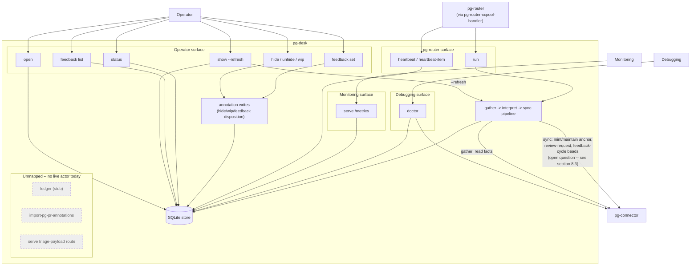

# pg-desk: CLI shape and boundary reconsideration — brainstorm notes

- **Date**: 2026-09-25
- **Status**: Brainstorm notes, in progress — NOT an approved design. Sections below are marked
  either **Decided** (the operator confirmed this) or **Open** (still to resolve next session).
  This document exists to survive a context handoff, not to authorize implementation.
- **Origin**: an interactive session that started as "claim `pg2-2j5ac` and unblock it" (which
  turned into the independent-review addendum to `pg2-2j5ac.46`'s design, committed separately —
  see "Related" below), then pivoted into a broader "what even is pg-desk, where are its lines"
  conversation once the operator asked whether use-case/scenario docs existed for it (they don't).
- **Scope**: `packages/pg-desk` in this repo, and its boundary with `packages/pg-connector` and
  `packages/pg-router` (+ `packages/pg-router-ccpool-handler`).

## 1. Reframing (Decided)

pg-desk is not a peer tool to pg-connector, and not simply "pg-pr's replacement" in the old
architecture's shape. It is a **caching/decorating console layer on top of pg-connector** — the
thing an operator actually types day to day. pg-connector is low-level plumbing nobody expects to
run directly at the console. This sharpens, rather than changes, the founding design's existing
composition rule (D10: pg-desk MUST compose only pg-connector verbs) — it explains _why_ that rule
exists, not just that it does.

## 2. pr-pool → pg-router: not a 1:1 rename (Decided, corrects earlier assumption)

Earlier drafts of this conversation (and the founding 2026-09-09 design doc's §6.1) describe
`pr-pool` config stanzas — `[[query]]`/`[[role]]` TOML, a `command` role type execing
`pg-desk run pr {{.Item.ID}} ...` directly from the core. **That shape is stale.** Per
`docs/adr/0065-pr-pool-participant-extraction-prpool-ccpool-handler.md` (Phase 5, accepted
2026-09-10):

- pg-router's core is now a fully generic dispatcher (event source → durable queue → event
  handler) that names **no concrete tool at all** — not even a `command` executor; that moved
  out too, into `packages/pg-router-ccpool-handler`, a separate module that registers with the
  core as a wire-connected handler participant.
- **The old reconcile ACL — the thing that used to mint `review-pr` beads from PR facts, per
  `docs/adr/0034-pg-pr-prpool-review-ownership-split.md` — was deleted outright, not ported.**
  The extraction's own register records it as "obsoleted... no live consumer needs it." There is
  currently no pg-router-side mechanism recreating that pattern.
- What actually execs `pg-desk run ...` today is `pg-router-ccpool-handler`, dispatched to over a
  wire protocol by pg-router's core — not the core directly. Functionally this shouldn't matter to
  pg-desk's own CLI contract (pg-desk still just gets exec'd with argv), but it's the accurate
  naming.
- pg-router already has its own `actors.md`/`journeys.md` (in a `STORY-<ACTOR>-N` format) and,
  consistent with its genericity goal, names **no** concrete participant anywhere, including
  pg-desk. There is nothing on that side to cross-check pg-desk's own boundary against — pg-desk
  has to write its own side from scratch.

**Takeaway for later sessions**: do not trust ADR 0034's concrete mechanism description (reconcile
ACL, ccpool review role) as still-current pg-router internals — it describes the _pre-extraction_
shape. Its **ownership principle** ("data tool exposes facts + a write-back surface; the workflow
owner owns bead lifecycle, config-driven") is still good and still cited below, but the concrete
"pr-pool" plumbing it describes no longer exists as written.

## 3. Actors (Decided, this round)

Four actors, confirmed by the operator:

1. **Operator** — the human (or agent) doing day-to-day triage.
2. **pg-router** (shorthand for "pg-router core, dispatching to pg-router-ccpool-handler, which
   execs pg-desk") — the automated trigger/scheduler.
3. **Monitoring** — scrapes `serve`'s `/metrics`.
4. **Debugging** — runs `doctor` to confirm the whole chain is wired.

Two candidate actors were **explicitly rejected** as too specific / not real pg-desk actors:

- A "feedback agent" and a "beads-sync bead consumer" were folded back into **pg-router**: per
  ADR 0034's ownership principle, whoever executes a `review-pr`/`process-feedback` bead is a
  pg-router-side role calling pg-desk's write-back surface (`feedback set`), not a distinct actor
  pg-desk itself needs to model.
- `import-pg-pr-annotations`'s one-shot migration runner is not an ongoing actor at all —
  candidate for deletion (§6).

## 4. Draft scenarios (Decided as a starting set, format only — content may shift as CLI reshapes)

Written in pg-router's own established `STORY-<ACTOR>-N` house style
(`packages/pg-router/docs/behavior/journeys.md`), mapped to _current_ commands as of this
session. **These will need rewriting once the CLI reshape in §7 lands** — they're recorded here as
the validated-so-far starting point, not a target.

**Operator**

- `STORY-OP-1` — Open the browser to whatever PRs need my review right now, straight from the
  store, no daemon needed. → `open`
- `STORY-OP-2` — Check one PR's current computed state, and force a fresh pipeline run first if I
  don't trust what's cached. → `show [--refresh]`
- `STORY-OP-3` — Suppress noise without losing or closing anything — hide a PR I'm deliberately
  ignoring, mark one WIP so it stops nagging for review. → `hide` / `unhide` / `wip`
- `STORY-OP-4` — Record my own call on a piece of feedback (handled / won't-fix / no-action) so it
  drops off "unaddressed." → `feedback set`
- `STORY-OP-5` — See everything outstanding on one PR before deciding what to act on. →
  `feedback list`
- `STORY-OP-6` — Check overall store health — counts, anything degraded, sync bookkeeping —
  independent of any one PR. → `status`

**pg-router**

- `STORY-RTR-1` — Trigger the pipeline for one entity on a real event or a periodic sweep, and get
  a stable exit code regardless of internal degradation. → `run`
- `STORY-RTR-2` — Get proof of liveness on a schedule, because a scheduler that emits nothing when
  nothing changes is indistinguishable from a dead one. → `heartbeat` / `heartbeat-item`

**Monitoring**

- `STORY-MON-1` — Scrape dashboard staleness, drop counts, sync-error counts, liveness. →
  `serve`'s `/metrics`

**Debugging**

- `STORY-DBG-1` — Before trusting anything else, confirm the whole chain is actually wired: config
  resolves, pg-connector reachable, serve reachable. → `doctor` (confirmed: also reads the store
  directly for stranded-cycle detection, and cross-checks `pg-connector issue list`)

## 5. Interaction diagram (as of the "current commands" snapshot, §4 — superseded by §7's reshape)

## 6. Confirmed factual findings (Decided — these are facts, not proposals)

- **Feedback storage**: disposition overrides live in the same `annotation` table that backs
  `hide`/`unhide`/`wip` (`internal/store/annotation.go`) — one row per
  `(repo, entity_type, entity_id, comment_id)`, a `Disposition` field sitting next to
  `Hidden`/`WIP`. `feedback list` merges a _computed_ base verdict from `interpret`
  (code-host-resolved → `no-action`, else `open`) with any _recorded_ override from that same
  annotation row, at read time. Feedback tracking is not merely _like_ a decorator — it's stored
  in the literal same mechanism as one.
- **`open` cannot take a single PR id today** — `Args: cobra.NoArgs`, filter-flags only
  (`cmd/pg-desk/open.go`). "Open one specific PR" is a real gap, not just a naming exercise.
- **`ledger` (the CLI subcommand)** is a pure stub — `return notImplemented("ledger")`
  (`cmd/pg-desk/ledger.go`) — three phases after the underlying `ledger` table went live and
  started being written to by real sync code.
- **`import-pg-pr-annotations`** is a one-shot pg-pr cutover tool. Candidate for deletion; the
  operator agreed pg-pr is gone/going away.
- **`serve`'s triage-payload route** (distinct from `/metrics`) has no confirmed live consumer:
  `open` reads the store directly, no daemon involved. The only clearly-consumed part of `serve`
  is `/metrics` (Monitoring). The triage-payload half may be a leftover pointed at the old Ops
  board, whose successor `pg2-7kizi` is still deciding.
- **`ledger` (the table/concept) vs. `xref`**: `Xref` is `(repo, from_type, from_id, to_type,
to_id) → evidence, first_seen, last_confirmed` — a generic cross-reference, already exactly the
  "PRs link to Jira issues/beads/threads" mechanism the operator described. `LedgerEntry` is
  `(repo, entity_type, entity_id, kind) → bead_id, last_synced_content_hash, last_synced_at,
last_reviewed_head_sha` — the one real structural difference is the sync-bookkeeping columns
  (content hash + reviewed-head-SHA) that let pg-desk tell whether a bead it minted has drifted
  from source. Not yet resolved whether that's reason enough to keep it a separate table (§8.1).
- **Decorate vs. annotate**: not _only_ "who sets it." The real second axis is _write policy_ —
  `Interpretation` rows are fully recomputed every pipeline run; `Annotation` rows are, by
  explicit design, never touched by gather/interpret, only by `hide`/`unhide`/`wip`/`feedback set`.
  "Who sets it" is a proxy for that axis (only a human/agent can write a sticky field, since the
  pipeline never does), not a separate distinction. Still open whether this should become one
  generic decoration mechanism tagged by write-policy rather than two separate tables (§8.2).

## 7. CLI reshape direction (Decided in principle, not yet fully designed)

- pg-desk gains **entity-type subcommands** (`pg-desk pr ...`, `pg-desk issue ...`), mirroring
  pg-connector's own `pr`/`issue`/`ci`/`scm` capability grouping.
- `open` and `show` unify into the same shape across entity types: takes **either an id (one
  entity) or criteria (a list)**. This closes the real gap found in §6 (`open` currently can't
  take an id at all) and gives `issue` the same two verbs `pr` already has.
- Decoration (annotations/dispositions) should **surface automatically on view** — already true in
  miniature (`show --json` already merges in `hidden`/`wip`); the change is making that the
  standard pattern for every entity type, not something re-derived per command.
- It's acceptable for pg-desk to be **opinionated, not fully generic** like pg-connector — shaped
  around how this operator actually works — as long as nothing organization-specific is hardcoded
  (the repo's standing "no ZR disclosure" rule is unaffected and unrelated to this; this is about
  UX opinion, not identifiers).
- `run` should **fold into the standard entity-type verbs** rather than stay a standalone outlier
  — direction agreed (e.g. something like `pg-desk pr refresh <id> --change ...` /
  `pg-desk issue refresh <id> --change ...`), but the concrete shape (does `sweep` become its own
  verb or a flag; does `refresh` take criteria the same way `open`/`show` do) is **not designed
  yet** — pick this up next session.
- `hide`/`unhide`/`wip`/`feedback list`/`feedback set` likely nest under `pg-desk pr ...` too, but
  whether `feedback` even makes sense for `issue` (which has no PR-shaped review comments) is
  **open**.

## 8. Open questions / debates for next session

### 8.1 Ledger vs. xref: fold together, or keep separate?

`ledger`'s only real difference from `xref` is the sync-bookkeeping columns (content hash,
reviewed-head-SHA). Options: (a) keep `ledger` as its own table, just fix/build the stub CLI
command; (b) fold it into `xref` plus two extra nullable columns, treating "pg-desk minted bead X
for entity Y in role Z" as a special case of a cross-reference rather than a separate concept. Not
decided — needs the sync-ownership question (8.3) resolved first, since if bead-minting moves out
of pg-desk entirely, the table's whole reason to exist changes.

### 8.2 Decorate/Interpret vs. Annotation: collapse into one mechanism?

Real distinction is write-policy (computed-every-run vs. sticky), not just "who sets it" (§6).
Open question: should this become one generic decoration mechanism where each field/value carries
a write-policy tag, rather than two separate tables (`interpretation`, `annotation`) that happen to
both attach facts to an entity? Structurally plausible (a Strategy per field, not a table-level
split) but not designed.

### 8.3 Sync / bead-minting ownership: stay in pg-desk, or move to pg-router?

The core tension: ADR 0034's principle ("data tool exposes facts + a write-back surface; the
router owns bead lifecycle, config-driven") argues for moving anchor/review-request/feedback-cycle
bead-_minting_ out of pg-desk's own pipeline. But per §2, pg-router's own equivalent mechanism (the
reconcile ACL) was **deleted outright**, with an explicit "no live consumer" rationale — so
pg-desk's current `sync` stage design may be the _intentional_ replacement for that capability in
its new home, not an accidental boundary violation carried over by inertia. This was raised but not
resolved. Needs a real decision, not just noting the tension again.

### 8.4 pg-desk ↔ pg-router decoupling adapter: needed, or not?

Raised by the operator, explicitly **not decided** — paraphrased: "we shouldn't tie pg-desk
directly to a contract of pg-router if we don't have to." The precedent cited was
`pg-router-source-pg-connector`, an independent adapter binary translating pg-connector's JSON
envelope into pg-router's item-array wire shape — a **real format mismatch** neither side owns.

For pg-desk, no equivalent format mismatch is confirmed yet: pg-router's `command`-role model
already treats a role's `argv` as an opaque, templated pass-through it never reads (ADR 0065's own
language), so pg-router can already invoke pg-desk's native verbs directly via role config with no
new binary — the same way it invokes `pg-desk run` today. The open question to resolve next
session: is there an actual shape-translation problem being anticipated (something in pg-router's
event/item format that pg-desk's own refresh verb can't consume directly), or is the concern that
pg-desk's own CLI vocabulary (`--change added|changed|removed|sweep`) is borrowed from pg-router's
event taxonomy rather than being pg-desk-native — which would need `refresh`'s own flag design to
change, not a new adapter package.

### 8.5 Smaller open items, not yet discussed in depth

- `heartbeat` vs. `heartbeat-item` — two separate commands; unclear if intentional split or should
  merge (e.g. `heartbeat --as-item`).
- `status` vs. `doctor` — possible scope overlap (local-store health vs. external-dependency
  health); not examined closely.
- Where `doctor`/`status`/`serve` land once `pr`/`issue` become the primary top-level grouping —
  do they stay flat top-level commands (cross-cutting, not entity-scoped) or get their own home?

## Related

- **Design docs (this repo)**:
  - `docs/superpowers/specs/2026-09-09-pg-desk-and-connector-discovery-design.md` — founding
    pg-desk design; §6.1's pr-pool config stanzas are the stale shape corrected in §2 above.
  - `docs/superpowers/specs/2026-09-03-unified-connector-architecture-design.md` — the pg-connector
    umbrella design (`pg2-2j5ac`'s own authoritative doc).
  - `docs/superpowers/specs/2026-09-23-pg-desk-generic-entity-pipeline-design.md` (worktree
    `pg2-2j5ac.46-issue-entity-design`, commit `d450fad2`) — the issue-entity-pipeline design this
    same session independently reviewed and addended; separate, narrower thread from this one.
  - `docs/superpowers/specs/2026-09-23-daily-focus-store-first-design.md` (worktree
    `pg2-2j5ac.27-daily-focus-design`) — Phase 15's own design, also pending operator review.
- **ADRs (this repo)**:
  - `docs/adr/0034-pg-pr-prpool-review-ownership-split.md` — the ownership-split principle §2 and
    §8.3 both cite; concrete mechanism it describes is stale (see §2).
  - `docs/adr/0065-pr-pool-participant-extraction-prpool-ccpool-handler.md` — the actual current
    pg-router architecture; corrects the founding design's §6.1.
- **Beads** (this workspace, `pg2-` tracker):
  - `pg2-2j5ac` — the program epic/docket this all sits under (container; not to be claimed for
    direct work).
  - `pg2-2j5ac.46` — the issue-entity-pipeline design bead this session reviewed/addended
    (separate narrower thread).
  - `pg2-2j5ac.48` — the resume/handoff bead for that review; addendum applied, still awaiting the
    operator's own sign-off (unrelated to this broader thread beyond sharing the epic).
  - `pg2-2j5ac.27` — the daily-focus design bead, also pending operator review.
  - `pg2-t9zzg` — `schema.Issue.Owner` field bead (groomed, plan-ready), filed this session; touches
    the decorate/annotate discussion's ownership fields tangentially.
  - `pg2-ynhr` / `pg2-388yn` — the original pg-pr/pr-pool split epic and its ADR (0034's own
    provenance).
  - `pg2-mf0dx` — operator acceptance of ADR 0065's extraction decision.
  - `pg2-myc6y` — the pr-pool → pg-router rename bead (terminology only; ADR 0065 is the actual
    architecture change, not this rename).
