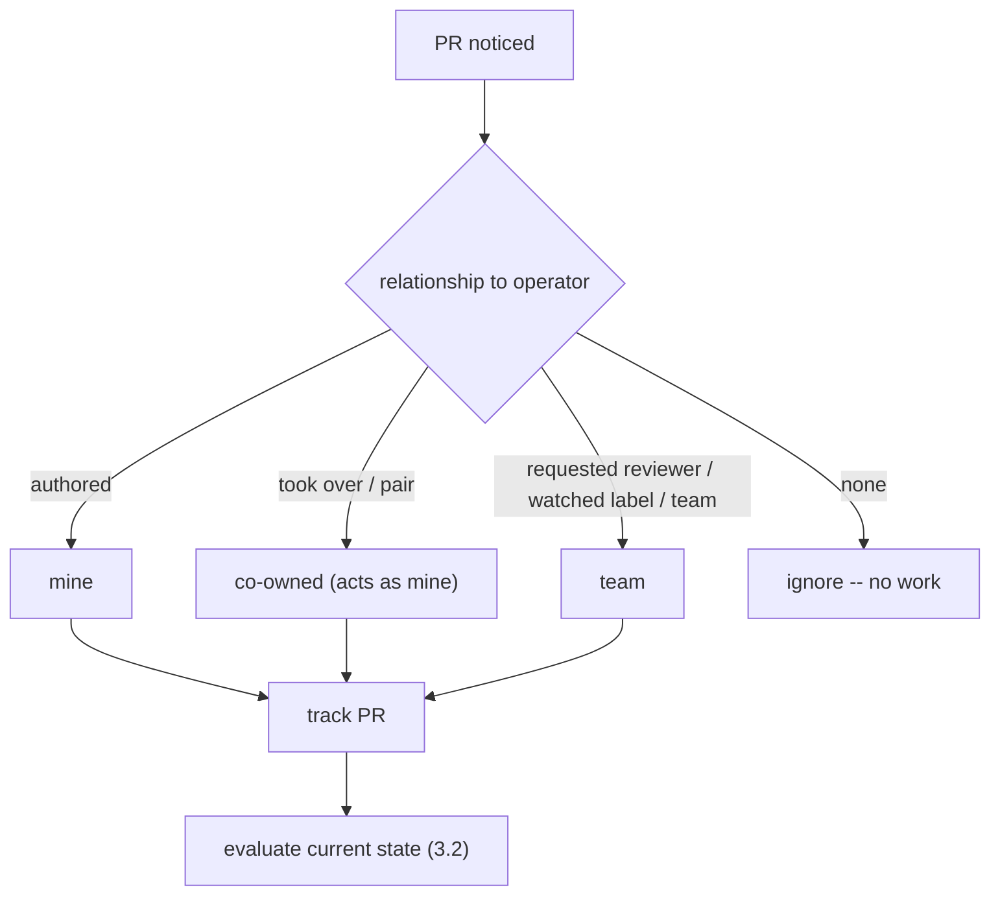
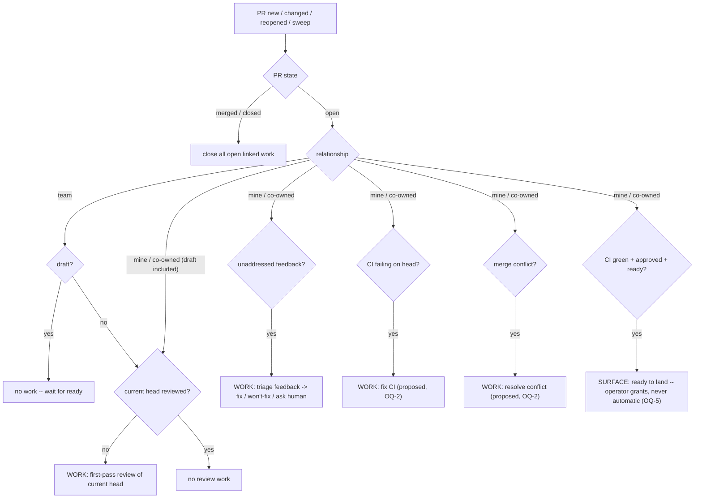
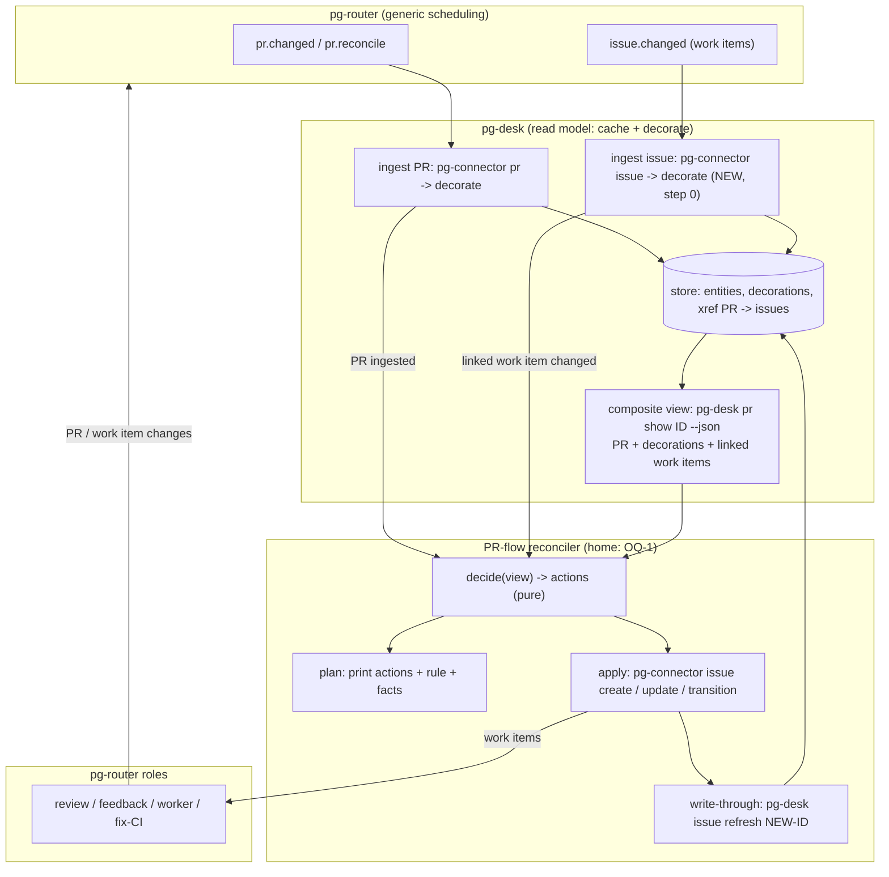

# PR-flow reconciler over pg-desk's read model — proposal

- **Date**: 2026-09-25 (revision 2, 2026-09-28, after three independent reviews)
- **Status**: PROPOSAL — NOT an approved design. Produced in the interactive brainstorming session
  tracked by bead `pg2-2j5ac.49`. Nothing here authorizes implementation. Items are marked
  **Decided** (operator confirmed in session), **Recommended** (awaiting an operator ruling), or
  **Open**.
- **Companion**: `2026-09-25-pg-desk-cli-and-boundary-reconsideration-notes.md` (same directory).
  This proposal addresses that doc's open questions 8.1 (ledger vs xref), 8.3 (bead-minting
  ownership) and 8.4 (pg-desk ↔ pg-router adapter).
- **Supersedes (if approved)**: in `2026-09-09-pg-desk-and-connector-discovery-design.md`, D8
  ("the interpreter writes to beads only to signal agent work ...") and the sync part of D9
  ("gather, then interpret, then sync ... inside one process"). D7 (derived data and human
  annotations live in pg-desk's store) and D10 (pg-desk is generic, lives in this repo) still
  hold. Reason: section 1. Approval of this proposal MUST be recorded as an explicit amendment of
  that design, not left implicit.
- **Scope**: PR-related work only — what work arises when a PR is first noticed or changes, and
  which tool owns each step. Issue-entity work flows (Jira, bd) are out of scope, except that
  work-item beads are read back as issue entities.

## 1. Problem

Today the PR work flow lives in pg-desk's `sync` stage (`packages/pg-desk/internal/sync/`), live
in production (`sync.mode = "apply"` since the Phase 11 cutover). Each `pg-desk run pr <id>`
gathers, interprets, then — in the same process — decides and writes beads (`merge-request`
anchor, `review-pr:` and `process-feedback:` children) through `pg-connector issue`, and keeps a
`ledger` table recording which beads it minted.

This is carry-over from when beads was the central store for everything:

- The **decision** (what work should exist for this PR) is entangled with **I/O** (bead writes)
  and with a private copy of work state (`ledger`), so it can only be tested or previewed through
  the whole pipeline, and plan mode is a global switch rather than a per-PR question.
- pg-desk's purpose is a caching/decorating console layer over pg-connector (companion notes,
  section 1). Writing work items makes it a workflow owner too.
- The contract between pg-desk and pg-router is implicit: pg-router's source queries and role
  prompts depend on bead title prefixes, labels and metadata keys. Its only written form is the
  "Bead shapes" table in `docs/behavior/pg-desk/sync.md`.
- The flow still depends on pg-pr, which is being removed: the review role posts reviews through
  `pg-pr review submit`, because pg-connector's `pr` group has no write verb (it has `show`,
  `files`, `commits`, `list`, `changes`).

## 2. Goals / non-goals

**Goals**

- G1. The decision "what work should exist for this PR right now" MUST be a pure function of the
  PR's current decorated state and its current linked work items.
- G2. pg-desk MUST be the single read model (cache + decoration) for PR entities and their work
  items. pg-desk MUST NOT create, update or transition work items. Annotation writes
  (`hide`/`unhide`/`wip`/`feedback set`, and the proposed suppress/force-review in 4.6) are
  pg-desk's own data and remain allowed.
- G3. pg-router's core MUST stay generic (ADR 0065); PR-specific rules MUST NOT enter the core.
- G4. The flow MUST NOT depend on pg-pr.
- G5. Re-running the flow on unchanged input MUST produce no writes (idempotent reconcile).
- G6. For any PR, a user MUST be able to see what the flow would do next and why, without it
  writing anything.

**Non-goals**

- Redesigning the role prompts beyond what the interface change forces.
- Issue-entity (Jira/bd) work flows.
- The final pg-desk CLI grouping (`pg-desk pr ...` / `pg-desk issue ...`) — assumed, not designed.

## 3. The PR flow itself (tool-agnostic)

### 3.1 First noticed: is it relevant, and to whom?



### 3.2 On any change: which work results?

Evaluation is **level-triggered**: it looks at current state, never at which event arrived. New,
changed, reopened and periodic-sweep evaluations are the same computation.



### 3.3 Lifecycle, own PR

```mermaid
stateDiagram-v2
    [*] --> Draft: noticed (mine / co-owned)
    [*] --> Ready: noticed (mine / co-owned)
    Draft --> Draft: review / fix CI / work feedback
    Draft --> Ready: CI green, marked ready
    Ready --> Ready: new head -> re-review; feedback -> fixes
    Ready --> AwaitingLand: CI green + approved
    AwaitingLand --> Ready: new head / new feedback
    AwaitingLand --> Merged: operator grants permission
    Draft --> Closed
    Ready --> Closed
    Closed --> Ready: reopened -> linked work reopened
    Merged --> [*]: clean up work
    Closed --> [*]: clean up work
```

A **team** PR's loop is smaller: draft → wait; ready → review (re-review on head advance) → the
review stays pending for the operator → merged/closed → stop tracking. A team PR MUST NOT be
modified beyond the operator-pending review (OQ-3).

**Stacked PRs**: each PR in a stack is reconciled independently. Gating a downstream unit on its
upstream landing is the worker role's concern (the "gated child tracking objects" pattern in the
deployment's journeys), not a work kind this reconciler creates.

### 3.4 State the flow needs

Everything is recomputable from the PR and its linked work items except:

| Datum                            | Why it must persist             | Proposed home                     |
| -------------------------------- | ------------------------------- | --------------------------------- |
| last-reviewed head SHA           | "is this head reviewed?"        | metadata on the review work item  |
| per-comment disposition          | operator/agent ruling is sticky | pg-desk annotation (exists)       |
| hide / wip                       | operator suppression is sticky  | pg-desk annotation (exists)       |
| per-kind suppress / force-review | operator override is sticky     | pg-desk annotation (new, 4.6)     |
| which work items exist           | dedup                           | derived: xref PR → issue entities |
| why each work item was written   | audit                           | comment on the work item (4.5)    |

## 4. Proposed architecture

### 4.1 Flow



### 4.2 Responsibilities

| Component          | Owns                                                                                                      | MUST NOT                                                                     |
| ------------------ | --------------------------------------------------------------------------------------------------------- | ---------------------------------------------------------------------------- |
| pg-connector       | retrieval and writes against code host and trackers, including a new review-submit write verb (section 6) | hold PR workflow rules                                                       |
| pg-desk            | cache + decoration of PR and issue entities; xref; composite view; operator annotations                   | create/update/transition work items; know pg-router or the reconciler exists |
| PR-flow reconciler | the PR rules (`decide`), dry run (`plan`), applying actions (`apply`), and the work-item contract (4.7)   | keep its own cache of entity or work state                                   |
| pg-router core     | event sources, durable queue, dispatch                                                                    | name any concrete tool (ADR 0065)                                            |
| pg-router roles    | executing work items                                                                                      | decide which work items exist                                                |

Dependency direction is one-way: reconciler → pg-desk (read) and reconciler → pg-connector
(write). pg-desk depends on neither the reconciler nor pg-router.

Patterns: pg-desk is the **read side of CQRS**; the reconciler is a **Reconciler / control loop**
built as **Functional Core, Imperative Shell** (`decide` pure; `plan` and `apply` are two shells
over it); each work kind's rule is a **Strategy**.

**Naming (Recommended)**: call it the **PR-flow reconciler**, not a generic reconciler. Its input
and rules are PR-shaped and issue flows are out of scope; claiming genericity without a
kind-agnostic interface would be misleading. If issue flows later need the same loop, extract a
`Decider` interface then.

### 4.3 `decide` contract

**Input**: the composite view —

- PR facts: state, draft, head SHA, base, CI status on head, mergeability, approvals.
- Decorations: relationship (mine / co-owned / team), per-comment dispositions, hide, wip,
  per-kind suppress / force-review (4.6).
- Linked work items: kind, id, state, labels, key metadata (incl. reviewed head SHA, fbsum
  digest), and whether a person closed it (4.6).

**Output**: an ordered list of actions, each `create(kind, fields)`, `update(id, fields)`,
`reopen(id, fields)` or `close(id, reason)`, and each carrying the **rule id** and the **facts**
it keyed on. An empty list means work already matches the PR.

**Rules** — rows marked _ported_ reproduce current `internal/sync` behavior exactly (see
`docs/behavior/pg-desk/sync.md` "Rules" and "Adoption"); rows marked _new_ are proposals.

| Rule id            | Status                   | When                                                                                 | Action                                                                                                                                                                                       |
| ------------------ | ------------------------ | ------------------------------------------------------------------------------------ | -------------------------------------------------------------------------------------------------------------------------------------------------------------------------------------------- |
| `all.closed`       | ported                   | PR merged/closed                                                                     | `close` anchor and every open direct child (review and feedback alike)                                                                                                                       |
| `all.reopened`     | new — fixes a latent gap | PR open, anchor closed                                                               | `reopen` anchor; then the rules below re-evaluate children (today's code only updates fields and never reopens the anchor)                                                                   |
| `anchor.lazy`      | ported                   | any child needed and no anchor                                                       | `create` anchor (`merge-request`, title `<repo>#<n>: <title>`); never eagerly                                                                                                                |
| `anchor.backfill`  | ported                   | adopted anchor lacks `repo`/`pr_number`                                              | `update` metadata once                                                                                                                                                                       |
| `anchor.priority`  | ported                   | mine/co-owned + conflict → raise; team → lower                                       | `update` priority, stash baseline in `pbase:<n>` label, restore when the condition clears                                                                                                    |
| `review.needed`    | ported                   | (mine or co-owned, draft included) or (team and not draft), and head ≠ reviewed head | none → `create` (`review-pr: <repo>#<n>`); closed → `reopen` with new `head_sha`; open → `update` `head_sha`                                                                                 |
| `feedback.needed`  | ported                   | mine/co-owned with unaddressed comments                                              | none → `create` (`process-feedback: <repo>#<n>`, labels `mine`, `fbsum:<digest>`); open with a different digest → `update` description, add new `fbsum:` label, remove stale `fbsum:` labels |
| `fixci.failing`    | new (OQ-2)               | mine/co-owned, CI failing on head                                                    | none open for this head → `create`                                                                                                                                                           |
| `conflict.present` | new (OQ-2)               | mine/co-owned, conflicting                                                           | none open → `create`; `anchor.priority` stays as ported                                                                                                                                      |
| `land.ready`       | new (OQ-5)               | mine/co-owned, green + approved + not draft                                          | surfaced as a decoration, not a work item                                                                                                                                                    |

**Adoption (ported)**: existing beads with no dedup key are matched by exact title (and, for
anchors, by `<repo>#<n>:` prefix) and adopted instead of duplicated; `apply` then writes the dedup
key onto them. This MUST run on the first reconcile per PR after cutover.

**Parked work**: children labeled `human` (e.g. a feedback-derived work item awaiting the PR
author) count as existing work for dedup and MUST NOT be re-created or re-labeled by `decide`.

**Annotations (new, OQ-4)**: today hide and wip do NOT affect bead writes — `sync` never reads
them (`packages/pg-desk/internal/interpret/interpret.go` states "Hidden and WIP are NOT
interpreted"; they are joined at read time only). Whether hide should suppress all work creation
and wip should suppress review work is an open question, not a port.

### 4.4 Consistency and failure handling

The **tracker is the source of truth** for work items; pg-desk's copy is a cache.

1. **Deterministic dedup key (REQUIRED)**: every work item MUST carry a key
   `<repo>#<n>:<kind>` in metadata. `apply` MUST look up the tracker by key before `create`. A
   repo rename or PR transfer changes the key; `decide` MUST match on the code host's stable PR
   node id when available and rewrite the key rather than create a second item (OQ-8).
2. **Write-through (REQUIRED)**: after each `create`/`reopen`/`close`, `apply` MUST run
   `pg-desk issue refresh <id>` so the next decision sees it. A failed refresh is **retryable
   staleness**, not an apply failure: the tracker write is durable, and the dedup key makes the
   next reconcile a no-op for that item. `apply` MUST NOT attempt to roll back a tracker write.
3. **Serialization (SHOULD)**: at most one reconcile per PR in flight.
4. **Partial apply**: actions apply in order, best-effort; each action's error is captured and
   the rest continue unless an action depends on a failed one (children depend on the anchor
   `create`). Because evaluation is level-triggered, a failed action is simply re-derived on the
   next reconcile. An action that fails on N consecutive reconciles for the same PR MUST be
   escalated with a `human`-labeled work item naming the rule and error.
5. **Force-push / base change**: a force-push is just a new head (`review.needed` fires). Comment
   ids from the code host are stable across force-push; outdated inline comments stay in the
   feedback set until dispositioned. A base-branch change does not by itself trigger re-review
   (OQ-9).

### 4.5 Explainability: `plan` and the audit trail (Decided: plan)

- **`<reconciler> plan <repo>#<n>`** (Decided) runs `decide` for one PR and prints the actions
  with their rule id and facts, writing nothing. When work already matches, it prints
  `no actions: work matches PR state`. This lives on the reconciler's own CLI, not on pg-desk:
  pg-desk shows state, the reconciler shows decisions, and pg-desk stays independent of the
  reconciler. It also serves as the migration parity check (section 7, step 4).
- **Audit comment** (Recommended): every applied action MUST append one comment on the affected
  work item: rule id, facts it keyed on, timestamp. This replaces the history the `ledger`
  provided, and answers "why does this item exist / why was it reopened".
- **Freshness**: the composite view MUST carry `as_of` for the PR half and `work_items_as_of`
  for the linked-work-items half; `pg-desk pr show --refresh` refreshes both.

### 4.6 Operator control (Recommended)

Without this, closing a work item by hand is undone on the next reconcile, because
`review.needed`/`feedback.needed` would re-create it.

- `pg-desk pr suppress <id> --kind review|feedback|fix-ci|conflict` and `unsuppress`: a sticky
  per-kind annotation; `decide` creates no work of a suppressed kind.
- A work item closed by a person (not by `apply`) is treated as dismissed for the current head
  (per-head kinds) or current digest (feedback); a new head or digest re-arms it.
- `pg-desk pr force-review <id>`: a one-shot annotation that makes `review.needed` fire on the
  current head even if already reviewed; `decide` clears it via the audit trail once acted on.

These are annotation writes, allowed under G2.

### 4.7 The work-item contract

The work-item shapes roles depend on (kinds, title prefixes, labels, metadata keys, parent
relationship) become an explicit contract **owned by the reconciler's behavior docs**. The
current "Bead shapes" table in `docs/behavior/pg-desk/sync.md` MUST move there verbatim, plus the
new dedup key, before `internal/sync` is deleted; role prompts SHOULD cite it.

pg-desk's side of any contract is only the composite-view JSON. pg-desk never sees pg-router's
event format, so no adapter is needed (resolves notes 8.4). The
`--change added|changed|removed|sweep` flag is not needed on the ingest path because the
reconciler is level-triggered; whether ingest keeps it for pg-desk's own freshness bookkeeping is
part of the CLI design, not this proposal.

## 5. What this removes or changes

- `packages/pg-desk/internal/sync/` — moves to the reconciler (rules ported per 4.3, ledger
  dependency dropped).
- `ledger` table and the stub `ledger` CLI — removed (resolves notes 8.1). xref + ingested issue
  entities cover "which items exist"; audit comments cover "why".
- `import-pg-pr-annotations` — removed (already agreed).
- `pg-desk run pr` — becomes ingest only (fetch + decorate + store); in this document the ingest
  verb is written `refresh` (`pg-desk pr refresh`, `pg-desk issue refresh`). Final naming belongs
  to the CLI design (notes 8.5).
- `merge-request` anchor — kept for now; the worker role resolves the PR through the parent
  anchor's metadata. Candidate for removal once work items carry `repo`/`pr_number` themselves
  (OQ-6).

## 6. pg-pr removal gap

The review role still calls `pg-pr review submit`. A write verb on pg-connector's `pr` group
(e.g. `pg-connector pr review submit <id>`: same review JSON, pending-only, anchored to
`head_sha`, bot-marked, superseding any prior pending review) is REQUIRED before pg-pr can be
removed. It is independent of the rest of this proposal and SHOULD be done first.

## 7. Migration sketch

0. **Record the decision**: accepted conclusions MUST be captured in an ADR (and the 2026-09-09
   design amended per the header) before implementation, since `docs/superpowers/specs/` files
   are not durable citation targets.
1. **Review-submit verb** (section 6); switch the review prompt off pg-pr.
2. **Issue-entity ingest in pg-desk** — prerequisite for the composite view. Today `run issue`
   only re-interprets linked PRs and stores no issue entity. This is the scope of the separate
   generic-entity pipeline design (`pg2-2j5ac.46`), which MUST be approved first.
3. **Composite view**: `pg-desk pr show --json` includes linked work items and `work_items_as_of`.
4. **Reconciler with `plan`**: port `decide` from `internal/sync` (all _ported_ rows in 4.3,
   including adoption). Run `plan` for every tracked PR alongside live pg-desk sync and diff;
   differences must be zero or explained before the flip.
5. **Move the work-item contract** (4.7) into the reconciler's behavior docs.
6. **Flip**: reconciler applies; pg-desk `sync.mode = "off"`.
7. **Delete** pg-desk `internal/sync`, `ledger`, `import-pg-pr-annotations`.

## 8. Open questions

- **OQ-1** Reconciler's home. (a) a pg-router handler participant (like
  `pg-router-ccpool-handler`); (b) inside pg-desk; (c) a standalone module/CLI run by a pg-router
  command role. **Recommended: (c).** (b) contradicts G2. (a) mismatches ADR 0065's handler
  model — a handler executes one dispatched item, while the reconciler evaluates a whole PR — and
  would effectively resurrect the reconcile code ADR 0065 deleted. (c) needs no change to
  pg-router's core or handler model.
- **OQ-2** Should fix-CI and resolve-conflict become real work kinds?
- **OQ-3** Does a team PR's flow end at an operator-pending review?
- **OQ-4** Should hide suppress all work creation, and wip suppress review work? (New behavior.)
- **OQ-5** Is "ready to land" a work item, a decoration, or a notification?
- **OQ-6** Keep or drop the `merge-request` anchor.
- **OQ-7** Rules as code (opinionated) vs. config.
- **OQ-8** Does pg-connector expose a stable PR node id to survive repo rename/transfer?
- **OQ-9** Should a base-branch change trigger re-review?
