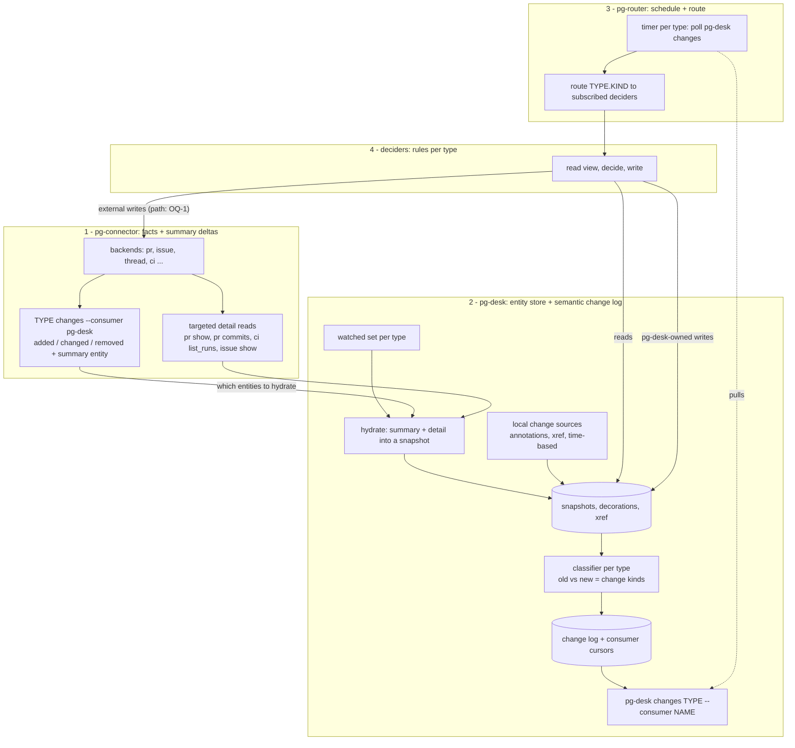
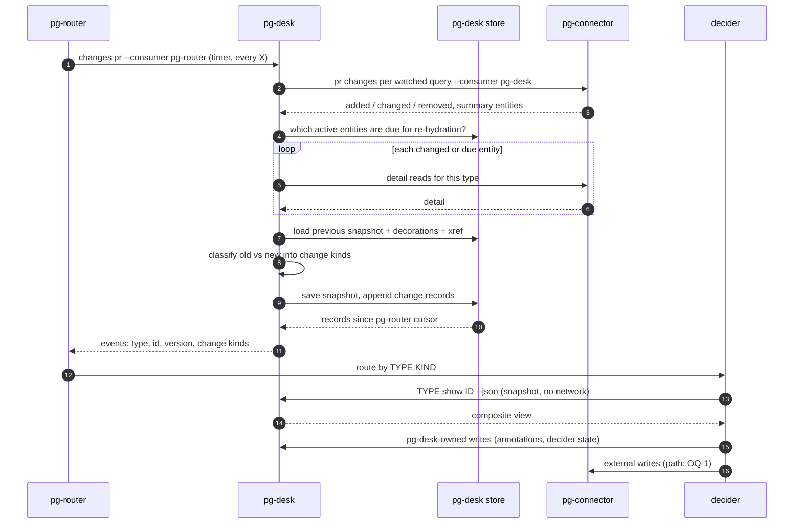

# Entity change flow: pg-connector → pg-desk → pg-router → deciders — design

- **Date**: 2026-09-29
- **Status**: DRAFT for operator review — NOT approved. Produced in the interactive brainstorming
  session tracked by bead `pg2-2j5ac.49`. Nothing here authorizes implementation.
- **Markers**: **Decided** = operator confirmed in session (with date); **Recommended** = author's
  recommendation awaiting an operator ruling; **Open** = unresolved.
- **Supersedes**: `2026-09-25-pr-flow-reconciler-proposal.md` (same directory), which scoped the
  flow to PRs only and placed change detection in pg-router. Resolves questions 8.1, 8.3 and 8.4 of
  `2026-09-25-pg-desk-cli-and-boundary-reconsideration-notes.md`.
- **Amends (if approved)**: `2026-09-09-pg-desk-and-connector-discovery-design.md` D8 (pg-desk
  mints beads) and the sync part of D9 (gather → interpret → sync in one process). D7 (derived data
  and annotations live in pg-desk's store) and D10 (pg-desk is generic, lives in this repo) still
  hold. Approval MUST be recorded as an explicit amendment of that design, and the accepted
  conclusions MUST be captured in an ADR before implementation (`docs/superpowers/specs/` files are
  not durable citation targets).
- **Overlaps**: `2026-09-23-pg-desk-generic-entity-pipeline-design.md` (`pg2-2j5ac.46`, issue-entity
  ingest). This design depends on issue entities being stored in pg-desk; the two MUST be
  reconciled before either is implemented (section 12).

## 1. Purpose and problem

pg-desk is a caching/decorating console layer over pg-connector that supports many entity types
(PRs, issues, threads, and later others). Agent work (reviews, feedback triage, fixes) is
triggered from changes to those entities.

Today that is wired the other way round and PR-only:

- pg-router's sources call `pg-connector ... changes` and then tell pg-desk to ingest
  (`pg-desk run pr|issue|thread`), so change detection happens before the layer that holds the
  previous state and the decorations.
- pg-desk's `sync` stage (`packages/pg-desk/internal/sync/`, live with `sync.mode = "apply"`)
  decides and writes beads inside the ingest process, keeping a private `ledger` table of what it
  minted. Decision, I/O and a private copy of work state are entangled; the decision cannot be
  previewed per entity or tested without the pipeline.
- The contract between pg-desk's bead writes and pg-router's role prompts (title prefixes, labels,
  metadata keys) is implicit.
- pg-connector's `pr` summary (`pkg/schema/pr.go`) has no head SHA or updated-at, so its `changes`
  misses pushes, new comments and CI changes.
- The review role still posts through `pg-pr review submit`; pg-connector has no review write verb.

## 2. Goals and non-goals

**Goals**

- G1. The flow MUST be generic across entity types; PR is one type among several.
- G2. pg-connector MUST detect most changes itself, from summary-level deltas.
- G3. pg-desk MUST hold the current snapshot of every watched entity and MUST produce a semantic
  change log covering both connector-detected and locally-originated changes.
- G4. pg-router MUST remain the only scheduler, and its core MUST stay generic (ADR 0065).
- G5. Decisions about what work should exist MUST live in deciders, outside pg-desk,
  pg-connector and pg-router's core. pg-desk MUST NOT decide.
- G6. Deciders MUST be idempotent: re-running on an unchanged view MUST produce no writes.
- G7. For any entity, a user MUST be able to see what the deciders would do next and why, without
  writing anything.
- G8. The flow MUST NOT depend on pg-pr.

**Non-goals**

- Redesigning role prompts beyond what the interface change forces.
- The final pg-desk top-level CLI grouping (assumed: `pg-desk <type> <verb>`).
- Choosing concrete durations and caps (section 7.4 gives defaults to tune).

## 3. Decisions recorded in session

| #   | Decision                                                                                                                                       | Date                            |
| --- | ---------------------------------------------------------------------------------------------------------------------------------------------- | ------------------------------- |
| S1  | pg-desk is a caching/decorating layer over pg-connector, multi-entity from the start                                                           | 2026-09-25, restated 2026-09-29 |
| S2  | Decisions move out of pg-desk into deciders; deciders read through pg-desk                                                                     | 2026-09-28                      |
| S3  | A dry-run `plan` lives on the decider CLI, not on pg-desk                                                                                      | 2026-09-28                      |
| S4  | pg-router's timer polls pg-desk for changes; pg-desk returns one event per changed entity with its change kinds; events are routed to deciders | 2026-09-29                      |
| S5  | pg-connector implementations produce most deltas; pg-desk adds the changes they cannot see                                                     | 2026-09-29                      |
| S6  | `pg-desk changes` pulls fresh data from pg-connector by default; pg-router stays the only clock                                                | 2026-09-29                      |
| S7  | Events carry a reference and change kinds, not the full entity; deciders read the snapshot from pg-desk                                        | 2026-09-29                      |
| S8  | The sweep MUST NOT replay everything; a duration-based approach replaces `--full`                                                              | 2026-09-29                      |
| S9  | There may be deciders for every entity type                                                                                                    | 2026-09-29                      |

## 4. Architecture

### 4.1 Layers



### 4.2 Responsibilities

| Component       | Owns                                                                                                                                                                                | MUST NOT                                                                             |
| --------------- | ----------------------------------------------------------------------------------------------------------------------------------------------------------------------------------- | ------------------------------------------------------------------------------------ |
| pg-connector    | talking to external systems; summary-level `changes` with per-consumer cursors; targeted detail reads; external writes                                                              | hold decorations, cross-entity links or workflow rules; know its consumers           |
| pg-desk         | watched set; hydration; snapshots; decorations and annotations; xref; per-type classifiers; semantic change log with per-consumer cursors; composite views for console and deciders | decide what work should exist; know pg-router's event format or which deciders exist |
| pg-router core  | timers; durable queue; routing `TYPE.KIND` events to handlers/roles                                                                                                                 | name any concrete tool or entity rule (ADR 0065)                                     |
| deciders        | per-type rules: read view, compute actions, apply them; `plan` dry run; the work-item contract                                                                                      | keep their own cache of entity state                                                 |
| pg-router roles | executing work items (review, feedback triage, fix, CI fix …)                                                                                                                       | decide which work items exist                                                        |

Dependency direction is one-way: deciders → pg-desk and pg-connector; pg-desk → pg-connector;
pg-router → pg-desk (as a source) and deciders (as handlers). pg-desk depends on neither pg-router
nor deciders.

Patterns: pg-connector is a **Facade + Strategy** over backends (unchanged). pg-desk is the **read
side of CQRS** plus a **Transactional Outbox** (the change log); hydration and classification are
each a **Strategy per entity type**. The pg-router → pg-desk hand-off is **Event Notification**
(events are hints; state is read separately). Each decider is a **Reconciler** built as
**Functional Core, Imperative Shell** (pure `decide`, with `plan` and `apply` as two shells).

### 4.3 One poll cycle



## 5. pg-connector changes

### 5.1 Change-sensitive summary fields (Recommended)

`changes` diffs `list` results by hash, so it only sees changes to summary fields. Each type's
summary MUST include the fields that move when the entity meaningfully changes:

| Type   | Add to summary                                                        | Why                                                                                         |
| ------ | --------------------------------------------------------------------- | ------------------------------------------------------------------------------------------- |
| pr     | `head_sha`, `updated_at`, `review_decision`, `ci_rollup`, `mergeable` | pushes, new comments/reviews, CI and conflict changes otherwise leave the summary unchanged |
| issue  | `updated_at`, `status`, `assignee` (if missing)                       | comment and workflow changes                                                                |
| thread | `updated_at` / latest message ts                                      | new replies                                                                                 |

A backend that cannot provide a field cheaply MUST leave it empty rather than fabricate it;
`mergeable` MAY be `unknown` when the code host has not computed it. Adding these fields is a
`pkg/schema` change and a per-backend change; `changes`' hash-based diff needs no change.

### 5.2 Review write verb (REQUIRED, independent)

`pg-connector pr review submit <id>`: review JSON on stdin, pending-only, anchored to `head_sha`,
bot-marked, superseding any prior pending review by the same actor. Required before pg-pr can be
removed (G8); SHOULD be done first.

### 5.3 Consumer cursors (existing, reused)

pg-connector's `changes` keeps one delta ledger per `(type, backend, query)` with per-consumer
cursors and advances a consumer's cursor only after its response is fully written and flushed:
a crash before the advance costs a duplicate, never a loss (`cmd/pg-connector/changes.go`). pg-desk
is one consumer (`--consumer pg-desk`). (Naming note: this pg-connector "delta ledger" is unrelated
to pg-desk's `ledger` table, which this design removes.)

## 6. pg-desk

### 6.1 Watched set

pg-desk config declares, per entity type, which pg-connector named queries to keep fresh, e.g.
`pr: [mine, team]`, `issue: [assigned-to-me, work-items]`, `thread: [mentions]`. This moves the
query names that pg-router's config holds today into pg-desk, next to the code that polls them.
An entity is **active** while it is open in its source system (open PR, non-terminal issue, thread
with activity inside a window); only active entities are hydrated by the sweep (7.4).

The watched set (what pg-desk keeps fresh and shows) is independent of decider subscriptions
(what pg-router routes). An entity MAY be watched with no decider subscribed; its change records
are still logged.

### 6.2 `pg-desk changes`

```
pg-desk changes <type> --consumer <name> [--cached] [--reset] [--limit N]
```

Default (pull-through): for each watched query of `<type>`, run `pg-connector <type> changes
--query <q> --consumer pg-desk`; hydrate every entity reported `added`/`changed` plus the
re-hydration batch (7.4); classify and log (6.4); then return the change records since `<name>`'s
cursor and advance it after the output is flushed (same semantics as pg-connector, 5.3).

- `--cached`: skip step one and hydration; return only already-logged records (local-only read).
- `--reset`: replay the current state of every active entity to `<name>` as `reconcile` records;
  an explicit operator action, not a routine sweep.
- `--limit N`: cap records returned per call; the cursor advances only past returned records.

Exit codes follow pg-connector's `0` ok / `2` degraded (some backend failed; partial results) /
`3` total failure scheme. A degraded source MUST NOT emit `removed`/`closed` for entities it
failed to list.

### 6.3 Hydration (Strategy per type)

For each entity to hydrate, the type's hydration strategy runs the targeted detail reads that type
needs and assembles a **snapshot**:

| Type   | Detail reads                                                         | Snapshot adds                                                                    |
| ------ | -------------------------------------------------------------------- | -------------------------------------------------------------------------------- |
| pr     | `pr show` (comments, reviews), `pr commits`, `ci list_runs` for head | head SHA, per-comment state, review state, CI per check, mergeability, approvals |
| issue  | `issue show`, `issue deps` when configured                           | status, assignee, comments, dependencies                                         |
| thread | `thread show`                                                        | messages, participants                                                           |

Hydration of one entity that fails leaves its previous snapshot in place and logs nothing for it;
the entity stays due and is retried next poll.

### 6.4 Classification (Strategy per type) and change kinds

The classifier compares the previous snapshot + decorations + links with the new ones and emits
zero or more change kinds. Initial catalogue:

| Type   | Change kinds                                                                                                                                                                          |
| ------ | ------------------------------------------------------------------------------------------------------------------------------------------------------------------------------------- |
| all    | `added`, `removed`, `reconcile`, `annotation_changed`, `link_changed`                                                                                                                 |
| pr     | `opened`, `reopened`, `closed`, `merged`, `draft_changed`, `head_changed`, `base_changed`, `ci_changed`, `mergeability_changed`, `review_changed`, `feedback_changed`, `work_changed` |
| issue  | `opened`, `reopened`, `closed`, `status_changed`, `assignee_changed`, `comments_changed`, `deps_changed`                                                                              |
| thread | `message_added`, `resolved`                                                                                                                                                           |

`work_changed` is a `link_changed` specialization: a work item linked to a PR via xref changed
state. Every record for an entity whose snapshot did not change but whose decorations did carries
`annotation_changed` only.

### 6.5 Local change sources

Changes pg-connector cannot see are written to the same log:

- annotation writes (`hide`, `unhide`, `wip`, `feedback set`, `suppress`, `force-review`, and
  decider-state writes, 8.5) append `annotation_changed` for their entity immediately;
- a linked entity's change appends `link_changed` / `work_changed` to each entity linked to it;
- time-based conditions (Open, OQ-9): e.g. "review pending longer than T" as a `reconcile` record
  when crossed.

### 6.6 Store

| Table / area     | Holds                                                                | Why it must be stored                                                              |
| ---------------- | -------------------------------------------------------------------- | ---------------------------------------------------------------------------------- |
| snapshots        | latest hydrated snapshot per `(type, id)` with `version` and `as_of` | the previous state to diff against; fast consistent reads for console and deciders |
| decorations      | computed interpretation (recomputed on hydration)                    | as today                                                                           |
| annotations      | sticky operator/decider data                                         | exists nowhere else                                                                |
| xref             | cross-entity links                                                   | `work_changed`; composite views                                                    |
| change log       | `(seq, type, id, version, kinds, origin, at)` append-only            | per-consumer delivery; audit                                                       |
| consumer cursors | `(consumer, type) → seq`                                             | at-least-once delivery                                                             |

The change log is pruned after every registered consumer's cursor has passed a record and a
retention window (default 14 days) has elapsed.

`pg-desk`'s current `ledger` table and stub `ledger` command are removed (resolves notes 8.1).

### 6.7 Composite view

`pg-desk <type> show <id> --json` returns the snapshot, decorations, annotations and linked
entities (for a PR: its linked work items with their state and key metadata), with `as_of` for the
snapshot and `links_as_of` for the linked half. `--refresh` hydrates the entity (and its links)
before answering.

### 6.8 CLI surface affected

- New: `pg-desk <type> changes`, `pg-desk <type> refresh <id>`, `pg-desk <type> suppress|unsuppress
<id> --kind <k>`, `pg-desk pr force-review <id>`.
- Changed: `pg-desk <type> show` (composite view, 6.7); `pg-desk run` retires in favour of
  `refresh` and `changes`.
- Removed: `ledger`, `import-pg-pr-annotations`, pg-desk's `sync` stage and `sync.mode` option.

## 7. Delivery, routing and the sweep

### 7.1 Event envelope

```json
{
  "seq": 18422,
  "type": "pr",
  "id": "<repo>#<n>",
  "version": 37,
  "kinds": ["head_changed", "feedback_changed"],
  "origin": "pg-connector",
  "at": "2026-09-29T14:03:11Z"
}
```

`origin` is `pg-connector`, `pg-desk` (local sources), `sweep`, or `decider:<name>` (a write made
by a decider, carried through from the write, 8.5). The envelope SHOULD match the shape pg-router's
existing `pg-router-source-pg-connector` adapter consumes, so the same adapter (or a renamed,
generic "changes" adapter) reads pg-desk and no pg-desk ↔ pg-router coupling is introduced
(resolves notes 8.4). Open: OQ-2.

### 7.2 Delivery semantics

At-least-once. pg-desk advances a consumer's cursor after its output is flushed. The remaining loss
window — pg-router crashes after reading but before enqueueing — is accepted and repaired by the
sweep (7.4) (Recommended; the alternative, an explicit ack, is OQ-3). Consumers MUST tolerate
duplicate and out-of-order events; deciders do so by always reading the current view.

### 7.3 Routing

pg-router config declares one source per watched type (`pg-desk changes <type> --consumer
pg-router`, period X per type) emitting `<type>.<kind>` events (one per kind in the record), and
routes each to the decider roles subscribed to it. The existing per-query pg-connector sources and
the `desk-pr` / `desk-issue` / `desk-thread` ingest roles are removed. pg-router's core is
unchanged.

One record with several kinds MAY route to the same decider more than once; the decider's
idempotency makes that harmless, and pg-router MAY coalesce identical `(decider, type, id)`
dispatches within one poll (Recommended).

### 7.4 Sweep: rolling re-hydration by age (Recommended)

On every `changes` call pg-desk also hydrates up to **N** active entities of that type whose
snapshot is older than **D**, oldest first, and logs a `reconcile` kind for each. Every active
entity is therefore re-checked roughly every D, load per poll is bounded by N, and closed
entities are never swept. Defaults to tune: D = 6h, N = 20. This one mechanism covers detail
changes the summary missed, events lost in the delivery window (7.2), and eventual application of
changed decider rules. A rule change that must apply at once uses `changes --reset` for that
consumer as a deliberate operator action.

## 8. Deciders

### 8.1 Contract

A decider is registered for one entity type and a set of change kinds (always including
`reconcile`). For each routed event it MUST:

1. read the composite view: `pg-desk <type> show <id> --json`;
2. compute `decide(view) → actions`, a pure function; each action is `create(kind, fields)`,
   `update(id, fields)`, `reopen(id, fields)`, `close(id, reason)` or `annotate(key, value)`, and
   carries the **rule id** and the **facts** it keyed on;
3. apply the actions (8.4), or print them for `plan`.

An empty action list means the world already matches.

### 8.2 `plan` (Decided, S3)

`<decider> plan <type> <id>` runs steps 1–2 and prints each action with its rule id and facts, or
`no actions: work matches <type> state`. It writes nothing.

```
$ pr-decider plan pr acme/api#123
pr acme/api#123  mine  open  ready  head=9f3c1e2  ci=failing  conflict=no
linked work: review-pr (closed, reviewed_head=4b7a0d1), process-feedback (open, fbsum:ab12)

actions:
  reopen  review-pr        rule=review.head-advanced    head 9f3c1e2 != reviewed 4b7a0d1
  update  process-feedback rule=feedback.digest-changed unaddressed=[c-881, c-902]
  create  fix-ci           rule=fixci.failing-on-head   check "unit" failed on 9f3c1e2
```

### 8.3 PR deciders (rules)

Rows marked _ported_ reproduce pg-desk's current `internal/sync` behavior (see
`docs/behavior/pg-desk/sync.md` "Rules" and "Adoption"); _new_ rows are proposals.

| Rule id                   | Status                                                       | Subscribes to                                   | When                                                                                 | Action                                                                                                                                                          |
| ------------------------- | ------------------------------------------------------------ | ----------------------------------------------- | ------------------------------------------------------------------------------------ | --------------------------------------------------------------------------------------------------------------------------------------------------------------- |
| `all.closed`              | ported                                                       | `closed`, `merged`                              | PR merged/closed                                                                     | `close` anchor and every open direct child                                                                                                                      |
| `all.reopened`            | new (fixes a latent gap: today the anchor is never reopened) | `reopened`                                      | PR open, anchor closed                                                               | `reopen` anchor; child rules re-evaluate                                                                                                                        |
| `anchor.lazy`             | ported                                                       | any                                             | a child is needed and no anchor exists                                               | `create` anchor (`merge-request`, title `<repo>#<n>: <title>`)                                                                                                  |
| `anchor.backfill`         | ported                                                       | any                                             | adopted anchor lacks `repo`/`pr_number`                                              | `update` metadata once                                                                                                                                          |
| `anchor.priority`         | ported                                                       | `mergeability_changed`                          | mine/co-owned + conflict raises; team lowers                                         | `update` priority; baseline stashed in `pbase:<n>`, restored when cleared                                                                                       |
| `review.head-advanced`    | ported                                                       | `opened`, `head_changed`, `draft_changed`       | (mine or co-owned, draft included) or (team and not draft), and head ≠ reviewed head | none → `create` `review-pr: <repo>#<n>`; closed → `reopen` with new `head_sha`; open → `update` `head_sha`                                                      |
| `feedback.digest-changed` | ported                                                       | `feedback_changed`                              | mine/co-owned with unaddressed comments                                              | none → `create` `process-feedback: <repo>#<n>` (labels `mine`, `fbsum:<digest>`); open with another digest → `update`, add new and remove stale `fbsum:` labels |
| `fixci.failing-on-head`   | new (OQ-4)                                                   | `ci_changed`, `head_changed`                    | mine/co-owned, CI failing on head                                                    | none open for this head → `create`                                                                                                                              |
| `conflict.present`        | new (OQ-4)                                                   | `mergeability_changed`                          | mine/co-owned, conflicting                                                           | none open → `create`                                                                                                                                            |
| `land.ready`              | new (OQ-5)                                                   | `ci_changed`, `review_changed`, `draft_changed` | mine/co-owned, green + approved + not draft                                          | `annotate` ready-to-land (surfaced on the console), not a work item                                                                                             |

All PR deciders also subscribe to `reconcile`, `work_changed` and `annotation_changed`.

**Adoption (ported)**: existing beads without a dedup key are matched by exact title (anchors by
`<repo>#<n>:` prefix) and adopted instead of duplicated; `apply` then writes the dedup key onto
them. MUST run on the first reconcile per entity after cutover.

**Parked work**: children labeled `human` count as existing work for dedup and MUST NOT be
re-created or re-labeled.

**hide / wip (new, OQ-6)**: today hide and wip do not affect bead writes (`sync` never reads them;
`internal/interpret/interpret.go`: "Hidden and WIP are NOT interpreted"). Whether hide suppresses
all work creation and wip suppresses review work is a proposal, not a port.

**Team PRs (OQ-7)**: a team PR is never modified beyond an operator-pending review.

**Stacked PRs**: each PR is decided independently; gating a downstream PR on its upstream landing
is the worker role's concern, not a work kind here.

### 8.4 Applying actions

- **Dedup key (REQUIRED)**: every work item carries `dedup_key = <type>:<id>:<kind>` in metadata;
  `apply` MUST look the key up in the tracker before `create`. A repo rename or PR transfer changes
  `<id>`; deciders SHOULD match on a stable backend id when pg-connector exposes one (OQ-10).
- **Tracker is the source of truth** for work items. After an external write the decider MUST ask
  pg-desk to re-hydrate the written item (`pg-desk issue refresh <id>`) unless the write already
  went through pg-desk (OQ-1). A failed refresh is retryable staleness, not an apply failure; the
  dedup key makes the retry a no-op. `apply` MUST NOT roll back a tracker write.
- **Partial apply**: actions apply in order, best-effort; each error is captured and later actions
  continue unless they depend on a failed one (children depend on the anchor `create`). A failed
  action is re-derived on the next event or sweep. An action failing on K consecutive runs for the
  same entity (default K = 3) MUST be escalated as a `human`-labeled work item naming the rule and
  error.
- **Serialization (SHOULD)**: at most one decider run per `(decider, entity)` in flight.
- **Loop termination**: a decider's write produces a change record (`origin: decider:<name>`) that
  routes back to deciders; because `decide` is idempotent, the second run yields no actions.

### 8.5 Writes to pg-desk (decider state)

Data that exists nowhere else — e.g. last-reviewed head per PR if not kept on the work item,
dismissals, force-review consumption — is written to pg-desk as annotations
(`pg-desk <type> annotate <id> --key <k> --value <v> --origin decider:<name>`), which appends an
`annotation_changed` record with that origin.

### 8.6 Audit

Every applied external action MUST append one comment on the affected work item recording rule
id, facts and timestamp. Together with the change log's `origin`, this answers "why does this item
exist / why was it reopened", replacing the history the removed `ledger` provided.

### 8.7 Operator control (Recommended)

- `pg-desk <type> suppress <id> --kind <work-kind>` / `unsuppress`: sticky; deciders create no work
  of that kind for the entity.
- A work item closed by a person (not by `apply`) is treated as dismissed for the current head
  (per-head kinds) or current digest (feedback); a new head or digest re-arms it.
- `pg-desk pr force-review <id>`: one-shot; makes `review.head-advanced` fire on the current head;
  the decider records its consumption via 8.5.

### 8.8 Work-item contract

The work-item shapes roles depend on (kinds, title prefixes, labels, metadata keys including
`dedup_key`, parent relationship) are a documented contract owned by the deciders' behavior docs.
The "Bead shapes" table in `docs/behavior/pg-desk/sync.md` MUST move there verbatim before
`internal/sync` is deleted; role prompts SHOULD cite it.

### 8.9 Packaging (Open, OQ-8)

Candidates: one binary per entity type (`pr-decider`, `issue-decider`), one binary with a rule
registry per type, or role config over a shared binary. Each decider runs as a pg-router command
role; no pg-router core or handler-model change is needed.

## 9. Failure modes

| Failure                                        | Effect                      | Handling                                                               |
| ---------------------------------------------- | --------------------------- | ---------------------------------------------------------------------- |
| a pg-connector backend fails during `changes`  | partial source              | exit 2; no `removed`/`closed` for unlisted entities; retried next poll |
| detail read fails for one entity               | stale snapshot              | previous snapshot kept; entity stays due; retried                      |
| pg-desk crashes before cursor advance          | duplicate records next poll | harmless (idempotent deciders)                                         |
| pg-router crashes after read, before enqueue   | records lost                | sweep re-checks within D (7.4); OQ-3                                   |
| decider external write succeeds, refresh fails | stale view                  | dedup key prevents duplicate; next hydration catches up                |
| decider action keeps failing                   | no progress                 | escalate after K runs (8.4)                                            |
| rule change deployed                           | old decisions stand         | sweep applies within D; `--reset` for immediate                        |

## 10. Observability

- pg-desk `/metrics`: per type — records logged by kind and origin, hydrations, hydration
  failures, due-entity backlog (active entities older than D), consumer lag (`head seq − cursor`).
- pg-desk `status`: the same per consumer and type, human-readable.
- `pg-desk doctor`: verifies every registered consumer's cursor is advancing and every watched
  query resolves in pg-connector.
- Deciders: per rule, actions planned/applied/failed; escalations.

## 11. Test strategy

- **Classifiers** (per type): table tests over `(old snapshot, new snapshot, decorations, links) →
kinds`, one case per change kind plus no-change; fixtures are recorded pg-connector payloads.
- **Hydration**: fake pg-connector (pg-connector already has `fake_backend_test.go` patterns);
  cases for detail-read failure leaving the previous snapshot.
- **Change log and cursors**: multi-consumer delivery; crash between flush and advance yields a
  duplicate not a loss; `--limit` paging; pruning respects the slowest consumer; `--reset`.
- **Degraded sources**: a failing backend never produces `removed`/`closed`.
- **Sweep**: selection by age, cap N, oldest-first, closed entities excluded.
- **Deciders**: table tests of `decide` per rule id; an **idempotency property test** — for any
  fixture view, `decide(apply(view, decide(view)))` is empty; adoption fixtures from real pre-cutover
  bead shapes; parked `human` children never duplicated.
- **Parity**: before cutover, `plan` for every tracked PR is compared with what live pg-desk `sync`
  writes; differences MUST be zero or explained.
- **Contract tests**: the event envelope against pg-router's source adapter; the composite-view
  JSON against decider parsing; the work-item contract against role prompt expectations.
- **Live exercise**: per this repo's rules, every new or changed pg-router query/role pair MUST be
  exercised live once (`pg-router run-query` / `run-role` against a realistic input, checked for a
  non-trivial outcome) as part of the change's own validation.

## 12. Migration

0. Record the decision: ADR + amendment of the 2026-09-09 design; reconcile with `pg2-2j5ac.46`.
1. pg-connector: review-submit verb (5.2); switch the review prompt off pg-pr.
2. pg-connector: change-sensitive summary fields (5.1).
3. pg-desk: issue and thread snapshots (per `.46`), hydration strategies, classifiers, change log,
   cursors, `changes`, composite view, annotations for decider state.
4. PR deciders with `plan`; port rules (8.3) including adoption; run `plan` alongside live
   pg-desk `sync` and diff until parity.
5. Move the work-item contract (8.8).
6. pg-router: add `pg-desk changes` sources and decider roles; exercise live.
7. Flip: deciders apply; pg-desk `sync.mode = "off"`; remove old pg-connector sources and `desk-*`
   ingest roles.
8. Delete pg-desk `internal/sync`, `ledger`, `import-pg-pr-annotations`, `run`.

## 13. Open questions

- **OQ-1** Decider external writes: directly to pg-connector (then `pg-desk refresh`), or through
  pg-desk as a write-through Repository. Trade-off: direct keeps pg-desk simple and gives deciders
  pg-connector's full write surface; through pg-desk gives immediate cache consistency and one
  audit point but mirrors every write verb. Author leans direct.
- **OQ-2** Exact envelope, and whether pg-connector's `changes` shape can be reused as-is.
- **OQ-3** Explicit ack vs. advance-after-flush plus sweep.
- **OQ-4** Should fix-CI and resolve-conflict be work kinds?
- **OQ-5** Ready-to-land: annotation, notification, or work item?
- **OQ-6** hide/wip effect on work creation.
- **OQ-7** Team-PR scope beyond a pending review.
- **OQ-8** Decider packaging (8.9).
- **OQ-9** Time-based change sources: which, and where configured.
- **OQ-10** Stable backend ids for rename/transfer.
- **OQ-11** Issue and thread deciders: which rules exist on day one, if any.
- **OQ-12** Keep or drop the `merge-request` anchor once work items carry `repo`/`pr_number`.
